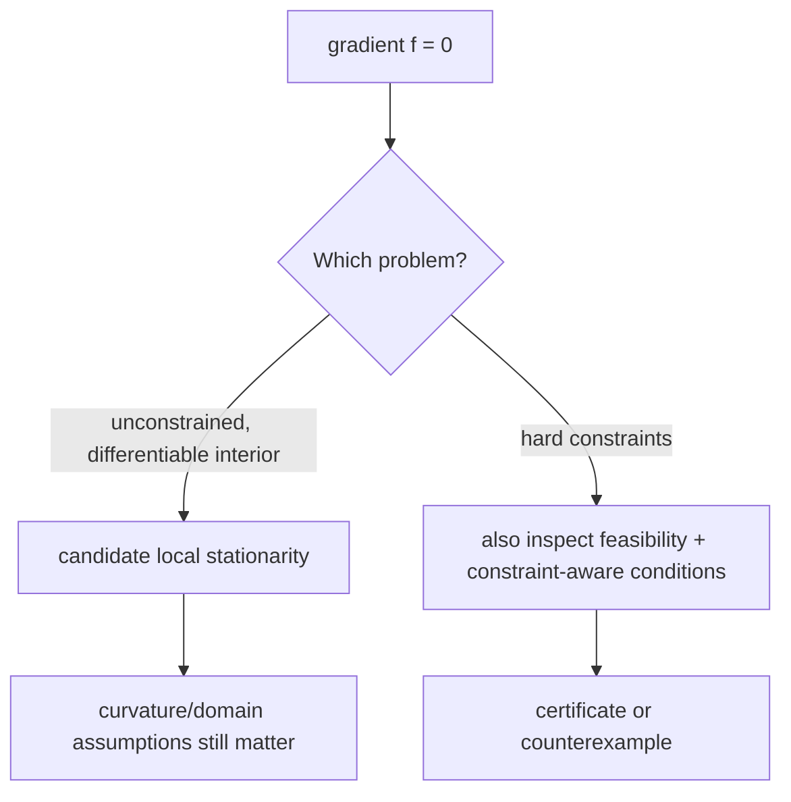

# M31 candidate workbook — Optimization & Information

**Authoring-only private study pack.** This is a complete draft for
instructor-led study in the designated Codex chats. It is intentionally outside
`content/modules` and the reader manifest; private study does not open a portal
route, grant Core credit, or establish publication, review, release, or mastery
evidence.

**Knowledge arc:** Mathematical foundations → systems/AI reasoning

**Prerequisites:** M28 linear algebra and numerical stability; M29 calculus,
real analysis, and continuous change; M30 probability, statistics, and
scientific inference.

**Primary outcome:** Given a decision or scientific claim, you can distinguish
the stated objective from the real goal; define variables, units, feasible
set, uncertainty model, and authority boundary; read a finite algorithm trace
without overstating it; reconstruct a small dual/KKT or information argument;
and prepare an evidence record that says what a result does *not* establish.

This is not a six-session claim of mastery of all convex analysis, nonlinear
programming, control, information theory, variational inference, or modern
optimizer research. It is an advanced first-principles foundation for reading,
debugging, reviewing, and directing such work.

---

## How this module stays connected

### The working invariant

> **An optimization or information claim is credible only when its owner,
> objective, variables, units, feasible set, probability model, algorithm,
> finite evidence, assumptions, and non-claim are visible.**

The recurrence is deliberate: formulation creates the object; geometry says
which mathematical moves are available; constraints add certificates;
algorithms produce bounded computational evidence; stochasticity and
information expose a new trade-off; the final dossier reconnects every layer.

```mermaid
%% atlas-diagram-id: m31-connected-evidence-route
%% atlas-diagram-title: The M31 optimization and information evidence route
%% atlas-diagram-alt: A decision owner defines variables, units, objectives, and constraints before assumptions support a certificate or counterexample; a finite algorithm trace and information trade-off then lead only to a limited recommendation and evidence dossier.
flowchart LR
  Q["Question and decision owner"] --> F["Variables, units, objective, constraints"]
  F --> G["Geometry and assumptions"]
  G --> C["Certificate or counterexample"]
  C --> A["Algorithm and finite trace"]
  A --> I["Stochastic or information trade-off"]
  I --> R["Limited recommendation + evidence dossier"]
```



**Text alternative:** A decision owner first states a question. That question
is translated into variables, units, an objective, and hard constraints. Only
then do geometric assumptions permit a certificate or reveal a counterexample.
An algorithm computes a finite trace; stochastic or information analysis makes
another uncertainty/trade-off visible. The result is a limited recommendation,
not an automatic decision.

### Evidence labels

| Label | It can establish | It cannot establish |
| --- | --- | --- |
| **[DEFINITION / MODEL]** | The declared objective, feasible set, probability distribution, entropy, KL, or update rule. | That it represents the right real-world goal. |
| **[DERIVATION / PROOF]** | A conclusion under named assumptions and a stated domain. | That a finite program, data set, or deployment meets those assumptions. |
| **[FINITE TRACE]** | What this fixture, seed, tolerance, representation, and update rule produced. | A universal rate, robustness claim, or social decision. |
| **[LIBRARY / TOOL CONTRACT]** | A documented interface and configured behavior. | The validity of the mathematical formulation or evidence interpretation. |
| **[AI PROPOSAL]** | A candidate derivation, experiment, or code review. | Correctness, authority, source validity, or a reason to skip inspection. |

### Core evidence card

Keep this card beside every calculation. It is intentionally more useful than
a generic “optimizer succeeded” message.

```text
Question and decision owner:
Variables, units, domain, objective, and hard constraints:
What the objective is a proxy for / what it leaves out:
Probability model or data-generating assumption, if any:
Mathematical category and theorem/heuristic label:
Algorithm, initialization, derivative/oracle, and stopping rule:
Fixture/data identity, seed, dtype/shapes/version/environment:
Observed trace, residuals, certificates, and independent checks:
Assumptions, counterexamples, uncertainty, and non-claim:
Limited next action and who may decide it:
```

---

## Prerequisite retrieval

Before Session 1, answer without notes. These are directions for repair, not
grades.

1. For a quadratic objective, what do its gradient and Hessian say locally?
   Why can poor conditioning change an iterative computation without changing
   the mathematical minimizer?
2. Give a stationary-point counterexample. Which regularity or domain
   condition would be needed before a derivative-based conclusion is valid?
3. Contrast a full gradient with a mini-batch gradient estimate. What does a
   favorable finite run fail to prove?

If 1 is fragile, bridge through M28. If 2 is fragile, bridge through M29. If
3 is fragile, bridge through M30. Do not start by choosing a library.

---

## Session 1 — Formulate before you optimize

### Core question

**What exactly are we allowed to optimize?**

Consider a fictional, non-consequential allocation problem. A study team has a
fixed time budget and wants to choose two preparation activities `x` and `y`.
The first objective they write is

\[
f(x,y) = (x-2)^2 + (y-1)^2.
\]

This is a *mathematical object*, not the team’s actual goal. A real question
still needs units, an owner, an explanation of why distance from `(2, 1)` is a
meaningful loss, and any hard limits that the squared distance misses.

### Build the object in this order

1. **Variables and units.** `x` and `y` are not merely numbers. Here they are
   normalized preparation units; changing the normalization changes curvature
   and step-size meaning.
2. **Objective direction.** Minimization asks for a least-cost/least-loss
   candidate. Maximization is not “the same” until signs and constraint
   interpretation are changed deliberately.
3. **Feasible set.** Add the hard budget
   \[
   g(x,y)=x+y-1\leq 0.
   \]
   A penalty for breaking it is a different problem unless the relationship is
   justified.
4. **Authority boundary.** Even a correctly solved toy formulation cannot
   decide whose time matters or authorize an intervention.

### Prediction before reveal

The unconstrained minimizer is `(2, 1)`. Predict whether it is feasible under
`x + y <= 1`, and predict whether a zero ordinary gradient is enough to
certify the constrained answer.

**Reveal:** `(2, 1)` violates the hard constraint by `2`. Its ordinary
gradient is zero, but feasibility is false. A constraint changes the reasoning
problem, not merely the visualization.

### Read the model, do not rewrite it

```python
def objective(x, y):
    return (x - 2) ** 2 + (y - 1) ** 2

def constraint_residual(x, y):
    return x + y - 1  # feasible exactly when this is <= 0
```

Trace the following claims separately:

| Observation | Valid reading | Invalid shortcut |
| --- | --- | --- |
| `objective(2, 1) == 0` | The declared unconstrained objective is minimized there. | The constrained or real decision problem is solved. |
| `constraint_residual(2, 1) == 2` | The point violates this one hard constraint. | The entire formulation is useless. |
| `constraint_residual(1, 0) == 0` | This point lies on the stated boundary. | It is globally optimal without more reasoning. |

### Debugging probe

A teammate writes `return max(0, x + y - 1)` and calls it “the constraint.”
What has been lost? The sign. A residual of `-0.4` says *how far inside* the
feasible set a point lies; the clipped violation does not. Keep both when
reading a constrained trace.

### Output: Objective Geometry Sheet

Write an **Objective–Geometry Sheet** for one non-consequential decision:

- owner and decision that remains human-controlled;
- variables, units, domain, objective, and hard/soft constraints;
- one omitted value or failure mode;
- one rescaling or representation change that could mislead a solver trace.

Use the core evidence card. Save the sentence beginning “This objective does
not establish …”; it will reappear in the final dossier.

---

## Session 2 — Local equations are not global decisions

### Core question

**When does a derivative-based local statement become meaningful?**

For the Session 1 objective,

\[
\nabla f(x,y) = \begin{bmatrix}2(x-2)\\2(y-1)\end{bmatrix},
\qquad
\nabla^2 f(x,y)=\begin{bmatrix}2&0\\0&2\end{bmatrix}.
\]

The Hessian is positive definite, so the *unconstrained* quadratic has a
unique global minimizer. That conclusion uses the full domain `R^2` and this
particular objective. It does not ignore the feasible set.

### A counterexample worth remembering

At `(2, 1)`, the ordinary gradient is zero. Yet the point is infeasible.
At `(1, 0)`, the point is feasible and ultimately becomes the constrained
minimum, yet its ordinary objective gradient is `(-2, -2)`, not zero.



**Text alternative:** A zero gradient is only a candidate local-stationarity
statement for an unconstrained differentiable problem. With hard constraints,
feasibility and constraint-aware conditions are additionally required. In both
cases, curvature and domain assumptions determine what follows.

### Prediction before reveal

Use the central finite-difference idea

\[
\frac{f(x+h,y)-f(x-h,y)}{2h}
\]

at `(1.25, -0.5)`. Predict whether reducing `h` forever makes the check more
trustworthy.

**Reveal:** no. Truncation error decreases at first, but cancellation and
finite representation can dominate for tiny `h`. A finite difference is an
independent probe, not a proof that the implemented function, autodiff graph,
or formulation is correct.

### Code-reading task

```python
analytic = (2 * (x - 2), 2 * (y - 1))
numeric_x = (f(x + h, y) - f(x - h, y)) / (2 * h)
```

State four distinct claims:

1. the displayed formula is the analytic derivative of the displayed
   objective;
2. the finite difference approximates that derivative at a chosen `h`;
3. both computations were evaluated in a named representation;
4. neither computation validates the proxy objective or downstream decision.

### Output: Stationarity and Feasibility Ledger

Build a **Stationarity–Feasibility Ledger** with three rows: a local minimum,
a saddle/non-minimum example, and a constrained boundary candidate. Each row
must show domain, gradient, curvature or counterexample, feasibility, and what
you are *not* claiming.

---

## Session 3 — Constraints become certificates only under conditions

### Core question

**What would make a constrained claim inspectable rather than ceremonial?**

For the convention `g(x,y) <= 0`, use

\[
L(x,y,\lambda)=f(x,y)+\lambda g(x,y), \quad \lambda\geq0.
\]

The KKT checklist for this tiny smooth convex example is:

\[
\begin{aligned}
g(x,y) &\leq 0 &&\text{(primal feasibility)}\\
\lambda &\geq0 &&\text{(dual feasibility)}\\
\nabla f(x,y)+\lambda\nabla g(x,y)&=0 &&\text{(stationarity)}\\
\lambda g(x,y)&=0 &&\text{(complementary slackness).}
\end{aligned}
\]

At `(1, 0)` with `lambda=2`, every displayed condition holds for this
fixture. Slater’s condition is easy to see because `(0,0)` is strictly
feasible. That supports the specific certificate; it is not permission to
announce that “multipliers solve constrained problems.”

### Prediction before reveal

At `(1,0)`, predict which KKT condition fails if `lambda=-2`. Then predict
what fails if `lambda=0`.

**Reveal:** `lambda=-2` violates dual feasibility and stationarity. With
`lambda=0`, primal and dual feasibility hold but stationarity fails. A useful
checker returns every failed condition rather than only `false`.

### Certificate-reading table

| Field | Why it matters | Common overclaim |
| --- | --- | --- |
| constraint sign convention | Determines the multiplier sign and Lagrangian. | “The signs are cosmetic.” |
| primal residual | Distinguishes a feasible point from a near-looking point. | “Small objective means feasible.” |
| dual residual / multiplier | Makes the dual claim inspectable. | “Any multiplier is a shadow price.” |
| complementary slackness | Connects active constraints with multipliers. | “A zero product proves all KKT conditions.” |
| qualification | States why a dual/certificate conclusion applies. | “Convexity alone always gives strong duality.” |

### Output: Constraint Claim Table

Create a **Claim Table** for one constrained problem. It must label each line
as definition, derivation, numerical observation, or assumption; include a
missing-qualification counterexample; and make an explicit distinction between
a dual bound and a business/ethical decision.

---

## Session 4 — Read stopping evidence, not solver mythology

### Core question

**What does one algorithm’s trace actually show?**

For the same fixture, projected gradient descent uses a deliberately visible
update:

\[
z_{t+1}=\Pi_{x+y\leq1}\left(z_t-\eta\nabla f(z_t)\right).
\]

`Pi` is a projection onto the named half-space. It is not an implicit call to
a general solver. A trace needs the initial point, `eta`, number of updates,
projection rule, objective, gradient norm, constraint residual, and an
independent check.

### Read this record

```text
initial point: (0, 0), feasible
step size: 0.25
unprojected candidate after first step: (1, 0.5)
projected point: (0.75, 0.25)
constraint residual after projection: 0
```

Why did the projection occur? The raw candidate has `x+y-1 = 0.5`. The
projection corrects the *declared* hard constraint. A lower objective after a
few steps is finite evidence for this fixture/configuration, not a statement
about every initial point, step size, precision, or constrained objective.

### Prediction before reveal

Before running any trace, predict which of these would be sufficient to claim
constrained optimality: objective decrease; a small ordinary gradient; a
feasible last point; or a verified certificate under named conditions.

**Reveal:** only the fourth can support that claim here. The other observations
are useful diagnostics, each with a narrower scope.

### Code-reading/debugging task

```python
raw = point - step_size * gradient(point)
if raw.x + raw.y <= 1:
    next_point = raw
else:
    correction = (raw.x + raw.y - 1) / 2
    next_point = (raw.x - correction, raw.y - correction)
```

Find two bugs before executing it:

- changing `<=` to `<` changes only a boundary branch but can silently alter
  a trace/invariant;
- subtracting the entire residual from both coordinates over-projects and
  changes the declared projection rule.

### Output: Solver-Selection Rationale

Write a **Solver-Selection Rationale** for a small problem. Name the objective
class, constraints, derivative/oracle source, representation, tolerance,
stopping metric, condition warning, and independent validation. Then write one
sentence beginning “A success/status flag would not establish …”.

---

## Session 5 — Noise is evidence, not a nuisance to hide

### Core question

**What changes when an update uses an estimate rather than a full gradient?**

For the scalar teaching fixture

\[
r(\theta)=(\theta-1)^2, \qquad \nabla r(\theta)=2(\theta-1),
\]

use a visible estimate `gradient_estimate = full_gradient + declared_noise`.
The fixed noise sequence `[-1.5, 1.5, -0.5, 0.5]` has mean zero as a *four-row
fixture*. It is not itself a probability model or a proof of unbiased
mini-batches.

### Prediction before reveal

At `theta=0`, the full gradient is `-2`. With first declared noise `-1.5`, is
the first update smaller, larger, or equal in magnitude to the full-gradient
update for a positive step size?

**Reveal:** the estimate is `-3.5`, so its first movement is larger. The mean
of a fixed four-row list does not tell you variance, distribution, dependence,
batching behavior, or finite-time usefulness.

### Experiment card

| Field | Record it | Do not silently infer |
| --- | --- | --- |
| target and objective | fixed scalar target and loss | real training value |
| noise fixture / seed label | every displayed noise value | random sampling law |
| step size and iteration budget | exact update configuration | optimal hyperparameters |
| full and estimated gradient | estimator difference per row | convergence theorem |
| final objective | observed finite result | population/generalization claim |

### Debugging task

A notebook averages all last five losses, then chooses the best seed and calls
the result “stable convergence.” List the hidden choices: horizon, loss scale,
seed policy, selection rule, comparison baseline, and criterion. Repair the
record so a reviewer can reproduce the *claim*, not merely the code output.

### Output: Stochastic Information Experiment Card

Make a **Stochastic–Information Experiment Card**. It must include the
sampling/fixture rule, full/estimated quantity, a variation display, stopping
rule, one counterexample to one-run reasoning, and a forward link to M30’s
uncertainty vocabulary and M32’s reproducibility fields.

---

## Session 6 — Information is a declared trade-off

### Core question

**What is being compared, under which support and units?**

For finite categorical distributions `p` and `q`, in natural-log units,

\[
H(p)=-\sum_i p_i\log p_i,
\quad
H(p,q)=-\sum_i p_i\log q_i,
\quad
D_{KL}(p\Vert q)=H(p,q)-H(p).
\]

Every term needs declared support. If `p_i > 0` and `q_i = 0`, the KL term is
not a harmless missing-value case; the support assumption has failed.

### Prediction before reveal

Let `p=(0.5,0.5)` and `q=(0.75,0.25)`. Predict whether
`D_KL(p || q)` is negative, zero, or positive. Then say why a lower
cross-entropy on a fixture does not automatically mean a better deployed
system.

**Reveal:** KL is positive for the unequal distributions. It quantifies a
mathematical discrepancy under the declared `p`, `q`, support, and log base.
It does not choose privacy, fairness, human utility, or a model class.

### From likelihood to variational language

An objective such as an ELBO is useful because it specifies a relationship
between a model, an approximation family, a probability law, and an
optimization target. Optimizing it does not mean exact posterior inference,
calibration, correct model specification, or safe use. Keep these statements
separate:

```text
definition: what the objective equals under its model;
derivation: which bound/identity follows under named conditions;
finite trace: what a particular implementation optimized;
non-claim: what remains unknown about data, approximation, and decision value.
```

### Output: Optimization and Information Evidence Dossier

Choose a bounded, non-consequential toy system. Deliver:

1. an owner-aware objective/constraint/units card;
2. one gradient/curvature or stationarity derivation and a counterexample;
3. a feasible/certificate or explicit “certificate unavailable” record;
4. a finite algorithm trace with configuration and independent check;
5. a stochastic or information card with support/uncertainty boundaries;
6. a limited recommendation, explicit non-claim, and forward handoff.

### Required evidence

Keep the objective/constraint/units card, one named mathematical assumption,
one smallest counterexample, one finite trace with configuration, one
independent check or explicit reason it is unavailable, an information/support
boundary, and a limited next action. This is an evidence dossier—not a score or
permission to make a consequential decision.

### Acceptance rubric

| Evidence | Strong evidence looks like | Repair prompt |
| --- | --- | --- |
| formulation | variables, units, feasible set, proxy gap, and owner are visible | “What did your objective silently leave out?” |
| mathematics | assumptions and conclusion are separated; counterexample is real | “Which condition made your inference legal?” |
| computation | trace includes config, residuals, representation, and independent probe | “What changed if a new run disagrees?” |
| information | support, direction, units, and interpretation are named | “Which distribution or utility did you assume?” |
| transfer | recommendation is limited and handoff is concrete | “Who may make the next decision, and with what evidence?” |

---

## Confidence-aware diagnostic and spaced review

For each question, choose an answer and record confidence **before** revealing
the explanation. Low confidence is useful evidence for a review queue; it is
not a failure label.

1. A point has zero ordinary gradient but violates a hard inequality. What
   follows?
   - A. It is a constrained optimum.
   - B. It is an unconstrained stationary point; feasibility/certificate work
     remains.
   - C. The objective is necessarily nonconvex.
   - D. The constraint can be ignored after a solver runs.

   **Answer: B.** Misconception repaired: ordinary stationarity and constrained
   feasibility are different statements.

2. A projected-gradient trace decreases the objective for six iterations.
   What is the strongest supported statement?
   - A. The method converges for every step size.
   - B. The toy problem is globally solved.
   - C. This configuration produced six bounded observations; inspect residuals,
     projection, and assumptions.
   - D. Projection proves the proxy objective is valid.

   **Answer: C.** Misconception repaired: a finite trace is not a theorem or a
   value judgment.

3. For `p_i > 0`, `q_i = 0`, what should a finite KL checker do?
   - A. Treat the term as zero.
   - B. Repair the support mismatch explicitly rather than hiding it.
   - C. Replace it automatically with a different log base.
   - D. Conclude that `q` is more informative.

   **Answer: B.** Misconception repaired: support is an assumption, not an
   implementation detail.

### Misconception repair key

When an answer is fragile, repair the narrowest confusion first: ordinary
stationarity is not constrained feasibility; a finite trace is not a
convergence theorem; and a support mismatch is not a harmless numerical
detail. Then change one premise and make a new prediction before rereading the
explanation.

**Review schedule:** retrieve the invariant and one counterexample after 1,
3, 7, 14, and 30 days. On days 7 and 30, change one premise: a nonconvex
objective, a violated qualification, dependent gradients, or a support
mismatch. Update—not erase—the earlier evidence card.

---

## Supportive oral defense and live learning handoff

The Teaching Assistant conducts this after the dossier. It is a constructive
conversation, never a rigid pass/fail exam. The learner may ask for a hint,
pause, write instead of speak, or correct the evidence summary.

### Teaching Assistant prompt — M31

```text
You are Atlas Academy's M31 Teaching Assistant. Start from the learner's
objective/constraint/evidence card, not a quiz score. Ask them to explain one
formulation choice, one assumption behind a local or dual claim, one trace
field, and one non-claim. Ask for a prediction before revealing a correction.
Use readable displayed equations when useful; define every symbol and add a
short prose or ASCII fallback. Show code in labelled Python fences. When a
claim is fragile, offer a hint ladder and a small counterexample before a
direct answer. End with a learner-controlled evidence summary: what was
defended, repaired, still uncertain, and the next retrieval or handoff step.
Do not grade, claim platform voice settings, or store a raw transcript.
```

### Hint ladder and counterexample

1. Ask the learner to name the objective, hard constraint, and one quantity
   actually observed.
2. Change only one premise—such as feasibility, a qualification, step size,
   support, or utility—and ask for a prediction.
3. If needed, compare the infeasible zero-gradient point with the feasible
   boundary point before offering a direct correction.
4. Let the learner restate the narrowest defensible claim and its non-claim in
   their own words.

### Study Partner prompt — M31

```text
You are Atlas Academy's M31 Study Partner. Lead a non-grading live discussion
or text rehearsal about optimization and information. Use the visible chat as
an accessible whiteboard: define notation, render equations when supported,
include prose/ASCII fallbacks, use labelled Python fences, and make each
trace/table readable after the call. Invite the learner to change one premise
(constraint, step size, noise rule, support, or utility) and predict the
consequence. Help them inspect an AI-generated derivation or solver claim,
but never treat it as authority. End with a concise TA handoff: strongest
insight, unresolved misconception, evidence artifact, and next question.
```

### Learner-controlled evidence summary

End with a small learner-controlled card: **defended claim**, **repaired
assumption or misconception**, **evidence inspected**, **remaining
uncertainty**, and **next retrieval or handoff**. The learner may correct,
decline to save, or keep this summary locally; it is not an exam result,
transcript, or automatic Notion record.

### Forward handoff

The durable M31 artifact is an **objective/constraint/convergence claim sheet
with experiment conditions and known limits**. In the private guided route, the
next academic continuation is **M18**, which applies its ownership and evidence
discipline to operating-system resource mediation. The
[M32 authoring workbook](m32_systems_languages_scientific_python_accelerators_workbook.v1.md)
comes later, after M18–M24, and consumes representation, dtype/shape, seed,
profiling, and solver-configuration fields. That later M31→M32 connection is
an authoring-to-authoring handoff, not portal navigation or evidence that
either module is released. M34–M36 consume the distinction between optimizing
an objective and supporting a decision or generalization claim. M25/M26 remain
reader-visible reference previews; their synthesis/capstone work is
Core-credit-gated until their own contract and release evidence are complete.

---

## Source and reuse boundary

Use the instructor-facing [M31 source map](../source-maps/module31_optimization_information_source_map.md)
and [source audit](../source-maps/module31_optimization_information_source_audit.md)
for claim-linked university/primary sources, access dates, licenses, and reuse
decisions. This workbook’s explanations, examples, diagrams, tables, and code
are original Atlas material. It links to sources for study and provenance; it
does not reproduce their slides, textbook prose, assignments, figures, or
solutions.

## Candidate release boundary

Before this draft can move into the released portal learner route, it still needs the versioned
review-ready delivery map, full source/claim/accessibility review, a bounded
interactive implementation or equivalent interaction, learner-facing
diagnostic/review record, module evidence and review records, exact candidate
CI evidence, deployment provenance, and human approval. Until then it remains
an authoring artifact—not a completed module or a learner mastery claim.
