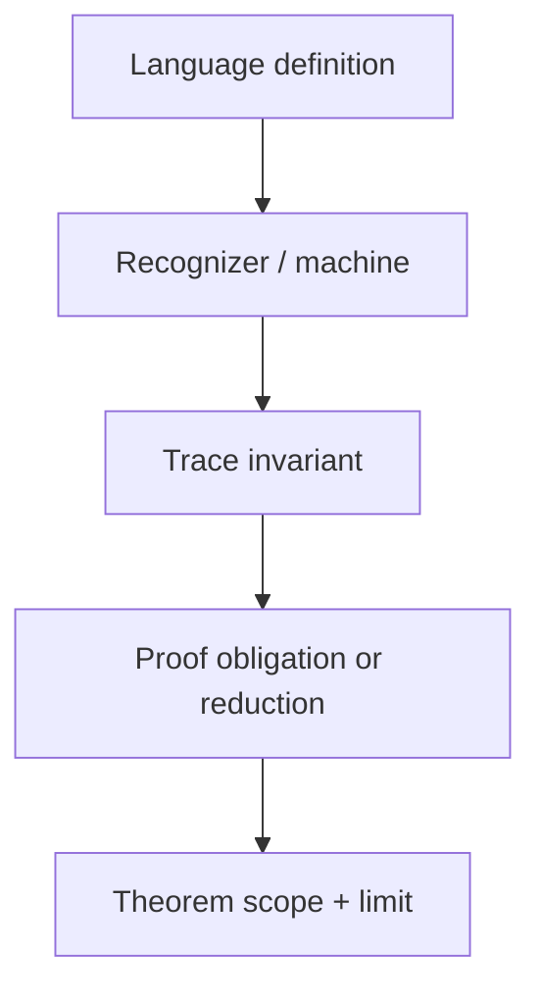

# M33 candidate workbook — Formal Languages, Computability & Complexity

**Authoring-only private study pack.** This is a complete draft for
instructor-led study in the designated Codex chats. It intentionally lives
outside the portal reader route; private study does not change the course
graph, availability, prerequisite policy, source-map binding, release state,
publication claim, or Core credit.

**Knowledge arc:** systems, languages, and AI-era reasoning

**Academic prerequisites:** M05 cost models and algorithm analysis; M11
algorithms and reductions; M23 programming languages and bounded evaluation;
M27 discrete mathematics, logic, and proof.

**Primary outcome:** You can read a claim about syntax, computation, or
complexity and reconstruct its exact object, machine/question, quantifiers,
resource model, proof obligation, counterexample, and practical non-claim.
You will be able to inspect an AI-generated explanation or a small recognizer
trace critically rather than accepting a label such as “regular,”
“undecidable,” or “NP-complete” on authority.

This is not a six-session promise to master every automata theorem, proof
system, programming-language semantics, or open problem in complexity theory.
It is a rigorous foundation for reading, debugging, and directing formal
reasoning.

---

## How this module stays connected

### The working invariant

> A formal conclusion is credible only when its **object**, **machine or
> question**, **quantifiers**, **resource model**, **argument**, and
> **boundary** are visible.

~~~mermaid
%% atlas-diagram-id: m33-formal-claim-route
%% atlas-diagram-title: The M33 route from strings to bounded conclusions
%% atlas-diagram-alt: A finite alphabet forms strings. A named language, grammar, or machine gives a formal object. A precisely stated question and proof obligation lead to a resource claim or limit, followed by a practical non-claim rather than automatic authority.
flowchart LR
  A["Alphabet and finite strings"] --> B["Language, grammar, or recognizer"]
  B --> C["Machine model and decision question"]
  C --> D["Witness, invariant, reduction, or diagonal argument"]
  D --> E["Resource or decidability conclusion"]
  E --> F["Practical boundary and next question"]
~~~

**Text alternative:** First name the finite strings under discussion. Then say
whether a grammar generates them, a recognizer classifies them, or a machine
answers a particular question. A proof requires a witness, construction,
invariant, reduction, or contradiction under named assumptions. A resource or
limit conclusion still does not decide whether a particular implementation is
useful, safe, authorized, or fast on one instance.

| Earlier learning | M33 reuses it for | M33 adds |
| --- | --- | --- |
| M05 | input size, cost models, asymptotic language, and the difference between an observed trace and a theorem | a complexity-claim card that names the encoding and practical non-claim |
| M11 | invariants, exhaustive search, reductions, and correctness obligations | a directed reduction proof skeleton |
| M23 | syntax, parsing, evaluation, environment, and authority boundaries | a language–machine separation sheet |
| M27 | quantifiers, countermodels, induction, and proof writing | a formal-claim ledger with a witness or counterexample |

### Claim/source labels

Compact labels such as `M33-C01 -> S33-01, S33-03` point to the exact claim
and source route in the [M33 primary-source research
map](../source-maps/module33_formal_languages_computability_complexity_source_research.md).
They are navigation aids, not borrowed proof text: the named encoding,
quantifiers, counterexample, and non-claim control the conclusion.

### Core evidence card

Keep this small card beside every claim. It prevents a theorem name from
replacing an argument.

~~~text
Claim type: membership / regularity / decidability / reduction / complexity
Alphabet, encoding, and formal language or problem:
Grammar, recognizer, machine, or verifier model:
Question and quantifiers: which inputs and which outcomes?
Resource convention: time, space, reduction type, and input measure:
Argument shape: construction, invariant, witness, reduction, or contradiction:
Smallest counterexample or nearby false claim:
What this conclusion does not predict about code, an instance, or authority:
Forward use:
~~~

---

## Prerequisite retrieval

Answer without notes, then repair the smallest missing link. These are not
grades.

1. Give an invariant that distinguishes a finite test run from a proof about
   all inputs.
2. In a reduction from problem A to problem B, which direction lets a solver
   for B solve A? Why?
3. Why are parsing a program, evaluating a program, and authorizing a program
   three different operations?

If 1 is fragile, revisit M27. If 2 is fragile, revisit M11. If 3 is fragile,
revisit M23. If your cost argument names neither input measure nor machine,
revisit M05 before Session 5.

---

## Session 1 — Languages are objects; syntax is not authority

**Launch:** With the Study Partner, name the alphabet, language, grammar or machine, and question; identify which parts are syntax and which are semantic claims.

### Core question

**What exactly is being classified before we ask whether it can be computed?**

**Claim/source trace:** `M33-C01, M33-C04 -> S33-01, S33-03` — formal
language, grammar, machine, and semantic questions must remain distinct.

Let \(\Sigma\) be a finite alphabet. The notation \(\Sigma^*\) means all
finite strings over that alphabet, including the empty string
\(\epsilon\). A formal language is simply a set
\(L \subseteq \Sigma^*\). It is not a user interface, an interpreter, a
safety policy, or a statement that some text is true.

For example, over \(\Sigma=\{0,1\}\), let

\[
L_{\mathrm{ordered}}=\{0^i1^j \mid i,j\geq0\}.
\]

It contains the empty string, 000, 111, and 0011; it excludes 010. A grammar
is a different formal object. A CFG is the tuple \(G=(V,\Sigma,R,S)\):
variables \(V\), terminals \(\Sigma\), productions \(R\), and start variable
\(S\). One grammar for balanced parentheses is

\[
S \rightarrow (S)S \mid \epsilon.
\]

For that example, an explicit object is

\[
G_{\mathrm{paren}}=(\{S\},\{\texttt{(},\texttt{)}\},
\{S\rightarrow\texttt{(}S\texttt{)}S\mid\epsilon\},S).
\]

The grammar says which strings can be derived. It says nothing yet about what
a string means after parsing.

### Formal-model ladder — choose the smallest proven scope

Before seeing the ladder, classify these three language claims: `0*1*`,
balanced parentheses, and \(L_{=}={0^n1^n\mid n\geq0}\). Which can be
described with finite state alone, and which need a nesting/counting relation?

<details>
<summary>Reveal after making a model prediction.</summary>

| Formal object | What it can retain or express | Exact scope and boundary |
| --- | --- | --- |
| DFA | one declared finite state after each symbol | recognizes regular languages |
| NFA | finitely many possible branches; a deterministic simulation can track a finite subset | recognizes exactly the regular languages too—not a larger language class than a DFA |
| ordinary formal regular expression | union, concatenation, and Kleene star as a finite notation | denotes exactly a regular language; a production “regex” engine may add non-formal extensions, so its name alone proves nothing |
| context-free grammar (CFG) | productions such as \(S\rightarrow(S)S\mid\epsilon\), which can express recursive nesting | defines a context-free language; it does not by itself define evaluation, policy, or authority |

Every regular language is context-free, but \(L_{=}\) is context-free and not
regular. This is a relation between language classes, not a promise that a
particular parser implementation is correct or that every real-language feature
fits a CFG.

</details>

### Constructive witness — a CFG for \(L_=\)

The grammar

\[
S \rightarrow 0S1 \mid \epsilon
\]

generates the equal-count language: for example,
\(S \Rightarrow 0S1 \Rightarrow 00S11 \Rightarrow 0011\). Each recursive
step adds one `0` on the left and one `1` on the right; the base case ends the
string. This is a constructive witness that \(L_=\) is context-free. The
later distinguishability argument answers the separate question of why no
finite-state recognizer can recognize it.

### Tiny derivation trace — syntax before meaning

For the balanced-parentheses grammar above, derive `()()` without skipping the
remaining nonterminal:

\[
S \Rightarrow (S)S \Rightarrow ()S \Rightarrow ()(S)S
  \Rightarrow ()()S \Rightarrow ()().
\]

**Text/tree reading:** the root \(S\) creates one matched pair and a trailing
\(S\); that trailing \(S\) creates the second pair. This is a witness that this
one string is derivable under this one grammar. It does not establish a semantic
result, safe evaluation, or authority to act.

### Stack trace — why nested structure is not finite-state

The same balanced-parentheses language has an operational reading. Scan from
left to right: **push `(`** for each opening parenthesis, pop one `(` for each
closing parenthesis, reject an attempted pop from an empty stack, and **accept
only when the stack is empty** at the end. For `(()())`, the stack heights are

\[
0\to1\to2\to1\to2\to1\to0.
\]

### PDA configuration trace — make the stack state explicit

The same scan can be written as a compact pushdown-automaton-style
configuration \((q_{\mathrm{scan}},u,\gamma)\): finite control state,
unread suffix (u), and stack \(\gamma\), with the top written at the left
and \(\bot\) as the bottom marker. For the original input `(()())`, the
finite control does not change in this teaching trace; only the unread suffix
and stack do.

| Consumed prefix | Configuration after the prefix | Why it changes |
| --- | --- | --- |
| \(\epsilon\) | \((q_{\mathrm{scan}},\texttt{(()())},\bot)\) | start with no unmatched open parenthesis |
| `(` | \((q_{\mathrm{scan}},\texttt{()())},\texttt{(}\bot)\) | push one open parenthesis |
| `((` | \((q_{\mathrm{scan}},\texttt{)())},\texttt{((}\bot)\) | push another open parenthesis |
| `(()` | \((q_{\mathrm{scan}},\texttt{())},\texttt{(}\bot)\) | close matches the top open parenthesis |
| `(()(` | \((q_{\mathrm{scan}},\texttt{))},\texttt{((}\bot)\) | push for the new nested pair |
| `(()()` | \((q_{\mathrm{scan}},\texttt{)},\texttt{(}\bot)\) | close that nested pair |
| `(()())` | \((q_{\mathrm{scan}},\epsilon,\bot)\) | input and pending nesting are both empty |

In prose, the stack is \(\bot\), `(`\(\bot\), `((`\(\bot\), `(`\(\bot\),
`((`\(\bot\), `(`\(\bot\), then \(\bot\) again. This configuration trace
is an operational witness for this one stack discipline. It is not a full
formal PDA definition, a CFG–PDA equivalence proof, or a production parser.

**Predict before reveal.** Trace `())(`. At which symbol is the smallest
counterexample exposed: an unmatched close, an unmatched open, or a grammar
production with no semantics?

<details>
<summary>Reveal after tracing the stack yourself.</summary>

**Reveal:** the third symbol is an unmatched close: the stack is already empty
after `()`. A finite-state recognizer has only finitely many fixed summaries;
this stack can retain an unbounded pending-nesting depth. That is an
operational bridge to the CFG, not a proof of the full CFG–PDA equivalence and
not a production parser design.

</details>

### Chomsky hierarchy — grammar power is a declared ladder

The familiar grammar ladder is useful only when its machine and language
conventions are named:

**Claim/source trace:** M33-C04 → S33-03, S33-11, S33-12. The hierarchy is an
original compact comparison of the source routes, not a copied grammar table
or a claim about the implementation language used by a production parser.

| Level | Grammar/machine picture | Learner boundary |
| --- | --- | --- |
| Type 3 | regular grammar / DFA or NFA | finite state; no unbounded stack memory |
| Type 2 | context-free grammar / PDA | one stack can express nested structure |
| Type 1 | context-sensitive grammar / linear-bounded automaton | bounded tape proportional to the input |
| Type 0 | unrestricted grammar / Turing-machine recognizer | recursively enumerable languages; a recognizer may not halt on nonmembers |

Under the standard formal conventions, the inclusions are strict (with the
usual empty-string convention for context-sensitive grammars):

\[
\mathrm{REG}\subsetneq\mathrm{CFL}\subsetneq\mathrm{CSL}\subsetneq\mathrm{RE}.
\]

This is a statement about language classes and computational models. It is not
a ranking of parser libraries, a claim that a production language has exactly
one grammar class, or permission to infer semantics from syntax.

**Prediction:** balanced parentheses, equal numbers of `0` and `1`, and a
general program-termination property need which smallest memory models? Name
the model before naming the class.

<details>
<summary>Reveal after making the model prediction.</summary>

Balanced parentheses and `0^n1^n` fit the context-free/PDA level; a general
termination property is semantic and reaches the Turing-machine/undecidability
boundary. The hierarchy does not by itself prove a particular implementation
correct.

</details>

### Prediction before reveal

Two snippets both satisfy a toy assignment grammar:

~~~text
x = 2
x = 1 / 0
~~~

Before revealing any interpretation, label the claims that grammar membership
can support: “the token sequence has the required shape,” “the expression
will return a number,” “the action is allowed,” or “the program is safe.”

<details>
<summary>Reveal after writing your prediction.</summary>

**Reveal:** only the first claim follows from grammar membership. Evaluation
requires a semantic relation and an environment; authorization requires a
separate policy and accountable decision process.

</details>

### Read the recognizer, not its name

The following tiny function tries to classify strings in
\(L_{\mathrm{ordered}}\). Do not rewrite it yet. Trace the state after every
symbol.

~~~python
TRANSITIONS = {
    ("zeroes", "0"): "zeroes",
    ("zeroes", "1"): "ones",
    ("ones", "1"): "ones",
}

def ordered_bits(text: str) -> bool:
    state = "zeroes"
    for symbol in text:
        state = TRANSITIONS.get((state, symbol), "zeroes")
    return state in {"zeroes", "ones"}
~~~

Predict the result for 010. Then inspect the default branch.

<details>
<summary>Reveal after writing your prediction.</summary>

**Reveal:** the default silently returns to zeroes, so the function accepts
010. The bug is not an exotic theorem failure: an absent transition was
treated as a permissive recovery. A correct recognizer should reject an
unknown transition explicitly.

~~~python
def ordered_bits_checked(text: str) -> bool:
    state = "zeroes"
    for symbol in text:
        next_state = TRANSITIONS.get((state, symbol))
        if next_state is None:
            return False
        state = next_state
    return state in {"zeroes", "ones"}
~~~

This finite trace is useful debugging evidence. It does not prove that the
implementation and the mathematical language agree for every possible input.

</details>

### Code-to-spec proof sketch — a trace needs an invariant

Let \(L_{\mathrm{ordered}}=0^*1^*\), including the empty string. For the
**exact** `ordered_bits_checked` code and its displayed transition map, prove
the following loop invariant rather than relying on a handful of examples:

> After a prefix has been consumed without returning `False`, `state` is
> `"zeroes"` exactly when that prefix lies in \(0^*\), and `state` is `"ones"`
> exactly when it lies in \(0^*1^+\).

Start with the empty prefix in `"zeroes"`. Then audit one symbol at a time:

| Previous invariant case | Next symbol | Transition/result | Why the invariant is preserved or rejection is correct |
| --- | --- | --- | --- |
| \(0^*\) / `"zeroes"` | `0` | stay in `"zeroes"` | appending `0` stays in \(0^*\) |
| \(0^*\) / `"zeroes"` | `1` | move to `"ones"` | appending the first `1` enters \(0^*1^+\) |
| \(0^*1^+\) / `"ones"` | `1` | stay in `"ones"` | appending `1` stays in \(0^*1^+\) |
| either live state | any missing transition | return `False` | the extended prefix is not in \(0^*1^*\) under this alphabet |

**Prediction before proof.** Fill the fourth column for yourself before
reading the table. Then explain why a finite input is accepted exactly when
its completed prefix remains in one of the two live invariant cases. This is a
proof sketch for this finite-loop implementation, its `TRANSITIONS` object,
and the declared alphabet—not a proof about a renamed function, a future
tokenizer, Unicode normalization, or an arbitrary parser. Change one premise:
if an engineer adds an `"error"` recovery transition for an unexpected symbol,
which invariant clause and language definition must be revised together?

### Design inspection

Write three columns for a tiny language feature:

| Question | Example answer | Does it establish authority? |
| --- | --- | --- |
| syntax | Is x = 1 / 0 a well-formed assignment? | No |
| semantics | Does it evaluate in this environment? | No |
| policy | May this action run with these capabilities? | This is the authority question itself |

An AI agent can propose a parser or policy. You must ask which column its
claim belongs in.

### Output: Language–Machine Separation Sheet

Choose one small text format or toy language and record:

1. alphabet and tokenization;
2. language/grammar membership rule;
3. separate semantic question;
4. separate evaluation and authority boundary;
5. one malformed or syntactically valid-but-failing counterexample; and
6. a sentence beginning, “Parsing this text does not establish …”

**Transfer:** M34 will require the same separation when a planner input file
is accepted but the state/action model may still be incomplete.

---

## Session 2 — Finite state needs finite evidence

**Launch:** Before tracing a recognizer, predict what finite state can remember and name the proof obligation that would justify a universal limit.

### Core question

**What can a finite-state recognizer remember, and how do we prove a limit?**

**Claim/source trace:** `M33-C02–M33-C03 -> S33-01, S33-02` — a finite
machine model and a named proof obligation are stronger than finite testing.

A deterministic finite automaton (DFA) is

\[
D=(Q,\Sigma,\delta,q_0,F),
\]

where \(Q\) is a finite state set, \(\delta\) maps each state/symbol pair to a
next state, \(q_0\) is the start state, and \(F\) is the accepting set. The
extended transition function consumes one symbol at a time. A language is
regular if a DFA accepts exactly its members.

Consider a DFA for strings with an even number of 1 symbols. Its state means
“even count so far” or “odd count so far”; the state is a compressed summary
of the history relevant to this particular membership question.

| Input | Predicted state trace | Accept? |
| --- | --- | --- |
| \(\epsilon\) | even | yes |
| 1 | even → odd | no |
| 1011 | even → odd → odd → even → odd | no |
| 1010 | even → odd → odd → even → even | yes |

### Prediction before reveal

Suppose a teammate says: “I tested a ten-state DFA on 100 examples of
\(L_{=}=\{0^n1^n\mid n\geq0\}\), so the language is probably regular.”
Predict the one missing quantifier.

<details>
<summary>Reveal after writing your prediction.</summary>

**Reveal:** regularity is an existence claim about one finite machine that
works for **all** strings. A finite test suite provides observations about a
candidate implementation; it cannot settle the universal claim.

</details>

### NFA-to-DFA subset construction — track possible states

An NFA does not need a separate physical thread for each possible path. Its
mathematical transition on a prefix is a **set of possible states**. For this
original NFA over `0,1`, recognize strings ending in `01`:

| NFA state | on `0` | on `1` |
| --- | --- | --- |
| `q0` (start) | `{q0,q1}` | `{q0}` |
| `q1` | `∅` | `{q2}` |
| `q2` (accepting) | `∅` | `∅` |

The subset construction makes those sets the states of a DFA. From `{q0}`,
reading `0` reaches `{q0,q1}`; reading the next `1` reaches `{q0,q2}`. The
constructed DFA accepts exactly when its subset contains `q2`. Thus `01` and
`101` accept, while `010` returns to `{q0,q1}` and rejects.

<details>
<summary>Predict before revealing the construction trace.</summary>

Starting from `{q0}`, write the three reachable subset states for the empty
prefix, `0`, and `01`. Is the resulting construction evidence that an NFA
engine uses parallel hardware or that every real regular-expression engine has
the same semantics?

**Reveal:** the reachable states are `{q0}`, `{q0,q1}`, and `{q0,q2}`. This is
a finite mathematical simulation of this exact NFA; it is neither a
parallel-execution claim nor a claim about an extended production regex engine.

</details>

### Regex → NFA → DFA — one language, three representations

For the NFA just traced, the original **formal** regular expression

\[
(0\mid1)^*01
\]

denotes the same language, written in plain formal-regex notation as
`(0|1)*01`: binary strings ending in `01`. The expression is a finite notation;
the NFA makes possible branches explicit; subset construction makes a DFA state
out of the NFA's reachable-state set. Predict whether `101` and `010` are in
the language *before* repeating the NFA trace.

<details>
<summary>Reveal after writing both predictions.</summary>

**Reveal:** `101` ends in `01` and accepts; `010` does not and rejects. This
is a three-representation construction for one declared language. Its
formal-regex semantics do **not** establish the behavior, performance, or
security of a production regex engine with extensions, backreferences, or a
different matching convention.

</details>

### A distinguishability proof idea

For distinct nonnegative \(i\) and \(j\), compare prefixes \(0^i\) and
\(0^j\). The suffix \(1^i\) distinguishes them:

\[
0^i1^i \in L_{=}, \qquad 0^j1^i \notin L_{=} \quad (j\ne i).
\]

If a DFA reached the same state after \(0^i\) and \(0^j\), then every common
suffix would have the same result. But this suffix gives different results.
There are infinitely many pairwise distinguishable prefixes and only finitely
many DFA states, so no DFA recognizes \(L_{=}\).

This is a proof shape, not a slogan that “it needs memory.” Its assumptions
are a fixed finite alphabet, ordinary DFA semantics, and the stated language.

### Proof-debugging card — the pumping lemma's quantifier order

For a regular language \(L\), the pumping lemma says that there **exists** a
pumping length \(p\) such that for **every** sufficiently long
\(s\in L\), there **exists** a legal split \(s=xyz\), and for **every**
\(i\ge0\), the pumped string \(xy^iz\) remains in \(L\). To prove a language
nonregular by contradiction, your chosen string may depend on \(p\), but the
repair must handle **every legal decomposition** that satisfies

\[
|xy|\le p,\qquad |y|\ge1.
\]

For \(L_{=}\), choose \(s=0^p1^p\). Any legal \(y\) lies among the initial
zeroes, so pumping it down with \(i=0\) gives fewer zeroes than ones. The
single change is enough for each legal split.

**Debugging prompt:** an AI draft chooses one convenient split and declares
victory. Mark the missing universal quantifier, then repair the argument or
label it incomplete. This compact audit supplements—not replaces—the earlier
distinguishability proof.

### Debugging probe

An AI assistant offers this assertion:

~~~text
Because a stack can count unmatched zeroes, any language using counts is
nonregular.
~~~

Find the counterexample. The language “strings with an even number of zeroes”
uses a count but needs only parity, so it is regular. The proof question is
not whether a human description mentions counting; it is whether finitely
many machine states can preserve the needed distinction.

### Output: Formal-Claim Countermodel Ledger

Make a ledger for one language claim:

| Field | Your entry |
| --- | --- |
| language, alphabet, and membership rule | |
| proposed machine class | |
| witness family or construction | |
| exact distinguishing suffix / invariant | |
| nearby false claim and counterexample | |
| what finite traces can and cannot show | |

**Transfer:** In M34, a bounded search trace can expose an implementation
bug, but it cannot replace the stated conditions of a completeness or
optimality theorem.

### Bounded reference fixture — trace before claim

Use [`m33-formal-languages-reference-model.js`](../../lib/m33-formal-languages-reference-model.js) and its focused test as a
small code-reading exercise. Before calling `traceM33EvenOnesDfa("1010")`,
write the state trace and acceptance prediction. Then inspect the returned
trace: every state has a declared parity meaning, and the runner refuses
non-binary or over-long exercise input. This fixture checks one named DFA only;
it is neither a regularity proof nor an undecidability oracle.

---

## Session 3 — Grammar questions and semantic limits are different questions

**Launch:** State the input encoding, machine, acceptance or halting condition, and property before deciding whether the machine answers the intended question.

### Core question

**When does a machine answer the question we asked, and when does it only
answer a smaller syntactic question?**

**Claim/source trace:** `M33-C05–M33-C06 -> S33-01, S33-04, S33-14`; `M33-C07 ->
S33-01, S33-05` — acceptance, halting, semantic properties, and bounded
observation require different machine/question contracts.

A recognizer for a language accepts members, but on a nonmember it may reject
or run forever. A decider halts on every input and accepts exactly the
members. Those words matter whenever an observation is missing:

~~~text
“It did not return” might mean nonmembership, a bug, a resource limit,
or a recognizer that has not halted. It is not automatically a proof.
~~~

The balanced-parentheses grammar from Session 1 answers a syntactic membership
question. The question “does this program halt on its input?” is semantic: it
concerns behavior of an encoded machine/program under an execution model.

### Prediction before reveal

Read this **language-neutral pedagogical pseudocode, not runnable Python**.
It assumes a teaching-program interface with `initial_state`, `halted`, and
`step`; its purpose is to expose the finite observation boundary rather than
to prescribe a program API:

Declare \(c_0\) as the initial configuration and \(c_i\) as the configuration
after \(i\) calls to `step`. “Within `steps = k` transitions” inspects
\(c_0,c_1,\ldots,c_k\), not merely the configurations before those transitions.

~~~text
def run_for_at_most(program, input_value, steps):
    machine = program.initial_state(input_value)
    for _ in range(steps):
        if machine.halted:
            return "halted"
        machine = machine.step()
    return "halted" if machine.halted else "unknown"
~~~

**Predict before revealing.** Let \(c_0\) be nonhalting,
`step(c_0) = c_1`, and let \(c_1\) halt. With `steps = 1`, should this routine
report `halted` or `unknown`? Then ask: if it returns `unknown`, is the program
proved not to halt?

<details>
<summary>Reveal after writing your prediction.</summary>

**Reveal:** it reports `halted`: the post-loop check observes \(c_1\), the
configuration reached by the one permitted transition. In general, `unknown`
means no halting configuration was observed among \(c_0,\ldots,c_k\) under the
declared model. It gives a useful finite diagnostic, not a universal halting
decider or a proof that the program never halts.

</details>

### Encoding contract before diagonalization

Before a diagonal argument uses self-input, make its notation auditable:

| Encoded text | Declared convention | Why it matters |
| --- | --- | --- |
| \(\langle M\rangle\) | a valid finite description of one machine \(M\) | lets the construction identify a machine rather than arbitrary prose |
| \(\langle\langle M\rangle,w\rangle\) | a decodable pair of a machine description and an input string | tells \(H\) exactly which computation it is asked about |
| malformed text | a fixed explicit no-instance, not an unnamed machine/input pair | keeps the total-procedure convention visible |

**Predict before reveal.** Which row makes the self-application
\(D(\langle D\rangle)\) a defined case rather than a typography trick?

<details>
<summary>Reveal after naming the needed assumption.</summary>

**Reveal:** the first two rows together: \(D\) must have a valid effective
encoding, and that encoding must be usable as the declared input to \(D\).
The malformed-text convention handles a separate branch; it is not evidence
that arbitrary source text has a stable meaning.

</details>

### A halting-style diagonal boundary

Fix an effective machine encoding \(\langle M\rangle\) and paired encoding
\(\langle\langle M\rangle,w\rangle\). Assume, for contradiction, that a total
procedure \(H(\langle M\rangle,w)\) correctly says whether the encoded machine
\(M\) halts on input \(w\). Under this language convention, malformed strings
are explicit no-instances rather than unnamed machine/input pairs.

For a valid machine encoding \(x=\langle M_x\rangle\), construct \(D(x)\):

1. ask \(H(\langle M_x\rangle,x)\);
2. if it says “halts,” loop forever;
3. otherwise halt.

On a malformed \(x\), let \(D\) halt by this named convention; that branch is
not the self-application case. Because \(D\) has its own valid encoding
\(\langle D\rangle\), consider \(D(\langle D\rangle)\). It asks
\(H(\langle D\rangle,\langle D\rangle)\). If that call says “halts,” then
\(D(\langle D\rangle)\) loops. If it says “does not halt,” then
\(D(\langle D\rangle)\) halts. Either case contradicts the assumed total
correctness of \(H\).

The argument depends on a model able to encode and simulate the construction,
and on \(H\) being total and correct for all encoded pairs. It does not say
that a finite whitelist of known scripts cannot be checked, nor that a timeout
proves a result about arbitrary programs.

### Rice's theorem — state the semantic-property conditions

**Claim/source trace:** M33-C07 → S33-01, S33-05. The theorem card keeps the
encoded partial-computable-function assumptions visible before using the name.

**Rice's theorem (scope card):** for a nontrivial semantic property (P) of
the partial computable function or language recognized by an encoded program,
the set of program descriptions whose computed object has property (P) is
undecidable. “Nontrivial” means that at least one encoded program has the
property and at least one does not; “semantic” means the property depends on
what the program computes, not on its spelling.

The card has three obligations before the name is useful:

1. identify the effective program encoding and the computed object;
2. show that the property is semantic and nontrivial; and
3. state the undecidable set of descriptions being classified.

For example, “computes the empty language” is a semantic property under a
chosen recognizer convention; “contains the token `while`” is syntactic and is
not a Rice property. A finite whitelist or a bounded interpreter can decide a
restricted engineering question without contradicting the theorem. The
theorem also does not say that every semantic question has the same reduction
or that a timeout is a proof of nontermination.

**Smallest counterexample:** change a semantic property to a token property,
or restrict the input to a finite, explicitly enumerated program set. Which
Rice obligation disappeared, and what narrower claim remains true?

### Counterexample: syntax is not a semantic property

“Contains a loop token” is a syntactic predicate. “Terminates” is a semantic
property. A program can contain a loop and halt; another can contain no
literal while token yet diverge through recursion. Do not use a Rice-style
theorem statement as decoration: first state the encoded
partial-computable-function model and the semantic property.

### Output: Machine–Question–Scope Table

For three questions—grammar membership, bounded execution, and a semantic
program property—record:

1. formal input;
2. machine/model;
3. whether total termination is required;
4. evidence a finite run supplies;
5. claim that would require a proof; and
6. one scope counterexample.

**Transfer:** M34’s solver statuses must distinguish “no solution under this
bounded model,” “time limit reached,” “unknown,” and “the real problem was
never encoded.”

---

## Session 4 — A reduction is a directed proof, not a resemblance

**Launch:** Write the source and target languages, transformation direction, resource bound, and required iff statement before calling two problems reducible.

### Core question

**What must a problem transformation preserve before it transfers a
conclusion?**

**Claim/source trace:** `M33-C08 -> S33-01, S33-06, S33-07` — the source and
target languages, transformation direction, resource bound, and iff proof
are all part of a reduction claim.

A polynomial-time many-one reduction from A to B is a total map
\(f\) such that

\[
x\in A \iff f(x)\in B,
\]

and \(f\) is computable within the stated polynomial bound. The arrow is
purposeful: if B had a decider, applying \(f\) and then that decider would
decide A.

### A well-formed-instance transformation

Let VC be the decision language “a graph \(G\) has a vertex cover of size at
most \(k\).” Let IS be “a graph \(G\) has an independent set of size at least
\(t\).” For a graph with vertex set \(V\),

\[
(G,k) \mapsto (G, |V|-k)
\]

has the intended relationship:

\[
G \text{ has a cover of size }\le k
\iff
G \text{ has an independent set of size }\ge |V|-k.
\]

The complement of a vertex cover is an independent set, and vice versa. This
does not prove either problem is hard by itself; it demonstrates the structure
an actual reduction must expose.

The next card makes those obligations inspectable with one small declared
serialization. It is still a compact teaching proof—not an NP-completeness
claim, a production graph parser, or a generic graph tool.

### VC ↔ IS micro-proof card — make every reduction obligation visible

Number the vertices \(0,\ldots,n-1\). A valid input has the exact text form
`n#k#i,j;i,j;...`: `n` and `k` are canonical nonnegative decimal numerals with
\(0\le k\le n\); the final field is empty or a lexicographically sorted list
of distinct edges \(i,j\), where \(0\le i<j<n\). This explicit format makes
the string-level validity branch visible without asking the learner to infer a
hidden graph parser. Define `VC` to contain each valid input whose graph has a
cover of size at most \(k\), and `IS` to contain each valid input whose graph
has an independent set of size at least its threshold. For a valid `n#k#E`,
set

\[
f(\texttt{n#k#E})=\texttt{n#(n-k)#E}.
\]

For malformed input, use one named branch: **map malformed strings to a fixed no-instance (a fixed target no-instance).** This makes the reduction total rather than silently leaving an unencoded input outside the function's domain.
Use `2#2#0,1`: it encodes a two-vertex graph with one edge and threshold \(2\),
so no independent set can meet the threshold. Every malformed **source** string
is outside `VC` and maps to this fixed target outside `IS`. The target itself
is a valid `VC` instance (its two vertices cover the edge), so do not conflate
source-language membership with target-language membership. This branch
preserves the iff instead of leaving the map partial.
Checking separators, decimal fields, endpoint
bounds, order, and duplicates; subtracting \(k\) from \(n\); and copying the
edge field each take polynomial time in the input-string length. Under this
declared serialization, the two branches therefore define a total
polynomial-time map. **Cost conclusion:** this total map runs in polynomial time under the declared serialization.

Now read both directions, not only the formula:

1. If \(C\) is a cover with \(|C|\le k\), no edge has both endpoints in
   \(V\setminus C\). Thus \(V\setminus C\) is independent and has size at
   least \(|V|-k\).
2. If \(I\) is independent with \(|I|\ge|V|-k\), no edge has both endpoints
   in \(I\). Thus \(V\setminus I\) covers every edge and has size at most
   \(k\).

The bounded reference card `M33_VC_TO_IS_MICRO_PROOF_CARD` exposes one path
graph \(P_4\): for \(k=2\), `\{v1,v2\}` is a cover and its complement
`\{v0,v3\}` is an independent set of threshold \(2\); for \(k=1\), the
threshold is \(3\) and both membership claims are false. This fixed yes/no
check makes the threshold and complement concrete; it does not prove the iff
for all graph encodings, establish NP-completeness, or validate an arbitrary
AI-generated reduction.

### A computability mapping reduction — halting becomes acceptance

The same direction discipline also matters outside polynomial complexity. Let
`HALT_TM` contain well-formed encodings `⟨M,w⟩` for which machine `M` halts on
input `w`; let `A_TM` contain encodings `⟨N,y⟩` for which machine `N` accepts
input `y`. In shorthand, the reduction is `HALT_TM \le_m A_TM`.

For a well-formed `⟨M,w⟩`, construct `N` and output `⟨N,ε⟩`. `N` ignores its
own input, simulates `M` on `w`, and accepts if and only if that simulation
halts. Therefore:

\[
\langle M,w\rangle\in\mathrm{HALT}_{TM}
\iff
\langle N,\epsilon\rangle\in\mathrm{A}_{TM}.
\]

If the input encoding is malformed, map it to a fixed no-instance such as
`⟨Loop,ε⟩`, where `Loop` never accepts. That makes the mapping total rather
than silently defining it only for convenient inputs. A decider for `A_TM`
would then decide `HALT_TM`, so this construction transfers the known
undecidability boundary in the intended direction. It does not identify a
production program’s behavior or turn one simulated run into a theorem.

<details>
<summary>Predict before revealing the iff cases.</summary>

If `M` rejects `w` but halts, does `N` accept its own input? If `M` loops on
`w`, which side of the displayed iff is false?

**Reveal:** `N` accepts in the first case because this source language asks
whether `M` **halts**, not whether it accepts. In the looping case, `N` loops
and does not accept, so both membership statements are false. The target
machine must preserve exactly the source question.

</details>

### Prediction before reveal

A proposed implementation says:

~~~python
def vertex_cover_to_independent_set(graph, k):
    return graph, k
~~~

For a graph with six vertices and \(k=2\), predict whether the target
threshold is correct.

<details>
<summary>Reveal after writing your prediction.</summary>

**Reveal:** it should be \(6-2=4\), not \(2\). The input object has not merely
been reused; a mathematical relationship has to be preserved in the right
direction.

</details>

### Read a proof skeleton

~~~text
Source language A:
Target language B:
Input encoding and size measure:
Transformation f(x):
Why f is total and computable:
Forward direction: x in A implies f(x) in B:
Reverse direction: f(x) in B implies x in A:
Consequence if B had the named solver:
Resource and practical non-claim:
~~~

An AI-generated reduction often fails in a very ordinary place: it maps only
yes-instances, reverses the arrow, silently changes optimization to decision,
or omits encoding size. Do not accept an attractive analogy as an iff proof.

### Counterexample to reversed direction

Showing \(B\leq_m^p A\) says a solver for A can solve B. It does not, by
itself, show B is at least as hard as A. The direction must start from the
known hard source when the goal is a hardness transfer.

### Output: Reduction-Proof Skeleton

Write a full skeleton for the vertex-cover/independent-set relation or a
smaller original relation. Include a hand-checked yes and no instance. Mark
one sentence that is a theorem consequence and one that is only a practical
non-claim.

**Transfer:** M34 uses the same skeleton when it discusses a CSP/planning
encoding. A solver run is not a reduction proof.

---

## Session 5 — Complexity classes classify formal families, not one run

**Launch:** Name the encoded language, computation model, resource bound, and membership or hardness direction before invoking a complexity class.

### Core question

**What is the object of a complexity statement?**

**Claim/source trace:** `M33-C09–M33-C10 -> S33-01, S33-06, S33-07` — a
class statement needs a named encoded language, resource model, membership
argument, and hardness direction.

Under a stated deterministic machine convention and input encoding,
\(\mathrm{P}\) contains decision languages decidable in polynomial time.
\(\mathrm{NP}\) can be described using a polynomial-time verifier \(V\) and a
polynomial \(p\):

\[
x\in L \iff \exists y,\ |y|\le p(|x|),\ V(x,y)=1.
\]

An NP-completeness claim requires both:

1. membership in NP under the declared verifier/encoding convention; and
2. a correctly directed polynomial reduction from a known NP-hard language.

It is not a label for “a problem that looked hard in a notebook.”

### Complexity breadth map — classes are contracts, not badges

The Core route uses \(\mathrm{P}\) and \(\mathrm{NP}\) as a starting point. A
complete reading needs the neighboring models too:

**Claim/source trace:** M33-C09–M33-C10 → S33-01, S33-08, S33-09, S33-13. The
advanced rows are an orientation and transfer bridge toward later theory
study; they do not claim a complete graduate complexity course or a theorem
proof merely from the card.

| Topic | First-principles statement | What must not be inferred |
| --- | --- | --- |
| \(\mathrm{coNP}\) | complements of languages in \(\mathrm{NP}\); a decision language is in coNP when its complement has a polynomial verifier | \(\mathrm{NP}=\mathrm{coNP}\) is not known, and a hard-looking complement is not a proof |
| \(\mathrm{PSPACE}\) | decision languages decidable with polynomial workspace, regardless of time | polynomial space does not mean polynomial time or practical feasibility |
| Savitch's theorem | \(\mathrm{NSPACE}(f(n))\subseteq\mathrm{DSPACE}(f(n)^2)\) for suitable \(f\), hence \(\mathrm{NPSPACE}=\mathrm{PSPACE}\) | a nondeterministic proof sketch is not a fast algorithm; the square-space simulation can be expensive |
| randomized complexity | classes such as BPP/RP add a random-bit model, error target, and amplification convention | a stochastic benchmark or random seed is not a BPP/RP membership proof |
| approximation hardness | an optimization objective, approximation ratio, and a gap-preserving reduction are required | NP-hardness alone does not establish an approximation lower bound |
| circuit complexity | Boolean circuits are measured by size/depth under a gate basis; a family needs a construction and, where claimed, uniformity | one circuit evaluation is not a complexity-class result or a neural-network generalization theorem |

**Code/design reading:** annotate a proposed “polynomial-space solver” with its
workspace, time, randomness, error probability, and input encoding. Then mark
which row would need a theorem rather than a run. The labels are reusable
contracts for M34 search and M35/M36 learning claims, not a catalogue of
prestige classes.

### Breadth practice ladder

1. **Recognize:** classify five one-sentence claims as P, NP, coNP,
   PSPACE, randomized, approximation, circuit, or “not enough information.”
2. **Read:** inspect a short reachability recursion and identify the space
   measure, the hidden exponential time, and whether randomness is present.
3. **Derive:** write the missing direction of one gap reduction and state the
   approximation promise it would preserve; give a nearby counterexample where
   the promise is absent.

Record the result in the Complexity-Claim Card. A correct class label without
the model, encoding, proof obligation, and practical non-claim is incomplete.

### Prediction before reveal

An engineer reports: “My backtracking solver timed out after 30 seconds on
this 40-variable input, so the problem is NP-complete.”

Which requirements are still absent: the problem family, decision encoding,
resource model, reduction, membership argument, or all of them?

<details>
<summary>Reveal after writing your prediction.</summary>

**Reveal:** all of them. The run is an observation of one implementation,
machine, limit, instance, ordering, and representation. It may motivate a
question; it cannot supply a classification theorem.

</details>

### Decision, search, and optimization are different contracts

Keep one graph object fixed and change only the question:

| Contract | Exact question | What a certificate/verifier can establish |
| --- | --- | --- |
| decision | “Does a cover of size at most \(k\) exist?” | an existential claim; a supplied certificate needs a sound and complete verifier argument |
| search | “Return one cover of size at most \(k\), if one exists.” | a returned witness still needs the decision contract checked |
| optimization | “Return a minimum cover.” | requires an additional optimality argument; feasibility alone is insufficient |

A verifier checks a supplied candidate. It does not decide whether some candidate exists,
and it cannot establish a no-instance merely because no candidate was supplied. For the decision row, state the certificate
representation, soundness, completeness, and polynomial verification cost
before interpreting any pseudocode. An AI-generated optimizer is not thereby
a verifier proof or an NP-completeness result.

### Code-reading task: verifier versus search

This is **interface-dependent pedagogical pseudocode, not a runnable Python
program**. It leaves the graph representation and the certificate contract
visible so the learner can inspect them rather than infer them from a function
name.

~~~text
def verifies_vertex_cover(graph, chosen):
    return (
        len(chosen) <= graph.limit
        and all(u in chosen or v in chosen for (u, v) in graph.edges)
    )
~~~

This can be read as a certificate checker for one encoding. To make a
membership argument, name the certificate size bound, input representation,
and cost of checking every edge. It is not enough to say “the function is
short.”

### Complete the theorem shape — conditional IS NP-completeness

This compact exercise makes the Session 4 reduction and Session 5 verifier
belong to the same argument. Work under an explicitly listed graph encoding
\(E_{\mathrm{exp}}\) where the vertices and edges are part of the input, so
the number of vertices \(n\) is bounded by the input length. Do **not** assume
that this certificate-size fact automatically follows from every compressed
wire format.

Assume, as a known premise under this encoding, that `VC` is NP-complete.
For `IS`, use a certificate containing exactly \(t\) distinct vertex identifiers.
The verifier checks the input encoding, the \(t\)-vertex bound, membership of
each identifier in the declared graph, distinctness, and that no listed edge
has both endpoints in the certificate. Under \(E_{\mathrm{exp}}\), the
certificate length and these checks are polynomial in the input length, so
\(\mathrm{IS}\in\mathrm{NP}\).

Now reuse the Session 4 map
\((G,k)\mapsto(G,|V|-k)\) and its two-direction iff argument. It gives
\(\mathrm{VC}\le_m^p\mathrm{IS}\), so the assumed NP-hard source transfers
NP-hardness to `IS`. Together:

\[
\text{VC is NP-complete} \quad+\quad
\text{VC}\le_m^p\text{IS} \quad+\quad
\text{IS}\in\text{NP}
\quad\Longrightarrow\quad
\text{IS is NP-complete}.
\]

Before revealing that conclusion aloud, point to the exact sentence that
establishes (1) the known-hard premise, (2) membership, and (3) the directed
reduction. Then state the practical non-claim: this conditional classification
does not predict one solver's runtime, prove an instance infeasible, or settle
\(\mathrm{P}\stackrel{?}{=}\mathrm{NP}\). If the encoding changes, re-audit the
certificate bound and the running time of the transformation before carrying
the conclusion forward.

### Numerical observation boundary

You may make a small table of a bounded enumerator:

| input size \(n\) | candidates in a binary brute-force fixture |
| --- | --- |
| 4 | 16 |
| 8 | 256 |
| 12 | 4096 |

The table explains why enumeration can grow rapidly for this fixture. It is
not a lower bound, a complexity classification, or a forecast for every
algorithm and input distribution.

### Complexity-Claim Card

For any claim, fill in:

| Required field | Example of a disciplined entry |
| --- | --- |
| decision problem | “Does this encoded graph have a cover of size at most k?” |
| size measure | bit length of the explicit graph encoding and k |
| model | deterministic verifier / polynomial many-one reduction |
| theorem evidence | named membership proof plus named directed reduction |
| observed evidence | separate bounded trace or benchmark |
| practical boundary | special cases, heuristics, constants, data distribution, and open questions remain separate |

State explicitly: \(\mathrm{P}\stackrel{?}{=}\mathrm{NP}\) remains unresolved.
No product or benchmark result in this workbook settles it.

### Output: Complexity-Claim Card

Create a card for one decision problem, including a valid non-claim about a
specific program. Then ask: “What would falsify my claimed theorem scope?”

**Transfer:** M34 can use complexity theory to label an encoded search/CSP
family, never to declare that a particular real task is impossible or that a
timeout proves infeasibility.

---

## Session 6 — Defend one narrow formal claim

**Launch:** Choose one formal claim and rehearse its definitions, proof skeleton, smallest counterexample boundary, and practical non-claim with the Study Partner.

### Core question

**Can another person inspect your definitions, proof shape, and boundary
without having to trust your confidence?**

**Claim/source trace:** `M33-C01–M33-C10 -> S33-01–S33-07` — the final
packet reconnects formal objects, machine questions, proof obligations, and
practical non-claims instead of treating them as isolated topics.

Choose exactly one narrow claim:

- membership for a named grammar or DFA;
- regularity/nonregularity using a stated construction or distinguishing family;
- a bounded-execution versus semantic-limit distinction;
- a small directed reduction; or
- a precise complexity-class statement with its missing proof obligations
  visible.

Do not combine every theorem in the module. A strong small claim with visible
assumptions teaches more than a catalogue of names.

### Output: Formal Limits Claim Packet

Your dossier must contain:

1. the formal object: alphabet, encoding, language/problem, and question;
2. the selected grammar/machine/verifier/resource model;
3. an original trace, construction, or proof skeleton;
4. one named assumption and where it is used;
5. one counterexample or deliberately nearby false claim;
6. a finite debugging or numerical observation if it is relevant, labelled as
   a finite observation rather than a theorem;
7. a practical non-claim; and
8. a forward handoff: one M34 representation/search/CSP claim that must keep
   the same evidence boundary.

### Acceptance rubric

| Evidence | Strong evidence looks like | Repair prompt |
| --- | --- | --- |
| definitions | object, encoding, and question are unambiguous | “Which string or input is quantified over?” |
| proof | each witness, arrow, or contradiction is tied to an assumption | “Where did totality, finiteness, or direction enter?” |
| counterexample | it changes one premise and genuinely breaks the shortcut | “Can a small finite case disprove your informal rule?” |
| computation | trace/model/status fields are visible and narrowly interpreted | “What did this run observe rather than prove?” |
| transfer | the M34 handoff keeps an explicit practical boundary | “What formal fact does not choose a real-world action?” |

---

## Graduated problem ladder

The ladder makes formal theory readable before it becomes proof-heavy. Each
step preserves the object, quantifier, machine/resource model, and practical
non-claim from the previous step.

### Ladder step 1 — Recognize the formal object

Classify an alphabet, string, language, DFA/NFA, PDA, grammar, encoded
machine, decision problem, or complexity resource before discussing behavior.

### Ladder step 2 — Read a finite trace

Trace a recognizer, parser, bounded evaluator, or solver on a concrete input;
mark the exact observation and the universal claim it does not establish.

### Ladder step 3 — Derive a proof obligation

Write a structural-induction, pumping, closure, reduction, Rice-style, or
complexity argument with its quantifiers and cost model made explicit.

### Ladder step 4 — Debug a false inference

Given an accepted string, timeout, failed reduction, or benchmark, predict the
smallest counterexample that separates syntax, semantics, bounded execution,
and theorem scope.

### Ladder step 5 — Design a hardness or limit argument

Choose a source problem, target problem, computable map, iff direction, or
resource bound and record what the argument says about instances versus a
problem family.

### Ladder step 6 — Transfer and defend

Change one premise—encoding, machine memory, reduction direction, resource,
or input family—and defend the repaired claim in the formal-limits dossier and
Teaching Assistant conversation.

## Confidence-aware diagnostic and spaced review

Choose an answer and record confidence **before** reading its explanation.
Confidence is evidence for your review queue, never a grade.

1. A parser accepts a string. What follows?
   - A. The program terminates safely.
   - B. The string satisfied the parser’s declared syntactic condition.
   - C. The action is authorized.
   - D. A semantic property has been proved.

<details>
<summary>Reveal after recording your answer and confidence.</summary>

**Answer: B.** Repair: syntax, behavior, and authority are distinct layers.
</details>

2. A DFA has passed 10,000 test strings for a language. What is strongest?
   - A. The language is regular.
   - B. The DFA is correct on all strings.
   - C. The implementation passed this bounded test suite.
   - D. The language requires a stack.

<details>
<summary>Reveal after recording your answer and confidence.</summary>

**Answer: C.** Repair: finite observations do not settle a universal
regularity or correctness claim.
</details>

3. A run reaches a step budget without halting. What is justified?
   - A. The program never halts.
   - B. The bounded evaluator observed no halt within its declared budget.
   - C. The halting problem is decidable.
   - D. The input is not in the language.

<details>
<summary>Reveal after recording your answer and confidence.</summary>

**Answer: B.** Repair: bounded execution is not a total semantic decider.
</details>

4. To transfer hardness from known-hard A to target B, the key reduction
   direction is:
   - A. B to A.
   - B. A to B, with a computable iff-preserving map.
   - C. either direction if examples look similar.
   - D. a benchmark from B.

<details>
<summary>Reveal after recording your answer and confidence.</summary>

**Answer: B.** Repair: follow the solver consequence through the arrow.
</details>

5. A solver timed out on one instance. Which conclusion is supported?
   - A. The encoded family is NP-complete.
   - B. No solution exists.
   - C. This configured run hit its declared limit.
   - D. P is not NP.

<details>
<summary>Reveal after recording your answer and confidence.</summary>

**Answer: C.** Repair: distinguish runtime evidence from a formal theorem.
</details>

### Distractor repair cards (per option)

| Question | Distractor routes (A/B/C/D) | Repair route | Smallest counterexample | Transfer prompt |
| --- | --- | --- | --- | --- |
| Q1 | A: syntax implies safe termination; B: parser condition only; C: parsing grants authority; D: syntax proves semantics | Separate syntax, behavior, and authority layers | A syntactically valid program can diverge or perform an unauthorized action | Change the parser rule while keeping the semantic behavior fixed |
| Q2 | A: finite tests prove regularity; B: all strings are covered; C: bounded implementation evidence; D: a stack is required | Quantify the language claim separately from the test set | One untested string is rejected by the implementation | Add a longer witness and state what remains unproved |
| Q3 | A: budget exhaustion proves non-halting; B: no halt within the declared budget; C: halting is decidable; D: input is outside the language | Name the evaluator budget and its observation boundary | A longer budget later reaches a halt | Double the budget and preserve the finite observation wording |
| Q4 | A: reverse reduction direction; B: source-to-target computable iff map; C: similarity is enough; D: benchmark proves hardness | Draw the arrow and follow the solver consequence | A map in the wrong direction says nothing about target hardness | Reverse the arrow and identify which implication fails |
| Q5 | A: timeout proves NP-completeness; B: timeout proves no solution; C: configured run hit its limit; D: P≠NP follows | Keep runtime evidence, encoded problem, and theorem classification separate | A satisfiable instance remains after the time limit | Change the encoding or budget and state the retained fact |

The repair card is deliberately constructive: name the exact object or
quantifier, build the smallest counterexample, then transfer the argument
before reading a broader theorem.

**Review schedule:** Retrieve the working invariant and one counterexample
after 1, 3, 7, 14, and 30 days. On days 7 and 30, change one premise: make a
machine finite, reverse a reduction, change a step bound, or change the input
encoding. Update your evidence card rather than erasing the earlier answer.

---

## Supportive oral defense and live-learning handoff

The Teaching Assistant uses this after the dossier. It is an encouraging
conversation, not a pass/fail exam. You may pause, request a hint, write
instead of speak, or correct the evidence summary.

### Teaching Assistant prompt — M33

~~~text
You are Atlas Academy's M33 Teaching Assistant. Begin with the learner's
Formal Limits Claim Packet, not a score. Ask them to define one object, state
one quantifier or machine assumption, and walk through one proof step or
counterexample. Ask for a prediction before revealing a correction. If an
argument is fragile, use a hint ladder: ask for the formal question; change
one premise; offer a tiny counterexample; then help repair the claim. Use the
visible chat as an accessible whiteboard: define notation, use supported
display equations with a short prose or ASCII fallback, and show code in
language-labelled fences. End with a learner-controlled summary of defended
claim, repaired misconception, inspected evidence, remaining uncertainty, and
the M34 handoff. Do not grade, assert a live-chat setting, or save a raw
transcript.
~~~

### Hint ladder

1. “What exact set of strings or encoded inputs are we discussing?”
2. “Which machine/question must work for all inputs, and which fact is only a
   bounded trace?”
3. “Can you change one premise and make the shortcut fail?”
4. “Now restate the smallest defensible conclusion and its non-claim.”

### Study Partner prompt — M33

~~~text
You are Atlas Academy's M33 Study Partner. Lead a non-grading live discussion
or text rehearsal about formal languages, computability, and complexity.
Treat the visible chat as a readable whiteboard: define notation; use concise
equations with a prose/ASCII fallback; place code in labelled fences; and make
traces, proof arrows, and counterexamples readable after the call. Invite the
learner to inspect an AI-generated proof or recognizer claim, identify a
missing assumption, reverse one arrow, or create a smallest counterexample.
End with a concise TA handoff: strongest insight, unresolved misconception,
artifact, and next question. Do not turn rehearsal into grading.
~~~

### Learner-controlled evidence summary

Use this short card after a conversation:

~~~text
Defended claim:
Assumption or quantifier repaired:
Trace/proof/counterexample inspected:
Still uncertain:
Next retrieval or M34 handoff:
~~~

You may correct, decline to save, or keep the card locally. It is not a
transcript, an automatic unlock, or evidence that a voice session occurred.

### Record boundary for designated chats

A learner-controlled summary stays local unless, in the exact configured
designated Teaching Assistant or Study Partner chat, the learner says `records
on` for this substantive session. Only then may the shared policy create at
most one concise note if the configured private destination is reachable.
`pause records` or `off-record` means create nothing; authorization ends with
the session. A prior `records on` never carries into a new or ambiguously
resumed substantive session; records are off until a fresh visible `records on`
in that session. Never save a raw transcript or claim a successful write without
direct evidence. Otherwise, keep the summary in chat or local notes.

### Forward handoff

M34 receives your **Limits Claim Packet**: formal definitions, an annotated
reduction or counterexample, an encoding/cost-model boundary, and a practical
interpretation limit. M34 must preserve the distinction between a bounded
solver run and a theorem about a precisely encoded problem family.

### Optional systems-evidence sequence — not a gate

The authoring sequence `M32 → M33 → M34 → M35 → M36` also carries one optional,
non-gating systems-evidence thread. If you already have an M32 execution and
reproducibility receipt, keep it labelled as implementation context: M35 may
attach it to a training-systems reproducibility card, and M36 may retain it in
a theory-to-system reproducibility record. The M33 Limits Claim Packet does
not require that receipt. It neither changes M33’s academic prerequisites nor
unlocks, satisfies, or releases M35 or M36; each later module still needs its
own prerequisite and learner-evidence decisions.

---

## Visual and code-reading lab — language, machine, theorem

Keep a finite trace separate from a statement about an entire language or
complexity family.



### Prose alternative

The language is the object of study. A machine is one proposed recognizer.
An invariant explains a trace. A proof or reduction connects that invariant to
a theorem, whose quantifiers and cost model define the final scope. A passing
input is evidence about one trace, never by itself a decidability or
complexity result.

### Small code-reading card

```python
def accepts_balanced_parentheses(word):
    depth = 0
    for symbol in word:
        if symbol == "(":
            depth += 1
        elif symbol == ")":
            depth -= 1
            if depth < 0:
                return False
    return depth == 0
```

Read the invariant `depth >= 0` while scanning each prefix and `depth == 0`
at the end. The code gives a bounded recognizer argument for this particular
language; it does not prove that every recognizer has the same memory model or
that a different semantic property is decidable.

## Source and reuse boundary

This workbook uses original explanations, fixtures, diagrams, and code. It
does not reproduce source prose, figures, lecture slides, problem sets, or
solutions. The established reading routes below were checked on **2026-08-01**;
the targeted construction and proof-audit routes were rechecked on
**2026-08-02**, with the bounded-configuration route rechecked on
**2026-08-03**.

### Learner-facing source links

| Source | Session/claim linkage | Reuse boundary |
| --- | --- | --- |
| [MIT 6.045J Automata, Computability, and Complexity](https://ocw.mit.edu/courses/6-045j-automata-computability-and-complexity-spring-2011/) and its [syllabus/problem-set route](https://ocw.mit.edu/courses/6-045j-automata-computability-and-complexity-spring-2011/pages/syllabus/) | Sessions 1–5: formal languages, finite automata, machines, decidability, mapping reductions, and complexity. | Link-only/original Atlas examples and proof explanations; individual MIT OCW assets have their own notices. |
| [Stanford CS103 Mathematical Foundations of Computing (Spring 2026)](https://web.stanford.edu/class/archive/cs/cs103/cs103.1266/) | Sessions 1–5: proof-first finite automata, computability, and complexity sequence; use it to calibrate the NFA/DFA and reduction bridges, not to copy its assignments. | Stanford course assets remain Stanford material; link-only/original Atlas traces and explanations. |
| [CMU 15-251 Foundations of Theoretical Computer Science schedule](https://www.cs.cmu.edu/~arielpro/15251f15/schedule.html) and [Georgia Tech CS 4510 Formal Languages and Automata](https://faculty.cc.gatech.edu/~ladha/S26/4510/) | Sessions 2–4: finite automata, computability, and reductions as comparison anchors for the two compact construction traces. | University-hosted routes are linked for study only; Atlas does not copy lectures, problem sets, answers, tools, or grading artifacts. |
| [Georgia Tech CS 6515 Intro to Graduate Algorithms](https://omscs.gatech.edu/cs-6515-intro-graduate-algorithms) | Sessions 4–5: proof-aware algorithm analysis, reductions, and complexity reasoning used as an advanced calibration route. | Link-only/original Atlas exercises; it is not a substitute for the course’s term-long work or feedback. |
| [Cook’s 1971 complexity paper](https://doi.org/10.1145/800157.805047) and [Karp’s reduction paper](https://doi.org/10.1007/978-1-4684-2001-2_9) | Sessions 4–5: historical/primary anchors for reduction direction and encoded problem families. | Publisher records are link/citation only; do not copy proof prose, figures, or problem sets. |
| [MIT 18.404J Theory of Computation lecture notes](https://ocw.mit.edu/courses/18-404j-theory-of-computation-fall-2020/pages/lecture-notes/), [Lecture 6: TM Variants, Church–Turing Thesis](https://ocw.mit.edu/courses/18-404j-theory-of-computation-fall-2020/7405f6112c8ca7242e1edd9a021c1e63_MIT18_404f20_lec6.pdf), and [Stanford CS103 Spring 2026 course archive](https://web.stanford.edu/class/archive/cs/cs103/cs103.1266/) | Sessions 1–3: current-quarter calibration for regex/NFA/DFA progression, CFG/stack distinction, pumping-lemma quantifiers, and encoded-machine assumptions before a diagonal argument or bounded configuration trace. Older Stanford reference anchors remain instructor provenance only, not current-quarter calibration. | Targeted 2026-08-02/03 calibration, with the current Stanford route rechecked 2026-08-04; link-only/original Atlas traces, proof audits, and counterexamples. |
| [MIT 6.046J Lecture 17: Complexity and NP-completeness](https://ocw.mit.edu/courses/6-046j-design-and-analysis-of-algorithms-spring-2012/b4562881f2af637e09e806450e9b62c8_MIT6_046JS12_lec17.pdf) | Session 5: decision, certificate/verifier, and related search/optimization distinctions. | Link-only/original Atlas comparison table; do not copy lecture prose, figures, or exercises. |

For the fuller source-to-claim ledger, access/reuse cautions, and primary-source
map, use the instructor-facing [M33 primary-source research
map](../source-maps/module33_formal_languages_computability_complexity_source_research.md).

## Candidate release boundary

Before this draft may move into the released portal learner route, it still needs its
contract-bound source ledger, reviewed accessible interaction or equivalent
activity, diagnostic/review integration, source/visual review, candidate CI
and release evidence, deployment provenance, and human approval. Until then
it remains an authoring artifact—not a published module or a learner-mastery
claim.
