# Module 37 — Neural Networks & Automatic Differentiation

**Proposed Arc VIII — Learning machines, inference, and foundation models.**
This arc is proposed authoring scope. It is not registered in the course
graph, the Atlas Core route, the manifest, or any mastery gate.

> **Authoring-only private study pack.** This draft may be used only for
> instructor-led study in the designated Codex chats; it is not yet a portal
> learner route. M37 has no course-graph entry, no route position, no contract
> record, no source-map binding, and no release state. Private study does not
> unlock M25 or M26, grant Core credit, satisfy any prerequisite, certify a
> training system, prove learner mastery, or record a live/Notion session.

**Bridge.** M31 separated an objective from the algorithm that searches it, and
M36 separated approximation, estimation, and optimization gaps. Both treated
the gradient as available. M37 opens that box:

> **When a framework prints a gradient, what has actually been computed — and
> what is the exact scope of the claim that the number is "the derivative"?**

**Primary outcome.** You can reconstruct a gradient from first principles:
build a computational graph for a parameterized function, derive reverse-mode
accumulation from the chain rule as a path-sum identity, implement a minimal
reverse-mode engine by hand, predict where signal and gradient magnitude go
under initialization and activation choices, read normalization, residual, and
clipping changes as edits to a Jacobian product, and design a numerical
agreement protocol that can actually falsify a gradient implementation.

This is a rigorous foundation for reading differentiation and training-mechanism
claims. It is not a claim of mastery of deep-learning architecture design,
large-scale training systems, framework internals, GPU performance, or any
result about model quality. Every experiment here is small enough to check by
hand and stays deliberately synthetic.

---

## How to study this module

### The working invariant

> **A derivative is a statement about a function at a point under a chosen
> composition; a computed gradient is a finite floating-point evaluation of
> that statement under a specific graph, dtype, and accumulation order; a
> training improvement is one observation about one run. None of the three
> implies the next.**

Use this differentiation trace:

~~~text
function + parameterization + evaluation point
→ computational graph: nodes, edges, and an evaluation order
→ local partial derivatives at that point
→ reverse accumulation (adjoints) under a stated dtype and order
→ finite gradient values + an independent numerical agreement check
→ one parameter update and its observed effect on the objective
→ claim scope: this graph, this point, this precision, this run
~~~

### Evidence labels

| Label | What it can establish | What it does not establish |
| --- | --- | --- |
| **[DEFINITION]** | A graph, a node's local partial derivative, an adjoint, an initialization scheme, or an activation under stated notation. | That the graph models the intended function, or that the parameterization is a good one. |
| **[DERIVATION]** | A conditional identity — chain rule, path sum, Jacobian product — with explicit variables, differentiability conditions, and evaluation point. | That a finite implementation computes it, that it is numerically accurate, or that it helps training. |
| **[FINITE EXPERIMENT]** | An observed number under a named graph, code revision, dtype, seed, step size, and comparison rule. | An exactness claim, a convergence claim, or a statement about any other architecture, point, or precision. |
| **[NUMERICAL CONTRACT]** | A pinned floating-point behavior: dtype, summation order, library version, deterministic-kernel setting. | Mathematical correctness, cross-platform identity, or agreement with exact arithmetic. |
| **[NON-CLAIM]** | An explicit boundary the module refuses to cross. | Anything positive; a non-claim is a fence, not evidence. |

### Claim/source trail

The compact labels point to the instructor-facing research ledger and the
learner-facing links at the end. They make the route behind a claim
inspectable; they do not make a cited paper evidence about the synthetic
network here.

| Session | Claims to trace | Research route |
| --- | --- | --- |
| 1 — graphs and forward evaluation | `M37-C01` | `S37-01–S37-03` |
| 2 — chain rule and reverse mode | `M37-C02`, `M37-C03` | `S37-01–S37-05` |
| 3 — a minimal engine | `M37-C03`, `M37-C07` | `S37-04–S37-06` |
| 4 — initialization and signal scale | `M37-C04` | `S37-07–S37-10` |
| 5 — graph edits: normalization, residual, dropout, clipping | `M37-C05` | `S37-11–S37-15` |
| 6 — numerical evidence and dossier | `M37-C06`, `M37-C08` | `S37-06`, `S37-16–S37-18` |

### One differentiation evidence map

Keep this map across every session:

~~~text
Function, parameterization, and evaluation point:
Graph: nodes, edges, evaluation order, and what is held constant:
Differentiability conditions actually required at this point:
Local partial derivatives, written out:
Accumulation direction, dtype, and summation order:
Independent check: method, tolerance, and what a failure would mean:
Observed gradient values and their disagreement magnitude:
Change made to the graph, and the Jacobian factor it edits:
Strongest supported claim / remaining uncertainty / handoff:
~~~

---

## 1. Position in the knowledge system

~~~mermaid
%% atlas-diagram-id: m37-position-map
%% atlas-diagram-title: M37 turns calculus and optimization language into a computed gradient
%% atlas-diagram-alt: M28 contributes linear maps and conditioning; M29 contributes differentiability and the chain rule; M31 contributes objectives and descent directions; M32 contributes floating-point execution evidence; M36 contributes the separation of optimization from generalization. All feed M37, which produces a bounded gradient-mechanism packet handed forward to proposed M38 architecture study and to preview-only M25.
flowchart LR
  M28["M28: linear maps, conditioning"] --> M37["M37: computed gradients"]
  M29["M29: differentiability, chain rule"] --> M37
  M31["M31: objectives, descent"] --> M37
  M32["M32: floating-point execution"] --> M37
  M36["M36: optimization vs generalization"] --> M37
  M37 --> M38["M38: architecture families (proposed)"]
  M37 --> M25["M25: gated synthesis"]
~~~

**Text equivalent:** M37 does not introduce new calculus. It asks what happens
when the chain rule of M29 is executed as a finite program on the floating-point
machine of M32, over the linear maps of M28, in service of the objectives of
M31 — and it keeps M36's warning that a smaller training loss is not a smaller
population risk. Its forward packet is a mechanism packet only.

### Entry retrieval

Before continuing, answer briefly.

1. State the chain rule for \(f(g(x))\) and name the condition it requires.
2. Why can a matrix–vector product be badly conditioned even when it is exact
   in real arithmetic?
3. What does a descent direction guarantee, and over what neighbourhood?
4. Name one way two evaluations of the same floating-point expression can
   differ.
5. Why does a smaller training loss not establish a smaller population risk?

Retrieve M29 if differentiability conditions are fragile, M28 for linear maps
and conditioning, M31 for objective-versus-algorithm language, M32 for
execution variables, and M36 for the gap ledger.

---

## 2. One synthetic story: the relay network

Reuse the M35/M36 fictional relay setting. Two binary fields `signal` and
`context` carry a synthetic label rule

\[
y = \mathbb 1[\,s = c\,],
\]

the exclusive-nor of the two fields. No people, real decisions, external data,
models, or services are involved. The goal is not to build a good classifier;
it is to make every number in a gradient traceable by hand.

### A single linear unit cannot represent this rule

**[DERIVATION]** Suppose \(h(s,c)=\mathbb 1[\,w_1 s + w_2 c + b > 0\,]\)
reproduces \(y\) on all four inputs. The four required inequalities are

\[
b>0,\qquad w_1+b\le 0,\qquad w_2+b\le 0,\qquad w_1+w_2+b>0.
\]

Adding the middle two gives \(w_1+w_2+2b\le 0\), so
\(w_1+w_2+b\le -b\). The fourth requires \(w_1+w_2+b>0\), hence
\(-b>0\), i.e. \(b<0\) — contradicting the first. No weights exist.

This is a *representation* fact about the class, in M36's vocabulary an
approximation-gap fact. It is not about optimization, initialization, or data.
No amount of gradient work repairs it.

### The smallest network that can

Give the network one hidden layer of two units with a smooth nonlinearity
\(\sigma\), and a scalar output:

\[
a_j = \sigma(w_{j1}s + w_{j2}c + b_j)\ \ (j=1,2),
\qquad
z = v_1 a_1 + v_2 a_2 + c_0 .
\]

Nine parameters: \(w_{11},w_{12},w_{21},w_{22},b_1,b_2,v_1,v_2,c_0\). Small
enough to differentiate entirely by hand, large enough that the ordering of
the derivative computation starts to matter.

~~~mermaid
%% atlas-diagram-id: m37-relay-network-graph
%% atlas-diagram-title: The relay network as a computational graph
%% atlas-diagram-alt: Inputs signal and context feed two pre-activation nodes u1 and u2, each also fed by its own weights and bias. Each pre-activation passes through a nonlinearity to give activations a1 and a2. Both activations feed a single output pre-activation z together with output weights and an output bias. The output z and the label feed a loss node L. Every edge is one local partial derivative.
flowchart LR
  S["s"] --> U1["u1 = w11·s + w12·c + b1"]
  C["c"] --> U1
  S --> U2["u2 = w21·s + w22·c + b2"]
  C --> U2
  U1 --> A1["a1 = σ(u1)"]
  U2 --> A2["a2 = σ(u2)"]
  A1 --> Z["z = v1·a1 + v2·a2 + c0"]
  A2 --> Z
  Z --> L["L = loss(z, y)"]
~~~

**Text equivalent:** Every node is a small function of its parents. Every edge
carries exactly one local partial derivative evaluated at the current point.
The whole of reverse-mode differentiation is a rule for combining those edge
values; nothing else in the picture is new mathematics.

**[NON-CLAIM]** Drawing this graph does not establish that the network can be
*trained* to the rule from any particular initialization, that a given
optimizer will find such parameters, or that two units are the minimum for any
other rule.

---

## Session 1 — From a parameterized function to a computational graph

**Launch:** With the Study Partner, take one expression, draw two different
graphs for it, and name what each graph makes cheap and what it hides.

### Core question

**What exactly does a computational graph fix, and what does it leave free?**

**[DEFINITION]** A computational graph for an expression is a directed acyclic
graph whose nodes are intermediate values, whose edges record which values a
node was computed from, and whose topological orders are the legal evaluation
sequences. It fixes:

- the set of intermediate values that will exist,
- which values are *parents* of which,
- the primitive operation at each node,
- what is treated as a constant.

It leaves free: the numeric types, the order of independent nodes, the
associativity of any reduction inside a primitive, and whether intermediates
are stored or recomputed.

That freedom is the reason a gradient is a *contract*, not just a number.

### One expression, two graphs

Take \(u = w_1 s + w_2 c + b\). Graph A computes \(t_1=w_1 s\),
\(t_2 = w_2 c\), \(t_3 = t_1+t_2\), \(u = t_3 + b\). Graph B computes
\(t_1 = w_1 s + b\) then \(u = t_1 + w_2 c\).

| | Graph A | Graph B |
| --- | --- | --- |
| Nodes stored | 4 | 2 |
| Additions | 2 | 2 |
| \(\partial u/\partial b\) route | one edge from `t3 + b` | one edge inside `t1` |
| Value in exact arithmetic | identical | identical |
| Value in float32 | may differ in the last bits | may differ in the last bits |

**[NUMERICAL CONTRACT]** The last row is the point. Both graphs are correct;
they are not bit-identical, because floating-point addition is not associative.
A gradient claim that does not name its graph has not named its computation.

### Prediction before reveal

Before reading on, write your answers.

1. If `s = c = 0`, which parameters have a zero local partial derivative at
   the first layer, and why?
2. Does the *number of nodes* in a graph change the mathematical derivative?
3. If \(\sigma\) is ReLU and \(u_1 = 0\) exactly, what is
   \(\partial a_1/\partial u_1\)?

<details>
<summary>Reveal after recording your answers.</summary>

1. With \(s=c=0\) the pre-activation is \(u_j = b_j\), so
   \(\partial u_j/\partial w_{j1} = s = 0\) and
   \(\partial u_j/\partial w_{j2} = c = 0\). The weight gradients vanish for
   *this input*, not in general. The bias derivative is still 1.
2. No. It changes what is stored, what is recomputed, and the floating-point
   result — not the mathematical derivative of the underlying function.
3. It is undefined: ReLU is not differentiable at 0. Frameworks return a
   *chosen* value (commonly 0). That is a **[NUMERICAL CONTRACT]**, not a
   **[DERIVATION]** — the library picks a subgradient and documents it.

</details>

### Code-reading task

~~~python
def forward(params, s, c):
    w11, w12, b1, w21, w22, b2, v1, v2, c0 = params
    u1 = w11 * s + w12 * c + b1
    u2 = w21 * s + w22 * c + b2
    a1 = 1.0 / (1.0 + math.exp(-u1))
    a2 = 1.0 / (1.0 + math.exp(-u2))
    z = v1 * a1 + v2 * a2 + c0
    return z, (u1, u2, a1, a2)
~~~

Read it as a graph, not as a procedure. Name every node, every parent edge,
and every value that must be *retained* to compute derivatives later. Note
that `a1` and `a2` are retained but `u1` and `u2` need not be, because for the
logistic \(\sigma\) we have \(\sigma'(u) = a(1-a)\) — the derivative is
expressible in the output. That substitution is a memory decision with a
numerical consequence, not a mathematical one.

**[NON-CLAIM]** Reading this function does not establish that the logistic is
a good activation, that the parameterization is identifiable, or that
retaining `a` rather than `u` is numerically preferable at every scale.

### Output: Graph Card

Produce one card per studied expression:

~~~text
Expression and evaluation point:
Node list with primitive operation and parents:
Values retained vs recomputed:
Constants (what is deliberately not differentiated):
Two legal evaluation orders, and whether they agree bitwise:
Differentiability conditions required at this point:
~~~

---
## Session 2 — The chain rule as a path sum, and why reverse mode exists

**Launch:** With the Study Partner, compute one parameter's derivative twice —
once by summing over paths, once by reverse accumulation — and reconcile them.

### Core question

**Why is there a *direction* to differentiation at all, when the chain rule is
symmetric?**

**[DERIVATION]** Let a graph have nodes \(x_1,\dots,x_n\) in topological
order, with \(x_n = L\) the scalar output. For any node \(x_i\), define the
**adjoint**

\[
\bar x_i \;=\; \frac{\partial L}{\partial x_i}.
\]

The multivariate chain rule gives, for every non-output node,

\[
\bar x_i \;=\; \sum_{j \,:\, i \to j} \bar x_j \,\frac{\partial x_j}{\partial x_i},
\]

with the base case \(\bar x_n = 1\). Each factor
\(\partial x_j/\partial x_i\) is a *local* partial derivative evaluated at the
current point — it depends only on node \(j\)'s primitive and its parents'
values.

Unrolling the recursion gives the **path-sum form**: \(\bar x_i\) equals the
sum, over all directed paths from \(x_i\) to \(L\), of the product of the edge
derivatives along that path.

### Both directions compute the same sum

The path sum can be evaluated in two orders.

| | Forward mode | Reverse mode |
| --- | --- | --- |
| Propagates | \(\partial x_j/\partial x_{\text{seed}}\) | \(\partial L/\partial x_i\) |
| Seeded at | one *input* | the *output* |
| One sweep gives | one column of the Jacobian | one row of the Jacobian |
| Sweeps for \(m\) inputs, 1 output | \(m\) | 1 |
| Sweeps for 1 input, \(k\) outputs | 1 | \(k\) |
| Extra storage | none beyond the primal | the retained intermediates |

**[DERIVATION]** For a scalar loss with \(m\) parameters, reverse mode obtains
all \(m\) partial derivatives in one sweep whose arithmetic cost is a small
constant multiple of the forward evaluation. Forward mode needs \(m\) sweeps.
That asymmetry — not any difference in the mathematics — is the entire reason
training uses reverse mode.

**[NON-CLAIM]** The constant is small, not one; it is implementation- and
graph-dependent, and reverse mode buys its sweep count with memory. Neither
mode is "more accurate" as a matter of definition.

### Backpropagation for the relay network, by hand

Take the squared loss \(L = \tfrac12 (z-y)^2\) and the logistic \(\sigma\),
so \(\sigma'(u) = a(1-a)\). Applying the adjoint recursion from the output
backwards:

\[
\bar z = z - y,
\qquad
\bar v_j = \bar z\, a_j,
\qquad
\bar c_0 = \bar z,
\]
\[
\bar a_j = \bar z\, v_j,
\qquad
\bar u_j = \bar a_j\, a_j (1-a_j),
\]
\[
\bar w_{j1} = \bar u_j\, s,
\qquad
\bar w_{j2} = \bar u_j\, c,
\qquad
\bar b_j = \bar u_j .
\]

Nine derivatives, each one multiplication away from a quantity already
computed. Read the structure: the *only* place the activation appears is the
factor \(a_j(1-a_j)\) in \(\bar u_j\), and the only place the data appears is
the final layer of products. Session 4 returns to both facts.

### A worked number

Set every weight and bias to zero except \(v_1 = v_2 = 1\), and take
\(s=1, c=0\), so \(y = 0\).

| Quantity | Value | Where it comes from |
| --- | --- | --- |
| \(u_1, u_2\) | \(0\) | all first-layer parameters are zero |
| \(a_1, a_2\) | \(0.5\) | \(\sigma(0)=1/2\) |
| \(z\) | \(1.0\) | \(1(0.5)+1(0.5)+0\) |
| \(L\) | \(0.5\) | \(\tfrac12(1-0)^2\) |
| \(\bar z\) | \(1.0\) | \(z-y\) |
| \(\bar v_1, \bar v_2\) | \(0.5\) | \(\bar z\,a_j\) |
| \(\bar a_j\) | \(1.0\) | \(\bar z\,v_j\) |
| \(\bar u_j\) | \(0.25\) | \(1.0 \times 0.5 \times 0.5\) |
| \(\bar w_{j1}\) | \(0.25\) | \(\bar u_j \times s\) |
| \(\bar w_{j2}\) | \(0\) | \(\bar u_j \times c = 0\) |
| \(\bar b_j\) | \(0.25\) | \(\bar u_j\) |

**[FINITE EXPERIMENT]** These are exact rational values, checkable on paper.
They are evidence about this graph at this point only.

### The symmetry trap

Notice \(\bar w_{11} = \bar w_{21}\) and \(\bar b_1 = \bar b_2\): the two
hidden units received *identical* gradients. If they start identical they stay
identical forever, and the network behaves as if it had one hidden unit —
which Session 2's opening derivation showed cannot represent the rule.

**[DERIVATION]** If two hidden units have identical incoming and outgoing
parameters, the graph is invariant under swapping them, so their adjoints are
equal, so any update rule that is a function of the gradient alone preserves
the equality. Symmetry breaking is therefore a *requirement*, not a heuristic.

This is the honest motivation for random initialization, and it is worth
noticing that it is a statement about the graph's symmetry group, not about
optimization landscapes.

### Prediction before reveal

1. Under what condition on \(v_j\) does \(\bar u_j\) vanish even when
   \(\bar z\) is large?
2. If \(a_j\) is very close to 1, what happens to \(\bar u_j\), and is that a
   property of the data or of the activation?
3. Does adding a hidden unit change \(\bar c_0\)?

<details>
<summary>Reveal after recording your answers.</summary>

1. \(\bar u_j = \bar z\, v_j\, a_j(1-a_j)\) vanishes when \(v_j = 0\): a unit
   with zero outgoing weight receives no learning signal, regardless of the
   loss. The unit is not "bad"; it is disconnected from the output.
2. \(a_j(1-a_j) \to 0\), so \(\bar u_j \to 0\). This is a property of the
   *activation's* derivative near saturation. The data determines whether
   \(u_j\) is large; the activation determines what happens when it is.
3. No. \(\bar c_0 = \bar z\) depends only on the output node and the loss.

</details>

### Output: Adjoint Derivation Sheet

~~~text
Graph and evaluation point:
Adjoint recursion written for every node:
Path-sum cross-check for one chosen parameter:
Symmetries in the graph, and what they force on the gradient:
Cost accounting: sweeps, retained intermediates, arithmetic multiple:
What this derivation does not claim:
~~~

---

## Session 3 — A minimal reverse-mode engine you can audit

**Launch:** With the Study Partner, run the engine below on the relay network
and reconcile every printed number against the Session 2 hand computation.

### Core question

**What is the smallest program that computes exact adjoints, and what is it
still allowed to get wrong?**

### The tape

**[DEFINITION]** A *tape* is a record, in evaluation order, of every node
created: its value, its parents, and the local partial derivative with respect
to each parent, all evaluated at the current point. Reverse accumulation is
then one backwards pass over the tape.

~~~python
class Node:
    """One value on the tape, with its local partials already evaluated."""

    def __init__(self, value, parents=()):
        self.value = value
        self.parents = parents  # tuple of (parent_node, local_partial)
        self.grad = 0.0

    def __add__(self, other):
        other = as_node(other)
        return Node(self.value + other.value, ((self, 1.0), (other, 1.0)))

    def __mul__(self, other):
        other = as_node(other)
        return Node(
            self.value * other.value,
            ((self, other.value), (other, self.value)),
        )
~~~

The local partials for `__mul__` are the *other operand's value* — captured at
construction time, not recomputed later. That is what makes the backward pass a
pure accumulation.

~~~python
def logistic(node):
    a = 1.0 / (1.0 + math.exp(-node.value))
    return Node(a, ((node, a * (1.0 - a)),))


def backward(output, order):
    """Accumulate adjoints over `order`, a topological order ending at output."""
    for node in order:
        node.grad = 0.0
    output.grad = 1.0
    for node in reversed(order):
        for parent, local in node.parents:
            parent.grad += node.grad * local
~~~

Nine lines carry the whole of Session 2's recursion. `parent.grad += ...` is
literally \(\bar x_i = \sum_j \bar x_j\, \partial x_j/\partial x_i\).

### What this engine establishes, and what it does not

| Claim | Status | Reason |
| --- | --- | --- |
| Computes the adjoint recursion | **[DERIVATION]** holds | The loop is the recursion, term for term. |
| Agrees with hand computation on the relay net | **[FINITE EXPERIMENT]** | Checkable; see the reconciliation table below. |
| Is numerically accurate | not established | Accumulation order is fixed by `order`; float64 rounding is untested here. |
| Handles non-differentiable points | not established | `logistic` is smooth; ReLU at 0 would need a documented choice. |
| Scales | not established | The tape holds every intermediate; memory grows with graph size. |
| Is correct for in-place mutation | **[NON-CLAIM]** | `Node` values are never mutated; a real framework must detect aliasing. |

### Reconciliation task

Run the engine on the Session 2 configuration and fill this in:

| Parameter | Hand value | Engine value | Agree to | Note |
| --- | --- | --- | --- | --- |
| \(\bar v_1\) | 0.5 | | | |
| \(\bar u_1\) | 0.25 | | | |
| \(\bar w_{11}\) | 0.25 | | | |
| \(\bar w_{12}\) | 0 | | | exact zero or a rounding artifact? |
| \(\bar b_1\) | 0.25 | | | |

The last row is the interesting one. An exact zero should stay exactly zero
because it arises from multiplication by `c = 0.0`, not from cancellation. If
your engine prints a nonzero value there, the bug is structural, not numerical.

### Debugging probe — three bugs, three signatures

**[FINITE EXPERIMENT]** Introduce each bug and record what changes.

| Bug | Symptom | Why the symptom is diagnostic |
| --- | --- | --- |
| `parent.grad = node.grad * local` (assignment, not `+=`) | Wrong only when a node has more than one child | The path sum silently keeps one path |
| Iterating `order` forwards in `backward` | Nearly all gradients zero | Adjoints are read before they are written |
| Capturing `self` instead of `self.value` in `__mul__` | Gradient reflects a later value | The local partial must be frozen at construction |

Each signature is a falsifiable prediction; make it before running.

### Output: Engine Audit Card

~~~text
Tape representation and topological order used:
Local partial for every primitive, and where it is captured:
Reconciliation table against a hand computation:
Bugs injected, symptom predicted, symptom observed:
Explicit limitations (memory, aliasing, non-smooth points, dtype):
~~~

---
## Session 4 — Initialization, activations, and where gradient magnitude goes

**Launch:** With the Study Partner, predict the gradient magnitude at layer 1
of a deep chain *before* computing it, then name which factor you got wrong.

### Core question

**Why does depth change the magnitude of a gradient, and what exactly is the
quantity that grows or shrinks?**

### The Jacobian product

**[DERIVATION]** For a chain \(x \to h_1 \to h_2 \to \dots \to h_D \to L\),
the chain rule gives

\[
\frac{\partial L}{\partial h_1}
= \frac{\partial L}{\partial h_D}
  \prod_{d=2}^{D} \frac{\partial h_d}{\partial h_{d-1}} .
\]

The gradient reaching an early layer is a **product of \(D-1\) Jacobians**.
Products of many factors do not behave like sums: if each factor contracts by a
typical factor \(\gamma < 1\), the product decays like \(\gamma^{D}\); if
\(\gamma > 1\) it grows like \(\gamma^{D}\). There is no middle regime that
arises by accident.

**[DEFINITION]** *Vanishing gradients* and *exploding gradients* are names for
\(\gamma^D \to 0\) and \(\gamma^D \to \infty\). They are properties of the
Jacobian product at the current point, not of the loss, the data, or the
optimizer.

### The activation contributes one factor per layer

For an elementwise activation \(\sigma\), each Jacobian factorizes as a weight
matrix times a diagonal of \(\sigma'\) values. So \(\gamma\) has two sources —
weight scale and activation slope — and they multiply.

| Activation | \(\sigma'\) range | Behaviour that matters here |
| --- | --- | --- |
| logistic | \((0, 0.25]\) | Maximum slope \(0.25\); every layer contracts by at least \(4\times\) even before weights. |
| tanh | \((0, 1]\) | Maximum slope \(1\) at the origin; saturates in both tails. |
| ReLU | \(\{0, 1\}\) | Slope exactly 1 on the active side; exactly 0 on the other, so a unit can stop receiving signal entirely. |
| leaky ReLU (\(\alpha\)) | \(\{\alpha, 1\}\) | Removes the exact-zero branch at the cost of a second regime. |

**[DERIVATION]** For the logistic, \(\sigma'(u)=a(1-a)\le 1/4\), with equality
only at \(u=0\). A \(D\)-layer logistic chain with unit weights therefore
contracts the gradient by at least \(4^{-(D-1)}\). At \(D=10\) that is below
\(4\times 10^{-6}\) before any weight is considered. This is arithmetic, not
folklore.

**[NON-CLAIM]** "ReLU solves vanishing gradients" is not a theorem. ReLU
removes the \(\le 1/4\) ceiling on the diagonal factor; it says nothing about
the weight factor, and it introduces an exact-zero branch that the logistic
does not have.

### Initialization sets the weight factor

**[DERIVATION]** Take a linear layer \(u = Wx\) with \(n_{\text{in}}\) inputs,
weights drawn independently with mean zero and variance \(\tau^2\), and inputs
treated as independent of the weights with per-coordinate second moment
\(\mathbb E[x_k^2]\). Then

\[
\mathbb E[u_i^2]
= \sum_{k=1}^{n_{\text{in}}} \mathbb E[W_{ik}^2]\, \mathbb E[x_k^2]
= n_{\text{in}}\,\tau^2\,\mathbb E[x_k^2].
\]

Preserving the second moment layer to layer therefore requires
\(\tau^2 = 1/n_{\text{in}}\). The same computation run backwards on the
adjoint gives \(\tau^2 = 1/n_{\text{out}}\); a scheme that compromises between
them uses \(\tau^2 = 2/(n_{\text{in}}+n_{\text{out}})\).

**[NON-CLAIM]** This derivation assumes independence between weights and
inputs and treats the activation as approximately linear near the origin. Both
assumptions fail after the first update. The result is a *starting-point*
scale argument, not a training guarantee, and it says nothing about which
minimum is reached.

### A hand-checkable ladder

**[FINITE EXPERIMENT]** Build a chain of \(D\) logistic layers with all
weights \(1\) and all biases \(0\), input \(x=0\), and record the adjoint
reaching layer 1.

| \(D\) | Predicted factor \(0.25^{D-1}\) | Order of magnitude |
| --- | --- | --- |
| 2 | \(2.5\times10^{-1}\) | tenths |
| 5 | \(3.9\times10^{-3}\) | thousandths |
| 10 | \(3.8\times10^{-6}\) | millionths |
| 20 | \(3.6\times10^{-12}\) | near float32's useful range |
| 40 | \(1.3\times10^{-24}\) | below float32 normal minimum for many scales |

At \(D=40\) in float32 the printed gradient may be exactly zero. Record whether
your run produces an underflow, and note that "the gradient is zero" then has
two entirely different meanings — a mathematical zero and a representational
one — which no printed value distinguishes.

### Prediction before reveal

1. Does doubling every weight in a \(D\)-layer chain double the layer-1
   gradient?
2. A unit's ReLU input is negative for every training example. What is its
   weight gradient, and can any optimizer recover it?
3. Does He-style versus Glorot-style initialization change the *function* the
   network represents at step 0?

<details>
<summary>Reveal after recording your answers.</summary>

1. No — it multiplies it by roughly \(2^{D-1}\), because the weight scale
   enters once per Jacobian factor. Depth turns a linear change into an
   exponential one.
2. Its incoming weight gradient is exactly zero on every example, so any
   update rule that is a function of the gradient alone leaves it unchanged
   forever. A different initialization, a leaky variant, a bias change, or a
   normalization layer can change this; the optimizer alone cannot.
3. Yes. They are different distributions, so they realize different functions
   at step 0. What they share is the *second-moment* target; they differ in
   which fan is used and by a constant factor.

</details>

### Output: Signal-Scale Card

~~~text
Chain depth, width, activation, and initialization scheme:
Predicted per-layer factor (weight scale × activation slope):
Predicted layer-1 adjoint magnitude and the arithmetic behind it:
Observed magnitude, dtype, and whether underflow occurred:
Disagreement between prediction and observation, and its most likely cause:
What the observation does not establish about training:
~~~

---

## Session 5 — Normalization, residuals, dropout, and clipping as graph edits

**Launch:** With the Study Partner, take one mechanism and state precisely
which factor of the Jacobian product it edits — and which it leaves alone.

### Core question

**Each of these mechanisms is described as "helping training." Helping *what*,
by editing *which* term?**

The discipline of this session is to refuse the word "helps" and replace it
with a named edit to the graph.

### The four edits

**[DEFINITION]** A *residual connection* replaces \(h_{d} = F(h_{d-1})\) with
\(h_d = h_{d-1} + F(h_{d-1})\). Its Jacobian becomes \(I + F'\).

**[DERIVATION]** The product now expands as
\(\prod_d (I + F_d')\), which contains the term \(\prod_d I = I\). There is a
path from the loss to every layer whose edge derivatives are all identity, so
the layer-1 adjoint cannot be driven to zero purely by depth. This is an
identity about the *graph topology*: the shortcut path exists whatever \(F\)
does.

**[NON-CLAIM]** It does not follow that the gradient is well-scaled, that
training converges, or that deeper is better. \(I + F'\) can also *expand*.

**[DEFINITION]** *Normalization* inserts a node that rescales its input by
statistics computed from the input itself — over the batch (batch norm) or
over the features of one example (layer norm).

**[DERIVATION]** Because the statistics depend on the input, the normalization
node's Jacobian is not diagonal: differentiating \(\hat u = (u-\mu)/s\) where
\(\mu\) and \(s\) are functions of \(u\) produces cross terms. Two consequences
follow directly. First, scaling all incoming weights by \(k>0\) leaves \(\hat u\)
unchanged, so the layer's output is invariant to weight scale — the weight
factor of \(\gamma\) is *removed* at that node. Second, batch statistics couple
examples, so the gradient for one example depends on the others in its batch.

**[NON-CLAIM]** The second consequence is the reason a batch-normalized model
behaves differently at evaluation time, and why a "per-example gradient" is no
longer well defined without qualification. Layer norm avoids the coupling but
does not share batch norm's batch-statistic behaviour.

**[DEFINITION]** *Dropout* multiplies activations by an independent Bernoulli
mask during training and rescales so the expectation is preserved.

**[DERIVATION]** The mask is a constant with respect to differentiation, so
the backward pass multiplies by the same mask: a dropped unit receives exactly
zero gradient on that step. The training objective is therefore a Monte Carlo
estimate of an expectation over masks, not the deterministic objective — a
different function is being differentiated.

**[NON-CLAIM]** Dropout does not "prevent overfitting" as a theorem. It changes
the objective; whether the change helps is a **[FINITE EXPERIMENT]** question
with a generalization gap in M36's sense.

**[DEFINITION]** *Gradient clipping* replaces the gradient \(g\) by
\(g \cdot \min(1, \theta/\lVert g\rVert)\) before the update.

**[DERIVATION]** This edits the *update*, not the graph: the reported gradient
is still the adjoint. Clipping bounds step length, so it bounds how far one
badly scaled batch can move the parameters. It does not change \(\gamma\), does
not remove the exponential dependence on depth, and — because it rescales all
coordinates by one scalar — preserves the gradient's direction while destroying
its magnitude information.

### One comparison table

| Mechanism | Factor it edits | What it provably does | What it does not do |
| --- | --- | --- | --- |
| Residual | graph topology | Adds an all-identity path from loss to every layer | Bound the magnitude, or guarantee convergence |
| Normalization | the weight scale at that node | Makes the node invariant to incoming weight scale | Fix the activation-slope factor, or preserve per-example independence (batch norm) |
| Dropout | the objective | Differentiates a mask-averaged objective; masked units get zero gradient | Reduce the generalization gap as a theorem |
| Clipping | the update, not the gradient | Bounds step length | Change the Jacobian product, or preserve magnitude information |

### Prediction before reveal

1. If normalization makes a layer invariant to incoming weight scale, what
   happens to the weight-decay term applied to those weights?
2. Does a residual connection change the *number* of parameters?
3. Under dropout, is the gradient you compute an unbiased estimate of the
   gradient of the deterministic network's loss?

<details>
<summary>Reveal after recording your answers.</summary>

1. Weight decay still shrinks the weights, but shrinking them no longer changes
   the layer's function — it changes the *effective step size*, because the
   gradient with respect to a scale-invariant function grows as the weights
   shrink. The interaction is real and is a common source of confusion.
2. No. It adds an edge, not parameters — unless a projection is needed to make
   the shapes match, which does add parameters.
3. No. It is an unbiased estimate of the gradient of the *mask-averaged*
   objective, which is a different function from the deterministic network's
   loss. Preserving the expectation of the activations does not make the
   objectives equal.

</details>

### Output: Mechanism Edit Card

~~~text
Mechanism and its exact definition as a graph or update change:
The Jacobian factor or objective term it edits:
The identity or invariance that can be derived:
The property people assume it has that does not follow:
The finite experiment that would distinguish the two:
~~~

---
## Session 6 — Numerical evidence and the differentiation dossier

**Launch:** With the Study Partner, design the gradient check *before* running
it, including the tolerance and what a failure would let you conclude.

### Core question

**What experiment could actually show that a gradient implementation is
wrong — and what does passing it establish?**

### Finite differences, honestly

**[DERIVATION]** For a smooth scalar function, Taylor expansion gives

\[
\frac{f(x+h)-f(x-h)}{2h} = f'(x) + \frac{h^{2}}{6}f'''(\xi),
\]

so the central difference has truncation error \(O(h^2)\). In floating point,
the subtraction in the numerator loses roughly \(\varepsilon\,|f(x)|/h\) to
cancellation, where \(\varepsilon\) is the unit roundoff. Total error is
therefore roughly

\[
E(h) \;\approx\; \underbrace{C h^{2}}_{\text{truncation}} \;+\; \underbrace{\varepsilon |f| / h}_{\text{cancellation}},
\]

minimized near \(h \sim \varepsilon^{1/3}\).

| Precision | \(\varepsilon\) | \(\varepsilon^{1/3}\) | Best achievable relative agreement |
| --- | --- | --- | --- |
| float32 | \(\approx 1.2\times10^{-7}\) | \(\approx 5\times10^{-3}\) | \(\approx 10^{-4}\) — coarse |
| float64 | \(\approx 2.2\times10^{-16}\) | \(\approx 6\times10^{-6}\) | \(\approx 10^{-10}\) |

**[NUMERICAL CONTRACT]** This is why gradient checks are run in float64. A
float32 gradient check that "passes at \(10^{-3}\)" has a tolerance so loose
that it cannot detect a sign error on a small component.

**[NON-CLAIM]** Agreement with finite differences does not prove the
implementation is correct. It compares two computations at *one point* in
*one direction*, and both can be wrong in the same way — for example if the
forward function itself is the thing that is mis-specified.

### A stronger check: the directional identity

**[DERIVATION]** For a random direction \(d\), reverse mode gives
\(\langle \nabla f, d\rangle\) with a single sweep and no differencing. Comparing
that against the central difference along \(d\) tests all coordinates at once
and is not fooled by a permutation bug that a coordinate-wise check would miss
only by luck.

### Stability inside the primitives

**[DERIVATION]** The log-sum-exp of \(\{x_i\}\) satisfies, for any \(m\),

\[
\log \sum_i e^{x_i} = m + \log \sum_i e^{x_i - m},
\]

exactly in real arithmetic. Choosing \(m = \max_i x_i\) makes every exponent
non-positive, so no term overflows and the largest is exactly 1. The identity is
mathematically vacuous and numerically decisive — the naive form overflows in
float32 for \(x_i \gtrsim 89\).

Its derivative is the softmax, which is why a "combined" loss primitive is
both more stable and simpler to differentiate than the composition of its
parts. This is a **[SYSTEM CONTRACT]** consideration entering the graph design.

### Reproduction record

~~~python
def gradient_check_record(*, graph_id, point, dtype, h, direction_seed,
                          reverse_value, difference_value, tolerance):
    return {
        "graph_id": graph_id,
        "point": point,
        "dtype": dtype,
        "h": h,
        "direction_seed": direction_seed,
        "reverse_value": reverse_value,
        "difference_value": difference_value,
        "relative_disagreement": abs(reverse_value - difference_value)
        / max(abs(reverse_value), 1e-300),
        "tolerance": tolerance,
    }
~~~

Read the record as a boundary object. It makes the missing fields visible; it
does not establish correctness, and a record with no `tolerance` chosen in
advance is not a test.

### Output: Differentiation Dossier

~~~text
Graph, parameterization, and evaluation point:
Hand-derived adjoints for at least one parameter:
Engine output and reconciliation:
Gradient check: method, dtype, h, direction, tolerance chosen in advance:
Observed disagreement and verdict:
Signal-scale card for the depth studied:
One mechanism edit and the Jacobian factor it touched:
Strongest supported claim:
Remaining uncertainty and what would resolve it:
~~~

### Required artifacts

1. One Graph Card for an expression with at least two legal evaluation orders.
2. One Adjoint Derivation Sheet with a path-sum cross-check.
3. One audited engine with a reconciliation table and three injected bugs.
4. One Signal-Scale Card including an observed underflow or a stated reason
   none occurred.
5. One Mechanism Edit Card.
6. One gradient-check record with the tolerance fixed before the run.

### Acceptance rubric

| Dimension | Not yet | Adequate | Strong |
| --- | --- | --- | --- |
| Graph literacy | Reads code as a procedure | Names nodes, parents, retained values | Predicts which evaluation orders can disagree, and why |
| Derivation | Quotes the chain rule | Derives the adjoint recursion | Reconciles path sum and reverse accumulation on a chosen parameter |
| Implementation | Runs an engine | Audits it against hand values | Predicts each injected bug's signature before running |
| Numerical judgement | Reports agreement | Chooses dtype, step, tolerance in advance | Explains the \(\varepsilon^{1/3}\) trade-off and what the check cannot catch |
| Claim discipline | Says a mechanism "helps" | Names the factor it edits | States the non-claim and the experiment that would separate them |

### Supportive oral-defense protocol

Twenty minutes, conversational, no slides. Bring the dossier.

1. Draw the relay network's graph and mark one edge derivative.
2. Derive one adjoint two ways.
3. Predict the layer-1 gradient magnitude for a depth you were not given.
4. Remove one premise — smoothness, float64, independence of weights and
   inputs, or a fixed batch — and state the strongest remaining claim.
5. Name one thing in your dossier you now believe is under-evidenced.

Step 5 is not a formality. A defense with no named weakness has not been
examined.

### Teaching Assistant prompt — M37

> You are my Teaching Assistant for Atlas Module 37 (neural networks and
> automatic differentiation). Work only from the graph, point, dtype, and
> evidence I give you. Do not tell me whether a gradient is "right"; ask me
> which check would falsify it. When I claim a mechanism helps, ask which
> Jacobian factor or objective term it edits. If I state a magnitude, ask for
> the arithmetic behind it before agreeing. Keep every claim scoped to the
> graph, point, precision, and run I named.

### Study Partner prompt — M37

> You are my Study Partner for Atlas Module 37. Take the opposite role on one
> claim per session: argue that the gradient is fine, that the depth does not
> matter, that the check passed. Make me produce the arithmetic or the
> counterexample. Do not concede until I have given one.

### Record boundary for designated chats

These chats are study aids. Nothing in them creates course credit, a
prerequisite satisfaction, a contract record, a release record, or a mastery
claim. Transcripts are working notes, not evidence.

### Forward handoff

The bounded packet M37 produces is a *mechanism* packet: one audited gradient
computation with its numerical boundary, and one written account of which
architectural mechanisms edit which factor. Proposed M38 would consume it when
comparing architecture families; M25 would consume it only through the
graph's separate gates.

---

## One-page concept map

M37 keeps three objects apart that a printed gradient number silently merges:
a mathematical derivative, a finite computation of it, and an observed effect
on training.

~~~mermaid
%% atlas-diagram-id: m37-concept-map
%% atlas-diagram-title: How M37's ideas depend on one another
%% atlas-diagram-alt: A parameterized function and an evaluation point define a computational graph. Local partial derivatives give the adjoint recursion, which reverse mode evaluates in one sweep to produce a computed gradient; dtype and accumulation order also constrain it, and a finite-difference check can falsify it. Separately, weight scale and activation slope form the per-layer factor whose product over depth causes vanishing or exploding gradients. Residual, normalization, dropout, and clipping each edit one named factor. The gradient plus one update step give an observed training effect.
flowchart TB
  FUNC["parameterized function + point"] --> GRAPH["computational graph"]
  GRAPH --> LOCAL["local partial derivatives"]
  LOCAL --> ADJ["adjoint recursion"]
  ADJ --> REV["reverse mode: one sweep"]
  REV --> GRAD["computed gradient"]
  FP["dtype + accumulation order"] --> GRAD
  CHECK["finite-difference check"] -->|"can falsify"| GRAD
  WSCALE["weight scale"] --> FACTOR["per-layer factor"]
  ASLOPE["activation slope"] --> FACTOR
  FACTOR -->|"product over depth"| VANEXP["vanishing / exploding"]
  RESID["residual"] -->|"edits topology"| FACTOR
  NORM["normalization"] -->|"removes weight scale"| FACTOR
  DROP["dropout"] -->|"edits the objective"| ADJ
  CLIP["clipping"] -->|"edits the update"| STEP["one update step"]
  GRAD --> STEP
  STEP --> OBS["observed training effect"]
~~~

Notice that no arrow runs from `GRAD` to a generalization claim. Every result
in this module constrains a computation; whether the computation helps a model
is M36's question, and it is answered with different evidence.

## Graduated problem ladder

The ladder turns a printed gradient into an audited mechanism claim. At every
step keep the mathematical derivative, the finite computation, and the observed
training effect distinct.

### Ladder step 1 — Recognize the layer

Label function, parameterization, point, graph node, local partial, adjoint,
dtype, update rule, and observation.

### Ladder step 2 — Read a graph

Given code, list nodes, parents, retained values, constants, and two legal
evaluation orders.

### Ladder step 3 — Derive an adjoint

Write the recursion for one parameter and cross-check it against the path sum.

### Ladder step 4 — Debug a wrong gradient

Given a symptom — one component wrong, all components near zero, a value that
changes with batch composition — predict the smallest bug that produces it.

### Ladder step 5 — Design the numerical protocol

Specify dtype, step size, direction, tolerance, repeats, and the failure
interpretation, before running anything.

### Ladder step 6 — Transfer and defend

Remove one premise — smoothness, float64, weight–input independence, fixed
batch, or a constant mask — and defend the strongest remaining claim.

## Confidence-aware diagnostic and spaced review

Choose an answer and record confidence before reading its explanation. Low
confidence adds a review item; it is never a pass/fail label.

1. A framework prints a gradient. What follows immediately?
   - A. The mathematical derivative equals that number.
   - B. A finite floating-point evaluation of an adjoint recursion, on one
     graph at one point, produced that number.
   - C. The model will improve if the parameters move that way.
   - D. The implementation is correct.

<details>
<summary>Reveal after recording your answer and confidence.</summary>

**Answer: B.** Misconception map: A drops the finite-precision and
graph-specific scope; C confuses a derivative with an outcome over a finite
step; D assumes what a check would have to establish. Repair: derivative,
computed value, and training effect are three different objects.
</details>

2. Why does training use reverse mode rather than forward mode?
   - A. Reverse mode is more accurate.
   - B. Forward mode cannot handle nonlinearities.
   - C. One scalar output and many parameters means one reverse sweep replaces
     one forward sweep per parameter.
   - D. Reverse mode uses less memory.

<details>
<summary>Reveal after recording your answer and confidence.</summary>

**Answer: C.** Misconception map: A invents an accuracy difference that does
not follow from the definitions; B is false — both modes handle any
differentiable primitive; D is backwards, since reverse mode must retain
intermediates. Repair: the choice is a Jacobian *shape* argument, and it costs
memory.
</details>

3. In a 10-layer logistic chain with unit weights, what bounds the gradient
   reaching layer 1?
   - A. Nothing — it depends only on the data.
   - B. A factor of at most \(0.25^{9}\), because \(\sigma' \le 1/4\) at every
     layer.
   - C. The learning rate.
   - D. The loss function's curvature.

<details>
<summary>Reveal after recording your answer and confidence.</summary>

**Answer: B.** Misconception map: A ignores the activation-slope factor that
is present regardless of data; C confuses the update with the gradient; D names
a quantity that does not appear in the Jacobian product. Repair: the bound is
arithmetic on \(\sigma'\), and it holds before any weight is considered.
</details>

4. A hidden unit's ReLU pre-activation is negative on every example. Its
   incoming weight gradient is:
   - A. Small but nonzero, so a larger learning rate recovers it.
   - B. Exactly zero on every example, so gradient-only updates cannot change
     it.
   - C. Undefined.
   - D. Equal to the bias gradient.

<details>
<summary>Reveal after recording your answer and confidence.</summary>

**Answer: B.** Misconception map: A misreads an exact zero as a small number;
C confuses this with the non-differentiable point at exactly 0; D asserts an
equality with no derivation. Repair: an exact-zero branch is a structural
property of the activation, not a magnitude problem.
</details>

5. What does a residual connection provably provide?
   - A. Faster convergence.
   - B. A path from the loss to every layer whose edge derivatives are all
     identity.
   - C. A bounded gradient magnitude.
   - D. Better generalization.

<details>
<summary>Reveal after recording your answer and confidence.</summary>

**Answer: B.** Misconception map: A and D are empirical questions with their
own evidence requirements; C is false, since \(I + F'\) can expand. Repair: the
derivable statement is about graph topology, and it is weaker than the claims
usually attached to it.
</details>

6. Batch normalization makes a layer invariant to the scale of its incoming
   weights. A direct consequence is:
   - A. Weight decay on those weights no longer changes the layer's function.
   - B. The layer has no parameters.
   - C. Gradients become exactly one.
   - D. Batch size no longer matters.

<details>
<summary>Reveal after recording your answer and confidence.</summary>

**Answer: A.** Misconception map: B confuses invariance with absence; C invents
a magnitude claim; D is the opposite of the truth, since batch statistics
couple the examples in a batch. Repair: scale invariance converts weight decay
into an effective-step-size effect.
</details>

7. Under dropout, the gradient you compute is an unbiased estimate of:
   - A. The deterministic network's loss gradient.
   - B. The gradient of the mask-averaged objective.
   - C. The population risk gradient.
   - D. Nothing; it is biased.

<details>
<summary>Reveal after recording your answer and confidence.</summary>

**Answer: B.** Misconception map: A is the common error — preserving the
expectation of activations does not make the two objectives equal; C skips the
entire estimation gap; D overcorrects. Repair: dropout changes which function
is being differentiated.
</details>

8. Gradient clipping changes:
   - A. The Jacobian product.
   - B. The reported gradient.
   - C. The update, bounding step length while preserving direction.
   - D. The activation slope.

<details>
<summary>Reveal after recording your answer and confidence.</summary>

**Answer: C.** Misconception map: A and D name factors clipping never touches;
B is false — the adjoint is computed and reported before clipping is applied.
Repair: clipping is an optimizer-side guard, so it cannot fix a depth-induced
scale problem.
</details>

9. Why are gradient checks run in float64?
   - A. float32 cannot represent gradients.
   - B. Cancellation in the difference quotient limits float32 agreement to
     roughly \(10^{-4}\), too loose to detect small errors.
   - C. float64 changes the mathematical derivative.
   - D. Frameworks require it.

<details>
<summary>Reveal after recording your answer and confidence.</summary>

**Answer: B.** Misconception map: A confuses representability with precision;
C is false — the derivative is precision-independent; D substitutes a
convention for a reason. Repair: the optimum step is near
\(\varepsilon^{1/3}\), so the achievable tolerance is set by the precision.
</details>

10. A gradient check passes at \(10^{-10}\) relative disagreement. This
    establishes:
    - A. The implementation is correct.
    - B. Reverse mode and central differencing agree at one point along one
      direction, in float64.
    - C. Training will converge.
    - D. The forward function is correct.

<details>
<summary>Reveal after recording your answer and confidence.</summary>

**Answer: B.** Misconception map: A generalizes one point to all points; C is
an optimization claim with no connection to this test; D is the sharpest error
— both computations use the same forward function, so a mis-specified forward
pass agrees with itself. Repair: a check bounds a disagreement, at a point.
</details>

11. Two evaluation orders of the same graph give gradients differing in the
    last few bits. The best description is:
    - A. One of them is buggy.
    - B. Floating-point addition is not associative, so a reordering is a
      different computation with the same mathematical value.
    - C. The graph is wrong.
    - D. The derivative is undefined.

<details>
<summary>Reveal after recording your answer and confidence.</summary>

**Answer: B.** Misconception map: A and C read a numerical fact as a logical
error; D confuses rounding with non-differentiability. Repair: a gradient claim
must name its accumulation order to be reproducible.
</details>

12. The log-sum-exp shift \(\log\sum e^{x_i} = m + \log\sum e^{x_i-m}\) is
    valuable because it is:
    - A. A better approximation.
    - B. An exact identity that changes the floating-point range of the
      intermediates.
    - C. Faster.
    - D. Required for differentiability.

<details>
<summary>Reveal after recording your answer and confidence.</summary>

**Answer: B.** Misconception map: A treats an identity as an approximation; C
names a cost that is not the reason; D invents a smoothness requirement.
Repair: the identity is mathematically vacuous and numerically decisive, which
is exactly why stability lives in the implementation rather than the algebra.
</details>

### Distractor repair cards (per option)

| Question | Distractor routes (A/B/C/D) | Repair route | Smallest counterexample | Transfer probe |
| --- | --- | --- | --- | --- |
| 1 | Derivative/computation/effect merged | Separate the three objects | float32 underflow prints 0 | Name the scope of any printed number |
| 2 | Accuracy or memory reasoning | Jacobian shape argument | 1 output, \(10^6\) parameters | Which mode for 1 input, many outputs? |
| 3 | Data-only or optimizer reasoning | Bound \(\sigma'\) first | \(0.25^{9}\) | Repeat for tanh |
| 4 | Magnitude reasoning | Exact-zero branch | Always-negative unit | Does leaky ReLU change it? |
| 5 | Empirical claims | Topology identity | \(I+F'\) can expand | State the non-claim |
| 6 | Invariance misread | Scale invariance ⇒ step-size effect | Multiply weights by 2 | What does layer norm change? |
| 7 | Objective identity assumed | Mask-averaged objective | Two masks, different minima | Is the estimate unbiased for which function? |
| 8 | Wrong factor named | Update-side guard | Deep chain still vanishes | What would fix the factor? |
| 9 | Representability vs precision | \(\varepsilon^{1/3}\) trade-off | Sign error below tolerance | Choose \(h\) for float64 |
| 10 | Over-generalized pass | One point, one direction | Wrong forward function | Design a check that catches it |
| 11 | Numerical read as logical | Non-associativity | \((a+b)+c \ne a+(b+c)\) | Pin the order |
| 12 | Approximation assumed | Exact identity, changed range | \(x_i = 100\) in float32 | Where else does an identity buy range? |

### Spaced review

On days 3, 7, and 30, reconstruct one adjoint derivation, one signal-scale
prediction, and one gradient-check protocol from memory. On days 7 and 30,
remove one premise — smoothness, float64, weight–input independence, or a
fixed mask — and rewrite the strongest remaining claim rather than erasing the
old one.

---

## Visual and code-reading lab — from printed number to audited claim

This map makes the distance between a printed gradient and a defensible claim
visible. Each arrow is a scope transition that needs its own evidence.

```mermaid
%% atlas-diagram-id: m37-number-to-claim
%% atlas-diagram-title: Printed-number-to-claim route
%% atlas-diagram-alt: The route moves from a printed gradient value through the named graph and evaluation point, the dtype and accumulation order, an independent numerical check with a pre-chosen tolerance, the mechanism edit under study, and finally an audited claim with its explicit non-claim.
flowchart LR
  N["Printed gradient value"] --> G["Named graph + point"]
  G --> D["dtype + accumulation order"]
  D --> C["Independent check + pre-chosen tolerance"]
  C --> M["Mechanism edit under study"]
  M --> A["Audited claim + non-claim"]
```



### Prose alternative

Start from the printed number and refuse to move until the graph and the
evaluation point are named. Add the precision and accumulation order, then an
independent check whose tolerance was fixed in advance. Only then attach the
mechanism being studied, and state the claim together with the non-claim it
sits beside.

### Small mechanism reading card

```python
def mechanism_note(*, name, edits, derivable, not_derivable, separating_test):
    return {
        "name": name,
        "edits": edits,
        "derivable": derivable,
        "not_derivable": not_derivable,
        "separating_test": separating_test,
    }
```

Read the record as a boundary object. It forces the "helps training" claim to
name a factor; it does not establish that the mechanism improves any model.

## Source and reuse boundary

All explanations, diagrams, examples, derivations, and code in this workbook
are original Atlas authoring material. The reading routes below are recorded
canonical publisher locations as of **2026-08-06**; each must be re-checked
against a live fetch before any review sign-off, and none has been fetched as
part of authoring this draft. They guide scope and derivation review; they do
not grant permission to copy third-party prose, proofs, figures, code,
datasets, benchmarks, weights, or course exercises.

### Learner-facing source links

| Source | Session/claim linkage | Reuse boundary |
| --- | --- | --- |
| [MIT 6.7960 Deep Learning](https://ocw.mit.edu/courses/6-7960-deep-learning-fall-2024/) | Sessions 1–5: graphs, backpropagation, initialization, and architectural mechanisms. | MIT OCW assets carry individual notices; link-only, with original Atlas derivations and examples. |
| [Deep Learning (Goodfellow, Bengio, Courville)](https://www.deeplearningbook.org/) | Sessions 2, 4, 5: backpropagation, initialization, normalization, and regularization vocabulary. | Link/cite only; read the stated conditions before applying any result. No copied text or figures. |
| [Rumelhart, Hinton & Williams (1986)](https://doi.org/10.1038/323533a0) | Session 2: the original statement of error propagation in layered networks. | Cite only; a historical source is not evidence about this synthetic network. |
| [Baydin, Pearlmutter, Radul & Siskind, *Automatic Differentiation in Machine Learning: a Survey* (JMLR 2018)](https://www.jmlr.org/papers/v18/17-468.html) | Sessions 2–3: forward versus reverse mode, cost accounting, and the distinction from symbolic and numerical differentiation. | Link/cite only; original Atlas engine and audit cards. |
| [Griewank & Walther, *Evaluating Derivatives* (SIAM)](https://epubs.siam.org/doi/book/10.1137/1.9780898717761) | Session 3: tape representation, complexity bounds, and checkpointing scope. | Cite only; do not reproduce algorithms, proofs, or figures. |
| [PyTorch autograd notes](https://docs.pytorch.org/docs/stable/notes/autograd.html) and [numerical-accuracy notes](https://docs.pytorch.org/docs/stable/notes/numerical_accuracy.html) | Sessions 3, 6: retained-graph semantics, non-differentiable-point conventions, dtype and accumulation behaviour. | Link-only; pin framework, device, and versions before any implementation claim. |
| [JAX autodiff cookbook](https://jax.readthedocs.io/en/latest/autodiff_cookbook.html) | Sessions 2–3: Jacobian-vector and vector-Jacobian products as the primitive operations. | Link-only; original Atlas worked examples. |
| [IEEE 754 floating-point standard](https://doi.org/10.1109/IEEESTD.2019.8766229) | Sessions 1, 6: non-associativity, unit roundoff, overflow and underflow thresholds. | Cite only; the standard is a specification, not evidence about any run. |

For the fuller original-research, university, and standards source ledger,
consult the instructor-facing M37 primary-source research ledger once it is
written; no such ledger exists yet, and this workbook must not be treated as
source-mapped until it does.

Before publication, reconcile each learner-facing claim, derivation, formula,
source, visual, code fixture, and numerical experiment with a canonical
structured source map, module contract, accessibility evidence, teaching-model
evidence, and release provenance. Until then this remains an authoring
workbook, not a published route, formal course guarantee, live-chat record,
Notion record, or learner-mastery claim.

## Candidate release boundary

M37 is earlier in the pipeline than M31–M36. Before it could even become a
hidden review candidate it still needs: a course-graph entry with a route
position and prerequisite edges, an arc assignment, a primary-source research
ledger, a structured module contract with evidence records, a bounded
reference model with tests, accessibility evidence for its diagrams, a
companion package, and a project slice. Before it could move into the released
portal learner route it would additionally need the versioned review-ready
delivery map, complete source/claim and accessibility review, diagnostic and
review evidence, exact CI and deployment provenance, and human approval.

Until all of that exists it is an authoring draft only. It is not a hidden
review candidate, a published module, a live-chat event, a Notion record, or a
learner-mastery claim.
