# Module 38 — Architecture Families as Structural Assumptions

**Proposed Arc VIII — Learning machines, inference, and foundation models.**
This arc is proposed authoring scope. It is not registered in the course
graph, the Atlas Core route, the manifest, or any mastery gate.

> **Authoring-only private study pack.** This draft may be used only for
> instructor-led study in the designated Codex chats; it is not yet a portal
> learner route. M38 has no course-graph entry, no route position, no contract
> record, no source-map binding, and no release state. Private study does not
> unlock M25 or M26, grant Core credit, satisfy any prerequisite, certify a
> model, prove learner mastery, or record a live/Notion session.

**Bridge.** M37 made a gradient auditable and showed that residuals,
normalization, dropout, and clipping each edit one named factor. M38 asks the
prior question:

> **Before any gradient is computed, what has the choice of architecture
> already assumed about the data — and what has it made impossible?**

**Primary outcome.** You can read an architecture as a *constraint on a
function class* rather than a brand: derive convolution from translation
equivariance and locality, derive attention as a data-dependent weighted
average and see why position must then be supplied separately, trace the
Jacobian-product problem from M37 through recurrence and gating, state exactly
which objective each generative family optimizes, and count parameters and
computation as evidence rather than trivia.

This is a rigorous foundation for reading architecture claims. It is not a
claim of mastery of architecture design, training at scale, benchmark
engineering, or any result about model quality. Every derivation here is small
enough to check by hand and stays deliberately synthetic.

---

## How to study this module

### The working invariant

> **An architecture is a set of structural constraints on a function class —
> connectivity, weight sharing, and normalization — that encodes an assumption
> about the data. The assumption is a claim; the constraint is a mechanism; a
> benchmark number is one observation. None substitutes for the others.**

Use this architecture trace:

~~~text
task + the relation the data is assumed to have
→ invariance or equivariance that assumption implies
→ connectivity and weight-sharing pattern that encodes it
→ resulting parameter count and computation per example
→ what the class can no longer represent
→ what the constraint does to the Jacobian product (M37)
→ finite observation, and the claim it does and does not support
~~~

### Evidence labels

| Label | What it can establish | What it does not establish |
| --- | --- | --- |
| **[DEFINITION]** | A layer, a sharing pattern, an objective, or a factorization under stated notation. | That the pattern matches the data's actual structure. |
| **[DERIVATION]** | A conditional identity: an equivariance constraint forcing a sharing pattern, a factorization, a bound, or a cost count. | That the derived architecture trains, generalizes, or outperforms anything. |
| **[FINITE EXPERIMENT]** | An observed count, timing, or output under a named configuration, dtype, and seed. | A statement about any other task, scale, or data distribution. |
| **[SYSTEM CONTRACT]** | A pinned shape, memory, or arithmetic budget. | Correctness or suitability of the architecture. |
| **[NON-CLAIM]** | An explicit boundary the module refuses to cross. | Anything positive. |

### Claim/source trail

| Session | Claims to trace | Research route |
| --- | --- | --- |
| 1 — architecture as constraint | `M38-C01` | `S38-01–S38-03` |
| 2 — locality and equivariance | `M38-C02` | `S38-04–S38-06` |
| 3 — recurrence and gating | `M38-C03` | `S38-07–S38-09` |
| 4 — attention and Transformers | `M38-C04`, `M38-C05` | `S38-10–S38-13` |
| 5 — latent-variable and generative families | `M38-C06`, `M38-C07` | `S38-14–S38-18` |
| 6 — routing, relations, and dossier | `M38-C08` | `S38-19–S38-21` |

### One architecture evidence map

~~~text
Task, and the relation the data is assumed to have:
Invariance/equivariance claimed, stated with its group or index set:
Connectivity and sharing pattern that encodes it:
Parameter count and per-example computation, derived:
What this class cannot represent, with one concrete example:
Effect on the Jacobian product and on memory:
Objective actually optimized (not the objective wished for):
Finite observation, and the claim it supports:
Non-claim:
~~~

---

## 1. Position in the knowledge system

~~~mermaid
%% atlas-diagram-id: m38-position-map
%% atlas-diagram-title: M38 sits between gradient mechanism and probabilistic modelling
%% atlas-diagram-alt: M28 contributes linear maps and low-rank structure; M30 contributes distributions and factorizations; M35 contributes representation and evaluation discipline; M36 contributes the approximation gap; M37 contributes the computed gradient and Jacobian product. All feed M38, which produces a bounded architecture-assumption packet handed to proposed M39 training systems, proposed M40 probabilistic inference, and preview-only M25.
flowchart LR
  M28["M28: linear maps, low rank"] --> M38["M38: architecture constraints"]
  M30["M30: distributions, factorization"] --> M38
  M35["M35: representation, evaluation"] --> M38
  M36["M36: approximation gap"] --> M38
  M37["M37: gradients, Jacobian product"] --> M38
  M38 --> M39["M39: training systems (proposed)"]
  M38 --> M40["M40: probabilistic inference (proposed)"]
  M38 --> M25["M25: gated synthesis"]
~~~

**Text equivalent:** M38 is where M36's approximation gap becomes concrete. An
architecture *is* the hypothesis class, so every architectural choice is a
statement about what the class can and cannot express — before any data,
gradient, or benchmark enters.

### Entry retrieval

1. In M36's vocabulary, which gap does the choice of hypothesis class control?
2. Why does a low-rank factorization reduce parameters, and what does it cost?
3. State the chain-rule product that governs gradient magnitude across depth.
4. What is the difference between a joint distribution and a factorization of it?
5. Why is a benchmark score not evidence about a different distribution?

---

## 2. One synthetic story: the relay grid

Extend the relay setting. A synthetic example is now a length-\(T\) sequence
of binary pairs \((s_t, c_t)\), and the label is

\[
y \;=\; \mathbb 1\!\left[\ \sum_{t=1}^{T} \mathbb 1[s_t = c_t] \ \text{is odd}\ \right].
\]

No people, real decisions, external data, models, or services are involved.
Three properties make this useful and are worth stating before any
architecture is proposed:

- The label depends on **every** position, so no bounded receptive field that
  ignores part of the sequence can be correct.
- The label is invariant to **permuting** the positions, so any architecture
  that must use position is carrying an assumption the task does not have.
- The label is a **parity**, so it is a canonical hard case for any method
  that composes local decisions greedily.

**[NON-CLAIM]** These are properties of the synthetic rule. They are not
claims about natural sequence data, where locality and order usually do carry
information.

---

## Session 1 — An architecture is a constraint, and constraints are countable

**Launch:** With the Study Partner, take one layer and state the assumption its
sharing pattern encodes, then count the parameters it saves.

### Core question

**What does a fully connected layer assume, and what does every other family
assume instead?**

**[DEFINITION]** A dense (fully connected) layer from \(n\) inputs to \(m\)
outputs has \(nm + m\) parameters and imposes no relation among input
coordinates: permuting the inputs can be undone by permuting the weights. It
therefore assumes *nothing* about the index structure — which sounds like
freedom and is in fact the reason it needs so much data.

**[DERIVATION]** Every other family in this module is obtained by *adding* a
constraint of one of three kinds:

1. **Sharing** — force distinct weights to be equal.
2. **Sparsity** — force some weights to be zero.
3. **Data dependence** — make a weight a function of the input.

Convolution is sharing plus sparsity. Recurrence is sharing across time.
Attention is data dependence. Mixture-of-experts is data-dependent sparsity.

### Counting as evidence

**[FINITE EXPERIMENT]** For a length-\(T\) sequence of \(d\)-dimensional
vectors mapped to \(d\)-dimensional outputs:

| Family | Parameters | Computation per example | Constraint encoded |
| --- | --- | --- | --- |
| Dense over the flattened sequence | \(T^2d^2 + Td\) | \(O(T^2d^2)\) | none |
| Convolution, kernel width \(k\) | \(kd^2 + d\) | \(O(Tkd^2)\) | locality + translation sharing |
| Recurrence | \(2d^2 + d\) | \(O(Td^2)\) | sharing across time, sequential order |
| Self-attention (single head) | \(4d^2\) | \(O(T^2 d + T d^2)\) | permutation equivariance, data-dependent mixing |

Read the third column against the second. Convolution and recurrence are
linear in \(T\) and independent of \(T\) in parameters; attention is quadratic
in \(T\) in computation but also independent of \(T\) in parameters. The
parameter independence is why these families extend to sequence lengths never
seen in training — and the reason that extension is a *structural* claim, not
an empirical one.

### Prediction before reveal

1. Which of these families can represent the relay-grid parity for arbitrary
   \(T\), and which cannot?
2. Does a dense layer over the flattened sequence generalize to a longer
   sequence?
3. If two families have the same parameter count, do they have the same
   hypothesis class?

<details>
<summary>Reveal after recording your answers.</summary>

1. A bounded-width convolution stack of fixed depth cannot: its receptive
   field is bounded, and the parity depends on all positions. Adding depth
   until the receptive field covers \(T\) restores the possibility. Recurrence
   and attention both have unbounded range in principle. Possibility is not
   trainability.
2. No — it has no parameters for the new positions. The failure is structural,
   not a matter of data.
3. No. Parameter count is a scalar summary; the hypothesis class is determined
   by *which* functions the sharing and sparsity pattern permits.

</details>

### Output: Constraint Card

~~~text
Layer and its exact parameterization:
Constraint kind (sharing / sparsity / data dependence):
Assumption the constraint encodes, stated about the data:
Parameter count and per-example computation, derived:
One function the class can no longer represent:
~~~

---

## Session 2 — Locality and equivariance force convolution

**Launch:** With the Study Partner, derive the sharing pattern from the
equivariance requirement rather than asserting it.

### Core question

**If we require that shifting the input shifts the output, what layers remain?**

**[DEFINITION]** A map \(F\) on sequences is *translation equivariant* if
\(F(\mathrm{shift}(x)) = \mathrm{shift}(F(x))\) for the shift operator on the
index set.

**[DERIVATION]** Let \(F\) be linear, \(y_i = \sum_j W_{ij} x_j\). Equivariance
under the shift \(i \mapsto i+1\) requires \(W_{i+1,j+1} = W_{ij}\) for all
\(i,j\), so \(W\) depends only on the difference \(i-j\). Writing
\(W_{ij} = w_{i-j}\) gives

\[
y_i = \sum_j w_{i-j}\,x_j,
\]

which is exactly a convolution. Adding *locality* — \(w_r = 0\) for
\(|r| > k/2\) — bounds the sum to a window of width \(k\).

So convolution is not a design idea that happened to work; it is the *unique*
linear form compatible with translation equivariance, and the kernel width is
the locality assumption made explicit.

**[NON-CLAIM]** The derivation says nothing about whether translation
equivariance is *true* of any given data. On the relay grid it is true and
also useless, because the label is invariant to arbitrary permutations, a much
larger group.

### Receptive field arithmetic

**[DERIVATION]** Stacking \(L\) convolutions of width \(k\) and stride 1 gives
a receptive field of

\[
R = 1 + L\,(k-1).
\]

With dilation \(d_\ell = 2^{\ell-1}\) at layer \(\ell\), the field grows as
\(R = 1 + (k-1)(2^{L}-1)\) — exponential in depth rather than linear.

| \(k\) | \(L\) | Field, stride 1 | Field, doubling dilation |
| --- | --- | --- | --- |
| 3 | 4 | 9 | 31 |
| 3 | 8 | 17 | 511 |
| 5 | 4 | 17 | 61 |

**[FINITE EXPERIMENT]** For the relay grid with \(T = 64\), the stride-1 stack
at \(k=3\) needs \(L \ge 32\) to reach every position; the dilated stack needs
\(L \ge 6\). Compute both before building either.

### What pooling gives up

**[DEFINITION]** Pooling replaces a window by a summary (maximum, mean),
producing approximate *invariance* to small shifts rather than equivariance.

**[DERIVATION]** Invariance is a strictly stronger requirement than
equivariance and is achieved by discarding information: max-pooling over a
window is not injective, so the position of the maximum within the window is
irrecoverable. That is the intended trade, and it is also why a task that
needs precise localization is harmed by it.

### Prediction before reveal

1. Is a convolution with \(k = T\) still a convolution?
2. Does zero-padding preserve equivariance?
3. Can a convolutional stack be permutation equivariant?

<details>
<summary>Reveal after recording your answers.</summary>

1. Yes formally — it is the full-width case — but it no longer encodes a
   locality assumption, and its parameter count matches a dense layer applied
   at every position.
2. Not exactly: padding breaks the shift symmetry at the boundary, so
   equivariance holds in the interior only. This is a real and commonly
   ignored boundary condition.
3. Only trivially. Permutation equivariance under the full symmetric group
   forces \(w_{i-j}\) to be constant off-diagonal, collapsing the layer to a
   scaled identity plus a mean term.

</details>

### Output: Equivariance Card

~~~text
Group or index transformation the task is claimed to respect:
Constraint this forces on the weight matrix, derived:
Locality assumption and the resulting receptive field arithmetic:
Information deliberately discarded (pooling/stride) and its cost:
Boundary condition and where equivariance fails:
~~~

---
## Session 3 — Recurrence shares weights across time, and pays for it

**Launch:** With the Study Partner, apply M37's Jacobian-product argument to a
recurrent chain and state exactly what a gate changes.

### Core question

**Recurrence is weight sharing across time. What does sharing the same matrix
\(T\) times do to the gradient?**

**[DEFINITION]** A simple recurrent layer is
\(h_t = \sigma(W h_{t-1} + U x_t + b)\), with the *same* \(W, U, b\) at every
step. Parameter count is independent of \(T\); computation is \(O(T)\) and
strictly sequential.

**[DERIVATION]** Differentiating the loss with respect to an early state,

\[
\frac{\partial L}{\partial h_1}
= \frac{\partial L}{\partial h_T}
  \prod_{t=2}^{T} \frac{\partial h_t}{\partial h_{t-1}},
\qquad
\frac{\partial h_t}{\partial h_{t-1}} = D_t\,W,
\]

where \(D_t\) is the diagonal of activation slopes. This is exactly M37's
Jacobian product — but now every factor contains the *same* \(W\). If
\(\lVert D_t W\rVert \le \gamma\) uniformly, the product is bounded by
\(\gamma^{T-1}\). Because \(W\) is shared, there is no averaging across
independent factors to soften the exponent.

**[DERIVATION]** More sharply: if \(\sigma\) is 1-Lipschitz and \(W\) has
largest singular value \(\sigma_{\max}(W) < 1\), then \(\gamma < 1\) and the
gradient decays geometrically in \(T\); if \(\sigma_{\max}(W) > 1\) the product
can grow geometrically. The boundary \(\sigma_{\max}(W) = 1\) is a measure-zero
knife edge, so "neither vanishing nor exploding" is not a regime a plain
recurrence occupies by default.

### Gating edits one factor

**[DEFINITION]** A gated cell introduces an additive path with a
data-dependent coefficient. In the simplest form,

\[
h_t = f_t \odot h_{t-1} + i_t \odot \tilde h_t,
\]

where \(f_t, i_t \in (0,1)^d\) are computed from the input and previous state.

**[DERIVATION]** Then \(\partial h_t/\partial h_{t-1}\) contains the term
\(\operatorname{diag}(f_t)\). If \(f_t \approx 1\), that factor is
approximately the identity, and the product telescopes with factors near 1
rather than near \(\gamma\). This is the same structural move as M37's
residual connection — an identity path through the graph — with the difference
that the coefficient is *learned and input-dependent*.

**[NON-CLAIM]** Gating does not guarantee long-range learning. It makes an
identity path *available*; whether \(f_t\) is driven toward 1 is an
optimization outcome, and the sequential dependency — \(h_t\) cannot be
computed before \(h_{t-1}\) — is untouched.

### The three costs, separated

| Cost | Plain recurrence | Gated recurrence | Why |
| --- | --- | --- | --- |
| Gradient decay across \(T\) | geometric | mitigated by the identity path | Jacobian product factorization |
| Parameters | \(O(d^2)\) | \(O(d^2)\), larger constant | one matrix per gate |
| Parallelism across \(t\) | none | none | \(h_t\) depends on \(h_{t-1}\) |

The last row is the one that architectures after recurrence attack, and it is
independent of the first two.

### Prediction before reveal

1. On the relay grid, can a plain recurrence represent the parity exactly?
2. Does truncating backpropagation through time change the model or only the
   gradient?
3. If \(f_t\) is forced to a constant 1, what does the cell become?

<details>
<summary>Reveal after recording your answers.</summary>

1. Yes — parity is computable by a two-state automaton, and a recurrence with
   a suitable nonlinearity can realize it. Representability is a statement
   about the class; whether gradient descent finds those weights from a random
   start is a separate, much harder question.
2. Only the gradient. The forward computation is unchanged; truncation
   replaces the exact adjoint with a biased estimate that ignores paths longer
   than the window. That is an M37-style claim about the computed gradient.
3. A pure accumulator: \(h_t = h_{t-1} + i_t \odot \tilde h_t\), whose
   Jacobian factor is exactly the identity. It cannot forget, which is the
   symmetric failure.

</details>

### Output: Sequence-Mechanism Card

~~~text
Recurrent form and what is shared across time:
Jacobian factor, its norm bound, and the resulting T-dependence:
Gate definition and the exact factor it edits:
What remains sequential regardless of gating:
The representability claim versus the trainability claim:
~~~

---

## Session 4 — Attention is a data-dependent average, and position must be supplied

**Launch:** With the Study Partner, derive attention's permutation equivariance
and then explain why positional information cannot be optional.

### Core question

**If the mixing weights are computed from the data rather than fixed, what
changes structurally?**

**[DEFINITION]** Given queries \(Q = XW_Q\), keys \(K = XW_K\), values
\(V = XW_V\) for an input \(X \in \mathbb R^{T\times d}\),

\[
\operatorname{Attn}(X) = \operatorname{softmax}\!\left(\frac{QK^{\top}}{\sqrt{d_k}}\right) V .
\]

Each output row is a convex combination of value rows, with coefficients
computed from the input itself.

**[DERIVATION] — permutation equivariance.** Let \(P\) be a permutation
matrix. Then \(QK^\top \mapsto P Q K^\top P^\top\), the softmax acts row-wise
so it commutes with \(P(\cdot)P^\top\), and the product with \(PV\) gives
\(P\,\operatorname{Attn}(X)\). Hence attention treats the input as a **set**.

Two consequences follow immediately and are not optional:

1. Any task whose answer depends on order requires positional information to
   be *added to the representation*, because the layer cannot recover it.
2. On the relay grid, whose label is permutation invariant, positional
   encodings supply information the task does not need — a mismatch worth
   noticing, since the usual argument runs the other way.

**[DERIVATION] — the \(\sqrt{d_k}\) scale.** If query and key coordinates are
independent with mean 0 and variance 1, the dot product of two \(d_k\)-vectors
has variance \(d_k\). Dividing by \(\sqrt{d_k}\) restores unit variance. Without
it, logits grow with \(d_k\), the softmax saturates, and — by M37's argument —
the gradient through the softmax vanishes. The scale factor is a
signal-propagation fix, not a convention.

### Cost, stated plainly

**[DERIVATION]** Forming \(QK^\top\) costs \(O(T^2 d_k)\) and requires
\(O(T^2)\) memory for the attention matrix; the projections cost \(O(Td^2)\).
So attention is quadratic in sequence length and linear in width, while
convolution and recurrence are linear in length.

| \(T\) | \(T^2\) entries per head | Relative to \(T=512\) |
| --- | --- | --- |
| 512 | \(2.6\times10^{5}\) | 1× |
| 2,048 | \(4.2\times10^{6}\) | 16× |
| 8,192 | \(6.7\times10^{7}\) | 256× |

**[SYSTEM CONTRACT]** This table is arithmetic, not a benchmark. It fixes the
memory budget before any implementation choice, and it is the quantity every
"efficient attention" method targets.

### The block, assembled from parts you already have

**[DEFINITION]** A Transformer block composes: multi-head attention, a
position-wise feedforward map, residual connections, and normalization —
the last two being exactly M37's Session 5 mechanisms.

~~~mermaid
%% atlas-diagram-id: m38-transformer-block
%% atlas-diagram-title: A Transformer block is attention and a position-wise map, each wrapped in residual and normalization
%% atlas-diagram-alt: The input passes through normalization, then multi-head self-attention, and is added back to the input through a residual connection. The result passes through normalization again, then a position-wise feedforward map, and is added back through a second residual connection to produce the block output. Positional information is added to the input before the block, because self-attention alone is permutation equivariant.
flowchart TB
  IN["input X"] --> POS["+ positional representation"]
  POS --> N1["normalize"]
  N1 --> ATT["multi-head self-attention"]
  ATT --> R1["residual add"]
  POS --> R1
  R1 --> N2["normalize"]
  N2 --> FF["position-wise feedforward"]
  FF --> R2["residual add"]
  R1 --> R2
  R2 --> OUT["block output"]
~~~

**Text equivalent:** Nothing in the block is new relative to M37 except
attention itself. The residual paths supply the identity route through the
Jacobian product; normalization removes the incoming weight scale; the
feedforward map acts identically at every position, so it adds capacity
without adding cross-position mixing.

**[DERIVATION] — why multiple heads.** A single softmax row is a single
convex combination, so one head produces one mixing pattern per position.
\(H\) heads with \(d_k = d/H\) produce \(H\) patterns at the same total
parameter and computation cost, at the price of a narrower per-head subspace.
It is a partition of capacity, not an increase in it.

### Prediction before reveal

1. Does masking (forbidding attention to later positions) change the
   permutation-equivariance argument?
2. Do positional encodings make attention translation equivariant?
3. If every attention row were uniform, what layer would remain?

<details>
<summary>Reveal after recording your answers.</summary>

1. Yes. A causal mask is a fixed structure over index pairs, so the layer is
   no longer permutation equivariant — the mask itself supplies order
   information. This is why a masked decoder can work without explicit
   positional encodings in ways an unmasked encoder cannot.
2. Not in general. Absolute encodings break translation symmetry, since
   shifting the input changes the added vectors. Relative schemes, which make
   the logit depend on \(i-j\), restore it — the same \(i-j\) condition as
   Session 2's convolution derivation.
3. A position-wise mean followed by the value projection: attention degenerates
   to averaging, and all data dependence is lost.

</details>

### Output: Attention Card

~~~text
Query/key/value parameterization and head count:
Equivariance argument and what supplies order:
Scale factor derivation and the saturation it prevents:
Memory and computation as functions of T and d, derived:
Mask structure, if any, and the symmetry it breaks:
What the block inherits from M37 rather than introduces:
~~~

---
## Session 5 — Generative families differ by the objective they can actually optimize

**Launch:** With the Study Partner, take one generative family and write the
exact quantity it optimizes — not the quantity it is described as optimizing.

### Core question

**Every family in this session is described as "learning the distribution."
Which functional of the distribution does each one actually touch?**

### Autoencoders: reconstruction is not density

**[DEFINITION]** An autoencoder pairs an encoder \(e\) and decoder \(g\) and
minimizes a reconstruction loss \(\lVert x - g(e(x))\rVert^2\) over the data.

**[DERIVATION]** With linear \(e, g\) and squared loss, the minimizer projects
onto the top-\(k\) principal subspace — exactly M28's truncated SVD. Adding
nonlinearity generalizes the subspace to a manifold, but the objective is
still reconstruction on the observed points.

**[NON-CLAIM]** A low reconstruction error is not a density estimate, does not
assign probabilities, and gives no way to sample. A vanilla autoencoder is a
compression object.

### Autoregressive models: an exact factorization

**[DERIVATION]** For any joint distribution over \((x_1,\dots,x_T)\), the
chain rule of probability gives, exactly and without assumption,

\[
p(x_1,\dots,x_T) = \prod_{t=1}^{T} p(x_t \mid x_{<t}).
\]

Modelling each conditional and maximizing the log-likelihood therefore
optimizes an exact decomposition of the joint. The architectural requirements
are precisely two: each conditional may see only earlier positions (masking),
and the ordering must be fixed.

| Property | Autoregressive | Consequence |
| --- | --- | --- |
| Likelihood | exact and tractable | comparable across models on the same tokenization |
| Sampling | sequential, \(T\) steps | generation cost is linear in length |
| Ordering | must be chosen | the factorization is exact for any order, but the *model* is not order-invariant |

**[NON-CLAIM]** Exact likelihood is not exact modelling: the factorization is
exact, the conditionals are approximations, and likelihood is comparable only
under an identical observation space.

### Latent-variable models and the ELBO, derived

**[DERIVATION]** Introduce a latent \(z\) with prior \(p(z)\) and decoder
\(p_\theta(x\mid z)\). The marginal \(p_\theta(x) = \int p_\theta(x\mid z)p(z)\,dz\)
is intractable. For any distribution \(q_\phi(z\mid x)\) with support covering
the integrand,

\[
\log p_\theta(x)
= \underbrace{\mathbb E_{q_\phi}\!\left[\log \frac{p_\theta(x,z)}{q_\phi(z\mid x)}\right]}_{\text{ELBO}}
\;+\; \underbrace{D_{\mathrm{KL}}\!\left(q_\phi(z\mid x)\,\Vert\,p_\theta(z\mid x)\right)}_{\ \ge 0}.
\]

Two facts follow directly. The ELBO is a **lower bound** on the log-likelihood,
with the gap equal to the KL divergence between the approximate and true
posterior; and maximizing the ELBO in \(\phi\) alone tightens the bound
without changing \(\log p_\theta(x)\).

Rearranged, the ELBO reads
\(\mathbb E_{q}[\log p_\theta(x\mid z)] - D_{\mathrm{KL}}(q_\phi(z\mid x)\Vert p(z))\):
a reconstruction term and a term pulling the approximate posterior toward the
prior. The second term is what a plain autoencoder lacks, and it is why a VAE
can be sampled.

**[NON-CLAIM]** A high ELBO does not establish a high likelihood — only a high
lower bound. Reporting an ELBO as if it were a likelihood conflates a bound
with the quantity it bounds. M31's information-theory work supplies the KL
reading; nothing here requires the bound to be tight.

### Implicit models: a game, not a likelihood

**[DEFINITION]** An adversarial generator is trained against a discriminator;
the generator's objective is defined *through* the discriminator's response,
so no likelihood is computed at any point.

**[DERIVATION]** At the discriminator's optimum for a fixed generator, the
generator's objective reduces to a divergence between the data and model
distributions. That is an equilibrium statement about an idealized inner
optimization; it is not what a finite alternating procedure computes.

**[NON-CLAIM]** Sample quality is not a density claim. An implicit model
offers no likelihood to compare, so "better samples" and "better model" are
different assertions requiring different evidence — M36's territory.

### Transport families: a sequence of invertible or denoising steps

**[DEFINITION]** A normalizing flow composes invertible maps, so the
change-of-variables formula gives an exact density:

\[
\log p(x) = \log p(u) + \log\left|\det \frac{\partial u}{\partial x}\right| .
\]

Exactness costs a hard architectural constraint: every layer must be invertible
with a tractable Jacobian determinant.

**[DEFINITION]** A diffusion model instead defines a fixed noising process and
learns to reverse it, training on a denoising objective that is a weighted
bound on the likelihood rather than the likelihood itself.

| Family | What is optimized | What is exact | What is expensive |
| --- | --- | --- | --- |
| Autoregressive | log-likelihood | the factorization | sequential sampling |
| VAE | ELBO (a lower bound) | nothing about the true posterior | bound tightness unknown |
| Flow | log-likelihood | density, by construction | invertibility constraint |
| Adversarial | a discriminator-defined objective | nothing | no likelihood available |
| Diffusion | a denoising bound | the forward noising process | many sampling steps |

This table is the session's whole point: the families are not interchangeable
"generative models" but different answers to which functional is computable.

### Prediction before reveal

1. Two VAEs report ELBOs of \(-102\) and \(-98\). Which has the higher
   log-likelihood?
2. Does a flow's exact likelihood make it a better model?
3. Why can an autoregressive model's likelihood be compared across
   architectures but not across tokenizations?

<details>
<summary>Reveal after recording your answers.</summary>

1. Unknown. Both are lower bounds with unknown gaps; the model with the higher
   bound may have the lower likelihood if its posterior approximation is much
   tighter. Only the *bounds* are ordered.
2. No. It makes the likelihood *computable*. Whether the density is close to
   the data distribution is a separate question, and the invertibility
   constraint restricts the class.
3. Because likelihood is a density over a specific observation space. Changing
   the tokenization changes the space, so the numbers are not on the same
   scale — an M35-style measurement-identity issue, not a modelling one.

</details>

### Output: Generative-Objective Card

~~~text
Family and the exact functional it optimizes:
Derivation of that functional (factorization, bound, or equilibrium):
What is exact and what is approximate:
Sampling cost and its structural cause:
The comparison that is valid, and the one that is not:
~~~

---

## Session 6 — Routing, relations, and the architecture dossier

**Launch:** With the Study Partner, take one architecture claim from anywhere
and rewrite it as an assumption, a mechanism, and an observation.

### Core question

**When capacity is conditional or the index set is a graph, what changes?**

### Conditional computation

**[DEFINITION]** A mixture-of-experts layer holds \(E\) expert maps and a
router that selects \(k \ll E\) of them per input, so parameters scale with
\(E\) while per-example computation scales with \(k\).

**[DERIVATION]** This decouples two quantities that every earlier family tied
together: total parameters and per-example computation. That decoupling is the
entire structural claim.

**[NON-CLAIM]** It is not free. The router is discrete, so the objective is
not differentiable in the routing decision without a relaxation or estimator;
load across experts is not balanced by default; and memory must still hold all
\(E\) experts even though only \(k\) are used. Every one of these is a real
cost that the parameter-count headline hides.

### When the index set is a graph

**[DEFINITION]** Message passing generalizes Session 2: instead of a fixed
neighbourhood defined by index difference, the neighbourhood is given by an
adjacency relation. One layer computes

\[
h_v' = \phi\!\left(h_v,\ \bigoplus_{u \in \mathcal N(v)} \psi(h_v, h_u)\right),
\]

with \(\bigoplus\) a permutation-invariant aggregation.

**[DERIVATION]** Requiring invariance to the ordering of neighbours forces the
aggregation to be a symmetric function — sum, mean, or max — which is exactly
the analogue of Session 2's derivation with the shift group replaced by the
neighbour permutation group. Convolution on a sequence is the special case
where the graph is a path and \(\psi\) depends on the offset.

**[NON-CLAIM]** Message passing assumes the given adjacency is the right
relation. If the graph is wrong, no aggregation repairs it — the failure is in
the assumption, not the mechanism.

### Output: Architecture Dossier

~~~text
Task and the relation the data is assumed to have:
Symmetry claimed, and the sharing pattern it forces (derived):
Parameter count and per-example computation (derived, both):
One function outside the class, with a concrete instance:
Effect on the Jacobian product, citing the M37 factor:
Objective actually optimized, and whether it is exact or a bound:
Finite observation and its exact scope:
Non-claim:
~~~

### Required artifacts

1. One Constraint Card and one Equivariance Card with derived counts.
2. One receptive-field or attention-cost calculation done before any code.
3. One Sequence-Mechanism Card naming the Jacobian factor a gate edits.
4. One Attention Card including the mask's symmetry effect.
5. One Generative-Objective Card with the ELBO gap written out.
6. One completed Architecture Dossier.

### Acceptance rubric

| Dimension | Not yet | Adequate | Strong |
| --- | --- | --- | --- |
| Constraint reading | Names architectures by brand | States the sharing pattern | Derives the pattern from the symmetry requirement |
| Cost literacy | Cites parameter counts | Derives parameters and computation | Predicts the binding budget before implementing |
| Gradient continuity | Treats M37 as finished | Cites the Jacobian factor | Traces one factor through recurrence, gating, residual, and attention scale |
| Objective discipline | Says "learns the distribution" | Names the functional | Distinguishes bound, exact likelihood, and equilibrium, with the invalid comparison |
| Claim discipline | Reports a benchmark | Scopes the observation | States the non-claim and the experiment that would separate assumption from mechanism |

### Supportive oral-defense protocol

Twenty minutes, conversational, no slides. Bring the dossier.

1. Derive one sharing pattern from its symmetry requirement.
2. Compute one cost before being asked for it.
3. Trace an M37 Jacobian factor through two families.
4. Remove one premise — the symmetry, the ordering, the tokenization, or the
   tightness of a bound — and state the strongest remaining claim.
5. Name one thing in your dossier you now believe is under-evidenced.

### Teaching Assistant prompt — M38

> You are my Teaching Assistant for Atlas Module 38 (architecture families).
> Never accept an architecture named as a brand; ask which constraint it adds
> and what assumption that encodes. When I claim a family is better, ask for
> the functional each one optimizes and whether the comparison is on the same
> observation space. When I state a cost, ask for the derivation. Keep every
> claim scoped to the task, sequence length, and configuration I named.

### Study Partner prompt — M38

> You are my Study Partner for Atlas Module 38. Take the opposite role on one
> claim per session: argue that the architecture does not matter, that the
> bound is the likelihood, that attention is just a convolution. Make me
> produce the derivation or the counterexample.

### Record boundary for designated chats

These chats are study aids. Nothing in them creates course credit, a
prerequisite satisfaction, a contract record, a release record, or a mastery
claim.

### Forward handoff

M38's bounded packet is an *assumption* packet: for one task, the symmetry
claimed, the sharing pattern derived from it, the two costs, and the objective
actually optimized. Proposed M39 would consume it when the costs become the
binding constraint; proposed M40 would consume the latent-variable thread.

---

## One-page concept map

M38 keeps three things apart that an architecture name silently merges: an
assumption about the data, a mechanism that encodes it, and an observation
that a model scored well.

~~~mermaid
%% atlas-diagram-id: m38-concept-map
%% atlas-diagram-title: How M38's ideas depend on one another
%% atlas-diagram-alt: An assumed data relation implies a symmetry, which forces a sharing pattern. A dense layer assumes nothing; sharing plus sparsity gives convolution; sharing across time gives recurrence, whose repeated Jacobian factor decays and which gating mitigates; data-dependent weights give attention, which is permutation equivariant, so position must be added, and which costs quadratic memory. Each pattern fixes a parameter count and a per-example computation. Generative families differ by the functional optimized: an exact factorization, a lower bound, an exact density, or a discriminator equilibrium.
flowchart TB
  REL["assumed data relation"] --> SYM["symmetry / invariance"]
  SYM --> SHARE["sharing pattern"]
  DENSE["dense: assumes nothing"] --> SHARE
  SHARE --> CONV["convolution: local + shift"]
  SHARE --> REC["recurrence: shared over time"]
  SHARE --> ATT["attention: data-dependent"]
  REC --> JAC["repeated Jacobian factor"]
  JAC --> DECAY["geometric decay in T"]
  GATE["gating"] -->|"identity path"| DECAY
  ATT --> PERM["permutation equivariant"]
  PERM --> POSN["position must be added"]
  ATT --> COST2["quadratic memory in T"]
  CONV --> COUNT["parameters + computation"]
  REC --> COUNT
  ATT --> COUNT
  OBJ["generative objective"] --> EXACT["exact factorization"]
  OBJ --> BOUND["ELBO: a lower bound"]
  OBJ --> FLOW["exact density via invertibility"]
  OBJ --> GAME["discriminator equilibrium"]
~~~

Notice that no arrow runs from an architecture to a quality claim. Every
result here constrains a class or a cost; whether the constrained class suits
the data is M36's question.

## Graduated problem ladder

### Ladder step 1 — Recognize the layer

Label assumption, symmetry, sharing pattern, parameter count, computation,
objective, and observation.

### Ladder step 2 — Read an architecture

Given a specification, state the constraint kind and the assumption it encodes.

### Ladder step 3 — Derive the pattern

Start from a symmetry requirement and derive the weight constraint it forces.

### Ladder step 4 — Debug a mismatch

Given a failure — cannot represent, cannot reach, cannot fit in memory —
predict which of the three it is and the smallest test that distinguishes them.

### Ladder step 5 — Design the budget

Compute parameters, per-example computation, and activation memory before
writing code, and name the binding constraint.

### Ladder step 6 — Transfer and defend

Remove one premise — the symmetry, the ordering, the tokenization, or a
bound's tightness — and defend the strongest remaining claim.

## Confidence-aware diagnostic and spaced review

Choose an answer and record confidence before reading its explanation.

1. A dense layer over a flattened sequence assumes:
   - A. Locality.
   - B. Nothing about the index structure, which is why it needs the most data.
   - C. Translation equivariance.
   - D. Permutation invariance.

<details>
<summary>Reveal after recording your answer and confidence.</summary>

**Answer: B.** Misconception map: A and C name constraints the dense layer
does not impose; D confuses "no assumed structure" with an invariance. Repair:
freedom in the class is paid for in sample complexity, in M36's sense.
</details>

2. Requiring translation equivariance of a linear map forces:
   - A. \(W_{ij}\) to depend only on \(i-j\), i.e. a convolution.
   - B. \(W\) to be symmetric.
   - C. \(W\) to be sparse.
   - D. Nothing in particular.

<details>
<summary>Reveal after recording your answer and confidence.</summary>

**Answer: A.** Misconception map: B and C name unrelated structures; D misses
that equivariance is a strong algebraic constraint. Repair: convolution is the
unique linear equivariant form; locality is a *separate* assumption added on
top.
</details>

3. Stacking 8 width-3 convolutions with stride 1 gives a receptive field of:
   - A. 24.
   - B. 17.
   - C. 512.
   - D. Unbounded.

<details>
<summary>Reveal after recording your answer and confidence.</summary>

**Answer: B.** \(1 + L(k-1) = 1 + 8\times 2 = 17\). Misconception map: A
multiplies rather than accumulating the increment; C is the dilated case; D
ignores the bound entirely. Repair: compute the field before choosing depth.
</details>

4. Max-pooling provides approximate invariance by:
   - A. Adding parameters.
   - B. Discarding the position of the maximum within the window.
   - C. Normalizing the activations.
   - D. Sharing weights.

<details>
<summary>Reveal after recording your answer and confidence.</summary>

**Answer: B.** Misconception map: A is false — pooling has no parameters; C
and D name different mechanisms. Repair: invariance is bought with
information loss, which is exactly why localization tasks suffer.
</details>

5. In a plain recurrence, the gradient to an early step is governed by:
   - A. The learning rate.
   - B. A product of \(T-1\) factors each containing the same shared matrix.
   - C. The batch size.
   - D. The loss function only.

<details>
<summary>Reveal after recording your answer and confidence.</summary>

**Answer: B.** Misconception map: A and C name optimizer-side quantities; D
ignores the chain. Repair: sharing removes any averaging over independent
factors, so the exponent in \(T\) is unsoftened.
</details>

6. A forget gate near 1 helps because it:
   - A. Increases capacity.
   - B. Makes the state-to-state Jacobian factor approximately the identity.
   - C. Removes the sequential dependency.
   - D. Guarantees long-range learning.

<details>
<summary>Reveal after recording your answer and confidence.</summary>

**Answer: B.** Misconception map: A confuses a path with parameters; C is
false — gating leaves the sequential order untouched; D overstates an
availability into a guarantee. Repair: the same identity-path move as M37's
residual, with a learned coefficient.
</details>

7. Self-attention without positional information is:
   - A. Translation equivariant.
   - B. Permutation equivariant, so it treats the input as a set.
   - C. Causal.
   - D. Equivalent to a convolution.

<details>
<summary>Reveal after recording your answer and confidence.</summary>

**Answer: B.** Misconception map: A is a weaker, different symmetry; C
requires a mask; D ignores data dependence. Repair: order information must be
supplied because the layer provably cannot recover it.
</details>

8. Dividing the attention logits by \(\sqrt{d_k}\):
   - A. Is a convention with no derivation.
   - B. Restores unit variance of the dot product, preventing softmax
     saturation and the resulting vanishing gradient.
   - C. Reduces the parameter count.
   - D. Makes attention linear in \(T\).

<details>
<summary>Reveal after recording your answer and confidence.</summary>

**Answer: B.** Misconception map: A dismisses a derivation that takes one
line; C and D name quantities the scale does not touch. Repair: it is an M37
signal-propagation fix living inside an M38 layer.
</details>

9. Doubling the sequence length in self-attention multiplies the attention
   matrix memory by:
   - A. 2.
   - B. 4.
   - C. 1.
   - D. It depends on \(d\).

<details>
<summary>Reveal after recording your answer and confidence.</summary>

**Answer: B.** The matrix has \(T^2\) entries. Misconception map: A reads the
cost as linear; C denies the dependence; D confuses the \(T^2\) term with the
\(Td^2\) projection term. Repair: derive both terms and name which one binds.
</details>

10. The ELBO is:
    - A. Equal to the log-likelihood.
    - B. A lower bound whose gap is the KL divergence between the approximate
      and true posterior.
    - C. An upper bound.
    - D. A sample-quality score.

<details>
<summary>Reveal after recording your answer and confidence.</summary>

**Answer: B.** Misconception map: A and C misstate the direction and the gap;
D confuses an objective with a perceptual judgement. Repair: two ELBOs order
the *bounds*, not the likelihoods.
</details>

11. Autoregressive factorization \(p(x)=\prod_t p(x_t\mid x_{<t})\) is:
    - A. An approximation.
    - B. Exact for any distribution and any fixed ordering.
    - C. Valid only for Markov data.
    - D. Valid only for text.

<details>
<summary>Reveal after recording your answer and confidence.</summary>

**Answer: B.** Misconception map: A confuses the exact factorization with the
approximate conditionals; C imports an independence assumption that is not
needed; D confuses a domain with a theorem. Repair: the factorization is
exact; the modelling error lives entirely in the conditionals.
</details>

12. A mixture-of-experts layer decouples:
    - A. Depth from width.
    - B. Total parameters from per-example computation.
    - C. Training from inference.
    - D. Nothing; it only adds parameters.

<details>
<summary>Reveal after recording your answer and confidence.</summary>

**Answer: B.** Misconception map: A and C name unrelated separations; D misses
the structural claim. Repair: the decoupling is real, and it is paid for with
a discrete router, load imbalance, and memory for all experts.
</details>

### Distractor repair cards (per option)

| Question | Distractor routes (A/B/C/D) | Repair route | Smallest counterexample | Transfer probe |
| --- | --- | --- | --- | --- |
| 1 | Constraint imagined | No index assumption | Permute inputs, permute weights | Which gap does this widen? |
| 2 | Unrelated structure | Equivariance forces \(i-j\) | Shift by one | Derive the relative-position case |
| 3 | Wrong accumulation | \(1+L(k-1)\) | \(L=8,k=3\) | Repeat with dilation |
| 4 | Mechanism confusion | Invariance costs information | Two shifted windows | When is pooling harmful? |
| 5 | Optimizer-side reasoning | Shared-matrix product | \(\sigma_{\max}>1\) | Contrast with unshared depth |
| 6 | Availability read as guarantee | Identity factor | \(f_t=1\) cannot forget | Compare with a residual |
| 7 | Wrong symmetry | Permutation equivariance | Reverse the sequence | What does a mask restore? |
| 8 | Convention assumed | Variance derivation | \(d_k=4096\) | Where else does saturation kill gradients? |
| 9 | Wrong term | \(T^2\) entries | \(T{:}512\to1024\) | Which term binds at small \(T\)? |
| 10 | Bound/quantity merged | Gap is a KL | Two gaps, reversed order | What would tighten it? |
| 11 | Approximation assumed | Exact factorization | Any joint | Where is the modelling error? |
| 12 | Decoupling missed | Parameters vs computation | \(E{=}64,k{=}2\) | Name the three hidden costs |

### Spaced review

On days 3, 7, and 30, reconstruct one symmetry-to-sharing derivation, one cost
calculation, and one generative-objective statement from memory. On days 7 and
30, remove one premise and rewrite the strongest remaining claim rather than
erasing the old one.

---

## Visual and code-reading lab — from architecture name to assumption

```mermaid
%% atlas-diagram-id: m38-name-to-assumption
%% atlas-diagram-title: Architecture-name-to-assumption route
%% atlas-diagram-alt: The route moves from an architecture name to the constraint it adds, the assumption that constraint encodes, the derived parameter and computation cost, the functions excluded from the class, and finally a scoped claim paired with its non-claim.
flowchart LR
  N["Architecture name"] --> C["Constraint added"]
  C --> A["Assumption encoded"]
  A --> K["Derived parameters + computation"]
  K --> X["Functions excluded from the class"]
  X --> S["Scoped claim + non-claim"]
```



### Prose alternative

Refuse to move past the name until the constraint is stated. Convert the
constraint into an assumption about the data, then derive both costs. List at
least one function the class can no longer represent, and only then attach a
claim — beside the non-claim it belongs with.

### Small architecture reading card

```python
def architecture_note(*, name, constraint_kind, assumption, parameters,
                      computation, excluded_function, non_claim):
    return {
        "name": name,
        "constraint_kind": constraint_kind,   # sharing | sparsity | data-dependence
        "assumption": assumption,
        "parameters": parameters,
        "computation": computation,
        "excluded_function": excluded_function,
        "non_claim": non_claim,
    }
```

The `excluded_function` field is the one people leave blank. A class with no
named exclusion has not been characterized.

## Source and reuse boundary

All explanations, diagrams, examples, derivations, and code in this workbook
are original Atlas authoring material. The reading routes below are recorded
canonical publisher locations as of **2026-08-06**; each must be re-checked
against a live fetch before any review sign-off, and none has been fetched as
part of authoring this draft. They guide scope and derivation review; they do
not grant permission to copy third-party prose, proofs, figures, code,
datasets, benchmarks, weights, or course exercises.

### Learner-facing source links

| Source | Session/claim linkage | Reuse boundary |
| --- | --- | --- |
| [MIT 6.7960 Deep Learning](https://ocw.mit.edu/courses/6-7960-deep-learning-fall-2024/) | Sessions 1–5: architecture families and their stated motivations. | MIT OCW assets carry individual notices; link-only, original Atlas derivations. |
| [Deep Learning (Goodfellow, Bengio, Courville)](https://www.deeplearningbook.org/) | Sessions 1–5: convolution, recurrence, autoencoders, and latent-variable models. | Link/cite only; no copied text or figures. |
| [Stanford CS231n](https://cs231n.stanford.edu/) | Session 2: convolution arithmetic, receptive fields, and pooling. | Link-only; original Atlas receptive-field calculations. |
| [Stanford CS224n](https://web.stanford.edu/class/cs224n/) | Sessions 3–4: sequence models, attention, and Transformer structure. | Link-only; original Atlas equivariance and cost derivations. |
| [Vaswani et al., *Attention Is All You Need* (NeurIPS 2017)](https://proceedings.neurips.cc/paper/2017/hash/3f5ee243547dee91fbd053c1c4a845aa-Abstract.html) | Session 4: the block composition and the scaled dot product. | Cite only; read the stated architecture before attributing properties to it. |
| [Kingma & Welling, *Auto-Encoding Variational Bayes*](https://arxiv.org/abs/1312.6114) | Session 5: the ELBO and the reparameterized estimator. | Cite only; the ELBO derivation here is original and self-contained. |
| [Deep Learning: Foundations and Concepts (Bishop & Bishop)](https://www.bishopbook.com/) | Session 5: a unified treatment of latent-variable and transport families. | Link/cite only. |
| [PyTorch `nn` module documentation](https://docs.pytorch.org/docs/stable/nn.html) | Sessions 1–4: exact shapes, padding conventions, and parameter counts. | Link-only; pin versions before any implementation claim. |

For the fuller original-research, university, and standards source ledger,
consult the instructor-facing M38 primary-source research ledger once it is
written; no such ledger exists yet, and this workbook must not be treated as
source-mapped until it does.

Before publication, reconcile each learner-facing claim, derivation, formula,
source, visual, code fixture, and numerical experiment with a canonical
structured source map, module contract, accessibility evidence, teaching-model
evidence, and release provenance.

## Candidate release boundary

M38 is earlier in the pipeline than M31–M36. Before it could even become a
hidden review candidate it still needs: a course-graph entry with a route
position and prerequisite edges, an arc assignment, a primary-source research
ledger, a structured module contract with evidence records, a bounded
reference model with tests, accessibility evidence for its diagrams, a
companion package, and a project slice.

Until all of that exists it is an authoring draft only. It is not a hidden
review candidate, a published module, a live-chat event, a Notion record, or a
learner-mastery claim.
