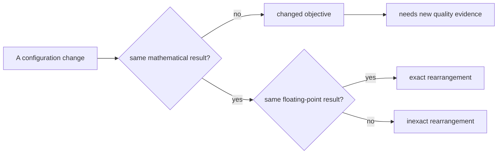

# Module 39 — Modern Training & Deep-Learning Systems

**Proposed Arc VIII — Learning machines, inference, and foundation models.**
This arc is proposed authoring scope. It is not registered in the course
graph, the Atlas Core route, the manifest, or any mastery gate.

> **Authoring-only private study pack.** This draft may be used only for
> instructor-led study in the designated Codex chats; it is not yet a portal
> learner route. M39 has no course-graph entry, no route position, no contract
> record, no source-map binding, and no release state. Private study does not
> unlock M25 or M26, grant Core credit, satisfy any prerequisite, certify a
> training system, prove learner mastery, or record a live/Notion session.

**Bridge.** M37 made one gradient auditable; M38 made an architecture's
assumptions explicit. Both assumed the training run itself was a neutral
container. M39 removes that assumption:

> **When a run is described as "the same model, trained faster," what
> arithmetic, memory, and communication decisions changed the computation —
> and which of them changed the mathematics?**

**Primary outcome.** You can separate three things that a training script
merges: the optimization problem, the numerical realization, and the systems
schedule. You can derive why gradient noise scales as \(1/B\), why warmup and
decoupled weight decay exist, why loss scaling is required in half precision,
which parallelism strategies are mathematically exact and which are not, and
what a quantized or pruned model is actually a model of.

This is a rigorous foundation for reading training-systems claims. It is not a
claim of mastery of large-scale training, cluster operation, kernel
engineering, or GPU performance. No experiment here requires more than a
laptop, and none of it establishes anything about a real training run at scale.

---

## How to study this module

### The working invariant

> **A training run is a finite trajectory produced by a specific arithmetic,
> memory, and communication configuration. Changing that configuration changes
> the computation, not only its speed. Any claim that "the same model" was
> trained must say what was held exactly fixed, and to what tolerance.**

Use this training-claim trace:

~~~text
objective + parameterization (M38) + gradient definition (M37)
→ batch construction and what it makes an estimate of
→ step-size schedule and regularization, stated as an update rule
→ numeric format, accumulation dtype, and any scaling applied
→ memory schedule: what is stored, what is recomputed
→ communication schedule: what is reduced, when, and in what order
→ the resulting trajectory, and which of the above changed the mathematics
~~~

### Evidence labels

| Label | What it can establish | What it does not establish |
| --- | --- | --- |
| **[DEFINITION]** | An update rule, a batch construction, a numeric format, a partition, or a memory schedule under stated notation. | That the configuration is appropriate or efficient. |
| **[DERIVATION]** | A conditional identity: variance scaling, an exactness result for a rearrangement, a memory or communication count. | That the derived quantity binds in practice, or that the run converges. |
| **[FINITE EXPERIMENT]** | An observed loss, timing, memory figure, or divergence under a named configuration and seed. | Anything about another scale, hardware, or dataset. |
| **[SYSTEM CONTRACT]** | A pinned dtype, kernel, determinism setting, library version, or topology. | Mathematical equivalence to any other configuration. |
| **[NON-CLAIM]** | An explicit boundary the module refuses to cross. | Anything positive. |

### Claim/source trail

| Session | Claims to trace | Research route |
| --- | --- | --- |
| 1 — the batch | `M39-C01` | `S39-01–S39-03` |
| 2 — schedules and regularization | `M39-C02` | `S39-04–S39-06` |
| 3 — numeric formats | `M39-C03`, `M39-C04` | `S39-07–S39-10` |
| 4 — memory schedules | `M39-C05` | `S39-11–S39-13` |
| 5 — parallelism | `M39-C06`, `M39-C07` | `S39-14–S39-17` |
| 6 — compression, inference, dossier | `M39-C08` | `S39-18–S39-21` |

### One training-configuration evidence map

~~~text
Objective and parameterization:
Batch construction, and what the gradient is an unbiased estimate of:
Update rule, written out, including every regularization term:
Numeric formats: parameters, activations, gradients, accumulation:
Memory schedule: stored, recomputed, offloaded:
Communication: what is reduced, in what order, with what associativity:
Which changes are exact rearrangements and which change the mathematics:
Determinism claim, and how it was checked:
Strongest supported claim / remaining uncertainty:
~~~

---

## 1. Position in the knowledge system

~~~mermaid
%% atlas-diagram-id: m39-position-map
%% atlas-diagram-title: M39 sits where optimization meets arithmetic and machines
%% atlas-diagram-alt: M30 contributes sampling and variance; M31 contributes objectives and descent; M32 contributes floating-point execution and reproducibility evidence; M37 contributes the computed gradient; M38 contributes the architecture and its costs. All feed M39, which produces a bounded training-configuration packet handed to proposed M42 foundation-model study and to preview-only M25.
flowchart LR
  M30["M30: sampling, variance"] --> M39["M39: training configuration"]
  M31["M31: objectives, descent"] --> M39
  M32["M32: floating point, reproducibility"] --> M39
  M37["M37: computed gradients"] --> M39
  M38["M38: architecture, costs"] --> M39
  M39 --> M42["M42: foundation models (proposed)"]
  M39 --> M25["M25: gated synthesis"]
~~~

**Text equivalent:** M39 is the module where M32's floating-point discipline
stops being a side note. Almost every technique here is a rearrangement of a
computation, and the entire skill is telling exact rearrangements from
approximate ones.

### Entry retrieval

1. What is the variance of a mean of \(B\) independent unbiased estimates?
2. Why is floating-point addition not associative, and what follows for a sum
   computed in a different order?
3. What does a descent direction guarantee, and over what neighbourhood?
4. Which M38 quantity grows quadratically in sequence length?
5. Name the M37 factor that a residual connection edits.

---

## 2. One synthetic story: the relay training run

Extend the relay setting once more. The synthetic dataset has \(N = 4096\)
examples drawn from a declared relation; the model is M38's small relay
network; the objective is the mean loss over a batch. No people, real
decisions, external data, models, or services are involved.

Every experiment below is a **[FINITE EXPERIMENT]** on this configuration, and
none is evidence about any other. The point is to make a *mechanism* visible
at a scale where the arithmetic can be checked by hand.

---

## Session 1 — The batch is a statistical object before it is a systems one

**Launch:** With the Study Partner, state precisely what quantity a minibatch
gradient is an unbiased estimate of, and what changes when the batch grows.

### Core question

**What does increasing the batch size buy, and in what units?**

**[DEFINITION]** With the loss defined as a *mean* over the batch,
\(\widehat g_B = \frac1B \sum_{i=1}^{B} g_i\), where each \(g_i\) is the
per-example gradient at the current parameters.

**[DERIVATION]** If the \(B\) examples are drawn independently from the same
distribution, \(\widehat g_B\) is unbiased for the population gradient and

\[
\operatorname{Var}(\widehat g_B) = \frac{\sigma^2}{B},
\qquad
\text{so}\quad
\text{standard deviation} \propto \frac{1}{\sqrt B}.
\]

Doubling the batch halves the variance but only reduces the noise magnitude by
\(\sqrt 2\), while doubling the computation per step. That asymmetry is the
whole economics of batch size, and it is derivable in two lines.

**[DERIVATION] — the linear-scaling heuristic and its condition.** Taking \(k\)
steps of size \(\eta\) on \(k\) small batches moves the parameters by
\(-\eta\sum_{j=1}^{k}\widehat g^{(j)}\); one step of size \(k\eta\) on the
union batch moves them by \(-k\eta\,\overline{g}\), the same quantity — *if*
the gradients are evaluated at the same parameters. They are not: the small
steps re-evaluate along the way. So linear scaling is exact only in the limit
where the gradient is approximately constant over the \(k\) small steps, which
is precisely where curvature is small relative to the step.

**[NON-CLAIM]** Linear scaling is therefore a first-order approximation with a
stated failure mode, not a law. It fails early in training, where curvature is
large and the parameters move fastest — which is the honest motivation for
warmup in Session 2.

### The two counters people conflate

| Quantity | Definition | What halves when \(B\) doubles at fixed epochs |
| --- | --- | --- |
| Steps per epoch | \(N/B\) | halves |
| Examples per step | \(B\) | doubles |
| Gradient noise (sd) | \(\sigma/\sqrt B\) | divides by \(\sqrt 2\) |
| Compute per epoch | \(\approx N\) | unchanged |

**[FINITE EXPERIMENT]** On the relay run with \(N = 4096\): at \(B=32\) one
epoch is 128 steps; at \(B=256\) it is 16. If the learning rate is unchanged,
the second run has moved the parameters one-eighth as many times. Reporting
"same epochs, worse result" without this line is reporting a step-count
difference as a batch-size effect.

### Prediction before reveal

1. If the loss is a *sum* rather than a mean, what happens to the effective
   step size as \(B\) grows?
2. Does drawing a batch without replacement from a shuffled epoch keep the
   estimator unbiased?
3. Does batch normalization change the answer to question 2?

<details>
<summary>Reveal after recording your answers.</summary>

1. It grows linearly with \(B\), because the gradient magnitude scales with
   \(B\). A "sum vs mean" difference silently multiplies the learning rate —
   one of the most common sources of an unreproducible result.
2. It is unbiased at the epoch level but the draws within an epoch are not
   independent; sampling without replacement reduces variance relative to
   with-replacement sampling. The estimator remains usable; the variance
   formula above is the with-replacement case.
3. Yes, and more seriously. Under batch normalization the per-example loss
   depends on the other examples in the batch (M38 Session 5), so the
   objective itself is batch-size dependent — there is no fixed population
   objective being estimated.

</details>

### Output: Batch Card

~~~text
Loss reduction (sum or mean), stated explicitly:
Steps per epoch and examples per step, both computed:
Gradient-noise scaling and its independence assumption:
Any batch-coupling mechanism present (e.g. batch normalization):
What a change in B held fixed, and what it did not:
~~~

---

## Session 2 — Schedules and regularization are part of the update rule

**Launch:** With the Study Partner, write one optimizer's full update rule
including every regularization term, then say which term the schedule scales.

### Core question

**Why does the step size need a shape over time at all?**

**[DERIVATION] — warmup.** At initialization the parameters are far from any
region where the local quadratic model is informative, and (Session 1) linear
scaling is least valid where curvature is largest. A step size that begins
small and increases over the first \(T_w\) steps keeps early updates inside
the region where the first-order model holds, then reaches the intended rate
once the trajectory has settled. The argument is about *when the linear
approximation is valid*, not about "letting the model settle" as a metaphor.

**[DERIVATION] — decay.** Under a fixed step size, stochastic gradient descent
with noise variance \(\sigma^2/B\) does not converge to a minimizer; it
reaches a stationary distribution whose spread scales with \(\eta\sigma^2/B\).
Reducing \(\eta\) reduces that spread. Decay is therefore a variance-reduction
mechanism, and its schedule shape trades exploration against final noise.

**[DERIVATION] — weight decay is not always \(L^2\).** Adding
\(\tfrac\lambda2\lVert\theta\rVert^2\) to the loss contributes \(\lambda\theta\)
to the gradient. Under plain gradient descent the update is
\(\theta \leftarrow \theta - \eta(g + \lambda\theta)\), i.e. a shrink by
\((1-\eta\lambda)\) — the two views agree.

Under an adaptive method that divides the gradient coordinatewise by an
estimate \(v\) of its scale, the penalty term is divided too:
\(\theta \leftarrow \theta - \eta\,(g + \lambda\theta)/\sqrt v\). Now the
shrinkage is \(\eta\lambda/\sqrt v\) — *different for every coordinate*, and
larger where gradients have been small. Applying the shrinkage directly to the
parameters instead, outside the adaptive scaling, restores a uniform decay.
The two are genuinely different update rules, and the distinction is derivable
in one line rather than empirical folklore.

**[NON-CLAIM]** None of this establishes that any particular schedule is
better. Each derivation says what the mechanism *does*; whether it helps is an
M36-style question about a gap, answered with held-out evidence.

### One comparison table

| Mechanism | What it scales | Derivable effect | Common misreading |
| --- | --- | --- | --- |
| Warmup | \(\eta\) over the first \(T_w\) steps | keeps early updates inside the first-order region | "helps the model warm up" |
| Decay | \(\eta\) over training | reduces the stationary spread \(\propto \eta\sigma^2/B\) | "converges the model" |
| \(L^2\) in the loss | the gradient | coordinate-dependent shrink under adaptive scaling | "same as weight decay" |
| Decoupled decay | the parameters | uniform shrink independent of \(v\) | "just a reparameterization" |

### Prediction before reveal

1. If you double \(B\) and keep \(\eta\) fixed, does the stationary spread
   grow, shrink, or stay the same?
2. Under decoupled decay, does the effective shrinkage depend on the learning
   rate?
3. Does gradient clipping (M37) interact with a warmup schedule?

<details>
<summary>Reveal after recording your answers.</summary>

1. It shrinks, since the spread scales as \(\eta\sigma^2/B\). This is the
   sense in which a larger batch "permits" a larger step size.
2. In the usual formulation it is applied as \(\theta \leftarrow (1-\eta\lambda)\theta\),
   so yes — it is still coupled to \(\eta\), just not to \(v\). Saying it is
   "fully decoupled" overstates the claim; it is decoupled from the *adaptive
   scaling*.
3. Yes, and in a way worth noticing: during warmup the steps are small, so
   clipping rarely binds; once the rate reaches its peak, clipping may begin
   to bind and effectively caps the schedule. A clip threshold and a peak
   learning rate are not independent knobs.

</details>

### Output: Update-Rule Card

~~~text
Optimizer state and the full update rule, written out:
Every regularization term and where it enters:
Schedule shape, with the quantity it scales:
Derivable effect of each term:
Interaction between clipping, warmup, and peak rate:
~~~

---
## Session 3 — Numeric formats change the computation, not only its speed

**Launch:** With the Study Partner, work out which quantity underflows first in
half precision, and derive the smallest fix.

### Core question

**What exactly breaks when a training run moves from 32-bit to 16-bit
arithmetic?**

**[DEFINITION]** Three formats matter here, and they differ in how the 16 or
32 bits are split between exponent and significand.

| Format | Exponent bits | Significand bits | Smallest normal | Relative precision |
| --- | --- | --- | --- | --- |
| float32 | 8 | 23 | \(\approx 1.2\times10^{-38}\) | \(\approx 1.2\times10^{-7}\) |
| float16 | 5 | 10 | \(\approx 6.1\times10^{-5}\) | \(\approx 4.9\times10^{-4}\) |
| bfloat16 | 8 | 7 | \(\approx 1.2\times10^{-38}\) | \(\approx 3.9\times10^{-3}\) |

Read the table as a design choice, not a ranking. bfloat16 keeps float32's
*range* and gives up precision; float16 keeps more precision and gives up
range. Which one is safe depends on which failure you are exposed to.

**[DERIVATION] — why gradients underflow first.** By M37 Session 4, the
gradient reaching an early layer is a product of Jacobian factors, so its
magnitude is exponentially smaller than the activations'. In float16, values
below \(\approx 6\times10^{-5}\) enter the subnormal range and below
\(\approx 6\times10^{-8}\) flush to zero. Activations rarely reach that scale;
gradients routinely do. So the *first* thing half precision destroys is the
small-gradient tail — silently, as exact zeros.

**[DERIVATION] — loss scaling is a change of variables.** Multiply the loss by
a constant \(S > 1\). By linearity of differentiation every gradient is
multiplied by \(S\), moving the whole distribution up and out of the subnormal
region. Dividing by \(S\) before the update recovers the original gradient
exactly, in exact arithmetic. The only cost is that large gradients may now
overflow to infinity — which is detectable, unlike the underflow it replaces.
That detectability is the reason the technique works: it converts a silent
failure into a loud one.

**[SYSTEM CONTRACT]** A mixed-precision configuration is not "16-bit
training." It is: parameters and an accumulation copy in float32, forward and
backward arithmetic in 16-bit, reductions accumulated in float32, and a scale
factor on the loss. Each of those four is a separate decision, and reporting
"we used mixed precision" names none of them.

### The rearrangement question

**[DERIVATION]** Summing \(n\) values in float32 and in float64 gives
different results (M32); summing them in a different *order* also gives
different results. So a claim that two runs are "the same" requires naming the
accumulation dtype **and** the reduction order. Any implementation that
parallelizes a reduction has changed the order.

**[NON-CLAIM]** Bit-identical reproducibility across devices is not achievable
by choosing a seed. Determinism requires a pinned kernel set, a pinned
reduction order, and a pinned library version, and even then it is a claim
about one device class.

### Prediction before reveal

1. Which format would you choose if gradients span twelve orders of magnitude
   but only three significant digits matter?
2. Does loss scaling change the mathematical gradient?
3. If a run produces `NaN` after switching to float16, what is the first
   quantity to inspect?

<details>
<summary>Reveal after recording your answers.</summary>

1. bfloat16: the requirement is range, not precision, and bfloat16 keeps
   float32's exponent field.
2. No. In exact arithmetic the scale cancels. In finite arithmetic it changes
   which values are representable, which is the entire point — the gradient
   you *compute* changes even though the gradient you *define* does not.
3. The scale factor and the overflow check. A `NaN` after scaling usually
   means the scale is too large for the current gradient magnitude; the
   standard response is to skip the update and reduce the scale, not to lower
   the learning rate.

</details>

### Output: Numeric-Format Card

~~~text
Format for parameters, activations, gradients, and accumulation (four answers):
Range and precision of each, with the failure each exposes:
Loss scale, and how overflow is detected and handled:
Reduction order, and whether it is pinned:
The determinism claim being made, and its exact scope:
~~~

---

## Session 4 — Memory schedules trade arithmetic for storage

**Launch:** With the Study Partner, count the activation memory of the M38
Transformer block before discussing any technique for reducing it.

### Core question

**What is actually stored during a forward pass, and why?**

**[DERIVATION]** M37 Session 3 answered this: reverse mode must retain every
intermediate whose value appears in a local partial derivative. So activation
memory is a property of the *graph*, and it scales with batch size, sequence
length, width, and depth — not with parameter count.

For a Transformer block with batch \(B\), length \(T\), width \(d\), and
\(H\) heads, the retained tensors include the block input, the projections,
and — decisively — the \(B H T^2\) attention weights. That last term is the
M38 quadratic cost appearing as *memory* rather than arithmetic.

| Term | Size | Scales with |
| --- | --- | --- |
| Block activations | \(\approx c\,BTd\) | length × width |
| Attention weights | \(BHT^2\) | length squared |
| Parameters + optimizer state | \(\approx 3\!-\!4\times\) parameter count | model only |

**[FINITE EXPERIMENT]** For \(B=8, H=8, T=2048\): the attention-weight term
alone is \(8\times8\times2048^2 \approx 2.7\times10^{8}\) values, i.e. about
0.5 GB in float16 *per block*. Compute this before choosing a length.

### Gradient accumulation is exact, under one condition

**[DERIVATION]** Split a batch of size \(B = k m\) into \(k\) microbatches of
size \(m\). If the loss is a mean, then

\[
\frac1B\sum_{i=1}^{B} g_i
= \frac1k \sum_{j=1}^{k}\left(\frac1m \sum_{i \in \text{micro } j} g_i\right),
\]

so summing microbatch gradients and dividing by \(k\) reproduces the full-batch
gradient **exactly in exact arithmetic**. The condition is that no term in the
loss couples examples across microbatches. Batch normalization violates that
condition; layer normalization does not.

**[NON-CLAIM]** "Exactly" here means mathematically. The accumulated sum is
computed in a different order from the full-batch reduction, so the
floating-point results differ (Session 3). Accumulation is an exact
rearrangement of the mathematics and an inexact rearrangement of the
arithmetic.

### Checkpointing trades time for memory

**[DEFINITION]** Activation checkpointing stores only a subset of
intermediates and recomputes the rest during the backward pass.

**[DERIVATION]** With \(L\) layers and checkpoints every \(\sqrt L\) layers,
stored activations drop from \(O(L)\) to \(O(\sqrt L)\) while the forward
computation is performed roughly twice — an \(O(\sqrt L)\) memory schedule at
about \(1.3\!-\!1.5\times\) the arithmetic. The exponent is derivable: with
segment length \(s\), storage is \(O(L/s + s)\), minimized at \(s=\sqrt L\).

**[NON-CLAIM]** Recomputation must reproduce the same values, so any
nondeterministic operation inside a checkpointed segment — dropout with a
fresh mask, for instance — must have its randomness pinned, or the backward
pass differentiates a different function than the forward pass computed. This
is a correctness issue, not a performance one.

### Output: Memory-Schedule Card

~~~text
Activation terms enumerated, with sizes derived:
The term that dominates at the chosen B, T, d, H:
Microbatch split, and the condition under which it is exact:
Checkpoint segment length and the derived memory/time trade:
Randomness pinned inside recomputed segments (yes/no, and how):
~~~

---

## Session 5 — Parallelism: which strategies preserve the mathematics

**Launch:** With the Study Partner, classify each parallelism strategy as an
exact rearrangement or a change to the computed objective.

### Core question

**When work is split across devices, what is the invariant that must be
preserved — and which strategies preserve it exactly?**

### Data parallelism

**[DEFINITION]** Replicate the model on \(P\) devices, give each a distinct
microbatch, compute local gradients, and average them across devices before
the update.

**[DERIVATION]** By the Session 4 identity, averaging per-device mean
gradients over equal-sized shards equals the full-batch mean gradient. Data
parallelism is therefore mathematically **exact** — it computes the same
gradient as a single device with the combined batch. Communication is one
all-reduce of the parameter-sized gradient buffer per step.

**[NON-CLAIM]** Two caveats, both real. Unequal shard sizes break the equality
unless the average is weighted. And the all-reduce sums in a
topology-dependent order, so the result is not bitwise identical to the
single-device sum.

### Tensor parallelism

**[DEFINITION]** Split individual layers across devices — for example, a
matrix multiply partitioned by columns, with the partial results concatenated
or summed.

**[DERIVATION]** Matrix multiplication distributes over a partition of the
weight matrix, so the mathematics is exact. What changes is that a
communication step now sits *inside* the layer, so it happens every layer
rather than once per step, and its volume scales with the activation size
rather than the parameter size.

### Pipeline parallelism

**[DEFINITION]** Assign consecutive layer groups to different devices and pass
activations along the chain, splitting the batch into microbatches so that
several are in flight at once.

**[DERIVATION] — the bubble.** With \(P\) stages and \(k\) microbatches, the
schedule takes \(P + k - 1\) microbatch-times instead of \(k\), so the idle
fraction is

\[
\text{bubble} = \frac{P-1}{P+k-1}.
\]

| \(P\) | \(k\) | Bubble |
| --- | --- | --- |
| 4 | 4 | 43% |
| 4 | 16 | 16% |
| 8 | 16 | 30% |
| 8 | 64 | 10% |

The remedy — more microbatches — costs activation memory (Session 4), so
pipeline depth, microbatch count, and memory are one coupled decision, not
three.

**[NON-CLAIM]** Pipeline parallelism is exact for the same reason gradient
accumulation is, and it inherits the same condition: no loss term may couple
examples across microbatches.

### One classification table

| Strategy | Splits | Mathematically exact? | Communication per step |
| --- | --- | --- | --- |
| Data | the batch | yes, with equal or weighted shards | one all-reduce of parameter size |
| Tensor | each layer's weights | yes | per-layer, activation-sized |
| Pipeline | the layer sequence | yes, under the microbatch condition | activation handoff between stages |
| Asynchronous updates | the schedule | **no** — gradients are applied to stale parameters | none blocking |

The last row is the one that matters conceptually: everything above it is a
rearrangement, and it alone changes what is being computed.

### Prediction before reveal

1. Two data-parallel runs at \(P=8\) and \(P=1\) with the same total batch
   give different losses in the eighth decimal. Is that a bug?
2. Does tensor parallelism reduce activation memory per device?
3. At \(P=8\), how many microbatches are needed to bring the bubble below 10%?

<details>
<summary>Reveal after recording your answers.</summary>

1. No. The all-reduce sums in a different order, so the floating-point results
   differ while the mathematics agrees. A bug would show as a difference that
   *grows* rather than one bounded near the rounding scale.
2. Yes for the tensors it partitions, no for the ones it replicates. The
   answer depends on which dimension is split, so "tensor parallelism saves
   memory" is not a complete claim.
3. Solve \((P-1)/(P+k-1) < 0.1\) with \(P=8\): \(7 < 0.1(k+7)\), so
   \(k > 63\). Sixty-four microbatches — which is exactly where Session 4's
   memory term reasserts itself.

</details>

### Output: Parallelism Card

~~~text
Strategy, and precisely what it partitions:
Exactness argument, or the reason it is not exact:
Communication volume and frequency, derived:
Bubble or overhead fraction, computed for the chosen configuration:
Which memory term the choice increases:
~~~

---
## Session 6 — Compression, inference, and the training-configuration dossier

**Launch:** With the Study Partner, take one compression technique and say what
the compressed artifact is a model *of*.

### Core question

**After training, what does making a model smaller or faster actually change?**

### Quantization is an affine map with a stated grid

**[DEFINITION]** Affine quantization maps a real value \(x\) to an integer
\(q\) and back:

\[
q = \operatorname{round}\!\left(\frac{x}{s}\right) + z,
\qquad
\hat x = s\,(q - z),
\]

with scale \(s\) and zero point \(z\) chosen from an observed range.

**[DERIVATION]** The reconstruction error is bounded by \(s/2\) for values
inside the range and is *unbounded* for values outside it, where clipping
applies. So the entire quality of a quantization is determined by how the
range was chosen and how heavy the tail is. A per-tensor scale must cover the
largest outlier in the whole tensor; a per-channel scale covers only its
channel. That is the derivation behind per-channel quantization, and it is one
line rather than a heuristic.

**[NON-CLAIM]** Integer weights do not imply integer arithmetic, faster
inference, or preserved accuracy. Each is a separate claim with separate
evidence, and on hardware without integer kernels the first buys memory only.

### Pruning: two kinds, one of which usually does nothing for latency

**[DEFINITION]** *Unstructured* pruning zeroes individual weights;
*structured* pruning removes whole units, channels, heads, or layers.

**[DERIVATION]** Dense matrix kernels compute over the full shape regardless
of zeros, so unstructured sparsity reduces stored parameters but not
arithmetic, unless the hardware and kernel exploit the specific sparsity
pattern. Structured pruning changes the shape, so it reduces arithmetic
directly. The distinction follows from what a kernel iterates over.

**[NON-CLAIM]** "90% sparse" without naming the kind, the kernel, and the
measured latency is a storage claim being presented as a speed claim.

### Distillation optimizes a different objective

**[DEFINITION]** Distillation trains a student against a teacher's output
distribution rather than, or in addition to, the labels.

**[DERIVATION]** With a temperature-softened teacher distribution, the
student's objective is a cross-entropy against a *dense* target rather than a
one-hot label, so each example supplies information about every class rather
than one. That is a change in the objective — an M38 Session 5 observation —
not a compression of the teacher.

**[NON-CLAIM]** A distilled student is a model of the *teacher's outputs* on
the transfer set. Whether that is close to a model of the data depends on the
teacher's own gap, which does not disappear by being copied.

### Output: Training-Configuration Dossier

~~~text
Objective, parameterization, and batch construction:
Full update rule with every regularization term:
Numeric formats (four answers) and the loss scale:
Memory schedule and the dominating activation term, derived:
Parallelism strategy, its exactness argument, and its overhead fraction:
Compression applied, and what the compressed artifact is a model of:
Every change classified: exact rearrangement / inexact rearrangement /
  changed objective:
Determinism claim and how it was checked:
Strongest supported claim and remaining uncertainty:
~~~

### Required artifacts

1. One Batch Card with steps-per-epoch computed both ways.
2. One Update-Rule Card with the decoupled-decay distinction written out.
3. One Numeric-Format Card naming all four formats.
4. One Memory-Schedule Card with the dominating term derived.
5. One Parallelism Card with a bubble fraction computed.
6. One completed Training-Configuration Dossier.

### Acceptance rubric

| Dimension | Not yet | Adequate | Strong |
| --- | --- | --- | --- |
| Statistical reading | Cites batch size | Derives the \(1/B\) variance | States linear scaling's condition and its failure region |
| Update-rule literacy | Names an optimizer | Writes the full rule | Derives the adaptive-scaling effect on weight decay |
| Numerical judgement | Says "mixed precision" | Names all four formats | Derives which quantity underflows first and why scaling detects failure |
| Systems accounting | Quotes memory figures | Derives the terms | Predicts which term binds before running |
| Exactness discipline | Treats all techniques alike | Separates exact from inexact | Classifies every change and names the one that alters the objective |

### Supportive oral-defense protocol

Twenty minutes, conversational, no slides. Bring the dossier.

1. Derive the gradient-noise scaling and state linear scaling's condition.
2. Explain why loss scaling works, in exact and in finite arithmetic.
3. Compute one bubble fraction and name what it costs to reduce.
4. Remove one premise — equal shards, the mean reduction, a pinned reduction
   order, or independence across microbatches — and state what breaks.
5. Name one thing in your dossier you now believe is under-evidenced.

### Teaching Assistant prompt — M39

> You are my Teaching Assistant for Atlas Module 39 (training systems). When I
> say two runs are "the same," ask what was held exactly fixed and to what
> tolerance. When I name a technique, ask whether it is an exact
> rearrangement, an inexact one, or a change to the objective, and make me
> justify the classification. When I quote a memory or speed figure, ask for
> the derivation and which term binds.

### Study Partner prompt — M39

> You are my Study Partner for Atlas Module 39. Take the opposite role on one
> claim per session: argue that precision does not matter, that data
> parallelism changes the result, that sparsity means speed. Make me produce
> the derivation or the counterexample.

### Record boundary for designated chats

These chats are study aids. Nothing in them creates course credit, a
prerequisite satisfaction, a contract record, a release record, or a mastery
claim.

### Forward handoff

M39's bounded packet is a *configuration* packet: for one run, every arithmetic
memory, and communication decision, each classified by whether it changed the
mathematics. Proposed M42 would consume it wherever a scaling claim is made.

---

## One-page concept map

M39 keeps three kinds of change apart that a training script merges: exact
rearrangements, inexact rearrangements, and changes to the objective.

~~~mermaid
%% atlas-diagram-id: m39-concept-map
%% atlas-diagram-title: How M39's ideas depend on one another
%% atlas-diagram-alt: The objective and gradient definition meet a batch construction whose noise scales as one over batch size, which conditions the linear step-size scaling heuristic and motivates warmup and decay. Numeric format choices set range and precision, causing gradient underflow that loss scaling addresses. The memory schedule stores activations, reduced by microbatching and checkpointing. Parallelism partitions batch, layer weights, or the layer sequence. Each decision is classified as an exact rearrangement, an inexact rearrangement caused by reduction order, or a change to the objective.
flowchart TB
  OBJ["objective + gradient"] --> BATCH["batch construction"]
  BATCH --> NOISE["noise ∝ 1/B"]
  NOISE --> SCALE["linear scaling heuristic"]
  SCALE --> WARM["warmup"]
  NOISE --> DECAY["decay reduces stationary spread"]
  FMT["numeric format: range vs precision"] --> UNDER["gradient underflow"]
  UNDER --> LOSSSCALE["loss scaling"]
  OBJ --> MEM["activation memory"]
  MEM --> MICRO["microbatching"]
  MEM --> CKPT["checkpointing"]
  PAR["parallelism"] --> DATA["data: split the batch"]
  PAR --> TENSOR["tensor: split the weights"]
  PAR --> PIPE["pipeline: split the layers"]
  DATA --> EXACT["exact rearrangement"]
  TENSOR --> EXACT
  PIPE --> EXACT
  MICRO --> EXACT
  LOSSSCALE --> EXACT
  EXACT --> ORDER["but reduction order differs"]
  ASYNC["stale-parameter updates"] --> CHANGED["changes the objective"]
  BNORM["batch coupling"] --> CHANGED
~~~

Notice that almost everything in this module lands in `EXACT`. The skill is
not memorizing techniques; it is knowing which two things do not.

## Graduated problem ladder

### Ladder step 1 — Recognize the layer

Label objective, batch, update rule, numeric format, memory schedule,
communication schedule, and observation.

### Ladder step 2 — Read a configuration

Given a training script, extract all four numeric formats, the loss reduction,
and the communication pattern.

### Ladder step 3 — Derive a quantity

Compute gradient-noise scaling, an activation term, or a bubble fraction from
the configuration alone.

### Ladder step 4 — Debug a divergence

Given `NaN`, a silent quality drop, or an unreproducible result, predict which
of underflow, overflow, reduction order, or batch coupling caused it.

### Ladder step 5 — Design the protocol

Specify the configuration, the determinism claim, and the comparison that
would make a "same model, faster" claim checkable.

### Ladder step 6 — Transfer and defend

Remove one premise — the mean reduction, equal shards, a pinned order, or
independence across microbatches — and defend the strongest remaining claim.

## Confidence-aware diagnostic and spaced review

Choose an answer and record confidence before reading its explanation.

1. Doubling the batch size at fixed learning rate and fixed epochs:
   - A. Halves the gradient noise magnitude.
   - B. Divides the noise magnitude by \(\sqrt 2\) and halves the number of
     update steps.
   - C. Doubles the compute per epoch.
   - D. Has no statistical effect.

<details>
<summary>Reveal after recording your answer and confidence.</summary>

**Answer: B.** Misconception map: A confuses variance with standard deviation;
C is false — compute per epoch is roughly \(N\) either way; D ignores the
estimator entirely. Repair: report the step count alongside any batch-size
comparison.
</details>

2. A loss defined as a *sum* rather than a mean:
   - A. Is equivalent.
   - B. Scales the effective learning rate with batch size.
   - C. Changes the model.
   - D. Only affects logging.

<details>
<summary>Reveal after recording your answer and confidence.</summary>

**Answer: B.** Misconception map: A and D miss that the gradient magnitude
scales with \(B\); C overstates it — the parameterization is unchanged.
Repair: this single line silently multiplies the step size and is a frequent
cause of unreproducible results.
</details>

3. Linear learning-rate scaling with batch size is exact when:
   - A. Always.
   - B. The gradient is approximately constant over the steps being replaced,
     i.e. curvature is small relative to the step.
   - C. The optimizer is adaptive.
   - D. Never.

<details>
<summary>Reveal after recording your answer and confidence.</summary>

**Answer: B.** Misconception map: A treats a first-order approximation as a
law; C names an unrelated property; D discards a useful approximation with a
stated region. Repair: the failure region is early training, which is
precisely why warmup exists.
</details>

4. Under an adaptive optimizer, adding \(\tfrac\lambda2\lVert\theta\rVert^2\)
   to the loss:
   - A. Is identical to decoupled weight decay.
   - B. Produces a coordinate-dependent shrinkage divided by the adaptive
     scale.
   - C. Has no effect.
   - D. Doubles the gradient.

<details>
<summary>Reveal after recording your answer and confidence.</summary>

**Answer: B.** Misconception map: A is the common error and is false; C and D
misstate the arithmetic. Repair: write the update rule out — the penalty term
goes through the same division as the gradient.
</details>

5. In float16 training, the first quantity to be destroyed is usually:
   - A. The activations, by overflow.
   - B. The small-gradient tail, by underflow to zero.
   - C. The parameters.
   - D. The loss value.

<details>
<summary>Reveal after recording your answer and confidence.</summary>

**Answer: B.** Misconception map: A, C, D name quantities whose magnitudes sit
comfortably inside float16's range. Repair: by M37's Jacobian product,
gradients are exponentially smaller than activations, so they meet the
subnormal boundary first — silently.
</details>

6. Loss scaling works because:
   - A. It reduces the learning rate.
   - B. Differentiation is linear, so scaling the loss scales every gradient
     by the same constant, which is divided out before the update.
   - C. It improves conditioning.
   - D. It changes the model's outputs.

<details>
<summary>Reveal after recording your answer and confidence.</summary>

**Answer: B.** Misconception map: A, C, D attribute the effect to unrelated
mechanisms. Repair: it is a change of variables that trades a silent underflow
for a detectable overflow.
</details>

7. bfloat16 differs from float16 chiefly by:
   - A. Being faster.
   - B. Keeping float32's exponent range and giving up significand bits.
   - C. Using more bits.
   - D. Being deterministic.

<details>
<summary>Reveal after recording your answer and confidence.</summary>

**Answer: B.** Misconception map: A and D are hardware and implementation
claims; C is false — both are 16 bits. Repair: the choice is range versus
precision, and which is safe depends on the failure you face.
</details>

8. Gradient accumulation over microbatches is mathematically exact provided:
   - A. The batch size is a power of two.
   - B. The loss is a mean and no term couples examples across microbatches.
   - C. The optimizer is stateless.
   - D. It never is.

<details>
<summary>Reveal after recording your answer and confidence.</summary>

**Answer: B.** Misconception map: A and C name irrelevant conditions; D is too
strong. Repair: batch normalization violates the coupling condition; layer
normalization does not.
</details>

9. Activation checkpointing with segment length \(s\) over \(L\) layers stores:
   - A. \(O(L)\) activations.
   - B. \(O(L/s + s)\), minimized at \(s = \sqrt L\).
   - C. \(O(1)\).
   - D. \(O(L^2)\).

<details>
<summary>Reveal after recording your answer and confidence.</summary>

**Answer: B.** Misconception map: A is the un-checkpointed case; C ignores the
segment interior; D is not a term that appears. Repair: the \(\sqrt L\)
schedule is the minimizer of a two-term expression, derivable in one line.
</details>

10. Data parallelism over \(P\) devices with equal shards is:
    - A. An approximation.
    - B. Mathematically exact, though not bitwise identical because the
      all-reduce sums in a different order.
    - C. Exact and bitwise identical.
    - D. Only valid for \(P = 2\).

<details>
<summary>Reveal after recording your answer and confidence.</summary>

**Answer: B.** Misconception map: A understates it; C ignores non-associativity;
D invents a restriction. Repair: mathematical exactness and bitwise identity
are different claims, and only the first survives a reduction reorder.
</details>

11. At \(P = 8\) pipeline stages, reaching a bubble fraction below 10% needs:
    - A. 8 microbatches.
    - B. More than 63 microbatches, which costs activation memory.
    - C. Any number; the bubble is fixed.
    - D. Fewer microbatches.

<details>
<summary>Reveal after recording your answer and confidence.</summary>

**Answer: B.** Solve \((P-1)/(P+k-1) < 0.1\). Misconception map: A and D
misread the direction; C denies the dependence. Repair: pipeline depth,
microbatch count, and memory are one coupled decision.
</details>

12. Unstructured pruning to 90% sparsity, on a dense kernel:
    - A. Reduces arithmetic by 90%.
    - B. Reduces stored parameters but not arithmetic, because the kernel
      iterates over the full shape.
    - C. Reduces both by 90%.
    - D. Changes the architecture.

<details>
<summary>Reveal after recording your answer and confidence.</summary>

**Answer: B.** Misconception map: A and C assume a kernel that exploits the
pattern; D confuses zeroing with removal. Repair: structured pruning changes
the shape and therefore the arithmetic; unstructured does not, absent
supporting kernels.
</details>

### Distractor repair cards (per option)

| Question | Distractor routes (A/B/C/D) | Repair route | Smallest counterexample | Transfer probe |
| --- | --- | --- | --- | --- |
| 1 | Variance/sd confusion | \(\sigma/\sqrt B\) + step count | \(B{:}32\to256\) | Report both counters |
| 2 | Reduction ignored | Sum scales the gradient | \(B{=}256\) sum vs mean | Where else does a reduction hide? |
| 3 | Law vs approximation | Curvature condition | Step 0 | When does warmup end? |
| 4 | Equivalence assumed | Write the update rule | \(v\) small in one coordinate | Which is uniform? |
| 5 | Wrong quantity | Jacobian product magnitude | Depth 10 chain | Would bfloat16 help? |
| 6 | Wrong mechanism | Linearity of differentiation | Scale \(S{=}2^{10}\) | What detects failure? |
| 7 | Hardware claim | Range vs precision | \(10^{-38}\) value | Which failure are you facing? |
| 8 | Irrelevant condition | Mean + no coupling | Batch normalization | Does layer norm violate it? |
| 9 | Wrong regime | Minimize \(L/s + s\) | \(L{=}64\) | What is \(s\)? |
| 10 | Exactness/bitwise merged | Non-associativity | Reorder a sum | What would a bug look like? |
| 11 | Direction misread | \((P-1)/(P+k-1)\) | \(P{=}8\) | What does \(k\) cost? |
| 12 | Kernel assumed | Kernel iterates full shape | Dense matmul | What does structured change? |

### Spaced review

On days 3, 7, and 30, reconstruct the noise-scaling derivation, one memory
term, and one exactness classification from memory. On days 7 and 30, remove
one premise and rewrite the strongest remaining claim rather than erasing the
old one.

---

## Visual and code-reading lab — classify every change



### Prose alternative

Route every change through two questions in order. If the mathematical result
changes, it is a new objective and needs new evidence about quality. If not,
ask whether the floating-point result is preserved; a reordered reduction is
an inexact rearrangement, which affects reproducibility claims but not
correctness.

### Small configuration reading card

```python
def configuration_note(*, change, math_preserved, bits_preserved,
                       objective_changed, evidence_required):
    return {
        "change": change,
        "math_preserved": math_preserved,
        "bits_preserved": bits_preserved,
        "objective_changed": objective_changed,
        "evidence_required": evidence_required,
    }
```

If `objective_changed` is true and `evidence_required` is empty, the note is
incomplete.

## Source and reuse boundary

All explanations, diagrams, examples, derivations, and code in this workbook
are original Atlas authoring material. The reading routes below are recorded
canonical publisher locations as of **2026-08-06**; each must be re-checked
against a live fetch before any review sign-off, and none has been fetched as
part of authoring this draft. They guide scope and derivation review; they do
not grant permission to copy third-party prose, proofs, figures, code,
datasets, benchmarks, weights, or course exercises.

### Learner-facing source links

| Source | Session/claim linkage | Reuse boundary |
| --- | --- | --- |
| [MIT 6.7960 Deep Learning](https://ocw.mit.edu/courses/6-7960-deep-learning-fall-2024/) | Sessions 1–3: optimization, schedules, and training practice. | MIT OCW assets carry individual notices; link-only, original Atlas derivations. |
| [Stanford CS329S Machine Learning Systems Design](https://stanford-cs329s.github.io/) | Sessions 4–6: systems constraints, deployment, and compression trade-offs. | Link-only; original Atlas accounting. |
| [IEEE 754 floating-point standard](https://doi.org/10.1109/IEEESTD.2019.8766229) | Session 3: range, precision, subnormals, and non-associativity. | Cite only; a specification is not evidence about a run. |
| [PyTorch mixed-precision notes](https://docs.pytorch.org/docs/stable/notes/amp_examples.html), [numerical-accuracy notes](https://docs.pytorch.org/docs/stable/notes/numerical_accuracy.html), and [reproducibility notes](https://docs.pytorch.org/docs/stable/notes/randomness.html) | Sessions 3–4: format choices, loss scaling, accumulation dtype, and determinism settings. | Link-only; pin framework, device, and versions before any implementation claim. |
| [PyTorch distributed overview](https://docs.pytorch.org/docs/stable/distributed.html) | Session 5: collective operations and their semantics. | Link-only; original Atlas exactness arguments. |
| [Deep Learning (Goodfellow, Bengio, Courville)](https://www.deeplearningbook.org/) | Sessions 1–2: optimization for training, regularization vocabulary. | Link/cite only. |
| [NumPy floating-point type documentation](https://numpy.org/doc/stable/user/basics.types.html) | Sessions 3–4: dtype semantics for the hand-checkable experiments. | Link-only. |

For the fuller original-research, university, and standards source ledger,
consult the instructor-facing M39 primary-source research ledger once it is
written; no such ledger exists yet, and this workbook must not be treated as
source-mapped until it does.

Before publication, reconcile each learner-facing claim, derivation, formula,
source, visual, code fixture, and numerical experiment with a canonical
structured source map, module contract, accessibility evidence, teaching-model
evidence, and release provenance.

## Candidate release boundary

M39 is earlier in the pipeline than M31–M36. Before it could even become a
hidden review candidate it still needs: a course-graph entry with a route
position and prerequisite edges, an arc assignment, a primary-source research
ledger, a structured module contract with evidence records, a bounded
reference model with tests, accessibility evidence for its diagrams, a
companion package, and a project slice.

Until all of that exists it is an authoring draft only. It is not a hidden
review candidate, a published module, a live-chat event, a Notion record, or a
learner-mastery claim.
