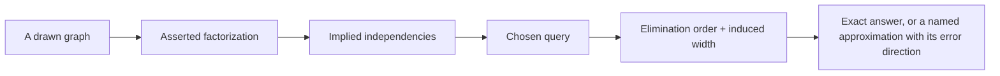

# Module 40 — Probabilistic Modeling & Inference

**Proposed Arc VIII — Learning machines, inference, and foundation models.**
This arc is proposed authoring scope. It is not registered in the course
graph, the Atlas Core route, the manifest, or any mastery gate.

> **Authoring-only private study pack.** This draft may be used only for
> instructor-led study in the designated Codex chats; it is not yet a portal
> learner route. M40 has no course-graph entry, no route position, no contract
> record, no source-map binding, and no release state. Private study does not
> unlock M25 or M26, grant Core credit, satisfy any prerequisite, prove learner
> mastery, or record a live/Notion session.

**Bridge.** M30 built probability as a model of a population; M38 met the ELBO
as one generative family's objective. M40 makes the structure itself the
object of study:

> **When a model is drawn as a graph, exactly which independence claims have
> been asserted — and which computations do those claims make tractable?**

**Primary outcome.** You can read a graphical model as a factorization claim,
derive conditional independence from graph structure, derive variable
elimination as distributing sums over products and read its cost off the
induced width, derive EM as coordinate ascent on the ELBO, derive the
Metropolis–Hastings acceptance ratio from detailed balance, and state what a
convergence diagnostic can and cannot show.

This is a rigorous foundation for reading probabilistic-modelling claims. It
is not a claim of mastery of measure-theoretic probability, modern Bayesian
computation at scale, or applied statistical consulting. Every derivation here
is small enough to check by hand and stays deliberately synthetic.

---

## How to study this module

### The working invariant

> **A probabilistic model is a factorization claim about a joint distribution;
> an inference algorithm answers a query about that model; a sample, bound, or
> diagnostic is a finite computation. A model that fits is not a model that is
> true, and every inference answer inherits the model's independence claims
> without checking them.**

Use this inference trace:

~~~text
question, stated as a query about named variables
→ joint distribution and the factorization asserted for it
→ independence claims the factorization implies, read off the structure
→ query type: marginal, conditional, MAP, or expectation
→ algorithm: exact (elimination, message passing) or approximate (MC, variational)
→ cost, derived from structure — not measured
→ what the answer is conditional on, and what would falsify it
~~~

### Evidence labels

| Label | What it can establish | What it does not establish |
| --- | --- | --- |
| **[DEFINITION]** | A factorization, an independence statement, a potential, a proposal, or a variational family under stated notation. | That the factorization matches any real process. |
| **[DERIVATION]** | A conditional identity: a separation criterion, an elimination cost, a monotonicity result, a stationarity condition, a bound. | That the algorithm converges in finite time or that the model is adequate. |
| **[FINITE EXPERIMENT]** | An observed estimate, acceptance rate, or diagnostic value under a named model, seed, and run length. | Convergence, correctness of the model, or coverage of the true posterior. |
| **[SYSTEM CONTRACT]** | A pinned RNG, dtype, or numerical convention (log-space, jitter). | Statistical validity. |
| **[NON-CLAIM]** | An explicit boundary the module refuses to cross. | Anything positive. |

### Claim/source trail

| Session | Claims to trace | Research route |
| --- | --- | --- |
| 1 — factorization and independence | `M40-C01` | `S40-01–S40-04` |
| 2 — undirected models and normalization | `M40-C02` | `S40-05–S40-07` |
| 3 — exact inference and its cost | `M40-C03` | `S40-08–S40-11` |
| 4 — latent variables and EM | `M40-C04` | `S40-12–S40-14` |
| 5 — Monte Carlo | `M40-C05`, `M40-C06` | `S40-15–S40-18` |
| 6 — variational and nonparametric | `M40-C07`, `M40-C08` | `S40-19–S40-22` |

### One inference evidence map

~~~text
Query, written as a probability statement about named variables:
Asserted factorization, with every conditional listed:
Independence claims implied, and one that would be surprising if false:
Algorithm chosen, and why the structure permits it:
Cost derived from structure (width, dimension, or run length):
Approximation introduced, and its direction if known:
Diagnostic run, and what it cannot detect:
Strongest supported claim / remaining uncertainty:
~~~

---

## 1. Position in the knowledge system

~~~mermaid
%% atlas-diagram-id: m40-position-map
%% atlas-diagram-title: M40 turns probability statements into computations with derivable costs
%% atlas-diagram-alt: M27 contributes graphs and counting; M29 contributes limits and integrals; M30 contributes distributions, expectation, and estimation; M31 contributes KL divergence and optimization; M38 contributes the ELBO and latent-variable families. All feed M40, which produces a bounded inference-claim packet handed to proposed M41 sequential decision-making and to preview-only M25.
flowchart LR
  M27["M27: graphs, counting"] --> M40["M40: models and inference"]
  M29["M29: limits, integrals"] --> M40
  M30["M30: distributions, estimation"] --> M40
  M31["M31: KL, optimization"] --> M40
  M38["M38: ELBO, latent variables"] --> M40
  M40 --> M41["M41: sequential decisions (proposed)"]
  M40 --> M25["M25: gated synthesis"]
~~~

**Text equivalent:** M40 does not add new probability axioms. It asks what
*structure* buys: which sums become tractable, which independencies can be
read off a picture, and which costs are consequences of the structure rather
than of the implementation.

### Entry retrieval

1. State the chain rule of probability for three variables.
2. What does \(D_{\mathrm{KL}}(q\Vert p) = 0\) imply, and is it symmetric?
3. What is the variance of an average of \(n\) independent unbiased estimates?
4. In M38, what was the gap between the ELBO and the log-likelihood?
5. Why is a normalizing constant sometimes harder than the model itself?

---

## 2. One synthetic story: the relay sensor chain

Extend the relay setting. Three binary variables: a hidden `state` \(S\), a
`signal` \(X\) emitted from it, and a `context` \(C\) that also depends on
\(S\). All conditional tables are declared, fully, in the module. No people,
real decisions, external data, models, or services are involved.

The declared model is \(S \to X\) and \(S \to C\) — a *fork*. Its
factorization is

\[
p(s,x,c) = p(s)\,p(x\mid s)\,p(c\mid s).
\]

Three claims are being made at once, and they are worth separating before any
algorithm appears: that \(S\) exists as a variable, that \(X\) and \(C\)
depend on nothing else once \(S\) is known, and that the tables are the ones
stated. Only the third is verifiable inside the module.

---

## Session 1 — A graph is a set of independence claims

**Launch:** With the Study Partner, take one graph and list every independence
it asserts, then find one it does *not* assert that you assumed it did.

### Core question

**What exactly does an arrow mean, and what does the absence of an arrow mean?**

**[DEFINITION]** A directed model over variables \(X_1,\dots,X_n\) asserts

\[
p(x_1,\dots,x_n) = \prod_{i=1}^{n} p\!\left(x_i \mid x_{\mathrm{pa}(i)}\right),
\]

where \(\mathrm{pa}(i)\) are the parents of node \(i\). The chain rule of
probability makes the *fully connected* version exact for every distribution
(M38 Session 5). So a directed model's content lies entirely in the **missing**
edges.

**[DERIVATION] — the three basic structures.** Over three variables:

| Structure | Factorization | \(A \perp C\)? | \(A \perp C \mid B\)? |
| --- | --- | --- | --- |
| Chain \(A \to B \to C\) | \(p(a)p(b\mid a)p(c\mid b)\) | no | **yes** |
| Fork \(A \leftarrow B \to C\) | \(p(b)p(a\mid b)p(c\mid b)\) | no | **yes** |
| Collider \(A \to B \leftarrow C\) | \(p(a)p(c)p(b\mid a,c)\) | **yes** | no |

The collider row is the one that surprises people, and it is derivable in two
lines. Marginalizing \(b\) out of \(p(a)p(c)p(b\mid a,c)\) gives
\(p(a)p(c)\sum_b p(b\mid a,c) = p(a)p(c)\), so \(A\perp C\). But conditioning
on \(B = b\) leaves \(p(a)p(c)p(b\mid a,c)/p(b)\), which does not factor —
observing a common effect makes its causes dependent.

**[DEFINITION]** *d-separation* generalizes the table: a path is blocked at a
chain or fork node that is observed, and at a collider node that is *not*
observed and has no observed descendant. Two sets are independent given a
third if every path between them is blocked.

**[NON-CLAIM]** d-separation states which independencies the graph *asserts*.
A distribution may have extra independencies the graph does not show. The
graph is a sufficient condition for independence, not a complete description.

### The relay fork, worked

With \(S \to X\) and \(S \to C\): \(X \not\perp C\) marginally — both carry
information about \(S\) — but \(X \perp C \mid S\). The M35/M36 relay label
rule \(y = \mathbb 1[x = c]\) is therefore *not* representable as a leaf of
this fork with \(S\) as its only parent: it depends on both children jointly.
That mismatch is the point. A graph that cannot express your target is a
modelling error, and it is visible before any data.

### Prediction before reveal

1. In the collider, does observing a *descendant* of \(B\) also create
   dependence between \(A\) and \(C\)?
2. Does reversing an arrow always change the independence claims?
3. Two different graphs can encode identical independencies. What does that
   mean for causal reading?

<details>
<summary>Reveal after recording your answer and confidence.</summary>

1. Yes. Observing anything downstream of a collider partially reveals it, so
   the blocking condition names descendants explicitly.
2. No. Reversing the arrow in a two-node chain gives the same single
   independence set (namely, none). Chains and forks are *Markov equivalent*;
   colliders are not.
3. It means the independencies alone cannot distinguish them, so a causal
   claim needs assumptions or interventions beyond the observed
   factorization — which is exactly why "the graph shows causation" is not a
   statement the mathematics supports.

</details>

### Output: Structure Card

~~~text
Variables, and the query you actually care about:
Factorization asserted, written as a product:
Every independence implied, listed:
One independence you assumed but the graph does not assert:
Whether your target quantity is expressible in this structure:
~~~

---

## Session 2 — Undirected models move the difficulty into the normalizer

**Launch:** With the Study Partner, write one small undirected model's
partition function explicitly and count its terms.

### Core question

**Why is an undirected model easy to write and hard to evaluate?**

**[DEFINITION]** An undirected model assigns

\[
p(x) = \frac{1}{Z}\prod_{c \in \mathcal C} \psi_c(x_c),
\qquad
Z = \sum_{x} \prod_{c} \psi_c(x_c),
\]

with non-negative potentials \(\psi_c\) over cliques and \(Z\) the partition
function.

**[DERIVATION]** The potentials are unconstrained non-negative functions, so
writing a model is trivial. But \(Z\) is a sum over the entire joint
configuration space: for \(n\) binary variables it has \(2^n\) terms. So the
model's *definition* is cheap and its *normalization* is exponential in the
worst case. Directed models avoid this because each factor is already a
normalized conditional — that is the structural difference between the two
languages, and it is the only one that matters computationally.

**[DEFINITION]** A factor graph makes this explicit: a bipartite graph of
variable nodes and factor nodes, with an edge when a factor depends on a
variable. Both directed and undirected models convert to factor graphs, which
is why message-passing algorithms are stated there.

**[NON-CLAIM]** Undirected models do not "lack direction because there is no
causality." They encode a different independence semantics — separation in the
undirected graph — which cannot express a collider, just as a directed graph
cannot express a symmetric cycle. Neither language is more general.

### Output: Normalization Card

~~~text
Potentials and their cliques:
Partition function written out, with its term count:
The independence semantics being used (separation or d-separation):
One structure this language cannot express:
Whether any query needs Z, or only ratios:
~~~

---

## Session 3 — Exact inference is distributing sums over products

**Launch:** With the Study Partner, eliminate variables in two different
orders and compare the largest intermediate factor.

### Core question

**Why is exact inference sometimes trivial and sometimes impossible, for
models of the same size?**

**[DERIVATION] — variable elimination.** To compute a marginal
\(p(x_1) = \sum_{x_2}\cdots\sum_{x_n}\prod_c \psi_c\), push each sum inward
past every factor that does not involve its variable:

\[
\sum_{x_n} \prod_c \psi_c
= \left(\prod_{c \,:\, x_n \notin c} \psi_c\right)
  \underbrace{\sum_{x_n} \prod_{c \,:\, x_n \in c}\psi_c}_{\text{new factor }\tau}.
\]

Each elimination replaces the factors touching one variable by a single new
factor over that variable's neighbours. The algorithm is nothing more than the
distributive law applied repeatedly.

**[DERIVATION] — the cost.** Eliminating a variable with \(k\) neighbours
creates a factor over \(k\) variables, costing \(O(d^{k+1})\) for domain size
\(d\). The overall cost is exponential in the largest such \(k\) encountered,
called the *induced width* of the elimination order. So inference cost is a
property of the **graph structure and the order**, not of the numbers in the
tables.

**[FINITE EXPERIMENT]** On a chain of \(n\) binary variables, eliminating from
one end gives width 1 and cost \(O(n\,d^2)\); eliminating from the middle
outward can create factors over many variables. Same model, same size,
different cost by orders of magnitude. Compute both widths before running
either.

**[DERIVATION] — trees.** On a tree, there is always an elimination order of
width 1 (repeatedly eliminate a leaf), so exact inference is linear. Belief
propagation is exactly this computation organized as messages so that *all*
marginals are obtained in two sweeps rather than one marginal per run.

**[NON-CLAIM]** On a graph with cycles, the same message updates can be run
but the fixed point is not the exact marginal, and convergence is not
guaranteed. "Loopy belief propagation" is a different algorithm that shares a
formula, not an exact method applied to a harder graph.

### Output: Elimination Card

~~~text
Query and the factors it involves:
Two elimination orders, with the induced width of each:
Largest intermediate factor size, derived:
Whether the structure is a tree, and what follows:
If cyclic: the approximation being accepted, stated explicitly:
~~~

---
## Session 4 — EM is coordinate ascent on the bound you already know

**Launch:** With the Study Partner, write the ELBO for a latent-variable model
and identify which argument each EM step maximizes.

### Core question

**Why does an algorithm that never evaluates the likelihood nonetheless
increase it?**

**[DERIVATION]** Recall M38's decomposition, for any \(q\) with adequate
support:

\[
\log p_\theta(x)
= \underbrace{\mathbb E_{q}\!\left[\log \frac{p_\theta(x,z)}{q(z)}\right]}_{\mathcal L(q,\theta)}
\;+\; D_{\mathrm{KL}}\!\left(q(z)\,\Vert\,p_\theta(z\mid x)\right).
\]

The left side does not depend on \(q\). So:

- **E-step.** Maximizing \(\mathcal L\) over \(q\) with \(\theta\) fixed means
  minimizing the KL term, whose minimum is 0 at
  \(q^\star(z) = p_\theta(z\mid x)\). At that point the bound is **tight**:
  \(\mathcal L(q^\star,\theta) = \log p_\theta(x)\).
- **M-step.** Maximizing \(\mathcal L\) over \(\theta\) with \(q\) fixed
  reduces to maximizing \(\mathbb E_{q}[\log p_\theta(x,z)]\), because the
  \(-\mathbb E_q[\log q]\) term is constant in \(\theta\).

**[DERIVATION] — monotonicity.** Write \(\theta_t\) for the parameters after
\(t\) rounds. Then
\(\log p_{\theta_t}(x) = \mathcal L(q^\star_t, \theta_t) \le \mathcal L(q^\star_t, \theta_{t+1}) \le \log p_{\theta_{t+1}}(x)\),
the first inequality by the M-step and the second because \(\mathcal L\) is a
lower bound for every \(q\). So the likelihood never decreases — proved in one
line from the decomposition, with no separate machinery.

**[NON-CLAIM]** Monotone increase is not convergence to a global maximum, and
it is not convergence to a *good* model. EM can stall at a saddle or a poor
local optimum, and the bound being tight at each E-step says nothing about
whether \(p_\theta\) is close to the data-generating process.

**[DERIVATION] — when the E-step is intractable.** If
\(p_\theta(z\mid x)\) cannot be computed, restricting \(q\) to a tractable
family leaves a positive KL gap. The bound is no longer tight, and the
monotonicity argument's first equality becomes an inequality — which is
precisely variational EM, and is Session 6's subject.

### Output: Latent-Variable Card

~~~text
Latent variables, and the reason they are posited:
ELBO written out, with both terms:
E-step: the exact posterior, or the family it is restricted to:
M-step: the expected complete-data log-likelihood, written out:
Whether the bound is tight, and what follows for the monotonicity claim:
~~~

---

## Session 5 — Monte Carlo trades structure for sampling, and pays in variance

**Launch:** With the Study Partner, derive the importance-sampling estimator's
unbiasedness, then construct a case where its variance is infinite.

### Core question

**When a sum is too large to compute, what does sampling actually give you?**

### Importance sampling

**[DERIVATION]** To estimate \(\mathbb E_p[f(X)]\) using samples from \(q\),

\[
\mathbb E_p[f]
= \sum_x p(x) f(x)
= \sum_x q(x)\,\frac{p(x)}{q(x)}\,f(x)
= \mathbb E_q\!\left[\frac{p(X)}{q(X)} f(X)\right],
\]

valid whenever \(q(x) > 0\) wherever \(p(x)f(x) \neq 0\). The estimator
\(\frac1n\sum_i w_i f(x_i)\) with \(w_i = p(x_i)/q(x_i)\) is therefore
**unbiased**.

**[DERIVATION] — the variance trap.** The estimator's variance involves
\(\mathbb E_q[w^2 f^2]\). If \(q\) has lighter tails than \(p\), the ratio
\(p/q\) grows without bound in the tail and this expectation can diverge —
the estimator is unbiased with *infinite variance*. A finite run then produces
a plausible-looking number with no error bar that means anything.

**[FINITE EXPERIMENT]** On the relay fork, sample \(S\) from a proposal that
places mass \(\epsilon\) on the true mode. As \(\epsilon \to 0\), the weights
concentrate on rare draws: the *effective sample size*
\((\sum_i w_i)^2/\sum_i w_i^2\) collapses toward 1 even as \(n\) grows.
Compute it; a large \(n\) with an effective sample size of 3 is three samples.

### Markov chain Monte Carlo

**[DEFINITION]** Construct a Markov chain whose stationary distribution is the
target \(\pi\), run it, and use its states as (dependent) samples.

**[DERIVATION] — detailed balance is sufficient.** If a transition kernel
\(T\) satisfies \(\pi(x)T(x\to y) = \pi(y)T(y\to x)\) for all \(x,y\), then

\[
\sum_x \pi(x) T(x\to y) = \sum_x \pi(y) T(y \to x) = \pi(y),
\]

so \(\pi\) is stationary. Two lines, and it is the whole reason the method
works.

**[DERIVATION] — Metropolis–Hastings.** Propose \(y\) from \(g(x \to y)\) and
accept with probability

\[
\alpha(x\to y) = \min\!\left(1, \frac{\pi(y)\,g(y\to x)}{\pi(x)\,g(x\to y)}\right).
\]

Substituting \(T = g\alpha\) into detailed balance and checking both branches
of the minimum verifies it. Note that \(\pi\) enters only as a *ratio*, so the
partition function of Session 2 cancels — this is why MCMC works on unnormalized
models, and it is the single most useful structural fact in the module.

**[DEFINITION]** Gibbs sampling updates one variable at a time from its full
conditional \(p(x_i \mid x_{-i})\). It is the special case of
Metropolis–Hastings whose acceptance probability is identically 1.

**[NON-CLAIM]** Stationarity is not convergence, and convergence is not a rate.
Detailed balance says the chain *has* the right stationary distribution; it
says nothing about how long mixing takes, and mixing time can be exponential
in the model size.

### What a diagnostic can and cannot show

| Diagnostic | What it can detect | What it cannot detect |
| --- | --- | --- |
| Trace inspection | obvious non-stationarity, stuck chains | a mode never visited |
| Multiple-chain agreement | disagreement between initializations | a mode no chain reached |
| Autocorrelation / effective sample size | high dependence within a chain | bias from an unexplored region |
| Acceptance rate | proposals too wide or too narrow | whether the target is the right model |

**[NON-CLAIM]** Every row's second column is a version of the same fact:
diagnostics are evidence of *failure*, never of success. A clean diagnostic is
the absence of one kind of evidence, not the presence of a correctness result.

### Output: Sampling Card

~~~text
Target, and whether it is normalized:
Method, and the identity that makes it valid (unbiasedness or detailed balance):
Proposal, and its tail behaviour relative to the target:
Effective sample size, computed:
Diagnostics run, with what each could not have detected:
~~~

---

## Session 6 — Variational inference, its asymmetry, and function-space priors

**Launch:** With the Study Partner, state which KL direction is being minimized
and predict the shape of the resulting approximation.

### Core question

**When we replace an intractable posterior with a tractable one, what have we
chosen — and in which direction do we err?**

**[DEFINITION]** Variational inference picks \(q\) from a family \(\mathcal Q\)
to maximize the ELBO, equivalently to minimize
\(D_{\mathrm{KL}}(q \Vert p(\cdot\mid x))\).

**[DERIVATION] — the direction matters.** \(D_{\mathrm{KL}}(q\Vert p)\)
integrates against \(q\), so it is heavily penalized where \(q\) has mass and
\(p\) does not, and barely penalized where \(p\) has mass and \(q\) does not.
The minimizer therefore avoids putting mass outside \(p\)'s support: with a
multimodal \(p\) and a unimodal family, \(q\) settles on one mode and
*underestimates* the spread. The reverse direction
\(D_{\mathrm{KL}}(p\Vert q)\) has the opposite behaviour, covering all modes
and overestimating spread.

This asymmetry is not a defect to be apologized for; it is a derivable
consequence of which measure the integral is taken against, and it tells you
the direction of the error before you run anything.

**[DEFINITION]** *Mean-field* takes \(\mathcal Q\) to be fully factorized,
\(q(z) = \prod_i q_i(z_i)\). Maximizing the ELBO coordinatewise gives the
update \(\log q_i \propto \mathbb E_{q_{-i}}[\log p(x,z)]\).

**[NON-CLAIM]** A mean-field posterior asserts independence among latents that
the true posterior does not have. Reported credible intervals from a
mean-field fit are therefore systematically too narrow — a *known-direction*
error, which is more useful than an unknown one.

### Gaussian processes: a prior over functions with an exact posterior

**[DEFINITION]** A Gaussian process places a prior over functions such that
any finite set of function values is jointly Gaussian, specified by a mean
function and a covariance kernel.

**[DERIVATION]** Because the joint over observed and query points is Gaussian,
the conditional is Gaussian too, with closed-form mean and covariance obtained
by the standard Gaussian conditioning identity. So the posterior is *exact* —
no sampling, no bound. The cost is the \(O(n^3)\) factorization of the
\(n\times n\) covariance matrix, which is an M28 fact about solving linear
systems, not a statistical one.

**[NON-CLAIM]** Exactness is conditional on the kernel and noise model being
correct. The uncertainty a Gaussian process reports is the uncertainty *of that
prior*; a badly chosen kernel produces confident, exact, wrong intervals.
"Principled uncertainty" names the derivation, not the calibration.

### Output: Inference Dossier

~~~text
Query and the factorization asserted:
Independence claims implied, and one that is doubtful:
Exact route: elimination order and induced width, or the reason none exists:
Approximate route: method, and the identity that justifies it:
Direction of the approximation error, if derivable:
Diagnostics, with what each could not detect:
Cost, derived from structure:
Strongest supported claim and remaining uncertainty:
~~~

### Required artifacts

1. One Structure Card including a collider read correctly.
2. One Normalization Card with the partition-function term count.
3. One Elimination Card comparing two orders' induced widths.
4. One Latent-Variable Card with the ELBO written out.
5. One Sampling Card with an effective sample size computed.
6. One completed Inference Dossier.

### Acceptance rubric

| Dimension | Not yet | Adequate | Strong |
| --- | --- | --- | --- |
| Structural reading | Draws a graph | Lists asserted independencies | Reads a collider correctly and names a Markov-equivalent alternative |
| Cost literacy | Says "intractable" | Names the induced width | Derives the width for two orders before running |
| Bound discipline | Uses EM | States the E- and M-step objectives | Proves monotonicity from the decomposition |
| Sampling judgement | Reports an estimate | Computes effective sample size | Constructs an infinite-variance case and says what a diagnostic cannot show |
| Approximation honesty | Says "approximate posterior" | Names the family | States the KL direction and predicts the error's direction |

### Supportive oral-defense protocol

Twenty minutes, conversational, no slides. Bring the dossier.

1. Read one graph's independencies aloud, including a collider.
2. Derive an elimination cost before being told it.
3. Prove EM's monotonicity from the ELBO decomposition.
4. Remove one premise — the factorization, the proposal's tail, detailed
   balance, or the kernel choice — and state what breaks.
5. Name one thing in your dossier you now believe is under-evidenced.

### Teaching Assistant prompt — M40

> You are my Teaching Assistant for Atlas Module 40 (probabilistic modelling
> and inference). When I show a graph, ask which independencies it asserts and
> which I only assumed. When I say inference is expensive, ask for the induced
> width. When I report a sample-based estimate, ask for the effective sample
> size and what the diagnostic could not have detected. Never let "the
> posterior" stand without saying whether it is exact, bounded, or sampled.

### Study Partner prompt — M40

> You are my Study Partner for Atlas Module 40. Take the opposite role on one
> claim per session: argue that the collider is independent when conditioned,
> that more samples always help, that a converged chain is a correct answer.
> Make me produce the derivation or the counterexample.

### Record boundary for designated chats

These chats are study aids. Nothing in them creates course credit, a
prerequisite satisfaction, a contract record, a release record, or a mastery
claim.

### Forward handoff

M40's bounded packet is a *structure* packet: one query, the factorization it
assumes, the cost that structure implies, and the direction of any
approximation error. Proposed M41 would consume it wherever a decision claim
rests on an inferred quantity.

---

## One-page concept map

M40 keeps three things apart that "the model says" merges: a factorization
claim, a computation over it, and an approximation with a direction.

~~~mermaid
%% atlas-diagram-id: m40-concept-map
%% atlas-diagram-title: How M40's ideas depend on one another
%% atlas-diagram-alt: A joint distribution is asserted to factorize; the missing edges are the model's content. The factorization implies independencies read by d-separation, including colliders. Structure fixes the cost of exact inference through variable elimination and its induced width, which is linear on trees. When that fails, three approximate routes exist: expectation maximization on a tight bound, Monte Carlo justified by unbiasedness or detailed balance, and variational inference whose KL direction fixes the error direction. Every route returns an answer conditional on the factorization.
flowchart TB
  JOINT["joint distribution"] --> FACT["asserted factorization"]
  FACT --> INDEP["implied independencies"]
  INDEP --> DSEP["d-separation, incl. colliders"]
  FACT --> ELIM["variable elimination"]
  ELIM --> WIDTH["induced width fixes cost"]
  WIDTH --> TREE["trees: linear, exact"]
  WIDTH --> HARD["wide graphs: intractable"]
  HARD --> EM["EM: tight bound, monotone"]
  HARD --> MC["Monte Carlo: unbiased or detailed balance"]
  HARD --> VI["variational: KL direction fixes error direction"]
  MC --> DIAG["diagnostics detect failure only"]
  EM --> ANS["an answer conditional on the factorization"]
  MC --> ANS
  VI --> ANS
  GP["Gaussian process: exact posterior"] --> ANS
~~~

Notice that every route terminates at the same node, and that node is
conditional on the factorization. No amount of inference quality repairs a
wrong independence claim.

## Graduated problem ladder

### Ladder step 1 — Recognize the layer
Label variables, factorization, independence claim, query type, algorithm,
approximation, and diagnostic.

### Ladder step 2 — Read a graph
List every asserted independence, including at least one collider.

### Ladder step 3 — Derive a cost
Give two elimination orders and their induced widths before running anything.

### Ladder step 4 — Debug an answer
Given a suspicious posterior — too narrow, mode-collapsed, unstable across
seeds — predict which of family restriction, KL direction, proposal tails, or
mixing caused it.

### Ladder step 5 — Design the protocol
Specify the model, the algorithm, the run length, the diagnostics, and what
each diagnostic cannot detect.

### Ladder step 6 — Transfer and defend
Remove one premise — an independence, the normalizability, the proposal's
support, or the kernel — and defend the strongest remaining claim.

## Confidence-aware diagnostic and spaced review

Choose an answer and record confidence before reading its explanation.

1. In a directed model, the content of the model lies in:
   - A. The arrows present.
   - B. The arrows absent, since the fully connected graph is exact for every
     distribution.
   - C. The variable ordering.
   - D. The conditional tables only.

<details>
<summary>Reveal after recording your answer and confidence.</summary>

**Answer: B.** Misconception map: A inverts the logic; C names a construction
detail; D forgets that tables without structure are just a joint. Repair: the
chain rule makes the dense graph vacuous, so every claim is a missing edge.
</details>

2. In a collider \(A \to B \leftarrow C\) with \(B\) unobserved:
   - A. \(A\) and \(C\) are dependent.
   - B. \(A\) and \(C\) are independent, and conditioning on \(B\) makes them
     dependent.
   - C. \(A\) and \(C\) are independent given \(B\).
   - D. Nothing can be said.

<details>
<summary>Reveal after recording your answer and confidence.</summary>

**Answer: B.** Misconception map: A and C apply the chain/fork rule to a
collider; D gives up on a two-line derivation. Repair: marginalizing \(B\)
factors the joint; conditioning on it does not.
</details>

3. The hard part of an undirected model is:
   - A. Writing the potentials.
   - B. The partition function, a sum over the whole configuration space.
   - C. Choosing directions.
   - D. Sampling.

<details>
<summary>Reveal after recording your answer and confidence.</summary>

**Answer: B.** Misconception map: A is the easy part by construction; C is not
part of the language; D is a consequence, not the cause. Repair: directed
models avoid this because each factor is already normalized.
</details>

4. The cost of variable elimination is exponential in:
   - A. The number of variables.
   - B. The induced width of the elimination order.
   - C. The domain size.
   - D. The number of factors.

<details>
<summary>Reveal after recording your answer and confidence.</summary>

**Answer: B.** Misconception map: A ignores structure entirely; C and D appear
as bases or multipliers, not exponents. Repair: order choice can change the
cost by orders of magnitude on the same model.
</details>

5. Belief propagation on a graph with cycles:
   - A. Is exact.
   - B. Shares a formula with the exact tree algorithm but is a different
     algorithm with no exactness or convergence guarantee.
   - C. Always diverges.
   - D. Is exact if run long enough.

<details>
<summary>Reveal after recording your answer and confidence.</summary>

**Answer: B.** Misconception map: A and D assume the tree derivation transfers;
C overstates the failure. Repair: the derivation used the tree structure, so
its conclusion does not survive its removal.
</details>

6. The EM E-step maximizes the ELBO over:
   - A. \(\theta\).
   - B. \(q\), and its maximum makes the bound tight at the exact posterior.
   - C. The data.
   - D. The latent values, pointwise.

<details>
<summary>Reveal after recording your answer and confidence.</summary>

**Answer: B.** Misconception map: A is the M-step; C is fixed; D is a hard
assignment, which is a different algorithm. Repair: the E-step sets
\(q = p_\theta(z\mid x)\), driving the KL term to zero.
</details>

7. EM's monotonicity guarantees:
   - A. Convergence to the global maximum.
   - B. That the likelihood never decreases.
   - C. A good model.
   - D. Convergence in a fixed number of steps.

<details>
<summary>Reveal after recording your answer and confidence.</summary>

**Answer: B.** Misconception map: A, C, D each read a monotone sequence as a
much stronger result. Repair: monotone and bounded gives convergence of the
*sequence*, not to a global optimum and not to an adequate model.
</details>

8. An importance-sampling estimator with a proposal whose tails are lighter
   than the target's is:
   - A. Biased.
   - B. Unbiased, but possibly of infinite variance.
   - C. Invalid.
   - D. Always fine with enough samples.

<details>
<summary>Reveal after recording your answer and confidence.</summary>

**Answer: B.** Misconception map: A confuses variance with bias; C overstates;
D is the dangerous one, since a finite run gives a plausible number. Repair:
compute the effective sample size, not just \(n\).
</details>

9. Detailed balance establishes:
   - A. That the chain converges.
   - B. That the target is stationary for the kernel.
   - C. The mixing time.
   - D. That samples are independent.

<details>
<summary>Reveal after recording your answer and confidence.</summary>

**Answer: B.** Misconception map: A, C, D are all stronger claims requiring
separate arguments. Repair: stationarity is a fixed-point property; nothing in
the two-line derivation bounds time.
</details>

10. Metropolis–Hastings works on unnormalized targets because:
    - A. It approximates \(Z\).
    - B. The target appears only in a ratio, so the normalizer cancels.
    - C. \(Z\) is usually 1.
    - D. It samples from the proposal.

<details>
<summary>Reveal after recording your answer and confidence.</summary>

**Answer: B.** Misconception map: A invents a step; C is false in general; D
ignores the acceptance rule. Repair: this cancellation is what makes
undirected models usable at all.
</details>

11. Minimizing \(D_{\mathrm{KL}}(q\Vert p)\) with a unimodal family and a
    multimodal target typically yields:
    - A. Mode covering with overestimated spread.
    - B. Mode seeking with underestimated spread.
    - C. The exact posterior.
    - D. An unbiased estimate.

<details>
<summary>Reveal after recording your answer and confidence.</summary>

**Answer: B.** Misconception map: A is the reverse direction's behaviour; C and
D ignore the family restriction. Repair: the integral is against \(q\), so
placing mass where \(p\) has none is what gets punished.
</details>

12. A Gaussian process posterior is exact, which establishes:
    - A. Calibrated uncertainty for the data.
    - B. Exactness conditional on the kernel and noise model being correct.
    - C. That no assumptions were made.
    - D. \(O(n)\) cost.

<details>
<summary>Reveal after recording your answer and confidence.</summary>

**Answer: B.** Misconception map: A and C mistake a derivation for a
calibration result; D contradicts the \(O(n^3)\) factorization. Repair:
"principled uncertainty" names where the number came from, not whether it is
right.
</details>

### Distractor repair cards (per option)

| Question | Distractor routes (A/B/C/D) | Repair route | Smallest counterexample | Transfer probe |
| --- | --- | --- | --- | --- |
| 1 | Arrows read as content | Missing edges are the claim | Fully connected graph | What does your graph *not* assert? |
| 2 | Chain rule applied to collider | Marginalize, then condition | 3 binary nodes | Add an observed descendant |
| 3 | Wrong difficulty located | \(2^n\) sum | 20 binary variables | Which queries avoid \(Z\)? |
| 4 | Structure ignored | Induced width | Chain vs star order | Compute both widths |
| 5 | Tree result transferred | Derivation used the tree | One cycle | What is the fixed point? |
| 6 | Steps swapped | \(q = p_\theta(z\mid x)\) | Two-component mixture | When is the bound loose? |
| 7 | Monotone read as optimal | Bounded monotone sequence | Saddle point | What would show a better optimum? |
| 8 | Bias/variance confusion | ESS, not \(n\) | Light-tailed proposal | Compute ESS |
| 9 | Stationarity read as mixing | Fixed-point property | Slow chain | What bounds time? |
| 10 | Normalizer misunderstood | Ratio cancels \(Z\) | Unnormalized potential | Which methods need \(Z\)? |
| 11 | Direction reversed | Integral against \(q\) | Two-mode target | What does the other direction do? |
| 12 | Exactness read as correctness | Conditional on the kernel | Wrong length scale | What would falsify the kernel? |

### Spaced review

On days 3, 7, and 30, reconstruct the collider derivation, one elimination-cost
argument, and the EM monotonicity proof from memory. On days 7 and 30, remove
one premise and rewrite the strongest remaining claim rather than erasing the
old one.

---

## Visual and code-reading lab — from a graph to a cost



### Prose alternative

Refuse to move past the picture until the factorization is written as a
product. Read the independencies off the structure, state the query, then
derive a cost from an elimination order. Only when the exact route is shown to
be infeasible does an approximation enter — and it enters named, with the
direction of its error stated.

### Small inference reading card

```python
def inference_note(*, query, factorization, independencies, method,
                   induced_width, error_direction, diagnostic_blind_spot):
    return {
        "query": query,
        "factorization": factorization,
        "independencies": independencies,
        "method": method,
        "induced_width": induced_width,
        "error_direction": error_direction,
        "diagnostic_blind_spot": diagnostic_blind_spot,
    }
```

`diagnostic_blind_spot` is the field that must never be empty. Every
diagnostic in this module detects failure only.

## Source and reuse boundary

All explanations, diagrams, examples, derivations, and code in this workbook
are original Atlas authoring material. The reading routes below are recorded
canonical publisher locations as of **2026-08-06**; each must be re-checked
against a live fetch before any review sign-off, and none has been fetched as
part of authoring this draft. They guide scope and derivation review; they do
not grant permission to copy third-party prose, proofs, figures, code,
datasets, benchmarks, or course exercises.

### Learner-facing source links

| Source | Session/claim linkage | Reuse boundary |
| --- | --- | --- |
| [CMU 10-708 Probabilistic Graphical Models](https://www.cs.cmu.edu/~pradeepr/708/) | Sessions 1–4: representation, exact inference, and learning. | Link-only; original Atlas derivations and examples. |
| [Stanford CS228 Probabilistic Graphical Models notes](https://ermongroup.github.io/cs228-notes/) | Sessions 1–3, 6: d-separation, elimination, variational methods. | Link-only; original Atlas cards. |
| [Pattern Recognition and Machine Learning / Deep Learning: Foundations and Concepts (Bishop)](https://www.bishopbook.com/) | Sessions 4–6: EM, variational inference, Gaussian processes. | Link/cite only; no copied text or figures. |
| [Gaussian Processes for Machine Learning (Rasmussen & Williams)](https://gaussianprocess.org/gpml/) | Session 6: kernels, exact conditioning, and cost. | Link/cite only; freely available online, still not reusable prose. |
| [MIT 6.7900 / OCW machine-learning course materials](https://ocw.mit.edu/search/?q=machine+learning) | Sessions 1–5: complementary treatments of inference and estimation. | MIT OCW assets carry individual notices; link-only. |
| [NumPy random-generator documentation](https://numpy.org/doc/stable/reference/random/generator.html) | Session 5: RNG semantics for the hand-checkable sampling experiments. | Link-only; pin the generator and seed before any claim. |

For the fuller original-research, university, and standards source ledger,
consult the instructor-facing M40 primary-source research ledger once it is
written; no such ledger exists yet, and this workbook must not be treated as
source-mapped until it does.

Before publication, reconcile each learner-facing claim, derivation, formula,
source, visual, code fixture, and numerical experiment with a canonical
structured source map, module contract, accessibility evidence, teaching-model
evidence, and release provenance.

## Candidate release boundary

M40 is earlier in the pipeline than M31–M36. Before it could even become a
hidden review candidate it still needs: a course-graph entry with a route
position and prerequisite edges, an arc assignment, a primary-source research
ledger, a structured module contract with evidence records, a bounded
reference model with tests, accessibility evidence for its diagrams, a
companion package, and a project slice.

Until all of that exists it is an authoring draft only. It is not a hidden
review candidate, a published module, a live-chat event, a Notion record, or a
learner-mastery claim.
