# Module 41 — Sequential Decision-Making & Reinforcement Learning

**Proposed Arc VIII — Learning machines, inference, and foundation models.**
This arc is proposed authoring scope. It is not registered in the course
graph, the Atlas Core route, the manifest, or any mastery gate.

> **Authoring-only private study pack.** This draft may be used only for
> instructor-led study in the designated Codex chats; it is not yet a portal
> learner route. M41 has no course-graph entry, no route position, no contract
> record, no source-map binding, and no release state. Private study does not
> unlock M25 or M26, grant Core credit, satisfy any prerequisite, certify a
> policy, prove learner mastery, or record a live/Notion session.

**Bridge.** M40 made an inference answer conditional on a factorization. M41
adds a second conditionality that is easier to forget:

> **When an agent is said to have "learned to do the task," what was the task
> — and who chose the number it was maximizing?**

**Primary outcome.** You can read a decision problem as a modelling claim:
state the Markov requirement as a condition on the state rather than a fact
about the world, derive the Bellman operator's contraction and therefore why
value iteration converges, separate Monte Carlo from temporal-difference
estimation by their bias and variance, name the three ingredients whose
combination removes the tabular guarantees, derive the policy-gradient
estimator and why a baseline is free, and state what a simulator result does
and does not license.

This is a rigorous foundation for reading decision and control claims. It is
not a claim of mastery of control theory, deep reinforcement learning at
scale, robotics, or safe deployment. Every derivation here is small enough to
check by hand and stays deliberately synthetic.

---

## How to study this module

### The working invariant

> **A Markov decision process is a modelling claim about state, transition,
> and reward; a value function is a fixed point of an operator under that
> claim; a learned policy is a finite trajectory through an environment
> someone specified. A reward number is not a goal, and a simulator result is
> not a control guarantee.**

Use this decision trace:

~~~text
decision problem + who is accountable for the consequence
→ state, action, transition, reward, discount — each declared
→ the Markov claim: what the state must contain for it to hold
→ Bellman operator, its fixed point, and the norm it contracts in
→ method: planning (model known) or learning (samples only)
→ approximation introduced: function class, bootstrapping, off-policy data
→ finite observation, and the environment it is an observation about
→ reward-misspecification check and the human authority boundary
~~~

### Evidence labels

| Label | What it can establish | What it does not establish |
| --- | --- | --- |
| **[DEFINITION]** | An MDP, a policy, a value function, an operator, or an estimator under stated notation. | That the declared state satisfies the Markov property for the real problem. |
| **[DERIVATION]** | A conditional identity: a contraction bound, a fixed-point uniqueness result, an unbiasedness result, a regret bound. | That a finite run reaches the fixed point, or that the fixed point is desirable. |
| **[FINITE EXPERIMENT]** | An observed return, value estimate, or regret under a named environment, seed, and step budget. | Performance in any other environment, or under any distribution shift. |
| **[SYSTEM CONTRACT]** | A pinned simulator version, RNG, episode limit, or evaluation protocol. | That the simulator resembles the deployment setting. |
| **[GOVERNANCE / AUTHORITY]** | Who may inspect, pause, override, or decline an automated decision. | Any mathematical or empirical conclusion. |

### Claim/source trail

| Session | Claims to trace | Research route |
| --- | --- | --- |
| 1 — the MDP as a claim | `M41-C01` | `S41-01–S41-03` |
| 2 — Bellman operators and planning | `M41-C02` | `S41-04–S41-06` |
| 3 — learning from samples | `M41-C03`, `M41-C04` | `S41-07–S41-10` |
| 4 — approximation and the triad | `M41-C05` | `S41-11–S41-13` |
| 5 — policy gradients and exploration | `M41-C06`, `M41-C07` | `S41-14–S41-17` |
| 6 — offline, imitation, and authority | `M41-C08`, `M41-C09` | `S41-18–S41-22` |

### One decision evidence map

~~~text
Decision problem, and the person accountable for its consequence:
State, action, transition, reward, discount — all five declared:
The Markov requirement, and what the state must contain to meet it:
Objective: which expectation, over which horizon, under which policy:
Method, and whether the model is known or only sampled:
Approximations present: function class / bootstrapping / off-policy:
Environment identity: version, seed, episode limit, evaluation protocol:
Reward-misspecification probe and its result:
Strongest supported claim / remaining uncertainty / stop condition:
~~~

---

## 1. Position in the knowledge system

~~~mermaid
%% atlas-diagram-id: m41-position-map
%% atlas-diagram-title: M41 turns probabilistic models into decisions someone is accountable for
%% atlas-diagram-alt: M29 contributes limits and fixed-point reasoning; M30 contributes expectation and sampling; M31 contributes objectives and descent; M34 contributes search and classical decision models; M40 contributes inference under an asserted factorization. All feed M41, which produces a bounded decision-claim packet handed to proposed M42 foundation-model study and to preview-only M25.
flowchart LR
  M29["M29: limits, fixed points"] --> M41["M41: sequential decisions"]
  M30["M30: expectation, sampling"] --> M41
  M31["M31: objectives, descent"] --> M41
  M34["M34: search, decision models"] --> M41
  M40["M40: inference under structure"] --> M41
  M41 --> M42["M42: foundation models (proposed)"]
  M41 --> M25["M25: gated synthesis"]
~~~

**Text equivalent:** M41 is M34's search problem with uncertainty made
explicit and M40's inference problem given consequences. Almost every result
is a fixed-point argument; almost every failure is a modelling claim that was
never stated.

### Entry retrieval

1. What does it mean for a map to be a contraction, and what follows?
2. State the difference between an expectation and a sample average.
3. What did M40's diagnostics establish — and what could they never establish?
4. In M34, what did a heuristic's admissibility guarantee, and under what
   conditions?
5. Why is a converged optimizer not evidence of generalization?

---

## 2. One synthetic story: the relay corridor

Extend the relay setting. A synthetic agent occupies one of five positions in
a corridor, \(s \in \{0,1,2,3,4\}\). Two actions, `left` and `right`, move it
one position with probability \(0.9\) and slip in the opposite direction with
probability \(0.1\). Reaching position 4 gives reward \(+1\) and ends the
episode; every other step gives \(-0.01\). The discount is \(\gamma = 0.9\).

No people, real decisions, external data, models, or services are involved.
Five states and two actions is small enough that every value in this module
can be computed by hand and checked against the code.

Three claims are packed into that paragraph, and separating them is the whole
of Session 1: that position alone is enough to predict the future
(the Markov claim), that \(-0.01\) per step encodes "prefer shorter routes"
(the reward claim), and that \(\gamma = 0.9\) encodes how much a delayed
reward is worth (the discount claim). None of the three is a fact; all three
are decisions someone made.

---

## Session 1 — An MDP is a modelling claim, and the Markov property is a requirement on the state

**Launch:** With the Study Partner, take one decision problem and find a piece
of information the declared state omits.

### Core question

**What has to be true for "state" to be a legitimate word?**

**[DEFINITION]** A Markov decision process is a tuple
\((\mathcal S, \mathcal A, P, R, \gamma)\): states, actions, a transition
kernel \(P(s' \mid s,a)\), a reward function, and a discount
\(\gamma \in [0,1)\). A policy \(\pi(a \mid s)\) maps states to action
distributions, and the value of a policy is

\[
V^{\pi}(s) = \mathbb E_{\pi}\!\left[\sum_{t=0}^{\infty} \gamma^{t} R_{t} \;\middle|\; S_0 = s\right].
\]

**[DERIVATION] — the Markov property is a condition, not an observation.**
Writing \(P(s'\mid s,a)\) asserts that the next state depends on the history
*only* through the current state. That is a property of the chosen state
representation. Any process can be made Markov by enlarging the state to
include enough history; any process can be made non-Markov by shrinking it. So
"is this environment Markov?" is not a well-posed question. The well-posed
question is: **does this state variable contain everything the transition and
reward depend on?**

**[FINITE EXPERIMENT]** In the relay corridor, suppose the slip probability
were \(0.1\) on the first step of an episode and \(0.2\) thereafter. Position
alone would then no longer determine the transition, and every value computed
below would be wrong — not approximately, but as an answer to a different
question. Add a step counter to the state and the property is restored, at the
cost of a larger state space.

**[DERIVATION] — why \(\gamma < 1\).** With rewards bounded by \(R_{\max}\),

\[
\left|V^{\pi}(s)\right| \le \sum_{t=0}^{\infty} \gamma^{t} R_{\max} = \frac{R_{\max}}{1-\gamma},
\]

a geometric series. Discounting is what makes the infinite sum finite, and
\(1/(1-\gamma)\) is the *effective horizon*: at \(\gamma = 0.9\) it is 10
steps, at \(\gamma = 0.99\) it is 100. Choosing \(\gamma\) is choosing how far
ahead the objective looks, and it is frequently reported as a hyperparameter
when it is part of the problem statement.

**[NON-CLAIM]** A discount is not a statement about the real value of the
future. It is a modelling device that buys boundedness, and its choice changes
which policy is optimal.

### Prediction before reveal

1. At \(\gamma = 0\), what does the optimal policy maximize?
2. If every reward is shifted by a constant \(c\), does the optimal policy
   change?
3. Does adding an irrelevant variable to the state change the optimal policy?

<details>
<summary>Reveal after recording your answers.</summary>

1. The immediate reward only. Value collapses to \(R\), and the "sequential"
   part of the problem disappears — a useful sanity check on any implementation.
2. Under discounting, every value shifts by \(c/(1-\gamma)\), which is the
   same for all states, so the *ordering* of actions within a state is
   unchanged and the optimal policy is the same. In the undiscounted episodic
   case a per-step constant changes the incentive to end the episode, so the
   answer flips. This is exactly why the relay corridor's \(-0.01\) works.
3. Not the optimal policy's *behaviour*, but it enlarges the state space —
   multiplying the number of values to be estimated and therefore the samples
   needed. Irrelevant state is a sample-complexity cost, not a correctness one.

</details>

### Output: Problem-Statement Card

~~~text
All five MDP components, declared explicitly:
The Markov requirement, and what the state must contain to meet it:
One piece of information the state omits, and why that is acceptable:
Discount, and the effective horizon it implies:
Who chose the reward, and what behaviour it actually scores:
~~~

---

## Session 2 — Bellman operators contract, and that is why planning works

**Launch:** With the Study Partner, apply the Bellman optimality operator twice
by hand and measure how much the value estimate moved.

### Core question

**Why does repeatedly applying a one-step update converge to a global answer?**

**[DEFINITION]** The Bellman expectation and optimality operators act on value
functions:

\[
(T^{\pi}V)(s) = \sum_{a}\pi(a\mid s)\left[R(s,a) + \gamma\sum_{s'}P(s'\mid s,a)V(s')\right],
\]
\[
(T^{\star}V)(s) = \max_{a}\left[R(s,a) + \gamma\sum_{s'}P(s'\mid s,a)V(s')\right].
\]

**[DERIVATION] — the contraction.** For any \(U, V\) in the max norm
\(\lVert \cdot \rVert_\infty\),

\[
\left|(T^{\star}U)(s) - (T^{\star}V)(s)\right|
\le \gamma \max_{a}\sum_{s'} P(s'\mid s,a)\left|U(s') - V(s')\right|
\le \gamma \lVert U - V\rVert_{\infty},
\]

using \(|\max_a f(a) - \max_a g(a)| \le \max_a |f(a)-g(a)|\) and the fact that
\(P(\cdot\mid s,a)\) is a probability distribution. Hence
\(\lVert T^{\star}U - T^{\star}V\rVert_\infty \le \gamma\lVert U-V\rVert_\infty\):
the operator is a \(\gamma\)-contraction.

Three results follow immediately from the contraction-mapping theorem (M29):
the fixed point \(V^{\star}\) **exists**, it is **unique**, and value
iteration \(V_{k+1} = T^{\star}V_k\) converges to it geometrically, with

\[
\lVert V_k - V^{\star}\rVert_\infty \le \gamma^{k}\lVert V_0 - V^{\star}\rVert_\infty .
\]

That is the whole theory of planning, derived in half a page, and it is why
\(\gamma\) appears in both the objective and the convergence rate.

**[DERIVATION] — policy iteration.** Alternating exact policy evaluation
(solving the linear system \(V = T^{\pi}V\)) with greedy improvement produces a
sequence of policies whose values are non-decreasing. Since there are finitely
many deterministic policies and no policy can repeat without the values being
equal, the procedure terminates in finitely many iterations — a different
argument from value iteration's, reaching a stronger conclusion.

**[FINITE EXPERIMENT]** On the relay corridor with \(V_0 = 0\): one sweep of
\(T^{\star}\) gives non-zero value only at the state adjacent to the goal;
each further sweep propagates value one step further left, decaying by
\(\gamma\) per step. After 4 sweeps every state has a non-zero value. Predict
the propagation pattern before running it — it is the clearest picture of what
"bootstrapping" means.

**[NON-CLAIM]** All of this assumes \(P\) and \(R\) are known. Convergence to
\(V^\star\) is convergence to the fixed point *of the declared model*. If the
model is wrong, the algorithm converges precisely and confidently to the wrong
answer.

### Output: Operator Card

~~~text
Operator written out, with the norm it contracts in:
Contraction factor, and the resulting error bound after k sweeps:
Which of existence, uniqueness, and convergence you actually needed:
Whether the model is known, estimated, or only sampled:
What the fixed point is the fixed point of:
~~~

---

## Session 3 — Without a model: Monte Carlo, temporal difference, and what bootstrapping costs

**Launch:** With the Study Partner, estimate one state's value twice — once by
averaging complete returns, once by bootstrapping — and compare the two error
sources.

### Core question

**When only samples are available, what replaces the expectation in the
Bellman operator?**

**[DEFINITION]** Monte Carlo estimation averages complete observed returns
\(G_t = \sum_{k\ge0}\gamma^{k}R_{t+k}\) from visits to a state.
Temporal-difference learning instead updates toward a *bootstrapped* target:

\[
V(S_t) \leftarrow V(S_t) + \alpha\underbrace{\left[R_t + \gamma V(S_{t+1}) - V(S_t)\right]}_{\text{TD error }\delta_t}.
\]

**[DERIVATION] — the bias–variance split.** The Monte Carlo target \(G_t\) is
an unbiased sample of \(V^{\pi}(S_t)\), but it accumulates the randomness of
every step until the episode ends, so its variance grows with the horizon. The
TD target \(R_t + \gamma V(S_{t+1})\) contains the randomness of one step only,
so its variance is far smaller — but it is *biased*, because \(V(S_{t+1})\) is
the current estimate rather than the true value. The bias vanishes only as the
estimate converges.

| | Monte Carlo | TD(0) |
| --- | --- | --- |
| Target | \(G_t\), the full return | \(R_t + \gamma V(S_{t+1})\) |
| Bias | none | present until \(V\) converges |
| Variance | grows with horizon | one step's worth |
| Needs episode termination | yes | no |
| Uses the Markov property | no | yes |

The last row is the one people miss. Monte Carlo estimates the value of a
state from returns and never assumes the transition structure; TD's target is
built from the Bellman equation, so a violated Markov claim corrupts TD in a
way it does not corrupt Monte Carlo.

**[DEFINITION]** *SARSA* updates toward \(R_t + \gamma Q(S_{t+1}, A_{t+1})\)
using the action actually taken — it evaluates the policy being followed.
*Q-learning* updates toward \(R_t + \gamma \max_{a} Q(S_{t+1}, a)\) — it
evaluates the greedy policy regardless of what was followed.

**[DERIVATION]** The consequence is behavioural, not cosmetic. Under an
exploratory policy that sometimes takes a bad action, SARSA's values include
the cost of that exploration, so it prefers routes that are safe *while
exploring*. Q-learning's values do not, so it prefers the route that would be
best if exploration stopped. On a corridor with a costly slip near the goal,
the two converge to different policies, and both are correct answers to their
own question.

**[NON-CLAIM]** "Q-learning is better because it learns the optimal policy" is
a category error. It learns the optimal policy *of the model*, evaluated as if
exploration would cease. Whether that is the right target depends on whether
the deployed agent will still be exploring.

### Prediction before reveal

1. With \(\alpha\) constant, does TD(0) converge to \(V^{\pi}\)?
2. Which method would you choose in a task with no terminal state?
3. If the state omits a relevant variable, which method degrades more?

<details>
<summary>Reveal after recording your answers.</summary>

1. Not to a point. With a constant step size the estimate keeps tracking recent
   samples and settles into a distribution whose spread scales with \(\alpha\)
   — the same stationary-spread argument as M39 Session 2. A decreasing
   schedule satisfying the usual stochastic-approximation conditions is what
   gives convergence.
2. TD, since Monte Carlo requires a return to exist, which requires the
   episode to end.
3. TD, because its target is constructed from the Bellman equation, which
   assumes the Markov property. Monte Carlo averages what actually happened.

</details>

### Output: Estimation Card

~~~text
Target used, written out:
Bias source and variance source, named separately:
Whether the Markov claim is load-bearing for this estimator:
On-policy or off-policy, and the question the values answer:
Step-size schedule, and what it converges to:
~~~

---

## Session 4 — Function approximation removes the guarantees, and three ingredients say why

**Launch:** With the Study Partner, name which of the three ingredients your
setup has, and which single one you could remove.

### Core question

**Every result so far assumed a table of values. What breaks when values are a
learned function?**

**[DERIVATION]** The tabular contraction argument used the max norm and the
ability to set each state's value independently. With a parameterized
\(V_\theta\), an update at one state changes the values at others, so the
update is no longer the operator \(T^{\star}\) followed by an exact
representation — it is \(T^{\star}\) followed by a **projection** onto the
function class. The projection is a contraction in a weighted \(L^2\) norm, not
the max norm, and the composition of two contractions in *different* norms need
not be a contraction in either. That single sentence is the whole reason the
guarantees vanish.

**[DEFINITION]** The three ingredients whose combination is unstable:

1. **Function approximation** — values are represented by a parameterized
   class rather than a table.
2. **Bootstrapping** — targets are built from current estimates (TD, not
   Monte Carlo).
3. **Off-policy data** — the distribution generating the data differs from the
   policy being evaluated.

**[DERIVATION]** Any two are safe under standard conditions. Function
approximation plus Monte Carlo is ordinary supervised regression. Function
approximation plus on-policy bootstrapping has convergence results for linear
classes. Tabular off-policy bootstrapping is Q-learning, which converges. It is
the *conjunction* of all three for which divergent counterexamples exist —
value estimates that grow without bound on a fixed, finite MDP.

**[NON-CLAIM]** Replay buffers and target networks do not repair this. A
target network slows the moving target, and a replay buffer changes the data
distribution — both alter the constants, neither restores a contraction. They
are engineering mitigations for a structural problem, and describing them as
"fixes" hides the reason they sometimes fail.

### One diagnostic table

| Symptom | Most likely ingredient | Smallest test |
| --- | --- | --- |
| Values grow without bound on a fixed MDP | all three present | remove bootstrapping (use returns) |
| Good on visited states, wrong elsewhere | function class + data distribution | evaluate on a held-out state distribution |
| Unstable across seeds, stable in tabular form | function approximation | shrink to a table |
| Diverges only with a replay buffer | off-policy distribution | evaluate on-policy |

### Output: Approximation Card

~~~text
Function class, and what it ties together across states:
Bootstrapping present (yes/no), and the target written out:
Behaviour distribution versus evaluation policy:
Which of the three ingredients are present:
The one you could remove, and what it would cost:
~~~

---

## Session 5 — Policy gradients, baselines, and paying for exploration

**Launch:** With the Study Partner, derive the policy-gradient estimator and
then prove that subtracting a state-dependent baseline leaves it unbiased.

### Core question

**How do you differentiate an expectation whose distribution depends on the
parameters?**

**[DERIVATION] — the score-function identity.** Let
\(J(\theta) = \mathbb E_{\tau \sim p_\theta}[R(\tau)]\). Then

\[
\nabla_\theta J
= \sum_{\tau} \nabla_\theta p_\theta(\tau)\,R(\tau)
= \sum_{\tau} p_\theta(\tau)\,\frac{\nabla_\theta p_\theta(\tau)}{p_\theta(\tau)}\,R(\tau)
= \mathbb E_{\tau}\!\left[R(\tau)\,\nabla_\theta \log p_\theta(\tau)\right],
\]

using \(\nabla \log p = \nabla p / p\). Because the trajectory probability
factorizes as \(p_\theta(\tau) = p(s_0)\prod_t \pi_\theta(a_t\mid s_t)P(s_{t+1}\mid s_t,a_t)\)
and the transition terms do not depend on \(\theta\),

\[
\nabla_\theta J = \mathbb E\!\left[R(\tau)\sum_t \nabla_\theta \log \pi_\theta(a_t\mid s_t)\right].
\]

The environment dynamics have disappeared from the gradient. That is the
result: policy gradients need no model, only the ability to sample and to
differentiate the policy.

**[DERIVATION] — a baseline is free.** For any \(b(s)\) not depending on the
action,

\[
\mathbb E_{a\sim\pi_\theta}\!\left[b(s)\,\nabla_\theta\log\pi_\theta(a\mid s)\right]
= b(s)\sum_a \pi_\theta(a\mid s)\frac{\nabla_\theta \pi_\theta(a\mid s)}{\pi_\theta(a\mid s)}
= b(s)\,\nabla_\theta \sum_a \pi_\theta(a\mid s)
= b(s)\,\nabla_\theta 1 = 0 .
\]

So replacing \(R\) by \(R - b(s)\) changes the variance but **not** the
expectation. Choosing \(b(s) = V(s)\) makes the multiplier an advantage, which
is small when the action was ordinary and large when it was surprising. That is
actor–critic: the critic supplies the baseline, and it reintroduces
bootstrapping — and therefore Session 4's ingredient list.

### Exploration is a cost you pay in regret

**[DEFINITION]** In a \(k\)-armed bandit, regret after \(T\) pulls is
\(\sum_{t}\left(\mu^{\star} - \mu_{a_t}\right)\).

**[DERIVATION]** An arm pulled \(n\) times has a sample mean whose deviation
from its true mean is, by a Hoeffding bound (M30), of order
\(\sqrt{\log(1/\delta)/n}\) with probability \(1-\delta\). An optimistic index
\(\hat\mu_a + \sqrt{2\log t / n_a}\) therefore upper-bounds the true mean with
high probability, and selecting the largest index means either pulling a good
arm or reducing the uncertainty of a plausible one. The bound is exactly the
concentration inequality M30 established; the algorithm is what you get by
acting on it.

**[NON-CLAIM]** \(\varepsilon\)-greedy with fixed \(\varepsilon\) has linear
regret: it keeps sampling known-bad arms forever. It is not a weaker version of
an optimistic rule; it is a rule with a different asymptotic class.

### Output: Gradient-and-Exploration Card

~~~text
Estimator written out, with the identity that justifies it:
Baseline chosen, and the proof that it does not bias the estimate:
Whether a critic reintroduces bootstrapping:
Exploration rule, and its regret class:
Sample budget, and the variance you accepted:
~~~

---

## Session 6 — Offline data, imitation, reward misspecification, and human authority

**Launch:** With the Study Partner, take one policy claim and name the
distribution it would be evaluated under, then name the distribution it was
trained on.

### Core question

**What goes wrong when the data was collected by someone else, or when the
reward is not the goal?**

**[DERIVATION] — behaviour cloning's compounding error.** Train a policy to
imitate demonstrations by supervised learning, with per-step error probability
\(\varepsilon\) under the demonstrator's state distribution. Once the learner
makes one mistake it may enter a state the demonstrator never visited, where
the error probability is unbounded. Over a horizon \(T\), the standard bound on
the expected extra cost is \(O(\varepsilon T^{2})\), not \(O(\varepsilon T)\):
the quadratic factor comes from a mistake at step \(t\) potentially degrading
every one of the remaining \(T - t\) steps.

That is a derivable statement about *distribution shift caused by the learner's
own actions*, and it is what distinguishes sequential imitation from ordinary
supervised learning.

**[DERIVATION] — inverse reinforcement learning is not identifiable.** Suppose
a reward \(R\) makes a demonstrated policy optimal. Then so does \(R + c\) for
any constant, and so does any potential-based shaping
\(R'(s,a,s') = R(s,a,s') + \gamma\Phi(s') - \Phi(s)\), because the shaping term
telescopes over a trajectory and shifts all values by \(\Phi\) uniformly. A
constant reward makes *every* policy optimal. So optimal behaviour does not
determine the reward: infinitely many rewards explain it, and choosing among
them requires assumptions beyond the demonstrations.

**[NON-CLAIM]** "We inferred the operator's true objective from their
behaviour" is therefore not a claim the mathematics supports. What was inferred
is one member of an equivalence class, selected by a regularizer nobody
usually reports.

### Offline reinforcement learning

**[DEFINITION]** Offline (batch) RL learns from a fixed dataset without further
interaction.

**[DERIVATION]** The learned policy's value must be estimated under states and
actions the dataset may not contain. Bootstrapped targets query
\(\max_a Q(s',a)\) at actions with no data, where the function class
extrapolates freely; errors then propagate through the Bellman backup and
compound. The problem is Session 4's off-policy ingredient with no ability to
collect corrective data, which is why conservatism — penalizing out-of-support
actions — is the standard structural response rather than an optimization
detail.

### Reward misspecification and the authority boundary

**[GOVERNANCE / AUTHORITY]** A reward function is a proxy that someone wrote.
Optimizing a proxy hard enough finds the places where the proxy and the goal
disagree, because those are exactly the highest-scoring regions the goal would
have excluded. Three things must therefore be recorded alongside any policy
claim:

1. **What behaviour the reward actually scores**, stated in words, including
   one behaviour that scores well and is undesirable.
2. **Who may pause, override, or decline** the automated decision, and how.
3. **The stop condition** — the observation that would end the deployment,
   named before deployment rather than after.

**[NON-CLAIM]** None of the mathematics in this module bears on whether an
automated decision should be made. A contraction argument establishes a fixed
point; it does not establish authority.

### Output: Decision Dossier

~~~text
All five MDP components, and the Markov requirement:
Objective, horizon, and discount, with the effective horizon computed:
Method, and which of the three unstable ingredients are present:
Estimator, its bias source, and its variance source:
Data provenance: on-policy, off-policy, or fixed offline dataset:
Environment identity: version, seed, episode limit, evaluation protocol:
Reward audit: one high-scoring undesirable behaviour:
Human authority: who may pause, override, or decline; the stop condition:
Strongest supported claim and remaining uncertainty:
~~~

### Required artifacts

1. One Problem-Statement Card naming a piece of information the state omits.
2. One Operator Card with a \(k\)-sweep error bound computed.
3. One Estimation Card separating bias from variance.
4. One Approximation Card listing which of the three ingredients are present.
5. One Gradient-and-Exploration Card with the baseline proof written out.
6. One completed Decision Dossier including the reward audit.

### Acceptance rubric

| Dimension | Not yet | Adequate | Strong |
| --- | --- | --- | --- |
| Modelling discipline | Accepts "the environment" | Declares all five components | States the Markov requirement as a condition on the state and names what is omitted |
| Fixed-point reasoning | Runs value iteration | Cites the contraction | Derives it and computes the \(k\)-sweep bound |
| Estimator literacy | Uses TD or MC | Names bias and variance | Says which estimator a violated Markov claim corrupts, and why |
| Stability reading | Reports divergence | Names the triad | Explains the two-norms argument and what a target network does not fix |
| Authority discipline | Reports a return | Scopes it to the environment | Names a high-scoring undesirable behaviour and a stop condition |

### Supportive oral-defense protocol

Twenty minutes, conversational, no slides. Bring the dossier.

1. Derive the Bellman contraction and state all three consequences.
2. Prove the baseline is unbiased.
3. Explain why behaviour cloning's error is quadratic in the horizon.
4. Remove one premise — the Markov claim, a known model, on-policy data, or a
   correct reward — and state the strongest remaining claim.
5. Name one thing in your dossier you now believe is under-evidenced.

### Teaching Assistant prompt — M41

> You are my Teaching Assistant for Atlas Module 41 (sequential decision-making
> and reinforcement learning). Never accept "the environment" without all five
> declared components. When I say a policy learned the task, ask what the
> reward actually scores and name a high-scoring undesirable behaviour. When I
> report a return, ask for the environment identity and the evaluation
> protocol. When I claim convergence, ask which norm and which fixed point.

### Study Partner prompt — M41

> You are my Study Partner for Atlas Module 41. Take the opposite role on one
> claim per session: argue that the state is obviously Markov, that Q-learning
> is simply better, that a replay buffer fixes divergence, that the
> demonstrations reveal the goal. Make me produce the derivation or the
> counterexample.

### Record boundary for designated chats

These chats are study aids. Nothing in them creates course credit, a
prerequisite satisfaction, a contract record, a release record, or a mastery
claim.

### Forward handoff

M41's bounded packet is a *decision* packet: one problem statement with its
Markov requirement, the estimator's bias and variance sources, the stability
ingredients present, and the reward audit with a named stop condition.
Proposed M42 would consume it wherever preference learning or an agent loop is
described as optimization.

---

## One-page concept map

M41 keeps three things apart that "the agent learned the task" merges: a
modelling claim, a fixed-point computation, and a finite observation in a
specified environment.

~~~mermaid
%% atlas-diagram-id: m41-concept-map
%% atlas-diagram-title: How M41's ideas depend on one another
%% atlas-diagram-alt: A declared state, transition, reward and discount form a modelling claim whose Markov requirement constrains the state. Bellman operators contract by the discount, giving a unique fixed point and convergent planning when the model is known. Without a model, Monte Carlo returns are unbiased with high variance while bootstrapping is biased and needs the Markov claim. Function approximation, bootstrapping, and off-policy data together remove the guarantees. Policy gradients are model-free with a free baseline. Every route ends in one finite observation, beside a reward audit and an owner.
flowchart TB
  DECL["declared state, transition, reward, discount"] --> MARKOV["Markov requirement on the state"]
  MARKOV --> BELL["Bellman operators"]
  BELL --> CONTRACT["γ-contraction in max norm"]
  CONTRACT --> FIX["unique fixed point, convergent planning"]
  DECL --> NOMODEL["no model: sample instead"]
  NOMODEL --> MC["Monte Carlo: unbiased, high variance"]
  NOMODEL --> TD["TD: biased, low variance, uses Markov"]
  TD --> TRIAD["+ approximation + off-policy = unstable"]
  APPROX["function approximation"] --> TRIAD
  NOMODEL --> PG["policy gradient: model-free"]
  PG --> BASE["baseline: variance down, bias unchanged"]
  BASE --> AC["actor-critic reintroduces bootstrapping"]
  AC --> TRIAD
  FIX --> OBS["a finite observation in one environment"]
  MC --> OBS
  TRIAD --> OBS
  OBS --> AUDIT["reward audit + stop condition"]
  AUDIT --> AUTH["a decision someone owns"]
~~~

Notice that nothing points from a value estimate directly to `AUTH`. Every
result constrains a computation; the authority to act is assigned by a person.

## Graduated problem ladder

### Ladder step 1 — Recognize the layer
Label state, action, transition, reward, discount, policy, value, operator,
estimator, and observation.

### Ladder step 2 — Read a problem statement
Given a described task, extract all five components and name one omission.

### Ladder step 3 — Derive a guarantee
Produce the contraction bound, the baseline identity, or the unbiasedness of a
chosen estimator.

### Ladder step 4 — Debug an instability
Given divergence, seed sensitivity, or good-on-train-states behaviour, predict
which ingredient caused it and the smallest test that isolates it.

### Ladder step 5 — Design the protocol
Specify environment identity, evaluation distribution, sample budget,
diagnostics, the reward audit, and the stop condition.

### Ladder step 6 — Transfer and defend
Remove one premise — Markov, known model, on-policy data, or a correct reward
— and defend the strongest remaining claim.

## Confidence-aware diagnostic and spaced review

Choose an answer and record confidence before reading its explanation.

1. "Is this environment Markov?" is:
   - A. A well-posed empirical question.
   - B. Ill-posed; the property is a condition on the chosen state
     representation, not a fact about the world.
   - C. Always true.
   - D. Decidable from data.

<details>
<summary>Reveal after recording your answer and confidence.</summary>

**Answer: B.** Misconception map: A and D treat a modelling choice as an
observation; C is false for any under-specified state. Repair: ask instead
whether the state contains everything the transition and reward depend on.
</details>

2. With rewards bounded by \(R_{\max}\) and discount \(\gamma\), values are
   bounded by:
   - A. \(R_{\max}\).
   - B. \(R_{\max}/(1-\gamma)\), a geometric series.
   - C. Unbounded.
   - D. \(\gamma R_{\max}\).

<details>
<summary>Reveal after recording your answer and confidence.</summary>

**Answer: B.** Misconception map: A ignores the sum; C ignores discounting; D
is one term. Repair: \(1/(1-\gamma)\) is also the effective horizon — 10 steps
at \(\gamma = 0.9\).
</details>

3. The Bellman optimality operator's contraction is proved in:
   - A. The \(L^2\) norm.
   - B. The max norm, using that transitions are probability distributions.
   - C. Any norm.
   - D. No norm; convergence is empirical.

<details>
<summary>Reveal after recording your answer and confidence.</summary>

**Answer: B.** Misconception map: A is the projection's norm, which matters in
Session 4; C is false; D discards a half-page proof. Repair: the norm is
load-bearing, and its mismatch with the projection is why approximation breaks
the argument.
</details>

4. Compared with Monte Carlo, TD(0) is:
   - A. Unbiased with lower variance.
   - B. Biased with lower variance, and reliant on the Markov claim.
   - C. Unbiased with higher variance.
   - D. Identical in the limit.

<details>
<summary>Reveal after recording your answer and confidence.</summary>

**Answer: B.** Misconception map: A and C swap the properties; D is true only
under conditions that must be stated. Repair: the bias comes from
bootstrapping off a current estimate, and the Markov reliance comes from using
the Bellman equation as the target.
</details>

5. SARSA and Q-learning differ because:
   - A. One is faster.
   - B. SARSA evaluates the policy being followed, including exploration cost;
     Q-learning evaluates the greedy policy.
   - C. Q-learning needs a model.
   - D. They are equivalent.

<details>
<summary>Reveal after recording your answer and confidence.</summary>

**Answer: B.** Misconception map: A names an implementation property; C is
false — both are model-free; D ignores the different targets. Repair: they
answer different questions, and which is correct depends on whether the
deployed agent still explores.
</details>

6. The three ingredients whose combination is unstable are:
   - A. Discounting, exploration, and stochasticity.
   - B. Function approximation, bootstrapping, and off-policy data.
   - C. Large state spaces, sparse rewards, and long horizons.
   - D. Any two of the above.

<details>
<summary>Reveal after recording your answer and confidence.</summary>

**Answer: B.** Misconception map: A and C name difficulties, not the
instability result; D dilutes a precise statement. Repair: any two of the three
are safe under standard conditions; only the conjunction has divergent
counterexamples on fixed finite MDPs.
</details>

7. A target network:
   - A. Restores the contraction.
   - B. Slows the moving target, changing constants rather than restoring a
     contraction.
   - C. Removes off-policy data.
   - D. Makes the class tabular.

<details>
<summary>Reveal after recording your answer and confidence.</summary>

**Answer: B.** Misconception map: A, C, D each claim a structural repair that
does not follow. Repair: it is an engineering mitigation, which is why it
sometimes fails.
</details>

8. The policy-gradient identity removes the transition dynamics because:
   - A. The dynamics are assumed uniform.
   - B. \(\log p_\theta(\tau)\) splits into terms, and the transition terms do
     not depend on \(\theta\).
   - C. The environment is deterministic.
   - D. It approximates them.

<details>
<summary>Reveal after recording your answer and confidence.</summary>

**Answer: B.** Misconception map: A and C add assumptions the derivation does
not need; D invents an approximation. Repair: it is exact, and it is the reason
policy gradients are model-free.
</details>

9. Subtracting a state-dependent baseline from the return:
   - A. Biases the gradient.
   - B. Leaves the expectation unchanged because
     \(\mathbb E[\nabla\log\pi] = 0\), while reducing variance.
   - C. Has no effect.
   - D. Requires a model.

<details>
<summary>Reveal after recording your answer and confidence.</summary>

**Answer: B.** Misconception map: A is the common worry, refuted in three
lines; C ignores the variance reduction; D is false. Repair: the identity is
\(\nabla_\theta\sum_a\pi_\theta(a\mid s) = \nabla_\theta 1 = 0\).
</details>

10. \(\varepsilon\)-greedy with fixed \(\varepsilon\) has:
    - A. Logarithmic regret.
    - B. Linear regret, because it keeps sampling known-bad arms.
    - C. Zero regret.
    - D. The same regret class as an optimistic rule.

<details>
<summary>Reveal after recording your answer and confidence.</summary>

**Answer: B.** Misconception map: A and D attribute an optimistic rule's
behaviour to it; C is impossible with persistent random exploration. Repair:
it is a different asymptotic class, not a weaker version.
</details>

11. Behaviour cloning's expected extra cost over a horizon \(T\) scales as:
    - A. \(O(\varepsilon)\).
    - B. \(O(\varepsilon T^{2})\), because a mistake shifts the state
      distribution for the remaining steps.
    - C. \(O(\varepsilon T)\).
    - D. It does not depend on \(T\).

<details>
<summary>Reveal after recording your answer and confidence.</summary>

**Answer: B.** Misconception map: A, C, D all treat the steps as independent.
Repair: the learner's own errors change the state distribution, which is what
distinguishes sequential imitation from supervised learning.
</details>

12. Optimal demonstrated behaviour determines the reward:
    - A. Uniquely.
    - B. Not at all uniquely — constants and potential-based shaping preserve
      optimality, and a constant reward makes every policy optimal.
    - C. Up to a scale factor only.
    - D. If enough demonstrations are collected.

<details>
<summary>Reveal after recording your answer and confidence.</summary>

**Answer: B.** Misconception map: A and C understate the ambiguity; D assumes
more data resolves an identifiability problem, which it cannot. Repair: what is
recovered is one member of an equivalence class, chosen by a regularizer that
is rarely reported.
</details>

### Distractor repair cards (per option)

| Question | Distractor routes (A/B/C/D) | Repair route | Smallest counterexample | Transfer probe |
| --- | --- | --- | --- | --- |
| 1 | Modelling choice read as fact | Condition on the state | Step-dependent slip | What does your state omit? |
| 2 | Series ignored | Geometric bound | \(\gamma{=}0.99\) | Compute the effective horizon |
| 3 | Wrong norm | Max norm + probability rows | Two value functions | Which norm does projection use? |
| 4 | Properties swapped | Bootstrap ⇒ bias | Non-Markov state | Which estimator degrades? |
| 5 | Speed or model claims | Different targets | Costly slip near goal | Will deployment still explore? |
| 6 | Difficulties vs result | The precise triad | Fixed finite MDP | Which one can you remove? |
| 7 | Structural repair assumed | Constants, not contraction | Divergence with target net | What would restore it? |
| 8 | Extra assumptions | Terms independent of θ | Stochastic transitions | Why is it exact? |
| 9 | Bias feared | \(\nabla_\theta 1 = 0\) | Any baseline | Which baseline minimizes variance? |
| 10 | Class confusion | Persistent bad pulls | \(\varepsilon{=}0.1\), \(T{\to}\infty\) | What changes with a schedule? |
| 11 | Independence assumed | Distribution shift compounds | One early mistake | What data would fix it? |
| 12 | Identifiability assumed | Shaping telescopes | Constant reward | What selects a member? |

### Spaced review

On days 3, 7, and 30, reconstruct the contraction proof, the baseline identity,
and the compounding-error argument from memory. On days 7 and 30, remove one
premise and rewrite the strongest remaining claim rather than erasing the old
one.

---

## Visual and code-reading lab — from a return to a decision someone owns

```mermaid
%% atlas-diagram-id: m41-return-to-decision
%% atlas-diagram-title: Return-to-decision route
%% atlas-diagram-alt: The route moves from an observed return through the declared problem statement and Markov requirement, the estimator and its bias and variance sources, the stability ingredients present, the environment identity and evaluation protocol, a reward audit naming a high-scoring undesirable behaviour, and finally a decision with a named owner and stop condition.
flowchart LR
  R["Observed return"] --> P["Declared problem + Markov requirement"]
  P --> E["Estimator: bias and variance sources"]
  E --> S["Stability ingredients present"]
  S --> V["Environment identity + evaluation protocol"]
  V --> A["Reward audit: a high-scoring undesirable behaviour"]
  A --> O["Decision with an owner and a stop condition"]
```



### Prose alternative

Refuse to move past the number until all five components are declared and the
Markov requirement is stated. Name the estimator's two error sources, then
which stability ingredients are present. Record the environment's identity and
the evaluation protocol. Audit the reward by finding one behaviour that scores
well and should not. Only then is there a decision, and it has an owner and a
stop condition.

### Small decision reading card

```python
def decision_note(*, problem, markov_requirement, omitted_from_state,
                  estimator, bias_source, variance_source, triad_present,
                  environment_id, reward_audit, owner, stop_condition):
    return {
        "problem": problem,
        "markov_requirement": markov_requirement,
        "omitted_from_state": omitted_from_state,
        "estimator": estimator,
        "bias_source": bias_source,
        "variance_source": variance_source,
        "triad_present": triad_present,
        "environment_id": environment_id,
        "reward_audit": reward_audit,
        "owner": owner,
        "stop_condition": stop_condition,
    }
```

`reward_audit` and `stop_condition` are the fields that are usually blank. A
policy claim with either missing has not been examined.

## Source and reuse boundary

All explanations, diagrams, examples, derivations, and code in this workbook
are original Atlas authoring material. The reading routes below are recorded
canonical publisher locations as of **2026-08-06**; each must be re-checked
against a live fetch before any review sign-off, and none has been fetched as
part of authoring this draft. They guide scope and derivation review; they do
not grant permission to copy third-party prose, proofs, figures, code,
datasets, benchmarks, or course exercises.

### Learner-facing source links

| Source | Session/claim linkage | Reuse boundary |
| --- | --- | --- |
| [Sutton & Barto, *Reinforcement Learning: An Introduction*](http://incompleteideas.net/book/the-book.html) | Sessions 1–5: MDPs, dynamic programming, TD, function approximation, policy gradients. | Freely readable online and still not reusable prose; link/cite only, original Atlas derivations. |
| [UC Berkeley CS285 Deep Reinforcement Learning](https://rail.eecs.berkeley.edu/deeprlcourse/) | Sessions 4–6: approximation, policy gradients, model-based and offline methods. | Link-only; no copied slides, videos, homework, or figures. |
| [UC Berkeley CS188 MDP textbook notes](https://inst.eecs.berkeley.edu/~cs188/textbook/mdp/markov-decision-processes.html) | Sessions 1–2: the MDP formalism and value iteration. | Link-only; original Atlas worked corridor. |
| [Lattimore & Szepesvári, *Bandit Algorithms*](https://tor-lattimore.com/downloads/book/book.pdf) | Session 5: regret definitions and optimistic index rules. | Cite only; read the exact theorem before applying a bound. |
| [Puterman, *Markov Decision Processes* (Wiley)](https://onlinelibrary.wiley.com/doi/book/10.1002/9780470316887) | Sessions 1–2: operator theory, contraction, and policy-iteration termination. | Cite only. |
| [NIST AI RMF 1.0](https://doi.org/10.6028/NIST.AI.100-1) | Session 6: governance, monitoring, and human-control boundaries. | Link-only; voluntary guidance is not legal advice, certification, or authorization. |

For the fuller original-research, university, and standards source ledger,
consult the instructor-facing M41 primary-source research ledger once it is
written; no such ledger exists yet, and this workbook must not be treated as
source-mapped until it does.

Before publication, reconcile each learner-facing claim, derivation, formula,
source, visual, code fixture, and numerical experiment with a canonical
structured source map, module contract, accessibility evidence, teaching-model
evidence, and release provenance.

## Candidate release boundary

M41 is earlier in the pipeline than M31–M36. Before it could even become a
hidden review candidate it still needs: a course-graph entry with a route
position and prerequisite edges, an arc assignment, a primary-source research
ledger, a structured module contract with evidence records, a bounded
reference model with tests, accessibility evidence for its diagrams, a
companion package, and a project slice.

Until all of that exists it is an authoring draft only. It is not a hidden
review candidate, a published module, a live-chat event, a Notion record, or a
learner-mastery claim.
