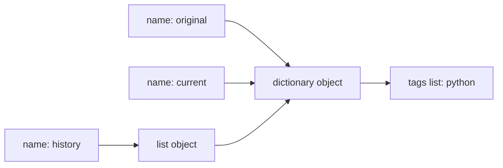
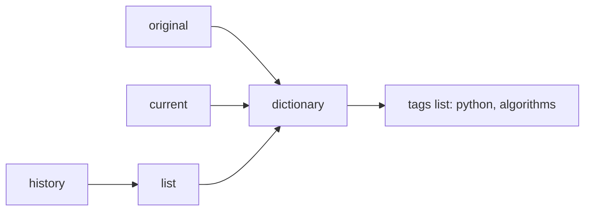
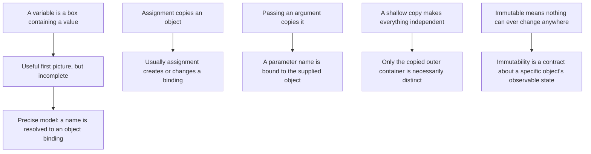

# Module 1 — Values, State, and Execution

## Why this module comes first

Advanced Python, algorithms, databases, concurrency, and distributed systems all depend on one idea: a program transforms state according to rules. Bugs multiply when “variable,” “value,” “object,” and “memory” are treated as synonyms.

This module builds a precise execution model before we build larger abstractions.

## Driving problem

Atlas receives study events:

```python
{
    "topic": "hash tables",
    "minutes": 25,
    "tags": ["algorithms", "python"]
}
```

A first prototype reuses lists and dictionaries across events. Later edits mysteriously change older records, caches disagree, and tests pass or fail depending on order.

The real problem is not “how to copy a list.” It is:

> What exists while a Python program runs, what can change, and how can we state what must remain true?

## Prerequisites

- Read basic Python expressions, conditionals, loops, functions, lists, and dictionaries.
- No formal proof background is assumed.
- Python installation is helpful for the lab but not required for Sessions 1–2.

## Learning outcomes

By the end, Michael can:

1. distinguish an object, a value, a name, a binding, and an environment;
2. trace evaluation and state transitions without relying on intuition alone;
3. predict aliasing and mutation behavior in nested structures;
4. separate identity from equality;
5. explain scope resolution and function-call frames;
6. state preconditions, postconditions, and invariants for an event normalizer;
7. choose mutation or immutability deliberately;
8. read an unfamiliar function and recover its state transitions;
9. write tests that expose shared-state and order-dependence bugs;
10. review an agent's repair for hidden aliasing;
11. connect this model to hashing, ADTs, databases, concurrency, and CPython.

## Concept model

We begin with five primitives:

- **Object:** a runtime entity with identity, type, and state.
- **Value:** the abstract information an object represents.
- **Name:** an identifier used in source code.
- **Binding:** an association from a name to an object in an environment.
- **State transition:** a change from one observable program state to another.

Assignment normally changes a binding. Mutation changes an object's state. If two names are bound to the same mutable object, mutation through either name is observable through the other.

This model will later scale:

- a data structure protects a representation invariant;
- a database transaction protects invariants across state transitions;
- a lock restricts which interleavings may mutate shared state;
- a distributed protocol reasons about state when no single machine sees the whole truth.

## Visual map of the module

```mermaid
%% atlas-diagram-id: m01-evaluation-binding-transition
%% atlas-diagram-title: From source expression to a tested state transition
%% atlas-diagram-alt: An expression is evaluated in an environment, objects are found or created, and names are bound to them. Rebinding changes the environment; mutation changes an object that every alias can observe. Both lead to observable state, whose contract and invariant are then tested.
flowchart LR
    A["Source expression"] --> B["Evaluate in an environment"]
    B --> C["Find or create objects"]
    C --> D["Bind names to objects"]
    D --> E{"Mutation?"}
    E -- "No: rebind a name" --> F["Environment changes"]
    E -- "Yes: change object state" --> G["Every alias observes the change"]
    F --> H["New observable program state"]
    G --> H
    H --> I["State a contract and invariant"]
    I --> J["Test the transition"]
```



The map shows the causal chain. Source code is not the state itself: evaluation uses an environment, bindings connect names to objects, and mutation may be visible through more than one name.

## Worked example — draw before running

```python
original = {"tags": ["python"]}
history = [original]
current = original
current["tags"].append("algorithms")
current = {"tags": ["databases"]}
```

After the first three lines:



Appending `"algorithms"` mutates the tags list. Every route to that list observes the change:



The final assignment to `current` does not repair history. It rebinds one name to a new dictionary; the older aliases still reach the first object.

| Statement | Binding change | Object mutation | Observable consequence |
|---|---|---|---|
| `history = [original]` | binds `history` | creates a list containing a reference | history and original reach the same dictionary |
| `current = original` | binds `current` | none | two names reach the same dictionary |
| `append(...)` | none | changes the tags list | all aliases observe the new tag |
| `current = {...}` | rebinds `current` | none | history still reaches the old dictionary |

## From intuitive fix to explicit contract

A shallow copy treats only the outer container as new:

```python
saved = original.copy()
```

The nested tags list is still shared. A domain-specific reconstruction makes the intended boundary explicit:

```python
from dataclasses import dataclass
from typing import Iterable, Mapping


@dataclass(frozen=True)
class StudyEvent:
    topic: str
    minutes: int
    tags: tuple[str, ...]


def normalize_event(raw: Mapping[str, object]) -> StudyEvent:
    topic = str(raw["topic"]).strip().casefold()
    minutes = int(raw["minutes"])
    if not topic:
        raise ValueError("topic must not be empty")
    if minutes < 0:
        raise ValueError("minutes must be nonnegative")

    incoming_tags = raw.get("tags", ())
    if not isinstance(incoming_tags, Iterable):
        raise TypeError("tags must be iterable")

    tags = tuple(
        str(tag).strip().casefold()
        for tag in incoming_tags
        if str(tag).strip()
    )
    return StudyEvent(topic=topic, minutes=minutes, tags=tags)
```

This example is not presented as magic:

- `frozen=True` blocks ordinary field reassignment; it does not make every imaginable nested object immutable.
- a tuple is chosen because the event contract does not require tag mutation;
- reconstructing the event prevents the returned record from retaining the caller's list;
- validation turns hidden assumptions into visible failure behavior.

The contract can now be tested:

```python
def test_normalization_does_not_retain_tag_alias() -> None:
    raw_tags = ["Python"]
    event = normalize_event(
        {"topic": " Hash Tables ", "minutes": 25, "tags": raw_tags}
    )

    raw_tags.append("later edit")

    assert event.tags == ("python",)
```

The test is evidence for one frame condition: later caller mutation does not change the normalized event.

## Misconception map



The “box” analogy is useful only to introduce stable names. It breaks when aliasing appears, because two labels can reach the same mutable object. From that point onward, the binding graph is the model we use.

## Teaching sequence

### Session 1 — The mystery of the changing record

**Launch:** inspect a short Atlas bug where changing a current event changes a historical event.

**Interactive tasks:**

1. Predict outputs before execution.
2. Draw objects as nodes and bindings as arrows.
3. Mark which statement rebinds a name and which mutates an object.
4. Propose an invariant for historical events.

**Exit ticket:** explain why shallow copying sometimes works and sometimes fails without using the phrase “Python is weird.”

### Session 2 — Evaluation, calls, and environments

**Derivation:**

1. expressions produce or locate objects;
2. calls create a new local environment;
3. arguments bind parameter names to objects;
4. return transfers an object reference to the caller;
5. exceptions alter normal control flow.

**Interactive tasks:**

- trace a nested call by hand;
- diagnose a mutable-default bug;
- compare a pure normalizer with an in-place normalizer;
- identify observable behavior and hidden state.

#### Prediction gate — lexical scope is a binding trace

Before opening the reveal, write the four printed values, draw the three
environments, and record **low / medium / high** confidence. In particular,
predict whether rebinding a callee's local name changes the enclosing or
global binding.

```python
global_label = "global"


def make_label_tools():
    label = "enclosing"

    def local_rebind():
        label = "local"
        return label

    def change_enclosing():
        nonlocal label
        label = "changed enclosing"
        return label

    return local_rebind, change_enclosing


local_rebind, change_enclosing = make_label_tools()
print(local_rebind())
print(change_enclosing())
print(change_enclosing())
print(global_label)
```

<details>
<summary>Reveal after writing your prediction and confidence.</summary>

The output is `local`, `changed enclosing`, `changed enclosing`, and `global`.

| Environment | Initial binding | After `local_rebind()` | After `change_enclosing()` |
| --- | --- | --- | --- |
| global | `global_label → "global"` | unchanged | unchanged |
| enclosing `make_label_tools` frame | `label → "enclosing"` | unchanged | `label → "changed enclosing"` |
| `local_rebind` call frame | created at call | `label → "local"` in that frame only | gone after return |

An assignment normally creates or rebinds a name in the current local frame.
`nonlocal label` instead selects the nearest enclosing function binding.
Neither operation changes the caller's binding merely because the name is
spelled the same; mutation is a separate operation on an object reached by a
binding. A useful regression test calls both closures and checks that the
global value is still `"global"`.

</details>

**Exit ticket:** state the difference between “the function changed its parameter” and “the function mutated an object passed by the caller.”

### Session 3 — Contracts and invariants

We introduce contracts because state without constraints is impossible to reason about.

For `normalize_event(raw)`:

- precondition: `raw` is a mapping containing a nonempty topic and nonnegative minutes;
- postcondition: the returned event has canonical text and immutable tags;
- frame condition: `raw` is not mutated;
- invariant: every stored event remains valid after later inputs are processed.

**Interactive tasks:**

- find underspecified behavior;
- convert examples into general claims;
- write a failing test for each violated claim;
- decide which failures are caller errors and which are system errors.

### Session 4 — Code-reading and investigation studio

Read three Atlas event-log implementations:

- a concise implementation with hidden aliasing;
- an overengineered generated implementation;
- a small implementation with an explicit immutable boundary.

For each one:

1. locate the public contract and state;
2. draw the object graph for one input;
3. identify every side effect;
4. predict one failure before running tests;
5. compare dependency and maintenance costs;
6. recommend which design to keep and why.

Then direct an agent to repair the selected implementation.

The repair requirements are:

- accept mapping-like input without retaining mutable aliases;
- normalize topic and tag text;
- reject invalid minutes with a specific exception;
- make recorded events safe from later caller mutation;
- preserve input order;
- expose no mutable internal collection;
- include tests for nested aliasing, repeated calls, invalid data, and test-order independence.

Michael reviews the patch, rejects scope expansion, adds or requests missing tests, and explains why the evidence supports the contract.

No storage, database, or concurrency is added yet. Those would hide the execution model we are trying to master.

### Session 5 — TA studio

Bring:

- one failing test;
- an object/binding diagram for the failure;
- the smallest code example that reproduces it;
- your current claim about the root cause.

The TA uses staged hints and records the final misconception and regression test.

### Session 6 — Mastery check and synthesis

Use this evidence check to choose the next bridge or repair; it does not decide
whether Michael passes.

1. Fast confidence-aware multiple-choice check with explanation and misconception repair.
2. Trace one unfamiliar program.
3. Reconstruct the architecture and state model of an unfamiliar implementation.
4. Diagnose a seeded shared-state bug and propose the smallest repair.
5. Review an agent-generated patch and identify one unproven claim.
6. Explain two backward connections and three forward connections.
7. Defend one mutability decision in the Atlas checkpoint.

## Problem set

### Problem 1 — Binding or mutation?

For ten short statements, classify each as:

- creates an object;
- binds or rebinds a name;
- mutates an object;
- observes state;
- changes control flow.

Some statements belong to more than one category. Defend ambiguous cases.

### Problem 2 — The copying ladder

Construct the smallest nested example where:

1. assignment aliases;
2. shallow copy separates the outer container but not an inner object;
3. a domain-specific reconstruction is safer than general deep copy.

Explain what contract each approach establishes.

### Problem 3 — Order-dependent tests

Given two tests that pass alone and fail together:

- locate shared state;
- make the failure deterministic;
- fix the design;
- add a regression test;
- explain why random test ordering detects symptoms but does not repair the contract.

### Problem 4 — Identity, equality, and future hashing

Design two study events that are equal by domain value but are distinct objects. Decide whether events should be hashable and list the conditions required for that decision.

This problem deliberately points forward to Module 8.

### Problem 5 — State-transition table

Represent the event log as states `S0`, `S1`, and `S2`. For each operation, state:

- allowed inputs;
- resulting state;
- returned value;
- invariant preserved;
- possible exception.

This notation will return in state machines, transactions, protocols, and distributed systems.

## Understanding check — eight confidence-aware questions

This is a fast diagnostic, not a memory contest. For each question:

1. choose one answer before opening its explanation;
2. record a confidence level;
3. give one sentence of reasoning or draw a tiny binding graph.

Use:

- **C1 — unsure:** mostly a guess;
- **C2 — reasoned:** one option seems best, but another remains plausible;
- **C3 — teach it:** you can trace the objects and bindings or construct a counterexample.

The answer-confidence pair is more useful than a score. A confident wrong answer reveals a model that needs repair; an uncertain correct answer reveals knowledge that is not yet dependable.

### Question 1 — shallow copying and nested aliases

```python
tags = ["python"]
event = {"tags": tags}
snapshot = event.copy()

tags.append("algorithms")
event = {"tags": ["databases"]}
```

What is `snapshot["tags"]` after all five statements?

A. `["python"]`  
B. `["python", "algorithms"]`  
C. `["databases"]`  
D. The lookup raises `KeyError`.

<details>
<summary>Answer and distractor rationales</summary>

**Answer: B.**

- **A** treats a shallow dictionary copy as a recursive copy. The outer dictionary is new, but its `"tags"` value still refers to the original list.
- **B** follows the reference graph: `tags`, the old `event`, and `snapshot` all reach the same nested list when `append` mutates it.
- **C** treats rebinding the name `event` as changing every object previously reached through that name. Rebinding does not rewrite `snapshot`.
- **D** assumes the final rebinding removes a key from the copied dictionary. `snapshot` remains bound to its own dictionary.

</details>

### Question 2 — mutation followed by local rebinding

```python
def revise(record: dict[str, int]) -> dict[str, int]:
    record["minutes"] += 5
    record = {"minutes": 0}
    return record


original = {"minutes": 20}
returned = revise(original)
```

Which pair is correct?

A. `original == {"minutes": 20}` and `returned == {"minutes": 0}`  
B. `original == {"minutes": 25}` and `returned == {"minutes": 0}`  
C. `original == {"minutes": 0}` and `returned is original`  
D. `original == {"minutes": 25}` and `returned is original`

<details>
<summary>Answer and distractor rationales</summary>

**Answer: B.**

- **A** notices the later rebinding but overlooks the earlier mutation of the caller's dictionary.
- **B** separates the two transitions: item assignment mutates the shared object; the next assignment rebinds only the local parameter name to a new dictionary.
- **C** assumes rebinding a parameter redirects the caller's name as well.
- **D** correctly predicts the mutation but incorrectly treats the newly returned dictionary as the original object.

</details>

### Question 3 — equality and identity

```python
left = {"tags": ("python",)}
right = {"tags": ("python",)}
alias = left
```

Which statement is correct?

A. `left == right`, `left is right`, and `alias is left` are all `True`.  
B. `left == right` and `alias is left` are `True`, while `left is right` is `False`.  
C. `left == right` is `False` because the dictionaries have distinct identities.  
D. `alias is left` is `False` because assignment copies a dictionary.

<details>
<summary>Answer and distractor rationales</summary>

**Answer: B.**

- **A** collapses value equality into object identity. Two separately created dictionaries can represent equal values without being one object.
- **B** distinguishes the questions correctly: `==` compares domain value here, while `is` compares identity; `alias = left` creates another binding to the same dictionary.
- **C** assumes distinct identity prevents equality.
- **D** assumes assignment copies an object rather than creating another binding.

</details>

### Question 4 — augmented assignment is operation-dependent

```python
def add_topic(topics: list[str]) -> None:
    topics += ["recursion"]


saved = ["state"]
add_topic(saved)
```

What is the most precise explanation?

A. `saved` remains `["state"]` because `topics` is a local name.  
B. `saved` becomes `["state", "recursion"]`; list `+=` changes the list in place and the local name remains bound to that resulting object.  
C. `saved` remains `["state"]`; every augmented assignment creates a new object.  
D. `saved` becomes `["state", "recursion"]` because any assignment to a parameter changes the caller's binding.

<details>
<summary>Answer and distractor rationales</summary>

**Answer: B.**

- **A** confuses local bindings with local objects. A local name may reach an object also reached by the caller.
- **B** accounts for both semantics: the list's in-place operation mutates the shared object, and assignment of the operation's result does not redirect `saved`.
- **C** overgeneralizes from immutable objects or from `topics = topics + [...]`; augmented assignment first attempts the type's in-place operation.
- **D** predicts the observable result for the wrong reason. A callee cannot rebind the caller's local name merely by assigning its parameter.

</details>

### Question 5 — default-object lifetime

```python
def recorded_topics(topic: str, log: list[str] = []) -> tuple[str, ...]:
    log.append(topic)
    return tuple(log)


first = recorded_topics("state")
second = recorded_topics("recursion")
```

Which result and explanation are correct?

A. `first == ("state",)` and `second == ("recursion",)` because defaults are created for each call.  
B. `first == ("state",)` and `second == ("state", "recursion")` because one default list is reused, while each returned tuple is a separate snapshot.  
C. Both `first` and `second` become `("state", "recursion")` because the tuples alias the list.  
D. The second call raises an error because a default may be used only once.

<details>
<summary>Answer and distractor rationales</summary>

**Answer: B.**

- **A** places default-expression evaluation at call time. The default list is created when the function definition executes.
- **B** tracks both lifetimes: calls share the default list, but `tuple(log)` constructs a new immutable tuple during each call.
- **C** correctly suspects shared state but incorrectly claims a tuple is a live view of the list.
- **D** invents a one-use rule; Python permits repeated use, which is exactly why the hidden state can cause order-dependent behavior.

</details>

### Question 6 — contract evidence, not a plausible example

An agent proposes this Atlas recorder:

```python
def record_event(
    raw: dict[str, object],
    history: list[dict[str, object]],
) -> None:
    normalized = {
        "topic": str(raw["topic"]).strip().casefold(),
        "tags": raw.get("tags", []),
    }
    history.append(normalized)
```

The contract says that a recorded event must not change when the caller later edits its input. Which revision and evidence address that contract most directly?

A. Use `normalized = raw.copy()` and assert the values immediately after recording.  
B. Copy `history` before appending, then check its length.  
C. Reconstruct tags into an owned immutable tuple and test that mutating the caller's original tag list afterward does not change the recorded event.  
D. Add a comment telling callers not to mutate their input.

<details>
<summary>Answer and distractor rationales</summary>

**Answer: C.**

- **A** creates another outer dictionary but retains a nested tag-list alias; an immediate assertion cannot expose later mutation.
- **B** changes the wrong ownership boundary. Copying the outer history list does not detach a recorded event from caller-owned nested state.
- **C** aligns representation and evidence with the frame condition: the stored tags do not retain the caller's mutable list, and the test observes behavior after the dangerous transition.
- **D** replaces an enforceable design property with an undocumented runtime dependency on perfect caller behavior.

</details>

### Question 7 — architecture and ownership

Atlas has three components:

```text
input adapter → event normalizer → event store
```

The input adapter receives mutable dictionaries. The normalizer is intended to establish the valid `StudyEvent` contract. The store should preserve valid events and let callers inspect history without mutating its internal collection.

Which architecture makes ownership and dependency direction clearest?

A. Let every component accept and return the same mutable dictionary/list objects; document that callers should be careful.  
B. Normalize once into an immutable `StudyEvent`, make the store accept that domain value, and have the store expose an immutable snapshot or read-only view of its collection.  
C. Let the store normalize raw dictionaries and also print validation errors, so all behavior is in one place.  
D. Deep-copy every object at every function call, regardless of contract.

<details>
<summary>Answer and distractor rationales</summary>

**Answer: B.**

- **A** leaves ownership implicit and allows mutations to cross every boundary.
- **B** gives each boundary one responsibility: the normalizer establishes the domain invariant; the store depends on valid values and protects collection ownership.
- **C** mixes domain construction, storage, and presentation. It hides dependency direction and makes the store harder to reuse or test.
- **D** may mask some aliases but replaces design reasoning with indiscriminate cost; it still does not say which representation or effects the contract permits.

</details>

### Question 8 — patch review and concurrency transfer

An agent claims this future Atlas counter is safe because “the GIL prevents two Python threads from changing it at the same time”:

```python
def record_completion(stats: dict[str, int]) -> None:
    current = stats["completed"]
    stats["completed"] = current + 1
```

Which review response shows the strongest Module 1 reasoning?

A. Accept it: one function call is always one indivisible state transition.  
B. Accept it: integers are immutable, so shared dictionary state cannot race.  
C. Reject the claim: the read, computation, and write are separate transitions that may interleave; define the required atomic invariant, then protect the whole transition with an appropriate ownership/synchronization design and test observable behavior.  
D. Replace `current` with a global variable so both threads see the same name.

<details>
<summary>Answer and distractor rationales</summary>

**Answer: C.**

- **A** treats a source-level function boundary as a guarantee of atomic execution. The contract supplies no such guarantee.
- **B** confuses integer immutability with atomicity of a multi-step update to a shared dictionary.
- **C** decomposes the operation into observable state transitions, identifies the invariant that needs protection, and asks architecture plus evidence to support the claim.
- **D** increases hidden shared state and does not prevent lost updates.

This question points forward to Module 19. No concurrency API is required yet; the transferable skill is refusing to treat several state transitions as one merely because they appear inside one function.

</details>

### Confidence interpretation

Use the result to choose the next learning action:

| Result | What it suggests | Next action |
|---|---|---|
| correct + C3 | stable, explainable model | give a new transfer case or ask for a counterexample |
| correct + C2 | usable but not robust | retrieve with a changed example in 3 days |
| correct + C1 | possible recognition or lucky selection | explain why two distractors fail before moving on |
| incorrect + C1 | productive uncertainty | inspect the smallest object graph, then retry |
| incorrect + C2 | competing partial models | contrast the chosen option with the correct state trace |
| incorrect + C3 | high-confidence misconception | priority TA intervention, minimal counterexample, delayed retrieval |

No percentage determines the next step. The evidence is useful when Michael can
defend an answer using objects, bindings, state transitions, contracts, or
architecture—not merely recognize the correct letter.

### Misconception routing

| Missed item | Likely gap | Route |
|---|---|---|
| 1 | shallow copy versus nested aliasing | redraw the worked object graph; complete Problem 2 with one nested list |
| 2 | mutation versus local rebinding | trace two call frames in Session 2 and label each statement by transition type |
| 3 | identity versus equality | construct two equal distinct events for Problem 4 |
| 4 | augmented assignment and type-specific behavior | contrast `topics += [...]` with `topics = topics + [...]` using object identities |
| 5 | definition-time defaults and cross-call state | create the two-call minimal reproduction from Problem 3 |
| 6 | frame conditions and delayed evidence | revisit the alias regression test after `normalize_event` |
| 7 | state ownership across architecture boundaries | repeat Session 4's dependency map before reading code |
| 8 | multi-step state transitions and unjustified atomicity | draw two interleaved read/compute/write traces; save synchronization mechanisms for Module 19 |

For any incorrect C3 response, the TA records the misconception in the shared log and schedules an isomorphic question several days later. For any correct C1 response, Michael explains one rejected distractor before the evidence is treated as stable.

The check can be administered interactively in chat, one item at a time. Answers remain hidden until Michael commits to both a choice and confidence level.

## Atlas milestone 1

Deliver:

- an annotated architecture and state-flow map for `atlas/events.py`;
- an agent task specification and reviewed patch;
- `tests/test_events.py`;
- a one-page design note with contracts and invariants;
- one object graph;
- a short explanation of time and auxiliary-space costs.

### Evidence rubric

| Evidence | Evidence to carry forward | If a bridge is needed, repair by |
| --- | --- | --- |
| Binding/state trace | every name, object, and observable mutation is accounted for | redraw the smallest failing trace before rerunning code |
| Contract and ownership note | precondition, postcondition, and who may mutate are explicit | replace vague “does not change data” wording with a concrete frame condition |
| Regression evidence | a test distinguishes rebinding, shallow copying, or aliasing from the intended behavior | add the smallest before/after caller-mutation case |
| Design explanation | the chosen boundary is defended against one credible alternative | name the trade-off in safety, cost, and later change |

## Connections

### What this module uses

- basic Python reading;
- ordinary ideas of things, names, and change.

### What this module enables

- Module 2: call environments make recursion understandable;
- Module 3: invariants become ADT representation invariants;
- Module 6: references become nodes and links in data structures;
- Module 8: equality and immutability become hashing constraints;
- Module 13: shared hidden state becomes a testing problem;
- Module 16: state transitions become transactions;
- Module 19: shared mutation becomes a race condition;
- Module 23: environments become interpreter data structures;
- Module 24: objects and frames become concrete CPython structures.

## Official calibration card

| Atlas evidence | Official calibration anchor | Decision |
| --- | --- | --- |
| Sessions 1–6: object/binding traces, aliasing predictions, component contracts, the shared-state regression artifact, guided repair, and synthesis | [MIT 6.100L calendar](https://ocw.mit.edu/courses/6-100l-introduction-to-cs-and-programming-using-python-fall-2022/pages/calendar/) sequences objects, bindings, functions/environments, mutation, aliasing/cloning, debugging, and assertions. | **Aligned, adapted.** Atlas keeps the reasoning in Python and foregrounds prediction/code reading; C/C0, Unix, and institutional assignment volume are deferred. |

**Access and reuse.** Checked 2026-08-01. This is a link-only calibration
source: Atlas's explanations, diagrams, traces, prompts, and diagnostics remain
original. Do not copy course prose, figures, assignments, solutions, or
assessment material.

## Sources and further study

The Atlas narrative, object graphs, investigations, diagnostic distractors, and review work are original to this course. These sources provide independent explanations and authoritative language detail:

- [Python 3.14 execution model](https://docs.python.org/3.14/reference/executionmodel.html) — blocks, name binding, scopes, and execution frames.
- [Python 3.14 data model](https://docs.python.org/3.14/reference/datamodel.html) — objects, identity, type, value, mutability, and callable objects.
- [Python 3.14 assignment statements](https://docs.python.org/3.14/reference/simple_stmts.html#assignment-statements) — authoritative assignment and target-list semantics.
- [Composing Programs §2.4 — Mutable Data](https://www.composingprograms.com/pages/24-mutable-data.html) — identity, mutation, state, and shared local state in a computational-abstraction sequence.
- [MIT 6.102 Spring 2026 — Mutability & Immutability](https://web.mit.edu/6.102/www/sp26/classes/09-mutability/) — reasoning about aliases, mutation, contracts, and risks at software boundaries.
- [MIT 6.101 Spring 2026](https://py.mit.edu/spring26/) — the read–lab–checkoff rhythm adapted into the course’s prediction, investigation, and ownership studios.

Use the sources by question rather than as a reading pile: begin with this workbook’s object graph, use the Python reference to verify exact language behavior, use Composing Programs for a second conceptual explanation, and read the MIT material when moving from local aliasing to component-level contracts.

### Session-to-source-and-evidence route

| Session | Claim or learner artifact | Consult after your own attempt |
| --- | --- | --- |
| 1 | object/binding graph and aliasing prediction | [Python data model](https://docs.python.org/3.14/reference/datamodel.html) for identity, value, and mutability terms |
| 2 | environment trace and local-versus-`nonlocal` conclusion | [Python execution model](https://docs.python.org/3.14/reference/executionmodel.html) for blocks, bindings, and frames |
| 3 | ownership contract and mutation regression | [MIT 6.102 mutability reading](https://web.mit.edu/6.102/www/sp26/classes/09-mutability/) for alias and boundary reasoning |
| 4 | annotated code reading and bounded repair request | [MIT 6.101](https://py.mit.edu/spring26/) only as a link-level comparison for read–lab–checkoff rhythm |
| 5 | oral explanation of a smallest failure | the preceding trace and test; do not substitute a source quote for evidence |
| 6 | synthesis dossier and forward handoff | this workbook plus the linked Python references to verify any disputed language claim |

## Constructive next-step guide

Evidence chooses the next bridge or repair; it does not decide whether Michael
passes. With a clear, self-supported explanation, continue with the M2 handoff.
That explanation should cover an unfamiliar aliasing trace, an ownership
contract, a shared-state regression test, and one way the model scales to a
larger system. Otherwise, redraw the smallest binding/object trace with the
Teaching Assistant and retry the corresponding aliasing counterexample.

This guide is not a score, grade, release approval, Core advance, or mastery declaration.

## Guided Codex handoff — M1

### Teaching Assistant — supportive oral defense

Start with: **“I am finishing M1. My model is that names refer to objects,
mutation changes an object rather than a name, and a contract must say who may
change shared state. My confidence is [low/medium/high].”** Ask the learner to
draw one object graph and predict the result of one aliasing trace before
revealing it. If the trace breaks, use this hint ladder: name → binding arrow →
object identity/value → mutation versus rebinding → smallest regression test.
Then change one premise (immutable value, copied container, or second writer)
and ask what contract must change. End with a learner-controlled summary:
model demonstrated, misconception repaired, one retrieval prompt, and one
remaining uncertainty. This is a conversation, never a pass/fail exam.

### Study Partner — five-minute rehearsal

Ask for a two-column whiteboard trace: **names/bindings** on one side and
**objects/values** on the other. Change exactly one operation from rebinding to
mutation (or vice versa) and ask which observer can now see a change. Finish
with: “What assertion would catch the shared-state bug before a user does?”

### Retrieval, ready-when, and forward handoff

Retrieve the object-graph model at **+1 day, +7 days, and +21 days**. The M1
evidence supports the M2 handoff when the learner can (1) trace an unfamiliar
aliasing snippet without running it, (2) name one ownership or mutation
contract, and (3) design one test that distinguishes rebinding from mutation.
Carry that trace and contract into **M2**: recursion is also a changing
execution state, but its state lives in frames and call relationships rather
than one shared container.
