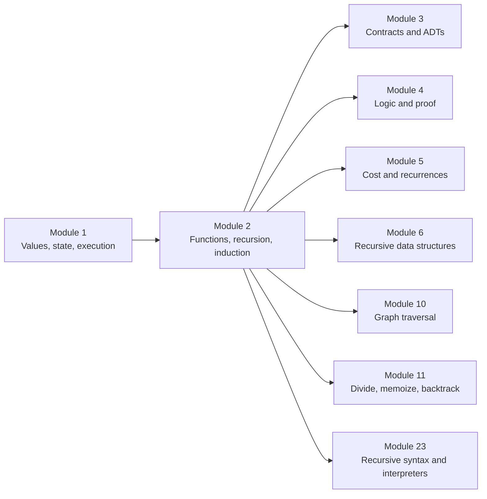
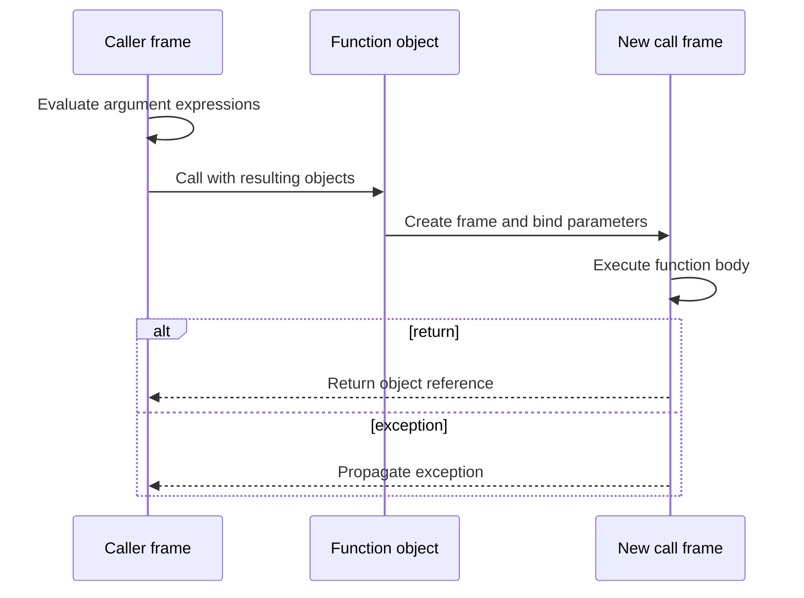
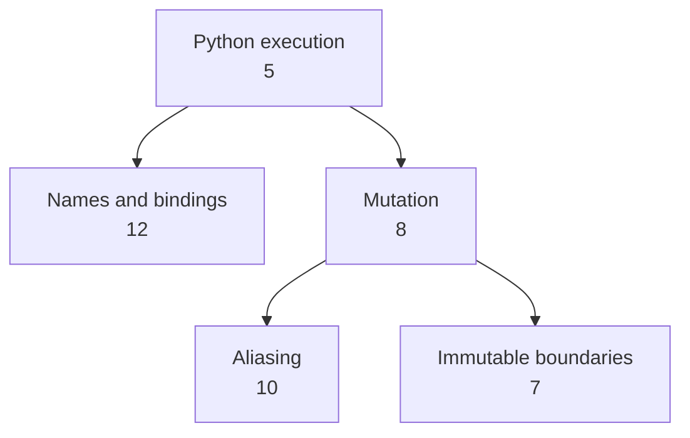
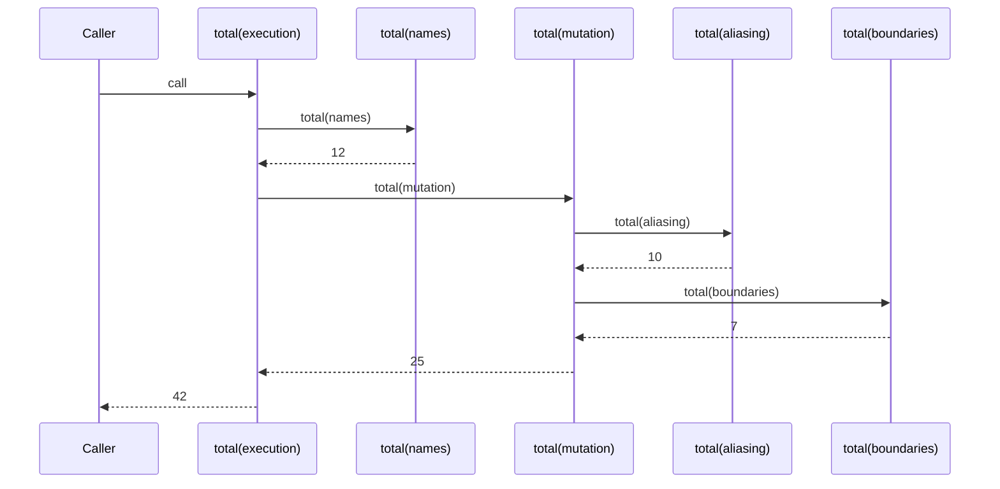
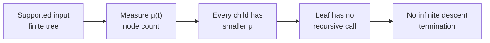
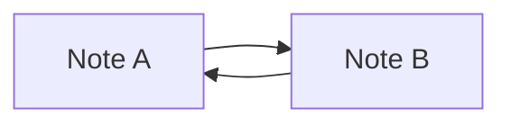
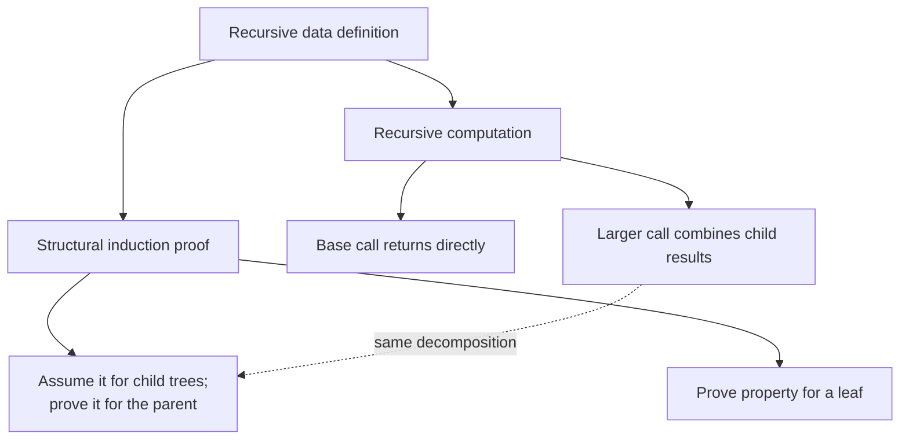
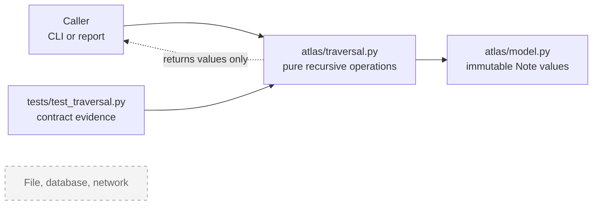
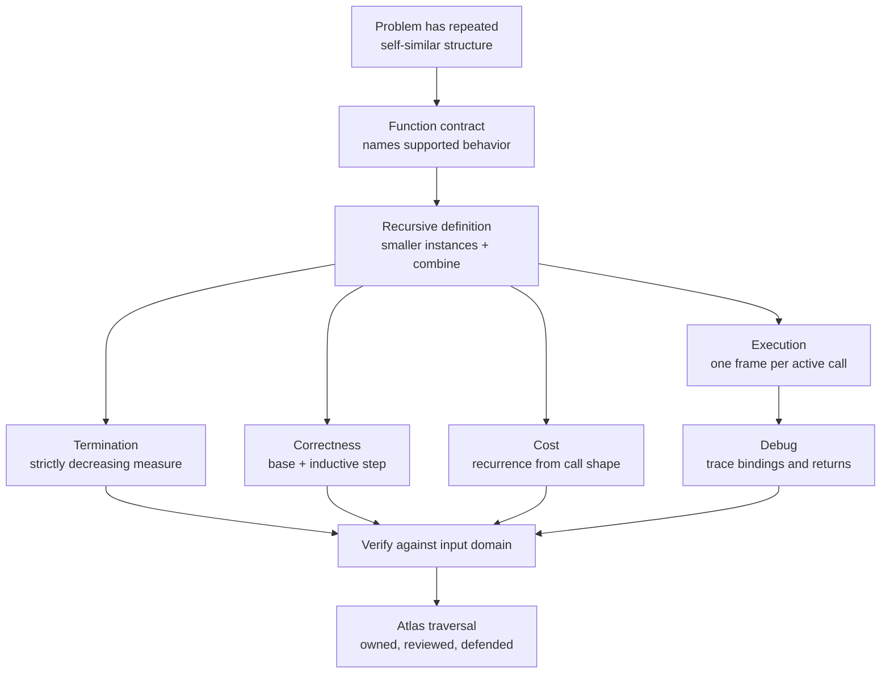

# Module 2 — Functions, Recursion, and Induction

> **Central idea:** a function gives a computation a boundary; recursion gives repeated structure an executable form; induction gives the same structure a correctness argument.

This is a connected workbook, not a reference chapter. Work through it in order. Predict before running code, draw before explaining, and use the answer sections only after committing to a claim.

---

## 1. Position in the knowledge graph

Module 1 established that a call creates a new execution frame, parameter names are bound to supplied objects, mutation changes objects, and rebinding changes an environment. Module 2 uses that model to answer a harder question:

> How can a finite function definition describe a computation whose input may have an unknown depth, and how can we know that the computation terminates, returns the right result, and uses acceptable resources?



### The driving Atlas problem

Atlas now groups notes into a hierarchy:

```text
Python execution (5 min)
├── Names and bindings (12 min)
└── Mutation (8 min)
    ├── Aliasing (10 min)
    └── Immutable boundaries (7 min)
```

The number of levels is not fixed. Atlas must answer questions such as:

- How many study minutes are represented by this whole branch?
- In what path does a note occur?
- Does a traversal always finish?
- Will a note be counted once or once per path?
- What happens when the hierarchy is a chain thousands of notes deep?

Writing one loop per level cannot solve an unknown-depth problem. Calling a function on smaller subtrees can—but only if its contract, progress rule, and combination rule are precise.

### The seven recurring course questions

| Course question | Module 2 answer |
|---|---|
| What is represented? | A computation as a function; a hierarchy as a root plus child subtrees |
| What can change? | Local frame bindings may change; a pure traversal does not change the input tree |
| What is the contract? | Input domain, returned result, exceptions, effects, and progress assumptions |
| Why is it correct? | Base case + inductive/structural step + termination argument |
| What does it cost? | One call per visited node; call-stack space depends on height |
| What can fail? | Missing base case, no progress, cycles, shared subtrees, excessive depth, hidden effects |
| Who is affected? | Learners need trustworthy totals; maintainers need a traversal they can explain and change |

---

## 2. Prerequisite retrieval — do this before reading on

Answer without running the code. Use an object-and-binding diagram if uncertain.

### Retrieval 1 — rebinding or mutation?

```python
def add_topic(topics: list[str]) -> None:
    topics = topics + ["recursion"]


saved = ["state"]
add_topic(saved)
```

What is `saved` afterward, and why?

### Retrieval 2 — a call frame

When `add_topic(saved)` begins, what object is the local name `topics` bound to? What changes when the assignment in the function body executes?

### Retrieval 3 — aliasing

```python
def add_topic_in_place(topics: list[str]) -> None:
    topics.append("recursion")
```

Why does this version have an observable effect on the caller even though `topics` is a local name?

### Retrieval 4 — contract language

For a function that accepts a study event and returns a normalized event, name:

1. one precondition;
2. one postcondition;
3. one frame condition;
4. one possible failure.

### Retrieval 5 — identity and equality

Can two distinct note objects represent equal domain values? What would `is` and `==` be asking in that situation?

### Retrieval 6 — state transition

Describe a function call as a sequence involving the caller, argument evaluation, a new frame, parameter bindings, a returned object, and frame completion.

<details>
<summary>Check the prerequisite model</summary>

1. `saved` remains `["state"]`. The expression creates a new list and the assignment rebinds only the local name `topics`.
2. Initially, `topics` is bound to the same list object reached by `saved`. The assignment then binds `topics` to a newly created list; it does not change the original list.
3. `append` changes the shared list object. The local and caller names reach the same object, so the caller observes the mutation.
4. A valid answer states an input assumption, a result guarantee, what is not changed, and a specified exception or invalid-input behavior.
5. Yes. `is` asks whether the references identify the same object; `==` asks whether the objects compare equal by value according to their equality behavior.
6. The caller evaluates argument expressions, Python creates a call frame, parameters are bound to the resulting objects, the body executes, `return` supplies an object reference to the caller, and the frame stops executing.

If items 1–3 are unclear, return to Module 1's binding diagrams before continuing. Recursion creates many frames; it does not change the binding model.

</details>

---

## 3. Learning outcomes

By the end of this module, Michael can:

1. distinguish a function object, a function definition, and a function call;
2. recover a function's contract from code and tests;
3. distinguish a mathematical function from a stateful Python computation;
4. trace nested and recursive calls frame by frame;
5. derive a recursive definition from the shape of a finite problem;
6. identify the base case, recursive case, progress measure, and combination rule;
7. prove termination using a decreasing measure;
8. use ordinary or structural induction to justify a recursive result;
9. derive and interpret a recurrence for time and stack space;
10. diagnose missing returns, non-progress, mutable-default state, and tree-versus-graph errors;
11. read a small Atlas subsystem from public contract to data flow;
12. give an agent a bounded traversal task, review its patch, and demand evidence;
13. implement one small recursive mechanism manually because construction exposes how results return through frames;
14. explain how this model leads to ADTs, data structures, algorithms, interpreters, and distributed retry logic.

---

## 4. The concept story: from repeated work to a justified computation

### 4.1 Observation: fixed syntax meets unknown depth

Suppose Atlas stores a note and its direct children:

```python
from dataclasses import dataclass


@dataclass(frozen=True)
class Note:
    title: str
    minutes: int
    children: tuple[Note, ...] = ()
```

The annotation `tuple[Note, ...]` says that `children` is a tuple containing zero or more `Note` objects. Python 3.14 evaluates annotations lazily, so the class body can refer to `Note` before the class definition has finished. The annotation is useful documentation and input to tools; it does not by itself validate values at runtime.

Here is a depth-two solution:

```python
def total_two_levels(note: Note) -> int:
    total = note.minutes
    for child in note.children:
        total += child.minutes
        for grandchild in child.children:
            total += grandchild.minutes
    return total
```

**Predict before continuing:** Which valid input makes this function silently return the wrong total?

The code's structure contains exactly two child loops. A great-grandchild is a valid `Note`, but its minutes are never visited. Adding another loop only moves the failure one level away.

The data supplies its own repeated shape:

> A note tree is one note together with zero or more smaller note trees.

The computation should follow that shape:

> The total for a note tree is the root's minutes plus the total for each child tree.

That is the need from which recursion is derived. Recursion is not “a function doing something magical to itself.” It is a finite rule that delegates structurally smaller instances to new calls.

### First-principles derivation — finite rules for unknown depth

Start with the finite grammar: a `Note` is one root contribution plus a
finite sequence of smaller `Note` values. A function can therefore use one
base rule for an empty child sequence and one combining rule that reuses the
same contract only on those structurally smaller children; no fixed nesting
depth needs to be guessed in advance.

### Definition — recursive contract and supported domain

A recursive contract names a supported input domain, a base case, the result
for that case, the strictly smaller inputs delegated to recursive calls, and
the rule that combines their results. For `total_minutes`, the supported
domain is a finite `Note` tree rather than every object that happens to have a
`children` attribute.

### Assumption — finite-tree input and ownership boundary

The tree argument assumes each child occurrence denotes a smaller finite
subtree and that the traversal only reads the tree. A cycle or an ownership
boundary that lets a call mutate a shared input is not silently covered by
that argument; it must be rejected by the contract or reasoned about under a
different graph-and-effects model.

### Derivation and proof idea — recursive decomposition

The data definition gives the computation shape: solve the root contribution
directly, ask the same contract of each smaller child, then combine one result
per child. The correctness argument follows the same decomposition: establish
the leaf case, assume the contract for child trees, and show the combination
rule establishes it for the parent.

### Counterexample — a base case without progress

`countdown(3)` that stops only at zero but calls `countdown(number - 2)` has a
base case and still fails to reach it. A base case is a branch; a termination
argument also needs a measure that stays in its stated domain and strictly
decreases on every recursive call.

### Numerical experiment — call count versus active stack depth

For a finite tree, record two quantities rather than treating “recursive” as
a cost claim: total calls (one per visited node for this traversal) and the
maximum simultaneous call depth (the tree height). Compare a balanced tree
and a chain with the same node count before reading the cost conclusion.

### 4.2 A function is an executable boundary

Plain language:

> A function names a computation so callers can depend on what it does without copying its steps.

More precisely:

> A Python function definition creates a function object and binds a name to it. Calling that object evaluates arguments, creates an execution frame, binds parameters, executes the body, and either returns an object or raises an exception.



A definition and a call are different events:

```python
def canonical_title(raw: str) -> str:  # creates a function when this statement executes
    return raw.strip().casefold()


normalizer = canonical_title             # binds another name to that function object
result = normalizer("  Recursion  ")     # calls the object and returns "recursion"
```

`normalizer` and `canonical_title` reach the same function object. Functions are values in Python: they can be stored, passed, and returned. Later modules will use that fact for policies, callbacks, decorators, and dependency injection.

### Prediction before reveal — identify the recursive boundary

```python
def twice(operation, value):
    return operation(operation(value))


def add_one(number: int) -> int:
    return number + 1


answer = twice(add_one, 10)
```

Before running: What is bound to `operation` in the `twice` frame? How many additional call frames are created, and what is `answer`?

<details>
<summary>Check the frame explanation</summary>

`operation` is bound to the `add_one` function object. The inner `operation(value)` creates one `add_one` frame and returns `11`; the outer call creates another and returns `12`. The completed `twice` call returns `12`, which is bound to `answer`.

</details>

### 4.3 A contract closes the gap between mathematics and Python

In mathematics, a function maps each member of a domain to exactly one member of a codomain. A Python function can read time, mutate an argument, depend on global state, write a file, return different values on different calls, or raise an exception.

```python
attempts = 0


def label(topic: str) -> str:
    global attempts
    attempts += 1
    return f"{attempts}: {topic}"
```

`label("recursion")` does not denote one stable mathematical mapping from the string to a string. Its result depends on hidden state. That can be legitimate, but the effect must be part of the engineering contract.

For this course, a useful function contract states:

| Contract part | Question | Atlas example |
|---|---|---|
| Input domain | Which inputs are supported? | finite, acyclic `Note` trees with nonnegative minutes |
| Postcondition | What must be true of the result? | result equals the sum of every node's minutes |
| Frame condition | What must remain unchanged? | the input tree is not mutated |
| Failure behavior | Which invalid states are rejected, and how? | validation rejects negative minutes before traversal |
| Effect boundary | What outside the return value may be observed? | none for `total_minutes` |
| Cost promise | Which resource expectation matters? | linear time in nodes; stack proportional to height |

The distinction between a *pure* transformation and a controlled effect is architectural, not moral:

```python
def summary_line(note: Note) -> str:
    return f"{note.title}: {total_minutes(note)} minutes"


def write_summary(note: Note, output) -> None:
    output.write(summary_line(note) + "\n")
```

`summary_line` computes a value. `write_summary` performs an effect through an explicit dependency, `output`. Separating them lets tests reason about the computation without also reasoning about files or terminals.

| Design | Hidden dependencies | Repeatability | Typical role |
|---|---:|---:|---|
| pure transformation | none | same supported input, same result | domain logic |
| controlled effect | named in parameters or component boundary | depends on explicit collaborator | delivery/persistence |
| hidden effect | global or ambient state | difficult to predict in isolation | usually a design smell |

### 4.4 Deriving recursion: four obligations

A safe recursive design answers four questions before code is written.

1. **Base case:** Which smallest input can be answered directly?
2. **Recursive case:** How is a larger input expressed using smaller inputs of the same kind?
3. **Progress measure:** Why is each delegated input strictly smaller?
4. **Combination rule:** How do smaller returned results form the larger result?

For Atlas:

| Obligation | `total_minutes` answer |
|---|---|
| Base case | a leaf has no children, so its total is its own minutes |
| Recursive case | ask for the total of each child subtree |
| Progress measure | each child subtree contains fewer nodes than its parent tree |
| Combination rule | root minutes + all child totals |

The recursive definition is:

\[
\operatorname{total}(v)
=
\operatorname{minutes}(v)
+
\sum_{c \in \operatorname{children}(v)} \operatorname{total}(c)
\]

The empty sum is zero, so the same equation handles a leaf without a special branch in the Python code:

```python
def total_minutes(note: Note) -> int:
    subtotal = note.minutes
    for child in note.children:
        subtotal += total_minutes(child)
    return subtotal
```

The function is recursive because executing one call may require new calls to the same function. Every call has its own `note`, `subtotal`, and loop position.

### 4.5 Worked trace: calls go down; results come back up

Use this concrete tree:

```python
names = Note("Names and bindings", 12)
aliasing = Note("Aliasing", 10)
boundaries = Note("Immutable boundaries", 7)
mutation = Note("Mutation", 8, (aliasing, boundaries))
execution = Note("Python execution", 5, (names, mutation))
```

**Prediction:** What value is returned? What is the greatest number of active `total_minutes` frames at once?



Selected execution states:

| Step | Active calls, oldest → newest | Current event |
|---:|---|---|
| 1 | `total(execution)` | root subtotal starts at `5` |
| 2 | `total(execution)`, `total(names)` | leaf subtotal is `12` |
| 3 | `total(execution)` | leaf returns `12`; root subtotal becomes `17` |
| 4 | `total(execution)`, `total(mutation)` | mutation subtotal starts at `8` |
| 5 | `total(execution)`, `total(mutation)`, `total(aliasing)` | leaf returns `10` |
| 6 | `total(execution)`, `total(mutation)`, `total(boundaries)` | leaf returns `7` |
| 7 | `total(execution)`, `total(mutation)` | mutation returns `8 + 10 + 7 = 25` |
| 8 | `total(execution)` | root subtotal becomes `17 + 25 = 42` |
| 9 | caller only | root returns `42` |



The deepest moment has three active traversal frames: `execution`, `mutation`, and one leaf. The traversal visits five nodes but does not keep five frames active simultaneously. This distinction becomes the space analysis later.

#### Worked return-order trace

```python
def mirror(number: int) -> str:
    if number == 0:
        return "x"
    return f"{number}{mirror(number - 1)}{number}"
```

Substitution exposes the return order:

```text
mirror(2)
= "2" + mirror(1) + "2"
= "2" + ("1" + mirror(0) + "1") + "2"
= "2" + ("1" + "x" + "1") + "2"
= "21x12"
```

The prefixes are evaluated while calls descend; the suffixes can be completed only as results return. Reading recursive code requires tracing both directions.

### 4.6 Three broken recursions and what each teaches

#### Broken A — no progress

```python
def broken_total(note: Note) -> int:
    return note.minutes + broken_total(note)
```

There is no smaller input and no reachable base case. New frames are created until the interpreter stops the computation with `RecursionError`.

#### Broken B — a result is discarded

```python
def broken_count(note: Note) -> int:
    if not note.children:
        return 1

    count = 1
    for child in note.children:
        broken_count(child)
    return count
```

The calls terminate, but their returned counts are ignored. Termination and correctness are separate claims.

#### Broken C — hidden state crosses calls

```python
def broken_titles(note: Note, found: list[str] = []) -> list[str]:
    found.append(note.title)
    for child in note.children:
        broken_titles(child, found)
    return found
```

Default argument expressions are evaluated when the function is defined, not freshly for each call. Independent root calls reuse the same list. Recursion makes the shared accumulator appear many times within one call; Module 1 explains why it also leaks across calls.

A repaired version creates owned state at the public boundary and passes it through a private helper:

```python
def preorder_titles(note: Note) -> tuple[str, ...]:
    found: list[str] = []

    def visit(current: Note) -> None:
        found.append(current.title)
        for child in current.children:
            visit(child)

    visit(note)
    return tuple(found)
```

This function has a controlled local effect: `visit` mutates a list created during the current `preorder_titles` call. The caller receives an immutable tuple and cannot observe the temporary accumulator itself.

**Architecture question:** Why is “recursion should never mutate” an inferior rule to “effects need explicit ownership and boundaries”?

<details>
<summary>Suggested explanation</summary>

Local mutation can be a clear and efficient implementation mechanism. The important questions are who owns the object, whether it escapes, which calls share it, and whether the public contract exposes the effect. A blanket ban hides those design questions instead of answering them.

</details>

---

## 5. Termination: a base case is necessary but not sufficient

Consider:

```python
def countdown(number: int) -> None:
    if number == 0:
        return
    countdown(number - 2)
```

There is a base case, but `countdown(3)` visits `3, 1, -1, -3, ...`; it never reaches zero. A termination argument requires a **well-founded measure**:

- it maps every supported input to a nonnegative quantity;
- every recursive call strictly decreases that quantity;
- there cannot be an infinite descending sequence of nonnegative integers.

For `total_minutes`, choose:

\[
\mu(t) = \text{number of nodes in tree } t
\]

Every child subtree has at least one fewer node than the whole tree, so every recursive call decreases \(\mu\). A leaf makes no recursive calls. Therefore the traversal terminates for every finite tree.



### Where the proof stops applying

Python objects can form a graph even when their fields are named `children`. If an input contains a cycle, “child subtree has fewer nodes” is false because there is no finite subtree unfolding:



Do not “fix” this automatically. First choose the domain semantics:

- **Tree contract:** cycles and shared children are invalid; validate or construct notes so the invariant holds.
- **Graph contract:** define whether a note is counted once per object or once per incoming path; track visited identities and define cycle behavior.

The algorithm follows the contract. Adding a `visited` set without deciding the meaning can make the code terminate while returning the wrong domain result.

---

## 6. Induction: the proof follows the same shape as the data

Recursion is an execution technique. Induction is a reasoning technique. They often align because both decompose a structure into smaller instances.



### 6.1 The claim

Let \(S(t)\) mean the mathematical sum of `minutes` over every node in finite tree \(t\).

> **Theorem:** For every finite Atlas note tree \(t\), `total_minutes(t)` terminates and returns \(S(t)\), without mutating \(t\).

We already proved termination using node count. Now prove the returned value.

### 6.2 Structural-induction proof

**Base case:** Let \(t\) be a leaf. Its `children` tuple is empty. The loop executes zero times, so `subtotal` remains `t.minutes`. The function returns `t.minutes`, which equals \(S(t)\).

**Inductive step:** Let \(t\) have children \(c_1, c_2, \ldots, c_k\). Assume as the induction hypothesis that `total_minutes(c_i)` returns \(S(c_i)\) for each child tree. The function initializes `subtotal` to the root's minutes and adds exactly one returned total for every child. It therefore returns:

\[
\operatorname{minutes}(t)
+
\sum_{i=1}^{k} S(c_i)
= S(t)
\]

The code only reads fields of `t` and its descendants and mutates a frame-local integer binding, so it does not mutate the tree. Thus the postcondition and frame condition hold for \(t\). By structural induction, the claim holds for every finite note tree.

### 6.3 What the induction hypothesis does—and does not—permit

The hypothesis is not “pretend the whole function works.” It grants the claim only for the structurally smaller child trees. The parent case must still show:

- every required child is visited;
- no unintended child is visited;
- each child result is combined correctly;
- the root contribution is included;
- the input is not changed.

A common proof bug mirrors a code bug: if the implementation ignores the recursive return values, saying “the child calls are correct” does not prove that the parent result includes them.

### 6.4 Ordinary, strong, and structural induction

| Form | Natural measure | Typical program connection |
|---|---|---|
| ordinary induction | prove \(P(n)\) from \(P(n-1)\) | one recursive call on `n - 1` |
| strong induction | prove \(P(n)\) using any smaller cases | multiple or irregular smaller sizes |
| structural induction | prove leaves/constructors from component structures | trees, syntax, nested expressions |

These are related proof forms, not unrelated tricks. Choose the form that mirrors the recursive definition most clearly.

---

## 7. Recurrences: the call shape becomes a cost model

A correctness proof answers “does it return the specified result?” A recurrence answers “how does the work grow?”

For a node with \(k\) children whose subtree sizes are \(n_1, n_2, \ldots, n_k\):

\[
T(n)
=
\Theta(1 + k)
+
\sum_{i=1}^{k} T(n_i),
\qquad
\sum_{i=1}^{k} n_i = n - 1
\]

The \(\Theta(1)\) term is the node's own work; the \(\Theta(k)\) term accounts for stepping across its child references. Across the whole tree there are \(n\) nodes and \(n-1\) parent-child edges. Each is processed once, so:

\[
T(n) \in \Theta(n)
\]

The active call stack follows one root-to-leaf path at a time. If \(h\) is tree height:

\[
\text{auxiliary stack space} \in \Theta(h)
\]

| Shape with \(n\) nodes | Height \(h\) | Time | Traversal stack |
|---|---:|---:|---:|
| broad, balanced tree | about \(\log n\) | \(\Theta(n)\) | \(\Theta(\log n)\) |
| single chain | \(n\) | \(\Theta(n)\) | \(\Theta(n)\) |

This is why “recursion uses \(O(n)\) space” is too imprecise. It is true for a chain and false for a balanced tree. Name the structural parameter.

### Recursion is not automatically slow

This naive Fibonacci function repeats subproblems:

```python
def fibonacci(number: int) -> int:
    if number < 2:
        return number
    return fibonacci(number - 1) + fibonacci(number - 2)
```

Its recurrence is:

\[
T(n) = T(n-1) + T(n-2) + \Theta(1)
\]

The call tree recomputes values such as `fibonacci(3)` along multiple paths, producing exponential growth. Atlas `total_minutes` has no overlapping subtrees under its tree contract, so it is linear. The source of cost is the call structure and repeated work—not the word `recursive`.

Memoization, dynamic programming, and divide-and-conquer return in Module 11. For now, learn to draw the call tree and ask whether two branches solve the same subproblem.

### Python-specific depth boundary

Python exposes a recursion-depth limit to prevent unbounded interpreter-stack growth from crashing the underlying runtime. A valid but very deep chain may therefore raise `RecursionError` even though the mathematical recursion terminates. Increasing the limit is not a general design repair. For adversarial or naturally deep input, use an explicit stack after preserving the same traversal contract.

That distinction will matter later:

- mathematical termination says the steps are finite;
- runtime feasibility says available resources can support those steps.

---

## 8. Integrated Atlas architecture

This module adds one computation boundary, not an entire framework.



The dashed future component is deliberately not connected. Persistence and networking arrive later. Adding them now would mix recursive reasoning with unrelated failure modes.

### Text alternative — recursive study-tree architecture

Read the architecture as one narrow route: a caller asks
`atlas/traversal.py` for a value; traversal reads immutable `Note` values from
`atlas/model.py`; traversal tests supply contract evidence; the returned value
goes back to the caller. Files, databases, and networks are deliberately
outside this module's boundary, so none of their failure or persistence claims
belong to the recursion argument.

### Component responsibilities

| Component | Owns | Must not own yet |
|---|---|---|
| `model.py` | the `Note` representation and construction invariants | traversal policies, storage |
| `traversal.py` | total, count, path, and traversal logic | printing, files, global caches |
| caller/report | presentation and effect decisions | duplicate traversal logic |
| tests | executable examples and regression evidence | production state |

### One call path to recover

```text
report command
  └─ summary_line(root)
       └─ total_minutes(root)
            ├─ total_minutes(child 1)
            └─ total_minutes(child 2)
                 └─ ...
```

Read from the public operation downward. At every level ask:

1. What is the current contract?
2. Which object enters?
3. Which smaller calls are made?
4. What comes back?
5. Where can an effect escape?

---

## 9. Code-reading and architecture studio

The purpose of this studio is comprehension and judgment, not typing volume.

### Repository slice

```text
atlas/
├── model.py              # Note
├── traversal.py          # recursive domain operations
└── report.py             # presentation boundary
tests/
└── test_traversal.py
```

### Candidate implementation

An agent proposes:

```python
def summarize(
    note: Note,
    accumulator: dict[str, object] = {"minutes": 0, "titles": []},
) -> dict[str, object]:
    accumulator["minutes"] += note.minutes
    accumulator["titles"].append(note.title)

    for child in note.children:
        summarize(child, accumulator)

    return accumulator
```

Do not edit it immediately. Study it through the five-level comprehension ladder.

#### Level 1 — Purpose

In one sentence, state the apparent user need. Do not describe line-by-line mechanics.

#### Level 2 — Map

Identify:

- the public interface;
- the input representation;
- the returned representation;
- the state owner;
- the dependency direction;
- the effect boundary.

#### Level 3 — Flow

Trace two calls in this order:

```python
first = summarize(Note("Root", 5, (Note("Child", 3),)))
second = summarize(Note("Independent", 2))
```

Draw the one accumulator object and every name that reaches it. Predict both results and whether later work can change `first`.

#### Level 4 — Mechanism

Explain:

- when the default dictionary and nested list are created;
- why all recursive frames in one traversal share them;
- why later top-level calls also share them;
- why returning the mutable dictionary exposes internal state.

#### Level 5 — Evaluation

Judge the implementation against:

- independent calls;
- return-value stability;
- input non-mutation;
- output ownership;
- type precision;
- time and stack cost;
- ease of testing;
- component responsibility.

### Investigation sequence

Use observations in this order:

1. Create the smallest leaf call.
2. Call the function on a second leaf.
3. Compare `first is second`.
4. Inspect whether `first["titles"] is second["titles"]`.
5. Add a repeated-call regression test.
6. Only then propose a repair.

The likely repair is not “deep-copy the result everywhere.” The design should make per-call ownership true by construction.

### Studio deliverable

Produce:

- a four-box architecture map;
- a frame-and-object trace for the two top-level calls;
- one precise root-cause statement;
- one smallest failing regression test;
- a repair proposal with a new return contract;
- time and stack analysis;
- one sentence explaining why a passing example was weaker evidence than the regression test.

---

## 10. Targeted mechanism implementation — find one path

Manual construction is limited to one small mechanism because it exposes three things that reading alone often conceals: base-case ordering, return propagation, and how a caller distinguishes “not found” from a valid path.

### Contract

Implement:

```python
def find_path(note: Note, target: str) -> tuple[str, ...] | None:
    ...
```

For a finite Atlas note tree:

- return the titles from the root through the first preorder match;
- compare titles by exact equality;
- return `None` when no title matches;
- do not mutate the tree;
- visit children left to right.

Examples:

```python
assert find_path(execution, "Aliasing") == (
    "Python execution",
    "Mutation",
    "Aliasing",
)
assert find_path(execution, "Absent") is None
```

### Before code: complete the design table

| Obligation | Your answer |
|---|---|
| Base case 1: current node matches | |
| Base case 2: no child path succeeds | |
| Smaller input | |
| Progress measure | |
| How a successful child result is extended | |
| Why left-to-right “first” is preserved | |

### Constraints

- Use at most one recursive call site inside a loop.
- Do not use a global or mutable default.
- Do not flatten the whole tree first.
- Do not add cycle handling; the input contract is a tree.
- Keep the function body under 15 logical lines.

### Review after implementation

Trace all four:

1. target is the root;
2. target is a leaf in the first child;
3. first child fails and second child succeeds;
4. every child fails.

Then write:

- a structural correctness argument;
- a node-count termination argument;
- worst-case time \(\Theta(n)\);
- stack space \(\Theta(h)\);
- output-space cost \(\Theta(h)\) for a successful deepest path.

<details>
<summary>Reference implementation — open only after your trace</summary>

```python
def find_path(note: Note, target: str) -> tuple[str, ...] | None:
    if note.title == target:
        return (note.title,)

    for child in note.children:
        child_path = find_path(child, target)
        if child_path is not None:
            return (note.title, *child_path)

    return None
```

Notice that `if child_path:` would currently work because a successful path is nonempty, but `is not None` states the contract directly: `None` is the failure sentinel.

</details>

---

## 11. Agent-direction and patch-review studio

An agent is fast enough to generate a plausible traversal and tests. Your job is to make the task precise, read the patch in dependency order, and decide whether the evidence deserves trust.

### 11.1 Frame the bounded task

Give the agent this brief, adapted only where your local filenames differ:

> **Context:** Atlas has an immutable `Note(title, minutes, children)` model. `children` is an ordered tuple. Inputs to this module are finite, acyclic trees and minutes are already validated as nonnegative.
>
> **Task:** Add `summarize_tree(root) -> TreeSummary` in `atlas/traversal.py`. `TreeSummary` contains `node_count`, `total_minutes`, `max_depth`, and `preorder_titles`. Define root depth as 1.
>
> **Behavior:** Visit each node once, preserve left-to-right preorder, return owned immutable data, do not mutate the tree, and ensure independent calls share no state.
>
> **Scope:** Change only `atlas/traversal.py` and focused tests. Do not add packages, persistence, caching, logging, CLI changes, or generic frameworks.
>
> **Evidence:** Include tests for a leaf, an uneven branch, child order, repeated-call independence, an empty `children` tuple, and input non-mutation. Explain the recurrence, worst-case time, and height-dependent stack cost.
>
> **Before editing:** State assumptions and outline two designs—separate traversals versus one combined traversal—then recommend one.

This task supplies context, contract, constraints, non-goals, and definition of done. “Write a recursive summary function” does not.

### 11.2 Read the candidate patch in dependency order

Suppose the patch contains:

```python
from dataclasses import dataclass


@dataclass(frozen=True)
class TreeSummary:
    node_count: int
    total_minutes: int
    max_depth: int
    preorder_titles: tuple[str, ...]


def summarize_tree(note: Note, titles: list[str] = []) -> TreeSummary:
    titles.append(note.title)
    child_summaries = [
        summarize_tree(child, titles)
        for child in note.children
    ]
    return TreeSummary(
        node_count=1 + sum(item.node_count for item in child_summaries),
        total_minutes=note.minutes
        + sum(item.total_minutes for item in child_summaries),
        max_depth=max(
            (item.max_depth for item in child_summaries),
            default=0,
        ),
        preorder_titles=tuple(titles),
    )
```

And the tests contain only:

```python
def test_summary_totals() -> None:
    result = summarize_tree(execution)
    assert result.node_count == 5
    assert result.total_minutes == 42
```

### 11.3 Challenge the patch

Review in this order:

1. **Public contract:** Is root depth 1 represented correctly?
2. **Data model:** Who owns `titles`, and when is it created?
3. **Control flow:** Which titles has each child summary captured?
4. **Failure and repeat paths:** What happens on a second top-level call?
5. **Tests:** Which specified claims have no evidence?
6. **Scope:** Were unrelated changes introduced?

At minimum, investigate these suspected defects:

- `max_depth` never adds the current level, so even a leaf reports depth 0;
- the default title list persists across independent calls;
- intermediate child summaries capture prefixes of one shared list rather than summaries owned by their subtrees;
- the tests do not verify depth, order, ownership, repeated calls, or non-mutation.

### 11.4 Request a focused revision

A good review response is concrete:

> Keep the immutable `TreeSummary`, but remove the mutable default and make each recursive result self-contained. Define a leaf's depth as 1 and a parent's depth as `1 + max(child depths)`. Add the missing contract tests, including two calls in both orders. Do not change the model or add dependencies. Show the revised recurrence and explain why titles preserve preorder.

### 11.5 Verify rather than trust the summary

Collect this evidence:

```python
def test_leaf_depth_is_one() -> None:
    assert summarize_tree(Note("Leaf", 2)).max_depth == 1


def test_calls_do_not_share_titles() -> None:
    first = summarize_tree(Note("First", 1))
    second = summarize_tree(Note("Second", 2))

    assert first.preorder_titles == ("First",)
    assert second.preorder_titles == ("Second",)


def test_preorder_and_uneven_depth() -> None:
    deep = Note("Root", 1, (Note("A", 2, (Note("B", 3),)), Note("C", 4)))
    result = summarize_tree(deep)

    assert result.preorder_titles == ("Root", "A", "B", "C")
    assert result.max_depth == 3
    assert result.node_count == 4
    assert result.total_minutes == 10
```

Then inspect the diff, run focused tests, and explain the implementation without reading the agent's prose. A green test run is evidence only for claims those tests actually cover.

### Patch verdict template

| Review dimension | Evidence | Verdict |
|---|---|---|
| Contract | | accept / revise |
| Frame and state ownership | | accept / revise |
| Recursive correctness | | accept / revise |
| Termination | | accept / revise |
| Time and space | | accept / revise |
| Tests | | accept / revise |
| Scope discipline | | accept / revise |

---

## 12. Interactive teaching sessions

Each session alternates explanation with learner action. There is no long lecture followed by disconnected exercises.

## Session 1 — Functions as contracts, not syntax

**Recall:** binding versus mutation; anatomy of a call frame.  
**Model:** function object → call → frame → returned object/exception.  
**Worked example:** trace `twice(add_one, 10)`.  
**You drive:** recover the contract and hidden dependency of `label`.  
**Atlas action:** separate `summary_line` from `write_summary`.  
**Exit ticket:** explain why a Python function may not behave like a mathematical function and how a contract repairs the gap.

### Output: contract-and-frame trace

Carry one short function contract, one caller-to-frame-to-result trace, and
one stated effect boundary into Session 2.

## Session 2 — Recursion follows the input

**Recall:** each call receives its own frame-local bindings.  
**Model:** base case, smaller call, progress measure, combination.  
**Worked example:** trace `total_minutes(execution)` down and back up.  
**You drive:** repair `broken_count` without changing the input representation.  
**Atlas action:** draw the note tree and its call tree side by side.  
**Exit ticket:** identify all four recursive obligations for a new `count_notes` function.

### Output: recursive-decomposition card

Carry a base case, recursive-call input, decreasing measure, and combination
rule for one note-tree operation into Session 3.

## Session 3 — Termination and induction

**Recall:** why a base case alone does not prove termination.  
**Model:** decreasing measure; structural induction.  
**Worked example:** prove `total_minutes`.  
**You drive:** find the exact invalid step if the input contains a cycle.  
**Atlas action:** write the claim and proof skeleton for `find_path`.  
**Exit ticket:** distinguish the recursive call from the induction hypothesis.

### Output: termination-and-induction proof note

Carry one quantified claim, its supported input domain, a decreasing measure,
and the exact place where the induction hypothesis may be used.

#### Transfer checkpoint — a decreasing measure need not be one tree size

Before reading the repair, choose a domain and record a **low / medium / high**
confidence answer for this recursive scan:

```python
def scan(row: int, column: int, width: int) -> None:
    if row == 0 and column == 0:
        return
    if column > 0:
        scan(row, column - 1, width)
    else:
        scan(row - 1, width, width)
```

Assume `row >= 0`, `0 <= column <= width`, and `width` is fixed and
nonnegative. State (1) a well-founded measure, (2) which branch must be
rejected outside that domain, and (3) one sentence of the induction or
well-foundedness argument.

<details>
<summary>Reveal after committing to a measure and confidence.</summary>

Use the lexicographic pair `(row, column)`: a pair is smaller when its first
component is smaller, or when its first components agree and its second
component is smaller. The `column > 0` branch reduces the second component.
The `else` branch changes `(row, 0)` to `(row - 1, width)`, which is smaller
because the first component falls. The negative-row branch is excluded by the
input domain; if it were reachable, the argument would no longer establish
termination. This is the same obligation as a tree-node measure, generalized
to a different well-founded order.

</details>

## Session 4 — Call shape and resource cost

**Recall:** active frames versus total calls.  
**Model:** recurrence, node count \(n\), height \(h\), repeated subproblems.  
**Worked example:** compare Atlas traversal with naive Fibonacci.  
**You drive:** analyze a balanced tree and a chain with the same node count.  
**Atlas action:** state time, stack, and output-space costs separately.  
**Exit ticket:** explain why two linear-time traversals can have different stack risks.

### Output: recurrence-and-stack-cost claim

Carry a cost statement that separates visited-node work, maximum active stack,
output space, and the input-shape assumption that makes the statement true.

## Session 5 — Code-reading and debugging studio

**Recall:** default argument creation and aliasing from Module 1.  
**Model:** purpose → map → flow → mechanism → evaluation.  
**Worked example:** inspect `summarize` without editing.  
**You drive:** produce the minimal two-call reproduction and root-cause statement.  
**Atlas action:** reconstruct the four-component architecture.  
**Exit ticket:** name one symptom, one cause, and one contract-level repair.

### Output: recursive-failure-investigation memo

Carry the smallest two-call reproduction, a falsifiable cause, one ownership
or domain repair, and a regression test that would distinguish repair from
plausible-looking code.

## Session 6 — Design, delegate, review, defend

**Recall:** the difference between requested behavior and implementation idea.  
**Model:** frame → explore → delegate → review → challenge → verify → explain.  
**Worked example:** review the flawed `TreeSummary` patch.  
**You drive:** issue a bounded revision request and choose missing tests.  
**Atlas action:** finish the checkpoint evidence pack.  
**Exit ticket:** identify one claim still unproven by the tests and propose evidence.

### Output: design-review-and-oral-defense dossier

Carry the bounded task, one reviewed claim, one missing-evidence question,
and a short explanation of the recursive contract into the constructive TA
conversation and M3 handoff.

---

## 13. Problem ladder

These problems form one rising sequence. Do not treat them as unrelated drills.

### Level 1 — Recognize: boundary or leak?

For five short Atlas functions, classify:

- pure transformation;
- controlled effect through an explicit dependency;
- hidden effect;
- ambiguous because the contract is missing.

State the observable evidence for each classification.

### Level 2 — Trace: descend and return

Trace `mirror(3)` and `total_minutes(mutation)` without running them. Record:

- frame creation order;
- maximum active depth;
- return order;
- final value.

Then run only to check the trace.

### Level 3 — Map: recover the subsystem

Given `model.py`, `traversal.py`, `report.py`, and tests:

- locate the public entry point;
- draw dependency arrows;
- identify the pure core and effect boundary;
- follow one root input through the call path;
- predict which files change if note titles become structured values.

### Level 4 — Modify: add one constraint

Change `find_path` so comparison uses canonicalized titles while preserving the original titles in the returned path. Decide whether canonicalization belongs:

- inside every recursive frame;
- once at the public boundary;
- in `Note` construction.

Compare the contract and cost of each choice before editing.

### Level 5 — Debug and defend: shared accumulator

Diagnose `broken_titles`:

- reproduce the failure with two calls;
- draw the shared object;
- repair ownership;
- add a regression test in reverse call order;
- defend why the repair addresses the cause rather than masking the symptom.

### Level 6 — Design and delegate: combined summary

Write the `TreeSummary` contract and two candidate designs:

1. four separate traversals;
2. one traversal returning a combined result.

Compare clarity, repeated work, testability, and change cost. Give the chosen design to an agent using the bounded brief.

### Level 7 — Review and verify: challenge the patch

Review the agent patch in dependency order. Find:

- one correctness defect;
- one state-ownership risk;
- one untested claim;
- one unnecessary change, if present;
- one cost claim that needs explanation or measurement.

Request the smallest revision, run focused evidence, and issue a verdict.

### Level 8 — Transfer: from trees to expression evaluators

An arithmetic expression can be represented as:

```text
Add
├── Number(2)
└── Multiply
    ├── Number(3)
    └── Number(4)
```

Without implementing it, specify a recursive `evaluate(expression)`:

- base and constructor cases;
- progress measure;
- structural correctness claim;
- recurrence;
- failure behavior for division by zero or an unknown operator.

Explain how the same model will later support parsers, interpreters, directory walks, JSON processing, and graph algorithms—and where a graph requires a stronger contract than a tree.

---

## 14. Understanding check — eight diagnostic questions

For each item, record an answer and confidence:

- **C1 — unsure:** mostly a guess;
- **C2 — reasoned:** can give a reason but see a plausible alternative;
- **C3 — teach it:** can trace or produce a counterexample.

Commit before opening the rationale.

### Question 1 — frame binding

```python
def extend(tags: list[str]) -> None:
    tags = tags + ["recursion"]


original = ["state"]
extend(original)
```

What best explains the final value of `original`?

A. It becomes `["state", "recursion"]` because lists are mutable.  
B. It remains `["state"]` because `tags + [...]` creates a list and the local name is rebound.  
C. It remains `["state"]` because function arguments are deep-copied.  
D. It raises an error because a parameter cannot be reassigned.

<details>
<summary>Answer and distractor rationales</summary>

**Answer: B.**

- **A** notices mutability but confuses an operation that creates a new list with an in-place mutation.
- **B** follows the object-and-binding model: the original object is shared initially, then only the local binding changes.
- **C** predicts the result for the wrong reason; Python did not deep-copy the argument.
- **D** treats parameters as immutable bindings, which they are not.

</details>

### Question 2 — mathematical versus program function

Which change most directly makes the result of `label(topic)` a stable function of its explicit input?

```python
attempts = 0


def label(topic: str) -> str:
    global attempts
    attempts += 1
    return f"{attempts}: {topic}"
```

A. Rename `attempts` to `_attempts`.  
B. Annotate `attempts` as an integer.  
C. Pass the sequence number explicitly and return the label without mutating global state.  
D. Put the function in a separate module.

<details>
<summary>Answer and distractor rationales</summary>

**Answer: C.**

- **A** changes a naming convention, not observable behavior.
- **B** documents a type, not the hidden state transition.
- **C** makes the dependency explicit and removes the hidden effect from the computation.
- **D** changes file organization, not the function's dependency on ambient state.

</details>

### Question 3 — termination

Why does this function fail for some integers even though it has a base case?

```python
def reach_zero(number: int) -> bool:
    if number == 0:
        return True
    return reach_zero(number - 2)
```

A. Recursive functions may have only one return statement.  
B. For odd positive inputs, subtracting two never reaches zero, so no well-founded measure reaches the base case.  
C. Python cannot recurse on integers.  
D. The return value from the smaller call must be added to something.

<details>
<summary>Answer and distractor rationales</summary>

**Answer: B.**

- **A** invents a syntax restriction; multiple return statements are valid.
- **B** identifies the violated progress obligation and gives a counterexample class.
- **C** contradicts ordinary Python behavior.
- **D** confuses result combination with termination; directly returning a recursive result can be correct.

</details>

### Question 4 — return order

What does `mirror(2)` return?

```python
def mirror(number: int) -> str:
    if number == 0:
        return "x"
    return f"{number}{mirror(number - 1)}{number}"
```

A. `"21x12"`  
B. `"12x21"`  
C. `"210x012"`  
D. `"2"`, because the first frame returns before the recursive call

<details>
<summary>Answer and distractor rationales</summary>

**Answer: A.**

- **A** correctly follows calls downward (`2`, `1`, `x`) and completions upward (`1`, then `2`).
- **B** reverses the order in which prefixes are placed.
- **C** adds digits that the base case does not return.
- **D** ignores that the outer return expression cannot finish until the inner call returns.

</details>

### Question 5 — induction hypothesis

To prove `total_minutes(note)` correct by structural induction, which is the useful induction hypothesis for a non-leaf `note`?

A. `total_minutes(note)` is correct; therefore it is correct.  
B. Every Python recursive function returns the right value on smaller inputs.  
C. For each direct child subtree, `total_minutes(child)` returns that subtree's mathematical minute sum.  
D. The tree contains at least one node.

<details>
<summary>Answer and distractor rationales</summary>

**Answer: C.**

- **A** assumes the exact claim being proved for the current structure; it is circular.
- **B** is far too broad and false—recursive syntax provides no correctness guarantee.
- **C** assumes the claim only for structurally smaller components and lets the parent combination be proved.
- **D** may be true but does not connect recursive results to the postcondition.

</details>

### Question 6 — time and stack

A traversal performs bounded local work per node/edge and recursively visits each node of an \(n\)-node tree exactly once. The tree height is \(h\). What is the tightest general description?

A. Time \(\Theta(h)\), stack \(\Theta(n)\)  
B. Time \(\Theta(n)\), stack \(\Theta(h)\)  
C. Time \(\Theta(n^2)\), stack \(\Theta(\log n)\)  
D. Time \(\Theta(\log n)\), stack \(\Theta(1)\)

<details>
<summary>Answer and distractor rationales</summary>

**Answer: B.**

- **A** swaps total visited work with maximum simultaneous depth.
- **B** distinguishes all visited nodes from one active root-to-leaf path.
- **C** assumes recursion implies nested repeated work and assumes balance without evidence.
- **D** counts levels rather than nodes and ignores active frames.

</details>

### Question 7 — patch review

What is the strongest first test for the mutable-default defect in `broken_titles`?

A. Call it once on a large balanced tree.  
B. Check that the returned value is a list.  
C. Call it on two independent one-node trees and assert the second result contains only the second title.  
D. Measure whether the function is linear.

<details>
<summary>Answer and distractor rationales</summary>

**Answer: C.**

- **A** exercises recursion but may not expose state leaking across public calls.
- **B** checks representation, not ownership or independence.
- **C** is the minimal reproduction for state retained between calls.
- **D** investigates cost while the suspected defect concerns state lifetime.

</details>

### Question 8 — tree contract versus graph input

Two Atlas parents reference the same child `Note` object. Product requirements say a distinct note should contribute minutes only once. What is the best engineering response?

A. Keep the tree traversal and claim linear time because the code terminates.  
B. Deep-copy the shared child under each parent so the input looks like a tree.  
C. Revise the domain contract to a graph, define identity-based counting and cycle behavior, then use visited-state and update the proof/tests.  
D. Replace recursion with a loop; loops count shared objects once automatically.

<details>
<summary>Answer and distractor rationales</summary>

**Answer: C.**

- **A** confuses termination with domain correctness; the shared note is counted once per path.
- **B** changes the meaning by duplicating one domain entity and still counts both copies.
- **C** makes the semantic decision explicit, then aligns representation, algorithm, proof, and evidence.
- **D** changes control syntax but provides no visited-state or identity rule.

</details>

### Confidence interpretation

Do not turn the eight items into an exam identity. Use the pair `(correctness, confidence)` diagnostically:

| Result | Interpretation | Next action |
|---|---|---|
| correct + C3 | accessible, explainable model | ask for a transfer example |
| correct + C2 | usable but not yet robust | retrieve in 3 days with a new trace |
| correct + C1 | possible recognition or lucky choice | explain why two distractors fail |
| incorrect + C1 | productive uncertainty | study the smallest counterexample, then retry |
| incorrect + C2 | partial model conflict | redraw frames or proof structure |
| incorrect + C3 | high-confidence misconception | priority TA intervention and delayed retrieval |

Patterns matter more than totals:

- miss 1 or 7 → revisit Module 1 state ownership;
- miss 3 or 5 → separate termination from correctness and rebuild the proof shape;
- miss 4 → trace descent and return as two phases;
- miss 6 → distinguish total calls from simultaneous frames;
- miss 8 → revisit representation contracts before changing algorithms.

---

## 15. TA guide

The TA does not begin by rewriting the function. The learner must first state intended behavior and current evidence.

### Likely misconceptions and diagnostics

| Misconception | Diagnostic question | Minimal counterexample |
|---|---|---|
| “The function calls the same frame again.” | Which local `subtotal` exists at the deepest point? | two-node chain with different minutes |
| “A base case proves termination.” | What sequence does input `3` produce under `n - 2`? | `3, 1, -1, ...` |
| “If child calls are correct, the parent is automatically correct.” | Where is each child result used? | `broken_count` |
| “Induction assumes the theorem.” | For which smaller structures may the hypothesis be used? | leaf plus one parent |
| “Recursion is exponential.” | Are any subproblems repeated in `total_minutes`? | tree traversal versus `fibonacci(5)` |
| “Stack cost equals number of visited nodes.” | How many frames coexist on a broad shallow tree? | root with 100 leaves |
| “A local parameter cannot leak state.” | When was its default object created? | two leaf calls to `broken_titles` |
| “Adding `visited` always fixes recursion.” | Should a shared note count once or once per path? | diamond-shaped DAG |

### Staged hint ladder: recursive design

1. Restate the function's input domain and exact return claim.
2. Draw one leaf and one parent-with-child.
3. Ask what answer is available without another call.
4. Circle each smaller object with the same shape as the original.
5. Name a numeric measure that decreases.
6. Write the combination rule in words.
7. Write pseudocode with blanks for base, call, and combine.
8. Show a complete implementation only after the learner traces a concrete input or explicitly requests it.

### Staged hint ladder: debugging a recursive function

1. Ask for the smallest failing input and expected/actual result.
2. Separate “does not finish,” “raises,” and “returns wrong value.”
3. List active frames at the failure point.
4. Mark shared objects versus frame-local bindings.
5. Inspect whether the recursive result is returned, combined, or discarded.
6. Test the progress measure for every recursive branch.
7. Add one regression test before editing.
8. Repair the smallest violated contract and rerun focused evidence.

### Staged hint ladder: induction proof

1. State the exact property \(P(t)\).
2. Identify the recursive constructors of the data.
3. Prove the leaf case directly from code.
4. State the hypothesis separately for each child subtree.
5. Point to the line that combines child results.
6. Translate that line into an equation.
7. Check frame conditions and omitted cases.
8. Tie the proof back to the function contract.

### Staged hint ladder: cost

1. Define input size and height separately.
2. Draw the call tree for a tiny input.
3. Count total calls.
4. Count maximum simultaneously active calls.
5. Ask whether any subproblem repeats.
6. Write a recurrence for one root plus its children.
7. Sum node/edge contributions.
8. State worst-case shape rather than assuming balance.

### Required regression evidence

Before signing off on the Atlas traversal, require:

- a leaf;
- a branching tree;
- an uneven-depth tree;
- left-to-right order;
- repeated independent calls in both orders;
- input equality before and after the call;
- missing-target behavior for `find_path`;
- deepest successful target;
- an explicit statement that cycles/shared subtrees are outside the current tree contract.

### Return to a prerequisite when

- the learner cannot distinguish rebinding from object mutation;
- the learner draws one shared local environment for multiple calls;
- the mutable-default failure cannot be explained as object lifetime and aliasing;
- identity and equality are used interchangeably in a graph-contract discussion.

Return specifically to the relevant Module 1 trace. Do not restart the whole module.

### TA session closure record

End every help session with:

1. the cause in Michael's own words;
2. the smallest verified repair or corrected model;
3. the regression test or proof step that now supplies evidence;
4. one transferable rule;
5. a retrieval date.

---

## 16. Mastery evidence and Atlas checkpoint

Familiar vocabulary is not enough. Use the following evidence to choose the
next bridge or repair, not to decide whether Michael passes.

### Evidence pack

| Evidence | Required demonstration |
|---|---|
| retrieval | explain function object, frame, base case, progress measure, induction hypothesis, recurrence |
| code trace | accurately trace an unfamiliar recursive call down and back up |
| architecture map | recover model, traversal, caller, and test responsibilities |
| debugging record | reproduce and diagnose a shared-accumulator or discarded-return defect |
| mechanism implementation | implement and trace `find_path` within the stated constraints |
| correctness argument | prove termination and partial correctness separately |
| cost analysis | state \(\Theta(n)\) time and \(\Theta(h)\) stack with named assumptions |
| agent task | provide context, contract, scope, non-goals, and acceptance evidence |
| patch review | find at least one real defect or unproven claim and request a focused revision |
| oral defense | answer “what breaks on a cycle, a DAG, or a very deep chain?” |

### Atlas milestone 2

Deliver:

- `Note` tree contract and a small example tree;
- `total_minutes` with tests;
- `find_path` with a trace and proof;
- an Atlas traversal architecture map;
- the bounded `TreeSummary` agent brief;
- reviewed patch/diff with a verdict;
- focused test evidence;
- a short design note separating correctness, termination, time, stack, and input-domain limits.

### Project acceptance criteria — Atlas traversal dossier

The dossier is ready for a constructive next-step conversation when it makes
the supported tree domain explicit; links every recursive call to a decreasing
measure and combination rule; separates correctness, termination, and cost
claims; includes one minimal regression for a broken assumption; and names
one claim still requiring a different kind of evidence. This is not a
pass/fail score or a claim of mastery.

### Evidence route

Use the following rigorous criteria without relying on memorized templates:

1. derive recursion from a new recursive structure;
2. identify a valid decreasing measure;
3. trace frames and returned values correctly;
4. make the induction hypothesis precise;
5. connect the recurrence to actual call structure;
6. catch a hidden state or domain-contract defect in an agent patch;
7. defend why the final evidence covers the stated contract.

If one area is weak, assign the corresponding TA counterexample and retrieve
it later. Do not repeat unrelated material.

---

## 17. Consolidation: one connected model



### Before I knew this / now I can explain

Complete these in your own words:

| Before | Now |
|---|---|
| “Recursion means a function calls itself.” | “Recursion is useful when…” |
| “It stops because there is a base case.” | “Termination actually requires…” |
| “Induction assumes the answer.” | “The induction hypothesis may be used for…” |
| “Recursive code is slow.” | “Cost depends on…” |
| “The agent's tests pass.” | “The patch deserves trust only when…” |

### Scheduled retrieval

- **After 3 days:** trace `mirror(3)` and explain the return order.
- **After 10 days:** derive, implement, and prove `count_leaves` on a new tree.
- **After 28 days:** review a recursive directory or JSON traversal and identify its domain, progress measure, cost, and cycle assumptions.

---

## 18. Backward and forward connections

### Backward connections

- **Module 1 — bindings:** each recursive call creates new parameter bindings; the object model does not change.
- **Module 1 — mutation:** mutable defaults and accumulators are ownership/aliasing problems amplified by repeated calls.
- **Module 1 — contracts:** preconditions, postconditions, frame conditions, and invariants define what the recursion must preserve.
- **Module 1 — identity:** tree versus DAG behavior depends on whether repeated references represent one domain entity or repeated occurrences.

### Forward connections

- **Module 3 — ADTs:** clients will depend on traversal behavior without depending on the `Note` representation.
- **Module 4 — proof:** induction becomes one member of a broader logic and proof toolkit.
- **Module 5 — algorithm analysis:** recurrences become systematic time/space arguments.
- **Module 6 — data structures:** linked lists and trees are recursive representations in memory.
- **Module 7 — explicit stacks and lazy traversal:** deep recursive control can become iterative or streaming control.
- **Module 10 — graphs:** cycles and shared nodes require visited-state and clarified identity semantics.
- **Module 11 — algorithm design:** divide-and-conquer, memoization, dynamic programming, and backtracking modify recursive call structure.
- **Module 13 — testing/debugging:** contracts become executable claims and traces become investigation evidence.
- **Module 19 — concurrency:** pure recursive cores are easier to parallelize; shared accumulators create race risks.
- **Module 21 — distributed systems:** retry is a repeated computation whose termination, idempotency, and cost need explicit bounds.
- **Module 23 — interpreters:** syntax trees and evaluators are recursively defined; many interpreters use mutually recursive functions.
- **Module 24 — CPython:** frames and interpreter-stack limits become concrete runtime structures.

---

## 19. Official calibration card

| Atlas evidence | Official calibration anchor | Decision |
| --- | --- | --- |
| Sessions 1–6: recursive contracts, call-frame traces, a decreasing measure, an induction argument, a recurrence, debugging evidence, and a defended synthesis | [MIT 6.042J syllabus](https://ocw.mit.edu/courses/6-042j-mathematics-for-computer-science-spring-2015/pages/syllabus/) names induction, well-founded ordering, correctness, and termination reasoning as outcomes. | **Aligned, adapted.** Atlas makes execution → recursion → proof → cost explicit; university-scale repeated recursion practice remains an intentional extension. |

**Access and reuse.** Checked 2026-08-01. Link to the original course;
Atlas's trace, proof, code-review, and diagnostic materials are original and
must not reproduce institutional exercises, solutions, figures, or prose.

## 20. Source synthesis and further study

The workbook's narrative is original and organized around Atlas. These sources provide independent explanations, formal grounding, language guarantees, and problem traditions.

| Source | Used for | Suggested learner use |
|---|---|---|
| [Python 3.14 execution model](https://docs.python.org/3.14/reference/executionmodel.html) | blocks and execution frames; language/runtime distinctions | verify frame terminology after the concept session |
| [Python 3.14 data model — callable types](https://docs.python.org/3.14/reference/datamodel.html#callable-types) | function objects and their runtime attributes | reference, not first explanation |
| [Python 3.14 `sys.getrecursionlimit`](https://docs.python.org/3.14/library/sys.html#sys.getrecursionlimit) | interpreter recursion-depth boundary | read after mathematical termination |
| [Composing Programs §1.7 — Recursive Functions](https://www.composingprograms.com/pages/17-recursive-functions.html) | anatomy, mutual recursion, tree recursion, partitions | primary complementary reading |
| [UC Berkeley CS61A recursion discussion](https://cs61a.org/disc/disc03/) | explain-first recursive problem practice | select two problems after Session 2 |
| [MIT 6.042J Mathematics for Computer Science](https://ocw.mit.edu/courses/6-042j-mathematics-for-computer-science-spring-2015/) | induction, well-founded reasoning, recursive data, structural induction | Chapters 5–6 after Sessions 3–4 |
| [MIT 6.006 Introduction to Algorithms](https://ocw.mit.edu/courses/6-006-introduction-to-algorithms-spring-2020/) | recurrences and algorithmic cost modeling | preview only; full treatment begins in Module 5 |

### Source-reading route

Use one source for each purpose, not all sources at once:

1. Read this workbook through the first Atlas trace.
2. Use Composing Programs §1.7 for a second recursion explanation.
3. Use the Python reference to verify runtime vocabulary and limits.
4. Read the relevant MIT 6.042J sections while writing the proof.
5. Save the deeper MIT 6.006 recurrence exercises for Module 5.

### Session-to-source-and-evidence route

| Session | Claim or learner artifact | Consult after your own attempt |
| --- | --- | --- |
| 1 | function contract and frame trace | [Python execution model](https://docs.python.org/3.14/reference/executionmodel.html) for blocks and frames |
| 2 | recursive input decomposition and call tree | [Composing Programs §1.7](https://www.composingprograms.com/pages/17-recursive-functions.html) for a complementary explanation |
| 3 | termination domain, measure, and induction skeleton | [MIT 6.042J](https://ocw.mit.edu/courses/6-042j-mathematics-for-computer-science-spring-2015/) for induction and well-founded reasoning |
| 4 | recurrence, work, stack, and output-space claim | [MIT 6.006](https://ocw.mit.edu/courses/6-006-introduction-to-algorithms-spring-2020/) as a preview of later cost analysis |
| 5 | minimal recursive bug reproduction and regression | [Berkeley CS61A recursion discussion](https://cs61a.org/disc/disc03/) only as optional explain-first practice |
| 6 | reviewed design dossier and oral defense | the Atlas evidence pack; sources verify terminology, not the learner's reasoning |

University worksheets are inspiration and optional practice, not material to copy blindly. Their institutional prerequisites, grading infrastructure, and assignment scale differ from this coached course.

---

## Constructive next-step guide

Evidence chooses the next bridge or repair; it does not decide whether Michael
passes. With a clear, self-supported explanation, continue with the M3 handoff.
That explanation should cover an unfamiliar recursive function's domain,
frames, decreasing measure, correctness argument, call-cost model, hidden
assumption, and patch review. Otherwise, rebuild the smallest frame trace and
decreasing-measure argument with the Teaching Assistant's recursive-design
hint ladder, then retry an isomorphic example.

This guide is not a score, grade, release approval, Core advance, or mastery declaration.

## Guided Codex handoff — M2

### Teaching Assistant — supportive oral defense

Start with: **“I am finishing M2. Here is my recursive contract, my predicted
call trace, and my confidence.”** Ask first for the domain and the measure that
must decrease; only then inspect the base case and recursive call. If the
argument stalls, climb this hint ladder: one concrete input → frame tree →
decreasing measure → induction hypothesis → cost recurrence. Change one
premise (an empty input, an invalid domain value, or a non-decreasing call) and
ask the learner to repair the contract and test. End by asking what the trace
does *not* prove about memory, performance, or a different input domain.

### Invitation — choose one trace to defend

Invite the learner to choose one recursive claim, show the smallest supporting
trace, state a confidence level, and name the input-domain assumption before
the Teaching Assistant offers correction.

### Hint ladder — repair one recursive obligation

Use the smallest needed prompt in order: concrete input, frame tree,
decreasing measure, induction hypothesis, combination rule, then cost
recurrence. Do not turn the conversation into a pass/fail interrogation.

### Changed-premise counterexample

Change exactly one premise—allow a cycle, make a recursive input non-smaller,
or reuse a caller-owned accumulator—and ask which proof or contract step no
longer holds and what evidence would repair the boundary.

### Transfer — from note tree to expression evaluator

Ask the learner to transfer the same base-case, recursive-decomposition,
termination, and returned-value reasoning to a small expression tree without
claiming that the two domains have identical effects or costs.

### Reflection — name the next smallest repair

Ask what the current trace establishes, what it does not establish, and which
single counterexample, regression, or source check would most reduce the
remaining uncertainty.

### Learner-controlled evidence summary

Keep only a learner-selected short summary: chosen claim, displayed artifact,
confidence, revised model, unresolved question, and next retrieval prompt. No
voice transcript, Notion write, score, or mastery claim follows from this
workbook alone.

### Study Partner — recursion rehearsal

Ask the learner to predict the next two frames of one unfamiliar function,
then hide the code and reconstruct its base case, recursive promise, and one
termination measure. Offer one tempting false claim—“the recursive call is
smaller, so it must terminate”—and ask for the missing assumption. Hand off
the smallest fragile proof step to the TA if it remains unclear.

### Forward handoff — M3

Carry one explicit function contract, one frame trace, and one proof/cost
assumption into **M3**. The next module asks the same question at a larger
boundary: what may a client rely on when an implementation is hidden behind an
abstraction?
