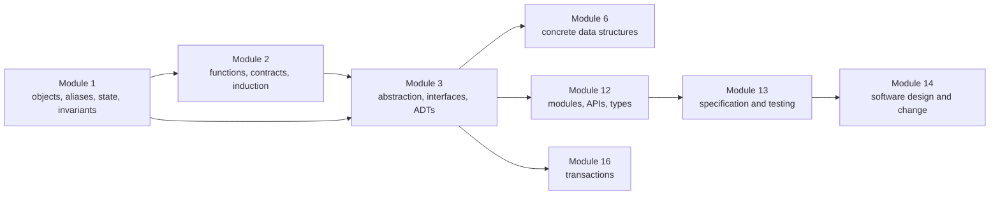
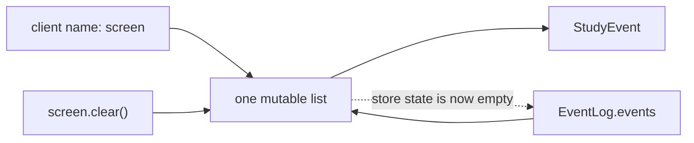
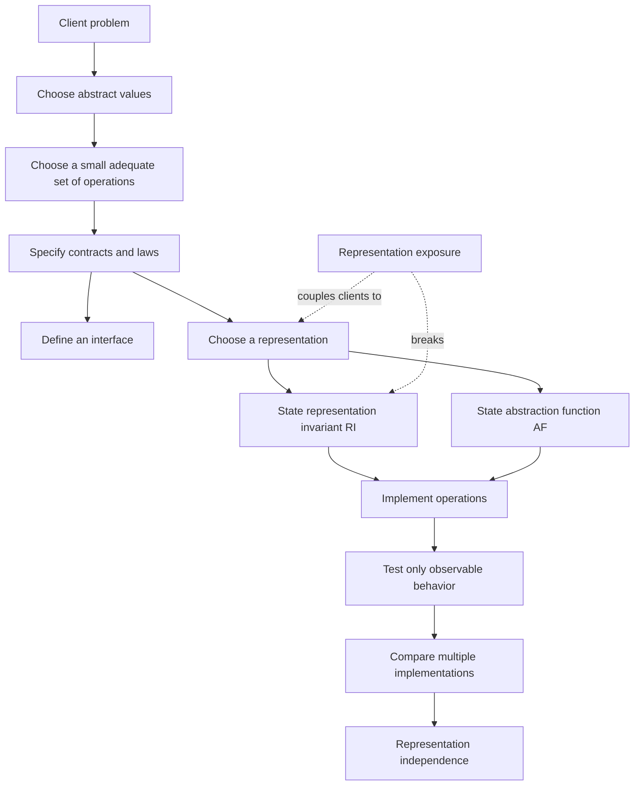
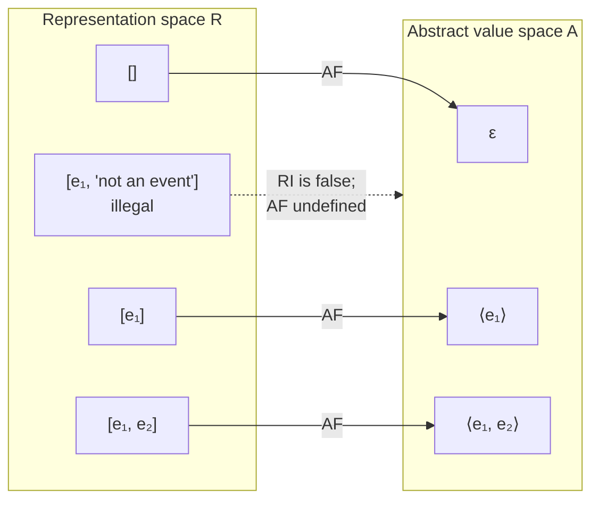
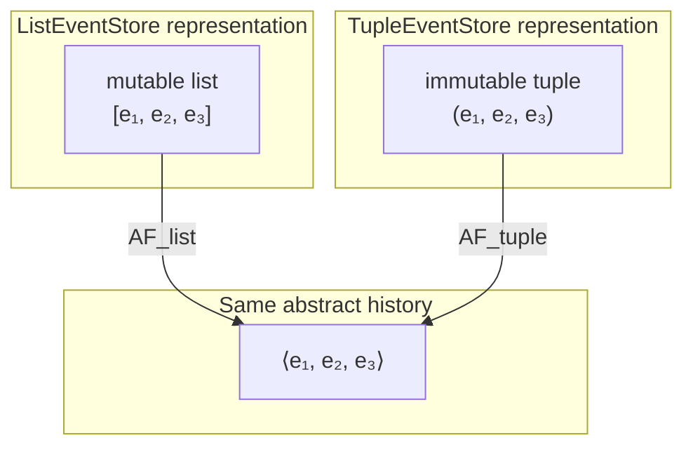
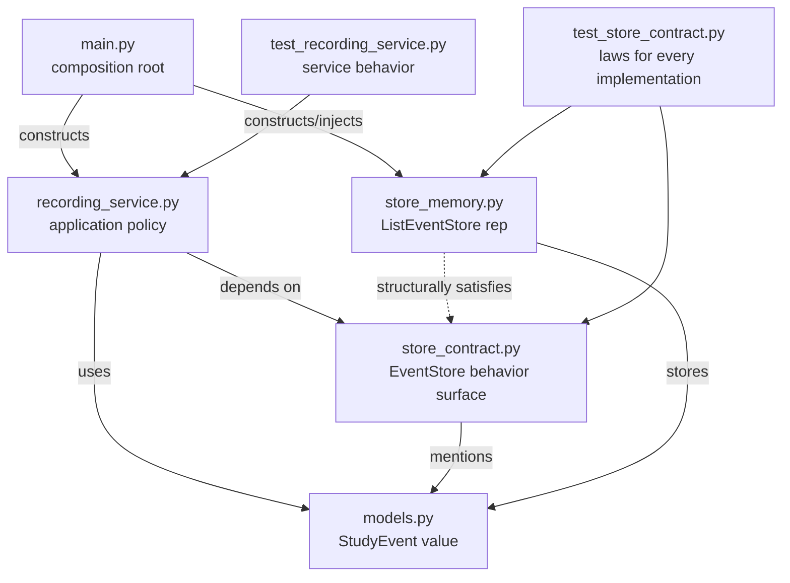
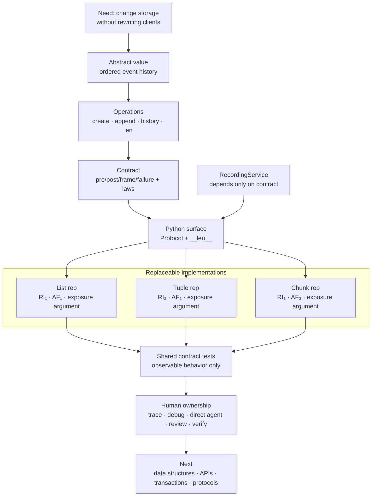

# Module 3 — Abstraction, Interfaces, and Abstract Data Types

> **Central question:** How can a client depend on what a component means without depending on how that component stores its data?
>
> **Atlas transformation:** a list owned by application code becomes a replaceable event store with one behavioral contract.
>
> **Mastery claim:** “I can recover an abstraction from code, state its laws and representation invariant, change its representation without changing clients, and verify an agent’s implementation against the contract.”

## How to use this workbook

This is a read–predict–explain–investigate workbook, not a chapter to consume passively.

For every code block marked **Predict first**:

1. write one sentence describing the expected observation;
2. name the contract or invariant behind that prediction;
3. only then run or reveal the explanation.

Most work is code reading, architecture recovery, debugging, design, and patch review. The only manual implementation is a small event-store mechanism, because building that boundary once makes later abstractions easier to read.

The default activity balance is:

| Activity | Approximate share |
|---|---:|
| Code and architecture reading | 30% |
| Debugging and investigation | 20% |
| Design and modeling | 20% |
| Agent direction and patch review | 15% |
| Explanation and synthesis | 10% |
| Targeted manual implementation | 5% |

---

## 1. Position in the knowledge graph

### The dependency path



Module 1 supplied a model of objects and state. Module 2 treated a function as a transformation governed by a contract and used induction to reason from a base case through repeated steps. This module lifts both ideas:

- from one function contract to a **family of operation contracts**;
- from one state transition to a **stateful abstract value**;
- from a local invariant to a **representation invariant owned by a component**;
- from one implementation to **multiple observationally equivalent representations**.

### The problem that forces this module

Atlas currently keeps events in an ordinary list. Soon we will want different storage choices: a tuple, chunks, an index, a file, and eventually a database. If every client knows that “the event store is a list,” every representation change becomes an application-wide rewrite.

The problem is not that lists are bad. The problem is that an implementation decision has escaped into code that should not own it.

> We need a stable behavioral boundary around changing state.

### Capabilities unlocked next

After this module, you will be able to:

- study data structures as alternative representations of the same operation family;
- distinguish a public API from a concrete class;
- build tests from laws rather than from field layouts;
- direct an agent to add an implementation without letting it redesign the system;
- recognize the same boundary at a database, network, concurrency, and security layer.

### Scope guard

This module introduces Python `Protocol`, abstract base classes, and one special method only far enough to express an ADT boundary. It does **not** yet attempt:

- generic type design, variance, or full subtyping theory — Module 12;
- comprehensive testing strategy or test doubles — Module 13;
- design patterns and large-scale refactoring — Module 14;
- persistence, threads, or networks — later arcs.

Those topics need the abstraction model built here; bringing them in now would hide it.

## 2. Prerequisite retrieval

Answer without notes. A weak answer is not a failure; it identifies the exact bridge to repair before adding a new abstraction.

### Retrieval prompts

1. In `b = a`, what normally changes: an object’s state or a name binding?
2. If two names reach the same mutable list, what happens when either path appends?
3. State a precondition, postcondition, and frame condition for `normalize_event(raw)`.
4. What must a recursive traversal establish in its base case and recursive step?
5. What is the difference between equality of values and identity of objects?
6. Why is an immutable tuple not automatically “deeply immutable”?

<details>
<summary>Retrieval check and routing</summary>

1. Assignment normally binds or rebinds a name; it does not copy or mutate an existing object merely because the right-hand side names one.
2. Both paths observe the mutation because both reach the same object.
3. One valid answer: the input must contain valid event data; the result is a normalized `StudyEvent`; the input mapping and its nested collections are not mutated or retained.
4. The base case must terminate and satisfy the claim directly. The recursive step must assume the claim for a smaller input, make progress toward that input, and show the current result preserves the claim.
5. Equality asks whether two objects represent the same domain value. Identity asks whether they are the same runtime object.
6. A tuple fixes its own sequence of references, but an object reached through one of those references may still be mutable.

**Routing rule:** if prompts 1, 2, 5, or 6 are unclear, revisit Module 1’s binding diagrams before continuing. If prompts 3 or 4 are unclear, use the Module 2 contract-and-induction bridge. Do not memorize the words “representation invariant” on top of an unstable state model.

</details>

### Mastery outcomes

By the end, Michael can:

1. explain abstraction as a deliberate boundary, not as vagueness;
2. distinguish an ADT, interface, representation, implementation, contract, and protocol;
3. classify operations as creators, producers, observers, and mutators;
4. define an abstract value space, representation space, abstraction function, and representation invariant;
5. state and test laws for a mutable event store;
6. identify and repair representation exposure;
7. explain what Python `Protocol`, `ABC`, and special methods do—and do not do;
8. recover component responsibilities and dependency direction from unfamiliar code;
9. diagnose a broken derived-state invariant with evidence;
10. write a bounded agent specification and review the resulting patch in dependency order;
11. defend two event-store representations in terms of behavior, correctness, cost, and change risk;
12. connect the same model to data structures, APIs, databases, concurrency, protocols, and security.

---

## 3. The driving failure: when a representation escapes

Here is the smallest Atlas prototype:

```python
from dataclasses import dataclass


@dataclass(frozen=True)
class StudyEvent:
    topic: str
    minutes: int
    tags: tuple[str, ...] = ()


class EventLog:
    def __init__(self) -> None:
        self.events: list[StudyEvent] = []

    def record(self, event: StudyEvent) -> None:
        self.events.append(event)

    def history(self) -> list[StudyEvent]:
        return self.events
```

And a client:

```python
log = EventLog()
first = StudyEvent("abstraction", 25)
log.record(first)

screen = log.history()
screen.clear()

print(len(log.history()))
```

### Predict first

- What is printed?
- Which line crossed the intended component boundary?
- Is the bug in `clear()`, in `history()`, or in both?

<details>
<summary>Explanation</summary>

It prints `0`. `history()` returned the mutable list that is also the representation of `EventLog`. The client’s name `screen` and the implementation’s name `self.events` now reach the same list.

`clear()` behaves correctly for a list. The design bug is that `history()` gave a client authority to mutate state that the event log was supposed to own. A client can still choose to misuse an explicitly private attribute in Python, but here the public operation itself handed out the alias.

</details>



This is **representation exposure**: a reference crossing the boundary lets outside code observe or corrupt representation state in a way the public contract did not authorize.

### A tempting but incomplete repair

```python
def history(self) -> tuple[StudyEvent, ...]:
    return tuple(self.events)
```

This fixes this particular outer-list alias. It is safe only because the `StudyEvent` values used here are themselves immutable at the relevant boundary, including their `tags` tuple. If `StudyEvent.tags` were a list, the returned tuple would still contain paths to mutable internal state.

The lesson is not “always return a tuple.” The lesson is:

> Trace every reference that crosses the boundary and justify why it cannot be used to violate the abstract value.

---

## 4. Deriving abstraction from first principles

### 4.1 Abstraction means selective dependence

Plain language:

> An abstraction tells a client what it may rely on and frees the implementation to change everything else.

More precisely:

> An abstraction defines a set of observable values and operations with behavioral specifications. A client is representation-independent when its correctness depends only on those specifications, not on a particular representation.

An abstraction is not “hiding complexity because complexity is scary.” It is deciding which facts are stable enough to become dependencies.

### Analogy: a control panel

A control panel helps us see two roles:

- an operator uses labeled controls and readings;
- a maintainer understands wires, sensors, and internal mechanisms.

Where the analogy stops:

- software clients can sometimes bypass conventions or use reflection;
- latency, exceptions, aliasing, and concurrent effects may be observable even when fields are hidden;
- a software contract must be more exact than a label on a button.

The precise replacement for the analogy is the operation contract and the set of observations it permits.

### 4.2 Vocabulary that must not collapse

| Term | Plain-language meaning | Precise role in this module |
|---|---|---|
| **Abstraction** | The stable idea a client uses | Abstract values plus specified operations and laws |
| **Abstract data type (ADT)** | A kind of data defined by what can be done with it | An abstract value space together with operation signatures and behavioral specifications |
| **Interface** | The visible operation surface | Names, parameters, results, and declared exceptions; necessary but not sufficient for a full behavioral contract |
| **Contract/specification** | The promises around an operation | Preconditions, postconditions, frame conditions, failures, and any promised resource bounds |
| **Representation (rep)** | The concrete objects that hold state | Fields and helper objects used by one implementation |
| **Implementation** | Code that realizes the operations | Algorithms that map legal rep values through state transitions |
| **Encapsulation** | Keeping responsibility inside a boundary | Preventing clients from directly controlling representation state |
| **Information hiding** | Concealing a design decision likely to change | Making representation details non-dependencies of clients |
| **Representation independence** | Clients survive a rep change | All contract-permitted observations remain equivalent across implementations |
| **Protocol** | A behavior shape understood by some consumer | In Python, this may be an informal duck-typed convention, a static `typing.Protocol`, or a language protocol using special methods |
| **Representation invariant (RI)** | What makes internal state legal | A predicate over representation values |
| **Abstraction function (AF)** | What a legal internal state means | A mapping from legal representation values to abstract values |

A class can implement an ADT, but an ADT is not the same thing as a class. The same ADT may have several classes as implementations; a module with functions and hidden state could implement one too.

### 4.3 Concept map



### 4.4 Classifying operations

The classification describes an operation’s relationship to values of the ADT:

- **Creator:** makes a value without taking an existing value of the ADT, such as `ListEventStore()`.
- **Producer:** uses an existing value to produce another value of the same ADT without mutating the input. Our minimal mutable store does not need one.
- **Observer:** returns information of another type without changing the abstract value, such as `history()` or `len(store)`.
- **Mutator:** changes the abstract value, such as `append(event)`.

An operation can occupy more than one category in a complicated API. Return type alone does not decide the category. If an operation changes future observations of the same object, it is a mutator even if it also returns a value.

### Design checkpoint

Atlas could expose all of these:

```text
append, insert_at, delete_at, sort, raw_list, chunks, internal_capacity,
history, length, replace_all, find_by_topic, save, load, sync
```

We deliberately start with only:

```text
create empty store, append one valid event, observe history, observe length
```

This surface is:

- **coherent:** every operation concerns an append-only event history;
- **adequate:** clients can record and read the history;
- **simple:** there are few interactions to understand;
- **representation-independent:** no operation mentions a list, tuple, chunk, file, or database.

Minimality also reduces privacy and security surface: an operation that Atlas does not expose cannot accidentally disclose or mutate learning data.

---

## 5. The EventStore ADT: abstract state, contracts, and laws

### 5.1 Abstract value space

Let `E` be the set of valid immutable `StudyEvent` values. Let:

\[
\mathrm{History} = E^*
\]

where \(E^*\) means all finite ordered sequences of events, including the empty sequence \(\epsilon\).

An `EventStore` abstract value is one such sequence. Clients may reason about that sequence. They may not assume how it is stored.

### 5.2 Operation contracts

| Operation | Kind | Preconditions | Postcondition and result | Frame condition | Specified failure |
|---|---|---|---|---|---|
| `make_store()` | creator | none | new store represents \(\epsilon\) | no existing store changes | none |
| `append(event)` | mutator | `event` is a valid `StudyEvent` | if old history was \(h\), new history is \(h \mathbin{\|} \langle event\rangle\); returns `None` | existing event values and prior snapshots do not change | non-`StudyEvent` raises `TypeError` |
| `history()` | observer | none | returns a tuple equal by value to current history, in insertion order | store state does not change; future appends do not change the returned tuple | none |
| `len(store)` | observer | none | returns the number of events in current history | store state does not change | none |

Here \(\|\) denotes sequence concatenation.

The contract does **not** promise:

- the concrete class;
- field names;
- a list, tuple, or chunks internally;
- identity of returned tuples;
- persistence across process exit;
- thread safety;
- a particular `repr`;
- constant-time append.

If one of those facts becomes a real client requirement, it must be added deliberately and tested. Until then it remains implementation freedom.

### 5.3 Algebraic laws

Examples test cases. Laws quantify over all valid cases.

For every fresh store \(s\) and valid events \(e_1,\ldots,e_n\):

1. **Empty law**

   \[
   \mathrm{history}(s)=\epsilon \quad\land\quad \mathrm{len}(s)=0
   \]

2. **Append-order law**

   If \(s\) represents \(h\) before `append(e)`, afterward it represents:

   \[
   h \mathbin{\|} \langle e\rangle
   \]

3. **Length law**

   \[
   \mathrm{len}(s)=|\mathrm{history}(s)|
   \]

4. **Snapshot-stability law**

   If `old = s.history()`, then later calls to `s.append(...)` do not change `old`.

5. **Observer-purity law**

   Calling `history()` or `len(s)` any number of times does not change the abstract history.

6. **Invalid-input atomicity**

   If `append(x)` raises `TypeError`, the store represents exactly the history it represented before the call.

These laws are the bridge back to Module 2. The empty law is a base case. The append law is the inductive step: if a representation correctly denotes a history of length \(n\), a valid append must establish a correct representation of length \(n+1\).

### 5.4 Observational equivalence

Two store objects do not need equal fields or equal concrete types. They are equivalent at this abstraction when every legal sequence of public operations produces the same specified:

- returned values;
- state transitions;
- exceptions;
- order and snapshot behavior.

For concrete representation values \(r_1\) and \(r_2\):

\[
r_1 \sim r_2 \quad \text{when} \quad AF_1(r_1)=AF_2(r_2)
\]

This equation is powerful but bounded. If performance, logging, persistence, or concurrency is part of the published contract, those observations must also be compared. “Same final values” is not enough when the contract promises more.

---

## 6. Representation invariants and abstraction functions

### 6.1 Two spaces, one meaning



For the list representation:

- **Rep value:** the object graph rooted at `self._events`.
- **RI:** `self._events` is a list; every element is a valid immutable `StudyEvent`; the list is exclusively owned by the store and never exposed for mutation.
- **AF:** `AF(self._events)` is the finite event sequence containing those elements in list order.

Formally:

\[
RI(r) =
\mathrm{isList}(r)\ \land\
\forall i \in [0,|r|),\ r_i \in E\
\land\ \mathrm{ownedByStore}(r)
\]

\[
AF(r)=\langle r_0,r_1,\ldots,r_{|r|-1}\rangle
\quad\text{when } RI(r)
\]

Ownership is not fully checkable with an `isinstance` expression. It needs a **safety-from-representation-exposure argument**:

1. the constructor creates the list internally;
2. no constructor parameter is retained as the list;
3. `append` accepts an immutable domain value;
4. `history` returns an immutable snapshot rather than the list;
5. no other public operation returns or mutates the list.

### 6.2 Who is allowed to know what?

| Fact | Client | Implementer |
|---|---:|---:|
| Abstract value is an ordered event history | yes | yes |
| Operation contracts and laws | yes | yes |
| Concrete fields | no | yes |
| Representation invariant | no dependency | yes |
| Abstraction function | no dependency | yes |
| Safety-from-exposure argument | no dependency | yes |
| Promised errors and resource bounds | yes | yes |

“No dependency” does not mean secret or impossible to inspect. Open-source clients can read every line. It means their correctness must not rely on it.

### 6.3 The proof obligations of an implementation

Every creator must **establish** the RI. Every mutator must **preserve** it. Every observer must:

- accept a state satisfying the RI;
- return the specified abstract observation;
- preserve the abstract value;
- avoid exposing a path that can later break the RI.

If an operation raises, its failure behavior and frame condition still matter. A half-completed mutation can leave a legal-looking object with the wrong abstract meaning.

---

## 7. Python realization: contract first, mechanisms second

The ADT exists at the design level. Python gives us several mechanisms for expressing or participating in that design, but none of them automatically proves the behavioral contract.

### 7.1 One executable Atlas implementation

Read the public contract before the concrete class:

```python
from __future__ import annotations

from dataclasses import dataclass
from typing import Protocol


@dataclass(frozen=True)
class StudyEvent:
    """One valid, canonical Atlas study event."""

    topic: str
    minutes: int
    tags: tuple[str, ...] = ()

    def __post_init__(self) -> None:
        if not isinstance(self.topic, str):
            raise TypeError("topic must be str")
        if not self.topic or self.topic != self.topic.strip().casefold():
            raise ValueError("topic must be nonempty canonical text")
        if (
            not isinstance(self.minutes, int)
            or isinstance(self.minutes, bool)
        ):
            raise TypeError("minutes must be int")
        if self.minutes < 0:
            raise ValueError("minutes must be nonnegative")
        if not isinstance(self.tags, tuple):
            raise TypeError("tags must be a tuple")
        if any(
            not isinstance(tag, str)
            or not tag
            or tag != tag.strip().casefold()
            for tag in self.tags
        ):
            raise ValueError("tags must be nonempty canonical text")


class EventStore(Protocol):
    """An append-only ordered history of valid StudyEvent values."""

    def append(self, event: StudyEvent) -> None:
        """Append event after all existing events.

        Raise TypeError without changing the store if event is not a
        StudyEvent.
        """
        ...

    def history(self) -> tuple[StudyEvent, ...]:
        """Return a stable immutable snapshot in insertion order."""
        ...

    def __len__(self) -> int:
        """Return the current number of events without changing the store."""
        ...
```

The annotations describe the operation shape to a type checker and reader. The docstrings carry behavior that signatures cannot express: order, snapshot stability, failure atomicity, and absence of mutation.

Now the list representation:

```python
class ListEventStore:
    """List-backed implementation of the EventStore contract.

    Representation invariant:
      - _events is a list;
      - every member is a valid immutable StudyEvent;
      - the list is owned exclusively by this object.

    Abstraction function:
      - AF(_events) is the event sequence containing the members of
        _events in list order.

    Safety from rep exposure:
      - the list is created internally;
      - append accepts only immutable StudyEvent values;
      - history returns a tuple snapshot;
      - no public operation returns _events.
    """

    def __init__(self) -> None:
        self._events: list[StudyEvent] = []
        self._check_rep()

    def append(self, event: StudyEvent) -> None:
        if not isinstance(event, StudyEvent):
            raise TypeError("event must be a StudyEvent")

        self._events.append(event)
        self._check_rep()

    def history(self) -> tuple[StudyEvent, ...]:
        self._check_rep()
        return tuple(self._events)

    def __len__(self) -> int:
        self._check_rep()
        return len(self._events)

    def _check_rep(self) -> None:
        if not isinstance(self._events, list):
            raise AssertionError("_events must be a list")
        if not all(isinstance(event, StudyEvent) for event in self._events):
            raise AssertionError("_events must contain only StudyEvent values")
```

`_check_rep()` checks the executable portion of the RI close to the operation that could violate it. It is evidence and a debugging tripwire, not a security boundary. Python code can deliberately reach `_events`, and no runtime assertion can establish exclusive ownership by inspecting one object at one moment. That part depends on interface design, code review, and tests.

### Predict first: one event through the boundary

```python
store: EventStore = ListEventStore()
event = StudyEvent("abstraction", 25, ("python",))

before = store.history()
store.append(event)
after = store.history()

print(before)
print(after)
print(len(store))
print(before is store.history())
```

Predict all four lines. Which result is guaranteed by the contract, and which is intentionally unspecified?

<details>
<summary>Execution explanation</summary>

The first three observations are:

```text
()
(StudyEvent(topic='abstraction', minutes=25, tags=('python',)),)
1
```

The fourth line is `False` for this implementation because each `history()` call builds a fresh tuple. The contract does not promise tuple identity, so a client must not rely on that result. A different correct implementation may return the same immutable tuple object repeatedly.

The variable annotation `store: EventStore` does not convert or wrap the object. It documents and statically checks the dependency surface.

</details>

### 7.2 Trace the state transition at two levels

| Moment | Concrete list rep | Abstract history | RI | Contract observation |
|---|---|---|---|---|
| after construction | `[]` | \(\epsilon\) | true | `len == 0`, `history == ()` |
| after `before = history()` | `[]` | \(\epsilon\) | true | `before == ()` |
| after `append(event)` | `[event]` | \(\langle event\rangle\) | true | `len == 1` |
| after `after = history()` | `[event]` | \(\langle event\rangle\) | true | `after == (event,)`; `before` unchanged |

Moving between the concrete and abstract columns is the core skill:

- a client reasons in the abstract column;
- an implementer proves the concrete transitions correctly realize it.

### 7.3 Contract tests, not representation tests

The same tests should run against every implementation:

```python
from collections.abc import Callable

import pytest


StoreFactory = Callable[[], EventStore]


@pytest.mark.parametrize(
    "make_store",
    [ListEventStore],  # TupleEventStore is added below
)
def test_event_store_contract(make_store: StoreFactory) -> None:
    store = make_store()
    first = StudyEvent("abstraction", 25)
    second = StudyEvent("interfaces", 15, ("python",))

    initial_snapshot = store.history()
    assert initial_snapshot == ()
    assert len(store) == 0

    store.append(first)
    one_event_snapshot = store.history()
    store.append(second)

    assert one_event_snapshot == (first,)
    assert store.history() == (first, second)
    assert len(store) == 2
    assert initial_snapshot == ()


@pytest.mark.parametrize(
    "make_store",
    [ListEventStore],
)
def test_invalid_append_is_atomic(make_store: StoreFactory) -> None:
    store = make_store()
    before = store.history()

    with pytest.raises(TypeError, match="StudyEvent"):
        store.append("not an event")  # type: ignore[arg-type]

    assert store.history() == before
```

Notice what these tests do not mention:

- `_events`;
- `list`;
- object identity of a snapshot;
- the number of allocations.

A test that asserts `store._events == [...]` protects a representation, not the ADT.

### 7.4 Change the representation, preserve the abstraction

Here is a tuple-backed implementation:

```python
class TupleEventStore:
    """Tuple-backed implementation of the EventStore contract.

    Representation invariant:
      - _events is a tuple;
      - every member is a valid immutable StudyEvent.

    Abstraction function:
      - AF(_events) is the event sequence containing the members of
        _events in tuple order.

    Safety from rep exposure:
      - _events and every StudyEvent are immutable at this boundary;
      - no operation returns a mutable object owned by the store.
    """

    def __init__(self) -> None:
        self._events: tuple[StudyEvent, ...] = ()
        self._check_rep()

    def append(self, event: StudyEvent) -> None:
        if not isinstance(event, StudyEvent):
            raise TypeError("event must be a StudyEvent")

        self._events = (*self._events, event)
        self._check_rep()

    def history(self) -> tuple[StudyEvent, ...]:
        self._check_rep()
        return self._events

    def __len__(self) -> int:
        self._check_rep()
        return len(self._events)

    def _check_rep(self) -> None:
        if not isinstance(self._events, tuple):
            raise AssertionError("_events must be a tuple")
        if not all(isinstance(event, StudyEvent) for event in self._events):
            raise AssertionError("_events must contain only StudyEvent values")
```

Add `TupleEventStore` to both parameter lists. The client and the assertions stay unchanged.



### 7.5 Behavior can match while cost differs

For \(n\) stored events:

| Operation | `ListEventStore` | `TupleEventStore` | Published semantic result |
|---|---:|---:|---|
| `append` | amortized \(O(1)\) | \(O(n)\) to build a new tuple | append at end |
| `history` | \(O(n)\) to build tuple | \(O(1)\) to return tuple | stable snapshot |
| `len` | \(O(1)\) | \(O(1)\) | current count |
| representation memory | list capacity may exceed \(n\) | one exact tuple, but each append allocates another | unspecified |

The current contract leaves these complexity differences open. That makes both implementations semantically substitutable, but it does not make them equally suitable for production.

If Atlas later promises “append is amortized constant time,” `TupleEventStore` stops satisfying the enlarged contract. Resource guarantees are part of abstraction when clients are allowed to rely on them.

### 7.6 Mutation of the rep is not automatically mutation of the abstract value

An immutable ADT implementation may cache a result, rebalance a tree, or compact storage while continuing to denote the same abstract value. Such a **benevolent side effect** changes \(r\) while keeping \(AF(r)\) fixed.

Conversely, rebinding a private field can change the abstract value even when no existing container is mutated. Always ask whether the abstraction function’s result changed. “Did a Python object mutate?” and “Did the ADT value change?” are related but different questions.

---

## 8. Python interfaces at the right level

Python has several overlapping interface mechanisms. Choose one because of the dependency you need, not because it looks most “enterprise.”

### 8.1 Informal duck typing

```python
def total_minutes(store) -> int:
    return sum(event.minutes for event in store.history())
```

Any object with a compatible `history()` operation can work at runtime. This is open and concise, but the expected surface is not statically visible at the call site.

### 8.2 `typing.Protocol`: static structural compatibility

Our `EventStore(Protocol)` says that a static type checker may accept any object with compatible operations, even if its class never inherits from `EventStore`.

```python
class TinyStore:
    def __init__(self) -> None:
        self._history: tuple[StudyEvent, ...] = ()

    def append(self, event: StudyEvent) -> None:
        self._history += (event,)

    def history(self) -> tuple[StudyEvent, ...]:
        return self._history

    def __len__(self) -> int:
        return len(self._history)


store: EventStore = TinyStore()  # structurally compatible to a type checker
```

Important limits:

- Python does not enforce annotations at ordinary runtime.
- A type checker compares declared structure, not behavioral laws.
- The presence of `history` cannot prove insertion order, snapshot stability, or observer purity.
- `@runtime_checkable` checks attribute presence in a limited way, not full signatures or behavior. It is not a contract test.

For Atlas, ordinary contract tests provide stronger evidence than `isinstance(obj, EventStore)`, so we do not decorate this protocol with `@runtime_checkable`.

### 8.3 `abc.ABC`: explicit nominal participation

An abstract base class can require explicit inheritance and prevent instantiation of a subclass that has not implemented all abstract methods:

```python
from abc import ABC, abstractmethod


class EventStoreABC(ABC):
    @abstractmethod
    def append(self, event: StudyEvent) -> None:
        """Append event according to the EventStore contract."""
        raise NotImplementedError

    @abstractmethod
    def history(self) -> tuple[StudyEvent, ...]:
        """Return a stable immutable snapshot."""
        raise NotImplementedError

    @abstractmethod
    def __len__(self) -> int:
        """Return the current event count."""
        raise NotImplementedError
```

An ABC is useful when:

- explicit membership in a framework matters at runtime;
- a common base supplies carefully designed shared behavior;
- construction of incomplete subclasses should fail early;
- nominal identity is part of the design.

It also introduces inheritance coupling. Atlas does not need that coupling yet, so the structural `Protocol` is the smaller tool.

Registering a “virtual subclass” with an ABC affects `isinstance`/`issubclass`, but it does not inject the ABC into the class’s method-resolution order or provide the ABC’s method implementations. A runtime label still does not prove behavioral laws.

### 8.4 Special methods: participating in a language protocol

`__len__` lets an object participate in Python’s length protocol:

```python
count = len(store)
```

The public client expression is `len(store)`, not usually `store.__len__()`. The special method connects Atlas to a conventional operation understood by Python tools and readers.

Do not add every attractive special method. For example, `__iter__` would force decisions about:

- snapshot iteration versus live iteration;
- behavior if the store changes during iteration;
- whether iteration order is guaranteed;
- whether iteration exposes internal objects safely.

An interface should state decisions, not postpone them behind familiar syntax.

### 8.5 Decision table

| Mechanism | Compatibility basis | Primary enforcement time | Proves behavior? | Atlas use now |
|---|---|---|---:|---|
| Informal duck typing | runtime operations happen to work | runtime call | no | useful for tiny local code |
| `typing.Protocol` | structural method/attribute types | static analysis | no | yes: open EventStore boundary |
| `abc.ABC` | explicit or registered nominal relationship | class creation/instantiation and runtime checks | no | compare, do not adopt yet |
| special methods | Python language protocol | runtime dispatch | no | `__len__` only |
| contract tests | observed operation scenarios and laws | test time | partial evidence | yes |
| proof/reasoning | all states described by model | design/review time | only as sound as assumptions | yes for RI preservation |

### 8.6 Python privacy is a boundary convention, not a vault

A leading underscore communicates “implementation detail.” It does not make the attribute inaccessible:

```python
store = ListEventStore()
store._events.append("corruption")  # possible, unsupported
```

Name mangling with `__events` mainly avoids accidental subclass collisions; it is not a security control. Encapsulation in Python is achieved through:

- a small documented public surface;
- no aliases escaping from that surface;
- dependency discipline;
- static checks, tests, and review;
- process or service boundaries when actual adversarial isolation is required.

Security will return in Module 22, but invariant protection begins here.

---

## 9. Worked code-reading studio: recover a chunked representation

This is not a “write a chunk store” exercise. Read the unfamiliar implementation, recover its meaning, and test its claims.

### Predict before reading the explanation

For `chunk_size=2`, draw the concrete state after appending `e1`, `e2`, and `e3`. Then answer:

1. What abstract history does that state represent?
2. Which concrete facts must always remain true?
3. Can a client tell where a chunk boundary occurs?
4. What is the call path for `history()`?

```python
class ChunkedEventStore:
    """Chunk-backed implementation of EventStore.

    Representation invariant:
      - _chunk_size is a positive int;
      - _chunks is a list with no empty chunks;
      - every non-final chunk has exactly _chunk_size members;
      - the final chunk has between 1 and _chunk_size members;
      - every member of every chunk is a StudyEvent;
      - the nested lists are owned exclusively by this object.

    Abstraction function:
      - AF(_chunks) is the sequence made by reading each chunk from
        first to last and each event within a chunk from first to last.

    Safety from rep exposure:
      - all lists are created internally;
      - only immutable StudyEvent values cross inward;
      - history returns a flattened tuple;
      - no chunk list is returned.
    """

    def __init__(self, chunk_size: int = 128) -> None:
        if (
            not isinstance(chunk_size, int)
            or isinstance(chunk_size, bool)
            or chunk_size <= 0
        ):
            raise ValueError("chunk_size must be a positive int")

        self._chunk_size = chunk_size
        self._chunks: list[list[StudyEvent]] = []
        self._check_rep()

    def append(self, event: StudyEvent) -> None:
        if not isinstance(event, StudyEvent):
            raise TypeError("event must be a StudyEvent")

        if not self._chunks or len(self._chunks[-1]) == self._chunk_size:
            self._chunks.append([])
        self._chunks[-1].append(event)
        self._check_rep()

    def history(self) -> tuple[StudyEvent, ...]:
        self._check_rep()
        return tuple(
            event
            for chunk in self._chunks
            for event in chunk
        )

    def __len__(self) -> int:
        self._check_rep()
        return sum(len(chunk) for chunk in self._chunks)

    def _check_rep(self) -> None:
        if (
            not isinstance(self._chunk_size, int)
            or isinstance(self._chunk_size, bool)
            or self._chunk_size <= 0
        ):
            raise AssertionError("_chunk_size must be a positive int")

        if not isinstance(self._chunks, list):
            raise AssertionError("_chunks must be a list")
        if not all(isinstance(chunk, list) for chunk in self._chunks):
            raise AssertionError("every chunk must be a list")

        if any(not chunk for chunk in self._chunks):
            raise AssertionError("chunks must not be empty")

        if any(
            len(chunk) != self._chunk_size
            for chunk in self._chunks[:-1]
        ):
            raise AssertionError("all non-final chunks must be full")

        if self._chunks and len(self._chunks[-1]) > self._chunk_size:
            raise AssertionError("final chunk is over capacity")

        if not all(
            isinstance(event, StudyEvent)
            for chunk in self._chunks
            for event in chunk
        ):
            raise AssertionError("chunks must contain only StudyEvent values")
```

### Read at five levels

#### 1. Purpose

It implements the same append-only ordered history while grouping the representation into bounded lists.

#### 2. Map

Public boundary:

```text
append(event)   history()   len(store)
```

Private mechanism:

```text
_chunk_size   _chunks   _check_rep()
```

No public operation exposes a chunk.

#### 3. Flow

For capacity two:

| Operation | `_chunks` after operation | `AF(_chunks)` |
|---|---|---|
| construct | `[]` | \(\epsilon\) |
| `append(e1)` | `[[e1]]` | \(\langle e_1\rangle\) |
| `append(e2)` | `[[e1, e2]]` | \(\langle e_1,e_2\rangle\) |
| `append(e3)` | `[[e1, e2], [e3]]` | \(\langle e_1,e_2,e_3\rangle\) |

On the third append, the first branch creates a new empty chunk. The very next statement appends `e3`; `_check_rep()` is called only after both steps, when the public operation is complete and the RI is restored.

This shows a subtle point: an implementation may pass through a temporarily illegal internal state while one operation runs, as long as no callback, exception, or public observation can expose it and the operation re-establishes the RI before returning. Keeping every intermediate state legal is often easier and safer, but it is not the definition.

#### 4. Mechanism

- `not self._chunks` handles the first event.
- `len(last) == capacity` detects the boundary before it can overflow.
- nested comprehension order defines the same order as the AF.
- `len` scans chunk headers and is \(O(k)\) for \(k\) chunks, not \(O(1)\).

An implementer could add a `_count` field to make `len` constant time. That would enlarge the rep and add an RI clause:

\[
\_count = \sum_{c \in \_chunks} |c|
\]

Faster observation would therefore cost another consistency obligation.

#### 5. Evaluation

Strengths:

- boundary and semantics match the other stores;
- no nested list escapes;
- chunk allocation is visible only to the implementation;
- the RI documents every cross-field assumption.

Risks and costs:

- `history()` still copies all \(n\) event references;
- `len()` scans chunks;
- the nested ownership argument is more complex;
- a later cache or count can become stale;
- checking the full rep after every append is itself \(O(n)\), suitable for teaching/debug builds but not automatically for a production hot path.

### One-constraint modification

New requirement: `len(store)` must be \(O(1)\), while public behavior remains unchanged.

Before any code is generated, write:

1. the new field;
2. the strengthened RI;
3. the creator obligation;
4. the append preservation step;
5. the error frame condition;
6. the tests that would expose a stale count.

Only then ask an agent to implement it. The design is the learning; syntax production is secondary.

---

## 10. Architecture-recovery studio

You join Atlas after another developer split the prototype into these files:

```text
atlas/
├── main.py
├── models.py
├── store_contract.py
├── store_memory.py
└── recording_service.py
tests/
├── test_store_contract.py
└── test_recording_service.py
```

Selected fragments:

```python
# atlas/store_contract.py
from typing import Protocol
from atlas.models import StudyEvent


class EventStore(Protocol):
    def append(self, event: StudyEvent) -> None: ...
    def history(self) -> tuple[StudyEvent, ...]: ...
    def __len__(self) -> int: ...
```

```python
# atlas/recording_service.py
from atlas.models import StudyEvent
from atlas.store_contract import EventStore


class RecordingService:
    def __init__(self, store: EventStore) -> None:
        self._store = store

    def record(self, event: StudyEvent) -> None:
        self._store.append(event)

    def total_minutes(self) -> int:
        return sum(event.minutes for event in self._store.history())
```

```python
# atlas/main.py
from atlas.recording_service import RecordingService
from atlas.store_memory import ListEventStore


store = ListEventStore()
service = RecordingService(store)
```

### Recover before revealing

Produce:

1. a responsibility for each module;
2. the dependency arrows;
3. the composition root—the location that chooses a concrete implementation;
4. the smallest set of files that should change to use `TupleEventStore`;
5. every boundary crossed by `RecordingService.total_minutes()`;
6. one test that belongs to the store contract and one that belongs to the service.

Use this evidence table:

| Claim | File/line evidence | Confidence | What would falsify it? |
|---|---|---:|---|
| `RecordingService` is representation-independent | imports `EventStore`, calls only its operations |  | a private-field access or concrete type check |
| `main.py` chooses the representation | constructs `ListEventStore` |  | another hidden construction path |

<details>
<summary>Recovered architecture</summary>



`main.py` is the composition root because it knows both the policy and the concrete mechanism and wires them together. To switch representations, add/import the new implementation and change the construction line in `main.py`; `RecordingService` should not change.

The `total_minutes()` call path is:

```text
caller
  → RecordingService.total_minutes
  → EventStore.history contract
  → concrete history implementation
  → immutable tuple of StudyEvent values
  → service sums public StudyEvent.minutes
```

A store contract test verifies order and snapshot stability for each implementation. A service test supplies any small store-compatible fake or real store and verifies the domain result, such as 25 + 15 = 40.

</details>

### Architecture smell search

Each of these lines would reverse or puncture the intended boundary:

```python
if isinstance(self._store, ListEventStore): ...
self._store._events.sort(...)
from atlas.store_memory import ListEventStore  # inside recording_service.py
```

The first makes behavior depend on a concrete type. The second depends on and mutates the rep. The third makes the application-policy module choose its mechanism. A type checker may catch some incompatible access, but the dependency problem is architectural.

### Change-impact question

Suppose a new requirement says “recording an event must survive a process crash.” The current store contract does not promise durability. Do **not** simply name a database implementation and declare success.

First ask:

- When may `append` report success?
- What failure is reported if durability cannot be established?
- May `history` omit an acknowledged event?
- What ordering survives restart?
- Is retrying `append` allowed to duplicate an event?

The abstract contract must grow before a new representation can be judged against it. This question points forward to Modules 15–16.

---

## 11. Debugging studio: a cache that breaks its own invariant

An agent “optimized” `history()` by caching its tuple:

```python
class CachedHistoryStore:
    """List-backed store with a cached immutable snapshot.

    Representation invariant:
      - _events is a list of StudyEvent values;
      - _snapshot is None or _snapshot == tuple(_events).

    Abstraction function:
      - AF(_events, _snapshot) is the sequence in _events.
    """

    def __init__(self) -> None:
        self._events: list[StudyEvent] = []
        self._snapshot: tuple[StudyEvent, ...] | None = None

    def append(self, event: StudyEvent) -> None:
        if not isinstance(event, StudyEvent):
            raise TypeError("event must be a StudyEvent")
        self._events.append(event)

    def history(self) -> tuple[StudyEvent, ...]:
        if self._snapshot is None:
            self._snapshot = tuple(self._events)
        self._check_rep()
        return self._snapshot

    def __len__(self) -> int:
        return len(self._events)

    def _check_rep(self) -> None:
        if self._snapshot is not None:
            if self._snapshot != tuple(self._events):
                raise AssertionError("cached snapshot is stale")
```

Observed failure:

```python
store = CachedHistoryStore()
store.append(StudyEvent("abstraction", 25))
assert len(store.history()) == 1

store.append(StudyEvent("interfaces", 15))
store.history()  # AssertionError: cached snapshot is stale
```

### Investigation protocol

Do not start with a repair. Produce these artifacts in order:

1. **Precise symptom:** after which operation sequence is which claim false?
2. **Minimal reproduction:** remove every line that is not required.
3. **State trace:** record `_events`, `_snapshot`, `AF`, and RI after each line.
4. **Falsifiable root-cause hypothesis:** name the operation that failed to preserve which RI clause.
5. **Smallest repair options:** invalidate or eagerly recompute; compare cost.
6. **Regression evidence:** write a test that fails before the repair and passes after.
7. **Scope check:** verify that no public contract changed.

Use this trace:

| Moment | `_events` | `_snapshot` | Abstract history | RI |
|---|---|---|---|---|
| construct | `[]` | `None` | `()` | true |
| append first | `[e1]` | `None` | `(e1,)` | true |
| history | `[e1]` | `(e1,)` | `(e1,)` | true |
| append second | `[e1, e2]` | `(e1,)` | `(e1, e2)` | **false** |

### Staged hints

1. Which field is authoritative in the AF?
2. Which field is derived from that authoritative field?
3. Which operation changes the authoritative field?
4. What must happen to derived state immediately after that change?

<details>
<summary>Repair and regression test</summary>

The smallest lazy-cache repair invalidates the cache after a successful append:

```python
def append(self, event: StudyEvent) -> None:
    if not isinstance(event, StudyEvent):
        raise TypeError("event must be a StudyEvent")
    self._events.append(event)
    self._snapshot = None
    self._check_rep()
```

The invalid-input branch runs before either field changes, preserving atomicity. A regression test must force the cache to exist before another append:

```python
def test_history_cache_is_invalidated_after_append() -> None:
    store = CachedHistoryStore()
    first = StudyEvent("abstraction", 25)
    second = StudyEvent("interfaces", 15)

    store.append(first)
    old_snapshot = store.history()  # populate cache
    store.append(second)

    assert old_snapshot == (first,)
    assert store.history() == (first, second)
    assert len(store) == 2
```

Recomputing the tuple on every append would also preserve the RI, but it pays \(O(n)\) even when no client asks for history. Lazy invalidation pays \(O(1)\) at append and \(O(n)\) at the first subsequent `history()`. The correct choice depends on workload evidence, not on the word “optimized.”

</details>

### Debugging postmortem

The cache mutation inside `history()` is a benevolent side effect while `_snapshot == tuple(_events)`: it changes the rep without changing the AF result. The later append makes that derived field stale. The root cause is not “caching is bad”; it is that the expanded representation introduced an invariant that one mutator failed to preserve.

This same bug shape will recur as:

- a stale hash-table index;
- an incorrect cached count in a tree;
- a denormalized database column;
- a replicated copy behind the authoritative state;
- an application cache not invalidated by a write.

---

## 12. Design, delegate, review, verify

The learner owns the contract and evidence. The agent may produce a bounded implementation.

### 12.1 Bounded agent specification

Use or adapt this specification:

> **Task: add a chunk-backed EventStore implementation**
>
> **Context**
>
> - `atlas.models.StudyEvent` is an immutable validated value.
> - `atlas.store_contract.EventStore` defines `append`, `history`, and `__len__`.
> - `ListEventStore` and its shared contract tests are the behavioral reference, not a superclass to copy.
>
> **Required change**
>
> - Add `ChunkedEventStore` in `atlas/store_chunked.py`.
> - Constructor accepts `chunk_size: int = 128`.
> - Empty store has zero chunks.
> - Append fills the final chunk before creating another.
> - `history()` returns a stable tuple snapshot in global insertion order.
> - `len(store)` returns the event count.
> - Invalid `chunk_size` raises `ValueError`.
> - A non-`StudyEvent` append raises `TypeError` without changing state.
>
> **Representation requirements**
>
> - State the RI, AF, and safety-from-representation-exposure argument beside the fields.
> - No empty chunks in a completed public-operation state.
> - Every non-final chunk is full; the final chunk has `1..chunk_size` events.
> - No mutable chunk list may escape.
> - Add a private rep check and call it after construction and successful mutation.
>
> **Acceptance evidence**
>
> - Add the implementation factory to the existing shared contract-test suite.
> - Add focused tests for capacities 1 and 2, exact-boundary and boundary-plus-one histories, invalid capacity, invalid append atomicity, insertion order, repeated observers, and snapshot stability.
> - Run the focused tests and static checker; report exact commands and results.
>
> **Constraints/non-goals**
>
> - Do not change `EventStore`, `RecordingService`, `StudyEvent`, or existing implementation behavior.
> - Do not add persistence, asynchronous code, locks, caching, deletion, new public methods, or third-party dependencies.
> - Do not optimize without measurement.
> - Keep the patch reviewable and explain any assumption before coding.

Why this is bounded:

- the public contract is fixed;
- the representation freedom is explicit;
- prohibited scope is named;
- acceptance evidence tests laws, boundaries, and failures;
- the agent cannot claim completion merely because code imports.

### 12.2 Review a candidate patch

Read public contract → rep → mutation flow → failure paths → tests → scope.

```diff
+class ChunkedEventStore:
+    def __init__(self, chunk_size: int = 128) -> None:
+        assert chunk_size > 0
+        self._chunk_size = chunk_size
+        self._chunks: list[list[StudyEvent]] = [[]]
+
+    def append(self, event: StudyEvent) -> None:
+        if len(self._chunks[-1]) == self._chunk_size:
+            self._chunks.append([])
+        self._chunks[-1].append(event)
+
+    def history(self) -> tuple[StudyEvent, ...]:
+        return tuple(
+            event
+            for chunk in self._chunks
+            for event in chunk
+        )
+
+    def __len__(self) -> int:
+        return sum(map(len, self._chunks))
+
+    def chunks(self) -> list[list[StudyEvent]]:
+        return self._chunks
```

```diff
+def test_chunked_store() -> None:
+    store = ChunkedEventStore(2)
+    store.append(StudyEvent("a", 1))
+    store.append(StudyEvent("b", 1))
+    store.append(StudyEvent("c", 1))
+
+    assert len(store.history()) == 3
+    assert len(store.chunks()) == 2
```

### Patch-review worksheet

For every finding, record:

| Priority | Claim violated | Evidence in patch | Smallest requested change | Regression evidence |
|---|---|---|---|---|
|  |  |  |  |  |

Ask:

1. Which task requirements are absent?
2. Which new public dependency did the patch create?
3. Which internal state is illegal under the requested RI?
4. What happens with `chunk_size=0`, `False`, or `"2"`?
5. What happens when `append("bad")` is called?
6. Which laws are not tested?
7. Does the test prove order or only cardinality?
8. What did the agent change that the task explicitly prohibited?

<details>
<summary>Reference patch review</summary>

**Reject pending revision.** The implementation can return the correct happy-path history, but the patch does not satisfy the specified boundary.

1. **P0 — representation exposure:** `chunks()` returns the nested mutable representation. A client can clear or reorder a chunk and silently corrupt the abstract history. Remove this unrequested public operation and its representation-coupled test.
2. **P1 — invalid initial rep:** construction creates `[[]]`, while the required RI says a completed empty store has zero chunks and no chunk is empty. Initialize with `[]`; create the first chunk inside `append`.
3. **P1 — public validation uses `assert`:** assertions may be disabled and do not establish the specified `ValueError`. Validate type, reject booleans deliberately, reject nonpositive values, and raise `ValueError` before assigning fields.
4. **P1 — append contract not enforced:** a non-`StudyEvent` is accepted, violating both the EventStore input contract and the RI. Validate before mutation and test failure atomicity.
5. **P1 — RI/AF/safety argument and rep check missing:** the task explicitly requires them. Without a check, violations are detected far from their cause.
6. **P1 — tests do not exercise the shared contract:** add the class to the existing parameterized suite. The current test checks only count, not order, snapshots, invalid input, observer purity, or length agreement.
7. **P2 — test entrenches the representation:** `len(store.chunks())` makes chunk count a client-visible promise and defeats replacement. A focused implementation test may inspect effects only through public behavior; a private rep check owns internal shape.
8. **P2 — boundary cases absent:** capacities 1 and 2, exactly full and one-over-full histories, repeated reads, and prior-snapshot stability are unproven.

The generator expression in `history()` is reasonable, and the append boundary condition is plausible for a valid rep. Those local positives do not outweigh missing contract evidence.

</details>

### 12.3 Verification is a separate phase

After a corrected patch:

1. inspect the diff for scope;
2. run the shared contract tests against all implementations;
3. run focused chunk-boundary tests;
4. run the static checker;
5. read the final RI/AF/safety argument against the code;
6. manually trace capacity one and capacity two;
7. explain why no contract-permitted client can observe chunks;
8. record commands and results, not “tests look good.”

A plausible patch plus a confident summary is not evidence.

---

## 13. Interactive teaching sequence

Each session introduces at most one major abstraction jump. Do not compress sessions merely because the vocabulary seems familiar.

### Session 1 — Discover the boundary (75 minutes)

**Launch:** the `screen.clear()` event-history failure.

**Instructor move:** draw aliases from client and store to the same list.

**Learner actions:**

1. predict the output;
2. identify the unauthorized state transition;
3. propose three repairs;
4. challenge each repair with a nested-mutable-event counterexample;
5. state what a client actually needs to observe.

**Exit ticket:** explain representation exposure without using “private variable” as the whole explanation.

### Session 2 — Define the abstract value (90 minutes)

**Instructor move:** erase Python fields and retain only an ordered sequence of events.

**Learner actions:**

1. classify operations;
2. write preconditions, postconditions, frame conditions, and failures;
3. derive the six EventStore laws;
4. use the empty history as a base case and append as an inductive step;
5. decide which proposed operation would leak representation.

**Exit ticket:** state why an ADT is not a class.

### Session 3 — Connect rep to meaning (100 minutes)

**Instructor move:** introduce \(R\), \(A\), \(RI\), and \(AF\) only after comparing the list and tuple states.

**Learner actions:**

1. classify legal and illegal rep values;
2. calculate AF for three values;
3. state the safety-from-exposure argument;
4. trace creator, observer, and mutator proof obligations;
5. find a temporarily illegal intermediate state in `ChunkedEventStore`.

**Exit ticket:** explain why RI talks about rep values while AF explains their abstract meaning.

### Session 4 — Read Python interface mechanisms (90 minutes)

**Instructor move:** compare duck typing, `Protocol`, `ABC`, and `__len__` against one need at a time.

**Learner actions:**

1. predict which objects a type checker accepts;
2. explain why a method signature cannot prove an ordering law;
3. decide whether Atlas needs nominal inheritance;
4. critique `@runtime_checkable` as “contract verification”;
5. decide whether to add `__iter__` and defend the answer;
6. complete the required law-breaking `ReversingStore` trace below.

#### Required trace — right shape, wrong behavior

Do not treat the following as an optional example. Before opening the reveal,
predict the result of the assertion, name the violated EventStore law, and
record **low / medium / high** confidence.

```python
class ReversingStore:
    def __init__(self) -> None:
        self._items: list[StudyEvent] = []

    def append(self, event: StudyEvent) -> None:
        self._items.append(event)

    def history(self) -> tuple[StudyEvent, ...]:
        return tuple(reversed(self._items))

    def __len__(self) -> int:
        return len(self._items)


first_event = StudyEvent("state", 25, ("binding",))
second_event = StudyEvent("proof", 30, ("logic",))
store = ReversingStore()
store.append(first_event)
store.append(second_event)
assert store.history() == (first_event, second_event)
```

<details>
<summary>Reveal after recording the observer sequence and confidence.</summary>

The assertion must fail: the method surface can match `EventStore`, but the
observer returns `(second_event, first_event)`. The violated law is append
order: appending an event must leave all earlier events before it in the
observable history. The smallest independent regression is the two-event
observer sequence shown above. A `Protocol` can help establish a structural
surface; it cannot establish this temporal behavioral law.

</details>

**Exit ticket:** give one fact each mechanism checks and one fact it cannot check.

### Session 5 — Recover architecture and debug an invariant (120 minutes)

**Learner actions:**

1. map the five Atlas modules;
2. identify the composition root and dependency direction;
3. trace one event through the service and store;
4. reproduce the cached-snapshot failure;
5. fill the concrete/abstract state table;
6. repair the stale derived field;
7. write and explain the regression test.

**Exit ticket:** name the exact mutator and RI clause involved in the bug.

### Session 6 — Design, delegate, and review (120 minutes)

**Learner actions:**

1. finalize the bounded chunk-store specification;
2. ask an agent for assumptions before implementation;
3. review the patch in dependency order;
4. reject scope expansion;
5. request missing tests;
6. verify the corrected patch;
7. give a five-minute oral architecture defense.

**Exit ticket:** distinguish “the patch implements the methods” from “the patch satisfies the ADT.”

### Optional Session 7 — TA studio and consolidation (60 minutes)

Bring:

- one architecture map;
- one AF/RI pair;
- one minimal failing test;
- one reviewed diff;
- one current uncertainty with confidence.

The TA gives staged hints, updates the misconception log, and schedules retrieval. The session ends with the one-page concept map in Section 17.

---

## 14. Problem ladder

The problems form one progression. Do not treat them as an unrelated worksheet.

### Level 1 — Recognize

For `list`, `str`, `set`, and `EventStore`, classify two operations as creator, producer, observer, or mutator. Identify any operation that belongs to more than one category.

### Level 2 — Trace

Trace list-, tuple-, and chunk-backed stores through the same five-operation history. Record rep state, AF result, return value, and RI after each step.

### Level 3 — Map

Recover the Atlas dependency graph from the module fragments in Section 10. Mark:

- policy;
- mechanism;
- contract;
- composition root;
- mutable state;
- every concrete-type dependency.

### Level 4 — Modify

Add a private event count to `ChunkedEventStore` so `len` is \(O(1)\). Before implementation, strengthen the RI and state how every operation establishes or preserves it.

### Level 5 — Debug and defend

Investigate `CachedHistoryStore`. Produce a minimal reproduction, state trace, falsifiable cause, smallest repair, regression test, and cost comparison.

### Level 6 — Design and delegate

Write a bounded task for an agent to add a fixed-capacity ring-buffer implementation under a **changed** contract: only the most recent \(k\) events are retained. Identify why this is a new ADT contract rather than merely another representation of the unbounded store.

### Level 7 — Review and verify

Review the candidate patch in Section 12. Require revised evidence. Do not approve until all contract laws, boundary cases, error paths, and scope constraints are addressed.

### Level 8 — Transfer

Choose one:

- A database table and an in-memory list both store events. Which properties must a transaction add before they can satisfy a durable-store contract?
- An HTTP endpoint and an in-process method both expose `append`. Which failures, ordering rules, and retry semantics become observable across the network?
- Two threads call `append`. Which sequential law is underspecified when operations overlap?

State the old abstraction, the new observation, and the contract clause that must be added.

---

## 15. Understanding diagnostic — eight multiple-choice investigations

This is a fast diagnostic, not an exam identity. For each question, record:

- one option;
- confidence from 1–4;
- one sentence of reasoning.

Confidence scale:

| Confidence | Meaning |
|---:|---|
| 1 | Guess; I cannot yet distinguish the options |
| 2 | Leaning; I see some evidence but cannot refute alternatives |
| 3 | Explained; I can connect the answer to a contract or invariant |
| 4 | Transfer-ready; I can refute every distractor and construct a new example |

Interpret the pair, not only correctness:

| Result | Interpretation | Response |
|---|---|---|
| correct + confidence 3–4 | likely stable model | ask for a transfer example |
| correct + confidence 1–2 | fragile or lucky knowledge | explain and retrieve again soon |
| incorrect + confidence 1–2 | recognized uncertainty | use one minimal counterexample |
| incorrect + confidence 3–4 | high-priority misconception | trace the exact false assumption and retest |

### Question 1 — What defines the ADT?

Which description best defines the `EventStore` ADT?

A. Any Python class whose name ends in `EventStore`  
B. A list or tuple containing `StudyEvent` objects  
C. The abstract history values together with the operations, contracts, and laws governing them  
D. The `Protocol` class object created by Python at runtime

<details>
<summary>Answer and diagnostic rationales</summary>

**Answer: C.**

- **A — nominal-label misconception:** names can communicate intent but do not define abstract meaning or behavior.
- **B — representation/abstraction collapse:** lists and tuples are possible reps, not the ADT itself.
- **C — correct:** values plus specified operations and laws define what clients may rely on.
- **D — mechanism/meaning collapse:** `Protocol` expresses a structural type surface; the behavioral ADT exists independently and includes claims the protocol cannot encode.

If C feels surprising, return to the two-space diagram and remove every Python field from the client’s model.

</details>

### Question 2 — When is a representation change safe?

Atlas replaces `ListEventStore` with `TupleEventStore`. Which condition is sufficient for representation independence under the current contract?

A. Both classes use a field named `_events`  
B. Both implementations have the same asymptotic cost for every operation  
C. Every legal public-operation sequence has the same specified values, transitions, failures, order, and snapshot behavior  
D. `TupleEventStore` inherits from `ListEventStore`

<details>
<summary>Answer and diagnostic rationales</summary>

**Answer: C.**

- **A — field-coupling misconception:** matching private field names is neither required nor useful to a representation-independent client.
- **B — overextended substitutability:** costs matter only to the extent the contract promises them. The present contract does not promise equal algorithms.
- **C — correct:** all contract-permitted observations must be equivalent.
- **D — inheritance-as-proof misconception:** code inheritance neither guarantees the laws nor is required for structural compatibility.

High confidence in B means resource contracts and semantic contracts have been merged. Re-read Section 7.5 and state one future performance promise that would disqualify the tuple rep.

</details>

### Question 3 — RI versus AF

For a chunked store, which statement has the correct roles?

A. The RI says “the store is an ordered history”; the AF checks that no chunk is empty  
B. The RI decides whether the concrete chunk state is legal; the AF explains which ordered history a legal state represents  
C. The RI is the public interface; the AF is the concrete class  
D. The RI and AF are identical because both mention the same fields

<details>
<summary>Answer and diagnostic rationales</summary>

**Answer: B.**

- **A — direction reversal:** “ordered history” is abstract meaning; empty-chunk legality is a rep predicate.
- **B — correct:** \(RI:R\to\{\text{true},\text{false}\}\), while \(AF:R\rightharpoonup A\) maps legal reps to abstract values.
- **C — vocabulary substitution:** neither term names a Python interface or class.
- **D — same-input misconception:** two functions can inspect the same fields yet answer different questions—legality versus meaning.

If B is only confidence 1–2, substitute the concrete state `[[e1, e2], [e3]]` into both definitions and calculate each result.

</details>

### Question 4 — Is a tuple enough?

Suppose `StudyEvent` were changed so `tags` held a mutable list, and `history()` still returned a tuple of the store’s actual event objects. Which statement is most accurate?

A. The rep is safe because a tuple cannot be appended to  
B. The rep may be exposed because a client can mutate a tags list reached through the tuple  
C. The rep is safe if the return type annotation says `tuple[StudyEvent, ...]`  
D. The rep is safe because `StudyEvent` is a class rather than a dictionary

<details>
<summary>Answer and diagnostic rationales</summary>

**Answer: B.**

- **A — shallow-immutability misconception:** the tuple fixes only its direct references; it does not freeze objects reached through them.
- **B — correct:** the client has a path to mutable nested state that contributes to the abstract value.
- **C — annotation-as-runtime-barrier misconception:** the annotation describes shape but neither copies nor freezes objects.
- **D — class-as-encapsulation misconception:** representation form does not establish ownership or immutability.

High-confidence A or C requires a Module 1 alias diagram before continuing.

</details>

### Question 5 — What does `Protocol` prove?

`TinyStore` has methods with signatures compatible with `EventStore`, so a static checker accepts:

```python
store: EventStore = TinyStore()
```

What has been established?

A. `TinyStore` preserves insertion order and snapshot stability at runtime  
B. `TinyStore` is a structural match at the checked type surface; behavioral laws still need evidence  
C. Python will reject any invalid `append` call at runtime before the method executes  
D. `TinyStore` now inherits the implementation of `EventStore.history`

<details>
<summary>Answer and diagnostic rationales</summary>

**Answer: B.**

- **A — structure/behavior confusion:** method presence and types cannot establish ordering or temporal laws.
- **B — correct:** static structural compatibility is useful but narrower than contract satisfaction.
- **C — static/runtime confusion:** ordinary type annotations are not runtime argument enforcement.
- **D — protocol-as-mixin misconception:** structural matching does not change the method-resolution order or copy method bodies.

If B is correct but low-confidence, write a malicious `ReversingStore.history()` with the right signature and wrong order.

</details>

### Question 6 — Protocol or ABC?

A plugin framework must reject incomplete store subclasses at instantiation time and supplies a carefully designed shared cleanup method through `super()`. Which is the stronger initial fit for that particular need?

A. An `ABC` with abstract methods and the shared implementation  
B. A `runtime_checkable Protocol`, because it verifies all method bodies  
C. A naming rule requiring every class to end in `Store`  
D. No abstraction; import every concrete implementation in every client

<details>
<summary>Answer and diagnostic rationales</summary>

**Answer: A.**

- **A — correct:** explicit nominal participation, abstract-method instantiation checks, and shared inherited behavior are ABC strengths.
- **B — runtime-protocol overclaim:** runtime protocol checks are deliberately shallow and do not verify bodies or laws.
- **C — label-as-enforcement misconception:** names do not enforce completeness or provide behavior.
- **D — boundary rejection:** direct concrete dependencies multiply change cost and do not address incomplete implementations.

This does not mean ABCs are universally “better.” The correct mechanism follows the needed dependency. Atlas’s current open store boundary still favors `Protocol`.

</details>

### Question 7 — Dependency direction

Which change best preserves the architecture in Section 10 when switching to a tuple-backed store?

A. Change `RecordingService` to import `TupleEventStore` and construct it internally  
B. Add `if isinstance(store, TupleEventStore)` inside `total_minutes`  
C. Change the composition root to construct `TupleEventStore`; leave `RecordingService` dependent on `EventStore`  
D. Rename the `_events` field in both implementations so it matches

<details>
<summary>Answer and diagnostic rationales</summary>

**Answer: C.**

- **A — policy/mechanism coupling:** the service would take responsibility for concrete construction.
- **B — concrete-type branch:** behavior would depend on representation and every new implementation could require another branch.
- **C — correct:** the composition root owns mechanism selection; application policy keeps its stable dependency.
- **D — private-name fixation:** clients and services should not depend on the field at all.

High-confidence A suggests the role of a composition root is unclear. Redraw who knows the concrete class before continuing.

</details>

### Question 8 — Diagnose the stale cache

In `CachedHistoryStore`, a snapshot has been populated and then another event is appended. What is the most precise root cause?

A. Tuples are mutable after all  
B. `history()` should be a mutator in the public contract  
C. `append()` changed authoritative state but did not invalidate or recompute derived `_snapshot`, violating the RI  
D. `len()` should return the size of `_snapshot` instead of `_events`

<details>
<summary>Answer and diagnostic rationales</summary>

**Answer: C.**

- **A — false mechanism claim:** the tuple itself did not mutate; it became stale relative to another field.
- **B — abstract/concrete mutation confusion:** populating a cache can change the rep while leaving the abstract history unchanged.
- **C — correct:** the exact preservation obligation is named.
- **D — symptom alignment rather than repair:** using the same stale field would make two observers agree on the wrong abstract state.

If D seems attractive, calculate the AF before choosing which field an observer should trust.

</details>

### Diagnostic profile

Group missed or low-confidence questions:

| Cluster | Questions | Likely bridge |
|---|---|---|
| abstraction versus representation | 1, 2 | compare abstract histories across two reps |
| RI, AF, and nested ownership | 3, 4 | Module 1 alias diagram + Section 6 substitution |
| Python interface mechanisms | 5, 6 | construct one right-signature/wrong-behavior class |
| architecture and invariant preservation | 7, 8 | recover dependency graph + concrete/abstract trace |

The goal is not “8/8 on first sight.” The goal is that every wrong answer becomes a named model repair and is answered again from reasoning 2–7 days later.

---

## 16. Teaching Assistant guide

The TA’s job is to reveal the learner’s model, not to replace it with a finished answer.

### 16.1 Required opening evidence

For a code or architecture question, ask Michael to bring:

1. the smallest relevant code region;
2. one concrete input or operation sequence;
3. the expected contract observation;
4. the actual observation;
5. a rep-state/abstract-state trace;
6. current confidence and one falsifiable hypothesis.

If none exists, the first TA task is to produce the observation—not to edit code.

### 16.2 Misconception map

| Likely misconception | Diagnostic question | Minimal counterexample | First teaching move |
|---|---|---|---|
| “An ADT is a class.” | Can two unrelated classes implement the same event-store laws? | list- and tuple-backed stores | erase class names; compare abstract histories |
| “An interface is a list of method names.” | Where are order and snapshot stability expressed? | reversing store with correct signatures | separate type surface from behavioral contract |
| “A leading underscore protects state.” | Can `store._events.clear()` run? | one-line direct access | distinguish convention from authority boundary |
| “Returning a tuple always prevents exposure.” | What if an element owns a list? | tuple containing `["tag"]` | draw the nested reference path |
| “Type annotations enforce runtime behavior.” | What happens without a checker? | pass a string into an annotated function | run/trace runtime separately from static analysis |
| “`Protocol` proves substitutability.” | Can a conforming method reverse history? | `ReversingStore` | write one right-shape/wrong-law implementation |
| “RI describes the abstract meaning.” | Is “no empty chunks” client-visible? | `[]` versus `[[]]` | evaluate RI and AF as two different functions |
| “Rep checks are client responsibilities.” | Who can know legal private field combinations? | client calls imagined `_check_rep` | assign invariant ownership to implementation |
| “Same behavior requires same algorithm.” | Can list and tuple histories match? | same contract tests, different costs | distinguish semantic and resource promises |
| “Tests should assert private fields.” | What happens when the rep changes? | `_events` test against chunk store | rewrite assertion through public observers |
| “Caching is the root cause.” | When is cached mutation benevolent? | cache equal to current tuple | name the missing invalidation obligation |
| “A successful happy path proves the patch.” | What claim covers invalid append atomicity? | invalid event after valid history | enumerate contract partitions and failures |

### 16.3 Hint ladders

Stop after the first hint that produces progress.

#### Abstraction/RI ladder

1. Describe the history without naming a Python container.
2. List what a client is permitted to observe.
3. Now list the concrete fields.
4. Which field combinations have a defined abstract meaning?
5. Write one boolean predicate over those fields.
6. Write a separate sentence mapping a legal field state to the abstract history.

#### Representation-exposure ladder

1. Draw arrows, not boxes of copied values.
2. Which object is mutable?
3. Which names can reach it after the operation returns?
4. Can a client use any path to change a future store observation?
5. Which boundary operation created that path?
6. Can ownership, immutability, reconstruction, or a snapshot close it?

#### Architecture ladder

1. Find where the concrete store is constructed.
2. Find every import of that concrete class.
3. Which modules make policy decisions?
4. Which module should know the mechanism?
5. What changes if a new implementation is selected?
6. Redraw arrows so stable policy depends on the stable contract.

#### Cached-state debugging ladder

1. Populate the cache before reproducing.
2. Record both fields after each operation.
3. Which field defines AF?
4. Which other field is derived?
5. Which mutator changes the authoritative field?
6. Invalidate or recompute; then prove the failure path leaves both unchanged.

#### Patch-review ladder

1. Read the task’s public behavior before reading methods.
2. Compare every public method in the diff with authorized scope.
3. Substitute the constructor’s fields into the RI.
4. Trace a boundary-plus-one append.
5. Trace invalid input and check atomicity.
6. Map every acceptance claim to a test.

### 16.4 Required regression tests

Before closing a Module 3 debugging session, require relevant tests from this set:

- empty creator law;
- insertion order after three distinct events;
- `len == len(history)` after every operation;
- prior snapshot remains unchanged after later append;
- repeated observers do not change history;
- invalid append raises the specified type and is atomic;
- no mutable returned object can change future history;
- exact chunk boundary and boundary plus one;
- populated cache followed by append;
- same contract suite passes against at least two representations;
- client/service test contains no concrete-field assertion.

### 16.5 Return-to-prerequisite criteria

Return briefly to Module 1 when Michael cannot:

- distinguish rebinding from mutation;
- draw two aliases to one object;
- locate a nested mutable path;
- distinguish identity from value equality.

Return briefly to Module 2 when Michael cannot:

- state a precondition, postcondition, or frame condition;
- trace a function call and its returned object;
- use base case plus preservation step;
- distinguish a concrete example from a quantified law.

The bridge is complete when the missing idea is demonstrated on a new example. Do not restart an entire module.

### 16.6 Misconception log entry

```text
Date:
Observed task:
Learner prediction:
Confidence (1–4):
Minimal counterexample:
Underlying false assumption:
Repaired model in learner's words:
Regression question/test:
Retrieval dates (2d / 7d / 21d):
Transfer result:
```

---

## 17. Mastery evidence and Atlas milestone

Multiple-choice results inform teaching but cannot prove ownership. Mastery is a portfolio of connected evidence.

### Atlas milestone 3 — Replaceable event store

Deliver:

1. **Contract note:** abstract value, four operation contracts, six laws, and explicit non-guarantees.
2. **Concept map:** client, contract, rep, RI, AF, and tests.
3. **Architecture recovery:** module responsibilities, dependency arrows, composition root, and one event call path.
4. **Two implementations:** list and tuple, or list and chunk, both passing one shared contract suite.
5. **Rep documentation:** RI, AF, and safety-from-exposure argument beside each representation.
6. **Debugging postmortem:** cached-history minimal reproduction, trace, root cause, repair, and regression.
7. **Agent evidence:** bounded task, received diff, prioritized review, corrected diff, and exact verification commands/results.
8. **Tradeoff note:** semantic equivalence plus time, space, ownership, and change-cost differences.
9. **Oral defense:** five to eight minutes, followed by unfamiliar counterexamples.

### Mastery rubric

| Dimension | Not yet | Developing | Mastery evidence |
|---|---|---|---|
| Abstract model | names classes/fields as the ADT | separates rep from public methods | states abstract values, laws, and non-guarantees without naming a rep |
| Contracts | gives happy-path examples | states some pre/postconditions | includes frame conditions, failures, temporal laws, and cost boundaries |
| RI/AF | mixes legality and meaning | writes one correctly with prompting | calculates both on unfamiliar reps and explains preservation |
| Code reading | paraphrases lines | traces one call | moves purpose → map → flow → mechanism → evaluation |
| Architecture | lists files | finds interface and implementation | recovers dependency direction, composition root, and change impact |
| Debugging | guesses a fix | reproduces and traces | isolates one violated invariant, repairs minimally, and regresses it |
| Agent direction | asks for a feature | includes some acceptance criteria | fixes scope, invariants, non-goals, evidence, and review increments |
| Patch review | trusts summary or style | finds obvious bug | reviews contract, rep, flow, failure, tests, and scope with prioritized findings |
| Connections | recalls nearby terms | gives one analogy | transfers abstraction reasoning to a later CS layer and names the new observation |

### Mastery gate

Advance when Michael can, without implementation notes:

- explain the list and chunk implementations as the same ADT;
- recover AF and RI from an unfamiliar small store;
- predict one representation-exposure failure;
- map the Atlas dependency direction;
- diagnose the stale cache with a falsifiable claim;
- identify at least three material flaws in the candidate patch;
- explain why `Protocol` is useful but insufficient;
- defend one representation choice under a stated workload.

The eight diagnostic questions must eventually be answered with explanations, and no high-confidence misconception may remain. A first-attempt percentage alone is neither necessary nor sufficient.

### Oral-defense prompts

1. What may an EventStore client know?
2. What fact is `_chunk_size` hiding, and why?
3. How does an observer prove it has not changed the abstract value?
4. When is returning an internal object safe?
5. What observation would make the tuple implementation no longer substitutable?
6. Why is the cache mutation benevolent before, but not after, an unhandled append?
7. Why does an ABC not prove the append-order law?
8. What would change in the contract for a durable or concurrent store?

### Retrieval schedule

- **After 2 days:** redraw \(R \xrightarrow{AF} A\), state the chunk RI, and answer Questions 3 and 5.
- **After 7 days:** recover the boundary in a different 30-line class and write one representation-independent test.
- **After 21 days:** explain how a hash-table index or database cache repeats the authoritative/derived-state invariant.

---

## 18. Backward and forward connections

### Backward connections

| Earlier knowledge | How it becomes more powerful here |
|---|---|
| Module 1: bindings and aliases | representation exposure is an alias crossing an ownership boundary |
| Module 1: mutation and abstract state | a concrete mutation matters when it changes AF or violates RI |
| Module 1: immutability | immutable domain values make safe sharing across an interface possible |
| Module 1: invariants | a component now owns a predicate over all legal rep states |
| Module 2: function contracts | an ADT is a coherent family of operation contracts |
| Module 2: recursion/induction | empty history is a base case; append preservation is an inductive step |
| Module 2: frame conditions | failures and observers specify what must remain unchanged |

### Forward connections

| Later module | This module’s idea at greater scale |
|---|---|
| Module 6: representation and data structures | arrays and linked structures become competing reps for operation families |
| Module 8: hashing and indexing | a derived index adds equality laws and a cross-field RI |
| Module 9: trees and heaps | balancing may mutate the rep while preserving the abstract collection |
| Module 12: modules, APIs, and types | dependency direction and structural typing become package-level design |
| Module 13: testing | laws become contract, property-oriented, and regression tests |
| Module 14: design and change | ADT boundaries become components, refactorings, and architecture decisions |
| Module 16: databases and transactions | transactions preserve invariants across durable state transitions |
| Module 19: concurrency | every public operation needs an atomicity/linearization story under interleavings |
| Module 20: networks | an in-process interface becomes a protocol with serialization and partial failure |
| Module 21: distributed systems | observational equivalence must account for replication, delay, and retries |
| Module 22: security | encapsulation becomes authority control; rep exposure can become data tampering or disclosure |
| Module 23: interpreters | environments and values are ADTs with alternate runtime representations |

### The seven recurring course questions

| Question | EventStore answer now |
|---|---|
| What is represented? | a finite ordered history of valid events |
| What can change? | append extends the abstract history; observers do not |
| What is the contract? | four operations, failures, frame conditions, and six laws |
| Why is it correct? | creators establish RI; operations preserve RI and implement AF-level behavior |
| What does it cost? | list, tuple, and chunk reps have different time/space profiles |
| What can fail or be abused? | invalid input, stale derived state, rep exposure, concrete coupling |
| Who is affected? | clients gain stability; maintainers gain freedom; learners’ private data has a smaller exposure surface |

---

## 19. One-page consolidation



### Before / now reflection

Complete in your own words:

```text
Before this module, I thought an interface was:

Now I distinguish an interface from a behavioral contract by:

Before this module, I thought private state was protected by:

Now I justify safety from representation exposure by:

The most important invariant I found was:

One claim an agent made that I would no longer accept without evidence is:

One later CS topic that now looks like the same problem at a larger scale is:
```

### Three retrieval prompts

1. Given two unrelated classes, how would you decide whether they implement the same ADT?
2. Given fields `_items` and `_cached_total`, state an AF, an RI, and the operation most likely to violate it.
3. Given a correctly typed implementation, construct one behavioral law it could still violate.

---

## 20. Official calibration card

| Atlas evidence | Official calibration anchor | Decision |
| --- | --- | --- |
| Sessions 1–6: EventStore contract, representation change, abstraction function/representation invariant, rep-exposure debugging, and patch review | [MIT 6.102 — Abstraction Functions & Rep Invariants](https://web.mit.edu/6.102/www/sp26/classes/07-abstraction-functions-rep-invariants/) defines AF/RI, documentation obligations, `checkRep`, and representation exposure. | **Aligned, adapted.** The intellectual obligations transfer to Python `Protocol` and runtime checks; full static-checking and team-review infrastructure come later. |

**Access and reuse.** Checked 2026-08-01. This is a link-only calibration
source. Atlas retains its own event-store story, code, diagrams, prompts, and
diagnostics; do not copy course assets, exercises, or solutions.

## 21. Source synthesis and further study

This workbook is a synthesis, not a transcription. The event-store narrative, code, diagnostic distractors, studios, and agent-review materials are original to Atlas. Sources were used for distinct roles:

| Source | Role in this module |
|---|---|
| [MIT 6.102 Spring 2026 — Abstract Data Types](https://web.mit.edu/6.102/www/sp26/classes/06-abstract-data-types/) | university sequence for operation classification, ADT design, testing through observers, and representation independence |
| [MIT 6.102 Spring 2026 — Abstraction Functions & Rep Invariants](https://web.mit.edu/6.102/www/sp26/classes/07-abstraction-functions-rep-invariants/) | formal \(R\), \(A\), AF, RI, invariant preservation, representation exposure, and benevolent side effects |
| [MIT 6.102 Spring 2026 — Defining ADTs with Interfaces](https://web.mit.edu/6.102/www/sp26/classes/08-interfaces-subtyping/) | comparison point for interface-based ADT definitions; concepts translated from TypeScript to Python rather than syntax copied |
| [Composing Programs §2.2 — Data Abstraction](https://www.composingprograms.com/pages/22-data-abstraction.html) | first-principles abstraction barriers and behavioral conditions on constructors/selectors |
| [Python 3.14 Data Model](https://docs.python.org/3.14/reference/datamodel.html) | authoritative object/type model and language-supported operations |
| [Python 3.14 `typing.Protocol`](https://docs.python.org/3.14/library/typing.html#typing.Protocol) | current Python semantics and limitations of structural protocols and `runtime_checkable` |
| [Python typing specification — Protocols](https://typing.python.org/en/latest/spec/protocol.html) | normative static structural-subtyping behavior |
| [PEP 544 — Protocols](https://peps.python.org/pep-0544/) | design rationale and boundaries of Python structural typing |
| [Python 3.14 `abc`](https://docs.python.org/3.14/library/abc.html) | abstract methods, virtual subclasses, subclass hooks, and runtime nominal machinery |
| [Python 3.14 `collections.abc`](https://docs.python.org/3.14/library/collections.abc.html) | standard-library examples of behavioral container interfaces |

### Reading route, not reading pile

Use sources in this order:

1. Read this workbook through the first list/tuple comparison.
2. Read the MIT ADT sections on operations and representation independence.
3. Complete the architecture and debugging studios.
4. Read MIT’s AF/RI sections and substitute Atlas values into the definitions.
5. Read the Python `Protocol` and `abc` references only with the question “Which dependency does this mechanism express?”
6. Return to the candidate patch and revise the review.

### Session-to-source-and-evidence route

| Session | Claim or learner artifact | Consult after your own attempt |
| --- | --- | --- |
| 1 | representation-exposure trace and observable client need | [Composing Programs §2.2](https://www.composingprograms.com/pages/22-data-abstraction.html) for abstraction barriers |
| 2 | EventStore operations, laws, and client-visible contract | [MIT 6.102 ADTs](https://web.mit.edu/6.102/www/sp26/classes/06-abstract-data-types/) for operation-based abstraction |
| 3 | AF, RI, and representation-exposure argument | [MIT 6.102 AF/RI](https://web.mit.edu/6.102/www/sp26/classes/07-abstraction-functions-rep-invariants/) for the formal model |
| 4 | right-shape/wrong-law `ReversingStore` regression | [Python `typing.Protocol`](https://docs.python.org/3.14/library/typing.html#typing.Protocol) for the structural boundary it does and does not provide |
| 5 | architecture map, failed invariant, and regression | the AF/RI source plus the Atlas trace; neither substitutes for the actual witness |
| 6 | bounded design review and oral defense | this workbook’s contract, rubric, and learner evidence; linked sources are terminology checks |

Do not assign all linked pages as undirected homework. Every reading has a question and an Atlas artifact.

### Technical cautions

- The workbook targets Python 3.14; check current official documentation if the course runtime changes.
- A type checker is a tool, not part of Python’s ordinary runtime enforcement.
- `_check_rep()` is useful evidence but not a proof of alias ownership, security, or all possible states.
- Underscore naming is not adversarial isolation.
- Representation independence covers only observations included in the contract.
- Source licenses and university academic-integrity rules still apply; link to original exercises rather than presenting them as Atlas originals.

## Instructor decision rule

Do not advance because Michael can define “ADT,” “Protocol,” and “representation invariant.” Advance when he can recover the abstraction from unfamiliar code, identify what clients may observe, trace a concrete rep through AF, expose a violated invariant with evidence, direct a bounded implementation, and reject a patch that satisfies method signatures but not behavioral laws.

## Guided Codex handoff — M3

The existing TA/consolidation session is an **optional repair and synthesis
session**, not a seventh required core session. The six-session spine remains
the required progression.

### Teaching Assistant — supportive oral defense

Start with: **“I am finishing M3. This client-visible contract is [claim],
this representation invariant protects it, and my confidence is [level].”** Ask
the learner to trace one concrete representation through the abstraction
function before discussing type annotations. Use this hint ladder: client
observation → abstraction function → representation invariant → alias/owner →
smallest failing test. Then change one implementation detail while preserving
the contract and ask which test should still pass. End with a compact evidence
summary, not a score.

### Study Partner — abstraction rehearsal

Show a short interface and ask: “What may a client assume, and what must stay
hidden?” Then offer one tempting implementation leak such as list order, cached
state, or a private field. Ask for the smallest counterexample that would reveal
why treating it as public breaks representation independence.

### Forward handoff — M4

Carry an interface claim, one RI/AF trace, and one counterexample into **M4**.
The next module supplies the logical language needed to state such contracts,
quantifiers, and proof obligations precisely.
