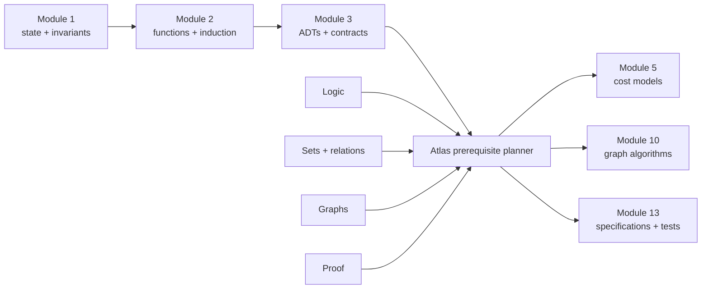
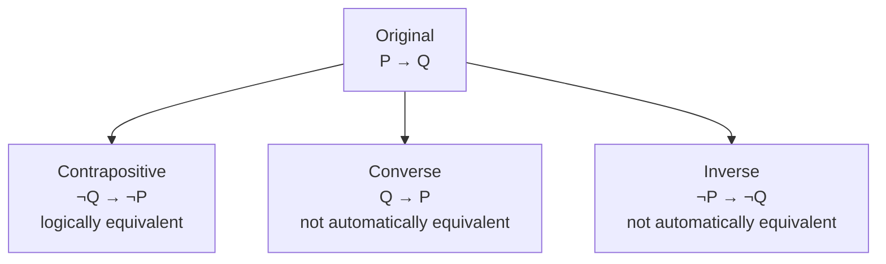
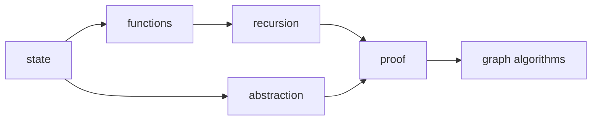
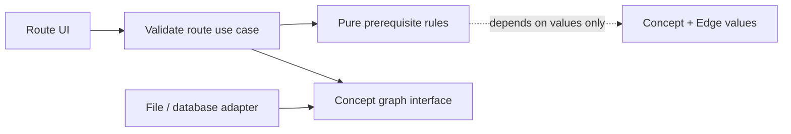
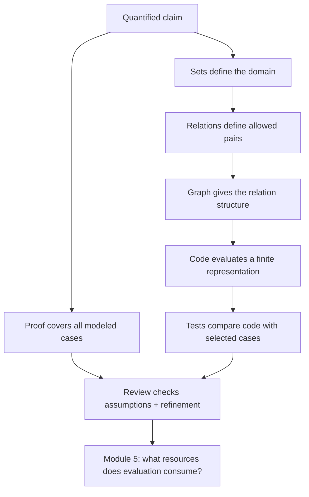

# Module 4 — Logic, Sets, Relations, Graphs, and Proof

## Position in the knowledge system

Atlas can now represent events behind an abstraction boundary. The next problem is not mainly about Python syntax:

> Given a set of concepts and prerequisite claims, how can Atlas decide whether a proposed learning route is valid—and explain why?

This forces us to make informal words such as “all,” “depends on,” “before,” “reachable,” and “valid” mathematically precise. Logic gives us claim structure. Sets and relations give us a vocabulary for collections and connections. Graphs give the prerequisite system a shape. Proof tells us when an answer follows for every allowed input rather than only for examples we tried.



The diagram shows two kinds of dependency. Modules 1–3 supply the computational model and contract discipline. This module supplies the mathematical language that later algorithms, databases, protocols, and security arguments rely on.

## Prerequisite retrieval

Answer before reading further. Explanation matters more than speed.

1. If `route.append(topic)` changes a list reached by two names, did Python rebind both names or mutate one shared object?
2. What three obligations make an induction argument valid?
3. For an event-store ADT, what is the difference between a public contract and a representation invariant?
4. Give one example that refutes the claim “every Python sequence is mutable.”

If questions 2 or 3 are unclear, return briefly to Modules 2 and 3. We will reuse induction and invariants rather than silently assuming them.

## Learning outcomes

By the end, Michael can:

1. translate a bounded English claim into propositions and quantifiers;
2. distinguish implication from its converse and inverse;
3. negate quantified claims without guessing;
4. model data with sets, functions, and relations;
5. identify reflexive, symmetric, antisymmetric, and transitive behavior;
6. represent a prerequisite relation as a directed graph;
7. distinguish a walk, path, cycle, reachability, and topological validity;
8. choose direct proof, contradiction, contrapositive, induction, or counterexample deliberately;
9. separate computational evidence from proof;
10. read code and recover the mathematical claim it is intended to establish;
11. review an agent-generated prerequisite validator for specification gaps;
12. connect proof obligations to algorithms, tests, databases, protocols, and security.

## 1. Why examples are not enough

Suppose Atlas accepts this route:

```python
route = ["state", "recursion", "graphs"]
```

Testing that one route can show that the implementation accepts that input. It cannot establish:

> Every prerequisite of every concept appears earlier in every route Atlas accepts.

That sentence ranges over many possible concepts, prerequisite edges, and routes. A test observes selected cases. A proof derives a universal conclusion from definitions and assumptions. Both are evidence, but they answer different questions.

| Evidence | What it can establish | What it cannot establish alone |
|---|---|---|
| Example | A behavior occurs for one chosen case | The behavior occurs for every allowed case |
| Counterexample | A universal claim is false | A replacement universal claim is true |
| Test suite | The implementation satisfies selected executable claims | Completeness over an unbounded input space |
| Proof | A stated conclusion follows from stated assumptions | That code matches the proved model or assumptions hold in production |

Reliable engineering combines them: prove the model, test the implementation, and inspect whether the implementation refines the model.

### First-principles derivation — from informal policy to checkable claim

Start with the policy sentence: “a learning route respects every required
prerequisite.” Replace its informal nouns with a finite route and a stated
edge relation, then quantify over each represented prerequisite edge whose
dependent appears in that route. Require its prerequisite to appear too and at
an earlier position under the chosen partial- or full-route policy. The result
is a predicate that can be proved for an arbitrary edge, disproved by one
witness edge, and implemented as a validation loop without changing what the
claim means.

### Definition — domain, predicate, and witness

Begin by naming the allowed objects and the exact predicate. For a route,
the domain includes a finite sequence of concepts and a stated prerequisite
relation; a witness is one concrete route and edge pair that makes the
predicate true or false. Without this boundary, a sentence such as “the route
is valid” has no determinate claim to prove or test.

### Assumption — the relation is complete enough for the claim

A proof about the supplied edge set establishes a fact about that model, not
about every prerequisite that someone might have forgotten to record. The
implementation also needs a policy for missing concepts, duplicate entries,
self-loops, and whether the relation stores immediate edges or its transitive
closure.

### Derivation and proof idea — quantify then seek a witness

Translate “every represented prerequisite comes earlier” into a quantified
predicate. To prove it, choose an arbitrary represented edge and derive the
required ordering from the contract. To refute it, negate the universal and
produce one allowed edge and route that violate the ordering. The same
derivation tells a test what concrete witness it should expose.

### Counterexample — a true example does not prove a universal policy

The route `["state", "functions"]` respects the one edge
`state → functions`, but that example does not establish every route policy.
The route `["functions", "state"]` is a counterexample to the nearby
universal claim even though it contains the same two concepts exactly once.

### Numerical experiment — count cases without upgrading the claim

For a small graph, enumerate candidate routes or sample generated DAGs and
record which witnesses the validator accepts or rejects. This can find a model
or implementation mismatch; it cannot turn a finite sample into a proof about
all finite graphs. Carry the graph size model into M5 before attaching a cost
label.

## 2. Propositions: claims with truth conditions

A **proposition** is a claim that is either true or false under a fixed interpretation.

Let:

- `P(c)`: concept `c` appears in the route;
- `B(a, b)`: concept `a` appears before concept `b`;
- `R(a, b)`: `a` is an immediate prerequisite of `b`.

Connectives form larger propositions:

| Form | Read as | True when |
|---|---|---|
| `¬P` | not P | P is false |
| `P ∧ Q` | P and Q | both are true |
| `P ∨ Q` | P or Q | at least one is true |
| `P → Q` | if P, then Q | every P-case is also a Q-case |
| `P ↔ Q` | P exactly when Q | both implications hold |

For a valid route, one local rule is:

> If `a` is an immediate prerequisite of `b` and `b` is in the route, then `a` is in the route and appears before `b`.

Formally, for fixed `a` and `b`:

`(R(a, b) ∧ P(b)) → (P(a) ∧ B(a, b))`

### Implication is not a causal arrow

`P → Q` rules out one case: P true and Q false. It does not say P causes Q, happens earlier, or is the only way Q can occur.

If “a valid route has no backward prerequisite edge” is true, its **converse**—
“a route with no backward edge is valid”—may still fail if the route omits a prerequisite entirely. Reversing an implication changes the claim.



## 3. Quantifiers: who does the claim range over?

The universal quantifier `∀` means “for every.” The existential quantifier `∃` means “there exists at least one.”

A route-validity requirement can be written:

`∀a ∀b, (R(a, b) ∧ P(b)) → (P(a) ∧ B(a, b))`

Its negation is not “no prerequisites are respected.” The negation says a violating pair exists:

`∃a ∃b, R(a, b) ∧ P(b) ∧ (¬P(a) ∨ ¬B(a, b))`

This transformation is a debugging tool:

```text
not(for every x, claim(x))
= there exists an x for which not claim(x)
```

A failing test should exhibit that witness: the particular `a`, `b`, and route that violate the universal rule.

### Quantifier order changes meaning

- `∀concept ∃route`: every concept occurs in at least one valid route.
- `∃route ∀concept`: one valid route contains every concept.

The same symbols appear, but the claims are very different. Read quantifiers left to right as a dependency structure.

## 4. Sets: membership without order or duplication

A **set** models which distinct elements are present. It intentionally forgets order and repeated occurrences.

```python
route = ["state", "recursion", "graphs", "graphs"]
seen = set(route)
```

`route` and `seen` answer different questions:

- the list preserves position and duplicates;
- the set supports membership and set operations;
- neither representation is universally “better.”

Core operations:

- union `A ∪ B`: in A or B;
- intersection `A ∩ B`: in both;
- difference `A − B`: in A but not B;
- subset `A ⊆ B`: every member of A is a member of B;
- Cartesian product `A × B`: every ordered pair `(a, b)` with `a ∈ A`, `b ∈ B`.

The power set `𝒫(A)` is the set of all subsets of A. A set of `n` distinct elements has `2ⁿ` subsets because each element contributes one binary include/exclude choice. This is our first bridge to combinatorial explosion and Module 5.

## 5. Relations and functions

A binary **relation** from A to B is a subset of `A × B`. A prerequisite edge `(a, b)` means “a is an immediate prerequisite of b.”

A **function** from A to B is a relation that assigns every allowed input in A exactly one output in B. This mathematical constraint is narrower than Python’s `def`, which may mutate state, raise an exception, or produce different outputs across calls.

Useful relation properties on a set A:

| Property | Formal shape | Prerequisite interpretation |
|---|---|---|
| Reflexive | `∀a, aRa` | every concept requires itself—usually unwanted |
| Irreflexive | `∀a, ¬aRa` | no concept immediately requires itself |
| Symmetric | `aRb → bRa` | prerequisites run both ways—usually unwanted |
| Antisymmetric | `(aRb ∧ bRa) → a=b` | distinct concepts cannot require each other both ways |
| Transitive | `(aRb ∧ bRc) → aRc` | if a precedes b and b precedes c, a precedes c |

The immediate prerequisite relation need not be transitive because `(state, graphs)` may not be stored as a direct edge. Its **transitive closure** represents all direct or indirect prerequisites.

This distinction matters in code review. A function called `prerequisites_of` might return immediate neighbors or the full closure. The name alone does not specify which.

## 6. Graphs: relations with a useful visual shape

A directed graph is a pair `G = (V, E)`:

- `V` is a set of vertices;
- `E ⊆ V × V` is a set of directed edges.

For Atlas:

- vertices are concepts;
- edge `(a, b)` means a must be learned before b.



A **walk** may repeat vertices and edges. A **path** is a walk with no repeated vertices. A **cycle** starts and ends at the same vertex while using at least one edge. Vertex `v` is **reachable** from `u` when a directed path from `u` to `v` exists.

A prerequisite graph should be a **directed acyclic graph** (DAG). A cycle such as `functions → recursion → functions` would demand that each topic be mastered before the other. No linear learning route can satisfy it.

A **topological order** is a linear ordering in which every edge points forward. A finite directed graph has a topological order exactly when it has no directed cycle. We will implement traversal algorithms in Module 10; here our focus is the model and correctness condition.

### Text alternative — prerequisite graph as a relation

Read the graph as an ordered relation: `state` must come before `functions`
and `abstraction`; `functions` must come before `recursion`; both `recursion`
and `abstraction` must come before `proof`; and `proof` must come before graph
algorithms. A route is valid only when every required directed edge points from
an earlier concept to a later one; a directed cycle would make that impossible.

## 7. Counting and probability foundations

Counting tells us how many possibilities a system must distinguish. Probability tells us how uncertainty is distributed across those possibilities.

### Product and sum rules

- If one decision has `a` choices and **each** first-stage choice has the same `b` allowed second-stage continuations, the ordered pairs total `a·b`. This is a branch-counting condition, not a probability-independence claim.
- If a choice must come from one of two disjoint categories with `a` and `b` possibilities, there are `a+b` possibilities.

### Prediction before reveal — unequal branches require a sum

A route planner may start at exactly one of three concepts. Starting at `A`
has one valid continuation, starting at `B` has three, and starting at `C` has
none. Before revealing the explanation, record a **low / medium / high**
confidence answer: how many ordered start/continuation pairs are valid, and
why is `3·b` not an available calculation?

<details>
<summary>Reveal after writing your count and confidence.</summary>

There are `1 + 3 + 0 = 4` valid pairs. There is no one shared `b`: the branch
counts are unequal. Product notation applies when each first-stage option has
the same number of allowed continuations; otherwise sum the branch counts.
This combinatorial condition is separate from the later probability question
of whether random events are independent.

</details>

This is why `n` binary include/exclude decisions create `2ⁿ` subsets. It is also why exhaustive route search becomes impossible quickly: even before ordering selected concepts, the candidate-subset space is exponential.

This module establishes the counting and probability language needed to make
later claims precise. Full counting techniques, discrete probability, and
their proof practice deepen in **M27** and **M30** rather than being implied by
this compressed bridge.

### Sample spaces and events

A **sample space** `Ω` is the set of possible outcomes of a random experiment. An **event** is a subset of `Ω`. A probability measure assigns numbers to events so that:

- probabilities are between 0 and 1;
- `P(Ω) = 1`;
- probabilities of disjoint events add.

If Atlas randomly selects one of four equally likely review prompts, then each single-prompt event has probability `1/4`. “The prompt concerns proof or graphs” is a union of outcome events.

### Conditional probability and independence

`P(A | B)` asks for the probability of A after learning that B occurred:

`P(A | B) = P(A ∩ B) / P(B)`, when `P(B) > 0`.

Events A and B are independent when `P(A ∩ B) = P(A)P(B)`. Independence is a model claim, not a synonym for “unrelated.” For example, quiz correctness and response time may not be independent; treating them as such could distort a learning-confidence signal.

### Random variables and expectation

A **random variable** maps outcomes to numbers. Its expectation is a probability-weighted average over possible values.

If a hash-table lookup examines `X` slots, `E[X]` describes expected probes under stated hashing and input assumptions. It does not guarantee that every lookup uses `E[X]` probes.

Linearity of expectation says:

`E[X + Y] = E[X] + E[Y]`

even when X and Y are not independent. This fact becomes useful in randomized algorithms and expected-cost analysis.

Python simulations can test whether observed frequencies resemble a model, but simulation does not establish that the probability model itself is appropriate. In Module 5, we will keep **expected**, **worst-case**, and **amortized** resource claims separate.

## 8. Proof as a dependency-respecting explanation

A proof is not ceremonial notation. It is an argument where every step follows from:

- a definition;
- a stated assumption;
- an earlier established result;
- a valid inference rule.

The proof style should match the claim.

### Direct proof

Use the assumptions forward.

#### Warm-up: a definition check

**Claim:** If every prerequisite edge points from a lower route position to a higher position, the route contains no backward prerequisite edge.

This follows directly because “backward edge” means an edge whose source position is not lower than its target position.

#### A quantified direct proof: choose an arbitrary edge

Let `E` be the prerequisite-edge set and let `p(v)` be the position of vertex
`v` in a total proposed route. Call `(a, b)` **backward** when
`p(a) ≥ p(b)`.

**Prediction before reveal:** Under the premise
`∀(a, b) ∈ E, p(a) < p(b)`, can an edge in `E` be backward? Write one
inference rule you would need and a confidence from 0–100 before reading on.

**Claim:** If `∀(a, b) ∈ E, p(a) < p(b)`, then no edge in `E` is backward.

**Proof:** Let `(a, b)` be an arbitrary edge in `E`.

1. **Assumption:** `∀(x, y) ∈ E, p(x) < p(y)`.
2. **Universal instantiation:** because `(a, b) ∈ E`, `p(a) < p(b)`.
3. **Definition:** a backward edge would require `p(a) ≥ p(b)`.
4. Therefore this arbitrary edge is not backward. Because the choice of
   `(a, b)` was arbitrary, no edge in `E` is backward. ∎

The proof is about the stated edge set and total-position premise. A route
validator, a few examples, or a graph drawing can check a finite instance; it
does not replace the universal inference above.

### Contrapositive

To prove `P → Q`, prove the equivalent `¬Q → ¬P`.

**Claim:** If a route is topologically valid, the represented prerequisite graph is acyclic.

Contrapositive: if the graph contains a directed cycle, choose the earliest-positioned vertex on that cycle. Its predecessor on the cycle must occur earlier to satisfy the edge, contradicting the choice of earliest vertex.

### Contradiction

Assume the desired conclusion is false and derive an impossibility.

This is especially useful when the false assumption creates a minimal or maximal object that cannot exist.

### Induction

Use induction when the object is built recursively or indexed by a natural number.

**Claim:** A chain of `n` prerequisite edges contains `n + 1` vertices.

- Base: a chain of zero edges contains one starting vertex.
- Step: extending a chain of `n` edges by one edge introduces one new endpoint, so `n + 1` becomes `n + 2`.

### Counterexample

To refute `∀x, P(x)`, produce one allowed `x` for which `P(x)` is false.

Claim: “If all concepts appear exactly once, the route is valid.”

Counterexample:

```python
prerequisites = {("state", "graphs")}
route = ["graphs", "state"]
```

Both concepts appear exactly once, but the edge points backward.

## 9. Executable model: validate one proposed route

Start with a precise contract:

```python
from collections.abc import Iterable, Sequence
from typing import TypeAlias

Concept: TypeAlias = str
Edge: TypeAlias = tuple[Concept, Concept]


def route_violations(
    route: Sequence[Concept],
    edges: Iterable[Edge],
) -> tuple[str, ...]:
    """Return all reasons the proposed route violates prerequisite edges.

    Preconditions:
    - every edge is ordered as (prerequisite, dependent);
    - concept identifiers are nonempty strings.

    Postconditions:
    - the input route and edge collection are not mutated;
    - an empty result means every represented edge is respected;
    - each returned reason identifies a concrete witness.
    """
    positions: dict[Concept, int] = {}
    violations: list[str] = []

    for index, concept in enumerate(route):
        if concept in positions:
            violations.append(f"duplicate concept: {concept}")
        else:
            positions[concept] = index

    for prerequisite, dependent in edges:
        if dependent not in positions:
            continue
        if prerequisite not in positions:
            violations.append(
                f"{dependent} is missing prerequisite {prerequisite}"
            )
        elif positions[prerequisite] >= positions[dependent]:
            violations.append(
                f"{prerequisite} must appear before {dependent}"
            )

    return tuple(violations)
```

### Read before judging

Recover the model from the code:

1. `positions` represents a partial function from concept to first position.
2. The first loop turns duplicate concepts into explicit witnesses.
3. The second loop checks only dependencies whose dependent occurs in the route.
4. The tuple return prevents callers from mutating the returned collection itself.

Now find the specification decision hidden in step 3:

> Is a partial route allowed to omit entire downstream concepts?

The implementation says yes. That may be correct for a learner planning only the next block, but wrong for a “complete curriculum” validator. Logic exposes the choice; Python cannot choose the product rule for us.

### Correctness argument

Assume the function returns no violations.

For any edge `(a, b)` whose dependent `b` occurs in the route:

1. the missing-prerequisite branch did not add a violation, so `a` occurs;
2. the backward-edge branch did not add a violation, so `position(a) < position(b)`.

Because the chosen edge was arbitrary, every represented edge with a present dependent is respected. This proves the postcondition relative to the stated partial-route policy.

It does not prove that:

- the edge set contains every true prerequisite;
- there is no cycle outside the proposed route;
- the implementation has no mismatch with the model;
- the strings have been normalized consistently.

Those become separate contracts and tests.

## 10. Code-reading and architecture studio

You receive three agent-generated Atlas planners:

1. a direct scan over every route prefix;
2. a dictionary-based validator like the one above;
3. a class that mixes validation, database I/O, recommendation, and HTML rendering.

For each implementation:

- identify its mathematical model (`V`, `E`, route, position relation);
- state whether it validates immediate edges or transitive prerequisites;
- recover the policy for missing downstream concepts;
- locate hidden normalization assumptions;
- draw dependencies and side effects;
- separate a correctness issue from an architectural issue;
- name one claim that tests can support and one claim that needs proof.

Architecture target:



The pure rule layer should not know how the graph was stored or rendered. That boundary lets us prove and test the rule without live I/O.

## 11. Mechanism-revealing implementation

Manual coding is intentionally small. Implement only:

```python
def respects_edge(
    positions: dict[str, int],
    edge: tuple[str, str],
) -> bool:
    ...
```

Before typing:

1. write the truth condition;
2. decide what missing concepts mean;
3. name one counterexample to an incorrect implementation;
4. state the time cost under the dictionary-lookup model.

The goal is to translate one formal predicate into executable behavior, not to spend an hour on boilerplate.

## 12. Agent direction and patch review

Ask an implementation agent for a bounded change:

> Add cycle diagnosis to the prerequisite domain layer. Return one concrete cycle as an ordered tuple when a cycle exists. Do not add UI, storage, third-party graph libraries, or route recommendation. Preserve existing public contracts. Include deterministic tests for self-loops, disconnected components, multiple possible cycles, and an acyclic graph. Document the returned-cycle convention and analyze complexity.

Review the patch with these questions:

- Did it preserve dependency direction?
- Is a self-loop treated as a cycle?
- Does a returned sequence actually follow edges and close?
- Is deterministic output promised or merely accidental?
- Did the agent silently change “immediate edge” into “reachability”?
- Does a test merely repeat the implementation?
- Is the complexity claim tied to a named graph representation?
- Can the cycle witness be checked independently?

The learner owns the claim after accepting the patch.

## 13. Interactive teaching sequence

Each session alternates short explanation with prediction, drawing, code reading, or argument. Timing is flexible and follows evidence.

## Session 1 — Claims that can be checked

**Recall:** contracts and counterexamples from Modules 2–3.  
**Launch:** inspect three English descriptions of a “valid route” that disagree on missing concepts.  
**Derive:** proposition, predicate, implication, converse, and truth condition.  
**Learner action:** translate one route policy, find one ambiguous phrase, and construct one violating witness.  
**Exit synthesis:** explain why a plausible example cannot establish a universal claim.

### Output: claim-and-witness card

Carry one bounded English policy, its domain and predicate, one smallest
witness, and a confidence note into Session 2.

## Session 2 — Quantifiers, sets, and relations

**Recall:** one implication and its contrapositive.  
**Launch:** compare “every concept has some route” with “one route has every concept.”  
**Derive:** universal/existential quantifiers, negation, set operations, Cartesian product, relation, and function.  
**Learner action:** annotate which code variable represents each mathematical domain and pair.  
**Exit synthesis:** negate the Atlas validity rule and name the data a failing test must expose.

### Output: quantified-policy and relation map

Carry one quantified route policy, its correct negation, the relevant set or
relation, and the witness a failing test would need to reveal.

## Session 3 — Give prerequisites a graph shape

**Recall:** immediate relation versus transitive consequence.  
**Launch:** draw a prerequisite cycle that makes every linear route impossible.  
**Derive:** directed graph, path, reachability, cycle, DAG, and topological order.  
**Learner action:** recover `V`, `E`, edge direction, and missing policies from unfamiliar validator code.  
**Exit synthesis:** defend why a field named `children` does not by itself prove tree semantics.

### Output: prerequisite-graph and cycle witness

Carry a directed graph model, one stated edge convention, one cycle or
topological-order witness, and the domain assumption that makes it meaningful.

## Session 4 — Proof and probability as different models

**Recall:** structural induction from Module 2.  
**Launch:** compare a proof, a test suite, a random simulation, and a counterexample.  
**Derive:** direct proof, contrapositive, contradiction, induction, counting rules, conditional probability, and expectation.  
**Learner action:** choose a proof method for one route theorem and identify the probability assumption in one expected-cost claim.  
**Exit synthesis:** state what each evidence form establishes and where it stops.

### Output: proof-and-probability boundary note

Carry one claim, proof method or counterexample, sampling or probability
assumption, and a clear stopping line between model proof and finite evidence.

## Session 5 — Code-reading and architecture investigation

**Recall:** public contract versus representation invariant.  
**Launch:** compare three planners with identical method names and different domain policies.  
**Learner action:** reconstruct the mathematical claim, dependency direction, effects, witness behavior, and proof obligation; then isolate one mismatch with a minimal case.  
**Exit synthesis:** explain why moving a validator into a class neither proves it nor clarifies its policy.

### Output: validation-model investigation memo

Carry the recovered domain, relation, policy decision, minimal mismatch case,
and one claim requiring proof rather than a reassuring code shape.

## Session 6 — Design, delegate, review, defend

**Recall:** the exact partial-route contract and its negation.  
**Launch:** frame the bounded cycle-diagnosis agent task.  
**Learner action:** review the resulting patch in dependency order, run an independent cycle-witness checker, challenge the complexity claim, and request one focused revision.  
**Exit synthesis:** orally connect the final model to graph algorithms, database constraints, authorization relations, and protocol invariants.

### Output: cycle-review-and-evidence dossier

Carry the bounded task, a checked cycle witness, one unproven claim, a
constructive revision request, and the route model required for M5's cost work.

## 14. Problem ladder

### A. Recognize

For six English statements, identify proposition, predicate, universal claim, existential claim, converse, or negation.

### B. Trace

Trace `route_violations` with a duplicate, a missing prerequisite, and a backward edge. Record the witness produced by each branch.

### C. Map

Given a planner repository, draw the graph between UI, use case, prerequisite rules, graph port, and storage adapter. Mark where the mathematical relation is represented.

### D. Modify

Change the contract so a route must be complete: every vertex in a supplied curriculum set must occur exactly once. State the new logical condition before requesting code.

### E. Debug and defend

A validator checks only adjacent pairs in the route. Construct the smallest route it wrongly accepts, repair the model, and defend why the new condition covers non-adjacent prerequisite edges.

### F. Design and delegate

Specify a cycle-diagnosis change for an agent, including representation, edge cases, output contract, and evidence.

### G. Review and verify

Inspect the patch, find one unproved complexity or correctness claim, and design an independent witness checker.

### H. Transfer

Choose one:

- express a database uniqueness constraint as a quantified claim;
- express a lock invariant over concurrent state;
- model authorization as a relation;
- explain why a network reachability experiment is not a proof of universal availability.

## 15. Understanding check — confidence-aware multiple choice

For every answer record **low**, **medium**, or **high** confidence before revealing the explanation. A high-confidence error is a valuable misconception signal, not a penalty.

### Question 1

To negate “Every accepted route contains all of its prerequisites,” which statement is correct?

A. No accepted route contains any prerequisite.  
B. At least one accepted route is missing at least one prerequisite.  
C. Every rejected route contains a prerequisite.  
D. At least one prerequisite occurs in every route.

<details>
<summary>Reveal answer and reasoning</summary>

**Answer: B.** Negating a universal produces an existential witness and negates the inner claim.

- A over-negates the statement.
- C switches from accepted to rejected routes.
- D changes both the quantifier order and the predicate.

</details>

### Question 2

Given `P → Q`, which form is logically equivalent?

A. `Q → P`  
B. `¬P → ¬Q`  
C. `¬Q → ¬P`  
D. `P ↔ Q`

<details>
<summary>Reveal answer and reasoning</summary>

**Answer: C.** The contrapositive is equivalent to the original implication.

- A is the converse.
- B is the inverse.
- D adds the converse and is stronger.

</details>

### Question 3

Which representation best preserves “concept membership, no duplicates, no order”?

A. List  
B. Set  
C. Stack frame  
D. Directed edge

<details>
<summary>Reveal answer and reasoning</summary>

**Answer: B.** A set models distinct membership while intentionally forgetting order.

- A preserves order and can preserve duplicates.
- C represents an execution environment.
- D represents one relation pair, not a collection policy.

</details>

### Question 4

The immediate prerequisite relation contains `(state, functions)` and `(functions, recursion)`, but not `(state, recursion)`. What is necessarily true?

A. The immediate relation is symmetric.  
B. The immediate relation is stored as transitive.  
C. `state` is an indirect prerequisite of `recursion` in the transitive closure.  
D. `recursion` is an immediate prerequisite of `state`.

<details>
<summary>Reveal answer and reasoning</summary>

**Answer: C.** A path of two prerequisite edges places the pair in the transitive closure even if no direct edge is stored.

- A would require reversed edges.
- B contradicts the missing transitive edge.
- D reverses direction.

</details>

### Question 5

Why can no topological order satisfy a directed cycle?

A. A cycle contains too many vertices for a list.  
B. Each vertex would have to occur both before and after itself along the cycle.  
C. Topological orders require symmetric edges.  
D. Python sets cannot contain graph vertices.

<details>
<summary>Reveal answer and reasoning</summary>

**Answer: B.** Following each required “before” relation around the cycle returns to the starting vertex, creating an impossible strict ordering.

- A is unrelated to list capacity.
- C is false; prerequisite edges are directed.
- D is a Python representation claim, not the mathematical reason.

</details>

### Question 6

An engineer runs a validator on 100,000 random DAGs without observing a failure. What has been established?

A. The validator is correct for all finite DAGs.  
B. The mathematical theorem and implementation are both proved.  
C. The validator passed those generated cases; untested cases or model mismatches may remain.  
D. Random testing is useless.

<details>
<summary>Reveal answer and reasoning</summary>

**Answer: C.** The experiment is meaningful implementation evidence but not a universal proof.

- A and B overstate the evidence.
- D understates the value of broad, adversarial tests.

</details>

### Question 7

Which is the best counterexample to “If a route contains every concept exactly once, it respects prerequisites”?

A. An empty graph and empty route.  
B. Edge `a → b` with route `[b, a]`.  
C. Edge `a → b` with route `[a, b]`.  
D. One concept with no edges and route `[a]`.

<details>
<summary>Reveal answer and reasoning</summary>

**Answer: B.** Every concept occurs once, but the prerequisite edge points backward.

- A, C, and D satisfy the claim in their cases.

</details>

### Question 8

`route_violations` ignores an edge when its dependent concept is absent. What does this reveal?

A. A syntax error.  
B. A hidden policy that partial routes may omit downstream concepts.  
C. Proof that the graph is acyclic.  
D. Evidence that dictionaries are unordered.

<details>
<summary>Reveal answer and reasoning</summary>

**Answer: B.** The branch encodes a product/domain decision that must appear in the contract.

- A is false; the code is syntactically valid.
- C does not follow.
- D is irrelevant and inaccurate for modern Python’s iteration behavior.

</details>

### Question 9

An Atlas route planner may start at exactly one of three concepts. `A` has one
valid continuation, `B` has three, and `C` has none. Which claim is most
precise before the planner assigns any probabilities?

A. There are four valid ordered start/continuation pairs; add the unequal
branches, and independence is not a premise of this count.  
B. There are nine pairs because three starting concepts must be multiplied by
three continuations.  
C. There are four pairs only if starting concept and continuation are
independent random events.  
D. There are three pairs because only `B` has more than one continuation.

<details>
<summary>Reveal answer and reasoning</summary>

**Answer: A.** The count is `1 + 3 + 0 = 4`. Product notation needs one
shared number of allowed second-stage choices for every first-stage choice;
these branches do not have one. Independence belongs to a probability model,
not to this structural counting decision.

- **B** invents a common second-stage branch count that the scenario denies.
- **C** reaches the count but imports an unnecessary probability assumption.
- **D** ignores the one valid continuation after `A`.

</details>

### Question 10

Let `X` and `Y` count the probes made by two hash-table lookups under a stated
probability model. Which statement is justified without adding an independence
assumption?

A. `E[X + Y] = E[X] + E[Y]` when the expectations exist; independence may
matter for other claims, and the model still needs justification.  
B. The equality holds only when the two lookups are independent.  
C. Every pair of lookups uses exactly `E[X] + E[Y]` probes.  
D. A simulation that resembles the equality proves the chosen probability
model is appropriate.

<details>
<summary>Reveal answer and reasoning</summary>

**Answer: A.** Linearity of expectation does not require `X` and `Y` to be
independent. It does not turn an expected value into a per-run guarantee, and
it does not establish that the hashing or input distribution is the right
model for a real system.

- **B** confuses a familiar sufficient condition for some probability rules
  with a requirement for linearity.
- **C** replaces an average over a model with an exact claim about every run.
- **D** treats finite empirical agreement as proof of a model assumption.

</details>

### Diagnostic interpretation

- Miss Q1–Q2: revisit implication, negation, and quantifier scope.
- Miss Q3–Q4: revisit representation choice and transitive closure.
- Miss Q5 or Q7: rebuild the graph-order model with a drawn counterexample.
- Miss Q6: separate proof of a model from tests of an implementation.
- Miss Q8: practice recovering domain policy from control flow.
- Miss Q9: redraw the unequal branch tree; say which premise is combinatorial
  and which would belong to a probability model.
- Miss Q10: state the probability model for an expected-cost claim, then
  explain why linearity does not need independence or guarantee one run.
- High confidence + wrong: explain why the distractor felt compelling, then construct the smallest case that breaks it.

## 16. TA guide

### Likely misconceptions

- treating implication as causation or equivalence;
- negating “all” as “none” rather than “at least one not”;
- assuming quantifier order does not matter;
- treating a Python container as identical to the mathematical object it represents;
- confusing immediate edges with reachability;
- assuming a large test suite is a proof;
- writing a proof that restates the desired conclusion;
- accepting an agent’s method name as evidence of its contract.

### Diagnostic prompts

1. “Show me one assignment of truth values that separates the implication from its converse.”
2. “What concrete witness would make this universal claim false?”
3. “Does your edge set store immediate facts or every consequence?”
4. “Which line of the implementation corresponds to each quantifier?”
5. “What assumption does this proof use that the code does not enforce?”

### Hint ladder

1. Restate the claim in plain language with explicit “for every” or “there exists.”
2. Draw two or three concrete vertices and directed edges.
3. Replace abstract predicates with a tiny route.
4. Ask for the single forbidden truth-table row or violating witness.
5. Only then expose the formal rewrite or proof skeleton.

### Return to prerequisites when

- object identity and set membership are conflated: revisit Module 1;
- recursive reachability has no base/recursive case: revisit Module 2;
- the learner cannot separate public policy from representation: revisit Module 3.

### Required regression evidence

- the smallest counterexample that exposed the bug;
- one nearby case that must remain accepted;
- one edge-case witness such as duplicate, self-loop, missing concept, or disconnected component;
- an explanation of why the test matches the formal predicate.

## 17. Atlas milestone 4

Deliver a comprehension-and-design portfolio:

- prerequisite-domain concept map;
- precise definitions for `Concept`, immediate edge, reachability, valid partial route, and valid complete route;
- annotated reading of one unfamiliar validator;
- one small manually implemented predicate;
- agent task specification for cycle diagnosis;
- reviewed patch with independent witness tests;
- correctness argument for route validation;
- one counterexample journal entry;
- complexity hypotheses to carry into Module 5.

Use the milestone evidence to choose a next bridge or repair: Michael explains
the model and evidence orally rather than treating a green repository as the
whole story.

### Project acceptance criteria — prerequisite-domain portfolio

The portfolio is ready for a constructive next-step discussion when it names
the route domain and edge convention; connects each formal claim to a witness,
proof step, or test boundary; distinguishes immediate edges from reachability;
includes one minimal counterexample and one independent cycle-witness check;
and identifies one remaining assumption or cost question. This is not a
pass/fail score or a mastery declaration.

### Evidence rubric

| Evidence | Evidence to carry forward | If a bridge is needed, repair by |
| --- | --- | --- |
| Formal claim | domain, predicate, and quantifier order match the stated policy | translate the claim back into plain language and find a witness |
| Proof or counterexample | every inference has a stated assumption, or one smallest model refutes the claim | shrink the model to the first failing vertex/edge/value |
| Code/model connection | implementation variables and tests map to the formal objects | annotate the unfamiliar validator before editing it |
| Forward handoff | resource hypotheses name `V`, `E`, or another explicit size model | carry the same model into M5 rather than attaching a complexity label first |

## 18. Consolidation map



Keep one sentence:

> A proof establishes that a conclusion follows in a model; tests and review establish evidence that a program realizes that model.

## Backward and forward connections

### Backward

- Module 1 supplies state transitions and invariants that become logical claims.
- Module 2 supplies recursive definitions and induction as one proof strategy.
- Module 3 supplies behavioral contracts whose ambiguous quantifiers and relation laws we now expose.

### Forward

- Module 5 counts the resources required to evaluate a correct model.
- Module 8 uses equality relations, probability, and invariants to justify hashing.
- Module 10 turns reachability and topological validity into graph algorithms.
- Module 13 turns quantified specifications into tests while preserving the proof/test distinction.
- Module 16 uses sets, relations, keys, and constraints in the relational model.
- Module 19 uses invariants and counterexample interleavings for concurrent correctness.
- Module 22 models authorization as relations and security claims as proof obligations under a threat model.
- Module 25 deepens probability, evaluation, and evidence for intelligent features.

## Official calibration card

| Atlas evidence | Official calibration anchor | Decision |
| --- | --- | --- |
| Sessions 1–6: quantified prerequisite claims, relation/graph models, proof and counterexample work, the proof-versus-test evidence table, and a reviewed design defense | [MIT 6.042J official readings](https://ocw.mit.edu/courses/6-042j-mathematics-for-computer-science-fall-2010/pages/readings/) route proofs, induction, graphs, directed graphs, relations, asymptotics, and recurrences. | **Aligned, compressed.** This module builds the proof-to-algorithm bridge; number theory, full counting, and discrete probability continue in the mathematical bridge and advanced route. |

**Access and reuse.** Checked 2026-08-01. Use the original readings by link
only. Atlas's examples, diagrams, code, prompts, and diagnostics are original;
do not reproduce protected course prose, figures, assignments, or solutions.

## Sources and further study

The teaching narrative above is original and integrated. These sources provide deeper exercises and authoritative context:

- [MIT 6.042J Mathematics for Computer Science](https://ocw.mit.edu/courses/6-042j-mathematics-for-computer-science-spring-2015/) — definitions, proofs, induction, relations, graphs, counting, and probability.
- [MIT 6.006 Introduction to Algorithms](https://ocw.mit.edu/courses/6-006-introduction-to-algorithms-spring-2020/) — correctness and graph/algorithm modeling that continue in later modules.
- [Python 3.14 documentation: data structures](https://docs.python.org/3.14/tutorial/datastructures.html) — language-level behavior of lists, sets, and dictionaries used as representations.
- [Composing Programs](https://www.composingprograms.com/) — functions, data abstraction, recursion, and interpreters as connected computational ideas.

### Session-to-source-and-evidence route

| Session | Claim or learner artifact | Consult after your own attempt |
| --- | --- | --- |
| 1 | proposition, predicate, implication, and a smallest witness | [MIT 6.042J](https://ocw.mit.edu/courses/6-042j-mathematics-for-computer-science-spring-2015/) for definitions and proof structure |
| 2 | quantified route policy and correct negation | [MIT 6.042J readings](https://ocw.mit.edu/courses/6-042j-mathematics-for-computer-science-fall-2010/pages/readings/) for relations and directed graphs |
| 3 | graph model, cycle witness, and topological-order claim | [MIT 6.006](https://ocw.mit.edu/courses/6-006-introduction-to-algorithms-spring-2020/) as a later algorithmic continuation |
| 4 | proof method, branch count, and probability-model boundary | [MIT 6.042J](https://ocw.mit.edu/courses/6-042j-mathematics-for-computer-science-spring-2015/) for distinct counting/probability foundations |
| 5 | recovered validator model and minimal mismatch case | [Python data structures](https://docs.python.org/3.14/tutorial/datastructures.html) for representation behavior, not proof |
| 6 | reviewed patch and oral design defense | the Atlas claim, witness, and evidence card; sources verify terms, not the conclusion |

## Constructive next-step guide

Evidence chooses the next bridge or repair; it does not decide whether Michael
passes. With a clear, self-supported explanation, continue with the M5 handoff.
That explanation should cover a quantified route policy, a smallest witness or
counterexample, the mapping from formal objects to unfamiliar code, and the
boundary between proof and implementation evidence. Otherwise, translate the
policy into a predicate, draw the smallest relation/graph witness, and use the
Teaching Assistant's proof hint ladder before retrying.

This guide is not a score, grade, release approval, Core advance, or mastery declaration.

## Guided Codex handoff — M4

### Teaching Assistant — supportive oral defense

Start with: **“I am finishing M4. My claim is [quantified statement], my
smallest witness/counterexample is [case], and my confidence is [level].”**
Ask the learner to read the quantifiers aloud in plain language before using
symbols. Use this hint ladder: concrete route/set/graph → predicate →
quantifier order → negation witness → proof obligation. Change one premise
(for example, immediate versus transitive prerequisite) and ask what relation
or theorem must be revised. End with a learner-controlled evidence card:
claim, witness, assumption, and next question.

### Invitation — state the model in plain language

Invite the learner to choose one quantified route claim, say its domain and
edge convention in ordinary language, show a smallest witness, and name a
confidence level before the Teaching Assistant offers correction.

### Hint ladder — make one quantifier visible

Use the smallest prompt needed: draw a route and edge; name the predicate;
write “for every” or “there exists”; negate the claim; then connect the
witness to a proof obligation. Keep the discussion constructive rather than
pass/fail.

### Changed-premise counterexample

Change exactly one premise—make a direct edge merely indirect, permit a
self-loop, omit one prerequisite, or change a partial route into a complete
route—and ask which definition, theorem, or test must change.

### Transfer — from a prerequisite route to an operational rule

Ask the learner to turn one database constraint, authorization relation, or
concurrent-state invariant into a bounded domain, predicate, witness, and
evidence plan without claiming identical mechanisms or guarantees.

### Reflection — name the next smallest evidence

Ask what the current proof, trace, or test establishes; what it does not
establish; and which single counterexample, source check, or regression would
reduce the remaining uncertainty.

### Learner-controlled evidence summary

Keep only a learner-selected concise card: claim, domain, witness or proof
step, confidence, revised model, unresolved question, and retrieval prompt.
No Notion write, transcript retention, oral-exam result, grade, or mastery
decision follows from this workbook alone.

### Study Partner — proof rehearsal

Ask for one two-line translation between an informal policy and a quantified
formula. Deliberately swap a universal and an existential, then ask for the
smallest model that separates the two statements. Do not correct immediately:
wait for a counterexample or proof sketch.

### Retrieval, ready-when, and forward handoff

At **+1, +7, and +21 days**, negate one quantified statement, draw one
relation/graph, and name whether a result is a proof, a test observation, or a
claim still needing evidence. The M4 evidence supports the M5 handoff when the
learner can construct and explain a counterexample rather than merely name a
theorem. Carry the input model, relation, and proof obligation into **M5**,
where those same choices become an explicit cost model.

## Bench pack

**Bench pack:** `m04` — sparse, two benches. CPython 3.12 floor.
**Emits:** one bench record per benched session, naming that session's declared output.

Bench packs are sparse by policy: a session gets a bench only where running code
reveals something reading cannot. This module warrants two rather than three, and
the pack says so rather than padding. It has no checked-in reference model, so the
benches carry their own fixtures.

### Bench 3 — prerequisite-graph and cycle witness

**Session:** 3. **Rungs:** recognize, trace.
**Executes:** three prerequisite graphs with identical field shape against a
per-node validator, which accepts all three — including one containing a cycle.
A white/grey/black traversal then separates the two distinct non-tree conditions:
a shared prerequisite, which is workable, and a cycle, which is not, returned as a
checkable edge sequence.
**Cannot establish:** how often real prerequisite data contains cycles, or the
cost of the traversal at scale.

### Bench 4 — proof-and-probability boundary note

**Session:** 4. **Rungs:** review and verify, trace.
**Executes:** two optimisations of one specification. Ten thousand uniform random
routes report zero disagreements for both. Exhausting all 1,771,561 routes proves
the first correct and finds fifteen counterexamples in the second — a rate of
8.5e-06, or 0.085 expected hits in the sample. The number of trials actually
needed to stumble on one runs to hundreds of thousands.
**Cannot establish:** anything outside the declared finite domain. The technique
does not transfer to an unbounded one, where sampling is the only option.

### Sessions without a bench

- **Session 1**, **Session 2** — claims, quantifiers, and relation modelling are
  specification arguments, not runs.
- **Session 5** — its three-implementations-one-verdict experiment is already
  benched at `m01-s4` and `m03-s4`; a third would be the same experiment.
- **Session 6** — a review-and-evidence dossier consuming Sessions 1–5.

### Bench pack completion record

Records under `benches/records/m04-s*.json`. Each names its session output, carries
at least one labelled claim, and states exactly one thing its evidence cannot support.
