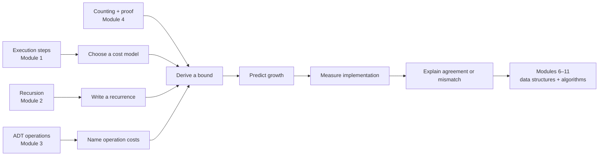
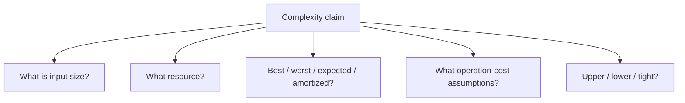
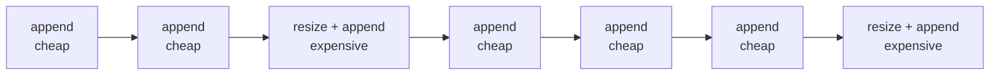
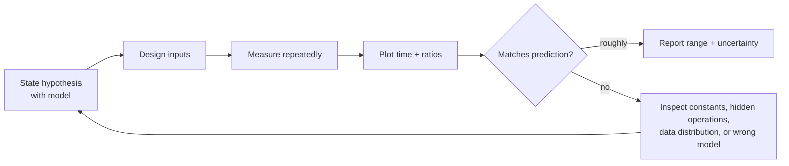
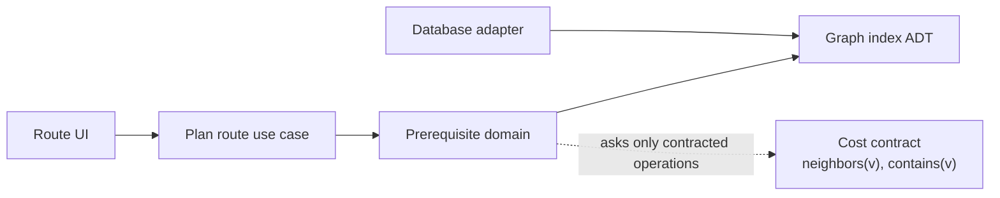
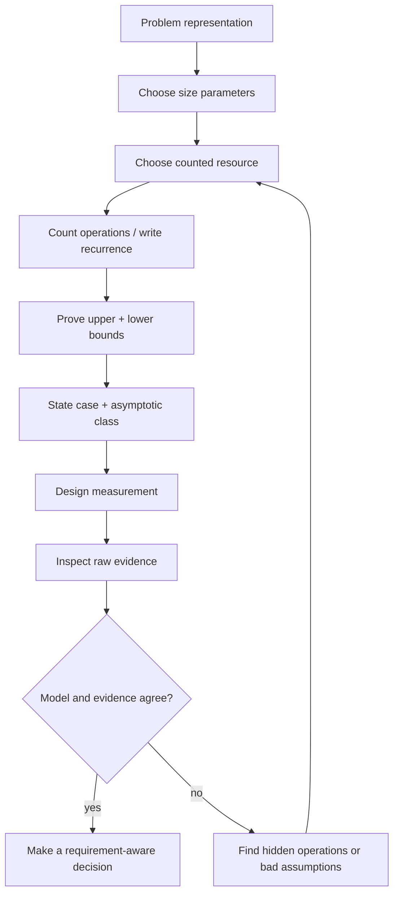

# Module 5 — Cost Models and Algorithm Analysis

## Position in the knowledge system

Module 4 gave Atlas a precise prerequisite model and a correctness condition. Correct output is necessary, but it is not sufficient. A route validator that works for 20 concepts may become unusable for 200,000 concepts.

This module asks:

> How do resource requirements grow as the represented problem grows, and what evidence supports that prediction?

We derive analysis from the execution model in Module 1, recursive structure in Module 2, abstraction contracts in Module 3, and counting/proof language in Module 4.



Analysis is a model of growth. Measurement is an observation of a particular implementation on a particular machine. We need both, and we must not confuse them.

## Prerequisite retrieval

1. In the prerequisite graph `G = (V, E)`, what do `V` and `E` represent?
2. Why does a counterexample refute a universal claim?
3. What is the base case of a recursive function for the empty note tree?
4. Why can an ADT change representation without changing clients?
5. In Module 1’s execution model, what is a state transition?

If question 2 or 3 is unclear, pause for a short proof/recursion bridge. Recurrences and asymptotic claims build directly on them.

## Mastery outcomes

By the end, Michael can:

1. choose an input-size parameter that reflects the real problem;
2. state the counted resource and primitive-operation assumptions;
3. derive simple exact counts from loops and comprehensions;
4. distinguish best-case, worst-case, expected, and amortized analysis;
5. use `O`, `Ω`, and `Θ` as sets of growth functions rather than speed labels;
6. simplify bounds without losing the relevant claim;
7. derive and solve common recurrences with substitution or a recursion tree;
8. explain why dynamic-array append can be amortized constant time;
9. identify hidden costs behind Python operations;
10. design a benchmark that tests a prediction without pretending to prove it;
11. read unfamiliar code and recover its dominant operations;
12. challenge an agent’s complexity claim with a counterexample or measurement.

## 1. The concrete failure: ingestion slows down

Atlas ingests concept names and rejects duplicates:

```python
def unique_topics_slow(topics: list[str]) -> list[str]:
    unique: list[str] = []
    for topic in topics:
        if topic not in unique:
            unique.append(topic)
    return unique
```

The function is short, readable, and may be correct under a chosen equality policy. Yet its running time grows badly.

Before assigning a label such as “quadratic,” name what happens:

- the outer loop handles `n` inputs;
- list membership may compare against many items already collected;
- if every topic is distinct, the comparison counts are approximately
  `0 + 1 + 2 + ... + (n - 1)`;
- that sum is `n(n - 1) / 2`.

The derivation, not the number of nested lines, supports the growth claim.

## 2. A cost model is an explicit simplification

A **cost model** names:

1. the input-size parameter or parameters;
2. the resource being counted;
3. operations treated as primitive;
4. assumptions about those operation costs.

For `unique_topics_slow`, one useful model is:

- `n`: number of input topic strings;
- resource: equality comparisons;
- one normalized-string equality comparison counts as one operation;
- append cost is analyzed separately;
- all topics are distinct for the worst-case membership scan.

This model hides string length. If topic strings can grow with the input, a better model has at least two parameters:

- `n`: number of topics;
- `L`: total or maximum string length.

There is no context-free complexity label. A claim is meaningful only with its model and input measure.

### Machine-independent does not mean machine-true

Counting abstract operations lets us reason across CPUs and Python versions. It deliberately ignores constants, cache behavior, interpreter overhead, allocation, and I/O. Later systems modules will reopen those layers.

The abstraction is useful because the difference between linear and quadratic growth eventually dominates many constant-factor differences. It is incomplete because real latency still depends on those constants and layers.

## 3. Count first; simplify second

Consider:

```python
def respects_all_edges(
    positions: dict[str, int],
    edges: list[tuple[str, str]],
) -> bool:
    for prerequisite, dependent in edges:
        if positions[prerequisite] >= positions[dependent]:
            return False
    return True
```

Let `m = len(edges)`.

- best case: the first edge violates the route, so one iteration;
- worst case: all edges are inspected, so `m` iterations;
- each iteration performs a constant number of dictionary lookups and comparisons under an expected constant-time hash-table model.

Worst-case time in that model is `Θ(m)`. Auxiliary space is `Θ(1)` because the function allocates no collection that grows with `m`.

If dictionary lookup is not assumed constant—for example, under adversarial collision behavior—the statement must change. The cost of an algorithm depends on the operations supplied by its data structures.

### Common loop shapes

| Shape | Count | Tight growth |
|---|---:|---:|
| one full pass | `n` | `Θ(n)` |
| halve remaining range | about `log₂ n` | `Θ(log n)` |
| all ordered pairs | `n²` | `Θ(n²)` |
| all unordered pairs | `n(n−1)/2` | `Θ(n²)` |
| pass over each edge and vertex | `n + m` | `Θ(n + m)` |
| enumerate every subset | `2ⁿ` | `Θ(2ⁿ)` outputs |

The table is not a pattern-matching shortcut. Loop bounds, early exits, and operation costs determine the count.

## 4. Asymptotic notation as a claim about sets of functions

Let `f(n)` be the resource use and `g(n)` a comparison growth function.

- `f ∈ O(g)` means `g` is an asymptotic upper bound.
- `f ∈ Ω(g)` means `g` is an asymptotic lower bound.
- `f ∈ Θ(g)` means both bounds hold, so `g` is tight.

Formal upper bound:

`f(n) ∈ O(g(n))` when there exist constants `c > 0` and `n₀` such that
`0 ≤ f(n) ≤ c·g(n)` for all `n ≥ n₀`.

This is why:

`3n² + 20n + 7 ∈ Θ(n²)`

For sufficiently large `n`, the quadratic term supplies both an upper and lower bound up to positive constant factors.

### Big O is not “exactly”

If `f(n) = n`, then `f ∈ O(n²)` is true but weak. `Θ(n)` communicates the tight growth class. In engineering conversation people often say “O(n)” when they mean a tight worst-case bound; this course keeps the distinctions visible.

### Faster is not a property of a symbol

An `O(n log n)` implementation can be slower than an `O(n²)` one over small inputs due to constants and overhead. Asymptotic analysis predicts eventual growth, not a universal stopwatch ranking.



If any branch is missing, the claim is underspecified.

## 5. Four different questions: best, worst, expected, amortized

### Best case

Minimum cost among inputs of a fixed size. It can describe an early exit but rarely gives a service guarantee.

### Worst case

Maximum cost among inputs of a fixed size. It supports upper guarantees and adversarial reasoning.

### Expected case

Average under a stated probability distribution or randomized process. “Expected” is meaningless without saying what is random.

### Amortized

Average cost per operation over every allowed sequence of operations, even without randomness. Occasional expensive operations are spread across many cheap ones.

Expected and amortized are not synonyms:

- expected analysis depends on probabilities;
- amortized analysis bounds complete operation sequences.

## 6. Amortized reasoning: why append can be cheap on average

Imagine a dynamic array that doubles capacity when full.

For a sequence of appends:

- most appends place one item;
- when capacity fills, resizing copies all current items;
- a particular old item is copied only when capacity doubles;
- capacities grow `1, 2, 4, 8, ...`.

For `n` appends, total copied elements are less than:

`1 + 2 + 4 + ... + largest power below n < 2n`

Adding the `n` ordinary writes gives total work below a constant multiple of `n`. Therefore `n` appends cost `Θ(n)` in aggregate, and append costs `Θ(1)` amortized.

One individual append may still cost `Θ(n)`. Amortized constant time does not mean every call is constant time.



The aggregate method above is enough for this module. Accounting and potential methods return in advanced algorithm analysis.

## 7. Recurrences: cost defined in terms of smaller inputs

A recursive program often yields a **recurrence**.

### Linear recursion

```python
def count_nodes(node: Note | None) -> int:
    if node is None:
        return 0
    return 1 + sum(count_nodes(child) for child in node.children)
```

For a chain of `n` nodes:

`T(n) = T(n - 1) + Θ(1)`, with `T(0) = Θ(1)`.

Expanding:

`T(n) = T(n-1) + c = T(n-2) + 2c = ... = T(0) + nc = Θ(n)`.

For a tree, the meaningful parameter is total vertices plus traversed edges. If each node and edge is handled once, time is `Θ(|V| + |E|)`.

### Divide and combine

Merge sort divides into two halves and performs linear merging:

`T(n) = 2T(n/2) + Θ(n)`.

A recursion tree has about `log₂ n` levels. Each level performs total `Θ(n)` nonrecursive work. Therefore total time is `Θ(n log n)`.

### Branching explosion

Naive Fibonacci recurrence:

`T(n) = T(n-1) + T(n-2) + Θ(1)`.

It repeats overlapping subproblems and grows exponentially. Memoization changes the computation graph by evaluating each distinct `n` once, reducing time to `Θ(n)` at the cost of `Θ(n)` stored results.

The important move is not memorizing a formula. It is identifying:

- how many subproblems are created;
- what sizes they have;
- whether subproblems repeat;
- how much combination work occurs.

## 8. Space is more than returned data

Separate:

- **output space:** memory required for the result;
- **auxiliary space:** additional working memory;
- **call-stack space:** active frames due to recursion;
- **retained space:** objects kept reachable after an operation.

Returning a new list of `n` unique topics necessarily uses `Θ(n)` output space in the all-distinct case. An auxiliary `set` also uses `Θ(n)` expected additional space. A recursive chain traversal can use `Θ(n)` call-stack space even when each frame has only constant local state.

Python details matter:

- a slice creates a new outer list proportional to the slice length;
- concatenating immutable strings repeatedly may copy accumulated content;
- generator expressions can reduce eager materialization but do not automatically reduce total computation;
- a dictionary trades memory for expected fast membership;
- references, object headers, and allocator behavior add constants hidden by asymptotics.

These are model refinements, not reasons to abandon analysis.

## 9. Atlas comparison: two deduplication designs

```python
def unique_topics_indexed(topics: list[str]) -> list[str]:
    seen: set[str] = set()
    unique: list[str] = []
    for topic in topics:
        if topic not in seen:
            seen.add(topic)
            unique.append(topic)
    return unique
```

Under expected constant-time set membership and insertion:

- `n` loop iterations;
- expected `Θ(n)` time;
- `Θ(n)` auxiliary space in the all-distinct case;
- output order preserved by the separate list.

Compare:

| Design | Time model | Extra space | Preserves first-seen order | Key risk |
|---|---:|---:|---|---|
| list-only scan | worst `Θ(n²)` comparisons | `Θ(1)` beyond output | yes | growth |
| set + list | expected `Θ(n)` hash operations | `Θ(n)` | yes | hashing/equality policy |
| `set(topics)` | expected `Θ(n)` | `Θ(n)` | no public order contract | loses route order |

The best design depends on requirements and constraints. Complexity informs the tradeoff; it does not choose the contract.

## 10. From prediction to measurement

A benchmark tests whether observed scaling matches a prediction.

```python
from collections.abc import Callable
from time import perf_counter


def elapsed_seconds(
    operation: Callable[[list[str]], object],
    data: list[str],
    repeats: int = 5,
) -> float:
    samples: list[float] = []
    for _ in range(repeats):
        start = perf_counter()
        operation(data)
        samples.append(perf_counter() - start)
    return min(samples)
```

This is an intentionally small teaching harness, not a production-grade benchmarking framework. A credible experiment also controls or reports:

- input construction outside the timed region;
- warm-up and interpreter effects;
- repeated samples and variability;
- representative and adversarial data;
- the same semantics across compared implementations;
- input sizes spanning enough range to reveal growth;
- environment, Python version, and machine;
- whether I/O, allocation, or garbage collection dominates.

### Ratio test

If time is approximately:

- linear, doubling `n` tends toward a factor of 2;
- `n log n`, the factor is slightly above 2;
- quadratic, the factor tends toward 4.

Ratios are noisy evidence, not proof. A log-log plot can reveal slope, but any fitted line can mislead over a narrow range.

### The benchmark–analysis loop



Measurement that disagrees with a model is not an inconvenience. It is a clue about a hidden layer or incorrect assumption.

## 11. Reading unfamiliar code for cost

Do not begin by counting indentation. Use this sequence:

1. State the input size or sizes.
2. Mark each operation whose cost may grow.
3. Ask what each called ADT operation costs.
4. Determine how many times each operation executes.
5. Identify early exits and worst-case inputs.
6. For recursion, draw the subproblem tree.
7. Separate output, auxiliary, and stack space.
8. State a tight bound if supported.
9. Name the assumptions that could invalidate it.

Example:

```python
def missing_prerequisites(
    route: list[str],
    edges: list[tuple[str, str]],
) -> list[str]:
    missing: list[str] = []
    for prerequisite, dependent in edges:
        if dependent in route and prerequisite not in route:
            missing.append(prerequisite)
    return missing
```

If `n = len(route)` and `m = len(edges)`, list membership can scan `n` items. Two scans per edge still give `Θ(mn)` worst-case time, not `Θ(m)` merely because there is one explicit loop.

## 12. Architecture and performance boundaries

Performance claims belong near the abstraction that controls the operations.



The domain algorithm may be `Θ(|V| + |E|)` in terms of graph-index operations. A database adapter can still turn each neighbor lookup into a network round trip. We therefore report:

- algorithmic operation count;
- ADT operation assumptions;
- systems cost observed at adapter boundaries.

This layered report prevents both “Big O explains everything” and “benchmarks make theory unnecessary.”

## 13. Mechanism-revealing implementation

Manually implement one instrumentation wrapper:

```python
from dataclasses import dataclass


@dataclass
class Counter:
    equality_checks: int = 0


def contains_counted(
    items: list[str],
    target: str,
    counter: Counter,
) -> bool:
    ...
```

Use it to collect exact comparison counts for all-distinct inputs of sizes 1 through 8. Predict the sequence first, then compare it with `n(n-1)/2` at the full-algorithm level.

The purpose is to make the cost model visible. Once the mechanism is understood, an agent may generate the benchmark and plotting boilerplate.

## 14. Agent direction and evidence review

Delegate this bounded task:

> Add a benchmark study comparing the list-only and set-indexed Atlas deduplicators. Preserve first-seen order and identical normalization semantics. Generate deterministic all-distinct, all-equal, and mixed datasets over geometrically increasing sizes. Keep data generation outside timed regions, collect repeated samples, save machine-readable results, and produce one log-log chart. Do not change production behavior or add an optimization. In the report, distinguish worst-case, expected, and measured claims and state Python/hash assumptions.

Review checklist:

- Are the two implementations semantically equivalent?
- Is setup accidentally timed?
- Are input sizes large and varied enough?
- Does the agent report sample spread, not only the fastest number?
- Is “expected `Θ(n)`” mislabeled as worst-case?
- Is a fitted curve presented as proof?
- Are strings or hashing costs changing with input size?
- Does the chart show raw data?
- Can another person reproduce the environment?
- Did the patch add dependencies without justification?

Reject a polished chart when the experiment cannot support its caption.

## 15. Interactive teaching sequence

Each session begins with a prediction and ends with a claim whose assumptions Michael can defend. Measurement appears only after the analytic model exists.

### Session 1 — Count what the program actually does

**Recall:** finite sets, sums, state transitions, and ADT operations.  
**Launch:** read the list-only Atlas deduplicator and predict which input grows worst.  
**Derive:** input-size parameter, counted resource, primitive operation, exact count, and worst-case witness.  
**Learner action:** instrument equality checks for tiny inputs and compare observations with `n(n−1)/2`.  
**Exit synthesis:** state why “one loop” does not establish linear time.

### Session 2 — Bounds and cases

**Recall:** upper versus exact claims in ordinary language.  
**Launch:** critique four underspecified performance statements from an agent.  
**Derive:** `O`, `Ω`, `Θ`, best case, worst case, expected case, and the constants/threshold definition.  
**Learner action:** strengthen a true-but-weak bound and name the distribution required by an expected claim.  
**Exit synthesis:** give one case where asymptotically better code can be slower for the observed range.

### Session 3 — Call shape becomes a recurrence

**Recall:** recursive frames, progress measures, and structural induction.  
**Launch:** compare a chain traversal, merge sort, and naive Fibonacci.  
**Derive:** recurrence, recursion tree, work per level, repeated subproblem, and stack depth.  
**Learner action:** draw the call tree before solving the recurrence and separate total calls from simultaneous frames.  
**Exit synthesis:** explain why recursive syntax alone predicts neither linear nor exponential cost.

### Session 4 — Amortized time and complete space accounts

**Recall:** sequences of state transitions.  
**Launch:** inspect one expensive dynamic-array resize within many cheap appends.  
**Derive:** aggregate amortized analysis; output, auxiliary, stack, and retained space.  
**Learner action:** account for every copied element across doubling capacities and audit a recursive traversal’s memory claim.  
**Exit synthesis:** distinguish “this append is expensive” from “append is amortized constant time.”

### Session 5 — Measurement as a model check

**Recall:** the list-only and set-indexed analytic predictions.  
**Launch:** inspect a benchmark that times data construction and reports one sample.  
**Derive:** controlled timing boundary, data distributions, repeats, variability, ratios, environment, and confounders.  
**Learner action:** repair the experimental design, inspect raw samples, and explain a model–measurement mismatch without curve-fitting first.  
**Exit synthesis:** state why a scaling plot is evidence rather than proof.

### Session 6 — Architecture, delegation, and decision

**Recall:** domain operation count versus adapter/system cost.  
**Launch:** map a route planner whose graph lookup performs a database round trip.  
**Learner action:** separate algorithmic and I/O claims, write the bounded benchmark brief, review the agent patch and chart, reject one unsupported conclusion, and choose a representation under explicit requirements.  
**Exit synthesis:** defend the final decision in terms of semantics, time, space, uncertainty, and future change.

## 16. Problem ladder

### A. Recognize

For eight claims, identify input parameter, resource, case, and bound type. Mark underspecified claims.

### B. Trace and count

Count exact comparisons for list-only deduplication on:

- all-distinct input;
- all-equal input;
- a repeated alternating pair.

Then state which one supplies a worst-case witness.

### C. Map

Read a planner across UI, domain, graph index, and database adapter. Locate where operation-count assumptions meet I/O latency.

### D. Modify

Add stable normalization before deduplication. Analyze with both topic count `n` and total character count `L`.

### E. Debug and defend

An agent says a function is linear because it has one loop. Find the hidden membership scan, construct a scaling experiment, and repair the claim.

### F. Design and delegate

Write a benchmark specification that controls semantic equivalence, data distribution, timing boundaries, repeats, environment, and output.

### G. Review and verify

Audit the generated benchmark, reproduce one measurement, inspect raw samples, and explain whether they support the original hypothesis.

### H. Transfer

Choose one:

- separate query count from database latency;
- separate message count from wall-clock time in a protocol;
- separate memory allocations from retained memory;
- explain how an input-validation limit changes a security cost bound.

## 17. Understanding check — confidence-aware multiple choice

Record **low**, **medium**, or **high** confidence before revealing each answer.

### Question 1

A function scans each of `m` graph edges and performs two membership checks in a route list of length `n`. What is the tight worst-case time under linear list membership?

A. `Θ(m)`  
B. `Θ(n)`  
C. `Θ(m + n)`  
D. `Θ(mn)`

<details>
<summary>Reveal answer and reasoning</summary>

**Answer: D.** Each of `m` iterations may perform work proportional to `n`; the constant two does not change the growth class.

- A treats membership as constant.
- B ignores the edge loop.
- C would fit separate full passes, not a scan nested through a costly operation.

</details>

### Question 2

Which is the most complete complexity claim?

A. “The function is fast.”  
B. “The function is O(n).”  
C. “For `n` edges, it runs in worst-case `Θ(n)` dictionary operations under expected constant-time lookup and uses `Θ(1)` auxiliary space.”  
D. “It took 2 ms on my laptop.”

<details>
<summary>Reveal answer and reasoning</summary>

**Answer: C.** It names input, case, tight bound, primitive-operation assumption, and space.

- A has no model.
- B leaves several dimensions unstated.
- D is one measurement, not a growth claim.

</details>

### Question 3

If `f(n) = n`, which statement is true?

A. `f ∉ O(n²)`  
B. `f ∈ O(n²)`, but `Θ(n)` is tighter  
C. `f ∈ Θ(n²)`  
D. Big O cannot compare these functions

<details>
<summary>Reveal answer and reasoning</summary>

**Answer: B.** `n²` is a valid asymptotic upper bound on `n`, but not a tight bound.

- A denies a valid upper bound.
- C incorrectly claims matching lower growth.
- D is false.

</details>

### Question 4

Why is expected analysis different from amortized analysis?

A. Expected analysis uses a stated probability model; amortized analysis bounds operation sequences without requiring randomness.  
B. Amortized analysis measures only the fastest operation.  
C. Expected analysis is always worst-case.  
D. They are two names for the same idea.

<details>
<summary>Reveal answer and reasoning</summary>

**Answer: A.**

- B confuses amortized with best case.
- C is contradictory.
- D erases the source of each guarantee.

</details>

### Question 5

A doubling dynamic array has one append that copies `n` elements. Which statement can still be true?

A. Every append has worst-case `Θ(1)` time.  
B. Append has `Θ(1)` amortized time over a sequence.  
C. The expensive append did no work.  
D. The array uses `Θ(1)` total memory for any size.

<details>
<summary>Reveal answer and reasoning</summary>

**Answer: B.** Occasional resizing costs can be spread across a sequence whose total work is linear.

- A confuses per-operation worst case with amortized cost.
- C denies the observed copy.
- D ignores stored elements.

</details>

### Question 6

What is the tight solution to `T(n) = 2T(n/2) + Θ(n)` for powers of two?

A. `Θ(log n)`  
B. `Θ(n)`  
C. `Θ(n log n)`  
D. `Θ(2ⁿ)`

<details>
<summary>Reveal answer and reasoning</summary>

**Answer: C.** There are `Θ(log n)` levels and `Θ(n)` total nonrecursive work per level.

- A counts levels but not work per level.
- B counts one level only.
- D confuses two half-size calls with two calls on nearly full-size inputs.

</details>

### Question 7

Doubling the input makes a measured runtime roughly four times larger across the stable large-input range. Which conclusion is strongest?

A. The algorithm has been proved `Θ(n²)`.  
B. The observation is consistent with quadratic growth, but other models and confounders remain possible.  
C. The implementation must contain exactly two nested loops.  
D. Hardware no longer affects the result.

<details>
<summary>Reveal answer and reasoning</summary>

**Answer: B.** Scaling ratios are empirical evidence, not a proof or source-code shape guarantee.

- A overstates evidence.
- C infers syntax from behavior.
- D ignores constants and system effects.

</details>

### Question 8

A recursive traversal visits every vertex and edge once but follows a chain of `n` vertices. Which pair best describes it?

A. Time `Θ(1)`, stack `Θ(1)`  
B. Time `Θ(log n)`, stack `Θ(n)`  
C. Time `Θ(|V|+|E|)`, stack `Θ(n)` in the chain case  
D. Time `Θ(n²)`, stack `Θ(1)`

<details>
<summary>Reveal answer and reasoning</summary>

**Answer: C.** Total visits are linear in represented graph size; maximum recursion depth is linear for a chain.

- A ignores traversal.
- B understates time.
- D invents repeated work and ignores recursive frames.

</details>

### Diagnostic interpretation

- Miss Q1 or Q8: trace called-operation costs and distinguish time from stack space.
- Miss Q2: use the five-part claim checklist.
- Miss Q3: revisit upper versus tight bounds.
- Miss Q4–Q5: separate probabilistic, sequence, and individual-operation claims.
- Miss Q6: draw the recursion tree by levels.
- Miss Q7: separate analytic prediction from empirical evidence.
- High confidence + wrong: identify the missing assumption that made the distractor feel correct.

## 18. TA guide

### Likely misconceptions

- “one loop means linear”;
- “two loops mean quadratic” without examining bounds;
- Big O means exact or worst-case by definition;
- expected means typical without a probability model;
- amortized means average over random inputs;
- every Python operation is constant time;
- a benchmark proves asymptotic complexity;
- recursion is automatically exponential;
- output space and auxiliary space are interchangeable;
- optimizing before preserving semantics is acceptable.

### Diagnostic prompts

1. “What exactly is `n`?”
2. “Which operation grows, and how many times is it called?”
3. “Show me an input that witnesses your worst-case claim.”
4. “Where does randomness enter the expected claim?”
5. “What is the total cost of the whole append sequence?”
6. “What work appears at each recursion-tree level?”
7. “What data did the benchmark exclude or accidentally time?”

### Hint ladder

1. Annotate each line with the operation it performs.
2. Replace called ADT operations with their cost variables.
3. Write an exact sum for a tiny input.
4. Draw a table for `n = 1, 2, 4, 8`.
5. Draw the recursion or resize tree.
6. Only then simplify to an asymptotic class.

### Minimal counterexamples

- one explicit loop containing `target in list`;
- two sequential full loops that are `Θ(n)`, not `Θ(n²)`;
- a nested loop whose inner range is always three;
- a benchmark whose setup dominates the operation;
- a recursive function with one call on `n-1`, showing recursion need not branch.

### Return to prerequisites when

- execution counts cannot be traced: Module 1;
- recursive calls and base cases are unclear: Module 2;
- client operation contracts are missing: Module 3;
- sums, quantifiers, or proof claims are not interpretable: Module 4.

## 19. Atlas milestone 5

Produce:

- a cost model for route validation and topic ingestion;
- exact small-input operation counts;
- a derivation for list-only and indexed deduplication;
- a recurrence and solution for one recursive traversal;
- a space analysis separating output, auxiliary, and stack use;
- an agent-directed reproducible benchmark;
- raw results plus an artistic but honest chart;
- a review memo identifying at least one unsupported generated claim;
- an architecture diagram separating algorithmic and adapter costs;
- a decision note that preserves semantics while choosing a representation.

The milestone is mastered when Michael can predict, measure, explain, and challenge—not when the fastest line wins.

## 20. Consolidation



Keep one sentence:

> Complexity predicts how resource use grows under an explicit model; measurement checks how a particular implementation behaves within a real system.

## Backward and forward connections

### Backward

- Module 1 supplies the execution steps and state transitions a cost model abstracts.
- Module 2 turns recursive call structure into recurrences and stack-depth claims.
- Module 3 makes ADT operation costs explicit assumptions instead of hidden facts.
- Module 4 supplies sums, quantifiers, counting, probability, and proof of bounds.

### Forward

- Module 6 reconnects abstract space bounds to bytes, references, layout, and cache behavior.
- Module 8 distinguishes expected hash-table operations from adversarial worst cases.
- Module 9 uses recurrences, amortized reasoning, stability, and comparison lower bounds.
- Module 10 measures graph algorithms in both vertices and edges.
- Module 11 compares paradigms by subproblem structure, repeated work, and approximation cost.
- Module 13 treats performance tests as executable evidence with reproducibility limits.
- Module 17 explains why identical asymptotic algorithms differ across memory hierarchies.
- Module 19 adds work, span, contention, and scheduling overhead to the cost model.
- Module 24 separates algorithmic improvements from CPython, allocation, and profiling effects.

## Sources and further study

- [MIT 6.006 Introduction to Algorithms](https://ocw.mit.edu/courses/6-006-introduction-to-algorithms-spring-2020/) — algorithmic modeling, asymptotics, recurrences, correctness, and Python-oriented problem solving.
- [MIT 6.042J Mathematics for Computer Science](https://ocw.mit.edu/courses/6-042j-mathematics-for-computer-science-spring-2015/) — sums, induction, recurrences, counting, and probability foundations.
- [Python 3.14 `timeit` documentation](https://docs.python.org/3.14/library/timeit.html) — official guidance for timing small Python code fragments.
- [Python 3.14 `time` documentation](https://docs.python.org/3.14/library/time.html#time.perf_counter) — the high-resolution performance counter used in the teaching harness.
- [Python 3.14 Time Complexity wiki](https://wiki.python.org/moin/TimeComplexity) — implementation-oriented reference for common container operations; treat it as a CPython-oriented guide rather than a language guarantee.

## Instructor decision rule

Advance when Michael can derive a bound from unfamiliar code, state every important assumption, separate analytic and empirical evidence, and reject a generated performance claim that the data or model does not support. Memorized complexity tables alone are not mastery.

## Guided Codex handoff — M5

### Teaching Assistant — supportive oral defense

Start with: **“I am finishing M5. For this code, the input model is [model],
the costly primitive is [operation], my predicted bound is [claim], and my
confidence is [level].”** Ask for a trace before accepting a complexity label.
Use this hint ladder: input size(s) → one loop/call cost → hidden operation →
sum/recurrence → analytic versus measured evidence. Change one representation
or workload distribution and ask which bound or constant-factor claim changes.
End by asking what a timing experiment can establish and what it cannot.

### Study Partner — cost-model rehearsal

Show one short loop with a hidden membership, allocation, or recursive cost.
Ask the learner to name the unit of work, make a prediction, and choose the
smallest scaling experiment that could falsify it. Keep the result as a
question for the TA if the analytic and empirical stories disagree.

### Retrieval, ready-when, and forward handoff

At **+1, +7, and +21 days**, derive one bound from a fresh snippet and state
one assumption that could invalidate it. M5 is ready when the learner can give
an input model, a tight-enough argument, and an evidence boundary—not just a
Big-O label. Carry the representation/cost trade-off into **M6**.

**Source and reuse note:** Atlas's diagnostic, traces, and dossier prompts are
original course material; linked university and documentation sources are used
as stable reading links and paraphrased conceptual references, not copied
assignments or figures.
