# Module 6 — Representation, Memory, Sequences, and Linked Structures

> **Central idea:** an abstract history says what order means; a representation decides where references live, which paths connect them, and what each operation costs.

> **Mastery claim:** “I can look through a Python collection to its object graph, recover the represented sequence and its invariants, compare contiguous and linked structures under changing requirements, and review an implementation without confusing a language guarantee with a CPython detail.”

This is the first module in the data-structures arc. It deliberately reconnects three views of the same system:

- the **behavioral view** from Module 3: what clients may observe;
- the **cost view** from Module 5: which operations consume time and space;
- the **representation view** introduced here: which objects, references, slots, and links make the behavior possible.

Most work is prediction, diagramming, code reading, debugging, design, and review. The one short manual implementation exists because a resize-and-copy mechanism is easy to miss when a built-in `list.append` hides it.

---

## How to use this workbook

For every substantial example:

1. state the abstract value before reading fields;
2. draw references before predicting mutation;
3. name the operation whose cost matters;
4. label each claim as **abstract model**, **Python guarantee**, or **implementation observation**;
5. reveal explanations only after recording an answer and confidence.

### The three evidence labels

| Label | What it means | Safe use |
|---|---|---|
| **[MODEL]** | A deliberately simplified mathematical or machine model | Prove correctness and asymptotic cost inside its stated assumptions |
| **[PYTHON 3.14]** | Behavior specified by the Python language or standard-library documentation | Depend on it in portable Python 3.14 programs |
| **[CPYTHON 3.14.6]** | A fact observed in the pinned CPython 3.14.6 source or runtime | Explain or investigate this implementation; do not treat it as a portable language promise |

When a sentence has no label, it concerns the course’s Atlas design or follows from the surrounding explicitly labeled model.

---

## 1. Position in the knowledge graph

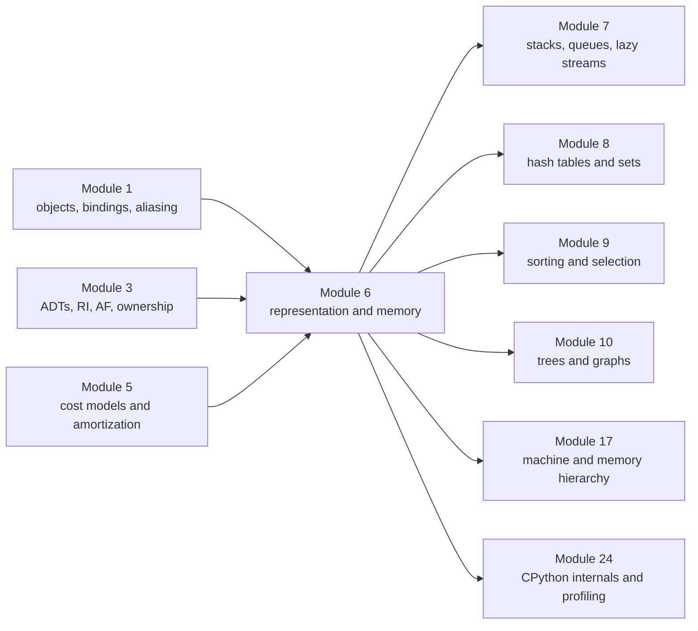

### The problem that forces this module

Atlas’s `EventStore` contract describes an ordered history. A first implementation can use a Python list:

```python
self._events: list[StudyEvent] = []
```

That line is convenient but leaves important questions unanswered:

- Does the list contain events, copies of events, or references to events?
- Why is indexing cheap while removing the oldest event is not?
- Why can one append be expensive even if a long series of appends is efficient?
- Would a chain of linked nodes satisfy the same history contract?
- What extra memory does each representation retain?
- Why can two `Θ(n)` traversals take noticeably different time?
- Who owns the structure, and what may a returned snapshot safely share?
- Which answers are Python guarantees, and which happen to be true in CPython today?

Those are not “low-level trivia.” They decide whether Atlas remains correct and responsive when its history grows or becomes a bounded rolling buffer.

### The Atlas checkpoint

You will compare two representations of the same history-buffer abstraction:

1. a dynamic contiguous sequence of event references;
2. a singly linked chain with `head`, `tail`, and `size`.

Then the requirements will change in stages:

- random indexed inspection becomes less important;
- the buffer receives a fixed maximum length;
- every append at capacity must evict the oldest event;
- UI snapshots must not expose mutation authority;
- sequential export becomes common.

The point is not to crown a universally best structure. It is to make a representation decision whose reasoning survives review.

### The seven recurring course questions

| Course question | Module 6 answer |
|---|---|
| What is represented? | A finite ordered sequence of event references |
| What can change? | The structure’s links, used slots, length, capacity, and reachability paths |
| What is the contract? | Order, permitted operations, failure behavior, snapshot isolation, and any resource promises |
| Why is it correct? | Representation invariant plus an abstraction function preserved by every operation |
| What does it cost? | Reference reads/writes, element moves, allocations, node traversals, and retained space |
| What can fail? | Exposed aliases, stale tails, cycles, off-by-one slots, capacity bugs, hidden copying, and false portability claims |
| Who is affected? | Learners waiting for history views, maintainers changing storage, and systems sharing memory |

---

## 2. Prerequisite retrieval

Answer without running code. Label each answer with its source module.

### Retrieval A — Module 1: references and mutation

```python
events = [["state"]]
snapshot = events.copy()
snapshot[0].append("memory")
```

1. Are `events` and `snapshot` the same list?
2. Are `events[0]` and `snapshot[0]` the same list?
3. What is `events` afterward?

### Retrieval B — Module 1: identity and lifetime

What does `del events` remove: a binding, an object, or necessarily both? What other fact must be known before claiming that the former list is unreachable?

### Retrieval C — Module 3: abstraction

State the difference among:

- the abstract history value;
- a list representation;
- the abstraction function;
- the representation invariant.

### Retrieval D — Module 3: representation exposure

Why can returning `tuple(self._events)` protect the outer sequence while still sharing every event object?

### Retrieval E — Module 3: ownership

If the `EventStore` is the logical owner of `_events`, does Python prevent another object from holding a reference to the same list?

### Retrieval F — Module 5: hidden operation cost

```python
while history:
    process(history.pop(0))
```

Why is “there is one loop” insufficient evidence for linear total time?

### Retrieval G — Module 5: amortization

How can a particular append cost `Θ(n)` while append is still `Θ(1)` amortized over a long sequence?

### Retrieval H — Module 5: space

Distinguish:

- output space;
- auxiliary space;
- retained representation space;
- call-stack space.

<details>
<summary>Check the prerequisite model</summary>

**A.** `events` and `snapshot` are distinct outer lists. Their element references reach the same inner list, so the inner mutation is shared. `events` becomes `[["state", "memory"]]`.

**B.** `del events` removes that name’s binding. The list becomes unreachable only if no other live root can reach it—for example, `snapshot` may still reach the inner list, while some other alias may still reach the original outer list.

**C.** The abstract value is an ordered history independent of storage. A list is one representation. The abstraction function explains which abstract history a legal list state denotes. The representation invariant states which internal states are legal.

**D.** The tuple is a new outer container whose entries are references to the same event objects. It prevents clients from adding, deleting, or reordering entries through that tuple, but it does not recursively copy or freeze the events.

**E.** No. “Logical owner” is a design responsibility and authority boundary. Ordinary Python references do not enforce unique ownership.

**F.** `pop(0)` may move every later reference one position toward the front. The repeated hidden cost can produce `n + (n-1) + … + 1 = Θ(n²)` work.

**G.** Rare resizes copy existing entries, but geometric capacity growth makes the total number of copied entries across many appends linear. Dividing total work by the number of appends yields constant amortized cost.

**H.** Output space holds the result required by the contract; auxiliary space is temporary working storage beyond input and output; retained representation space remains part of the data structure after the operation; stack space belongs to active calls.

**Routing rule:** if A–B are unclear, return to Module 1’s object-and-binding diagrams. If C–E are unclear, revisit Module 3’s RI/AF and representation-exposure sections. If F–H are unclear, revisit Module 5’s counted-operation, amortization, and space-accounting sections.

</details>

---

## 3. Mastery outcomes

By the end of this module, Michael can:

1. translate between bits, bytes, addresses, references, objects, and abstract values without collapsing those layers;
2. draw a Python object graph that explains aliasing, shallow copying, mutation, and reachability;
3. distinguish a sequence interface from an array, dynamic array, linked list, and Python `list`;
4. derive the representation invariant and abstraction function for contiguous and linked sequences;
5. trace indexed access, insertion, resizing, linking, unlinking, and empty/nonempty boundary transitions;
6. prove why geometric growth gives amortized constant-time append under the course model;
7. explain why a Python list stores a contiguous region of references in pinned CPython source while payload objects may live elsewhere;
8. compare operation costs using both asymptotic and mechanism-level explanations;
9. explain temporal and spatial locality without pretending that Big O or Python syntax predicts cache behavior;
10. account separately for structure overhead, unused capacity, node overhead, shared payloads, and snapshot containers;
11. treat ownership as a component contract about authority and invariants rather than an automatic Python memory rule;
12. recover a history-buffer architecture and dependency direction from unfamiliar code;
13. find a stale-tail invariant violation and predict its delayed failure;
14. direct an agent to implement a bounded representation change and review the patch against semantics, invariants, cost, and evidence;
15. defend an Atlas representation decision as requirements change;
16. identify which statements are abstract models, Python 3.14 guarantees, and pinned CPython 3.14.6 observations.

---

## 4. First principles: a value needs a physical story

### 4.1 Concrete observation

These two values compare equal:

```python
left = ["state", "abstraction", "cost"]
right = ["state", "abstraction", "cost"]

assert left == right
assert left is not right
```

Equality tells us that the two objects represent equal sequence values. Identity tells us that they are distinct objects. The abstract sequence

\[
\langle\text{state},\text{abstraction},\text{cost}\rangle
\]

does not say:

- where either container resides;
- whether entries are stored inline or by reference;
- whether extra capacity exists;
- how the third item is located;
- how insertion changes the representation.

An abstract value deliberately omits those facts. An implementation must choose them.

### 4.2 The derivation

Suppose we need to store an ordered sequence \(S\) of \(n\) values.

1. **Order requires a successor relation.** For each nonfinal position, the representation must let us find what comes next.
2. **Indexed access requires a location rule.** To answer “what is at position \(i\)?”, we need either arithmetic that jumps to a slot or a path that walks through predecessors.
3. **Mutation requires spare or movable structure.** Inserting a value needs an unused slot, movement of existing entries, creation of a new node, or some combination.
4. **Correctness requires an invariant.** The chosen slots or links must always describe exactly one legal sequence.
5. **Resource claims depend on the choice.** The same ADT can have different time, space, locality, and failure behavior.

This gives the central dependency:

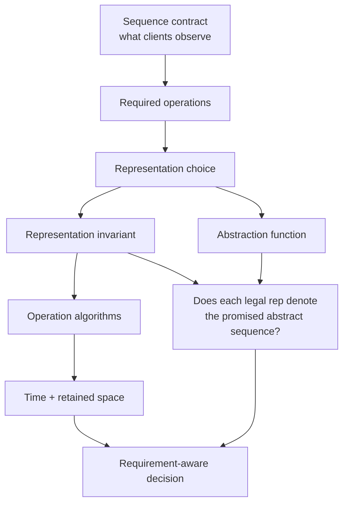

### 4.3 One idea seen through three lenses

Consider `history[2]`.

**[MODEL]** In a static array of fixed-width slots, position \(i\) can be located at

\[
\text{base} + i \times \text{slot-width}.
\]

**[PYTHON 3.14]** A list is a mutable sequence and supports integer subscription. A valid subscription returns the corresponding item; an invalid index raises `IndexError`. The language documentation does not promise a C layout or a particular capacity-growth formula.

**[CPYTHON 3.14.6]** The pinned `PyListObject` source contains a pointer to a vector of element pointers, a used size, and an allocated capacity. This explains CPython’s constant-time indexing mechanism and over-allocation strategy, but an alternate Python implementation may realize the same language behavior differently.

The three claims cooperate. None may impersonate another.

---

## 5. A bounded bridge: bits, bytes, addresses, and references

This bridge is intentionally narrow. Module 17 will study machine instructions, caches, virtual memory, and allocation in greater depth; Module 24 will study CPython internals. Here we learn only enough to reason honestly about data structures.

### 5.1 Bits and bytes

A **bit** has two possible states, conventionally written `0` and `1`. A **byte** is eight bits and therefore has \(2^8 = 256\) possible bit patterns.

The bit pattern has no meaning by itself:

```text
0100 0001
```

It may be interpreted as:

- the unsigned integer `65`;
- part of a larger integer;
- the encoded byte for `"A"` in ASCII-compatible encodings;
- flags;
- a fragment of a machine instruction;
- something else defined by a format.

Representation is bits **plus an interpretation contract**.

**[PYTHON 3.14]** A `bytes` object is an immutable sequence of integers in the range `0 <= x < 256`; `bytearray` is its mutable counterpart.

```python
packet = bytes([0b0100_0001, 0b0100_0010])

assert packet[0] == 65
assert packet.decode("ascii") == "AB"
```

The call to `decode("ascii")` supplies the interpretation contract. Without an encoding, bytes are not text.

### 5.2 Addresses and fixed-width slots

**[MODEL]** Treat memory as an addressable sequence of bytes:

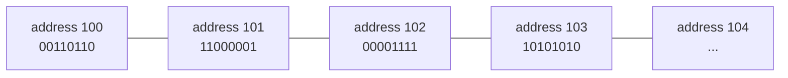

An address is a label used to locate storage. A machine word is a fixed-width block convenient for a particular model or processor. MIT 6.006 uses a Word-RAM model in which a word can hold an address and a constant number of word operations take constant time.

The model lets us derive array indexing. If a base address is `B` and every slot has width `w`, slot `i` begins at `B + i·w`.

Where the model stops matching Python:

- Python values need not fit in one fixed-width word;
- Python integers can grow beyond a machine word;
- Python code normally manipulates objects and references, not raw addresses;
- allocation, object metadata, garbage collection, and virtual memory are hidden;
- the Python specification does not require one particular physical layout.

### 5.3 A reference is not the object

Plain language:

> A reference is a way to reach an object; copying a reference does not copy the reached object.

More precisely:

> **[PYTHON 3.14]** Every object has an identity, type, and value. Names are bound to objects, and container values include references to other objects. Assignment creates a binding; it does not by itself clone an object.

We draw a reference as an arrow. The arrow is the relation that matters; its exact bit pattern is an implementation concern.

---

## 6. Python’s object-and-reference model at collection scale

### 6.1 A list is a container in an object graph

```python
from dataclasses import dataclass


@dataclass(frozen=True)
class StudyEvent:
    topic: str
    minutes: int


event = StudyEvent("representation", 25)
history = [event, event]
alias = history
snapshot = history.copy()
```

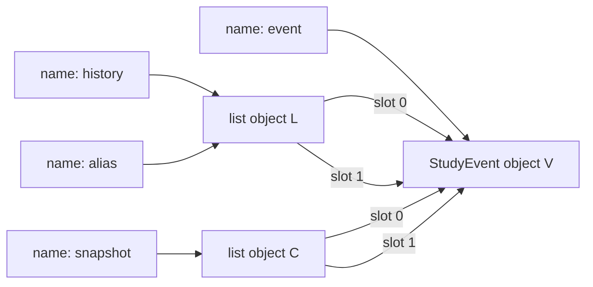

Predict:

1. `history is alias`
2. `history is snapshot`
3. `history[0] is history[1]`
4. `snapshot[0] is history[0]`

<details>
<summary>Reveal the identity trace</summary>

The results are `True`, `False`, `True`, and `True`.

`copy()` creates a new outer list and copies the element references. It does not clone the events. This is a **shallow copy**.

</details>

### 6.2 Mutability belongs to objects, not arrows

Rebinding changes which arrow leaves a name:

```python
alias = []
```

The original list does not change. Mutating changes an object reached by an arrow:

```python
history.append(StudyEvent("arrays", 30))
```

Both facts remain true:

- the local binding operation is about a name;
- the append operation is about the list object.

A tuple can have an unchangeable collection of immediate references while one referenced object remains mutable:

```python
tags = ["memory"]
outer = (tags,)
tags.append("locality")

assert outer == (["memory", "locality"],)
```

“Tuple is immutable” means the tuple cannot be made to refer to a different set of immediate objects. It does not recursively freeze the reachable graph.

### 6.3 Reachability and lifetime

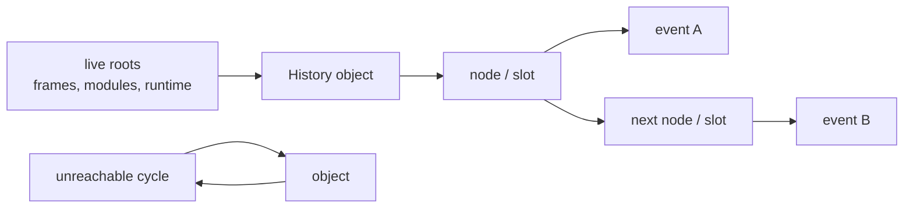

**[PYTHON 3.14]** An implementation must not collect an object that remains reachable. When an object becomes unreachable, it may be garbage-collected; the timing and mechanism are implementation details. Therefore:

- `del name` deletes a binding, not necessarily the object;
- clearing a structure removes reachability paths from that structure;
- an external alias may keep a payload alive;
- resource cleanup for files or sockets must not depend on prompt object finalization.

**[CPYTHON 3.14.6]** The official data-model documentation describes reference counting supplemented by cycle detection, but explicitly warns that other implementations act differently and CPython may change. Use `with` for external resources; do not make correctness depend on immediate destruction.

### 6.4 Ownership is an engineering contract

Python references are shareable. In this course, **logical ownership** means:

- one component is responsible for preserving an object graph’s invariant;
- the public contract determines which mutations clients are authorized to request;
- references crossing the boundary are reviewed for authority they convey;
- lifetime and retained-memory decisions are traced from roots.

Logical ownership does **not** mean:

- only one reference exists;
- the interpreter enforces exclusive access;
- `_private` naming makes aliasing impossible;
- copying the outer container recursively copies every payload.

For Atlas, the history buffer owns its structure. Immutable `StudyEvent` objects may be safely shared across snapshots because clients cannot mutate those event values through the shared references. If events become mutable later, that safety argument must be reopened.

---

## 7. The sequence ADT comes before the data structure

### 7.1 Abstract value

An abstract sequence is a finite ordered tuple:

\[
S = \langle x_0, x_1, \ldots, x_{n-1} \rangle.
\]

Its positions are extrinsic: an item is first, last, or at position \(i\) because of where it occurs, not because of an item key.

### 7.2 Operation family

| Operation | Abstract effect |
|---|---|
| `len()` | return \(n\) |
| `get_at(i)` | return \(x_i\) for a valid index |
| `set_at(i, x)` | replace \(x_i\) |
| `insert_at(i, x)` | produce order with `x` at position \(i\) |
| `delete_at(i)` | remove and return \(x_i\) |
| `insert_first(x)` | insert at position `0` |
| `insert_last(x)` | insert at position \(n\) |
| `iter_seq()` | yield \(x_0, x_1, \ldots, x_{n-1}\) |

An interface says which operations exist and what they mean. A data structure combines a representation with algorithms that realize them.

### 7.3 The cost signature

Before choosing a representation, write the workload as an operation vector. For example:

```text
Atlas desktop browsing:
  append       50%
  snapshot     25%
  get_at       20%
  evict_first   5%

Atlas rolling collector:
  append       45%
  evict_first  45%
  snapshot     10%
  get_at        0%
```

The same behavioral contract may survive the workload change while the best representation changes.

---

## 8. Contiguous arrays: order encoded by position

### 8.1 Static array model

**[MODEL]** A static array contains \(n\) fixed-width consecutive slots.

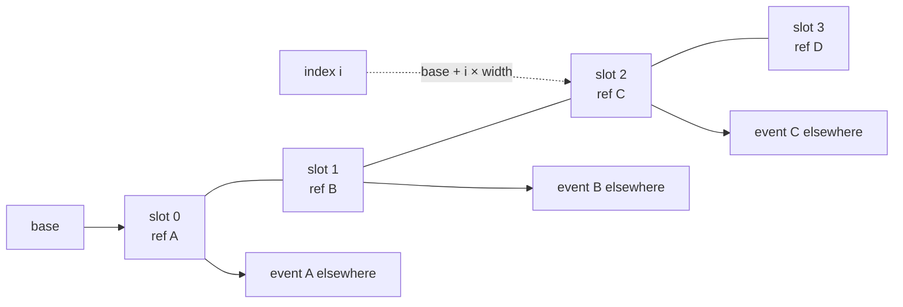

The slots are contiguous. The event objects reached by those slots need not be.

This distinction prevents a common overclaim:

> “A Python list keeps all of my event objects next to one another.”

Even in CPython’s contiguous reference-vector implementation, the adjacent things are element **references**. The reached Python objects have their own storage.

### 8.2 Representation invariant and abstraction function

For an array sequence with storage `A` and length `n`:

**RI**

1. `0 <= n == len(A)` for a fixed-size model;
2. every valid sequence position `i` corresponds to exactly one initialized slot `A[i]`;
3. no operation reads outside `0 <= i < n`.

**AF**

\[
AF(A,n) = \langle A[0], A[1], \ldots, A[n-1] \rangle.
\]

### 8.3 Why indexing is constant in the model

To retrieve position \(i\):

1. validate the index;
2. compute `base + i·slot_width`;
3. read one slot.

The number of modeled word operations does not grow with \(n\), so `get_at(i)` is `Θ(1)`.

### 8.4 Why insertion moves entries

Start with:

```text
index      0      1      2      3
slot       A      B      C      D
```

Insert `X` at index `1` into a larger destination:

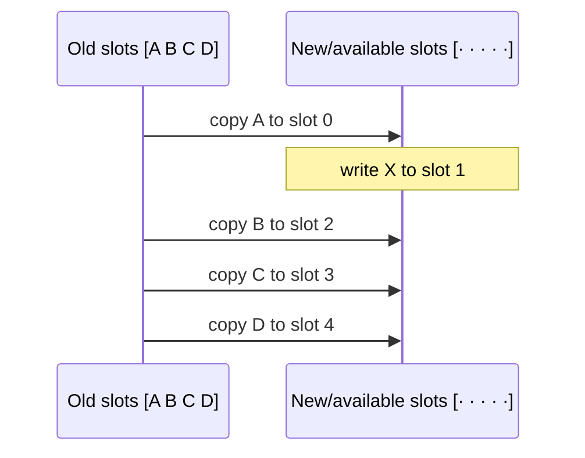

Whether entries shift inside one allocation or copy to another, an insertion near the front changes the positions of `Θ(n)` later references. Constant-time address arithmetic cannot avoid the amount of order that must change in this representation.

### 8.5 Cost under the static-array model

| Operation | Worst-case time | Mechanism |
|---|---:|---|
| `get_at`, `set_at` | `Θ(1)` | compute one slot address |
| `iter_seq` | `Θ(n)` | read every used slot |
| `insert_first`, `delete_first` | `Θ(n)` | shift later references |
| `insert_at`, `delete_at` | `Θ(n)` | shift a suffix |
| build from `n` items | `Θ(n)` | initialize `n` slots |

The table follows from the model, not from the spelling of a particular loop.

---

## 9. Dynamic arrays: separating length from capacity

A static array cannot grow in place beyond its fixed allocation. A dynamic array adds a level of indirection:

- `n`: number of logically used positions;
- `C`: number of allocated slots;
- `A`: current static-array storage.

### 9.1 Representation invariant and abstraction function

**RI**

1. `0 <= n <= C`;
2. `len(A) == C`;
3. positions `0 <= i < n` hold the sequence’s element references;
4. positions `n <= i < C` are unused and never exposed as elements.

**AF**

\[
AF(A,n,C) = \langle A[0], A[1], \ldots, A[n-1] \rangle.
\]

Capacity is deliberately absent from the abstract value. Clients can observe `n`, not unused room, unless the contract explicitly exposes capacity.

### 9.2 Append without and with growth

```mermaid
%% atlas-diagram-id: m06-dynamic-array-append-branches
%% atlas-diagram-title: Dynamic-array append either writes into capacity or grows, copies, and replaces storage
%% atlas-diagram-alt: Dynamic-array append has two mutually exclusive preconditions. When n is less than capacity C, write x at A[n] and increment n. When n equals C, allocate a larger array, copy the used prefix, write x, replace A and C, then increment n.
stateDiagram-v2
    [*] --> HasRoom: n < C
    HasRoom --> Written: A[n] = x
    Written --> Done: n = n + 1

    [*] --> Full: n = C
    Full --> Allocate: choose C' > C
    Allocate --> Copy: copy A[0:n] into A'
    Copy --> WriteNew: A'[n] = x
    WriteNew --> Replace: A = A'; C = C'; n = n + 1
    Replace --> Done
```

One append may copy `n` references. The operation’s worst-case time is therefore `Θ(n)` in this model.

### 9.3 Why geometric growth changes the sequence cost

Suppose capacity doubles from 1 to 2 to 4 to 8 and so on. Across the first \(n\) appends, resize copies are bounded by:

\[
1 + 2 + 4 + \cdots + 2^{\lfloor \log_2 n \rfloor} < 2n.
\]

The `n` ordinary writes plus fewer than `2n` copied references give `Θ(n)` total work for `n` appends. Therefore append is:

- `Θ(n)` worst case for one unlucky append;
- `Θ(1)` amortized over a sequence.

Amortized does not mean random, typical, or “every append is constant.”

### 9.4 Broken growth strategy

Suppose capacity grows by exactly one slot each time:

\[
1 + 2 + 3 + \cdots + (n-1) = \Theta(n^2)
\]

references are copied across `n` appends. Spare capacity is not enough; the growth policy matters.

### 9.5 CPython close-up—pinned and labeled

> **Scope:** this subsection describes the `v3.14.6` CPython source. It explains one interpreter; it does not add promises to the Python language.

**[CPYTHON 3.14.6]** `PyListObject` contains:

- `ob_item`, described in the source as a vector of pointers to list elements;
- a used size (`ob_size`);
- an `allocated` slot count;
- invariants including `0 <= ob_size <= allocated` and `len(list) == ob_size`.

The pinned `list_resize` source mildly over-allocates and records the illustrative growth pattern:

```text
0, 4, 8, 16, 24, 32, 40, 52, 64, 76, ...
```

That exact formula may change in another CPython patch and need not exist in PyPy or another conforming implementation.

| Claim | Status |
|---|---|
| `list` is mutable and ordered | **[PYTHON 3.14]** |
| subscription returns the item at a valid integer index | **[PYTHON 3.14]** |
| `list.append(x)` adds `x` at the end | **[PYTHON 3.14]** |
| a list’s storage is a `PyObject **ob_item` vector | **[CPYTHON 3.14.6]** |
| capacity follows the exact pattern above | **[CPYTHON 3.14.6]** |
| every Python implementation must use a dynamic C array | false |
| event payload bytes are all contiguous because references are | false |

The practical discipline is:

> Write portable correctness against documented behavior; use pinned implementation facts to explain, measure, and optimize only when the deployment context makes them relevant.

---

## 10. Linked structures: order encoded by paths

An array stores “next” implicitly in the next slot. A linked list stores “next” explicitly in each node.

```python
from dataclasses import dataclass
from typing import Generic, TypeVar


T = TypeVar("T")


@dataclass(slots=True)
class Node(Generic[T]):
    item: T
    next: Node[T] | None = None
```

The annotation describes a recursive shape. It does not itself prevent cycles or ensure that every node is counted once.

### 10.1 Representation

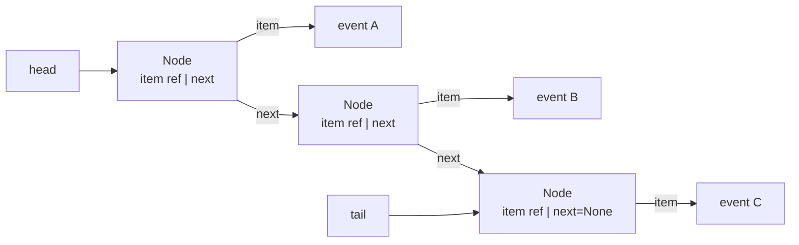

Nodes need not be adjacent. The next reference supplies sequence order.

### 10.2 RI and AF for a head/tail singly linked history

Let `reachable(head)` mean the finite path obtained by following `next`.

**RI**

1. `size >= 0`;
2. `size == 0` iff `head is None and tail is None`;
3. if `size > 0`, both `head` and `tail` refer to nodes;
4. following `next` from `head` reaches exactly `size` distinct nodes;
5. the last reachable node is `tail`;
6. `tail.next is None`;
7. there is no cycle.

**AF**

\[
AF(head,tail,size) =
\langle head.item,\ head.next.item,\ \ldots,\ tail.item\rangle.
\]

The RI contains more than a type checker can establish. `Node | None` permits a stale tail and a cycle; only reasoning and runtime evidence connect the graph to the intended sequence.

### 10.3 Append with a tail

There are two states, not one:

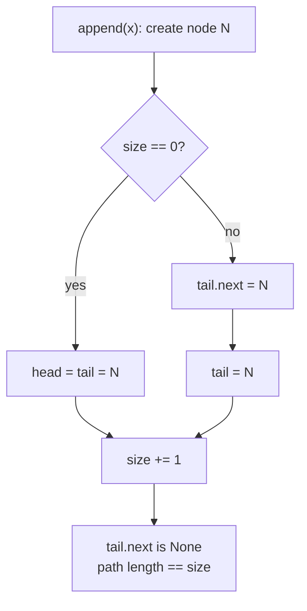

The order of writes matters during debugging. In the nonempty case, the old tail must link to the new node before `tail` moves.

### 10.4 Evict the first node

For a nonempty chain:

1. save the old `head`;
2. move `head` to `old_head.next`;
3. decrement `size`;
4. if the structure is now empty, set `tail = None`;
5. optionally detach `old_head.next = None`;
6. return the saved item.

The fourth step is easy to omit because the first eviction appears to return the correct value. The corrupted tail causes a delayed failure on a later append.

### 10.5 Costs

| Operation | Singly linked with head + tail | Why |
|---|---:|---|
| `insert_first` | `Θ(1)` | create one node and change head |
| `delete_first` | `Θ(1)` | move head; maybe clear tail |
| `insert_last` | `Θ(1)` | link through stored tail |
| `get_at(i)` | `Θ(i+1)` | follow `i` next references |
| `set_at(i, x)` | `Θ(i+1)` | locate the node first |
| `insert_at(i, x)` | `Θ(i+1)` | locate predecessor, then splice |
| `iter_seq` | `Θ(n)` | visit each node |

If no tail is stored, inserting last becomes `Θ(n)`. A field can buy time while costing space and adding an invariant obligation.

### 10.6 Linked does not mean “free insertion”

Splicing after a **known node** is constant time. Inserting at abstract index `i` still requires locating the predecessor, which is linear in `i`.

Likewise, deleting an arbitrary node from a singly linked list is not automatically constant time: the algorithm may need its predecessor to redirect the incoming link.

### 10.7 Python nodes are objects, not bare textbook boxes

**[MODEL]** A node is often drawn as two fixed-width fields: item reference and next reference.

In real Python, a user-defined node is itself a Python object with runtime metadata and allocation overhead. `slots=True` can avoid a per-instance attribute dictionary for this class, but exact sizes and allocation behavior remain implementation- and platform-dependent.

This is why a hand-built linked list in Python can consume substantially more space and run more slowly than a built-in list even when both traversals are `Θ(n)`. The asymptotic model remains useful, but it is not the whole machine.

---

## 11. Locality and honest memory accounting

### 11.1 Two linear traversals can differ

**[MODEL]** Both of these visit \(n\) elements:

- scan `A[0]` through `A[n-1]`;
- follow `head.next` through \(n\) nodes.

Therefore both take `Θ(n)` modeled operations. That does not assert equal runtime.

Modern machines move data through a memory hierarchy in blocks. Berkeley CS61C defines:

- **temporal locality:** recently accessed data is likely to be accessed again;
- **spatial locality:** addresses near recently accessed data are likely to be accessed soon.

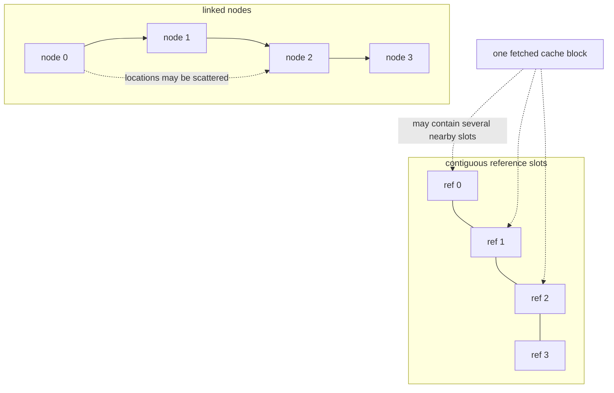

A contiguous reference scan often offers better spatial locality than pointer chasing. But state the limits:

- object payloads reached through either structure may be elsewhere;
- an allocator may place some nodes near one another;
- cache line size and hierarchy vary;
- access pattern, data size, interpreter, and hardware matter;
- a benchmark can test a deployment, not turn an empirical tendency into a language guarantee.

### 11.2 Cost has several layers

| Layer | Array/dynamic array | Linked chain |
|---|---|---|
| Abstract payload count | `n` values | `n` values |
| Structure references | `C` slots, of which `n` are used | item + next references per node, plus head/tail |
| Spare structure | `C - n` unused slots | usually no capacity slots |
| Metadata/allocation | array header + allocation metadata | container header + per-node object/allocation metadata |
| Traversal behavior | index arithmetic + adjacent slot reads | dependent next-reference reads |
| Shared payload | must be counted once across owners | must be counted once across owners |

The asymptotic retained-space model is:

- dynamic array structure: `Θ(C)` references;
- linked structure: `Θ(n)` nodes and references;
- payload: whatever the distinct reachable event graph requires.

Both are `Θ(n)` when geometric growth keeps `C = Θ(n)`. The notation hides meaningful constants, spare capacity, allocator fragmentation, and locality.

### 11.3 Shallow size, retained size, and double counting

**[PYTHON 3.14]** `sys.getsizeof(x)` is a documented API, but its reported size is implementation-specific and covers memory directly attributed to `x`, not the objects it refers to. Therefore:

```python
from sys import getsizeof

container_only = getsizeof(history)
```

does not measure the entire history graph.

A useful memory report distinguishes:

1. **shallow size:** the immediate container or node object;
2. **retained size:** objects that would become unreachable if a chosen root disappeared;
3. **shared size:** objects reachable from multiple roots;
4. **peak transient size:** old and new storage simultaneously alive during resize or snapshot construction;
5. **external resources:** buffers or storage not fully represented by Python object sizes.

There is no context-free “deep size” when graphs share objects. Counting by traversal can double-count shared payloads or loop forever on cycles unless identities are tracked.

### 11.4 Ownership changes the memory question

Ask not only “how large is this object?” but:

- Which root keeps it alive?
- Which component may drop that reference?
- Which payloads are shared with a snapshot?
- If an event is evicted, can a UI snapshot still retain it?
- Does copying protect the invariant or merely duplicate structure?

An immutable tuple snapshot can safely share immutable event objects, but it also intentionally extends their lifetimes while the snapshot exists.

---

## 12. Atlas checkpoint: two histories under changing constraints

### 12.1 Freeze the behavioral contract first

```python
from typing import Protocol


class HistoryBuffer(Protocol):
    def append(self, event: StudyEvent) -> None:
        """Add event as the newest event."""
        ...

    def evict_oldest(self) -> StudyEvent:
        """Remove and return the oldest event; raise IndexError if empty."""
        ...

    def at(self, index: int) -> StudyEvent:
        """Return event at chronological index; raise IndexError if invalid."""
        ...

    def snapshot(self) -> tuple[StudyEvent, ...]:
        """Return oldest-to-newest history without exposing structure mutation."""
        ...

    def __len__(self) -> int:
        """Return the number of retained events."""
        ...
```

This interface does not mention slots, capacity, nodes, links, or CPython. Both representations must satisfy the same observations.

### 12.2 Representation A: dynamic array of references

```python
class ArrayHistory:
    def __init__(self) -> None:
        self._events: list[StudyEvent] = []

    def append(self, event: StudyEvent) -> None:
        self._events.append(event)

    def evict_oldest(self) -> StudyEvent:
        if not self._events:
            raise IndexError("evict from empty history")
        return self._events.pop(0)

    def at(self, index: int) -> StudyEvent:
        return self._events[index]

    def snapshot(self) -> tuple[StudyEvent, ...]:
        return tuple(self._events)

    def __len__(self) -> int:
        return len(self._events)
```

The code is short because the built-in hides allocation, shifting, bounds checks, and reference management. Short source is not evidence that every operation is cheap.

### 12.3 Representation B: linked references

Read this candidate before the explanation:

```python
class LinkedHistory:
    def __init__(self) -> None:
        self._head: Node[StudyEvent] | None = None
        self._tail: Node[StudyEvent] | None = None
        self._size = 0

    def append(self, event: StudyEvent) -> None:
        node = Node(event)
        if self._tail is None:
            self._head = node
        else:
            self._tail.next = node
        self._tail = node
        self._size += 1

    def evict_oldest(self) -> StudyEvent:
        if self._head is None:
            raise IndexError("evict from empty history")
        removed = self._head
        self._head = removed.next
        self._size -= 1
        return removed.item

    def at(self, index: int) -> StudyEvent:
        if index < 0:
            index += self._size
        if not 0 <= index < self._size:
            raise IndexError("history index out of range")
        current = self._head
        for _ in range(index):
            assert current is not None
            current = current.next
        assert current is not None
        return current.item

    def snapshot(self) -> tuple[StudyEvent, ...]:
        result: list[StudyEvent] = []
        current = self._head
        while current is not None:
            result.append(current.item)
            current = current.next
        return tuple(result)

    def __len__(self) -> int:
        return self._size
```

### Predict before revealing

1. Which method violates the RI?
2. Why can all return values appear correct at first?
3. Give the shortest operation sequence that exposes the corruption.
4. What is the smallest repair?

<details>
<summary>Reveal the stale-tail diagnosis</summary>

`evict_oldest` fails to clear `_tail` when it removes the sole node.

The shortest revealing sequence is:

```python
history.append(a)
assert history.evict_oldest() == a
history.append(b)
assert history.snapshot() == (b,)  # fails: head remained None
```

After the eviction, `_head is None` and `_size == 0`, but `_tail` still reaches the removed node. The next append follows the nonempty branch because `_tail is not None`; it attaches the new node after the unreachable old node and never restores `_head`.

Repair:

```python
self._head = removed.next
self._size -= 1
if self._head is None:
    self._tail = None
removed.next = None
```

Detaching `removed.next` is not required for the abstract result once the links are otherwise correct, but it makes authority and debugging clearer.

</details>

### 12.4 Operation comparison

Under the stated models:

| Operation | Dynamic array | Head/tail singly linked | Requirement meaning |
|---|---:|---:|---|
| append newest | amortized `Θ(1)`, worst `Θ(n)` | `Θ(1)` | ingestion |
| evict oldest | `Θ(n)` | `Θ(1)` | rolling capacity |
| `at(i)` | `Θ(1)` | `Θ(i+1)` | random inspection |
| snapshot | `Θ(n)` new outer container | `Θ(n)` new outer container | UI/export |
| sequential traversal | `Θ(n)` | `Θ(n)` | export |
| retained structure | `Θ(C)` refs | `Θ(n)` node objects | memory |
| expected locality tendency | adjacent reference slots | pointer chasing | machine-dependent |
| invariant complexity | length/capacity/used prefix | head/tail/size/path/no cycle | defect surface |

The array column is a **[MODEL]** cost account that matches the mechanisms inspected in **[CPYTHON 3.14.6]**; Python’s language contract does not itself guarantee these asymptotic bounds for `list`.

### 12.5 Requirements change in four rounds

#### Round 1 — desktop prototype

- history is normally under 1,000 events;
- indexed browsing is common;
- eviction is rare;
- simplicity and reliable built-ins matter.

**Defensible choice:** dynamic array. The frequent `at(i)` is constant under the model, the rare linear eviction is bounded at this scale, and the representation has less custom invariant code.

#### Round 2 — rolling collector

- retain exactly the latest 100,000 events;
- append and oldest eviction occur together at high frequency;
- indexed browsing disappears;
- export remains sequential.

**Two-representation comparison:** the linked structure removes the dynamic array’s repeated front shifts and supports both end operations in constant time. It pays per-node allocation, more structure overhead, and likely poorer locality.

**Engineering observation:** this workload is also evidence that the operation family is really a queue. Module 7 will derive a ring/deque representation that may combine constant-time end operations with block or array locality. A good design review is allowed to say “neither candidate is the end state.”

#### Round 3 — immutable UI snapshots

- UI code may keep a snapshot after later appends and evictions;
- `StudyEvent` remains frozen.

Both implementations can return `tuple(...)`. The new tuple owns its outer sequence of references; event objects are shared safely under the current immutability contract. Snapshot creation remains `Θ(n)` time and structure space.

#### Round 4 — export every second

- a full snapshot is produced every second;
- history is large;
- allocation spikes affect responsiveness.

The dominant cost may now be snapshot materialization, not append or eviction. Changing the internal structure alone cannot make an API that requires a fresh `n`-entry tuple sublinear. The contract or architecture may need streaming, immutable chunk sharing, or incremental persistence—forward links to Modules 7, 16, and 20.

### 12.6 Decision record

Complete this table rather than writing “linked lists are faster”:

| Field | Your evidence |
|---|---|
| Current workload and size bounds |  |
| Contract that must not change |  |
| Operation-frequency vector |  |
| Array cost and invariant risks |  |
| Linked cost and invariant risks |  |
| Locality/memory hypotheses to measure |  |
| Selected representation for this round |  |
| Rejected alternative and why |  |
| Trigger that would reopen the decision |  |
| Claim labeled MODEL / PYTHON / CPYTHON |  |

---

## 13. Code-reading and architecture studio

### 13.1 Repository slice

```text
atlas/
├── domain/
│   └── event.py
├── application/
│   └── record_study.py
├── ports/
│   └── history.py
├── adapters/
│   ├── array_history.py
│   └── linked_history.py
└── main.py
```

```python
# application/record_study.py
from atlas.domain.event import StudyEvent
from atlas.ports.history import HistoryBuffer


class RecordStudy:
    def __init__(self, history: HistoryBuffer, limit: int) -> None:
        self._history = history
        self._limit = limit

    def execute(self, event: StudyEvent) -> None:
        self._history.append(event)
        if len(self._history) > self._limit:
            self._history.evict_oldest()
```

```python
# main.py
from atlas.adapters.array_history import ArrayHistory
from atlas.application.record_study import RecordStudy


history = ArrayHistory()
record_study = RecordStudy(history, limit=100_000)
```

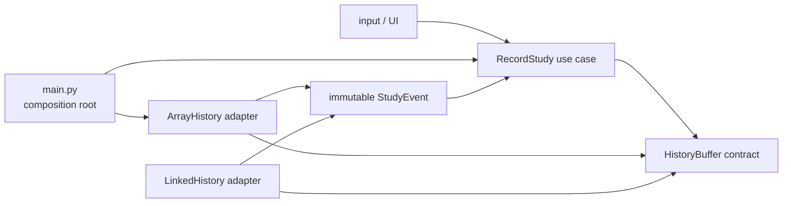

### 13.2 Recover before judging

Fill the evidence column:

| Claim | Code evidence | Counterevidence to search for |
|---|---|---|
| the use case depends on behavior, not representation |  |  |
| the composition root chooses the representation |  |  |
| the rolling-limit policy is outside storage mechanics |  |  |
| both adapters preserve oldest-to-newest order |  |  |
| clients cannot mutate internal structure through snapshots |  |  |
| changing the adapter does not change domain meaning |  |  |

### 13.3 Read in five passes

1. **Contract pass:** list allowed observations and failures.
2. **Object-graph pass:** draw all roots, structure references, payload references, and aliases.
3. **Invariant pass:** state legal empty and nonempty shapes.
4. **Cost pass:** count shifts, node traversals, allocations, and snapshot copies.
5. **Dependency pass:** find which file knows the concrete class.

Do not start with style. A beautifully named method can preserve the wrong graph.

### 13.4 Architecture pressure test

Suppose `RecordStudy` imports `LinkedHistory` and checks:

```python
if isinstance(self._history, LinkedHistory):
    ...
```

That is evidence that representation knowledge escaped into policy. Before accepting it, ask which missing behavior belongs in the port. If the branch exists only to exploit a concrete field or cost assumption, either:

- strengthen the abstract operation/resource contract;
- move the policy to a strategy boundary;
- or reject the coupling.

The goal is not maximal indirection. It is to keep facts that change together inside the same responsibility boundary.

---

## 14. One mechanism-revealing manual implementation

This is the module’s only required from-scratch typing. A Python list supplies the fixed-capacity slots, so this is a **pedagogical dynamic-array model**, not a reimplementation of CPython’s raw storage.

### 14.1 Complete only `_grow` and `append`

```python
from collections.abc import Iterator
from typing import Generic, TypeVar, cast


T = TypeVar("T")
_EMPTY = object()


class MiniDynamicArray(Generic[T]):
    def __init__(self) -> None:
        self._size = 0
        self._capacity = 1
        self._slots: list[T | object] = [_EMPTY]
        self.copy_count = 0

    def _grow(self) -> None:
        # TODO 1: allocate exactly twice the current capacity.
        # TODO 2: copy only the used prefix, counting each copied reference.
        # TODO 3: replace storage and capacity only after copying succeeds.
        ...

    def append(self, item: T) -> None:
        # TODO 4: grow exactly when size equals capacity.
        # TODO 5: write at the first unused slot, then increment size.
        ...

    def __len__(self) -> int:
        return self._size

    def __getitem__(self, index: int) -> T:
        if index < 0:
            index += self._size
        if not 0 <= index < self._size:
            raise IndexError("index out of range")
        return cast(T, self._slots[index])

    def __iter__(self) -> Iterator[T]:
        for index in range(self._size):
            yield cast(T, self._slots[index])
```

### 14.2 Predict before implementing

After appending `"A"` through `"H"`:

- what capacity sequence occurs?
- before the append of which items does growth occur?
- how many references have been copied in total?
- which positions are part of the abstract sequence when `size == 5` and `capacity == 8`?

### 14.3 Contract tests

```python
def test_growth_preserves_order() -> None:
    items = MiniDynamicArray[str]()
    for letter in "ABCDEFGH":
        items.append(letter)
    assert list(items) == list("ABCDEFGH")
    assert len(items) == 8


def test_geometric_copy_count() -> None:
    items = MiniDynamicArray[int]()
    for number in range(8):
        items.append(number)
    assert items.copy_count == 1 + 2 + 4


def test_bounds_do_not_expose_spare_capacity() -> None:
    items = MiniDynamicArray[int]()
    items.append(10)
    try:
        items[1]
    except IndexError:
        pass
    else:
        raise AssertionError("unused capacity became observable")
```

<details>
<summary>Reveal one reference implementation after committing your trace</summary>

```python
def _grow(self) -> None:
    new_capacity = self._capacity * 2
    new_slots: list[T | object] = [_EMPTY] * new_capacity
    for index in range(self._size):
        new_slots[index] = self._slots[index]
        self.copy_count += 1
    self._slots = new_slots
    self._capacity = new_capacity


def append(self, item: T) -> None:
    if self._size == self._capacity:
        self._grow()
    self._slots[self._size] = item
    self._size += 1
```

Capacity progresses `1, 2, 4, 8`. Growth occurs before appending items 2, 3, and 5 (`"B"`, `"C"`, and `"E"`), copying `1 + 2 + 4 = 7` references. At size 5, only slots `0` through `4` belong to the abstract sequence; slots `5` through `7` are representation-only spare capacity.

</details>

### 14.4 Oral defense

Explain, without code:

1. why the old slots remain unchanged if allocation fails before assignment;
2. why writing at `_capacity` would be an off-by-one error;
3. why copied references preserve payload identity;
4. why `copy_count < 2n` for this doubling policy;
5. why using a Python list underneath does not prove anything about CPython’s internal growth formula.

---

## 15. Design, direct an agent, review the patch

### 15.1 Bounded agent task

Give an implementation agent this specification:

> Add `LinkedHistory` behind the existing `HistoryBuffer` protocol. Preserve the exact oldest-to-newest semantics, negative indexing behavior, empty-operation exceptions, and tuple snapshot contract of `ArrayHistory`. Use a singly linked `Node[StudyEvent]` with head, tail, and size. State the RI and AF beside the fields. Keep concrete construction in `main.py`; do not import either adapter into `RecordStudy`. Add representation-independent contract tests that run against both factories, plus targeted empty→one→empty→one transition tests and a cycle-safe invariant checker used only in tests. Do not add a benchmark or claim practical superiority. In the PR note, give model-level worst-case costs and label every CPython-specific statement.

Before the agent starts, ask it to return:

1. its interpretation of the contract;
2. the files it expects to change;
3. the RI preservation argument for append and eviction;
4. the evidence it will collect.

### 15.2 Review order

Review in dependency order:

1. public contract changes;
2. domain value changes;
3. representation and RI;
4. operation transitions;
5. dependency direction;
6. contract tests;
7. targeted invariant regressions;
8. cost claims;
9. only then naming and formatting.

### 15.3 Candidate patch fragments

The agent proposes:

```diff
 class HistoryBuffer(Protocol):
-    def snapshot(self) -> tuple[StudyEvent, ...]: ...
+    def snapshot(self) -> list[StudyEvent]: ...
```

```diff
 class LinkedHistory:
     def snapshot(self) -> list[StudyEvent]:
-        return list(self._iter_items())
+        return self._cache
```

```diff
     def evict_oldest(self) -> StudyEvent:
         removed = self._head
         self._head = removed.next
         self._size -= 1
+        # tail already points at the newest node
         return removed.item
```

```diff
 # application/record_study.py
+from atlas.adapters.linked_history import LinkedHistory
```

### Your review

For each fragment, record:

- contract impact;
- object-graph or invariant impact;
- smallest revealing test;
- requested revision;
- whether the defect is behavioral, architectural, cost-related, or multiple.

<details>
<summary>Reveal the review baseline</summary>

1. Changing the snapshot result from tuple to list is contract drift. It gives clients mutation operations on the returned outer container and forces all implementations and clients to change without a requirement.
2. Returning `_cache` exposes an internal mutable representation. A client can corrupt history or create divergence between cache and links. A fresh list would avoid direct structure exposure but still would not match the tuple contract.
3. The comment is false for the one-element transition. Removing the sole node must set both head and tail to `None`. Test `append(a) → evict → append(b) → snapshot`.
4. The use case now depends on an adapter, reversing the intended dependency direction. Concrete selection belongs in `main.py`.

The correct review does not merely request more tests. It identifies the violated contract or invariant, constructs evidence, and asks for a bounded repair.

</details>

### 15.4 Verification evidence

Require at least:

- the same contract-test suite passing for both representations;
- empty access and eviction failures;
- negative index boundaries;
- order preserved over mixed append/evict sequences;
- empty→one→empty→one regression;
- snapshot mutation impossible at the outer boundary;
- frozen payload sharing explicitly tested with `is`;
- an invariant walk that detects a cycle and verifies path length, tail, and size;
- a dependency search showing application code does not import concrete adapters;
- no unsupported “faster” claim.

---

## 16. Six-session interactive teaching sequence

Each session alternates explanation and learner action. No session advances on vocabulary recognition alone.

### Session 1 — From values to bits without losing meaning

**Recall:** identity, equality, binding, and mutation from Module 1.  
**Launch:** interpret `01000001` three ways and explain why none is inherent in the bits.  
**Derive:** bit, byte, address, slot, reference, object, and value; establish the three evidence labels.  
**Learner action:** classify twelve claims as MODEL, PYTHON 3.14, CPYTHON 3.14.6, or unsupported.  
**Visual:** draw names, a list, repeated references, and payload objects.  
**Exit synthesis:** explain why contiguous references do not imply contiguous event payloads.

### Session 2 — Derive an array from indexed access

**Recall:** sequence contract and valid indices.  
**Launch:** ask how to locate item `i` without walking through prior items.  
**Derive:** fixed-width slot arithmetic, array RI/AF, bounds, iteration, and shift cost.  
**Learner action:** trace insertion at positions `0`, `n/2`, and `n`; count moved references.  
**Broken case:** an operation exposes an unused slot as a valid element.  
**Exit synthesis:** connect constant-time indexing and linear front insertion to the same representation choice.

### Session 3 — Make growth visible

**Recall:** worst-case versus amortized cost from Module 5.  
**Launch:** inspect a capacity-4 array immediately before its fifth append.  
**Derive:** length versus capacity, geometric growth, resize, peak transient memory, and the geometric copy sum.  
**Learner action:** complete the small `MiniDynamicArray` mechanism and defend the update order.  
**Implementation close-up:** compare the model with pinned CPython 3.14.6 source labels.  
**Exit synthesis:** state one portable list fact and one nonportable CPython fact.

### Session 4 — Derive linked order and its invariants

**Recall:** recursive structure and induction from Module 2; RI/AF from Module 3.  
**Launch:** remove the need to shift the remaining sequence when the first item leaves.  
**Derive:** node, head, tail, path, splice, no-cycle condition, linked RI/AF, and traversal cost.  
**Learner action:** trace empty→one→two→one→empty and annotate every reference write.  
**Broken case:** stale tail after the sole node is evicted.  
**Exit synthesis:** explain why “insertion is constant time” needs a known-node or end-position qualification.

### Session 5 — Locality, memory, and architecture reading

**Recall:** asymptotic claims and representation independence.  
**Launch:** compare two `Θ(n)` traversals and ask what the model intentionally hides.  
**Derive:** temporal/spatial locality, contiguous reference scan, pointer chasing, shallow/retained/shared/peak memory, and logical ownership.  
**Learner action:** recover Atlas’s contract, object graph, invariant boundary, costs, and dependency direction in five passes.  
**Investigation:** use `sys.getsizeof` only after predicting what it excludes.  
**Exit synthesis:** give a memory claim that names root, scope, interpreter, and excluded payloads.

### Session 6 — Changing constraints, delegation, and defense

**Recall:** operation-frequency vectors and the two representations.  
**Launch:** change Atlas from indexed desktop history to a high-rate rolling window.  
**Learner action:** complete the comparison record, identify when neither candidate is satisfactory, direct the bounded agent task, review the fragments, and demand regression evidence.  
**Oral defense:** preserve behavior while arguing from invariants, operations, memory, locality hypotheses, and change risk.  
**Exit synthesis:** state the decision trigger that leads into queue/deque designs in Module 7.

---

## 17. Eight-level problem ladder

### A. Recognize

Classify twenty statements as:

- abstract sequence fact;
- array-representation fact;
- linked-representation fact;
- Python 3.14 guarantee;
- pinned CPython observation;
- unsupported overclaim.

### B. Trace

Given two events referenced from four positions across an original list and shallow copy:

1. draw the object graph;
2. predict outer mutation and payload mutation separately;
3. mark which objects remain reachable after each `del`;
4. identify where a deep copy would duplicate too much.

### C. Map

Read the Atlas repository slice and reconstruct:

- the `HistoryBuffer` contract;
- component dependencies;
- composition root;
- logical owner of structure;
- representation-specific files;
- every reference crossing the public boundary.

### D. Modify

Add a maximum length to both representations while preserving the contract:

- state the new postcondition;
- identify which operation triggers eviction;
- update each RI;
- analyze steady-state append cost;
- keep the manual code change bounded.

### E. Debug and defend

Diagnose the stale-tail candidate:

- find the earliest RI violation;
- explain why the first returned value is still correct;
- create the shortest delayed-failure sequence;
- repair it;
- defend the regression test against an alternative incorrect patch.

### F. Design and delegate

Write an agent brief for one representation behind the existing port. Include:

- abstract behavior;
- Python version;
- RI and AF;
- ownership boundary;
- operation costs;
- forbidden dependencies;
- failure cases;
- evidence and claim labels.

### G. Review and verify

Review the resulting patch without trusting its summary:

- reconstruct the object graph;
- execute a mixed operation trace by hand;
- inspect empty/nonempty transitions;
- run shared contract tests;
- challenge memory and performance statements;
- search for concrete-adapter imports in application code;
- produce a revision request tied to evidence.

### H. Transfer

Choose one:

- explain why a database page uses a representation different from a linked Python object graph;
- compare an array-of-structs and struct-of-arrays locality hypothesis;
- trace how a DOM tree’s parent/child links create ownership and cycle questions;
- explain why network packet bytes need a protocol interpretation;
- predict why a garbage collector must reason over reachability graphs.

The final response must use the seven course questions: representation, change, contract, correctness, cost, failure, and affected humans.

---

## 18. Understanding check — confidence-aware multiple choice

For every question, record:

- answer;
- **low**, **medium**, or **high** confidence;
- one sentence explaining the decisive mechanism.

Then reveal the answer. A high-confidence error becomes a misconception-log entry and a tiny counterexample, not a penalty.

### Question 1

```python
event = StudyEvent("memory", 20)
a = [event]
b = a.copy()
```

Which statement is necessarily true?

A. `a is b`  
B. `a[0] is b[0]`  
C. `b[0]` is a deep copy of `event`  
D. mutating `b` must mutate the outer list `a`

<details>
<summary>Reveal answer and distractor analysis</summary>

**Answer: B.** A shallow list copy creates a distinct outer list and inserts references to the original element objects.

- **A** confuses copying a container with assigning another name to it.
- **C** confuses shallow and deep copy.
- **D** ignores which object is mutated; changing the outer `b` list need not change outer `a`, although a shared mutable payload could expose effects through both.

**Connection:** this is Module 1 aliasing applied to Module 3’s snapshot boundary.

</details>

### Question 2

Under the fixed-width contiguous-array model, why is inserting at index `0` worst-case `Θ(n)`?

A. Computing address `0` requires scanning every address.  
B. The later `n` element references must change positions to preserve order.  
C. Python always deep-copies every payload during insertion.  
D. Arrays cannot represent an empty sequence.

<details>
<summary>Reveal answer and distractor analysis</summary>

**Answer: B.** The location of index `0` is constant-time to compute; preserving the abstract order forces movement of the suffix.

- **A** contradicts array address arithmetic.
- **C** falsely replaces reference movement with payload deep copying.
- **D** is unrelated; a zero-length abstract sequence is representable.

**Connection:** Module 5’s cost comes from the hidden operation—reference moves—not from loop syntax.

</details>

### Question 3

A doubling dynamic array performs one append that copies 1,024 references. Which statement is strongest?

A. Append cannot have amortized `Θ(1)` time.  
B. Every append costs `Θ(1)` worst case.  
C. That append is `Θ(n)` in the model, while a long append sequence can still cost `Θ(1)` amortized per operation.  
D. Amortized means the implementation was lucky on random inputs.

<details>
<summary>Reveal answer and distractor analysis</summary>

**Answer: C.** Worst-case cost of one operation and aggregate cost over a sequence answer different questions.

- **A** treats one spike as the average sequence bound.
- **B** erases the resize copy.
- **D** confuses amortization with expected analysis; the aggregate bound needs no probability model.

**Connection:** the geometric series from Module 5 now corresponds to copied references and temporary storage.

</details>

### Question 4

A singly linked list stores both `head` and `tail`, but its `get_at(i)` implementation starts at `head` and follows `next`. What is the worst-case time for `get_at(⌊n/2⌋)`?

A. `Θ(1)`, because the structure has a tail  
B. `Θ(log n)`, because links divide the search space  
C. `Θ(n)`, because indexing follows the path from the head  
D. It is impossible to retrieve the last item

<details>
<summary>Reveal answer and distractor analysis</summary>

**Answer: C.** A tail can help an explicitly supported newest-item operation, but this `get_at` implementation locates a chronological index by walking next links from the head.

- **A** assumes that possessing a tail creates a shortcut to every index.
- **B** invents a branching search structure.
- **D** ignores that the node is reachable.

**Connection:** a stored helper reference changes selected operation costs and expands the RI.

</details>

### Question 5

Which claim is a Python 3.14 language guarantee rather than a pinned CPython implementation fact?

A. A list’s internal element vector is named `ob_item`.  
B. List capacity grows through `0, 4, 8, 16, 24, ...`.  
C. Lists are mutable sequences, and `append` adds an item at the end.  
D. `id(x)` is always the physical memory address in every Python implementation.

<details>
<summary>Reveal answer and distractor analysis</summary>

**Answer: C.** It states documented behavior clients may rely on.

- **A** names a CPython C field.
- **B** is a pinned CPython growth observation that may change.
- **D** is explicitly CPython-specific in the data-model documentation and overstates what “physical address” means across implementations.

**Connection:** portable correctness lives at the contract layer; implementation archaeology needs a version label.

</details>

### Question 6

Why might a contiguous reference-array traversal outperform a linked-node traversal even though both are `Θ(n)`?

A. Big O promises the array uses exactly half as many CPU cycles.  
B. Nearby reference slots may benefit from spatial locality, while linked traversal performs dependent reads through possibly scattered nodes.  
C. Linked lists are exponential.  
D. Python guarantees a particular cache-line size for lists.

<details>
<summary>Reveal answer and distractor analysis</summary>

**Answer: B.** It gives a mechanism-level hypothesis consistent with the memory hierarchy while preserving uncertainty.

- **A** asks asymptotic notation to specify constants and hardware behavior it omits.
- **C** invents a growth class.
- **D** turns a hardware and implementation property into a language guarantee.

**Connection:** Module 17 will measure this hypothesis with explicit cache and machine models.

</details>

### Question 7

Atlas returns `tuple(self._events)` where every `StudyEvent` is frozen. Which statement is most precise?

A. No object is shared between store and snapshot.  
B. The outer snapshot cannot be structurally mutated, while immutable event objects may be shared by reference.  
C. The tuple guarantees that every reachable object is immutable forever.  
D. The event store has transferred exclusive ownership to the UI.

<details>
<summary>Reveal answer and distractor analysis</summary>

**Answer: B.** The tuple is a new outer container of references; the current frozen payload contract makes that sharing safe for the intended boundary.

- **A** denies shallow sharing.
- **C** treats outer immutability as recursive deep freezing.
- **D** invents exclusive ownership; the store and snapshot both retain references.

**Connection:** snapshot safety is a graph argument and must be reopened if payload mutability changes.

</details>

### Question 8

Atlas changes from frequent indexed browsing to a fixed-size rolling buffer with equally frequent append and oldest eviction. Which conclusion is best?

A. Keep the dynamic array because its old design decision can never be revisited.  
B. A head/tail linked structure improves modeled oldest eviction, but its memory, locality, invariant risk, and the possibility of a deque/ring representation must also be considered.  
C. Choose linked because all of its operations are `Θ(1)`.  
D. Benchmark first without stating semantics or a cost hypothesis.

<details>
<summary>Reveal answer and distractor analysis</summary>

**Answer: B.** It responds to the changed operation vector without hiding tradeoffs or pretending the two offered representations exhaust the design space.

- **A** turns representation into an irreversible identity.
- **C** ignores indexed traversal, snapshots, allocation, and qualification of splice costs.
- **D** collects numbers before ensuring comparable behavior or defining a model.

**Connection:** Module 7 will derive a queue/deque interface and representations from this changed constraint.

</details>

### Diagnostic interpretation

- Miss Q1 or Q7: redraw outer container references and payload references separately; revisit Module 1 if necessary.
- Miss Q2: count positions whose meaning changes after insertion.
- Miss Q3: rebuild the aggregate copy sum for capacities `1, 2, 4, 8`.
- Miss Q4: draw the only path from `head` to position `⌊n/2⌋`.
- Miss Q5: add evidence labels to every claim in Sections 5 and 9.
- Miss Q6: separate asymptotic operation count from machine behavior.
- Miss Q8: write an operation-frequency vector before choosing a structure.
- High confidence + wrong: explain what hidden assumption made the distractor attractive and construct the smallest counterexample.

---

## 19. TA guide

### Likely misconceptions

- “a variable contains the object” instead of a name being bound to an object;
- “copying a list copies every payload”;
- “tuple makes the entire reachable graph immutable”;
- “`del` immediately destroys the object”;
- “ownership means Python permits only one reference”;
- “array items are all stored inline”;
- “contiguous list references imply contiguous payload objects”;
- “one append is always constant time”;
- “amortized means average random input”;
- “linked insertion is constant at any index”;
- “a tail makes every last-index operation constant”;
- “both `Θ(n)` traversals have equal practical cost”;
- “`sys.getsizeof` measures the full object graph”;
- “CPython source defines the Python language”;
- “passing common tests establishes the no-cycle and tail invariants.”

### Diagnostic prompts

1. “Which object changed: the container, a payload, or only a name’s binding?”
2. “Draw every immediate reference copied by this operation.”
3. “What is the abstract sequence, and which field is absent from it?”
4. “Which positions or links must change to preserve order?”
5. “Can you name the known node that makes your splice constant-time?”
6. “What exact transition makes head and tail disagree?”
7. “Is this statement MODEL, PYTHON, CPYTHON, or a measurement?”
8. “Which root retains the payload after eviction?”
9. “Does your byte count include shared payloads once, twice, or not at all?”
10. “What workload frequency makes this cost important?”

### Hint ladder

1. Write the abstract sequence above the code.
2. Draw names, structure objects, and payload objects as separate shapes.
3. Mark the used positions or the reachable path.
4. State the RI for empty and nonempty states.
5. Execute one reference write at a time.
6. Count moved references or followed links.
7. Only then write an asymptotic bound.
8. Add the implementation label and memory-accounting scope last.

Do not begin with the repaired code. The goal is to make the learner see the violated relation.

### Minimal counterexamples

- shallow copy with one shared mutable inner list;
- tuple containing one mutable list;
- two names bound to one list, then one name rebound;
- dynamic array with size `1`, capacity `2`, and an accidentally exposed spare slot;
- growth by one capacity unit, revealing quadratic total copies;
- singly linked `head` without `tail`, showing last insertion needs traversal;
- one-element linked history evicted and then appended to;
- two-node cycle, showing type annotations do not ensure termination;
- one `getsizeof` call on a container holding a large payload;
- a correct CPython fact falsely stated as a Python guarantee.

### Return to prerequisites when

- names, references, mutation, and identity remain conflated: Module 1;
- a recursive linked path cannot be traced or a cycle cannot be reasoned about: Module 2;
- abstract value, RI, AF, and representation exposure cannot be separated: Module 3;
- worst-case, amortized, and retained-space claims cannot be stated: Module 5.

### Required regression evidence

For any history implementation, require:

- empty behavior;
- one-element behavior;
- empty→one→empty→one;
- several appends preserve order;
- repeated evictions preserve remaining order;
- negative and out-of-range indexing;
- alternating append/evict against a simple reference model;
- snapshot isolation at the outer boundary;
- path length equals `size`;
- empty iff head and tail are both `None`;
- nonempty tail is last reachable and `tail.next is None`;
- cycle detection in the test-only invariant checker.

### TA intervention rule

Return the learner to a diagram when an explanation relies on “Python somehow moves it” or “the pointer just works.” Advance when the learner can name:

- the object or slot;
- the reference that changes;
- the invariant before and after;
- the counted operation;
- the evidence layer supporting the claim.

---

## 20. Atlas milestone 6 — mastery evidence

Produce a comprehension-and-design portfolio, not a typing portfolio.

### Required artifacts

1. **Three-layer claim audit:** classify at least fifteen statements as MODEL, PYTHON 3.14, CPYTHON 3.14.6, or unsupported.
2. **Object graph:** one history, one shallow snapshot, repeated payload reference, and an evicted event retained by the snapshot.
3. **RI/AF sheet:** dynamic array and head/tail singly linked history.
4. **Mechanism trace:** capacities, used slots, copies, and peak simultaneous slots for eight appends.
5. **Linked transition trace:** empty→one→two→one→empty→one with every head/tail/next update.
6. **Code-reading memo:** contract, architecture, ownership boundary, operation costs, and failure surface of the unfamiliar repository slice.
7. **Small manual mechanism:** the two missing `MiniDynamicArray` methods plus tests and oral defense.
8. **Agent brief:** the bounded `LinkedHistory` specification.
9. **Patch review:** at least one behavioral defect, one invariant defect, one dependency violation, and one unsupported claim.
10. **Atlas decision record:** choose a representation for Round 1 and Round 2, then identify the trigger for moving to a queue/deque design.

### Evidence rubric

| Dimension | Emerging | Ready to advance |
|---|---|---|
| Representation | names fields | maps each legal rep to the abstract sequence |
| Trace | predicts final output | records every reference/slot transition and first RI violation |
| Correctness | cites passing tests | states RI preservation and supplies boundary regressions |
| Cost | recites a table | derives cost from moves, links, allocations, and operation frequency |
| Memory | reports one byte number | names shallow, retained, shared, peak, platform, and exclusions |
| Portability | says “Python list is an array” | separates documented behavior from pinned CPython facts |
| Architecture | recognizes classes | recovers ownership and dependency direction |
| AI collaboration | accepts generated patch | constrains, reviews, falsifies, and verifies it independently |
| Decision | chooses a favorite structure | defends tradeoffs and names a reopening trigger |

### Instructor decision rule

Advance when Michael can take an unfamiliar sequence implementation and:

1. recover the abstract value, RI, and AF;
2. trace a boundary transition without execution;
3. derive operation and memory costs from the representation;
4. label the evidence layer of every implementation claim;
5. detect a delayed invariant failure;
6. defend a changing-constraints Atlas decision;
7. review an agent patch with independent evidence.

Memorizing an operation table or CPython growth sequence is not mastery.

---

## 21. Consolidation

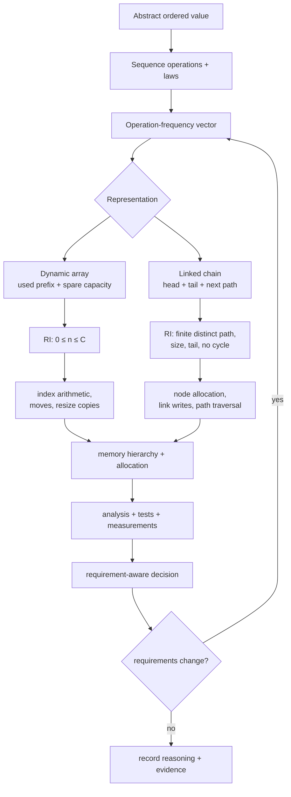

Keep three sentences:

> An ADT fixes permitted observations; a representation fixes paths, invariants, and costs.

> Python programs manipulate an object graph of shareable references, so copying, ownership, lifetime, and memory must be argued over that graph.

> Portable behavior comes from Python’s contract; implementation explanations require a pinned interpreter label.

### “Before / now” reflection

Complete:

- Before, I thought a Python list __________________________________.
- Now, I can separate the abstract sequence from ____________________.
- The most dangerous layer-confusion for me is _____________________.
- The smallest graph that corrects it is ____________________________.
- I would reopen Atlas’s representation decision when ______________.

### Retrieval schedule

**After 2 days**

1. Draw shallow copy versus deep copy without code.
2. Derive the dynamic-array RI and the geometric copy bound.
3. Trace the one-element linked eviction bug.

**After 1 week**

1. Explain why array and linked iteration can both be `Θ(n)` but differ practically.
2. Audit five statements for MODEL/PYTHON/CPYTHON status.
3. Recreate the Atlas operation table from mechanism, not memory.

**Inside Module 7**

1. Explain why the rolling workload is a queue contract.
2. Compare linked, ring, and deque representations.
3. Reuse the ownership and snapshot argument in a lazy pipeline.

---

## Backward and forward connections

### Backward

- **Module 1:** names, identity, mutation, aliasing, and call frames become a collection-scale object graph.
- **Module 2:** recursive definitions and induction justify finite linked paths and traversal properties.
- **Module 3:** the sequence ADT, RI, AF, representation independence, and exposure rules keep clients separate from slots and nodes.
- **Module 4:** quantified invariants state “every reachable node is distinct” and “there exists exactly one tail.”
- **Module 5:** primitive operations, sums, amortization, and space categories become reference moves, link traversals, capacity, and node overhead.

### Forward

- **Module 7:** access restrictions derive stacks and queues; the rolling buffer motivates ring/deque structures, iterators, and bounded lazy flow.
- **Module 8:** array tables, equality, hashing, load factors, and collision links reuse the same representation/cost discipline.
- **Module 9:** sorting exposes movement, stability, auxiliary arrays, linked alternatives, and locality.
- **Module 10:** linked paths generalize into trees and graphs; cycles make visited-state necessary.
- **Module 13:** representation-independent properties become generative and model-based tests.
- **Module 16:** database pages and indexes separate logical order from physical layout.
- **Module 17:** addresses, cache lines, locality, virtual memory, and allocation receive a precise machine model.
- **Module 19:** shared mutable graphs add synchronization, races, and memory-visibility questions.
- **Module 20:** distributed histories add serialization, ownership transfer, and network-copy costs.
- **Module 22:** memory safety and denial-of-service analysis examine bounds, retained graphs, and adversarial operation sequences.
- **Module 24:** CPython objects, reference management, allocators, bytecode, and profiling deepen the explicitly pinned implementation view.

---

## Sources and synthesis notes

The workbook’s narrative and Atlas examples are original. Sources provide authoritative facts, models, and exercise traditions; no single source supplies this integrated module.

### University foundations

- [MIT 6.006 Lecture 2: Data Structures and Dynamic Arrays](https://ocw.mit.edu/courses/6-006-introduction-to-algorithms-spring-2020/resources/lecture-2-data-structures-and-dynamic-arrays/) and [Recitation 2 notes](https://ocw.mit.edu/courses/6-006-introduction-to-algorithms-spring-2020/c08a3b63dfe5f6f6b32257d35f86ae63_MIT6_006S20_r02.pdf) — source for the interface-versus-data-structure distinction, Word-RAM bridge, static arrays, linked lists, dynamic arrays, operation tables, and geometric-growth analysis. This workbook adds Python object graphs, ownership, architecture review, and the changing Atlas contract.
- [Carnegie Mellon 15-122: Principles of Imperative Computation](https://www.cs.cmu.edu/~15122/syllabus.shtml) — reinforces memory diagrams, linked-list invariants, unbounded arrays, amortized analysis, specification/implementation separation, and reasoning with contracts. We adopt its invariant discipline while keeping Python as the primary language.
- [UC Berkeley CS61C cache notes](https://notes.cs61c.org/content/caches-ii/) — source for temporal and spatial locality and cache-block intuition. We use it only to form a mechanism-level hypothesis; exact Python performance remains an empirical, interpreter- and machine-specific question.

### Python 3.14 language and library contracts

- [Python 3.14 data model: objects, values, and types](https://docs.python.org/3.14/reference/datamodel.html#objects-values-and-types) — authoritative definitions of object identity, type, value, mutability, container references, reachability, and the boundary between language behavior and garbage-collection implementation.
- [Python 3.14 built-in sequence types](https://docs.python.org/3.14/library/stdtypes.html#sequence-types-list-tuple-range) — documented sequence, list, tuple, `bytes`, and `bytearray` behavior. It supports portable behavioral claims, not an internal-layout promise.
- [Python 3.14 shallow and deep copy operations](https://docs.python.org/3.14/library/copy.html#shallow-and-deep-copy-operations) — authoritative distinction between a new outer compound object with shared references and recursively copied contents.
- [Python 3.14 `sys.getsizeof`](https://docs.python.org/3.14/library/sys.html#sys.getsizeof) — documents that directly attributed size excludes referred objects and is implementation-specific.

### Pinned CPython implementation evidence

- [CPython `v3.14.6` `Include/cpython/listobject.h`](https://github.com/python/cpython/blob/v3.14.6/Include/cpython/listobject.h) — pinned evidence for `ob_item`, used size, allocated capacity, and the implementation’s internal invariants.
- [CPython `v3.14.6` `Objects/listobject.c`](https://github.com/python/cpython/blob/v3.14.6/Objects/listobject.c#L90-L142) — pinned implementation evidence for resize and over-allocation. The exact source line range can move in GitHub’s rendered view; the tag and file are the authority. Search for `list_resize` and “The growth pattern is”.

### Claim discipline

The source synthesis follows four rules:

1. MIT’s Word-RAM and sequence structures are **models**, not descriptions of every Python interpreter.
2. Python documentation owns portable behavior.
3. CPython claims are pinned to `v3.14.6` and explicitly labeled.
4. Berkeley’s locality account explains a mechanism; only a controlled measurement can estimate its effect for Atlas on a named machine and interpreter.

### Session-to-source-and-evidence route

**Access and reuse.** Sources were checked **2026-08-01** and are linked or
briefly paraphrased only. Atlas retains its original traces, code, diagrams,
and prompts. The source type in each row is part of the claim boundary.

| Session | Claim or learner artifact | Verify after your own attempt |
| --- | --- | --- |
| 1 | model/Python/CPython classification and object/reference trace | [Python data model](https://docs.python.org/3.14/reference/datamodel.html#objects-values-and-types) for portable terms |
| 2 | indexed-access derivation, array RI/AF, and shift count | [MIT 6.006 Lecture 2](https://ocw.mit.edu/courses/6-006-introduction-to-algorithms-spring-2020/resources/lecture-2-data-structures-and-dynamic-arrays/) for the course model |
| 3 | geometric-copy argument and capacity-versus-length observation | [CPython `v3.14.6` `listobject.c`](https://github.com/python/cpython/blob/v3.14.6/Objects/listobject.c#L90-L142) only for the named implementation reading |
| 4 | linked RI/AF, splice trace, and qualified insertion claim | [CMU 15-122](https://www.cs.cmu.edu/~15122/syllabus.shtml) for invariant/specification calibration |
| 5 | shallow-versus-retained-memory claim and locality hypothesis | [Python `sys.getsizeof`](https://docs.python.org/3.14/library/sys.html#sys.getsizeof) for its explicit limit; measurement is still required |
| 6 | representation decision, patch review, and oral defense | the Atlas evidence dossier; university sources calibrate scope but do not establish the decision |

---

## Final self-explanation

Without notes, answer in five minutes:

> Atlas stores the same abstract history first in a Python list and then in a head/tail linked structure. Explain what stays the same, what changes in the object graph, how each representation preserves order, which operation costs change, how memory and locality differ, why a tuple snapshot may safely share frozen events, which facts are Python guarantees versus CPython observations, and what new requirement would make you choose neither representation.

If the answer naturally moves through contract → object graph → RI/AF → operation mechanics → cost → ownership → evidence layer → changing decision, the knowledge is connected.

## Guided Codex handoff — M6

### Teaching Assistant — supportive oral defense

Start with: **“I am finishing M6. This sequence contract is [claim], this
representation is [array/list/linked structure], and this operation preserves
[invariant].”** Ask for an object graph or memory sketch before comparing
costs. Use this hint ladder: client operation → representation/ownership →
invariant → local update trace → cost/locality claim → test or measurement.
Change one workload (append-heavy, random access, shared snapshot, or delete
near a cursor) and ask whether the representation decision still holds.

### Study Partner — representation rehearsal

Ask for two sketches that represent the same abstract history. Change one
operation and ask which pointers, indices, aliases, or cached lengths move.
Finish with one sentence separating a portable Python behavior from a
CPython/locality observation.

### Forward handoff — M7

Carry one sequence invariant, ownership boundary, and cost comparison into
**M7**. The next module turns access order and demand timing into explicit
stack, queue, iterator, and generator contracts.
