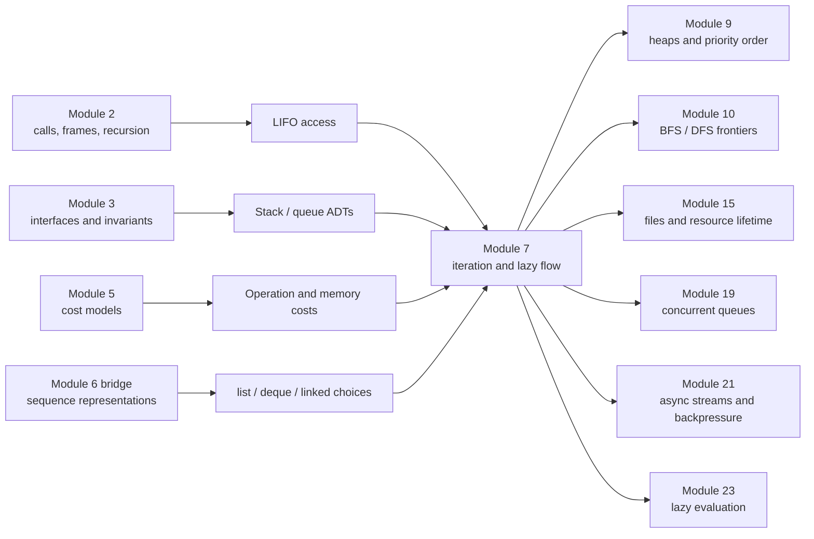
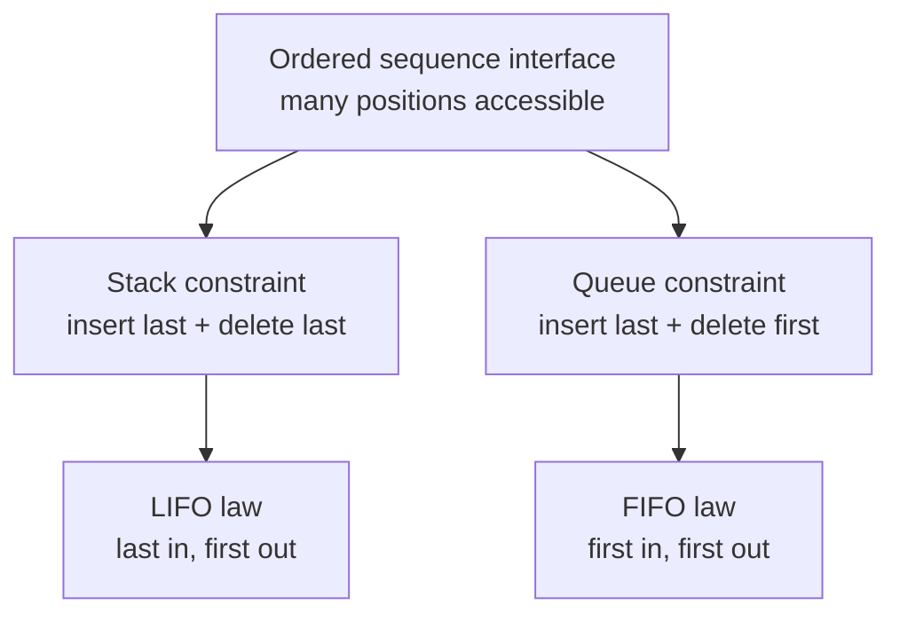
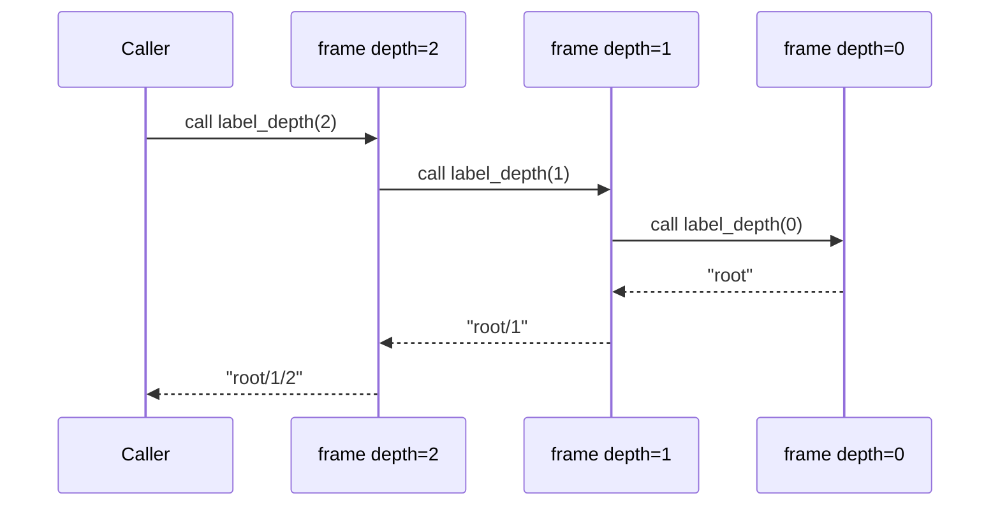
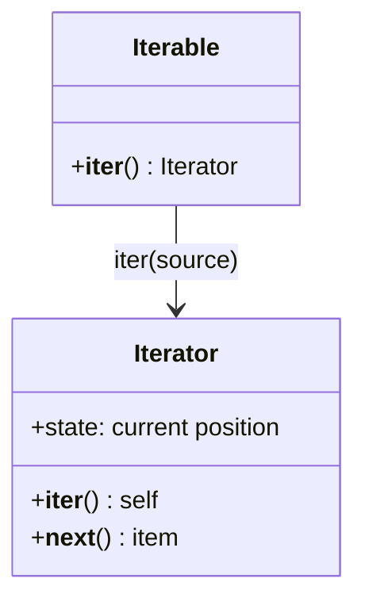
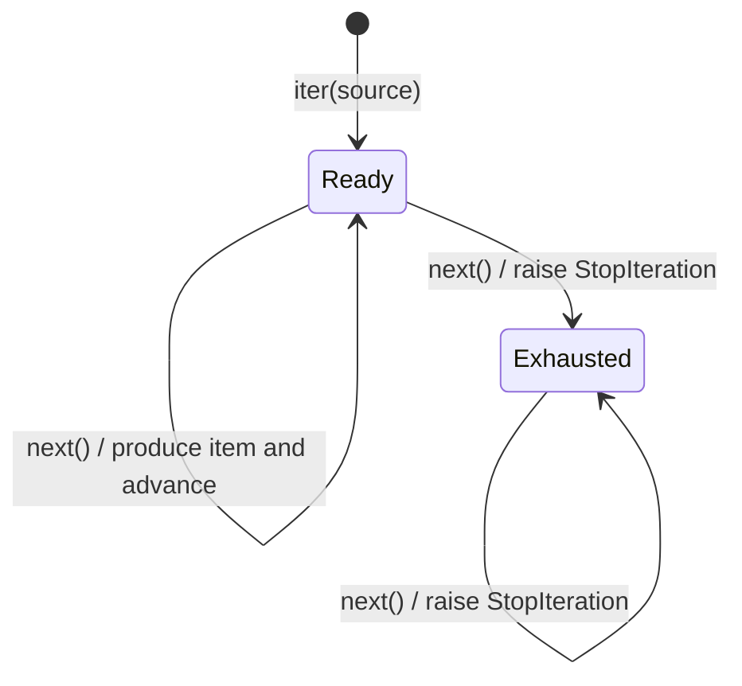
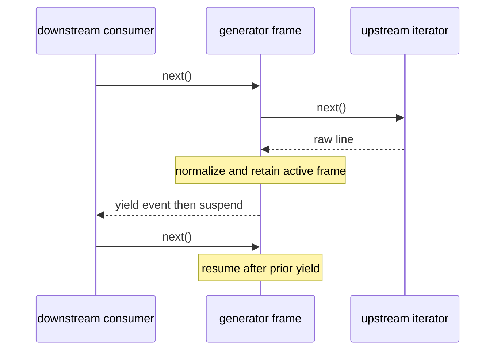
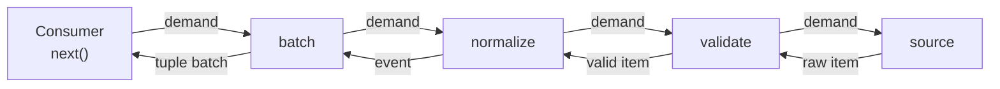
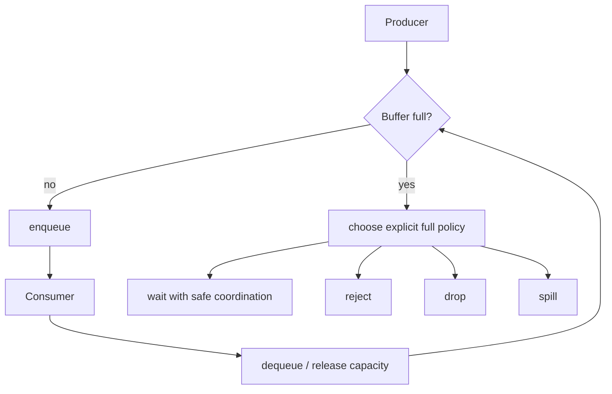
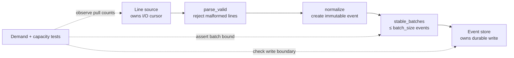
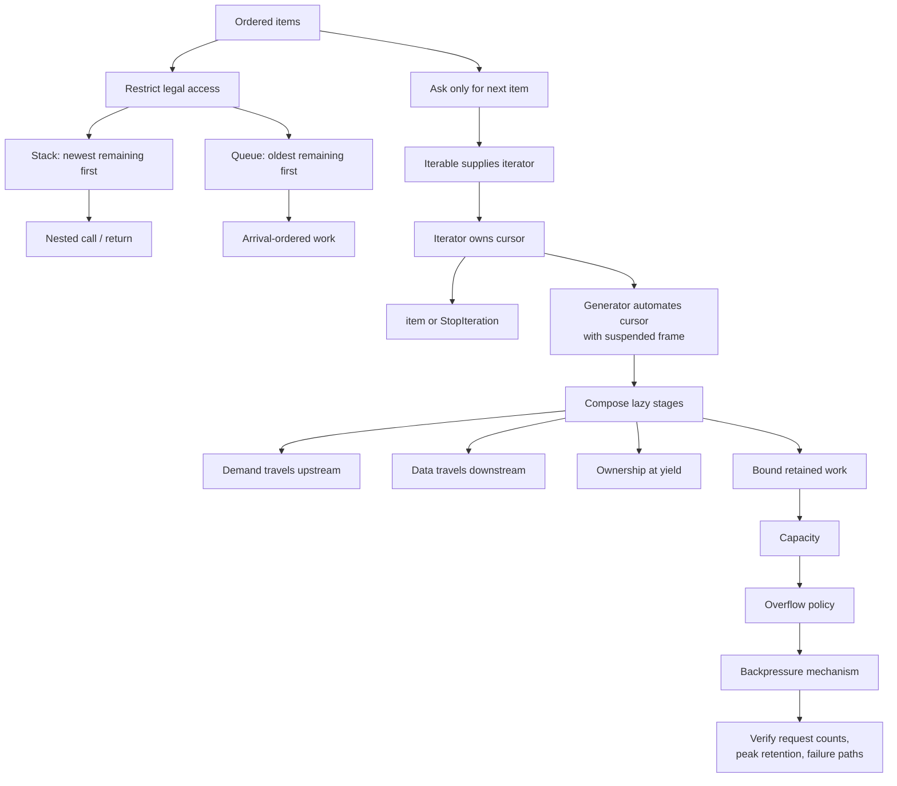

# Module 7 — Stacks, Queues, Iteration, and Lazy Computation

> **Central idea:** constrain how stored work may be accessed, then let demand—not accumulation—control when work is performed.

This workbook connects four ideas that are often taught separately:

1. a **stack** permits access at one end;
2. a **queue** preserves arrival order across two ends;
3. an **iterator** turns “give me the next item” into a protocol;
4. a **lazy pipeline** composes that protocol so a consumer can regulate upstream work.

The connection is control over **which item is available next**, **who asks for it**, and **how much unfinished work may exist at once**.

This is an AI-native module. Most effort goes into tracing, architecture recovery, debugging, design, agent direction, and verification. The one manual implementation is deliberately small because building an iterator once reveals state that generator syntax normally hides.

---

## 1. Position in the knowledge graph



### The problem this module solves

Atlas can already represent study events and reason about operation costs. It now needs to ingest an event source that may be:

- too large to fit in memory;
- slow or infinite;
- expensive to decode;
- connected to a slower destination;
- stopped after only a few useful events;
- owned by a component whose mutable working storage must not leak.

An eager design hides all of those constraints:

```python
def ingest_eager(lines, store):
    events = [parse_event(line) for line in lines]
    valid = [event for event in events if event is not None]
    normalized = [normalize(event) for event in valid]
    store.append_batch(normalized)
```

Before reading onward, identify three facts this code does **not** tell a caller:

1. the peak number of events retained;
2. whether the store receives anything before the source ends;
3. what happens if the caller wants only the first two valid events.

Module 7 replaces this hidden accumulation with explicit access order, demand, ownership, and capacity.

### Backward connections

| Earlier module | Retrieved idea | How Module 7 uses it |
|---|---|---|
| Module 2 | each active call has a frame; nested returns unwind in reverse order | the active-call chain behaves like a stack |
| Module 3 | an ADT specifies operations and laws independently of representation | stack and queue are access contracts, not Python container names |
| Module 5 | every cost claim needs a size, resource, case, and operation assumptions | we compare end operations, front shifts, pipeline work, and auxiliary space |
| Module 6 | an ordered sequence can be represented contiguously or through links | the same stack/queue interface can have different costs and memory behavior |

### Minimal Module 6 bridge

Do not assume any unintroduced implementation detail. For this module, retain only these facts:

- a Python `list` stores an ordered, resizable sequence and supports fast access and updates at its right end;
- removing the first list element must move the later logical positions and costs linear time in the list length;
- `collections.deque` supports efficient insertion and removal at either end;
- an interface such as “queue” does not determine whether the representation is an array, linked structure, deque, or something else;
- retaining `n` pending object references requires `Θ(n)` storage regardless of the access policy.

Later systems work will refine “storage” into bytes, allocation, cache behavior, and implementation-specific layout.

### Capabilities unlocked

After this module, Michael can:

- recognize LIFO, FIFO, and demand-driven control in unfamiliar systems;
- distinguish an iterable, an iterator, and a generator without relying on syntax;
- trace a `for` loop through `iter`, `next`, suspension, and `StopIteration`;
- predict when lazy code performs effects or raises errors;
- design a pipeline whose auxiliary memory is bounded by an explicit capacity;
- audit ownership at a `yield` boundary;
- state what “backpressure” means and what a synchronous iterator does—and does not—guarantee;
- direct an agent to implement a bounded pipeline component and reject a plausible but incorrect patch.

---

## 2. Prerequisite retrieval

Answer from memory. Do not run code until every answer has a reason.

### Retrieval A — frames and return order

```python
def outer() -> str:
    return middle() + "!"


def middle() -> str:
    return inner().upper()


def inner() -> str:
    return "atlas"
```

At the moment `inner` is executing, list the active calls from oldest to newest. In what order must they finish?

### Retrieval B — interface versus representation

Suppose both objects support:

```text
enqueue(item)
dequeue() -> oldest remaining item
is_empty() -> bool
```

One object uses a resizable array and the other uses linked nodes. Are these two interfaces, two representations of one interface, or neither? What evidence would let a client tell the difference?

### Retrieval C — cost claim

Why is “queue removal is `O(1)`” incomplete? Name the missing assumptions.

### Retrieval D — mutation and ownership

```python
event = {"topic": "iteration"}
pending = [event]
event["topic"] = "queues"
```

What topic does `pending[0]` contain? Which fact from Module 1 explains it?

### Retrieval E — ordered sequence

For a sequence of `n` elements represented by a Python list, contrast:

- `append(x)`;
- `pop()`;
- `pop(0)`.

Give an amortized or worst-case qualification where needed.

<details>
<summary>Retrieval check and routing</summary>

- **A:** active calls are `outer`, `middle`, `inner`; they complete `inner`, then `middle`, then `outer`. If frames or return order are unclear, revisit Module 2.
- **B:** they are two representations of the same queue interface if their observable behavior satisfies the same contract. Performance can differ if the contract exposes or promises it; otherwise client code should not depend on representation. Revisit Module 3 if interface and implementation are fused.
- **C:** identify the representation, operation, input size, case, and cost model. Revisit Module 5 if a complexity symbol is being used as a free-standing speed label.
- **D:** `"queues"` because both references reach the same mutable dictionary. Revisit Module 1 before reasoning about ownership at `yield`.
- **E:** right-end `append` is amortized `O(1)`, right-end `pop` is `O(1)`, and `pop(0)` is `O(n)` because later elements shift. Use these as documented behavior for choosing an operation, not as a full memory-layout model.

</details>

---

## 3. First principle: an interface can remove freedoms

A general mutable sequence might permit insertion, deletion, and access at arbitrary positions. A restricted interface deliberately removes some of those operations.

Why remove power?

- fewer legal operations create a stronger invariant;
- a stronger invariant makes order easier to reason about;
- the implementation may support the remaining operations efficiently;
- clients reveal their real policy instead of manipulating positions ad hoc.

### From sequence to stack and queue

Let each inserted item have a unique arrival number.

- A **stack** removes the remaining item with the **largest** arrival number.
- A **queue** removes the remaining item with the **smallest** arrival number.

These statements remain precise even when two stored values are equal.



The words “top,” “front,” and “back” name **logical roles**. They do not require a vertical drawing or a particular address layout.

### A representation test

This code is a stack:

```python
undo: list[str] = []
undo.append("rename note")       # push
undo.append("change duration")   # push

assert undo.pop() == "change duration"
assert undo.pop() == "rename note"
```

This code is a queue:

```python
from collections import deque

ready: deque[str] = deque()
ready.append("index event 17")   # enqueue at back
ready.append("index event 18")

assert ready.popleft() == "index event 17"  # dequeue from front
assert ready.popleft() == "index event 18"
```

`list` and `deque` are representations with broader interfaces. The **way the client uses them**, plus the contract it promises, supplies the stack or queue policy.

### Laws before methods

For a fresh stack `S` and queue `Q`:

```text
S.push(a); S.push(b); S.pop() == b
Q.enqueue(a); Q.enqueue(b); Q.dequeue() == a
```

Both empty-removal operations need an explicit failure contract. Python’s `list.pop()` and `deque.popleft()` raise `IndexError`; a custom ADT might return a result object. Silently returning `None` is ambiguous when `None` is a legal stored value.

### Representation and operation costs

| Needed policy | Suitable Python operations | Time claim under documented model | Trap |
|---|---|---:|---|
| stack | `list.append`, `list.pop` | amortized `O(1)` push; `O(1)` pop | confusing stack order with sorted priority |
| FIFO queue | `deque.append`, `deque.popleft` | approximately `O(1)` at both ends | using `list.pop(0)` repeatedly |
| bounded recent history | `deque(maxlen=k)` | bounded retained length | oldest item is silently discarded when full |
| random indexed sequence | `list[i]` | `O(1)` indexing | assuming a deque is equally fast in its middle |

Do **not** use `deque(maxlen=k)` as a reliable-work queue unless silent eviction is the intended policy. Capacity and overflow policy are separate design decisions.

---

## 4. The call stack: a control structure, not merely a drawing

When a call must pause while a nested call runs, the paused caller’s continuation must be retained. The most recently suspended caller is the first one able to resume. That is LIFO.

```python
def label_depth(depth: int) -> str:
    if depth == 0:
        return "root"
    return f"{label_depth(depth - 1)}/{depth}"
```

Trace `label_depth(2)`:



At maximum depth, the conceptual active-call stack is:

```text
top    frame(depth=0)  ← returns next
       frame(depth=1)
bottom frame(depth=2)  ← returns last
```

### What the analogy explains

The stack model explains nested call/return order and `Θ(h)` active-frame space for recursion depth `h`.

### Where the analogy stops

It does not promise that CPython stores all frame data as adjacent cells in a simple user-visible array. “Call stack” here is a semantic control model. CPython internals and native stacks return in Module 24.

### Scheduler connection

A queue often represents work eligible to run:

```text
enqueue newly ready work → [A, B, C] → dequeue A
```

FIFO preserves admission order, but FIFO alone does not prove:

- equal completion times;
- deadlines;
- absence of starvation if other priority rules intervene;
- safe concurrency;
- bounded memory.

Those require stronger scheduling and concurrency contracts. Module 7 keeps one consumer and derives the ordering mechanism before Modules 19 and 21 add interleavings and waiting.

---

## 5. From “stored sequence” to “one item at a time”

An index-based loop asks a sequence for positions:

```python
for index in range(len(events)):
    use(events[index])
```

This assumes length and indexing. A file, generated series, tree traversal, or live feed may have neither.

The smaller requirement is:

> Can the source provide one next item, or report that it is exhausted?

That question is the iterator protocol.

### Precise vocabulary

An **iterable** is an object from which `iter(obj)` can obtain an iterator.

An **iterator** is a stateful object that:

- returns itself from `iter(iterator)`;
- produces the next item from `next(iterator)`;
- raises `StopIteration` after exhaustion;
- remains exhausted after it has reported exhaustion, according to the iterator protocol.

An iterator is therefore also iterable. An iterable is not necessarily an iterator.



`collections.abc.Iterable` and `collections.abc.Iterator` name these behavioral interfaces. As in Module 3, structural behavior matters more than ancestry for ordinary Python iteration.

Each successful `__next__` call advances the **same** iterator's cursor; it does
not construct a second iterator.

### Reusable versus one-shot is a separate question

```python
names = ["Ada", "Grace"]
left = iter(names)
right = iter(names)

assert left is not right
assert next(left) == "Ada"
assert next(right) == "Ada"
```

The list is a reusable iterable because each `iter(names)` creates an independent iterator.

```python
cursor = iter(names)
assert iter(cursor) is cursor
assert next(cursor) == "Ada"
assert list(cursor) == ["Grace"]
assert list(cursor) == []
```

The cursor is one-shot. Consumption changes its position.

Be careful: “iterable” does **not** logically guarantee reusable traversal. An object may return itself from `__iter__` and therefore be both iterable and a one-shot iterator.

### What a `for` loop coordinates

Conceptually:

```python
iterator = iter(source)
while True:
    try:
        item = next(iterator)
    except StopIteration:
        break
    body(item)
```

The real bytecode is an implementation detail, but this expansion captures the protocol contract:

1. obtain an iterator once;
2. repeatedly request one value;
3. interpret `StopIteration` as normal exhaustion;
4. run the loop body only for produced values.

`StopIteration` is not an error to print during normal iteration. It is a control signal consumed by iteration machinery.

### Trace one iterator as a state machine



The “current position” belongs to the iterator, not necessarily to the underlying iterable.

---

## 6. Small mechanism implementation: reveal the hidden cursor

Manual typing is limited to this mechanism because it exposes the state a `for` loop and generator normally manage for us.

### Contract for `TakeIterator`

Given an iterable and nonnegative `limit`:

- produce at most the first `limit` source items;
- never request item `limit + 1`;
- preserve source order;
- become permanently exhausted when the limit or source is exhausted;
- consume no source item during construction.

Predict the fields needed before reading the implementation.

```python
from collections.abc import Iterable, Iterator


class TakeIterator:
    def __init__(self, source: Iterable[str], limit: int) -> None:
        if limit < 0:
            raise ValueError("limit must be nonnegative")
        self._source = iter(source)
        self._remaining = limit
        self._done = False

    def __iter__(self) -> Iterator[str]:
        return self

    def __next__(self) -> str:
        if self._done or self._remaining == 0:
            self._done = True
            raise StopIteration

        try:
            item = next(self._source)
        except StopIteration:
            self._done = True
            raise

        self._remaining -= 1
        return item
```

### State trace

For `TakeIterator(["a", "b", "c"], 2)`:

| Action | `_remaining` before | source cursor before | result | `_done` after |
|---|---:|---:|---|---|
| construct | — | before `"a"` | iterator object | `False` |
| `next` | 2 | before `"a"` | `"a"` | `False` |
| `next` | 1 | before `"b"` | `"b"` | `False` |
| `next` | 0 | before `"c"` | `StopIteration` | `True` |
| `next` again | 0 | still before `"c"` | `StopIteration` | `True` |

The unrequested `"c"` remains in the source. This is an observable demand property.

### Contract tests

```python
class CountingIterator:
    def __init__(self, values: list[str]) -> None:
        self._values = iter(values)
        self.requests = 0

    def __iter__(self):
        return self

    def __next__(self) -> str:
        self.requests += 1
        return next(self._values)


source = CountingIterator(["a", "b", "c"])
taken = TakeIterator(source, 2)

assert source.requests == 0
assert list(taken) == ["a", "b"]
assert source.requests == 2
assert list(taken) == []
assert source.requests == 2
```

The last assertion is stronger than output equality: it proves no over-consumption after exhaustion by limit.

### Intentionally broken variant

```python
class BrokenTake:
    def __init__(self, source, limit):
        self.source = iter(source)
        self.remaining = limit

    def __iter__(self):
        return self

    def __next__(self):
        item = next(self.source)
        if self.remaining == 0:
            raise StopIteration
        self.remaining -= 1
        return item
```

For a limit of two, the third call consumes the third source item **before** reporting exhaustion. A normal output-only test misses the bug. The counting test reveals it.

### Investigation

Explain these in order:

1. Which object owns cursor state?
2. Which line advances upstream?
3. What invariant relates `_remaining` to successful yields?
4. Why is `_done` useful after early source exhaustion?
5. Which test observes demand rather than merely values?

In production, use `itertools.islice` for this operation. The purpose of the class is to expose mechanism, not to replace a mature standard-library tool.

---

## 7. A common design bug: putting cursor state on the iterable

Read before running:

```python
class BadEventBatch:
    def __init__(self, events: list[str]) -> None:
        self.events = events
        self.position = 0

    def __iter__(self):
        return self

    def __next__(self) -> str:
        if self.position == len(self.events):
            raise StopIteration
        event = self.events[self.position]
        self.position += 1
        return event
```

What does this produce?

```python
batch = BadEventBatch(["a", "b"])
first = iter(batch)
second = iter(batch)

print(next(first))
print(next(second))
```

Both names reference the same cursor, so the output is `"a"` then `"b"`. The class may be a valid one-shot iterator, but its name and container-like surface suggest a reusable batch.

A reusable design separates stable data from per-traversal state:

```python
class EventBatch:
    def __init__(self, events: list[str]) -> None:
        self._events = tuple(events)

    def __iter__(self):
        return iter(self._events)
```

The built-in tuple iterator owns each cursor. This is a representation-independence lesson from Module 3: decide whether the public abstraction is a reusable collection or a consumable cursor, then make identity and naming support that contract.

---

## 8. Generators: a suspended frame implements an iterator

Writing `__next__` by hand becomes awkward when “the next position” is deep inside branches or loops. A generator lets normal control flow describe how to reach each next value.

```python
def valid_topics(lines):
    for line in lines:
        topic = line.strip()
        if topic:
            yield topic
```

### Prediction

```python
def observed_source():
    print("source starts")
    yield " iteration "
    print("source resumes")
    yield " "


topics = valid_topics(observed_source())
print("pipeline exists")
print(next(topics))
```

Predict all printed lines in order.

<details>
<summary>Trace</summary>

```text
pipeline exists
source starts
iteration
```

Calling either generator function creates a generator object; it does not execute its body. The first `next(topics)` starts `valid_topics`, which requests from `observed_source`, which then starts. Execution pauses at each `yield`.

</details>

### Precise execution model

A function whose body contains `yield` is a **generator function**. Calling it returns a **generator iterator**.

On `next(generator)`:

1. its suspended frame starts or resumes;
2. statements execute until a `yield`, return, or uncaught exception;
3. `yield value` sends one value to the caller and suspends the frame;
4. local bindings, instruction position, evaluation state, and active exception handling are retained;
5. normal return signals exhaustion through `StopIteration`.



This reconnects Module 2’s frame model to iteration. A normal call runs until return; a generator call creates a resumable computation whose frame crosses many `next` calls.

This trace is deliberately a one-upstream-request case. A filtering or batching
stage can require several upstream requests before it yields once.

### Generator, iterable, iterator

A generator object is:

- an iterator because it implements next-item state;
- an iterable because `iter(generator) is generator`;
- normally one-shot because its suspended computation advances and ends.

Calling the **generator function again** creates a fresh generator object.

### A subtle validation boundary

```python
def batches(items, size):
    if size <= 0:
        raise ValueError("size must be positive")
    # yield later ...
    yield ()


bad = batches(["a"], 0)  # no ValueError yet
```

Because the function body is lazy, the validation runs at the first `next(bad)`, not construction. That may be acceptable, but the API must not accidentally imply immediate validation. If immediate failure is part of the contract, use a normal outer function that validates and returns an inner generator, or use an iterator class whose constructor validates.

### Generator expression timing

```python
source = open_source()
squared = (transform(item) for item in source)
```

The leftmost iterable expression is evaluated and converted to an iterator when the generator expression is created; most remaining work is delayed until iteration. “Lazy” is therefore not a magic promise that **nothing** happens at construction.

---

## 9. Laziness: demand decides when, not whether

An eager transformation builds its entire result:

```python
normalized = [normalize(event) for event in events]
```

A lazy transformation offers one value at a time:

```python
normalized = (normalize(event) for event in events)
```

The second expression does not remove work. If all `n` events are eventually consumed, normalization still runs `n` times. It changes:

- **timing** — work occurs on demand;
- **retention** — intermediate results need not all coexist;
- **termination behavior** — a consumer may stop early;
- **error timing** — failures may move from construction to consumption;
- **effect timing** — logs, reads, writes, and mutations may also move;
- **composability** — each stage can request from its upstream stage.

### Demand travels backward; data travels forward



A downstream `next` may cause several upstream requests if a filter rejects values or a batch groups multiple items. “One downstream request equals one source read” is not a general invariant.

### Space claim

Suppose `k` generator stages each retain constant local state, and no stage buffers an input-sized collection. Excluding source storage, sink storage, and yielded values already owned elsewhere:

- pipeline auxiliary state is `O(k)`;
- processing `n` items through `k` constant-work stages is `O(nk)`;
- if `k` is a fixed architecture constant, this is usually stated as `O(n)` time and `O(1)` auxiliary space with respect to `n`.

Every qualifier matters.

This terminal operation defeats bounded result memory:

```python
all_events = list(normalized)
```

The pipeline may remain lazy internally while the terminal consumer intentionally materializes `Θ(n)` output.

### Infinite input distinguishes the designs

```python
def natural_numbers():
    current = 0
    while True:
        yield current
        current += 1
```

`TakeIterator(natural_numbers(), 5)` terminates. `list(natural_numbers())` does not. A lazy source can represent an unbounded logical sequence because it represents a rule plus current state, not every future element.

---

## 10. Failure mode: laziness moves effects and errors

Read this:

```python
def parsed(lines):
    for line in lines:
        print(f"parsing {line!r}")
        yield int(line)


values = parsed(["10", "bad", "30"])
first = next(values)
```

After construction, nothing has been parsed. The first request prints once and returns `10`. The `ValueError` occurs only on the second request.

That can be useful: a caller asking only for one item never pays for or encounters later input. It can also surprise an API caller who thought `parsed(...)` validated the source.

### Questions for any lazy API

1. Which operations happen at construction?
2. Which happen at first demand?
3. Which happen once per item?
4. When can exceptions appear?
5. Who closes an external resource after early stop?
6. Can iteration be repeated?
7. Can upstream state change between demands?

Files and cleanup return in Module 15. For now, do not put resource acquisition inside a generator without naming who owns cleanup and how early termination is handled.

---

## 11. Ownership at a yield boundary

A pipeline may use bounded memory and still be wrong if it yields mutable working storage that it later reuses.

```python
def broken_batches(items, size):
    batch = []
    for item in items:
        batch.append(item)
        if len(batch) == size:
            yield batch
            batch.clear()
```

Prediction:

```python
stream = broken_batches(["a", "b"], 2)
first = next(stream)
print(first)

try:
    next(stream)
except StopIteration:
    pass

print(first)
```

The first print shows `["a", "b"]`; after resumption, `batch.clear()` mutates the same list object and the second print shows `[]`.

The fix establishes an ownership boundary:

```python
def stable_batches(items, size):
    batch = []
    for item in items:
        batch.append(item)
        if len(batch) == size:
            yield tuple(batch)
            batch.clear()
    if batch:
        yield tuple(batch)
```

The yielded tuple is an immutable snapshot. The generator exclusively owns and reuses its mutable list.

### Ownership rule

At each yield, ask:

> Is the yielded object a stable value transferred to the consumer, shared mutable state, or a borrowed view whose lifetime is documented?

This course defaults to immutable event values and immutable batch snapshots at component boundaries. Copying has a cost; accidental shared mutation has a correctness cost. State both.

---

## 12. Buffering and backpressure from first principles

Assume a producer can create `rₚ` items per second and a consumer can finish `r꜀` items per second.

If `rₚ > r꜀` for time `t`, an unbounded push design accumulates roughly:

```text
(rₚ - r꜀) · t items
```

No clever queue representation removes that growth. The architecture needs a response to excess demand.

### Precise terms

A **buffer** temporarily stores produced but unconsumed items.

A **capacity** is the maximum number of such items the design permits.

An **overflow policy** says what happens when the capacity is reached:

- wait/block until space exists;
- reject new work;
- drop oldest or newest work;
- sample or coalesce;
- spill to durable storage;
- propagate a demand signal upstream.

**Backpressure** is the mechanism by which downstream capacity limits influence upstream production.



### What synchronous iteration provides

In a simple, single-threaded pull pipeline, upstream code advances only when downstream calls `next`. If the sink is busy and makes no request, the source generator does not advance. This is **implicit demand propagation** and often gives bounded intermediate memory.

It does not prove:

- that an external producer stops sending;
- that a library stage does not prefetch;
- that the source itself has no buffer;
- that a yielded item is small;
- that the sink stores nothing;
- that threaded or asynchronous producers wait safely.

“Uses generators” is not a complete backpressure argument. Audit every boundary.

### A bounded FIFO mechanism

This single-threaded teaching type makes capacity and overflow explicit:

```python
from collections import deque


class BufferFull(Exception):
    pass


class BoundedBuffer:
    def __init__(self, capacity: int) -> None:
        if capacity <= 0:
            raise ValueError("capacity must be positive")
        self._items = deque()
        self._capacity = capacity

    def put(self, item: str) -> None:
        if len(self._items) == self._capacity:
            raise BufferFull
        self._items.append(item)

    def get(self) -> str:
        return self._items.popleft()

    def __len__(self) -> int:
        return len(self._items)
```

Its overflow policy is **reject without mutation**. It is not thread-safe and it does not wait. Those are deliberate non-goals until concurrency is derived.

Required invariant:

```text
0 ≤ len(buffer) ≤ capacity
```

Required order law: successful `get` operations return successfully accepted items in FIFO order.

Required failure law: failed `put` on a full buffer leaves contents unchanged.

### Why `deque(maxlen=capacity)` is not equivalent

A full bounded deque discards an item from the opposite end when appending. That is useful for recent-history windows, but it violates reliable FIFO work retention. A bounded data structure does not choose the right overflow semantics for you.

---

## 13. Atlas checkpoint — a lazy event-ingestion pipeline

### Architectural contract

Atlas accepts text lines and writes immutable study events in batches.



Responsibilities:

| Component | Input | Output | Owns | Must not do |
|---|---|---|---|---|
| source | external text | one line on demand | source cursor and cleanup | pre-materialize all lines without declaring it |
| parser | lines | valid parsed fields | temporary parse state | mutate source objects |
| normalizer | parsed fields | immutable `StudyEvent` | no retained event collection | write to store |
| batcher | events | immutable tuples of size `1..B` | one mutable working list of at most `B` | yield that mutable list |
| sink | tuple batch | write result | persistence transaction | pull beyond what it can accept |
| coordinator | source + sink | counts/evidence | control flow | hide retry/drop policy |

### Reference model

The code is intentionally small enough to read in dependency order.

```python
from collections.abc import Iterable, Iterator
from dataclasses import dataclass


@dataclass(frozen=True, slots=True)
class StudyEvent:
    topic: str
    minutes: int


def parse_valid(lines: Iterable[str]) -> Iterator[StudyEvent]:
    for line in lines:
        fields = line.rstrip("\n").split(",")
        if len(fields) != 2:
            continue

        topic, raw_minutes = fields
        topic = topic.strip().casefold()
        try:
            minutes = int(raw_minutes)
        except ValueError:
            continue

        if topic and minutes > 0:
            yield StudyEvent(topic=topic, minutes=minutes)


def stable_batches(
    events: Iterable[StudyEvent],
    size: int,
) -> Iterator[tuple[StudyEvent, ...]]:
    if size <= 0:
        raise ValueError("size must be positive")

    batch: list[StudyEvent] = []
    for event in events:
        batch.append(event)
        if len(batch) == size:
            yield tuple(batch)
            batch.clear()

    if batch:
        yield tuple(batch)


def ingest(lines, store, batch_size: int) -> int:
    written = 0
    for batch in stable_batches(parse_valid(lines), batch_size):
        store.append_batch(batch)
        written += len(batch)
    return written
```

The `StudyEvent` declaration uses a frozen data class as a compact immutable record. Its decorator mechanics are not this module’s subject; the important contract is that downstream code receives stable event values.

### Five-level comprehension walk

#### 1. Purpose

Turn a potentially large line source into validated immutable events and write them without retaining the entire input.

#### 2. Map

- entry point: `ingest`;
- pure-ish transformation boundary: `parse_valid`;
- bounded buffer boundary: `stable_batches`;
- effect boundary: `store.append_batch`;
- control owner: `ingest`.

#### 3. Flow

Trace:

```text
" Iteration ,25\n"
```

through every binding and boundary until it reaches the store as:

```python
(StudyEvent(topic="iteration", minutes=25),)
```

when the source ends before the batch fills.

#### 4. Mechanism

`ingest` requests one batch. The batch generator repeatedly requests events. The parser repeatedly requests lines until a valid event is available. Each generator suspends at `yield`, retaining only its small local state.

#### 5. Evaluation

Strengths:

- source demand is pull-controlled;
- invalid input policy is explicit;
- event and batch ownership is stable;
- working batch length never exceeds `batch_size`;
- sink writes are separated from parsing.

Open decisions:

- silently skipping malformed input loses diagnostic information;
- a sink failure may leave earlier batches committed;
- immediate `batch_size` validation occurs only once iteration begins because `stable_batches` is a generator;
- source cleanup after sink failure is not specified;
- deduplication and retry policies are not yet designed.

Good architecture reading finds both the intended design and its unresolved contracts.

---

## 14. Backpressure and ownership tests

Output tests are necessary but insufficient. We need evidence about **when upstream advances**, **how much is retained**, and **whether yielded values remain stable**.

### Test probe

```python
class TracedLines:
    def __init__(self, lines):
        self._lines = iter(lines)
        self.requests = 0

    def __iter__(self):
        return self

    def __next__(self):
        self.requests += 1
        return next(self._lines)
```

Note: this probe counts even the final request that discovers exhaustion. Assertions must distinguish successful reads from `next` calls if that distinction matters. For valid fixed prefixes below, no exhaustion request occurs.

### Test 1 — construction is lazy

```python
source = TracedLines(["a,1\n", "b,2\n"])
events = parse_valid(source)

assert source.requests == 0
```

### Test 2 — limited demand does not drain the source

```python
source = TracedLines(["a,1\n", "b,2\n", "c,3\n"])
events = parse_valid(source)

assert next(events).topic == "a"
assert source.requests == 1
```

### Test 3 — batching has an explicit bound

```python
source = TracedLines(["a,1\n", "b,2\n", "c,3\n", "d,4\n"])
pipeline = stable_batches(parse_valid(source), size=2)

first = next(pipeline)
assert [event.topic for event in first] == ["a", "b"]
assert len(first) <= 2
assert source.requests == 2
```

For stronger evidence, instrument the batcher’s internal length in a test-specific model and assert its observed maximum is no greater than `size`. Do not infer peak memory solely from final outputs.

### Test 4 — ownership survives generator resumption

```python
pipeline = stable_batches(
    [
        StudyEvent("a", 1),
        StudyEvent("b", 2),
        StudyEvent("c", 3),
    ],
    size=2,
)

first = next(pipeline)
second = next(pipeline)

assert [event.topic for event in first] == ["a", "b"]
assert [event.topic for event in second] == ["c"]
```

The first tuple remains unchanged after the generator clears and reuses its private list.

### Test 5 — a slow synchronous sink limits source progress

Use an interaction log:

```python
trace = []


def source():
    for name in ["a", "b", "c"]:
        trace.append(f"read:{name}")
        yield f"{name},1\n"


class RecordingStore:
    def append_batch(self, batch):
        trace.append("write:" + "".join(event.topic for event in batch))


ingest(source(), RecordingStore(), batch_size=2)

assert trace == [
    "read:a",
    "read:b",
    "write:ab",
    "read:c",
    "write:c",
]
```

The third line is not requested until the first synchronous write returns. This proves pull-coupling for this architecture. It does not prove behavior if the source has its own background producer.

### Test 6 — overflow preserves a reliable bounded buffer

```python
buffer = BoundedBuffer(capacity=2)
buffer.put("a")
buffer.put("b")

try:
    buffer.put("c")
except BufferFull:
    pass
else:
    raise AssertionError("full buffer must reject")

assert len(buffer) == 2
assert buffer.get() == "a"
assert buffer.get() == "b"
```

### Test 7 — malformed prefixes explain extra reads

```python
source = TracedLines(["bad\n", "x,nope\n", "ok,5\n", "later,6\n"])
events = parse_valid(source)

assert next(events).topic == "ok"
assert source.requests == 3
```

Downstream demand for one **valid** event required three raw-line requests. A backpressure test must measure the correct boundary.

### Test 8 — sink failure stops further pull

```python
class FailingStore:
    def __init__(self):
        self.calls = 0

    def append_batch(self, batch):
        self.calls += 1
        raise RuntimeError("store unavailable")


source = TracedLines(["a,1\n", "b,2\n", "c,3\n"])

try:
    ingest(source, FailingStore(), batch_size=2)
except RuntimeError:
    pass

assert source.requests == 2
```

The third line remains unrequested. The test does **not** prove cleanup or retry safety; those require separate contracts.

---

## 15. Code and architecture reading studio

### The unfamiliar patch

An agent proposes:

```python
def ingest_stream(lines, store, batch_size=100):
    events = (
        StudyEvent(topic, int(minutes))
        for line in lines
        if line.strip()
        for topic, minutes in [line.split(",")]
    )

    batch = []
    for event in events:
        batch.append(event)
        if len(batch) > batch_size:
            store.append_batch(batch)
            batch.clear()

    store.append_batch(batch)
```

Do not rewrite it immediately. Read it in dependency order.

### Purpose

Write parsed study events in bounded batches.

### Map

1. generator expression parses and constructs events;
2. loop buffers events;
3. store receives a list;
4. one function owns parsing, batching, and effects.

### Flow

Trace three valid lines with `batch_size=2`. The condition is true at length three, so the first batch exceeds the promised capacity.

### Mechanism defects

Find at least six:

1. `>` creates an off-by-one capacity violation;
2. the mutable `batch` is passed to the store and then cleared—if the store retains the reference, its batch becomes empty;
3. an empty final batch is always written;
4. `batch_size <= 0` has no deliberate contract;
5. malformed field counts and invalid integers raise instead of following an explicit policy;
6. whitespace and case normalization are absent;
7. parsing, buffering, and persistence are coupled, making isolated reasoning harder;
8. a sink that iterates the passed list later observes shared mutable ownership;
9. there is no evidence about source over-consumption after store failure.

### Cost and memory claim

With a corrected bound `B`, the working list holds at most `B` event references, so auxiliary buffering is `O(B)`. Calling that “`O(1)` space” is only justified with respect to input count `n` when `B` is treated as a fixed configuration constant. If users may set `B = n`, the bound is `O(B)` and can be `O(n)`.

### Repair strategy

Prefer three components:

- parser/normalizer yields immutable events;
- batcher yields immutable snapshots no larger than `B`;
- coordinator calls the effectful sink.

Then tests can observe each contract boundary independently.

### Oral architecture prompts

1. Which component controls demand?
2. Where is the largest explicit buffer?
3. Who owns each mutable object before and after a call?
4. At what exact action can each error emerge?
5. Which behavior is policy rather than mechanism?
6. How would a background source invalidate the synchronous backpressure claim?
7. What changes if a store write partially succeeds?

---

## 16. Design comparison: pull, push, and bounded handoff

| Design | Control owner | Natural strength | Main risk | Appropriate evidence |
|---|---|---|---|---|
| eager list | producer/coordinator | simple whole-collection operations | input-sized retention; no early stop | peak memory and full-input behavior |
| synchronous pull iterator | downstream consumer | demand-driven composition | delayed effects/errors; hidden upstream buffers | request-count traces and cleanup tests |
| push callback | producer | immediate delivery | producer can overwhelm consumer | rate and overflow-policy tests |
| bounded queue handoff | explicit protocol | decouples rates up to capacity | full-queue behavior, waiting, races | capacity invariant and interleaving tests |
| durable queue | persistent service/storage | survives process failure | delivery duplicates, ordering, recovery | crash and idempotency evidence |

This module implements the first two and models the third/fourth conceptually. Modules 19 and 21 add safe waiting, cancellation, task lifetime, and concurrent backpressure. A design is not “more advanced” merely because it is asynchronous; choose the smallest mechanism that matches the actual rate and failure model.

---

## 17. Bounded agent task

The learner owns the contract; the agent supplies a reviewable patch.

### Delegation brief

> **Task:** Implement stable bounded batching for Atlas.
>
> **In scope:** `atlas/pipeline.py` and `tests/test_pipeline.py` only.
>
> **Public function:**  
> `stable_batches(events, size)` returns a one-shot iterator of immutable tuple batches.
>
> **Contract:**
>
> - reject nonpositive `size`;
> - do not consume `events` during function construction;
> - preserve order and duplicates;
> - yield batches of length `1..size`;
> - never yield an empty batch;
> - do not consume beyond what the current yielded batch requires;
> - previously yielded batches must remain unchanged after later iteration;
> - source exceptions propagate without being wrapped;
> - auxiliary buffering is `O(size)`.
>
> **Non-goals:** concurrency, async code, retries, parsing, persistence, new dependencies, or unrelated refactors.
>
> **Evidence required:** focused tests for values, boundary sizes, laziness, request counts, ownership after resume, invalid size timing, and source-exception propagation. Explain whether invalid `size` fails at call time or first iteration and why.
>
> **Patch discipline:** show the plan first; change only the two named files; report assumptions and exact test commands.

### Why this task is bounded

- one public contract;
- one mechanism;
- two files;
- no architecture expansion;
- observable acceptance evidence;
- a deliberate design question about validation timing.

### Patch review order

1. public function and stated timing;
2. working-buffer ownership;
3. source-consumption sites;
4. yield and final-flush paths;
5. error paths;
6. tests, especially what they actually observe;
7. dependency and scope diff.

### A plausible agent patch to challenge

```diff
 def stable_batches(events, size):
+    assert size > 0
     batch = []
     for event in events:
         batch.append(event)
         if len(batch) == size:
-            yield tuple(batch)
-            batch.clear()
+            yield batch
+            batch = []
     if batch:
-        yield tuple(batch)
+        yield batch
```

Review findings:

- `assert` is not an API validation mechanism; it can be disabled and raises the wrong exception type for a caller contract;
- yielded lists violate immutable-batch output even though rebinding avoids later clearing the same list;
- the patch may preserve stable contents, so a test that checks only later values will pass while the type/ownership contract fails;
- validation remains delayed until first iteration because the function is still a generator;
- the diff needs a request-count test to support its no-overconsumption claim.

Do not accept the patch because it “looks cleaner” or because the happy-path values pass.

---

## 18. Six-session teaching sequence

Each session is designed for about 75–90 focused minutes. Stop after the evidence checkpoint; do not turn a session into a marathon.

### Session 1 — Access constraints create behavior

**Retrieve:** function call order, ADT versus representation, front-removal cost.

**Encounter:** undo history and ready-work scheduling require opposite removal orders.

**Derive:** stack and queue by removing operations from a general sequence.

**Learner actions:**

1. predict five push/pop and enqueue/dequeue traces;
2. state LIFO/FIFO laws using arrival identities, not just values;
3. choose `list` or `deque` from required operations;
4. identify why `deque(maxlen)` is wrong for reliable queued work.

**Evidence:** one-minute oral defense: “A stack/queue is an interface, not a container.”

**TA check:** if the learner chooses by syntax instead of operations and cost, return to Modules 3 and 5.

### Session 2 — The iterator protocol exposes demand

**Retrieve:** object identity, mutable state, protocol contracts.

**Encounter:** a source without length or indexing.

**Derive:** iterable → iterator → `next`/`StopIteration` → conceptual `for`.

**Learner actions:**

1. trace independent list iterators and a shared iterator;
2. draw the iterator state machine;
3. read `TakeIterator`;
4. implement or repair only its `__next__`;
5. use a counting source to prove no over-consumption.

**Evidence:** explain why output equality alone misses `BrokenTake`.

**TA check:** distinguish “can be used in a `for` loop” from “can be traversed repeatedly.”

### Session 3 — A generator is a resumable computation

**Retrieve:** frames and local bindings from Module 2.

**Encounter:** hand-written iterator state becomes tangled across loops and branches.

**Derive:** `yield` as value transfer plus frame suspension.

**Learner actions:**

1. predict print order without execution;
2. trace instruction position and bindings across three `next` calls;
3. locate when validation and exceptions occur;
4. compare a class iterator with a generator;
5. explain one-shot behavior.

**Evidence:** annotate a generator trace with “running,” “suspended,” and “exhausted.”

**TA check:** if `yield` is described as “return many times,” require a precise contrast with normal return and retained frame state.

### Session 4 — Lazy pipelines and ownership

**Retrieve:** aliasing and immutable boundaries.

**Encounter:** eager ingestion retains all input; a broken batcher mutates delivered batches.

**Derive:** backward demand, forward data, and stable snapshots.

**Learner actions:**

1. recover the Atlas pipeline map;
2. trace one valid line and one rejected line;
3. calculate `O(B)` buffering;
4. reproduce the mutable-batch aliasing failure;
5. defend tuple snapshots or specify another ownership policy.

**Evidence:** a component table naming input, output, state ownership, and forbidden responsibility.

**TA check:** challenge any claim that “generator means no memory.”

### Session 5 — Capacity and backpressure are system contracts

**Retrieve:** queue laws and rate difference.

**Encounter:** producer rate exceeds consumer rate.

**Derive:** buffer, capacity, overflow policy, and demand propagation.

**Learner actions:**

1. estimate queue growth from `rₚ - r꜀`;
2. compare wait/reject/drop/spill policies;
3. audit a synchronous pipeline boundary by boundary;
4. read the eight Atlas tests;
5. identify which claims remain unproven.

**Evidence:** a backpressure claim with scope: “Under these assumptions, this observation proves …; it does not prove …”

**TA check:** do not allow asynchronous vocabulary to replace a rate/capacity argument.

### Session 6 — Agent-directed Atlas checkpoint

**Retrieve:** all four access/demand/ownership/cost invariants.

**Encounter:** the plausible patch in Section 17.

**Learner actions:**

1. write the bounded delegation brief without copying it;
2. compare two batching designs;
3. review an agent patch in dependency order;
4. run focused tests and inspect the diff;
5. produce a five-minute architecture walkthrough;
6. record one unresolved failure-policy decision.

**Evidence:** accepted or rejected patch review with exact reasons and test observations.

**TA check:** mastery requires ownership of the argument, not acceptance of a green test summary.

---

## 19. Eight-level problem ladder

### Level 1 — Recognize

For each scenario, classify the next-item policy as stack, FIFO queue, priority queue, or neither:

- browser Back action;
- print jobs in arrival order;
- highest-severity incident first;
- random song selection;
- nested function return order.

For every answer, state the removal law. Do not classify from the scenario’s name.

### Level 2 — Trace

Without running code, trace:

```python
def source():
    for value in [1, 2, 3]:
        print("S", value)
        yield value


pipeline = (value * 10 for value in source() if value % 2)
print(next(pipeline))
print(next(pipeline))
```

Include every source request, rejected value, yielded value, and print line.

### Level 3 — Map

Given the Atlas reference model, reconstruct:

- entry point;
- transformation stages;
- effect boundary;
- state owner at each stage;
- backward demand path;
- forward data path;
- error path for invalid integers and store failure.

Deliver one diagram and no more than 150 words.

### Level 4 — Modify

Change the contract so the parser yields either a valid event or a structured rejection record. Preserve laziness and bounded batching. Before touching code:

1. define the new output union in plain language;
2. decide whether rejection records go to the event store;
3. update the component map;
4. list affected tests.

Delegate syntax if desired; personally review boundary ownership and demand counts.

### Level 5 — Debug and defend

A service’s memory grows even though every transformation uses generators. Investigate these hypotheses:

- terminal `list(...)`;
- an unbounded queue between threads;
- a parser cache retaining every ID;
- a source library prefetch buffer;
- a sink retaining all tuple batches;
- unusually large individual events.

Design one observation that could distinguish each cause. Defend the smallest supported repair.

### Level 6 — Design and delegate

Design an ingestion path for a device that can produce 500 events/s while storage sustains 300 events/s for ten-second bursts. Choose:

- buffer capacity;
- overflow policy;
- ownership model;
- ordering guarantee;
- observability;
- behavior after storage failure.

Write a bounded agent task for one component only. Quantify the tradeoff; do not say merely “use a queue.”

### Level 7 — Review and verify

Review an agent’s implementation of `stable_batches`. Require evidence for:

- all batch-size boundaries;
- no eager source reads;
- exact maximum working length;
- no over-consumption after downstream stop;
- stable ownership after generator resume;
- exception timing;
- unchanged scope and dependencies.

Produce a patch disposition: accept, request changes, or reject, with line-specific reasons.

### Level 8 — Transfer to Atlas and another CS layer

Use the same “next item” model twice:

1. explain why DFS uses a stack-like frontier and BFS uses a queue-like frontier;
2. explain why an asynchronous stream needs an explicit wait/cancellation protocol beyond synchronous `next`.

Then update Atlas with the lazy ingestion checkpoint and write a forward note for Modules 10 and 21.

---

## 20. Understanding check — eight confidence-aware MCQs

For every question:

1. choose before opening the answer;
2. record confidence: **1 guess**, **2 leaning**, **3 confident**, **4 could teach**;
3. explain why the strongest distractor is wrong;
4. after feedback, label the issue as concept, trace, contract, cost, or evidence.

High-confidence errors trigger a prerequisite or misconception repair. Low-confidence correct answers trigger one contrast example before advancement.

### Question 1 — The abstraction

A component supports `add(item)` and `remove()`. Tests show that after `add(A); add(B)`, `remove()` returns `B`. Which conclusion is strongest?

A. The component is implemented with a Python list.  
B. The observed history is consistent with a stack contract.  
C. The component is a queue because it stores multiple items.  
D. Every future removal must run in constant time.

<details>
<summary>Answer and distractor diagnosis</summary>

**Answer: B.**

- **A** confuses interface behavior with representation; many representations can implement LIFO.
- **C** equates “collection” with FIFO and contradicts this trace.
- **D** infers cost from output order; no representation or cost evidence was supplied.

**Connection:** Module 3’s representation independence and Module 5’s requirement that cost claims state assumptions.

</details>

### Question 2 — Choosing a FIFO representation

Atlas repeatedly adds jobs at the back and removes the oldest job from the front. Which built-in design best matches the needed operations?

A. `list.append(job)` and `list.pop(0)`  
B. `list.insert(0, job)` and `list.pop()`  
C. `deque.append(job)` and `deque.popleft()`  
D. `deque(maxlen=100).append(job)` with no overflow handling

<details>
<summary>Answer and distractor diagnosis</summary>

**Answer: C.**

- **A** preserves FIFO but repeated front removal has linear movement cost.
- **B** preserves FIFO in this orientation but repeated front insertion has linear cost.
- **D** may silently discard the oldest work when full; capacity without an acceptable overflow policy is not a reliable queue contract.

**Connection:** Module 6 sequence representation and Module 19’s future concurrent queue contract.

</details>

### Question 3 — Iterable versus iterator

```python
values = [10, 20]
i = iter(values)
j = iter(values)
```

Which statement is true?

A. `i is j` because a list owns one shared cursor.  
B. `iter(i) is not i` because every iterable creates a fresh iterator.  
C. `next(i)` changes which value `next(j)` returns.  
D. `i is not j`, and each iterator has independent traversal state.

<details>
<summary>Answer and distractor diagnosis</summary>

**Answer: D.**

- **A** puts cursor state on the reusable list instead of the iterator.
- **B** misses the iterator law `iter(iterator) is iterator`.
- **C** assumes independent iterator objects share position merely because they read the same underlying list.

If the list is mutated, both may observe effects according to list-iterator behavior; independent cursor state does not freeze the underlying collection.

**Connection:** Module 1 identity/state and Module 3 protocol contracts.

</details>

### Question 4 — Generator execution timing

```python
def source():
    print("start")
    yield 7


g = source()
print("made")
```

What is printed so far?

A. `start`, then `made`  
B. only `made`  
C. only `start`  
D. nothing

<details>
<summary>Answer and distractor diagnosis</summary>

**Answer: B.**

- **A** treats calling a generator function like calling a normal function body to completion.
- **C** overlooks the explicit `print("made")`.
- **D** overgeneralizes laziness to code outside the generator.

The body starts on first demand, such as `next(g)`.

**Connection:** Module 2 frames: the generator object owns a frame that has not yet started.

</details>

### Question 5 — Demand versus raw reads

A lazy parser skips malformed lines. A consumer requests one valid event. The first two raw lines are malformed and the third is valid. How many source `next` requests are minimally required?

A. One, because lazy means one upstream request per downstream request.  
B. Two, because malformed lines do not count.  
C. Three, because the parser must inspect through the first valid line.  
D. Every line, because validation is eager.

<details>
<summary>Answer and distractor diagnosis</summary>

**Answer: C.**

- **A** mistakes demand propagation for a one-to-one stage ratio.
- **B** removes failed work from the cost model; rejection still requires inspection.
- **D** confuses a lazy filter with a full-source validation pass.

**Connection:** Module 5 requires counting the actual primitive operations at the correct boundary.

</details>

### Question 6 — Bounded memory

Which claim is justified for a fixed-stage generator pipeline whose stages retain constant state and whose batcher retains at most `B` events?

A. The entire program uses `O(1)` memory in all circumstances.  
B. Pipeline auxiliary buffering is `O(B)`, excluding source, sink, and item representation.  
C. It uses zero memory because values are lazy.  
D. Converting the output to a list keeps peak result memory `O(B)`.

<details>
<summary>Answer and distractor diagnosis</summary>

**Answer: B.**

- **A** ignores sink retention, source buffering, event size, and output.
- **C** turns “does not materialize everything” into “retains nothing.”
- **D** ignores the terminal materialization of all outputs.

If `B` is fixed independently of `n`, `O(B)` may also be described as `O(1)` with respect to `n`, but `O(B)` exposes the configurable resource.

**Connection:** Module 5’s parameterized cost models and Module 6’s memory representation.

</details>

### Question 7 — Ownership across `yield`

Why does `stable_batches` yield `tuple(batch)` before clearing its private list?

A. Tuples make iteration eager.  
B. Tuple conversion guarantees the event objects themselves contain no mutable references.  
C. It gives the consumer a stable immutable batch container not aliased to the reused list.  
D. Python generators can yield only immutable objects.

<details>
<summary>Answer and distractor diagnosis</summary>

**Answer: C.**

- **A** confuses container immutability with evaluation timing.
- **B** is too strong: a tuple can contain mutable objects; the event contract separately makes events immutable.
- **D** is false; generators can yield any object.

**Connection:** Module 1 aliasing plus Module 3’s representation invariant at an interface boundary.

</details>

### Question 8 — Backpressure scope

Which observation best supports a bounded-demand claim for the synchronous Atlas reference pipeline?

A. Every function contains `yield`.  
B. A test log shows the source does not advance beyond the current batch until the store call returns, and no stage has another unbounded buffer.  
C. The source is faster than the sink in one benchmark.  
D. A deque is used somewhere in the code.

<details>
<summary>Answer and distractor diagnosis</summary>

**Answer: B.**

- **A** is syntax, not system evidence; generator stages may still materialize or call eager helpers.
- **C** describes the need for backpressure but not a mechanism or bound.
- **D** says nothing about capacity, control flow, or overflow policy.

The evidence remains scoped to a synchronous source without hidden background production.

**Connection:** Module 13 will generalize observability as evidence, while Module 21 extends demand to async waiting and cancellation.

</details>

### Interpretation

| Pattern | Instructional response |
|---|---|
| 7–8 correct, calibrated confidence, sound rationales | proceed to Atlas checkpoint and transfer defense |
| 5–6 correct | repair the named misconception, then re-trace one unseen pipeline |
| 0–4 correct | repeat Sessions 1–4 with smaller traces before agent work |
| any confidence-4 error | explain the false model aloud, construct a minimal counterexample, and retest later |
| correct answer but inability to reject distractor | treat as fragile recognition, not mastery |

The score routes instruction; it is not a grade.

---

## 21. TA guide

### Likely misconceptions

| Misconception | Minimal counterexample or probe | Repair target |
|---|---|---|
| “Stack means list; queue means deque.” | implement LIFO with a linked representation | interface versus representation |
| “Queue always means `O(1)`.” | list with repeated `pop(0)` | operation cost depends on representation |
| “Iterable means reusable.” | a generator is iterable and one-shot | iterable/iterator distinction |
| “`for` uses indexes.” | iterate a generator with no `len` or `__getitem__` | protocol model |
| “Calling a generator executes to first yield.” | print at construction and first `next` | execution timing |
| “Lazy means one source read per output.” | filter two invalid lines before one valid line | stage selectivity |
| “Generators guarantee constant memory.” | `list(generator)` or hidden cache | whole-pipeline resource audit |
| “A bounded deque is safe backpressure.” | full `deque(maxlen=2)` silently drops oldest | overflow policy |
| “Yielding a list transfers ownership.” | yield, clear, inspect earlier reference | aliasing at boundary |
| “Green output tests prove laziness.” | `BrokenTake` returns correct values but over-consumes | behavioral instrumentation |
| “Async will solve a slow consumer.” | producer rate remains greater than consumer rate | rate/capacity policy |

### Diagnostic questions

Ask in this order:

1. “What item is legally removable next, and why?”
2. “Which object owns current position?”
3. “What exact event advances upstream?”
4. “At what line can execution suspend?”
5. “What mutable object survives suspension?”
6. “How many raw requests may one valid output require?”
7. “What is the maximum number of retained items at each boundary?”
8. “What happens when capacity is full?”
9. “Which test observes timing or demand rather than only values?”
10. “What assumption would make your claim false?”

### Staged hint ladder

Do not reveal the implementation first.

1. **Name the contract:** LIFO, FIFO, next-item, capacity, or ownership.
2. **Use tokens:** replace duplicate values with `A₁`, `A₂` so order is visible.
3. **Draw ends:** mark permitted insertion and removal ends.
4. **Mark state:** circle the object that owns the cursor or buffer.
5. **Trace one demand:** begin at downstream `next` and follow calls upstream.
6. **Record a table:** action, local state before, upstream request, output, state after.
7. **Instrument:** count requests and log read/write ordering.
8. **Change one constraint:** early stop, malformed prefix, size one, full buffer, sink failure.
9. **Only then patch:** repair the smallest violated invariant.

### Required regression tests

Before accepting an Atlas pipeline patch, require:

- empty source;
- one event and batch size one;
- exact multiple of batch size;
- partial final batch;
- nonpositive batch size with documented error timing;
- malformed prefixes;
- order and duplicate preservation;
- source exception propagation;
- construction performs no source reads;
- early downstream stop performs no extra source reads;
- first yielded batch remains stable after resumption;
- maximum observed working batch is no greater than capacity;
- sink failure stops further synchronous source demand;
- no empty store write;
- no unrelated dependencies or file changes.

### Return to a prerequisite when

- object identity and aliasing are unclear → Module 1;
- frames, calls, and suspended local bindings are unclear → Module 2;
- interface, laws, and representation independence are unclear → Module 3;
- growth claims omit parameters or assumptions → Module 5;
- sequence end operations and memory references are unclear → Module 6 bridge.

### Avoid these TA moves

- do not say “just use a generator” before locating demand and retention;
- do not accept a complexity label without a resource model;
- do not turn backpressure into an async syntax lesson;
- do not debug by rewriting the whole pipeline;
- do not let the agent’s explanation substitute for reading the patch;
- do not reward manual typing volume over a precise trace or test.

---

## 22. Atlas milestone 7

Produce an evidence packet containing:

1. an architecture diagram with demand and data directions;
2. component contracts for source, parser, normalizer, batcher, coordinator, and sink;
3. a stable immutable `StudyEvent` and batch ownership policy;
4. a lazy implementation whose working batch is bounded by `B`;
5. request-count tests for construction, early stop, malformed prefixes, and sink failure;
6. a capacity/overflow test for the teaching buffer;
7. one intentionally broken patch and a written review;
8. a bounded agent task plus inspected diff;
9. time `O(n)` under stated per-line assumptions and auxiliary buffering `O(B)`;
10. a five-minute oral walkthrough from one source line to one store write;
11. one unresolved decision record about malformed input, partial writes, cleanup, retry, or overflow.

### Mastery evidence

Module 7 is mastered only when Michael can, on unseen code:

- derive stack or queue behavior from legal operations;
- trace independent and shared iterator state;
- explain generator construction, suspension, resumption, and exhaustion;
- identify when effects and failures occur;
- reconstruct demand and data paths;
- find a hidden eager boundary or mutable ownership leak;
- state a bounded-memory claim with parameters and exclusions;
- distinguish implicit pull regulation from full backpressure;
- write a precise agent brief and find at least one unsupported patch claim;
- verify behavior using request counts, capacity observations, and regression tests;
- connect the mechanism to call stacks, graph frontiers, scheduling, async streams, and interpreters.

Passing the MCQ check alone is insufficient. Producing code that “works on my input” is insufficient. Mastery is ownership of the model and evidence.

---

## 23. Consolidation

### One-page concept map



### Keep these four invariants

1. **Stack:** removal returns the newest remaining insertion.
2. **Queue:** removal returns the oldest remaining insertion.
3. **Iterator:** each successful `next` advances one cursor state; exhaustion remains exhaustion.
4. **Bounded pipeline:** every buffer has a named owner, maximum size, and full-capacity policy.

### Before / now reflection

Complete both:

> Before this module, I thought laziness meant …

> Now I can prove bounded demand only after checking …

Then explain one place where a generator improves architecture and one where it merely delays a problem.

### Scheduled retrieval

- **After 2 days:** draw `for` in terms of `iter`, `next`, and `StopIteration`; explain reusable versus one-shot.
- **After 1 week:** diagnose the mutable yielded-batch bug and write the smallest regression test.
- **After 3 weeks:** compare DFS/BFS frontier policy and a synchronous/async backpressure mechanism without notes.

### Architecture record

Add this decision to Atlas:

> Event ingestion is a synchronous pull pipeline. Immutable events cross transformation boundaries; immutable tuple batches cross the persistence boundary. The batcher retains at most `B` events. This bounds intermediate batching under the explicit assumption that the source and sink do not hide unbounded buffers. Concurrent production, waiting, cancellation, retries, and partial-write recovery remain deferred decisions.

---

## 24. Backward and forward connections

### Backward

- Module 1 explains why a yielded mutable list remains aliased and why immutable boundaries reduce state uncertainty.
- Module 2 explains active call stacks and the suspended local frame inside a generator.
- Module 3 supplies ADT laws, behavioral protocols, and representation independence.
- Module 4’s quantifiers make claims such as “for every accepted history, FIFO order is preserved” precise.
- Module 5 supplies operation counts, amortized list append, rate-growth reasoning, and parameterized space bounds.
- Module 6 supplies the representation choices underneath end operations and retained references.

### Forward

- Module 8 uses iteration over dictionaries/sets while making order and mutation assumptions explicit.
- Module 9 replaces FIFO with priority access through heaps and ordered structures.
- Module 10 uses a queue frontier for BFS and a stack/recursive frontier for DFS.
- Module 11 builds lazy search spaces and must distinguish generated candidates from retained subproblems.
- Module 13 turns request logs, capacity probes, and failure paths into a broader testing/observability discipline.
- Module 15 connects generator lifetime to files, context managers, encodings, and cleanup.
- Module 16 batches database writes but adds transaction atomicity and recovery.
- Module 18 explains operating-system buffers and blocking I/O.
- Module 19 makes queues shared across concurrent workers and adds synchronization.
- Module 20 confronts partial network reads and remote rate mismatch.
- Module 21 adds asynchronous iteration, awaitable queue operations, cancellation, and end-to-end backpressure.
- Module 23 connects Python generators to evaluation strategy and interpreter control.
- Module 24 examines generator frames and iteration costs inside CPython.

---

## 25. Sources and further study

These are source inputs and verification references, not a substitute for the connected narrative above.

### Official Python 3.14 references

- [Python 3.14 — Iterator Types](https://docs.python.org/3.14/library/stdtypes.html#iterator-types) — the iterator protocol, exhaustion requirement, and built-in iterator behavior.
- [Python 3.14 — `iter` and `next`](https://docs.python.org/3.14/library/functions.html#iter) — the built-in protocol entry points, including `iter`’s callable/sentinel form for later exploration.
- [Python 3.14 — `collections.abc`](https://docs.python.org/3.14/library/collections.abc.html) — behavioral interfaces including `Iterable`, `Iterator`, and `Generator`.
- [Python 3.14 — `collections.deque`](https://docs.python.org/3.14/library/collections.html#collections.deque) — end-operation guarantees, `maxlen`, and the contrast with list front operations.
- [Python 3.14 — Expressions: generator expressions and generator methods](https://docs.python.org/3.14/reference/expressions.html#generator-expressions) — evaluation timing, suspension, resumption, exhaustion, and generator control.
- [Python 3.14 Tutorial — Iterators and Generators](https://docs.python.org/3.14/tutorial/classes.html#iterators) — compact executable examples of the protocol and retained generator state.
- [Python 3.14 — `itertools`](https://docs.python.org/3.14/library/itertools.html) — mature lazy building blocks such as `islice`; read after the manual iterator mechanism is understood.

### University and open-course sequence

- [MIT 6.006, Lecture 2 — Data Structures](https://ocw.mit.edu/courses/6-006-introduction-to-algorithms-spring-2020/resources/mit6_006s20_lec2/) — separates an interface (“the problem”) from a data structure representation (“the solution”) and identifies stacks/queues as restricted sequence interfaces.
- [MIT 6.006 — Introduction to Algorithms](https://ocw.mit.edu/courses/6-006-introduction-to-algorithms-spring-2020/) — undergraduate data-structure modeling, correctness, and performance context.
- [UC Berkeley CS 61A — Iterators and Generators](https://cs61a.org/) — trace-oriented exercises using `next`, generator functions, and compositional iteration. Use the current course calendar’s iterator/generator materials.
- [Composing Programs, §4.2 Implicit Sequences](https://www.composingprograms.com/pages/42-implicit-sequences.html) — develops iterators and generators as implicit sequences and connects `yield` to preserved execution environments.

### Reading route

1. Read the official iterator-types contract after Session 2 and compare every sentence with `TakeIterator`.
2. Read Composing Programs §4.2 after Session 3 and redraw its generator example as a suspended-frame trace.
3. Read the MIT 6.006 Lecture 2 interface section after Session 1 and explain why a stack is a problem specification, not a list.
4. Use the Python `deque` page during the Atlas patch review to verify operation and `maxlen` claims.
5. Use `itertools.islice` only after defending the manual mechanism, then compare contracts and edge cases.

---

## Instructor decision rule

Advance when Michael can take an unfamiliar ingestion pipeline, recover its access order and demand path, trace one value and one failure, identify every retained buffer and ownership boundary, state a parameterized cost claim, direct a bounded change, and verify the patch with observations stronger than output equality.

Do not advance based on generator syntax fluency alone.
