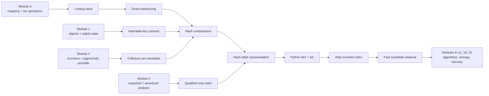
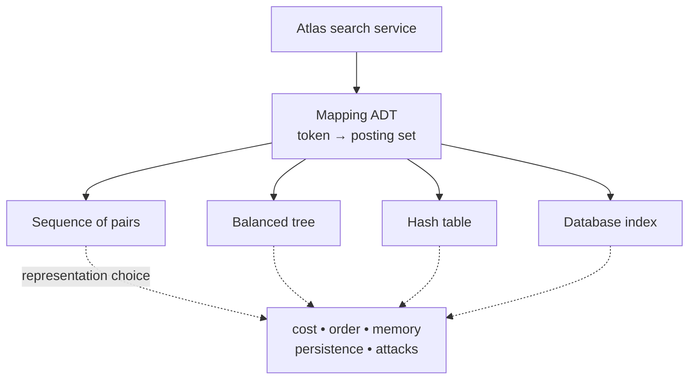
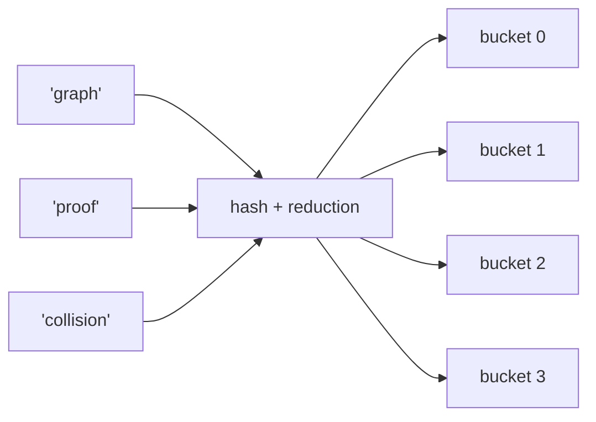
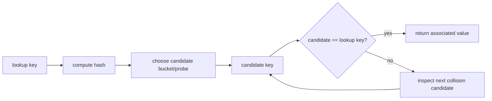
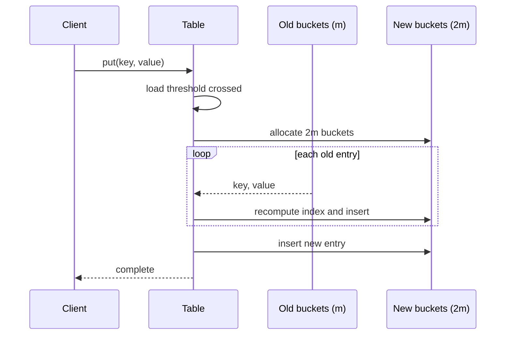
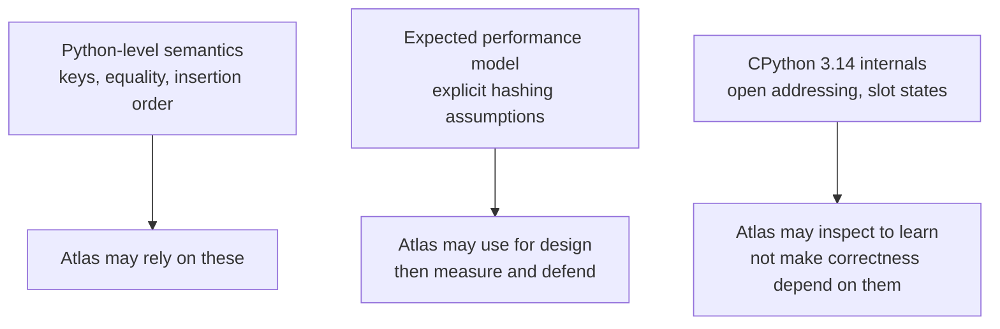
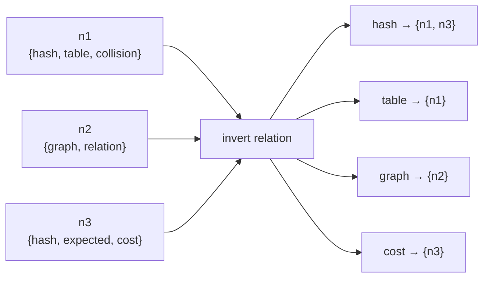
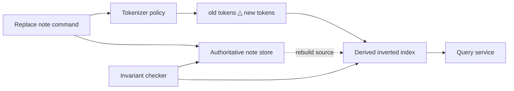
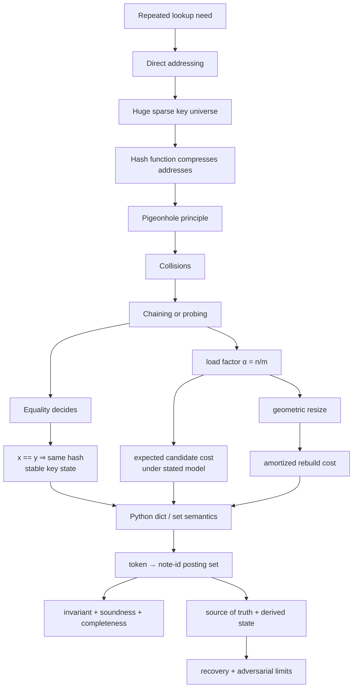

# Module 8 — Hashing, Dictionaries, Sets, and Indexing

## Position in the knowledge system

Atlas can now represent sequences, streams, contracts, graphs, and cost models. It still has a practical problem: a learner types `hash collision`, and Atlas must find matching notes without rereading every note.

This module asks:

> How can an arbitrary key guide us to a small candidate region, while equality—not the hash value—still decides whether we found the right key?

That question connects four earlier foundations:

- **Module 1 — values, identity, state, and mutation:** a key is an object whose equality-relevant state must remain stable while it is indexed;
- **Module 3 — abstraction, interfaces, and ADTs:** `dict` and `set` are operation contracts; a hash table is one possible representation;
- **Module 4 — sets, relations, functions, and proof:** a hash function maps a large key universe into a smaller index set, so collisions follow from the pigeonhole principle;
- **Module 5 — cost models:** expected, worst-case, and amortized claims answer different questions and require explicit assumptions.



Hashing is not introduced as punctuation such as `{}`. It is derived from a lookup requirement, proved correct under a key contract, analyzed under named assumptions, and then used as an architectural boundary.

## Claim-label legend

Hash-table discussions often mix mathematical models, Python semantics, and interpreter internals. This workbook marks the layer of each important claim.

| Label | Meaning | May client code depend on it? |
|---|---|---|
| **[LANGUAGE GUARANTEE]** | Behavior documented as Python semantics | Yes, within the stated Python version |
| **[ADT CONTRACT]** | Behavior Atlas promises through its own interface | Yes |
| **[ANALYTIC MODEL]** | A mathematical result under explicit assumptions | Only when those assumptions hold |
| **[CPYTHON 3.14 DETAIL]** | How the current CPython implementation works | No, unless Atlas deliberately targets and tests that implementation |
| **[ENGINEERING POLICY]** | A project choice, such as tokenization or empty-query behavior | Yes inside Atlas, but it is not a Python rule |

Keep this sentence visible:

> A useful performance expectation is not automatically a language guarantee, and an implementation detail is not automatically an application contract.

## Prerequisite retrieval

Answer without notes. Give one sentence of reasoning, not just a term.

1. **Module 1:** If two names refer to the same mutable object and one path mutates it, what can the other path observe?
2. **Module 1:** What is the difference between object identity and value equality?
3. **Module 3:** What must remain unchanged when an ADT swaps one internal representation for another?
4. **Module 3:** Why should clients ask a mapping for `value_for(key)` instead of reaching into its buckets?
5. **Module 4:** If a function maps 1,000 possible keys into 16 indices, why must two distinct keys share an index?
6. **Module 4:** What must be shown for both the soundness and completeness directions of a set-valued query?
7. **Module 5:** What information is missing from the claim “lookup is O(1)”?
8. **Module 5:** Why can one operation cost `Θ(n)` while the operation is still `Θ(1)` amortized over a sequence?

<details>
<summary>Retrieval check and repair route</summary>

1. Both names can observe the changed value because they resolve to references to the same object.
2. Identity asks whether two references designate the same object; equality asks whether their values satisfy the type's equality relation.
3. The externally visible operation contract and its invariants must remain stable.
4. Buckets are representation; exposing them couples clients to collision strategy, capacity, and resizing.
5. By the pigeonhole principle, more domain elements than codomain positions makes an injective mapping impossible.
6. Soundness: every returned item satisfies the query. Completeness: every item satisfying the query is returned.
7. It lacks the input measure, operation, case, probability or hashing assumptions, amortization status, and usually the implementation layer.
8. A resizing cost can be distributed across enough preceding or following cheap operations; amortized analysis bounds a whole legal sequence and needs no probability distribution.

Return briefly to:

- Module 1 if mutation and equality are blurred;
- Module 3 if interface and representation are blurred;
- Module 4 if functions, collisions, intersection, or two-direction proofs are unclear;
- Module 5 if expected and amortized reasoning are treated as synonyms.

</details>

## Mastery outcomes

By the end of this module, Michael can:

1. derive hashing from direct addressing and the sparse-key-universe problem;
2. distinguish a mapping or set interface from a hash-table representation;
3. trace lookup through hash computation, bucket selection, collision handling, and equality;
4. state and test `x == y ⇒ hash(x) == hash(y)`;
5. explain why the converse is false and why equality-relevant key state must stay stable;
6. distinguish immutable objects from objects whose hash-relevant state merely happens not to change;
7. calculate load factor and explain its relationship to expected candidate work;
8. distinguish expected, per-operation worst-case, and amortized operation costs;
9. explain why collision correctness and collision performance are separate concerns;
10. separate Python `dict`/`set` guarantees from CPython 3.14 implementation details;
11. explain why built-in `hash()` is neither a durable identifier nor a cryptographic digest;
12. build and query an inverted index;
13. give a soundness-and-completeness argument for conjunctive search;
14. design collision, replacement, empty-query, and adversarial tests;
15. read an indexing architecture and locate its source of truth, derived state, and consistency boundary;
16. specify a bounded indexing task for an agent and reject a patch whose evidence is insufficient.

---

## 1. The concrete observation: repeated scans do repeated work

Suppose Atlas stores notes as:

```python
notes = {
    "n1": "Hash tables resolve collisions with equality.",
    "n2": "A graph models prerequisite relationships.",
    "n3": "Expected cost needs a probability model.",
}
```

A direct search can scan every note:

```python
def scan_search(notes: dict[str, str], query: str) -> set[str]:
    wanted = query.casefold()
    return {
        note_id
        for note_id, text in notes.items()
        if wanted in text.casefold()
    }
```

### Predict before running

If there are `N` notes and the query is absent, how many note bodies must this implementation inspect? If the same query is repeated 100 times without changing the notes, which work is repeated?

The scan is not “bad” by definition. For a tiny corpus, it may be the simplest correct design. The pressure for an index appears when:

- the corpus is large;
- queries are frequent relative to updates;
- latency matters;
- the same token-to-note relationship would otherwise be rediscovered repeatedly.

An **index** stores selected relationships ahead of query time. It exchanges:

- additional storage;
- ingestion/update work;
- consistency obligations;

for less query-time search.

This is the same design pattern as a book index, a database index, a compiler symbol table, a cache directory, or a routing table. The details differ, but the architectural question repeats:

> Which relation is expensive to rediscover, and when should we materialize it?

## 2. Start with the operation family, not the representation

A finite mapping supports a relation from unique keys to values:

```text
put(key, value)
get(key)
contains(key)
delete(key)
iterate_items()
```

A finite set keeps unique elements:

```text
add(element)
contains(element)
remove(element)
union / intersection / difference
iterate()
```

These are **ADT operations**. Possible representations include:

- an unsorted sequence of pairs;
- a sorted array plus binary search;
- a balanced search tree;
- a trie;
- a direct-access array;
- a hash table;
- a database index.

Each representation supplies different order, cost, memory, persistence, and adversarial properties.



**[ADT CONTRACT]** Atlas search needs “retrieve the posting set for this canonical token.” It does not need “read bucket 7.” Buckets belong behind the boundary.

## 3. Direct addressing: lookup with no search

Imagine keys are integers from `0` through `U - 1`. Allocate an array of length `U` and place the value for key `k` at position `k`.

```text
key:       0       1       2       3       4       5
table:   [ · ]   [ A ]   [ · ]   [ · ]   [ B ]   [ · ]
                    ↑                       ↑
                 key 1                   key 4
```

Under a word-RAM cost model where indexing a machine-word-sized array position is constant time:

- lookup is worst-case `Θ(1)`;
- insert is worst-case `Θ(1)`;
- delete is worst-case `Θ(1)`;
- space is `Θ(U)`.

The problem is the universe size, not the operation logic. If the keys are all possible ten-character strings, the key universe is enormous even if Atlas stores only 5,000 of them.

Let:

- `U` be the number of possible keys;
- `n` be the number of stored keys;
- usually `n ≪ U`.

Direct addressing pays for `U`; Atlas wants space closer to `n`.

## 4. Hashing compresses the address space

Choose an array with `m` positions and a function:

`h : Key → {0, 1, ..., m - 1}`

The hash function turns a key into a candidate table index.



If the key universe has more than `m` elements, the pigeonhole principle says no such mapping can be injective. Some distinct keys must share a table index.

A **collision** occurs when:

`x ≠ y` but `table_index(x) = table_index(y)`.

Collisions are not exceptional bugs. They are a normal consequence of compressing a large universe into a smaller table.

### The first crucial distinction

The hash value is a route to candidates. Equality makes the final decision.



If an implementation stores only `hash(key)` and discards the original key, unequal colliding keys become indistinguishable. That is not a hash table with correct mapping semantics; it is a lossy grouping by integer.

## 5. Two collision-resolution families

### Separate chaining

Each array position points to a small collection of entries. Colliding entries coexist in that bucket.

```text
bucket 0  →  []
bucket 1  →  [("set", v₁)]
bucket 2  →  [("graph", v₂), ("proof", v₃)]
bucket 3  →  [("hash", v₄)]
```

Lookup:

1. compute the bucket index;
2. scan entries in that bucket;
3. compare stored keys for equality;
4. return only on equality.

### Open addressing

All entries live in the table array. When the initial position is occupied by a non-equal key, a probe rule chooses another position. Deletion needs a state that distinguishes “never occupied” from “formerly occupied,” or lookup may stop too soon.

```text
index       0          1          2          3          4
state     EMPTY      ACTIVE     DUMMY      ACTIVE     EMPTY
entry                  A                     B
```

The words **chaining** and **open addressing** name representation families. They do not change the mapping contract.

| Concern | Separate chaining | Open addressing |
|---|---|---|
| Where entries live | Bucket collections outside/alongside array slots | Directly in table slots |
| Collision walk | Entries in one bucket | Probe sequence through slots |
| Deletion issue | Remove from bucket | Usually needs tombstone/dummy logic |
| Locality | Extra indirection possible | Often strong array locality |
| Teaching implementation here | Yes | Trace and inspect only |
| CPython `dict` | No | **[CPYTHON 3.14 DETAIL]** open-addressed design |

We manually implement chaining because it exposes the invariants with little code. We inspect CPython separately so the teaching representation is never mistaken for Python's required representation.

## 6. The equality/hash contract

**[LANGUAGE GUARANTEE]** Python requires:

`x == y  ⇒  hash(x) == hash(y)`

Read the arrow in one direction.

- Equal objects must have equal hashes.
- Unequal objects are allowed to have equal hashes.
- Equal hashes do **not** prove equality.

Why the requirement? If equal lookup key `y` were routed to a different candidate region from stored key `x`, the table might never compare them and would incorrectly report absence.

### Stability while indexed

A hash table also relies on the key's hash remaining stable while the key is stored. Otherwise:

1. insertion places the key according to the old hash;
2. mutation changes the hash;
3. lookup starts from a different location;
4. the entry remains stranded at the old location.

The strongest everyday design is an immutable key whose equality and hash use the same immutable components.

```python
from dataclasses import dataclass


@dataclass(frozen=True)
class TopicKey:
    canonical: str

    @classmethod
    def from_text(cls, text: str) -> "TopicKey":
        return cls(" ".join(text.casefold().split()))
```

The generated equality and hash both use `canonical`, and `frozen=True` blocks normal field reassignment.

### Precise qualification

“Only immutable objects are hashable” is a useful beginner shortcut but not the complete rule.

- A user-defined object may be mutable in fields that do not participate in equality or hashing.
- What the table requires is stable hash/equality behavior while indexed.
- Immutability is the safest, easiest-to-review way to establish that stability.
- A tuple is hashable only when all of its elements are hashable.
- `frozenset` is hashable; mutable `set` is not.

### Intentionally broken key

Predict what invariant is violated before running:

```python
class MutableTopic:
    def __init__(self, slug: str) -> None:
        self.slug = slug

    def __eq__(self, other: object) -> bool:
        return isinstance(other, MutableTopic) and self.slug == other.slug

    def __hash__(self) -> int:
        return hash(self.slug)


key = MutableTopic("hashing")
locations = {key: "module-08"}
key.slug = "graphs"
```

After mutation, membership and retrieval are no longer behavior on which the program may rely. The stored entry was organized using a hash of `"hashing"`, while the same object now reports a hash of `"graphs"`.

The repair is not “rehash every time we look.” Prefer an immutable key and store mutable metadata as the value:

```python
locations: dict[TopicKey, dict[str, str]] = {
    TopicKey.from_text("Hashing"): {"module": "08", "status": "draft"}
}
```

### Python protects one common mistake

**[LANGUAGE GUARANTEE]** A class that defines value equality with `__eq__` but does not define `__hash__` becomes unhashable by default. This prevents identity hashing from silently disagreeing with value equality.

Do not restore a hash automatically. First ask:

1. Which fields define equality?
2. Can any of them change?
3. Will equal objects mix exactly the same components into their hashes?
4. Does the object actually need to be a key?

## 7. A lookup trace: collisions preserve correctness

Assume a teaching chained table has four buckets and the following test hash:

`index(key) = len(key) mod 4`

Insert `"set"`, `"map"`, and `"graph"`:

| Operation | Raw result | Bucket | Equality work | State afterward |
|---|---:|---:|---|---|
| put `"set"` | 3 | 3 | bucket empty | bucket 3 contains `"set"` |
| put `"map"` | 3 | 3 | `"set" != "map"` | bucket 3 contains both |
| put `"graph"` | 5 | 1 | bucket empty | bucket 1 contains `"graph"` |
| get `"map"` | 3 | 3 | compare `"set"`, then `"map"` | return `"map"` value |
| get `"cat"` | 3 | 3 | compare `"set"` and `"map"` | report missing |

The collision makes lookup do more equality checks, but it does not merge the keys. This separates two obligations:

- **correctness:** collision resolution must inspect candidates until equality succeeds or absence is established;
- **performance:** a good distribution should keep candidate work small under the chosen model.

Never trade away the first to improve the second.

## 8. Load factor and the expected-cost model

Let:

- `n` = number of stored entries;
- `m` = number of table positions;
- `α = n / m` = load factor.

For a chained table, `α` is the average number of entries per bucket. Average does not mean every bucket has that length: one bucket may hold many entries while others are empty.

### A qualified expected claim

**[ANALYTIC MODEL]** If the hash function is selected so that each unequal key pair has a small, controlled collision probability, and `m = Θ(n)`, then a chain examined for one key has expected constant length. Lookup is expected `Θ(1)` under the model that hashing and equality each cost `Θ(1)`.

Every clause matters:

- **expected over what?** Often over a random choice of hash function from a suitable family, not over “typical users”;
- **what is constant?** The model may assume key hashing and equality are constant, which is false for arbitrarily long strings unless length is separately bounded or parameterized;
- **which table state?** Load factor must be controlled;
- **which case?** Expected cost does not remove worst-case inputs or unlucky choices.

### Adversarial worst case

If `n` unequal keys all collide, a lookup may inspect `Θ(n)` candidates. A sequence of `n` insertions into a collision-heavy table can take `Θ(n²)` equality work.

That does not contradict expected constant time. These are different claims:

| Claim | Source of variation | Representative statement |
|---|---|---|
| Best case | Cheapest input/table state | target is first candidate |
| Expected | Named random process/distribution | expected chain length is `O(1)` |
| Worst case | Most expensive allowed input/state | all keys collide, lookup `Θ(n)` |
| Amortized | Cost over every allowed operation sequence | occasional resize spread over many updates |

“Average case” without a probability model is not a rigorous substitute for “expected.”

## 9. Resizing and amortized reasoning

As `n` grows while `m` stays fixed, load factor grows. A dynamic table therefore allocates a larger table and reinserts entries.

Why reinsert rather than copy each bucket to the same numerical index?

Because the reduction from a hash to a table position depends on `m`. For example:

`index = hash(key) mod m`

Changing `m` can change every index.



One resizing update can cost `Θ(n)`. If capacity grows geometrically, the total number of reinsertions across `n` successful updates is a geometric series:

`1 + 2 + 4 + ... < 2n`

**[ANALYTIC MODEL]** Resizing therefore contributes `Θ(1)` amortized movement per insertion. Combine this with the expected collision model and insertion is commonly described as **expected amortized `Θ(1)`**.

That phrase has two independent qualifiers:

- **expected** handles collision distribution;
- **amortized** handles occasional resizing.

Do not simplify it to “guaranteed constant time.”

## 10. Python `dict` and `set`: contract before internals

### Stable Python-level facts

**[LANGUAGE GUARANTEE]**

- A `dict` maps unique hashable keys to values.
- Equal keys address the same dictionary entry; for example, equal numeric keys such as `1` and `1.0` are interchangeable.
- Dictionary iteration preserves insertion order.
- Replacing a value for an existing key does not move that key.
- Deleting and reinserting a key places it at the end.
- `key in mapping` tests keys, not values.
- A `set` contains distinct hashable elements.
- `set` is mutable and unhashable; `frozenset` is immutable and hashable when its elements meet the requirement.
- Sets are unordered: Python does not promise insertion order or a stable iteration order.

```python
counts = {"hash": 1, "graph": 2}
counts["hash"] = 3

assert list(counts) == ["hash", "graph"]
assert "hash" in counts
assert 3 not in counts          # membership tests keys

distinct = {1, 1.0, True}
assert len(distinct) == 1       # these numeric values compare equal
```

### What the Python language does not promise

The language reference does not make general `dict`/`set` lookup complexity a semantic guarantee. Complexity tables are implementation-oriented expectations, not a substitute for a service latency requirement or adversarial analysis.

### Current CPython facts—inspect, do not couple

**[CPYTHON 3.14 DETAIL]**

- CPython's current `dict` uses open addressing rather than the chained representation built in this workbook.
- Its source distinguishes active, unused, and dummy/pending slot states.
- The current collision probe incorporates further hash bits.
- The implementation keeps spare capacity and resizes according to internal policies.
- Combined and split-table forms are implementation strategies used in different circumstances.

These facts help explain observed memory and probe behavior. Atlas must not inspect table capacity, depend on dummy-slot placement, reproduce the probe formula, or assume another Python implementation uses the same layout.



## 11. Hash randomization is not universal hashing or cryptography

**[LANGUAGE GUARANTEE / CPYTHON CONFIGURATION]** In standard Python builds, `str` and `bytes` hashes are salted with a process-specific unpredictable value by default. Their hashes remain stable within one process but are not intended to be predictable across process launches. `PYTHONHASHSEED` can request repeatable values for controlled testing.

Consequences:

- do not persist `hash(token)` as a durable identifier;
- do not send it across services as a protocol identity;
- do not expect set iteration order to repeat across launches;
- do not disable randomization in production merely to make a brittle test pass.

Randomization helps mitigate classes of collision-flooding attacks. It does not establish a worst-case constant-time guarantee, and it does not turn `hash()` into a cryptographic function.

| Tool | Purpose | Stable across runs? | Collision meaning |
|---|---|---:|---|
| Python `hash(x)` | organize hashed collections inside a process | Not generally | must still compare equality |
| Universal-hashing family in analysis | bound collision probability over random function choice | Defined by model | supports an expected bound |
| Cryptographic digest | integrity/content addressing/security properties | Usually deterministic by specification | collision resistance is a security property |
| Atlas canonical token | semantic identity chosen by application policy | Should be | equality of canonical form |

The security connection returns in Module 22: untrusted input can target resource consumption even when functional tests pass.

---

## 12. Mechanism-revealing implementation: a tiny chained map

This implementation is deliberately incomplete as a production container:

- no deletion;
- no iterator invalidation rules;
- no thread safety;
- no memory optimization;
- no attempt to copy CPython.

Its purpose is to expose four mechanisms: bucket routing, equality after collisions, load factor, and reinsertion during resize.

### Prediction

Before reading the methods, predict:

1. Where must the original key be stored?
2. When does replacing a value change `_size`?
3. Why must `_resize` call insertion logic again?
4. What happens if every key's hash is `0`?

```python
from __future__ import annotations

from collections.abc import Hashable, Iterator
from typing import Generic, TypeVar


K = TypeVar("K", bound=Hashable)
V = TypeVar("V")


class ChainedMap(Generic[K, V]):
    """Teaching map: separate chaining, no deletion."""

    def __init__(self, capacity: int = 4) -> None:
        if capacity < 1:
            raise ValueError("capacity must be positive")
        self._buckets: list[list[tuple[K, V]]] = [
            [] for _ in range(capacity)
        ]
        self._size = 0

    def __len__(self) -> int:
        return self._size

    def _bucket_index(self, key: K) -> int:
        return hash(key) % len(self._buckets)

    def __getitem__(self, key: K) -> V:
        bucket = self._buckets[self._bucket_index(key)]
        for stored_key, stored_value in bucket:
            if stored_key == key:
                return stored_value
        raise KeyError(key)

    def __setitem__(self, key: K, value: V) -> None:
        bucket = self._buckets[self._bucket_index(key)]

        for position, (stored_key, _) in enumerate(bucket):
            if stored_key == key:
                bucket[position] = (stored_key, value)
                return

        bucket.append((key, value))
        self._size += 1

        if self._size / len(self._buckets) > 0.75:
            self._resize(len(self._buckets) * 2)

    def _resize(self, new_capacity: int) -> None:
        old_items = list(self.items())
        self._buckets = [[] for _ in range(new_capacity)]
        self._size = 0
        for key, value in old_items:
            self[key] = value

    def items(self) -> Iterator[tuple[K, V]]:
        for bucket in self._buckets:
            yield from bucket
```

### Invariants

At every public-method boundary:

1. `_size` equals the total number of entries across all buckets.
2. Every stored entry `(k, v)` is in bucket `hash(k) % len(_buckets)`.
3. No two stored keys compare equal.
4. `m[key]` returns the value associated with the unique stored key equal to `key`, or raises `KeyError`.
5. Capacity is positive.

### Why this is a useful manual implementation

Type only the `_bucket_index`, collision scan, and replacement/append distinction by hand. Let an agent fill annotation or boilerplate only after you can trace:

- a non-colliding insertion;
- two unequal colliding insertions;
- replacement by an equal but non-identical key;
- the resize that changes bucket indices.

Manual construction is serving mechanism visibility, not typing endurance.

### Collision fixture

```python
from dataclasses import dataclass


@dataclass(frozen=True)
class CollisionKey:
    label: str

    def __hash__(self) -> int:
        return 7


table: ChainedMap[CollisionKey, int] = ChainedMap()
table[CollisionKey("graph")] = 1
table[CollisionKey("hash")] = 2

assert table[CollisionKey("graph")] == 1
assert table[CollisionKey("hash")] == 2
assert len(table) == 2
```

The constant hash is intentionally terrible for performance and excellent for correctness testing. It proves that the implementation does not confuse hash equality with key equality.

### Broken variant to diagnose

```python
def __getitem__(self, key: K) -> V:
    bucket = self._buckets[self._bucket_index(key)]
    if bucket:
        return bucket[0][1]
    raise KeyError(key)
```

This can pass tests with distinct buckets. It fails as soon as unequal keys collide because it never checks equality. A test suite with only ordinary strings may miss the defect.

---

## 13. Atlas application: an inverted index

An **inverted index** reverses the direction of a document relation.

Forward view:

```text
note id  →  tokens in that note
```

Inverted view:

```text
token  →  note ids containing that token
```



For query `hash cost`, intersect the posting sets:

`I["hash"] ∩ I["cost"] = {"n3"}`

### Atlas token policy

**[ENGINEERING POLICY]** This checkpoint uses:

- Unicode-aware `\w+` token matches;
- `casefold()` before matching;
- unique tokens per note;
- conjunctive (“all terms”) search;
- an empty query returns the empty set;
- note IDs are unique strings;
- the source note mapping remains authoritative;
- the index is derived and rebuildable.

Tokenization is not universal truth. A production search system must make decisions about punctuation, languages, stemming, stop words, phrases, and ranking. Keeping the policy explicit makes future changes reviewable.

### Minimal build and query

```python
from __future__ import annotations

import re
from collections.abc import Hashable, Iterable, Mapping
from typing import TypeVar


NoteId = str
Token = str
K = TypeVar("K", bound=Hashable)
TOKEN_PATTERN = re.compile(r"\w+", flags=re.UNICODE)


def tokenize(text: str) -> frozenset[Token]:
    return frozenset(TOKEN_PATTERN.findall(text.casefold()))


def build_postings(
    rows: Iterable[tuple[NoteId, Iterable[K]]],
) -> dict[K, set[NoteId]]:
    postings: dict[K, set[NoteId]] = {}
    for note_id, keys in rows:
        for key in set(keys):
            postings.setdefault(key, set()).add(note_id)
    return postings


def build_index(notes: Mapping[NoteId, str]) -> dict[Token, set[NoteId]]:
    return build_postings(
        (note_id, tokenize(text))
        for note_id, text in notes.items()
    )


def search_all(
    index: Mapping[Token, set[NoteId]],
    query: str,
) -> set[NoteId]:
    wanted = tokenize(query)
    if not wanted:
        return set()

    posting_sets = [index.get(token, set()) for token in wanted]
    posting_sets.sort(key=len)

    result = set(posting_sets[0])
    for posting_set in posting_sets[1:]:
        result.intersection_update(posting_set)
    return result
```

### Predict before executing

Given:

```python
notes = {
    "n1": "Hash tables keep keys and resolve collisions.",
    "n2": "Sets support fast membership under a hash model.",
    "n3": "Graphs model prerequisite relations.",
}
index = build_index(notes)
```

Predict:

1. `search_all(index, "hash")`
2. `search_all(index, "HASH sets")`
3. `search_all(index, "hash absent")`
4. `search_all(index, "")`
5. whether repeating `"hash hash"` changes the result

<details>
<summary>Reveal the trace</summary>

1. `{"n1", "n2"}` because both contain canonical token `hash`.
2. `{"n2"}` because conjunctive search intersects the `hash` and `sets` postings.
3. `set()` because the missing token has an empty posting set.
4. `set()` by the explicit Atlas policy.
5. No. `tokenize` returns a `frozenset`, so repeated query tokens collapse.

The exact order in the displayed sets is not part of the result contract.

</details>

### Why sort posting sets by size?

Intersection is associative and commutative, so order does not affect the mathematical result. Starting with the smallest posting set often reduces the size of intermediate results.

This is an optimization justified after correctness:

- semantic claim: the same sets are intersected;
- cost hypothesis: smaller intermediate candidates require fewer membership operations;
- evidence: analysis plus measurements on representative corpora;
- limitation: Python set operation costs remain implementation/model claims, not language timing guarantees.

## 14. Correctness argument for the inverted index

Let:

- `D` be the set of note IDs;
- `tokens(d)` be the token set produced for note `d`;
- `I[t]` be the posting set stored for token `t`.

### Representation invariant

For every token `t`:

`I[t] = { d ∈ D | t ∈ tokens(d) }`

In words:

> A note ID appears in a token's posting set exactly when the tokenization policy says that token occurs in the note.

### Build-loop argument

Loop invariant after processing some prefix `P` of the input notes:

`I[t] = { d ∈ P | t ∈ tokens(d) }` for every token `t`.

- **Initialization:** before processing notes, `P` is empty and all posting sets are absent/empty, so the invariant holds.
- **Maintenance:** processing note `d` adds `d` once to every posting set for `tokens(d)`. No other posting set changes, so the invariant now holds for `P ∪ {d}`.
- **Termination:** after all notes are processed, `P = D`; therefore the representation invariant holds for the entire corpus.

Using `set(keys)` inside `build_postings` is not required for final set semantics, because repeated `add(note_id)` is idempotent. It makes the “once per unique token” work explicit.

### Search theorem

For nonempty query-token set `Q`, define:

`search(Q) = ⋂(t ∈ Q) I[t]`

Claim:

`d ∈ search(Q) ⇔ Q ⊆ tokens(d)`

#### Soundness

Assume `d ∈ search(Q)`. By intersection membership, `d ∈ I[t]` for every `t ∈ Q`. By the index invariant, every such `t` belongs to `tokens(d)`. Therefore `Q ⊆ tokens(d)`.

#### Completeness

Assume `Q ⊆ tokens(d)`. Then every `t ∈ Q` belongs to `tokens(d)`. By the index invariant, `d ∈ I[t]` for every `t ∈ Q`. Therefore `d` belongs to their intersection and is returned.

The empty-query result is not derived from that theorem because the mathematical intersection of an empty family requires a chosen universe. Atlas deliberately returns `set()` to avoid interpreting a blank search as “return every note.”

## 15. Correctness and adversarial test suite

Tests should encode the contract, not the current bucket layout.

```python
def test_conjunctive_search_and_missing_token() -> None:
    notes = {
        "n1": "hash table collision",
        "n2": "hash expected cost",
        "n3": "graph expected cost",
    }
    index = build_index(notes)

    assert search_all(index, "hash") == {"n1", "n2"}
    assert search_all(index, "expected cost") == {"n2", "n3"}
    assert search_all(index, "hash cost") == {"n2"}
    assert search_all(index, "hash missing") == set()


def test_token_policy_and_empty_query() -> None:
    index = build_index({"n1": "Straße HASH hash"})

    assert search_all(index, "STRASSE") == {"n1"}
    assert search_all(index, "hash hash") == {"n1"}
    assert search_all(index, "") == set()


def test_collisions_do_not_merge_unequal_keys() -> None:
    graph = CollisionKey("graph")
    hashing = CollisionKey("hashing")

    postings = build_postings([
        ("n1", [graph]),
        ("n2", [hashing]),
    ])

    assert hash(graph) == hash(hashing)
    assert graph != hashing
    assert postings[graph] == {"n1"}
    assert postings[hashing] == {"n2"}


def test_equal_nonidentical_keys_share_one_entry() -> None:
    first = CollisionKey("hashing")
    second = CollisionKey("hashing")

    postings = build_postings([
        ("n1", [first]),
        ("n2", [second]),
    ])

    assert first == second
    assert first is not second
    assert len(postings) == 1
    assert postings[first] == {"n1", "n2"}
```

### Adversarial performance probe

Generate many unequal `CollisionKey` values, all returning the same hash. Verify correctness first, then count equality operations or measure growth in an isolated experiment.

Required conclusion:

> The table remains semantically correct, but collision-heavy lookup work grows linearly in the number of colliding keys for the chained teaching representation; this is a worst-case witness, not a claim about ordinary string inputs.

Do not set `PYTHONHASHSEED` to a constant and call ordinary strings “adversarial collisions.” A fixed seed provides reproducibility; it does not automatically generate colliding strings.

### Metamorphic properties

Useful properties that generate many tests:

- reordering input notes does not change posting-set membership;
- repeating a token within one note does not duplicate its note ID;
- case variants that canonicalize equally produce the same query result;
- adding a note that lacks every query token does not change that query's result;
- adding one required query token can only keep or shrink a conjunctive result;
- rebuilding from the unchanged source of truth yields an equivalent index.

## 16. Updates reveal an architecture problem

The simple builder is correct because it derives the entire index from a stable note snapshot. Incremental replacement introduces a consistency obligation.

Suppose note `n1` changes from `"hash graph"` to `"hash proof"`. Atlas must:

- retain `n1` in the `hash` posting;
- remove `n1` from the `graph` posting;
- add `n1` to the `proof` posting;
- remove any empty posting set if that is the representation policy.

Appending new postings without removing old ones creates false-positive search results.



### Code-reading studio: locate the failure window

```python
def replace_note(note_id: str, text: str) -> None:
    old_text = note_store.get(note_id)
    note_store.put(note_id, text)
    index.remove(note_id, tokenize(old_text))
    index.add(note_id, tokenize(text))
```

Read, do not run, then answer:

1. Which component is the source of truth?
2. What happens if `index.remove` raises after `note_store.put` succeeds?
3. Can retrying safely repair every partial state?
4. Which invariant detects a stale posting?
5. Would changing operation order eliminate all failure windows?

Changing order moves the window; it does not create atomicity. For this in-memory checkpoint, acceptable policies include:

- rebuild the derived index after any failed update;
- compute a new snapshot and swap the complete index reference only after success;
- keep reverse postings `note_id → tokens` and make an idempotent repair operation.

Durable atomic updates return in Module 16 with database transactions. The important architectural insight now is:

> An index is derived state. Faster reads create synchronization work and a recovery policy.

## 17. Code and architecture reading studio

### Part A — Recover the contract from code

Read this unfamiliar fragment:

```python
class SearchService:
    def __init__(self, notes: NoteReader, index: PostingReader) -> None:
        self._notes = notes
        self._index = index

    def search(self, raw_query: str) -> list[Note]:
        ids = self._index.match_all(tokenize(raw_query))
        return [
            note
            for note_id in ids
            if (note := self._notes.get(note_id)) is not None
        ]
```

Reconstruct:

- the direction of each dependency;
- which component owns canonical query semantics;
- whether result order is specified;
- how a stale ID is handled;
- which costs belong to hash lookups and which may be I/O;
- what must be added if ranking becomes a requirement.

Do not infer a guarantee from a type name. Find evidence in protocols, tests, and caller assumptions.

### Part B — Trace representation-independent behavior

Compare these possible `PostingReader` adapters:

1. `dict[str, set[str]]` in memory;
2. sorted posting lists loaded from a file;
3. a database table indexed on `(token, note_id)`;
4. a remote search service.

All can implement “notes matching all tokens,” but their:

- update boundaries;
- latency profiles;
- serialization;
- consistency models;
- ordering behavior;
- adversarial limits

differ. The domain contract should state what callers need and avoid promising current representation accidents.

### Part C — Read a suspicious optimization

```python
def match_all(tokens: set[str]) -> set[str]:
    if not tokens:
        return set()
    smallest = min(tokens, key=lambda token: len(index[token]))
    result = index[smallest]          # suspicious alias
    for token in tokens - {smallest}:
        result.intersection_update(index[token])
    return result
```

The code mutates the posting set stored in the index because `result` aliases it. A query changes future query results.

Repair:

```python
result = set(index.get(smallest, set()))
```

Also replace direct `index[token]` access when missing tokens should mean no matches rather than `KeyError`.

This bug joins three earlier ideas:

- Module 1: aliasing and mutation;
- Module 3: representation invariant;
- Module 5: optimization must preserve semantics.

## 18. Agent specification: delegate a bounded implementation

Give an agent this brief after you can defend every clause:

> Implement the Module 8 Atlas inverted-index checkpoint behind `PostingIndex`. Preserve the existing note store as source of truth. Use the documented Unicode `\w+` plus `casefold()` token policy, unique tokens per note, conjunctive search, and empty-query-is-empty behavior. Provide a full rebuild and an idempotent replace operation. Keep posting sets private and never return mutable internal aliases. Do not persist Python `hash()` results, depend on set iteration order, inspect CPython table state, or add external packages. Include soundness/completeness notes, type annotations, and tests for missing tokens, repeated terms, case folding, replacement/removal, equal-but-nonidentical keys, deliberately colliding unequal keys through a generic posting builder, and rebuild equivalence. Add an adversarial collision experiment separated from the deterministic test suite. Report expected, worst-case, and amortized claims with assumptions; do not label them Python guarantees.

### Required patch shape

- one interface/protocol for query-facing operations;
- one in-memory implementation;
- one pure tokenizer;
- one rebuild path;
- tests that encode semantics, not bucket layout;
- a short design note;
- no unrelated refactor.

### Required evidence

The agent must provide:

1. test command and complete result;
2. static/type-check result if that tool already exists in the project;
3. one trace of replacement before/after;
4. one collision test proving unequal keys remain separate;
5. one failed test or explained mutation that demonstrates the mutable-alias regression;
6. a complexity table with assumptions attached;
7. changed-file list and reason for every file.

## 19. Patch-review studio: reject a plausible wrong implementation

An agent proposes:

```diff
- postings.setdefault(token, set()).add(note_id)
+ postings.setdefault(hash(token), set()).add(note_id)
```

The rationale says, “Integers are faster and a hash uniquely identifies a token.”

### Review before revealing the critique

Identify at least four distinct problems. Classify each as:

- semantic correctness;
- durability/reproducibility;
- security/performance;
- architecture/maintainability.

<details>
<summary>Reveal the instructor review</summary>

1. **Semantic correctness:** unequal tokens may have the same hash. Their posting sets would be merged, causing false-positive results.
2. **Semantic correctness:** the original key is discarded, so equality cannot resolve a collision.
3. **Durability:** hashes for strings are deliberately not stable across normal process launches; persisted integer keys would not be a durable token identity.
4. **Architecture:** callers can no longer enumerate or explain canonical tokens from the index.
5. **Security reasoning:** treating collisions as impossible erases the exact adversarial case the design must tolerate.
6. **Performance reasoning:** the existing `dict` already hashes string keys internally. Pre-hashing adds no sound asymptotic improvement and may worsen clarity or duplicate work.
7. **Evidence failure:** ordinary happy-path tests may pass. A constant-hash unequal-key fixture is required.

The correct design stores canonical tokens as keys and lets the mapping representation use both hashing and equality.

</details>

### Review rubric

| Dimension | Reject when | Acceptable evidence |
|---|---|---|
| Semantics | query behavior is implicit or changed | executable contract tests |
| Key model | equality/hash fields differ or can mutate | immutable key design plus contract test |
| Collision safety | hash equality is treated as key equality | deliberate collision fixture |
| Cost claims | “O(1)” appears without qualifiers | case, probability, amortization, key-cost assumptions |
| Python layer | set order or CPython slots become API | only documented semantics in client tests |
| Mutation safety | internal posting sets escape | alias-regression test |
| Updates | stale postings possible with no recovery policy | rebuild/idempotency evidence |
| Scope | indexing patch rewrites unrelated architecture | bounded changed-file set |

## 20. Six-session interactive teaching sequence

Each session alternates explanation with prediction, tracing, design, and defense. No lecture block introduces more than one abstraction jump without learner action.

### Session 1 — Why lookup creates an index

**Retrieve:** Module 3 ADTs and Module 5 cost models.  
**Launch:** compare repeated full-note scans with a precomputed token relation.  
**Derive:** mapping operation family, direct addressing, key universe `U`, stored count `n`, and the sparse-space failure.  
**Learner action:** identify three real systems that materialize a relation and name their update/read tradeoff.  
**Trace:** direct-address lookup for a small integer universe.  
**Exit claim:** explain why hashing is a response to direct addressing's space cost, not magic search.

### Session 2 — Hashing, collisions, and equality

**Retrieve:** Module 4 functions and pigeonhole principle.  
**Launch:** map six distinct keys into four table positions.  
**Derive:** hash route, candidate region, collision, chaining, open addressing, and equality confirmation.  
**Learner action:** trace two unequal colliding keys through insertion, successful lookup, and missing lookup.  
**Debug:** reject the broken implementation that returns the first bucket value.  
**Exit claim:** state why collision is inevitable but incorrect lookup is not.

### Session 3 — Keys are behavioral contracts

**Retrieve:** Module 1 identity, equality, aliasing, and mutation.  
**Launch:** inspect `MutableTopic` before and after changing `slug`.  
**Derive:** `x == y ⇒ hash(x) == hash(y)`, the false converse, and stable equality-relevant state.  
**Learner action:** classify tuples, lists, frozen records, mutable records, `set`, and `frozenset` under explicitly chosen fields.  
**Repair:** redesign a mutable key into immutable identity plus mutable value metadata.  
**Exit claim:** explain why “hashable” is a contract over time, not merely “`hash(x)` ran once.”

### Session 4 — Cost without overclaiming

**Retrieve:** Module 5 expected versus amortized analysis.  
**Launch:** inspect one balanced table and one constant-hash table.  
**Derive:** `α = n/m`, expected candidate length, adversarial worst case, geometric resize cost, and expected-amortized composition.  
**Learner action:** attach the missing assumptions to five “constant-time” claims.  
**Investigation:** count equality calls using `CollisionKey`.  
**Exit claim:** state an honest lookup/insertion cost sentence that separates distribution, collision, resize, and key-length assumptions.

### Session 5 — From Python semantics to an Atlas inverted index

**Retrieve:** Module 4 set intersection and proof directions.  
**Launch:** invert three note-to-token relationships by hand.  
**Derive:** language guarantees versus CPython details, token policy, postings, conjunctive query, and empty-query policy.  
**Learner action:** predict five queries, then prove soundness and completeness from the representation invariant.  
**Debug:** repair the aliasing optimization that mutates a stored posting set.  
**Exit claim:** explain which facts Atlas can rely on across Python implementations.

### Session 6 — Architecture, adversaries, and agent review

**Retrieve:** source of truth, derived state, and failure windows.  
**Launch:** interrupt an incremental note replacement after each line.  
**Derive:** rebuildability, idempotency, consistency boundary, hash randomization, and collision-flooding risk.  
**Learner action:** write the bounded agent brief, inspect the generated patch, run semantic and adversarial tests, and reject the `hash(token)`-as-key change.  
**Oral defense:** defend the index using correctness, cost, mutation safety, recovery, and implementation-layer boundaries.  
**Exit artifact:** Atlas milestone 8 evidence packet.

## 21. Eight-level problem ladder

### Level 1 — Recognize

For twelve snippets, label:

- mapping/set ADT operation;
- representation detail;
- equality requirement;
- probabilistic assumption;
- Python guarantee;
- CPython detail.

**Evidence:** every label includes one sentence explaining the layer.

### Level 2 — Trace

Trace a four-bucket chained table through:

- two non-colliding inserts;
- two unequal colliding inserts;
- an equal-key replacement;
- a missing lookup;
- a resize.

Record hash, old/new bucket, equality comparisons, `_size`, and invariant status after each transition.

### Level 3 — Map

Recover the Atlas search architecture from protocols and call sites. Draw:

- note source of truth;
- tokenizer;
- posting index;
- query service;
- rebuild path;
- dependency direction;
- consistency boundary.

Mark which edges are domain calls and which may cross I/O boundaries.

### Level 4 — Modify

Change the query contract from “all tokens” to support both:

- `match_all`;
- `match_any`.

Preserve empty-query policy and prove each result using intersection/union semantics. Do not duplicate tokenization.

### Level 5 — Debug and defend

Diagnose three failures:

1. mutable key loses reliable retrieval;
2. collision-blind bucket lookup returns the wrong value;
3. query optimization mutates an internal posting set.

For each, provide the smallest counterexample, repair, regression test, and invariant restored.

### Level 6 — Design and delegate

Write an agent specification for idempotent note replacement. State:

- preconditions/postconditions;
- source of truth;
- token policy;
- invariant;
- failure/recovery behavior;
- forbidden dependencies on Python internals;
- bounded file scope;
- required evidence.

### Level 7 — Review and verify

Review the agent patch. Run:

- contract tests;
- deliberate-collision tests;
- rebuild-equivalence property;
- alias/mutation regression;
- a collision-heavy growth experiment.

Challenge every cost claim and classify it as guarantee, expected model, amortized model, worst case, or measurement.

### Level 8 — Transfer

Choose two systems and explain the same structure:

- compiler symbol table;
- database secondary index;
- web cache key;
- duplicate-file detector;
- memoization table;
- network routing table;
- access-control membership set.

For each, identify the key equality policy, index relation, update/read tradeoff, failure mode, adversarial input, and why Python `hash()` should or should not cross the process boundary.

The final transfer response must reconnect to Atlas: state which design idea transfers unchanged and which is domain-specific.

---

## 22. Understanding check — confidence-aware multiple choice

For every question:

1. choose an answer;
2. record **low**, **medium**, or **high** confidence;
3. write one sentence naming the decisive invariant or assumption;
4. only then open the explanation.

The distractors diagnose specific mental models; they are not trivia traps.

### Question 1 — Direction of the contract

Which statement must hold for Python hashable keys `x` and `y`?

A. If `hash(x) == hash(y)`, then `x == y`.  
B. If `x == y`, then `hash(x) == hash(y)`.  
C. Unequal objects must have different hashes.  
D. Identical objects may change their hash while stored.

<details>
<summary>Reveal answer, rationales, and connection</summary>

**Answer: B.**

Equal lookup keys must be routed compatibly so equality can find the stored entry.

- **A** reverses the implication; collisions make the reverse false.
- **C** demands an injective hash over a larger universe, which is generally impossible.
- **D** breaks stable routing while the key is indexed.

**Misconception signal:** choosing A or C treats a hash as a unique identity.  
**Connection:** Module 4 implication direction; Module 16 durable IDs must not be built from process-local hashes.

</details>

### Question 2 — Mutable key state

A key's hash and equality both depend on its mutable `slug`. The key is inserted into a dictionary and then `slug` changes. What is the best analysis?

A. The dictionary automatically moves the entry to its new bucket.  
B. Retrieval remains guaranteed because the object's identity did not change.  
C. The key contract is violated; lookup may route differently from where the entry was stored.  
D. Mutation is safe if the dictionary has fewer than eight entries.

<details>
<summary>Reveal answer, rationales, and connection</summary>

**Answer: C.**

The table organized the entry using the earlier hash/equality state and is not notified about arbitrary field mutation.

- **A** invents an observer/reindex mechanism.
- **B** substitutes identity for the class's value equality contract.
- **D** confuses table size with semantic stability.

**Misconception signal:** choosing B means Module 1 identity and equality need retrieval.  
**Connection:** immutable domain identifiers keep caches, indexes, and database keys coherent.

</details>

### Question 3 — What resolves a collision?

Two unequal keys have the same hash and initial bucket. What must a correct mapping implementation do?

A. Treat them as the same key because hashes match.  
B. Reject one because a bucket may hold only one semantic key.  
C. Use a collision strategy and compare candidate keys for equality.  
D. Recompute the same hash until it changes.

<details>
<summary>Reveal answer, rationales, and connection</summary>

**Answer: C.**

Chaining or probing finds candidates; equality distinguishes keys.

- **A** loses information and creates false matches.
- **B** abandons mapping semantics.
- **D** misunderstands stable hashing within a process.

**Misconception signal:** A equates a routing hint with identity.  
**Connection:** many indexes first generate candidates, then apply an exact predicate.

</details>

### Question 4 — Honest complexity

Which is the strongest justified general statement for a dynamically resized hash table under a suitable randomized hashing model, controlled load factor, and constant-cost hash/equality?

A. Every lookup and insertion is worst-case `Θ(1)`.  
B. Lookup is expected `Θ(1)`, insertion expected amortized `Θ(1)`, while collision-heavy or resizing operations can be slower.  
C. Lookup is amortized `Θ(1)` solely because strings are immutable.  
D. Hash-table operations are `Θ(log n)` because every search is comparison-based.

<details>
<summary>Reveal answer, rationales, and connection</summary>

**Answer: B.**

Expected reasoning addresses collisions; amortized reasoning spreads resizing cost.

- **A** erases collision and resize worst cases.
- **C** confuses key stability with distribution and amortization.
- **D** applies a comparison-model lower bound after hashing introduced a stronger addressing operation.

**Misconception signal:** A blends expected, amortized, and worst-case claims.  
**Connection:** Module 5's qualifiers become security-relevant under untrusted inputs.

</details>

### Question 5 — Resize reasoning

Why are entries reinserted when a hash table's capacity changes?

A. Equality changes after allocation.  
B. The original keys have become mutable.  
C. Reducing a hash to a table index depends on capacity, so an entry's destination may change.  
D. Reinsertion guarantees that no future collisions occur.

<details>
<summary>Reveal answer, rationales, and connection</summary>

**Answer: C.**

For a rule such as `hash(key) % m`, changing `m` changes possible positions.

- **A** confuses object semantics with representation.
- **B** is neither required nor repaired by resizing.
- **D** is impossible in general and not the purpose of resize.

**Misconception signal:** D assumes spare capacity eliminates the pigeonhole problem.  
**Connection:** Module 5 geometric-growth amortization; Module 16 migrations likewise rebuild derived placement under a new representation.

</details>

### Question 6 — Guarantee or implementation detail?

Which statement is safe for portable Python application logic to rely on?

A. CPython uses a particular perturbation formula for dictionary probes.  
B. A dictionary iterates keys in insertion order.  
C. A set iterates values in insertion order.  
D. Every dictionary lookup is language-guaranteed worst-case constant time.

<details>
<summary>Reveal answer, rationales, and connection</summary>

**Answer: B.**

Insertion order for dictionaries is a documented language guarantee.

- **A** is a CPython implementation detail.
- **C** contradicts the unordered set contract.
- **D** turns a performance expectation into semantics and ignores adversarial worst cases.

**Misconception signal:** A or D couples the program to a current implementation layer.  
**Connection:** Module 3's representation independence and Module 24's CPython-specific optimization studies.

</details>

### Question 7 — Inverted-index correctness

The invariant is `I[t] = {d | t ∈ tokens(d)}`. For nonempty query tokens `Q`, Atlas returns `⋂(t ∈ Q) I[t]`. Which statement follows?

A. A returned note contains at least one query token.  
B. A returned note contains every query token, and every note containing every query token is returned.  
C. Results are automatically ranked by relevance.  
D. The query is correct only when no two tokens collide.

<details>
<summary>Reveal answer, rationales, and connection</summary>

**Answer: B.**

Intersection plus the invariant gives both soundness and completeness for conjunctive search.

- **A** describes union/“any term” semantics and is too weak.
- **C** adds an ordering/ranking contract not represented by sets.
- **D** ignores collision resolution by equality.

**Misconception signal:** A blurs union and intersection; C invents order from membership.  
**Connection:** Module 4 set algebra proves Module 8 query behavior; Module 9 can later add ranking/order deliberately.

</details>

### Question 8 — Reviewing an AI-generated “optimization”

An agent changes the posting-map key from `token` to `hash(token)` and proposes persisting the map. What is the decisive objection?

A. Integers cannot be dictionary keys.  
B. Hashing a string always raises `TypeError`.  
C. Unequal tokens can collide, original-key equality is lost, and string hashes are not durable across normal process runs.  
D. The change is correct if the current tests pass once.

<details>
<summary>Reveal answer, rationales, and connection</summary>

**Answer: C.**

The patch breaks semantic collision handling and durability assumptions at once.

- **A** is false; integers are hashable.
- **B** is false; strings are hashable.
- **D** mistakes weak evidence for correctness and misses adversarial cases.

**Misconception signal:** D indicates over-trust in generated code and happy-path tests.  
**Connection:** later security and persistence modules require identities whose meaning survives hostile input and process restarts.

</details>

### Diagnostic interpretation

- Miss Q1 or Q3: redraw “hash narrows; equality decides.”
- Miss Q2: return to Module 1's identity/equality/mutation trace.
- Miss Q4 or Q5: return to Module 5 and write separate expected and amortized arguments.
- Miss Q6: use the claim-label table on five statements from Python documentation/source.
- Miss Q7: rebuild the search theorem from the index invariant.
- Miss Q8: add deliberate collision and cross-process reasoning to the patch-review checklist.
- High confidence + wrong: record the hidden assumption that made the distractor attractive and create one minimal counterexample.
- Low confidence + right: explain the answer orally before counting it as retrieval mastery.

## 23. TA guide

### Likely misconceptions

- a hash is a unique ID;
- equal hash values imply equal objects;
- collisions indicate a broken hash table;
- Python compares only hashes during lookup;
- any immutable-looking object is automatically hashable;
- a tuple is always hashable;
- mutable key state is safe because object identity stays fixed;
- “expected `O(1)`” means worst-case or language-guaranteed constant time;
- expected and amortized are interchangeable;
- resizing removes collisions permanently;
- a larger table alone guarantees good distribution;
- `dict` and `set` have the same ordering guarantees;
- current CPython layout is the Python language definition;
- `PYTHONHASHSEED=0` is a production optimization;
- Python `hash()` is suitable for persistence or cryptographic integrity;
- an inverted index is authoritative data rather than rebuildable derived state;
- set intersection automatically supplies ranking;
- passing ordinary-string tests proves collision correctness;
- a faster query justifies mutating an internal posting set.

### Diagnostic questions

1. “If I give you the hash, can you reconstruct or uniquely identify the key?”
2. “At what exact step does equality run?”
3. “Which implication does Python require? Read the arrow aloud.”
4. “What field changed between insertion and lookup?”
5. “Expected over which random choice?”
6. “Amortized over which sequence?”
7. “What is `n`, what is `m`, and what does `α` average?”
8. “Is that sentence a Python guarantee, a CPython detail, or an analytic model?”
9. “What is the source of truth if an update stops halfway?”
10. “Show soundness, then completeness—do not merge the directions.”

### Staged hint ladder

Use the first hint that restores progress; do not reveal the whole solution at once.

1. Circle the requested ADT operation.
2. Draw the full key universe and the smaller table index set.
3. Apply the pigeonhole principle.
4. Draw `key → hash → candidate → equality`.
5. Place two unequal keys in the same bucket.
6. Mark equality/hash-relevant fields on the object.
7. Write `x == y ⇒ hash(x) == hash(y)` and test the converse separately.
8. Write `α = n/m`; then construct both balanced and one-bucket states with the same `α`.
9. Separate collision cost from resize cost.
10. State the inverted-index invariant in set notation.
11. Prove one direction at a time.
12. Finally inspect the generated code and tests.

### Minimal counterexamples

#### Hash equality does not imply key equality

```python
class AlwaysSeven:
    def __init__(self, value: str) -> None:
        self.value = value

    def __hash__(self) -> int:
        return 7

    def __eq__(self, other: object) -> bool:
        return isinstance(other, AlwaysSeven) and self.value == other.value
```

#### Immutable container with unhashable content

```python
hash((1, 2))       # works
hash((1, []))      # TypeError
```

#### Query mutates index through alias

```python
postings = {"hash": {"n1", "n2"}}
result = postings["hash"]
result.clear()
assert postings["hash"] == set()
```

#### Expected does not mean worst case

Insert `n` unequal `AlwaysSeven` keys and count equality calls.

#### Set order is not a contract

A test asserting `list({"a", "b"}) == ["a", "b"]` is invalid even if it passes locally.

### Required regression tests

Do not accept the Atlas checkpoint without:

- equal, non-identical keys address one entry;
- unequal, equal-hash keys remain distinct;
- mutation cannot affect production key identity;
- missing token yields no matches rather than accidental exception;
- repeated/case-equivalent terms obey token policy;
- all-term intersection is sound and complete on a hand-checkable corpus;
- empty query follows explicit policy;
- query does not mutate posting sets;
- replacement removes stale terms and adds new terms;
- rebuild from source equals incremental state;
- collision-heavy inputs preserve semantics;
- no test asserts set iteration order or CPython bucket behavior.

### Return to prerequisites when

- object references, aliasing, equality, or mutation cannot be traced → **Module 1**;
- interface and representation are treated as one thing → **Module 3**;
- function direction, pigeonhole reasoning, set operations, or proof directions are unclear → **Module 4**;
- expected, worst-case, amortized, or input-size assumptions are blurred → **Module 5**.

### TA intervention protocol

1. Ask for a prediction before execution.
2. Reduce to two keys and four buckets.
3. Make the keys collide deliberately.
4. Ask the learner to point to the equality comparison.
5. Restore the invariant in plain language.
6. Translate it to notation or a test.
7. Return to the Atlas architecture only after the small trace is sound.

Do not solve a collision bug by suggesting a “better hash” first. That can hide a correctness defect. Correct collision handling must work even under a terrible hash.

## 24. Atlas checkpoint 8 — evidence packet

Produce one coherent checkpoint, not a collection of unrelated exercises.

### Required artifacts

1. **Lookup derivation:** scan → direct addressing → sparse-universe problem → hashing → collision resolution.
2. **Key-contract note:** equality/hash implication, stability over time, immutable production key design.
3. **Mechanism trace:** `ChainedMap` with collision, equal replacement, missing lookup, and resize.
4. **Index implementation:** tokenizer, generic posting builder, full rebuild, conjunctive query.
5. **Correctness argument:** representation invariant, build-loop argument, soundness, completeness, and explicit empty-query policy.
6. **Architecture diagram:** source of truth, derived index, query path, rebuild/recovery path.
7. **Test evidence:** semantics, deliberate collisions, aliasing, replacement, adversarial inputs, and rebuild equivalence.
8. **Cost note:** expected, adversarial worst-case, resize-amortized, key-length, and space claims.
9. **Agent brief and review:** bounded specification, generated patch, review memo, and one rejected unsupported claim.
10. **Oral defense:** a five-minute explanation without notes.

### Mastery evidence

| Capability | Evidence that counts | Evidence that does not yet count |
|---|---|---|
| Explain | derive need and mechanism from first principles | recite “dict is fast” |
| Trace | show candidate route and equality under collision | show only final output |
| Correctness | invariant plus soundness/completeness | happy-path examples only |
| Cost | qualify expected, amortized, worst, and key costs | bare `O(1)` |
| Architecture | identify source, derived state, and failure window | list class names |
| Debug | minimal counterexample and regression test | change hash function until test passes |
| Delegate | bounded brief with constraints/evidence | “build an index” |
| Review | reject semantic and evidentiary defects | accept because tests are green |
| Transfer | map model to another index/cache/table | name another use of dictionaries |

### Oral-defense prompts

1. Why is a collision not a correctness failure by itself?
2. Why does the equality/hash implication point in only one required direction?
3. What exactly is random in your expected-cost claim?
4. Which cost is amortized and why?
5. Which Atlas behaviors are language guarantees versus engineering policy?
6. Why is the note store authoritative and the index rebuildable?
7. How do your tests expose a collision bug that normal examples might miss?
8. Why would persisting `hash(token)` corrupt the design?

### Instructor decision rule

Advance when Michael can:

- reconstruct hashing from the lookup/space problem;
- trace and defend collision correctness;
- reject a mutable or equality-inconsistent key;
- state honest qualified costs;
- prove the inverted query result;
- distinguish Python semantics from CPython internals;
- direct and review an agent using adversarial evidence.

Fast manual typing, memorized method names, or a passing happy-path demo are not mastery.

## 25. Consolidation

### One-page concept map



### Before / now reflection

Complete:

- Before this module, I thought a hash was ...
- Now I can explain why a hash only ...
- The assumption most often hidden inside “constant lookup” is ...
- The Python behavior I may depend on is ...
- The CPython behavior I may inspect but not make an Atlas contract is ...
- The index invariant I would use during a code review is ...
- The adversarial test I will now ask an agent to include is ...

### Spaced retrieval

- **After 2 days:** draw `key → hash → candidate → equality` and give a colliding counterexample.
- **After 1 week:** derive expected-amortized insertion from collision and resize assumptions; do not use notes.
- **After 3 weeks:** prove conjunctive index search sound and complete, then locate the consistency boundary in a database-backed variant.

### Portfolio update

Save:

- the final architecture diagram;
- the collision trace;
- correctness proof;
- test output;
- agent brief;
- patch-review memo;
- one performance plot clearly labeled as measurement rather than proof;
- misconception log update.

## Backward and forward connections

### Backward

- **Module 1:** key stability is a concrete consequence of identity, equality, references, and mutation.
- **Module 3:** mapping/set operations remain stable while representations change.
- **Module 4:** hash functions, pigeonhole collisions, set intersection, and two-direction proof give the mathematical skeleton.
- **Module 5:** load factor, expected cost, amortized resizing, and adversarial worst cases make performance claims precise.

### Forward

- **Module 9:** sorting and ordered indexes provide capabilities hashing does not, including range and order queries.
- **Module 10:** graph adjacency commonly uses dictionaries of sets; its cost analysis inherits this module's assumptions.
- **Module 11:** memoization and dynamic programming use keys that encode subproblem identity.
- **Module 12:** type protocols can express read-only mapping interfaces without exposing representation.
- **Module 13:** property-based tests can generate equality/hash and rebuild-equivalence cases.
- **Module 16:** database indexes add persistence, transactions, query planning, and recovery to the same materialized-relation idea.
- **Module 17:** memory hierarchy explains why two representations with similar asymptotic claims behave differently.
- **Module 19:** concurrent indexing adds ownership, locking, snapshots, and race-free publication.
- **Module 22:** collision flooding, input limits, canonicalization, and durable identifiers enter the threat model.
- **Module 24:** CPython source reading and profiling revisit dictionary layout as implementation-specific evidence.
- **Module 25:** compiler symbol tables reuse mapping contracts, scopes, and stable semantic keys.

## Sources and further study

These sources were triangulated to separate language contract, algorithmic model, and implementation.

### Official Python semantics

- [Python 3.14 Data Model — `object.__hash__`](https://docs.python.org/3.14/reference/datamodel.html#object.__hash__) — equality/hash requirement, mutable equality-based objects, and hash randomization notes.
- [Python 3.14 Built-in Types — mapping type `dict`](https://docs.python.org/3.14/library/stdtypes.html#mapping-types-dict) — documented mapping behavior and insertion-order guarantee.
- [Python 3.14 Built-in Types — `set` and `frozenset`](https://docs.python.org/3.14/library/stdtypes.html#set-types-set-frozenset) — unordered set semantics, uniqueness, and hashability.
- [Python 3.14 command-line and environment — `PYTHONHASHSEED`](https://docs.python.org/3.14/using/cmdline.html#envvar-PYTHONHASHSEED) — process hash seeding and reproducibility controls.

### University algorithm sequence

- [MIT 6.006 Introduction to Algorithms, Spring 2020](https://ocw.mit.edu/courses/6-006-introduction-to-algorithms-spring-2020/) — undergraduate data-structure and algorithm sequence.
- [MIT 6.006 Lecture 4: Hashing notes](https://ocw.mit.edu/courses/6-006-introduction-to-algorithms-spring-2020/ce9e94705b914598ce78a00a70a1f734_MIT6_006S20_lec4.pdf) — direct addressing, pigeonhole collisions, universal hashing, load factor, and expected-amortized analysis.

### Open rigorous reference

- [Open Data Structures, Chapter 5: Hash Tables](https://opendatastructures.org/ods-python/5_1_ChainedHashTable_Hashin.html) by Pat Morin — a mathematically analyzed chained representation and resizing.
- [Open Data Structures, §5.3: Hash Codes](https://opendatastructures.org/ods-python/5_3_Hash_Codes.html) — equality-compatible hash-code construction for compound values.
- [Athabasca University Press: Open Data Structures](https://www.aupress.ca/books/120226-open-data-structures/) — publication context and open-access text.

### CPython implementation study

- [CPython 3.14 `Objects/dictobject.c`](https://github.com/python/cpython/blob/3.14/Objects/dictobject.c) — current open-addressed dictionary implementation, slot states, probing, and representation commentary. Read this as versioned implementation evidence, not as the Python language contract.

## Instructor synthesis

The module has one connected argument:

1. repeated lookup motivates stored relationships;
2. direct addressing removes search but wastes a sparse universe;
3. hashing compresses addresses and therefore creates collisions;
4. collision resolution preserves candidates, while equality preserves meaning;
5. stable equality/hash state makes lookup coherent over time;
6. controlled load plus a probability model supports expected cost;
7. geometric resizing supports amortized cost;
8. Python supplies mapping/set semantics, while CPython supplies one revisable representation;
9. an inverted index materializes `token → notes`;
10. invariants, proofs, adversarial tests, and patch review turn that mechanism into trustworthy Atlas architecture.

The durable mental model is:

> Hashing chooses where to look; equality decides what was found; an index stores a relation early so later queries can inspect fewer candidates.
