# Module 9 — Trees, Heaps, Sorting, and Ordered Search

> **Central idea:** a hash index answers “which item has this exact identity?”; ordered structures answer “what comes first, next, nearest, or under this prefix?”

> **Mastery claim:** “I can recover the ordering question a client is asking, select a representation from its operations, trace and defend its invariant, coordinate identity and priority indexes safely, and review generated code without mistaking a Python guarantee for a CPython detail.”

Module 8 gave Atlas fast identity- and term-based lookup under a qualified hashing model. That capability is necessary, but it cannot efficiently answer:

- Which review is due first?
- What is the next title after `"graph"`?
- Which titles begin with `"rec"`?
- Can all records be emitted in key order?
- How should equal-priority records be ordered?

These are not five unrelated tricks. They all require Atlas to make **order** explicit.

Most work in this module is code reading, tracing, invariant recovery, architectural diagnosis, design, agent direction, patch review, and verification. Manual coding is restricted to a small tree operation, a rotation, and heap repair because those mechanisms are difficult to see through a mature library call.

---

## How to use this workbook

For each substantial example:

1. write the client question without naming a container;
2. identify the ordering key and duplicate policy;
3. predict the next comparison or structural change;
4. state the invariant before inspecting the repair;
5. name the height, movement, or output term that controls cost;
6. label Python, CPython, and course-model claims;
7. inspect the tests before accepting the implementation.

### Evidence labels

| Label | Meaning | Safe use |
|---|---|---|
| **[PYTHON 3.14 GUARANTEE]** | Documented language or standard-library behavior | Portable application code may rely on it within the stated version |
| **[CPYTHON 3.14.6 OBSERVATION]** | Behavior or code in the pinned reference implementation | Useful for learning and measurement; not a portable contract |
| **[COURSE MODEL]** | A deliberately small mathematical or executable representation | Use for mechanism, proof, and asymptotic analysis under stated assumptions |
| **[ATLAS POLICY]** | A product decision, such as tie-breaking or title normalization | Atlas clients may rely on it after it is documented and tested |

Keep this boundary visible:

> The priority-queue interface is not a heap; a heap is not a sorted sequence; and a current CPython implementation is not the definition of Python.

---

## 1. Position in the knowledge graph

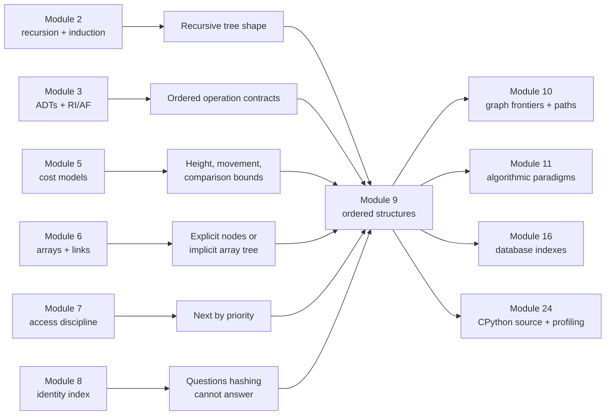

### The problem that forces this module

Module 8's mapping can retrieve `record_by_id["m9"]` with expected constant-time lookup under its stated model. But a hash table deliberately does not arrange keys by their comparison order.

Suppose Atlas has:

```text
id   due minute   title
c7      540       "Queues and demand"
c2      120       "Recursive definitions"
c9      120       "Tree invariants"
c4      360       "Hash-table costs"
```

An exact-key dictionary can find `c9`. It does not, by itself, reveal:

- the minimum due minute;
- the next greater due minute;
- all records between minutes 120 and 400;
- titles starting with `"Tree"`;
- a stable order for `c2` and `c9`.

Scanning or sorting on every request is sometimes acceptable. Repeated ordered queries create pressure to retain an ordered representation.

### The Atlas checkpoint

Atlas will add two coordinated capabilities:

1. **ReviewScheduler:** return the currently active review with minimum `(priority, revision)` using a heap, while a dictionary remains the identity index.
2. **TitlePrefixIndex:** retrieve concept IDs whose normalized titles share a prefix using a trie model.

The checkpoint explicitly handles a difficult engineering fact:

> Updating priority creates coordinated state. A dictionary answers “which entry is current?” while a heap answers “which candidate is smallest?” Old heap entries can remain physically present but must be logically stale.

This checkpoint extends the Arc II pipeline rather than replacing it:

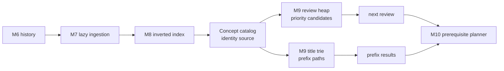

### Backward connections

| Earlier module | Retrieved idea | Use here |
|---|---|---|
| Module 2 | recursive definition, base case, structural induction | define trees and prove traversal/search properties |
| Module 3 | interface before representation; RI and AF | separate ordered-set and priority-queue behavior from BST/heap/trie storage |
| Module 5 | explicit input, case, and primitive costs | express operations in terms of height, comparisons, movements, and output size |
| Module 6 | contiguous slots versus linked objects | contrast node trees with an implicit array heap |
| Module 7 | restricted access policy | replace FIFO “oldest” with priority “smallest key” |
| Module 8 | hash-based identity lookup and derived indexes | coordinate a dictionary with a heap; derive a prefix index from the catalog |

### Capabilities unlocked next

- Module 10 will use heaps as graph frontiers and dictionaries/sets as state indexes.
- Module 11 will reuse merge-sort recurrence reasoning, heap selection, and lower-bound assumptions.
- Module 13 will turn tree/heap invariants into property- and model-based tests.
- Module 16 will compare in-memory search trees with durable B-tree-family indexes.
- Module 17 will explain locality differences between pointer trees and array heaps.

---

## 2. Prerequisite retrieval

Answer without execution. Record one-sentence reasoning and confidence.

### Retrieval A — recursive shape

A tree node contains zero or more child trees. What are the base case and smaller subproblems in a recursive traversal? Why does a finite-tree argument need a progress measure?

### Retrieval B — abstraction

Two priority queues expose `add`, `peek_min`, and `remove_min`. One uses a sorted list and the other a heap. Are they different interfaces or different representations of one interface? What may a client observe?

### Retrieval C — qualified cost

Why is “BST lookup is `O(log n)`” not generally valid? Which structural parameter should appear first?

### Retrieval D — representation

In an array representation of a complete binary tree, are the payload objects necessarily contiguous, or are the array entries allowed to be references to objects elsewhere?

### Retrieval E — access discipline

How does a priority queue differ from a FIFO queue when items arrive in order `A, B, C` but have priorities `5, 1, 3`?

### Retrieval F — identity and order

Why can Atlas reasonably keep both `dict[id, record]` and a heap of priority entries? What different client question does each answer?

### Retrieval G — amortization and stale state

If an update appends a new heap entry and marks the old one stale instead of deleting it in place, what additional space must be accounted for?

### Retrieval H — proof

For a sorting algorithm, why are “output is nondecreasing” and “output is a permutation of input” separate correctness obligations?

<details>
<summary>Check the prerequisite model and route repairs</summary>

- **A:** an empty tree is the base case; each child subtree is smaller, usually by node count. A decreasing measure establishes termination. Return to Module 2 if recursive syntax is clear but the inductive structure is not.
- **B:** they are two representations of the same priority-queue interface when observable behavior and promised failures match. Costs become observable only if the contract promises them. Return to Module 3 if fields or library names are being treated as the abstraction.
- **C:** operations follow a root-to-leaf path of length proportional to tree height `h`; an unbalanced BST can have `h = n-1`. Return to Module 5 if a case or structural assumption disappears from a complexity claim.
- **D:** the array positions are contiguous; their referenced payload objects need not be. Return to Module 6 for the slots/references/object-graph distinction.
- **E:** FIFO returns `A` because it arrived first; a min-priority queue returns `B` because priority `1` is smallest, subject to the declared tie policy. Return to Module 7 if “next” is being inferred from a drawing rather than the access law.
- **F:** the dictionary finds current state by identity; the heap selects a minimum candidate. Neither operation contract implies the other. Return to Module 8 if a hash table is being treated as ordered.
- **G:** stale entries remain retained until popped or rebuilt; space can grow with updates rather than active items unless compaction is specified.
- **H:** a sorted output could omit, duplicate, or invent values; permutation preserves multiplicity while nondecreasing order establishes arrangement. Return to Module 4 for conjunctions and two-part correctness claims.

</details>

---

## 3. Mastery outcomes

By the end, Michael can:

1. derive ordered structures from client operations hashing cannot supply;
2. specify key extraction, comparison direction, duplicate behavior, and tie policy;
3. define tree, root, edge, parent, child, leaf, ancestor, descendant, depth, height, subtree, and path precisely;
4. translate between a recursive tree definition, object graph, traversal, and inductive argument;
5. state and preserve the binary-search-tree ordering invariant;
6. trace search, insertion, minimum, successor reasoning, and in-order traversal;
7. express BST costs as `Θ(h)` and explain degeneration to `Θ(n)`;
8. explain why balance controls height and how AVL rotations preserve in-order key order;
9. distinguish an ordered-set interface from a BST representation;
10. distinguish a priority-queue interface from a binary-heap representation;
11. derive parent/child array indices for a complete binary tree;
12. trace sift-up and sift-down while preserving the heap invariant;
13. explain why `heapify` can be linear even though repeated insertion is `Θ(n log n)`;
14. coordinate dictionary identity state with stale heap candidates safely;
15. state sorting correctness, stability, time, space, and adaptivity requirements;
16. read insertion, merge, and heap sort and recover the mechanism and invariant;
17. explain the comparison-sorting `Ω(n log n)` lower-bound intuition and its assumptions;
18. explain how bounded integer keys permit linear-sorting methods to escape that comparison bound;
19. use `sorted`, `list.sort`, `key`, `reverse`, `bisect`, and `heapq` without inventing guarantees;
20. derive trie prefix search from shared key prefixes and qualify its `O(prefix length + visited output)` model;
21. recover Atlas's scheduler and prefix-index architecture, failure windows, and source-of-truth decisions;
22. direct an agent through a bounded change and independently verify its patch.

---

## 4. Start with the ordered question, not the tree

Hashing from Module 8 creates a candidate region from equality-compatible keys. It does not maintain comparison order. Before choosing a structure, classify the client operation.

| Client question | Abstract operation | Important output/order |
|---|---|---|
| “Give me concept `c9`.” | `find(key)` | exact equality |
| “What is due first?” | `find_min()` / `remove_min()` | one extremal key |
| “What follows key `k`?” | `successor(k)` | next greater key |
| “Which due times fall in `[a,b]`?” | `range(a,b)` | ordered subset |
| “Emit everything by title.” | `iter_ordered()` | global nondecreasing order |
| “Which titles begin with `pre`?” | `complete(prefix)` | shared symbol path |
| “Sort this one snapshot.” | `sort(iterable)` | a new ordered sequence |

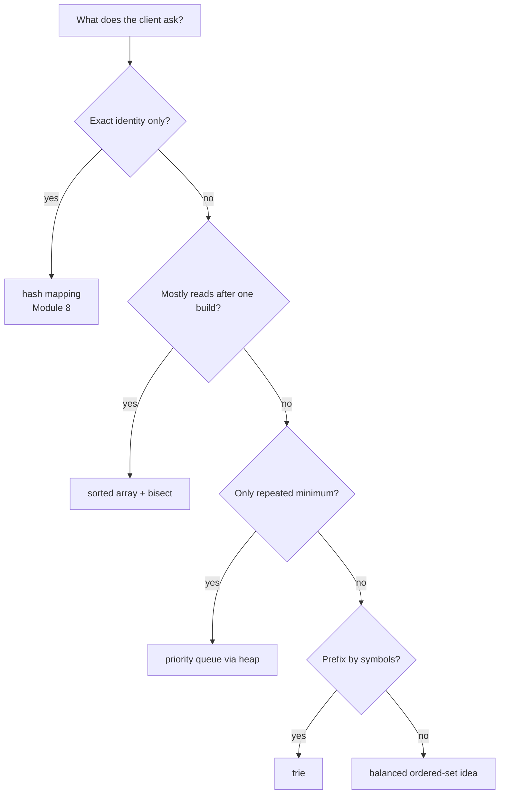

The arrows are starting points, not universal answers. Memory, update rate, persistence, concurrency, adversarial inputs, and library availability can change a decision.

### Operation comparison under course models

| Representation | Exact find | Insert | Remove min | Ordered iteration | Range / successor | Prefix |
|---|---:|---:|---:|---:|---:|---:|
| hash table | expected `Θ(1)` | expected amortized `Θ(1)` | `Θ(n)` scan | `Θ(n log n)` extra sort | `Θ(n)` scan | `Θ(n)` scan |
| sorted array | `Θ(log n)` | `Θ(n)` movement | `Θ(n)` if front shifts | `Θ(n)` | `Θ(log n + k)` | binary-search bounds plus output |
| BST of height `h` | `Θ(h)` | `Θ(h)` | `Θ(h)` | `Θ(n)` | `Θ(h + k)` | not naturally character-prefix based |
| binary heap | `Θ(n)` arbitrary find | `Θ(log n)` | `Θ(log n)` | destructive `Θ(n log n)` | not supported efficiently | not supported |
| trie | `Θ(L)` by symbol key | `Θ(L)` | no priority meaning | subtree-dependent | lexicographic with policy | `Θ(p + z)` model |

`k` is range output count, `L` is key length, `p` is prefix length, and `z` is the visited output/subtree work. Expected hash costs retain Module 8's assumptions. Trie costs assume symbol transition access is constant under a stated child-map model.

---

## 5. Ordering is a contract

### 5.1 Key extraction separates records from comparison

Atlas records are not “naturally ordered” for every purpose. The client supplies an ordering key:

```python
from dataclasses import dataclass
from datetime import datetime


@dataclass(frozen=True)
class Review:
    concept_id: str
    due_at: datetime
    difficulty: int
    title: str


def review_priority(review: Review) -> tuple[datetime, int, str]:
    return (review.due_at, -review.difficulty, review.concept_id)
```

The tuple policy means:

1. earlier due time first;
2. for equal due times, greater difficulty first;
3. for a remaining tie, concept ID ascending.

That is **[ATLAS POLICY]**, not a property of review objects or heaps.

### 5.2 State all four ordering decisions

Before implementing, answer:

1. **Key:** what comparison value is extracted?
2. **Direction:** minimum or maximum first; ascending or descending?
3. **Equality:** do equal keys replace, coexist, or combine?
4. **Tie:** if equal keys coexist, is arrival order or another field observable?

An “ordered collection” without these decisions is underspecified.

### 5.3 Strict weak ordering intuition

The algorithms here fundamentally need comparisons to behave coherently:

- an item is not less than itself;
- if `a < b` and `b < c`, then `a < c`;
- “neither is less” forms consistent equivalence classes for sorting.

Python objects need not all compare with one another. A heterogeneous list such as `[1, "1"]` raises `TypeError` under ordinary sorting in Python 3.14. A `key=` function can project records into a mutually comparable domain.

### 5.4 Mutation of ordering state

If a record is placed in a BST or heap according to a mutable field and that field changes in place, the representation can become invalid without any structural operation running.

```python
priority_entry = [120, "c9"]
heap = [priority_entry]
priority_entry[0] = 900  # ordering-relevant state changed behind the heap
```

Safe designs include:

- immutable ordering entries;
- remove-and-reinsert through the owning ADT;
- lazy replacement with a versioned current-state index;
- hiding all mutation authority behind the component.

This is Module 8's stable-key lesson applied to comparison order.

---

## 6. Trees are recursively nested paths

### 6.1 Precise vocabulary after the need

A **rooted tree** is either empty or consists of one root joined to disjoint child subtrees.

- **node / vertex:** one stored position;
- **edge:** a parent-child connection;
- **root:** the only node with no parent;
- **leaf:** a node with no children;
- **ancestor / descendant:** nodes earlier/later on a parent-child path;
- **subtree:** a node together with all descendants reached below it;
- **depth of a node:** number of edges from root to that node;
- **height of a node:** maximum number of edges from that node to a descendant leaf;
- **height of a tree:** height of its root; use `-1` for the empty tree in this workbook.

State the edge-versus-node convention because some texts count height in nodes.

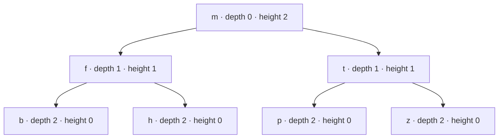

The path from `m` to `h` has two edges. The subtree rooted at `f` contains `f`, `b`, and `h`.

### 6.2 Recursive representation

```python
from __future__ import annotations

from dataclasses import dataclass
from typing import Generic, TypeVar


K = TypeVar("K")
V = TypeVar("V")


@dataclass
class TreeNode(Generic[K, V]):
    key: K
    value: V
    left: TreeNode[K, V] | None = None
    right: TreeNode[K, V] | None = None
```

**[COURSE MODEL]** Each `TreeNode` is an ordinary Python object with references to child nodes. Nodes need not be adjacent in memory. A tree shape is therefore both:

- a recursive mathematical value;
- a reachable object graph with a no-sharing/no-cycle invariant for this model.

### 6.3 Traversal order is an algorithm, not the shape

For a binary node:

- pre-order: node, left, right;
- in-order: left, node, right;
- post-order: left, right, node.

```python
def inorder(node: TreeNode[K, V] | None) -> list[tuple[K, V]]:
    if node is None:
        return []
    return inorder(node.left) + [(node.key, node.value)] + inorder(node.right)
```

Prediction: for the displayed tree, which key sequence does in-order traversal produce?

It produces `b, f, h, m, p, t, z`. The tree shape alone does not make that sequence sorted; the BST invariant introduced next does.

### 6.4 Correctness by structural induction

To prove a traversal visits every node exactly once:

1. **Base:** an empty tree visits nothing exactly once.
2. **Inductive hypotheses:** each recursive call visits every node in its child subtree exactly once.
3. **Step:** child subtrees are disjoint and the algorithm handles the root exactly once, so their union is the whole tree with no duplication.

This proof depends on the tree representation forbidding cycles and shared child nodes. In a general graph, Module 10 adds explicit visited state.

### 6.5 Cost

If each of `n` nodes is reached once:

- traversal time is `Θ(n)`;
- recursive call-stack space is `Θ(h)`;
- the returned list above uses `Θ(n)` output space but repeated list concatenation can add avoidable copying.

A generator traversal can yield in order with `Θ(h)` stack state and no input-sized output list unless the consumer materializes it. That reconnects Module 7.

---

## 7. Binary-search trees turn order into a path choice

### 7.1 Representation invariant and abstraction function

For a BST with unique keys:

**RI**

1. the reachable structure is finite, acyclic, and has no shared child node;
2. every key in a node's left subtree is less than the node key;
3. every key in a node's right subtree is greater than the node key;
4. keys are unique; inserting an equal key replaces its value in this model.

**AF**

`AF(root)` is the finite mapping formed by every reachable `(key, value)` pair. Tree shape and node identity are absent from the abstract value.

The invariant makes one comparison discard an entire subtree:

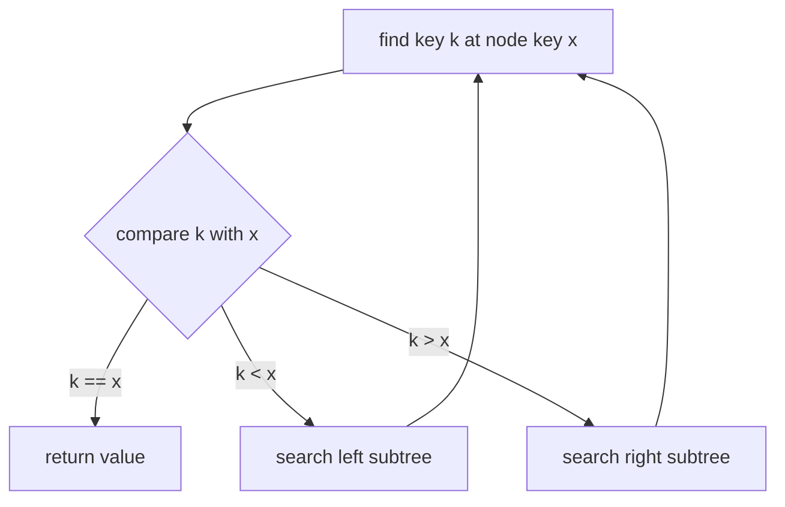

### 7.2 Minimal executable model

Predict the in-order result and final value for key `"heap"` before running:

```python
def bst_put(
    node: TreeNode[str, str] | None,
    key: str,
    value: str,
) -> TreeNode[str, str]:
    if node is None:
        return TreeNode(key, value)
    if key < node.key:
        node.left = bst_put(node.left, key, value)
    elif node.key < key:
        node.right = bst_put(node.right, key, value)
    else:
        node.value = value
    return node


def bst_get(node: TreeNode[str, str] | None, key: str) -> str:
    cursor = node
    while cursor is not None:
        if key < cursor.key:
            cursor = cursor.left
        elif cursor.key < key:
            cursor = cursor.right
        else:
            return cursor.value
    raise KeyError(key)


root: TreeNode[str, str] | None = None
for key, value in [
    ("tree", "shape"),
    ("heap", "priority"),
    ("sort", "order"),
    ("array", "position"),
    ("trie", "prefix"),
]:
    root = bst_put(root, key, value)

root = bst_put(root, "heap", "minimum")

assert [key for key, _ in inorder(root)] == [
    "array", "heap", "sort", "tree", "trie"
]
assert bst_get(root, "heap") == "minimum"
```

### 7.3 Search correctness

Loop invariant for `bst_get`:

> If the requested key exists in the original tree, it exists in the subtree rooted at `cursor`.

- Initially, `cursor` is the root.
- If `key < cursor.key`, the BST invariant excludes the current node and entire right subtree; only the left subtree can contain the key.
- The symmetric argument holds for `cursor.key < key`.
- Equality returns the associated value.
- Reaching `None` proves no legal remaining location exists.

### 7.4 Minimum, maximum, and successor

- minimum: follow `left` until no left child remains;
- maximum: follow `right` until no right child remains;
- successor of a node with a right subtree: minimum of that right subtree;
- otherwise: the lowest ancestor for which the node lies in the ancestor's left subtree.

The last case needs parent references, an ancestor stack, or a search from the root. An API that promises `successor` must account for how that evidence is retained.

### 7.5 Cost is controlled by height

Search and insertion follow at most one root-to-leaf path:

- time `Θ(h)` in the course model;
- iterative search uses `Θ(1)` auxiliary space;
- recursive insertion uses `Θ(h)` call-stack space.

If height is `Θ(log n)`, operations are logarithmic. If height is `n-1`, they are linear. The structure, not the word “tree,” determines the claim.

### Intentionally broken insertion

```python
if key < node.key:
    node.right = bst_put(node.right, key, value)  # wrong direction
```

The inserted item is still reachable, and some equality lookups may pass. The earliest failure is the BST invariant: a smaller key enters a right subtree. A contract test must check ordered traversal or the invariant, not only insertion count.

---

## 8. Degeneration forces a balancing idea

Insert keys in this order:

```text
1, 2, 3, 4, 5
```

An ordinary BST becomes:

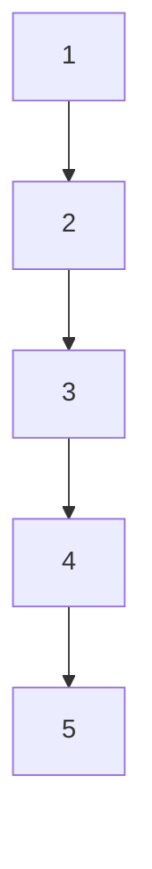

It is semantically a valid BST but structurally a linked chain. Search for `5` takes five node visits.

### Height facts

For `n` nodes:

- minimum possible height is `Θ(log n)`;
- maximum possible height is `n-1`;
- a complete or carefully balanced binary tree has logarithmic height;
- insertion order alone can make an unbalanced BST degenerate.

“Expected logarithmic” can be justified under a named random insertion model, but it is not a worst-case guarantee.

### Balance is an additional representation invariant

A balanced-tree family restricts allowed shapes while preserving the ordered-set abstraction. Different families choose different restrictions:

- AVL: child heights differ by at most one at every node;
- red-black: color/path constraints bound height;
- B-tree family: many keys/children per node, designed around storage blocks;
- randomized treap: priorities probabilistically shape the tree.

This workbook reveals AVL rotations because they make the repair mechanism visible. It does not require a full production AVL implementation.

---

## 9. AVL rotations are local rewrites with global obligations

### 9.1 AVL invariant

With empty-tree height `-1`, define:

`balance(node) = height(node.left) - height(node.right)`.

An AVL tree maintains:

1. the BST ordering invariant;
2. `balance(node) ∈ {-1, 0, 1}` at every node;
3. cached heights, if stored, equal `1 + max(child heights)`.

The height restriction yields `h = Θ(log n)`, so path operations remain logarithmic.

### 9.2 A left rotation

Before:

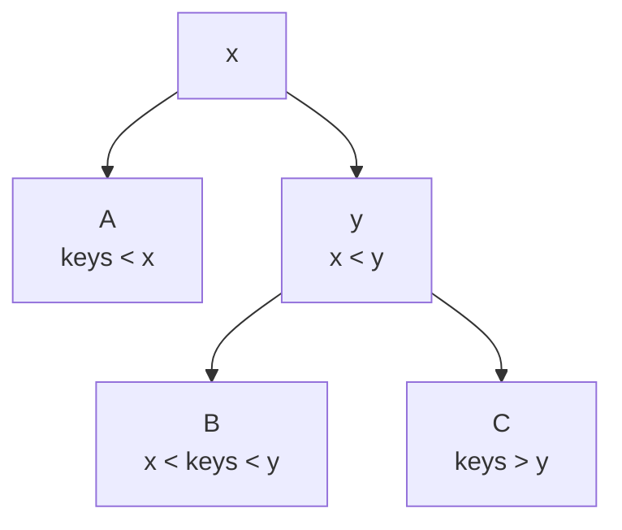

After rotating left at `x`:

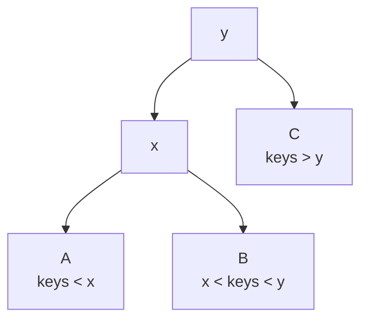

The in-order sequence remains:

`A, x, B, y, C`.

That equality of in-order sequences is the core order-preservation argument. References and cached metadata must also be repaired.

### 9.3 Mechanism-revealing rotation

```python
@dataclass
class AVLNode:
    key: int
    left: AVLNode | None = None
    right: AVLNode | None = None
    height: int = 0


def avl_height(node: AVLNode | None) -> int:
    return -1 if node is None else node.height


def refresh_height(node: AVLNode) -> None:
    node.height = 1 + max(avl_height(node.left), avl_height(node.right))


def rotate_left(x: AVLNode) -> AVLNode:
    y = x.right
    if y is None:
        raise ValueError("left rotation requires a right child")

    middle = y.left
    y.left = x
    x.right = middle

    refresh_height(x)  # former root is now lower
    refresh_height(y)
    return y
```

Prediction:

```python
x = AVLNode(10)
x.right = AVLNode(20)
x.right.right = AVLNode(30)
refresh_height(x.right)
refresh_height(x)

new_root = rotate_left(x)
```

What are `new_root.key`, `new_root.left.key`, and the in-order sequence? They are `20`, `10`, and `[10, 20, 30]`.

### 9.4 Why update order matters

After the reference rewrite, `x` is lower than `y`. Refreshing `y` first would compute from `x`'s stale height. Local pointer correctness and cached-metadata correctness are separate obligations.

### 9.5 Four imbalance shapes

| Heavy path | Repair |
|---|---|
| left-left | rotate right |
| right-right | rotate left |
| left-right | rotate left on child, then right on node |
| right-left | rotate right on child, then left on node |

Do not memorize the table without drawing the three ordered regions. The repair must:

1. preserve the BST in-order sequence;
2. reconnect every subtree exactly once;
3. update heights bottom-up;
4. reconnect the rotated subtree to its former parent;
5. continue checking ancestors whose heights may have changed.

### Intentionally broken rotation

```python
def broken_rotate_left(x: AVLNode) -> AVLNode:
    y = x.right
    assert y is not None
    y.left = x
    x.right = y.left
    return y
```

After `y.left = x`, the expression `y.left` is now `x`; assigning it to `x.right` creates a cycle. The missing temporary for the middle subtree is not cosmetic. The shortest useful regression:

- use three nodes with a nonempty middle subtree;
- compare in-order keys before/after;
- verify reachable node identities are unchanged and unique;
- check no cycle;
- check all heights and AVL balance.

---

## 10. Sorted arrays and `bisect`: cheap search, expensive movement

A sorted array stores global order directly in positions.

Binary search maintains a candidate interval. Each comparison removes roughly half:

```text
[0 ................................ n)
             compare middle
[0 ........ mid)       or       (mid ........ n)
```

Under random indexed access:

- exact search or insertion-point search takes `Θ(log n)` comparisons;
- inserting into a Python list still moves a suffix and takes `Θ(n)` time;
- ordered iteration is `Θ(n)` with strong contiguous-reference locality;
- range output can begin at a binary-searched boundary and then emit `k` results.

### Python 3.14 `bisect` guarantees

**[PYTHON 3.14 GUARANTEE]**

- `bisect_left(a, x)` returns an insertion position whose left slice is `< x` and right slice is `>= x`.
- `bisect_right(a, x)` places the boundary after existing equal elements.
- `insort_*` locates a position and then calls list insertion.
- a `key=` function can extract comparison keys for array elements; read the exact rule for whether it is applied to the search value.
- the functions use ordering comparisons rather than equality searches.

The official performance note states that `insort`'s logarithmic search is dominated by the linear insertion step.

### Prediction

```python
from bisect import bisect_left, bisect_right


values = [10, 20, 20, 20, 30]
assert bisect_left(values, 20) == 1
assert bisect_right(values, 20) == 4
```

The half-open range `[1, 4)` identifies all entries equal to `20`. That same boundary idea supports ranges and prefix bounds in sorted text, though a trie supplies a different tradeoff.

### Broken use

```python
titles = ["Arrays", "hashing", "Trees"]
position = bisect_left(titles, "queues")
```

The list is not sorted under the same case-sensitive comparison used by `bisect_left`, so the insertion-point postcondition does not apply. “Looks alphabetic” is not an invariant.

---

## 11. A priority queue keeps only enough order to choose the next item

### 11.1 Interface before representation

A min-priority queue supports:

```text
add(item, priority)
peek_min() -> minimum active item
remove_min() -> remove and return minimum active item
is_empty()
```

It does **not** promise:

- arbitrary item lookup;
- complete sorted iteration without destructive work;
- stability for equal priorities unless specified;
- efficient in-place priority update;
- a tree-shaped public representation.

Possible representations:

| Representation | Add | Peek min | Remove min |
|---|---:|---:|---:|
| unsorted array | `Θ(1)` | `Θ(n)` | `Θ(n)` |
| sorted array | `Θ(n)` | `Θ(1)` | depends on chosen end |
| balanced BST | `Θ(log n)` | `Θ(log n)` or `Θ(1)` with min pointer | `Θ(log n)` |
| binary min-heap | `Θ(log n)` | `Θ(1)` | `Θ(log n)` |

A binary heap is attractive when additions and repeated minimum removals both matter.

### 11.2 Complete binary shape can be implicit

A **complete binary tree** fills every level except possibly the last, which fills left to right. Its shape can be recovered from an array without child references.

For zero-based index `i`:

- left child: `2*i + 1`;
- right child: `2*i + 2`;
- parent for `i > 0`: `(i - 1) // 2`.

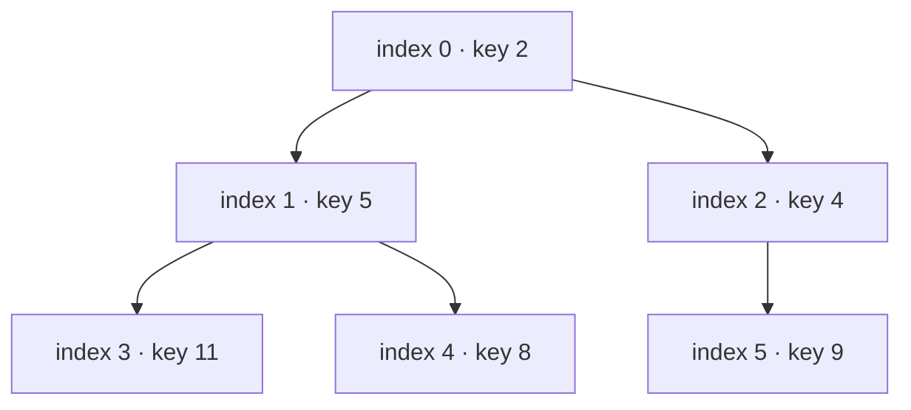

Array view:

```text
index:  0  1  2   3  4  5
key:    2  5  4  11  8  9
```

This reconnects Module 6: an array stores a compact, shape-constrained tree. No node-object links are required.

### 11.3 Heap invariant

For every existing child position `c` with parent `p`:

`heap[p] <= heap[c]`.

Consequences:

- the root is a global minimum;
- siblings need not be ordered;
- a heap array is generally not globally sorted;
- arbitrary search can still be linear.

The root-minimum proof follows the ancestor path: each parent is no greater than its child, so the root is no greater than any descendant.

### 11.4 Sift up after insertion

1. append at the next position to preserve complete shape;
2. compare the new entry with its parent;
3. swap while the child is smaller;
4. stop at the root or a parent no greater than the child.

Only the new node-to-root path can violate order.

```python
def push_min_heap(heap: list[int], value: int) -> None:
    heap.append(value)
    child = len(heap) - 1
    while child > 0:
        parent = (child - 1) // 2
        if heap[parent] <= heap[child]:
            break
        heap[parent], heap[child] = heap[child], heap[parent]
        child = parent
```

Prediction:

```python
heap = [2, 5, 4, 11, 8, 9]
push_min_heap(heap, 1)
assert heap == [1, 5, 2, 11, 8, 9, 4]
```

### 11.5 Sift down after removal

To remove the root:

1. save the minimum;
2. move the last entry to the root and shrink the array;
3. choose the smaller child;
4. swap downward while the parent is greater;
5. return the saved minimum.

Choosing merely the left child is incorrect when the right child is smaller.

```python
def pop_min_heap(heap: list[int]) -> int:
    if not heap:
        raise IndexError("pop from empty heap")
    minimum = heap[0]
    last = heap.pop()
    if heap:
        heap[0] = last
        parent = 0
        while True:
            left = 2 * parent + 1
            if left >= len(heap):
                break
            right = left + 1
            smaller = (
                right
                if right < len(heap) and heap[right] < heap[left]
                else left
            )
            if heap[parent] <= heap[smaller]:
                break
            heap[parent], heap[smaller] = heap[smaller], heap[parent]
            parent = smaller
    return minimum
```

### 11.6 Correctness and cost

For sift up:

- the complete shape is preserved by appending;
- only parent-child edges on one ancestor path can change;
- every swap repairs the lower edge and moves the possible violation upward;
- termination leaves every parent no greater than its children.

For sift down, the symmetric argument moves one possible violation down.

A complete binary tree with `n` nodes has height `Θ(log n)`, so:

- `peek_min`: `Θ(1)`;
- `add`: worst-case `Θ(log n)`;
- `remove_min`: worst-case `Θ(log n)`;
- retained array space: `Θ(n)`;
- repair uses `Θ(1)` auxiliary space.

### 11.7 Why bottom-up `heapify` is linear

Repeated insertion is `Θ(n log n)` as a simple upper bound. Bottom-up heap construction starts from the last internal node and sifts downward.

Most nodes are near the leaves and can move only a small distance:

- about `n/2` nodes move zero levels;
- about `n/4` can move at most one;
- about `n/8` can move at most two;
- and so on.

The weighted sum is linear:

`n/4·1 + n/8·2 + n/16·3 + ... = Θ(n)`.

The fact that one root may move `Θ(log n)` does not make every node pay that cost.

---

## 12. Python `heapq`: documented behavior and bounded source reading

### 12.1 Standard-library contract

**[PYTHON 3.14 GUARANTEE]**

- `heapq` supplies a heap-queue algorithm over mutable lists.
- For a min-heap, each parent is no greater than either existing child.
- `heap[0]` is the smallest item.
- `heapify(x)` transforms a list in place in linear time.
- `heappush` and `heappop` preserve the invariant; popping an empty heap raises `IndexError`.
- heap comparisons use `<`.
- Python 3.14 also documents `_max` operations for max-heaps.
- the documentation does not promise stable ordering for equal priorities.

Use a min-heap directly instead of negating numeric priorities when minimum means “next.” Use the documented max-heap API when the product contract genuinely needs maximum-first behavior and the supported Python version is 3.14 or later.

### 12.2 Equal priorities and incomparable payloads

This is unsafe:

```python
from heapq import heappush


heap: list[tuple[int, object]] = []
heappush(heap, (1, object()))
heappush(heap, (1, object()))  # tie reaches incomparable payloads
```

A unique monotonic counter prevents comparison from reaching the payload:

```python
(priority, sequence_number, concept_id)
```

That counter also defines FIFO tie behavior as an Atlas policy.

### 12.3 `heappushpop` and `heapreplace` are not synonyms

- `heappushpop(heap, item)` pushes, then returns the smaller of the old/new candidates; the larger remains.
- `heapreplace(heap, item)` removes an item already in the heap, then adds the new item; its return can be larger than the inserted item.

Predict behavior from the contract before selecting the “faster combined call.”

### 12.4 Bounded CPython reading

Read only the following call path in pinned [`Lib/heapq.py`](https://github.com/python/cpython/blob/v3.14.6/Lib/heapq.py):

1. public `heappush`;
2. helper `_siftdown`;
3. public `heappop`;
4. helper `_siftup`;
5. bottom-up loop in `heapify`.

For each function, record:

- precondition;
- changed slice/path;
- loop variant;
- comparison direction;
- postcondition;
- whether the behavior is public contract or implementation choice.

Do not read the whole file without a question. Do not couple Atlas to helper names, exact comparison counts, or a future source layout.

### 12.5 Source-reading challenge

Before opening the source, predict:

1. Does `heappush` need to inspect every array entry?
2. Why might `_siftup` first move a hole downward and then repair upward?
3. Why does `heapify` begin at the final internal parent?
4. Which test would survive a complete rewrite of `heapq`?

Only invariant-level tests—minimum at root, multiset preservation, ordered pop sequence, failure behavior—belong in application verification.

---

## 13. Sorting establishes a whole-sequence contract

A sorting problem starts with an input sequence:

`A = ⟨a₀, a₁, ..., aₙ₋₁⟩`

and a key function `k`.

A correct ascending result `B` must satisfy:

1. **Permutation:** every input item occurs in `B` with exactly the same multiplicity.
2. **Order:** for every valid adjacent pair, `k(B[i+1])` is not less than `k(B[i])`.

A stable result adds:

3. **Stability:** if two items have equivalent keys, their relative order in `B` matches their relative order in `A`.

Stability is observable when records carry data not included in the key.

```python
records = [
    ("c2", 120),
    ("c9", 120),
    ("c4", 360),
]
```

Sorting by due minute stably must retain `c2` before `c9`.

### 13.1 Sorting is different from maintaining order

| Need | Better first abstraction |
|---|---|
| order one snapshot once | sorting algorithm / `sorted` |
| many searches, rare updates | sorted array + binary search |
| mixed ordered find/insert/delete | balanced ordered-set idea |
| repeatedly remove only the minimum | priority queue / heap |
| prefix by symbols | trie or sorted-prefix bounds |

Do not maintain a complicated tree when one final sort satisfies the contract. Do not repeatedly sort the whole active set when one minimum changes at a time.

### 13.2 Python's sorting contract

**[PYTHON 3.14 GUARANTEE]**

- `sorted(iterable, *, key=None, reverse=False)` accepts any iterable and returns a new list.
- `list.sort(*, key=None, reverse=False)` sorts that list in place and returns `None`.
- both sorts are stable;
- a key function is evaluated once per input item for the sort;
- `reverse=True` preserves sort stability;
- ordering uses `<` comparisons.

The stability guarantee is application-relevant. The exact sorting implementation and its internal run/merge policies are not Atlas contracts.

**[CPYTHON 3.14.6 OBSERVATION]** Current CPython uses an adaptive stable merge-based implementation commonly called Timsort. It exploits existing order and has sophisticated temporary-memory behavior. Inspect it only in Module 24 with a pinned source question; do not write Atlas tests for internal runs or galloping thresholds.

### 13.3 Key functions are semantic boundaries

```python
ordered = sorted(
    reviews,
    key=lambda r: (r.due_at, -r.difficulty, r.concept_id),
)
```

Review questions:

- Is the key deterministic during the call?
- Are all returned keys mutually comparable?
- Does it encode the documented tie policy?
- Is it pure, or can repeated evaluation change state?
- Does normalization collapse distinctions users care about?
- Is computing the key expensive enough to cache outside repeated searches?

`key=` is not merely convenience syntax. It defines which distinctions the order can observe.

---

## 14. Read three comparison sorts as different invariant stories

The purpose is not to reproduce production sorting by hand. It is to recognize:

- what portion is already ordered;
- what work remains;
- what movement and auxiliary storage occur;
- whether equal-key order is preserved;
- why the cost recurrence or sum has its form.

### 14.1 Insertion sort: grow a sorted prefix

```python
def insertion_sort(values: list[int]) -> list[int]:
    result = values.copy()
    for boundary in range(1, len(result)):
        value = result[boundary]
        position = boundary
        while position > 0 and value < result[position - 1]:
            result[position] = result[position - 1]
            position -= 1
        result[position] = value
    return result
```

Loop invariant at the start of each outer iteration:

> `result[0:boundary]` is a sorted permutation of the original prefix `values[0:boundary]`.

The inner loop shifts only entries strictly greater than `value`. Equal entries are not crossed, so this version is stable.

Costs:

- best case already ordered: `Θ(n)` comparisons and little movement;
- worst case reverse ordered: `1 + 2 + ... + (n-1) = Θ(n²)` comparisons/moves;
- auxiliary space in this copying version: `Θ(n)` for the result; an in-place version uses `Θ(1)` auxiliary space.

Prediction:

```python
assert insertion_sort([4, 1, 3, 1]) == [1, 1, 3, 4]
```

#### Broken stability

Changing the condition to:

```python
while position > 0 and value <= result[position - 1]:
```

moves the later equal item before the earlier one. Numeric output still looks sorted, so a stability test needs distinct record identities with equal keys.

### 14.2 Merge sort: sort halves, then merge their evidence

```python
def merge_sorted(left: list[int], right: list[int]) -> list[int]:
    merged: list[int] = []
    i = 0
    j = 0
    while i < len(left) and j < len(right):
        if not right[j] < left[i]:  # choose left when equal
            merged.append(left[i])
            i += 1
        else:
            merged.append(right[j])
            j += 1
    merged.extend(left[i:])
    merged.extend(right[j:])
    return merged


def merge_sort(values: list[int]) -> list[int]:
    if len(values) < 2:
        return values.copy()
    middle = len(values) // 2
    return merge_sorted(
        merge_sort(values[:middle]),
        merge_sort(values[middle:]),
    )
```

Prediction before execution:

```python
assert merge_sort([5, 2, 4, 2, 1]) == [1, 2, 2, 4, 5]
```

#### Correctness structure

Inductive claim:

> `merge_sort(A)` returns a sorted permutation of `A`.

- **Base:** sequences of length 0 or 1 are already sorted and copied without changing multiplicity.
- **Induction:** recursive results are sorted permutations of disjoint input halves.
- **Merge invariant:** `merged` is sorted and contains exactly the consumed prefixes; every remaining item is no smaller than the last emitted item.
- **Termination:** all items from both halves are emitted exactly once.

If ties choose from the left half first and recursive halves are stable, the complete algorithm is stable.

#### Cost

With balanced halves:

`T(n) = 2T(n/2) + Θ(n) = Θ(n log n)`.

This slicing teaching version also allocates sublists. A production implementation may manage buffers differently. State output, auxiliary, stack, and transient slice space separately instead of repeating “merge sort uses `O(n)` space” without a model.

### 14.3 Heap sort: maintain partial priority, emit extrema

```python
from heapq import heapify, heappop


def heap_sort(values: list[int]) -> list[int]:
    heap = values.copy()
    heapify(heap)
    return [heappop(heap) for _ in range(len(heap))]
```

Under the binary-heap model:

- build: `Θ(n)`;
- `n` removals: `Θ(n log n)`;
- result is a sorted permutation;
- this form uses `Θ(n)` heap storage plus `Θ(n)` output;
- the algorithm is not stable without adding a tie-preserving key.

An in-place textbook max-heap variant can achieve `Θ(1)` auxiliary array space, but that is a different executable representation from this clear Python model.

### 14.4 Comparison

| Algorithm/model | Best time | Worst time | Auxiliary model | Stable here? | Distinguishing strength |
|---|---:|---:|---:|---|---|
| insertion sort | `Θ(n)` | `Θ(n²)` | `Θ(n)` copying version | yes | tiny/nearly ordered inputs |
| merge sort | `Θ(n log n)` | `Θ(n log n)` | input-sized merge/slice storage | yes | predictable divide-and-combine |
| heap sort shown | `Θ(n log n)` | `Θ(n log n)` | copied heap + output | no | reuses priority mechanism |
| Python built-in sort | contractually stable; implementation-adaptive | implementation documentation supplies performance context | implementation-specific | yes | production default for general Python sorting |

Choose from requirements and evidence. A hand-written textbook implementation is rarely a better production sorter than Python's built-in.

### 14.5 Code-reading investigation

An agent proposes:

```python
def sort_reviews(reviews):
    return sorted(reviews, key=lambda review: review.due_at.timestamp())
```

Before accepting:

1. Is timezone handling defined?
2. Is due time the whole tie policy?
3. Must equal times retain ingestion order or use concept ID?
4. Can `timestamp()` fail or lose an intended distinction?
5. Does the result need a new list or in-place mutation?
6. Which tests prove policy rather than merely nondecreasing numbers?

Sorting correctness cannot repair an incorrect key specification.

---

## 15. Why comparison sorting has a lower bound

### 15.1 Decision-tree intuition

Assume:

- all `n` keys are distinct;
- the algorithm learns order only through binary comparisons;
- it must correctly distinguish every possible input permutation.

There are `n!` possible relative orders. Model a deterministic comparison sort as a binary decision tree:

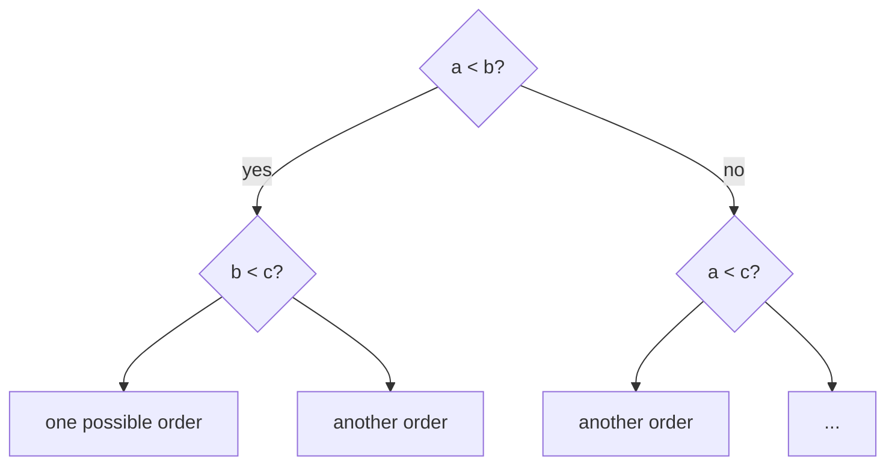

A binary tree of height `h` has at most `2^h` leaves. Correctness needs at least `n!` distinguishable leaves:

`2^h ≥ n!`.

Therefore:

`h ≥ log₂(n!) = Ω(n log n)`.

So some input requires `Ω(n log n)` comparisons. Merge sort and heap sort match that comparison growth asymptotically.

### 15.2 What the bound does not say

It does not say:

- every sorting call takes `n log n` time;
- insertion sort cannot be linear on already ordered input;
- integer sorting cannot be linear under stronger key assumptions;
- comparisons and total wall-clock time are identical;
- stable sorting is impossible within `Θ(n log n)`;
- no parallel or external-memory model can change other resource measures.

Lower bounds belong to a computational model and problem assumptions.

### 15.3 Linear-sorting preview

If keys are integers in a bounded range `0..U-1`, a counting structure can use key values as addresses:

1. count occurrences per key;
2. compute positions/prefix counts;
3. place or emit records.

Typical model:

- time `Θ(n + U)`;
- extra space `Θ(U)` plus output;
- stability requires a deliberate placement method;
- impractical when `U` is enormous relative to `n`.

Radix sorting processes keys by digits using a stable subroutine. Its cost depends on digit count and alphabet/radix, not only `n`.

This does not violate the comparison lower bound because the algorithm learns more from a key than the result of one pairwise comparison.

MIT 6.006 Lecture 5 develops these assumptions in detail; this module keeps them as a boundary preview before Module 11 revisits strategy selection.

---

## 16. Tries turn shared prefixes into shared paths

### 16.1 The pressure

Hash lookup answers whether the whole normalized title key exists. A prefix query such as `"rec"` wants every title whose symbol sequence begins with those three symbols.

A **trie** represents a key as a path of symbols. Keys with a common prefix share the corresponding path.

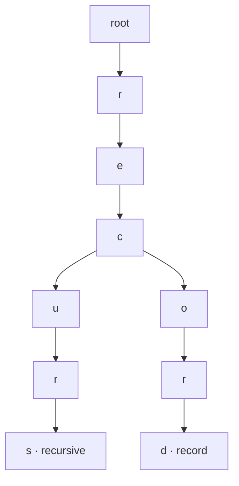

The node reached by `"rec"` roots exactly the subtree of matching normalized keys in this tiny example.

### 16.2 Representation and policy

```python
from dataclasses import dataclass, field


@dataclass
class TrieNode:
    children: dict[str, TrieNode] = field(default_factory=dict)
    terminal_ids: set[str] = field(default_factory=set)


class TitlePrefixIndex:
    def __init__(self) -> None:
        self._root = TrieNode()

    @staticmethod
    def normalize(text: str) -> str:
        return " ".join(text.casefold().split())

    def add(self, concept_id: str, title: str) -> None:
        node = self._root
        for symbol in self.normalize(title):
            node = node.children.setdefault(symbol, TrieNode())
        node.terminal_ids.add(concept_id)

    def complete(self, prefix: str) -> list[str]:
        node = self._root
        for symbol in self.normalize(prefix):
            child = node.children.get(symbol)
            if child is None:
                return []
            node = child

        found: list[tuple[str, str]] = []

        def visit(cursor: TrieNode, suffix: str) -> None:
            for concept_id in sorted(cursor.terminal_ids):
                found.append((suffix, concept_id))
            for symbol in sorted(cursor.children):
                visit(cursor.children[symbol], suffix + symbol)

        visit(node, "")
        return [concept_id for _, concept_id in found]
```

**[ATLAS POLICY]**

- titles are normalized with `casefold()` and whitespace collapse;
- multiple concept IDs may share a normalized title;
- prefix results are ordered by normalized suffix, then concept ID;
- an empty prefix returns every indexed concept;
- the catalog remains authoritative; this trie is rebuildable derived state.

### 16.3 Invariant

For every catalog entry `(concept_id, title)` indexed:

> Following the symbols of `normalize(title)` from the root reaches exactly one terminal node whose `terminal_ids` contains `concept_id`.

Conversely, every stored terminal ID must correspond to a catalog record whose normalized title equals that root-to-terminal path.

If updates only append a new title path and never remove the old terminal, stale prefix results appear. The same derived-state consistency lesson from Module 8 returns.

### 16.4 Cost

Let:

- `L` be normalized title length;
- `p` be normalized prefix length;
- `v` be nodes/terminal IDs visited below the prefix;
- child lookup use the Module 8 expected hash-map model.

Then:

- insertion: expected `Θ(L)` symbol transitions;
- reaching the prefix node: expected `Θ(p)`;
- enumeration: `Θ(v)` before accounting for sorting child symbols and IDs;
- retained space: proportional to the number of distinct prefix nodes plus terminal memberships.

The implementation sorts child symbols during query, so a more honest bound includes those local sorting costs. A different representation—sorted child arrays, ordered maps, compressed trie edges—changes them.

Never report prefix search as simply `O(p)`: output and visited-subtree work cannot disappear.

### 16.5 Trie versus sorted-array prefix search

| Concern | Trie | Sorted normalized keys |
|---|---|---|
| Reach prefix region | `Θ(p)` transitions under child-map model | `Θ(log n)` comparisons, each potentially reading key symbols |
| Output | traverse matching subtree | scan contiguous matching range |
| Updates | path creation/removal and pruning | `Θ(n)` movement in array |
| Memory | node/edge overhead; shared prefixes | compact references/strings; possible duplicate prefixes |
| Order | must define child traversal | inherent array key order |
| Locality | pointer/hash navigation | contiguous-reference scan |

Neither is universally better. Measure with actual titles after the operation contract is stable.

### Intentionally broken query

```python
def complete(self, prefix: str) -> list[str]:
    node = self._root
    for symbol in prefix:  # missing the insertion normalization policy
        node = node.children[symbol]
    ...
```

`add("c1", "Recursive  Trees")` and `complete("RECUR")` disagree because build and query use different canonicalization. The earliest failure is the index invariant/policy boundary, not tree traversal.

---

## 17. Atlas checkpoint — priority scheduler plus prefix search

### 17.1 Architecture and authority

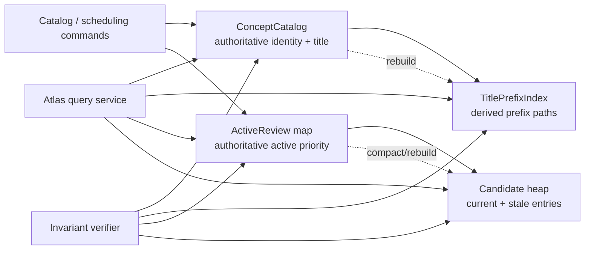

The word “authoritative” is used twice for different domains:

- catalog owns identity/title truth;
- active-review map owns whether an ID is currently scheduled and with which priority/revision.

The heap is an ordered candidate cache. It may contain stale physical entries that do not denote active logical items.

### 17.2 Scheduler contract

```text
schedule(concept_id, priority)
    add or replace the active schedule for that ID

cancel(concept_id)
    make that ID inactive; raise KeyError if absent

pop_next() -> (concept_id, priority)
    remove and return the minimum current entry
    ties follow schedule/re-schedule order
    raise KeyError when no live entry exists

len()
    number of live scheduled IDs, not physical heap entries
```

Lower integer priority means earlier review in this checkpoint. A production spaced-repetition system would likely use a richer immutable priority key such as `(due_at, urgency, sequence)`.

### 17.3 Executable reference model

```python
from heapq import heapify, heappop, heappush
from itertools import count


class ReviewScheduler:
    def __init__(self) -> None:
        self._heap: list[tuple[int, int, str]] = []
        self._current: dict[str, tuple[int, int]] = {}
        self._revisions = count()

    def __len__(self) -> int:
        return len(self._current)

    def schedule(self, concept_id: str, priority: int) -> None:
        revision = next(self._revisions)
        state = (priority, revision)
        self._current[concept_id] = state
        heappush(self._heap, (priority, revision, concept_id))
        self._compact_if_needed()

    def cancel(self, concept_id: str) -> None:
        del self._current[concept_id]
        self._compact_if_needed()

    def pop_next(self) -> tuple[str, int]:
        while self._heap:
            priority, revision, concept_id = heappop(self._heap)
            if self._current.get(concept_id) == (priority, revision):
                del self._current[concept_id]
                return concept_id, priority
        raise KeyError("no scheduled reviews")

    def _compact_if_needed(self) -> None:
        live = len(self._current)
        if len(self._heap) <= 2 * live + 8:
            return
        self._heap = [
            (priority, revision, concept_id)
            for concept_id, (priority, revision) in self._current.items()
        ]
        heapify(self._heap)
```

### 17.4 Coordinated invariants

At every public-method boundary:

1. `_current` contains at most one `(priority, revision)` per active concept ID.
2. Every current mapping entry has one matching physical heap tuple.
3. A heap tuple is **live** exactly when `_current[id] == (priority, revision)`.
4. Every nonmatching heap tuple is stale and must never be returned.
5. The physical list satisfies the heap invariant over complete tuples.
6. Revisions are unique and increasing, so equal priorities never compare concept payloads and ties follow scheduling order.
7. `len(scheduler)` counts live mappings, not heap tuples.
8. Compaction preserves the active abstraction while removing stale representation entries.

**AF**

The abstract scheduler value is the finite mapping:

`concept_id → current priority plus tie revision`.

Stale heap tuples are absent from the abstract value.

### 17.5 Why the revision is necessary

Consider:

```text
schedule("c9", 10)   → physical (10, r0, c9), current (10, r0)
cancel("c9")         → old physical entry remains
schedule("c9", 10)   → physical (10, r1, c9), current (10, r1)
```

If current state stored only priority `10`, the stale `r0` entry would look current and could be returned first. Comparing both priority and revision distinguishes logical generations.

The same issue appears when rescheduling an ID to the same priority without cancellation.

### 17.6 Why not delete or update in the middle?

`heapq` does not supply identity lookup or arbitrary deletion. Finding a concept ID in the heap is linear, and changing one tuple in place requires repair in an unknown direction.

Lazy invalidation chooses:

- expected constant identity replacement in the dictionary under Module 8 assumptions;
- logarithmic push/pop in the heap model;
- possible extra physical space from stale entries;
- a compaction policy to bound that debt.

That is a representation tradeoff, not a workaround to hide.

### 17.7 Prediction trace

```python
scheduler = ReviewScheduler()
scheduler.schedule("trees", 5)     # revision 0
scheduler.schedule("hashing", 2)   # revision 1
scheduler.schedule("trees", 1)     # revision 2; old trees entry stale
scheduler.schedule("sorting", 1)   # revision 3

assert len(scheduler) == 3
assert scheduler.pop_next() == ("trees", 1)
assert scheduler.pop_next() == ("sorting", 1)
assert scheduler.pop_next() == ("hashing", 2)
```

The first physical `"trees"` tuple remains until a later pop or compaction. It must not be emitted after the live `"trees"` review has already been removed.

### 17.8 Contract tests

```python
def test_scheduler_reschedule_and_ties() -> None:
    scheduler = ReviewScheduler()
    scheduler.schedule("a", 3)
    scheduler.schedule("b", 1)
    scheduler.schedule("a", 1)
    scheduler.schedule("c", 1)

    assert len(scheduler) == 3
    assert scheduler.pop_next() == ("b", 1)
    assert scheduler.pop_next() == ("a", 1)
    assert scheduler.pop_next() == ("c", 1)


def test_same_priority_generation_is_not_confused() -> None:
    scheduler = ReviewScheduler()
    scheduler.schedule("a", 1)
    scheduler.cancel("a")
    scheduler.schedule("a", 1)

    assert scheduler.pop_next() == ("a", 1)
    try:
        scheduler.pop_next()
    except KeyError:
        pass
    else:
        raise AssertionError("stale generation was returned")


def test_compaction_preserves_live_order() -> None:
    scheduler = ReviewScheduler()
    for priority in range(40, 0, -1):
        scheduler.schedule("same", priority)
    scheduler.schedule("other", 2)

    assert len(scheduler) == 2
    assert scheduler.pop_next() == ("same", 1)
    assert scheduler.pop_next() == ("other", 2)
```

Additional required properties:

- popping all live items produces nondecreasing priority/revision keys;
- the returned IDs equal exactly the active IDs at the start of the drain;
- cancel never returns the cancelled generation;
- rescheduling does not change live count;
- compaction preserves the abstract mapping;
- empty is based on `_current`, even if stale tuples are physically retained;
- no test reads private heap layout as an application contract.

### 17.9 Prefix-index integration

```python
prefix_index = TitlePrefixIndex()
prefix_index.add("c2", "Recursive Definitions")
prefix_index.add("c9", "Tree Invariants")
prefix_index.add("c7", "Trees and Traversal")

assert prefix_index.complete("tree") == ["c9", "c7"]
assert prefix_index.complete("RECUR") == ["c2"]
assert prefix_index.complete("missing") == []
```

The result order follows normalized title suffix then ID in this model. If the UI instead requires relevance order, that is a separate ranking contract; do not pretend trie traversal supplies it.

### 17.10 Cross-index consistency

A title update and a priority update affect different indexes:

```text
replace title: catalog + trie
reschedule: active map + heap
delete concept: catalog + trie + active map + heap invalidation
```

An in-memory checkpoint can use:

- command-level mutation with rollback/rebuild on failure;
- immutable snapshots built off to the side, then reference swap;
- invariant checking plus deterministic rebuild from authoritative state.

Transactions return in Module 16. For now, every failure path needs an explicit recovery policy.

### 17.11 Cost ledger

| Operation | Model cost | Hidden/secondary cost |
|---|---:|---|
| scheduler `schedule` | expected dict update + `Θ(log p)` heap push | stale entry retention; occasional compaction |
| scheduler `cancel` | expected dict delete | physical tuple remains until cleanup |
| scheduler `pop_next` | `Θ((s+1) log p)` if `s` stale roots skipped | one call can pay accumulated cleanup |
| compaction | `Θ(l)` heapify from `l` live entries | temporary/new list space |
| trie add | expected `Θ(L)` transitions | allocation per new prefix node |
| trie prefix reach | expected `Θ(p)` transitions | normalization |
| trie enumerate | output/subtree-sensitive | local sorting in this model |

`p` is physical heap entries and `l` live entries. The scheduler's individual `pop_next` is not always plain `O(log n)` under lazy deletion; the stale-skip parameter must be visible.

---

## 18. Code and architecture reading studio

### 18.1 Read in dependency order

Given an unfamiliar Atlas patch, inspect:

1. public scheduler and prefix-query contracts;
2. priority and title normalization policy;
3. authoritative catalog/active-state models;
4. heap and trie representations;
5. update and failure control flow;
6. compaction/rebuild paths;
7. tests and measurements;
8. dependency and configuration changes.

Do not begin with helper functions; first establish what behavior the helpers are supposed to preserve.

### 18.2 Five-level comprehension walk

#### Purpose

Which user question became too costly or impossible under the Module 8 hash index?

#### Map

Which components own truth, and which are derived accelerators? Which arrows are data flow versus dependency?

#### Flow

Trace one concrete command:

```text
reschedule c9 from priority 8 to priority 2
```

Record the dictionary state, pushed tuple, old stale tuple, heap root, and eventual pop.

#### Mechanism

Identify:

- tuple comparison order;
- complete-tree index relation;
- stale-entry currency check;
- trie symbol path;
- normalization point;
- compaction/rebuild trigger.

#### Evaluation

Challenge:

- duplicate and tie semantics;
- mutable ordering fields;
- stale-space growth;
- failure between authoritative and derived updates;
- unsupported `O(log n)` claims;
- reliance on private `heapq` helpers;
- output ordering not covered by tests;
- Unicode/product consequences of normalization.

### 18.3 Suspicious agent patch

```diff
 def schedule(self, concept_id, priority):
-    revision = next(self._revisions)
-    self._current[concept_id] = (priority, revision)
-    heappush(self._heap, (priority, revision, concept_id))
+    self._current[concept_id] = priority
+    heappush(self._heap, (priority, concept_id))

 def pop_next(self):
     while self._heap:
-        priority, revision, concept_id = heappop(self._heap)
-        if self._current.get(concept_id) == (priority, revision):
+        priority, concept_id = heappop(self._heap)
+        if self._current.get(concept_id) == priority:
             del self._current[concept_id]
             return concept_id, priority
```

The patch looks simpler and passes distinct-priority tests.

Reject it because:

1. cancel then re-add at the same priority makes an old generation look live;
2. rescheduling to the same priority has the same defect;
3. equal-priority order changes from schedule order to concept-ID order;
4. the patch has silently changed the public tie policy;
5. no adversarial same-ID/same-priority regression supports the change.

### 18.4 Another plausible defect

```python
def pop_next(self):
    priority, revision, concept_id = heappop(self._heap)
    del self._current[concept_id]
    return concept_id, priority
```

This assumes the physical root is current. After one reschedule, it can delete the new dictionary state while returning the old priority. The repair is a currency loop, not a one-line exception handler.

### 18.5 Bounded agent task

Give an agent:

> Implement the Module 9 Atlas `ReviewScheduler` and `TitlePrefixIndex` behind their existing ports. Keep catalog and current-review mappings authoritative. The scheduler uses a `heapq` min-heap of immutable `(priority, revision, concept_id)` tuples; revisions are unique and define FIFO ties. Rescheduling appends a new generation, stale generations are skipped, cancellation is lazy, `len` counts live IDs, and a documented threshold rebuilds from live state. Prefix indexing uses the exact shared normalization policy, supports duplicate normalized titles, does not expose mutable nodes, and has a full catalog rebuild. Do not depend on private `heapq` helpers, CPython layout, dict/set iteration order, or persist Python `hash()` values. Do not add concurrency, persistence, retries, or packages. Include type annotations, invariants, cost claims with stale/output parameters, and tests for same-priority generations, ties, cancellation, stale roots, compaction equivalence, prefix normalization, duplicate titles, title replacement/removal, and rebuild equivalence.

### 18.6 Required evidence

The agent must return:

1. changed-file list with a reason for each;
2. public contracts and explicit policy decisions;
3. focused test command and full result;
4. a hand-checkable state trace;
5. invariant checker or model-drain comparison;
6. test proving same-priority old generations are rejected;
7. test proving compaction preserves live behavior;
8. prefix rebuild equals incremental state;
9. complexity table naming physical/live/stale/output parameters;
10. no unrelated refactor or dependency.

### 18.7 Patch review rubric

| Dimension | Reject when | Acceptance evidence |
|---|---|---|
| contract | tie, duplicate, empty, or failure behavior is implicit | public tests and design note |
| tree/heap invariant | structure is assumed from output examples | invariant/property checks |
| generations | priority alone decides currency | same-ID/same-priority regression |
| identity/order coordination | one structure is forced to answer both questions | explicit active map plus candidate heap |
| stale space | lazy deletion is called “free” | compaction policy and physical/live metric |
| prefix semantics | build/query normalization differs | shared pure normalizer and cases |
| source of truth | derived index becomes authoritative accidentally | rebuild and recovery path |
| Python boundary | private helpers or CPython details become API | only documented `heapq`/sorting behavior |
| cost | bare `O(log n)` or `O(p)` hides cleanup/output | parameterized analysis |
| scope | patch adds persistence/concurrency/framework work | bounded diff |

---

## 19. Six-session interactive teaching sequence

Each session is 75–90 focused minutes and has one abstraction jump. Every session begins with retrieval and ends with evidence Michael can explain without code completion.

### Session 1 — Ordered questions force new operations

**Retrieve:** mapping/set interfaces from Module 8, sequence representations from Module 6, and qualified costs from Module 5.

**Launch:** give Atlas five queries—exact ID, earliest deadline, next key, range, and prefix—and forbid container names.

**Derive:** exact identity versus comparison order; key extraction; direction; duplicate and tie policy; static snapshot versus maintained order.

**Learner actions:**

1. annotate client code with abstract operations;
2. compare hash table, sorted array, BST, heap, and trie in the operation matrix;
3. repair an underspecified priority policy;
4. classify claims as Python guarantee, CPython observation, course model, or Atlas policy.

**Evidence:** a decision ledger row for each query, including rejected alternatives and a reopening trigger.

**TA checkpoint:** if a structure is selected from familiarity or syntax, return to Module 3's interface-before-representation rule.

### Session 2 — Recursive shape becomes ordered search

**Retrieve:** recursive definitions, structural induction, object graphs, RI, AF, and call-stack space.

**Launch:** draw one binary shape, then produce pre-, in-, and post-order traces to show shape does not determine traversal order.

**Derive:** tree vocabulary, node-object representation, BST invariant, path elimination, minimum, successor cases, and `Θ(h)` cost.

**Learner actions:**

1. trace `bst_get` comparison by comparison;
2. insert equal and unequal keys under the replacement policy;
3. locate the first invariant failure in the wrong-child patch;
4. give the search correctness argument;
5. compare iterative and recursive auxiliary space.

**Evidence:** a five-minute explanation moving from abstract ordered mapping → object graph → BST invariant → path choice → height cost.

**TA checkpoint:** if “tree means logarithmic” appears, build the ordered-insertion chain before continuing.

### Session 3 — Balance is a repairable shape constraint

**Retrieve:** tree height and Module 2's inductive proof pattern.

**Launch:** insert `1,2,3,4,5` and measure path length; distinguish semantic validity from performance failure.

**Derive:** AVL balance factor, cached height, four imbalance shapes, and rotation as an in-order-preserving local rewrite.

**Learner actions:**

1. label ordered regions `A,x,B,y,C`;
2. predict every reference after a left rotation;
3. run the broken rotation mentally and locate the cycle;
4. explain bottom-up height refresh;
5. state what a full insertion algorithm must reconnect above the local rotation.

**Evidence:** before/after diagrams plus an order-preservation and node-preservation argument.

**TA checkpoint:** if the learner memorizes “left-heavy means rotate right” without preserving regions, remove numeric keys and use symbolic intervals.

### Session 4 — A complete tree becomes a priority mechanism

**Retrieve:** array slot arithmetic, queue access discipline, and amortized versus worst-case reasoning.

**Launch:** ask for repeated minimum removal without paying to keep every pair globally sorted.

**Derive:** priority-queue interface, complete binary shape, implicit indices, heap invariant, sift up/down, and bottom-up heapify.

**Learner actions:**

1. map six array positions to a tree;
2. predict one push and one pop;
3. diagnose a sift-down that always chooses the left child;
4. prove root-minimum from ancestor paths;
5. derive linear heapify from the distribution of node heights;
6. inspect only the bounded `heapq` call path.

**Evidence:** an invariant trace with changed indices highlighted and a qualified operation-cost table.

**TA checkpoint:** challenge “heap is sorted” with two valid heaps containing the same multiset but different sibling orders.

### Session 5 — Sorting and prefix paths organize different evidence

**Retrieve:** recurrences, permutations, set equality, iterator materialization, and key stability.

**Launch:** contrast “sort this snapshot” with “keep returning the next review” and “complete this prefix.”

**Derive:** sorting correctness, stability, insertion-prefix invariant, merge recurrence/invariant, heap sort, comparison decision-tree bound, bounded-key escape, and trie shared paths.

**Learner actions:**

1. read all three sort models without retyping them;
2. construct a stability counterexample with equal-key identities;
3. explain the `n!` leaves argument and its assumptions;
4. trace a normalized title through the trie;
5. compare trie versus sorted-array prefix search;
6. identify output terms hidden by a bare `O(p)` claim.

**Evidence:** a comparison memo choosing Python's built-in sort, a heap, or a trie for three different client requests.

**TA checkpoint:** if sorted order alone is treated as correctness, show a sorted output that duplicates one item and loses another.

### Session 6 — Coordinate indexes, direct an agent, defend the system

**Retrieve:** Module 8's authoritative-versus-derived state, heap currency, trie normalization, and all cost parameters.

**Launch:** reschedule one concept twice to the same priority, then cancel and re-add it.

**Learner actions:**

1. trace dictionary and heap state for every generation;
2. explain why revision participates in currency and tie order;
3. trigger compaction and prove abstract behavior is preserved;
4. trace title replacement across catalog and trie;
5. write the bounded agent brief;
6. inspect the patch in dependency order;
7. run focused tests and reject one unsupported complexity claim;
8. walk one event from Module 7 ingestion through Module 8 indexing into Module 9 scheduling.

**Evidence:** accepted/rejected patch review, test output, cost ledger, architecture diagram, and oral defense.

**TA checkpoint:** green tests are insufficient unless Michael can identify authoritative state, first possible failure, stale-entry policy, and evidence that survives a representation rewrite.

---

## 20. Eight-level problem ladder

### Level 1 — Recognize

For twelve Atlas requests, name only the required operations:

- equality lookup;
- minimum selection;
- successor/range;
- one-time sort;
- prefix completion.

Then select a first candidate representation and state what evidence could overturn it.

### Level 2 — Trace

Trace:

1. BST insertion and lookup on both balanced-looking and degenerate shapes;
2. one AVL left-right repair with symbolic key regions;
3. heap push and pop in array and tree views;
4. a stable merge with equal-key records;
5. a trie prefix query.

Record every comparison, reference/slot change, and invariant restoration.

### Level 3 — Map

Recover an unfamiliar ordered subsystem:

- entry points;
- key/tie policy;
- authoritative state;
- derived indexes;
- dependency direction;
- heap/tree/trie invariants;
- rebuild and failure boundaries.

Distinguish data-flow arrows from ownership/dependency arrows.

### Level 4 — Modify

Change the Atlas scheduler so priority becomes:

```text
(due_minute, -difficulty, insertion_revision)
```

Update:

- contract;
- tuple layout;
- tie policy;
- tests;
- cost claims;
- migration/rebuild plan for existing in-memory state.

Do not change prefix indexing or add persistence.

### Level 5 — Debug and defend

Diagnose a scheduler that returns a cancelled concept only after:

```text
schedule X at 5
cancel X
schedule X at 5
pop
```

Find the first logical invariant violation, produce the smallest regression, repair generation currency, and explain why distinct-priority tests missed it.

### Level 6 — Design and delegate

Write an agent brief for:

- versioned priority updates;
- explicit live/physical size metrics;
- bounded compaction;
- exact prefix normalization;
- full rebuild;
- prohibited scope;
- acceptance evidence.

Ask for two candidate compaction policies and compare latency, memory, and simplicity before authorizing one.

### Level 7 — Review and verify

Review the generated patch in dependency order. Require:

- invariant/model tests;
- adversarial same-priority generations;
- multiset and nondecreasing drain properties;
- compaction equivalence;
- prefix incremental/rebuild equivalence;
- failure-path explanation;
- measurements labeled as implementation evidence;
- a clean, bounded diff.

Write an acceptance decision that separates semantic, structural, cost, and operational evidence.

### Level 8 — Transfer

Choose one and map every concept:

- operating-system job scheduling;
- event-loop timers;
- database B-tree versus hash index;
- autocomplete service;
- packet priority queue;
- Dijkstra frontier in Module 10;
- compiler symbol/prefix index.

State the operation contract, key, representation, invariant, cost parameters, stale/update behavior, and one human consequence of a wrong ordering policy.

---

## 21. Understanding check — eight confidence-aware MCQs

For every item, record:

- choice;
- **low**, **medium**, or **high** confidence;
- one sentence naming the decisive invariant or assumption.

Open the explanation only after committing. High-confidence wrong answers produce a misconception-log entry and minimal counterexample. Low-confidence correct answers require an oral transfer example before counting as mastery.

### Question 1 — Which capability is missing?

Atlas already has a dictionary from concept ID to record. It now needs to repeatedly return the active record with the smallest due-time key. Which statement is most accurate?

A. A dictionary already exposes its smallest key in expected constant time.  
B. The new request is a priority-queue operation; a heap is one suitable representation when add and remove-min are both frequent.  
C. Every ordered question requires a fully sorted list.  
D. A set preserves exactly the priority order needed.

<details>
<summary>Reveal answer, distractor analysis, and routing</summary>

**Answer: B.**

The client now asks “minimum by priority,” not “value equal to identity.”

- **A** invents ordered-min behavior from hashing.
- **C** over-specifies global order when only one extremum is required.
- **D** confuses uniqueness with priority.

**Misconception signal:** A means Module 8's identity/order distinction is unstable.  
**Route:** return to the operations-before-structures table in Sections 4 and 11.  
**Transfer:** compare exact process-ID lookup with next-job scheduling.

</details>

### Question 2 — Honest BST cost

A BST has `n` nodes and height `h`. What is the strongest generally valid lookup claim for the course model?

A. Worst-case `Θ(log n)` because the structure is a tree.  
B. `Θ(h)`; this is `Θ(log n)` only when a balance/shape condition bounds `h`.  
C. Expected `Θ(1)` because keys are unique.  
D. `Θ(n log n)` because in-order traversal is sorted.

<details>
<summary>Reveal answer, distractor analysis, and routing</summary>

**Answer: B.**

Search follows one root-to-leaf path. Height is the direct structural parameter.

- **A** assumes the desired conclusion.
- **C** imports hash-table language and gives no random model.
- **D** confuses a full traversal with one lookup.

**Misconception signal:** A is the classic “tree means logarithmic” error.  
**Route:** rebuild the `1,2,3,4,5` degenerate tree and revisit Module 5's case discipline.  
**Transfer:** ask which graph-search cost depends on path/frontier shape rather than a type name.

</details>

### Question 3 — What a rotation must preserve

Which is the central correctness argument for a left AVL rotation at `x` with right child `y`?

A. The numeric memory addresses remain increasing.  
B. The rewrite preserves the in-order region sequence `A, x, B, y, C`, reconnects every subtree once, and refreshes metadata bottom-up.  
C. The root key becomes the smallest key.  
D. Every node's depth remains unchanged.

<details>
<summary>Reveal answer, distractor analysis, and routing</summary>

**Answer: B.**

Order preservation, reachability, and correct cached heights are distinct obligations.

- **A** has no abstract meaning and confuses object layout with key order.
- **C** would describe a min-heap root, not a BST rotation.
- **D** is false; changing depths is the purpose of rebalancing.

**Misconception signal:** C blends BST and heap invariants.  
**Route:** redraw symbolic regions rather than memorizing rotation directions.  
**Transfer:** identify another local rewrite—such as list splice—that must preserve an abstraction function.

</details>

### Question 4 — Heap versus sorted array

The list `[2, 5, 4, 11, 8, 9]` satisfies the min-heap invariant. What follows?

A. Every adjacent array pair is nondecreasing.  
B. Binary search can find any key in logarithmic time.  
C. `2` is a global minimum, but siblings and unrelated subtrees need not be globally ordered.  
D. Removing the minimum is constant time because it is at index `0`.

<details>
<summary>Reveal answer, distractor analysis, and routing</summary>

**Answer: C.**

Parent-child order along ancestor paths proves root minimum, not total order.

- **A** is contradicted by adjacent `5,4`.
- **B** requires a globally sorted search interval.
- **D** ignores the replacement and sift-down repair after reading the root.

**Misconception signal:** A or B treats a heap as a sorted list.  
**Route:** trace one `pop_min_heap` and mark the only path repaired.  
**Transfer:** explain why a Dijkstra frontier may select the next minimum but cannot answer arbitrary-distance range queries efficiently.

</details>

### Question 5 — Stale-entry currency

Atlas schedules concept `x` at priority `4`, cancels it, then schedules `x` again at priority `4`. Why must current state include a unique revision rather than priority alone?

A. Heap priorities must be floating point.  
B. The old physical tuple and new logical generation have the same ID and priority; a revision distinguishes which candidate is current.  
C. Revisions make arbitrary heap deletion constant time.  
D. Dictionaries cannot store duplicate string keys.

<details>
<summary>Reveal answer, distractor analysis, and routing</summary>

**Answer: B.**

Currency is equality of the complete generation token, not merely business priority.

- **A** is unrelated.
- **C** is false; the design avoids arbitrary deletion through lazy invalidation.
- **D** explains replacement in a mapping but not stale heap recognition.

**Misconception signal:** C hides the chosen time/space tradeoff.  
**Route:** trace `_current` and `_heap` separately for the four operations.  
**Transfer:** compare a graph-frontier tuple with the currently known tentative distance in Module 10.

</details>

### Question 6 — Stability defect

An insertion sort shifts while `new_key <= previous_key` instead of only while `new_key < previous_key`. Numeric output is sorted. What can still be wrong?

A. It can reverse the relative order of distinct records with equal keys, violating stability.  
B. It can no longer return a permutation.  
C. It must become exponential.  
D. It violates Python's dictionary insertion order.

<details>
<summary>Reveal answer, distractor analysis, and routing</summary>

**Answer: A.**

Crossing equal keys changes an observable order even when key values look correct.

- **B** need not occur; all items may still appear once.
- **C** has no support from the loop structure.
- **D** concerns a different abstraction.

**Misconception signal:** selecting B means permutation and stability are fused.  
**Route:** label two equal-key records `early` and `late` and trace their identities.  
**Transfer:** explain why FIFO tie behavior in the scheduler is a stability-like policy.

</details>

### Question 7 — Comparison lower bound

Why does the `Ω(n log n)` comparison-sorting lower bound not rule out `Θ(n + U)` counting sort?

A. Counting sort is secretly approximate.  
B. The lower bound assumes the algorithm learns order only through comparisons; bounded integer keys provide direct-address information outside that model.  
C. `n!` is actually linear.  
D. Counting sort works for arbitrary unbounded Python objects without a key policy.

<details>
<summary>Reveal answer, distractor analysis, and routing</summary>

**Answer: B.**

Changing the operation model changes the information available per step.

- **A** is false; counting sort can be exact.
- **C** denies the combinatorial argument.
- **D** removes the bounded-universe assumption that supplies the advantage.

**Misconception signal:** D treats an assumption-dependent algorithm as universal.  
**Route:** write `n`, `U`, allowed operation, space, and stability policy before comparing algorithms.  
**Transfer:** connect direct addressing here to Module 8's derivation of hashing.

</details>

### Question 8 — Honest prefix cost

A trie query reaches the node for a prefix of length `p`, then returns one million matching titles. Which claim is honest?

A. Total time is `Θ(p)` because the prefix path is short.  
B. Total time must include reaching the prefix plus visited/output work, and this implementation also sorts child symbols locally.  
C. Hash collisions make prefix output free.  
D. Trie search is always `Θ(log n)`.

<details>
<summary>Reveal answer, distractor analysis, and routing</summary>

**Answer: B.**

No algorithm can explicitly return a million identities without output-sensitive work.

- **A** hides the dominant output term.
- **C** is unrelated and false.
- **D** imports balanced-tree height into a symbol-path structure.

**Misconception signal:** A means output complexity has disappeared from the model.  
**Route:** name `p`, visited subtree `v`, and returned IDs `z`; then inspect local child ordering.  
**Transfer:** make the same correction to a database range query returning a million rows.

</details>

### Diagnostic interpretation

- Miss Q1 → revisit **identity versus order** across Modules 8 and 9.
- Miss Q2 → revisit **height as the direct parameter** plus Module 5's assumption checklist.
- Miss Q3 → revisit **RI/AF and symbolic rotation regions** from Modules 2, 3, and 9.
- Miss Q4 → contrast **partial heap order with global sorted order** using two array views.
- Miss Q5 → trace **logical generation versus physical candidate**; require the same-priority regression.
- Miss Q6 → separate **permutation, nondecreasing order, and stability** with labeled records.
- Miss Q7 → revisit **lower bounds as model-relative claims** and Module 8 direct addressing.
- Miss Q8 → restore **output-sensitive cost** and Module 7's materialization questions.

---

## 22. TA guide

### Likely misconceptions

- “hash tables can efficiently answer any lookup”;
- “tree” automatically implies logarithmic operations;
- recursive shape, traversal order, and search invariant are the same thing;
- a BST root is a minimum as in a heap;
- a heap is globally sorted;
- priority queue and heap are synonyms;
- complete tree means perfect tree;
- changing a heap entry in place preserves order;
- arbitrary deletion from a `heapq` heap is logarithmic by identity;
- lazy deletion has no memory or latency cost;
- priority alone can identify a current generation;
- rotation changes key order;
- refreshing cached height before child rewrites is harmless;
- sorting correctness means only nondecreasing output;
- stability means deterministic output across processes;
- every `Θ(n log n)` sort behaves the same on nearly ordered data;
- `Ω(n log n)` applies to every possible integer-sorting model;
- Python's stable sorting guarantee is a CPython accident;
- Timsort internals are part of Atlas's contract;
- `bisect` makes insertion logarithmic;
- trie prefix search cost ignores result size;
- prefix normalization is neutral to users and languages;
- passing example tests proves an index invariant.

### Diagnostic questions

1. “What exact client operation is missing from the hash index?”
2. “What is the ordering key, direction, duplicate policy, and tie policy?”
3. “Draw the worst legal shape, not the shape you hope to have.”
4. “Which invariant belongs to a BST, and which belongs to a heap?”
5. “What portion of the structure can this operation change?”
6. “What does the abstract value omit from the physical representation?”
7. “Which physical heap tuple is current, and how do you know?”
8. “What happens after cancel and re-add at the same priority?”
9. “Which correctness obligation would still fail if the output looks sorted?”
10. “What computational assumption supports the lower bound?”
11. “How many values must the prefix query emit?”
12. “Is that claim Python, CPython, a model, or Atlas policy?”

### Staged hint ladder

Use the smallest hint that restores reasoning:

1. Remove the structure name and restate the client question.
2. Write the key/tie policy as a tuple.
3. Draw one node and its legal key intervals.
4. Replace `n` with height `h`.
5. Insert sorted keys to expose degeneration.
6. Label rotation regions `A,x,B,y,C`.
7. Translate heap array indices to parent-child edges.
8. Circle the only path that can violate the invariant.
9. Split physical heap entries from logical current entries.
10. Add a unique revision and replay the same-priority trace.
11. Label sorting obligations: multiplicity, order, stability.
12. Name the model assumption and output parameter.
13. Only then inspect or modify code.

### Minimal counterexamples

#### A valid BST with linear height

Insert `1,2,3,4` into an unbalanced BST.

#### A valid heap that is not sorted

```python
[1, 4, 2, 9, 7, 3]
```

Every parent is no greater than children, but adjacent array positions are not globally ordered.

#### A sorted output that is not a permutation

```text
input  [1, 2, 2, 3]
output [1, 2, 3, 3]
```

#### A stable-order witness

```text
input  [(early, 5), (late, 5)]
wrong  [(late, 5), (early, 5)]
```

#### A same-priority stale generation

```text
schedule x@4 → cancel x → schedule x@4
```

#### A prefix-output witness

One-character prefix with one million matching IDs disproves total `O(p)`.

### Required regression evidence

Do not accept the checkpoint without:

- BST ordered traversal, replacement policy, missing-key behavior, and degenerate-shape cost trace;
- rotation in-order preservation, node-identity preservation, no-cycle check, height consistency, and all four imbalance shapes at the design level;
- heap invariant after empty/singleton/many push-pop transitions;
- heap drain equals `sorted(input)` as a multiset/order property;
- equal-priority incomparable payload safety;
- same-ID/same-priority reschedule and cancel/re-add tests;
- cancelled generations never returned;
- compaction preserves current mapping and drain behavior;
- physical/live size accounting;
- sort permutation, order, and labeled stability tests;
- `bisect` precondition test using a consistently sorted key domain;
- prefix normalization, missing, empty, duplicate-title, replacement, removal, ordering, and rebuild-equivalence tests;
- no application test that asserts a private `heapq` helper or CPython layout.

### Return to prerequisites when

- recursive base/step or call state is unclear → **Module 2**;
- interface, RI, AF, or representation exposure is unclear → **Module 3**;
- proof directions or permutation/set reasoning is unclear → **Module 4**;
- height/case/output/amortized claims are vague → **Module 5**;
- object links versus contiguous references are fused → **Module 6**;
- FIFO and priority access policies are fused → **Module 7**;
- identity indexes, stable keys, expected hashing, or derived-state rebuilds are unclear → **Module 8**.

### TA intervention protocol

1. Ask for a prediction before execution.
2. Reduce to three keys or four heap entries.
3. Draw both abstract value and representation.
4. State the invariant in plain language.
5. Identify the first operation that can break it.
6. Trace one counterexample.
7. Translate the repaired invariant into a test.
8. Restore cost parameters.
9. Return to Atlas architecture only after the small mechanism is sound.

Avoid replacing reasoning with a library recommendation. `sorted` and `heapq` are correct tools only after the learner owns their contracts and the surrounding state-coordination design.

---

## 23. Atlas milestone 9 — evidence packet

Produce one connected studio packet.

### Required artifacts

1. **Operation derivation:** exact lookup → ordered questions → selected interfaces.
2. **Ordering-policy sheet:** key, direction, duplicates, ties, mutation policy.
3. **Tree vocabulary and trace:** object graph, depth/height, three traversals.
4. **BST RI/AF:** search and insertion trace, degeneration witness, `Θ(h)` account.
5. **AVL rotation dossier:** symbolic before/after, order proof, node/reachability test, height-update argument.
6. **Heap mechanism trace:** implicit indices, sift up/down, root-min proof, linear-heapify explanation.
7. **Sorting review:** insertion/merge/heap invariants, stability witness, recurrence, and lower-bound assumptions.
8. **Python boundary audit:** `sorted`, `list.sort`, `bisect`, `heapq`, and bounded CPython source labels.
9. **Trie model:** normalization policy, RI, prefix/output cost, rebuild test.
10. **Atlas scheduler:** active map, heap, revisions, stale skip, compaction, and cost ledger.
11. **Architecture diagram:** authoritative state, derived indexes, rebuild, and failure paths.
12. **Agent brief and patch review:** bounded task, inspected diff, rejected unsupported claim.
13. **Verification bundle:** focused tests, model/property checks, physical/live metrics.
14. **Oral defense:** one event from ingestion/indexing through scheduling and forward into graph planning.

### Evidence rubric

| Capability | Emerging | Ready to advance |
|---|---|---|
| operation recovery | names a container | derives structure from client operations and constraints |
| tree reasoning | labels nodes | states RI/AF and proves path/traversal behavior |
| balancing | memorizes rotations | preserves symbolic order, reachability, and metadata |
| heap reasoning | says “root is smallest” | derives it and traces path-local repair |
| sorting | checks example output | checks permutation, order, stability, cost, and key policy |
| lower bound | recites `n log n` | states decision-tree assumptions and escape conditions |
| Python use | knows function names | separates documented behavior from implementation |
| architecture | lists components | identifies authority, derived state, currency, and recovery |
| debugging | patches symptom | finds first invariant violation and adds a minimal regression |
| delegation | asks an agent to build | bounds scope, policies, invariants, and evidence |
| review | accepts green tests | inspects patch, falsifies claims, and verifies independently |
| cost | copies a table | names height, physical/live/stale, key, and output parameters |

### Oral-defense prompts

1. Why is a hash table insufficient for successor and minimum queries?
2. Why is BST search `Θ(h)` before it is `Θ(log n)`?
3. What exactly does a rotation preserve and change?
4. Why is a heap partial order enough for a priority queue?
5. Why can heapify be linear?
6. What three obligations define a stable sort?
7. Which assumption makes the comparison lower bound applicable?
8. Why do dictionary and heap coexist in the scheduler?
9. How does a revision prevent a same-priority stale bug?
10. What cost does lazy deletion postpone?
11. Why must trie search include output work?
12. Which Atlas facts are Python guarantees, course models, or product policies?

### Instructor decision rule

Advance when Michael can take unfamiliar ordered code and:

1. recover the client operations and ordering policy;
2. diagram representation and authoritative state;
3. state and test the relevant invariants;
4. trace a boundary/adversarial case without execution;
5. give a correctness and parameterized cost argument;
6. distinguish Python contract, CPython observation, and course model;
7. direct a bounded agent change;
8. reject a plausible same-priority, stability, or output-cost defect;
9. verify the repaired system with evidence that survives representation changes.

Manual implementation speed and memorized operation tables are not mastery.

---

## 24. Consolidation

### One-page concept map

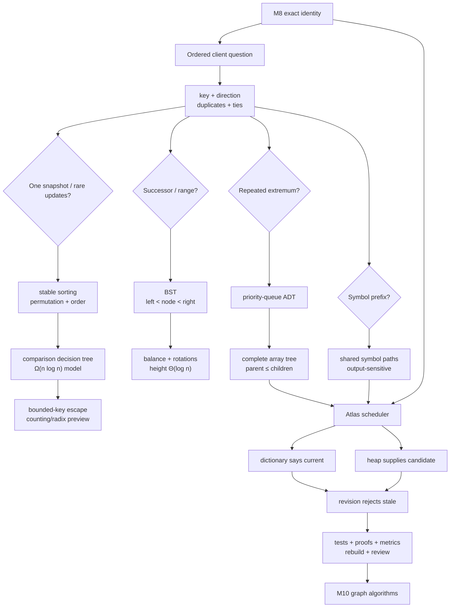

### Keep these six statements

> Order begins as a client contract: key, direction, duplicates, and ties.

> A BST operation follows height; balance is the extra invariant that keeps height logarithmic.

> A heap preserves only enough order to expose an extremum, and its complete shape makes path repair logarithmic.

> A correct stable sort preserves multiplicity, establishes nondecreasing keys, and retains equal-key relative order.

> Lower bounds are claims inside a model; bounded-key information can change the model.

> When identity and priority indexes coexist, one component must define currency and recovery.

### Before / now reflection

Complete:

- Before this module, I thought “ordered” meant ...
- Now I ask these four policy questions first ...
- The difference between a BST and heap invariant is ...
- The rotation fact I can prove rather than memorize is ...
- The sorting obligation I used to omit is ...
- The stale-entry failure I can now reproduce is ...
- The Python guarantee I may rely on is ...
- The CPython detail I will keep out of Atlas's contract is ...
- I would choose a trie over a sorted array when ...
- I would reopen the scheduler design when ...

### Scheduled retrieval

**After 2 days**

1. Draw a degenerate BST and a valid unsorted heap.
2. Recreate a left rotation with `A,x,B,y,C`.
3. Trace cancel/re-add at the same priority.
4. State permutation, order, and stability separately.

**After 1 week**

1. Derive BST and heap costs from height/complete shape.
2. Explain linear heapify without a memorized formula.
3. Rebuild the comparison lower-bound argument.
4. Compare trie and sorted-array prefix search with output terms.

**Inside Module 10**

1. Reuse the versioned stale-entry check in a graph priority frontier.
2. Distinguish scheduler “current generation” from Dijkstra “current tentative distance.”
3. Explain why graph adjacency uses dictionaries/sets while the frontier uses a heap.

### Architecture record

Add:

> Atlas stores identity/title truth in the catalog and active priority truth in a dictionary. A `heapq` min-heap stores ordered candidates `(priority, revision, concept_id)`; a candidate is live only when its priority/revision equals current dictionary state. Stale entries are skipped and periodically compacted from current state. A rebuildable trie indexes normalized title paths. Tie, normalization, empty, duplicate, compaction, and failure behaviors are explicit policies with tests.

---

## Backward and forward connections

### Backward

- **Module 1:** mutable shared ordering state can silently invalidate a tree or heap.
- **Module 2:** recursive definitions, call frames, and induction explain tree shape, traversal, and rotation proofs.
- **Module 3:** ordered-set and priority-queue interfaces remain separate from BST and heap representations; RI/AF make rewrites reviewable.
- **Module 4:** relations, permutations, conjunctions, induction, and counting support correctness and lower bounds.
- **Module 5:** height, case, recurrence, movement, expected assumptions, amortization, and output size qualify every cost.
- **Module 6:** explicit linked nodes and implicit array trees connect shape to memory and locality.
- **Module 7:** stack/queue access constraints lead naturally to priority access; generators can expose ordered traversals lazily.
- **Module 8:** exact identity, stable key policy, expected hashing, and authoritative/derived indexes become the dictionary half of the scheduler.

### Forward

- **Module 10:** BFS uses FIFO, DFS uses LIFO, and weighted frontiers use a heap; dictionaries/sets track graph state.
- **Module 11:** divide-and-conquer reuses merge sort; greedy and dynamic methods require ordered selection and proof obligations.
- **Module 12:** protocols can express read-only ordered and priority interfaces without exposing representations.
- **Module 13:** generative/model-based tests can enforce BST, heap, sorting, and rebuild properties.
- **Module 16:** B-tree-family database indexes add blocks, persistence, transactions, and query planning.
- **Module 17:** cache lines and indirection explain array-heap versus pointer-tree locality.
- **Module 19:** concurrent priority queues add atomicity, contention, and linearization points.
- **Module 22:** adversarial heights, comparison/key costs, prefix explosions, and stale-space growth enter the threat model.
- **Module 24:** pinned CPython `heapq` and list-sort source reading plus profiling refine implementation evidence.
- **Module 25:** syntax trees and symbol tables reuse recursive shapes and ordered/name indexes.

---

## Sources and synthesis notes

The teaching narrative, Atlas checkpoint, diagrams, quizzes, and review tasks are original synthesis. Sources provide algorithmic models, official contracts, and bounded implementation evidence.

### MIT 6.006 university sequence

- [Lecture 3: Sorting](https://ocw.mit.edu/courses/6-006-introduction-to-algorithms-spring-2020/resources/mit6_006s20_lec3/) — ordered-set operations, sorted arrays, insertion/selection/merge sorting, and comparison-based analysis.
- [Lecture 5: Linear Sorting](https://ocw.mit.edu/courses/6-006-introduction-to-algorithms-spring-2020/resources/mit6_006s20_lec5/) — direct-access sequence sorting, counting sort, tuple/radix sorting, and assumption-dependent linear bounds.
- [Lecture 6: Binary Trees, Part 1](https://ocw.mit.edu/courses/6-006-introduction-to-algorithms-spring-2020/resources/mit6_006s20_lec6/) — tree terminology, traversals, BST operations, and height-dependent costs.
- [Lecture 7: Binary Trees, Part 2: AVL](https://ocw.mit.edu/courses/6-006-introduction-to-algorithms-spring-2020/resources/mit6_006s20_lec7/) — AVL height bounds, rotations, and rebalancing.
- [Lecture 8: Binary Heaps](https://ocw.mit.edu/courses/6-006-introduction-to-algorithms-spring-2020/resources/mit6_006s20_lec8/) — priority queues, implicit complete trees, heap operations, heapify, and heap sort.
- [MIT 6.006 Resource Index](https://ocw.mit.edu/courses/6-006-introduction-to-algorithms-spring-2020/pages/resource-index/) — recitations, problem sessions, and problem sets used as exercise-design input.

### Official Python 3.14 contracts

- [Python 3.14 `heapq`](https://docs.python.org/3.14/library/heapq.html) — min/max heap invariants, public operations, comparison behavior, linear `heapify`, combined operations, and priority-queue implementation notes for tie-breaking and stale entries.
- [Python 3.14 `bisect`](https://docs.python.org/3.14/library/bisect.html) — insertion-point partition contracts, `key=`, thread-safety warning, and the linear list-insertion cost that dominates `insort`.
- [Python 3.14 Sorting HOWTO](https://docs.python.org/3.14/howto/sorting.html) — `sorted` versus `list.sort`, key functions, stability, reverse order, multisort patterns, and implementation context.
- [Python 3.14 built-in `sorted`](https://docs.python.org/3.14/library/functions.html#sorted) and [list sorting](https://docs.python.org/3.14/library/stdtypes.html#list.sort) — authoritative callable behavior and ordering guarantees.
- [Python 3.14 data model — rich comparisons](https://docs.python.org/3.14/reference/datamodel.html#object.__lt__) — comparison protocol and `NotImplemented` behavior.

### Pinned CPython implementation reading

- [CPython `v3.14.6` `Lib/heapq.py`](https://github.com/python/cpython/blob/v3.14.6/Lib/heapq.py) — bounded call-path study of sift and heapify mechanics. Treat helper names and code shape as versioned observations.
- [CPython `v3.14.6` `Objects/listobject.c`](https://github.com/python/cpython/blob/v3.14.6/Objects/listobject.c) — later bounded study of list sorting and contiguous reference operations; not required reading for initial mastery.

### Source-use discipline

1. MIT owns the mathematical/algorithmic sequence, not Python language guarantees.
2. Python documentation owns portable library behavior, not every complexity theorem or implementation layout.
3. CPython source is pinned evidence, never an unlabelled application contract.
4. Atlas policy owns normalization, ties, duplicate semantics, source of truth, compaction, and recovery.
5. Every performance statement names height, key size, physical/live/stale counts, output, and model assumptions as applicable.

---

## Final self-explanation

Without notes, answer in eight minutes:

> Atlas already has a hash-based identity and term index. Explain why minimum, successor, sorted output, and prefix requests force new operation contracts. Derive a BST from ordered path choices, show why balance matters, preserve order through one rotation, derive a binary heap from complete shape, compare insertion/merge/heap sorting and the comparison lower bound, derive prefix search from trie paths, then defend why Atlas coordinates an authoritative dictionary with a versioned stale-entry heap and a rebuildable trie. State correctness, cost, failure, evidence, and Python-versus-CPython boundaries throughout.

If the explanation naturally moves through **client question → key policy → interface → representation → invariant → correctness → cost → failure → coordinated architecture → evidence**, the knowledge is connected.
