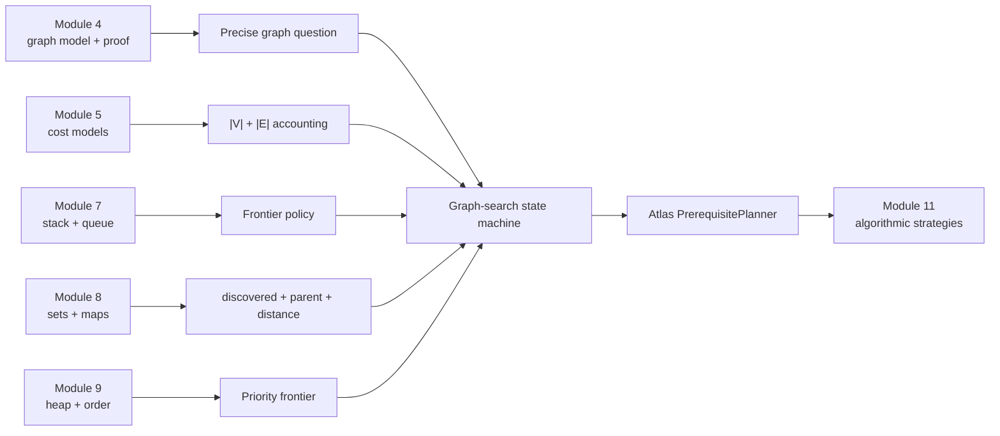
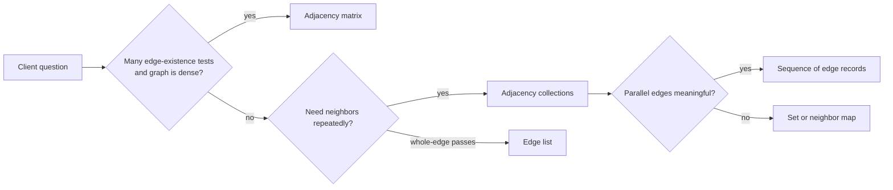
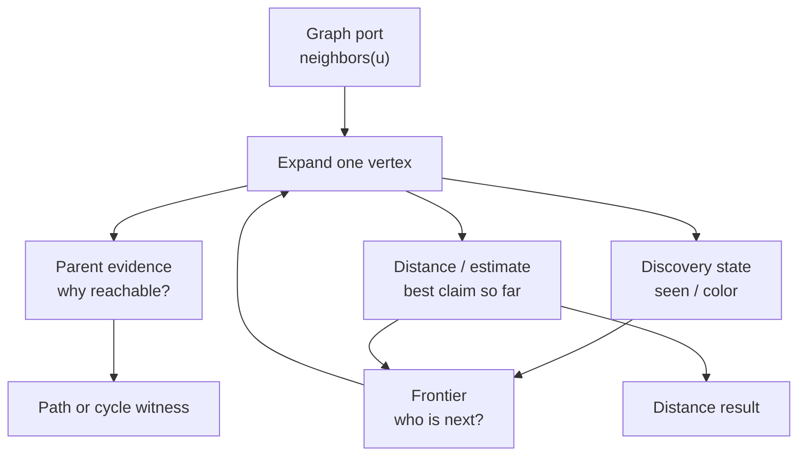
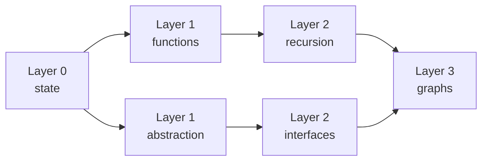
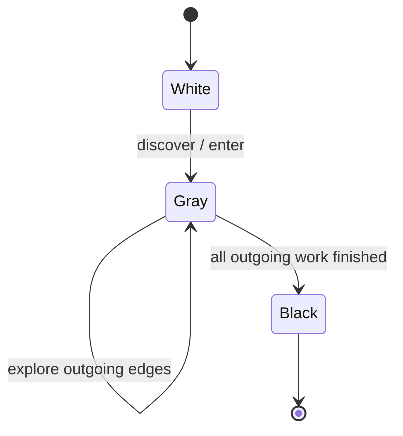
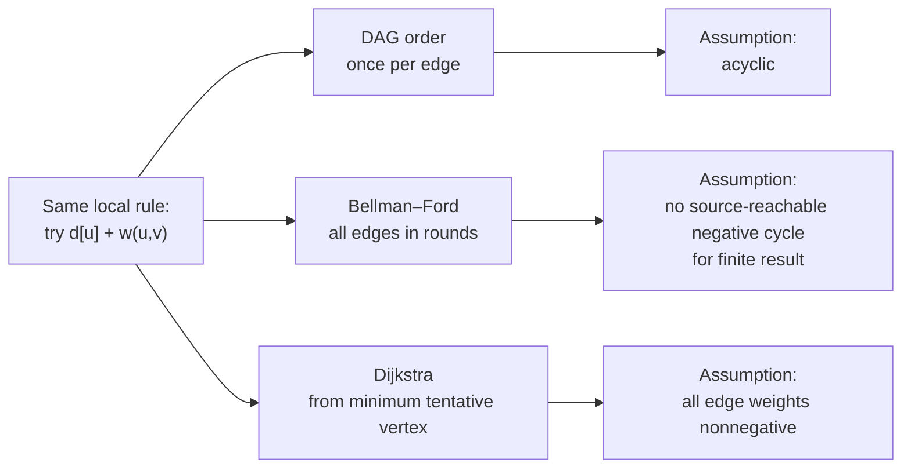
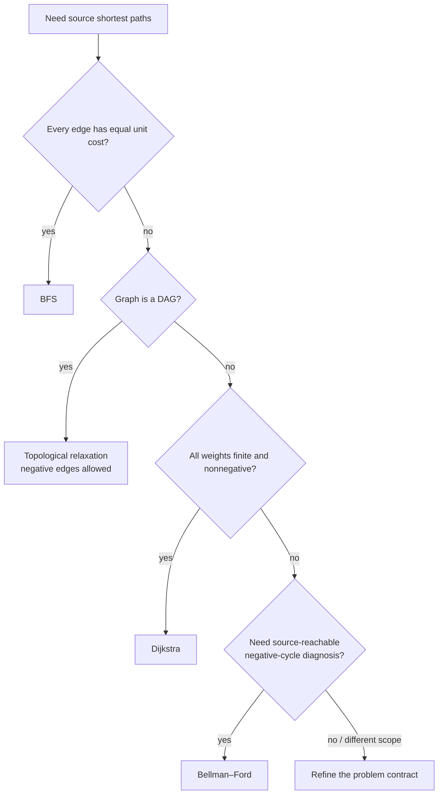
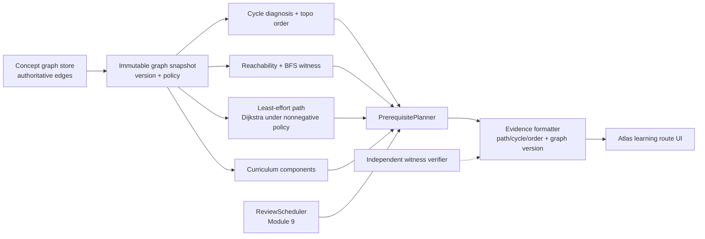
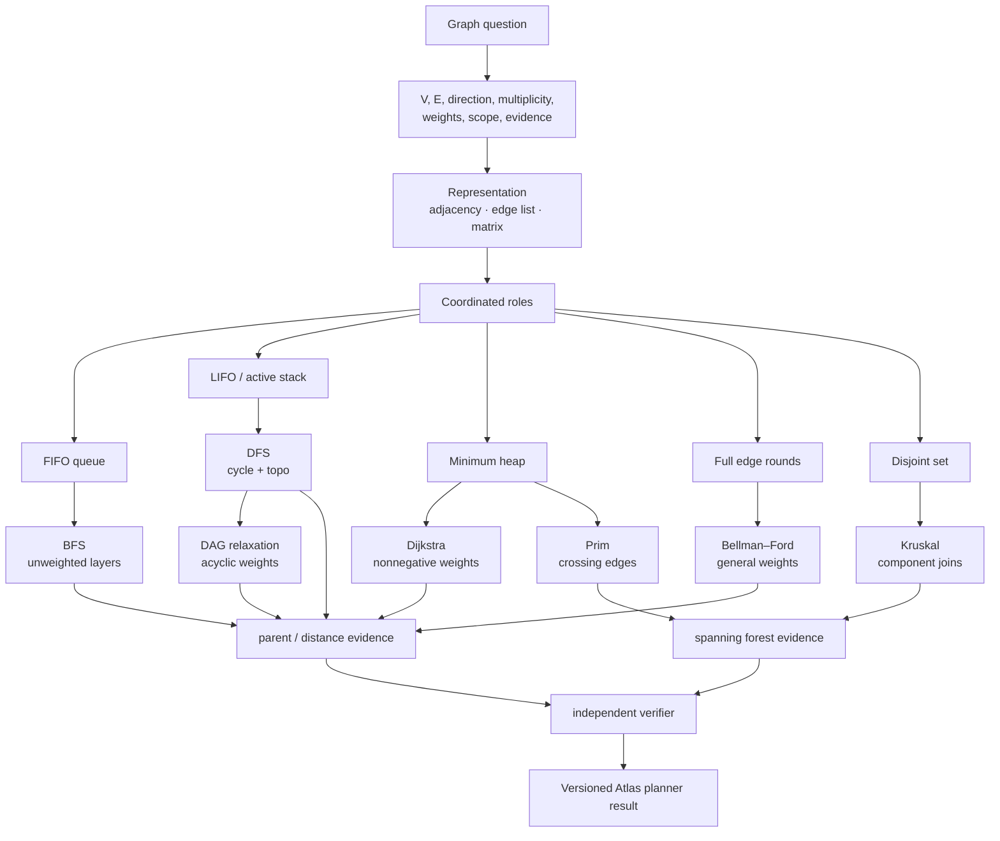

# Module 10 — Graph Algorithms and Network Models

## Position in the knowledge system

Atlas already stores events, processes streams, indexes notes, and schedules reviews. It also stores prerequisite claims such as:

```text
state → functions
state → abstraction
functions → recursion
abstraction → graphs
recursion → graphs
graphs → shortest paths
```

The arrows are useful only if Atlas can answer questions about them:

- Which concepts are reachable from `state`?
- Why is a concept reachable?
- Which concepts form separate curriculum components?
- Does a proposed prerequisite relation contain a cycle?
- What prerequisite-respecting order exists?
- What route uses the fewest prerequisite steps?
- What route has the least estimated learning cost?
- Which links connect a curriculum network at minimum total cost?

This module asks:

> How do we turn a graph question into a coordinated state machine whose representation, frontier, evidence, invariant, and cost all match the question?

The answer reconnects the whole of Arc II.



The structures have distinct jobs:

- the graph representation answers `neighbors(vertex)`;
- the frontier decides which discovered work happens next;
- a set or state map prevents accidental rediscovery;
- a parent map records a checkable witness;
- a distance map records the best claim known so far;
- a heap makes the smallest tentative claim available;
- a disjoint-set structure records which undirected components have already been joined.

Changing one role can change the theorem. Replacing a FIFO queue with a heap does not merely “optimize BFS”; it creates a different algorithm with different assumptions and invariants.

## How to use this workbook

For every algorithm:

1. state the client question;
2. define the mathematical graph and boundary policies;
3. choose the representation;
4. name every state component and its meaning;
5. predict one trace before running code;
6. state the invariant that makes the output trustworthy;
7. count work in terms of both vertices and represented edges;
8. test normal, boundary, and adversarial cases;
9. review generated code in dependency order;
10. save an explanation or witness, not only a final number.

Most code in this module is for reading, tracing, debugging, and reviewing. The only manually written mechanism is one small frontier transition plus one relaxation predicate. An agent may produce the surrounding implementation, but Michael owns the model and evidence.

## Claim-layer legend

Graph explanations often slide between mathematics, a Python program, and one library implementation. Keep the layers separate.

| Label | Meaning | Example |
|---|---|---|
| **[MATHEMATICAL MODEL]** | A definition or theorem about `G = (V, E)` | BFS distance is minimum edge count in an unweighted graph. |
| **[ATLAS CONTRACT]** | A product/domain policy clients may rely on | Prerequisite edges point from prerequisite to dependent. |
| **[PYTHON-LEVEL IMPLEMENTATION]** | A program that realizes the model using documented Python behavior | `dict` stores parent evidence and `set` stores membership state. |
| **[STANDARD-LIBRARY GUARANTEE]** | Behavior documented for a Python library API | `deque.popleft()` removes from the left; `heapq.heappop()` returns the smallest heap item. |
| **[IMPLEMENTATION OBSERVATION]** | A useful property of this concrete design, not a theorem about all graph libraries | Our lazy Dijkstra heap may retain stale entries. |
| **[COURSE MODEL]** | A deliberately small mechanism used to expose an invariant | Our disjoint set uses parent links, union by size, and path compression. |

Keep this boundary visible:

> A proof about a mathematical graph is not automatically a proof about malformed input, a Python representation, or an external graph service.

## Prerequisite retrieval

Answer without notes. Record **answer + confidence + one-sentence reason**.

1. **Module 4:** In a directed prerequisite graph, what does an edge `(u, v)` mean, and how does that differ from reachability?
2. **Module 4:** Why can a directed graph have a topological order exactly when it is acyclic?
3. **Module 4:** What would a counterexample to “every accepted route respects prerequisites” need to exhibit?
4. **Module 5:** Why is graph traversal usually parameterized by both `|V|` and `|E|`?
5. **Module 5:** What assumptions must accompany a dictionary or set lookup cost used inside a graph bound?
6. **Module 7:** Which removal end makes a frontier FIFO? Which makes it LIFO?
7. **Module 8:** Why do a discovered set and a parent dictionary answer different questions?
8. **Module 9:** What heap invariant makes the minimum item available at index zero?
9. **Module 9:** In Atlas's scheduler, why can an old heap entry remain physically present but be logically stale?
10. **Module 3:** What must remain stable if Atlas replaces an in-memory adjacency dictionary with a database adapter?

<details>
<summary>Reveal retrieval answers and repair routes</summary>

1. `(u, v)` is one immediate directed relation; reachability means that some directed path of zero or more edges connects the vertices.
2. A topological order makes every edge point forward, which is impossible around a directed cycle; conversely, an acyclic finite graph always has a removable source/sink or a valid reverse DFS finishing order.
3. One accepted route plus one represented edge whose prerequisite is missing or not earlier than its dependent.
4. A graph can have many edges for the same vertex count; scanning vertices and scanning adjacencies are different resources.
5. Name the representation, case, hashing/equality assumptions, and whether the claim is expected, amortized, or worst-case.
6. Removing from the same end after adding gives LIFO; adding right and removing left gives FIFO.
7. Discovered answers membership/state; parent records which edge first justified discovery and supports witness reconstruction.
8. Every parent key is less than or equal to its child keys, so the root is globally minimum.
9. Rescheduling inserts a new revision; the dictionary defines the one live revision and old physical entries are skipped when popped.
10. The graph operation contract, edge direction, error policies, and externally visible semantics—not the storage layout—must remain stable.

Return briefly to Module 4 for graph vocabulary/proof, Module 5 for cost claims, Module 7 for frontier discipline, Module 8 for membership/evidence maps, or Module 9 for heap currency and stale-entry reasoning.

</details>

## Mastery outcomes

By the end, Michael can:

1. derive a graph algorithm from a client question rather than from a memorized name;
2. distinguish directed, undirected, weighted, unweighted, simple, and parallel-edge models;
3. choose among adjacency collections, an edge list, and an adjacency matrix by workload and density;
4. specify policies for missing vertices, self-loops, parallel edges, and disconnected components;
5. recover a traversal architecture from unfamiliar code;
6. explain BFS and DFS as frontier-policy state machines;
7. distinguish discovery from processing and finalization;
8. reconstruct a path from parent evidence and independently verify it;
9. prove the BFS unweighted-shortest-path claim using layers;
10. use DFS states to diagnose directed cycles and justify topological order;
11. compute connected components without pretending one source reaches every vertex;
12. define weighted paths and the relaxation operation;
13. choose DAG relaxation, Bellman–Ford, or Dijkstra from weight/structure assumptions;
14. explain what a reachable negative cycle does to shortest-path meaning;
15. defend Dijkstra's finalized-distance invariant under nonnegative weights;
16. identify and skip stale Python heap entries without confusing physical storage with logical state;
17. distinguish a shortest-path tree from a minimum spanning tree;
18. explain the cut property behind Prim and Kruskal;
19. trace a disjoint set through `find` and `union`;
20. analyze time and auxiliary space in terms of representation and operations;
21. direct an agent through a bounded Atlas pathfinding change;
22. reject a plausible patch using a minimal counterexample and evidence packet.

---

## 1. Start with the graph question

A graph is not an algorithm. It is a model that supports several different questions.

| Atlas question | Output contract | Structural assumption that matters | First algorithmic idea |
|---|---|---|---|
| Is `target` reachable from `source`? | boolean or witness path | directed versus undirected | BFS or DFS |
| What is the fewest-edge route? | distance and path witness | every edge counts as one | BFS |
| Is every curriculum region covered? | partition into components | undirected/symmetric relation policy | full BFS/DFS |
| Is the prerequisite relation valid? | cycle witness or topological order | directed graph | DFS state or indegree queue |
| What is the least-cost route? | total weight and path witness | weight restrictions | DAG, Bellman–Ford, or Dijkstra |
| What edges connect all topics cheaply? | minimum spanning tree/forest | weighted undirected graph | Kruskal or Prim |

Two questions may consume the same adjacency representation and still require different frontier rules and proofs.

### The six-part graph question sheet

Before selecting an algorithm, fill in:

1. **Vertices:** What objects count as vertices?
2. **Edges:** What relation does an edge encode, and in which direction?
3. **Multiplicity:** Can parallel edges carry distinct meaning?
4. **Weights:** What does a weight mean, and which values are legal?
5. **Scope:** One source, one pair, every component, or all pairs?
6. **Evidence:** Boolean, order, distance, path, cycle, tree, or forest?

For Atlas prerequisites:

- **[ATLAS CONTRACT]** a vertex is a canonical concept ID;
- an edge `u → v` means `u` is an immediate prerequisite of `v`;
- duplicate edges are rejected at ingestion;
- self-loops are invalid domain data and should yield a cycle witness;
- the graph may be disconnected because independent curriculum regions can exist;
- an unweighted edge counts one prerequisite transition;
- a weighted edge may later represent estimated learning effort, but only under a documented nonnegative policy.

The algorithms remain robust to a self-loop even though the domain rejects it. Domain validation and algorithm safety are separate obligations.

## 2. The mathematical model and representation decision

### 2.1 Mathematical model

**[MATHEMATICAL MODEL]** A directed graph is `G = (V, E)` where:

- `V` is a set of vertices;
- `E ⊆ V × V` is a set of ordered pairs.

An undirected simple graph uses unordered vertex pairs and forbids parallel edges. A multigraph gives each parallel edge its own identity. A weighted graph associates a weight `w(e)` with each edge.

These choices are not decoration:

- in a directed graph, `u → v` does not imply `v → u`;
- a self-loop is immediately a directed cycle;
- two parallel transit routes can have different costs;
- a mapping `neighbor → weight` silently collapses parallel edges;
- a disconnected graph has no single spanning tree over all vertices.

### 2.2 Three common representations

Suppose `n = |V|` and `m = |E|`.

| Representation | Space | Enumerate outgoing neighbors of `u` | Test edge `u → v` | Preserve parallel edges? | Best fit |
|---|---:|---:|---:|---|---|
| adjacency sequence per vertex | `Θ(n+m)` | `Θ(outdegree(u))` | linear in neighbor sequence | yes, if entries are not deduplicated | sparse traversal |
| adjacency set/map per vertex | `Θ(n+m)` expected storage model | proportional to degree | expected constant membership | map collapses by neighbor unless value is a collection | sparse lookup-heavy graph |
| adjacency matrix | `Θ(n²)` | `Θ(n)` | `Θ(1)` index model | usually needs extra cell structure | dense graph, frequent edge tests |
| edge list | `Θ(m)` | `Θ(m)` without an index | `Θ(m)` | yes | whole-edge passes such as Kruskal/Bellman–Ford |

The table's costs are representation-level claims. A database-backed `neighbors(u)` can add query, network, and decoding costs even when the domain algorithm performs `Θ(n+m)` abstract operations.

### 2.3 Atlas representation contract

The small unweighted Python model is:

```python
from collections.abc import Hashable, Mapping, Sequence
from typing import TypeVar

Vertex = TypeVar("Vertex", bound=Hashable)
Graph = Mapping[Vertex, Sequence[Vertex]]
```

**[PYTHON-LEVEL IMPLEMENTATION]** Keys represent vertices with stored outgoing adjacency; neighbor-only vertices are still vertices. Algorithms therefore use `graph.get(vertex, ())` rather than assuming every endpoint is a key.

The sequence preserves parallel adjacency entries. Atlas's ingestion layer rejects duplicates, but generic traversal remains correct if duplicates arrive: the discovered state prevents repeated logical discovery.

For a weighted graph:

```python
WeightedGraph = Mapping[Vertex, Sequence[tuple[Vertex, float]]]
```

Using a sequence of `(neighbor, weight)` pairs preserves parallel edges. Replacing it with `Mapping[Vertex, float]` would choose a one-weight-per-neighbor policy. That can be valid, but it is a domain decision, not a harmless refactor.

### Representation visual



### Prediction: representation loss

Atlas has two routes from `graphs` to `optimization`:

```text
graphs → optimization, cost 7
graphs → optimization, cost 3
```

Predict what information remains after:

```python
outgoing = {"optimization": 7}
outgoing["optimization"] = 3
```

Only one edge remains. If parallel alternatives matter, the representation has changed the mathematical input before any algorithm begins.

## 3. One traversal architecture, several frontier policies

A graph search coordinates roles:



The generic transition is:

```text
remove one eligible frontier item
for each represented outgoing edge:
    decide whether the edge improves or discovers state
    if yes, update evidence
    add the new state to the frontier
```

The word “eligible” carries the algorithm:

| Frontier | Next item | Main consequence |
|---|---|---|
| FIFO queue | earliest discovered | nondecreasing edge-count layers |
| LIFO stack / active call | most recently discovered | deep exploration and finishing structure |
| minimum heap | smallest tentative key | greedy finalization under a proof-specific assumption |
| repeated full edge pass | every edge in stable rounds | paths using progressively more edges |

### Discovery and finalization are different

- **discovered:** the algorithm has a first reason to know about a vertex;
- **processed/expanded:** its outgoing adjacency has been inspected;
- **finalized:** a problem-specific theorem says the recorded answer cannot improve.

In BFS, discovery fixes the shortest unweighted distance. In Dijkstra, insertion into the heap does **not** finalize a distance; the current minimum is finalized when removed under nonnegative weights. In DFS, finishing a vertex means all reachable work through its active call has returned.

Conflating these states is one of the most common generated-code defects.

## 4. Breadth-first search: FIFO creates layers

### 4.1 Concrete observation

From a source `s`, every outgoing neighbor is one edge away. Only after all one-edge discoveries should we expand two-edge routes. FIFO order enforces that temporal rule.



### 4.2 Predict before running

For:

```python
atlas = {
    "state": ("functions", "abstraction"),
    "functions": ("recursion",),
    "abstraction": ("interfaces",),
    "recursion": ("graphs",),
    "interfaces": ("graphs",),
    "graphs": (),
}
```

Predict:

1. the queue after expanding `state`;
2. when `graphs` is first discovered;
3. which parent it receives;
4. whether the other equally short parent is retained.

The answer to item 3 depends on neighbor order. BFS promises a shortest path, not a unique shortest path. If Atlas needs all shortest explanations, the evidence representation must retain all predecessors satisfying `distance[v] = distance[u] + 1`.

### 4.3 Executable model

```python
from collections import deque
from collections.abc import Hashable, Mapping, Sequence
from typing import TypeVar

V = TypeVar("V", bound=Hashable)


def bfs_tree(
    graph: Mapping[V, Sequence[V]],
    source: V,
) -> tuple[dict[V, V | None], dict[V, int]]:
    """Return one shortest-edge-count parent tree and distances from source."""
    frontier = deque([source])
    parent: dict[V, V | None] = {source: None}
    distance: dict[V, int] = {source: 0}

    while frontier:
        u = frontier.popleft()
        for v in graph.get(u, ()):
            if v in distance:
                continue
            distance[v] = distance[u] + 1
            parent[v] = u
            frontier.append(v)

    return parent, distance


def reconstruct_path(
    parent: Mapping[V, V | None],
    target: V,
) -> tuple[V, ...] | None:
    """Return the source-to-target parent path, or None if target is absent."""
    if target not in parent:
        return None

    reverse_path: list[V] = []
    cursor: V | None = target
    checked: set[V] = set()

    while cursor is not None:
        if cursor in checked:
            raise ValueError("parent evidence contains a cycle")
        checked.add(cursor)
        reverse_path.append(cursor)
        cursor = parent[cursor]

    reverse_path.reverse()
    return tuple(reverse_path)
```

**[STANDARD-LIBRARY GUARANTEE]** Python 3.14 documents `deque.append()` and `deque.popleft()` and describes efficient end operations. BFS depends on FIFO behavior; the mathematical theorem does not depend on CPython's internal deque blocks.

### 4.4 Representation invariant

During BFS:

1. `source` has distance zero and parent `None`;
2. a vertex is in the queue only after it is in `distance`;
3. each non-source discovered vertex has one parent edge represented in the graph;
4. `distance[v] = distance[parent[v]] + 1`;
5. vertices leave the queue in nondecreasing recorded distance.

The `distance` dictionary doubles as the discovered set. That is safe because membership has the exact needed meaning. A separate set would duplicate state and create a synchronization obligation.

### 4.5 Why the path is shortest

Let BFS remove vertices in layers.

- The source is correctly at distance `0`.
- Suppose every vertex removed before layer `k` has its minimum edge-count distance.
- A vertex first discovered from layer `k-1` has a path of length `k`.
- If it had a shorter path, its predecessor on that path would lie in an earlier layer and would have discovered it earlier.

Therefore first discovery records a shortest edge-count distance. Parent links select actual edges that realize that count, so they are proof witnesses, not logging decoration.

### 4.6 Intentionally broken BFS

```python
def bfs_broken(graph, source):
    frontier = deque([source])
    seen = set()
    parent = {source: None}
    while frontier:
        u = frontier.popleft()
        seen.add(u)                  # too late
        for v in graph.get(u, ()):
            if v not in seen:
                parent[v] = u        # can overwrite evidence
                frontier.append(v)   # can enqueue repeatedly
    return parent
```

Use the diamond:

```text
s → a → t
 \→ b →/
```

Both `a` and `b` can enqueue `t` before `t` is removed. On a dense graph, delayed marking can create far more frontier entries and unstable parent evidence. Repair by marking at discovery/enqueue time.

### 4.7 Boundary cases

| Input | Correct BFS behavior |
|---|---|
| self-loop `u → u` | `u` is already discovered; no second enqueue |
| duplicate/parallel adjacency entries | first discovery wins; later entries are ignored |
| directed cycle | discovered state prevents infinite traversal |
| target in another component | absent from `distance`; path is `None` |
| source absent as a key | still treated as an isolated source unless the domain contract rejects it |
| empty graph plus requested source | algorithm returns the singleton source state; validation may reject unknown source first |

The last two rows show model versus product policy. A generic search can define a source vertex by the query itself; Atlas may require canonical registration before planning.

## 5. Full traversal and connected components

One BFS answers what is reachable from one source. It does not prove the entire graph is connected.

For an undirected graph, a full traversal repeatedly starts from an undiscovered vertex:

```python
def vertices_in_first_seen_order(
    graph: Mapping[V, Sequence[V]],
) -> tuple[V, ...]:
    ordered: list[V] = []
    seen: set[V] = set()
    for u, neighbors in graph.items():
        if u not in seen:
            seen.add(u)
            ordered.append(u)
        for v in neighbors:
            if v not in seen:
                seen.add(v)
                ordered.append(v)
    return tuple(ordered)


def undirected_components(
    graph: Mapping[V, Sequence[V]],
) -> tuple[frozenset[V], ...]:
    """Partition vertices; precondition: adjacency represents an undirected graph."""
    discovered: set[V] = set()
    components: list[frozenset[V]] = []

    for source in vertices_in_first_seen_order(graph):
        if source in discovered:
            continue
        frontier = [source]
        discovered.add(source)
        component: set[V] = set()

        while frontier:
            u = frontier.pop()
            component.add(u)
            for v in graph.get(u, ()):
                if v not in discovered:
                    discovered.add(v)
                    frontier.append(v)

        components.append(frozenset(component))

    return tuple(components)
```

The stack changes visit order, not component membership. The precondition matters: on a directed graph, “component” could mean weakly connected, strongly connected, or source-reachable. Those are different contracts. Calling the function `components` without naming the relation is an architecture smell.

**Cost:** with adjacency collections and expected constant-time set operations, full traversal takes `Θ(|V| + |E_repr|)` time and `Θ(|V|)` auxiliary state. For an undirected adjacency list, one logical non-self-loop edge usually contributes two represented adjacency entries. State which `E` you count.

## 6. Depth-first search: active paths and finishing evidence

### 6.1 Why LIFO changes what we can know

DFS pursues one discovered path until it cannot continue, then returns to the most recent unfinished choice. That active nesting exposes:

- ancestry in the DFS forest;
- an edge back to an active ancestor, which witnesses a directed cycle;
- a finishing order after every descendant has finished.



- **white:** undiscovered;
- **gray:** active—discovered but not finalized;
- **black:** finished—all represented outgoing edges have been examined.

An edge from gray `u` to gray `v` is a back edge to an active ancestor and therefore a directed cycle witness. An edge to a black vertex is not by itself a cycle.

### 6.2 Why “replace queue with stack” is incomplete

For reachability, a simple stack works. For cycle witnesses and topological order, the algorithm must distinguish:

1. entering a vertex;
2. resuming after a child;
3. finishing a vertex.

Recursive calls retain that state in frames. An iterative version needs explicit frames such as `(vertex, next_neighbor_index)` or enter/exit events. A stack of bare vertices loses finishing structure.

### 6.3 Executable cycle diagnosis and topological order

```python
class DirectedCycleError(ValueError):
    def __init__(self, cycle: tuple[object, ...]) -> None:
        super().__init__(f"directed cycle: {cycle!r}")
        self.cycle = cycle


def topological_order(
    graph: Mapping[V, Sequence[V]],
) -> tuple[V, ...]:
    """Return an order with every represented edge forward; raise with a cycle."""
    # 0/absent = white, 1 = gray, 2 = black
    color: dict[V, int] = {}
    active: list[V] = []
    active_index: dict[V, int] = {}
    finishing_order: list[V] = []

    def visit(u: V) -> None:
        state = color.get(u, 0)
        if state == 2:
            return
        if state == 1:
            start = active_index[u]
            raise DirectedCycleError(tuple(active[start:] + [u]))

        color[u] = 1
        active_index[u] = len(active)
        active.append(u)

        for v in graph.get(u, ()):
            visit(v)

        popped = active.pop()
        assert popped == u
        del active_index[u]
        color[u] = 2
        finishing_order.append(u)

    for vertex in vertices_in_first_seen_order(graph):
        if color.get(vertex, 0) == 0:
            visit(vertex)

    finishing_order.reverse()
    return tuple(finishing_order)
```

### 6.4 Predict before executing

Trace:

```python
cyclic = {
    "functions": ("recursion",),
    "recursion": ("proof",),
    "proof": ("functions",),
    "isolated": (),
}
```

Write the `active` list immediately before the exception. Then check that the reported tuple:

1. starts and ends at the same vertex;
2. has at least one edge;
3. follows a represented edge at every adjacent pair.

The independently checkable witness matters more than a bare `True`.

### 6.5 Correctness argument

If the algorithm finishes without a gray-to-gray edge:

- for every edge `u → v`, either DFS visits `v` during `u`'s active interval and finishes `v` before `u`, or `v` was already black;
- therefore `v` appears before `u` in finishing order;
- reversing finishing order places `u` before `v`.

So every edge points forward in the returned order.

If a gray-to-gray edge `u → v` is found, the active stack contains a directed DFS-tree path `v ⇝ u`; adding `u → v` closes a directed cycle. The exception carries that witness.

### 6.6 Intentionally broken cycle detector

```python
def has_cycle_broken(graph):
    seen = set()

    def visit(u):
        if u in seen:
            return True
        seen.add(u)
        return any(visit(v) for v in graph.get(u, ()))

    return any(visit(u) for u in graph)
```

This labels any edge to any previously seen vertex as a cycle. The DAG `a → c ← b` can be rejected after `c` was completed from `a` and later encountered from `b`. Cycle detection needs an **active** state, not only an **ever discovered** state.

### 6.7 Recursion boundary

The recursive implementation mirrors the proof and is excellent for a small mechanism. A long chain can exceed Python's recursion limit. Raising the process-wide limit does not remove C/Python stack risk. Production Atlas should either:

- validate an input-depth bound;
- use an explicit frame stack;
- or delegate traversal to a tested graph/storage layer with an explicit contract.

That is a systems constraint layered on top of the mathematical `Θ(|V|+|E|)` work bound.

## 7. Weighted paths: the question changes before the code

### 7.1 From edge count to total weight

For a path:

```text
p = v₀ → v₁ → ... → vₖ
```

its weight is:

```text
w(p) = Σ w(vᵢ₋₁, vᵢ), for i = 1..k
```

An unweighted shortest path minimizes `k`, the number of edges. A weighted shortest path minimizes the sum. These can disagree:

```text
state ──10──▶ graphs
state ── 2──▶ proof ── 2──▶ graphs
```

BFS prefers the one-edge route of cost `10`; weighted shortest path prefers the two-edge route of cost `4`.

Before using weights, Atlas must define their meaning:

- estimated minutes;
- cognitive switching cost;
- risk-adjusted effort;
- or another nonnegative quantity.

Combining unrelated units creates meaningless paths even if the algorithm is implemented perfectly.

### 7.2 Negative edges and negative cycles

A negative edge does not by itself destroy shortest paths. A DAG may contain negative edges and still have finitely many paths.

A **reachable negative cycle** changes the problem. If the cycle is reachable from source `s`, and target `t` is reachable from the cycle, then Atlas can loop around the cycle repeatedly before going to `t`, decreasing walk cost without bound. There is no finite minimum walk weight.

Boundary distinctions:

- a negative self-loop is a negative cycle;
- a negative cycle in a disconnected component is not reachable from this source;
- a zero-weight cycle does not lower cost indefinitely;
- for an all-destinations API, any source-reachable negative cycle invalidates at least part of the distance result;
- for one target, the cycle matters only if it can also reach that target.

Our Bellman–Ford API raises when **any** negative cycle is reachable from the source. It does not claim that every target is affected.

## 8. Relaxation: one local improvement rule

Suppose `distance[u]` is the best source-to-`u` path weight currently known. Edge `u → v` creates a candidate:

```text
candidate = distance[u] + weight(u, v)
```

**Relaxation** applies:

```python
if candidate < distance[v]:
    distance[v] = candidate
    parent[v] = u
```

The update has two inseparable parts:

- `distance[v]` records the numerical claim;
- `parent[v]` records the edge that currently witnesses the claim.

Updating one without the other can produce a plausible number with an invalid explanation.

### Relaxation invariant

Initially:

- `distance[source] = 0`, witnessed by the empty path;
- every other distance is infinity, meaning “no path witnessed yet.”

Every finite distance produced by relaxation is the weight of an actual represented source-to-vertex walk, and its parent chain records such a walk unless a reachable negative cycle makes parent evidence cyclic.

Relaxation never increases a distance. What differs across algorithms is **which edges are relaxed, in what order, and when a distance becomes final**.



### Mechanism-revealing manual step

Write only this function by hand:

```python
def relax(
    u: str,
    v: str,
    weight: float,
    distance: dict[str, float],
    parent: dict[str, str | None],
) -> bool:
    """Apply one improvement and report whether state changed."""
    ...
```

Before typing, state:

1. what infinity means;
2. why an unreachable `u` cannot improve `v`;
3. why the comparison is strict;
4. what parent update is required;
5. which weight values the local rule itself allows.

The local rule allows a negative edge. Dijkstra's global finalization proof does not.

### Broken relaxation

```python
if distance[u] + weight <= distance[v]:
    distance[v] = distance[u] + weight
    # parent is not updated
```

The non-strict comparison can rewrite equal-cost parent evidence repeatedly, possibly making output depend on traversal and parallel-edge order. Omitting the parent update disconnects explanation from the numeric result. Equal-cost tie policy is a product decision; it should be explicit.

## 9. DAG shortest paths: dependency order does the scheduling

In a DAG, a topological order places every predecessor before its dependent. Once all incoming possibilities for `u` have been processed, `u` can safely send improvements forward. Negative edges are allowed because no cycle can reopen an earlier dependency.

```python
from math import inf, isfinite


def weighted_vertices_in_first_seen_order(
    graph: Mapping[V, Sequence[tuple[V, float]]],
) -> tuple[V, ...]:
    ordered: list[V] = []
    seen: set[V] = set()
    for u, outgoing in graph.items():
        if u not in seen:
            seen.add(u)
            ordered.append(u)
        for v, _ in outgoing:
            if v not in seen:
                seen.add(v)
                ordered.append(v)
    return tuple(ordered)


def weighted_edges(
    graph: Mapping[V, Sequence[tuple[V, float]]],
) -> tuple[tuple[V, V, float], ...]:
    return tuple(
        (u, v, weight)
        for u, outgoing in graph.items()
        for v, weight in outgoing
    )


def dag_shortest_paths(
    graph: Mapping[V, Sequence[tuple[V, float]]],
    source: V,
) -> tuple[dict[V, V | None], dict[V, float]]:
    plain: dict[V, tuple[V, ...]] = {
        u: tuple(v for v, _ in outgoing)
        for u, outgoing in graph.items()
    }
    for vertex in weighted_vertices_in_first_seen_order(graph):
        plain.setdefault(vertex, ())
    plain.setdefault(source, ())

    order = topological_order(plain)  # raises with a cycle witness
    distance = {vertex: inf for vertex in order}
    parent: dict[V, V | None] = {source: None}
    distance[source] = 0.0

    for u in order:
        if distance[u] == inf:
            continue
        for v, weight in graph.get(u, ()):
            if not isfinite(weight):
                raise ValueError("DAG edge weights must be finite")
            candidate = distance[u] + weight
            if candidate < distance[v]:
                distance[v] = candidate
                parent[v] = u

    return parent, distance
```

### Correctness argument

Process vertices in topological order. When `u` is reached, every edge entering `u` comes from an earlier vertex. By induction over the order, those earlier distances are already correct, so relaxing all incoming possibilities has made `distance[u]` correct. Relaxing `u`'s outgoing edges prepares later vertices.

No later vertex has an edge back to `u`, so negative weights cannot invalidate `u` after it is processed.

**Cost:** topological ordering plus one relaxation per represented edge takes `Θ(|V|+|E|)` time and `Θ(|V|)` auxiliary map/stack space, excluding returned maps. Recursive stack depth can reach `|V|`; an iterative implementation changes that systems risk without changing asymptotic work.

### Atlas connection

If the prerequisite graph is valid, estimated learning costs can be negative only under a strange interpretation such as “credit” for prior mastery. DAG relaxation still works. But if weights represent minutes, negative values violate the domain model even though the algorithm permits them.

Algorithm capability does not define product meaning.

## 10. Bellman–Ford: make path length explicit

Any simple path in a graph with `|V|` vertices has at most `|V|-1` edges. If no reachable negative cycle exists, some shortest walk can be made simple by removing nonnegative cycles. Bellman–Ford therefore performs enough full edge-relaxation rounds to propagate every possible simple-path improvement.

After round `k`, the intended invariant is:

> `distance[v]` is the minimum weight among source-to-`v` walks using at most `k` edges, for every witnessed vertex.

### Executable model with a cycle witness

```python
class NegativeCycleError(ValueError):
    def __init__(self, cycle: tuple[object, ...]) -> None:
        super().__init__(f"source-reachable negative cycle: {cycle!r}")
        self.cycle = cycle


def _extract_parent_cycle(
    parent: Mapping[V, V | None],
    witness: V,
    vertex_count: int,
) -> tuple[V, ...]:
    cursor = witness
    for _ in range(vertex_count):
        predecessor = parent.get(cursor)
        if predecessor is None:
            raise RuntimeError("relaxation witness has no parent cycle")
        cursor = predecessor

    start = cursor
    reverse_cycle = [start]
    cursor = parent[start]
    while cursor != start:
        if cursor is None:
            raise RuntimeError("parent chain ended while extracting cycle")
        reverse_cycle.append(cursor)
        cursor = parent[cursor]
    reverse_cycle.append(start)
    reverse_cycle.reverse()
    return tuple(reverse_cycle)


def bellman_ford(
    graph: Mapping[V, Sequence[tuple[V, float]]],
    source: V,
) -> tuple[dict[V, V | None], dict[V, float]]:
    vertices = list(weighted_vertices_in_first_seen_order(graph))
    if source not in vertices:
        vertices.append(source)
    edges = weighted_edges(graph)

    for _, _, weight in edges:
        if not isfinite(weight):
            raise ValueError("edge weights must be finite")

    distance = {vertex: inf for vertex in vertices}
    parent: dict[V, V | None] = {source: None}
    distance[source] = 0.0

    for _ in range(max(0, len(vertices) - 1)):
        changed = False
        for u, v, weight in edges:
            if distance[u] == inf:
                continue
            candidate = distance[u] + weight
            if candidate < distance[v]:
                distance[v] = candidate
                parent[v] = u
                changed = True
        if not changed:
            break

    witness: V | None = None
    for u, v, weight in edges:
        if distance[u] != inf and distance[u] + weight < distance[v]:
            distance[v] = distance[u] + weight
            parent[v] = u
            witness = v

    if witness is not None:
        cycle = _extract_parent_cycle(parent, witness, len(vertices))
        raise NegativeCycleError(cycle)

    return parent, distance
```

### Predict before running

Classify each graph:

1. `s → a` weight `-2`, no cycles;
2. `s → a` weight `1`, `a → a` weight `-1`;
3. source component is acyclic, but a disconnected component has a negative cycle;
4. `s → a` weight `3`, `a → b` weight `-5`, `s → b` weight `0`;
5. two parallel edges `s → a` with weights `7` and `2`.

Expected:

1. finite result;
2. raises with the self-loop cycle;
3. does not raise in this source-specific run;
4. finds `-2` through `a`;
5. preserves and uses the lighter parallel edge.

### Why the extra pass diagnoses a reachable negative cycle

After `|V|-1` rounds, every simple source path has had enough edges to propagate. If another reachable relaxation succeeds, the improving walk uses at least `|V|` edges and repeats a vertex. The repeated section is a cycle. Because removing a nonnegative cycle could not improve the walk, an improving repeated section must include negative total weight.

Following parent pointers `|V|` times enters that cycle; continuing until the start repeats extracts a concrete witness.

### Cost

With an edge list:

- at most `|V|-1` full passes plus one diagnostic pass;
- `Θ(|V||E|)` worst-case time;
- `Θ(|V|)` distance/parent state;
- early stopping improves some instances but does not change the worst-case bound.

The bound is deterministic. It does not rely on expected hashing except for Python map-operation costs in this concrete implementation.

## 11. Dijkstra: greedily finalize the minimum tentative distance

Bellman–Ford ignores tentative order and repeatedly scans all edges. If every edge weight is nonnegative, a stronger fact becomes available:

> When an unfinalized vertex with minimum tentative distance is removed, no later path through another unfinalized vertex can make it smaller.

Why? Any such alternative must first reach an unfinalized vertex whose tentative lower bound is at least the removed minimum, then add only nonnegative edge weight.

That is Dijkstra's finalization invariant. It is a theorem under a precondition, not a heuristic that “usually works.”

### 11.1 Reuse Module 9's heap discipline

Module 9's Atlas scheduler maintains:

- a heap of physical entries;
- a dictionary defining the one live revision;
- stale physical entries skipped on pop.

Python's `heapq` does not provide a general decrease-key operation. Our Dijkstra implementation uses the same physical/logical distinction:

- `distance[v]` is the authoritative current tentative key;
- every improvement pushes a fresh heap entry;
- an older entry becomes stale;
- a popped entry is current only when its key equals `distance[v]`;
- only a current minimum can be finalized.

The concepts transfer, but the liveness predicates differ:

| Module 9 scheduler | Module 10 Dijkstra |
|---|---|
| current `(priority, revision)` equals live dictionary state | popped distance equals authoritative `distance[vertex]` |
| cancel/re-add requires a revision | strict distance improvement supplies a new numeric key |
| periodic rebuild can bound stale scheduling debt | optional heap rebuild can bound stale path-entry memory |

### 11.2 Executable Python model

```python
from heapq import heappop, heappush
from itertools import count


def dijkstra(
    graph: Mapping[V, Sequence[tuple[V, float]]],
    source: V,
) -> tuple[dict[V, V | None], dict[V, float], tuple[V, ...]]:
    """Return parent evidence, distances, and finalization order."""
    vertices = list(weighted_vertices_in_first_seen_order(graph))
    if source not in vertices:
        vertices.append(source)

    for u, v, weight in weighted_edges(graph):
        if not isfinite(weight) or weight < 0:
            raise ValueError(
                f"Dijkstra requires finite nonnegative weights: {u!r}->{v!r}"
            )

    distance = {vertex: inf for vertex in vertices}
    parent: dict[V, V | None] = {source: None}
    distance[source] = 0.0

    serial = count()
    frontier: list[tuple[float, int, V]] = [
        (0.0, next(serial), source)
    ]
    finalized: set[V] = set()
    finalization_order: list[V] = []

    while frontier:
        popped_distance, _, u = heappop(frontier)

        if popped_distance != distance[u]:   # stale improvement record
            continue
        if u in finalized:                   # defensive duplicate guard
            continue

        finalized.add(u)
        finalization_order.append(u)

        for v, weight in graph.get(u, ()):
            candidate = popped_distance + weight
            if candidate < distance[v]:
                distance[v] = candidate
                parent[v] = u
                heappush(
                    frontier,
                    (candidate, next(serial), v),
                )

    return parent, distance, tuple(finalization_order)
```

The monotonically increasing `serial` prevents Python from comparing vertex objects when two priorities tie. That is a Python-level representation issue, not part of Dijkstra's mathematical model.

### 11.3 Trace a stale entry

```text
s → a, weight 10
s → b, weight 2
b → a, weight 3
```

Heap evolution:

1. pop `(0, s)`; push `(10, a)` and `(2, b)`;
2. pop `(2, b)`; improve `a` to `5`; push `(5, a)`;
3. pop `(5, a)`; finalize `a`;
4. later pop `(10, a)`; compare with authoritative `distance[a] == 5`; skip stale entry.

The heap invariant is not broken. Physical presence does not imply logical currency.

### 11.4 Intentionally broken Dijkstra

```python
def dijkstra_broken(graph, source):
    heap = [(0, source)]
    seen = {source}
    distance = {source: 0}
    while heap:
        d, u = heappop(heap)
        for v, weight in graph.get(u, ()):
            if v not in seen:
                seen.add(v)                 # finalizes at insertion
                distance[v] = d + weight
                heappush(heap, (distance[v], v))
    return distance
```

The stale-entry issue is not the first defect. This code treats discovery as finalization. The preceding `10/2/3` graph records `a = 10` and forbids improvement to `5`.

Even a correctly stale-aware implementation is wrong if it silently accepts negative edges:

```text
s → a, 2
s → b, 5
b → a, -10
```

If `a` is finalized at `2`, the later route of `-5` contradicts the theorem. Reject invalid weights before returning any result.

### 11.5 Correctness invariant

At every iteration:

1. each finite tentative distance is witnessed by a represented source walk;
2. the heap contains a current entry for every reachable unfinalized vertex with a finite tentative distance, possibly plus stale entries;
3. every finalized vertex has its true shortest-path distance;
4. nonnegative edges prevent a path through an unfinalized vertex from improving the current minimum.

Induct on finalization count. The source is correct at zero. For the minimum current `u`, suppose a shorter path existed. Let `x → y` be the first edge on that path leaving the finalized set. The prefix to `x` has already been correctly relaxed, and nonnegative remaining weight means `y` would have a tentative key no larger than the alleged shorter route to `u`, contradicting that `u` was the minimum current entry.

### 11.6 Honest cost for this implementation

Let `m` count represented directed edge records.

- Each successful strict relaxation pushes one entry, so there are at most `m` improvement pushes after the source.
- The heap may hold `Θ(m)` entries because stale records remain.
- Each push/pop costs `O(log(m+1))` in the binary-heap model.
- Total time is `O((|V|+|E|) log(|E|+1))` plus adjacency/map costs.
- Auxiliary state is `O(|V|+|E|)` in the worst case for maps, finalized state, and lazy heap entries.

For a simple graph, `log |E| = O(log |V|²) = O(log |V|)`, so texts often report `O((|V|+|E|) log |V|)`. A true decrease-key heap can also keep only one priority entry per vertex. Our claim names the actual lazy representation.

## 12. Choose the shortest-path algorithm from assumptions



| Algorithm | Structural/weight precondition | Main scheduling rule | Time in the stated model | Negative-cycle behavior |
|---|---|---|---:|---|
| BFS | equal unit edge cost | FIFO layers | `Θ(V+E)` | weights not represented |
| DAG relaxation | directed acyclic | topological order | `Θ(V+E)` | impossible because no cycle |
| Bellman–Ford | finite weights; finite result requires no source-reachable negative cycle | up to `V-1` full edge rounds | `O(VE)` | detects source-reachable cycle |
| Dijkstra with lazy binary heap | finite nonnegative weights | finalize minimum current tentative key | `O((V+E) log(E+1))` | precondition excludes it |

Do not select Bellman–Ford merely because it “handles negatives.” First exploit a DAG if that structure is guaranteed; it is both more informative and asymptotically cheaper.

### All-pairs connection

Running a source algorithm from every vertex is one baseline for all-pairs shortest paths. MIT 6.006 Lecture 14 develops Johnson's reweighting: use Bellman–Ford-derived potentials to make edges nonnegative while preserving shortest-path comparisons, then run Dijkstra from each source. This module uses that result as a transfer reading rather than adding another implementation. The conceptual connection is:

> transform a representation while proving that the client-visible optimization question is preserved.

That is Module 3 representation independence expressed as an algorithmic proof obligation.

## 13. Minimum spanning trees: connect everything, not route from one source

### 13.1 A different optimization question

For a connected, weighted, undirected graph, a **spanning tree**:

- includes every vertex;
- is connected;
- contains no cycle;
- therefore has exactly `|V|-1` edges.

A **minimum spanning tree (MST)** minimizes the sum of its selected edge weights.

This is not a shortest-path tree.

```text
        2
    s ─── a
     \    |
    2 \   | 1
       \  |
         b
```

- A shortest-path tree rooted at `s` may choose `s-a` and `s-b`, preserving source distances with total edge weight `4`.
- An MST chooses `a-b` plus either source edge, with total weight `3`.

The shortest-path tree minimizes each route from one source. The MST minimizes total network weight while preserving connectivity. Neither objective implies the other.

For a disconnected graph, no spanning tree exists across all vertices. The honest output is a **minimum spanning forest**—one minimum tree per connected component—or a domain error if the contract requires global connectivity.

### 13.2 Boundary policies

- **Self-loop:** never connects two components and cannot belong to a tree, even if its weight is negative.
- **Parallel edges:** preserve them as distinct edge records; a lighter parallel edge may be selected.
- **Negative edge:** valid for MST; a tree cannot loop repeatedly, so negative-cycle reasoning is irrelevant.
- **Directed edge:** ordinary MST is defined here only for an undirected graph.
- **Disconnected graph:** return a forest plus its component partition.
- **Equal-weight ties:** several MSTs may exist; deterministic tie handling is a reproducibility policy, not uniqueness.

## 14. The cut property: the local choice needs a global proof

A **cut** partitions vertices into `S` and `V-S`. An edge crosses the cut when its endpoints are on opposite sides.

The safe-edge principle:

> A minimum-weight edge crossing a cut that respects the already chosen forest is contained in some minimum spanning tree.

### Exchange argument

Suppose a current safe forest is contained in an MST `T`, but `T` does not contain chosen light crossing edge `e`.

1. Add `e` to `T`; this creates one cycle.
2. That cycle contains another edge `f` crossing the same cut.
3. Because `e` is lightest across the cut, `w(e) ≤ w(f)`.
4. Remove `f`; connectivity remains and total weight does not increase.
5. The resulting spanning tree contains the old safe forest plus `e` and is still minimum.

This is why the greedy choice is safe. “Pick the cheapest-looking edge” without naming the cut would be an intuition, not a proof.


Kruskal and Prim expose different cuts:

- **Kruskal:** the current forest has several components; choose the next globally light edge that joins two of them.
- **Prim:** one growing tree defines `S`; choose the lightest edge from `S` to an unvisited vertex.

## 15. Kruskal and disjoint sets from first principles

### 15.1 The connectivity question inside Kruskal

Process undirected edges from lowest to highest weight. For each edge `(u, v)`, ask:

> Are `u` and `v` already connected by selected edges?

- If yes, adding the edge creates a cycle; skip it.
- If no, it joins two components; select it.

A disjoint-set structure supports:

- `find(x)`: return a representative of `x`'s current component;
- `union(x, y)`: merge components if distinct.

The representative is an internal name, not a graph path and not a semantic “leader.”

### 15.2 Course-model disjoint set

```python
class DisjointSet:
    """Course model: parent forest + union by size + path compression."""

    def __init__(self, items):
        self._parent = {item: item for item in items}
        self._size = {item: 1 for item in self._parent}

    def find(self, item):
        if item not in self._parent:
            raise KeyError(item)

        root = item
        while self._parent[root] != root:
            root = self._parent[root]

        while self._parent[item] != item:
            next_item = self._parent[item]
            self._parent[item] = root
            item = next_item

        return root

    def union(self, left, right) -> bool:
        left_root = self.find(left)
        right_root = self.find(right)
        if left_root == right_root:
            return False

        if self._size[left_root] < self._size[right_root]:
            left_root, right_root = right_root, left_root

        self._parent[right_root] = left_root
        self._size[left_root] += self._size[right_root]
        return True
```

Representation invariants:

1. every stored item has exactly one parent item;
2. following parents terminates at a root whose parent is itself;
3. two items are in the same component exactly when their roots are equal;
4. `_size[root]` is meaningful for roots; stale size fields on non-roots are not queried;
5. `union` changes connectivity only by linking one root under another root.

Path compression changes parent links without changing the component partition. It is representation refinement inside the same ADT.

With union by size and path compression, a sequence of operations has near-constant amortized cost, conventionally written `O(α(n))` per operation where `α` is the inverse Ackermann function. This module uses the result but does not hide it under the false claim “worst-case constant.” The advanced amortized proof belongs with later algorithm-analysis enrichment.

### 15.3 Executable Kruskal forest

Each undirected logical edge appears **once** in the edge list:

```python
def kruskal_forest(
    vertices: Sequence[V],
    edges: Sequence[tuple[V, V, float]],
) -> tuple[tuple[tuple[V, V, float], ...], tuple[frozenset[V], ...]]:
    """Return selected edges and final components for an undirected multigraph."""
    vertex_order = tuple(dict.fromkeys(vertices))
    vertex_set = set(vertex_order)
    dsu = DisjointSet(vertex_order)

    indexed_edges = list(enumerate(edges))
    for _, (u, v, weight) in indexed_edges:
        if u not in vertex_set or v not in vertex_set:
            raise ValueError("every edge endpoint must be declared")
        if not isfinite(weight):
            raise ValueError("edge weights must be finite")

    # Input position is the deterministic tie-breaker; vertices need not be orderable.
    indexed_edges.sort(key=lambda item: (item[1][2], item[0]))

    selected: list[tuple[V, V, float]] = []
    for _, (u, v, weight) in indexed_edges:
        if dsu.union(u, v):
            selected.append((u, v, weight))

    grouped: dict[V, set[V]] = {}
    for vertex in vertex_order:
        root = dsu.find(vertex)
        grouped.setdefault(root, set()).add(vertex)

    components = tuple(frozenset(group) for group in grouped.values())
    return tuple(selected), components
```

### 15.4 Predict before running

```python
vertices = ("state", "proof", "graphs", "systems")
edges = (
    ("state", "proof", 10),
    ("state", "proof", 2),    # parallel, lighter
    ("proof", "graphs", 1),
    ("graphs", "graphs", -8), # negative self-loop
)
```

Predict:

- which parallel edge is selected;
- why the negative self-loop is skipped;
- how many selected edges exist;
- why `systems` appears as a one-vertex component;
- whether the output is a tree or forest.

### 15.5 Kruskal cost

- sorting `|E|` edge records costs `O(|E| log |E|)`;
- there are `O(|E|)` disjoint-set operations;
- auxiliary representation is `O(|V|+|E|)` including the sorted edge sequence and component state;
- for a disconnected graph, the same process returns a minimum spanning forest.

The sorting step dominates under the disjoint-set amortized model.

## 16. Prim: a heap of crossing edges

Prim grows one component at a time. The frontier contains candidate edges crossing from visited to not-yet-visited vertices.

```python
def prim_forest(
    graph: Mapping[V, Sequence[tuple[V, float]]],
) -> tuple[tuple[V, V, float], ...]:
    """Precondition: graph is a finite undirected weighted adjacency multigraph."""
    for u, v, weight in weighted_edges(graph):
        if not isfinite(weight):
            raise ValueError(f"non-finite edge: {u!r}-{v!r}")

    visited: set[V] = set()
    selected: list[tuple[V, V, float]] = []
    serial = count()

    for start in weighted_vertices_in_first_seen_order(graph):
        if start in visited:
            continue

        visited.add(start)
        frontier: list[tuple[float, int, V, V]] = []
        for v, weight in graph.get(start, ()):
            heappush(frontier, (weight, next(serial), start, v))

        while frontier:
            weight, _, u, v = heappop(frontier)
            if v in visited:
                continue

            visited.add(v)
            selected.append((u, v, weight))

            for x, next_weight in graph.get(v, ()):
                if x not in visited:
                    heappush(
                        frontier,
                        (next_weight, next(serial), v, x),
                    )

    return tuple(selected)
```

**Representation precondition:** every undirected edge must be available from both endpoints, with matching weight and multiplicity. The function does not silently “make the graph undirected.” For parallel edges, validation must match edge records rather than compare a simple neighbor map.

Like Dijkstra, Prim may pop a stale physical entry:

- in Dijkstra, stale means its distance no longer matches the authoritative tentative distance;
- in Prim, stale means its destination is already inside the growing forest.

Both use a heap, but the liveness predicate and correctness theorem differ.

With lazy adjacency-edge pushes, time is `O(|E| log(|E|+1))` and the heap can contain `O(|E|)` entries. Textbook `O(E log V)` statements typically assume a simple graph or a vertex-key/decrease-key formulation. State the representation.

## 17. Connectivity: traversal and disjoint set answer related questions

| Need | Better first tool | Evidence available |
|---|---|---|
| discover every vertex in one static component | BFS/DFS | parent path and visit trace |
| list all static components from adjacency | full BFS/DFS | member partition; optional paths |
| process undirected edges and repeatedly ask whether endpoints are already joined | disjoint set | component representative/equivalence |
| delete edges and maintain dynamic connectivity | neither basic version alone | requires a more advanced data structure or recomputation |

Do not use disjoint-set parent pointers as an Atlas prerequisite explanation. They witness the internal component partition after unions, not a path in the original graph. The parent map from BFS/DFS is the graph-edge witness.

## 18. One boundary-case matrix for the whole module

| Case | Representation decision | Traversal/ordering behavior | Shortest-path behavior | MST behavior | Required evidence |
|---|---|---|---|---|---|
| self-loop | preserve for diagnosis | directed cycle immediately; BFS ignores rediscovery | negative loop can invalidate; nonnegative loop cannot improve | never selected | cycle or explicit skip |
| parallel edges | sequence preserves; neighbor map may collapse | reachability unchanged, work count changes | weights may change optimum | lighter edge may be selected | representation-policy test |
| disconnected graph | include isolated vertices explicitly | one-source traversal is partial; full traversal partitions | unreachable distance is infinity | forest, not global tree | component partition |
| directed cycle | adjacency direction preserved | topo must reject with witness | allowed unless weight cycle is negative | ordinary MST not defined | edge-following cycle |
| negative edge | weighted record | irrelevant to reachability | DAG/Bellman–Ford may allow; Dijkstra rejects | allowed | precondition test |
| negative cycle | weighted directed cycle | still reachable/cyclic | no finite minimum for affected targets | not an MST concept | reachable cycle witness |
| stale heap entry | physical heap record retained | not a BFS/DFS issue | Dijkstra skips if key is not current | Prim skips if endpoint already visited | trace plus invariant |
| mutation during search | snapshot/version policy | may mix graph states | witness may not match distance | cut may change mid-run | immutable snapshot/version |

This matrix is the adversarial regression plan, not an appendix. Every agent brief should select the rows relevant to its contract.

## 19. Atlas checkpoint: prerequisite planning and next-concept pathfinding

### 19.1 Evolving architecture



The graph and scheduler coordinate without becoming one structure:

- the prerequisite graph determines what is reachable and currently unlocked;
- the scheduler heap ranks eligible review work;
- the token index finds supporting notes;
- the planner combines results through explicit interfaces.

A single heap cannot replace reachability, and a graph traversal cannot replace priority ranking.

### 19.2 Snapshot contract

A result must be tied to one graph version:

```text
GraphSnapshot
    version
    vertices
    neighbors(vertex)
    weighted_neighbors(vertex, metric)
    edge_policy
```

If the adapter performs a fresh database query for each `neighbors(u)` while editors mutate edges concurrently, the algorithm may see no single mathematical graph. Parent paths can contain edges that never coexisted, and complexity can become `Θ(V+E)` network round trips rather than in-memory operations.

Atlas therefore either:

- loads an immutable snapshot;
- reads inside a database snapshot/transaction;
- or reports a weaker consistency contract explicitly.

This is the bridge from algorithms to the database and concurrency modules.

### 19.3 Route operations

| Planner operation | Algorithm | Contract |
|---|---|---|
| `explain_reachability(source, target)` | BFS | one minimum-edge-count path or `None` |
| `validate_prerequisites()` | DFS/topological order | order or concrete directed cycle |
| `curriculum_regions()` | full traversal on declared undirected view | component partition |
| `least_effort_path(source, target, metric)` | Dijkstra | minimum sum under finite nonnegative metric |
| `diagnose_imported_cost_graph(source)` | Bellman–Ford | finite distances or source-reachable negative cycle |
| `minimum_connection_forest()` | Kruskal/Prim on undirected view | selected forest plus components |

Atlas's production learning-effort metric is nonnegative, so Dijkstra is appropriate. Bellman–Ford is retained for imported-data diagnosis and conceptual transfer, not selected reflexively.

### 19.4 One event through the planner

Request:

```text
"Show the least estimated-effort route from state to async systems."
```

Flow:

1. the use case requests graph version `g42` and metric version `effort-v3`;
2. validation confirms finite nonnegative weights;
3. Dijkstra reads adjacency, updates authoritative distances, and skips stale heap entries;
4. the target is accepted only when its current heap entry is finalized;
5. parent evidence reconstructs a path;
6. an independent verifier checks every edge and recomputes the sum from snapshot `g42`;
7. the response includes path, total, metric, graph version, unreachable policy, and assumptions.

A path without its metric and snapshot version is weak evidence.

## 20. Correctness and evidence: verify outputs independently

### 20.1 Path verifier

```python
def verify_weighted_path(
    graph: Mapping[V, Sequence[tuple[V, float]]],
    path: Sequence[V],
    claimed_weight: float,
) -> bool:
    if not path:
        return False

    total = 0.0
    for u, v in zip(path, path[1:]):
        matching = [
            weight
            for neighbor, weight in graph.get(u, ())
            if neighbor == v
        ]
        if not matching:
            return False
        # A vertex-only path does not identify which parallel edge was used.
        # Accept it only when the claim can be realized by some matching edge.
        remaining_target = claimed_weight - total
        # Defer exact edge choice to a tiny search in tests, or return edge IDs
        # in a production witness. Here we choose the least matching weight.
        total += min(matching)

    return total == claimed_weight
```

This small verifier exposes a representation limitation: a vertex sequence is ambiguous in a multigraph. Production evidence should return edge IDs or `(u, v, edge_id, weight)` records. Choosing the minimum matching edge is only valid when the path contract says so.

### 20.2 Evidence map

| Output | Independent check |
|---|---|
| BFS path | starts at source, ends at target, each edge exists, length equals recorded distance |
| topological order | every vertex occurs once and every edge points forward |
| cycle | starts/ends same, each adjacent pair is an edge, nonempty |
| weighted path | each selected edge exists and weights sum to claim |
| Bellman–Ford negative cycle | source reaches cycle and cycle weight is negative |
| spanning tree | covers component, has `|V_c|-1` edges, connected, acyclic |
| MST optimality | cut-property proof plus comparison on small exhaustive instances |

The algorithm and verifier should not share every assumption or helper. Otherwise one representation defect can make both agree incorrectly.

## 21. Executable adversarial test suite

The following tests assume the reference mechanisms above are in one file.

```python
def assert_topological(graph, order):
    assert len(order) == len(set(order))
    position = {vertex: index for index, vertex in enumerate(order)}
    for u, outgoing in graph.items():
        for v in outgoing:
            assert position[u] < position[v]


# BFS: cycle, self-loop, duplicate adjacency, and disconnected target.
unweighted = {
    "s": ("s", "a", "a", "b"),
    "a": ("t",),
    "b": ("t",),
    "t": ("s",),
    "isolated": (),
}
bfs_parent, bfs_distance = bfs_tree(unweighted, "s")
assert bfs_distance["t"] == 2
assert reconstruct_path(bfs_parent, "t") in {
    ("s", "a", "t"),
    ("s", "b", "t"),
}
assert "isolated" not in bfs_distance


# DFS: valid DAG, ordinary directed cycle, and self-loop.
dag = {"s": ("a", "b"), "a": ("t",), "b": ("t",), "t": ()}
assert_topological(dag, topological_order(dag))

try:
    topological_order({"a": ("b",), "b": ("a",)})
except DirectedCycleError as error:
    assert error.cycle[0] == error.cycle[-1]
else:
    raise AssertionError("cycle was not diagnosed")

try:
    topological_order({"a": ("a",)})
except DirectedCycleError as error:
    assert error.cycle == ("a", "a")
else:
    raise AssertionError("self-loop was not diagnosed")


# DAG relaxation: negative edge is legal because no cycle exists.
weighted_dag = {
    "s": (("a", 4), ("b", 5)),
    "a": (("b", -7),),
    "b": (),
}
dag_parent, dag_distance = dag_shortest_paths(weighted_dag, "s")
assert dag_distance["b"] == -3
assert reconstruct_path(dag_parent, "b") == ("s", "a", "b")


# Bellman–Ford: unreachable negative cycle does not invalidate this source run.
unreachable_cycle = {
    "s": (("a", 2),),
    "a": (),
    "x": (("y", -2),),
    "y": (("x", 1),),
}
_, bf_distance = bellman_ford(unreachable_cycle, "s")
assert bf_distance["a"] == 2
assert bf_distance["x"] == inf

try:
    bellman_ford(
        {"s": (("a", 1),), "a": (("a", -1),)},
        "s",
    )
except NegativeCycleError as error:
    assert error.cycle == ("a", "a")
else:
    raise AssertionError("reachable negative self-loop was not diagnosed")


# Dijkstra: a later improvement makes the old heap record stale.
stale_graph = {
    "s": (("a", 10), ("b", 2)),
    "b": (("a", 3),),
    "a": (),
}
d_parent, d_distance, finalized = dijkstra(stale_graph, "s")
assert d_distance["a"] == 5
assert reconstruct_path(d_parent, "a") == ("s", "b", "a")
assert finalized == ("s", "b", "a")

try:
    dijkstra({"s": (("a", -1),), "a": ()}, "s")
except ValueError:
    pass
else:
    raise AssertionError("Dijkstra accepted a negative edge")


# MST: parallel edge, negative self-loop, and isolated component.
mst_vertices = ("s", "a", "b", "isolated")
mst_edges = (
    ("s", "a", 10),
    ("s", "a", 2),
    ("a", "b", 1),
    ("b", "b", -100),
)
forest, groups = kruskal_forest(mst_vertices, mst_edges)
assert sum(weight for _, _, weight in forest) == 3
assert len(forest) == 2
assert frozenset({"isolated"}) in groups

prim_graph = {
    "s": (("a", 10), ("a", 2)),
    "a": (("s", 10), ("s", 2), ("b", 1)),
    "b": (("a", 1), ("b", -100)),
    "isolated": (),
}
prim_edges = prim_forest(prim_graph)
assert sum(weight for _, _, weight in prim_edges) == 3
assert len(prim_edges) == 2
```

### What these tests do not prove

- They do not prove asymptotic complexity.
- They do not exhaust every graph.
- They do not validate an external adapter's snapshot consistency.
- They do not establish MST minimality for every input.
- They do not show that Atlas's weight meaning is ethically or pedagogically valid.

They do encode boundary contracts and expose common implementation defects. Proof, property testing, small exhaustive comparison, measurement, and architecture review complete the evidence.

## 22. Code-reading and architecture recovery studio

An agent submits:

```python
def next_concept_path(store, source, target):
    graph = store.load_weighted_graph()
    if target in dict(graph[source]):
        return [source, target]
    try:
        parent, distance, _ = dijkstra(
            store.load_weighted_graph(),
            source,
        )
        return reconstruct_path(parent, target)
    except ValueError:
        return []
```

Read it through the five-level comprehension ladder.

### Purpose

It intends to return a least-effort prerequisite path.

### Map

- `store` owns persistence;
- `dijkstra` owns weighted search;
- `reconstruct_path` owns witness reconstruction;
- the function mixes domain error policy with adapter access.

### Flow

There are two independent graph loads. A concurrent update can make direct-edge detection and pathfinding observe different versions.

### Mechanism defects

1. A direct edge is returned without comparing its weight with multi-edge alternatives.
2. Converting outgoing pairs with `dict(...)` collapses parallel edges.
3. It loads two possibly different snapshots.
4. `ValueError` conflates negative weights, unknown source policy, malformed input, and unrelated implementation errors.
5. `[]` ambiguously means unreachable, invalid graph, or failure.
6. It returns no distance, metric, graph version, or verification evidence.
7. It does not establish that edge direction matches prerequisite semantics.

### Evaluation

The smallest counterexample is:

```text
s → t, cost 10
s → a, cost 2
a → t, cost 2
```

The direct-edge shortcut returns cost `10` even though the minimum is `4`.

### Architecture repair

- load one immutable snapshot;
- validate or trust a versioned nonnegative-weight contract;
- run one chosen algorithm without a semantic shortcut;
- return a typed outcome conceptually equivalent to:

```text
Found(path_edges, total_weight, graph_version, metric_version)
Unreachable(graph_version)
InvalidGraph(problem_witness, graph_version)
```

- verify the witness before formatting it for the UI;
- keep storage and rendering outside the pure algorithm layer.

## 23. Design and delegate a bounded Atlas change

### Agent brief

> Add `least_effort_path(source, target)` to the prerequisite-planning domain layer. Work only in the graph domain, its in-memory adapter, and focused tests. Load exactly one immutable graph snapshot. Edge direction is prerequisite → dependent. Preserve parallel weighted edges and isolated registered vertices. The production effort metric is finite and nonnegative; reject invalid snapshots with a concrete offending edge. Return either an unreachable result or a path witness containing edge IDs, individual weights, total weight, graph version, and metric version. Use a lazy `heapq` Dijkstra with an authoritative distance map, a non-comparing tie-break field, stale-entry skipping, and finalization only on a current pop. Do not add UI, database migrations, third-party graph libraries, all-pairs caching, or unrelated refactors. Include focused tests for a cheaper indirect route, equal priorities with non-orderable vertices, self-loops, parallel edges, disconnected vertices, a negative edge, a stale heap entry, source equals target, and snapshot version propagation. State actual time/space bounds for the implementation and provide the test command/output.

### Acceptance criteria

| Dimension | Required evidence |
|---|---|
| semantics | operation contract and edge direction are explicit |
| representation | parallel edge IDs survive |
| correctness | parent edge witness recomputes to returned total |
| preconditions | all relevant weights validated before partial result |
| heap state | stale entry test demonstrates currency check |
| boundary | unreachable is distinct from invalid graph |
| architecture | exactly one snapshot/version per result |
| cost | bound matches lazy heap, not an imagined decrease-key heap |
| scope | no UI/storage migration/third-party expansion |

### Review in dependency order

1. public result contract;
2. snapshot and graph representation;
3. weight validation;
4. authoritative distance/parent state;
5. heap tuple and stale predicate;
6. finalization and early-exit point;
7. witness reconstruction;
8. error/unreachable branches;
9. tests and independent verifier;
10. complexity and scope claims.

### Patch-review challenge

If an agent adds:

```python
if vertex == target:
    return build_result(parent, distance[target])
```

ask where this line appears:

- safe: immediately after popping a **current** minimum entry under validated nonnegative weights;
- unsafe: when the target is first discovered or pushed;
- unsafe: before stale-entry rejection;
- unsafe: when negative weights were only checked lazily on reached edges and the contract promised whole-snapshot validation.

The same line can be correct or incorrect depending on its state-machine position.

## 24. Six-session interactive teaching sequence

Each session begins with retrieval, alternates explanation with learner action, and ends by extending one Atlas planner. The sessions form one argument:

```text
representation → frontier → finishing → relaxation → greedy order → network design
```

### Session 1 — Turn graph questions into representations

**Retrieve:** Module 4 graph vocabulary, Module 3 interface/representation, and Module 5 two-parameter cost models.  
**Launch:** inspect one Atlas prerequisite dataset containing an isolated vertex, a self-loop, and two parallel weighted edges.  
**Derive:** directed versus undirected, simple versus multigraph, weighted versus unweighted, adjacency collections versus edge list/matrix.  
**Predict:** identify exactly what is lost by converting parallel edge records to `dict[neighbor, weight]`.  
**Learner action:** complete the six-part graph question sheet for reachability, least effort, and minimum connection cost.  
**Code reading:** recover endpoint policy and `E` counting convention from an unfamiliar adjacency adapter.  
**Exit artifact:** a versioned Atlas graph contract with explicit edge direction, multiplicity, self-loop, isolation, and weight policies.

### Session 2 — FIFO layers create shortest unweighted evidence

**Retrieve:** Module 7 queue law and Module 8 discovered/parent map roles.  
**Launch:** trace the diamond graph and predict the queue after every transition.  
**Derive:** discovery, processing, layer invariant, parent witness, unreachable result, and full traversal for components.  
**Learner action:** mark discovery at enqueue time, reconstruct one shortest path, and independently validate each edge.  
**Debug:** use the delayed-marking implementation to produce duplicate enqueues and overwritten parent evidence.  
**Architecture reading:** distinguish one-source reachability from whole-curriculum component coverage.  
**Exit artifact:** BFS trace, path witness, component partition, and `Θ(V+E)` cost claim with a named adjacency model.

### Session 3 — DFS finishing state exposes cycles and order

**Retrieve:** Module 2 call frames/induction and Module 4 DAG/topological definitions.  
**Launch:** compare a set-only traversal with white/gray/black state on `a → c ← b`.  
**Derive:** active path, discovery versus finalization, back edge, cycle witness, finishing order, reverse topological order.  
**Learner action:** trace `active`, `active_index`, and `finishing_order` on a DAG and a self-loop.  
**Debug:** reject the seen-only cycle detector with the smallest DAG counterexample.  
**Design:** specify an explicit-frame iterative alternative for a chain longer than Python's safe recursion depth.  
**Exit artifact:** independently checked cycle or topological-order evidence tied to one graph snapshot.

### Session 4 — Relaxation plus graph structure selects a path method

**Retrieve:** Module 5 induction over rounds and Module 4 path/cycle definitions.  
**Launch:** compare fewest-edge and least-weight routes on the same three vertices.  
**Derive:** path weight, tentative upper bound, relaxation, parent evidence, negative edge, negative cycle, DAG order, and Bellman–Ford rounds.  
**Learner action:** write the tiny `relax` mechanism, then trace round `k` as paths using at most `k` edges.  
**Debug:** distinguish a reachable negative cycle from one in a disconnected component and extract an edge-following witness.  
**Choose:** defend DAG relaxation over Bellman–Ford when acyclicity is guaranteed.  
**Exit artifact:** one weighted trace, one correctness argument, and one negative-cycle diagnostic.

### Session 5 — Dijkstra coordinates heap currency and finalization

**Retrieve:** Module 9 heap invariant, authoritative live state, revisions, and stale-entry skipping.  
**Launch:** trace the `10/2/3` graph that creates an old `(10, a)` heap record after `a` improves to `5`.  
**Derive:** tentative versus finalized, nonnegative-edge proof, lazy decrease-key replacement, tie-break serial, and honest lazy-heap cost.  
**Learner action:** annotate every heap entry as current or stale and identify the only safe early-return point.  
**Debug:** defeat discovery-time finalization and negative-edge acceptance with minimal counterexamples.  
**Patch review:** compare the generated claim `O(E log V)` with actual heap occupancy and graph multiplicity.  
**Exit artifact:** accepted or rejected Dijkstra patch with trace, invariant, tests, and qualified complexity.

### Session 6 — Connectivity, spanning forests, and Atlas defense

**Retrieve:** Module 4 proof by exchange, Module 8 set partitions, and Module 9 priority selection.  
**Launch:** contrast a shortest-path tree with an MST on the `2/2/1` triangle.  
**Derive:** spanning tree/forest, cut property, Kruskal component test, disjoint-set invariants, and Prim crossing-edge frontier.  
**Learner action:** trace parallel edges, a negative self-loop, and an isolated vertex through both algorithms.  
**Architecture studio:** walk one Atlas request through immutable snapshot, algorithm selection, stale-entry handling, parent-edge evidence, independent verification, and UI response.  
**Delegate and review:** issue the bounded `least_effort_path` brief, challenge the patch, and request one focused revision.  
**Exit defense:** explain why queue, stack, heap, maps, and disjoint set have noninterchangeable roles in the same planner.

## 25. Eight-level problem ladder

### Level 1 — Recognize

For twelve Atlas requests, label:

- graph question;
- directed/undirected and weighted/unweighted model;
- required output evidence;
- representation-sensitive boundary;
- likely frontier or edge schedule.

Do not name an algorithm until the first four labels are complete.

### Level 2 — Trace

On one graph with a self-loop, diamond, duplicate adjacency, and disconnected vertex:

- trace BFS queue/discovery/parent/distance;
- trace DFS color/active/finishing state;
- identify the first transition where their orders diverge;
- independently check the returned path and topological/cycle evidence.

### Level 3 — Map

Given a repository slice, draw:

- graph store;
- immutable snapshot boundary;
- adjacency adapter;
- algorithm strategy;
- parent/distance evidence;
- verifier;
- result formatter;
- scheduler dependency.

Mark data flow separately from dependency direction and mark every I/O boundary.

### Level 4 — Modify

Change Atlas from a simple prerequisite graph to parallel edge records carrying:

```text
edge_id, prerequisite, dependent, effort_metric, provenance
```

Update path evidence so it is unambiguous. State which existing mapping representations and tests would silently collapse data.

### Level 5 — Debug and defend

Diagnose six generated defects:

1. BFS marks on dequeue;
2. cycle detection uses one `seen` set;
3. Dijkstra finalizes on push;
4. negative edges are validated only after an early return;
5. Bellman–Ford reports a disconnected negative cycle as source-reachable;
6. a multigraph path returns vertices but no edge IDs.

For each: minimal counterexample, first violated invariant, smallest repair, regression test, and proof/cost consequence.

### Level 6 — Design and delegate

Write the bounded `least_effort_path` agent specification. Include:

- graph and metric versions;
- edge direction/multiplicity;
- result union;
- preconditions and validation scope;
- state meanings;
- stale-entry rule;
- edge-level witness;
- forbidden scope;
- adversarial tests;
- actual implementation cost target.

### Level 7 — Review and verify

Read the agent patch in dependency order. Run focused tests, inspect the diff, verify one witness independently, instrument heap pushes/pops on an adversarial improvement graph, and accept or reject every written claim.

Produce a review memo with:

- one semantic finding;
- one state-machine finding;
- one evidence finding;
- one cost finding;
- one architecture/scope finding;
- disposition and required revision.

### Level 8 — Transfer

Choose two:

- package dependency resolution;
- network routing;
- build-system scheduling;
- social-network reachability;
- compiler control-flow analysis;
- database query planning;
- electrical/network cabling;
- game navigation.

For each, map vertices, edges, direction, weights, frontier, invariant, failure case, witness, and representation. Then reconnect it to Atlas by naming what transfers unchanged and what domain meaning must be redefined.

## 26. Understanding check — eight confidence-aware MCQs

For every question:

1. choose an answer;
2. record **low**, **medium**, or **high** confidence;
3. name the decisive invariant or assumption in one sentence;
4. only then open the explanation.

### Question 1 — Representation changes the input

Atlas permits two parallel edges from `u` to `v` with different weights and provenance. Which adjacency representation preserves both without another nested collection?

A. `dict[u][v] = weight`  
B. `dict[u] = [(v, edge_id_1, weight_1), (v, edge_id_2, weight_2)]`  
C. `set((u, v))`  
D. a boolean adjacency matrix cell

<details>
<summary>Reveal answer, rationales, and routing</summary>

**Answer: B.**

A sequence of edge records can retain both identities, weights, and provenance.

- **A** permits only one value per neighbor key and overwrites/collapses unless the value itself is a collection.
- **C** is not the intended set construction and still omits edge identity/weight.
- **D** records only existence.

**Misconception signal:** A treats a Python mapping choice as semantically neutral.  
**Route:** return to Module 3 representation independence and Module 8 key uniqueness, then redraw the mathematical multigraph before choosing storage.

</details>

### Question 2 — When BFS marks discovery

Why should ordinary BFS mark vertex `v` discovered when it is enqueued rather than when it is later dequeued?

A. `deque` cannot contain duplicate objects.  
B. It prevents multiple frontier entries and parent overwrites before `v` is processed.  
C. It makes the graph acyclic.  
D. It changes FIFO into priority order.

<details>
<summary>Reveal answer, rationales, and routing</summary>

**Answer: B.**

Discovery means a shortest layer and parent witness have already been assigned. Marking then preserves one logical discovery.

- **A** is false; a deque can contain duplicates.
- **C** confuses traversal state with graph structure.
- **D** is unrelated to FIFO.

**Misconception signal:** C assumes an algorithm mutates the mathematical graph's cycle property.  
**Route:** trace the diamond graph and return to Module 7's queue law plus Module 8's membership state.

</details>

### Question 3 — Directed cycle evidence

During DFS of a directed graph, which observation directly witnesses a cycle?

A. An edge to any vertex in the global discovered set.  
B. An edge from the active gray path to a gray vertex on that path.  
C. Finishing a vertex with no outgoing edges.  
D. Seeing the same distance value twice.

<details>
<summary>Reveal answer, rationales, and routing</summary>

**Answer: B.**

The active stack already contains a directed path from the gray ancestor to the current vertex; the new edge closes it.

- **A** wrongly rejects cross/forward edges to finished vertices.
- **C** describes a sink, not a cycle.
- **D** has no cycle implication.

**Misconception signal:** A collapses “ever seen” and “currently active.”  
**Route:** replay `a → c ← b` with white/gray/black state and revisit Module 2 active frames.

</details>

### Question 4 — Choose from structure, not fear of negatives

A weighted prerequisite graph is guaranteed to be a DAG but contains negative edges. Which first algorithm is most appropriate for single-source shortest paths?

A. BFS, because DAG edges all count equally.  
B. Dijkstra, because a heap repairs negative weights.  
C. Topological-order relaxation, because acyclicity makes one forward pass sufficient.  
D. Kruskal, because negative edges belong in a tree.

<details>
<summary>Reveal answer, rationales, and routing</summary>

**Answer: C.**

In topological order every predecessor is settled before its dependent, and cycles cannot reopen earlier state.

- **A** minimizes edge count, not arbitrary total weight.
- **B** violates Dijkstra's nonnegative-edge precondition.
- **D** solves an undirected spanning-network objective, not source paths.

**Misconception signal:** B treats the heap as the proof rather than one implementation role.  
**Route:** return to the relaxation scheduling diagram and state each algorithm's structural assumption.

</details>

### Question 5 — Bellman–Ford scope

A graph has a negative cycle in a component unreachable from source `s`. What should the source-specific Bellman–Ford implementation in this workbook do?

A. Raise, because any negative cycle anywhere invalidates every source result.  
B. Return finite/infinite source distances without raising for that unreachable cycle.  
C. Use Dijkstra on the unreachable component.  
D. Turn the negative weights positive.

<details>
<summary>Reveal answer, rationales, and routing</summary>

**Answer: B.**

Relaxation is gated by a finite source witness. The disconnected cycle cannot affect a walk starting at `s`.

- **A** overstates the scope of the result.
- **C** is unnecessary and could violate Dijkstra's precondition.
- **D** changes path weights without a preservation proof.

**Misconception signal:** A ignores reachability inside the negative-cycle claim.  
**Route:** draw source reachability first, then state exactly which targets a reachable negative cycle can affect.

</details>

### Question 6 — Stale heap entries

Dijkstra's heap later pops `(10, a)`, but the authoritative map now says `distance[a] == 5`. What is the correct interpretation?

A. The heap invariant has failed and the entire search must restart.  
B. The entry is a stale physical record; skip it before finalization.  
C. Reset the map to `10` because the heap is authoritative.  
D. Finalize `a` again to confirm the result.

<details>
<summary>Reveal answer, rationales, and routing</summary>

**Answer: B.**

Lazy decrease-key keeps old physical entries; the distance map defines current tentative state.

- **A** confuses heap order with logical currency.
- **C** reverses authority and loses a valid improvement.
- **D** violates one-time finalization semantics and may repeat work.

**Misconception signal:** A or C blurs representation invariant and application liveness invariant.  
**Route:** return to Module 9's scheduler revisions, then write the different currency predicate used here.

</details>

### Question 7 — Shortest-path tree versus MST

Which statement is correct?

A. Every shortest-path tree from `s` is an MST.  
B. An MST preserves minimum distance from every possible source.  
C. A shortest-path tree minimizes source-to-vertex routes; an MST minimizes total selected edge weight while connecting a component.  
D. Both are defined only for directed graphs.

<details>
<summary>Reveal answer, rationales, and routing</summary>

**Answer: C.**

They optimize different objective functions.

- **A** fails on the `2/2/1` triangle.
- **B** is not an MST promise.
- **D** reverses the ordinary MST setting, which is undirected here.

**Misconception signal:** A assumes every “minimum” refers to the same quantity.  
**Route:** label the output objective before naming the algorithm and reconstruct both trees on the triangle.

</details>

### Question 8 — Reviewing generated pathfinding code

An agent returns as soon as `target` is first pushed into Dijkstra's heap. All weights are finite and nonnegative. What is the decisive defect?

A. A heap cannot store a target vertex.  
B. First discovery supplies a tentative path, but a cheaper path may improve it before its current minimum entry is popped.  
C. Nonnegative weights require Bellman–Ford.  
D. The code should instead return when any stale target entry is popped.

<details>
<summary>Reveal answer, rationales, and routing</summary>

**Answer: B.**

Dijkstra finalizes on removal of the current minimum, not on insertion.

- **A** is false.
- **C** discards the stronger nonnegative-weight structure.
- **D** still ignores currency.

**Misconception signal:** D remembers “pop” but not the stale predicate; B is the full state-machine rule.  
**Route:** trace the `10/2/3` graph and identify discovery, improvement, current pop, finalization, and stale pop separately.

</details>

### Diagnostic interpretation

- Miss Q1: revisit model-versus-representation and create a parallel-edge loss counterexample.
- Miss Q2: trace BFS marking time on a diamond.
- Miss Q3: rebuild active versus finished DFS state.
- Miss Q4–Q5: use the algorithm-selection diagram and say each precondition aloud.
- Miss Q6 or Q8: return to Module 9's physical/logical heap distinction and Dijkstra finalization.
- Miss Q7: write both objective functions before drawing either tree.
- **High confidence + wrong:** record the hidden assumption that made the distractor attractive and construct its smallest counterexample.
- **Low confidence + right:** explain the invariant orally and solve one transfer case before marking retrieval secure.

## 27. TA guide

### Likely misconceptions

- a graph representation and the mathematical graph are the same thing;
- every endpoint must appear as an adjacency key or it does not exist;
- a mapping from neighbor to weight preserves parallel edges automatically;
- BFS and DFS differ only in speed;
- changing queue to stack preserves the BFS shortest-path theorem;
- a global `seen` set is enough for directed cycle detection;
- topological order is unique;
- any repeated vertex during a traversal proves a graph cycle;
- parent maps are optional debugging metadata;
- a finite distance number need not have an edge-following witness;
- a negative edge means no shortest path exists;
- Bellman–Ford must reject a negative cycle unreachable from the source;
- Dijkstra becomes correct with negatives if it uses a heap;
- heap insertion finalizes a tentative distance;
- a stale heap entry means the heap invariant is corrupt;
- ordinary `heapq` supplies decrease-key;
- `O(E log V)` is automatically the exact bound of every Python Dijkstra;
- a shortest-path tree is an MST;
- the cheapest edge in the whole graph is always the next safe MST edge without a cut/component condition;
- a disjoint-set parent chain is a path in the original graph;
- a disconnected graph has an MST over all vertices;
- tests on one graph prove an algorithm;
- loading neighbors repeatedly from a mutable store still represents one stable `G`.

### Diagnostic questions

1. “What exactly are `V` and `E`, and what does one edge mean?”
2. “Does your representation preserve an isolated vertex and both parallel edges?”
3. “Which state means discovered, active, processed, current, or finalized?”
4. “What frontier law produces the theorem you are claiming?”
5. “Show the actual edge sequence witnessed by this parent map.”
6. “Which assumption prevents a later improvement?”
7. “Is the negative cycle reachable from this source and able to reach this target?”
8. “Which object is authoritative when the heap and map disagree?”
9. “What does `E` count in this adjacency representation?”
10. “Which cut makes that MST edge safe?”
11. “Did the algorithm observe one immutable graph version?”
12. “What would an independent verifier check?”

### Staged hint ladder

Use only enough help to restore reasoning.

1. Restate the client question without an algorithm name.
2. Draw three vertices and every represented edge, including direction and multiplicity.
3. Write the exact output witness required.
4. Label each state container by meaning, not type.
5. Trace one transition and say what became true.
6. Mark physical versus authoritative logical state.
7. State the invariant in plain language.
8. Construct the smallest self-loop, diamond, negative edge, or stale-entry case.
9. Name the theorem's precondition.
10. Only then reveal the relevant pseudocode line or proof skeleton.

### Minimal counterexamples

#### Neighbor mapping collapses a multigraph

```python
weights = {}
weights["target"] = 9
weights["target"] = 2
assert weights == {"target": 2}
```

#### BFS delayed marking duplicates work

```text
s → a → t
 \→ b →/
```

#### Seen-only DFS rejects a DAG

```text
a → c ← b
```

#### Discovery-time Dijkstra is wrong

```text
s → a (10)
s → b (2)
b → a (3)
```

#### Negative edge is not necessarily a negative cycle

```text
s → a (-2), and no edge returns
```

#### Negative cycle can be irrelevant to this source

```text
s → a

x → y (-2)
y → x (1)
```

#### Shortest-path tree is not necessarily an MST

The `2/2/1` triangle from Section 13.

#### Disjoint-set parents are not graph witnesses

Union `a-b`, then `c-d`, then `a-c`; path compression can point `d` directly toward an internal representative even if no original edge corresponds to that parent link.

### Required regression tests

Do not accept the Atlas checkpoint without:

- isolated registered vertex;
- source equals target;
- unknown source/target under explicit policy;
- self-loop;
- duplicate adjacency;
- meaningful parallel edges with IDs;
- directed cycle witness whose edges verify;
- DAG cross-edge that is not misclassified as a cycle;
- disconnected graph/component partition;
- unreachable target;
- two equal-length BFS paths;
- negative edge in a DAG;
- reachable negative self-loop;
- unreachable negative cycle;
- Dijkstra negative-weight rejection;
- cheaper indirect Dijkstra route;
- equal heap priorities with non-orderable vertices;
- stale heap record;
- Kruskal parallel edge and self-loop;
- disconnected minimum spanning forest;
- graph/metric version propagation;
- independent path-weight recomputation;
- no test coupled to dictionary/set incidental order or heap internal layout beyond documented invariants.

### Return to prerequisites when

- identity, equality, mutation, or aliasing cannot be traced → **Module 1**;
- recursion state and induction are unclear → **Module 2**;
- interface, representation, invariant, and ownership are blurred → **Module 3**;
- path, cycle, DAG, relation direction, or proof witness is unclear → **Module 4**;
- `V/E`, expected/worst/amortized, or auxiliary-space claims are missing → **Module 5**;
- FIFO/LIFO and retained state are blurred → **Module 7**;
- set/map equality and authoritative membership state are unclear → **Module 8**;
- heap invariant, tie handling, revisions, or stale-entry skipping are unclear → **Module 9**.

### TA intervention protocol

1. Ask for a prediction before execution.
2. Reduce to three or four vertices.
3. Draw direction, weight, multiplicity, and component boundary.
4. Label every state container semantically.
5. Identify the first invariant-breaking transition.
6. Create one concrete witness or counterexample.
7. Repair the model before repairing syntax.
8. Add one regression test.
9. Reconnect the small case to the Atlas snapshot/architecture.
10. Ask for an oral correctness and cost defense.

Do not fix a Dijkstra bug by changing heap syntax before the learner states when a distance becomes final. Do not fix a cycle bug by adding another set before active-versus-finished meaning is clear.

## 28. Atlas milestone 10 — evidence packet

Produce one coherent planner checkpoint.

### Required artifacts

1. **Graph question sheet:** vertices, edges, direction, multiplicity, weights, scope, and evidence for each planner operation.
2. **Representation decision:** adjacency/edge-list choices, isolated-vertex policy, parallel-edge policy, and `V/E` counting convention.
3. **BFS trace:** frontier, discovery, parent, distance, path witness, and layer proof.
4. **DFS trace:** colors, active path, finishing order, cycle witness, and topological verifier.
5. **Weighted comparison:** the same graph processed by the correct choice among BFS, DAG relaxation, Bellman–Ford, and Dijkstra.
6. **Negative-cycle diagnosis:** source reachability, extracted cycle edges, total cycle weight, and scope statement.
7. **Heap-currency trace:** current and stale Dijkstra entries tied explicitly to Module 9's scheduler model.
8. **MST/forest trace:** cut decision, Kruskal disjoint-set state, Prim frontier, parallel edge, self-loop, and isolated component.
9. **Atlas architecture diagram:** one immutable snapshot, strategy boundary, scheduler coordination, evidence verifier, versions, and UI.
10. **Agent brief and patch review:** bounded specification, diff inspection, adversarial test output, complexity audit, and acceptance decision.
11. **Oral defense:** eight minutes without notes, moving from client question down to state transitions and back to architecture.

### Evidence rubric

| Capability | Evidence that counts | Evidence that does not yet count |
|---|---|---|
| Model | explicit graph/boundary policy | a drawing with unlabeled arrows |
| Read | recover roles and flow from unfamiliar code | paraphrase function names |
| Trace | state after every meaningful transition | final output only |
| Correctness | invariant plus witness/proof | “standard algorithm” |
| Cost | representation-qualified time/space | bare Big O |
| Debug | smallest counterexample and first violated invariant | random edits until green |
| Design | versioned result and evidence contract | “use NetworkX” |
| Delegate | bounded scope, assumptions, tests, definition of done | “implement Dijkstra” |
| Review | challenge semantics, state, evidence, cost, and scope | accept agent summary |
| Transfer | map graph roles and redefine domain meaning | name another graph use |

### Instructor decision rule

Advance when Michael can:

- derive the algorithm family from the graph question and assumptions;
- trace frontier, state, and evidence without executing;
- distinguish discovery from finalization;
- verify a returned path/order/cycle independently;
- explain negative-edge and negative-cycle scope precisely;
- reuse but not confuse Module 9's stale-entry model;
- distinguish source-path and spanning-network objectives;
- reject a plausible generated patch with a minimal counterexample;
- defend cost and architecture against representation and snapshot changes.

Memorizing pseudocode or producing green happy-path tests is not mastery.

## 29. Consolidation

### One-page concept map



### Keep these seven invariants

1. A represented neighbor/edge must match the declared graph model.
2. Discovery state prevents accidental logical rediscovery.
3. Parent evidence records an actual represented edge.
4. BFS FIFO order processes nondecreasing edge-count layers.
5. DFS gray state means active, while black means finished.
6. Dijkstra finalizes only a current minimum under nonnegative weights.
7. An MST edge is safe because of a cut/exchange argument, not because it is locally attractive.

### Before / now reflection

Complete:

- Before this module, I thought BFS and DFS differed mainly by ...
- Now I can explain how frontier policy changes ...
- The representation decision most likely to change meaning is ...
- A parent map deserves trust only when ...
- A negative edge differs from a negative cycle because ...
- A stale heap entry is safe only when ...
- A shortest-path tree and MST optimize ...
- The first thing I will ask an agent before accepting graph code is ...
- The architecture boundary that prevents mixed graph versions is ...

### Spaced retrieval

- **After 2 days:** draw the coordinated-role diagram and trace the `10/2/3` stale-entry graph.
- **After 1 week:** derive the algorithm-selection tree from weight/structure assumptions without notes; verify one cycle and one path.
- **After 3 weeks:** defend the cut property, compare Kruskal/Prim state, and review a generated pathfinding patch.
- **During Module 11:** reconnect Bellman–Ford rounds, Dijkstra/Prim greedy safety, and graph-state decomposition to general algorithmic paradigms.

### Portfolio update

Save:

- graph contract and decision ledger;
- representation and architecture diagrams;
- traces;
- correctness arguments;
- adversarial test output;
- negative-cycle and stale-entry evidence;
- agent brief;
- review memo;
- oral-defense recording/notes;
- misconception-log update.

## Backward and forward connections

### Backward

- **Module 1:** every algorithm is a state-transition system; mutation and aliasing matter when adjacency or evidence escapes.
- **Module 2:** recursive DFS retains frames, and induction proves layer/order/round invariants.
- **Module 3:** graph operations precede representation; snapshot and evidence contracts protect clients from adapters.
- **Module 4:** `G=(V,E)`, paths, cycles, DAGs, relations, counterexamples, and proof styles supply the mathematical model.
- **Module 5:** graph work requires `V/E` parameters, operation assumptions, and separate time/space claims.
- **Module 6:** adjacency layout and object references affect memory/locality beyond asymptotic counts.
- **Module 7:** FIFO and LIFO are not implementation trivia; they create BFS layers and DFS depth.
- **Module 8:** sets/maps provide discovered, color, parent, distance, and component state under explicit equality/hash assumptions.
- **Module 9:** heaps supply minimum selection, tie handling, and the physical/logical stale-entry model reused by Dijkstra and Prim.

### Forward

- **Module 11:** BFS/DFS are search strategies; Dijkstra/Prim are greedy algorithms with proof obligations; Bellman–Ford/DAG paths expose subproblem order and dynamic-programming structure.
- **Module 12:** protocols and generics can formalize graph ports, result types, and read-only snapshots.
- **Module 13:** property-based and metamorphic tests can compare paths, topological orders, forests, and generated counterexamples.
- **Module 14:** repository and package architecture turns algorithm roles into maintainable dependency boundaries.
- **Module 16:** database adjacency, recursive queries, indexes, transactions, and snapshot isolation reopen graph-cost assumptions.
- **Module 17:** cache locality distinguishes adjacency layouts with identical asymptotic bounds.
- **Module 18:** network routing gives graph weights operational meaning and introduces distributed/stale topology.
- **Module 19:** concurrent graph mutation forces snapshot, locking, versioning, or incremental-algorithm contracts.
- **Module 22:** adversarial graphs create denial-of-service, validation, canonicalization, and resource-limit concerns.
- **Module 24:** profiling separates algorithmic growth from Python object, hashing, allocation, and adapter overhead.
- **Module 25:** control-flow graphs, dependency graphs, and search reappear in compilers and intelligent systems.

## Sources and synthesis notes

The teaching narrative and Atlas exercises are original. These primary sources were triangulated for definitions, correctness traditions, algorithm sequence, and Python contracts.

### MIT graph and shortest-path sequence

- [MIT 6.006 Spring 2020 resource index](https://ocw.mit.edu/courses/6-006-introduction-to-algorithms-spring-2020/pages/resource-index/) — lecture and recitation notes 9–14: BFS, DFS/topological ordering, weighted shortest paths, Bellman–Ford, Dijkstra, and Johnson's algorithm.
- [MIT 6.006 Lecture 9: Breadth-First Search](https://ocw.mit.edu/courses/6-006-introduction-to-algorithms-spring-2020/resources/mit6_006s20_lec9/) — adjacency representation, BFS state, shortest unweighted paths, and `O(V+E)` analysis.
- [MIT 6.006 Lecture 10: Depth-First Search](https://ocw.mit.edu/courses/6-006-introduction-to-algorithms-spring-2020/resources/lecture-10-depth-first-search/) — full DFS, finishing order, cycle detection, and topological sorting.
- [MIT 6.006 Lecture 11: Weighted Shortest Paths](https://ocw.mit.edu/courses/6-006-introduction-to-algorithms-spring-2020/resources/lecture-11-weighted-shortest-paths/) — weighted path definitions, relaxation, and restriction-based algorithm selection.
- [MIT 6.006 Lecture 12: Bellman–Ford](https://ocw.mit.edu/courses/6-006-introduction-to-algorithms-spring-2020/resources/lecture-12-bellman-ford/) — relaxation rounds, correctness, running time, and negative-cycle reasoning.
- [MIT 6.006 Lecture 13: Dijkstra](https://ocw.mit.edu/courses/6-006-introduction-to-algorithms-spring-2020/resources/lecture-13-dijkstra/) — nonnegative-weight assumption, minimum-priority scheduling, correctness, and cost.
- [MIT 6.006 Lecture 14: Johnson's Algorithm notes](https://ocw.mit.edu/courses/6-006-introduction-to-algorithms-spring-2020/7d7d5c35490f41b7b037cafbda7019ad_MIT6_006S20_lec14.pdf) — reweighting with potentials and all-pairs composition.

The accompanying MIT recitations in the resource index supply problem-solving variations and counterexample practice. This workbook turns that sequence into one Atlas state-machine/evidence model rather than reproducing the lectures.

### Mathematical graph foundations

- [MIT 6.042J Mathematics for Computer Science textbook](https://ocw.mit.edu/courses/6-042j-mathematics-for-computer-science-spring-2015/mit6_042js15_textbook.pdf) — directed graphs and partial orders (Chapter 9), paths/connectivity/trees (Chapter 11), relations, invariants, and proof methods.
- [MIT 6.042J readings](https://ocw.mit.edu/courses/6-042j-mathematics-for-computer-science-spring-2015/pages/readings/) — official chapter route and exercises for directed graphs, DAG scheduling, simple graphs, connectivity, forests, and trees.

These sources supply the model/proof layer; the Python representations remain a separate refinement.

### Minimum spanning trees

- [MIT 6.046J Lecture 12: Minimum Spanning Tree notes](https://ocw.mit.edu/courses/6-046j-design-and-analysis-of-algorithms-spring-2015/4a7fdddff3bc419c70bb470106a1663a_MIT6_046JS15_lec12.pdf) — cut property, Kruskal, Prim, correctness invariants, disjoint sets, and representation-sensitive running time.
- [MIT 6.046J lecture-note index](https://ocw.mit.edu/courses/6-046j-design-and-analysis-of-algorithms-spring-2015/pages/lecture-notes/) — course context and the MST lecture within an intermediate algorithm-design sequence.

The MST material is introduced at a first-principles level here and reconnects to greedy strategy in Module 11.

### Official Python 3.14 contracts

- [Python 3.14 `collections.deque`](https://docs.python.org/3.14/library/collections.html#collections.deque) — FIFO-end operations and documented performance guidance used by the BFS implementation.
- [Python 3.14 `heapq`](https://docs.python.org/3.14/library/heapq.html) — heap invariant, min-heap operations, comparison behavior, tie-breaking concerns, and the documented stale-entry approach for priority updates/removal.
- [Python 3.14 built-in mapping and set types](https://docs.python.org/3.14/library/stdtypes.html#mapping-types-dict) — language-level container semantics used for graph/evidence state.

The standard library gives operations, not graph-algorithm correctness. The proof connects those operations to the chosen state-machine invariant.

## Instructor synthesis

This module has one connected argument:

1. a client question determines the graph model and output evidence;
2. the model determines what the representation must preserve;
3. representation supplies neighbor or edge operations with stated costs;
4. frontier policy determines exploration order;
5. state maps distinguish discovery, activity, tentative claims, and finalization;
6. parent/edge maps turn answers into checkable witnesses;
7. graph structure and weight restrictions select the relaxation schedule;
8. stale heap entries are safe only when authoritative logical state is checked;
9. spanning-network objectives require cut/connectivity reasoning, not source-path reasoning;
10. one immutable Atlas snapshot lets the mathematical proof describe the graph the program actually observed.

Keep the durable mental model:

> A graph algorithm is a question-specific state machine: representation supplies edges, the frontier schedules evidence, invariants make the result correct, and a witness makes the claim reviewable.

## Final self-explanation

Without notes, explain one Atlas request from top to bottom:

1. What is the graph question?
2. What exactly are vertices, edges, direction, multiplicity, and weights?
3. Which representation preserves them?
4. What does each state container mean?
5. What frontier or edge schedule is used?
6. When does a claim become final?
7. Why is the result correct?
8. What does it cost under this representation?
9. Which adversarial case is most dangerous?
10. How is the returned witness verified and versioned?

If any answer depends on “because that is how the algorithm is written,” return to the invariant and derive the code from the claim.
