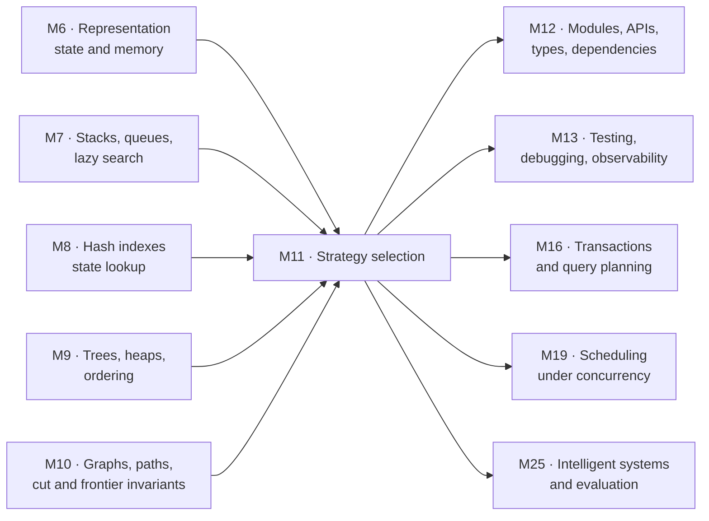
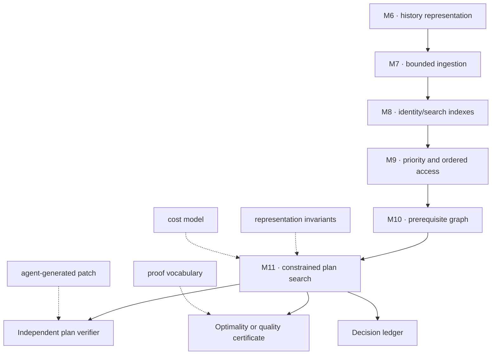
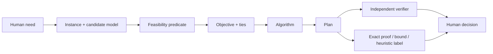
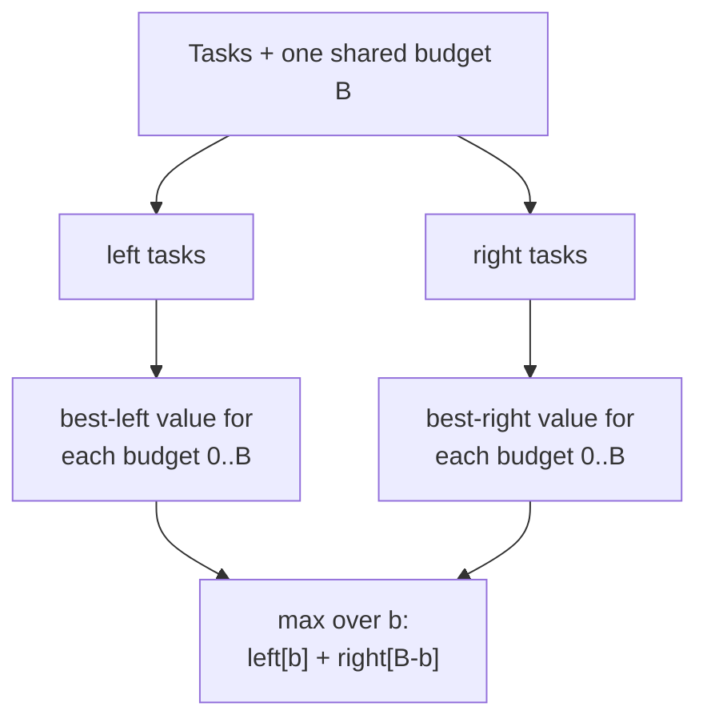
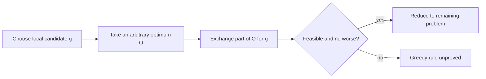
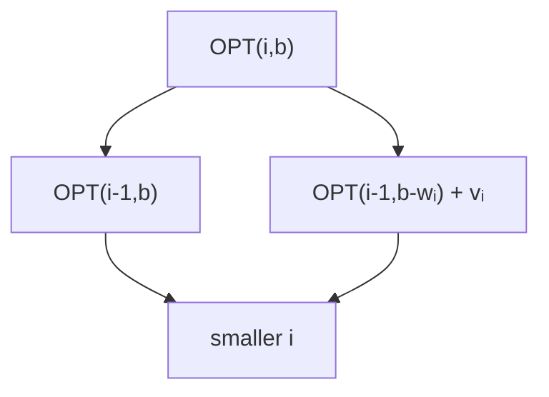
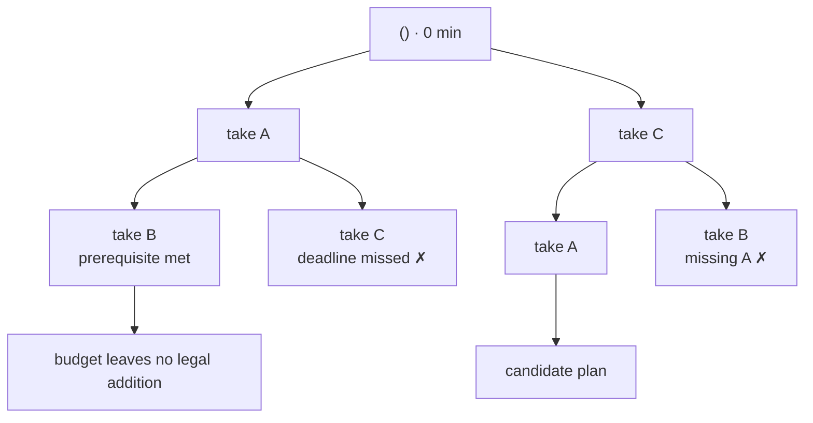
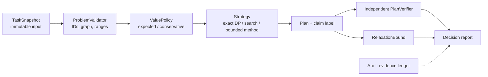
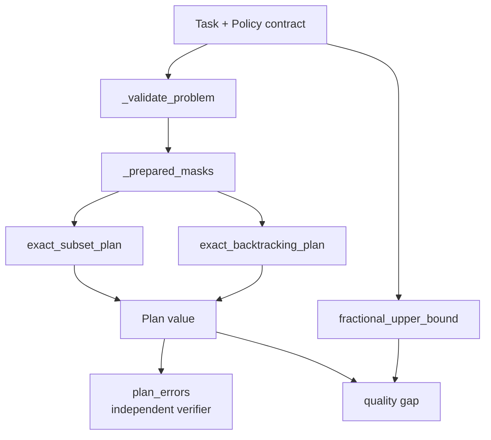
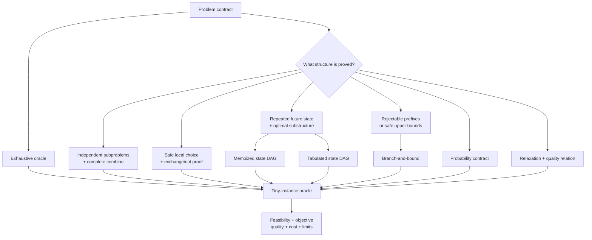

# Module 11 — Algorithm Design Paradigms: Choosing a Strategy from Structure

> **Central idea:** an algorithmic strategy is justified by a structural fact about the problem, not by resemblance to a familiar code template.

Module 11 is the synthesis of Arc II. Modules 6–10 gave Atlas representations, access disciplines, indexes, ordering structures, and graph algorithms. This module asks the next question:

> Given several legal plans, which one should Atlas choose—and what evidence makes the choice trustworthy?

The answer is not “use dynamic programming” or “try greedy.” First identify the solution space, constraints, repeated states, safe local choices, decomposition boundaries, and acceptable error. Only then does a named paradigm become meaningful.

Most work in this module is reading, tracing, modeling, proving, debugging, designing, directing an agent, and verifying its claims. Manual coding is limited to mechanism-revealing recurrences and search states.

---

## How to use this workbook

For every problem:

1. write one sentence defining a **candidate solution**;
2. write a verifier for feasibility before optimizing;
3. state the objective and every hard constraint;
4. construct the smallest exhaustive oracle that can test tiny cases;
5. identify the structural claim that a faster strategy needs;
6. label correctness, cost, and quality claims;
7. review generated code against the model, not against plausibility;
8. report uncertainty and model limitations with the result.

Do not start by asking, “Which algorithm do I remember?” Start by asking, “What is true about this problem?”

### Claim-label legend

| Label | Meaning | Example |
|---|---|---|
| **[MATHEMATICAL CLAIM]** | A theorem under explicit assumptions | Earliest-finish interval scheduling is optimal for maximum-cardinality compatible intervals. |
| **[COURSE MODEL]** | A deliberately bounded mechanism used for reasoning | Atlas’s exact subset planner represents selected tasks by a bit mask. |
| **[PYTHON GUARANTEE]** | Behavior documented by Python 3.14 | `functools.cache` memoizes calls using function arguments and retains cached values until cleared. |
| **[CPYTHON OBSERVATION]** | A fact about one Python implementation | No CPython-specific planner fact is required in this module. |
| **[ATLAS POLICY]** | A product decision, not a theorem | “Conservative” mode maximizes the sum of lower-bound learning values. |
| **[EMPIRICAL EVIDENCE]** | A measured observation for a stated setup | A benchmark explored 1.8 million states on this input and machine. |
| **[OPEN DECISION]** | A necessary choice not yet settled | Whether a deadline is hard, soft, or user-overridable. |

Every strong claim should be classifiable. “The AI says this is optimal” has no evidence label.

---

## 1. Position in the knowledge graph



### The Atlas pressure

Atlas has candidate learning tasks. Each task has:

- a duration;
- prerequisites;
- a deadline;
- an estimated learning value;
- a conservative lower value reflecting uncertainty.

A daily plan must:

- fit a time budget;
- place prerequisites before dependents;
- finish each selected task by its deadline;
- choose a sequence, not merely a set;
- optimize one explicitly selected value policy;
- expose enough evidence to verify feasibility and quality.

The tempting rule “always take the largest value per minute” is fast and often reasonable. It is not generally optimal for indivisible tasks, and prerequisites and deadlines make its proof obligations harder.

### Arc II synthesis map



Module 11 does not discard the earlier structures. An exact planner coordinates:

- tuples/lists for stable task order;
- dictionaries for identity;
- sets or bit masks for selected/prerequisite state;
- a DAG interpretation for subproblem dependencies;
- ordering policies for deterministic output;
- iterators or generators when exploring candidates lazily;
- tests, proofs, and measurements as different evidence.

### Capabilities unlocked

By the end, Michael can practice:

- formulate a candidate space, feasibility predicate, objective, and tie policy;
- use exhaustive search as a specification oracle rather than dismissing it as “slow”;
- recognize when divide-and-conquer subproblems are independent;
- demand an exchange, cut, or stays-ahead proof before trusting greedy choice;
- define a dynamic-programming state in one precise sentence;
- derive recurrence, base cases, dependency order, cost, and reconstruction;
- distinguish recursion, memoization, tabulation, backtracking, and branch-and-bound;
- classify randomized algorithms and keep pseudorandomness separate from security;
- report an approximation ratio or an upper/lower quality gap only within its proof boundary;
- design, direct, review, and verify an Atlas planner without outsourcing judgment.

---

## 2. Prerequisite retrieval — Modules 6–10

Answer without notes. For every complexity answer, name the parameter and assumptions.

### Retrieval A — Module 6: representation

Why can two representations implement the same sequence ADT yet have different costs? Which invariant must remain representation-independent?

### Retrieval B — Module 7: search state

What state does a generator retain across `yield`? Why can a lazy candidate generator still lead to unbounded memory?

### Retrieval C — Module 8: identity

Why are `dict` and `set` useful for detecting a repeated subproblem? What equality/hash assumption must hold?

### Retrieval D — Module 9: order

Why does a heap expose only enough order for priority selection rather than a fully sorted sequence? Which planner operation might need that interface?

### Retrieval E — Module 10: graph structure

State the difference between:

- a topological order;
- a shortest path;
- a minimum spanning tree.

Why does “all three use graphs” fail to select an algorithm?

### Retrieval F — Module 10: greedy proof

What makes the lightest edge crossing a suitable cut safe in a minimum-spanning-tree proof? Why does this not automatically justify choosing the highest-value Atlas task?

### Retrieval G — Module 5: cost cases

Contrast worst-case, expected, and amortized cost. Which one requires a probability model?

### Retrieval H — Modules 2 and 4: recurrence and proof

A recurrence calls `OPT(i - 1, b)` and `OPT(i - 1, b - wᵢ)`. What must be defined before either expression has meaning?

<details>
<summary>Retrieval answers and routing</summary>

- **A:** an ADT specifies observable operations/laws while representations organize state differently. The abstraction function and public behavioral invariant must agree. Return to Modules 3 and 6 if implementation names are being used as contracts.
- **B:** a generator retains its suspended frame, local bindings, and instruction position. A downstream `list`, cache, queue, or sink may retain every output. Return to Module 7 if “lazy” is being used as a whole-system memory proof.
- **C:** stable hashable state keys support expected-efficient membership/lookup under the stated model. Equal keys must have equal hashes and key-relevant state must not change while indexed. Return to Module 8 if `hash` is being treated as identity or persistence.
- **D:** the heap invariant supports efficient extremum access without globally sorting all pairs. A best-first or branch-and-bound frontier may need it. Return to Module 9 if heap order is confused with complete order.
- **E:** topological order respects directed precedence, shortest path minimizes path cost from a source, and an MST connects a graph with minimum total edge weight. The question and assumptions choose the method. Return to Module 10 if graph shape alone is driving selection.
- **F:** a cut theorem proves a local edge is compatible with some global optimum. Atlas needs its own exchange/cut-style structural theorem; plausible benefit is not enough.
- **G:** expected cost requires an explicit random variable/distribution; amortized cost spreads total cost over every allowed operation sequence without probability.
- **H:** define the subproblem—what `OPT(i, b)` denotes, which choices it ranges over, and what constraints are already encoded. A recurrence without semantics is algebra-shaped decoration.

</details>

---

## 3. Learning outcomes

By the end, Michael can:

1. separate optimization into model, feasible set, objective, algorithm, and evidence;
2. build an exhaustive tiny-instance oracle and state its exponential or factorial cost honestly;
3. prove a divide-and-conquer algorithm by subproblem correctness plus combine correctness;
4. refute an invalid greedy rule with a minimal counterexample;
5. write an exchange or cut-style proof when a greedy rule is valid;
6. define dynamic-programming subproblems, transitions, base cases, order, and answer location;
7. reconstruct a solution rather than returning only an optimum number;
8. explain when top-down memoization and bottom-up tabulation evaluate the same subproblem DAG;
9. distinguish feasibility pruning from bound-based pruning and prove each prune safe;
10. classify Las Vegas and Monte Carlo randomized algorithms;
11. derive a simple approximation guarantee and state exactly when it stops applying;
12. model Atlas uncertainty without presenting estimates as facts;
13. read unfamiliar planner code at purpose/map/flow/mechanism/evaluation levels;
14. direct an agent with explicit non-goals and acceptance evidence;
15. independently verify feasibility and challenge unsupported optimality/performance claims.

---

## 4. First principle: optimization has five separate layers

Consider the request:

> “Make the best study plan for today.”

It is not yet a computational problem. “Best,” “plan,” and “today” are unspecified.

### Layer 1 — instance

The concrete tasks, durations, prerequisite relation, deadlines, value estimates, uncertainty estimates, and budget.

### Layer 2 — candidate

**[ATLAS POLICY]** A candidate is an ordered tuple of distinct task IDs.

Order matters because prerequisites and completion deadlines are temporal.

### Layer 3 — feasibility

A candidate is feasible when:

1. every selected ID exists;
2. no task occurs twice;
3. each selected task’s prerequisites are already completed or appear earlier;
4. cumulative duration never exceeds the daily budget;
5. each task finishes no later than its own deadline.

### Layer 4 — objective and tie policy

**[ATLAS POLICY]**

- expected mode maximizes the sum of `expected_value`;
- conservative mode maximizes the sum of `low_value`;
- ties prefer less total time;
- any remaining tie may be resolved deterministically by documented input order.

This additive model deliberately omits fatigue interactions, transfer between concepts, and changing value during the day. “Optimal” will mean optimal **for this model**.

### Layer 5 — evidence

The result needs:

- an independent feasibility report;
- a recomputed objective;
- a proof or exhaustive comparison establishing exactness, **or**
- a proved approximation/quality bound, **or**
- an honest heuristic label with no guarantee;
- a resource-cost statement;
- unresolved policy and uncertainty notes.



A test showing that code returned *a* plan addresses only one arrow.

---

## 5. The strategy-selection sheet

Before naming a paradigm, fill this sheet.

| Structural question | Evidence to seek | Strategy it may support | Failure if absent |
|---|---|---|---|
| Can every candidate be enumerated at current size? | bounded `n`, tiny oracle | exhaustive search | combinatorial explosion |
| Do subproblems interact only through a small combine boundary? | independence + complete combine rule | divide-and-conquer | cross-boundary constraint is lost |
| Is one locally best legal choice safe? | exchange, cut, stays-ahead, or matroid-like property | greedy | irreversible local choice blocks optimum |
| Do many candidates reach the same remaining state? | identical future determined by small state | DP/memoization | cache key omits relevant history |
| Can partial candidates be rejected early? | monotone feasibility violation | backtracking | unsafe prune removes a valid optimum |
| Can an optimistic bound be computed? | bound is never below best possible completion | branch-and-bound | invalid bound silently prunes optimum |
| Is randomness part of the algorithm? | probability space + correctness/quality statement | randomized algorithm | “works on random tests” replaces proof |
| Is exact search too costly? | hardness/scale evidence + acceptable quality definition | approximation | “close enough” has no quantified meaning |

### A strategy is a claim bundle

For each proposed method, require:

```text
representation of a state
+ legal transitions
+ invariant
+ correctness argument
+ resource bound
+ failure boundary
+ reconstruction/evidence
```

Syntax is the final layer, not the first.

---

## 6. Exhaustive search: the specification you can run

Plain language:

> Generate every legal candidate, evaluate each one, and keep the best.

Precise statement:

Let `F` be the finite feasible set and `u` the objective. If an algorithm examines every `x ∈ F` and returns an examined element with maximum `u(x)`, it returns a global optimum.

### Why begin with something expensive?

Exhaustive search supplies:

- a direct correctness argument;
- a tiny-instance oracle for testing faster methods;
- counterexamples to greedy rules;
- evidence about what state distinctions matter;
- a baseline before optimization.

“Brute force” describes cost, not intellectual worth.

### Subsets versus sequences

For `n` independent yes/no choices, there are `2ⁿ` subsets.

For ordered selections, there may be:

```text
Σₖ₌₀ⁿ n!/(n-k)!
```

partial permutations. Prerequisite and deadline checks can reject many, but worst-case growth remains exponential/factorial unless equivalent states are merged.

### Minimal executable oracle

```python
from itertools import combinations


def best_independent_subset(items, budget):
    """Tiny-instance oracle for indivisible independent items."""
    best_value = 0
    best_ids = ()

    for size in range(len(items) + 1):
        for chosen in combinations(items, size):
            minutes = sum(item.minutes for item in chosen)
            value = sum(item.value for item in chosen)
            if minutes <= budget and value > best_value:
                best_value = value
                best_ids = tuple(item.id for item in chosen)

    return best_ids, best_value
```

### Prediction — exhaustive-search scale

Before revealing the count, write an estimate and the rule that produced it:
how many subsets can an exhaustive search inspect for 20 independently chosen
items?

<details>
<summary>Reveal after writing your prediction.</summary>

Each item is either absent or present, so the search examines `2²⁰ = 1,048,576`
subsets. The point is not merely the number: add one independent binary choice
and the candidate space doubles.

</details>

### Correctness pattern

1. Every returned candidate is checked for feasibility.
2. Every feasible subset occurs exactly once among the combinations.
3. The retained candidate’s value is at least every examined feasible value.
4. Therefore it is at least every feasible value and is optimal.

### Intentionally broken “optimization”

```python
def broken_first_fit(candidates, budget):
    for candidate in candidates:
        minutes = sum(item.minutes for item in candidate)
        if minutes > budget:
            break  # unsound for an arbitrary enumeration order
```

inside an arbitrary combination loop is unsound. A later combination can be lighter. A `break` is a prune, and every prune needs a monotonicity proof about the enumeration order.

---

## 7. Divide-and-conquer: independent pieces plus a complete combine rule

Divide-and-conquer has three obligations:

1. **divide** an instance into smaller subinstances;
2. **conquer** each recursively;
3. **combine** their answers into an answer for the original instance.

The subinstances should be independent except for information explicitly handled by the combine step.

### Familiar synthesis: merge sort

Module 9’s merge sort fits:

- left and right halves can be sorted independently;
- merge considers the current smallest remaining element of each sorted half;
- the combine invariant ensures the emitted prefix is globally sorted;
- `T(n) = 2T(n/2) + Θ(n) = Θ(n log n)`.

### Correctness by induction

Assume recursive calls correctly solve smaller inputs. Prove:

1. the division covers the original input without loss or duplication;
2. recursive answers satisfy their contracts by the inductive hypothesis;
3. the combine step returns a correct whole answer.

The recurrence describes cost, not correctness.

### Why naive Atlas splitting fails

Suppose an agent splits tasks in half, independently finds the best plan for the **full** 60-minute budget in each half, then concatenates the answers.

The shared budget couples the halves. Both subplans may spend 60 minutes. The combine step needs more than two already-optimized answers: it needs the best left and right value for every possible allocated budget, or another frontier of tradeoffs.



Once the combine boundary carries budget-indexed results, we are already approaching dynamic programming.

### Broken recursion

```python
def broken(values):
    middle = len(values) // 2
    return broken(values[:middle]) + broken(values[middle:])
```

There is no base case, no output contract, and `len(values) == 1` does not make progress on the second slice. “Recursive halves” is not a complete design.

---

## 8. Greedy algorithms: a local choice with a global proof

A greedy algorithm commits to a locally preferred legal choice and does not reconsider it.

Fast commitment is useful only if problem structure makes the commitment safe.

### A valid exchange argument: interval scheduling

Problem: choose the largest number of pairwise non-overlapping intervals.

Greedy rule: repeatedly choose the compatible interval that finishes earliest.

**[MATHEMATICAL CLAIM]** This rule is optimal for maximum-cardinality interval scheduling.

Exchange proof:

1. Let `g` be the greedy first interval.
2. Take an optimal schedule `O`; let its first interval be `o`.
3. Because `g` finishes no later than `o`, replace `o` with `g`.
4. Every later interval compatible with `o` remains compatible with `g`.
5. The modified schedule is still optimal and now agrees with greedy first.
6. Apply the same argument to the remaining intervals.

The proof transforms an optimum to agree with the local choice without worsening it.

### A cut-style proof revisited

In Module 10’s minimum-spanning-tree setting, a lightest edge crossing an appropriate cut is safe because a cycle/exchange argument can replace another crossing edge in an optimum without increasing total weight.

The reusable shape is:



The theorem belongs to the specific feasible-set structure. It does not travel merely because both problems say “minimum” or “maximum.”

### Atlas ratio greedy fails

Independent tasks:

| Task | Minutes | Value | Value/minute |
|---|---:|---:|---:|
| A | 10 | 60 | 6 |
| B | 20 | 100 | 5 |
| C | 30 | 120 | 4 |

Budget: 50.

Ratio greedy takes A then B for value 160 and cannot fit C. The optimum takes B and C for value 220.

The fractional version may take part of a task and supports ratio greedy. Atlas tasks are indivisible. One changed constraint destroys the proof.

### Greedy review checklist

1. What is the local ordering rule?
2. What decisions become irreversible?
3. What theorem makes the next choice safe?
4. Can an optimum be exchanged to agree?
5. Are ties harmless under the same proof?
6. Which new constraint breaks the exchange?
7. Is the result exact, approximate, or merely heuristic?

Benchmarks answer none of questions 3–6.

---

## 9. Dynamic programming begins with a sentence

Dynamic programming is not “use a table.”

> It evaluates a finite directed acyclic graph of subproblems, usually because many candidate solutions reach the same future state.

### Five non-negotiable design steps

1. **Meaning:** define one subproblem in a complete sentence.
2. **Recurrence:** list every legal first/last choice and resulting smaller state.
3. **Base cases:** define states with no remaining choice.
4. **Order:** evaluate dependencies before dependents, top-down or bottom-up.
5. **Original answer and reconstruction:** locate the optimum and recover choices.

Cost follows from:

```text
number of reachable subproblems × work per subproblem
```

### Independent 0/1 study selection

Temporarily remove prerequisites and deadlines.

Let tasks be indexed `0..n-1`, with integer duration `wᵢ`, value `vᵢ`, and budget `B`.

Subproblem sentence:

> `OPT(i, b)` is the maximum total value obtainable using only tasks `0..i-1` with at most `b` minutes.

Recurrence:

```text
OPT(0, b) = 0

OPT(i, b) = OPT(i-1, b)                                  if wᵢ > b

OPT(i, b) = max(
    OPT(i-1, b),                                         skip i
    vᵢ + OPT(i-1, b-wᵢ)                                 take i
)                                                       otherwise
```

Why exhaustive? Every feasible solution either excludes the last task or includes it. The two cases are disjoint and cover all possibilities.

### Subproblem dependency DAG



The table is one topological ordering of this DAG.

### Bottom-up executable model with reconstruction

```python
from dataclasses import dataclass


@dataclass(frozen=True, slots=True)
class SimpleItem:
    id: str
    minutes: int
    value: int


def knapsack_bottom_up(
    items: tuple[SimpleItem, ...],
    budget: int,
) -> tuple[int, tuple[str, ...]]:
    if budget < 0:
        raise ValueError("budget must be nonnegative")
    if any(item.minutes <= 0 or item.value < 0 for item in items):
        raise ValueError("minutes must be positive and values nonnegative")

    n = len(items)
    value = [[0] * (budget + 1) for _ in range(n + 1)]
    took = [[False] * (budget + 1) for _ in range(n + 1)]

    for i, item in enumerate(items, start=1):
        for remaining in range(budget + 1):
            skip = value[i - 1][remaining]
            take = -1
            if item.minutes <= remaining:
                take = item.value + value[i - 1][remaining - item.minutes]

            if take > skip:
                value[i][remaining] = take
                took[i][remaining] = True
            else:
                value[i][remaining] = skip

    chosen = []
    remaining = budget
    for i in range(n, 0, -1):
        if took[i][remaining]:
            item = items[i - 1]
            chosen.append(item.id)
            remaining -= item.minutes

    chosen.reverse()
    return value[n][budget], tuple(chosen)
```

### Prediction — reconstructing the chosen plan

For the A/B/C example above, predict both the optimum value and the selected
IDs before inspecting the table’s reconstruction path. Record the state whose
choice you believe changes the result.

<details>
<summary>Reveal after writing your prediction.</summary>

The result is value 220 with `("B", "C")`. The reconstruction evidence matters:
the dynamic-programming value alone is not yet a usable plan until the recorded
choices trace back to those task IDs.

</details>

### Correctness argument

Induct on `i`.

- Base `i=0`: no tasks are available, so value zero is optimal.
- Step: any optimum using first `i` tasks either skips item `i-1`, bounded by `OPT(i-1,b)`, or takes it, leaving capacity `b-wᵢ` and value bounded by `vᵢ + OPT(i-1,b-wᵢ)`.
- The recurrence chooses the larger exhaustive case.
- Stored `took` decisions retrace a path through cells that attained the final value.

### Cost and the pseudopolynomial boundary

There are `(n+1)(B+1)` cells and constant work per cell:

- time `Θ(nB)`;
- table space `Θ(nB)`;
- value-only space can be reduced to `Θ(B)`, but straightforward reconstruction then needs extra evidence.

**[MATHEMATICAL CLAIM]** This is pseudopolynomial, not polynomial in ordinary binary input length. Writing budget `B` in binary uses `Θ(log B)` bits; iterating through all numeric values `0..B` can be exponential in that encoding length.

### Intentionally broken recurrence

```python
take = item.value + value[i][remaining - item.minutes]
```

Using row `i` instead of `i-1` permits the same item repeatedly. That solves unbounded knapsack, not 0/1 selection. A one-character index error changes the mathematical problem.

---

## 10. Memoization and tabulation evaluate the same state graph differently

Top-down:

```python
from functools import cache


def knapsack_top_down(items: tuple[SimpleItem, ...], budget: int) -> int:
    @cache
    def optimum(i: int, remaining: int) -> int:
        if i == 0:
            return 0

        item = items[i - 1]
        skip = optimum(i - 1, remaining)
        if item.minutes > remaining:
            return skip

        take = item.value + optimum(i - 1, remaining - item.minutes)
        return max(skip, take)

    return optimum(len(items), budget)
```

**[PYTHON GUARANTEE]** `functools.cache` is an unbounded memoizing wrapper, equivalent in purpose to `lru_cache(maxsize=None)`. Its arguments must be hashable, and cached arguments/results remain referenced until cleared or the wrapper is discarded.

### Top-down memoization

- starts from the requested answer;
- evaluates only states reached by recursion;
- mirrors the recurrence;
- uses call-stack space;
- can hit Python’s recursion boundary;
- risks stale/wrong answers if the cache key omits relevant state or hidden mutable globals affect results.

### Bottom-up tabulation

- chooses an explicit topological order;
- often visits a rectangular superset of reachable states;
- avoids recursive call depth;
- makes memory layout and reconstruction storage explicit;
- can be harder to derive if dependency order is unclear.

### Memoization is not a spell

This cache is unsound:

```python
current_values = {}


@cache
def score(task_id):
    return current_values[task_id]
```

Changing `current_values` does not change the cache key. The function is not a mathematical function of its declared argument over time.

The repair is architectural: pass an immutable version/snapshot or keep caching inside a computation whose inputs do not mutate.

### Repeated subproblems versus optimal substructure

- **Repeated/overlapping subproblems** explain why caching may save work.
- **Optimal substructure** explains why optimal subproblem answers combine into an optimal whole answer.

Neither implies the other, and both need proof.

---

## 11. Backtracking: search only prefixes that can still succeed

Exhaustive enumeration often creates complete candidates and rejects them afterward. Backtracking builds a partial candidate and stops extending it once a constraint is irreparably violated.

### The state

For the Atlas planner, a partial state needs:

- selected task set;
- selected order;
- elapsed minutes;
- accumulated policy value;
- which prerequisites are now satisfied.

If the selected set determines elapsed time and value, some fields are derivable rather than independent.



### Feasibility pruning

A prune is safe when the violated property is monotone under extension.

- elapsed time already exceeds the budget → adding tasks cannot reduce it;
- a just-added task missed its completion deadline → later tasks cannot move it earlier in this fixed prefix;
- a task is already selected → selecting it again cannot form a distinct-task plan.

“The current score looks low” is not a safe feasibility prune.

### Branch-and-bound

Keep the best feasible value `L` found so far. At a partial state, compute an optimistic upper bound `U` on every completion below it.

- if `U < L`, no descendant can improve the incumbent, so prune;
- if the purported upper bound can underestimate a descendant, the prune is unsound.

A deliberately loose safe bound for nonnegative values is:

```text
current value + sum of every unselected value
```

It ignores budget, deadlines, and prerequisites, so it overestimates what remains possible. It may prune little, but it cannot remove a better completion for those assumptions.

### Four related mechanisms

| Mechanism | What it avoids | What justifies the avoidance |
|---|---|---|
| exhaustive search | nothing | complete enumeration |
| backtracking | infeasible descendants | monotone feasibility proof |
| branch-and-bound | descendants unable to beat incumbent | valid optimistic bound |
| dynamic programming | recomputing equivalent future states | state-sufficiency proof |

Backtracking explores a tree of decision histories. Dynamic programming merges histories that have the same future-relevant state into a DAG.

### The state-sufficiency question

For Atlas’s additive model:

- elapsed time is the sum of durations in the selected set;
- accumulated value is the sum of selected values;
- future prerequisite eligibility depends on which IDs are selected;
- future deadline feasibility depends on elapsed time, therefore also the selected set.

So two feasible histories with the same selected set have identical future options, even if their internal order differs. One feasible parent order is enough to represent that subset state. This structural fact enables subset dynamic programming.

If fatigue, time-of-day value, or sequence-dependent learning transfer is added, selected set alone is no longer sufficient.

---

## 12. Randomized algorithms: probability is part of the contract

Randomized algorithms make internal random choices. That is different from:

- running a deterministic algorithm on random test inputs;
- modeling uncertain real-world task values;
- using cryptographic randomness;
- accepting a result because several random trials looked good.

### Two correctness families

**Las Vegas**

- always returns a correct result;
- running time or resource use is random.

Example shape: randomized pivot choices with verification and continued work until a correct answer is obtained.

**Monte Carlo**

- uses a bounded amount of work;
- may return an incorrect or lower-quality answer with a bounded probability.

The error event, probability, independence assumptions, and amplification method must be stated.

### Reservoir sampling reconnects laziness and induction

Problem: choose one uniformly random item from a stream of unknown length using constant retained storage.

```python
from collections.abc import Iterable
from random import Random


def reservoir_one(items: Iterable[str], rng: Random) -> str:
    chosen = None
    seen = 0

    for item in items:
        seen += 1
        if rng.randrange(seen) == 0:
            chosen = item

    if seen == 0:
        raise ValueError("cannot sample an empty iterable")
    assert chosen is not None
    return chosen
```

### Proof model — finite prefix and ideal draws

Fix a finite prefix of `k ≥ 1` stream items. For the mathematical proof, let
`U_i` be the draw made after item `i` is seen, and let `H_(i-1)` contain every
earlier draw and selection state. Assume the ideal model

$$
\Pr(U_i = j \mid \mathcal H_{i-1}) = \frac{1}{i}
\qquad\text{for each } j \in \{0, \ldots, i - 1\}.
$$

**Prose fallback:** given every earlier draw and selection state, each of the
`i` possible draw positions is equally likely at step `i`.

A fresh independent uniform draw at each step is one sufficient way to obtain
that conditional model. The program call `rng.randrange(i)` is an
implementation mechanism to inspect; a seed gives a reproducible trace, not
the probability assumption itself.

**Prediction before proof:** Which statement is needed for the induction:
“the seed is fixed,” “one test looked balanced,” or “each next draw has the
stated conditional uniform distribution”? Give a confidence from 0–100.

**[MATHEMATICAL CLAIM]** After processing `k ≥ 1` items, each has probability `1/k` of being retained.

Inductive step:

- new item `k` is chosen with probability `1/k`;
- each old item was present with probability `1/(k-1)` and survives with probability `(k-1)/k`;
- its final probability is `(1/(k-1))((k-1)/k) = 1/k`.

This is a proof about the stated mathematical uniform-choice model. A
deterministic seed supports reproducible debugging, not proof of distribution
quality.

### Python boundary

**[PYTHON GUARANTEE]** Python’s `random` module provides deterministic pseudorandom generators suitable for modeling and simulation. Its documentation explicitly warns against using it for security tokens; use the `secrets` module for security-sensitive randomness.

Do not pin tests to an exact long output sequence across Python versions unless the documented reproducibility scope supports that dependency. Test invariants and inject an RNG where control matters.

### Randomized planning boundary

Sampling candidate plans can be a useful heuristic when exact search is too large. Without a theorem:

- it does not establish optimality;
- the best sampled score is only a feasible lower bound;
- failure to sample a better plan does not create a useful upper bound;
- more trials improve empirical coverage, not proof automatically.

Random search becomes principled when accompanied by a probability/quality analysis or an independent certificate.

---

## 13. Approximation: trade exactness for a proved quality boundary

Approximation is not “give up and return something.”

For a maximization problem with optimum `OPT > 0`, an algorithm is an `α`-approximation, `0 < α ≤ 1`, when:

```text
ALG ≥ α · OPT
```

for every input in the theorem’s domain.

Always state:

- objective direction;
- multiplicative or additive guarantee;
- assumptions;
- running time;
- what happens when `OPT = 0`;
- whether the guarantee is deterministic, expected, or high-probability.

### A 1/2 guarantee for independent 0/1 knapsack

Assumptions:

- indivisible independent items;
- one capacity constraint;
- nonnegative values;
- each considered item individually fits;
- no prerequisites, deadlines, or sequence-dependent value.

Algorithm:

1. sort by value/weight ratio;
2. take the longest prefix that fits, stopping at the first non-fitting item;
3. compare that prefix with the highest-value single item;
4. return the better.

Proof boundary:

- the fractional relaxation is an upper bound on the integral optimum;
- ratio greedy solves the fractional relaxation;
- at the first fractional item, the relaxation value is no more than `prefix_value + next_item_value`;
- the best singleton is at least `next_item_value`;
- therefore the better of prefix and singleton is at least half the upper bound and at least half `OPT`.

The A/B/C counterexample returns value 160, while `OPT=220`; it is non-optimal but above 110.

### Numerical experiment — compare a fixed tiny instance

Run the bounded reference model on the A/B/C instance and record
`ratio_greedy = 160`, `exact = 220`, and the 60-point gap. Then change one
assumption—add a prerequisite, a deadline, or a negative value—and state which
calculation remains valid. This is a worked finite observation, not evidence
that the approximation theorem or any Atlas policy holds in general.

### A certificate can be more useful than a generic ratio

Let:

- `L` be the score of a verified feasible Atlas plan;
- `U` be an upper bound obtained by removing prerequisites/deadlines and allowing fractional tasks.

Then:

```text
L ≤ OPT_full_Atlas ≤ U
```

If `U=250` and `L=240`, the instance-specific gap is much more informative than “some heuristic was used.”

**[MATHEMATICAL CLAIM]** Removing constraints enlarges the feasible set, and allowing fractions enlarges it again, so the relaxed optimum is an upper bound—provided the same fixed additive utility policy is used.

### Where the 1/2 theorem stops

The independent-knapsack approximation does **not** automatically survive:

- prerequisites that force companion tasks;
- individual completion deadlines;
- values that change with order;
- negative values;
- uncertain values with an unstated objective;
- multiple resources;
- fairness or coverage constraints.

The fractional relaxation may remain an upper bound after constraints are removed, but the returned ratio-greedy plan may be infeasible for the original problem. A bound and a construction have separate proof obligations.

### Approximation decision record

Before using one, write:

```text
Exact objective:
Relaxed problem:
Feasible construction:
Lower-bound evidence:
Upper-bound evidence:
Proved relation:
Assumptions:
Unmodeled consequences:
```

“Near optimal” without this record is an unsupported claim.

---

## 14. Uncertainty is a model boundary, not an algorithm name

Atlas does not know a task’s true future learning value. It has estimates.

### Two explicit policies

Each task has:

- `expected_value`: the current central estimate;
- `low_value`: a conservative estimate, with `0 ≤ low ≤ expected`.

**[ATLAS POLICY]**

- expected mode maximizes the sum of central estimates;
- conservative mode maximizes the sum of low estimates.

These modes answer different questions. Neither proves actual learning.

### What “expected” would formally require

A mathematical expectation requires a random variable and probability distribution. A product field named `expected_value` is not validated merely by its name. The source, calibration, update process, and dependence between tasks remain evidence obligations.

### Robustness and scenarios

Later extensions might:

- maximize worst-case value across a defined scenario set;
- require a minimum foundation-category coverage;
- optimize expected value subject to a downside constraint;
- reserve time for exploration;
- let the learner override deadlines and recommendations.

Each changes the feasible set or objective and can invalidate the current DP state and approximation certificate.

### Human-impact guardrail

An optimizer can be mathematically correct and educationally harmful:

- estimates may favor topics already easy to measure;
- hard deadlines may crowd out foundations;
- uncertainty penalties may suppress exploration;
- a single scalar value may erase learner agency and cognitive load;
- generated plans can create false precision.

Atlas presents a plan, evidence, alternatives, and model limits. The learner remains the decision-maker.

---

## 15. Atlas checkpoint — constrained study planning

### Component architecture



Dependency direction:

- the verifier depends on the task contract, not on planner internals;
- the strategy consumes a scoring policy, not mutable UI state;
- the report distinguishes feasibility, objective, exactness/quality, cost, and uncertainty;
- no component treats a heap order, hash iteration order, or CPython detail as domain authority.

### Task contract

```text
Task(
    id: unique string,
    minutes: positive integer,
    expected_value: nonnegative integer,
    low_value: integer in [0, expected_value],
    deadline: positive completion-minute,
    prerequisites: immutable set of task IDs
)
```

Candidate prerequisites may refer to another candidate or an already completed ID. Candidate cycles and missing prerequisites are invalid problem instances, not “low-scoring plans.”

### Exact subset-state definition

For candidate tasks indexed `0..n-1`, let mask `S` represent a selected set.

> `reachable[S]` means there exists at least one feasible order that completes exactly the tasks in `S`.

Derived values:

```text
time(S)  = Σ minutes[j] over j ∈ S
score(S) = Σ policy_value[j] over j ∈ S
```

Transition: from reachable `S`, append task `j ∉ S` when:

1. every candidate prerequisite of `j` is in `S`;
2. `time(S) + minutes[j] ≤ budget`;
3. `time(S) + minutes[j] ≤ deadline[j]`.

Then `S ∪ {j}` is reachable, and a parent pointer records one feasible order.

### Why one parent per selected set is sufficient

Under the current model, all feasible orders for the same selected set have:

- the same elapsed time;
- the same score;
- the same set of prerequisites available for future tasks.

Future transitions depend only on those facts. Any one feasible order witnessing `reachable[S]` can stand for the state.

Past deadline feasibility does depend on order, but `reachable[S]` stores a parent chain that already witnessed one feasible order. Future choices do not need the discarded alternative orders.

### Correctness theorem

**[MATHEMATICAL CLAIM]** The subset planner returns an optimal plan for the validated Atlas model.

Soundness:

- base mask zero is feasible;
- each transition appends a distinct task;
- prerequisite, budget, and new-task deadline conditions are checked;
- the parent chain therefore reconstructs a feasible plan.

Completeness:

- take any feasible plan `(j₁,…,jₖ)`;
- the empty prefix is reachable;
- if its first `r` tasks form a reachable mask, feasibility guarantees transition `jᵣ₊₁` passes;
- by induction, every prefix and the full selected mask become reachable.

Optimality:

- every feasible plan’s selected mask is reachable;
- score depends only on selected mask;
- choosing the reachable mask with maximum score matches or exceeds every feasible plan.

### Cost

For `n` candidate tasks:

- up to `2ⁿ` subset states;
- up to `n` attempted additions per state;
- time `O(n2ⁿ)`;
- arrays and parent evidence `O(2ⁿ)`, plus input/prerequisite masks.

This is exact but deliberately limited to small daily candidate sets. It is not disguised as scalable because it uses Python.

### Runnable, validated reference model

The following block is self-contained and uses only the Python standard library. The final `_self_test()` is an executable regression suite, not a proof.

```python
# RUNNABLE-REFERENCE-START
from __future__ import annotations

from collections.abc import Iterable
from dataclasses import dataclass
from fractions import Fraction
from functools import cache
from random import Random
from typing import Literal, TypeVar, cast


Policy = Literal["expected", "conservative"]
T = TypeVar("T")


@dataclass(frozen=True, slots=True)
class SimpleItem:
    id: str
    minutes: int
    value: int


@dataclass(frozen=True, slots=True)
class Task:
    id: str
    minutes: int
    expected_value: int
    low_value: int
    deadline: int
    prerequisites: frozenset[str] = frozenset()


@dataclass(frozen=True, slots=True)
class Plan:
    ids: tuple[str, ...]
    score: int
    minutes: int
    strategy: str


def utility(task: Task, policy: Policy) -> int:
    if policy == "expected":
        return task.expected_value
    if policy == "conservative":
        return task.low_value
    raise ValueError(f"unknown policy: {policy!r}")


def _validate_problem(
    tasks: tuple[Task, ...],
    budget: int,
    policy: Policy,
    completed: frozenset[str],
) -> None:
    if budget < 0:
        raise ValueError("budget must be nonnegative")
    if policy not in ("expected", "conservative"):
        raise ValueError(f"unknown policy: {policy!r}")

    ids = [task.id for task in tasks]
    id_set = set(ids)
    if len(id_set) != len(ids):
        raise ValueError("task IDs must be unique")
    if id_set & completed:
        raise ValueError("completed IDs must not also be candidates")

    for task in tasks:
        if not task.id:
            raise ValueError("task ID must be nonempty")
        if task.minutes <= 0:
            raise ValueError("minutes must be positive")
        if task.deadline <= 0:
            raise ValueError("deadline must be positive")
        if not (0 <= task.low_value <= task.expected_value):
            raise ValueError("require 0 <= low_value <= expected_value")
        missing = task.prerequisites - id_set - completed
        if missing:
            raise ValueError(
                f"{task.id!r} has missing prerequisites: {sorted(missing)!r}"
            )

    # Kahn's algorithm from Module 10 validates the candidate dependency DAG.
    indegree = {task.id: 0 for task in tasks}
    dependents = {task.id: [] for task in tasks}
    for task in tasks:
        for prerequisite in task.prerequisites:
            if prerequisite in id_set:
                indegree[task.id] += 1
                dependents[prerequisite].append(task.id)

    ready = [task_id for task_id, degree in indegree.items() if degree == 0]
    removed = 0
    while ready:
        prerequisite = ready.pop()
        removed += 1
        for dependent in dependents[prerequisite]:
            indegree[dependent] -= 1
            if indegree[dependent] == 0:
                ready.append(dependent)

    if removed != len(tasks):
        raise ValueError("candidate prerequisite graph contains a cycle")


def _prepared_masks(
    tasks: tuple[Task, ...],
    policy: Policy,
) -> tuple[tuple[int, ...], tuple[int, ...]]:
    index = {task.id: position for position, task in enumerate(tasks)}
    needs = []
    values = []

    for task in tasks:
        mask = 0
        for prerequisite in task.prerequisites:
            if prerequisite in index:
                mask |= 1 << index[prerequisite]
        needs.append(mask)
        values.append(utility(task, policy))

    return tuple(needs), tuple(values)


def exact_subset_plan(
    tasks: tuple[Task, ...],
    budget: int,
    policy: Policy = "expected",
    completed: frozenset[str] = frozenset(),
) -> Plan:
    """[COURSE MODEL] Exact O(n * 2**n) subset-state planner."""
    _validate_problem(tasks, budget, policy, completed)
    needs, values = _prepared_masks(tasks, policy)
    n = len(tasks)
    state_count = 1 << n

    elapsed = [0] * state_count
    score = [0] * state_count
    for mask in range(1, state_count):
        bit = mask & -mask
        position = bit.bit_length() - 1
        previous = mask ^ bit
        elapsed[mask] = elapsed[previous] + tasks[position].minutes
        score[mask] = score[previous] + values[position]

    reachable = [False] * state_count
    parent: list[tuple[int, int] | None] = [None] * state_count
    reachable[0] = True

    for mask in range(state_count):
        if not reachable[mask]:
            continue

        for position, task in enumerate(tasks):
            bit = 1 << position
            if mask & bit:
                continue
            if needs[position] & ~mask:
                continue

            finish = elapsed[mask] + task.minutes
            if finish > budget or finish > task.deadline:
                continue

            next_mask = mask | bit
            if not reachable[next_mask]:
                reachable[next_mask] = True
                parent[next_mask] = (mask, position)

    best_mask = max(
        (mask for mask in range(state_count) if reachable[mask]),
        key=lambda mask: (score[mask], -elapsed[mask], -mask),
    )

    reversed_ids = []
    cursor = best_mask
    while cursor:
        step = parent[cursor]
        assert step is not None
        previous, position = step
        reversed_ids.append(tasks[position].id)
        cursor = previous

    return Plan(
        ids=tuple(reversed(reversed_ids)),
        score=score[best_mask],
        minutes=elapsed[best_mask],
        strategy="exact-subset-dp",
    )


def exact_backtracking_plan(
    tasks: tuple[Task, ...],
    budget: int,
    policy: Policy = "expected",
    completed: frozenset[str] = frozenset(),
) -> Plan:
    """Exact search-tree model with feasibility and a loose safe bound."""
    _validate_problem(tasks, budget, policy, completed)
    needs, values = _prepared_masks(tasks, policy)
    n = len(tasks)

    best_ids: tuple[str, ...] = ()
    best_score = 0
    best_minutes = 0

    def search(
        mask: int,
        elapsed: int,
        score: int,
        order: tuple[str, ...],
    ) -> None:
        nonlocal best_ids, best_score, best_minutes

        if score > best_score or (
            score == best_score and elapsed < best_minutes
        ):
            best_ids = order
            best_score = score
            best_minutes = elapsed

        optimistic = score + sum(
            values[position]
            for position in range(n)
            if not mask & (1 << position)
        )
        if optimistic < best_score:
            return

        for position, task in enumerate(tasks):
            bit = 1 << position
            if mask & bit:
                continue
            if needs[position] & ~mask:
                continue

            finish = elapsed + task.minutes
            if finish > budget or finish > task.deadline:
                continue

            search(
                mask | bit,
                finish,
                score + values[position],
                order + (task.id,),
            )

    search(0, 0, 0, ())
    return Plan(best_ids, best_score, best_minutes, "exact-backtracking")


def plan_errors(
    tasks: tuple[Task, ...],
    plan: Plan,
    budget: int,
    policy: Policy = "expected",
    completed: frozenset[str] = frozenset(),
) -> tuple[str, ...]:
    """Independent feasibility and accounting check; knows no planner state."""
    _validate_problem(tasks, budget, policy, completed)
    by_id = {task.id: task for task in tasks}
    available = set(completed)
    selected = set()
    elapsed = 0
    score = 0
    errors = []

    for position, task_id in enumerate(plan.ids):
        if task_id not in by_id:
            errors.append(f"position {position}: unknown task {task_id!r}")
            continue
        if task_id in selected:
            errors.append(f"position {position}: duplicate task {task_id!r}")
            continue

        task = by_id[task_id]
        missing = task.prerequisites - available
        if missing:
            errors.append(
                f"position {position}: unmet prerequisites {sorted(missing)!r}"
            )

        elapsed += task.minutes
        if elapsed > task.deadline:
            errors.append(
                f"position {position}: {task_id!r} finishes at {elapsed}, "
                f"after deadline {task.deadline}"
            )
        if elapsed > budget:
            errors.append(
                f"position {position}: elapsed {elapsed} exceeds budget {budget}"
            )

        score += utility(task, policy)
        selected.add(task_id)
        available.add(task_id)

    if elapsed != plan.minutes:
        errors.append(
            f"reported minutes {plan.minutes} but recomputed {elapsed}"
        )
    if score != plan.score:
        errors.append(f"reported score {plan.score} but recomputed {score}")

    return tuple(errors)


def fractional_upper_bound(
    tasks: tuple[Task, ...],
    budget: int,
    policy: Policy = "expected",
) -> Fraction:
    """Relax deadlines/prerequisites and allow fractional task completion."""
    if budget < 0:
        raise ValueError("budget must be nonnegative")
    if policy not in ("expected", "conservative"):
        raise ValueError(f"unknown policy: {policy!r}")
    if any(task.minutes <= 0 for task in tasks):
        raise ValueError("minutes must be positive")

    ordered = sorted(
        tasks,
        key=lambda task: (
            -Fraction(utility(task, policy), task.minutes),
            task.id,
        ),
    )
    remaining = budget
    bound = Fraction(0)

    for task in ordered:
        if remaining == 0:
            break
        used = min(remaining, task.minutes)
        bound += Fraction(utility(task, policy) * used, task.minutes)
        remaining -= used

    return bound


def half_approx_independent(
    tasks: tuple[Task, ...],
    budget: int,
    policy: Policy = "expected",
) -> Plan:
    """1/2 approximation only for independent one-budget task selection."""
    if budget < 0:
        raise ValueError("budget must be nonnegative")
    if any(task.prerequisites for task in tasks):
        raise ValueError("the 1/2 theorem requires independent tasks")
    if any(task.deadline < budget for task in tasks):
        raise ValueError("the 1/2 theorem here does not model deadlines")
    if any(task.minutes <= 0 or utility(task, policy) < 0 for task in tasks):
        raise ValueError("requires positive minutes and nonnegative values")

    eligible = tuple(task for task in tasks if task.minutes <= budget)
    if not eligible:
        return Plan((), 0, 0, "half-approx-independent")

    ordered = sorted(
        eligible,
        key=lambda task: (
            -Fraction(utility(task, policy), task.minutes),
            task.id,
        ),
    )

    prefix = []
    prefix_minutes = 0
    prefix_score = 0
    for task in ordered:
        if prefix_minutes + task.minutes > budget:
            break
        prefix.append(task.id)
        prefix_minutes += task.minutes
        prefix_score += utility(task, policy)

    single = max(
        eligible,
        key=lambda task: (
            utility(task, policy),
            -task.minutes,
            task.id,
        ),
    )
    single_score = utility(single, policy)

    if single_score > prefix_score:
        return Plan(
            (single.id,),
            single_score,
            single.minutes,
            "half-approx-independent",
        )
    return Plan(
        tuple(prefix),
        prefix_score,
        prefix_minutes,
        "half-approx-independent",
    )


def knapsack_bottom_up(
    items: tuple[SimpleItem, ...],
    budget: int,
) -> tuple[int, tuple[str, ...]]:
    if budget < 0:
        raise ValueError("budget must be nonnegative")
    if any(item.minutes <= 0 or item.value < 0 for item in items):
        raise ValueError("invalid item")

    n = len(items)
    value = [[0] * (budget + 1) for _ in range(n + 1)]
    took = [[False] * (budget + 1) for _ in range(n + 1)]

    for i, item in enumerate(items, start=1):
        for remaining in range(budget + 1):
            skip = value[i - 1][remaining]
            take = -1
            if item.minutes <= remaining:
                take = item.value + value[i - 1][remaining - item.minutes]
            if take > skip:
                value[i][remaining] = take
                took[i][remaining] = True
            else:
                value[i][remaining] = skip

    chosen = []
    remaining = budget
    for i in range(n, 0, -1):
        if took[i][remaining]:
            item = items[i - 1]
            chosen.append(item.id)
            remaining -= item.minutes

    return value[n][budget], tuple(reversed(chosen))


def knapsack_top_down(
    items: tuple[SimpleItem, ...],
    budget: int,
) -> int:
    @cache
    def optimum(i: int, remaining: int) -> int:
        if i == 0:
            return 0
        item = items[i - 1]
        skip = optimum(i - 1, remaining)
        if item.minutes > remaining:
            return skip
        take = item.value + optimum(i - 1, remaining - item.minutes)
        return max(skip, take)

    return optimum(len(items), budget)


def reservoir_one(items: Iterable[T], rng: Random) -> T:
    sentinel = object()
    chosen: object = sentinel

    for seen, item in enumerate(items, start=1):
        if rng.randrange(seen) == 0:
            chosen = item

    if chosen is sentinel:
        raise ValueError("cannot sample an empty iterable")
    return cast(T, chosen)


def _expect_value_error(action) -> None:
    try:
        action()
    except ValueError:
        return
    raise AssertionError("expected ValueError")


def _self_test() -> None:
    # Classic 0/1 counterexample to ratio-greedy exactness.
    items = (
        SimpleItem("A", 10, 60),
        SimpleItem("B", 20, 100),
        SimpleItem("C", 30, 120),
    )
    assert knapsack_bottom_up(items, 50) == (220, ("B", "C"))
    assert knapsack_top_down(items, 50) == 220

    # Prerequisites, deadlines, budget, and uncertainty can change the plan.
    tasks = (
        Task("A", 20, 8, 4, 60),
        Task("B", 25, 12, 5, 60, frozenset({"A"})),
        Task("C", 15, 9, 8, 30),
    )
    expected = exact_subset_plan(tasks, 45, "expected")
    conservative = exact_subset_plan(tasks, 45, "conservative")
    assert expected.ids == ("A", "B")
    assert (expected.score, expected.minutes) == (20, 45)
    assert conservative.ids == ("C", "A")
    assert (conservative.score, conservative.minutes) == (12, 35)
    assert plan_errors(tasks, expected, 45, "expected") == ()
    assert plan_errors(tasks, conservative, 45, "conservative") == ()

    # A structurally different exact search agrees on objective and feasibility.
    searched = exact_backtracking_plan(tasks, 45, "expected")
    assert searched.score == expected.score
    assert plan_errors(tasks, searched, 45, "expected") == ()

    # The independent 1/2 algorithm is feasible but not exact here.
    independent = (
        Task("A", 10, 60, 60, 100),
        Task("B", 20, 100, 100, 100),
        Task("C", 30, 120, 120, 100),
    )
    exact = exact_subset_plan(independent, 50)
    approximate = half_approx_independent(independent, 50)
    assert exact.score == 220
    assert approximate.score == 160
    assert 2 * approximate.score >= exact.score
    assert plan_errors(independent, approximate, 50) == ()
    assert fractional_upper_bound(independent, 50) >= exact.score

    # Independent verification catches order-sensitive deadline failure.
    wrong = Plan(("A", "C"), 17, 35, "fabricated")
    assert any("deadline" in error for error in plan_errors(
        tasks, wrong, 45, "expected"
    ))

    cycle = (
        Task("X", 1, 1, 1, 10, frozenset({"Y"})),
        Task("Y", 1, 1, 1, 10, frozenset({"X"})),
    )
    _expect_value_error(lambda: exact_subset_plan(cycle, 10))

    missing = (
        Task("X", 1, 1, 1, 10, frozenset({"absent"})),
    )
    _expect_value_error(lambda: exact_subset_plan(missing, 10))
    _expect_value_error(lambda: reservoir_one((), Random(7)))

    sample = reservoir_one(range(20), Random(7))
    assert sample in range(20)


if __name__ == "__main__":
    _self_test()
    print("Module 11 runnable reference: all checks passed")
# RUNNABLE-REFERENCE-END
```

### What the regression run does and does not establish

It checks:

- bottom-up and top-down independent knapsack agreement;
- a ratio-greedy counterexample;
- prerequisite order;
- deadline-sensitive order;
- expected versus conservative policy;
- independent plan verification;
- subset-DP/backtracking score agreement;
- cycle and missing-prerequisite rejection;
- the 1/2 result on one known instance;
- a relaxation upper bound on that instance;
- randomized sampler boundaries.

It does not prove:

- the exact algorithm theorem for all inputs;
- the 1/2 theorem for its whole domain;
- uniformity from one pseudorandom sample;
- real learning-value calibration;
- performance at production scale.

Those require the mathematical arguments, property/adversarial tests, and measurements described elsewhere.

---

## 16. Read the planner in dependency order

The reference block is intentionally larger than the mechanism examples. Do not read it from line one to line last and hope that familiarity appears. Recover it in five passes.

### 16.1 Purpose

The component answers:

> Among a small validated set of indivisible tasks, which feasible ordered plan maximizes one declared additive value policy?

The words **small**, **validated**, **indivisible**, **ordered**, and **additive** are part of the algorithm contract.

### 16.2 Map



Read boundaries before helpers:

- validation owns instance well-formedness;
- `utility` owns policy interpretation;
- the planners own candidate search;
- `Plan` is a returned claim, not proof by itself;
- `plan_errors` deliberately knows no internal mask, parent, or heap state;
- the relaxation computes an upper bound, not a feasible Atlas plan.

### 16.3 Flow

Trace the three-task instance from `_self_test` under expected policy:

1. validation confirms unique IDs, value ranges, and an acyclic prerequisite graph;
2. `A` receives no prerequisite bits; `B` receives the bit for `A`; `C` receives none;
3. mask `0` can add `A` or `C`, but not `B`;
4. after `C`, adding `A` is legal and yields score `17`;
5. after `A`, adding `B` is legal and yields score `20`;
6. adding `C` after `A,B` exceeds the 45-minute budget;
7. the best reachable mask is reconstructed through parent evidence as `("A", "B")`;
8. the independent verifier replays prerequisites, deadlines, budget, minutes, and score.

Now change only the policy to conservative. The graph and feasible set stay the same, but the objective changes; `("C", "A")` becomes preferable. This is why scoring policy is a dependency, not a comment.

### 16.4 Mechanism

The essential state is the selected-set mask.

```text
mask ──determines──▶ elapsed time
mask ──determines──▶ additive score
mask ──determines──▶ prerequisite availability
one parent edge ──witnesses──▶ a feasible order for that mask
```

The planner enumerates masks numerically, but correctness does not come from numeric order. It comes from the fact that every transition adds one bit, so predecessor masks are smaller and already available.

### 16.5 Evaluation

Strengths:

- exactness for the stated small model;
- explicit validation and policy;
- order-sensitive feasibility with set-sufficient future state;
- reconstruction rather than value only;
- an independent verifier and a second exact method;
- a computable lower/upper evidence gap.

Boundaries:

- `O(n2ⁿ)` limits candidate count;
- tie handling includes input/mask order and must not be mistaken for educational meaning;
- values and deadlines are trusted inputs after structural validation;
- the verifier shares task definitions and utility policy, so a policy-specification error can affect both;
- a mutable task snapshot would invalidate the reasoning;
- fatigue, transfer, partial tasks, multiple resources, fairness, and learner overrides need new models;
- “exact” says nothing about whether the model represents a good education.

---

## 17. Debugging studio — when a smaller state is too small

An agent proposes memoizing only by elapsed minutes:

```python
def broken_state_key(elapsed: int) -> int:
    return elapsed
```

It argues that every future task check uses the remaining budget, so two prefixes with equal elapsed time are equivalent.

Construct the counterexample:

```text
A: 20 min, value 1
B: 20 min, value 9
C: 10 min, value 20, prerequisite A
budget: 30
```

After selecting `A`, elapsed time is 20 and `C` is eligible. After selecting `B`, elapsed time is also 20 and `C` is not eligible. Merging the histories by elapsed time can erase either the feasible optimum or the prerequisite rule.

The earliest violated claim is:

> The proposed key does not determine all future legal transitions.

The repair is not “include more fields until tests pass.” Derive the equivalence relation:

> Two histories may be merged exactly when every possible future continuation has the same feasibility and incremental objective from both histories.

For the current model, selected set is sufficient. If values depend on order, even that state becomes too small.

### A second plausible defect: circular verification

```python
def verify_with_planner(tasks, plan, budget):
    expected = exact_subset_plan(tasks, budget)
    return plan == expected
```

This is not an independent verifier:

- a different optimal tie choice can be rejected;
- the same planner defect can approve itself;
- feasibility, accounting, and optimality are collapsed;
- verification repeats exponential optimization.

Verify the result contract directly. Compare with an oracle only on tiny test instances and compare objective/feasibility rather than private representation or arbitrary ties.

### Observation plan

Before changing code, collect:

1. the smallest pair of merged histories;
2. their proposed cache keys;
3. future-eligible task sets;
4. the first transition on which they disagree;
5. whether the error is model, state, transition, reconstruction, or evidence;
6. one regression that fails for the broken equivalence and passes for the repaired state.

---

## 18. Bounded agent task and patch review

### Delegation brief

> **Task:** add a state-count and quality-evidence report to the small Atlas planner.
>
> **In scope:** `atlas/planning.py` and `tests/test_planning.py` only.
>
> **Contract:** preserve the existing `Task`, `Plan`, exact-planner, and verifier behavior. Add a result field or companion report containing reachable-state count, attempted-transition count, verified feasibility errors, feasible lower score, fractional relaxed upper bound, and an exact/approximate/heuristic claim label.
>
> **Required distinctions:** the fractional upper bound is not a plan; zero upper bound must not cause division by zero; counts are implementation observations, not asymptotic proofs; expected and conservative policies must use the same selected policy consistently.
>
> **Evidence:** focused unit tests, one greedy counterexample, one prerequisite/deadline case, one empty instance, one zero-value instance, one fabricated invalid plan, and exact-versus-backtracking agreement on enumerated tiny instances.
>
> **Non-goals:** new solver dependencies, UI changes, persistence, stochastic-value modeling, concurrency, unrelated refactors, or claims about production scale.
>
> **Patch discipline:** show the model and report schema first, edit only the named files, and provide exact commands plus limitations.

### Review order

1. public meaning of every report field;
2. feasibility and utility policy;
3. state equivalence and transitions;
4. lower/upper-bound direction;
5. reconstruction and verifier independence;
6. zero/empty/error boundaries;
7. tests and what each actually establishes;
8. complexity statement and measured counters;
9. diff scope and dependencies.

### Suspicious patch

```python
def quality_percent(plan_score: int, upper_bound: int) -> float:
    return 100 * upper_bound / plan_score
```

Reject it because:

- the ratio is reversed for a lower-versus-upper certificate;
- `plan_score == 0` fails;
- an upper bound below a verified feasible score indicates a bug and must not be formatted away;
- a percentage alone hides policy and relaxation assumptions;
- floating-point formatting is unnecessary when an exact fraction is available.

A defensible report can state `lower_score`, `upper_bound`, and—only when `upper_bound > 0`—the certified fraction `lower/upper`.

---

## 19. Six-session interactive teaching sequence

Each session is 75–90 focused minutes. The instructor explains one abstraction jump, then Michael predicts, traces, maps, challenges, or defends it.

> **Time boundary:** the portal's 63-minute value is a reference-reading estimate, not a promise that the six-session route can be completed in 63 minutes. Plan 75–90 minutes per session; use the 60-day route to distribute the work, and keep the optional scope boundary optional.

## Session 1 — Formulate before optimizing

**Retrieve:** contracts, graph direction, cost cases, and evidence labels.

**Encounter:** “make the best plan” yields incompatible interpretations.

**Derive:** instance → candidate → feasibility → objective/ties → evidence.

**Learner actions:**

1. formulate two different “best plan” requests;
2. write a verifier before a planner;
3. identify which statements are policy and which could be theorems;
4. enumerate all candidates for a three-task instance;
5. use exhaustive search as the tiny oracle.

**Evidence:** a one-page problem contract and one minimal invalid candidate.

### Session 1 output — problem contract and oracle boundary

One concise contract states the candidate representation, feasibility predicate,
objective, tie rule, uncertainty policy, and the smallest exhaustive oracle
that can challenge a faster proposal. It also labels what the oracle cannot
prove beyond its bounded instance set.

**TA check:** if code appears before candidate and feasibility meanings, pause and rebuild the model.

## Session 2 — Decomposition and safe commitment

**Retrieve:** recursive induction, merge sort, and MST cut reasoning.

**Encounter:** a shared budget breaks naive independent halves; ratio greedy fails 0/1 selection.

**Derive:** divide/combine obligations and greedy exchange/cut proof.

**Learner actions:**

1. mark the cross-half information merge sort needs;
2. explain why the planner halves need a budget frontier;
3. trace earliest-finish interval scheduling;
4. construct and shrink a ratio-greedy counterexample;
5. distinguish measured success from a universal proof.

**Evidence:** one valid exchange argument and one rejected greedy rule with a minimal witness.

### Session 2 output — strategy proof and counterexample card

Name the shared constraint that blocks naïve division, then keep one valid
exchange or cut argument beside one minimal counterexample to an unjustified
greedy choice. The card distinguishes structural proof from a successful test
run.

**TA check:** do not accept “greedy is faster” as a correctness justification.

## Session 3 — Dynamic programming as a state DAG

**Retrieve:** recursion, hashing of stable keys, DAG dependency order, and reconstruction parents.

**Encounter:** the same `(items considered, remaining budget)` recurs.

**Derive:** subproblem sentence → recurrence → base → dependency order → answer → reconstruction.

**Learner actions:**

1. define `OPT(i,b)` without notation first;
2. draw four dependent states;
3. predict a 0/1-versus-unbounded index defect;
4. compare memoized and tabulated evaluation;
5. defend `Θ(nB)` and the pseudopolynomial qualification.

**Evidence:** a recurrence annotated with meanings and a reconstructed optimal subset.

### Session 3 output — state-DAG and reconstruction note

Define one subproblem in a sentence, show its base cases and dependency arrows,
then trace the parent information required to reconstruct a selected subset.
Include the encoded parameter that makes the claimed cost pseudopolynomial.

**TA check:** if the learner can fill a table but cannot say what one cell means, return to the subproblem sentence.

## Session 4 — Search, pruning, and state sufficiency

**Retrieve:** stack/lazy traversal, set identity, and graph-state equivalence.

**Encounter:** factorial histories contain repeated futures and infeasible prefixes.

**Derive:** backtracking, monotone feasibility pruning, branch-and-bound, and history merging.

**Learner actions:**

1. trace one search path and rollback;
2. prove a budget/deadline prune safe;
3. reject a “low current score” prune;
4. diagnose the elapsed-only cache key;
5. compare exact backtracking and subset DP.

**Evidence:** a state-sufficiency argument plus one safe optimistic bound.

### Session 4 output — pruning and state-sufficiency proof

For one rejected prefix or bound, state the descendants removed, the invariant
that makes removal safe, and the future-relevant information preserved by the
state key. Keep an unsafe prune alongside it as a contrast.

**TA check:** every prune must name the descendants it excludes and why none can contain a better legal answer.

## Session 5 — Randomness, approximation, and uncertainty

**Retrieve:** expected-case analysis, induction, and relaxed models.

**Encounter:** exact search exceeds the candidate limit and estimated values are uncertain.

**Derive:** Las Vegas/Monte Carlo contracts, reservoir-sampling proof, approximation ratio, and lower/upper certificate.

**Learner actions:**

1. prove the reservoir invariant;
2. separate seeded reproducibility from distribution evidence;
3. derive the independent-knapsack half guarantee;
4. mark precisely where prerequisites invalidate it;
5. compare expected and conservative Atlas policies.

**Evidence:** a claim label, assumptions, and certificate—not “seems near optimal.”

### Session 5 output — probability and quality-bound ledger

Record the random variable or guarantee type, the approximation or
lower/upper-bound relation, every assumption, and the first changed premise
that invalidates the claim. A seeded run is evidence of reproducibility only.

**TA check:** random testing, randomized algorithms, and uncertain inputs must remain three different ideas.

## Session 6 — Agent-directed Atlas strategy defense

**Retrieve:** the full Arc II chain.

**Encounter:** an agent returns a fast planner and a confident optimality claim.

**Learner actions:**

1. recover purpose, map, flow, mechanism, and evaluation;
2. run the independent verifier;
3. compare against exhaustive/backtracking tiny oracles;
4. inspect the state key and every prune;
5. compute a relaxation upper bound;
6. accept, request changes, or reject the patch with evidence;
7. deliver a five-minute architecture and model-limit defense.

**Evidence:** an inspected diff, regression record, quality report, and unresolved decision ledger.

### Session 6 output — strategy-defense dossier

Assemble the problem contract, selected paradigm, proof or counterexample,
independent verifier result, resource/quality boundary, inspected agent diff,
and one unresolved human decision. This dossier is evidence for a constructive
conversation, never a pass/fail verdict.

**TA check:** ownership means Michael owns the claim and counterexample even if the agent wrote every production line.

---

### Optional scope boundary — proof under a model, not a general hardness claim (20 minutes)

This is a short bridge to later theory, not an early substitute for Module 33.
An M11 proof establishes a chosen strategy's behavior **for its stated model**.
It does not by itself establish that every alternative model is hard, that no
better algorithm exists, or that a finite test suite proves a universal claim.

### Prediction before reveal — state sufficiency under a changed premise

The Session 6 planner uses `selected_set` as its
dynamic-programming state. Suppose a task earns a bonus only when it follows a
particular earlier task. Is `selected_set` still sufficient? Write yes/no,
confidence, and the future information your answer needs before opening the
contrast.

<details>
<summary>Reveal the model boundary</summary>

No. Two histories can contain the same selected tasks while ending with
different earlier tasks, so their next bonus can differ. The old state merged
histories that have different futures; the recurrence proof no longer applies
unless the state records the needed order/history. This is a counterexample to
the **state-sufficiency claim**, not evidence that the changed problem is
NP-complete or impossible to solve efficiently.
</details>

Make a four-line scope card for one Session 6 strategy: (1) model and
assumptions, (2) correctness or counterexample argument, (3) cost claim and
input measure, and (4) one changed premise that invalidates the argument. Keep
reductions, decidability, NP-completeness, and formal lower-bound arguments for
**Module 33**, where their definitions and proof obligations are introduced.

---

## 20. Eight-level problem ladder

### Level 1 — Recognize

For each scenario, identify the first plausible strategy and the structural fact still needing proof:

- sort two independent halves and merge;
- choose non-overlapping meetings;
- choose indivisible tasks under one budget;
- search a maze with early dead ends;
- sample one event from an unknown-length stream;
- return a feasible plan with a quantified bound.

Do not name a paradigm without the missing evidence.

### Level 2 — Trace

Trace the bottom-up knapsack table for items `(2,3)` and `(3,4)` with budget `5`. Record:

- every cell meaning;
- skip/take candidates;
- the final value;
- reconstruction decisions;
- what changes if the recurrence reads row `i` rather than `i-1`.

### Level 3 — Map

Draw the Atlas planner as:

```text
snapshot → validator → value policy → strategy → plan
                                      ↘ verifier
                                      ↘ upper bound
```

For every arrow, state the exchanged contract, owner, and failure.

### Level 4 — Modify

Add an already-completed prerequisite set. Before code:

1. update the candidate/feasibility definition;
2. decide whether completed tasks consume today’s budget;
3. update validation and masks;
4. list new tests;
5. explain why state sufficiency is preserved or lost.

### Level 5 — Debug and defend

An exact planner disagrees with its backtracking oracle. Investigate, in order:

- input-policy mismatch;
- missing candidate or transition;
- deadline checked at start rather than completion;
- state key omits selected prerequisites;
- reconstruction disagrees with value state;
- verifier shares the same defect;
- tie difference mistaken for objective disagreement.

Report the first falsified invariant and smallest counterexample.

### Level 6 — Design and delegate

Design a solver-selection port:

```text
solve(problem, resource_limit) -> PlanReport
```

Specify when it may choose exact subset DP, backtracking, a bounded approximation, or a labeled heuristic. Give an agent one bounded implementation task and prohibit silent claim upgrades.

### Level 7 — Review and verify

Review an agent patch that introduces pruning. Require:

- the exact upper-bound formula;
- a proof it never underestimates a completion;
- a tiny exhaustive comparison;
- a counterexample search;
- state/transition counters;
- unchanged feasibility semantics;
- no unrelated files or dependencies.

Issue an accept/request-changes/reject disposition.

### Level 8 — Transfer

Apply the same strategy-selection sheet to two different layers:

1. database join planning in Module 16;
2. task scheduling under concurrency in Module 19.

Identify candidate space, objective, constraints, equivalence state, evidence, and the reason the Module 11 planner cannot be copied unchanged.

---

## 21. Understanding check — eight confidence-aware MCQs

For each question:

1. choose before opening the answer;
2. record confidence: **1 guess**, **2 leaning**, **3 confident**, **4 could teach**;
3. reject the strongest distractor aloud;
4. label any miss as model, proof, state, cost, evidence, or boundary.

A high-confidence error triggers a minimal counterexample and delayed retest. A low-confidence correct answer triggers one contrast case.

### Question 1 — Start of algorithm design

Atlas receives: “Build the best plan for today.” What is the strongest first action?

A. Implement dynamic programming because planning is an optimization problem.  
B. Sort tasks by value per minute.  
C. Define candidates, feasibility, objective/ties, and required evidence.  
D. Ask an agent to compare popular planning libraries.

<details>
<summary>Answer and distractor diagnosis</summary>

**Answer: C.**

- **A** names a mechanism before defining its state or problem.
- **B** installs an unproved objective and greedy rule.
- **D** compares implementations before establishing a contract.

**Routing:** A/B → model before algorithm; D → interface/source evaluation.

**Connection:** Module 3’s contract-first reasoning now governs optimization.

</details>

### Question 2 — Greedy evidence

Which fact would justify a greedy choice most strongly?

A. It wins on 10,000 random examples.  
B. It chooses the task with the largest immediate score.  
C. An exchange argument transforms an optimum to include the greedy choice without worsening it.  
D. It has lower asymptotic cost than exhaustive search.

<details>
<summary>Answer and distractor diagnosis</summary>

**Answer: C.**

- **A** is empirical evidence and can miss a rare counterexample.
- **B** defines locality, not safety.
- **D** addresses resources, not correctness.

**Routing:** A → evidence types; B → greedy-choice property; D → correctness/cost separation.

**Connection:** Module 10’s cut proof is a specialized safe-choice argument.

</details>

### Question 3 — Dynamic-programming state

Two partial plans have equal elapsed time. Why might caching only by elapsed time be unsound?

A. Dictionaries cannot use integers as keys.  
B. The histories may have selected different prerequisites and therefore permit different future tasks.  
C. Memoization requires a two-dimensional table.  
D. Equal elapsed time forces equal score.

<details>
<summary>Answer and distractor diagnosis</summary>

**Answer: B.**

- **A** is false; integers are stable hashable keys.
- **C** confuses a table layout with state meaning.
- **D** is false and would still not establish identical future legality.

**Routing:** A/C → representation versus model; D → state sufficiency.

**Connection:** Module 8 makes lookup efficient only after the correct identity relation is chosen.

</details>

### Question 4 — Pseudopolynomial cost

Why is `Θ(nB)` knapsack DP called pseudopolynomial when `B` is a binary-encoded budget?

A. Dynamic programming is never polynomial.  
B. The table contains random values.  
C. Iterating through `0..B` may be exponential in the `Θ(log B)` bits used to encode `B`.  
D. `B` must always be larger than `n`.

<details>
<summary>Answer and distractor diagnosis</summary>

**Answer: C.**

- **A** is an invalid universal claim.
- **B** is unrelated to input encoding.
- **D** is neither necessary nor sufficient.

**Routing:** misses → return to Module 5’s input-size model.

**Connection:** a loop count is meaningful only relative to how the instance is represented.

</details>

### Question 5 — Safe branch-and-bound pruning

For a maximization search with best feasible score `L`, when is pruning a node using bound `U` sound?

A. Whenever the current partial score is below `L`.  
B. When `U` is at least every descendant’s achievable score and `U < L`.  
C. Whenever a heuristic predicts the branch is unlikely to win.  
D. When the branch has more remaining choices than another branch.

<details>
<summary>Answer and distractor diagnosis</summary>

**Answer: B.**

- **A** ignores future gains.
- **C** may guide search order but is not a safe exact prune.
- **D** says nothing about objective value.

**Routing:** A/C/D → optimistic-bound meaning and proof.

**Connection:** an invariant must hold for every excluded descendant, not merely typical ones.

</details>

### Question 6 — Randomness boundary

Which statement about reservoir sampling one stream item is strongest?

A. One seeded test showing each output once proves uniformity.  
B. It retains `O(1)` items and an induction can prove each of `k` observed items has probability `1/k`.  
C. Python’s `random` makes the result cryptographically secure.  
D. Laziness means the algorithm need not consume the stream.

<details>
<summary>Answer and distractor diagnosis</summary>

**Answer: B.**

- **A** mistakes observations for a distribution proof.
- **C** contradicts the standard library’s security boundary.
- **D** is false for uniform sampling over an unknown completed stream; every item must be considered.

**Routing:** A → empirical versus mathematical evidence; C → API/security boundary; D → lazy retention versus total work.

**Connection:** Modules 5 and 7 separate expected analysis, demand, and retained memory.

</details>

### Question 7 — Approximation certificate

A verified feasible plan has score `L=80`. A valid relaxation has optimum `U=100`. Which claim is justified?

A. The plan is exactly optimal.  
B. The true optimum is between 80 and 100, so the plan is certified at least 80% of the upper bound.  
C. The true optimum is 100 because relaxations are exact.  
D. The plan is infeasible because its score is below the bound.

<details>
<summary>Answer and distractor diagnosis</summary>

**Answer: B.**

- **A** needs a matching bound or exactness proof.
- **C** ignores that relaxation enlarges the feasible set.
- **D** confuses quality with feasibility.

**Routing:** A/C → bound direction; D → feasibility/objective separation.

**Connection:** the result carries lower evidence from construction and upper evidence from a model transformation.

</details>

### Question 8 — Reviewing an AI-generated planner

An agent reports “optimal, `O(n²)`” and provides green tests. What is the best first review sequence?

A. Accept because the tests and asymptotic claim agree.  
B. Benchmark it on a large random instance.  
C. Recover the problem/state/transition meanings, inspect every prune, run an independent verifier, and compare tiny cases with an exhaustive oracle.  
D. Rewrite it manually so authorship is known.

<details>
<summary>Answer and distractor diagnosis</summary>

**Answer: C.**

- **A** treats two unverified claims as mutual proof.
- **B** can measure speed but not establish completeness or optimality.
- **D** changes authorship, not evidence.

**Routing:** A/B → evidence hierarchy; D → AI-native ownership versus typing volume.

**Connection:** the course’s claim → boundary → observation → verification workflow culminates here.

</details>

### Interpretation

The check routes instruction. It is not a grade.

### Misconception repair map — claims before tactics

| Pattern | Instructional response |
|---|---|
| 7–8 correct with calibrated confidence and sound distractor rejection | rehearse the Atlas strategy defense and preserve one uncertainty |
| 5–6 correct | repair the named state/proof/bound misconception, then solve one unseen contrast |
| 0–4 correct | return to formulation, the exhaustive oracle, and DP-state derivation before the next agent review |
| any confidence-4 error | construct a minimal counterexample and schedule retrieval |
| correct choice but weak rationale | treat as recognition; write one explanation trace before the defense |

---

## 22. TA guide

### Likely misconceptions

| Misconception | Minimal probe | Repair target |
|---|---|---|
| “Optimization means dynamic programming.” | interval scheduling versus knapsack | problem structure selects strategy |
| “Brute force is not an algorithm.” | tiny oracle catches a greedy defect | completeness and baseline evidence |
| “Recursion means divide-and-conquer.” | Fibonacci has overlapping subproblems | independence and combine boundary |
| “Greedy is correct when it usually wins.” | A/B/C ratio counterexample | exchange/cut proof |
| “DP means make a table.” | ask what one cell denotes | subproblem meaning |
| “Memoization makes any recursion fast.” | exponentially many unique keys | bounded repeated state space |
| “Same elapsed time means same future.” | prerequisite counterexample | state sufficiency |
| “Any prune improves performance safely.” | low partial score with high remaining value | monotone violation or valid bound |
| “Random tests prove randomized correctness.” | seeded output versus reservoir induction | probability contract |
| “Approximate means no proof.” | lower/upper certificate | quantified guarantee |
| “Exact plan means good educational policy.” | biased or miscalibrated values | model and human-impact boundary |
| “Green tests prove optimality.” | shared planner/verifier defect | independent evidence |

### Diagnostic questions

Ask in order:

1. What exactly is a candidate?
2. Which constraints define feasibility?
3. What objective and tie policy are fixed?
4. What can a tiny exhaustive oracle establish?
5. Which structural fact does the proposed faster method require?
6. What does one state or table cell mean?
7. Do two merged histories have identical future transitions and rewards?
8. Why is each prune safe for every descendant?
9. How is a returned solution reconstructed and independently checked?
10. Is the claim exact, approximate, expected, high-probability, empirical, or heuristic?
11. What parameter controls cost, and how is it encoded?
12. Which human decision remains outside the optimizer?

### Staged hint ladder

1. Remove the algorithm name; restate the problem.
2. Enumerate candidates for two or three tasks.
3. Write feasibility as a pure predicate.
4. Find the smallest histories the method treats as equivalent.
5. List their possible next transitions.
6. Draw the subproblem/search dependency graph.
7. Mark one base case and one reconstruction edge.
8. Search for a minimal counterexample to a greedy choice or prune.
9. Add an independent lower/upper witness.
10. Only then repair code.

### Required regression evidence

Before accepting a planner patch, require:

- empty task set and zero budget;
- unique/missing/cyclic prerequisite validation;
- one task exactly at budget/deadline;
- deadline checked at completion time;
- alternative feasible orders for one set;
- expected/conservative policy divergence;
- duplicate/unknown task in fabricated output;
- ratio-greedy counterexample;
- exact subset DP versus backtracking/exhaustive agreement on bounded cases;
- reconstruction score/minute recomputation;
- every new prune compared against the oracle;
- zero-value and zero-upper-bound reporting;
- deterministic tie behavior without claiming semantic superiority;
- state/transition measurements labeled empirical;
- unchanged file/dependency scope.

### Return to prerequisites when

- recursion/induction is unclear → Module 2;
- contract, abstraction function, or independence is unclear → Module 3;
- proof/counterexample structure is unclear → Module 4;
- input encoding and cost cases are unclear → Module 5;
- lazy search retention is unclear → Module 7;
- state-key identity/hash stability is unclear → Module 8;
- heap/frontier ordering is unclear → Module 9;
- DAG, path, or cut reasoning is unclear → Module 10.

### Avoid these TA moves

- do not prescribe a paradigm before the model is written;
- do not reward a filled table without a subproblem sentence;
- do not reveal the greedy counterexample before asking for one;
- do not let benchmarks replace correctness or quality evidence;
- do not treat the agent’s explanation as independent review;
- do not turn approximation into vague tolerance;
- do not hide exponential cost behind small current examples;
- do not equate manual code volume with ownership.

---

## 23. Atlas milestone 11 — evidence packet

Produce:

1. problem contract with candidate, feasibility, objective, tie, and uncertainty policy;
2. Arc II architecture diagram locating validation, policy, strategy, verification, and reporting;
3. one exhaustive tiny-instance oracle;
4. one valid greedy proof and one minimal invalid-greedy counterexample;
5. a DP state sentence, recurrence, bases, dependency order, answer location, and reconstruction path;
6. a state-sufficiency proof for selected-set masks;
7. a safe prune or optimistic bound with proof;
8. exact subset and backtracking agreement evidence;
9. an independent feasibility/accounting verifier;
10. a feasible lower score and valid relaxed upper bound;
11. a bounded agent brief, inspected diff, and patch disposition;
12. cost claims including the exponential and pseudopolynomial boundaries;
13. a model-limit and human-impact decision ledger;
14. a five-minute oral strategy defense.

### Mastery evidence

Use an unseen optimization patch to choose a next bridge or repair. Look for whether Michael can:

- reconstruct the actual mathematical/product problem it solves;
- identify a missing constraint or tie policy;
- distinguish exhaustive coverage, safe local commitment, repeated-state merging, and pruning;
- define the state in a precise sentence;
- produce or explain a correctness argument;
- find a counterexample to an unsupported claim;
- verify a result without trusting internal planner state;
- state resource cost using encoded inputs;
- label exactness, probability, approximation, and empirical evidence correctly;
- direct an agent through a bounded change and defend the accepted result.

MCQ recognition or syntax fluency alone does not choose the next step.

### Evidence rubric — strategy dossier

| Evidence dimension | Constructive check |
|---|---|
| Model | Candidate, feasibility, objective, tie policy, and uncertainty assumptions are explicit. |
| Strategy | The chosen paradigm is tied to a structural fact; a tempting alternative has a proof obligation or minimal counterexample. |
| Implementation | The state, transition, reconstruction, and every prune can be explained from the written model. |
| Verification | A tiny oracle or second exact method, plus an independent feasibility/accounting check, challenges the planner. |
| Boundary | Cost, probability, approximation, and human-impact limits are named without inflating a local result into a general claim. |
| Communication | The learner can revise one claim after a changed premise and choose a small evidence summary to carry forward. |

This rubric guides a repair conversation. It is not a grade, release decision,
or claim that the dossier proves mastery.

---

## 24. Consolidation

### One-page concept map



### Keep these seven statements

1. A paradigm is licensed by problem structure, not code shape.
2. Exhaustive search is often the clearest specification oracle.
3. A greedy rule needs a safe-choice proof.
4. A DP state must determine every future-relevant distinction.
5. Every prune excludes candidates and therefore needs proof.
6. Randomized and approximate claims include probability or quality boundaries.
7. An optimizer can be exact for a harmful or incomplete model.

### Before / now reflection

Complete:

> Before this module, I chose algorithms by …

> Now I first look for …

> The strongest unsupported claim I can now challenge is …

> The human decision Atlas must never hide is …

### Scheduled retrieval

- **After 2 days:** define a DP state and reject one insufficient key without notes.
- **After 1 week:** reconstruct the ratio-greedy counterexample and the exchange-proof pattern.
- **After 3 weeks:** review an unseen prune and produce lower/upper quality evidence.

### Architecture record

Add:

> Atlas planning accepts an immutable validated task snapshot and explicit value policy. Exact subset-state search is limited to small candidate sets. A separate verifier recomputes feasibility and accounting. Any non-exact strategy must carry a quantified bound or an explicit heuristic label. Reports expose uncertainty and preserve learner override.

---

## 25. Backward and forward connections

### Backward

- Module 1 supplies immutable snapshots and state-change reasoning.
- Module 2 supplies recursion, induction, and frames.
- Module 3 supplies contracts, abstraction functions, and dependency boundaries.
- Module 4 supplies counterexamples, induction, graph relations, and proof obligations.
- Module 5 supplies encoded input size, recurrence, worst/expected/amortized distinctions, and evidence discipline.
- Module 6 supplies state representation and memory tradeoffs.
- Module 7 supplies lazy search and explicit frontier/retention state.
- Module 8 supplies stable state keys and expected lookup.
- Module 9 supplies priority access, ordering, and sorting lower-bound context.
- Module 10 supplies state graphs, topological evaluation, relaxation, greedy cut proofs, and witnesses.

### Forward

- Module 12 packages strategies behind typed interfaces and keeps policy dependencies pointing inward.
- Module 13 converts verifiers, oracles, invariants, and counterexamples into a testing/debugging system.
- Module 16 compares application planning with relational query planning and transaction-safe evidence.
- Module 19 adds concurrent scheduling, shared state, and interleaving constraints.
- Module 21 adds cancellation, partial failure, and distributed work queues.
- Module 24 measures Python implementation costs without changing the mathematical contract.
- Module 33 supplies reductions, decidability, NP-completeness, and formal
  complexity limits after the M11 model/counterexample boundary is clear.
- Module 25 treats uncertain predictions, optimization metrics, bias, evaluation, and human agency as first-class concerns.
- Module 26 requires a capstone defense that separates model, implementation, evidence, and impact.

---

## 26. Sources and synthesis notes

External sources verify and extend the integrated narrative; they do not replace it.

### University sequence

- [MIT 6.006 Spring 2020 lecture-video index](https://ocw.mit.edu/courses/6-006-introduction-to-algorithms-spring-2020/resources/lecture-videos/) — Lectures 15–18 form the core dynamic-programming sequence, including subproblem definition, dependencies, reconstruction, and pseudopolynomial examples.
- [MIT 6.006 Lecture 16 — LCS, LIS, and Coins](https://ocw.mit.edu/courses/6-006-introduction-to-algorithms-spring-2020/resources/lecture-16-dynamic-programming-part-2-lcs-lis-coins/) — compare several state definitions and recover their dependency DAGs.
- [MIT 6.046J Design and Analysis of Algorithms](https://ocw.mit.edu/courses/6-046j-design-and-analysis-of-algorithms-spring-2015/) — broader design/proof sequence for divide-and-conquer, greedy methods, dynamic programming, randomization, and approximation.
- [UC Berkeley CS 170](https://cs170.org/) — an advanced undergraduate route through divide-and-conquer, greedy algorithms, dynamic programming, randomized algorithms, approximation, and computational limits.

### Focused official reading links

Sources were checked **2026-08-02**. Atlas's explanations, diagrams, tasks,
diagnostics, and dossiers are original synthesis. External material is
linked/cited or briefly paraphrased only; this module imports no external
slides, diagrams, solutions, code, or assessment assets.

| Need | Focused source | What it supports—and does not support |
|---|---|---|
| Divide and combine | [MIT 6.046J Lecture 2 — Divide & Conquer](https://www.ocw.mit.edu/courses/6-046j-design-and-analysis-of-algorithms-spring-2015/7463c413c944ed72b46a3c3d02b49448_MIT6_046JS15_lec02.pdf) | A decomposition/combine and recurrence-proof pattern; it does not establish that an Atlas split preserves a shared constraint. |
| DP state and order | [MIT 6.006 Lecture 15 — Recursive Algorithms](https://ocw.mit.edu/courses/6-006-introduction-to-algorithms-spring-2020/9eb3e9a51a7b5b60b0f67c2277f8b0ee_MIT6_006S20_lec15.pdf) | The difference between a call tree and reused subproblem state; it does not validate an Atlas state key or policy. |
| Greedy proof | [MIT 6.046J Lecture 12 — Greedy Algorithms & MST](https://ocw.mit.edu/courses/6-046j-design-and-analysis-of-algorithms-spring-2015/4a7fdddff3bc419c70bb470106a1663a_MIT6_046JS15_lec12.pdf) | A cut/exchange proof pattern; it does not justify an Atlas value or ratio priority. |
| Probability contract | [MIT 6.046J Lecture 6 — Randomized Algorithms](https://www.ocw.mit.edu/courses/6-046j-design-and-analysis-of-algorithms-spring-2015/cb55cb123a557eed0738a1187a452c24_MIT6_046JS15_lec06.pdf) | Expected-time/error-bound vocabulary; it does not establish Python randomness security or an Atlas guarantee. |
| Approximation boundary | [MIT 6.046J Lecture 17 — Approximation Algorithms](https://www.ocw.mit.edu/courses/6-046j-design-and-analysis-of-algorithms-spring-2015/a4a7f356ba3e65a00ad2bdcfed6e0f35_MIT6_046JS15_lec17.pdf) | A proved approximation-ratio pattern; a benchmark alone grants no Atlas quality bound. |

### Session-to-source-and-evidence route

| Session | Read only after the local model is written | Keep this evidence |
|---|---|---|
| 1 | MIT problem-formulation/recursive-algorithm framing | Candidate, feasibility, objective, and tiny-oracle boundary |
| 2 | MIT divide-and-conquer and greedy proof patterns | One combine condition and one exchange/counterexample card |
| 3 | MIT 6.006 DP-state derivation | State sentence, dependency graph, and reconstruction trace |
| 4 | The local planner's bounded search code | One safe prune proof and one insufficient-state witness |
| 5 | MIT randomized/approximation notes plus Python `random` | Probability/quality-bound ledger and assumption list |
| 6 | The generated Atlas planner diff and its local tests | Strategy-defense dossier with one unresolved decision |

### Official Python 3.14 references

- [`functools.cache` and `lru_cache`](https://docs.python.org/3.14/library/functools.html#functools.cache) — memoization behavior, hashable arguments, retention, cache inspection, and clearing.
- [`random`](https://docs.python.org/3.14/library/random.html) — pseudorandom generators, reproducibility boundaries, and the explicit warning against security-token use.
- [`secrets`](https://docs.python.org/3.14/library/secrets.html) — the standard-library boundary for cryptographically strong random choices.
- [`itertools`](https://docs.python.org/3.14/library/itertools.html) — lazy combinatorial iterators used for tiny exhaustive oracles, with the reminder that lazy generation does not shrink the candidate count.

### Bounded reading route

1. After Session 1, read one MIT formulation example and rewrite candidate/feasibility/objective in Atlas vocabulary.
2. After Session 2, study one valid greedy proof; extract the exchange or cut sentence rather than memorizing pseudocode.
3. After Session 3, watch/read MIT 6.006’s DP state derivation and label each subproblem dependency.
4. During Session 5, read the Python `random` warning and explain why reproducible tests are not security or distribution proofs.
5. During Session 6, read only the generated Atlas planner diff and its call path; do not tour a large solver repository without an invariant question.

### Source-use discipline

- Python documentation supports API claims, not algorithmic theorems.
- University materials support definitions, proof patterns, and exercises; Atlas examples and assessments are original synthesis.
- No source is used to justify a product value policy.
- Current course pages should be rechecked before assignment; stable OCW and versioned Python links are preferred.

---

## Constructive next-step guide

Use the problem contract, proof or counterexample, independent verification,
cost/quality statement, and human-decision boundary to choose a next bridge or
repair—not to decide whether Michael passes. If Michael can formulate an unseen
optimization problem, select a strategy from a proved structural fact, recover
and challenge an implementation, verify a returned plan independently, and
state the mathematical and human decision boundaries honestly, continue with the M12 handoff.

Otherwise, repair the first missing link: return to the problem contract when
the model is unclear, the smallest counterexample or proof obligation when a
strategy is unsupported, the state/recurrence trace when futures were merged,
or the independent verifier when a result was trusted too quickly. Then repeat
one changed-premise explanation with the Teaching Assistant or Study Partner.

This guide is not a score, grade, release approval, Core advance, or mastery declaration.

## Conversational oral defense — M11

The **Teaching Assistant** leads this as a constructive discussion after the
strategy-defense dossier exists. It is an invitation to explain and repair a
model, not a timed coding or written exam. Use GPT Live only when the learner
chooses and the platform supports it; otherwise use the equivalent text
conversation. In either mode, render formulas as readable Markdown/LaTex and
code as small fenced snippets, with a plain-language or ASCII alternative when
rich rendering is uncertain.

### Invitation and starting evidence

Ask the learner to choose one claim from the dossier: the candidate model, a
greedy safe-choice argument, a DP state, a prune, or a quality bound. Start
with their confidence and the artifact they want to show; do not infer a score
or force a recording.

### Hint ladder — model to evidence

1. Restate the candidate, feasibility rule, and objective without an algorithm name.
2. Draw two tiny candidates or subproblems and identify the future information that differs.
3. Name the structural fact needed for the chosen paradigm.
4. Trace one transition, proof step, or independent verification check.
5. State the cost or quality boundary and what it does not establish.

### Changed-premise counterexample

Change exactly one premise: make a value negative, add an ordering-dependent
bonus, remove an interval assumption, weaken an optimistic bound, or change a
tie rule. Ask whether the proof, state key, implementation, or decision policy
survives. Prefer the smallest counterexample that lets the learner repair the
claim in their own words.

### Transfer turn — M12 boundary

Ask: “Which part of this strategy must become an explicit Python module, API,
type, or dependency contract before another component can safely call it?”
Carry the answer into M12 rather than treating a strategy name as an interface.

### Reflection — learner-controlled evidence summary

The learner may keep a compact note containing the chosen claim, confidence,
one corrected premise, an evidence artifact, and the next question for M12.
No automatic Notion write, transcript retention, completion mark, or mastery
claim follows from this conversation.

## Guided Codex handoff — M11

### Teaching Assistant — supportive oral defense

Start with: **“I am finishing M11. The problem structure is [subproblems/
choice/ordering], my chosen paradigm is [claim], and my confidence is
[level].”** Ask for the structural fact before accepting a strategy name. Use
this hint ladder: objective and feasibility → smallest subproblem/choice →
candidate recurrence or exchange → invariant/optimal-substructure proof idea →
cost and approximation/quality boundary. Change one premise (negative value,
non-overlapping interval failure, a greedy tie, or an adversarial input) and
ask whether the proof, implementation, or decision claim survives.

### Study Partner — design-paradigm rehearsal

Ask the learner to classify one unfamiliar problem by its state, choices, and
repeated work. Offer a tempting but unjustified greedy/DP/divide-and-conquer
choice, then ask for the smallest counterexample or missing theorem condition.
Finish with the evidence artifact that the TA should challenge.

### Forward handoff — M12

Carry a written problem contract, an invariant or recurrence, and one evidence
boundary into **M12**. The next module turns those reasoning obligations into
explicit Python module, API, type, and dependency contracts.
