# Module 12 — Modules, APIs, Types, and Dependency Direction

> **Central idea:** a component boundary is a controlled promise about what may be known, called, and changed; Python modules and type annotations help express that boundary, but architecture determines whether it remains changeable.

> **Mastery claim:** “I can recover a Python component graph from imports and calls, distinguish runtime loading from static typing, define a small public API, direct volatile implementations toward stable contracts, diagnose a real import cycle, and evolve a typed plugin boundary without trusting annotations or discovery metadata as behavioral proof.”

Arc II taught Atlas to choose representations and algorithms from client operations. Atlas can now ingest, index, schedule, and plan. A new pressure appears: **different parts must change for different reasons**.

- a new source format should not rewrite ranking;
- a new ranking policy should not import parser internals;
- application policy should not construct every concrete plugin;
- a plugin should not reach into Atlas's private state;
- a package reorganization should not break every caller;
- type information should expose mismatched assumptions before runtime;
- runtime validation must still protect untrusted data;
- imports must not create a cycle that fails before the application starts.

This is the opening of Arc III: software as a durable system.

Most work is architecture recovery, import tracing, type reasoning, debugging, API design, agent direction, patch review, and compatibility analysis. Manual coding is limited to a small plugin boundary and registry because the learning goal is ownership of component relationships, not typing boilerplate.

---

## How to use this workbook

For every module, API, or type:

1. name the **change pressure** that motivates the boundary;
2. state the public behavior before listing names or files;
3. draw dependency arrows in the direction of knowledge;
4. trace both import-time execution and request-time execution;
5. separate runtime facts from static-tool conclusions;
6. identify authoritative policy and volatile mechanism;
7. predict compatibility impact before editing;
8. demand tests and runtime validation in addition to type-check output.

### Claim-layer legend

| Label | Meaning | What it supports |
|---|---|---|
| **[PYTHON 3.14 GUARANTEE]** | Behavior documented by the language or standard library | Portable runtime code may rely on it within the stated version |
| **[TYPING SPEC]** | Assignability or analysis behavior specified for conforming static type checkers | Static reasoning under a named checker/configuration |
| **[TOOL RESULT]** | Output from a particular checker, linter, or IDE version and configuration | Evidence for that analyzed code/configuration only |
| **[ARCHITECTURE POLICY]** | An Atlas choice about responsibilities, dependencies, compatibility, or failures | Atlas code and tests may rely on the documented policy |
| **[COURSE MODEL]** | A deliberately simplified import, type, or component model | Explanation and proof under stated assumptions |
| **[CPYTHON 3.14.6 OBSERVATION]** | Pinned reference-implementation behavior | Investigation only; not a new Python guarantee |

Keep four sentences visible:

> An import is runtime behavior; an annotation is not runtime enforcement.

> A static structural match is not a behavioral contract proof.

> A leading underscore communicates support policy; it is not an access-control boundary.

> Dependency inversion changes who knows whom; passing an object into a constructor is only one mechanism for realizing that design.

---

## 1. Position in the knowledge graph

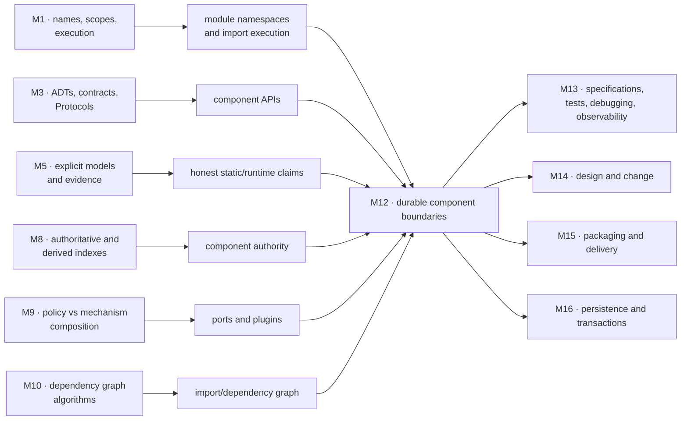

### The problem that forces this module

An early Atlas prototype handles source formats and ranking policies in one function:

```python
def process(source_kind, payload, ranking_kind):
    if source_kind == "pipe":
        events = parse_pipe(payload)
    elif source_kind == "json":
        events = parse_json(payload)
    else:
        raise ValueError("unknown source")

    if ranking_kind == "confidence":
        return sorted(events, key=confidence_key)
    elif ranking_kind == "recency":
        return sorted(events, key=recency_key)
    raise ValueError("unknown ranking")
```

This can be a reasonable first implementation. The architectural pressure appears when:

- formats and policies are owned or released independently;
- optional dependencies differ;
- third-party extensions become possible;
- changes repeatedly touch the same central conditional;
- tests must initialize unrelated mechanisms;
- imports begin to cycle;
- callers depend on accidental names and exceptions;
- agent-generated patches broaden the public surface without review.

The problem is not “the file is long.” The problem is that independent reasons to change have become entangled.

### Module question

> How can Atlas divide behavior into components whose public contracts remain visible and checkable, while volatile implementations point toward stable domain-owned abstractions and are assembled at one explicit boundary?

### Atlas checkpoint

Atlas adds two plugin families:

1. **event importers** turn an `ImportSource` into validated `StudyEvent` values;
2. **ranking policies** score `ReviewCandidate` values under a `RankingContext`.

The architecture includes:

- domain values with no plugin dependencies;
- structural `Protocol` ports owned near the application/domain need;
- application registries that depend only on ports;
- concrete built-in plugins that also depend on ports/domain;
- one composition root that knows both abstractions and concrete implementations;
- explicit API-version, duplicate-name, ambiguity, failure, and ranking-tie policies;
- contract/runtime tests beyond static compatibility;
- a real circular-import failure and a dependency-direction repair.

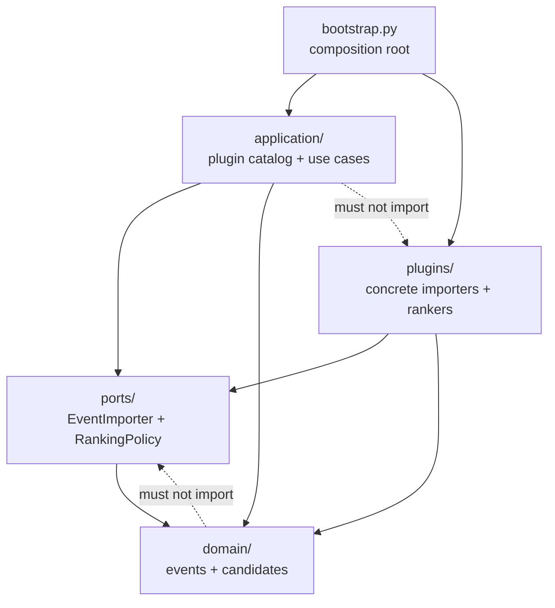

The dashed arrows are prohibited dependency directions.

### Backward connections

| Earlier module | Retrieved idea | Module 12 use |
|---|---|---|
| Module 1 | a namespace maps names to objects; top-level statements execute | a module has a global namespace populated during import |
| Module 3 | contracts, Protocols, RI/AF, composition root | move from one ADT boundary to a component graph |
| Module 5 | claims require a model and evidence | distinguish Python runtime, typing spec, and checker result |
| Module 8 | source of truth versus derived state | registry metadata does not replace plugin behavior or domain validation |
| Module 9 | policy must be explicit; one structure cannot answer every question | plugin selection, names, tie rules, and versions are separate policies |
| Module 10 | graph representation, cycles, topological order | import relationships form a directed graph that should usually be acyclic |

### Capabilities unlocked

- Module 13 can test component contracts and observe failures at boundaries.
- Module 14 can refactor implementations without reversing dependency direction.
- Module 15 can package Atlas and discover externally distributed plugins through metadata.
- Module 16 can place database adapters behind domain-owned ports.
- Modules 19–21 can add concurrent, networked, and async adapters without rewriting domain policy.
- Module 22 will treat plugins as trusted-code and supply-chain boundaries.

---

## 2. Prerequisite retrieval

Answer without notes. Record choice or explanation plus low/medium/high confidence.

### Retrieval A — names and execution

At function scope, what is the difference between evaluating an expression and binding a name? How might an `import` statement do both?

### Retrieval B — contract versus representation

If two event stores have compatible method signatures but one reverses history, what has static structure established, and what remains false?

### Retrieval C — dependency direction

In Module 3, why did `RecordingService` import `EventStore` while `main.py` imported the concrete `ListEventStore`?

### Retrieval D — authoritative state

Why did Module 8 keep the note store authoritative and make the inverted index rebuildable? Apply the same distinction to plugin metadata and plugin behavior.

### Retrieval E — policy

In Module 9, why did equal priorities require a declared tie policy instead of trusting tuple accidents? Name one analogous plugin-selection policy.

### Retrieval F — graph cycles

What does a directed cycle mean? Why can a topological order exist only for a directed acyclic graph?

### Retrieval G — runtime validation

Does `value: float` reject a string passed by an ordinary Python caller? Which layer must validate untrusted input?

### Retrieval H — evidence

What is stronger evidence for an importer: “a checker accepts the class” or contract tests over malformed, empty, and boundary inputs? Why are both useful?

<details>
<summary>Check the prerequisite model and route repairs</summary>

- **A:** evaluation produces/uses a value; binding associates a name in a namespace. Import invokes loading and then binds one or more names according to the import form. Return to Module 1 if namespace and object are fused.
- **B:** a checker may establish structural signature assignability; reverse order violates the behavioral contract. Return to Module 3 if `Protocol` is being treated as a proof of laws.
- **C:** application policy depended on a stable port; the composition root alone chose and injected a volatile implementation. Return to Module 3's architecture diagram if every client still constructs concrete adapters.
- **D:** metadata can advertise a candidate and version, but only loading, runtime validation, and contract evidence establish usable behavior. Metadata is discovery input, not authoritative domain truth.
- **E:** Atlas must define duplicate plugin names, multiple matching importers, ranking-score ties, and discovery order rather than inheriting incidental iteration order.
- **F:** a directed cycle is a path of dependencies returning to its start. No node in the cycle can appear before all its dependencies, so no topological order exists. Return to Module 10 if arrows are being read as undirected association.
- **G:** no. Ordinary annotations are not enforced by the runtime. Parsing/domain code must validate external bytes/text and values.
- **H:** they answer different questions. Static checking finds assignability inconsistencies across analyzed paths; contract tests exercise selected runtime behavior and laws. Neither alone proves all behavior.

</details>

---

## 3. Mastery outcomes

By the end, Michael can:

1. derive component boundaries from independent reasons to change;
2. distinguish a Python module object, source file, regular package, namespace package, distribution package, and architectural component;
3. trace import search, creation, cache insertion, execution, and name binding;
4. explain why a module is inserted into `sys.modules` before its code finishes;
5. predict top-level side effects, cache reuse, failure cleanup, and partial initialization;
6. distinguish `import x`, `import x.y`, `from x import y`, and explicit relative imports;
7. keep package initialization small and define deliberate re-exports;
8. explain what `__all__` and underscore naming do—and do not—guarantee;
9. design a public API from client observations, not from current helper names;
10. identify compatibility across names, signatures, types, values, exceptions, side effects, order, and import paths;
11. distinguish runtime class behavior, annotations, typing-spec claims, and checker-specific results;
12. use unions and control-flow narrowing without replacing runtime validation;
13. use generics to preserve relationships among input and output types;
14. explain covariance, contravariance, and invariance through producer/consumer/mutable roles;
15. define and read generic structural Protocols;
16. explain why `runtime_checkable` tests presence rather than full signatures or laws;
17. recover dependency direction from imports, annotations, construction, and calls;
18. apply dependency inversion without requiring a framework or inheritance;
19. diagnose a circular import from partially initialized module state;
20. distinguish a typing-only cycle workaround from an architectural cycle repair;
21. design explicit plugin registration before adding automatic discovery;
22. explain regular packages, implicit namespace packages, and entry-point metadata accurately;
23. threat-model in-process plugins as executable trusted code;
24. evolve a plugin API with version policy, adapters, capabilities, deprecation, and contract tests;
25. direct an agent to implement a bounded plugin change and reject scope, type, or dependency defects;
26. verify runnable behavior and report static-tool evidence with tool/version/configuration.

---

## 4. Components emerge from change pressure

### 4.1 A module is not automatically a good component

A Python **module** is a runtime object with a namespace. It is often initialized from one `.py` file, but loaders can create modules in other ways.

An architectural **component** is a responsibility boundary with:

- a public contract;
- hidden implementation decisions;
- owned state/policy;
- dependencies;
- tests and evolution rules.

One file may contain several responsibilities. One component may span several modules. Splitting every class into a file does not create modularity.

### 4.2 The change-pressure test

Ask of each responsibility:

1. What decision does it own?
2. Who needs its behavior?
3. What causes it to change?
4. What should remain unchanged when it changes?
5. Which data and side effects does it control?
6. Which failures cross the boundary?

For Atlas:

| Concern | Main reason to change | Stable client need |
|---|---|---|
| domain event | learning-data meaning changes | validated immutable event |
| importer port | application import contract changes | stream events from a source |
| pipe importer | pipe format changes | satisfy importer contract |
| ranking port | ranking capability changes | score a candidate under context |
| low-confidence ranker | one algorithm/policy changes | satisfy ranking contract |
| plugin catalog | selection/version policy changes | choose one valid capability |
| composition root | deployment configuration changes | assemble a complete application |

```mermaid
%% atlas-diagram-id: m12-change-pressure-to-evidence
%% atlas-diagram-title: Change pressure leads to bounded component evidence
%% atlas-diagram-alt: Independent reasons to change lead to cohesive decisions, a minimum contract, hidden mechanisms, dependencies toward stability, an explicit composition root, and layered evidence from contract tests, type checks, runtime validation, and review.
flowchart LR
    CHANGE["Independent reasons to change"] --> GROUP["Group cohesive decisions"]
    GROUP --> CONTRACT["Expose minimum useful contract"]
    CONTRACT --> HIDE["Hide volatile mechanism"]
    HIDE --> ARROWS["Direct dependencies toward stability"]
    ARROWS --> ROOT["Assemble at composition root"]
    ROOT --> EVIDENCE["Contract tests + type checks<br/>runtime validation + review"]
```

### 4.3 Cohesion and coupling

- **Cohesion:** how strongly the responsibilities inside one component belong together.
- **Coupling:** how much one component must know about another.

The objective is not zero coupling; useful software communicates. Seek:

- cohesive ownership;
- narrow, explicit coupling;
- stable dependency direction;
- replaceable mechanisms;
- observable failure contracts.

A giant `utils.py` often has low conceptual cohesion even if every helper is stateless.

---

## 5. What Python does during import

### 5.1 Concrete observation

Given:

```python
# atlas/banner.py
print("initializing banner")
LABELS: list[str] = []
LABELS.append("atlas")
```

and:

```python
import atlas.banner
import atlas.banner
```

ordinary execution prints once, not twice, because the second import normally reuses the module cached under its fully qualified name.

Do not reduce this to “imports happen once.” Cache entries can be removed, distinct module names can reach the same file, subinterpreters exist, and reload has special semantics. The accurate default model is below.

### 5.2 Search, create, cache, execute, bind

**[COURSE MODEL aligned with PYTHON 3.14]**

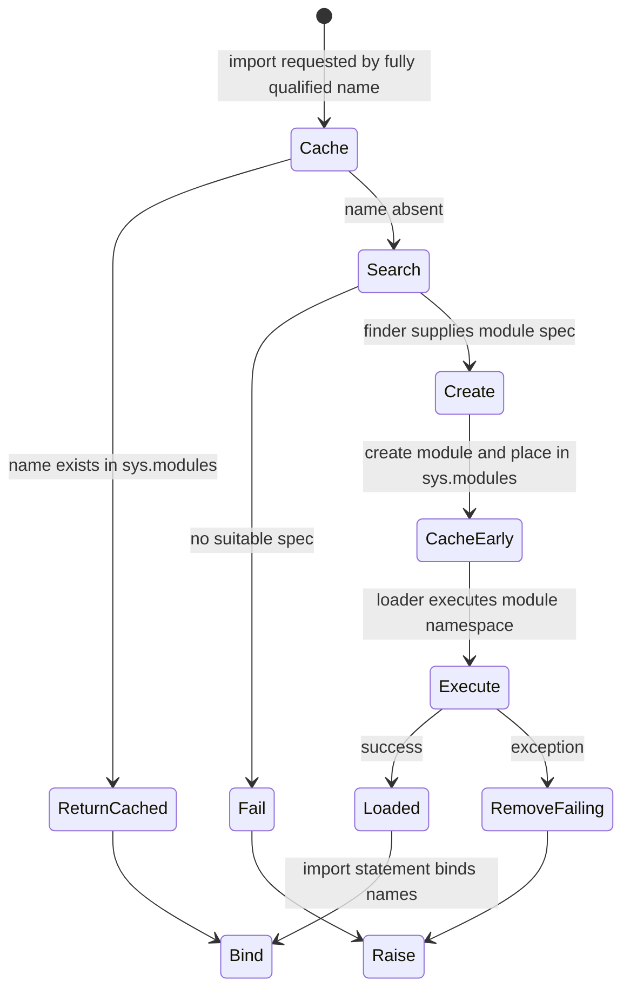

Important **[PYTHON 3.14 GUARANTEE]** facts:

1. import search checks `sys.modules` first;
2. a found cache entry normally satisfies the import;
3. a new module is placed in `sys.modules` before loader execution;
4. early insertion prevents unbounded recursive loading and duplicate module objects;
5. module execution populates the module namespace;
6. if loading fails, the failing module is removed, while successfully imported side-effect modules remain;
7. only the `import` statement performs the corresponding local name binding; APIs such as `importlib.import_module()` return module objects.

### 5.3 Why partial initialization exists

Early cache insertion means another module in a cycle can receive the first module object **before all its top-level names are bound**.

At that moment:

- the module object exists;
- `sys.modules` contains it;
- some earlier statements may have run;
- later class/function/constant bindings may not exist;
- reading one of those names can raise an import-related error.

This is not random corruption. It follows from the import state machine.

### 5.4 Import-time and request-time execution are different

Top-level code runs during module execution:

```python
REGISTRY = load_plugins_from_network()  # import-time I/O: dangerous boundary
```

A function body runs when called:

```python
def load_registry() -> Registry:
    return load_plugins_from_network()
```

Import-time work affects:

- startup latency;
- test collection;
- command-line help;
- optional dependency behavior;
- failure before logging/configuration is ready;
- cycle surfaces;
- reload and tooling.

Prefer definitions and small deterministic constants at module top level. Put environment-dependent construction and effects in explicit functions or the composition root.

### 5.5 Name binding depends on import form

```python
import atlas.plugins.pipe
```

binds `atlas` in the local namespace; the parent packages gain submodule attributes as loading proceeds.

```python
from atlas.plugins import pipe
```

binds `pipe` locally.

```python
from atlas.plugins.pipe import PipeImporter
```

binds the current object named `PipeImporter` locally. Later rebinding inside the source module does not automatically rebind this local name.

```python
from .contracts import EventImporter
```

is an explicit relative import whose meaning depends on package context.

Avoid wildcard imports in application code. They obscure origin, complicate static analysis, and turn public-surface mistakes into local namespace changes.

### 5.6 `__name__ == "__main__"`

When a source module is executed as the top-level script, its `__name__` is `"__main__"`. A guarded entry point separates definitions from direct-execution behavior:

```python
def main() -> int:
    ...
    return 0


if __name__ == "__main__":
    raise SystemExit(main())
```

The guard does not make import side effects elsewhere safe. It protects only the guarded block.

### 5.7 Reload and cache manipulation are investigation tools, not architecture

`importlib.reload(module)` re-executes code using the existing module object and retained dictionary semantics documented by `importlib`; outside references and existing instances may still point to old objects.

Deleting `sys.modules[name]` and importing again can create a distinct module object while old references survive.

Do not solve plugin updates by casually reloading modules. Hot reload requires an explicit state, identity, lifetime, and failure model.

### Prediction

```python
from atlas.plugins.pipe import PipeImporter
import atlas.plugins.pipe as pipe_module

old = PipeImporter
pipe_module.PipeImporter = object
```

After the rebinding:

- local `PipeImporter` still refers to `old`;
- `pipe_module.PipeImporter` refers to `object`.

Names are bindings, not live symbolic links across namespaces.

---

## 6. Packages, namespaces, distributions, and public paths

### 6.1 Keep the layers separate

| Term | Meaning |
|---|---|
| module | runtime object with a namespace, normally imported by a qualified name |
| regular package | package module normally backed by a directory containing `__init__.py` |
| submodule | module loaded beneath a package name |
| implicit namespace package | package assembled from one or more path portions, with no required `__init__.py` at the namespace level |
| distribution package | installable project/archive represented by packaging metadata; its name need not equal one import package |
| architectural component | responsibility and contract boundary, possibly spanning modules/packages |

“Package” is overloaded. Always qualify whether the discussion concerns import packages or installable distributions.

### 6.2 A regular Atlas package

```text
atlas/
├── __init__.py
├── domain/
│   ├── __init__.py
│   └── events.py
├── ports/
│   ├── __init__.py
│   └── plugins.py
├── application/
│   ├── __init__.py
│   └── catalog.py
├── plugins/
│   ├── __init__.py
│   ├── pipe.py
│   └── confidence.py
└── bootstrap.py
```

`__init__.py` can execute code, but package initialization should stay small. Heavy re-export graphs and automatic plugin loading in `__init__.py` increase startup, cycle, and compatibility risk.

### 6.3 Deliberate re-exports

An API facade may intentionally preserve a stable path:

```python
# atlas/api.py
from atlas.domain.events import ImportSource, StudyEvent
from atlas.ports.plugins import EventImporter, RankingPolicy

__all__ = [
    "EventImporter",
    "ImportSource",
    "RankingPolicy",
    "StudyEvent",
]
```

This creates a documented commitment such as:

```python
from atlas.api import EventImporter
```

The imported names inside arbitrary modules are not automatically public APIs. A re-export becomes public through deliberate documentation, support policy, and tests.

### 6.4 `__all__` is not a security wall

`__all__` primarily controls which names wildcard import exposes and can document an intended public surface. It does not:

- prevent direct import of an omitted name;
- hide source;
- validate compatibility;
- stop attribute access;
- sandbox plugins.

A leading underscore similarly marks an internal/support-policy boundary by convention. Python does not make `_helper` inaccessible.

### 6.5 Implicit namespace packages

**[PYTHON 3.14 / PEP 420]** An implicit namespace package can combine portions found in multiple directories and has a package `__path__` assembled by import machinery. It need not have `__init__.py` at the namespace level.

This can support separately distributed plugin portions, but it adds:

- path/discovery complexity;
- name collision policy;
- import-order and packaging questions;
- a larger failure surface if the application's main package is made a plugin namespace.

PyPA advises treating namespace-package plugin discovery as an advanced option. Atlas begins with explicit registration; Module 15 can add metadata discovery without turning the main `atlas` package into a shared namespace.

---

## 7. Public APIs are promises about observations

### 7.1 A public surface is more than names

For a function or component, clients may observe:

- import path and exported name;
- callable signature and accepted argument forms;
- returned type and value semantics;
- mutation, ordering, and ownership;
- exceptions and when they arise;
- side effects and external resources;
- blocking/laziness and timing if promised;
- concurrency or retry semantics if promised;
- deprecation and version policy.

Moving a class without a re-export can break clients even when the class body is unchanged.

### 7.2 Information hiding means selective dependence

Atlas clients should know:

```text
Importer: supports(source) and read(source) under a documented contract
```

They should not know:

```text
the regex helper name
the parser's temporary list
the concrete importer's module cache
the registry's dictionary layout
```

Hiding is valuable only when the public contract is adequate. An opaque component with an underspecified API is difficult to use and evolve.

### 7.3 Minimal does not mean vague

Badly small:

```python
def run(x): ...
```

Small and explicit:

```python
class EventImporter(Protocol):
    @property
    def name(self) -> str: ...

    def supports(self, source: ImportSource) -> bool: ...

    def read(self, source: ImportSource) -> Iterator[StudyEvent]: ...
```

The type surface still needs behavioral clauses:

- `supports` is deterministic and effect-free for the same immutable source metadata;
- `read` preserves source order;
- it yields only validated immutable events;
- malformed input raises `ImportDataError` with source/line context;
- it does not mutate the source;
- partial-yield behavior before an error is explicit.

### 7.4 Internal access is possible but unsupported

```python
catalog._rankers["secret"] = object()
```

Python permits this. Atlas declares it unsupported because it bypasses validation and can violate the registry invariant.

Real adversarial isolation requires a process, permission, or service boundary. Object naming cannot protect secrets or integrity from code running in the same interpreter.

### 7.5 API review questions

1. Which names and import paths are public?
2. Which behaviors are specified?
3. What is intentionally left free to change?
4. Does a type expose a mutable implementation object?
5. Which exception distinctions do callers need?
6. Which performance or ordering facts are promises?
7. Can a new implementation satisfy the surface without importing internals?
8. What compatibility test would catch accidental exposure?

---

## 8. Python is dynamically typed; annotations add optional static evidence

### 8.1 Three layers that must not collapse

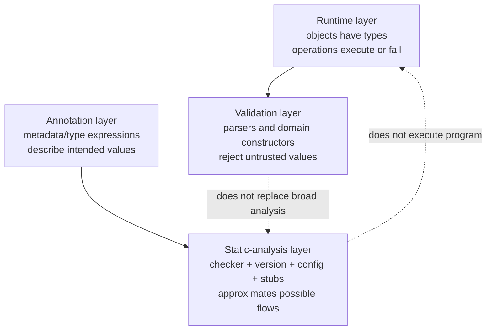

**[PYTHON 3.14 GUARANTEE]** Python's ordinary runtime does not enforce function or variable annotations.

```python
def confidence(value: float) -> float:
    return value


result = confidence("high")  # ordinary runtime accepts the call
assert result == "high"
```

A static checker should report the incompatible call in a checked context. The interpreter binds `"high"` to `value` because annotations are not an automatic guard.

### 8.2 Dynamic typing does not mean “objects have no types”

At runtime:

- every object has a type;
- operations consult runtime protocols and implementations;
- a name can be rebound to objects of different types;
- a failure occurs when an executed operation cannot support the actual object.

Static analysis predicts some failures without executing all paths. It is an approximation over source, annotations, inferred facts, stubs, and configuration.

### 8.3 Gradual typing and `Any`

Python typing is gradual: annotated and unannotated regions can coexist.

`Any` is an escape hatch that is broadly compatible in static analysis:

```python
from typing import Any


payload: Any = load_unknown()
payload.no_such_method()  # many checkers allow this through Any
```

`Any` is useful at a deliberately untyped boundary, but it propagates uncertainty. Prefer:

- `object` when any value is accepted but operations require narrowing;
- a precise union when alternatives are known;
- a Protocol when required behavior is known;
- runtime parsing at external boundaries.

Do not improve a checker report by spreading `Any` until diagnostics disappear.

### 8.4 `cast` changes a checker's view, not the object

```python
from typing import cast


raw: object = "not an importer"
claimed = cast(EventImporter, raw)
assert claimed is raw
```

`cast` performs no runtime check. It records a human assertion to the static tool. A cast at a plugin boundary therefore increases the review obligation; it does not validate a discovered object.

### 8.5 Annotation evaluation is its own runtime concern

Annotation semantics have evolved across Python versions. In Python 3.14, annotations are evaluated lazily under the current annotation model. This workbook also uses:

```python
from __future__ import annotations
```

in multi-module examples so the same source can avoid eager forward-reference evaluation on earlier supported runtimes.

If a framework introspects annotations, that is new runtime behavior. Resolving annotations can require names/imports and, for untrusted annotations, deserves a security review. Do not assume “static metadata” means “safe to evaluate arbitrarily.”

### 8.6 Tool results are scoped evidence

A credible type-check report names:

```text
tool: mypy or pyright
tool version
Python target version/platform
configuration file and strictness
files/packages analyzed
stub/dependency versions
exit status and diagnostics
```

Two tools can differ because:

- a behavior is implementation-defined or not fully specified;
- configurations infer different amounts of `Any`;
- library stubs differ;
- unreachable-code and narrowing rules differ;
- one command did not analyze the file you thought it did.

Report “mypy X under config Y accepts files Z,” not “Python proves the types.”

---

## 9. Unions and narrowing make alternatives explicit

### 9.1 A union is a disjunction

```python
from pathlib import Path


def source_label(source: Path | str) -> str:
    if isinstance(source, Path):
        return source.name
    return source
```

Before the branch, `source` may be `Path` or `str`. Inside the true branch, a conforming checker can narrow it to `Path`; in the false branch, to `str`.

This mirrors Module 4 logic:

```text
source ∈ Path ∪ str
source ∈ Path
therefore Path-specific operations are justified in that branch
```

### 9.2 `None` is a real alternative

```python
def choose_ranker(name: str) -> RankingPolicy | None:
    ...


policy = choose_ranker("confidence")
if policy is None:
    raise LookupError("unknown ranking policy")
score = policy.score(candidate, context)
```

An optional parameter means “has a default” in ordinary language. A type `T | None` means the value set includes `None`. They are related only when the signature says so.

### 9.3 Narrowing must follow a true runtime predicate

```python
def is_importer(value: object) -> bool:
    return hasattr(value, "read")
```

A boolean helper does not automatically tell a checker that `value` is a complete `EventImporter`. Even at runtime, one attribute proves neither compatible signatures nor behavior.

Advanced `TypeIs` and `TypeGuard` can communicate custom narrowing, but their implementation becomes a trusted assertion. Use them only when the predicate actually establishes the claimed type condition.

### 9.4 Exhaustiveness

For a closed union:

```python
from typing import assert_never


type Mode = PipeMode | JsonMode


def label(mode: Mode) -> str:
    match mode:
        case PipeMode():
            return "pipe"
        case JsonMode():
            return "json"
    assert_never(mode)
```

A checker can flag the final call if a new union member reaches it. At runtime, `assert_never` raises if executed. This is useful for closed alternatives; plugin families are intentionally open, so registry lookup is a better model than a closed union of every concrete plugin.

---

## 10. Generics preserve relationships, not just categories

### 10.1 The problem

This signature loses information:

```python
def first(items: Sequence[object]) -> object: ...
```

If the caller supplies `Sequence[StudyEvent]`, the result is specifically a `StudyEvent`.

```python
from collections.abc import Sequence
from typing import TypeVar


T = TypeVar("T")


def first(items: Sequence[T]) -> T:
    if not items:
        raise ValueError("first requires a nonempty sequence")
    return items[0]
```

`T` relates input element type to return type. It does not create a runtime loop over types.

### 10.2 Bounds express required capability

```python
from collections.abc import Sized


S = TypeVar("S", bound=Sized)


def longer(left: S, right: S) -> S:
    return left if len(left) >= len(right) else right
```

The bound permits `len` and preserves the chosen argument's inferred type relationship.

### 10.3 Variance from information flow

Let `Cat` be a subtype of `Animal`.

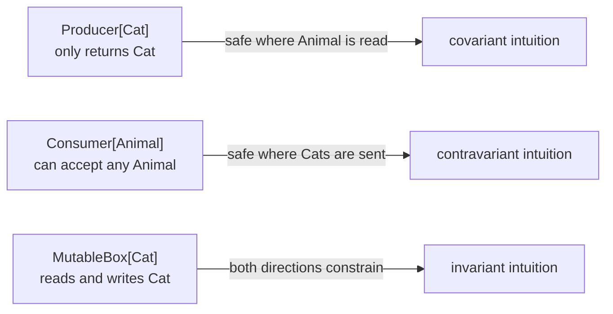

- **Covariant:** `Producer[Cat]` can be used where `Producer[Animal]` is expected because every produced cat is an animal.
- **Contravariant:** a consumer capable of accepting every animal can stand in where only cat inputs will be sent.
- **Invariant:** a mutable collection both produces and consumes its element type, so neither substitution direction is generally safe.

### 10.4 Why `list[Cat]` is not `list[Animal]`

```python
def add_animal(animals: list[Animal]) -> None:
    animals.append(Dog())


cats: list[Cat] = [Cat()]
# add_animal(cats)  # a checker rejects: it would place Dog in list[Cat]
```

The runtime list would allow the append. The static rejection protects the caller's `list[Cat]` promise.

Read-only `Sequence[Cat]` is covariant in the standard typing model because clients cannot append an arbitrary animal through that interface.

### 10.5 Generic Protocol intuition

Legacy syntax makes variance explicit:

```python
from typing import Protocol


T_co = TypeVar("T_co", covariant=True)
T_contra = TypeVar("T_contra", contravariant=True)


class Producer(Protocol[T_co]):
    def produce(self) -> T_co: ...


class Consumer(Protocol[T_contra]):
    def consume(self, value: T_contra) -> None: ...
```

Python 3.12+ type-parameter syntax allows checkers to infer class variance:

```python
class Producer[T](Protocol):
    def produce(self) -> T: ...
```

Do not choose variance markers from memorized signs. Trace where values flow.

---

## 11. Structural Protocols express the dependency surface

### 11.1 Static structural compatibility

```python
from collections.abc import Iterator
from typing import Protocol


class EventImporter(Protocol):
    @property
    def name(self) -> str: ...

    @property
    def api_version(self) -> int: ...

    def supports(self, source: ImportSource) -> bool: ...

    def read(self, source: ImportSource) -> Iterator[StudyEvent]: ...
```

A concrete importer does not need to inherit from `EventImporter`. A static checker considers whether its members have assignable types.

This is useful for plugins because:

- external implementations do not need a shared base-class hierarchy;
- test doubles can remain small;
- the port can describe only the behavior application policy needs;
- implementation inheritance and API compatibility stay separate.

### 11.2 What a Protocol does not establish

It does not prove:

- `name` is unique or stable;
- `api_version` is supported;
- `supports` is pure or deterministic;
- events are validated;
- source order is preserved;
- errors include useful context;
- a plugin is secure;
- a plugin will terminate;
- runtime calls will match stale or inaccurate annotations.

Those require runtime checks, tests, reasoning, review, and operational controls.

### 11.3 `runtime_checkable` is deliberately shallow

**[PYTHON 3.14 GUARANTEE]** A Protocol decorated with `@runtime_checkable` can be used with `isinstance`/`issubclass` in its supported cases, but the check examines required member presence, not complete signatures or behavior.

```python
from typing import Protocol, runtime_checkable


@runtime_checkable
class ReadsEvents(Protocol):
    def read(self, source: ImportSource) -> Iterator[StudyEvent]: ...


class Trap:
    def read(self) -> int:
        return 7


assert isinstance(Trap(), ReadsEvents)  # presence can pass; signature is wrong
```

Do not use this assertion as plugin acceptance. It is at most one shallow runtime signal and can be slower than ordinary class checks.

### 11.4 Protocol versus ABC

Choose a Protocol when:

- open structural implementation is desired;
- shared inherited code is unnecessary;
- the dependency surface matters more than nominal membership.

Choose an ABC when:

- explicit nominal participation is part of runtime design;
- incomplete subclasses should fail construction;
- carefully designed shared behavior or subclass hooks are needed.

Neither mechanism proves behavioral laws. Atlas's current plugin ports favor Protocols plus explicit registry validation and contract suites.

---

## 12. Dependency direction is a graph of knowledge

### 12.1 What counts as a dependency?

A module can depend on another through:

- a runtime import;
- a typing-only import;
- construction of a concrete class;
- subclassing or registration;
- calling an API;
- relying on a schema, exception, global, or side effect;
- configuration containing a fully qualified object path;
- tests that lock in an internal name.

Import graphs reveal much, but not every dependency.

### 12.2 Dependency inversion from first principles

Without inversion:

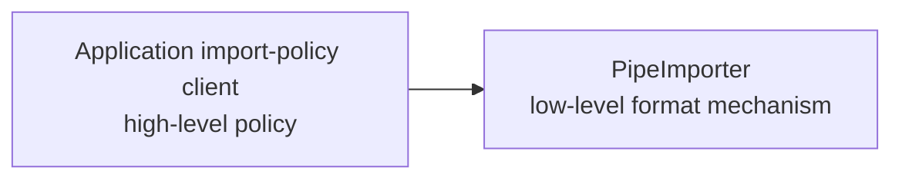

Every new mechanism pressures the policy module.

With a domain/application-owned port:

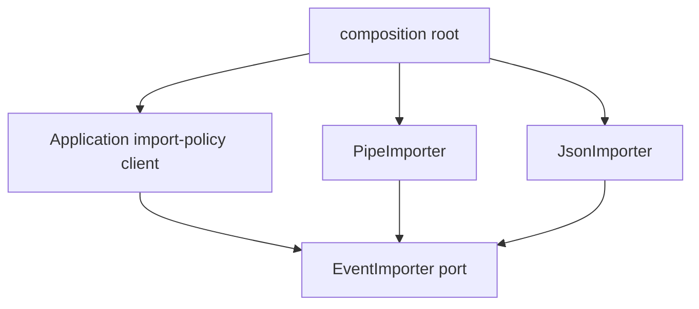

Both high-level policy and low-level mechanisms point toward the stable behavioral need. The composition root is allowed to know concretes because choosing them is its responsibility.

This is **dependency inversion**:

- not “all dependencies disappear”;
- not “use inheritance everywhere”;
- not “install a dependency-injection framework”;
- not merely “pass an argument.”

Constructor injection is one wiring mechanism. The architectural achievement is that application policy does not import the concrete plugin.

### 12.3 Stable and volatile are contextual

An abstraction is not automatically stable because it is named `Interface`. A frequently edited, oversized Protocol can destabilize every implementation.

Place a port near the client/domain need that owns its meaning. Keep it:

- cohesive;
- minimal but adequate;
- independent of concrete parser libraries;
- explicit about behavior and failures;
- versioned only when external compatibility requires it.

Avoid a global `interfaces.py` dumping ground that couples unrelated domains.

### 12.4 Architecture fitness questions

For each dependency arrow:

1. Does the source truly need the target?
2. Is it depending on behavior or representation?
3. Is the direction from volatile policy toward a more stable need?
4. Could construction move to the root?
5. Would a Protocol clarify an already-real boundary, or invent ceremony?
6. Is the import needed only for typing?
7. Would removing this arrow eliminate a cycle?

---

## 13. Circular imports are execution-order failures and design signals

### 13.1 A real broken pair

```python
# atlas/ports/plugins.py
from atlas.plugins.defaults import DEFAULT_IMPORTERS
from typing import Protocol


class EventImporter(Protocol):
    ...
```

```python
# atlas/plugins/defaults.py
from atlas.ports.plugins import EventImporter
from atlas.plugins.pipe import PipeImporter


DEFAULT_IMPORTERS: tuple[EventImporter, ...] = (PipeImporter(),)
```

Importing `atlas.ports.plugins` produces this dependency cycle:

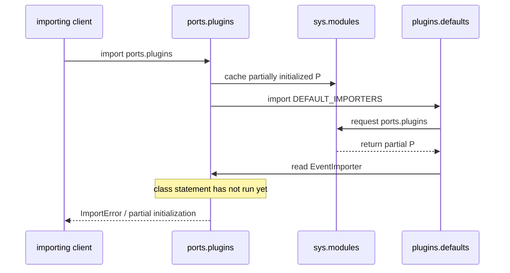

### 13.2 Root cause

The immediate mechanism:

- `ports.plugins` exists in `sys.modules`;
- its first import runs before the `EventImporter` class statement;
- `defaults` receives that partial module;
- the requested name is not bound.

The architectural cause:

- the port module tries to choose its concrete default implementation;
- the concrete default module correctly needs the port;
- responsibility for wiring is in both directions.

### 13.3 Correct repair: move choice outward

```python
# atlas/ports/plugins.py
from typing import Protocol


class EventImporter(Protocol):
    ...
```

```python
# atlas/bootstrap.py
from atlas.application.catalog import PluginCatalog
from atlas.plugins.pipe import PipeImporter


def build_catalog() -> PluginCatalog:
    return PluginCatalog(importers=(PipeImporter(),), rankers=(...))
```

Now:

- port knows no concrete;
- concrete imports port/domain;
- application imports port/domain;
- root imports application and concrete to assemble them.

### 13.4 Typing-only cycles are narrower

Sometimes a runtime import exists only to spell an annotation:

```python
from __future__ import annotations

from typing import TYPE_CHECKING

if TYPE_CHECKING:
    from atlas.application.catalog import PluginCatalog


def register_with(catalog: PluginCatalog) -> None:
    ...
```

`TYPE_CHECKING` is false at runtime and treated as true by static checkers. This can remove a runtime import edge when the implementation does not need the class object.

It is not a universal cycle cure:

- if runtime code constructs or checks `PluginCatalog`, the import is real;
- runtime annotation introspection may need the name;
- two modules with mixed responsibilities remain poorly designed even if the exception disappears;
- type-check graphs still contain the dependency.

### 13.5 Tactical local imports

Moving an import inside a function can delay an edge:

```python
def build():
    from atlas.plugins.pipe import PipeImporter
    return PipeImporter()
```

This is legitimate for optional dependencies or startup control when documented. Used solely to hide a responsibility cycle, it converts a deterministic startup failure into a later path-dependent failure.

### Debugging protocol

1. capture the first traceback, not the final repeated symptom;
2. list modules and top-level names in execution order;
3. inspect the relevant `sys.modules` entries;
4. identify the first read of an unbound name;
5. draw runtime and typing dependency graphs separately;
6. assign construction/selection to one composition root;
7. add a smoke import in a fresh process;
8. add an architecture test or dependency rule when justified.

---

## 14. Plugin architecture is an open compatibility boundary

### 14.1 Start with explicit registration

```python
catalog = PluginCatalog(
    importers=(PipeImporter(),),
    rankers=(LowConfidenceRanking(),),
)
```

This is intentionally ordinary:

- deterministic choices;
- visible concrete dependencies at the root;
- simple failure behavior;
- no packaging requirement;
- easy tests.

Automatic discovery is justified only when independently distributed extensions are a real requirement.

### 14.2 Three discovery mechanisms

PyPA documents:

1. distribution/module naming conventions;
2. namespace-package scanning;
3. distribution metadata entry points.

For a later packaged Atlas:

```python
from importlib.metadata import entry_points


for entry_point in entry_points(group="atlas.importers.v1"):
    candidate = entry_point.load()
```

`entry_points()` discovers metadata. `EntryPoint.load()` resolves/imports the advertised object. That loading can execute arbitrary plugin module code.

### 14.3 Discovery is not acceptance

A safe acceptance pipeline for trusted in-process plugins still needs:

```text
discover metadata
→ resolve/load under failure handling
→ check API version and declared identity
→ perform shallow structural/runtime checks if useful
→ instantiate under an explicit contract
→ run configuration/health validation
→ register with duplicate/conflict policy
→ observe failures and disable/reject cleanly
```

Static checking of Atlas source cannot analyze arbitrary future installed plugins.

### 14.4 Trust boundary

An in-process plugin can:

- read process memory reachable through Python objects;
- access files/network under process permissions;
- mutate globals;
- block indefinitely;
- terminate the process;
- import unsafe dependencies;
- return objects that violate annotations.

A Protocol is not a sandbox. For adversarial or low-trust extensions, use a process/service boundary with a serialized protocol, resource limits, permissions, and failure containment. Modules 18, 20, and 22 deepen that design.

### 14.5 Policy sheet

Atlas must specify:

| Question | Checkpoint policy |
|---|---|
| supported API | integer `api_version == 1` as an initial compatibility gate |
| duplicate plugin name | reject catalog construction |
| multiple importers support a source | reject as ambiguous; no discovery-order winner |
| no importer supports source | raise `UnsupportedSourceError` |
| ranking policy lookup | exact documented name |
| ranking score | must be finite |
| equal scores | concept ID ascending |
| plugin exception | translate only documented data errors; preserve cause |
| discovery order | never semantic |
| plugin trust | trusted in-process code for this checkpoint |

An integer version is not proof of compatibility. It is a negotiation/filter signal combined with type, runtime, and contract evidence.

---

## 15. Public API evolution is a graph-wide change

### 15.1 Compatibility dimensions

A change may break:

- import paths;
- exported names;
- positional/keyword calling patterns;
- accepted and returned types;
- value meaning;
- exception class or timing;
- ordering and stability;
- mutation/ownership;
- side effects;
- subclass or structural implementer expectations;
- performance promises;
- serialized or persisted forms.

“The tests pass” can miss external clients and plugins not present in the repository.

### 15.2 Adding a required Protocol method is breaking

Version 1:

```python
class RankingPolicy(Protocol):
    def score(self, candidate: ReviewCandidate, context: RankingContext) -> float:
        ...
```

Changing the same public Protocol to require:

```python
def explain(self, candidate: ReviewCandidate) -> str: ...
```

makes every existing structural implementation incomplete to a checker and may break callers that invoke it.

Prefer a separate optional capability:

```python
class ExplainableRankingPolicy(Protocol):
    def explain(self, candidate: ReviewCandidate) -> str: ...
```

Then feature negotiation is explicit. Alternatively introduce a new version and an adapter when explanation is truly mandatory.

### 15.3 Evolution route

```mermaid
%% atlas-diagram-id: m12-api-evolution-route
%% atlas-diagram-title: Compatible public API evolution route
%% atlas-diagram-alt: A new client need prompts an impact map, a compatible API or capability, an adapter or old re-export, a documented warning and deprecation, migration evidence, and only then a policy-controlled removal.
flowchart LR
    NEED["new client need"] --> IMPACT["map callers + implementers<br/>import paths + behavior"]
    IMPACT --> ADD["add compatible API/capability"]
    ADD --> ADAPT["provide adapter or old re-export"]
    ADAPT --> WARN["document + deprecate<br/>with actionable warning"]
    WARN --> OBSERVE["collect migration evidence"]
    OBSERVE --> REMOVE["remove only under policy"]
```

Atlas borrows the discipline—not the exact release timeline—of Python's documented compatibility process:

- define public versus internal;
- avoid silent incompatible behavior changes;
- provide warnings/documentation and replacement paths;
- allow a meaningful migration period;
- test the old and new path during transition.

### 15.4 Re-export bridge

If a public type moves:

```python
# old public path: atlas.plugins.EventImporter
from atlas.ports.plugins import EventImporter

__all__ = ["EventImporter"]
```

The bridge can preserve source imports temporarily. It must avoid creating a new cycle and should carry a documented deprecation plan.

### 15.5 Compatibility review

Before changing a port:

1. search direct and re-exported import paths;
2. locate structural implementations, including tests and examples;
3. inspect external plugin/version policy;
4. compare callable assignability;
5. list behavioral changes not expressible in types;
6. design adapter/capability/version route;
7. update contract suites;
8. run static checks with named configuration;
9. test fresh-process imports;
10. document migration and rollback.

---

## 16. Atlas checkpoint — typed importer and ranking plugins

### 16.1 Repository slice

```text
atlas/
├── api.py                         # deliberate public re-exports
├── domain/
│   └── models.py                  # immutable values + runtime invariants
├── ports/
│   └── plugins.py                 # structural contracts
├── application/
│   └── plugin_catalog.py          # selection and ranking policy
├── plugins/
│   ├── pipe.py                    # concrete format mechanism
│   └── low_confidence.py          # concrete ranking mechanism
└── bootstrap.py                   # composition root
tests/
├── test_importer_contract.py
├── test_ranking_contract.py
├── test_plugin_catalog.py
└── test_import_smoke.py
```

The code is shown by responsibility. It can also be combined into one file for the mechanism test at the end.

### 16.2 Domain values validate runtime truth

```python
# atlas/domain/models.py
from __future__ import annotations

from dataclasses import dataclass


@dataclass(frozen=True)
class ImportSource:
    source_id: str
    media_type: str
    text: str


@dataclass(frozen=True)
class StudyEvent:
    event_id: str
    concept_id: str
    confidence: float

    def __post_init__(self) -> None:
        if not self.event_id:
            raise ValueError("event_id must be nonempty")
        if not self.concept_id:
            raise ValueError("concept_id must be nonempty")
        if not 0.0 <= self.confidence <= 1.0:
            raise ValueError("confidence must be between 0 and 1")


@dataclass(frozen=True)
class ReviewCandidate:
    concept_id: str
    confidence: float

    def __post_init__(self) -> None:
        if not self.concept_id:
            raise ValueError("concept_id must be nonempty")
        if not 0.0 <= self.confidence <= 1.0:
            raise ValueError("confidence must be between 0 and 1")


@dataclass(frozen=True)
class RankingContext:
    completed_reviews: int

    def __post_init__(self) -> None:
        if self.completed_reviews < 0:
            raise ValueError("completed_reviews must be nonnegative")
```

The annotations help tools. `__post_init__` enforces the chosen runtime domain invariant. It still does not validate whether an event ID exists in a durable store; that is a different boundary.

### 16.3 Ports describe only the needed behavior

```python
# atlas/ports/plugins.py
from __future__ import annotations

from collections.abc import Iterator
from typing import Protocol

from atlas.domain.models import (
    ImportSource,
    RankingContext,
    ReviewCandidate,
    StudyEvent,
)


PLUGIN_API_VERSION = 1


class EventImporter(Protocol):
    @property
    def name(self) -> str: ...

    @property
    def api_version(self) -> int: ...

    def supports(self, source: ImportSource) -> bool: ...

    def read(self, source: ImportSource) -> Iterator[StudyEvent]: ...


class RankingPolicy(Protocol):
    @property
    def name(self) -> str: ...

    @property
    def api_version(self) -> int: ...

    def score(
        self,
        candidate: ReviewCandidate,
        context: RankingContext,
    ) -> float: ...
```

Behavioral clauses:

#### Event importer

- `supports` is deterministic and effect-free for the same source value;
- exactly one supporting importer is required by the catalog policy;
- `read` preserves source record order;
- blank records may be ignored only if the format contract says so;
- every yielded event satisfies domain invariants;
- malformed input raises `ImportDataError` with source and line;
- events yielded before a later malformed line remain yielded in this streaming contract.

#### Ranking policy

- `score` is deterministic for equal immutable candidate/context values;
- it does not mutate either value;
- it returns a finite float;
- higher score ranks earlier;
- catalog ties use concept ID ascending;
- candidates must have unique concept IDs.

Protocol syntax does not encode most of these clauses.

### 16.4 Application owns registration and selection policy

```python
# atlas/application/plugin_catalog.py
from __future__ import annotations

from collections.abc import Iterable
from math import isfinite

from atlas.domain.models import (
    ImportSource,
    RankingContext,
    ReviewCandidate,
    StudyEvent,
)
from atlas.ports.plugins import (
    PLUGIN_API_VERSION,
    EventImporter,
    RankingPolicy,
)


class PluginError(Exception):
    """Base class for catalog/plugin boundary failures."""


class UnsupportedPluginVersionError(PluginError):
    pass


class DuplicatePluginNameError(PluginError):
    pass


class UnsupportedSourceError(PluginError):
    pass


class AmbiguousImporterError(PluginError):
    pass


class UnknownRankingPolicyError(PluginError):
    pass


class InvalidPluginOutputError(PluginError):
    pass


class PluginCatalog:
    def __init__(
        self,
        importers: Iterable[EventImporter],
        rankers: Iterable[RankingPolicy],
    ) -> None:
        self._importers = tuple(importers)
        ranker_list = tuple(rankers)

        self._validate_versions((*self._importers, *ranker_list))
        self._validate_unique_names(self._importers, "importer")
        self._validate_unique_names(ranker_list, "ranking policy")
        self._rankers = {ranker.name: ranker for ranker in ranker_list}

    @staticmethod
    def _validate_versions(plugins: tuple[object, ...]) -> None:
        for plugin in plugins:
            name = getattr(plugin, "name", "<unnamed>")
            version = getattr(plugin, "api_version", None)
            if version != PLUGIN_API_VERSION:
                raise UnsupportedPluginVersionError(
                    f"{name!r} declares API {version!r}; "
                    f"expected {PLUGIN_API_VERSION}"
                )

    @staticmethod
    def _validate_unique_names(
        plugins: tuple[EventImporter, ...]
        | tuple[RankingPolicy, ...],
        kind: str,
    ) -> None:
        names = [plugin.name for plugin in plugins]
        if len(names) != len(set(names)):
            raise DuplicatePluginNameError(
                f"duplicate {kind} name"
            )

    def import_events(
        self,
        source: ImportSource,
    ) -> tuple[StudyEvent, ...]:
        matches: list[EventImporter] = []
        for importer in self._importers:
            supported = importer.supports(source)
            if type(supported) is not bool:
                raise InvalidPluginOutputError(
                    f"{importer.name!r} returned non-bool from supports"
                )
            if supported:
                matches.append(importer)
        if not matches:
            raise UnsupportedSourceError(source.media_type)
        if len(matches) > 1:
            names = ", ".join(sorted(item.name for item in matches))
            raise AmbiguousImporterError(
                f"{source.media_type!r} matched: {names}"
            )

        importer = matches[0]
        events: list[StudyEvent] = []
        for position, event in enumerate(
            importer.read(source),
            start=1,
        ):
            if not isinstance(event, StudyEvent):
                raise InvalidPluginOutputError(
                    f"{importer.name!r} produced non-StudyEvent "
                    f"at output {position}"
                )
            events.append(event)
        return tuple(events)

    def rank(
        self,
        candidates: Iterable[ReviewCandidate],
        policy_name: str,
        context: RankingContext,
    ) -> tuple[ReviewCandidate, ...]:
        try:
            policy = self._rankers[policy_name]
        except KeyError as error:
            raise UnknownRankingPolicyError(policy_name) from error

        candidate_list = tuple(candidates)
        ids = [candidate.concept_id for candidate in candidate_list]
        if len(ids) != len(set(ids)):
            raise InvalidPluginOutputError(
                "ranking candidates require unique concept IDs"
            )

        scored: list[tuple[float, str, ReviewCandidate]] = []
        for candidate in candidate_list:
            raw_score = policy.score(candidate, context)
            if (
                isinstance(raw_score, bool)
                or not isinstance(raw_score, (int, float))
                or not isfinite(raw_score)
            ):
                raise InvalidPluginOutputError(
                    f"{policy.name!r} produced invalid score "
                    f"{raw_score!r}"
                )
            score = float(raw_score)
            scored.append((-score, candidate.concept_id, candidate))

        scored.sort(key=lambda row: (row[0], row[1]))
        return tuple(candidate for _, _, candidate in scored)
```

### 16.5 Concrete plugins point inward

```python
# atlas/plugins/pipe.py
from __future__ import annotations

from collections.abc import Iterator

from atlas.domain.models import ImportSource, StudyEvent
from atlas.ports.plugins import PLUGIN_API_VERSION


class ImportDataError(ValueError):
    pass


class PipeImporter:
    @property
    def name(self) -> str:
        return "atlas.pipe"

    @property
    def api_version(self) -> int:
        return PLUGIN_API_VERSION

    def supports(self, source: ImportSource) -> bool:
        return source.media_type == "text/x-atlas-pipe"

    def read(self, source: ImportSource) -> Iterator[StudyEvent]:
        for line_number, raw_line in enumerate(
            source.text.splitlines(),
            start=1,
        ):
            if not raw_line.strip():
                continue
            parts = [part.strip() for part in raw_line.split("|")]
            if len(parts) != 3:
                raise ImportDataError(
                    f"{source.source_id}:{line_number}: expected 3 fields"
                )
            event_id, concept_id, raw_confidence = parts
            try:
                yield StudyEvent(
                    event_id=event_id,
                    concept_id=concept_id,
                    confidence=float(raw_confidence),
                )
            except ValueError as error:
                raise ImportDataError(
                    f"{source.source_id}:{line_number}: {error}"
                ) from error
```

```python
# atlas/plugins/low_confidence.py
from __future__ import annotations

from atlas.domain.models import RankingContext, ReviewCandidate
from atlas.ports.plugins import PLUGIN_API_VERSION


class LowConfidenceRanking:
    @property
    def name(self) -> str:
        return "low-confidence"

    @property
    def api_version(self) -> int:
        return PLUGIN_API_VERSION

    def score(
        self,
        candidate: ReviewCandidate,
        context: RankingContext,
    ) -> float:
        del context  # this v1 policy deliberately ignores history
        return 1.0 - candidate.confidence
```

The concrete plugins import ports/domain. Neither port nor application module imports these concrete classes.

### 16.6 Composition root chooses implementations

```python
# atlas/bootstrap.py
from atlas.application.plugin_catalog import PluginCatalog
from atlas.plugins.low_confidence import LowConfidenceRanking
from atlas.plugins.pipe import PipeImporter


def build_plugin_catalog() -> PluginCatalog:
    return PluginCatalog(
        importers=(PipeImporter(),),
        rankers=(LowConfidenceRanking(),),
    )
```

The root is intentionally concrete. Tests can construct other catalogs without patching globals.

### 16.7 Static witnesses

```python
importer: EventImporter = PipeImporter()
ranker: RankingPolicy = LowConfidenceRanking()
```

A named static checker should accept these assignments when all modules and stubs are analyzed under compatible configuration. Their execution has no validation effect.

### 16.8 Prediction

```python
catalog = build_plugin_catalog()
source = ImportSource(
    source_id="session.pipe",
    media_type="text/x-atlas-pipe",
    text="e1 | hashing | 0.8\n\ne2 | trees | 0.3",
)

events = catalog.import_events(source)
candidates = tuple(
    ReviewCandidate(event.concept_id, event.confidence)
    for event in events
)
ranked = catalog.rank(
    candidates,
    policy_name="low-confidence",
    context=RankingContext(completed_reviews=5),
)
```

Predict:

- event order: `e1`, then `e2`;
- ranking order: `trees`, then `hashing`;
- no concrete plugin import inside `PluginCatalog`;
- all runtime domain validation occurs despite valid annotations.

### 16.9 Catalog invariant and abstraction

**Representation invariant**

1. every registered plugin declares supported API version 1;
2. importer names are unique;
3. ranking-policy names are unique;
4. `_rankers[name].name == name`;
5. registry collections are private and not returned mutably;
6. every `supports` result is an actual `bool`;
7. every imported output is a `StudyEvent`;
8. selection never depends on registration/discovery order;
9. ranking emits only candidates supplied to the call, once each;
10. every accepted score is numeric, non-boolean, and finite.

**Abstraction function**

The catalog denotes:

- a finite set of importer capabilities identified by name;
- a finite mapping from ranking-policy name to behavior;
- deterministic selection, ambiguity, version, and tie policies.

Concrete tuple/dictionary layout and plugin class identities are absent from the abstract value.

### 16.10 Correctness arguments

#### Importer selection

- no matches implies the source is unsupported under current capabilities;
- one match gives a unique selected importer;
- more than one match is rejected, so iteration order cannot silently choose semantics.

#### Ranking

- every candidate contributes exactly one scored tuple;
- unique-ID validation prevents an unspecified duplicate tie;
- type and finite validation reject booleans, nonnumeric values, infinities, and
  `NaN`, whose comparison behavior could violate intuitive ordering;
- sorting by `(-score, concept_id)` places higher scores first and defines all ties;
- projection returns each original candidate exactly once.

Static typing is not used as a premise in either runtime proof.

### 16.11 Cost model

Let:

- `p` be registered importers;
- `n` be input records/characters as stated by the importer model;
- `r` be ranking candidates;
- `q` be registered ranking policies.

| Operation | Model cost | Important qualifier |
|---|---:|---|
| catalog construction | `Θ(p + q)` | property access and hashing assumed bounded |
| importer selection | `Θ(p)` supports calls | a plugin's `supports` cost/effects must be bounded by contract |
| pipe import | `Θ(input characters)` | output tuple materializes `n` events |
| ranking lookup | expected `Θ(1)` dict lookup | inherits Module 8 hash assumptions |
| scoring | `Θ(r)` policy calls | policy cost may differ |
| ranking sort | `Θ(r log r)` comparisons | Python implementation constants/adaptivity separate |
| catalog storage | `Θ(p + q)` references | loaded plugin modules retain additional state |

Automatic discovery would add metadata scan, import execution, dependency loading, and failure costs.

---

## 17. Contract and adversarial tests

### 17.1 Executable behavior

```python
def test_pipe_import_and_ranking() -> None:
    catalog = build_plugin_catalog()
    source = ImportSource(
        source_id="study.pipe",
        media_type="text/x-atlas-pipe",
        text="e1|graphs|0.7\n\ne2|types|0.2",
    )

    events = catalog.import_events(source)
    assert events == (
        StudyEvent("e1", "graphs", 0.7),
        StudyEvent("e2", "types", 0.2),
    )

    ranked = catalog.rank(
        (
            ReviewCandidate("graphs", 0.7),
            ReviewCandidate("types", 0.2),
        ),
        "low-confidence",
        RankingContext(0),
    )
    assert [item.concept_id for item in ranked] == [
        "types",
        "graphs",
    ]
```

### 17.2 Runtime validation beats annotations

```python
def test_bad_confidence_has_source_context() -> None:
    catalog = build_plugin_catalog()
    source = ImportSource(
        source_id="bad.pipe",
        media_type="text/x-atlas-pipe",
        text="e1|types|high",
    )

    try:
        catalog.import_events(source)
    except ImportDataError as error:
        assert "bad.pipe:1" in str(error)
    else:
        raise AssertionError("invalid confidence was accepted")
```

### 17.3 Ambiguity is not discovery order

```python
class SecondPipeImporter(PipeImporter):
    @property
    def name(self) -> str:
        return "atlas.second-pipe"


def test_two_supporting_importers_are_ambiguous() -> None:
    catalog = PluginCatalog(
        importers=(PipeImporter(), SecondPipeImporter()),
        rankers=(LowConfidenceRanking(),),
    )
    source = ImportSource("x", "text/x-atlas-pipe", "")

    try:
        catalog.import_events(source)
    except AmbiguousImporterError:
        pass
    else:
        raise AssertionError("registration order selected semantics")
```

### 17.4 Version and duplicate identity

```python
class FuturePipeImporter(PipeImporter):
    @property
    def api_version(self) -> int:
        return 2


def test_unsupported_version_fails_at_composition() -> None:
    try:
        PluginCatalog(
            importers=(FuturePipeImporter(),),
            rankers=(),
        )
    except UnsupportedPluginVersionError:
        pass
    else:
        raise AssertionError("unsupported API version was accepted")
```

Also test duplicate importer names and duplicate ranking names independently.

### 17.5 Invalid plugin outputs

```python
class NaNRanking(LowConfidenceRanking):
    @property
    def name(self) -> str:
        return "nan"

    def score(self, candidate, context) -> float:
        return float("nan")


def test_nonfinite_score_is_rejected() -> None:
    catalog = PluginCatalog((), (NaNRanking(),))
    try:
        catalog.rank(
            (ReviewCandidate("types", 0.5),),
            "nan",
            RankingContext(0),
        )
    except InvalidPluginOutputError:
        pass
    else:
        raise AssertionError("NaN score was accepted")


class TextRanking(LowConfidenceRanking):
    @property
    def name(self) -> str:
        return "text-score"

    def score(self, candidate, context):
        return "high"


def test_nonnumeric_score_is_rejected() -> None:
    catalog = PluginCatalog((), (TextRanking(),))
    try:
        catalog.rank(
            (ReviewCandidate("types", 0.5),),
            "text-score",
            RankingContext(0),
        )
    except InvalidPluginOutputError:
        pass
    else:
        raise AssertionError("nonnumeric score was accepted")


class WrongEventImporter(PipeImporter):
    @property
    def name(self) -> str:
        return "wrong-event"

    def read(self, source):
        yield {"event_id": "not-a-domain-value"}


def test_non_event_importer_output_is_rejected() -> None:
    catalog = PluginCatalog((WrongEventImporter(),), ())
    try:
        catalog.import_events(
            ImportSource("x", "text/x-atlas-pipe", "ignored")
        )
    except InvalidPluginOutputError:
        pass
    else:
        raise AssertionError("non-StudyEvent output was accepted")
```

### 17.6 Required contract properties

For every importer:

- unsupported source makes `supports` false without effects;
- repeated `supports` calls agree;
- valid records preserve order;
- blank-line policy is explicit;
- malformed field count, number, and domain value have contextual errors;
- source remains unchanged;
- partial-yield policy is tested.
- non-boolean support claims and non-`StudyEvent` outputs are rejected.

For every ranking policy:

- deterministic equal-input score;
- no mutation;
- finite output;
- nonnumeric and boolean scores are rejected;
- score direction;
- tie handling in catalog;
- boundary confidence values.

For the architecture:

- import each public module in a fresh process;
- importing ports does not import concrete plugin modules;
- application modules do not import `atlas.plugins`;
- public facade exports only documented names;
- no import performs environment/network discovery.

### 17.7 Bounded dependency-direction model package

Use this small finite model to inspect a declared architecture graph before you
mistake a sketch for evidence. [Download the bounded dependency-direction
model](/downloads/module12_reference.py) and [its focused adversarial
tests](/downloads/test_module12_reference.py), put them in one directory, and
from that directory run:

```bash
python -m unittest -v test_module12_reference.py
```

The model accepts only named components, directed dependencies, and explicit
concrete selections. It distinguishes a permitted port dependency from a
concrete inward dependency, and it makes the composition root's choice visible.
It does not parse Python imports or prove runtime behavior, plugin trust,
substitutability, type-checker results, or production correctness. Read its
scope statement before treating a green test as a wider architectural claim.

---

## 18. Code and architecture reading studio

### 18.1 Five-pass reading route

#### Purpose

What independent format/ranking changes forced a plugin boundary?

#### Map

Draw:

- domain;
- ports;
- application;
- concrete plugins;
- composition root;
- public facade;
- tests;
- runtime versus typing-only arrows.

#### Flow

Trace one source:

```text
ImportSource
→ catalog support selection
→ concrete read generator
→ domain validation
→ materialized event tuple
→ candidates
→ named ranking policy
→ finite score validation
→ deterministic order
```

#### Mechanism

Locate:

- module import execution;
- Protocol assignability surface;
- API version gate;
- duplicate and ambiguity checks;
- runtime domain validators;
- ranking tie key;
- exact concrete construction site.

#### Evaluation

Challenge:

- hidden import side effects;
- `Any` or `cast` at discovery;
- overly broad Protocols;
- application-to-plugin imports;
- circular dependencies;
- discovery-order semantics;
- plugin trust assumptions;
- API-version overconfidence;
- accidental public re-exports;
- absent fresh-process import tests.

### 18.2 Architecture evidence table

| Claim | Evidence | Falsifier |
|---|---|---|
| application is concrete-independent | imports ports/domain only | `from atlas.plugins...` |
| root owns selection | concrete constructors only in bootstrap | hidden module-level singleton elsewhere |
| annotations are not validation | domain/parser checks execute | acceptance based only on `cast` |
| selection is deterministic | zero/one/many branches | first match silently wins |
| API is deliberate | facade, docs, `__all__`, compatibility tests | clients import internal helpers |
| plugin load is trusted execution | threat model says in-process | claim of sandboxing |

### 18.3 Suspicious generated patch

```diff
 # atlas/application/plugin_catalog.py
+from atlas.plugins.pipe import PipeImporter
+from typing import cast

 def import_events(self, source):
     matches = [p for p in self._importers if p.supports(source)]
+    if not matches:
+        matches = [PipeImporter()]
-    if len(matches) > 1:
-        raise AmbiguousImporterError(...)
-    return tuple(matches[0].read(source))
+    return tuple(cast(EventImporter, matches[0]).read(source))
```

Reject because:

1. application policy now imports a concrete mechanism;
2. the fallback claims support without calling `supports`;
3. an empty match no longer follows the public failure contract;
4. ambiguity behavior disappeared;
5. `cast` adds no runtime safety;
6. every deployment now imports the pipe plugin;
7. future defaults require editing application code;
8. no tests or compatibility note justify the behavior change.

### 18.4 Import-time discovery patch

```diff
 # atlas/plugins/__init__.py
+PLUGINS = tuple(
+    entry_point.load()
+    for entry_point in entry_points(group="atlas.plugins")
+)
```

Review questions:

- Why does importing any `atlas.plugins` name load every installed extension?
- What happens if one plugin import raises?
- Where are API versions, duplicates, and trust handled?
- Can CLI help or test discovery now execute third-party code?
- Why is the group not versioned/capability-specific?
- How is order treated?
- Who observes and disables a failed plugin?

Discovery belongs in an explicit bootstrap operation with policy and evidence, not an incidental package import.

---

## 19. Design, delegate, review, verify

### 19.1 Bounded agent task

> Implement the Module 12 Atlas typed plugin checkpoint. Add immutable domain values, `EventImporter` and `RankingPolicy` structural Protocols, an application-owned `PluginCatalog`, one pipe importer, one low-confidence ranker, and a composition root. Preserve inward dependencies: domain imports no Atlas layer; ports depend only on domain; application depends on domain/ports; concrete plugins depend on domain/ports; only bootstrap imports application and concrete plugins. API version is 1. Reject duplicate names, unsupported versions, zero/multiple importer matches, unknown ranking names, duplicate candidate IDs, and non-finite scores. Preserve source order; rank higher scores first with concept-ID ties. Use annotations plus runtime validation; do not use `cast` as validation or `runtime_checkable` as contract proof. Do not add entry-point discovery, packaging, concurrency, persistence, frameworks, dependencies, or unrelated refactors. Include fresh-process import tests, contract tests, a dependency diagram, a type-check command with tool/version/configuration, and a compatibility note.

### 19.2 Required patch shape

- domain value module;
- port module;
- application catalog module;
- two concrete plugin modules;
- composition root;
- focused tests;
- one design/compatibility note;
- no plugin auto-discovery yet.

### 19.3 Review in dependency order

1. public behavior and failure policy;
2. domain values/invariants;
3. ports and typing surface;
4. application catalog;
5. concrete plugins;
6. composition root;
7. import graph and top-level effects;
8. runtime/contract tests;
9. static-tool evidence;
10. diff scope and compatibility.

### 19.4 Verification evidence

Require:

1. exact test command and full result;
2. exact type-check command, version, config, and analyzed paths;
3. fresh-process imports;
4. negative dependency search or architecture test;
5. malformed/ambiguous/version/duplicate/NaN cases;
6. source-order and tie-order cases;
7. mutation/alias checks;
8. changed-file list and reason;
9. unsupported claims removed from documentation;
10. one oral walkthrough from module import to ranked output.

### 19.5 Candidate acceptance decision

Do not accept:

> “All tests pass and mypy is green, so every plugin is safe.”

Accept a qualified conclusion:

> “The named checker found no diagnostics in the analyzed source under this configuration; the focused runtime suite supports the documented v1 behaviors for these built-in plugins; dependency and import-smoke checks support the intended graph. This does not validate future third-party behavior, sandbox plugin code, or prove all inputs.”

---

## 20. Six connected teaching sessions

These are six meetings in one investigation, not six independent lectures. Keep the
same Atlas checkpoint visible throughout. Each session changes one part of it and
asks what pressure that change sends through the dependency graph.

Use a 90-minute default:

- 10 minutes: retrieval without notes;
- 20 minutes: first-principles derivation;
- 30 minutes: code and architecture reading;
- 20 minutes: prediction, debugging, or design;
- 10 minutes: evidence log and exit explanation.

Typing large amounts of boilerplate is deliberately absent. The learner predicts,
traces, explains, edits small seams, reviews generated patches, and defends
architectural decisions.

## Session 1 — From one script to an import graph

**Driving case:** Atlas has one working importer. A second importer and a CLI are
requested. Where should each responsibility live, and what actually happens when
Python imports the resulting files?

**Retrieve**

- namespace, object identity, and aliasing from Module 1;
- iterator consumption from Module 2;
- abstraction and representation independence from Module 3;
- exception boundaries from Module 4.

**Derive from first principles**

1. Separate responsibilities only when change pressure differs.
2. A module is both a namespace and executable initialization code.
3. Import creates a directed runtime graph, not a textual paste operation.
4. Cache insertion before execution is needed for recursion, but exposes partial
   initialization during cycles.

**Reading studio**

Trace the Section 13 failure line by line. For every import statement, write:

- the requested module name;
- whether `sys.modules` already contains it;
- which top-level statement executes next;
- which attributes exist at that instant;
- whether the statement imports a module or binds an attribute.

Then compare three fixes: reorder definitions, use a local import, or move assembly
to a composition root. Classify each as symptom relief or graph repair.

**Minimal action**

Draw the current import graph and mark every top-level call, I/O action, registry
mutation, and plugin load. Move only the concrete selection edge to bootstrap.

**Evidence**

- a fresh-process import succeeds;
- importing ports produces no plugin output or registry mutation;
- the graph contains no path from ports to concrete plugins.

**TA checkpoint**

Ask: “At the instant the error is raised, which module objects exist, and which
name is missing?” Do not accept “Python cannot do circular imports.” Python can
represent cycles; this particular execution order requested an attribute too
early.

### Session 1 output — import execution and dependency trace

Produce a one-page trace table for the current cycle: requested module name,
cache state, executing line, available attributes, and first forbidden
dependency. Add a revised graph that places concrete selection in
`bootstrap.py`; carry that graph into Session 2 when deciding which paths are
now observable to clients.

**Bridge to Session 2:** Once import paths are observable by clients, changing a
package layout can break them even when runtime behavior is unchanged.

## Session 2 — Public APIs as promises

**Driving case:** The Atlas team wants to reorganize folders without breaking the
CLI, tests, or external plugins.

**Retrieve**

- the distinction between representation and abstraction;
- client-observable behavior;
- module binding forms from Session 1.

**Derive from first principles**

1. Clients depend on import paths, names, signatures, values, exceptions, timing,
   and sometimes order.
2. A leading underscore and `__all__` communicate support policy; neither is an
   access-control boundary.
3. A package facade can preserve a stable public path while internals move.
4. Compatibility is a claim about named clients and observations, not merely
   “the code still runs here.”

**Reading studio**

Review this change:

```diff
-from atlas.plugins import PipeImporter
+from atlas.plugins.pipe import PipeImporter
```

Identify whose dependency changed. Then decide whether `atlas.plugins` should
re-export `PipeImporter`, whether that class should be public at all, and what a
deprecation window would mean.

**Minimal action**

Write an API inventory with four columns: supported path, observable contract,
known clients, evolution policy. Add a facade re-export only if it represents an
intentional promise.

**Evidence**

- old and new supported import paths have explicit tests;
- `__all__` matches the documented star-import surface;
- internal names are labeled as policy, not made “secure” by underscores;
- the compatibility note names what was and was not tested.

**TA checkpoint**

Ask the learner to give one example each of syntactic, semantic, temporal, and
operational compatibility. Route a learner who equates API with function
signature back to Section 7.

### Session 2 output — public API observation card

Produce a four-column card for one Atlas public path: supported import path,
observable behavior, known client, and evolution policy. Mark every conclusion
as a promise, a tested observation, or an open question; hand the card to
Session 3 so its annotations do not silently become runtime guarantees.

**Bridge to Session 3:** Once a public boundary exists, annotations can describe
relationships at that boundary—but only if we understand what static evidence
can and cannot establish.

## Session 3 — Type relationships: narrowing, generics, and variance

**Driving case:** Importers accept different sources and rankers preserve a
relationship between candidates and scores. How can types make those
relationships reviewable without pretending to validate runtime data?

**Retrieve**

- set inclusion as a model of subtype substitutability;
- mutation and aliasing;
- `Any` versus `object`;
- the difference between a proposition and evidence for it.

**Derive from first principles**

1. A union represents alternatives; narrowing supplies evidence for one branch.
2. A generic preserves a relationship across uses of a type variable.
3. A read-only producer can often vary covariantly.
4. A consumer can often vary contravariantly.
5. A mutable container is normally invariant because it both produces and
   consumes values.
6. An annotation, `cast`, or successful checker run does not validate external
   data at runtime.

**Prediction lab**

Before using a checker, predict which assignments should be accepted:

```python
from collections.abc import Callable, Sequence

class Animal: ...
class Cat(Animal): ...
class Dog(Animal): ...

cats: Sequence[Cat] = []
animals: Sequence[Animal] = cats

mutable_cats: list[Cat] = []
# mutable_animals: list[Animal] = mutable_cats

handle_animal: Callable[[Animal], None]
handle_cat: Callable[[Cat], None]
# Which direction, if either, is substitutable?
```

Explain the possible write or call that would make each rejected assignment
unsound. Only then compare with a named checker and record its version and config.

**Minimal action**

Annotate the Atlas port boundary. Narrow source kinds explicitly. Add runtime
validation for confidence ranges, supported source kinds, plugin API versions,
and finite scores.

**Evidence**

- every `cast` has a written justification or is removed;
- every external value has a runtime validation owner;
- union branches are exhaustive or deliberately have a documented fallback;
- checker evidence names tool, version, configuration, and analyzed paths.

**TA checkpoint**

If the learner says “the type checker guarantees this value,” ask them to show
the runtime instruction that enforces it. If none exists, distinguish static
compatibility from runtime validation.

### Session 3 output — type-evidence boundary note

Produce a small boundary note for an importer input: its union branches, the
runtime predicate that narrows each branch, any generic relationship, and the
separate owner of runtime validation. Include one rejected mutable-container
assignment and the write that makes it unsound; take this note into Session 4
when choosing the client-owned port.

**Bridge to Session 4:** We can now express the minimum behavior a client needs.
The next question is which component should own that expression.

## Session 4 — Structural ports and dependency inversion

**Driving case:** Atlas should accept importer and ranking implementations that
the application layer does not know by concrete class.

**Retrieve**

- behavioral substitutability from Module 3;
- generic input/output positions from Session 3;
- the import graph from Session 1.

**Derive from first principles**

1. Start with the client operation, not the implementation class.
2. Put the narrow Protocol where the stable application policy can depend on it.
3. Let both the application and concrete mechanisms point toward that port.
4. Assemble objects at the outer boundary.
5. Treat laws, failure behavior, and side-effect policy as prose-and-test
   contracts beyond the method surface.

**Architecture reading**

For each edge in the following diagram, state what knowledge crosses it:

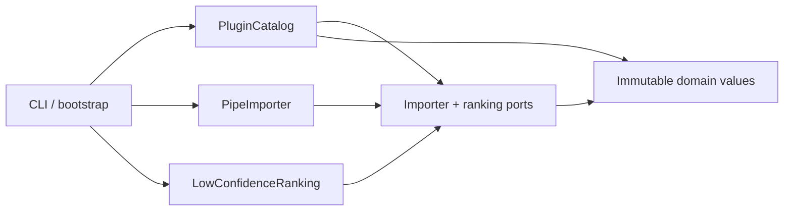

Now reverse `Ports --> Pipe` and explain the new change propagation, import
behavior, and testing cost.

**Minimal action**

Use the static witness assignments from Section 16, then run the same objects
through runtime contract tests. Explain why both forms of evidence are needed.

**Evidence**

- the application imports no concrete plugin;
- a test double satisfies only the client-required surface;
- wrong signatures are checked statically;
- semantic violations are caught by contract tests;
- `@runtime_checkable` is not presented as signature or law validation.

**TA checkpoint**

Ask: “If this plugin is removed, which stable modules must change?” More than the
composition root and deployment configuration usually signals a reversed edge.

### Session 4 output — client-owned port map

Produce one dependency map that labels each arrow with the knowledge it carries,
then write the smallest `EventImporter`-style port and its behavioral clauses.
Mark where assembly happens and name one semantic law a `Protocol` cannot prove;
use this map in Session 5 to separate discovery from acceptance.

**Bridge to Session 5:** A port makes extension possible; it does not decide how
extensions are discovered, trusted, versioned, or isolated.

## Session 5 — Plugin discovery, trust, and compatibility

**Driving case:** Atlas moves from two built-in plugins to third-party plugins
installed independently.

**Retrieve**

- public API promises from Session 2;
- static/runtime evidence boundary from Session 3;
- composition roots from Session 4.

**Derive from first principles**

1. Discovery answers “what claims to exist?”
2. Loading executes code and answers “can an object be obtained?”
3. Acceptance checks identity, API version, configuration, and contract evidence.
4. Selection resolves zero, one, or many candidates deterministically.
5. Invocation crosses a trust and failure boundary.
6. Evolution requires a policy for old and new capabilities.

**Threat-and-failure walk**

For an entry point, follow:

```text
distribution metadata → entry-point record → import/load → candidate object
→ version/name checks → registration → selection → invocation → output validation
```

At each arrow, list one possible failure and its owner. Include duplicate names,
unsupported API versions, import exceptions, ambiguous support, malformed output,
slow or hostile code, and partial side effects.

**Minimal action**

Design—but do not yet implement—a discovery adapter outside the application
core. Specify ordering, duplicate policy, allowlist/trust policy, failure
containment, observability, and process-isolation threshold.

**Evidence**

- importing an Atlas package does not scan or load plugins;
- discovery returns records before loading code where possible;
- API versions are validated before registration;
- the system never treats a Protocol check as a security boundary;
- compatibility strategy names adapters or parallel capability versions.

**TA checkpoint**

Ask: “Which line first executes third-party code?” A learner who points to
metadata enumeration needs to distinguish inspecting entry-point metadata from
loading the referenced object.

### Session 5 output — plugin boundary decision sheet

Produce a staged boundary sheet—discover, load, accept, select, invoke—with one
failure, owner, and required evidence at each stage. State the duplicate and
version policy plus the process-isolation threshold; Session 6 uses the sheet to
review an agent patch without treating discovery metadata as trust.

**Bridge to Session 6:** The final session integrates import behavior, type
evidence, graph direction, runtime validation, and compatibility into one
defensible milestone.

## Session 6 — Atlas checkpoint: read, review, defend

**Driving case:** A coding agent submits the Section 16 implementation and claims
the plugin architecture is complete.

**Retrieve**

Reconstruct from memory:

- the import lifecycle;
- the API-observation inventory;
- `Any`, `object`, narrowing, and variance;
- structural surface versus behavioral law;
- discovery, loading, acceptance, selection, and invocation;
- the intended dependency graph.

**Integrated review**

Use the five-pass route from Section 18:

1. public behavior and failure policy;
2. dependency direction and import-time work;
3. static type relationships;
4. runtime data and plugin-output validation;
5. tests, tool claims, compatibility, and trust boundaries.

The learner reviews one correct implementation, the concrete-fallback patch, and
the import-time-discovery patch. For each, they produce a decision with file/line
evidence, consequence, minimal repair, and regression test.

**Minimal action**

Delegate one bounded change: add an optional ranking explanation capability
without breaking existing `RankingPolicy` implementations. Require the agent to
propose a separate Protocol, adapter behavior, tests, and compatibility note
before writing code.

**Evidence**

- the full Module 12 evidence packet in Section 24;
- an oral trace from CLI import through plugin invocation;
- one falsified overclaim from the submitted documentation;
- one architecture decision record with alternatives;
- one transfer design for a new domain.

**TA checkpoint**

The learner is ready only if they can explain *why* the graph and contracts work,
predict a failure before running code, and bound what the evidence proves.
Passing tests alone is insufficient.

### Session 6 output — architecture review dossier

Produce a concise dossier containing the import trace, public-API observation
card, type-evidence boundary note, port map, plugin boundary sheet, and one
AI-patch verdict with file/line evidence, minimal repair, and regression test.
End with one unanswered question or uncertainty to carry forward to Module 13's
specification, testing, debugging, and observability work.

### Carry-forward boundary card — M12 → M13

Attach one compact card to that existing dossier; it is not a new project or
score. Name: (1) one public observation or behavioral law, (2) the dependency
arrow that protects it, (3) the smallest contract test that could challenge it,
and (4) one unresolved risk. Module 13 starts from this card rather than
reconstructing the component boundary from import names alone.

---

## Prediction before reveal — import-boundary experiment

Before running a checker, test, or import, draw the smallest prediction card:

| Prompt | Write before reveal |
|---|---|
| **Situation** | `ports.plugins` imports `plugins.defaults`, which reads `EventImporter` during initialization. |
| **Prediction** | Name the first missing attribute or the first safe cache hit. |
| **Reason** | State the cache, execution-order, or dependency-direction rule you used. |
| **Confidence** | Low, medium, or high—and what evidence would change it. |
| **Reveal and repair** | Run a fresh-process trace, then revise one sentence rather than hiding the mismatch. |

Do not start with the answer. A wrong prediction is useful evidence about the
current model; a correct prediction still needs a named boundary on what it
does and does not establish.

## Misconception repair map — repair the model, not the person

Use the smallest contradictory observation, then reconnect it to a usable rule.

| Tempting conclusion | Small counterexample or question | Repair rule | Next route |
|---|---|---|---|
| “Cached means fully initialized.” | Which attributes exist before the class statement runs? | The import cache can hold a module while its top-level code is still executing. | Session 1 trace; Section 13 |
| “A `Protocol` proves a plugin is safe.” | Where does malformed output first get rejected? | A structural surface is not behavioral, validation, trust, or isolation evidence. | Session 4 port map; Session 5 boundary sheet |
| “Green type checking validates production input.” | Which runtime instruction parses the external value? | Checker results are scoped static evidence; runtime validation has a separate owner. | Session 3 boundary note |
| “A local import fixed the architecture.” | Which module still knows the concrete default? | Delaying an import can relieve timing without repairing dependency direction. | Session 1 graph; Section 12 |
| “Discovery metadata can be trusted.” | Which line first runs third-party code? | Discovery, loading, acceptance, selection, and invocation are separate boundaries. | Session 5 decision sheet |

## Transfer task — versioned payment adapter boundary

Apply the same reasoning to a new domain. A billing service must accept both a
legacy card adapter and a new bank-transfer adapter without letting business
policy import either concrete class.

Produce a one-page design note that includes:

1. a narrow client-owned payment port and one behavioral law beyond its method signature;
2. an import/dependency graph that names the composition root and forbidden edges;
3. discovery, loading, acceptance, selection, invocation, and output-validation
   boundaries for an optional third-party adapter;
4. one compatibility route for the legacy adapter; and
5. one falsifiable prediction and the smallest regression test that could
   contradict it.

The transfer is complete when its choices can be traced to the M12 rules—not
when its names merely resemble the Atlas example.

## Supportive oral-defense route — explain, test, revise

This is a constructive Teaching Assistant conversation, not a pass/fail exam.
The learner may pause, ask for a restatement, choose a smaller example, or say
what remains uncertain. The Teaching Assistant asks for reasoning and evidence;
it does not treat fluent language, speed, or memory as proof.

### Invitation and starting evidence

Invite the learner to choose one artifact from the architecture review dossier:
the import trace, API observation card, type-evidence boundary note, port map,
or plugin boundary sheet. Ask: “What does this artifact claim, what observation
supports it, and what would it fail to prove?” Start with the learner's own
diagram, table, fenced code block, or simple ASCII arrow sketch if visual
rendering is uncertain.

### Hint ladder

Offer one hint at a time, stopping whenever the learner can continue:

1. **Locate:** name the first import, boundary, or arrow in question.
2. **Trace:** state cache state, executing code, or the value crossing the port.
3. **Separate layers:** label the claim static, runtime, behavioral, trust, or
   compatibility evidence.
4. **Test the model:** propose the smallest counterexample or regression test.
5. **Generalize:** state the rule in a different domain.

### Changed-premise counterexample turn

Change one premise: `plugins.defaults` now imports successfully, but an accepted
third-party importer returns a non-finite confidence score. Ask whether the
type surface, registry metadata, or a runtime domain constructor should reject
it first, and why. If the answer changes after the premise changes, revise the
dependency or validation rule rather than defending the earlier answer.

### Transfer turn

Ask the learner to apply the same port/validation/direction reasoning to the
payment-adapter task. Ask for one concrete boundary, one failure owner, and one
test that distinguishes a type claim from a runtime claim.

### Reflection and learner-controlled evidence summary

Close with: “What rule can you now explain, what evidence supports it, what
misconception was repaired, and what is your next small action?” The learner
chooses whether to keep a brief summary, what it says, or whether the
conversation stays off-record. A summary should record uncertainty as well as
the repaired rule; it is not a mastery or session-occurrence claim.

## Study Partner rehearsal and TA handoff

The Study Partner offers a non-grading rehearsal before the Teaching Assistant's
oral-defense conversation. Its role is to help make reasoning visible, not to
score, certify, or substitute for the TA's constructive defense.

### Study Partner rehearsal

Choose one claim from the dossier and rehearse this five-turn pattern: prediction,
trace, smallest counterexample, repaired explanation, and transfer. Keep the
whiteboard readable after the conversation: define notation, use language-labelled
code fences, and add a plain-language or ASCII fallback for a diagram or equation
when needed. End by identifying one question the learner wants the TA to probe.

### TA handoff

Offer the TA a concise, learner-approved handoff: selected artifact, prediction
and confidence, observed contradiction, repaired rule, remaining uncertainty,
and desired transfer question. The handoff is a prompt for the next conversation,
not evidence that a voice session, live rendering, note write, or oral defense
occurred.

## 21. Eight-level problem ladder

Move upward only when the evidence at the current level is reproducible. A learner
may use AI to generate code at every level, but the learner—not the agent—must
predict, inspect, and defend the result.

### Level 1 — Recognize the boundary

**Prompt:** Given a 70-line Atlas script, color statements as domain rule,
application policy, mechanism, or assembly.

**Deliverable:** A responsibility table and one sentence per proposed component.

**Success:** Every split is justified by a different reason to change; no
“one class per noun” decomposition.

### Level 2 — Trace import execution

**Prompt:** Predict the exact event sequence for a three-module cycle before
running it.

**Deliverable:** A table of `sys.modules` membership, executing statement, and
available attributes at each step.

**Success:** The predicted missing attribute and first failing line match a
fresh-process trace.

### Level 3 — Map the API and type surface

**Prompt:** Inventory the public observations and type relationships of
`EventImporter`, `RankingPolicy`, and `PluginCatalog`.

**Deliverable:** Supported imports, signatures, exceptions, ordering,
side-effect policy, generic positions, and runtime-validation owners.

**Success:** The map includes semantic, temporal, and operational behavior—not
only names and annotations.

### Level 4 — Make a constrained modification

**Prompt:** Add a JSON-lines importer without changing domain, ports, or
application policy.

**Deliverable:** One concrete plugin, composition-root registration, contract
tests, import smoke test, and changed-file rationale.

**Success:** Existing plugins remain unchanged; zero/multiple match policy remains
deterministic; malformed input reports source and record.

### Level 5 — Diagnose and repair a graph failure

**Prompt:** A generated patch imports `PipeImporter` from `PluginCatalog` and
uses a local import to hide a cycle.

**Deliverable:** Root-cause narrative, repaired graph, minimal patch, and
regression architecture check.

**Success:** The repair moves concrete selection outward and the test fails if
the forbidden edge returns.

### Level 6 — Design and delegate an extension

**Prompt:** Add optional ranking explanations while old ranking plugins continue
to work.

**Deliverable:** Behavioral clauses, separate capability Protocol or versioned
port, bounded agent task, acceptance tests, and migration policy.

**Success:** No required method is silently added to the existing public
Protocol; the agent receives enough context to avoid inventing policy.

### Level 7 — Review and verify an agent patch

**Prompt:** Review a plausible patch that has green tests and a green checker but
loads entry points at package import.

**Deliverable:** Evidence matrix, severity-ranked findings, rejected claims,
minimal fixes, and independent commands.

**Success:** The learner detects top-level third-party execution, distinguishes
discovery from loading, and narrows tool claims to actual scope.

### Level 8 — Transfer the architecture

**Prompt:** Apply the same reasoning to image decoders, payment providers, or
document exporters.

**Deliverable:** New domain model, port, plugin lifecycle, trust policy,
dependency graph, version strategy, and two adversarial scenarios.

**Success:** The design preserves the principles without copying Atlas names or
mistaking an in-process plugin for isolation.

---

## 22. Confidence-aware diagnostic quiz

For every item, choose an answer **before** opening the explanation and record:

- answer: A, B, C, or D;
- confidence: 0 = guess, 1 = weak, 2 = fairly sure, 3 = would teach it;
- one sentence of reasoning;
- evidence that would change your mind.

Scoring is diagnostic:

- correct at confidence 0–1: retrieve and explain again soon;
- correct at confidence 2–3: attempt the transfer prompt;
- incorrect at confidence 0–1: use the linked repair route;
- incorrect at confidence 2–3: treat it as a strong misconception and build the
  minimal counterexample before continuing.

### Question 1 — What the import cache does and does not mean

`a.py` begins executing, Python inserts its module object into `sys.modules`, and
then `a.py` imports `b.py`. While executing, `b.py` imports `a.py` and immediately
reads `a.ready`, but `a.py` has not assigned `ready` yet. Which explanation is
best?

A. Python executes `a.py` a second time because the first import is incomplete.  
B. `b.py` receives the cached module object for `a`, but its namespace is only
partially initialized, so `ready` is not yet available.  
C. Python blocks until `a.py` completes and then resumes `b.py`.  
D. `sys.modules` contains only modules whose top-level code completed
successfully.

<details>
<summary>Answer and misconception analysis</summary>

**Answer: B.**

The cache avoids starting a second independent execution of `a`, but cache
membership does not imply completed initialization. The early module object makes
recursive imports representable and also makes partial namespaces observable.

- A confuses reuse with re-execution.
- C invents a wait that would deadlock this same-thread import sequence.
- D reverses the documented insertion order.

**Misconception signal:** “Imported” is being treated as one atomic state.

**Repair route:** Re-run Session 1’s trace table and Section 13. Ask at each line:
object exists, top-level execution complete, and attribute bound—three separate
facts.

**Transfer:** Predict what changes if `ready = False` is assigned before importing
`b`, and explain why that may mask rather than repair the dependency problem.

</details>

### Question 2 — Repairing a circular dependency

`ports.py` defines `EventImporter` but imports `default_plugins.py` to construct a
default list. `default_plugins.py` imports `EventImporter` from `ports.py`. Which
repair best addresses the architectural cause?

A. Put the `default_plugins` import inside a function in `ports.py`.  
B. Catch the import exception and retry after startup.  
C. Keep ports independent of concrete plugins and assemble the default list in a
composition root that imports both.  
D. Move both modules into the same package and export them through `__all__`.

<details>
<summary>Answer and misconception analysis</summary>

**Answer: C.**

The stable port should not know a concrete default. An outer assembly component
may know both and inject the chosen implementations.

- A can change timing but preserves the reversed knowledge edge.
- B adds nondeterminism and hides the root cause.
- D changes namespace presentation, not dependency direction.

**Misconception signal:** The learner treats a circular import only as a statement
ordering bug.

**Repair route:** Revisit Sections 12–13 and redraw the arrows as “knows about,”
not “calls.”

**Transfer:** Explain when a local import is legitimate: optional or expensive
behavior with an otherwise sound graph, accompanied by an explicit reason and
test.

</details>

### Question 3 — What `__all__` protects

A package defines `__all__ = ["PluginCatalog"]`, while
`atlas._internal_registry` remains importable by its full path. What is the most
accurate claim?

A. `__all__` prevents clients from importing `_internal_registry`.  
B. The underscore and `__all__` communicate a supported surface and influence
star imports, but they do not create an access-control boundary.  
C. Any name absent from `__all__` may be deleted without compatibility risk.  
D. A leading underscore encrypts or sandboxes internal state.

<details>
<summary>Answer and misconception analysis</summary>

**Answer: B.**

Python’s naming and export conventions help tools and humans identify intended
public surfaces. A determined client can still import an internal path.

- A and D mistake convention for enforcement.
- C ignores real clients that may have coupled themselves to internals; the
  support policy is clearer, but migration impact should still be investigated.

**Misconception signal:** Information hiding is being equated with runtime
secrecy.

**Repair route:** Revisit Sections 6–7 and make separate columns for discoverable,
importable, supported, and secure.

**Transfer:** Design a stable facade that permits an internal file move while
preserving one documented import path.

</details>

### Question 4 — What `cast` establishes

External plugin loading returns an object of unknown provenance. A patch writes:

```python
def invoke_loaded_plugin(loaded_object, source):
    plugin = cast(EventImporter, loaded_object)
    return tuple(plugin.read(source))
```

What does the `cast` do at runtime?

A. It checks every `EventImporter` method and signature.  
B. It wraps the object with runtime validation.  
C. It communicates an assertion to static tooling and returns the same object
unchanged at runtime.  
D. It proves the plugin obeys ordering, exception, and side-effect laws.

<details>
<summary>Answer and misconception analysis</summary>

**Answer: C.**

`typing.cast` is a static assertion, not a converter, wrapper, or validator.
Runtime acceptance still needs explicit checks, and semantic laws need
contract tests or stronger containment.

- A and B invent runtime behavior.
- D asks a method surface to prove behavioral properties it cannot encode.

**Misconception signal:** Static evidence is being used as a runtime trust
boundary.

**Repair route:** Revisit Sections 8, 11, and 14. Label each claim static,
runtime-structural, behavioral, or security-related.

**Transfer:** Specify the checks that belong before registration and the checks
that belong after invocation.

</details>

### Question 5 — Why mutable containers are invariant

Suppose `Cat` is a subtype of `Animal`, and `Dog` is another subtype. Why should a
type checker normally reject assigning `list[Cat]` to a variable of type
`list[Animal]`?

A. Python lists cannot contain subclasses.  
B. The `list[Animal]` reference could append a `Dog`, violating the original
`list[Cat]` expectation.  
C. Reading a `Cat` as an `Animal` is unsafe.  
D. Generic types never support subtyping.

<details>
<summary>Answer and misconception analysis</summary>

**Answer: B.**

The read is safe; the write is the problem. A mutable list both produces and
consumes its element type, so covariance would permit an unsound mutation.

- A is false at runtime.
- C reverses substitutability.
- D ignores covariant read-only producers and contravariant consumers.

**Misconception signal:** Variance is being memorized as syntax rather than
derived from allowed operations.

**Repair route:** Revisit Section 10 and Session 3. Write the one operation that
would break each proposed assignment.

**Transfer:** Explain why `Sequence[Cat]` can safely be viewed as
`Sequence[Animal]` when only read operations are exposed.

</details>

### Question 6 — What a Protocol proves

An object passes an `isinstance(obj, RuntimeImporterProtocol)` check where the
Protocol is decorated with `@runtime_checkable`. Which conclusion is justified?

A. The object’s member names are present according to the runtime protocol check;
this alone does not validate signatures, types, semantic laws, or safety.  
B. The object passed the configured static checker.  
C. The object will always return valid `StudyEvent` values.  
D. The object is safe to execute in the current process.

<details>
<summary>Answer and misconception analysis</summary>

**Answer: A.**

Runtime-checkable Protocols perform a limited structural presence check. Static
signature analysis is a separate tool result; output validity and behavioral laws
require runtime evidence; process safety requires a trust/isolation policy.

- B confuses runtime inspection with static analysis.
- C elevates shape to semantics.
- D elevates semantics to security.

**Misconception signal:** “Conforms to interface” is being treated as universal
proof.

**Repair route:** Revisit Sections 11 and 14. Build an evidence ladder from member
presence to isolation and state what each rung cannot show.

**Transfer:** Construct an object that passes the member-presence check but has an
incompatible or malicious `read` implementation.

</details>

### Question 7 — Dependency inversion in the Atlas checkpoint

Which import graph best embodies dependency inversion for the Atlas application?

A. `PluginCatalog → PipeImporter → EventImporter`.  
B. `EventImporter → PipeImporter`, while `PluginCatalog → EventImporter`.  
C. `PluginCatalog → EventImporter ← PipeImporter`, with bootstrap importing and
assembling `PluginCatalog` and `PipeImporter`.  
D. Every module imports every other module through a shared package facade.

<details>
<summary>Answer and misconception analysis</summary>

**Answer: C.**

Application policy and concrete mechanism both depend on the stable port; an
outer composition root chooses and connects them.

- A leaves policy coupled to a concrete class.
- B makes the abstraction depend on its implementation.
- D hides edges behind a facade rather than controlling their direction.

**Misconception signal:** Dependency direction is being confused with runtime call
direction.

**Repair route:** Revisit Section 12 and Session 4. Label arrows “imports/knows
about,” then separately draw runtime calls.

**Transfer:** Add a second importer to the graph and name exactly which file must
change in a statically configured deployment.

</details>

### Question 8 — Evolving a public plugin Protocol

Atlas v1 ranking plugins implement only `score(candidate, context)`. The team
wants optional human-readable explanations. Which design best preserves existing
implementers?

A. Add a required `explain(...)` method to the existing public Protocol and call
it unconditionally.  
B. Define a separate optional capability Protocol or a new versioned port, detect
or adapt it explicitly, and document fallback behavior.  
C. Use `getattr` everywhere and omit the behavior from the public contract.  
D. Declare the change non-breaking because Python is dynamically typed.

<details>
<summary>Answer and misconception analysis</summary>

**Answer: B.**

Adding a required member expands the obligations of every existing structural
implementer. A separate capability or versioned contract makes the new behavior
explicit and permits a deliberate fallback or migration.

- A breaks old implementations when the method is used.
- C hides policy in scattered reflection and leaves clients guessing.
- D confuses absence of runtime enforcement with compatibility.

**Misconception signal:** Structural typing is being treated as permission to
change a public shape silently.

**Repair route:** Revisit Section 15 and Level 6. Inventory existing implementers,
callers, static checks, and runtime fallback before changing the port.

**Transfer:** State when an adapter is preferable to parallel long-lived
versions, and identify who owns it.

</details>

---

## 23. TA playbook: diagnose before explaining

The TA’s job is not to reveal the answer faster. It is to locate the learner’s
current model, expose the smallest contradiction, and help them rebuild the
model. Use this sequence:


### 23.1 Misconception map

| Learner statement | Likely hidden model | Fast diagnostic | Minimal counterexample | Route |
|---|---|---|---|---|
| “The module is cached, so it must be ready.” | Import is atomic. | Ask which attributes exist mid-cycle. | Two files where the second reads a later binding. | Session 1; Section 13 |
| “I fixed the cycle with a local import.” | Timing and architecture are the same. | Draw knowledge edges after the change. | Port still imports concrete default inside a function. | Sessions 1 and 4 |
| “The underscore makes it private.” | Convention is access control. | Import the full internal path. | `_secret = 1; from mod import _secret`. | Session 2 |
| “The checker validates input.” | Static analysis executes validation. | Pass malformed runtime data. | `cast(int, "x") + 1`. | Session 3 |
| “`list[Cat]` is a `list[Animal]`.” | Only reads are considered. | Ask who may append. | Append `Dog` through the wider alias. | Session 3 |
| “It matches the Protocol, so it is correct.” | Shape implies behavior. | Ask what checks score finiteness. | Plugin returns `nan` or duplicates. | Sessions 4–5 |
| “Entry points make plugins safe.” | Discovery implies acceptance/isolation. | Locate the first third-party execution. | Entry point loads a module that raises or mutates state. | Session 5 |
| “Green tests prove compatibility.” | Sample evidence is universal proof. | Name untested clients and observations. | Old import path absent from tests. | Sessions 2 and 6 |

### 23.2 Hint ladder

Give one hint at a time. Stop when the learner can make the next inference.

1. **Locate:** “Which exact line first contradicts your prediction?”
2. **Name state:** “Which objects and bindings exist at that instant?”
3. **Name edge:** “Which stable component knows which concrete detail?”
4. **Name contract:** “What observation was promised to the client?”
5. **Separate evidence:** “Is this claim static, runtime, behavioral, or
   security-related?”
6. **Construct:** “What is the smallest input or plugin that falsifies the
   claim?”
7. **Repair:** “What is the smallest boundary change that removes the cause?”
8. **Transfer:** “Would the same reasoning hold for a payment provider? Why?”

Do not advance from a hint to a lecture merely because silence is uncomfortable.
Ask the learner to sketch, trace, or point to evidence.

### 23.3 Required regression evidence by failure

| Failure | Required regression |
|---|---|
| Circular/partial import | Fresh-process import test plus forbidden-edge check |
| Accidental public-path break | Old-path and facade import tests plus compatibility note |
| Unsound narrowing | Negative/static fixture and runtime alternate-branch test |
| Plugin surface mismatch | Named checker fixture plus runtime acceptance failure |
| Duplicate/ambiguous plugin | Order-independent rejection test |
| Invalid plugin output | Duplicate-ID, non-finite-score, and invalid-domain-value tests |
| Import-time plugin loading | Subprocess import with a sentinel plugin that would reveal loading |
| Protocol evolution break | Old v1 implementation fixture plus adapter/fallback test |

### 23.4 TA session protocol

For a 30-minute TA session:

1. **Three minutes:** learner states the failing observation and prediction.
2. **Five minutes:** learner draws state or dependency edges.
3. **Seven minutes:** run one minimal counterexample.
4. **Seven minutes:** learner proposes two repairs and compares propagation.
5. **Five minutes:** add the smallest regression test.
6. **Three minutes:** learner gives a bounded conclusion and schedules retrieval.

Escalate to prerequisite repair when the learner cannot explain:

- aliasing and mutation → Module 1;
- lazy iteration and materialization → Module 2;
- abstraction and substitutability → Module 3;
- exception boundaries and cleanup → Module 4;
- test oracles and properties → Module 8;
- measurement and evidence scope → Module 9.

---

## 24. Atlas milestone and evidence packet

### 24.1 Milestone

**Build and defend an extensible Atlas ingestion-and-ranking boundary.**

The submitted system must:

- preserve the dependency graph in Section 16;
- support at least two importer implementations with deterministic selection;
- support at least two ranking policies by stable name;
- validate domain inputs and plugin outputs at runtime;
- reject unsupported API versions and duplicate plugin names;
- preserve source order and deterministic ranking ties;
- have no plugin discovery or loading at ordinary package import;
- document public paths, exceptions, ordering, side effects, and compatibility;
- include static-tool evidence and runtime/architecture evidence with bounded
  claims;
- include one reviewed AI-generated patch and the learner’s independent verdict.

The second importer and ranking policy may be generated by an agent. The learner
must own the contract, inspect every changed edge, run independent checks, and
explain the result.

### 24.2 Evidence packet

Submit one coherent packet:

1. **System map:** domain, ports, application, plugins, bootstrap, and import
   arrows.
2. **Contract sheet:** preconditions, outputs, exceptions, ordering, mutation,
   side effects, version, and trust assumptions.
3. **Prediction log:** at least three predictions made before execution.
4. **Runtime evidence:** exact command, environment, complete result, and adverse
   cases.
5. **Static evidence:** checker name/version/configuration/analyzed paths and full
   result.
6. **Architecture evidence:** fresh-process imports and forbidden dependency
   checks.
7. **Compatibility note:** public paths, known clients, old implementation
   fixtures, and migration policy.
8. **Agent review:** prompt, changed-file list, two accepted choices, at least one
   challenged claim, and final human decision.
9. **Limits:** what the packet does not establish, including third-party safety
   or universal correctness.
10. **Transfer sketch:** a different domain using the same principles.

### 24.3 Rubric

| Dimension | Weight | Production evidence |
|---|---:|---|
| First-principles model | 15 | Explains import state, API observations, type relations, and graph direction without slogans |
| Dependency architecture | 20 | Inward stable dependencies, explicit composition root, no incidental loading |
| Contract quality | 15 | Surface plus behavioral laws, failure/ordering/mutation/side-effect policy |
| Static type reasoning | 10 | Sound narrowing and variance explanations; bounded checker claims |
| Runtime correctness | 15 | Domain/output validation and adversarial contract tests |
| Debugging and review | 10 | Reproduces root causes, reviews generated patches with evidence |
| Compatibility and trust | 10 | Version/evolution strategy and honest in-process trust boundary |
| Communication and transfer | 5 | Clear defense and valid application to a new domain |

**Readiness threshold:** at least 80/100 overall, and at least half credit in every
dimension. A high total cannot compensate for a reversed dependency graph,
unvalidated external output, or an unsafe claim that in-process plugins are
sandboxed.

### 24.4 Oral defense

Without running code, the learner should answer:

1. What happens from `import atlas.bootstrap` until the catalog is ready?
2. Which module can name `PipeImporter`, and why?
3. What does the port Protocol establish? What does it not establish?
4. Why can `Sequence[StudyEvent]` vary differently from `list[StudyEvent]`?
5. How are zero and multiple importer matches handled?
6. Where are plugin API version and output validity checked?
7. What changes when plugin discovery uses entry points?
8. How would an optional new capability avoid breaking v1 implementers?
9. Which result in your packet could be wrong despite green tests?
10. What would require out-of-process isolation?

The instructor may perturb one assumption—for example, two importers claim the
same source, a ranker returns `nan`, or an old import path disappears. The learner
must trace the consequence and propose evidence, not guess a patch.

### 24.5 Instructor decision rule

- **Ready:** predicts behavior, explains causes, independently reviews code, and
  states evidence limits.
- **Ready with repair:** implementation works but one conceptual dependency needs
  targeted retrieval and re-defense.
- **Not yet:** relies on tool authority, cannot trace initialization, treats
  annotations as validation, or cannot distinguish port from implementation.

---

## 25. Consolidated knowledge map

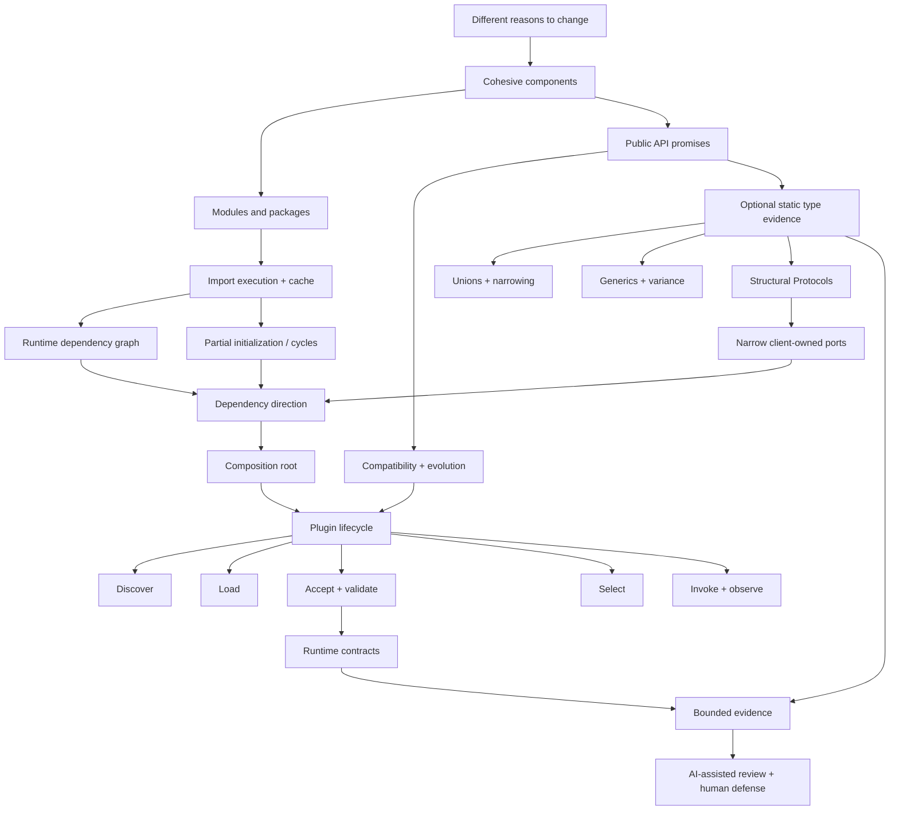

### 25.1 The connected explanation

A system gains components because responsibilities change for different reasons.
In Python, modules and packages give those components executable namespaces.
Importing them builds a runtime graph whose order and side effects matter. Once
clients rely on paths or behavior, those observations form an API promise.
Annotations add inspectable static relationships to that promise, while runtime
validation remains necessary at open boundaries. Structural Protocols let stable
application policy depend on a narrow capability rather than a concrete
mechanism. Dependency inversion keeps those arrows pointing toward the stable
port, and a composition root selects concrete implementations. Plugins extend the
same idea across an independently evolving trust boundary, so discovery, loading,
acceptance, selection, invocation, versioning, and evidence must be explicit.

### 25.2 Before / now

| Earlier model | Production model now |
|---|---|
| A module is a file of reusable code. | A module is a cached namespace created and executed within a dependency graph. |
| An API is a function signature. | An API is a supported set of client observations and evolution promises. |
| Type hints prevent bad runtime values. | Annotations provide optional static evidence; runtime owners validate actual values. |
| An interface lists methods. | A port exposes the minimum client need plus separately tested behavioral laws. |
| Circular imports are solved by moving imports. | Diagnose partial initialization and repair reversed knowledge where present. |
| Plugins are classes found dynamically. | Plugins cross discovery, loading, acceptance, selection, invocation, trust, and version boundaries. |
| Green tools prove correctness. | Named tool results support bounded claims under explicit scope and assumptions. |
| AI writes the architecture. | AI proposes patches; the learner owns contracts, graph direction, review, and evidence. |

### 25.3 Keep statements

Write these from memory one day and one week later:

1. Import cache membership does not imply completed module initialization.
2. Top-level module code is startup behavior and should be reviewed as such.
3. `__all__` and underscores communicate support policy, not security.
4. Public APIs include behavior, exceptions, order, timing, mutation, and side
   effects.
5. An annotation or `cast` is not runtime validation.
6. Variance follows from whether a value is produced, consumed, or both.
7. A Protocol describes a structural surface; laws require additional evidence.
8. Runtime-checkable Protocols are not signature, semantics, or safety checks.
9. Dependency arrows describe knowledge; runtime calls may travel differently.
10. Composition roots own concrete selection.
11. Discovery, loading, acceptance, selection, and invocation are distinct.
12. A public Protocol change can break structural implementers.
13. In-process plugins share process authority unless stronger isolation exists.
14. Every verification claim must name its scope and limits.

### 25.4 Spaced retrieval schedule

| When | Closed-note task | Evidence |
|---|---|---|
| End of session | Draw the graph and explain one failure | 90-second voice or text explanation |
| Next day | Answer two high-confidence quiz items and one transfer | Confidence calibration |
| Three days | Reconstruct import trace and variance counterexample | Prediction before execution |
| One week | Review a seeded bad patch | Finding, consequence, repair, test |
| Two weeks | Design optional capability evolution | Compatibility note and adapter sketch |
| Four weeks | Transfer to a new plugin domain | Full lifecycle and trust graph |

### 25.5 Architecture decision record

Use this small template for every consequential choice:

```text
Decision:
Change pressure:
Stable policy:
Volatile mechanism:
Public observations affected:
Dependency edges added/removed:
Static evidence:
Runtime evidence:
Compatibility strategy:
Trust/isolation assumptions:
Alternatives rejected and why:
Evidence limits:
```

---

## 26. Backward and forward connections

### Backward

- **Module 1 — values, state, and execution:** names bind to objects; mutation,
  aliasing, and execution order explain module namespaces and immutable domain
  values.
- **Module 2 — functions, recursion, and induction:** call contracts and
  compositional reasoning scale from functions to components; recursive import
  traces require a well-founded execution explanation.
- **Module 3 — abstraction, interfaces, and ADTs:** representation independence,
  invariants, and substitutability become public APIs and plugin laws.
- **Module 4 — logic, relations, graphs, and proof:** quantified behavioral
  clauses distinguish “all conforming providers” from a few observed examples;
  dependency direction is a graph relation with a precise edge meaning.
- **Module 5 — cost models and algorithm analysis:** import work, discovery,
  plugin selection, validation, and indirection receive explicit time/space and
  systems-cost assumptions.
- **Module 6 — representation, memory, and sequences:** package/module layout is
  a representation choice; retained module objects and registries have memory
  and locality consequences.
- **Module 7 — stacks, queues, iteration, and lazy flow:** importer streaming,
  materialization, exhaustion, and partial yields expose temporal behavior. The
  catalog’s tuple result is a distinct batch boundary, not a change to the raw
  provider’s iterator contract.
- **Module 8 — hashing, dictionaries, sets, and indexing:** registries rely on
  key equality, uniqueness, and dictionary assumptions; plugin identity must be
  a chosen equivalence relation.
- **Module 9 — trees, heaps, sorting, and ordered search:** ranking needs an
  explicit total/tie order rather than accidental discovery or dictionary
  order.
- **Module 10 — graph algorithms and network models:** import and source
  dependencies form directed graphs; cycles, reachability, and stable boundary
  placement are graph questions.
- **Module 11 — algorithm-design paradigms:** alternative ranking/planning
  strategies motivate stable ports while feasibility, objective, approximation,
  and evidence claims remain application policy.

### Forward

- **Module 13 — specifications, testing, debugging, and observability:** public
  shapes gain declarative behavior, shared provider contracts, causal failure
  evidence, and privacy-safe run signals.
- **Module 14 — software design and change:** these exact v1 ports enter
  responsibility maps, explicit state machines, staged compatible refactors,
  Git evidence graphs, and contextual patch review.
- **Module 15 — files, serialization, packaging, and delivery:** API and version
  discipline cross text/byte, schema, distribution, installation, provenance,
  and rollback boundaries.
- **Module 16 — relational data and transactions:** the application operation
  gains repository constraints, all-or-nothing visibility, isolation schedules,
  retry identity, and named recovery assumptions.
- **Modules 17–21:** machine, operating-system, concurrency, network, and
  distributed fault models widen the same lifetime, isolation, cancellation,
  and uncertainty boundaries.
- **Module 22:** security and privacy revisit in-process plugin authority,
  deserialization, dependency trust, logging fields, permissions, and isolation.
- **Modules 23–26:** language/runtime internals, intelligent behavior, and the
  capstone must preserve the same design/delegate/review/verify discipline.

---

## 27. Source ledger and reading route

These are primary sources. The chapter synthesizes them; it does not treat any
single document as the complete course design.

### 27.1 Python language and standard library

- [The Python import system](https://docs.python.org/3.14/reference/import.html) —
  module search, `sys.modules`, loading, early cache insertion, execution, and
  failure cleanup. Read with Sections 5 and 13.
- [Python tutorial: modules](https://docs.python.org/3.14/tutorial/modules.html) —
  module namespaces, import forms, packages, `__all__`, and `__main__`. Read with
  Sections 5–7.
- [The `typing` module](https://docs.python.org/3.14/library/typing.html) —
  runtime status of annotations, Protocol tools, `runtime_checkable`, `cast`,
  `assert_never`, and related constructs. Read with Sections 8–11.
- [`importlib.metadata` entry points](https://docs.python.org/3.14/library/importlib.metadata.html#entry-points) —
  inspecting and loading installed distribution entry points. Read after
  Section 14.

### 27.2 Typing specifications

- [Typing specification](https://typing.python.org/en/latest/spec/) — normative
  hub for static typing behavior.
- [Protocol specification](https://typing.python.org/en/latest/spec/protocol.html) —
  structural subtyping and protocol members.
- [Generics and variance specification](https://typing.python.org/en/latest/spec/generics.html) —
  type variables, covariance, contravariance, and invariance.
- [Type narrowing specification](https://typing.python.org/en/latest/spec/narrowing.html) —
  narrowing rules and user-defined guards.
- [PEP 544 — Protocols](https://peps.python.org/pep-0544/) and
  [PEP 484 — Type Hints](https://peps.python.org/pep-0484/) — historical design
  rationale. Prefer the current typing specification when they differ.

### 27.3 Packaging and API policy

- [PyPA: creating and discovering plugins](https://packaging.python.org/en/latest/guides/creating-and-discovering-plugins/) —
  naming conventions, namespace packages, and package metadata approaches.
- [Entry points specification](https://packaging.python.org/en/latest/specifications/entry-points/) —
  data model for groups, names, and object references.
- [PEP 420 — implicit namespace packages](https://peps.python.org/pep-0420/) —
  namespace-package semantics and motivation.
- [PEP 8 — public and internal interfaces](https://peps.python.org/pep-0008/) —
  naming and compatibility conventions.
- [PEP 387 — backwards compatibility](https://peps.python.org/pep-0387/) —
  Python’s compatibility policy as a concrete evolution case.

### 27.4 University-level software construction

- [MIT 6.102: Abstract Data Types](https://web.mit.edu/6.102/www/sp26/classes/06-abstract-data-types/) —
  abstraction, representation independence, invariants, and client reasoning.
- [MIT 6.102: Specifications](https://web.mit.edu/6.102/www/sp26/classes/04-specifications/) —
  behavioral contracts and under/over-specification.
- [MIT 6.102: Code review](https://web.mit.edu/6.102/www/sp26/general/code-review.html) —
  systematic human review practices.

### 27.5 Efficient reading route

1. Read the import reference’s cache/loading/execution sections and reproduce the
   circular trace.
2. Read the tutorial’s package and `__all__` sections; build the API inventory.
3. Read typing’s Protocol, generic/variance, and narrowing specifications while
   working the prediction lab.
4. Read MIT’s ADT/specification material and write behavioral clauses that types
   do not capture.
5. Read entry-point documentation and PyPA’s discovery guide; draw the complete
   plugin lifecycle and trust boundary.
6. Read compatibility policy only after identifying real client observations.

When citing a result, label it:

- **language/runtime guarantee** from language or library documentation;
- **typing rule** from the typing specification;
- **packaging mechanism** from PyPA/specification documents;
- **design policy** chosen by Atlas;
- **tool result** from a named execution;
- **inference** derived from those sources.

---

## 28. Final self-explanation

Close the module without notes. Complete this explanation in your own words:

> Atlas became extensible when we separated __________ from __________ because
> they change for different reasons. Importing a module first __________ and then
> __________, which is why a cycle can expose __________. A public API promises
> more than __________; it also includes __________. Type annotations provide
> __________ evidence, while runtime data still requires __________. A generic’s
> variance follows from whether it __________ or __________ values. A Protocol
> establishes __________ but cannot by itself establish __________. Dependency
> inversion means __________ and __________ both point toward __________, while
> the composition root owns __________. A plugin system must separate discovery,
> __________, __________, __________, and invocation because each has different
> failure and trust consequences. When an AI agent submits a patch, I accept it
> only after I can predict __________, trace __________, verify __________, and
> state what the evidence does not prove.

Then answer three transfer questions:

1. Which single dependency edge in your design is most dangerous to reverse, and
   what change pressure would expose the mistake?
2. Which statement in your evidence packet is easiest to overclaim, and how will
   you bound it?
3. If plugins become untrusted, which boundary must become a process or service
   boundary, and which contracts must survive that move?

If any blank can be filled only with a memorized slogan, return to its minimal
counterexample and rebuild the causal explanation.
