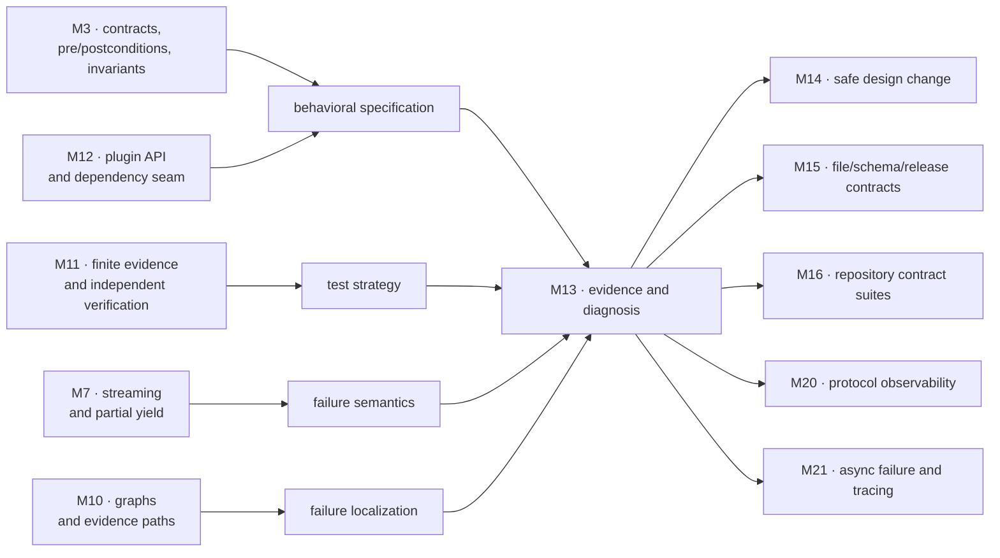
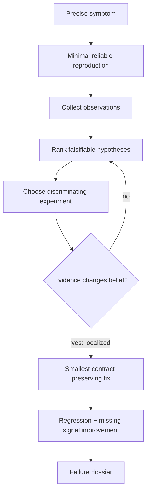
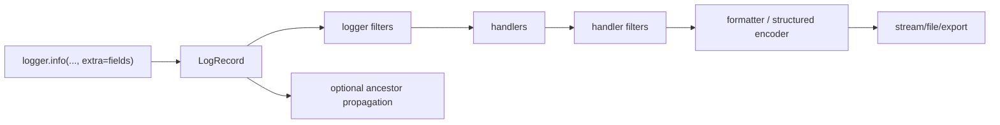
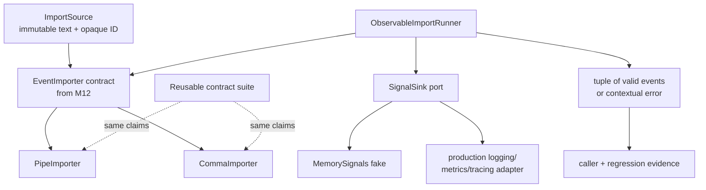
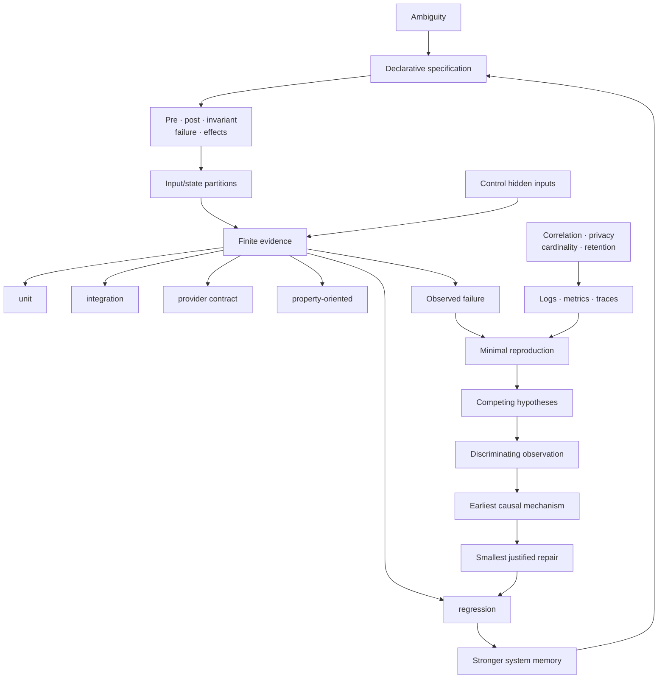

# Module 13 — Specifications, Testing, Debugging, and Observability

> **Central idea:** ambiguity becomes a specification; a specification creates testable claims; finite evidence localizes failures; observability preserves the missing context; each confirmed defect becomes regression knowledge.

This is one connected evidence system, not a survey of testing tools.

```text
ambiguous need
→ behavioral specification
→ deliberately selected finite evidence
→ reproducible symptom
→ falsifiable hypothesis
→ localized cause
→ smallest justified repair
→ regression claim
→ better future observations
```

Module 12 created an `EventImporter` plugin boundary. Module 13 gives that boundary precise meaning and creates a contract suite that every importer provider must pass. Atlas’s ambiguous importer becomes specified, diagnosable, and observable without coupling tests to one implementation.

Most work is specification reading, test-design reasoning, architecture recovery, investigation, agent direction, patch review, and evidence defense. Manual code construction is limited to a small independent verifier and instrumentation seam because those mechanisms make the reasoning visible.

---

## How to use this workbook

For each behavior or failure:

1. state the claim before choosing a tool;
2. identify caller obligations and provider obligations;
3. partition the relevant input/state space;
4. choose the smallest evidence that could falsify the claim;
5. distinguish symptom, observation, hypothesis, and cause;
6. preserve a failing example before changing code;
7. repair the violated contract at the responsible boundary;
8. add regression evidence and the observation that would shorten recurrence;
9. record what remains unproved.

Do not measure success by number of tests, coverage percentage, log volume, or debugger commands. Measure it by justified claims and reduced uncertainty.

### Claim-layer legend

| Label | Meaning | Example |
|---|---|---|
| **[SPECIFICATION]** | A caller/provider behavioral agreement chosen for Atlas | Blank importer records are ignored; malformed nonblank records raise a contextual error. |
| **[PYTHON 3.14 GUARANTEE]** | Behavior documented by Python 3.14 | `unittest` runs setup, test, teardown, and registered cleanups under its documented lifecycle. |
| **[TOOL CONTRACT]** | Behavior of a pinned external tool | A pinned Hypothesis release generates and shrinks examples according to its documented API. |
| **[COURSE MODEL]** | A smaller executable model used to expose a mechanism | `MemorySignals` records one low-cardinality outcome signal per import attempt. |
| **[EMPIRICAL EVIDENCE]** | An observation from a named run/configuration | The contract suite passed both delimited importers under Python 3.12.13. |
| **[INFERENCE]** | A conclusion supported, but not logically guaranteed, by observations | Because the failure disappears when the clock is injected, hidden wall-clock dependence is the leading cause. |
| **[OPEN DECISION]** | A policy or unknown that still needs resolution | Whether duplicate IDs should reject the stream or be reported as recoverable row errors. |

“All tests passed” is scoped empirical evidence. It is never a universal correctness label.

---

## 1. Position in the knowledge graph



### The problem that forces this module

The Module 12 importer surface says:

```python
class EventImporter(Protocol):
    def supports(self, source: ImportSource) -> bool: ...
    def read(self, source: ImportSource) -> Iterator[StudyEvent]: ...
```

Signatures do not settle:

- whether blank rows are ignored or rejected;
- whether order is preserved;
- whether duplicate event IDs are legal;
- whether a malformed later record invalidates earlier yields;
- which exception type and context cross the boundary;
- whether `supports` may read files or mutate state;
- what production evidence identifies the importer, source, record, and attempt;
- whether sensitive source content may appear in telemetry.

Two implementations can satisfy the static Protocol and pass one happy-path test while disagreeing on every item above.

### Atlas checkpoint

Turn the ambiguous importer into:

1. a declarative behavioral specification;
2. explicit preconditions, postconditions, invariants, error, order, and partial-yield policies;
3. a reusable provider contract suite;
4. unit, integration, property-oriented, and regression evidence with named claims;
5. a minimal-reproduction investigation workflow;
6. structured outcome signals correlated by attempt without raw study content;
7. an independent runner/telemetry boundary;
8. an agent-reviewed patch with an evidence dossier.

### Backward connections

| Earlier module | Retrieved model | Module 13 use |
|---|---|---|
| Module 1 | state, aliasing, exceptions, execution frames | distinguish observed symptom from earlier corrupted state |
| Module 3 | pre/postconditions, invariants, representation independence | specify provider behavior independently of parser representation |
| Module 7 | one-shot streams, lazy error timing, partial yields | specify exactly when malformed records fail and what has already escaped |
| Module 8 | equivalence, duplicates, stable identity | define duplicate event-ID policy and generated properties |
| Module 10 | parent/evidence paths and boundary invariants | reconstruct causal paths rather than blame the last frame |
| Module 11 | verifier, oracle, finite evidence, uncertainty | treat tests as selected evidence and use independent behavioral models |
| Module 12 | `EventImporter` Protocol and dependency inversion | run one contract suite against multiple plugins |

### Capabilities unlocked

After mastery, Michael can:

- strengthen an ambiguous API into a precise, declarative contract;
- compare stronger/weaker specifications by pre- and postconditions;
- derive input partitions and boundary cases rather than collect anecdotes;
- choose unit, integration, contract, property-oriented, and regression evidence by claim;
- design fixtures and doubles without replacing the behavior being investigated;
- patch a name where the system under test looks it up;
- read coverage as execution evidence, not correctness;
- convert a traceback into a minimal reproduction and falsifiable hypotheses;
- use debugger observations to discriminate hypotheses rather than wander;
- design structured logs, metrics, and traces with correlation and privacy boundaries;
- recognize flaky evidence as a broken good/bad predicate;
- direct an agent through a bounded repair and reject unsupported summaries.

---

## 2. Prerequisite retrieval

Answer without running code. State which earlier model supports each answer.

### Retrieval A — contract versus type surface

If a class has compatible `supports` and `read` signatures, what has a static Protocol established? What has it not established?

### Retrieval B — precondition and postcondition

For `sqrt(x)`, classify:

```text
x ≥ 0
result ≥ 0 and result² is approximately x
```

Which party owes each clause?

### Retrieval C — streaming failure

A generator yields two events, then raises on line three. Can a caller act as if nothing was yielded? What extra architecture would be needed for all-or-nothing behavior?

### Retrieval D — invariant

Why is “all emitted event IDs are unique within one import attempt” an invariant over a history rather than a check on one isolated row?

### Retrieval E — independent evidence

Why is a planner testing itself with its own objective calculation weaker than a separate verifier? Apply the same reasoning to importer error context.

### Retrieval F — architecture seam

Why is injecting a clock or telemetry sink usually easier to reason about than patching a process-wide global?

### Retrieval G — graph path

The last traceback frame is where an invalid value was indexed. Why might the cause lie earlier in the data-flow graph?

### Retrieval H — finite tests

If five examples pass, what universal statement has been proved?

<details>
<summary>Retrieval answers and routing</summary>

- **A:** structural type compatibility supports a static relationship under a named checker/configuration. It does not prove order, effects, determinism, exceptions, performance, or valid outputs. Return to Module 12 if typing is being treated as runtime trust.
- **B:** `x ≥ 0` is a caller precondition; the result clause is the implementation’s postcondition when the precondition holds. Return to Module 3 if obligation direction is unclear.
- **C:** earlier values have already crossed the generator boundary. All-or-nothing semantics need buffering plus validation before publication, or a transactional sink/commit boundary. Return to Module 7 if `yield` is being treated as rollback-capable.
- **D:** duplicate status depends on all earlier accepted IDs in the same attempt. The importer must retain or consult attempt state.
- **E:** shared logic can share the same defect. A verifier should recompute from the public contract using a structurally different path. Return to Module 11 if agreement between identical code paths is being treated as independence.
- **F:** injection makes the dependency explicit, local, replaceable, and parallel-test friendly. Global patching can leak across tests and depends on lookup location.
- **G:** a traceback reports active calls at detection. Corruption may have occurred earlier; follow the value’s provenance and violated invariant backward.
- **H:** none, unless a separate proof connects those cases to the universal domain. Passing examples are finite evidence only.

</details>

---

## 3. Mastery outcomes

By the end, Michael can:

1. turn vague behavior into preconditions, postconditions, invariants, error semantics, effects, and non-goals;
2. compare specifications by caller freedom and provider obligation;
3. distinguish declarative behavior from leaked implementation procedure;
4. partition an input space across meaningful independent dimensions;
5. state what each test layer can and cannot establish;
6. design one reusable contract suite for multiple providers;
7. use generated cases and shrinking without claiming proof;
8. select a fake, stub, spy, or mock only at a controlled seam;
9. explain and demonstrate patch-where-looked-up;
10. interpret statement/branch coverage without equating execution with assertion quality;
11. turn a symptom into a deterministic minimal reproduction where possible;
12. maintain competing hypotheses and choose discriminating observations;
13. read traceback chains, use a debugger, and localize an invariant’s first violation;
14. design low-cardinality structured logs, metrics, and spans with correlation;
15. prevent secrets, source text, and unnecessary identifiers from entering telemetry;
16. diagnose flakiness sources and restore a reliable evidence predicate;
17. create a regression test that records the exact learned behavior;
18. direct and review an agent using contracts, prohibited scope, and acceptance evidence.

---

## 4. First principle: ambiguity is unowned policy

Suppose Atlas asks an importer to read:

```text
e1 | graphs | 0.7

e1 | trees | 0.2
bad row
```

Reasonable implementations might:

- ignore the blank row or reject it;
- keep the first duplicate, keep the last, merge them, or reject;
- stop at `bad row`, collect an error, or skip it;
- yield the first event before discovering later failure, or validate all rows first.

No amount of implementation cleverness can discover the intended policy. The ambiguity belongs at the contract boundary.

### Two weakly tested implementations

```python
def import_a(lines):
    return [parse(line) for line in lines if line.strip()]


def import_b(lines):
    events = []
    for line in lines:
        try:
            events.append(parse(line))
        except ValueError:
            continue
    return events
```

Both pass:

```python
assert [event.id for event in import_fn(["e1|graphs|0.7"])] == ["e1"]
```

They disagree on malformed rows because the test inherited the same ambiguity.

---

## 5. A specification is a firewall between caller and provider

A behavioral specification says what callers may assume and what implementers must provide. Each side can change behind the firewall while preserving those observations.

### Five clause families

| Clause | Question | Atlas example |
|---|---|---|
| precondition | what must the caller provide? | source media type is one the importer reports it supports |
| postcondition | what must a normal result satisfy? | yielded events preserve nonblank record order |
| invariant | what remains true across a sequence? | no event ID is yielded twice in one attempt |
| failure contract | what invalid cases fail, when, and how? | malformed row raises `ImportDataError(code, source_id, line)` when reached |
| effects/resource contract | what may be observed besides result? | `supports` performs no I/O or mutation; `read` does not modify `ImportSource` |

Non-goals matter too. Version 1 does not promise recovery from malformed rows, atomic publication, unlimited input size, or stable exception message prose.

### Declarative versus operational

Declarative:

> Each nonblank record yields exactly one validated event in source order until the first malformed record.

Operational:

> Call `splitlines()`, then split each line on `"|"`, then append to a list.

The operational wording exposes one mechanism and prevents equivalent streaming, CSV, or optimized implementations. Put mechanism in design documentation; keep the public contract about observations unless the mechanism itself is required.

### The Atlas importer v1 contract

**[SPECIFICATION]**

#### `supports(source)`

- accepts every `ImportSource`;
- is deterministic for an equal immutable source;
- has no externally visible effect;
- returns true exactly when media type matches the provider’s declared format.

#### `read(source)`

Precondition:

- `supports(source)` is true.

Normal behavior:

- obtains records in source order;
- ignores blank/whitespace-only records;
- each nonblank record has exactly event ID, concept ID, and confidence;
- trims surrounding field whitespace;
- validates nonempty IDs and confidence in `[0.0, 1.0]`;
- yields immutable `StudyEvent` values in record order;
- rejects the second occurrence of an event ID within the attempt;
- leaves `source` unchanged.

Failure behavior:

- the first malformed nonblank record raises `ImportDataError`;
- the error carries opaque `source_id`, one-based `line`, and stable machine-readable `code`;
- raw source text and field contents are not required in `str(error)` or telemetry;
- events yielded earlier remain yielded; the stream is not atomic;
- iteration is exhausted by the exception; retry requires a new call.

Non-goals:

- no error recovery/collection;
- no transactional sink;
- no promise about parser representation;
- no promise about memory below `O(number of unique IDs)` because duplicate detection retains IDs;
- no stable human-message text beyond safe contextual fields.

### Stronger and weaker specifications

For the same operation, specification `S₂` is behaviorally stronger than `S₁` when it:

- has an equal or **weaker precondition**—callers may use it in at least as many cases; and
- has an equal or **stronger postcondition/failure guarantee**—implementers permit fewer outcomes.

Example:

- “caller must provide at least one row” is a stronger precondition and therefore less useful to callers;
- “empty input returns an empty stream” weakens the precondition and strengthens the overall service;
- “events are returned in any order” is weaker than “events preserve source order.”

Stronger is not automatically better. Strong guarantees cost implementation freedom, memory, latency, compatibility, or future evolution. Choose the weakest specification that safely serves real clients—not a vague one.

### Replaceability rule

An implementation can replace another behind the contract when, for allowed calls, it:

- requires no more from the caller;
- promises no less to the caller;
- preserves error/effect obligations;
- stays within any required resource bounds.

Passing type checks is one signal, not this proof.

---

## 6. From a universal contract to finite test evidence

A specification quantifies over a domain. A test run observes finitely many executions. Test design chooses cases that are likely to distinguish violations.

### Partition before examples

Partition importer input along independent dimensions:

| Dimension | Partitions |
|---|---|
| support | matching media type / nonmatching |
| record count | zero / one / several |
| blank placement | none / leading / middle / trailing / only blanks |
| field count | fewer than 3 / exactly 3 / more than 3 |
| identifiers | valid / empty after trim / duplicate |
| confidence syntax | integer-like / decimal / nonnumeric / nonfinite |
| confidence domain | below 0 / 0 / interior / 1 / above 1 |
| failure position | first / middle / last |
| source content | ordinary / Unicode / sensitive-looking text |
| provider | pipe / comma / future plugin |

Do not test the full Cartesian product blindly. Choose boundary and interaction cases from a risk model:

- duplicate after a valid yield exercises state plus partial failure;
- blank before malformed record distinguishes skipping from line numbering;
- `NaN` parses as a float but violates the domain invariant;
- two provider cases reveal whether the suite depends on one delimiter.

### The evidence matrix

| Evidence type | Main question | Real boundary? | Typical failure it catches | What it cannot establish alone |
|---|---|---|---|---|
| unit | does one component satisfy a focused rule? | often isolated | parser boundary/off-by-one | wiring and provider interoperability |
| integration | do real collaborating parts work together? | yes for selected parts | encoding/file/catalog mismatch | every provider obeys same contract |
| contract | does each provider satisfy one shared behavior suite? | provider boundary | incompatible plugin semantics | complete application behavior |
| property-oriented | does a relation hold over many generated cases? | depends | unexpected combinations, algebraic violations | universal proof |
| regression | does a previously observed failure stay detectable? | chosen reproduction | recurrence of known bug | unrelated unknown failures |

Taxonomy varies across teams. In this course, a **contract test** means the same behavioral suite is parameterized over every `EventImporter` provider.

### Test claims, not test counts

Name tests by evidence:

```text
test_contract_preserves_nonblank_record_order
test_contract_duplicate_fails_at_second_record
test_runner_failure_signal_omits_raw_source
test_regression_nan_is_domain_error_not_accepted_event
```

Each name makes review ask whether the body truly supports the claim.

---

## 7. Unit, integration, contract, property, and regression form a chain

### Unit evidence isolates a rule

A parser unit test can show that `0.0` and `1.0` are accepted and `-0.1` is rejected. It should not fake away the parsing operation being tested.

### Integration evidence crosses a real seam

An integration test can construct a real `PluginCatalog`, select a real importer by media type, materialize events, and pass them to a real in-memory event store. It catches selection, iteration, and domain-model mismatches that parser units cannot.

### Contract evidence preserves substitution

```python
def assert_importer_contract(case) -> None:
    importer = case.importer
    source = case.source([
        ("e1", "graphs", "0.7"),
        None,  # blank record
        ("e2", "trees", "0.2"),
    ])
    assert tuple(importer.read(source)) == (
        StudyEvent("e1", "graphs", 0.7),
        StudyEvent("e2", "trees", 0.2),
    )
```

The case object knows how to encode provider-specific records; the suite knows only public behavior.

### Property-oriented evidence searches relations

Useful importer properties:

- parse(render(valid events)) preserves values and order;
- adding blank records does not change emitted events, though line context may change;
- replacing one ID with an earlier ID causes duplicate failure at the replacement line;
- every yielded confidence is finite and inside `[0,1]`;
- reading never mutates the frozen source.

A framework such as Hypothesis can generate and shrink examples. A hand-written deterministic generator can expose the same reasoning at smaller scale.

Passing generated cases is finite evidence. Shrinking finds a smaller witness; it does not prove the property.

### Regression evidence records learning

A production input containing `"NaN"` once passed `float(raw)` and entered Atlas. The regression test should:

1. reproduce the smallest `"NaN"` record;
2. assert stable error code and line;
3. avoid asserting incidental message punctuation;
4. reference the failure dossier/issue;
5. remain after the implementation changes.

The regression is a durable memory of a violated specification.

---

## 8. Fixtures and test doubles are control mechanisms

A **fixture** establishes and later cleans up test state: instances, files, clocks, environment, or database state. Its lifecycle is part of the evidence.

If setup fails, the test body did not establish its claim. If cleanup fails, state may leak and later evidence becomes suspect.

### A small taxonomy

| Double | Supplies | Usually verifies |
|---|---|---|
| stub | predetermined answers/errors | consumer behavior under a condition |
| fake | working simplified implementation | contract and integration logic |
| spy | records interactions while behaving | selected boundary calls/context |
| mock | preprogrammed expectations | a necessary interaction protocol |

Names vary. The design question is stable:

> Which real behavior is irrelevant to this claim, and which must remain real?

### Prefer fakes for behavioral contracts

An in-memory telemetry sink can implement the same `record(signal)` contract as a production adapter. It supports state-based assertions without copying a logging framework’s internals.

### Interaction brittleness

This test:

```python
parser.parse.assert_called_once_with(raw_line)
```

may fail after a behavior-preserving vectorized parser refactor. Assert call shape only when that interaction is itself the contract—such as “never retry a non-idempotent write.”

### Patch where the system looks up the name

```python
# atlas/application/import_run.py
from atlas.time_source import monotonic


def measured_run():
    started = monotonic()
    ...
```

The function looks up `monotonic` in `atlas.application.import_run`. Therefore:

```python
patch("atlas.application.import_run.monotonic")
```

replaces the used binding. Patching:

```python
patch("atlas.time_source.monotonic")
```

after the `from` import does not rebind the already imported local name.

Dependency injection is often clearer:

```python
runner = ImportRunner(clock=fake_clock)
```

It turns hidden global lookup into an explicit constructor contract and reduces cross-test leakage.

---

## 9. Coverage answers “executed?”, not “correct?”

Statement coverage can show that a line executed. Branch coverage can show that selected control-flow outcomes occurred.

Neither tells whether:

- an assertion observed the important result;
- input partitions were adequate;
- the oracle was correct;
- state after the line satisfied its invariant;
- exception context, order, privacy, or resource behavior was checked;
- an omitted branch should exist.

### A 100%-covered defect

```python
def clamp_confidence(value: float) -> float:
    if value < 0:
        return 0
    return 1  # defect: every nonnegative value becomes 1
```

Tests that call `-1` and `0.5` without useful assertions can execute both branches and catch nothing.

Coverage is a search aid:

- unexecuted risk-relevant paths suggest missing evidence;
- covered paths still need meaningful claims;
- chasing the number can create low-value tests coupled to implementation.

Mutation testing can challenge whether assertions detect small changes, but it too is scoped evidence and a tool/version-specific technique—not proof.

---

## 10. Debugging is controlled belief revision

A **symptom** is an observed mismatch: “import attempt `c-17` emitted zero events and reported success.”

A **hypothesis** is a falsifiable explanation: “the runner catches `ImportDataError` and returns an empty tuple.”

A **cause** is the mechanism whose correction removes the failure for the right reason: “broad exception suppression violates the failure contract.”

Do not collapse them.

### Investigation loop



### Step 1 — make the claim precise

Weak:

> Import is broken sometimes.

Useful:

> With plugin `atlas.pipe` v1, source ID `src-92`, and three records where line 2 contains confidence `NaN`, Atlas reports `completed`, returns three events, and stores a nonfinite confidence; the contract requires `invalid_event` at line 2.

### Step 2 — preserve evidence

Before editing:

- record exact input shape without copying sensitive production content;
- capture exception chain/traceback;
- record version, configuration, plugin name/version, and correlation ID;
- save relevant structured signals;
- determine reproducibility frequency;
- inspect the last known-good change only after a reliable predicate exists.

### Step 3 — minimize along dimensions

Reduce:

- record count;
- fields;
- provider count;
- application layers;
- configuration;
- timing dependencies;
- external services.

Keep the failure. A minimal reproduction is a model of necessary conditions, not just a short script.

### Step 4 — maintain competing hypotheses

For accepted `NaN`:

1. parser never converts the value;
2. `float("NaN")` succeeds and domain validation checks only numeric comparisons;
3. importer catches validation error and continues;
4. catalog replaces invalid values later;
5. telemetry outcome is wrong while return value is correct.

Choose an observation that separates them. Inspecting ten unrelated files does not.

### Step 5 — fix the earliest responsible boundary

If `StudyEvent` promises finite confidence, enforce finiteness in its runtime invariant. If the importer promises contextual error translation, test that translation too. Do not add a UI-only check that leaves invalid domain values constructible elsewhere.

### Step 6 — record learning

A failure dossier contains:

```text
contract clause:
symptom:
minimal reproduction:
observations:
hypotheses considered:
falsifying experiment:
root mechanism:
repair:
regression claim:
missing observation added:
remaining uncertainty:
```

---

## 11. Tracebacks are detection paths, not causal verdicts

```text
Traceback (most recent call last):
  File "catalog.py", line 84, in import_events
    return tuple(importer.read(source))
  File "pipe.py", line 51, in read
    yield StudyEvent(...)
  File "<string>", line 6, in __init__
  File "models.py", line 29, in __post_init__
    raise ValueError(...)
ValueError: confidence must be finite
```

Read bottom-up for the immediate exception and upward for calling context:

- detection: domain constructor rejected a value;
- translation boundary: importer should add source/line and preserve the cause;
- caller boundary: catalog materialized the stream;
- possible earlier cause: parsing or upstream source created the value.

`raise ImportDataError(...) from error` preserves the causal chain. `raise ... from None` hides context and should be a deliberate presentation decision, not default debugging policy.

### Debugger use after a hypothesis

Useful breakpoint questions:

- when does the invariant first become false?
- which assignment changed this object?
- what is the exact runtime type/identity?
- which branch did an unexpected value select?
- who called this boundary with a violated precondition?

Useful actions:

- break at the invariant or exception;
- inspect local bindings and call stack;
- step across one suspected transition;
- use conditional breakpoints for a record ID/line;
- watch state without mutating it accidentally.

A debugger supplies observations. It does not decide causality.

### Binary localization

When a stable good/bad predicate exists:

- bisect input records;
- disable pipeline stages one at a time;
- compare known-good/bad versions;
- add assertions at boundaries;
- use version-control bisect only with deterministic automation.

A flaky test poisons binary search by lying about good/bad.

---

## 12. Observability makes internal state inferable from external signals

Instrumentation is code. Observability is the system property achieved when signals answer real operational questions.

### Three complementary signal families

| Signal | Shape | Best question | Common failure |
|---|---|---|---|
| log | discrete contextual event | what happened to this attempt and why? | prose without stable fields; secret leakage |
| metric | aggregated numeric series | how often/how slow across attempts? | unbounded label cardinality |
| trace | causally ordered spans with context | where did time/failure travel across boundaries? | missing propagation or spans around everything |

One cannot fully replace the others.

### Structured outcome event

```json
{
  "event": "atlas.import.finished",
  "correlation_id": "attempt-7f2",
  "source_id": "src-92",
  "importer": "atlas.pipe",
  "api_version": 1,
  "outcome": "invalid_data",
  "error_code": "invalid_event",
  "line": 2,
  "record_count": 1,
  "duration_ms": 4
}
```

No raw line, concept text, filesystem path, user name, or exception `repr` is included.

### Correlation is not causation

A correlation ID connects signals from one attempt. It does not prove why the attempt failed. The error code, trace path, code model, and reproduction support causal reasoning.

### Metric design

Useful low-cardinality dimensions:

- importer name from a bounded registry;
- outcome category;
- API version.

Dangerous labels:

- source ID;
- event ID;
- concept text;
- exception message;
- arbitrary path.

Those can create one time series per user/input, increase cost, and leak data.

Example metrics:

```text
atlas_import_attempts_total{importer,outcome}
atlas_import_records_total{importer,outcome}
atlas_import_duration_ms histogram{importer,outcome}
```

### Trace design

One import attempt can be a span:

```text
catalog.select_importer
└── importer.read
    ├── decode
    └── validate records
└── event_store.append_batch    # only if architecture reaches persistence
```

Do not create a span per trivial field unless a concrete question justifies cost and volume. Later distributed modules add propagation across process/network boundaries.

### Python logging pipeline

Conceptually:



Attaching handlers to a child and its ancestor while propagation remains enabled can duplicate output. Libraries should emit through named loggers and avoid taking over application-wide configuration.

### Privacy and data minimization

Use a field allowlist:

| Field | Need | Cardinality | Sensitivity | Retention |
|---|---|---:|---|---|
| correlation ID | join attempt signals | high but not metric label | pseudonymous | short |
| source ID | support investigation | high | potentially identifying | restricted log only |
| importer/version | route failures | low | low | normal |
| error code/line | diagnose format | bounded/numeric | low without content | normal |
| raw row | rarely necessary | unbounded | high | prohibited by default |

Redaction after collection is weaker than never collecting. Telemetry access, transport, storage, deletion, and retention all need policy.

### Logging is not recovery

```python
try:
    ...
except Exception:
    logger.exception("import failed")
```

Then continuing as success violates failure semantics. A log does not:

- roll back;
- retry safely;
- notify the caller;
- repair state;
- classify the exception.

Handle only errors whose recovery contract is understood.

---

## 13. Flaky and nondeterministic evidence

A flaky test sometimes passes and sometimes fails without a relevant code change. It corrupts the predicate used for review, bisect, deployment, and debugging.

### Common hidden inputs

- wall clock, timezone, locale;
- random seed or randomized hash/order assumptions;
- filesystem enumeration;
- shared mutable globals;
- previous test residue;
- thread/task scheduling;
- network/service latency;
- port/process availability;
- resource exhaustion;
- floating-point thresholds;
- eventual consistency.

### Evidence boundary

Nondeterministic **system behavior** may be real. Test evidence should still specify:

- controlled versus uncontrolled inputs;
- acceptable outcome set;
- time bound and clock model;
- seed and distribution where relevant;
- number of trials and statistical claim;
- environment/version;
- how failure artifacts are retained.

### Repairs

| Cause | Repair direction |
|---|---|
| clock | inject a clock; assert relative/semantic outcome |
| randomness | inject RNG; test invariants; use statistical methods only for statistical claims |
| ordering | sort when order is policy; otherwise compare order-insensitively |
| shared state | isolate fixture and cleanup; remove global coupling |
| network | move protocol semantics to deterministic fake plus retain real integration check |
| race | expose synchronization/event boundary; defer systematic interleaving proof to concurrency modules |
| over-tight timeout | wait on a meaningful condition with bounded diagnostics, not arbitrary sleep |

Retries may estimate failure frequency or temporarily protect a pipeline, but “pass on retry” is not a fix. Quarantine must have an owner, evidence, deadline, and blocked-risk statement.

---

## 14. Atlas checkpoint architecture



### Responsibility table

| Component | Owns | Must not own |
|---|---|---|
| `StudyEvent` | runtime domain invariant | source-format parsing |
| importer | format, order, duplicate tracking, error translation | application telemetry configuration |
| runner | attempt correlation, outcome classification, timing boundary | provider grammar |
| signal sink | safe signal storage/export | deciding import success |
| contract suite | provider-visible behavioral claims | concrete delimiter/algorithm |
| application/catalog | selecting one importer | silently changing provider errors |

### Failure semantics

The runner materializes the provider stream into a tuple before returning. If line three fails:

- provider-level earlier yields occurred internally;
- no tuple is returned to this runner’s caller;
- a different caller iterating `read` directly can observe earlier yields;
- persistence remains outside this checkpoint, so no durable rollback is claimed.

The distinction between provider streaming contract and application materialization is intentional.

---

## 15. Runnable validated reference model

The following standard-library block contains:

- two provider implementations behind the Module 12-style Protocol;
- stable contextual errors;
- reusable contract assertions;
- an observable runner with injected clock and signal sink;
- property-oriented boundary generation;
- regression, privacy, and partial-yield checks.

```python
# RUNNABLE-REFERENCE-START
from __future__ import annotations

from collections.abc import Callable, Iterator
from dataclasses import dataclass
from math import isfinite
from typing import Protocol
import unittest


PLUGIN_API_VERSION = 1


@dataclass(frozen=True, slots=True)
class ImportSource:
    source_id: str
    media_type: str
    text: str

    def __post_init__(self) -> None:
        if not self.source_id:
            raise ValueError("source_id must be nonempty")


@dataclass(frozen=True, slots=True)
class StudyEvent:
    event_id: str
    concept_id: str
    confidence: float

    def __post_init__(self) -> None:
        if not self.event_id:
            raise ValueError("event_id must be nonempty")
        if not self.concept_id:
            raise ValueError("concept_id must be nonempty")
        if not isfinite(self.confidence):
            raise ValueError("confidence must be finite")
        if not 0.0 <= self.confidence <= 1.0:
            raise ValueError("confidence must be between 0 and 1")


class ImportDataError(ValueError):
    def __init__(
        self,
        source_id: str,
        line: int,
        code: str,
    ) -> None:
        self.source_id = source_id
        self.line = line
        self.code = code
        super().__init__(f"{source_id}:{line}: {code}")


class EventImporter(Protocol):
    @property
    def name(self) -> str: ...

    @property
    def api_version(self) -> int: ...

    def supports(self, source: ImportSource) -> bool: ...

    def read(self, source: ImportSource) -> Iterator[StudyEvent]: ...


class DelimitedImporter:
    name = "abstract.delimited"
    media_type = "application/x-abstract"
    delimiter = "|"
    api_version = PLUGIN_API_VERSION

    def supports(self, source: ImportSource) -> bool:
        return source.media_type == self.media_type

    def read(self, source: ImportSource) -> Iterator[StudyEvent]:
        if not self.supports(source):
            raise ValueError("unsupported source violates read precondition")

        seen_ids: set[str] = set()
        for line_number, raw_line in enumerate(
            source.text.splitlines(),
            start=1,
        ):
            if not raw_line.strip():
                continue

            parts = [
                part.strip()
                for part in raw_line.split(self.delimiter)
            ]
            if len(parts) != 3:
                raise ImportDataError(
                    source.source_id,
                    line_number,
                    "field_count",
                )

            event_id, concept_id, raw_confidence = parts
            if event_id in seen_ids:
                raise ImportDataError(
                    source.source_id,
                    line_number,
                    "duplicate_event_id",
                )

            try:
                confidence = float(raw_confidence)
                event = StudyEvent(event_id, concept_id, confidence)
            except ValueError as cause:
                raise ImportDataError(
                    source.source_id,
                    line_number,
                    "invalid_event",
                ) from cause

            seen_ids.add(event_id)
            yield event


class PipeImporter(DelimitedImporter):
    name = "atlas.pipe"
    media_type = "text/x-atlas-pipe"
    delimiter = "|"


class CommaImporter(DelimitedImporter):
    name = "atlas.comma"
    media_type = "text/x-atlas-comma"
    delimiter = ","


@dataclass(frozen=True, slots=True)
class ImporterCase:
    importer: EventImporter
    media_type: str
    delimiter: str

    def source(
        self,
        rows: tuple[tuple[str, str, str] | None, ...],
        source_id: str = "source-1",
    ) -> ImportSource:
        lines = [
            "" if row is None else self.delimiter.join(row)
            for row in rows
        ]
        return ImportSource(source_id, self.media_type, "\n".join(lines))


def importer_cases() -> tuple[ImporterCase, ...]:
    return (
        ImporterCase(PipeImporter(), "text/x-atlas-pipe", "|"),
        ImporterCase(CommaImporter(), "text/x-atlas-comma", ","),
    )


def assert_importer_contract(case: ImporterCase) -> None:
    importer = case.importer
    valid = case.source((
        ("e1", "graphs", "0.7"),
        None,
        ("e2", "trees", "0.2"),
    ))
    original = (valid.source_id, valid.media_type, valid.text)

    assert importer.api_version == PLUGIN_API_VERSION
    assert importer.supports(valid)
    assert importer.supports(valid)
    assert not importer.supports(
        ImportSource("other", "application/unknown", "")
    )
    assert tuple(importer.read(valid)) == (
        StudyEvent("e1", "graphs", 0.7),
        StudyEvent("e2", "trees", 0.2),
    )
    assert (valid.source_id, valid.media_type, valid.text) == original

    duplicate = case.source((
        ("e1", "graphs", "0.7"),
        ("e1", "trees", "0.2"),
    ))
    stream = importer.read(duplicate)
    assert next(stream) == StudyEvent("e1", "graphs", 0.7)
    try:
        next(stream)
    except ImportDataError as error:
        assert (error.source_id, error.line, error.code) == (
            "source-1",
            2,
            "duplicate_event_id",
        )
    else:
        raise AssertionError("duplicate event ID was accepted")

    malformed = case.source((
        None,
        ("bad", "row", "not-a-number"),
    ))
    try:
        tuple(importer.read(malformed))
    except ImportDataError as error:
        assert (error.line, error.code) == (2, "invalid_event")
        assert error.__cause__ is not None
    else:
        raise AssertionError("malformed record was accepted")


@dataclass(frozen=True, slots=True)
class ImportSignal:
    correlation_id: str
    source_id: str
    importer: str
    api_version: int
    outcome: str
    record_count: int
    duration_ms: int
    error_code: str | None = None
    error_line: int | None = None


class SignalSink(Protocol):
    def record(self, signal: ImportSignal) -> None: ...


class MemorySignals:
    def __init__(self) -> None:
        self.records: list[ImportSignal] = []
        self.attempt_counts: dict[tuple[str, str], int] = {}

    def record(self, signal: ImportSignal) -> None:
        self.records.append(signal)
        key = (signal.importer, signal.outcome)
        self.attempt_counts[key] = self.attempt_counts.get(key, 0) + 1


class ObservableImportRunner:
    def __init__(
        self,
        signals: SignalSink,
        clock_ms: Callable[[], int],
    ) -> None:
        self._signals = signals
        self._clock_ms = clock_ms

    def run(
        self,
        importer: EventImporter,
        source: ImportSource,
        correlation_id: str,
    ) -> tuple[StudyEvent, ...]:
        started = self._clock_ms()
        count = 0
        try:
            collected = []
            for event in importer.read(source):
                collected.append(event)
                count += 1
            result = tuple(collected)
        except ImportDataError as error:
            self._signals.record(ImportSignal(
                correlation_id=correlation_id,
                source_id=source.source_id,
                importer=importer.name,
                api_version=importer.api_version,
                outcome="invalid_data",
                record_count=count,
                duration_ms=self._clock_ms() - started,
                error_code=error.code,
                error_line=error.line,
            ))
            raise
        else:
            self._signals.record(ImportSignal(
                correlation_id=correlation_id,
                source_id=source.source_id,
                importer=importer.name,
                api_version=importer.api_version,
                outcome="completed",
                record_count=count,
                duration_ms=self._clock_ms() - started,
            ))
            return result


class StepClock:
    def __init__(self, *values: int) -> None:
        self._values = iter(values)

    def __call__(self) -> int:
        return next(self._values)


class ImporterContractTests(unittest.TestCase):
    def test_all_providers_share_contract(self) -> None:
        for case in importer_cases():
            with self.subTest(importer=case.importer.name):
                assert_importer_contract(case)

    def test_generated_confidence_boundaries(self) -> None:
        accepted = ("0", "0.0", "0.5", "1", "1.0")
        rejected = ("-0.1", "1.1", "nan", "inf", "-inf")
        for case in importer_cases():
            for index, raw in enumerate(accepted):
                source = case.source(((f"e{index}", "topic", raw),))
                events = tuple(case.importer.read(source))
                self.assertEqual(len(events), 1)
                self.assertTrue(isfinite(events[0].confidence))
            for index, raw in enumerate(rejected):
                source = case.source(((f"x{index}", "topic", raw),))
                with self.assertRaises(ImportDataError):
                    tuple(case.importer.read(source))

    def test_observable_success(self) -> None:
        signals = MemorySignals()
        runner = ObservableImportRunner(
            signals,
            StepClock(100, 107),
        )
        source = ImportSource(
            "safe-source",
            "text/x-atlas-pipe",
            "e1|graphs|0.7",
        )
        events = runner.run(PipeImporter(), source, "attempt-1")
        self.assertEqual(events, (StudyEvent("e1", "graphs", 0.7),))
        self.assertEqual(
            signals.records,
            [ImportSignal(
                "attempt-1",
                "safe-source",
                "atlas.pipe",
                1,
                "completed",
                1,
                7,
            )],
        )

    def test_regression_nan_fails_safely_without_raw_content(self) -> None:
        signals = MemorySignals()
        runner = ObservableImportRunner(
            signals,
            StepClock(200, 204),
        )
        secret = "private-concept"
        source = ImportSource(
            "opaque-9",
            "text/x-atlas-pipe",
            f"e1|{secret}|NaN",
        )
        with self.assertRaises(ImportDataError):
            runner.run(PipeImporter(), source, "attempt-2")

        signal = signals.records[0]
        self.assertEqual(signal.outcome, "invalid_data")
        self.assertEqual(signal.error_line, 1)
        self.assertEqual(signal.record_count, 0)
        self.assertNotIn(secret, repr(signal))
        self.assertNotIn(source.text, repr(signal))

    def test_unexpected_programming_error_is_not_suppressed(self) -> None:
        class BrokenImporter(PipeImporter):
            name = "broken"

            def read(self, source):
                del source
                raise RuntimeError("programming defect")
                yield  # pragma: no cover

        signals = MemorySignals()
        runner = ObservableImportRunner(signals, StepClock(1))
        source = ImportSource("x", "text/x-atlas-pipe", "")
        with self.assertRaises(RuntimeError):
            runner.run(BrokenImporter(), source, "attempt-3")
        self.assertEqual(signals.records, [])


if __name__ == "__main__":
    suite = unittest.defaultTestLoader.loadTestsFromTestCase(
        ImporterContractTests
    )
    result = unittest.TextTestRunner(verbosity=2).run(suite)
    if not result.wasSuccessful():
        raise SystemExit(1)
    print("Module 13 runnable reference: all checks passed")
# RUNNABLE-REFERENCE-END
```

### Reference-model boundaries

This checkpoint deliberately:

- models decoded text rather than file encoding/I/O—Module 15 owns that boundary;
- materializes events in the runner; streaming sinks and transactions come later;
- catches only the domain error it knows how to classify;
- records no generic failure signal for unexpected programming defects because a policy for that boundary is still open;
- uses a course signal model rather than claiming to implement OpenTelemetry;
- uses deterministic generated boundary cases, not a pinned Hypothesis dependency;
- stores duplicate IDs in memory, so it does not claim constant auxiliary space.

### Correctness arguments

Provider contract:

- every nonblank line is visited in source order;
- a line yields only after field/domain validation;
- `seen_ids` contains exactly earlier yielded IDs;
- duplicate detection therefore fails at the second occurrence;
- contextual translation preserves the original cause;
- frozen input/events prevent importer mutation through public fields.

Runner:

- success records exactly one completed signal after full materialization;
- known data failure records exactly one invalid-data signal and re-raises;
- `count` equals values pulled before completion/failure;
- injected monotonic integer clock makes duration arithmetic observable;
- the signal type has no raw-text field.

These arguments do not establish provider correctness for every string; contract and generated tests are supporting evidence.

### Cost model

Let `c` be input characters, `r` nonblank records, and `u` unique IDs before termination.

- parsing time is `Θ(c)` under bounded field conversion assumptions;
- duplicate membership uses expected `O(1)` set operations under Module 8’s hash model;
- duplicate state is `Θ(u)` references;
- the runner’s returned tuple and working list retain `Θ(r)` events;
- signal recording is course-model `O(1)` for one attempt, excluding exporter/storage behavior;
- telemetry cost, failures, and backpressure require measurement in the real adapter.

---

## 16. Code and architecture reading studio

An agent proposes:

```python
def import_with_logging(importer, source, logger):
    try:
        events = tuple(importer.read(source))
        logger.info(f"imported {source.text}: {events}")
        return events
    except Exception as error:
        logger.error(f"failed source={source.text}: {error}")
        return ()
```

### Five-pass comprehension

#### Purpose

Run an importer and preserve diagnostic evidence.

#### Map

- importer boundary;
- eager materialization;
- broad exception boundary;
- unstructured logger;
- tuple/empty-tuple return.

#### Flow

For valid line then malformed line:

1. provider yields one event internally;
2. tuple construction requests next and receives an error;
3. broad handler logs raw source and error;
4. handler returns empty tuple;
5. caller cannot distinguish “valid empty source” from failure.

#### Mechanism defects

1. catches programming, cancellation/system, and data errors indiscriminately;
2. suppresses the contract error;
3. reports failure as successful empty output;
4. leaks raw study content and potentially exception data;
5. interpolates prose instead of stable fields;
6. has no correlation ID/importer version/outcome code/line/count/duration;
7. logs full event representations;
8. tests could pass if they only expect empty output;
9. logger configuration/propagation may duplicate or discard the message.

#### Evaluation

The patch adds more data while reducing semantic clarity and privacy. Replace it with a narrow runner boundary, safe structured fields, explicit re-raise, and an independent contract suite.

### Reading prompts

1. Which line changes caller-visible failure semantics?
2. Which values crossed a trust/privacy boundary?
3. What can a metric derive without high-cardinality labels?
4. Which exception classes can this layer genuinely handle?
5. What observation would distinguish provider rejection from runner suppression?

---

## 17. Debugging case — the traceback points after the corruption

### Symptom

A comma importer emits confidence `NaN`; ranking later behaves inconsistently because comparisons with `NaN` are unordered in intuitive numeric terms.

### Minimal reproduction

```python
source = ImportSource(
    "r1",
    "text/x-atlas-comma",
    "e1,graphs,NaN",
)
event = next(CommaImporter().read(source))
```

Before the repair, `float("NaN")` succeeds and a check written only as:

```python
if not 0.0 <= confidence <= 1.0:
    ...
```

does reject `NaN` in Python because the chained comparison is false. But an alternate broken invariant:

```python
if confidence < 0.0 or confidence > 1.0:
    ...
```

accepts `NaN` because both comparisons are false.

### Hypothesis experiment

Observe:

```python
value = float("NaN")
assert not isfinite(value)
assert not (value < 0.0)
assert not (value > 1.0)
```

This falsifies “parsing fails” and supports “the domain predicate omitted finiteness.”

### Repair

Enforce:

```python
isfinite(confidence) and 0.0 <= confidence <= 1.0
```

inside `StudyEvent`, then verify importer translation and telemetry privacy at their own boundaries.

### Regression learning

The regression is not “ranker handles NaN.” Invalid confidence must be impossible at the domain boundary. The failure dossier records:

- cause: incomplete invariant;
- witness: one `NaN` field;
- repair: finite range;
- prevention: domain regression + both provider contract cases;
- observation: stable `invalid_event`, line, provider, correlation, no raw input.

---

## 18. Bounded agent task and patch review

### Delegation brief

> **Task:** Make the Atlas importer boundary specified and observable.
>
> **In scope:**  
> `atlas/domain/models.py`  
> `atlas/ports/plugins.py`  
> `atlas/application/import_runner.py`  
> `tests/importer_contract.py`  
> `tests/test_import_runner.py`
>
> **Behavioral contract:**
>
> - preserve nonblank source-record order;
> - ignore whitespace-only records;
> - validate nonempty IDs and finite confidence in `[0,1]`;
> - reject the second event-ID occurrence in one attempt;
> - raise `ImportDataError` with opaque source ID, one-based line, and stable code;
> - preserve exception cause;
> - keep provider streaming/partial-yield semantics;
> - runner materializes before returning, records one safe outcome, and re-raises known data errors;
> - never record raw text, concept/event ID, path, or exception message;
> - do not suppress unexpected exceptions.
>
> **Contract suite:** expose one reusable assertion/suite parameterized by provider case. Run it against existing pipe and comma importers.
>
> **Evidence:** boundary partitions, duplicate after one yield, blank-line numbering, `NaN`/infinities, order, frozen-source nonmutation, safe success/failure signals, injected-clock duration, unexpected-error propagation, and a named regression for the original failure.
>
> **Non-goals:** file decoding, retries, persistence transactions, OpenTelemetry SDK/backend, async/concurrency, global logging configuration, new third-party dependencies, or unrelated refactors.
>
> **Patch discipline:** plan first; state assumptions; edit only named files; show focused test commands and raw results; identify claims not covered.

### Why this task is reviewable

- one existing Module 12 boundary;
- two providers;
- one runner seam;
- stable contract fields;
- explicit prohibited data;
- focused files and tests;
- no telemetry-platform expansion.

### Review in dependency order

1. public importer/error/signal contracts;
2. domain invariant;
3. provider control flow and partial failure;
4. runner error boundary;
5. telemetry allowlist and cardinality;
6. provider-parameterized contract suite;
7. regression and generated boundaries;
8. imports/dependencies/scope diff;
9. raw commands and evidence.

### Plausible generated patch

```diff
 def run(self, importer, source, correlation_id):
     try:
         events = tuple(importer.read(source))
-    except ImportDataError as error:
-        self._signals.record(safe_failure(error))
-        raise
+    except Exception as error:
+        logger.exception(
+            "import failed",
+            extra={"source": source.text, "error": str(error)},
+        )
+        return ()
     else:
+        self._signals.record({"outcome": "ok"})
         return events
```

Reject because:

- failure becomes indistinguishable from valid empty import;
- the catch scope includes programming/system failures the layer cannot recover from;
- raw private source and arbitrary error text cross telemetry;
- correlation/importer/version/line/code/count/duration are absent;
- an untyped dictionary weakens the stable signal contract;
- tests that assert only `()` can bless suppression;
- “logger.exception” observes but does not handle.

### Patch challenge

An agent also patches:

```python
patch("atlas.time_source.monotonic")
```

but `import_runner.py` used:

```python
from atlas.time_source import monotonic
```

The patch targets the definition, not the local lookup. Require injection or patch `atlas.application.import_runner.monotonic`.

### Acceptance disposition template

```text
Disposition: accept / request changes / reject
Contract clauses supported:
Violations found:
Evidence independently rerun:
Privacy/cardinality review:
Unexpected-error behavior:
Unrequested changes:
Residual uncertainty:
```

---

## 19. Six-session interactive teaching sequence

Each session is 75–90 focused minutes. Every explanation is followed by prediction, trace, classification, design, or evidence. The sessions form one investigation.

### Session 1 — Ambiguity becomes a behavioral contract

**Retrieve:** Module 3 pre/postconditions and Module 12 Protocol limits.

**Encounter:** two importers pass the same happy test but disagree on blanks, duplicates, and malformed rows.

**Derive:** caller/provider firewall; precondition, postcondition, invariant, error/effect clauses; declarative wording; stronger/weaker.

**Learner actions:**

1. classify twelve statements by clause type;
2. compare two specs by pre/post strength;
3. choose and defend duplicate/partial-yield policy;
4. remove mechanism leaks from a draft;
5. state non-goals.

**Evidence:** one-page importer contract dossier.

**TA gate:** return to Module 3 if the learner writes only examples or signatures.

### Session 2 — Partition claims into finite evidence

**Retrieve:** boundaries, equivalence classes, and independent verifier.

**Encounter:** 100% happy-path coverage misses `NaN`, duplicate order, and line context.

**Derive:** input partitions; unit/integration/contract/property/regression claims; oracle limits.

**Learner actions:**

1. build the partition table before test code;
2. select pairwise risk interactions;
3. map each test to one contract clause;
4. identify what each passing test leaves unknown;
5. critique a coverage-only report.

**Evidence:** claim-to-test matrix with omissions.

**TA gate:** if cases are selected from code branches alone, return to the specification.

### Session 3 — Provider substitution, fixtures, and controlled doubles

**Retrieve:** M12 dependency direction and patch lookup/binding.

**Encounter:** one provider-specific suite passes while another silently skips malformed rows.

**Derive:** parameterized provider contract suite; fixture lifecycle; fake/stub/spy/mock choice; lookup-site patching.

**Learner actions:**

1. run one suite against two providers;
2. trace setup/call/teardown/cleanup failure points;
3. replace an interaction-heavy mock with a fake;
4. predict which patch target changes runtime behavior;
5. add one property-oriented boundary generator.

**Evidence:** reusable suite plus a test-double justification.

**TA gate:** reject mocks that replace the behavior the test claims to verify.

### Session 4 — From traceback to causal mechanism

**Retrieve:** frames, data flow, invariants, and graph evidence paths.

**Encounter:** ranking fails far downstream from accepted `NaN`.

**Derive:** symptom/reproduction/observation/hypothesis/cause; traceback reading; debugger as experiment; minimal repair; regression dossier.

**Learner actions:**

1. write a falsifiable symptom;
2. minimize input to one row;
3. rank at least three hypotheses;
4. choose one discriminating observation;
5. find earliest violated invariant;
6. defend repair location.

**Evidence:** completed failure dossier and regression claim.

**TA gate:** no fix until a reliable reproduction or an explicit production-observation plan exists.

### Session 5 — Observable without surveillance or noise

**Retrieve:** component boundaries, rate/cost models, and privacy thread.

**Encounter:** a broad logging patch leaks source data yet cannot correlate failures.

**Derive:** log/metric/trace roles; correlation; signal schema; cardinality; allowlist/retention; logging propagation; flaky evidence.

**Learner actions:**

1. transform prose log into safe fields;
2. choose low-cardinality metric labels;
3. draw one import trace;
4. remove sensitive/unnecessary fields;
5. diagnose three flaky tests by hidden input;
6. state why retry is not repair.

**Evidence:** signal/privacy sheet and nondeterminism control plan.

**TA gate:** “log everything” triggers a field-by-field purpose and retention review.

### Session 6 — Agent-directed Atlas evidence defense

**Retrieve:** whole chain from spec to regression.

**Encounter:** the plausible broad-catch patch in Section 18.

**Learner actions:**

1. write a bounded brief without copying;
2. review contract and error path first;
3. inspect the patch and test claims;
4. rerun focused evidence;
5. trace one valid and one malformed record;
6. deliver a five-minute architecture/failure defense;
7. record one missing observation and one open policy.

**Evidence:** disposition memo, commands/results, architecture diagram, and oral defense.

**TA gate:** green tests without contract, privacy, failure, and scope review are insufficient.

---

## 20. Eight-level problem ladder

### Level 1 — Recognize

Classify each statement as precondition, postcondition, invariant, failure contract, effect, observation, or implementation detail. Explain one ambiguous case.

### Level 2 — Trace

Trace a source containing valid, blank, valid, duplicate records through provider generator, runner materialization, exception translation, signal recording, and caller. Mark which values have crossed each boundary.

### Level 3 — Map

Recover purpose, components, dependency arrows, data flow, error flow, signal flow, trust/privacy boundaries, and test seams from an unfamiliar importer repository slice.

### Level 4 — Modify

Change the policy from fail-fast to collect-at-most-ten row errors. Before code, revise:

- return type;
- partial-success semantics;
- memory/cost bound;
- telemetry schema;
- every affected contract partition;
- compatibility statement.

### Level 5 — Debug and defend

Investigate an importer that fails only around midnight in one timezone. Produce a minimal clock-controlled reproduction, competing hypotheses, one debugger/trace observation, the earliest cause, and regression evidence.

### Level 6 — Design and delegate

Specify a third importer plugin and give an agent a two-file provider + contract-case task. Prohibit suite duplication and raw-data logging. Define acceptance evidence and non-goals.

### Level 7 — Review and verify

Review a generated “observability improvement” that catches all exceptions, attaches source IDs as metric labels, and retries failed tests. Reject/repair it using semantics, cardinality, privacy, and evidence reliability.

### Level 8 — Transfer

Apply the chain to a database repository or HTTP client:

```text
ambiguous boundary → spec → layered evidence → failure dossier
→ correlated safe signals → regression
```

Then update Atlas’s evidence ledger and explain which parts remain invariant across the new technology.

---

## 21. Understanding check — eight confidence-aware MCQs

For each, record:

- choice;
- confidence: **1 guess**, **2 leaning**, **3 confident**, **4 could teach**;
- one-sentence causal reason;
- strongest rejected distractor.

Open the answer only after committing. A confidence-4 error triggers a counterexample and prerequisite repair.

### Question 1 — Stronger specification

Relative to S1, S2 accepts all S1 inputs plus empty input, and for shared inputs preserves order where S1 permits any order. Which is correct?

A. S2 is weaker because it describes more inputs.  
B. S2 is stronger: weaker precondition and stronger postcondition.  
C. They are incomparable because code is unknown.  
D. S1 is stronger because implementers have more freedom.

<details>
<summary>Answer, distractors, routing, connection</summary>

**Answer: B.** More callable inputs weaken caller obligations; preserved order strengthens provider obligations.

- A reverses precondition strength.
- C ignores that behavioral specs can be compared independently of implementations.
- D confuses implementation freedom with client-visible strength.

**Route:** Module 3 contract obligations.  
**Connection:** Module 14 relies on replaceability during refactoring.

</details>

### Question 2 — Declarative boundary

Which clause best belongs in the public importer spec?

A. Use `splitlines()` and a list named `seen`.  
B. Parse with a `for` loop for readability.  
C. Yield each valid nonblank record in source order; reject the second duplicate ID.  
D. Store duplicate IDs in a CPython set.

<details>
<summary>Answer, distractors, routing, connection</summary>

**Answer: C.** It states observable behavior without freezing mechanism.

- A/B prescribe implementation.
- D leaks both representation and implementation branding.

**Route:** Section 5 declarative/operational contrast.  
**Connection:** M12 provider substitution and M15 format evolution.

</details>

### Question 3 — Contract evidence

What most directly shows two plugins are behaviorally substitutable for the selected importer clauses?

A. Both satisfy the static Protocol.  
B. Each has 90% statement coverage.  
C. The same contract suite runs against both provider cases and checks the selected clauses.  
D. Their parsers share a base class.

<details>
<summary>Answer, distractors, routing, connection</summary>

**Answer: C.**

- A establishes a type relation, not behavioral laws.
- B says code executed, not which contract held.
- D can share the same defect and does not establish behavior.

The suite remains finite evidence, not universal proof.

**Route:** Modules 12–13 boundary evidence.  
**Connection:** M16 repository providers reuse the same pattern.

</details>

### Question 4 — Patch location

`import_runner.py` executes `from atlas.time_source import monotonic`. Which patch changes the binding it later calls?

A. `atlas.time_source.monotonic` only.  
B. `atlas.application.import_runner.monotonic`.  
C. `builtins.monotonic`.  
D. Any object named `monotonic`.

<details>
<summary>Answer, distractors, routing, connection</summary>

**Answer: B.** The imported function is bound in the consumer module and looked up there.

- A changes the original module attribute but not an already bound local name.
- C is not the lookup namespace.
- D ignores name/object environments.

Prefer explicit clock injection when designing the seam.

**Route:** Module 1 binding plus Module 12 import semantics.  
**Connection:** deterministic time tests and later dependency inversion.

</details>

### Question 5 — Coverage evidence

A suite executes every branch of confidence validation. What follows?

A. The validator is correct for all floats.  
B. Every branch ran under the suite; assertion/oracle and partition quality remain separate questions.  
C. Property testing is unnecessary.  
D. The specification is complete.

<details>
<summary>Answer, distractors, routing, connection</summary>

**Answer: B.**

- A turns execution into proof.
- C treats evidence types as interchangeable.
- D asks implementation coverage to settle product ambiguity.

**Route:** Section 9 and Module 11 finite evidence.  
**Connection:** M14 uses coverage to locate risk, not approve a refactor alone.

</details>

### Question 6 — Debugging inference

A traceback ends in ranking code comparing `NaN`. What is the best next move?

A. Patch the comparison to sort `NaN` last immediately.  
B. Assume the final frame created `NaN`.  
C. Preserve a minimal failing value path and test where finiteness first becomes false.  
D. Add more logging of full event objects.

<details>
<summary>Answer, distractors, routing, connection</summary>

**Answer: C.**

- A treats a downstream symptom and may preserve corrupt domain state.
- B confuses detection with cause.
- D risks private data and lacks a discriminating hypothesis.

**Route:** Module 1 state transitions and Section 10.  
**Connection:** invariants localize defects across M8 index and M12 plugin boundaries.

</details>

### Question 7 — Observability design

Which metric labels are safest and most useful for import attempt counts?

A. `source_id`, raw path, exception message.  
B. event ID and concept text.  
C. bounded importer name and outcome category.  
D. correlation ID for every attempt.

<details>
<summary>Answer, distractors, routing, connection</summary>

**Answer: C.** These dimensions are bounded enough for aggregation and diagnosis.

- A/B can be sensitive and unbounded.
- D is useful in logs/traces but creates near-one-series-per-attempt metric cardinality.

**Route:** Section 12 cardinality/privacy.  
**Connection:** later network/distributed tracing propagates correlation separately from metric labels.

</details>

### Question 8 — Flaky evidence

A test fails 5% of runs and passes on retry. What is the strongest conclusion?

A. The retry fixed the defect.  
B. The product is 95% correct.  
C. The good/bad predicate is unreliable; identify hidden inputs and preserve failure artifacts before trusting it.  
D. Increase retries until CI is green.

<details>
<summary>Answer, distractors, routing, connection</summary>

**Answer: C.**

- A confuses a changed observation with causal repair.
- B infers product correctness from one test’s frequency.
- D hides information and corrupts review/bisect decisions.

**Route:** Section 13 and Module 5 probability assumptions.  
**Connection:** Module 19 will model interleavings that produce real nondeterminism.

</details>

### Diagnostic interpretation

| Pattern | Response |
|---|---|
| 7–8 correct, calibrated reasons | proceed to Atlas agent review |
| 5–6 correct | repair routed concept and trace one unseen failure |
| 0–4 correct | repeat Sessions 1–4 with smaller cases |
| any confidence-4 error | state false model, build counterexample, retest later |
| correct choice but weak distractor rejection | fragile recognition; require oral causal explanation |

The check routes instruction. It is not a grade.

---

## 22. TA guide

### Likely misconceptions

| Misconception | Minimal counterexample | Repair target |
|---|---|---|
| signature is specification | two same-signature importers disagree on malformed rows | behavioral clauses |
| stricter precondition means stronger service | implementation rejects an input old clients could use | obligation direction |
| examples define policy | blank/duplicate case absent from every example | ambiguity ownership |
| passing tests prove correctness | deliberately wrong oracle agrees with wrong code | finite evidence |
| coverage measures assertion quality | branch executes without assertion | coverage scope |
| mocks prove integration | mocked filesystem accepts impossible behavior | real boundary evidence |
| patch the definition | `from x import y` retains local binding | lookup environment |
| traceback bottom is cause | invalid state created upstream | provenance/invariant |
| debugger replaces reproduction | interactive state cannot be replayed | falsifiable workflow |
| logging means handled | broad catch logs then returns success | error semantics |
| more telemetry is safer | raw row leak and cardinality explosion | minimization |
| retry fixes flake | failure disappears without mechanism change | evidence predicate |
| property framework proves ∀ | generated search misses a case | proof/evidence boundary |

### Diagnostic questions

Ask in order:

1. “What exact caller-visible claim is disputed?”
2. “Who owes the precondition and postcondition?”
3. “Which input partition distinguishes the implementations?”
4. “What does this test observe, and what can it miss?”
5. “Which behavior must remain real?”
6. “Where is this name looked up?”
7. “What is the precise symptom?”
8. “What observation would falsify your leading hypothesis?”
9. “Where did the invariant first become false?”
10. “Which safe field would have shortened diagnosis?”
11. “What hidden input could make this flaky?”

### Staged hint ladder

1. underline nouns/verbs in the user need;
2. separate caller and provider columns;
3. write one declarative normal case and one failure case;
4. partition one dimension around a boundary;
5. draw the component/error/signal path;
6. minimize to one provider and fewest records;
7. list three hypotheses before opening a debugger;
8. insert one observation at a boundary;
9. repair the earliest responsible invariant;
10. encode the learned failure as regression evidence.

### Minimal counterexamples

- empty versus blank-only input;
- `NaN`, `inf`, `-0.0`, `1.0`, and just outside range;
- valid row then duplicate;
- valid row then malformed row;
- two equal-signature providers with different skip policy;
- a locally imported clock patched at its definition;
- 100% coverage with no result assertion;
- a child/ancestor logger pair producing duplicates;
- a metric labeled by correlation ID;
- a test whose pass/fail depends on wall clock.

### Required regression evidence

For importer/runner changes require:

- both provider cases;
- matching/nonmatching support and no effects;
- empty/blank/order behavior;
- field count and empty IDs;
- confidence parse, finite, lower/upper boundaries;
- duplicate at second occurrence;
- partial-yield timing;
- contextual error fields and cause;
- frozen source unchanged;
- runner success/failure count and duration;
- unexpected exception propagation;
- no raw source/event/concept/error prose in signal;
- correlation present in logs/traces but absent from metric labels;
- deterministic clock;
- named historical regression;
- fresh-process/module integration where wiring changed.

### Return to prerequisites when

- name/object/exception flow is unclear → Module 1;
- pre/post/invariant obligations are unclear → Module 3;
- generator failure timing is unclear → Module 7;
- duplicate identity/hash state is unclear → Module 8;
- independent verification/evidence bounds are unclear → Module 11;
- Protocol/import/dependency seam is unclear → Module 12.

### TA intervention protocol

1. record the learner’s exact claim and confidence;
2. ask for one counterexample or falsifier;
3. use the smallest trace;
4. reveal one hint level only;
5. require the learner to restate the corrected model;
6. schedule a different-context retrieval;
7. log the misconception and regression example for instructor continuity.

Do not debug by taking the keyboard and rewriting. Do not accept an agent’s test summary without contract and raw evidence.

---

## 23. Atlas milestone 13 — evidence packet

Produce:

1. declarative importer specification with pre/post/invariant/error/effect/non-goal clauses;
2. stronger/weaker comparison for one proposed change;
3. input-partition and claim-to-test matrices;
4. reusable contract suite run against at least two providers;
5. unit, integration, property-oriented, and named regression examples;
6. fixture/double decision note and lookup-site patch trace;
7. coverage interpretation with one uncovered risk and one covered-but-weak claim;
8. failure dossier with minimal reproduction, competing hypotheses, discriminating experiment, root mechanism, repair, and residual uncertainty;
9. structured signal schema with cardinality/privacy/retention review;
10. one success and failure trace joined by correlation ID;
11. flaky-evidence diagnosis and deterministic control;
12. bounded agent brief, inspected patch, raw test output, and disposition.

### Evidence rubric

| Dimension | Fragile | Developing | Mastery |
|---|---|---|---|
| specification | examples/signatures | main behavior, gaps remain | obligations, strength, effects, failures, non-goals |
| testing | count/coverage | useful cases | partitions and layered claims with limits |
| debugging | guess/fix | reproduction | competing hypotheses and causal experiment |
| observability | prose logs | structured context | complementary signals, correlation, privacy/cardinality |
| flakiness | retries | identifies nondeterminism | controls hidden input and scopes evidence |
| agent review | trusts summary | reads tests | contract-first diff review and independent rerun |
| connections | isolated tools | some backward links | one evidence chain across M3/M7/M11/M12 and forward |

### Mastery evidence

Advance only when Michael can take an unfamiliar production-like failure and:

- recover or strengthen the boundary specification;
- choose tests by supported claim;
- explain every double and fixture;
- create a reliable minimal reproduction or a scoped observation plan;
- distinguish detection frame from causal origin;
- use one debugger/log/metric/trace observation to discriminate hypotheses;
- preserve privacy and bounded cardinality;
- turn the cause into regression learning;
- direct and reject an agent patch on semantic evidence;
- state what remains unproved.

### Oral defense prompts

1. Why is the contract suite not a proof?
2. Which clause forces duplicate state and memory?
3. Why does runner materialization change caller-visible partial yield?
4. Where would you add file encoding evidence in Module 15?
5. Which telemetry field is useful in traces but harmful as a metric label?
6. What exact observation falsified the losing hypothesis?
7. Which behavior can change without breaking providers/clients?

---

## 24. Consolidation

### One-page mind map



### Keep these seven distinctions

1. specification is not signature;
2. test evidence is not proof;
3. coverage is not correctness;
4. symptom is not cause;
5. traceback location is not necessarily corruption origin;
6. logging is not handling;
7. retry success is not flake repair.

### Before / now reflection

Complete:

> Before this module, I treated a failing test as …

> Now I turn a failure into durable learning by …

> The smallest observation Atlas was missing was …

### Scheduled retrieval

- **2 days:** compare stronger specs; explain patch-where-looked-up.
- **1 week:** rebuild partition/evidence matrix for a new importer without notes.
- **3 weeks:** investigate a seeded failure from symptom to regression and privacy-reviewed signal.

### Architecture record

Add:

> Atlas importer behavior is defined by a declarative contract and reused provider suite. The application runner materializes provider streams, classifies known data failure without suppression, and emits one safe correlated outcome. Domain finiteness, duplicate/order/partial-yield semantics, telemetry allowlists, and evidence limits are explicit. File decoding, persistence atomicity, concurrency, and production telemetry transport remain later boundaries.

---

## 25. Backward and forward connections

### Backward

- M1 supplies bindings, frames, exception chains, aliasing, and state transitions.
- M3 supplies specifications and invariants.
- M7 explains lazy error timing and partial yields.
- M8 supplies unique-ID/equivalence state.
- M10 supplies path/evidence reconstruction.
- M11 teaches finite evidence, independent verification, and uncertainty labels.
- M12 supplies provider Protocols, import lookup, and dependency direction.

### Forward

- M14 uses regression and contract evidence to preserve behavior during refactoring/review.
- M15 applies partitions to bytes, encodings, schema versions, files, packaging, and release artifacts.
- M16 runs repository contract suites and investigates transaction/query-plan evidence.
- M18 adds process/crash observations.
- M19 makes schedule nondeterminism and race reproduction formal.
- M20 correlates protocol attempts without leaking request data.
- M21 extends traces, cancellation, timeout, and partial failure across async/distributed boundaries.
- M22 integrates telemetry into threat/privacy models.
- M26 requires failure dossiers and evidence-backed capstone stewardship.

---

## 26. Primary-source ledger

| Source | Role | Claim boundary |
|---|---|---|
| [MIT 6.102 Specifications](https://web.mit.edu/6.102/www/sp26/classes/04-specifications/) | pre/postconditions and specification firewall | conceptual university spine; examples translated to Python |
| [MIT 6.102 Designing Specifications](https://web.mit.edu/6.102/www/sp26/classes/05-designing-specs/) | stronger/weaker, determinism, declarative design | design reasoning, not Atlas policy |
| [MIT 6.102 Testing](https://web.mit.edu/6.102/www/sp26/classes/02-testing/) | partitioning and evidence selection | university method, not proof from examples |
| [MIT 6.102 Debugging](https://web.mit.edu/6.102/www/sp26/classes/13-debugging/) | systematic reproduce/localize/hypothesize cycle | investigation spine |
| [MIT 6.005 OCW readings](https://ocw.mit.edu/courses/6-005-software-construction-spring-2016/pages/readings/) | stable archival software-construction sequence | Java examples are comparative, not Python rules |
| [Python 3.14 `unittest`](https://docs.python.org/3.14/library/unittest.html) | standard test lifecycle, fixtures, suites, subtests | Python library contract |
| [Python 3.14 `unittest.mock`](https://docs.python.org/3.14/library/unittest.mock.html#where-to-patch) | doubles and lookup-site patching | Python library behavior |
| [Python 3.14 `traceback`](https://docs.python.org/3.14/library/traceback.html) | traceback extraction/formatting | observation API, not root-cause inference |
| [Python 3.14 `pdb`](https://docs.python.org/3.14/library/pdb.html) | interactive execution inspection | debugger mechanism |
| [Python 3.14 `faulthandler`](https://docs.python.org/3.14/library/faulthandler.html) | low-level fault/timeout trace dumping | bounded advanced diagnostic source |
| [Python 3.14 `logging`](https://docs.python.org/3.14/library/logging.html) and [Logging HOWTO](https://docs.python.org/3.14/howto/logging.html) | logger/record/handler/filter/formatter/propagation | Python logging contract, not full observability |
| [pytest documentation](https://docs.pytest.org/en/stable/) | optional pinned fixtures/parametrization workflow | living third-party tool; pin lab version |
| [Hypothesis documentation](https://hypothesis.readthedocs.io/en/latest/) | generated examples, strategies, shrinking | living tool; generated success is not proof |
| [OpenTelemetry observability primer](https://opentelemetry.io/docs/concepts/observability-primer/) | logs, metrics, traces vocabulary | vendor-neutral concepts |
| [OpenTelemetry specification](https://opentelemetry.io/docs/specs/otel/) | signal/context/semantic-convention reference | implementation-neutral standard; SDK lab deferred |
| [CPython 3.14 `unittest.case`](https://github.com/python/cpython/blob/3.14/Lib/unittest/case.py) | bounded `TestCase.run()` lifecycle reading | CPython implementation observation |
| [CPython 3.14 `logging`](https://github.com/python/cpython/blob/3.14/Lib/logging/__init__.py) | bounded `_log → handle → callHandlers` trace | CPython implementation observation |

### Source-reading route

1. Read MIT specifications before Session 1; annotate caller/provider obligations.
2. Read MIT testing before Session 2; derive partitions for Atlas rather than copying examples.
3. Use `unittest`/mock docs during Session 3 as lookup references.
4. Read MIT debugging plus Python traceback/pdb during Session 4 with one failure question.
5. Read the observability primer during Session 5; stop before backend deployment.
6. Follow only the bounded CPython call paths after the public contract is understood.

### Bounded code-reading artifacts

- `TestCase.run()` → lifecycle sequence diagram showing setup/test/teardown/cleanup outcomes;
- `Logger._log()` → record/handler/propagation diagram and duplicate-output prediction;
- optional pinned pytest setup/call/teardown comparison;
- Atlas dossier → ≤80 relevant lines, minimal input, causal chain, missing-signal note.

External material supplies concepts and normative references. All Atlas examples, diagrams, questions, code, and studios here are original synthesis.

---

## Instructor decision rule

Advance when Michael can receive an ambiguous boundary and a production-like failure, write the behavioral contract, select layered finite evidence, build or specify a reliable reproduction, localize the first violated invariant with a falsifiable experiment, design safe correlated observations, preserve the cause as regression learning, and independently accept or reject an agent patch.

Do not advance on test count, coverage percentage, log volume, debugger fluency, or a green agent summary alone.
