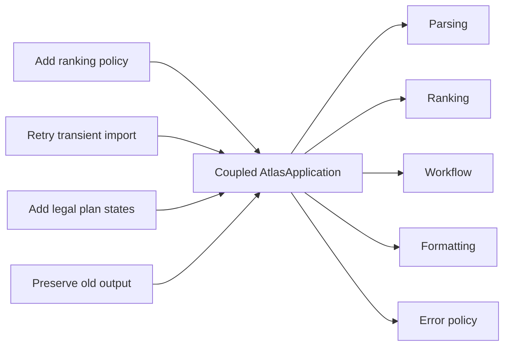
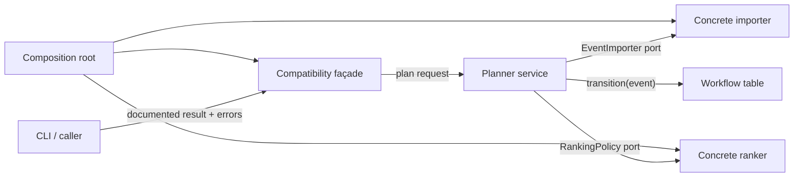
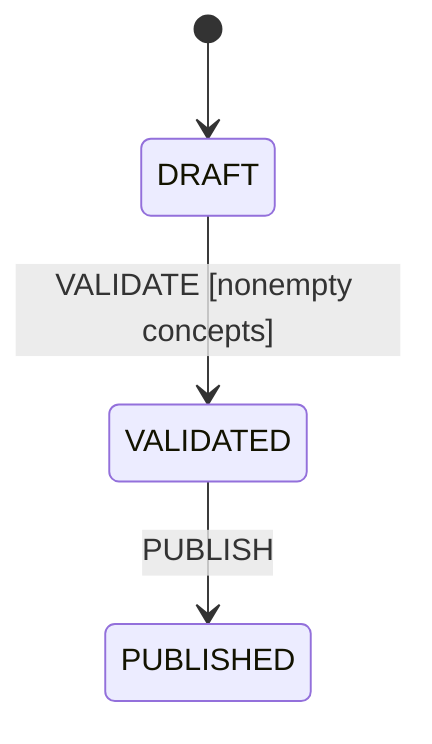
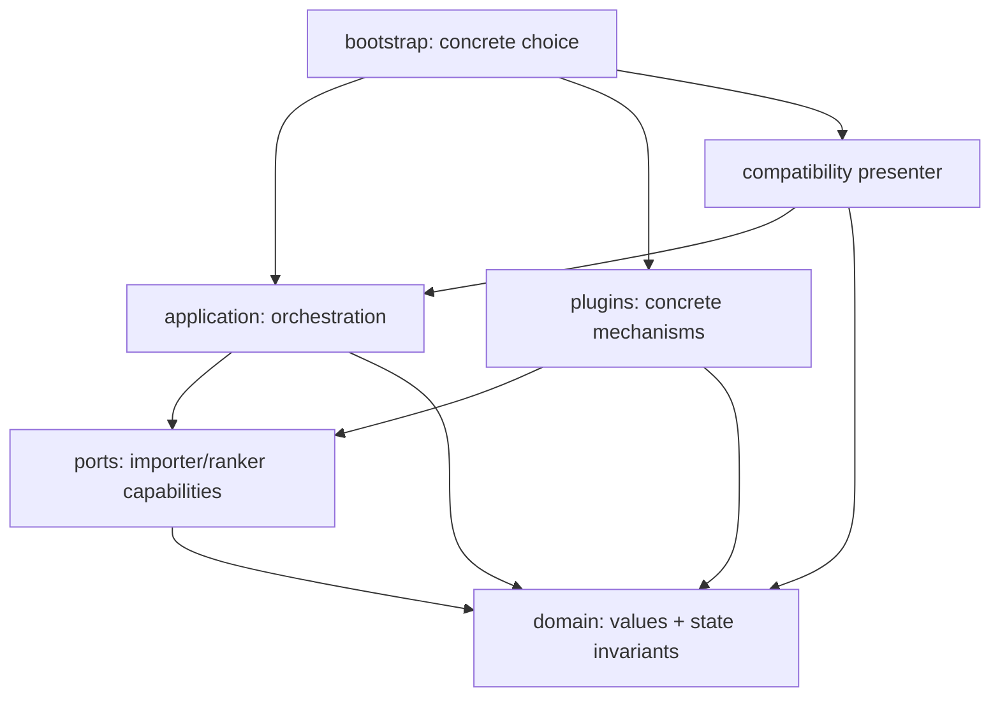
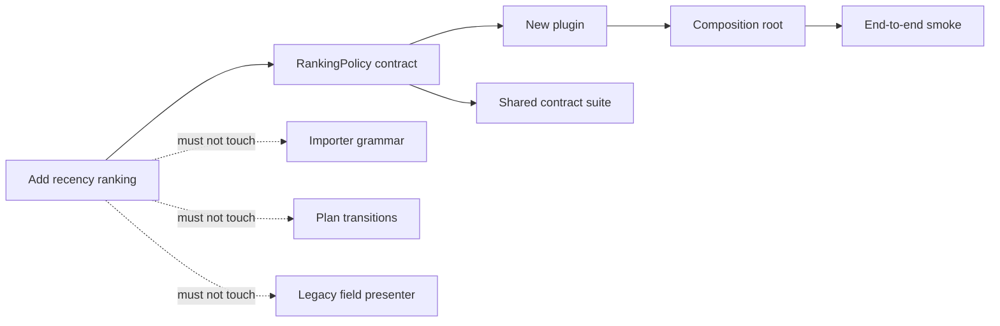
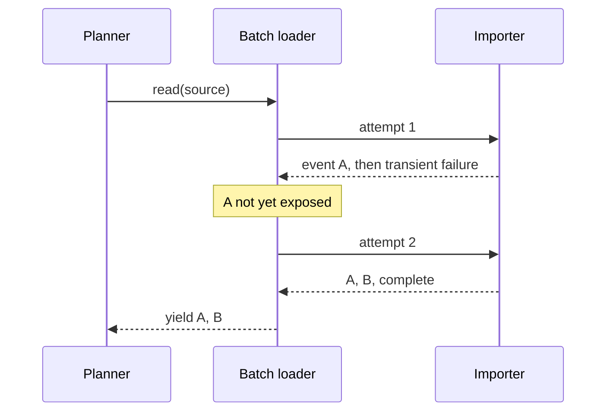
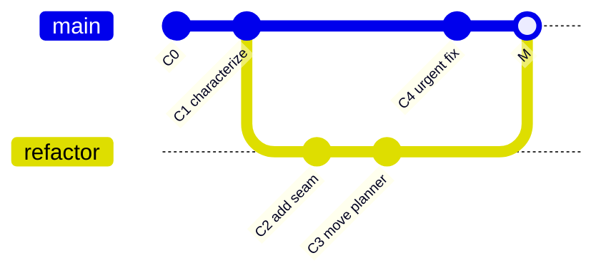
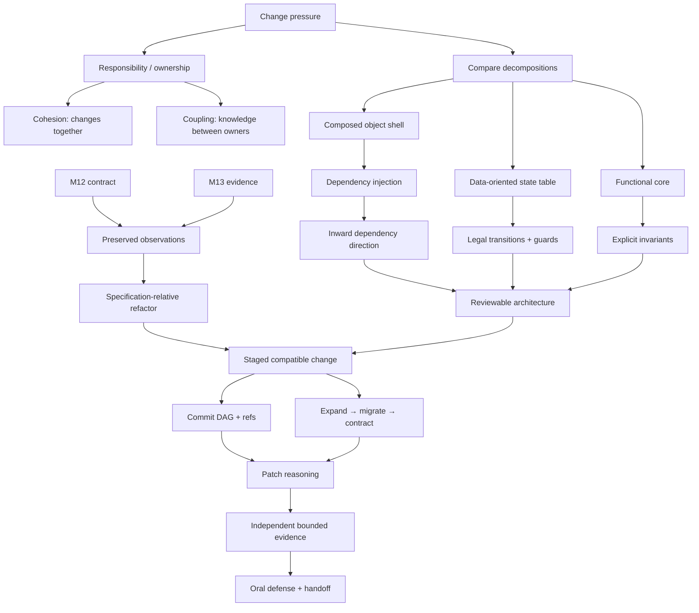

# Module 14 — Software Design and Change

> **Arc III: Durable Software — pressure → contract → design → change → evidence**
>
> A design is not “good” in the abstract. It is useful when it puts a likely
> change behind a boundary, keeps an invariant with its owner, and lets a
> reviewer tell whether a patch preserved the observations that matter.

This workbook continues one argument rather than presenting a catalog of styles
and patterns:

```text
M12: name the boundary and point dependencies toward it
  ↓
M13: specify its behavior and collect bounded evidence
  ↓
M14: change its internals without losing the chosen behavior
  ↓
M15: carry that discipline across files, packages, and releases
  ↓
M16: carry it across durable relational state and transactions
```

The running case is Atlas's coupled study-session planner. It imports study
events, chooses a ranking policy, constructs a plan, moves the plan through a
workflow, and returns an old CLI-shaped result. Four plausible requests arrive:

1. add a ranking policy;
2. retry transient importer failure, but never invalid data;
3. add `draft → validated → published` as explicit legal states;
4. preserve the old `items` output field for one release.

The technical challenge is not typing those features. It is deciding which
observations must survive, which decisions belong together, which dependencies
should reverse, and what evidence makes the change reviewable.

---

## How to use this workbook

For each substantial example:

1. **Commit to a prediction** before running it.
2. Mark the claim layer:
   - **S** — chosen specification or policy;
   - **P** — Python or Git mechanism documented by an authoritative source;
   - **E** — finite evidence from a test, trace, diff, or measurement;
   - **J** — design judgment under named pressures.
3. Read in dependency order: public contract, domain invariants, control/error
   flow, tests, dependency graph, then mechanics.
4. State what the evidence does **not** establish.
5. Keep a change ledger: pressure, preserved observations, changed
   observations, dependency edges, evidence, and reversal route.

Typing volume is deliberately small. The dominant work is reconstruction,
prediction, comparison, patch review, and oral defense.

### Claim-layer legend

| Mark | Meaning | Example |
|---|---|---|
| **S** | A behavior Atlas chooses and must document | Invalid importer data is never retried |
| **P** | A documented mechanism | A Git commit records a tree and parent commit IDs |
| **E** | A bounded observation | These 18 characterization cases match before/after |
| **J** | A contextual design choice | Use a functional core and composed service shell here |

Never turn **J** into universal law or **E** into proof.

---

## 1. Position in the knowledge graph

### The problem that forces this module

M12 gave Atlas typed ports and inward dependency arrows. M13 turned importer
ambiguity into contracts, partitions, tests, failure dossiers, and safe signals.
Yet a system can have interfaces and tests and still be painfully coupled.

The names `EventImporter` and `RankingPolicy` keep their Module 12 v1 members
and meanings throughout this module. Module 14 adds orchestration, workflow,
compatibility, and change-control policy around those ports; it does not
silently replace `RankingPolicy.score(candidate, context)` with a different
same-named interface. Likewise, Module 13's streaming importer may expose a
valid prefix before a later data error. An all-or-nothing retry boundary must
therefore use a different application-level interface rather than masquerade as
the original provider.

The first Atlas prototype is one class that:

- parses pipe-delimited text;
- chooses low-confidence ranking with an `if`;
- removes duplicate concepts;
- invents workflow states;
- retries every exception;
- formats the CLI output;
- imports concrete plugins directly.

It “works” for one route. But each new pressure crosses the same owner.



The design smell is not “the class is long.” The stronger observation is:

> Decisions that change for different reasons share one owner, so unrelated
> patches repeatedly touch the same code and evidence.

### Module question

> How can we change Atlas under several pressures while preserving a declared
> set of observations, keeping the patch understandable, and retaining a
> credible route to reverse or continue the migration?

### Atlas checkpoint

Refactor the coupled planner into:

- immutable domain values with enforced invariants;
- a pure selection function;
- injected importer and ranking ports;
- a data-oriented state-transition table;
- a composed application service;
- an explicit compatibility façade;
- a composition root that alone knows concrete plugins;
- behavior characterization plus contract and architecture checks;
- a coherent Git change story and evidence-based review.

### Backward connections

| Earlier idea | Used now |
|---|---|
| M1 values, aliases, mutation | Immutable snapshots make intermediate states inspectable |
| M3 ADTs and information hiding | Internal representation may change while allowed observations remain |
| M4 logic, relations, graphs | A state machine is a relation/function over states and events |
| M5 cost models | Indirection, copying, retries, and migration all have costs |
| M8 hash sets | Stable concept de-duplication uses membership state |
| M10 graph algorithms | Dependency and commit histories are directed graphs |
| M11 policy vs mechanism | Ranking policy varies independently from orchestration |
| M12 Protocols and dependency inversion | The application depends on capabilities, not concrete plugins |
| M13 specifications and evidence | “Behavior preserved” is meaningful only relative to declared observations |

### Capabilities unlocked next

- M15 can version output formats and packages because changes are release-sized
  and compatibility is explicit.
- M16 can introduce `ImportValidatedBundle` and a repository contract that hide
  storage mechanics because ownership and dependency direction are inspectable.
- Later concurrency and service modules can place lifecycle, cancellation, and
  failure policies at explicit boundaries rather than inside a god object.

---

## 2. Prerequisite retrieval

Answer closed-note. If an answer is vague, return to the named module before
using a pattern name.

### Retrieval A — observable contract

If a caller sees a return value, exception type, ordering, and side effect, which
of those may a refactor change silently?

> None, unless the chosen compatibility contract explicitly excludes an
> observation. “Internal” and “unimportant” are not synonyms.

### Retrieval B — finite evidence

Eighteen passing before/after cases establish what universal claim?

> No universal equivalence claim. They support equivalence for the named cases
> under the recorded environment and oracle.

### Retrieval C — dependency arrow

If `application/planner.py` imports `plugins/pipe.py`, who knows whose concrete
decision?

> The stable application policy knows a volatile mechanism. M12 suggests moving
> concrete choice to a composition root and depending on a narrow port.

### Retrieval D — invariant owner

Where should “published plans have at least one concept” be enforced?

> At the domain/workflow boundary that creates published snapshots, not merely
> in a CLI presenter or test.

### Retrieval E — graph

Can a Git commit be modeled only as a textual diff?

> No. A commit points to a complete tree plus parent commit(s) and metadata.
> Diffs are comparisons between states.

### Retrieval F — subtype

If a subclass raises a new exception for input its base contract accepts, is
inheritance merely a reuse decision?

> No. Clients typed against the base may break. Inheritance carries a behavioral
> substitutability obligation.

### Retrieval G — failure class

Why must transient infrastructure failure and invalid source data remain
different exceptions?

> Retry may help the first but repeats the second. Collapsing them destroys
> policy information and can multiply cost or duplicate effects.

### Retrieval H — policy

Is “never duplicate code” a correctness law?

> No. Some duplication is coincidental. Joining unrelated decisions to remove it
> can increase coupling. State the change pressure before abstracting.

---

## 3. Mastery outcomes

By the end, Michael can:

1. reconstruct responsibilities and dependency direction from an unfamiliar
   planner;
2. produce a change-impact map before editing;
3. distinguish cohesion, coupling, information hiding, and mere file count;
4. compare functional, object-oriented, and data-oriented decompositions by
   state, extension, evidence, and cost;
5. decide between composition and inheritance using behavioral substitution;
6. derive dependency injection and state machines from concrete pressure;
7. recognize strategy, decorator, façade/adapter, and composition-root roles
   after identifying their forces;
8. separate refactoring from intentional behavior change;
9. design staged compatibility and migration with a removal condition;
10. explain the Git object/commit/ref graph sufficiently to reason about branch,
    merge, rebase, revert, and bisect;
11. review a generated patch using contracts, dependencies, failure paths, and
    independent evidence rather than style preference;
12. defend what was preserved, what changed, how it was verified, what remains
    uncertain, and how the change can be reversed.

---

## 4. Begin with pressure, not pattern

### 4.1 Responsibility means ownership of a decision

A responsibility is not every action a component performs. It is a decision the
component is accountable for keeping correct.

| Decision | Likely owner | Why |
|---|---|---|
| Text record grammar | Importer | Changes with source format |
| What counts as valid confidence | Domain value | Must hold regardless of importer |
| Which candidate ranks first | Ranking policy | Changes with learning policy |
| Legal plan transitions | Workflow/domain | Must hold across every UI |
| Which implementation to use | Composition root | Environment/configuration choice |
| Old CLI field name | Compatibility presenter | Changes with public evolution policy |

**Cohesion** asks whether a component's responsibilities belong together because
they change for the same reasons.

**Coupling** asks what one component must know about another: names, types,
representations, call order, exceptions, timing, shared state, or deployment.

Neither is a scalar moral score. Some coupling is the point of software. The
question is whether knowledge points in the intended direction and changes
together.

### 4.2 Change amplification is inspectable evidence

For each request, predict touched responsibilities before reading the code:

| Pressure | Coupled prototype | Intended localized design |
|---|---|---|
| New ranking policy | main class, branch, tests, CLI setup | new ranker + composition |
| Retry transient source access | parse loop, broad handler, tests | batch retry service + provider failure contract |
| New state | string assignments across methods | transition table + invariant tests |
| Preserve `items` | domain return shape and callers | compatibility presenter |

This matrix is not proof of future maintainability. It is a falsifiable design
hypothesis: future patches should touch fewer unrelated owners.

### First-principles checkpoint — derive an owner before choosing a pattern

Start with one requested change, not a pattern name. For “add recency ranking,”
make the causal path explicit:

| Question | Working answer | What would disprove the boundary? |
|---|---|---|
| What observation must remain? | callers still receive ordered, unique `items` | an unchanged-input regression changes the result |
| What decision varies independently? | the ordering rule | a source-format change also requires editing the ranker |
| Who owns that decision? | `RankingPolicy` plus its composition choice | unrelated workflow or presentation code must change |
| What stays outside the owner? | parsing grammar, transition legality, legacy field spelling | the new policy needs to inspect or mutate those details |

This is the first-principles move: a boundary follows an independently changing
decision and a preserved observation. It is not proof that a class hierarchy is
good. Predict a smallest test that could falsify the proposed boundary, state
your confidence, then inspect the patch.

### 4.3 A syntax-valid broken prototype

Predict all policies hidden inside `plan`:

```python
class CoupledAtlasApplication:
    def plan(self, text: str, limit: int) -> dict[str, object]:
        attempts = 0
        while True:
            try:
                rows = [
                    line.split("|")
                    for line in text.splitlines()
                    if line.strip()
                ]
                break
            except Exception:
                attempts += 1
                if attempts == 3:
                    return {"status": "failed", "items": []}

        events = [
            (parts[0], parts[1], float(parts[2]))
            for parts in rows
        ]
        events.sort(key=lambda event: event[2])

        items: list[str] = []
        for _, concept_id, _ in events:
            if concept_id not in items:
                items.append(concept_id)
            if len(items) == limit:
                break

        state = "draft"
        state = "validated"
        state = "published"
        return {"status": state, "items": items}
```

The main defect is not its line count. It silently decides:

- parsing grammar and malformed-data semantics;
- retry classification and terminal behavior;
- ranking and tie order;
- duplicate policy;
- whether a nonpositive limit is meaningful;
- legal state transitions;
- output compatibility;
- mutability of returned data.

A tool can extract methods quickly. It cannot decide those policies correctly
without a specification.

### 4.4 Information hiding is selective dependence

Information hiding means clients depend on the smallest stable set of
observations. It does **not** mean Python prevents clients from reading source or
attributes.



The façade hides the new domain snapshot from old clients for a bounded period.
The service hides orchestration from plugins. The transition table exposes legal
state change but hides its representation.

---

## 5. Preserve observations before moving code

### 5.1 Refactoring is specification-relative

Let `O` be the chosen set of observations. A transformation from program `P` to
`P'` is a refactor relative to `O` when:

\[
\forall x \in D_O,\quad O(P, x) = O(P', x)
\]

This statement immediately forces questions:

- What inputs are in `D_O`?
- Are exception classes/messages observed?
- Is output order observed?
- Are timing, memory, logs, or network calls observed?
- Are side effects and partial results observed?

Tests sample this relation; they do not prove it for all inputs.

### Rigor card — definition, assumptions, derivation, counterexample, and numerical experiment

Let \(P\) be the old program, \(P'\) the changed program, \(O\) the chosen
observable behavior, and \(D_O\) the admitted inputs. The refactor claim is

\[
\forall x \in D_O,\quad O(P,x)=O(P',x).
\]

To reason about it, name the assumptions: which inputs are admitted, whether
exception class/order/side effects count as observations, and which dependency
or environment behavior is deliberately outside \(O\). The proof idea is to
preserve each named observation through the changed owner; finite tests can
refute the universal claim but cannot establish it for every \(x\).

**Counterexample.** Two versions can return the same `items` while one changes
an invalid-input exception into an empty result, reverses tied results, or sends
an external request. They are not equivalent when that behavior is in \(O\).

For the four pressures in the earlier matrix, record a local count
\(C(r)\) of independently owned responsibilities predicted to change before
and after the design. For example, a recency rule may move from
\(C(r)=4\) coupled owners to \(C(r)=2\) (`RankingPolicy` and composition).
That is a change-scope hypothesis—not a universal maintainability metric—and a
later patch or regression can falsify it.

### 5.2 Observation ledger

Before the Atlas refactor:

| Observation | Preserve? | Evidence route |
|---|---:|---|
| Valid pipe rows become concepts | yes | characterization + importer contract |
| Lowest confidence ranks first | yes | independent ordered examples |
| Equal confidence ties by concept ID | clarify, then preserve | new specification test |
| Duplicate concepts appear once | yes | characterization + property cases |
| Result field is `items` | yes, one release | exact façade result test |
| Status string is `published` | yes | exact result test |
| Invalid data is silently empty | **no** | deliberate breaking-change record |
| Retry all exceptions | **no** | classified-failure tests |
| Internal class/method names | no | not a supported API |
| Asymptotic ranking cost | yes: no worse than `O(n log n)` | review + measurement later |

The last two rows matter: a safe migration can include deliberate behavior
change, but it must not be mislabeled as pure refactoring.

### 5.3 Characterization and specification are different

A characterization test records what the current system does. A specification
test records what it **should** promise.

```python
def test_characterizes_old_field_name(app) -> None:
    result = app.plan("e1|graphs|0.4", limit=1)
    assert result == {
        "status": "published",
        "items": ["graphs"],
    }


def test_specifies_invalid_data_is_visible(app) -> None:
    try:
        app.plan("broken", limit=1)
    except ImportDataError:
        pass
    else:
        raise AssertionError("invalid data was hidden as an empty plan")
```

Both are valuable. Only the second intentionally changes the old behavior.

### 5.4 Independent behavior matrix

Do not compute expected values by calling the same ranking helper as production.

| Case | Input summary | Independent expected observation |
|---|---|---|
| one event | `graphs, .4` | `["graphs"]` |
| confidence order | `types, .8`; `graphs, .2` | `["graphs", "types"]` |
| tie | `types, .4`; `graphs, .4` | `["graphs", "types"]` |
| duplicate concept | `graphs, .8`; `graphs, .1` | `["graphs"]` |
| limit | three concepts, limit two | exactly first two |
| blank line | valid, blank, valid | blank ignored |
| malformed | two fields | `ImportDataError` |
| empty source | no candidates | `PlanningError` |

These cases are independent in expected literals and reasoning, not independent
implementations of the whole system.

---

## 6. Choose a decomposition by its forces

### 6.1 Three compatible lenses

Python permits several decompositions in one system:

| Lens | Best fit | State location | Extension mode | Typical risk |
|---|---|---|---|---|
| Functional | Deterministic transformations | Explicit values/arguments | Compose or pass functions | Hidden I/O inside “pure” helpers |
| Object/composition | Stateful lifetime and collaborators | Encapsulated object/value | Inject implementation behind port | Indirection or mutable hidden state |
| Data-oriented | Many similar cases/transitions | Tables and flat records | Add/transform data rows | Weak domain validation or scattered interpretation |

The Atlas choice:

- **functional core:** order and de-duplicate immutable events;
- **composed object shell:** orchestrate importer, ranker, and workflow;
- **data-oriented table:** represent legal state transitions;
- **façade:** preserve the old external shape;
- **composition root:** choose concrete implementations.

This is a contextual design, not a Python doctrine.

### 6.2 Pure core exposes the claim

Prediction: does changing the input tuple occur here?

```python
from collections.abc import Iterable


def choose_concepts(
    ordered_concept_ids: Iterable[str],
    limit: int,
) -> tuple[str, ...]:
    if limit <= 0:
        raise ValueError("limit must be positive")
    chosen: list[str] = []
    seen: set[str] = set()
    for concept_id in ordered_concept_ids:
        if concept_id not in seen:
            seen.add(concept_id)
            chosen.append(concept_id)
            if len(chosen) == limit:
                break
    return tuple(chosen)
```

No input is mutated. The function does have local state (`seen`, `chosen`);
“functional” here means externally effect-free for the chosen model, not “no
assignment exists.”

Invariant after processing a prefix:

1. `seen` is exactly the distinct concepts in the processed prefix;
2. `chosen` contains the first occurrence of each seen concept, in order;
3. `len(chosen) ≤ limit`.

The loop stops with the first `limit` distinct concepts or after all input.

### 6.3 Object shell owns lifetime and collaboration

```python
from dataclasses import dataclass
from typing import Protocol


class Importer(Protocol):
    def read(self, text: str) -> tuple[str, ...]: ...


class Ranker(Protocol):
    def order(self, concepts: tuple[str, ...]) -> tuple[str, ...]: ...


@dataclass(frozen=True)
class Planner:
    importer: Importer
    ranker: Ranker

    def plan(self, text: str, limit: int) -> tuple[str, ...]:
        imported = self.importer.read(text)
        ordered = self.ranker.order(imported)
        return choose_concepts(ordered, limit)
```

Dependency injection is simply the caller supplying a needed collaborator.
Framework containers are optional machinery, not the definition.

### 6.4 Data-oriented state machine

A finite deterministic state machine can be modeled as:

- states `S`;
- events `E`;
- initial state `s₀`;
- partial transition function `δ: S × E ⇀ S`.

```python
from enum import Enum


class PlanState(Enum):
    DRAFT = "draft"
    VALIDATED = "validated"
    PUBLISHED = "published"


class PlanEvent(Enum):
    VALIDATE = "validate"
    PUBLISH = "publish"


TRANSITIONS = {
    (PlanState.DRAFT, PlanEvent.VALIDATE): PlanState.VALIDATED,
    (PlanState.VALIDATED, PlanEvent.PUBLISH): PlanState.PUBLISHED,
}
```

The table makes illegal edges visible by absence.



Prediction: should `(DRAFT, PUBLISH)` default to `PUBLISHED`? No. A missing edge
is evidence of an illegal transition, not a request to guess.

---

## 7. Composition and inheritance carry different obligations

### 7.1 Composition can make a changed contract explicit

Retry is an outer application policy around an importer. The importer still
owns format interpretation and Module 13's streaming observations; the batch
loader owns attempt policy and deliberately returns only a completed attempt.

```python
class BatchImportRetrier:
    def __init__(self, inner: Importer, attempts: int = 3) -> None:
        if attempts < 1:
            raise ValueError("attempts must be positive")
        self._inner = inner
        self._attempts = attempts

    def load(self, text: str) -> tuple[str, ...]:
        for attempt in range(self._attempts):
            try:
                return tuple(self._inner.read(text))
            except TransientImportError:
                if attempt + 1 == self._attempts:
                    raise
        raise AssertionError("loop must return or raise")
```

This is **not** an `EventImporter` decorator: buffering changes first-result
latency and whether a valid prefix is visible after a late failure. The
different `load` interface makes that application-level contract visible.
A wrapper is conventionally called a **decorator** only when it genuinely
preserves the wrapped interface and its behavioral obligations.

### 7.2 Inheritance promises substitutability

This code parses, but its semantics are broken:

```python
class RetryEverythingPipeImporter(PipeImporter):
    def read(self, source):
        for _ in range(3):
            try:
                return tuple(super().read(source))
            except Exception:
                continue
        return ()
```

It:

- converts invalid data into an apparently valid empty result;
- catches programming defects and system exceptions indiscriminately;
- changes streaming/materialization behavior;
- may repeat effects;
- violates the base failure contract.

The issue is not that inheritance is always wrong. It is that the subclass is
not a behavioral subtype under the documented importer contract.

### 7.3 Decision table

| Question | Composition is favored when… | Inheritance is plausible when… |
|---|---|---|
| Relationship | “has/uses a capability” | genuine stable “is-a” abstraction |
| Change | behavior varies at runtime/composition | subtype family is stable |
| Contract | wrapper can preserve/decorate port | every base client can accept subtype |
| State | collaborator lifetime is separable | state/invariant genuinely belongs to subtype |
| Risk | indirection is affordable | fragile base assumptions are controlled |

Neither column is universal policy.

---

## 8. Patterns are compressed consequences

Do not begin with “Which pattern should we use?” Begin with force and ownership.

| Force discovered | Smallest design response | Conventional name |
|---|---|---|
| Ranking algorithm varies; planner does not | Inject a ranking capability | Strategy |
| Retry requires an all-or-nothing batch | Compose a distinct batch loader | Adapter / application service |
| Old caller shape must survive new internals | Translate at one public boundary | Façade / adapter role |
| Concrete selection should remain outside policy | Build graph at application edge | Composition root |
| Legal state transitions are central | Explicit state/event relation | State machine |

The name supports communication. It does not prove the design is needed or
correct.

### A simpler alternative can win

If Atlas has exactly two fixed ranking functions with no independent lifecycle,
a callable may be clearer than a class hierarchy:

```python
from collections.abc import Callable, Sequence

RankKey = Callable[["StudyEvent"], tuple[float, str, str]]


def order_events(
    events: Sequence["StudyEvent"],
    key: RankKey,
) -> tuple["StudyEvent", ...]:
    return tuple(sorted(events, key=key))
```

Introducing `AbstractRankingStrategyFactory` here would add vocabulary and
indirection without answering a pressure.

---

## 9. Architecture is enforced ownership

### 9.1 Intended dependency direction



Calls can travel outward to an injected plugin while source dependencies point
inward toward the port. Runtime flow and knowledge direction are different
graphs.

### 9.2 Repository slice

```text
atlas/
├── domain/
│   ├── events.py
│   └── plans.py
├── ports/
│   ├── importers.py
│   └── ranking.py
├── application/
│   └── planner.py
├── plugins/
│   ├── pipe.py
│   ├── low_confidence.py
│   └── retry.py
├── presentation/
│   └── legacy_cli.py
└── bootstrap.py
tests/
├── characterization/
├── contract/
├── architecture/
└── regression/
```

Directories do not enforce boundaries. Tests, reviews, import searches, and
tooling provide evidence that the graph matches the diagram.

### 9.3 Architecture check

An AST-based check can extract imports, map each module to a layer, and reject
edges outside an allowlist:

```python
import ast
from pathlib import Path


def imported_atlas_modules(path: Path) -> set[str]:
    tree = ast.parse(path.read_text(encoding="utf-8"))
    found: set[str] = set()
    for node in ast.walk(tree):
        if isinstance(node, ast.Import):
            found.update(
                alias.name for alias in node.names
                if alias.name.startswith("atlas.")
            )
        elif isinstance(node, ast.ImportFrom):
            module = node.module or ""
            if module.startswith("atlas."):
                found.add(module)
    return found
```

This supports a dependency claim for statically visible imports. It does not
detect every dynamic import, runtime service lookup, shared database coupling,
or semantic knowledge encoded as strings.

### 9.4 Change-impact map

Before delegating, draw:



The dashed non-impact claims are review hypotheses. If the patch touches those
components, require an explanation.

---

## 10. State, dependency injection, and failure policy

### 10.1 State snapshots instead of scattered booleans

Avoid combinations such as:

```python
plan.is_validated = True
plan.is_published = False
plan.failed = False
```

Three booleans permit eight combinations, many meaningless. One `PlanState`
permits only named states; the transition function restricts reachable edges.

### 10.2 Invariant belongs with transition

For a transition `DRAFT --VALIDATE→ VALIDATED`, the guard “concept list is
nonempty” belongs at the transition boundary. A presenter check is too late, and
a test alone does not enforce it.

### 10.3 Retry requires an atomic exposure boundary

An importer generator could yield one event and then fail transiently. Retrying
and yielding again may duplicate the first event. The raw provider keeps Module
13's partial-yield contract; the distinct batch loader materializes one attempt
before returning any event:



Cost: batch retry holds `Θ(n)` events and delays first output. This is a
conscious application tradeoff, not a changed importer guarantee or free safety.

### 10.4 Failure taxonomy

| Failure | Owner | Retry? | Caller observation |
|---|---|---:|---|
| Malformed source | importer/domain | no | `ImportDataError` with context |
| Temporary source unavailable | adapter | bounded | `TransientImportError` if exhausted |
| Invalid limit | application precondition | no | `PlanningError` |
| Illegal transition | workflow/domain | no | `InvalidTransitionError` |
| Programming defect | defect owner | no generic recovery here | propagate, diagnose |

`except Exception: retry` destroys this ownership.

---

## 11. Staged change, compatibility, and migration

### 11.1 Refactor and behavior change in separate steps

A reviewable sequence:

1. record current supported observations;
2. add characterization at the public boundary;
3. introduce domain values and ports without changing output;
4. move pure ranking/de-duplication behind the new seam;
5. move workflow transitions behind an explicit state model;
6. add a compatibility façade producing the exact old shape;
7. switch the composition root;
8. independently compare old/new for the characterization matrix;
9. deliberately change invalid-data behavior with a spec and migration note;
10. remove old code only after callers and rollback needs are checked.

Each commit should tell one coherent story and leave the project buildable.
“Small” helps review but is not itself safety.

### 11.2 Expand → migrate → contract

For the old `items` field:

```text
expand:   new internals exist; old façade still emits items
migrate:  consumers gain a new versioned API using concept_ids
contract: remove items only after measured/declared consumer migration
```

A deprecation without owner, deadline/condition, telemetry or consumer evidence,
and removal plan becomes permanent ambiguity.

### 11.3 Compatibility is multi-dimensional

| Dimension | Example |
|---|---|
| Source/API | import path, function signature, accepted arguments |
| Behavior | order, exceptions, retry, mutation, side effects |
| Data | field names and serialized schema |
| Operational | latency, memory, logging volume, dependency startup |
| Organizational | rollout, ownership, support and rollback procedure |

M15 deepens data/package compatibility. M16 deepens persisted schema migration.

### 11.4 Reversible does not mean costless

A change is more reversible when:

- old and new boundaries coexist briefly;
- the switch is centralized in composition/configuration;
- old data remains readable during the window;
- commits isolate mechanics from policy;
- rollback preconditions are written;
- destructive migration is delayed or recoverable.

Reversal still has costs: dual-path tests, compatibility complexity, data
conversion, operational coordination, and human attention.

---

## 12. Git as a persistent graph of snapshots

### 12.1 Working tree, index, `HEAD`

| State | Meaning |
|---|---|
| Working tree | checked-out files being edited |
| Index | proposed content for the next commit |
| `HEAD` | reference to the currently checked-out commit (normally through a branch) |

`git diff` normally compares working tree with index. `git diff --cached`
compares index with `HEAD`. Exact options can alter comparisons, so read the
command contract.

### 12.2 Commit object model

A commit is not a diff. At the needed level, it records:

- the ID of a root tree;
- zero or more parent commit IDs;
- author/committer metadata;
- a message.

Content-addressed object IDs depend on object content. A branch is a movable
reference to a commit.



The merge commit can have two parents. The branch name did not contain copies of
every file; it moved to point at successive commits.

### 12.3 Merge, rebase, revert

| Operation | Graph consequence | Review consequence |
|---|---|---|
| Merge | combines histories, often with multi-parent commit | preserves topology; may require conflict resolution |
| Rebase | replays changes onto new base, creating new commit IDs | linearizes local story; rewrites identity/history |
| Revert | adds a new commit that applies an inverse change | preserves public history; inverse may conflict or be incomplete |

No universal rule says merge or rebase is always cleaner. Collaboration,
published history, audit needs, and local policy decide.

### 12.4 Bisect is binary search with an evidence predicate

`git bisect` can localize the transition between known good and bad commits when
the classifier is reproducible.

```text
predicate requirements:
- deterministic enough for the task;
- meaningful exit status;
- controlled dependencies/environment;
- able to build/run at intermediate commits;
- explicit treatment of untestable commits;
- tests the symptom, not an unrelated proxy.
```

With `n` ordered candidate commits and a reliable midpoint classification,
binary localization needs `O(log n)` classifications. Build/test time dominates
the real system cost. Flaky evidence can send the search down the wrong half.

---

## 13. Code review is model comparison

Review asks whether the patch's implemented model matches the declared change
model.

### 13.1 Read in dependency order

1. issue, spec, compatibility ledger, and non-goals;
2. public contract and failure behavior;
3. domain data and invariants;
4. control/data flow and state transitions;
5. dependency edges and composition;
6. tests and independent evidence;
7. configuration, dependencies, migration, and reversal;
8. line-level mechanics and readability.

Starting only at line 1 of a diff hides architectural consequences.

### 13.2 Review comment structure

Use:

```text
Finding:
Consequence under a concrete input/change:
Contract or invariant affected:
Smallest repair direction:
Evidence that would resolve the concern:
Confidence / uncertainty:
```

“I prefer composition” is taste. “This application import points to a concrete
plugin, so adding a ranker still requires editing stable orchestration” is a
testable design finding.

### 13.3 Suspicious generated patch

```python
# Proposed by an agent
from atlas.plugins.pipe import PipeImporter

_LAST_PLAN: list[str] = []


def plan_session(text: str, limit: int) -> dict[str, object]:
    try:
        events = tuple(PipeImporter().read_text(text))
        ordered = sorted(events, key=lambda event: event.confidence)
        _LAST_PLAN[:] = [event.concept_id for event in ordered[:limit]]
        return {
            "status": "published",
            "concept_ids": _LAST_PLAN,
        }
    except Exception:
        return {
            "status": "published",
            "concept_ids": [],
        }
```

Prediction-before-execution review:

1. imports a concrete plugin into application policy;
2. renames `items` without a compatibility path;
3. retries nothing and suppresses every failure as success;
4. returns a shared mutable global list;
5. slices before de-duplicating concepts;
6. does not define tie order;
7. bypasses the workflow transition invariant;
8. accepts zero/negative limits through slicing semantics;
9. offers no contract, architecture, or adversarial evidence;
10. scope likely exceeds “add one ranking policy.”

Green happy-path tests would not resolve these findings.

---

## 14. Runnable Atlas reference model

The reference deliberately places all layers in one executable block so the
mechanism can be tested here. The repository version should split them according
to the architecture map.

**Continuity rule:** the `EventImporter` and `RankingPolicy` Protocols below
preserve the Module 12 API, including `api_version`, `supports`/`read`, and
`score(candidate, context)`. `BatchEventLoader` is deliberately different: it
materializes a complete retryable attempt before returning. Planning order is
then an application operation derived from ranking scores with an explicit tie
policy.

Public behavior chosen for this module:

- pipe rows are `event_id|concept_id|confidence`;
- blank rows are ignored;
- IDs are nonempty and confidence is finite in `[0, 1]`;
- duplicate event IDs are invalid;
- low confidence ranks first, with concept ID then event ID ties;
- only the first ranked event for a concept contributes;
- limit is positive and at least one concept is required;
- workflow is exactly `draft → validated → published`;
- transient source failure is retried at the distinct batch boundary up to the configured bound;
- invalid data and programming defects are never retried;
- the compatibility façade returns exactly `{"status": "published", "items": [...]}`.

```python
# RUNNABLE-REFERENCE-START
from __future__ import annotations

from collections.abc import Iterable, Iterator
from dataclasses import dataclass, replace
from enum import Enum
from math import isfinite
from typing import Protocol


class AtlasDesignError(Exception):
    """Base class for expected Module 14 boundary failures."""


class ImportDataError(ValueError):
    """Stable, privacy-safe importer failure from Module 13."""

    def __init__(
        self,
        source_id: str,
        line: int,
        code: str,
    ) -> None:
        self.source_id = source_id
        self.line = line
        self.code = code
        super().__init__(f"{source_id}:{line}: {code}")


class TransientImportError(AtlasDesignError):
    """The source mechanism may succeed on a later bounded attempt."""


class PlanningError(AtlasDesignError):
    """The plan request cannot produce a valid plan."""


class InvalidTransitionError(AtlasDesignError):
    """The requested state edge is absent or violates its guard."""


class ArchitectureViolation(AtlasDesignError):
    """A source dependency violates the declared layer policy."""


PLUGIN_API_VERSION = 1


@dataclass(frozen=True, slots=True)
class ImportSource:
    source_id: str
    media_type: str
    text: str

    def __post_init__(self) -> None:
        if not self.source_id:
            raise ValueError("source_id must be nonempty")
        if not self.media_type:
            raise ValueError("media_type must be nonempty")


@dataclass(frozen=True)
class StudyEvent:
    event_id: str
    concept_id: str
    confidence: float

    def __post_init__(self) -> None:
        if not self.event_id:
            raise ValueError("event_id must be nonempty")
        if not self.concept_id:
            raise ValueError("concept_id must be nonempty")
        if not isfinite(self.confidence):
            raise ValueError("confidence must be finite")
        if not 0.0 <= self.confidence <= 1.0:
            raise ValueError("confidence must be between 0 and 1")


@dataclass(frozen=True)
class ReviewCandidate:
    concept_id: str
    confidence: float

    def __post_init__(self) -> None:
        if not self.concept_id:
            raise ValueError("concept_id must be nonempty")
        if not isfinite(self.confidence):
            raise ValueError("confidence must be finite")
        if not 0.0 <= self.confidence <= 1.0:
            raise ValueError("confidence must be between 0 and 1")


@dataclass(frozen=True)
class RankingContext:
    completed_reviews: int

    def __post_init__(self) -> None:
        if self.completed_reviews < 0:
            raise ValueError("completed_reviews must be nonnegative")


class PlanState(Enum):
    DRAFT = "draft"
    VALIDATED = "validated"
    PUBLISHED = "published"


class PlanEvent(Enum):
    VALIDATE = "validate"
    PUBLISH = "publish"


@dataclass(frozen=True)
class PlanSnapshot:
    plan_id: str
    concept_ids: tuple[str, ...]
    state: PlanState

    def __post_init__(self) -> None:
        if not self.plan_id:
            raise ValueError("plan_id must be nonempty")
        if len(set(self.concept_ids)) != len(self.concept_ids):
            raise ValueError("a plan cannot repeat a concept")
        if self.state is not PlanState.DRAFT and not self.concept_ids:
            raise ValueError("validated/published plans must be nonempty")


class EventImporter(Protocol):
    @property
    def name(self) -> str: ...

    @property
    def api_version(self) -> int: ...

    def supports(self, source: ImportSource) -> bool: ...

    def read(self, source: ImportSource) -> Iterator[StudyEvent]: ...


class RankingPolicy(Protocol):
    @property
    def name(self) -> str: ...

    @property
    def api_version(self) -> int: ...

    def score(
        self,
        candidate: ReviewCandidate,
        context: RankingContext,
    ) -> float: ...


class BatchEventLoader(Protocol):
    """Application boundary that returns one complete retryable batch."""

    def load(self, source: ImportSource) -> tuple[StudyEvent, ...]: ...


@dataclass(frozen=True)
class PipeImporter:
    @property
    def name(self) -> str:
        return "atlas.pipe"

    @property
    def api_version(self) -> int:
        return PLUGIN_API_VERSION

    def supports(self, source: ImportSource) -> bool:
        return source.media_type == "text/x-atlas-pipe"

    def read(self, source: ImportSource) -> Iterator[StudyEvent]:
        if not self.supports(source):
            raise ImportDataError(
                source.source_id,
                0,
                "unsupported_media_type",
            )
        seen_event_ids: set[str] = set()
        for line_number, raw_line in enumerate(
            source.text.splitlines(),
            start=1,
        ):
            if not raw_line.strip():
                continue
            parts = [part.strip() for part in raw_line.split("|")]
            if len(parts) != 3:
                raise ImportDataError(
                    source.source_id,
                    line_number,
                    "field_count",
                )
            event_id, concept_id, raw_confidence = parts
            try:
                confidence = float(raw_confidence)
                event = StudyEvent(event_id, concept_id, confidence)
            except ValueError as error:
                raise ImportDataError(
                    source.source_id,
                    line_number,
                    "invalid_event",
                ) from error
            if event.event_id in seen_event_ids:
                raise ImportDataError(
                    source.source_id,
                    line_number,
                    "duplicate_event_id",
                )
            seen_event_ids.add(event.event_id)
            yield event


@dataclass(frozen=True)
class LowConfidenceRanking:
    @property
    def name(self) -> str:
        return "low-confidence"

    @property
    def api_version(self) -> int:
        return PLUGIN_API_VERSION

    def score(
        self,
        candidate: ReviewCandidate,
        context: RankingContext,
    ) -> float:
        del context
        return 1.0 - candidate.confidence


@dataclass
class ScriptedImporter:
    """Deterministic test double: each call consumes one scripted outcome."""

    outcomes: list[tuple[StudyEvent, ...] | Exception]
    calls: int = 0

    @property
    def name(self) -> str:
        return "scripted"

    @property
    def api_version(self) -> int:
        return PLUGIN_API_VERSION

    def supports(self, source: ImportSource) -> bool:
        return True

    def read(self, source: ImportSource) -> Iterator[StudyEvent]:
        index = self.calls
        self.calls += 1
        if index >= len(self.outcomes):
            raise AssertionError("script exhausted")
        outcome = self.outcomes[index]
        if isinstance(outcome, Exception):
            raise outcome
        yield from outcome


@dataclass(frozen=True)
class BatchImportRetrier:
    inner: EventImporter
    attempts: int = 3

    def __post_init__(self) -> None:
        if self.attempts < 1:
            raise ValueError("attempts must be positive")

    def load(self, source: ImportSource) -> tuple[StudyEvent, ...]:
        if self.inner.api_version != PLUGIN_API_VERSION:
            raise PlanningError("unsupported importer API version")
        supported = self.inner.supports(source)
        if type(supported) is not bool:
            raise PlanningError("importer supports() must return bool")
        if not supported:
            raise ImportDataError(
                source.source_id,
                0,
                "unsupported_media_type",
            )
        completed: tuple[StudyEvent, ...] | None = None
        for attempt in range(1, self.attempts + 1):
            try:
                # This distinct batch boundary deliberately does not expose the
                # raw provider's valid prefix from an incomplete attempt.
                completed = tuple(self.inner.read(source))
                break
            except TransientImportError:
                if attempt == self.attempts:
                    raise
        if completed is None:
            raise AssertionError("bounded retry must complete or raise")
        return completed


TRANSITIONS: dict[
    tuple[PlanState, PlanEvent],
    PlanState,
] = {
    (PlanState.DRAFT, PlanEvent.VALIDATE): PlanState.VALIDATED,
    (PlanState.VALIDATED, PlanEvent.PUBLISH): PlanState.PUBLISHED,
}


def transition(
    snapshot: PlanSnapshot,
    event: PlanEvent,
) -> PlanSnapshot:
    try:
        next_state = TRANSITIONS[(snapshot.state, event)]
    except KeyError as error:
        raise InvalidTransitionError(
            f"cannot {event.value} from {snapshot.state.value}"
        ) from error
    if (
        event is PlanEvent.VALIDATE
        and not snapshot.concept_ids
    ):
        raise InvalidTransitionError(
            "cannot validate an empty plan"
        )
    return replace(snapshot, state=next_state)


def choose_distinct_concepts(
    ordered_events: Iterable[StudyEvent],
    limit: int,
) -> tuple[str, ...]:
    if limit <= 0:
        raise PlanningError("limit must be positive")
    chosen: list[str] = []
    seen: set[str] = set()
    for event in ordered_events:
        if event.concept_id in seen:
            continue
        seen.add(event.concept_id)
        chosen.append(event.concept_id)
        if len(chosen) == limit:
            break
    return tuple(chosen)


def order_events(
    events: Iterable[StudyEvent],
    ranking: RankingPolicy,
    context: RankingContext,
) -> tuple[StudyEvent, ...]:
    if ranking.api_version != PLUGIN_API_VERSION:
        raise PlanningError("unsupported ranking API version")

    scored: list[tuple[float, str, str, StudyEvent]] = []
    for event in events:
        raw_score = ranking.score(
            ReviewCandidate(event.concept_id, event.confidence),
            context,
        )
        if (
            isinstance(raw_score, bool)
            or not isinstance(raw_score, (int, float))
            or not isfinite(raw_score)
        ):
            raise PlanningError(
                f"{ranking.name!r} produced invalid score {raw_score!r}"
            )
        scored.append(
            (
                -float(raw_score),
                event.concept_id,
                event.event_id,
                event,
            )
        )
    scored.sort(key=lambda row: row[:3])
    return tuple(row[3] for row in scored)


@dataclass(frozen=True)
class PlannerService:
    event_loader: BatchEventLoader
    ranking: RankingPolicy
    ranking_context: RankingContext

    def create_plan(
        self,
        source: ImportSource,
        *,
        plan_id: str,
        limit: int,
    ) -> PlanSnapshot:
        # The batch application boundary exposes no incomplete retry attempt.
        imported = self.event_loader.load(source)
        ordered = order_events(
            imported,
            self.ranking,
            self.ranking_context,
        )
        concept_ids = choose_distinct_concepts(ordered, limit)
        if not concept_ids:
            raise PlanningError("a plan needs at least one concept")
        draft = PlanSnapshot(
            plan_id=plan_id,
            concept_ids=concept_ids,
            state=PlanState.DRAFT,
        )
        validated = transition(draft, PlanEvent.VALIDATE)
        return transition(validated, PlanEvent.PUBLISH)


@dataclass(frozen=True)
class LegacyPlanFacade:
    service: PlannerService

    def plan(
        self,
        text: str,
        limit: int,
    ) -> dict[str, object]:
        snapshot = self.service.create_plan(
            ImportSource(
                source_id="cli",
                media_type="text/x-atlas-pipe",
                text=text,
            ),
            plan_id="cli-plan",
            limit=limit,
        )
        # Fresh list preserves old shape without exposing service state.
        return {
            "status": snapshot.state.value,
            "items": list(snapshot.concept_ids),
        }


def build_legacy_compatible_app() -> LegacyPlanFacade:
    event_loader = BatchImportRetrier(PipeImporter(), attempts=3)
    ranking = LowConfidenceRanking()
    service = PlannerService(
        event_loader=event_loader,
        ranking=ranking,
        ranking_context=RankingContext(completed_reviews=0),
    )
    return LegacyPlanFacade(service)


ALLOWED_LAYER_EDGES: set[tuple[str, str]] = {
    ("ports", "domain"),
    ("application", "domain"),
    ("application", "ports"),
    ("plugins", "domain"),
    ("plugins", "ports"),
    ("presentation", "domain"),
    ("presentation", "application"),
    ("bootstrap", "application"),
    ("bootstrap", "plugins"),
    ("bootstrap", "presentation"),
}


def check_architecture(
    edges: Iterable[tuple[str, str]],
) -> None:
    violations = sorted(
        edge for edge in edges
        if edge not in ALLOWED_LAYER_EDGES
    )
    if violations:
        raise ArchitectureViolation(
            f"forbidden dependencies: {violations}"
        )


def assert_raises(
    expected: type[BaseException],
    operation,
) -> BaseException:
    try:
        operation()
    except expected as error:
        return error
    except BaseException as error:
        raise AssertionError(
            f"expected {expected.__name__}, got {type(error).__name__}"
        ) from error
    raise AssertionError(f"expected {expected.__name__}")


def run_reference_and_adversarial_tests() -> None:
    app = build_legacy_compatible_app()

    # Independent characterization literals: production helpers are not the oracle.
    cases = [
        (
            "e1|graphs|0.4",
            1,
            {"status": "published", "items": ["graphs"]},
        ),
        (
            "e1|types|0.8\ne2|graphs|0.2",
            2,
            {"status": "published", "items": ["graphs", "types"]},
        ),
        (
            "e1|types|0.4\ne2|graphs|0.4",
            2,
            {"status": "published", "items": ["graphs", "types"]},
        ),
        (
            "e1|graphs|0.8\ne2|graphs|0.1\ne3|types|0.5",
            3,
            {"status": "published", "items": ["graphs", "types"]},
        ),
        (
            "e1|c|0.3\n\ne2|a|0.1\ne3|b|0.2",
            2,
            {"status": "published", "items": ["a", "b"]},
        ),
    ]
    for text, limit, expected in cases:
        actual = app.plan(text, limit)
        assert actual == expected

    # Returned compatibility data is fresh, not retained global state.
    first = app.plan("e1|graphs|0.4", 1)
    first_items = first["items"]
    assert isinstance(first_items, list)
    first_items.append("corruption")
    assert app.plan("e1|graphs|0.4", 1)["items"] == ["graphs"]

    invalid_inputs = [
        "broken",
        "e1||0.4",
        "e1|graphs|NaN",
        "e1|graphs|1.1",
        "e1|graphs|0.4\ne1|types|0.2",
    ]
    for text in invalid_inputs:
        assert_raises(
            ImportDataError,
            lambda text=text: app.plan(text, 1),
        )
    structured = assert_raises(
        ImportDataError,
        lambda: app.plan("broken", 1),
    )
    assert isinstance(structured, ImportDataError)
    assert (
        structured.source_id,
        structured.line,
        structured.code,
    ) == ("cli", 1, "field_count")
    assert_raises(PlanningError, lambda: app.plan("", 1))
    assert_raises(PlanningError, lambda: app.plan("e1|x|0.5", 0))

    draft = PlanSnapshot("p1", ("graphs",), PlanState.DRAFT)
    validated = transition(draft, PlanEvent.VALIDATE)
    published = transition(validated, PlanEvent.PUBLISH)
    assert published.state is PlanState.PUBLISHED
    assert_raises(
        InvalidTransitionError,
        lambda: transition(draft, PlanEvent.PUBLISH),
    )
    assert_raises(
        InvalidTransitionError,
        lambda: transition(published, PlanEvent.PUBLISH),
    )

    event = StudyEvent("e1", "graphs", 0.4)

    class LateInvalidImporter:
        name = "late-invalid"
        api_version = PLUGIN_API_VERSION

        def supports(self, source: ImportSource) -> bool:
            return True

        def read(
            self,
            source: ImportSource,
        ) -> Iterator[StudyEvent]:
            yield event
            raise ImportDataError(
                source.source_id,
                2,
                "invalid_event",
            )

    late_source = ImportSource("late", "any", "ignored")
    raw_stream = LateInvalidImporter().read(late_source)
    assert next(raw_stream) == event
    late_error = assert_raises(ImportDataError, lambda: next(raw_stream))
    assert isinstance(late_error, ImportDataError)
    assert (late_error.line, late_error.code) == (2, "invalid_event")
    assert_raises(
        ImportDataError,
        lambda: BatchImportRetrier(
            LateInvalidImporter(),
            attempts=2,
        ).load(late_source),
    )

    transient = ScriptedImporter(
        outcomes=[
            TransientImportError("temporary"),
            (event,),
        ]
    )
    retried = BatchImportRetrier(transient, attempts=2)
    assert retried.load(
        ImportSource("x", "any", "ignored")
    ) == (event,)
    assert transient.calls == 2

    invalid = ScriptedImporter(
        outcomes=[
            ImportDataError("x", 1, "invalid_event"),
            (event,),
        ]
    )
    no_invalid_retry = BatchImportRetrier(invalid, attempts=3)
    assert_raises(
        ImportDataError,
        lambda: no_invalid_retry.load(
            ImportSource("x", "any", "ignored")
        ),
    )
    assert invalid.calls == 1

    exhausted = ScriptedImporter(
        outcomes=[
            TransientImportError("one"),
            TransientImportError("two"),
        ]
    )
    assert_raises(
        TransientImportError,
        lambda: BatchImportRetrier(
            exhausted,
            attempts=2,
        ).load(
            ImportSource("x", "any", "ignored")
        ),
    )
    assert exhausted.calls == 2

    class InvalidScoreRanking:
        name = "invalid-score"
        api_version = PLUGIN_API_VERSION

        def score(
            self,
            candidate: ReviewCandidate,
            context: RankingContext,
        ) -> float:
            del candidate, context
            return float("nan")

    invalid_score_service = PlannerService(
        event_loader=BatchImportRetrier(
            ScriptedImporter(outcomes=[(event,)]),
            attempts=1,
        ),
        ranking=InvalidScoreRanking(),
        ranking_context=RankingContext(0),
    )
    assert_raises(
        PlanningError,
        lambda: invalid_score_service.create_plan(
            ImportSource("score", "any", "ignored"),
            plan_id="p-score",
            limit=1,
        ),
    )

    intended_edges = {
        ("ports", "domain"),
        ("application", "domain"),
        ("application", "ports"),
        ("plugins", "domain"),
        ("plugins", "ports"),
        ("presentation", "domain"),
        ("presentation", "application"),
        ("bootstrap", "application"),
        ("bootstrap", "plugins"),
        ("bootstrap", "presentation"),
    }
    check_architecture(intended_edges)
    assert_raises(
        ArchitectureViolation,
        lambda: check_architecture(
            intended_edges | {("application", "plugins")}
        ),
    )

    print(
        "Module 14 runnable reference: "
        "all reference and adversarial checks passed"
    )


if __name__ == "__main__":
    run_reference_and_adversarial_tests()
# RUNNABLE-REFERENCE-END
```

### 14.1 Correctness argument

For `choose_distinct_concepts`, after each processed event:

- `seen` is exactly the concepts observed in the processed prefix;
- `chosen` contains each concept at most once;
- `chosen` preserves first occurrence in rank order;
- its length never exceeds `limit`.

When the loop stops, it therefore returns the first `min(limit, d)` distinct
concepts in rank order, where `d` is the number of distinct concepts.

For transitions:

- `TRANSITIONS` contains exactly the two allowed state/event pairs;
- lookup failure rejects every other pair;
- the validation guard rejects empty concept tuples;
- frozen snapshots plus `replace` create a new state rather than mutating
  previously observed history.

For retry:

- only `TransientImportError` enters the retry branch;
- at most `attempts` delegated calls occur;
- the raw importer still exposes its Module 13 streaming observations;
- the separate batch loader returns only after materialization, so a failed
  attempt exposes no prefix through that application boundary;
- `ImportDataError` and unrelated defects propagate on the first attempt.

The arguments rely on collaborators honoring their contracts. Tests support the
provided implementations; they do not prove arbitrary plugins safe.

### 14.2 Time, space, and system cost

Let:

- `c` be input characters;
- `n` be imported events;
- `d` be distinct concepts;
- `k` be the requested limit;
- `a` be the number of attempts, bounded by configured `A`.

| Operation | Time | Auxiliary/retained space | Boundary |
|---|---:|---:|---|
| Pipe parsing | `Θ(c)` | `Θ(n)` IDs plus yielded values | assumes bounded conversion |
| Batch retry | up to `O(A·c)` | `Θ(n)` materialized successful attempt | source must be safe to repeat |
| Ranking sort | `O(n log n)` | implementation-dependent `O(n)` references | tie key is constant-size model |
| Distinct selection | `O(n)` expected | `O(min(d, processed))` | inherits hash assumptions |
| Transition lookup | expected `O(1)` | `O(1)` | tiny fixed dict |
| Compatibility list | `O(min(k,d))` | same | fresh mutable copy |
| Architecture edge check | `O(e log e)` on failure due to sort | `O(e)` violations | `e` supplied edges |

System costs include increased object count, indirect calls, duplicate old/new
paths during migration, extra CI evidence, and reviewer attention. Measure real
latency and memory before claiming equivalence when operational behavior is in
the contract.

### 14.3 Deliberate boundaries

The reference:

- models text already in memory; encoding and durable I/O belong to M15;
- has no database, transaction, concurrency, or network retry;
- assumes Module 12's `PluginCatalog` has already selected compatible concrete
  providers; direct construction here demonstrates M14 assembly and does not
  replace catalog discovery/selection policy;
- preserves the Module 12 v1 port members and Module 13 structured importer
  failure fields;
- assumes a source is safe to repeat and contains no non-idempotent side effect;
- uses a course architecture-edge model rather than scanning a real repository;
- preserves an old in-process dict shape, not a versioned serialized schema;
- uses no framework container or pattern library;
- does not claim tests prove every input or future plugin;
- does not claim identical performance to the coupled prototype.

---

## 15. Architecture-reading studio

Use the five-level comprehension ladder on the reference:

### Purpose

Produce a published, low-confidence-first study plan while preserving one old
output shape and classifying retryable failure.

### Map

Draw values, ports, concrete mechanisms, pure transform, state table, service,
presenter, root, and architecture policy.

### Flow

Trace this input without execution:

```text
e1|types|0.8
e2|graphs|0.2
e3|graphs|0.6
```

For `limit=2`, predict:

1. importer yield order;
2. ranking order;
3. `seen` after each ranked event;
4. each workflow state;
5. final compatibility result.

Expected final result is
`{"status": "published", "items": ["graphs", "types"]}`.

### Mechanism

Explain why:

- a tuple is materialized twice (retry boundary and service boundary);
- `StudyEvent` checks finiteness before range;
- the state table is data while `transition` interprets it;
- the presenter returns a fresh list;
- application logic need not import `PipeImporter`.

### Evaluation

Challenge:

- Which duplicate materialization could be removed without leaking partial
  attempts?
- What happens if the importer performs a remote non-idempotent action?
- Is exact error text part of the compatibility contract?
- How would a high-volume source change the atomicity/memory tradeoff?
- Which dynamic dependencies escape the edge checker?

---

## 16. Design, delegate, review, verify

### 16.1 Bounded delegation brief

> **Task:** Introduce a `RecencyRanking` plugin behind the existing
> `RankingPolicy` port and wire it through the composition root.
>
> **Required behavior:** lower elapsed days ranks earlier; ties use confidence,
> concept ID, then event ID as documented. The plugin must be deterministic for
> immutable inputs and must not mutate them.
>
> **Allowed files:** new plugin, composition root registration/configuration,
> shared ranking-contract cases, one end-to-end smoke test, short decision note.
>
> **Do not change:** importer grammar/failures, state transition table, planner
> service, legacy `items` presenter, public exception types, packaging,
> persistence, concurrency, or unrelated formatting.
>
> **Evidence:** exact focused-test command/result, static check scope, dependency
> check, before/after file list, one adversarial tie case, and statement of
> unsupported claims.
>
> **Stop and ask:** if recency data is absent from the current domain contract;
> do not invent a timestamp source.

The stop condition is important: an agent should not smuggle a new domain model
through a plugin patch.

### 16.2 Review the patch in dependency order

1. Does the task have enough data to implement recency truthfully?
2. Did the domain/public contract change?
3. Does application import the new plugin?
4. Is tie order total and deterministic?
5. Are existing values mutated or time read implicitly?
6. Does the shared contract suite exercise the new implementation?
7. Is the smoke test independent enough to catch incorrect wiring?
8. Did any non-goal file change?
9. Can removing one registration reverse the feature?

### 16.3 Claim/evidence matrix

| Claim | Strongest available evidence | Limit |
|---|---|---|
| Old CLI cases preserved | exact before/after characterization | finite selected cases |
| New ranker follows policy | contract partitions + independent tie examples | no proof for arbitrary plugin |
| Dependencies point inward | AST/import edge check + manual diagram | dynamic/semantic coupling may escape |
| Invalid data not retried | adversarial scripted importer | modeled exception classes only |
| Patch is reversible | isolated root switch + coherent commits | data/external consumers may add cost |
| Performance acceptable | benchmark/profile in target environment | reference asymptotics are not latency |

### 16.4 Conversation rehearsal — use the canonical oral-defense flow below

Use this as an optional prompt bank for the single conversational oral-defense
flow below. The learner may keep code or a visible sketch open, choose any
subset, pause for a hint, and finish with an uncertainty rather than a verdict:

1. name the four change pressures;
2. draw the dependency and runtime-flow graphs separately;
3. state the preserved and deliberately changed observations;
4. defend one composition choice and one non-pattern alternative;
5. trace one transient and one invalid-data failure;
6. explain the Git reversal route;
7. state the strongest remaining uncertainty.

---

## 17. Six connected teaching sessions

These meetings are one staged change. Each begins with retrieval, adds one
abstraction jump, and leaves an artifact used by the next meeting.

## Session 1 — Reconstruct pressure and observable behavior

**Question:** What is expensive about the coupled prototype, and what must not
change accidentally?

**Before class**

- Retrieve M12's public-observation model and M13's distinction between
  specification and finite test evidence.
- Read only the coupled prototype and its public examples. Do not propose
  classes yet.
- Predict the four request-to-file impact paths.

**Instructor sequence**

1. Run one valid, tied, duplicate, malformed, and empty case.
2. Mark observed behavior separately from desired policy.
3. Create the preservation ledger.
4. Color the coupled method by responsibility/change pressure.
5. Draw current source-dependency and runtime-flow graphs.
6. Ask which hidden policy makes each request risky.

**Learner actions**

- trace one concrete input;
- state an invariant and an ambiguity;
- classify each observation as preserve/change/unknown;
- write two independent expected results without calling production helpers;
- explain why passing cases are evidence, not equivalence proof.

### Prediction before reveal — one change, one preserved observation

Before inspecting a proposed refactor, predict which public observation could
change if the ranking policy is moved behind a new owner. State confidence and
the smallest characterization or regression that would challenge the
prediction; then compare the patch with that evidence rather than its style.

**Artifact:** characterization matrix, pressure map, and uncertainty list.

### Session 1 output — preservation ledger and pressure map

Keep one compact record: the chosen public observations, the four change
pressures, one invariant, one unresolved assumption, and the smallest test or
trace that would expose a regression. Session 2 uses this record to judge
decompositions rather than treating a pattern name as a design decision.

**Exit check:** Michael can answer “relative to which observations?” whenever
someone says “behavior-preserving.”

## Session 2 — Compare decompositions by change axis

**Question:** Which decisions should live together?

**Before class**

- Inspect three sketches: all-functions pipeline, composed service objects, and
  record/dispatch-table design.
- Predict where state, failure policy, and concrete selection live in each.

**Instructor sequence**

1. Derive cohesion from requests that change together.
2. Derive coupling from concrete knowledge, ordering, exceptions, and shared
   state.
3. Isolate `choose_distinct_concepts` as a pure core.
4. Add injected importer/ranking ports as the object shell.
5. Put legal transitions in a table.
6. Compare costs and failure modes; reject style allegiance.

**Learner actions**

- map each decision to an owner;
- defend one functional, one composed, and one data-oriented choice;
- find a simpler callable alternative to a ranker class;
- identify one harmful abstraction created only to remove coincidental
  duplication.

**Artifact:** responsibility table and architecture decision draft.

### Session 2 output — responsibility and decomposition decision

Record the change axis, owner, dependency direction, selected decomposition,
one rejected alternative, and the observable behavior that remains protected.
Carry this decision into the state/failure boundary rather than starting a new
architecture story.

**Exit check:** every design choice names a pressure, invariant, and rejected
alternative.

## Session 3 — Enforce state and failure boundaries

**Question:** How do explicit transitions and composition prevent invalid
behavior?

**Before class**

- Draw the `PlanState × PlanEvent` table from memory.
- Predict the partial-yield behavior of a generator that fails after one event.

**Instructor sequence**

1. Replace scattered booleans with one state domain.
2. Treat transition lookup as a partial function.
3. Add the nonempty-plan guard at the transition owner.
4. Separate `ImportDataError` from `TransientImportError`.
5. Compare subclass-based retry with a composed wrapper.
6. Derive the atomic materialization boundary and its `Θ(n)` space cost.

**Learner actions**

- trace valid and illegal transitions;
- construct a minimal behavioral-subtyping counterexample;
- explain why generic retry can duplicate effects;
- add a scripted failure test;
- state which source repeatability assumption remains unverified.

**Artifact:** state table, failure taxonomy, and retry evidence.

### Session 3 output — state, failure, and retry boundary

Preserve a legal-transition table, a failure classification, the retry
atomicity boundary, its space/repeatability assumptions, and one adversarial
trace. Session 4 treats this as a contract that staged commits must preserve.

**Exit check:** Michael can explain both the safety and cost of atomic retry.

## Session 4 — Stage a compatible refactor in the Git graph

**Question:** How should the change be divided so each step is understandable
and reversible?

**Before class**

- Read the bounded Git object/branch material in the source route.
- Draw working tree, index, `HEAD`, commit, parent, and branch ref.

**Instructor sequence**

1. Add characterization before moving code.
2. Plan seam-introduction and behavior-move commits.
3. Preserve `items` in a compatibility façade.
4. Separate deliberate invalid-data change from structural refactor.
5. Model merge, rebase, and revert as graph transformations.
6. Write expand/migrate/contract conditions.

**Learner actions**

- partition a 300-line hypothetical patch into coherent commits;
- identify which commit can be reverted independently;
- predict how rebasing changes commit identity;
- state when old and new paths can be contracted;
- distinguish repository history from remote backup.

**Artifact:** commit storyboard, compatibility window, and rollback preconditions.

### Session 4 output — staged Git change and rollback conditions

Write the coherent commit sequence, each commit's preserved observation, the
compatibility window, reversal route, and the condition that would block a
rollback. Session 5 reviews this evidence, not an isolated diff.

**Exit check:** the story remains buildable and reviewable after every planned
commit.

## Session 5 — Review an agent patch and localize a regression

**Question:** Does the patch implement the declared change model?

**Before class**

- Read the task brief and public contract before opening the diff.
- Commit to three predicted failure risks.

**Instructor sequence**

1. Inspect scope and changed dependency arrows.
2. Trace one happy input and one failure through the diff.
3. Compare tests with the observation ledger.
4. Find the renamed field, global alias, broad exception, early slice, and
   missing tie rule in the suspicious patch.
5. Write evidence-seeking review comments.
6. Design a deterministic good/bad predicate for a bounded bisect exercise.

**Learner actions**

- rank findings by consequence rather than style;
- distinguish blocker, question, suggestion, and unsupported preference;
- propose the smallest repair direction;
- state which green check does not answer each concern;
- run or simulate logarithmic regression localization.

**Artifact:** structured review, evidence gaps, and bisect predicate checklist.

### Session 5 output — evidence-led review and bisect predicate

Keep the ranked findings, consequence, missing evidence, smallest repair
direction, and reproducible good/bad predicate. The final defense must say
which green check still leaves uncertainty.

**Exit check:** every blocking review comment has a concrete consequence and a
resolution route.

## Session 6 — Atlas change defense and handoff

**Question:** Does the refactor deserve trust, and is it ready to cross a durable
boundary in M15?

**Before class**

- Reconstruct the architecture without notes.
- Prepare the exact commands/results and claim limits.

**Instructor sequence**

1. Compare before/after architecture and change amplification.
2. Run reference, adversarial, compatibility, and architecture checks.
3. Inspect the Git story and reversal route.
4. Challenge operational and dynamic-dependency blind spots.
5. Use the conversational oral-defense flow below; let the learner choose a
   prompt, hint, and stopping point.
6. Freeze handoff invariants for file/schema/package work.

**Learner actions**

- explain one request end-to-end;
- defend the mixed decomposition;
- show one rejected generated patch;
- identify residual uncertainty;
- state the M15 handoff: in-memory text/dict is not yet durable or versioned.

**Artifact:** Atlas Module 14 evidence packet and durable-boundary handoff.

### Session 6 output — change defense and M15 durable-boundary handoff

Package the pressure-to-contract story, architecture map, state/failure trace,
review decision, reversal condition, residual uncertainty, and the M15
question: which in-memory assumptions must become explicit bytes, schema,
artifact, or rollback evidence?

**Exit check:** Michael can reconstruct contracts, state transitions, dependency
ownership, evidence, and reversal without relying on a pattern label.

---

## 18. Eight-level problem ladder

Each level consumes the previous artifact. Do not jump to implementation before
the observation and pressure models exist.

### Level 1 — Recognize: locate decisions, not nouns

Given the coupled prototype, label every line with one responsibility:

- format interpretation;
- domain validation;
- ranking;
- de-duplication;
- workflow;
- failure policy;
- compatibility presentation.

Then identify two lines that perform similar syntax but own different decisions.

**Deliverable:** annotated code plus one-sentence explanation of why line count
alone does not diagnose coupling.

**Mastery evidence:** at least four independent change axes are recovered.

### Level 2 — Trace: predict one plan and one failure

Without execution, trace:

```text
e1|types|0.7
e2|graphs|0.2
e3|graphs|0.5
e4|proof|0.2
```

Use `limit=3`. Record importer order, ranking keys, distinct-selection state,
workflow states, and façade result. Then replace the third confidence with
`NaN` and trace the earliest responsible boundary.

**Deliverable:** time-ordered trace with `seen`, `chosen`, and exception path.

**Mastery evidence:** expected result is
`["graphs", "proof", "types"]`; `NaN` fails in domain construction, not ranking.

### Level 3 — Map: recover architecture and impact

Given a repository tree and imports, draw:

1. source-dependency graph;
2. runtime call graph for one plan;
3. ownership table;
4. impact map for “add recency ranking.”

Highlight an `application → plugins` import.

**Deliverable:** two distinct graphs and one proposed reversal through a port and
composition root.

**Mastery evidence:** Michael does not confuse call direction with source
dependency direction.

### Level 4 — Modify: add one legal cancellation edge

New pressure: a draft may be cancelled, but validated or published plans may
not. Add `CANCEL` and `CANCELLED` with the smallest change.

Constraints:

- existing transitions and exact old CLI happy output stay unchanged;
- cancelled plans may be empty;
- no boolean flag;
- one transition-table row;
- invalid later cancellation raises `InvalidTransitionError`.

**Deliverable:** state-table patch, invariant update, prediction, and focused
tests.

**Mastery evidence:** the change remains in the domain/workflow owner and does
not modify importer or ranking.

### Level 5 — Debug and defend: retry duplicates a prefix

A generated retry wrapper yields delegated events immediately and restarts on a
transient failure. A fake importer yields `e1`, fails, then yields `e1,e2`.

Tasks:

1. reproduce the duplicate;
2. distinguish symptom from cause;
3. decide whether buffering, idempotent downstream writes, or resumable cursors
   fit the stated contract;
4. implement the smallest selected repair;
5. state time/space and latency consequences.

**Deliverable:** failure dossier and regression test.

**Mastery evidence:** repair protects the publication boundary and does not
retry `ImportDataError`.

### Level 6 — Design and delegate: add recency ranking

Write the bounded brief from Section 16 for an agent. If timestamps are absent,
stop at the contract gap and propose two designs:

- extend `StudyEvent` with an observed-at value;
- supply a separate immutable recency context keyed by event ID.

Compare compatibility, ownership, memory, missing-data policy, and later
persistence effects.

**Deliverable:** two-option decision record, chosen contract, non-goals, allowed
files, acceptance evidence, and stop conditions.

**Mastery evidence:** no timestamp, clock, or timezone semantics are invented
silently.

### Level 7 — Review and verify: reject a plausible patch

Review the suspicious patch from Section 13 plus a test file containing only one
happy case.

Requirements:

- at least one contract finding;
- one dependency finding;
- one alias/mutation finding;
- one error-policy finding;
- one incorrect or absent test oracle;
- one scope finding;
- exact focused evidence request;
- qualified acceptance/rejection statement.

**Deliverable:** structured patch review and independent verification plan.

**Mastery evidence:** findings cite consequences and contracts, not “best
practice” slogans.

### Level 8 — Transfer: design a document approval workflow

Transfer the model to a different layer:

```text
draft → reviewed → approved → released
```

An old API exposes `{"ready": bool}` while the new domain needs explicit state.
Design:

- state/event table and guards;
- pure policy vs I/O shell;
- dependency direction;
- old-API adapter window;
- characterization/specification split;
- commit sequence, reversal route, and review evidence.

Finally connect it back to Atlas by identifying which M15 serialized observation
would need versioning.

**Deliverable:** architecture decision record plus a learner-selected
conversation summary from the canonical oral-defense flow below.

**Mastery evidence:** the learner transfers forces and invariants, not Atlas
class names.

---

## 19. Confidence-aware diagnostic quiz

For each item:

1. choose A–D;
2. record confidence: **50% / 70% / 90%**;
3. give one causal sentence or counterexample;
4. reveal only after committing.

High-confidence errors trigger the repair route. Low-confidence correct answers
still require explanation.

### Question 1 — What makes a change a refactor?

Atlas replaces its coupled planner with the reference architecture. All current
tests pass, but invalid input now raises rather than returning an empty
published plan. Which statement is most precise?

- **A.** It is entirely a refactor because internal class structure improved.
- **B.** It is entirely a feature because at least one file changed.
- **C.** Structural steps may be refactors relative to declared observations,
  while the invalid-input change is a separate behavior change.
- **D.** It is proven behavior-preserving because every existing test passes.

<details>
<summary>Reveal answer and misconception routes</summary>

**Answer: C.** Refactoring is relative to a chosen observation set. The new
failure behavior must be specified and migrated separately from structure-only
steps.

- **A** confuses intent/internal structure with observational equivalence.
- **B** confuses repository mutation with user-visible feature behavior.
- **D** upgrades finite evidence into proof and ignores a known changed case.

**Repair route:** write a two-column preserved/changed observation ledger, then
name one test for each. Return to M13's test-evidence boundary if passing tests
still feel universal.

</details>

### Question 2 — Which boundary follows the change pressure?

Adding a third ranking policy currently requires editing importer parsing,
workflow transitions, and CLI formatting. Which first design move best addresses
the stated pressure?

- **A.** Create a base class containing parsing, ranking, workflow, and output so
  subclasses can override any method.
- **B.** Extract a narrow ranking capability and move concrete ranking choice to
  the composition root.
- **C.** Copy the full planner and rename it for the third policy.
- **D.** Add another `if` but place it in a smaller helper file.

<details>
<summary>Reveal answer and misconception routes</summary>

**Answer: B.** The ranking axis varies independently; a narrow port localizes
that knowledge and keeps selection at the edge.

- **A** creates a broad inheritance surface with several unrelated reasons to
  change.
- **C** avoids immediate coupling but duplicates every unrelated policy and
  creates divergent behavior.
- **D** moves text without changing ownership or dependency direction.

**Repair route:** draw a request-to-responsibility matrix. If one request touches
unrelated decisions, identify the smallest capability it actually needs.

</details>

### Question 3 — Why is batch retry a different interface?

Why does `BatchImportRetrier(inner).load(source)` deliberately avoid presenting
itself as another `EventImporter.read(source)`?

- **A.** Composition automatically makes code faster than inheritance.
- **B.** It delegates parsing but changes temporal behavior by buffering a
  complete attempt, so a distinct batch interface makes the stronger
  all-or-nothing application policy explicit.
- **C.** Python subclasses cannot override methods that return iterators.
- **D.** Any composed wrapper is behaviorally substitutable even if it catches
  all exceptions or hides valid prefixes.

<details>
<summary>Reveal answer and misconception routes</summary>

**Answer: B.** The important distinction is responsibility and observable
contract, not syntax. Module 13's provider may expose a valid prefix before a
late data error; the batch loader intentionally does not. Composition separates
attempt policy from format parsing, while the different method name prevents a
false substitutability claim.

- **A** invents a performance law; the loader adds buffering, latency, and calls.
- **C** is false about Python's method model.
- **D** ignores semantics: composition can violate a contract too.

**Repair route:** trace invalid data, transient failure after a prefix, and a
programming defect through both designs. Name every changed observation.

</details>

### Question 4 — What does the transition table establish?

`TRANSITIONS` contains only `(DRAFT, VALIDATE)` and
`(VALIDATED, PUBLISH)`. What is the strongest justified conclusion?

- **A.** No code anywhere can ever construct an invalid `PlanSnapshot`.
- **B.** Calls that go through `transition` reject absent state/event pairs; all
  construction paths still need review and invariant enforcement.
- **C.** A published plan can always return to draft because enums are mutable.
- **D.** The table proves workflow correctness for concurrent persistence.

<details>
<summary>Reveal answer and misconception routes</summary>

**Answer: B.** The table plus interpreter governs one boundary. Direct
construction, deserialization, future mutation, and concurrent persistence are
separate concerns.

- **A** turns local enforcement into a whole-system proof.
- **C** misunderstands enum/value mutation and ignores missing edges.
- **D** imports future concurrency/durability guarantees absent from the model.

**Repair route:** list every construction path for `PlanSnapshot`, then mark
which invariant each path enforces. M15/M16 will add new paths.

</details>

### Question 5 — Which dependency edge is the design defect?

The planner invokes a `PipeImporter` at runtime. Which source dependency best
preserves the intended architecture?

- **A.** `application → plugins.pipe`, because runtime calls go outward.
- **B.** `plugins.pipe → application`, because plugins should control planning.
- **C.** `application → ports`, `plugins.pipe → ports`, and `bootstrap` connects
  the concrete object to the application.
- **D.** No imports at all; dependency-free components are always more cohesive.

<details>
<summary>Reveal answer and misconception routes</summary>

**Answer: C.** Both sides know the stable capability; concrete selection belongs
at the composition edge. Runtime invocation can travel through the injected
object in the opposite direction.

- **A** confuses call flow with source knowledge.
- **B** reverses policy ownership.
- **D** mistakes decoupling for absence of collaboration.

**Repair route:** draw two diagrams—imports and one runtime call—and label every
arrow “knows” or “calls.”

</details>

### Question 6 — What is a Git branch?

After rebasing two local refactor commits onto a newer `main`, which statement
is most accurate?

- **A.** The branch is a complete copied directory, and rebase moves that
  directory without changing commits.
- **B.** The branch is a movable ref; rebase normally creates new commits with
  different parent relationships and therefore different object IDs.
- **C.** A commit is a diff, so rebasing merely renames the same diff objects.
- **D.** Rebase proves the resulting code is behaviorally equivalent.

<details>
<summary>Reveal answer and misconception routes</summary>

**Answer: B.** A branch points to a commit. Replaying onto a new parent creates
new commit content/identity even if the patch intent looks similar.

- **A** confuses a ref with a checkout.
- **C** uses the wrong commit model; commits point to snapshots/parents.
- **D** gives a graph operation a semantic verification guarantee.

**Repair route:** draw tree, parent, commit, and branch-ref nodes before and after
rebase. Then state which tests still must run.

</details>

### Question 7 — What should block the generated patch?

The suspicious patch has one passing happy-path test. Which review finding is
the strongest immediate blocker under the declared compatibility contract?

- **A.** The author used a function instead of a class.
- **B.** The result renames `items` to `concept_ids` with no compatibility or
  migration path.
- **C.** The local variable `ordered` could have a shorter name.
- **D.** The patch is under 30 lines, so it is too small to be architectural.

<details>
<summary>Reveal answer and misconception routes</summary>

**Answer: B.** It violates an explicitly preserved public observation. The fix
requires either retaining the old façade or an approved versioned migration.

- **A** is style without a named force.
- **C** may be discussed but is not the contract blocker.
- **D** confuses diff size with architectural impact.

**Repair route:** review in dependency order. For each finding, write concrete
input → changed observation → contract clause → evidence/repair.

</details>

### Question 8 — What makes the field migration reversible?

Atlas wants to replace `items` with `concept_ids`. Which plan best supports a
controlled migration?

- **A.** Rename it in one patch and rely on rollback if users complain.
- **B.** Emit both fields forever so no consumer can break.
- **C.** Keep an explicit versioned compatibility boundary, migrate known
  consumers with evidence, define a removal condition, then contract it in a
  separate change.
- **D.** Hide the rename in a refactoring commit so the history stays short.

<details>
<summary>Reveal answer and misconception routes</summary>

**Answer: C.** Expand/migrate/contract separates compatibility from internal
structure and gives the old path an owner and removal condition.

- **A** assumes complaints are complete observability and rollback is costless.
- **B** turns a migration window into permanent dual semantics.
- **D** makes review and reversal harder by misclassifying behavior.

**Repair route:** specify consumer inventory/evidence, old/new period, removal
predicate, rollback preconditions, and the separate commit that changes public
behavior.

</details>

---

## 20. TA playbook — diagnose the model before suggesting code

### 20.1 Misconception map

| Misconception | Fast diagnostic question | Minimal counterexample | Repair route |
|---|---|---|---|
| “More classes means better design” | Which independent request becomes cheaper? | One class per function but all import each other | Return to change-pressure matrix |
| “Pure means no local mutation” | Can a caller observe `seen.add`? | Local set in deterministic function | Separate internal mechanism from external effect |
| “Composition is always better” | What contract/pressure does it answer? | Stable mathematical subtype family | Compare obligations, not slogans |
| “Inheritance is only reuse” | May every base client accept this subtype? | Subclass hides errors as empty output | Trace behavioral substitution |
| “Tests prove refactor equivalence” | What untested input or observation exists? | Exact outputs pass; memory doubles | Return to M13 evidence limits |
| “Architecture is folders” | What prevents a forbidden import? | `application` imports plugin across folders | Draw and check edges |
| “State enum prevents bad transitions” | Who can construct a state directly? | `PlanSnapshot(..., PUBLISHED)` path | Enumerate construction boundaries |
| “Commit equals diff” | Where is parent/tree recorded? | Same diff applied to another parent | Draw Git object graph |
| “Revert erases history” | What new graph node appears? | Revert commit after faulty commit | Trace refs/parents |
| “Small patch is safe” | Which public observation changes? | One-line field rename | Review contract first |
| “Retry is harmless” | What was exposed before failure? | Yield A, fail, yield A again | Reconstruct lifetime and atomicity |
| “DRY is a law” | Do duplicated lines change together? | Similar validation for different domains | Name ownership before abstraction |

### 20.2 Diagnostic sequence

Ask in order:

1. What concrete request created the pressure?
2. Which caller-visible observations matter?
3. Which component owns each invariant?
4. Draw source dependencies and runtime calls separately.
5. Trace one input and one failure.
6. What is the smallest seam that localizes the pressure?
7. Which evidence tests the claim independently?
8. What remains uncertain and how can the change be reversed?

Do not offer a pattern name until answers 1–4 exist.

### 20.3 Staged hint ladder

1. **Point:** “Color lines by reason to change.”
2. **Contrast:** “Would a new ranker need to know pipe syntax?”
3. **Representation:** “Draw the two dependency graphs.”
4. **Invariant:** “Which owner can prevent every illegal transition?”
5. **Failure:** “What happens after one value is yielded and then retry starts?”
6. **Evidence:** “Is the expected result computed independently?”
7. **Change:** “Can structure and deliberate behavior change be separate
   commits?”
8. **Transfer:** “Apply the same forces to a document workflow without Atlas
   names.”

Stop at the first useful hint and ask Michael to re-explain.

### 20.4 Required regression evidence

| Failure found | Minimum regression |
|---|---|
| Renamed old field | exact public result shape |
| Non-total ranking tie | equal-confidence/concept cases with explicit event tie |
| Duplicate concept | multiple confidences for same concept |
| Broad exception suppression | programming defect and invalid-data propagation |
| Retry prefix leak | scripted yield-then-transient case |
| Illegal transition | every absent state/event edge |
| Shared mutable result | mutate one response; next response unchanged |
| Forbidden dependency | architecture test rejects `application → plugins` |
| Nonpositive limit | zero and negative cases |
| Accidental scope | changed-file allowlist or reviewed exception |

### 20.5 Return-to-prerequisite criteria

Return to:

- **M3** if representation independence or ADT invariants are unclear;
- **M4** if a transition relation/partial function cannot be traced;
- **M5** if asymptotic vs measured cost is conflated;
- **M10** if dependency/commit DAG language is unstable;
- **M12** if Protocol syntax is treated as behavioral proof or call/import arrows
  are conflated;
- **M13** if finite tests are treated as proof, a symptom as a cause, or a mock as
  real integration evidence.

### 20.6 TA clinic protocol

1. Ask for the learner's prediction and confidence.
2. Preserve the failing input, environment, commit, and exact observation.
3. Shrink to one pressure/contract boundary.
4. Compare at least two candidate decompositions.
5. Request the smallest counterexample, not a large rewrite.
6. Make the learner write the review finding before applying a patch.
7. Rerun focused regression, contract, and architecture evidence.
8. End with a 90-second explanation and one residual uncertainty.

---

## 21. Atlas milestone and evidence packet

### 21.1 Milestone

Refactor the coupled study-session planner while:

- preserving documented valid-input results and the legacy `items` shape;
- deliberately exposing invalid data through a documented error;
- localizing ranking, retry, workflow, and presentation pressures;
- retaining inward dependencies;
- making every state transition explicit;
- keeping a bounded reversal route.

### 21.2 Required evidence packet

1. **Pressure map:** four requests and predicted touched owners before/after.
2. **Observation ledger:** preserve/change/unknown with migration owner.
3. **Architecture map:** source dependencies and runtime flow separately.
4. **State model:** states, events, transition table, guards, unreachable edges.
5. **Design decision:** functional/object/data-oriented roles and rejected
   alternatives.
6. **Patch story:** coherent commit graph and why each intermediate state builds.
7. **Behavior evidence:** characterization, contract, regression, adversarial
   cases, exact commands/results.
8. **Architecture evidence:** extracted edges, allowlist, violations, blind spots.
9. **Generated-patch review:** at least five consequence-based findings.
10. **Compatibility plan:** expand/migrate/contract, removal condition, rollback
    preconditions.
11. **Cost note:** time, space, latency, repeated work, CI/reviewer cost.
12. **Conversation summary:** learner-selected explanation, visible artifact,
    confidence, and unresolved uncertainty from the canonical oral-defense
    flow below; no recording or transcript is required.

### 21.3 Rubric

| Dimension | Not yet owned | Developing | Owned |
|---|---|---|---|
| Contract | “tests pass” | lists some observations | separates preserved, changed, unknown and limits |
| Architecture | folders/pattern names | draws components | explains ownership and both arrow graphs |
| State | scattered flags | enum only | transitions, guards, construction paths, tests |
| Alternatives | one preferred style | two sketches | tradeoffs tied to named pressures/cost |
| Change story | one large patch | small commits | coherent staged migration with reversal |
| Review | style comments | finds bugs | links consequence, contract, repair, evidence |
| Verification | happy tests | adversarial tests | independent layered evidence and uncertainty |
| Communication | code narration | design summary | causal oral defense from pressure to handoff |

### 21.4 Acceptance decision

An acceptable conclusion is bounded:

> The named characterization cases support preservation of the legacy valid-input
> result shape; contract and adversarial cases support the documented failure,
> ranking, transition, alias, and retry behavior for the provided
> implementations; the static edge check supports the declared import policy.
> This does not prove arbitrary plugin correctness, dynamic dependency absence,
> identical operational performance, durable compatibility, or safety under
> concurrency.

Reject:

> “All tests are green, the code uses patterns, and the diff is small, so the
> architecture is correct.”

### 21.5 Handoff invariants for Module 15

Freeze:

- in-memory `ImportSource.text` is already-decoded text;
- `StudyEvent` values enforce nonempty IDs and finite `[0,1]` confidence;
- event IDs are unique within one source;
- plan concept IDs are ordered, unique, and nonempty after draft;
- legal workflow is `draft → validated → published`;
- invalid data and transient mechanism failure remain distinguishable;
- legacy `items` exists only through an explicit compatibility boundary;
- application depends on domain/ports; bootstrap owns concrete choice.

M15 must decide encoding, file lifetime, serialization schema, atomic replacement,
package metadata, installation, and release versioning rather than letting this
module pretend they are solved.

---

## 22. Consolidated knowledge map



### Visual text equivalent — design and change from pressure to evidence

Read the map as one causal route. A change pressure reveals a decision, which
needs a named owner; cohesion keeps decisions that vary together there, while
explicit coupling shows the remaining knowledge edges. M12 supplies the public
contract and M13 supplies observations/evidence, so refactoring can preserve a
defined behavior instead of merely moving lines. The chosen decomposition,
dependency direction, and state invariants then constrain a staged change.
Git records the reversible sequence; review compares the proposed model with
the patch; bounded verification supports one carefully limited conclusion; the
oral handoff names what remains unknown for M15.

### 22.1 One connected explanation

Change requests reveal which decisions vary independently. Those axes suggest
responsibility boundaries. Cohesion keeps decisions that change together under
one owner; coupling makes the remaining knowledge edges explicit. M12 contracts
state what components may depend on, and M13 specifications/evidence identify
the observations a structural change must preserve. We compare functional,
object, and data-oriented decompositions, choose the smallest combination that
owns state and policy clearly, and direct dependencies toward stable
capabilities. A state table makes legal temporal behavior inspectable.

Refactoring then becomes a specification-relative claim, not a synonym for
cleanup. Compatibility changes use staged expansion, consumer migration, and
explicit contraction. Git stores the staged story as a graph of snapshot
commits and movable refs. Review compares the declared change model with the
patch, while tests and architecture checks provide bounded evidence. Ownership
ends with an oral defense, residual uncertainty, and a deliberate downstream
contract.

### 22.2 Before / now

| Earlier model | More precise model now |
|---|---|
| Good design has many small classes | Design localizes named pressure and invariant ownership |
| Cohesion means related-looking code | Cohesion concerns responsibilities that change together |
| Coupling is any call | Coupling is knowledge of names, data, order, failures, state, timing, or deployment |
| Functional vs OO is a language choice | They are compatible decomposition lenses with tradeoffs |
| Inheritance saves code | It also promises behavioral substitutability |
| Composition is always preferred | It is useful when collaborator responsibilities/lifetimes vary |
| A pattern is a template | A pattern name compresses recurring forces and consequences |
| An enum models workflow | State requires legal edges, guards, and controlled construction |
| Refactor means cleaner internals | It preserves a chosen observation set |
| Tests prove preservation | Tests are finite evidence under a named oracle/environment |
| A commit is a diff | A commit points to a tree, parent(s), metadata, and message |
| A branch contains code | A branch is a movable reference to a commit |
| Small diffs are safe | Risk follows changed contracts and system consequences |
| Reversible means easy | Reversal needs staged boundaries and still has real cost |

### 22.3 Keep statements

Write these from memory:

1. Begin design with change pressure, invariant, and ownership—not a pattern.
2. Similar syntax does not imply the same responsibility.
3. Information hiding limits supported dependence; it does not conceal Python
   source.
4. Functional, object, and data-oriented designs can coexist.
5. Dependency injection is caller-supplied collaboration, not a framework.
6. Inheritance carries behavioral-subtype obligations.
7. A transition table governs only paths that go through its interpreter.
8. Retry must classify failure and account for partial effects.
9. Refactoring preserves observations relative to a stated specification.
10. Characterization records current behavior; specification states intended
    behavior.
11. Compatibility includes behavior, data, operations, and consumers—not just
    signatures.
12. A commit is a snapshot node with parent links; a branch is a ref.
13. Merge and rebase transform history differently; neither is universal law.
14. Bisect needs a reproducible good/bad predicate.
15. Review should connect finding, consequence, contract, repair, and evidence.
16. Passing tools support scoped claims; they do not transfer ownership.

### 22.4 Spaced retrieval schedule

| When | Closed-note prompt | Evidence |
|---|---|---|
| End of meeting | Draw pressure → boundary → evidence chain | 90-second explanation |
| Next day | Re-answer two quiz items at 90% confidence | calibration note |
| Three days | Rebuild state table and retry trace | prediction before execution |
| One week | Review the suspicious patch without workbook | five structured findings |
| Two weeks | Draw Git graph for seam/move/switch/revert | object/ref explanation |
| Four weeks | Transfer to document approval workflow | decision record |
| During M15 | Re-state in-memory vs durable boundary | compatibility/schema handoff |
| During M16 | Introduce a repository port for validated-bundle import | dependency + transaction map |

### 22.5 Architecture/change decision record

```text
Decision:
Pressure / concrete request:
Supported observations before:
Preserve:
Deliberately change:
Unknown / needs clarification:
Invariant owner:
Current dependency edges:
Proposed dependency edges:
Functional / object / data-oriented roles:
Alternatives and consequences:
Smallest staged transformations:
Compatibility window and removal condition:
Exact evidence:
Evidence limits:
Time / space / operational / human cost:
Reversal preconditions:
Forward handoff:
```

---

## 23. Backward and forward connections

### Backward

- **M1:** immutable snapshots reduce alias surprises and make state history
  inspectable.
- **M2:** pure function composition and iterable consumption expose control/data
  flow and partial-yield boundaries.
- **M3:** ADT representation independence becomes the formal basis for
  specification-relative refactoring.
- **M4:** state transitions are a partial function over a finite relation; graph
  reachability exposes legal histories.
- **M5:** design adds costs—indirection, allocation, retry work, latency, CI, and
  review—that require models and measurement.
- **M6–M9:** sequences, sets, sorting, and stable ordering implement the planner's
  core invariants and costs.
- **M10:** dependency and commit histories reuse graph vocabulary.
- **M11:** separating ranking policy from selection/orchestration mechanism
  becomes a replaceable design boundary.
- **M12:** Protocols, public observations, plugins, and dependency inversion are
  the contracts being reorganized.
- **M13:** specifications, characterization, regressions, failure dossiers, and
  observability constrain and investigate the change.

### Forward

- **M15:** the `items` compatibility decision becomes a versioned serialization,
  CLI, package, and release question across process/install boundaries.
- **M16:** `ImportValidatedBundle` can depend on `EventRepository` while
  `PlannerService` remains focused on planning; SQL schema, transactions, and
  query plans remain outside domain policy.
- **Operating systems/concurrency:** state and retry acquire shared-resource,
  scheduling, race, and cancellation obligations.
- **Networks/distributed systems:** retries require idempotency keys, deadlines,
  backoff, and partial-failure reasoning rather than this in-process model.
- **Security:** plugin execution, untrusted input, logging, dependency supply
  chain, and compatibility surfaces become trust boundaries.
- **Language/runtime:** Python dispatch, object layout, imports, and exceptions
  explain the mechanisms and costs beneath this architecture.
- **Capstone:** every major patch repeats pressure → contract → alternatives →
  staged change → review → evidence → defense.

---

## 24. Primary and university source ledger

External sources support mechanisms and provide comparison material. The
workbook's explanations, Atlas case, diagrams, problems, and quiz are original
synthesis. Recheck versions, links, licenses, and local tool behavior before
teaching.

### 24.1 Abstraction, subtyping, functional design, and review

1. **MIT 6.102 — Abstract Data Types**  
   <https://web.mit.edu/6.102/www/sp26/classes/06-abstract-data-types/>  
   Read for representation independence, invariants, and contracts. Translate
   examples to Atlas; do not copy assignment solutions.

2. **MIT 6.102 — Interfaces and Subtyping**  
   <https://web.mit.edu/6.102/www/sp26/classes/08-interfaces-subtyping/>  
   Read for behavioral obligations behind subtype use. Use it to evaluate the
   retry subclass, not to declare inheritance universally bad.

3. **MIT 6.102 — Functional Programming**  
   <https://web.mit.edu/6.102/www/sp26/classes/10-functional-programming/>  
   Read for functions as values and transformation pipelines. Compare with the
   composed shell rather than forcing the whole system into one style.

4. **MIT 6.102 — Code Review**  
   <https://web.mit.edu/6.102/www/sp26/classes/03-code-review/>  
   Read before the bounded Atlas patch. Extract review questions about design,
   correctness, clarity, and assumptions.

5. **MIT OpenCourseWare 6.005 — Software Construction Readings**  
   <https://ocw.mit.edu/courses/6-005-software-construction-spring-2016/pages/readings/>  
   Stable university comparison for ADTs, representation invariants,
   specifications, testing, version control, and code review.

### 24.2 Refactoring vocabulary

6. **Martin Fowler — Catalog of Refactorings**  
   <https://refactoring.com/catalog/>  
   This is the technique author's maintained site. Read only a few small
   transformations after pressure/observations are written. Use names as a
   communication vocabulary, not a mandatory catalog or proof of safety.

### 24.3 Git mechanism

7. **MIT 6.102 — Git 1: Version Control**  
   <https://web.mit.edu/6.102/www/sp26/tools/git-1-version-control/>  
   University introduction to versions, diffs, history, and a bounded workflow.

8. **Pro Git — Git Objects**  
   <https://git-scm.com/book/en/v2/Git-Internals-Git-Objects>  
   Read blobs, trees, commits, and references. Create a disposable repository and
   draw the resulting object graph; stop before implementation internals.

9. **Pro Git — Branches in a Nutshell**  
   <https://git-scm.com/book/en/v2/Git-Branching-Branches-in-a-Nutshell>  
   Read to replace the “copied folder” model with movable refs and commit
   topology.

10. **Official Git documentation — `git diff`**  
    <https://git-scm.com/docs/git-diff>  
    Use the documentation matching the installed Git version. Record which two
    states each command compares.

11. **Official Git documentation — `git log`**  
    <https://git-scm.com/docs/git-log>  
    Use to inspect the staged change story and parent topology.

12. **Official Git documentation — `git merge` and `git rebase`**  
    <https://git-scm.com/docs/git-merge>  
    <https://git-scm.com/docs/git-rebase>  
    Compare graph consequences without turning a local history policy into a
    universal rule.

13. **Official Git documentation — `git bisect`**  
    <https://git-scm.com/docs/git-bisect>  
    Read command semantics and good/bad/skip behavior. The lab's main question
    is the reliability of the predicate.

### 24.4 Primary organizational review practice

14. **Google Engineering Practices — Code Review Guide**  
    <https://google.github.io/eng-practices/review/>  
    <https://google.github.io/eng-practices/review/reviewer/looking-for.html>  
    This is a primary description of one organization's practice. Separate
    portable reasoning questions from Google-specific workflow and policy.

### 24.5 Bounded reading route

| Time | Target | Question | Artifact |
|---:|---|---|---|
| 35 min | MIT ADT/subtyping selections | Which observation makes this subtype invalid? | contract counterexample |
| 25 min | MIT functional selection | Which Atlas transformation can be effect-free? | core/shell boundary |
| 30 min | MIT review | What must a reviewer inspect beyond line mechanics? | review checklist |
| 60 min | Git objects/branches | Why is a commit not a diff and a branch cheap? | object/ref graph |
| 25 min | `diff`/`log` docs | Which states and topology are being inspected? | command-to-model table |
| 30 min | `bisect` docs | What makes a good/bad classifier trustworthy? | predicate checklist |
| 30 min | Google guide | Which principle travels, which policy is local? | two-column provenance note |
| 45 min | Course-owned Atlas patch | Did it preserve chosen observations and localize pressure? | structured review |

### 24.6 Claim boundaries

Safe:

- refactoring aims to preserve chosen externally observable behavior;
- inheritance entails behavioral obligations, not merely code reuse;
- composition, functions, objects, and tables have contextual tradeoffs;
- state machines help when legal transitions are central;
- Git commits form a parent-linked DAG and branches are movable refs;
- review and tests reduce uncertainty without guaranteeing defect absence.

Do not claim:

- composition is always better;
- inheritance is always harmful;
- DRY or any pattern is universal law;
- tests prove refactor equivalence;
- green CI completes review;
- merge commits are bad or rebase is always clean;
- Git alone is remote backup;
- small diffs are automatically low risk;
- refactoring cannot change performance or operations.

---

## 25. Final self-explanation

Without notes, complete:

> A design begins with ________, not a pattern. Refactoring preserves ________
> relative to ________. Atlas uses a functional core for ________, a composed
> shell for ________, and a table for ________. Application source dependencies
> point toward ________, while concrete choice belongs in ________. The old
> `items` field survives through ________ until ________. A Git commit is
> ________, while a branch is ________. Tests and architecture checks support
> ________, but do not establish ________. I would reverse this change by
> ________, assuming ________.

Then answer one final transfer:

> If Module 15 serializes `PlanSnapshot`, which previously internal observations
> become durable compatibility promises, and which migration evidence must exist
> before renaming them?

## Conversational oral defense — M14

This is a supportive Teaching Assistant conversation, not a pass/fail exam.
If the learner chooses GPT Live at a preferred setting and their client renders
the material, use the selected contract, code fragment, equation, and diagram
as a shared whiteboard. This workbook cannot control voice availability,
quality settings, rendering, retention, or integrations. The same conversation
protocol can instead use readable text with Markdown and a small ASCII
dependency/state sketch. Do not infer a score, completion, or automatic note
from the conversation.

### Invitation — pressure before pattern

Ask the learner to choose one change pressure and say: “This observable
behavior must stay [claim]; I would move [decision] behind [owner]; my
confidence is [level].” Draw source dependencies and runtime calls separately
before naming a pattern.

### Hint ladder — observation to reversible change

If stuck, move one rung at a time: preserved observation → invariant → change
axis → owner/dependency arrow → state/failure boundary → characterization or
regression evidence → commit/reversal condition. Offer a hint or a tiny trace,
not a verdict.

### Changed-premise counterexample

Keep the requested ranking feature but change one premise: the importer now
has a non-idempotent side effect, or the old CLI field must persist for two
releases. Ask which retry, boundary, test, compatibility, or rollback claim
must change and what remains unproven.

### Transfer turn — M15 durable boundary

Ask which M14 observation becomes an on-disk or installed-artifact promise in
M15, and which version/migration or artifact-inspection evidence would make
that promise reviewable.

### Reflection — learner-controlled evidence summary

The learner may keep a short summary: selected pressure, preserved observation,
diagram or trace, changed-premise repair, confidence, unresolved assumption,
and one M15 question. Copy or export it only with the learner's approval.

## Guided Codex handoff — M14

### Teaching Assistant — supportive oral defense

Start with: **“I am finishing M14. This change preserves [observable
contract], moves this responsibility to [boundary], and my rollback evidence is
[artifact].”** Ask the learner to draw the dependency direction and one
before/after behavior before naming a pattern. Use this hint ladder: user
observable → component responsibility → dependency arrow → migration/compatibility
boundary → characterization/regression test → rollback decision. Change one
premise (an old client, a partially migrated record, or a failed deploy) and
ask which promise must remain stable.

### Study Partner — change rehearsal

Ask for a thirty-second explanation of one refactor without pattern names:
what changes internally, what stays observable, and how a test would catch a
regression. Then swap one responsibility or reverse one dependency arrow and
ask which architecture rule breaks. Record the sharpest question for the TA.

### Forward handoff — M15

Carry the existing change-and-rollback card into **M15**: the M12 public
promise and dependency arrow, the M13 contract clause/regression and missing
observation, this module's commit or reversal condition, and one durability
question. The next module makes that connected evidence durable across files,
bytes, packages, and release artifacts.
