# Module 15 — Files, Serialization, Packaging, and Delivery

> **Central idea:** crossing a boundary turns implicit process state into an explicit artifact; that artifact deserves a representation, schema, compatibility policy, trust model, failure model, and evidence record.

> **Mastery claim:** “I can trace an Atlas event from a Python value to schema values, Unicode text, UTF-8 bytes, a safely replaced file, a built wheel, and an installed CLI; I can say which layer owns every promise, inspect rather than trust generated artifacts, migrate old data deliberately, review a release patch, and bound every portability, atomicity, reproducibility, and supply-chain claim.”

Module 14 leaves Atlas changeable inside one checkout: `PlannerService` depends on the distinct `BatchEventLoader` and the Module 12 v1 `RankingPolicy`; `LegacyPlanFacade` preserves old output; `build_legacy_compatible_app()` owns concrete assembly; and Module 13 evidence protects the raw importer contract. No persistence repository exists yet. A new pressure now appears:

- Python objects vanish when the process exits;
- decoded text is not yet a portable byte representation;
- a file that parses may still violate Atlas’s schema or domain invariants;
- a successful `with open(...)` does not make a multi-step update atomic or crash-durable;
- last month’s valid representation may be unreadable after a class or field changes;
- an untrusted archive or pickle can cross a filesystem or code-execution boundary;
- a source checkout that runs for its author is not an installable distribution;
- a successful wheel build does not establish dependency repeatability, provenance, safe code, or rollback;
- a release that can be deployed may still be impossible to reverse after a data migration.

These are not eight unrelated topics. They are one question repeated at wider distances:

> What must become explicit when a value crosses memory, process, machine, installation, and time boundaries?

The dominant work is artifact reading, byte/schema tracing, failure-timeline reasoning, migration review, metadata inspection, clean-environment verification, bounded agent direction, and oral defense. Manual implementation is concentrated in one small learning-event bundle because constructing that boundary reveals what libraries and build tools otherwise hide.

---

## How to use this workbook

For every file, schema, package, or release claim:

1. name the boundary being crossed;
2. identify the exact bytes or metadata that cross it;
3. separate logical value, external representation, storage mechanism, and delivery process;
4. name the producer, consumer, authority, and trust relationship;
5. predict normal and exceptional control flow before executing;
6. state compatibility and resource limits before parsing;
7. distinguish specified guarantees from platform/library/tool behavior;
8. inspect the artifact rather than infer it from source configuration;
9. collect evidence in a clean or disposable environment;
10. record what the evidence does **not** establish.

Keep these sentences visible:

> Text has characters; an encoding maps text to bytes.

> Parsing proves grammatical acceptance, not schema or domain validity.

> Cleanup, atomic visibility, crash durability, recovery, and backup are different promises.

> A distribution requirement describes acceptable candidates; a resolution selects candidates for a particular environment.

> A digest identifies bytes relative to an expected digest; it does not tell you whether those bytes are benevolent.

> A version number communicates a release policy; it does not prove compatibility.

### Claim-layer legend

| Label | Meaning | Example |
|---|---|---|
| **[PYTHON 3.14 GUARANTEE]** | Behavior documented by Python 3.14 language or standard-library documentation | `str.encode()` produces bytes using the named codec or raises according to the selected error policy. |
| **[PACKAGING SPEC CLAIM]** | Interoperability rule in a named current PyPA specification | `[build-system]` declares requirements and a build backend interface. |
| **[LIBRARY CONTRACT]** | Behavior promised by one named library/version | The pinned build frontend invokes the selected backend hooks. |
| **[PLATFORM ASSUMPTION]** | Property required from a named OS/filesystem/configuration | Replacing one file name with another has the tested visibility behavior on this host filesystem. |
| **[ATLAS POLICY]** | A chosen product rule | Atlas bundle v1 uses strict UTF-8, rejects unknown schema versions, and preserves event order. |
| **[SECURITY BOUNDARY]** | A place where data, code, identity, or authority becomes less trusted | Loading a discovered plugin or unpickling supplied bytes may execute code. |
| **[EMPIRICAL EVIDENCE]** | Observation under a recorded runtime/tool/platform | The built wheel’s `RECORD` listed the expected CLI module under Python 3.14.6 with the pinned backend. |
| **[OPEN DECISION]** | A consequential choice not yet settled | Whether a future large bundle should stage records in a temporary database rather than materialize them. |

No label upgrades another:

- **[EMPIRICAL EVIDENCE]** from one host is not a universal **[PLATFORM ASSUMPTION]**;
- a **[PACKAGING SPEC CLAIM]** does not prove that one tool implemented it correctly;
- a digest check does not establish publisher identity;
- an authenticated publisher does not establish code correctness;
- deterministic bytes do not establish truthful contents.

---

## 1. Position in the knowledge graph

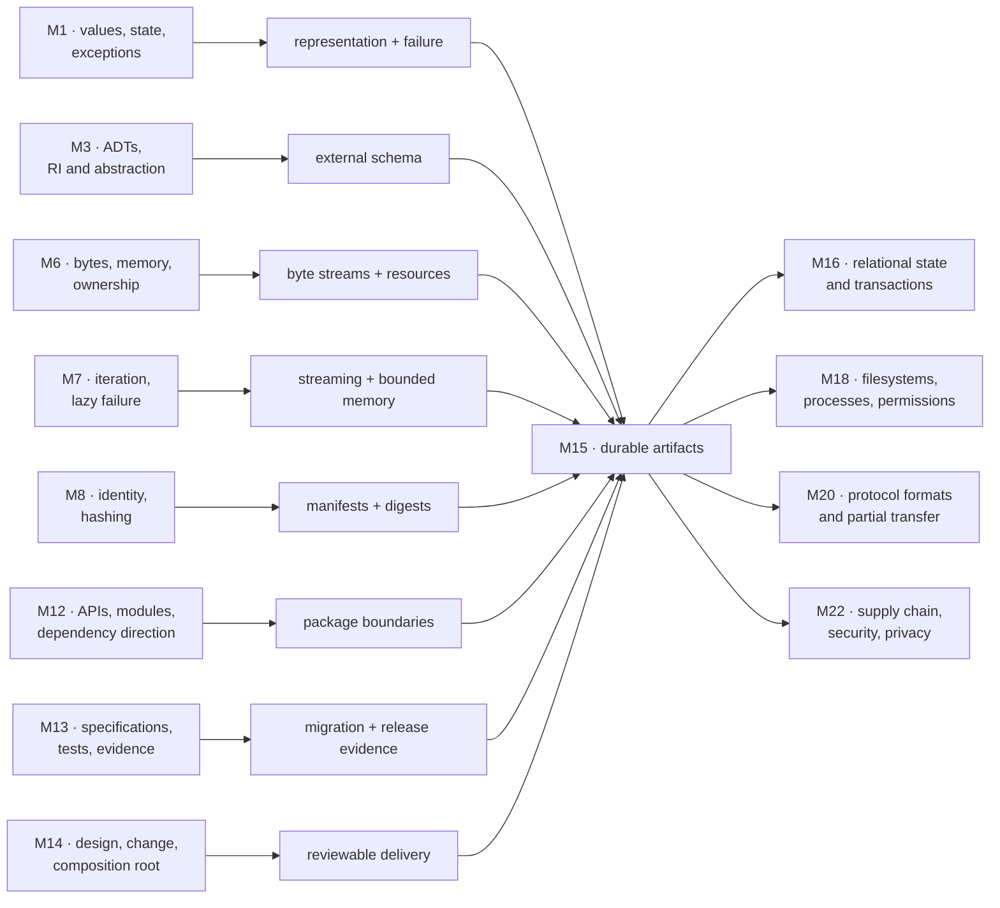

### The problem that forces this module

An early Atlas snapshot writer is short:

```python
import json


def save_snapshot(path, events) -> None:
    with open(path, "w") as stream:
        json.dump([event.__dict__ for event in events], stream)
```

This is useful as a failure map precisely because it appears reasonable.

| Hidden choice | Why it matters later |
|---|---|
| platform-default encoding | another host may decode different bytes |
| platform newline translation | byte identity may differ from the imagined text |
| `event.__dict__` as schema | a Python refactor silently becomes a data-format change |
| no format identity or version | a reader cannot dispatch, migrate, or reject deliberately |
| direct truncating write | failure can destroy the last valid snapshot |
| no size, shape, or domain validation | valid JSON can exhaust resources or create invalid events |
| no integrity record | accidental or adversarial alteration is harder to distinguish |
| no CLI contract | shell users and scripts inherit accidental output/errors |
| no distribution metadata | another environment cannot reliably install or invoke Atlas |
| no release record | “worked here” cannot be reproduced, audited, or rolled back |

The repair is not “call a better JSON function.” We must derive a durable boundary record.

### Module question

> How can Atlas turn learning events and executable behavior into explicitly versioned, bounded, inspectable artifacts that can cross process and installation boundaries while preserving earlier contracts and naming every remaining platform and trust assumption?

### Atlas checkpoint

Build and inspect one **versioned learning-event bundle plus installable CLI**:

- a single-file `.atlas.json` bundle whose schema is independent of Python class layout;
- explicit strict UTF-8 and deterministic JSON bytes for the same ordered logical value under the pinned serializer policy;
- an embedded manifest containing format identity, schema version, event count, and a SHA-256 digest of the exact canonical event payload;
- layered byte, grammar, schema, manifest, and domain validation with resource limits;
- one pure v0 → v1 migration and explicit rejection of unknown versions;
- write-temp, flush, file-sync, and replace behavior with a failure timeline and bounded platform claim;
- `atlas-bundle inspect` and `atlas-bundle migrate` CLI contracts with stable exit categories and separate human/machine output;
- standardized `pyproject.toml`, source distribution, wheel, and console entry point;
- artifact inventory, metadata inspection, external digest, clean-environment installation, and CLI evidence;
- a release/rollback record that does not require publishing to public PyPI.

The bundle is a **single file** so one local publish can use one replacement boundary. It is not a database and does not solve concurrent multi-record transactions; that pressure deliberately hands forward to Module 16.

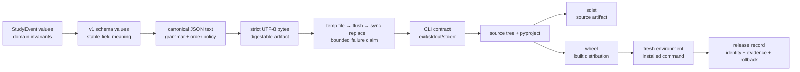

### Backward connections

| Earlier module | Retrieved invariant | Module 15 use |
|---|---|---|
| Module 1 | values are not names; state transitions can fail between steps | distinguish logical events from filenames and trace partial updates |
| Module 3 | representation invariant and abstraction function | keep durable schema independent of dataclass layout |
| Module 5 | claims need a cost model and scoped evidence | bound bytes, records, memory, I/O, build, install, and verification claims |
| Module 6 | strings, bytes, ownership, and copies are different representations | trace exact encode/decode and buffering boundaries |
| Module 7 | lazy streams can fail after partial progress | state whether earlier records escaped and where materialization occurs |
| Module 8 | equality, hashing, and authoritative versus derived state | use digests as derived identity evidence, not source truth |
| Module 10 | paths and migration routes are graphs with edge meaning | reason about schema-version paths and dependency graphs |
| Module 12 | import package, public API, plugin discovery, and trust are distinct | separate distribution identity, import name, CLI entry point, and executable loading |
| Module 13 | specification precedes tests; evidence is finite and scoped | design corrupt/golden/migration/clean-install evidence |
| Module 14 | plan state machine, composition root, coherent changes, and review | add a versioned bundle/CLI at outer boundaries and release in reviewable steps |

### Capabilities unlocked

- Module 16 can introduce `ImportValidatedBundle`, `EventRepository`, and a transactional SQLite adapter without coupling planning to storage.
- Module 17 can explain where encoding, hashing, compression, and I/O execute.
- Module 18 can widen the file model to descriptors, page cache, filesystem, permissions, sync, and crash recovery.
- Module 20 can reuse byte framing, schema evolution, compatibility, and untrusted-input limits for network protocols.
- Module 21 can widen one-process publish into cancellation, retry, duplication, and partial-distribution problems.
- Module 22 can complete archive, dependency, publisher, credential, and personal-data threat models.
- Module 26 can produce release evidence instead of a source-only capstone.

---

## 2. Prerequisite retrieval

Answer before opening code or tools. Record both an answer and confidence from 1–4.

### Retrieval A — value versus representation

Can the same `StudyEvent` logical value have more than one valid byte representation? Name two choices that could change the bytes without changing the intended event.

### Retrieval B — representation independence

Why is serializing `event.__dict__` a coupling decision rather than a neutral shortcut?

### Retrieval C — iterator failure

If an exporter writes each event immediately and the source iterator fails after three yields, what is already observable? Which stronger boundary would be needed for all-or-nothing publication?

### Retrieval D — finite evidence

What does “the migration test passed one golden fixture” establish, and what universal statement remains unproved?

### Retrieval E — dependency direction

Should the domain `StudyEvent` import `json`, `pathlib`, `argparse`, or a build backend? Where should those mechanisms live?

### Retrieval F — identity and digests

If two files have the same SHA-256 digest, what operational conclusion is reasonable under a stated threat model? What does the digest not say about correctness or publisher intent?

### Retrieval G — state machine

Name the legal states for a release candidate before it becomes the promoted artifact. Why is “built” not equivalent to “verified”?

### Retrieval H — evidence boundary

Why does running `python -m atlas` from a source checkout fail to establish that the console command in a wheel works after installation?

<details>
<summary>Reveal the prerequisite model and repair routes</summary>

- **A:** the same value can differ in key order, whitespace, number spelling, Unicode encoding choices, or newline representation. Module 6 repairs confusion between value and bytes.
- **B:** `__dict__` exposes field names, nested object layout, and representation changes as external promises. Module 3 repairs confusion between an abstraction and its current representation.
- **C:** the file may already contain a prefix. All-or-nothing visibility needs buffering/staging plus a commit/replacement boundary, or later a transaction. Module 7 repairs assumptions that generator failure rolls back effects.
- **D:** it is evidence for that input, code, and environment. It does not prove every valid old file migrates correctly or every invalid file is rejected. Module 13 repairs test-as-proof thinking.
- **E:** domain values own meaning and local invariants. JSON/path/CLI/build mechanisms belong in outer adapters and release tooling, chosen at the composition/release boundary. Modules 12–14 repair reversed dependencies.
- **F:** matching a trusted expected digest is strong evidence of byte identity, subject to the algorithm/threat assumptions. It does not establish benevolence, semantic validity, authorship, or freedom from vulnerabilities. Module 8 repairs hash-as-truth reasoning.
- **G:** a useful path is proposed → built → inspected → installed in a fresh environment → contract-tested → approved → promoted. Each transition needs evidence. Module 14 repairs label-only state machines.
- **H:** the checkout changes import paths and may expose undeclared files/dependencies. Only the installed artifact exercises wheel contents, metadata, entry-point generation, and target environment resolution.

</details>

If four or more answers are weak, pause for targeted repair. The new module should widen a stable model, not conceal a missing one.

---

## 3. Mastery outcomes

By the end, Michael can:

1. trace `StudyEvent` → schema value → JSON text → UTF-8 bytes → filesystem artifact and reverse the trace;
2. distinguish Unicode code points, encodings, decoding errors, normalization, and visual similarity;
3. choose explicit newline and text/binary I/O policies and state their portability scope;
4. read `pathlib` code while separating lexical paths, resolved locations, permissions, and race-prone filesystem state;
5. explain enter/exit protocol flow and why context management establishes cleanup attempts rather than atomicity or durability;
6. compare eager and streaming I/O by time, memory, handle lifetime, and partial-failure behavior;
7. distinguish serialization from persistence, recovery, backup, and transactional storage;
8. compare JSON, CSV, and pickle by data model, interoperability, schema, resource, and trust boundary;
9. layer byte, grammar, schema, manifest, and domain validation without collapsing them;
10. design version dispatch, pure migration, backward compatibility, and explicit unsupported-version failure;
11. distinguish backward-reader compatibility, forward-reader compatibility, and round-trip preservation;
12. reason through write-temp/flush/sync/replace interruption points without claiming universal crash durability;
13. explain why a checksum supports integrity/identity evidence but not authenticity, safety, or semantic correctness;
14. review archive handling for path traversal, links, duplicate names, decompression, and resource exhaustion;
15. recover distribution architecture from `pyproject.toml`, sdist/wheel members, metadata, and installed entry points;
16. distinguish import package, distribution project, module, executable command, and environment;
17. distinguish build frontend, build backend, installer, resolver, package index, and runtime;
18. compare dependency requirement specifiers, constraints, environment snapshots, and lock artifacts without inventing a universal standard;
19. inspect `METADATA`, `WHEEL`, `RECORD`, and entry-point metadata and make bounded compatibility predictions;
20. use a virtual environment as dependency isolation while naming what it does not isolate;
21. build and install in a clean environment and record exact tools/platforms as scoped evidence;
22. treat semantic versioning as a compatibility communication policy, not a proof that consumers are safe;
23. design release permissions, provenance, promotion, verification, and code/data rollback as distinct decisions;
24. direct an agent through a bounded packaging/migration task, inspect its diff and artifacts, and independently verify acceptance.

---

## 4. First principle: a durable artifact is an explicit boundary record

Inside one process, many facts are implicit:

- the object’s class supplies field names;
- the interpreter already knows how references connect objects;
- the active code version knows current invariants;
- open resources exist in process state;
- imports happen from the developer’s current environment;
- failures may be visible in a debugger.

Across process exit, another machine, or a later release, those facts disappear. An artifact must carry or reference enough information for a new consumer to interpret it.

### 4.1 The boundary record

For any durable artifact, fill in this record before selecting a library:

| Question | Atlas bundle answer | Atlas wheel answer |
|---|---|---|
| logical identity | ordered learning-event bundle | `atlas-learning-cli` distribution release |
| byte/container grammar | strict UTF-8 JSON | wheel ZIP structure |
| semantic schema | Atlas bundle schema v1 | core metadata + installed file layout |
| version | `schema_version: 1` | project version, metadata version, wheel version |
| compatibility envelope | reader supports v0 migration and v1 load | `Requires-Python`, dependency markers, wheel tags |
| limits | maximum bytes, events, and field lengths | installer/platform policy and dependency limits |
| integrity evidence | manifest payload digest + external artifact digest | `RECORD` plus external release digest/provenance |
| trust decision | caller-selected local input under explicit policy | publisher, index, build, dependency, installer, and runtime trust |
| failure semantics | reject, migrate, or publish by replacement | build/install/promote failure; no silent artifact substitution |
| recovery/rollback | old file remains before successful replace; backups are separate | previous verified artifact plus data-compatibility plan |
| evidence | corrupt/golden/migration/failure-injection tests | inventory, metadata, clean install, CLI and digest records |

The rows are obligations, not decorations. If “version” or “trust” is blank, the system still has a policy—it is merely accidental.

### 4.2 Boundary expansion

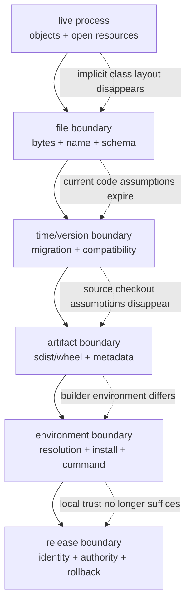

Each outer layer preserves earlier meaning while adding a wider fault model. Packaging does not repair a wrong schema. Provenance does not repair a wrong algorithm. A release record does not make an unsafe parser safe.

### 4.3 Serialization is not persistence

**Serialization** maps a logical value to an external representation and back under a format contract.

**Persistence** arranges for that representation to outlive a process and remain locatable.

**Atomic publication** controls whether observers see an old complete version or a new complete version rather than an intermediate one.

**Crash durability** asks which completed writes survive process, OS, power, controller, and storage failures under named assumptions.

**Recovery** restores or selects a usable state after failure.

**Backup** retains an independent recoverable copy under its own threat and retention policy.

**Transaction** groups related state changes under atomicity/isolation/durability rules. A single replaced bundle is not a general transaction manager.

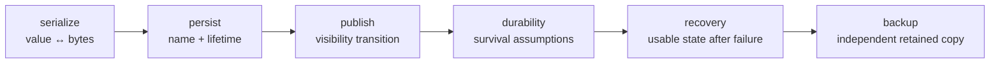

The arrows are conceptual dependencies, not an assurance that doing the left step automatically supplies the right one.

### 4.4 Prediction before mechanism

Predict whether each statement is justified:

1. “`json.dumps(x)` returned, so `x` is durable.”
2. “The file was closed, so the old bundle is recoverable.”
3. “The manifest digest matches, so the publisher is trusted.”
4. “The wheel installed, so Atlas’s data migration is safe.”

All four are unjustified. Each observation belongs to a narrower layer than the conclusion.

---

## 5. Text becomes bytes only through an encoding

Plain language:

> A Python string models text. A file carries bytes. An encoding is the agreed conversion between them.

More precisely:

- a Python `str` is a sequence of Unicode code points;
- an encoding maps code points to one or more bytes;
- decoding applies the reverse mapping to byte sequences that are valid under that codec;
- an error policy decides what happens when the mapping is impossible;
- Unicode normalization can map some canonically equivalent sequences to a chosen form, but normalization is an application decision, not automatic identity;
- visual appearance is not a reliable equality or security rule.

### 5.1 One value, several representations

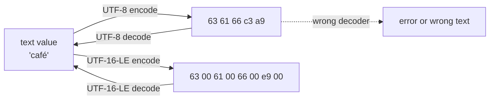

The text value does not “contain UTF-8.” UTF-8 is one representation chosen at a boundary.

### 5.2 Predict before execution

```python
composed = "café"
decomposed = "cafe\u0301"

utf8 = composed.encode("utf-8", errors="strict")
round_trip = utf8.decode("utf-8", errors="strict")

print(composed == decomposed)
print(round_trip == composed)
print(len(composed), len(utf8))
```

Predict:

- equality is `False` because the code-point sequences differ;
- the named UTF-8 round trip returns the same text value;
- character count and byte count differ.

Normalization can be appropriate when Atlas’s identity policy says canonically equivalent concept labels should compare together:

```python
from unicodedata import normalize


def canonical_label(text: str) -> str:
    return normalize("NFC", text).strip()
```

This is **[ATLAS POLICY]**, not a universal rule. Usernames, cryptographic material, programming-language identifiers, and human prose may require different policies. Normalization does not defeat visually confusable characters.

### 5.3 The seductive default

```python
# Broken as a portable durable-format policy: encoding is implicit.
with open("events.json", "w") as stream:
    stream.write('{"concept":"café"}')
```

The code can succeed. The defect is that the artifact contract never says which encoding another consumer should use.

```python
from pathlib import Path


def read_utf8_text(path: Path, max_bytes: int) -> str:
    raw = path.read_bytes()
    if len(raw) > max_bytes:
        raise ValueError("artifact exceeds byte limit")
    return raw.decode("utf-8", errors="strict")
```

The explicit bytes-first form makes the resource check and codec visible. `Path.read_text(encoding="utf-8")` is also valid when the file-size policy is enforced by another appropriate mechanism.

### 5.4 Newlines are representation policy too

Text I/O may translate newline sequences depending on the `newline` argument and platform. Choose based on the artifact:

| Use | Useful policy | Why |
|---|---|---|
| canonical JSON bytes | construct JSON text, append exactly `"\n"` if required, encode UTF-8, write binary | byte representation is explicit |
| platform-facing human text | text mode with named encoding and documented newline policy | native conventions may be intended |
| CSV with Python `csv` | open text stream with `newline=""` and let the `csv` module manage record newlines | avoids a second newline translation layer |
| compare external bytes | binary mode | text translation would hide the observed representation |

“Newlines do not matter” is false whenever digests, reproducible bytes, line numbers, shell tools, or cross-platform exchange matter.

### 5.5 Path value, location, and authority

A path object is a value describing a path according to lexical/platform rules. It is not proof that:

- the target exists;
- it is a regular file;
- it stays inside an allowed directory after symlink resolution;
- the caller has permission;
- the target will not change between check and use;
- two spellings identify different underlying files;
- replacement will succeed.

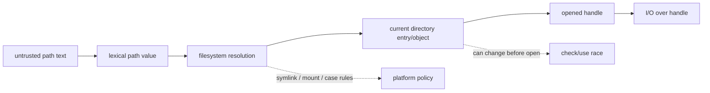

For the first Atlas CLI, the destination path is selected by the local operator. Import formats do not get to choose arbitrary output paths. Archive member names are treated as untrusted metadata and never joined blindly to a destination.

### 5.6 Cost model

Let `b` be input bytes and `c` decoded code points.

- decoding/encoding is generally `Θ(b + c)` work under the chosen codec model;
- reading an entire file retains `Θ(b)` bytes plus decoded text, potentially more than one full representation;
- streaming can reduce peak retained data, but increases resource lifetime and exposes partial-progress semantics;
- normalization is additional `Θ(c)`-scale work and may allocate another string;
- filesystem lookup cost and caching are platform mechanisms, not implied by `Path` syntax.

---

## 6. Streams, resources, and context managers

A file object is both:

1. a Python object with methods and buffering state;
2. a handle to an external resource whose lifetime and failures are not governed by garbage collection alone.

### 6.1 Capability layers

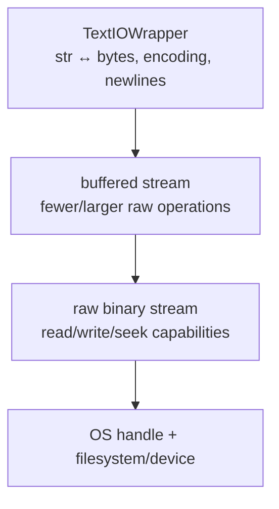

The exact stack depends on how the stream is opened. A stream can be readable but not writable, non-seekable, buffered, line-buffered, or closed. Code should depend on the capabilities it needs, not an imagined universal “file.”

### 6.2 Enter and exit are control-flow hooks

**[PYTHON 3.14 GUARANTEE]** A context manager implements an enter/exit protocol. If `__enter__` succeeds, Python calls `__exit__` when control leaves the `with` suite through normal completion, return, or exception. `__exit__` can suppress an exception by returning a truthy value.

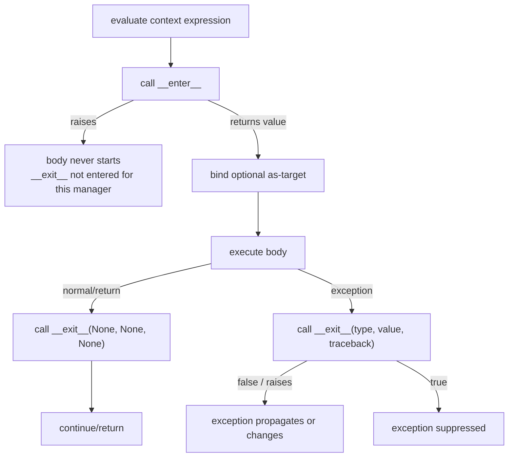

A file context manager normally attempts to close the stream. That does not establish:

- that buffered data reached storage;
- that close succeeded;
- that observers never saw a prefix;
- that another file changed with it;
- that a power loss preserves the new bytes;
- that the directory entry survives;
- that a backup exists.

### 6.3 Broken exception suppression

```python
class SwallowEverything:
    def __enter__(self) -> "SwallowEverything":
        return self

    def __exit__(self, exc_type, exc, traceback) -> bool:
        return True  # broken policy: hides every body failure


with SwallowEverything():
    raise RuntimeError("publish failed")
```

The code “finishes” only because failure evidence was destroyed. Resource abstractions should suppress only exceptions explicitly owned by their contract.

### 6.4 A generator can extend resource lifetime

```python
from collections.abc import Iterator
from pathlib import Path


def lines(path: Path) -> Iterator[str]:
    with path.open("r", encoding="utf-8", newline="") as stream:
        for line in stream:
            yield line
```

Prediction:

- calling `lines(path)` alone does not enter the `with`;
- first iteration opens the file;
- the handle normally remains open while the generator is suspended;
- exhaustion or generator close resumes control so the context can exit;
- abandoning a still-referenced generator makes prompt release a caller/lifetime concern.

This may be the right design for bounded memory, but the lifetime must be part of the contract. A callback that consumes inside the context or an explicit context-managed iterator can make ownership clearer.

### 6.5 Streaming versus materialization

| Property | stream records | materialize records |
|---|---|---|
| peak retained event memory | potentially bounded | `Θ(n)` events |
| first-result latency | low | waits for full read |
| source handle lifetime | longer | can close after full read |
| late failure | earlier results/effects may escape | caller can receive nothing until validation completes |
| repeated traversal | reopen/cache required | available from memory |
| all-or-nothing publish | needs staging/transaction | easier for bounded input |

**[ATLAS POLICY]** Module 15 limits bundle size and materializes a bounded event tuple before publish. This makes whole-bundle validation and one-file replacement easy to reason about. It does not claim to scale to unbounded histories.

### 6.6 A context manager is not a transaction

```python
# Broken as all-or-nothing publication.
with open("events.jsonl", "w", encoding="utf-8", newline="\n") as stream:
    for event in source:
        stream.write(encode_event(event))
        stream.write("\n")
```

If `source` raises after several values, a visible prefix may remain. A `with` manages the stream lifetime; it does not undo emitted bytes. This is the same Module 7 partial-yield model at an I/O boundary.

### 6.7 CPython source-reading target

Bound the reading:

1. read the public `contextlib.contextmanager` contract;
2. read `_GeneratorContextManager.__enter__` and `__exit__` in the CPython tag matching the course runtime;
3. draw normal body return, body exception, generator failure, and suppression;
4. stop before async utilities and `ExitStack`;
5. label specified behavior separately from implementation observations.

The goal is control-flow recovery, not memorizing `contextlib.py`.

---

## 7. Serialization chooses a data model; persistence adds time and failure

### 7.1 Compare formats by the value they can honestly express

| Format/mechanism | Natural value model | Strength | Main boundary risk |
|---|---|---|---|
| JSON | object, array, string, number, boolean, null | interoperable text and inspectable structure | no application schema; duplicate names/number limits/resource limits need policy |
| CSV | records represented as rows/fields under a dialect | broad tabular exchange | types, headers, dialect, embedded newlines, nulls, and formulas are policy |
| TOML | configuration-oriented tables and scalar/array values | human-edited configuration | not a general arbitrary-object serializer; writing is not in stdlib `tomllib` |
| pickle | Python-specific object reconstruction graph | preserves many Python object forms | unpickling untrusted/tamperable data can execute arbitrary code |
| custom binary | application-defined | compactness or exact capabilities | every framing/schema/compatibility/security rule becomes yours |

No choice removes the need to define:

- accepted grammar and size;
- schema and domain invariants;
- version and migration;
- error vocabulary;
- ordering and duplicate policy;
- trust and resource limits;
- persistence/recovery behavior.

### 7.2 JSON has at least four validation layers

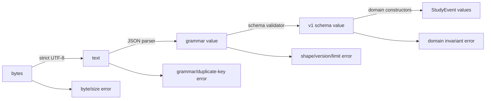

Valid JSON such as `{"schema_version":1,"events":"many"}` can fail the Atlas schema. Schema-valid data can still fail a domain invariant such as confidence in `[0,1]`.

### 7.3 JSON defaults need policy review

Python’s `json` module is a mechanism, not the Atlas contract. Review choices including:

- `ensure_ascii`;
- key ordering and separators;
- nonfinite float handling;
- duplicate object-name handling;
- integer/float size and conversion;
- maximum input bytes, records, nesting, and field lengths;
- exact allowed/required keys;
- whether unknown fields are rejected or preserved;
- whether order has semantic meaning.

For deterministic Atlas v1 bytes under the pinned policy:

```python
import json


def canonical_json_bytes(value: object) -> bytes:
    text = json.dumps(
        value,
        ensure_ascii=False,
        allow_nan=False,
        sort_keys=True,
        separators=(",", ":"),
    )
    return (text + "\n").encode("utf-8", errors="strict")
```

This gives deterministic bytes for the same supported Python value under this encoder configuration. It is not a claim of compliance with a general canonical-JSON standard or identical floating-point formatting across every implementation/version.

### 7.4 CSV is a schema negotiation, not “just commas”

Questions a CSV contract must answer:

- delimiter, quoting, escape, record terminator, and encoding;
- whether a header exists and whether order matters;
- how empty string, missing field, and null differ;
- how booleans, timestamps, and numbers are represented;
- whether extra columns are rejected or preserved;
- record and field size limits;
- how spreadsheet consumers handle cells beginning with `=`, `+`, `-`, or `@`.

When using Python’s `csv` module, open text files with `newline=""` as its documentation directs so the module controls newline handling. Exporting to spreadsheet software creates a separate formula-injection boundary; quoting a CSV field is not necessarily enough to make the spreadsheet interpret it as inert text.

### 7.5 Pickle is executable reconstruction

Never call `pickle.loads()` on supplied demonstration bytes in this module.

**[PYTHON 3.14 GUARANTEE / SECURITY BOUNDARY]** The official `pickle` documentation warns that unpickling untrusted data is unsafe because malicious data can execute arbitrary code.

Encryption or authenticated transport does not change the format’s capability. It may change who can tamper with or supply the bytes. A design may use pickle only when:

1. producer and artifact integrity are trusted under an explicit model;
2. Python-specific coupling and version behavior are acceptable;
3. code-execution capability is acceptable;
4. simpler data-only formats are inadequate;
5. compromise of the producer/build/storage path is considered.

Atlas’s portable learning bundle does not meet a need that justifies pickle.

### 7.6 Checksums and manifests

A cryptographic digest is a function:

\[
H : \{0,1\}^{*} \rightarrow \{0,1\}^{k}
\]

It maps arbitrary byte strings to fixed-size outputs. Atlas records SHA-256 of the exact canonical event payload bytes.

What a matching expected digest supports:

- the observed bytes match the bytes associated with that expected digest, under the algorithm’s collision/implementation assumptions;
- accidental corruption is likely to be detected;
- a release record can refer unambiguously to an artifact.

What it does not support by itself:

- who supplied the expected digest;
- that the bytes are safe;
- that the schema meaning is correct;
- that dependencies are safe;
- that two semantically equivalent but differently encoded values match;
- that the artifact remained available.

The expected digest needs its own authenticated/provenance channel if adversaries matter.

### 7.7 Archive extraction is filesystem authority

Archive members can carry:

- absolute or parent-traversal names;
- platform-specific separators or drive syntax;
- duplicate names;
- symbolic/hard links;
- special-file metadata;
- misleading declared sizes or extreme compression ratios;
- enough entries or expanded bytes to exhaust resources;
- overwrites of existing targets.

Prefer the current library’s documented safe extraction controls for the pinned Python version, but still define an application allowlist and limits. For an Atlas artifact that expects only `manifest.json` and `events.jsonl`, a safer pattern is:

1. locate exactly one allowed member by exact logical name;
2. reject duplicates and unexpected members;
3. reject directories/links/special types as appropriate;
4. stream at most the declared application limit;
5. write to a caller-chosen destination name rather than trusting the member path;
6. keep all experiments inside a disposable directory.

Do not copy an old “safe join” snippet and claim archive safety. Symlinks, path semantics, library changes, and check/use races widen the model.

---

## 8. Schema versions turn time into an explicit input

A schema is the set of external values and relationships a consumer accepts. It is not:

- the current dataclass fields;
- whatever `json.loads()` returns;
- a type annotation by itself;
- an example document;
- a version number without field rules;
- a migration script without source/target contracts.

### 8.1 Atlas bundle v1

The v1 logical shape is:

```text
{
  "format": "atlas.learning-events",
  "schema_version": 1,
  "manifest": {
    "event_count": <nonnegative integer>,
    "events_sha256": <64 lowercase hexadecimal characters>
  },
  "events": [
    {
      "event_id": <bounded nonblank string>,
      "concept_id": <bounded nonblank string>,
      "confidence": <finite JSON number in [0,1]>
    },
    ...
  ]
}
```

Additional **[ATLAS POLICY]**:

- root, manifest, and event objects have exactly the documented keys;
- duplicate JSON object names are rejected before schema validation;
- event order is semantic and preserved;
- at most the configured number of events and bytes are accepted;
- canonical payload bytes use sorted object keys, compact separators, strict UTF-8, no nonfinite numbers, and no trailing newline;
- canonical whole-bundle bytes use the same policy plus exactly one final line feed;
- `events_sha256` is computed over the exact canonical event-array payload, not the whole self-referential bundle;
- v1 readers validate the digest before returning domain values.

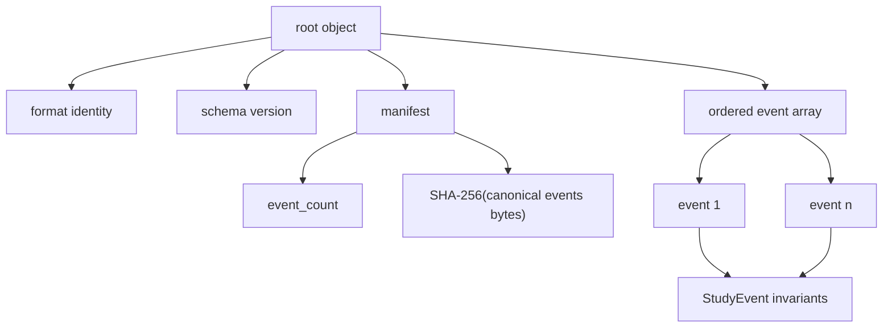

The manifest is deterministic for the same ordered domain values under the pinned encoder policy because it contains no clock, random ID, host path, or tool-specific environment detail. Release-time provenance belongs in the external evidence record, where nondeterministic facts can be named honestly.

### 8.2 Version dispatch precedes interpretation

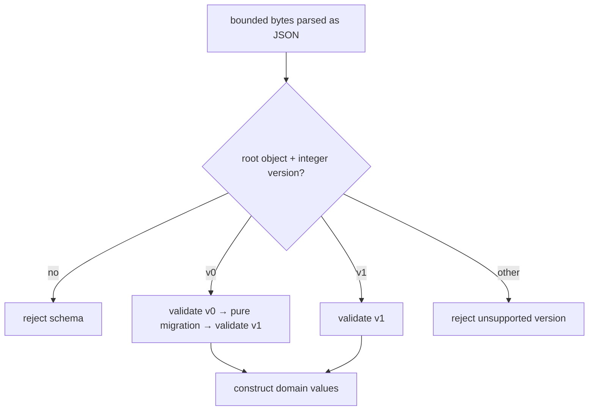

Do not “try the newest parser, then fall back until something works.” That can reinterpret malformed new data as valid old data. Version dispatch should be explicit and unknown versions should fail closed unless the format deliberately specifies another behavior.

### 8.3 Backward and forward compatibility are directional

Let \(R_i\) be a reader released with schema knowledge \(i\), and \(W_j\) a writer producing version \(j\).

| Direction | Question | Atlas v1 policy |
|---|---|---|
| backward reader compatibility | Can newer `R1` read older `W0` output? | yes, through one explicit v0 → v1 migration |
| forward reader compatibility | Can older `R0` read newer `W1` output? | not promised |
| current round trip | Does `R1(W1(x)) = x` for supported logical values? | required modulo the documented normalized float representation |
| unknown-version preservation | Can a reader preserve fields it does not understand? | not promised; exact-key validation rejects them |
| downgrade | Can v1 data be written safely as v0? | not supplied; information/range loss would require a separate contract |

Compatibility is a relation among a producer, consumer, artifact, and observation—not a property of the version number alone.

### 8.4 Pure migrations narrow the proof obligation

The course’s v0 shape uses:

```text
{
  "schema_version": 0,
  "items": [
    {"id": "...", "topic": "...", "score": 0..100}
  ]
}
```

The migration:

- accepts an already parsed v0 value;
- validates exact v0 shape and bounded values;
- maps `id → event_id`, `topic → concept_id`, and `score / 100 → confidence`;
- preserves item order;
- creates a new v1 value and manifest;
- performs no file I/O;
- does not mutate the input;
- rejects rather than guesses missing or extra meaning.

Its correctness argument can therefore focus on a deterministic value transformation. Reading, replacement, permissions, and rollback remain separate boundaries.

### 8.5 Migration graph, not migration wish

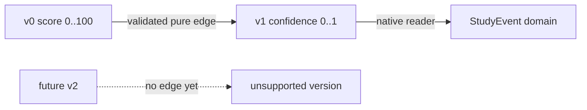

As versions grow, define supported paths deliberately:

- sequential `v0 → v1 → v2`;
- direct `v0 → v2`;
- reader-per-version into one current domain model.

Each strategy changes retained code, test fixtures, information-loss risk, and failure localization. A version integer does not create the edges.

### 8.6 Golden files are evidence, not authority

A useful fixture set includes:

- smallest legal v1;
- representative Unicode v1;
- legal v0 requiring migration;
- unknown version;
- truncated JSON;
- invalid UTF-8;
- duplicate object key;
- extra/missing field;
- boolean where a number is expected;
- `NaN`/infinity text;
- too many events/oversized field;
- manifest count mismatch;
- payload digest mismatch.

Golden bytes are reviewed artifacts. Regenerating them automatically during the test that consumes them destroys independence.

---

## 9. Publication is a failure timeline

Direct write:

```text
open target with truncation → write prefix → write remainder → flush/close
```

If failure occurs after truncation and before completion, the last good target may be gone.

The first Atlas replacement protocol is:

```text
encode and validate in memory
→ create temp in target directory
→ write all bytes
→ flush Python buffers
→ request file synchronization
→ close temp
→ replace target name
→ optionally synchronize parent directory where supported/required
→ record success
```

### 9.1 Why the target directory matters

Many replacement primitives require or behave most predictably when source and destination are on the same filesystem. Creating the temporary file in the target directory makes that relationship explicit. It also means the process needs permission to create and replace entries there.

### 9.2 Interruption table

| Interruption point | Intended visible target | Temporary artifact | Remaining uncertainty |
|---|---|---|---|
| before temp creation | old target | none | old target was already valid only if separately verified |
| during temp write | old target | incomplete temp | cleanup may fail; temp must never be treated as committed |
| after flush, before file sync | old target | complete process-visible temp | storage survival not established |
| after file sync, before replace | old target | synced temp under assumptions | directory entry not promoted |
| during/failed replace | platform-specific failure result; verify old/new | temp may remain | permissions, open handles, antivirus, filesystem rules |
| after replace, before directory sync | new name process-visible | normally moved | crash survival of directory update remains platform/filesystem-specific |
| after recorded completion | new target | none expected | hardware/filesystem/backup assumptions still bound durability |

### 9.3 Narrow claim for the reference

The runnable model:

- writes a single bounded file;
- creates a temporary file in the existing target directory;
- flushes and calls `os.fsync()` on that temporary file;
- calls injected `os.replace()` after the temp is closed;
- attempts to remove an unpromoted temp after failure;
- preserves the old target in the injected pre-replace failure test;
- records no universal guarantee about crashes, directory persistence, network filesystems, simultaneous writers, symlink races, or hostile local users.

This is stronger than direct truncation and weaker than a transactional storage guarantee.

### 9.4 Replacement is not multi-writer coordination

Two processes can both:

1. read old version A;
2. derive different B and C;
3. safely replace A;
4. leave whichever replacement happens last.

Each file can be complete while one update is lost. Add a generation/precondition check, a lock under a named model, or a transactional repository depending on the operation. Module 16 introduces the database transaction model; Modules 18–19 deepen filesystem and concurrency mechanics.

### 9.5 Resource and system costs

For a bounded bundle of `b` bytes and `n` events:

- materializing domain values is `Θ(n)` retained objects;
- canonical encoding is `Θ(b)`-scale work and retains output bytes;
- digesting the payload is `Θ(payload bytes)`;
- writing the temp and reading later each transfer `Θ(b)` bytes through the I/O stack;
- file synchronization can dominate latency and depends on storage/platform;
- replacement is a namespace operation whose cost/guarantees are not described by asymptotic notation alone;
- keeping old/new/backups multiplies storage and operational work;
- concurrent coordination introduces waiting, contention, or conflict handling.

“Atomic” does not mean “free.”

---

## 10. Runnable Atlas bundle, CLI core, and adversarial checks

The reference is deliberately standard-library-only. It demonstrates the mechanism without requiring a public package index, network, destructive system operation, or real crash.

It includes:

- immutable validated `StudyEvent` values;
- strict, bounded JSON parsing with duplicate-key and nonfinite-number rejection;
- deterministic v1 encoding and manifest verification;
- pure v0 → v1 migration;
- a single-file atomic-replacement model with injected failure;
- an exact-name, bounded ZIP reader that never extracts member paths;
- `inspect` and `migrate` CLI core behavior;
- success, corruption, tampering, resource, migration, archive, replacement, and CLI tests.

```python
# RUNNABLE-REFERENCE-START
from __future__ import annotations

import argparse
import copy
import hashlib
import io
import json
import os
from collections.abc import Callable, Sequence
from dataclasses import dataclass
from math import isfinite
from pathlib import Path
import sys
import tempfile
from typing import TextIO
import unittest
import zipfile


FORMAT_ID = "atlas.learning-events"
CURRENT_SCHEMA_VERSION = 1
MAX_BUNDLE_BYTES = 1_000_000
MAX_EVENTS = 1_000
MAX_ID_CHARS = 200
EXPECTED_ARCHIVE_MEMBERS = frozenset(
    {"manifest.json", "events.jsonl"}
)


class AtlasBundleError(Exception):
    """Base class for expected artifact-boundary failures."""


class BundleTooLargeError(AtlasBundleError):
    pass


class BundleEncodingError(AtlasBundleError):
    pass


class BundleSyntaxError(AtlasBundleError):
    pass


class BundleSchemaError(AtlasBundleError):
    pass


class BundleIntegrityError(AtlasBundleError):
    pass


class UnsupportedSchemaVersionError(AtlasBundleError):
    pass


class AtomicPublishError(AtlasBundleError):
    pass


class ArchivePolicyError(AtlasBundleError):
    pass


@dataclass(frozen=True, slots=True)
class StudyEvent:
    event_id: str
    concept_id: str
    confidence: float

    def __post_init__(self) -> None:
        for field_name, value in (
            ("event_id", self.event_id),
            ("concept_id", self.concept_id),
        ):
            if not isinstance(value, str):
                raise ValueError(f"{field_name} must be a string")
            if not value.strip():
                raise ValueError(f"{field_name} must be nonblank")
            if len(value) > MAX_ID_CHARS:
                raise ValueError(f"{field_name} exceeds character limit")

        if isinstance(self.confidence, bool) or not isinstance(
            self.confidence,
            (int, float),
        ):
            raise ValueError("confidence must be a real number")
        normalized = float(self.confidence)
        if not isfinite(normalized):
            raise ValueError("confidence must be finite")
        if not 0.0 <= normalized <= 1.0:
            raise ValueError("confidence must be between 0 and 1")
        object.__setattr__(self, "confidence", normalized)


def canonical_json_bytes(
    value: object,
    *,
    trailing_newline: bool,
) -> bytes:
    text = json.dumps(
        value,
        ensure_ascii=False,
        allow_nan=False,
        sort_keys=True,
        separators=(",", ":"),
    )
    if trailing_newline:
        text += "\n"
    return text.encode("utf-8", errors="strict")


def event_to_schema(event: StudyEvent) -> dict[str, object]:
    return {
        "event_id": event.event_id,
        "concept_id": event.concept_id,
        "confidence": event.confidence,
    }


def make_v1_value(
    events: Sequence[StudyEvent],
) -> dict[str, object]:
    normalized = tuple(events)
    if len(normalized) > MAX_EVENTS:
        raise BundleTooLargeError("event count exceeds limit")
    rows = [event_to_schema(event) for event in normalized]
    payload = canonical_json_bytes(rows, trailing_newline=False)
    return {
        "format": FORMAT_ID,
        "schema_version": CURRENT_SCHEMA_VERSION,
        "manifest": {
            "event_count": len(rows),
            "events_sha256": hashlib.sha256(payload).hexdigest(),
        },
        "events": rows,
    }


def encode_bundle(events: Sequence[StudyEvent]) -> bytes:
    raw = canonical_json_bytes(
        make_v1_value(events),
        trailing_newline=True,
    )
    if len(raw) > MAX_BUNDLE_BYTES:
        raise BundleTooLargeError("encoded bundle exceeds byte limit")
    return raw


def _unique_object(
    pairs: list[tuple[str, object]],
) -> dict[str, object]:
    result: dict[str, object] = {}
    for key, value in pairs:
        if key in result:
            raise BundleSyntaxError(f"duplicate object key: {key}")
        result[key] = value
    return result


def _bounded_int(raw: str) -> int:
    if len(raw.lstrip("-")) > 20:
        raise BundleSyntaxError("integer token exceeds limit")
    return int(raw)


def _bounded_float(raw: str) -> float:
    if len(raw) > 100:
        raise BundleSyntaxError("float token exceeds limit")
    value = float(raw)
    if not isfinite(value):
        raise BundleSyntaxError("nonfinite JSON number is forbidden")
    return value


def _reject_constant(raw: str) -> object:
    raise BundleSyntaxError(f"nonstandard JSON constant: {raw}")


def parse_json_bytes(raw: bytes) -> object:
    if len(raw) > MAX_BUNDLE_BYTES:
        raise BundleTooLargeError("bundle exceeds byte limit")
    try:
        text = raw.decode("utf-8", errors="strict")
    except UnicodeDecodeError as error:
        raise BundleEncodingError("bundle is not strict UTF-8") from error

    try:
        return json.loads(
            text,
            object_pairs_hook=_unique_object,
            parse_int=_bounded_int,
            parse_float=_bounded_float,
            parse_constant=_reject_constant,
        )
    except json.JSONDecodeError as error:
        raise BundleSyntaxError(
            f"invalid JSON at line {error.lineno}, column {error.colno}"
        ) from error


def _require_dict(value: object, where: str) -> dict[str, object]:
    if not isinstance(value, dict):
        raise BundleSchemaError(f"{where} must be an object")
    return value


def _require_exact_keys(
    value: dict[str, object],
    keys: set[str],
    where: str,
) -> None:
    actual = set(value)
    if actual != keys:
        missing = sorted(keys - actual)
        extra = sorted(actual - keys)
        raise BundleSchemaError(
            f"{where} key mismatch; missing={missing}, extra={extra}"
        )


def _require_plain_int(value: object, where: str) -> int:
    if isinstance(value, bool) or not isinstance(value, int):
        raise BundleSchemaError(f"{where} must be an integer")
    return value


def _validate_event_row(
    value: object,
    position: int,
) -> StudyEvent:
    row = _require_dict(value, f"events[{position}]")
    _require_exact_keys(
        row,
        {"event_id", "concept_id", "confidence"},
        f"events[{position}]",
    )
    event_id = row["event_id"]
    concept_id = row["concept_id"]
    confidence = row["confidence"]
    try:
        return StudyEvent(
            event_id=event_id,  # type: ignore[arg-type]
            concept_id=concept_id,  # type: ignore[arg-type]
            confidence=confidence,  # type: ignore[arg-type]
        )
    except ValueError as error:
        raise BundleSchemaError(
            f"events[{position}] violates domain schema: {error}"
        ) from error


def validate_v1_value(root_value: object) -> tuple[StudyEvent, ...]:
    root = _require_dict(root_value, "root")
    _require_exact_keys(
        root,
        {"format", "schema_version", "manifest", "events"},
        "root",
    )
    if root["format"] != FORMAT_ID:
        raise BundleSchemaError("unexpected format identity")
    version = _require_plain_int(root["schema_version"], "schema_version")
    if version != CURRENT_SCHEMA_VERSION:
        raise UnsupportedSchemaVersionError(
            f"unsupported schema version: {version}"
        )

    raw_events = root["events"]
    if not isinstance(raw_events, list):
        raise BundleSchemaError("events must be an array")
    if len(raw_events) > MAX_EVENTS:
        raise BundleTooLargeError("event count exceeds limit")
    events = tuple(
        _validate_event_row(row, position)
        for position, row in enumerate(raw_events)
    )

    manifest = _require_dict(root["manifest"], "manifest")
    _require_exact_keys(
        manifest,
        {"event_count", "events_sha256"},
        "manifest",
    )
    event_count = _require_plain_int(
        manifest["event_count"],
        "manifest.event_count",
    )
    if event_count != len(events):
        raise BundleIntegrityError("manifest event count mismatch")
    expected_digest = manifest["events_sha256"]
    if (
        not isinstance(expected_digest, str)
        or len(expected_digest) != 64
        or any(char not in "0123456789abcdef" for char in expected_digest)
    ):
        raise BundleSchemaError(
            "manifest.events_sha256 must be lowercase SHA-256 hex"
        )
    normalized_rows = [event_to_schema(event) for event in events]
    actual_digest = hashlib.sha256(
        canonical_json_bytes(
            normalized_rows,
            trailing_newline=False,
        )
    ).hexdigest()
    if actual_digest != expected_digest:
        raise BundleIntegrityError("event payload digest mismatch")
    return events


def migrate_v0_value(root_value: object) -> dict[str, object]:
    root = _require_dict(root_value, "v0 root")
    _require_exact_keys(root, {"schema_version", "items"}, "v0 root")
    version = _require_plain_int(root["schema_version"], "schema_version")
    if version != 0:
        raise UnsupportedSchemaVersionError(
            f"expected legacy schema 0, received {version}"
        )
    items = root["items"]
    if not isinstance(items, list):
        raise BundleSchemaError("v0 items must be an array")
    if len(items) > MAX_EVENTS:
        raise BundleTooLargeError("v0 item count exceeds limit")

    events: list[StudyEvent] = []
    for position, value in enumerate(items):
        row = _require_dict(value, f"items[{position}]")
        _require_exact_keys(
            row,
            {"id", "topic", "score"},
            f"items[{position}]",
        )
        score = row["score"]
        if isinstance(score, bool) or not isinstance(score, (int, float)):
            raise BundleSchemaError(
                f"items[{position}].score must be numeric"
            )
        score_value = float(score)
        if not isfinite(score_value) or not 0.0 <= score_value <= 100.0:
            raise BundleSchemaError(
                f"items[{position}].score must be finite in [0,100]"
            )
        try:
            events.append(
                StudyEvent(
                    event_id=row["id"],  # type: ignore[arg-type]
                    concept_id=row["topic"],  # type: ignore[arg-type]
                    confidence=score_value / 100.0,
                )
            )
        except ValueError as error:
            raise BundleSchemaError(
                f"items[{position}] violates legacy schema: {error}"
            ) from error
    return make_v1_value(events)


def _schema_version(root_value: object) -> int:
    root = _require_dict(root_value, "root")
    if "schema_version" not in root:
        raise BundleSchemaError("root is missing schema_version")
    return _require_plain_int(root["schema_version"], "schema_version")


def load_bundle_bytes(raw: bytes) -> tuple[StudyEvent, ...]:
    parsed = parse_json_bytes(raw)
    version = _schema_version(parsed)
    if version == 0:
        migrated = migrate_v0_value(parsed)
        return validate_v1_value(migrated)
    if version == CURRENT_SCHEMA_VERSION:
        return validate_v1_value(parsed)
    raise UnsupportedSchemaVersionError(
        f"unsupported schema version: {version}"
    )


def migrate_legacy_bytes(raw: bytes) -> bytes:
    parsed = parse_json_bytes(raw)
    if _schema_version(parsed) != 0:
        raise BundleSchemaError(
            "migrate requires a schema-version-0 source"
        )
    migrated = migrate_v0_value(parsed)
    validate_v1_value(migrated)
    encoded = canonical_json_bytes(migrated, trailing_newline=True)
    if len(encoded) > MAX_BUNDLE_BYTES:
        raise BundleTooLargeError("migrated bundle exceeds byte limit")
    return encoded


def read_limited_file(
    path: Path,
    limit: int = MAX_BUNDLE_BYTES,
) -> bytes:
    with path.open("rb") as stream:
        raw = stream.read(limit + 1)
    if len(raw) > limit:
        raise BundleTooLargeError("file exceeds byte limit")
    return raw


ReplaceFunction = Callable[[str | os.PathLike[str], str | os.PathLike[str]], None]


def atomic_publish_bytes(
    target: Path,
    raw: bytes,
    *,
    replace: ReplaceFunction = os.replace,
) -> None:
    parent = target.parent
    if not parent.is_dir():
        raise AtomicPublishError("target directory does not exist")
    temporary: Path | None = None
    try:
        with tempfile.NamedTemporaryFile(
            mode="wb",
            dir=parent,
            prefix=f".{target.name}.",
            suffix=".tmp",
            delete=False,
        ) as stream:
            temporary = Path(stream.name)
            stream.write(raw)
            stream.flush()
            os.fsync(stream.fileno())
        replace(temporary, target)
        temporary = None
    except OSError as error:
        raise AtomicPublishError(
            f"could not publish {target.name}: {error}"
        ) from error
    finally:
        if temporary is not None:
            try:
                temporary.unlink(missing_ok=True)
            except OSError:
                pass


def publish_bundle(
    target: Path,
    events: Sequence[StudyEvent],
    *,
    replace: ReplaceFunction = os.replace,
) -> str:
    raw = encode_bundle(events)
    atomic_publish_bytes(target, raw, replace=replace)
    return hashlib.sha256(raw).hexdigest()


def read_expected_archive(
    raw_archive: bytes,
    *,
    member_limit: int = 100_000,
) -> dict[str, bytes]:
    if len(raw_archive) > MAX_BUNDLE_BYTES:
        raise ArchivePolicyError("archive container exceeds limit")
    try:
        archive = zipfile.ZipFile(io.BytesIO(raw_archive))
    except zipfile.BadZipFile as error:
        raise ArchivePolicyError("invalid ZIP container") from error

    with archive:
        infos = archive.infolist()
        names = [info.filename for info in infos]
        if len(names) != len(set(names)):
            raise ArchivePolicyError("duplicate archive member name")
        if set(names) != EXPECTED_ARCHIVE_MEMBERS:
            raise ArchivePolicyError(
                "archive members do not match exact allowlist"
            )

        result: dict[str, bytes] = {}
        for info in infos:
            if info.is_dir() or info.flag_bits & 0x1:
                raise ArchivePolicyError(
                    "directories and encrypted members are forbidden"
                )
            if info.file_size > member_limit:
                raise ArchivePolicyError("declared member size exceeds limit")
            with archive.open(info, "r") as member:
                data = member.read(member_limit + 1)
            if len(data) > member_limit:
                raise ArchivePolicyError(
                    "expanded member size exceeds limit"
                )
            result[info.filename] = data
        return result


def _build_parser() -> argparse.ArgumentParser:
    parser = argparse.ArgumentParser(prog="atlas-bundle")
    commands = parser.add_subparsers(dest="command", required=True)

    inspect_parser = commands.add_parser("inspect")
    inspect_parser.add_argument("path", type=Path)
    inspect_parser.add_argument("--json", action="store_true")

    migrate_parser = commands.add_parser("migrate")
    migrate_parser.add_argument("source", type=Path)
    migrate_parser.add_argument("destination", type=Path)
    return parser


def main(
    argv: Sequence[str] | None = None,
    *,
    stdout: TextIO | None = None,
    stderr: TextIO | None = None,
) -> int:
    out = stdout if stdout is not None else sys.stdout
    err = stderr if stderr is not None else sys.stderr
    args = _build_parser().parse_args(argv)

    try:
        if args.command == "inspect":
            raw = read_limited_file(args.path)
            events = load_bundle_bytes(raw)
            summary = {
                "event_count": len(events),
                "format": FORMAT_ID,
                "schema_version": CURRENT_SCHEMA_VERSION,
            }
            if args.json:
                out.write(
                    canonical_json_bytes(
                        summary,
                        trailing_newline=True,
                    ).decode("utf-8")
                )
            else:
                out.write(
                    f"Atlas bundle v1: {len(events)} event(s)\n"
                )
            return 0

        if args.command == "migrate":
            if (
                args.source.resolve(strict=False)
                == args.destination.resolve(strict=False)
            ):
                raise BundleSchemaError(
                    "migration destination must preserve the source"
                )
            raw = read_limited_file(args.source)
            migrated = migrate_legacy_bytes(raw)
            atomic_publish_bytes(args.destination, migrated)
            out.write(
                f"Migrated schema v0 to v1: {args.destination.name}\n"
            )
            return 0

        raise AssertionError("argparse allowed an unknown command")
    except AtlasBundleError as error:
        err.write(f"atlas-bundle: invalid artifact: {error}\n")
        return 3
    except OSError as error:
        err.write(f"atlas-bundle: I/O failure: {error}\n")
        return 4


class Module15ReferenceTests(unittest.TestCase):
    def setUp(self) -> None:
        self.events = (
            StudyEvent("e1", "hashing", 0.8),
            StudyEvent("é-2", "trees", 0.25),
        )

    def test_deterministic_round_trip_and_manifest(self) -> None:
        first = encode_bundle(self.events)
        second = encode_bundle(tuple(self.events))
        self.assertEqual(first, second)
        self.assertTrue(first.endswith(b"\n"))
        self.assertNotIn(b"\r\n", first)
        self.assertEqual(load_bundle_bytes(first), self.events)

        root = parse_json_bytes(first)
        validated = validate_v1_value(root)
        self.assertEqual(validated, self.events)

    def test_layered_rejection(self) -> None:
        with self.assertRaises(BundleEncodingError):
            load_bundle_bytes(b"\xff")

        duplicate_keys = (
            b'{"schema_version":1,"schema_version":1}'
        )
        with self.assertRaises(BundleSyntaxError):
            load_bundle_bytes(duplicate_keys)

        with self.assertRaises(BundleSyntaxError):
            load_bundle_bytes(
                b'{"schema_version":1,"confidence":NaN}'
            )

        with self.assertRaises(BundleTooLargeError):
            load_bundle_bytes(b" " * (MAX_BUNDLE_BYTES + 1))

        unknown = canonical_json_bytes(
            {"schema_version": 99},
            trailing_newline=True,
        )
        with self.assertRaises(UnsupportedSchemaVersionError):
            load_bundle_bytes(unknown)

    def test_manifest_detects_tampering(self) -> None:
        root = parse_json_bytes(encode_bundle(self.events))
        self.assertIsInstance(root, dict)
        assert isinstance(root, dict)
        rows = root["events"]
        assert isinstance(rows, list)
        first = rows[0]
        assert isinstance(first, dict)
        first["concept_id"] = "changed"
        tampered = canonical_json_bytes(root, trailing_newline=True)
        with self.assertRaises(BundleIntegrityError):
            load_bundle_bytes(tampered)

    def test_schema_rejects_boolean_confidence(self) -> None:
        root = make_v1_value(self.events)
        rows = root["events"]
        assert isinstance(rows, list)
        row = rows[0]
        assert isinstance(row, dict)
        row["confidence"] = True
        payload = canonical_json_bytes(rows, trailing_newline=False)
        manifest = root["manifest"]
        assert isinstance(manifest, dict)
        manifest["events_sha256"] = hashlib.sha256(payload).hexdigest()
        raw = canonical_json_bytes(root, trailing_newline=True)
        with self.assertRaises(BundleSchemaError):
            load_bundle_bytes(raw)

    def test_pure_v0_migration_preserves_order(self) -> None:
        legacy = {
            "schema_version": 0,
            "items": [
                {"id": "e1", "topic": "hashing", "score": 80},
                {"id": "e2", "topic": "trees", "score": 25},
            ],
        }
        before = copy.deepcopy(legacy)
        migrated = migrate_v0_value(legacy)
        self.assertEqual(legacy, before)
        self.assertEqual(
            validate_v1_value(migrated),
            (
                StudyEvent("e1", "hashing", 0.8),
                StudyEvent("e2", "trees", 0.25),
            ),
        )

    def test_atomic_publish_preserves_old_target_before_replace(self) -> None:
        with tempfile.TemporaryDirectory() as directory:
            target = Path(directory) / "events.atlas.json"
            old = b"old-valid-artifact\n"
            target.write_bytes(old)

            def fail_replace(
                source: str | os.PathLike[str],
                destination: str | os.PathLike[str],
            ) -> None:
                del source, destination
                raise OSError("injected pre-replace failure")

            with self.assertRaises(AtomicPublishError):
                publish_bundle(
                    target,
                    self.events,
                    replace=fail_replace,
                )
            self.assertEqual(target.read_bytes(), old)
            self.assertEqual(
                list(Path(directory).glob("*.tmp")),
                [],
            )

            digest = publish_bundle(target, self.events)
            self.assertEqual(
                digest,
                hashlib.sha256(target.read_bytes()).hexdigest(),
            )
            self.assertEqual(
                load_bundle_bytes(target.read_bytes()),
                self.events,
            )

    def test_archive_allowlist_without_extraction(self) -> None:
        good_buffer = io.BytesIO()
        with zipfile.ZipFile(
            good_buffer,
            "w",
            compression=zipfile.ZIP_STORED,
        ) as archive:
            archive.writestr("manifest.json", b"{}")
            archive.writestr("events.jsonl", b"{}\n")
        self.assertEqual(
            set(read_expected_archive(good_buffer.getvalue())),
            EXPECTED_ARCHIVE_MEMBERS,
        )

        bad_buffer = io.BytesIO()
        with zipfile.ZipFile(
            bad_buffer,
            "w",
            compression=zipfile.ZIP_STORED,
        ) as archive:
            archive.writestr("../manifest.json", b"{}")
            archive.writestr("events.jsonl", b"{}\n")
        with self.assertRaises(ArchivePolicyError):
            read_expected_archive(bad_buffer.getvalue())

    def test_cli_migrate_and_inspect(self) -> None:
        legacy = canonical_json_bytes(
            {
                "schema_version": 0,
                "items": [
                    {"id": "e1", "topic": "graphs", "score": 40}
                ],
            },
            trailing_newline=True,
        )
        with tempfile.TemporaryDirectory() as directory:
            source = Path(directory) / "legacy.json"
            destination = Path(directory) / "current.atlas.json"
            source.write_bytes(legacy)

            out = io.StringIO()
            err = io.StringIO()
            code = main(
                ["migrate", str(source), str(destination)],
                stdout=out,
                stderr=err,
            )
            self.assertEqual(code, 0)
            self.assertEqual(err.getvalue(), "")
            self.assertTrue(destination.exists())
            self.assertEqual(
                load_bundle_bytes(destination.read_bytes()),
                (StudyEvent("e1", "graphs", 0.4),),
            )

            inspect_out = io.StringIO()
            code = main(
                ["inspect", str(destination), "--json"],
                stdout=inspect_out,
                stderr=err,
            )
            self.assertEqual(code, 0)
            self.assertEqual(
                json.loads(inspect_out.getvalue())["event_count"],
                1,
            )

            same_out = io.StringIO()
            same_err = io.StringIO()
            code = main(
                ["migrate", str(source), str(source)],
                stdout=same_out,
                stderr=same_err,
            )
            self.assertEqual(code, 3)
            self.assertIn("preserve the source", same_err.getvalue())


def run_reference_and_adversarial_tests() -> None:
    suite = unittest.defaultTestLoader.loadTestsFromTestCase(
        Module15ReferenceTests
    )
    result = unittest.TextTestRunner(verbosity=2).run(suite)
    if not result.wasSuccessful():
        raise SystemExit(1)
    print(
        "Module 15 runnable reference: "
        "all reference and adversarial checks passed"
    )


if __name__ == "__main__":
    run_reference_and_adversarial_tests()
# RUNNABLE-REFERENCE-END
```

### 10.1 Reference correctness argument

#### Domain and schema

- every returned event was constructed through `StudyEvent`, so local ID and confidence invariants hold;
- exact-key checks prevent accidental new fields from silently entering the v1 meaning;
- booleans are rejected where Python’s `bool`-is-an-`int` relationship would otherwise create ambiguity;
- byte and event limits are checked before unbounded course-model processing;
- duplicate JSON object names are rejected rather than resolved by last-name-wins behavior;
- nonfinite numeric spellings are rejected at grammar conversion and at domain construction.

#### Manifest

- the writer converts every event to one documented schema row;
- the payload digest covers the ordered canonical row array;
- the reader reconstructs validated normalized rows independently and hashes their canonical bytes;
- a count or digest disagreement prevents values from crossing the repository boundary.

The digest is not a signature and the parser/validator may still contain defects.

#### Migration

- each v0 row produces exactly one v1 event at the same position;
- `score ∈ [0,100]` maps to `confidence = score/100 ∈ [0,1]`;
- constructing new dictionaries/events and never assigning into the source preserves the input value;
- the generated v1 value passes the same current validator used for native v1 data.

#### Publication

- all bytes exist before the target is opened or replaced;
- the temporary file is created beside the target and is closed before replacement;
- the injected failure occurs before replacement, so the old target remains byte-identical in the test;
- cleanup attempts to remove any unpromoted temporary path;
- after successful replacement, re-reading and validating challenges the published artifact.

The proof is deliberately conditional on the injected replacement function and named platform/filesystem behavior. It does not prove power-loss durability or concurrency safety.

#### Archive reader

- only two exact logical names are accepted;
- duplicate/unexpected names, directories, encrypted members, and bounded-size violations fail;
- data is returned from memory under caller-selected keys;
- no member path is joined to the filesystem and nothing is extracted.

This is a deliberately tiny allowlisted format reader, not a universal secure ZIP extraction library.

### 10.2 Reference cost model

Let:

- `b` be bundle bytes;
- `n` be events;
- `s` be total ID characters;
- `z` be allowed archive expanded bytes.

| Operation | Time model | Peak retained model | Important boundary |
|---|---:|---:|---|
| strict decode + JSON parse | `Θ(b)` | `Θ(b)` text/value graph | parser constants/depth remain relevant |
| schema/domain validation | `Θ(n + s)` | `Θ(n + s)` events/rows | exact-key sets are fixed-size |
| canonical event encoding | `Θ(b)` scale | `Θ(b)` payload bytes | float formatting/tool version pinned |
| SHA-256 payload | `Θ(payload bytes)` | `O(1)` digest state plus payload already retained | cryptographic implementation cost measured separately |
| v0 migration | `Θ(n + s)` | `Θ(n + s)` new value | old and new coexist during migration |
| temp publish | `Θ(b)` transferred | `Θ(b)` encoded bytes + bounded buffers | `fsync` latency is system-specific |
| archive allowlist read | `Θ(container + z)` | `Θ(z)` result | member and container limits bound expansion |
| CLI inspect | bundle load cost | full bounded event tuple | intentionally not a streaming verifier |

This model makes the first checkpoint understandable. A large-history design may stream validation into a staged relational store and promote within a transaction, changing both cost and failure semantics.

### 10.3 Deliberate boundaries

The reference:

- extends Module 14’s in-memory event invariants but does not serialize `PlanSnapshot` or the legacy façade accidentally;
- does not expose the exact `{"status":"published","items":[...]}` compatibility dictionary as a durable schema without a separate version decision;
- assumes one local operator selects source/destination paths;
- does not coordinate simultaneous writers;
- does not synchronize a parent directory or claim universal crash durability;
- does not create backups;
- does not load pickle or execute archive contents;
- uses an in-memory ZIP test and never extracts untrusted members;
- implements CLI core semantics, while packaging metadata supplies the installed console entry point;
- uses no network or public PyPI publication;
- does not prove the standard library, OS, filesystem, or test harness defect-free.

---

## 11. A module, distribution, artifact, environment, and command are different things

These names often coincide in toy projects, which hides the architecture.

| Concept | Atlas example | Authority |
|---|---|---|
| module | `atlas_cli.bundle` | Python import system and installed files |
| import package | `atlas_cli` | Python package layout |
| distribution project | `atlas-learning-cli` | core project metadata |
| source distribution | `atlas_learning_cli-0.1.0.tar.gz` | sdist specification + build backend output |
| wheel | `atlas_learning_cli-0.1.0-py3-none-any.whl` | wheel specification + build backend output |
| console command | `atlas-bundle` | installed entry-point metadata and installer-generated launcher |
| build frontend | for example, pinned `build` | user-facing tool that requests backend builds |
| build backend | for example, pinned Hatchling or setuptools | implements standardized build hooks and project-specific file selection |
| installer/resolver | for example, pinned pip | selects compatible candidates and installs them into an environment |
| environment | a fresh virtual environment with one interpreter and resolved distributions | interpreter/tool/platform state |
| package index | local directory, private index, or PyPI | artifact discovery/distribution service |

Consequences:

- `import atlas_cli` says nothing by itself about the distribution project name;
- a wheel filename is not a Python import statement;
- a console command can exist without a same-named module;
- changing build backend does not redefine the wheel format;
- a virtual environment contains installed distributions; it is not the wheel;
- an index locates artifacts; it does not prove them safe.

### 11.1 Source layout

```text
atlas-learning-cli/
├── pyproject.toml
├── README.md
├── LICENSE
├── src/
│   └── atlas_cli/
│       ├── __init__.py
│       ├── bundle.py
│       └── cli.py
└── tests/
    ├── test_bundle.py
    ├── test_cli_contract.py
    └── test_installed_artifact.py
```

The `src/` layout makes one common checkout illusion less likely: tests should not pass merely because the repository root makes an uninstalled package importable. It is a project-layout choice, not a Python requirement.

### 11.2 Public boundaries

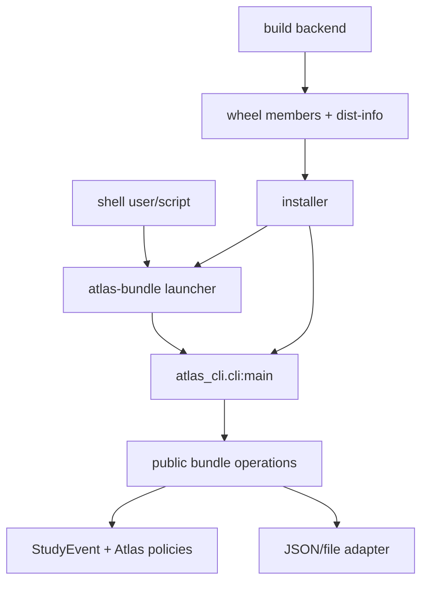

The shell contract includes:

- command/subcommand/argument grammar;
- exit-status categories;
- what goes to stdout versus stderr;
- stable machine-readable output fields;
- whether human wording is stable;
- path and overwrite policy;
- data/privacy exposure;
- deprecation and version behavior.

`argparse` helps implement grammar. Atlas still owns the public CLI policy.

---

## 12. `pyproject.toml` declares build participation and project metadata

A minimal teaching configuration might be:

```toml
[build-system]
requires = ["hatchling>=1.27,<2"]
build-backend = "hatchling.build"

[project]
name = "atlas-learning-cli"
version = "0.1.0"
description = "Inspect and migrate versioned Atlas learning-event bundles"
readme = "README.md"
requires-python = ">=3.12"
license = { file = "LICENSE" }
authors = [{ name = "Atlas Course" }]
dependencies = []

[project.scripts]
atlas-bundle = "atlas_cli.cli:main"

[tool.hatch.build.targets.wheel]
packages = ["src/atlas_cli"]
```

This is an **illustrative configuration**, not the freshly pinned course release record. Before a teaching run, verify current metadata rules and pin the exact frontend/backend versions in the build procedure or chosen lock/constraints workflow.

### 12.1 Ownership by table

| Table | Meaning | Common mistake |
|---|---|---|
| `[build-system]` | requirements needed to invoke the backend and the backend object | treating it as runtime dependencies |
| `[project]` | standardized project/core metadata | putting tool-private options here without a standard field |
| `[project.scripts]` | console-command to importable callable mapping | assuming a shell script from the checkout is installed |
| `[tool.hatch.*]` | backend/tool-specific configuration under its namespace | treating backend configuration as universal packaging law |

### 12.2 Build participants

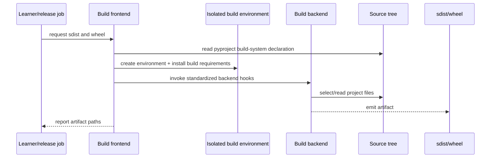

Build isolation limits some undeclared build-environment coupling. It does not sandbox malicious build code, remove network/publisher trust, or guarantee reproducible bytes.

### 12.3 Why build both sdist and wheel

The artifacts answer different questions:

| Artifact | Main role | Inspection questions |
|---|---|---|
| sdist | source-form input for downstream builds | Are required source, metadata, license, README, and build files included? Are generated/secrets/unintended files present? |
| wheel | install-ready built distribution for compatible targets | Are import modules, metadata, entry points, and only intended runtime files included? What compatibility tags are claimed? |

A strong rehearsal:

1. build sdist from the reviewed source tree;
2. inspect it;
3. build a wheel **from that sdist** in a clean build environment;
4. inspect the wheel;
5. install that wheel into a fresh runtime environment;
6. run the installed CLI contract from outside the source checkout.

This follows the release path more closely than importing from the working tree.

### 12.4 Wheel anatomy

A typical pure-Python Atlas wheel contains:

```text
atlas_cli/__init__.py
atlas_cli/bundle.py
atlas_cli/cli.py
atlas_learning_cli-0.1.0.dist-info/METADATA
atlas_learning_cli-0.1.0.dist-info/WHEEL
atlas_learning_cli-0.1.0.dist-info/entry_points.txt
atlas_learning_cli-0.1.0.dist-info/RECORD
```

Read:

- **`METADATA`** for project version, `Requires-Python`, dependencies, extras, and other core metadata;
- **`WHEEL`** for wheel-version/build and compatibility information;
- **`entry_points.txt`** when present for installed command/plugin mappings;
- **`RECORD`** for installed wheel member paths, hashes, and sizes under the wheel rules.

`RECORD` is an internal manifest. It does not authenticate the publisher. Record an external artifact digest and provenance/identity evidence separately.

### 12.5 Compatibility tags are filters, not behavioral proof

A filename ending in `py3-none-any.whl` communicates a broad Python/ABI/platform compatibility claim for the wheel itself. It does not prove:

- runtime dependencies are equally portable;
- the code behaves the same on all operating systems;
- filesystem/newline/locale behavior is identical;
- every supported Python minor is tested;
- optional plugins are compatible;
- the artifact is safe or correct.

Compare the tag, `Requires-Python`, dependency markers, actual files, and target environment.

### 12.6 Artifact inventory protocol

Before opening source again:

1. record artifact filename, byte size, and external SHA-256;
2. list archive members without extracting into a trusted project tree;
3. classify each member as code, data, metadata, license, launcher declaration, or unexpected;
4. inspect `METADATA`, `WHEEL`, entry points, and `RECORD`;
5. predict import package, command, Python compatibility, and dependencies;
6. install into a new environment;
7. challenge each prediction;
8. record discrepancies as release defects.

The artifact is the thing delivered. Source configuration is only evidence about intent.

---

## 13. Dependency declarations, constraints, locks, and environments answer different questions

### 13.1 Four artifacts

| Artifact | Question | Typical scope | What it does not prove |
|---|---|---|---|
| project requirement specifier | Which dependency candidates may satisfy this distribution? | consumers across compatible environments | one exact resolution |
| constraint file | Which versions may a particular resolver consider? | tool/workflow-specific resolution policy | that the constrained project is requested for installation |
| lock artifact | Which exact artifacts/versions were selected for named targets by a chosen workflow? | tool, platform, Python, index, marker, and lock semantics | universal portability or safe code |
| environment inventory (`pip freeze`-style) | What distributions appear installed here? | one current environment | original intent, artifact hashes, clean resolution, or portability |

**[PACKAGING SPEC CLAIM]** Dependency specifiers express project names, versions/URLs, extras, and environment markers under packaging standards.

**[TOOL-SCOPED CLAIM]** Constraint and install behavior must be attributed to the selected installer/resolver version. A standard `pylock.toml` specification exists, but adoption and exact workflow semantics must be audited rather than assumed universal.

### 13.2 Direct and transitive dependencies

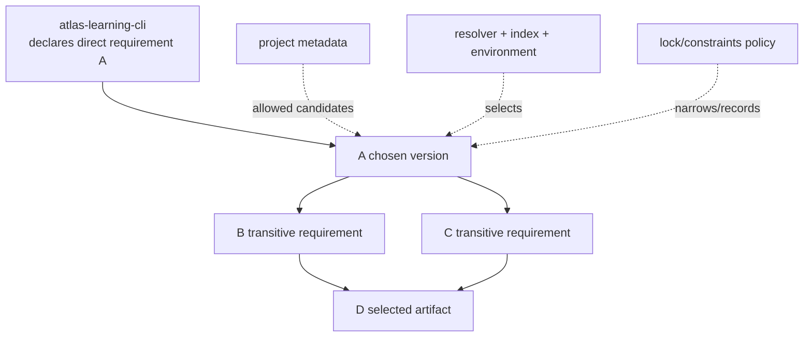

Two installs from the same broad requirement can legitimately select different transitive graphs as indexes, releases, markers, platforms, and solver inputs change.

### 13.3 Repeatability has dimensions

Ask which equality matters:

1. same source commit?
2. same source-distribution bytes?
3. same wheel bytes?
4. same dependency artifact bytes?
5. same installed file set?
6. same interpreter/OS/native libraries/configuration?
7. same runtime outputs?
8. same performance?

These are different claims. A useful evidence record might say:

> From source commit X and sdist digest Y, pinned frontend F and backend B built wheel digest W in environment E; installer I installed W plus dependency artifacts D into fresh environment R; CLI contract C passed.

That is strong, scoped evidence. “The build is reproducible” is too vague.

### 13.4 Hash checking and wheelhouses

Pinned versions plus expected hashes can make a selected install more repeatable and detect unexpected artifact bytes. A pre-populated, reviewed wheelhouse can reduce index/network variation.

They do not guarantee:

- the expected hashes came from an authenticated authority;
- upstream code or build was benign;
- an artifact remains available;
- every target has a compatible artifact;
- runtime dependencies outside Python are identical;
- behavior is correct.

### 13.5 Virtual environments

A virtual environment normally gives one Python installation an isolated site-packages area and scripts directory.

It is not:

- a security sandbox;
- an OS/container boundary;
- a guarantee that system libraries are equal;
- a portable directory to copy among arbitrary machines;
- a lock file;
- proof that no user/system package is visible under every creation option;
- a substitute for a clean build/install transcript.

Record:

- interpreter implementation and exact version;
- OS/architecture;
- creation command/options;
- installer/resolver version and configuration;
- index/find-links settings;
- installed artifact digests or lock evidence;
- command/test results.

### 13.6 Clean means “declared and recorded,” not metaphysically empty

A useful clean install starts from a newly created environment and runs outside the project checkout. It still inherits:

- host OS and filesystem;
- interpreter build and bundled libraries;
- certificate/trust stores;
- network/index configuration;
- environment variables;
- native libraries;
- clock/locale/timezone;
- CPU architecture and resource limits.

The evidence record names relevant inputs rather than claiming none exist.

---

## 14. Release discipline joins compatibility, trust, authority, and rollback

### 14.1 Semantic versioning is a policy

Semantic Versioning’s familiar `MAJOR.MINOR.PATCH` scheme can communicate:

- major: incompatible public-API change;
- minor: backward-compatible functionality;
- patch: backward-compatible defect repair.

But first define **public API**:

- Python import paths and call signatures;
- behavior, order, exceptions, and side effects;
- CLI flags, exit codes, stdout/stderr, and machine schema;
- durable bundle schema and migration window;
- plugin protocol/version;
- performance or operational promises if explicitly supported.

Then define how prereleases/deprecations and packaging ecosystem version rules interact.

A number cannot prove compatibility because:

- the public surface may be undocumented;
- maintainers can misclassify a change;
- consumers may depend on unsupported observations;
- environment/dependency changes can alter behavior;
- data downgrade may be impossible even when code rollback is easy.

Use versioning as a reviewed communication rule, backed by compatibility evidence.

### 14.2 Release state machine

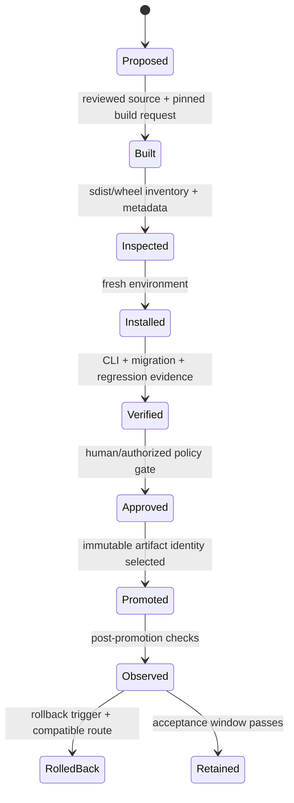

An artifact can move only when the transition’s evidence exists. “CI is green” does not silently perform approval or promotion.

### 14.3 Supply-chain trust map

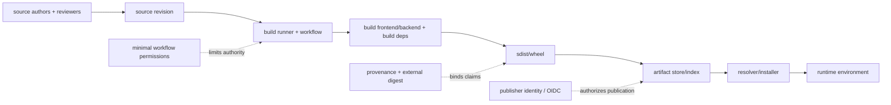

Each arrow can be attacked or misconfigured. Controls answer different questions:

| Control | Helps with | Does not establish |
|---|---|---|
| review + protected source history | authorized source changes | build runner/artifact identity |
| isolated build environment | undeclared build input reduction | sandboxing or benign build dependencies |
| external digest | exact artifact identity | publisher identity or correctness |
| provenance/attestation | claimed source/build relationship | truth unless issuer/workflow is trusted |
| PyPI Trusted Publishing/OIDC | short-lived publisher identity and reduced long-lived secret exposure | correct code or safe dependencies |
| minimal permissions | smaller blast radius | absence of compromise |
| clean install/test | install/runtime evidence for target | all targets or supply-chain safety |

This module introduces the map. Module 22 completes systematic threat modeling.

### 14.4 Public publication is not required

The full rehearsal can use:

- a local `dist/` directory;
- a disposable fresh virtual environment;
- `--no-index --find-links` or the selected installer’s equivalent;
- recorded artifact digests;
- a simulated promotion pointer or release manifest.

Do not publish course artifacts to public PyPI merely to demonstrate packaging. Public names, irreversible exposure, credentials, and other users create responsibilities outside this exercise.

### 14.5 Rollback has two axes

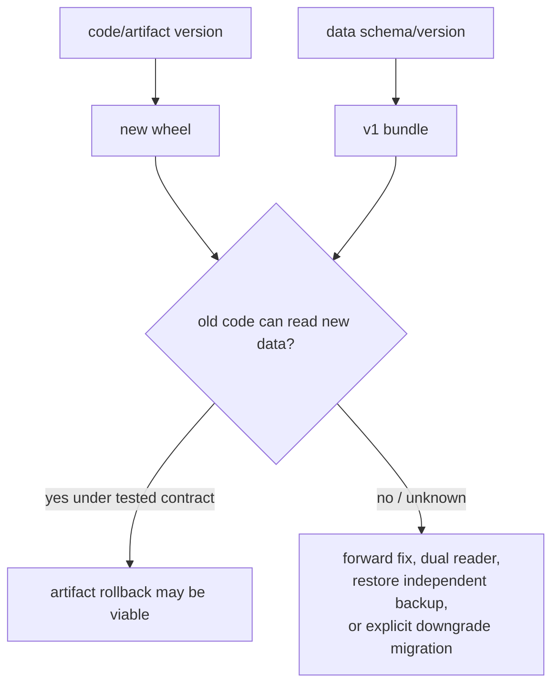

Rollback questions:

1. Is the previous artifact still immutable and retrievable by digest?
2. Can the old code read artifacts written by the new code?
3. Did a migration discard information?
4. Were external consumers given a new CLI/output contract?
5. Is a backup independent, recent, and restore-tested?
6. Can credentials/configuration/dependencies also be restored?
7. What observation triggers rollback, and who is authorized?
8. How is a failed rollback prevented from making state worse?

“Keep the previous wheel” is necessary evidence, not a complete rollback plan.

### 14.6 Delivery checklist

**Source and policy**

- [ ] Public API/CLI/schema compatibility changes are classified.
- [ ] Version choice has a written reason and deprecation/removal conditions.
- [ ] License/attribution, privacy, and dependency changes are reviewed.
- [ ] Release commit/tag/ref and reviewer approvals are recorded.

**Build**

- [ ] Exact Python, frontend, backend, and build requirements are recorded.
- [ ] Build happens in a fresh isolated environment under the selected workflow.
- [ ] sdist is inspected before wheel-from-sdist build.
- [ ] Generated artifacts are outside source-control assumptions and have external digests.

**Artifact**

- [ ] sdist/wheel member inventory matches intent.
- [ ] `METADATA`, `WHEEL`, entry points, `RECORD`, tags, and `Requires-Python` are inspected.
- [ ] No secrets, tests-only data, local paths, or unintended files appear.
- [ ] Dependency metadata matches the reviewed policy.

**Install and behavior**

- [ ] Wheel installs into a fresh environment from the intended artifact source.
- [ ] Tests run outside the checkout.
- [ ] Installed console command, help, exit codes, stdout/stderr, and machine output pass.
- [ ] v0 migration, v1 load, corrupt/tampered rejection, and publish-failure cases pass.

**Trust and promotion**

- [ ] Publisher identity and workflow permissions are reviewed.
- [ ] Expected artifact digest/provenance is stored through an appropriate channel.
- [ ] Promotion selects the already verified immutable artifact; it does not rebuild.
- [ ] Post-promotion smoke/observation and ownership are defined.

**Rollback**

- [ ] Previous artifact and configuration are retrievable.
- [ ] Data backward-read/downgrade/backup assumptions are tested and written.
- [ ] Trigger, authority, procedure, and verification are rehearsed on disposable data.

---

## 15. Artifact and architecture reading studio

Do not start by editing `pyproject.toml`. Recover the delivered system.

### Purpose

Atlas must let a local operator inspect and migrate a versioned learning-event bundle from an installed command while preserving domain invariants, source order, compatibility policy, and honest failure categories.

### Map

Draw two graphs:

1. **source dependency graph:** CLI → public bundle service/port → schema/domain; JSON/file adapter points inward; build configuration stays outside runtime domain;
2. **artifact flow graph:** reviewed source → sdist → wheel → installer/resolver → environment → launcher → `main`.

Do not use one arrow type for both.

### Flow

Trace a legacy record:

```text
v0 JSON bytes
→ strict UTF-8
→ JSON value with unique keys
→ v0 exact shape
→ score 40 / 100
→ StudyEvent("e1", "graphs", 0.4)
→ v1 schema row
→ canonical event payload
→ manifest digest
→ canonical bundle bytes
→ temp file
→ replacement
→ installed `atlas-bundle inspect`
```

At every arrow, state:

- producer and consumer;
- possible failure;
- evidence;
- resource cost;
- whether the step is Python, Atlas, packaging-tool, or platform behavior.

### Mechanism

Explain why:

- the schema does not serialize `StudyEvent.__dict__`;
- v0 migration returns a new value;
- `bool` is explicitly rejected as confidence;
- digest verification follows schema normalization;
- the manifest does not include current time;
- the temp lives beside the target;
- `os.fsync()` on the temp does not create a universal durability proof;
- the CLI machine summary omits study content;
- distribution name, import package, and command differ;
- the release record uses an external artifact digest in addition to wheel `RECORD`.

### Evaluation

Challenge the design:

- Could exact-key rejection block a safe additive field? What alternative compatibility policy would be required?
- Is the event tuple materialization acceptable at the configured bound?
- Could two writers lose an update while every individual file is valid?
- Is a digest useful if the expected digest is delivered beside a compromised artifact?
- Could an installed command import an undeclared resource that happened to exist in the checkout?
- What target/platform matrix is actually supported?
- What happens if v1 publication succeeds but an old binary is rolled back?
- Which claims should move to Module 16, 18, or 22?

### Bounded source reading

Use three small targets:

1. CPython `contextlib` enter/exit path (normal/exception/suppression);
2. pinned `pypa/sampleproject` `pyproject.toml`, package initializer, tests, and packaging commands;
3. Atlas’s built wheel members plus `METADATA`, `WHEEL`, entry points, and `RECORD`.

For each: ask one question, predict, read no more than the defined path, record uncertainty, stop.

---

## 16. Design, delegate, review, and independently verify

### 16.1 Bounded delegation brief

> **Task:** package the already reviewed Atlas bundle core as the `atlas-learning-cli` distribution and expose `atlas-bundle = "atlas_cli.cli:main"`.
>
> **Allowed files:** `pyproject.toml`; `src/atlas_cli/__init__.py`; relocation-only `bundle.py` and `cli.py`; installed-artifact tests; release evidence template.
>
> **Required behavior:** preserve v0/v1 validation, deterministic v1 bytes, CLI exit categories, stdout/stderr separation, and single-file publication behavior. Build sdist and wheel with the pinned local toolchain; install the wheel in a fresh environment; run outside the checkout.
>
> **Do not change:** `StudyEvent` invariants; format/schema identifiers; manifest algorithm; migration mapping; CLI machine-output keys; repository/concurrency model; public PyPI; runtime dependencies; unrelated Atlas planner/ranking/importer behavior.
>
> **Evidence:** annotated metadata; exact commands/tool versions; source/sdist/wheel file inventories; `METADATA`/`WHEEL`/entry-point/`RECORD` inspection; external SHA-256; fresh-install CLI transcript; focused tests; changed-file list; unsupported claims.
>
> **Stop and ask:** if the chosen backend needs an unapproved dependency/network request, if source layout conflicts with current imports, or if the entry point requires changing `main`’s public contract.

### 16.2 Suspicious generated patch

```diff
 [project]
 name = "atlas-learning-cli"
-dependencies = []
+dependencies = ["requests"]
+dynamic = ["version"]

 [project.scripts]
-atlas-bundle = "atlas_cli.cli:main"
+atlas-bundle = "atlas_cli.cli:main"

--- a/src/atlas_cli/bundle.py
+++ b/src/atlas_cli/bundle.py
@@
-def migrate_v0_value(root_value):
+def migrate_v0_value(root_value):
     ...
+    root_value["schema_version"] = 1
+    return root_value

--- a/src/atlas_cli/cli.py
+++ b/src/atlas_cli/cli.py
@@
 except AtlasBundleError as error:
-    err.write(f"atlas-bundle: invalid artifact: {error}\n")
-    return 3
+    print(error)
+    return 0
```

The patch is plausible enough to deserve a real review.

Review findings:

1. `requests` is unused and outside the task, adding dependency/resolution/supply-chain cost.
2. `dynamic = ["version"]` removes a declared value without adding the backend-specific source and evidence needed to supply it.
3. in-place migration violates purity, mutates caller-owned legacy input, and does not produce the v1 field mapping/manifest;
4. printing to process-global stdout breaks injected stream tests and stdout/stderr policy;
5. returning success for invalid artifacts breaks shell automation and the public CLI contract;
6. no artifact evidence appears, so a configuration-looking diff cannot establish packaging correctness.

Disposition: reject, preserve the good entry-point line if it was absent, and request a minimal patch with the required evidence.

### 16.3 Review in dependency order

1. **Public contract:** distribution name, import package, command, CLI/schema behavior, version.
2. **Domain/schema:** no object-layout leak, mutation, unknown-field guess, or invariant weakening.
3. **Control/failure:** errors remain classified; source is preserved; temp cleanup and replace boundary remain.
4. **Metadata:** every standard/tool-specific field has an owner and current source.
5. **Dependencies:** every new direct/build dependency has necessity, range/pin policy, license/trust review, and resolution evidence.
6. **Artifacts:** inventories and metadata match source intent; no secret/unintended file.
7. **Install:** fresh environment outside checkout, installed command, and migration fixtures.
8. **Release:** immutable digest/provenance, approval, promotion, and rollback/data compatibility.
9. **Scope:** no unrelated formatter, importer, planner, or database work.

### 16.4 Independent verification matrix

| Claim | Independent challenge | Acceptance boundary |
|---|---|---|
| v1 bytes deterministic | encode independently twice from equal ordered values; compare bytes/digest | pinned Python/serializer policy |
| old file migrates | reviewed golden v0 → current validator → expected domain values | selected fixture classes, not every possible file |
| failure preserves old target | injected pre-replace error + old-byte comparison + temp inventory | modeled point before replace on this host |
| wheel contains intended runtime | archive inventory + `RECORD` comparison | this built artifact |
| console entry point works | fresh install; run outside source; locate/import installed module | recorded target environment |
| requirements are as reviewed | inspect `METADATA` and resolved environment separately | does not establish safe transitive code |
| release artifact is unchanged | compare promotion artifact to approved external digest | expected-digest channel remains trusted |
| rollback is viable | install previous wheel + read current data/restore disposable backup | rehearsed data/environment only |

### 16.5 Oral defense

Without code, explain in six minutes:

1. why the same event is a Python value, schema value, text, bytes, file, and installed-system input without those being the same representation;
2. the exact v0 → v1 path and unsupported-version behavior;
3. why context management, file sync, replacement, and backup are separate;
4. the roles of build frontend/backend, sdist, wheel, resolver, environment, and command;
5. what hashes, clean install, and Trusted Publishing each establish and omit;
6. the strongest rollback uncertainty.

If the explanation skips a boundary, the artifact is not yet owned.

---

## 17. Six connected teaching sessions

Every session consumes the preceding artifact. The instructor alternates brief explanation with prediction, tracing, comparison, inspection, and defense. No session is a packaging-command recital.

### Session 1 — One event crosses text, byte, and path boundaries

**Consumes:** Module 14’s validated `StudyEvent`, in-memory `ImportSource.text`, explicit composition boundary, and compatibility ledger.

**Pressure:** the event survives only while one process and code version remember what its fields mean.

**Derivation**

```text
logical value
→ external schema value
→ Unicode JSON text
→ UTF-8 bytes
→ operator-selected filesystem path
```

**Instructor micro-models**

1. compare composed and decomposed `é`;
2. encode one label as UTF-8 and UTF-16-LE;
3. compare text length with byte length;
4. show how implicit encoding and newline policies disappear from the code review;
5. separate a lexical `Path` from an opened handle and resolved filesystem object.

**Learner actions**

1. predict every line of the Unicode example before execution;
2. annotate producer/consumer on the five-boundary trace;
3. find every implicit choice in the direct `json.dump(event.__dict__)` writer;
4. design the v1 event row independently of dataclass storage;
5. state an Atlas normalization policy and one place it must **not** be generalized;
6. compare binary canonical output with text-mode output;
7. classify failures as encoding, grammar, schema, domain, path, permission, or I/O.

**Misconception probe**

> If two strings render identically, do they have the same code points, bytes, identity, or security meaning?

A strong answer refuses a universal equivalence and names the selected normalization/equality policy.

**Prediction checkpoint**

Which can change the bytes while preserving intended event meaning: object-key order, insignificant JSON whitespace, Unicode composition, newline, or codec? Potentially all five under a permissive logical interpretation; Atlas narrows them through its canonical writer policy.

**Artifact produced**

- one completed durable-boundary record;
- object → schema → text → bytes trace;
- v1 row schema;
- encoding/newline/path decision note;
- three failure examples and their responsible boundaries.

**TA handoff**

If text and bytes remain fused, return to Module 6 before schema work. If a path object is described as a capability or security proof, use the lexical/resolution/handle diagram and one check/use counterexample.

---

### Session 2 — Resource lifetime becomes a publication failure timeline

**Consumes:** explicit v1 bytes and target-path policy from Session 1.

**Pressure:** direct writes can destroy the old artifact, while a context manager controls cleanup but not rollback or storage durability.

**Derivation**

```text
external resource
→ enter/exit protocol
→ buffered/raw I/O
→ partial-progress risk
→ temp staging
→ replacement boundary
→ platform-scoped durability claim
```

**Learner actions**

1. trace the four context-manager paths: enter failure, normal body, body failure/propagation, body failure/suppression;
2. predict when the generator-backed line reader opens and closes its file;
3. compare streaming and materialization by memory, latency, handle lifetime, and partial failure;
4. draw every interruption point in direct truncation;
5. redraw using temp → flush → file sync → close → replace;
6. inject a pre-replace failure and predict target/temp state;
7. distinguish atomic namespace visibility from crash durability, recovery, backup, and multi-writer lost update;
8. identify which questions are intentionally deferred to Modules 16, 18, and 19.

**Counterexample**

```python
def publish_prefix(stream, values) -> None:
    for value in values:
        stream.write(value)
        stream.flush()
```

Even if the caller owns `stream` with a context manager, a later iterator failure does not retract the prefix.

**Design comparison**

| Design | Strongest honest claim | Main cost/failure |
|---|---|---|
| direct truncation | cleanup attempted | old valid bytes can be lost early |
| bounded in-memory + temp replace | one complete replacement attempt | `Θ(b)` memory, sync latency, platform assumptions |
| streamed temp + validate before replace | bounded record memory possible | late validation and cleanup complexity |
| database transaction | grouped logical updates under engine contract | engine/schema/concurrency/operations cost |

**Artifact produced**

- context-manager control-flow diagram;
- publication interruption table;
- platform-assumption record;
- injected-failure expectation;
- cost comparison and one unresolved multi-writer question.

**TA handoff**

If “closed” means “durable,” ask the learner to place Python buffer, OS/page cache, filesystem metadata, controller, device, recovery, and backup on separate rows. Do not teach unqualified folklore about `fsync` or rename.

---

### Session 3 — A schema version becomes a migration and trust decision

**Consumes:** bounded canonical bytes and publication model from Sessions 1–2.

**Pressure:** valid bytes and valid JSON can still be the wrong version, shape, value, resource demand, or trust class.

**Derivation**

```text
byte acceptance
→ grammar acceptance
→ version dispatch
→ schema validation
→ manifest verification
→ domain construction
→ migrate or reject
```

**Learner actions**

1. classify twelve fixtures by the first responsible validation layer;
2. explain why duplicate object keys require policy;
3. trace `bool` through Python’s numeric subtype relationship and justify explicit rejection;
4. calculate the v1 payload digest input for two ordered events;
5. mutate one row without changing the manifest and predict rejection;
6. write the v0 → v1 field relation before reading code;
7. prove score-range preservation under division by 100;
8. compare exact-key rejection with an additive/unknown-field-preservation policy;
9. explain why pickle and archive extraction widen trust beyond data grammar;
10. review exact-member ZIP reading that never extracts paths.

**Migration table**

| v0 source | v1 target | Preservation claim | Failure |
|---|---|---|---|
| `id` | `event_id` | exact text | invalid/oversized ID |
| `topic` | `concept_id` | exact text | invalid/oversized concept |
| `score ∈ [0,100]` | `confidence = score/100` | range maps to `[0,1]` | nonnumeric/nonfinite/out of range |
| item order | event order | positional preservation | no silent sorting |

**Trust challenge**

> A bundle’s digest matches the digest printed on the same compromised download page. What was established?

Byte identity relative to a compromised assertion may be established; trustworthy origin was not.

**Artifact produced**

- validation-layer matrix;
- reviewed v0/v1 schemas;
- pure migration proof sketch;
- golden/corrupt/tampered fixture plan;
- format-selection note rejecting pickle;
- archive allowlist and resource-limit note.

**TA handoff**

If parsing and validation are fused, use a valid JSON string with wrong Atlas shape. If digest and authentication are fused, change both artifact and adjacent expected digest in the counterexample.

---

### Session 4 — Read, attack, and defend the Atlas bundle implementation

**Consumes:** schemas, migration map, manifest, and failure model from Sessions 1–3.

**Pressure:** a plausible implementation can satisfy the happy path while weakening one earlier boundary.

**Five-pass reading**

1. **Purpose:** safe bounded import/export and v0 migration.
2. **Map:** domain value, parser, schema validator, migrator, encoder, publisher, CLI, tests.
3. **Flow:** one Unicode v0 event through migration and publication.
4. **Mechanism:** exact keys, numeric distinctions, canonical bytes, digest, temp replacement.
5. **Evaluation:** costs, trust, concurrency, portability, and proof limits.

**Learner actions**

1. predict all eight reference tests before execution;
2. build a call/dependency map without reading bodies first;
3. find the first layer that rejects invalid UTF-8, duplicate key, `NaN`, boolean confidence, unknown version, and tampering;
4. trace old-target state under injected replacement failure;
5. explain why cleanup swallows only cleanup failure in `finally` while the publish failure still propagates;
6. identify one hidden check/use race the reference does not solve;
7. design an independent manifest verifier from the format contract;
8. propose a streaming variant and state the changed atomicity/cost proof;
9. reject or repair a generated patch that mutates v0 input or catches every exception;
10. deliver a three-minute boundary defense.

**Extension constraint**

Add optional human-readable `exported_by` metadata without breaking deterministic event-payload identity. Compare:

- placing it in the event digest (changes identity);
- placing it outside the payload but inside the bundle (whole-bundle bytes vary);
- keeping it in the external release/evidence record (bundle remains deterministic).

There is no universal answer; choose based on what the artifact identity is meant to represent.

**Artifact produced**

- architecture/call-flow reconstruction;
- adversarial-test predictions/results;
- independent verifier sketch;
- one accepted/rejected patch disposition;
- updated boundary and limitation ledger.

**TA handoff**

If test success replaces explanation, ask the learner to prove one loop/transition property and name two untested platform assumptions. If review starts with style, return to public contract and failure order.

---

### Session 5 — The source tree becomes an inspected installed command

**Consumes:** reviewed bundle/CLI core and evidence from Session 4.

**Pressure:** source-checkout success can hide missing files, undeclared dependencies, incorrect metadata, and entry-point failures.

**Derivation**

```text
reviewed source
→ pyproject roles
→ isolated backend invocation
→ sdist
→ wheel-from-sdist
→ artifact metadata/inventory
→ resolver/install
→ fresh environment
→ console command
```

**Learner actions**

1. annotate every illustrative `pyproject.toml` field as standardized, backend-specific, or release-procedure policy;
2. distinguish distribution name, import package, and command;
3. predict sdist and wheel members before build;
4. build with an exact recorded local toolchain;
5. inspect `METADATA`, `WHEEL`, entry points, and `RECORD`;
6. identify one compatibility claim from tags/`Requires-Python` and three things it omits;
7. build the wheel from the inspected sdist;
8. create a fresh environment outside the checkout and install the exact wheel by path/digest;
9. run help, inspect, migration, invalid-artifact, stdout/stderr, and exit-status checks;
10. compare project requirements, resolver output, and installed inventory.

**Prediction table**

| Prediction | Artifact evidence | Result/discrepancy |
|---|---|---|
| command maps to `atlas_cli.cli:main` | entry-point metadata + launcher behavior | record |
| no runtime dependencies | `METADATA` + fresh environment inventory | record |
| only intended package files installed | wheel inventory + `RECORD` | record |
| source fixture is not shipped | wheel/sdist inventory | record |
| Python envelope matches policy | `Requires-Python` + wheel tag | record |

**No-network route**

Use local built artifacts and a disposable environment. If the pinned build dependencies are not already available, stop and record the missing prerequisite rather than silently contacting an index.

**Artifact produced**

- annotated `pyproject.toml`;
- exact tool/environment record;
- sdist/wheel inventories and external digests;
- metadata map;
- fresh-install transcript;
- discrepancies and acceptance disposition.

**TA handoff**

If the learner describes build frontend, backend, resolver, installer, and environment as “pip,” redraw participants and require one file/evidence item owned by each.

---

### Session 6 — Rehearse release, rollback, and agent-patch defense

**Consumes:** one verified local wheel, clean-install evidence, and the entire bundle compatibility record.

**Pressure:** an installable artifact still needs authorized promotion, identity/provenance, supply-chain boundaries, observation, and a data-compatible reversal route.

**Learner actions**

1. reconstruct the release state machine and its evidence-gated transitions;
2. classify controls by source authorization, build isolation, artifact identity, publisher identity, permissions, installability, behavior, and recovery;
3. inspect the suspicious generated patch in dependency order;
4. write a bounded corrective delegation brief;
5. model one dependency resolution change despite unchanged direct metadata;
6. compare a requirement, constraint, lock artifact, and environment inventory;
7. simulate promotion by selecting the already verified wheel digest in a local release manifest;
8. run post-promotion CLI evidence in a disposable environment;
9. rehearse code rollback and test whether the old command can read current v1 data;
10. decide forward fix versus rollback when data compatibility is absent;
11. conduct the six-minute oral defense;
12. hand the bundle limitations to Module 16.

**Release incident**

> Version 0.2.0 writes v2 bundles. The installed command fails after promotion. Wheel 0.1.0 is available and verified, but its reader rejects v2. Should operations “just reinstall 0.1.0”?

No. Code artifact rollback would restore an old binary that cannot interpret current data. Options require evidence: forward fix, dual-version reader, explicit downgrade migration if lossless, or restore of an independent verified backup under a recorded recovery plan.

**Artifact produced**

- completed release checklist;
- local promotion manifest with immutable artifact digest;
- supply-chain responsibility map;
- agent patch review and corrective brief;
- code/data rollback rehearsal;
- Arc III handoff stating why a relational transaction boundary is next.

**Mastery gate**

Advance only if Michael can:

- traverse value → schema → bytes → file → CLI → wheel → installed environment without collapsing layers;
- explain the strongest evidence and remaining uncertainty at each transition;
- diagnose one corruption, migration, packaging, and rollback failure;
- reject a plausible generated patch for causal reasons;
- name the bundle’s lost-update/multi-record limitations.

---

## 18. Eight-level problem ladder

Use the same Atlas bundle throughout. Every answer includes a claim label, evidence, cost, and one unsupported conclusion.

### Level 1 — Recognize the boundary

Given 24 statements, classify each as logical value, encoding, grammar, schema, domain invariant, resource lifetime, publication, package metadata, resolution, environment, provenance, or rollback.

Minimum evidence:

- explain why `with`, JSON validity, a digest, wheel tag, and a lock each answer different questions;
- correct one statement that upgrades a narrow observation into a universal guarantee.

### Level 2 — Trace one event

Without executing, trace `StudyEvent("é-2", "trees", 0.25)` through:

1. v1 row;
2. canonical event-array text;
3. UTF-8 payload bytes;
4. SHA-256 input;
5. manifest;
6. whole-bundle bytes;
7. temp publication;
8. CLI inspection.

Then execute and annotate every revised prediction. Explain character/byte counts and exact event order.

### Level 3 — Map the system and artifacts

Recover two diagrams from the reference and package:

- source dependencies and responsibility ownership;
- source → sdist → wheel → install → command artifact flow.

Mark:

- runtime versus dependency arrows;
- domain, schema, filesystem, build, resolution, trust, and release boundaries;
- which component is allowed to know concrete I/O/build choices;
- where Module 14’s composition/compatibility policy remains visible.

### Level 4 — Modify under one compatibility constraint

Add an optional v0 source field `note` that v1 deliberately does not preserve.

Before changing code:

- decide reject/drop/map policy;
- state information-loss and downgrade consequences;
- update schema/migration evidence;
- preserve deterministic v1 bytes for inputs without `note`;
- change no packaging or publication behavior.

Acceptance requires one reviewed design note, focused patch, golden fixture, and explicit compatibility limitation.

### Level 5 — Debug and defend a layered failure

A wheel installs and `atlas-bundle inspect` returns digest mismatch only on a migrated Unicode fixture.

Produce:

1. precise symptom and environment record;
2. competing hypotheses across encoding, normalization, migration, canonicalization, metadata, and filesystem;
3. smallest reproduction outside the checkout;
4. observation that discriminates the top two hypotheses;
5. causal repair at the earliest responsible boundary;
6. regression fixture;
7. explanation of why reinstalling or updating the digest would hide the defect.

### Level 6 — Design and delegate a release-sized change

Design v2 to add an event `occurred_at` timestamp.

Specify:

- exact text/timezone/precision semantics;
- v1 → v2 migration and whether missing history can be invented;
- reader/writer compatibility window;
- manifest identity consequences;
- schema and CLI output changes;
- allowed files/non-goals;
- rollback/data-downgrade route;
- adversarial and clean-install evidence;
- bounded agent task with stop conditions.

Do not implement until the policy for unknowable historical timestamps is resolved.

### Level 7 — Review and independently verify

Receive an agent patch and built wheel for v2. Without trusting its summary:

1. inspect public schema/CLI changes;
2. inspect data model and migration;
3. trace errors/cleanup/replacement;
4. inspect dependency/build changes;
5. diff sdist/wheel inventories and metadata;
6. install by exact artifact into a fresh environment;
7. challenge old/new reader combinations;
8. inject publish failure;
9. verify promotion digest;
10. accept, reject, or split the patch with a causal evidence matrix.

### Level 8 — Transfer across a new CS layer

Atlas must accept bundles over HTTP in Module 20 and store events transactionally in Module 16.

Produce a transfer design that distinguishes:

- network framing/partial reads from UTF-8/JSON/schema;
- content digest from transport authentication;
- upload completion from transaction commit;
- idempotency key from event identity;
- temp upload staging from database transaction;
- response status from durable outcome;
- retryable uncertainty from definitive rejection;
- file schema migration from relational schema migration.

The final artifact is a cross-layer sequence diagram and a statement of which Module 15 guarantees survive unchanged, which widen, and which are replaced.

---

## 19. Understanding check — eight confidence-aware MCQs

For each item:

1. choose before revealing;
2. record confidence: **1 guess, 2 tentative, 3 confident, 4 could teach**;
3. give a one-sentence causal explanation;
4. reveal the diagnosis;
5. route the misconception rather than merely memorizing the letter.

A correct choice without a causal model is recognition evidence, not mastery.

### Question 1 — Text, bytes, and portability

Atlas must produce stable bundle bytes for the same ordered events under its pinned writer policy. Which design best supports that claim?

A. Open the target in text mode without `encoding`; JSON is Unicode, so the platform will preserve it.  
B. Normalize every string with `.lower()` and rely on the default JSON separators; equal-looking strings then have equal bytes.  
C. Define the schema values, serialize with explicit key/separator/nonfinite-number policy, append the specified newline, and encode strict UTF-8 before binary publication.  
D. Use `repr(event)` because Python can reconstruct all immutable values and class changes are internal.

<details>
<summary>Answer, misconception analysis, and repair</summary>

**Answer: C.** The claim needs a named logical-to-text policy and a named text-to-byte codec. Binary publication prevents an additional text newline/encoding layer from becoming implicit.

- **A — “Unicode means UTF-8 everywhere.”** Python `str` being Unicode does not select a file encoding, and text I/O can translate newlines.
- **B — “normalization means lowercasing and guarantees visual identity.”** Case conversion changes meaning; normalization policy and canonical byte policy are separate, and the default JSON layout remains an unrecorded input.
- **D — “immutable internal representation is a durable schema.”** `repr` and class/module layout are Python-implementation/application representations, not the v1 external contract.

**Repair:** draw value → schema → text → bytes and name the authority for each arrow. Re-run the composed/decomposed `é` prediction.

**Confidence route:** a confidence-4 miss returns to Modules 3 and 6; a low-confidence correct answer must explain why text-mode writing adds another policy boundary.

</details>

### Question 2 — Context management and failure

Atlas executes:

```python
with target.open("wb") as stream:
    stream.write(prefix)
    raise RuntimeError("late failure")
```

Which is the strongest justified conclusion?

A. `__exit__`/close logic is attempted after successful entry, but the target may contain a prefix; atomicity, durability, and recovery are not established.  
B. The context manager automatically restores the file to its pre-entry bytes.  
C. Because binary mode is used, the prefix cannot reach the filesystem before close.  
D. The raised exception proves that no other process could observe the file.

<details>
<summary>Answer, misconception analysis, and repair</summary>

**Answer: A.** Context management governs enter/exit control and resource cleanup attempts. It is not an undo log or isolation protocol.

- **B — “`with` is a transaction.”** File writes are effects; exit normally closes rather than rolls them back.
- **C — “buffering is invisibility.”** Buffering behavior and explicit/implicit flushes do not provide a no-prefix guarantee.
- **D — “caller failure means observer isolation.”** Another observer’s visibility is a filesystem/concurrency question, not implied by exception propagation.

**Repair:** trace body effect, exception, `__exit__`, close, and observer state on separate timeline rows. Compare direct write with temp-replace.

**Confidence route:** a confident miss returns to Module 7 partial progress and Module 13 failure semantics before publication work.

</details>

### Question 3 — Schema, manifest, and migration

A v1 bundle parses as JSON and its manifest count equals the array length. One event’s `confidence` is the JSON boolean `true`, and the manifest digest was recomputed over that modified payload. What should the Atlas reader do?

A. Accept it because JSON booleans are valid and the digest/count match.  
B. Convert it to `1.0` because Python’s `bool` is an `int` and the domain range allows 1.  
C. Reject it at schema/domain validation because the v1 number policy excludes booleans; integrity evidence does not make the value semantically valid.  
D. Treat it as v0 and retry migration because v1 validation failed.

<details>
<summary>Answer, misconception analysis, and repair</summary>

**Answer: C.** Grammar validity, manifest consistency, and domain/schema validity are independent gates. Atlas explicitly rejects booleans as confidence values.

- **A — “digest equals validity.”** The manifest can consistently describe invalid or malicious content.
- **B — “Python subtype relation defines external schema.”** The external policy can distinguish JSON booleans from numbers even though Python has `bool <: int` behavior at runtime.
- **D — “fallback parsing repairs invalid data.”** Version dispatch is explicit. Reinterpreting malformed v1 as v0 creates ambiguity and downgrade attacks.

**Repair:** place byte, grammar, version, schema, manifest, and domain checks in order; create one fixture that passes each prefix and fails at the next gate.

**Confidence route:** a confidence-4 miss requires a delayed retest with `NaN`, duplicate keys, and an unknown version.

</details>

### Question 4 — Atomic replacement and durability

Atlas writes a complete temp file in the target directory, flushes, calls `os.fsync(temp_fd)`, closes it, and successfully calls `os.replace(temp, target)`. Which release note is most accurate?

A. “The bundle is transactionally durable against every crash and simultaneous writer.”  
B. “On the recorded host/filesystem, the tested replacement path published one complete file; crash survival of directory metadata, hardware behavior, races, and lost updates remain outside this evidence.”  
C. “`fsync` proves the JSON schema and manifest are correct.”  
D. “Because replacement succeeded, a backup exists in the temporary path.”

<details>
<summary>Answer, misconception analysis, and repair</summary>

**Answer: B.** It states the observed mechanism and preserves the boundary of the evidence.

- **A — “atomic rename is a universal transaction.”** Multi-writer coordination, multiple files, platform/filesystem semantics, directory durability, and recovery are not proved.
- **C — “storage mechanism validates meaning.”** File sync knows bytes/handles, not Atlas schema.
- **D — “temporary file is backup.”** Successful replacement normally consumes the temp name; even a leftover temp is not an independent, retained, restore-tested backup.

**Repair:** rebuild the interruption table and add two writers reading the same old version. Explain how both files can be complete while one logical update is lost.

**Confidence route:** a low-confidence correct answer must distinguish process-visible replacement, crash durability, and backup in three sentences.

</details>

### Question 5 — Untrusted artifacts

Atlas receives a ZIP from an untrusted source. It should read only `manifest.json` and `events.jsonl`. Which initial design is strongest?

A. Call `extractall(destination)` because current Python automatically makes every archive safe on every filesystem.  
B. Reject names containing `".."` and then join every remaining member name to the destination.  
C. Require exactly one of each allowlisted logical name, reject duplicates/unexpected/directory/encrypted/oversized entries, stream bounded contents without using member paths as output paths, and follow current pinned-library guidance.  
D. Convert the ZIP to pickle first because pickle preserves Python types and the archive digest can make unpickling safe.

<details>
<summary>Answer, misconception analysis, and repair</summary>

**Answer: C.** Exact allowlisting, bounded reading, no path-based extraction, and version-current guidance create a small auditable surface.

- **A — “one API erases platform and format policy.”** Extraction safety is version/library/application/platform sensitive and includes more than lexical traversal.
- **B — “substring filtering is path security.”** Absolute names, separators, drives, links, duplicates, normalization, overwrite, and check/use behavior remain.
- **D — “integrity removes code-execution capability.”** Pickle reconstruction can execute code; a digest only identifies bytes relative to an expected value.

**Repair:** enumerate name, link, type, duplicate, size, compression, overwrite, permission, and race risks. Then design the smallest format-specific reader possible.

**Confidence route:** a confident miss routes to Module 12 plugin trust and this module’s archive/pickle boundary.

</details>

### Question 6 — Build and installed artifact

`python -m atlas_cli.cli inspect sample.json` works from the repository. What evidence most directly establishes that the intended console command is delivered?

A. The source tree contains `cli.py`.  
B. `pyproject.toml` contains a `[project.scripts]` line, so no build/install test is needed.  
C. The inspected wheel contains correct entry-point metadata and runtime files; that exact wheel installs into a fresh environment, and `atlas-bundle inspect` runs outside the checkout with the expected contract.  
D. The wheel filename contains `py3-none-any`, so every command and dependency is correct on every platform.

<details>
<summary>Answer, misconception analysis, and repair</summary>

**Answer: C.** It challenges intent at the artifact and installed-environment boundaries.

- **A — “source presence equals delivery.”** Backend file selection or packaging mistakes may omit the file.
- **B — “configuration equals artifact.”** Metadata can be malformed, ignored, or built differently; inspect output and install it.
- **D — “tag equals behavioral proof.”** Tags are compatibility filters/claims, not proof of entry points, dependencies, or behavior.

**Repair:** build a five-column map: source tree, sdist, wheel, installed files, shell command. Put one observation in each column.

**Confidence route:** a confidence-4 miss must perform the clean-install lab before more explanation.

</details>

### Question 7 — Requirements and repeatability

Atlas declares `toolkit>=2,<3`. A constraints file limits `toolkit==2.4`, and a fresh environment currently contains `toolkit==2.4` plus its transitive dependencies. Which statement is strongest?

A. The project metadata alone guarantees every future install chooses exactly this graph.  
B. The constraint is a runtime dependency declaration and forces `toolkit` to install even if nothing requires it.  
C. The requirement describes acceptable direct candidates; the selected constraint/resolver/environment produced one graph, which needs its own lock/hash/target evidence for the desired repeatability claim.  
D. `pip freeze` proves the source intent, artifact hashes, and portability of this environment.

<details>
<summary>Answer, misconception analysis, and repair</summary>

**Answer: C.** Declaration, resolver policy, resolution result, artifact identity, and installed inventory are separate layers.

- **A — “range equals resolution.”** Future releases, markers, indexes, transitive requirements, and platforms can change selection.
- **B — “constraint requests installation.”** In the selected pip model, a constraint narrows candidates for requirements that arise; it does not by itself request a package.
- **D — “inventory equals reproducible intent.”** An environment snapshot omits why packages were selected and may omit hashes/target portability.

**Repair:** annotate one dependency graph with direct requirement, constraint/lock input, resolver selection, artifact digest, and installed inventory.

**Confidence route:** a low-confidence correct answer must name four different repeatability equalities: source, wheel bytes, dependency artifacts, and runtime behavior.

</details>

### Question 8 — Release and rollback

Atlas 0.2.0 writes schema v2. A runtime regression appears after promotion. The previous 0.1.0 wheel is available by verified digest, but 0.1.0 rejects v2. What is the strongest response?

A. Reinstall 0.1.0 immediately; artifact availability proves rollback safety.  
B. Delete v2 data, because code rollback always has priority over data.  
C. Treat code and data rollback separately: assess forward fix, dual reader, validated downgrade, or independent backup restore; choose a rehearsed path and verify the resulting data/CLI state.  
D. Change the 0.1.0 version number to 0.2.1 so semantic versioning makes it compatible.

<details>
<summary>Answer, misconception analysis, and repair</summary>

**Answer: C.** A previous executable artifact does not imply a previous data interpretation remains viable.

- **A — “immutable old code equals reversible system.”** Current data and external consumers can make rollback unsafe.
- **B — “recovery may discard data by default.”** Destructive rollback requires explicit authority, backup, loss decision, and evidence.
- **D — “version labels create behavior.”** Versioning communicates policy; renaming cannot change reader capability.

**Repair:** draw code version and data schema as two axes. For each rollback path, state information loss, evidence, authority, and verification.

**Confidence route:** a confidence-4 miss requires an oral incident defense; a low-confidence correct answer compares forward fix and backup restore.

</details>

### Diagnostic interpretation

| Pattern | Likely collapsed distinction | Repair route |
|---|---|---|
| misses 1 | text = bytes = visual glyph | Module 6 representation trace + Session 1 |
| misses 2 or 4 | cleanup = rollback = atomicity = durability | Module 7 partial progress + Session 2 timeline |
| misses 3 | parse = schema = domain = integrity | Module 3 invariants + Session 3 layered fixtures |
| misses 5 | digest/modern API = trusted safe extraction | M12 trust boundary + archive allowlist lab |
| misses 6 | source/configuration = built/installed artifact | Session 5 five-column artifact map |
| misses 7 | requirement = resolution = environment = reproducibility | Module 12 distribution distinction + dependency graph |
| misses 8 | old artifact = reversible system | Module 14 compatibility ledger + Session 6 rollback axes |
| several high-confidence misses | overgeneralized tool/platform folklore | label every claim and require counterexample plus delayed retest |

Routing rule:

- confidence-4 miss → minimal counterexample, explain the causal mechanism, retest after at least one session;
- confidence-1/2 correct → contrast case and one-minute oral explanation;
- correct letter with wrong reason → repair the reason;
- repeated cross-layer collapse → return to the boundary record rather than adding more commands.

---

## 20. TA playbook — locate the collapsed boundary

The TA’s job is not to recite commands. Diagnose which two promises the learner has merged, expose the smallest counterexample, then return responsibility to the learner.

### 20.1 Misconception map

| Learner statement | Diagnostic question | Minimal counterexample | Likely prerequisite |
|---|---|---|---|
| “Python strings are UTF-8.” | Can one `str` be encoded as UTF-8 and UTF-16? | `"é".encode("utf-8")` versus UTF-16-LE | M6 representation |
| “They look equal, so bytes match.” | Which code points occur? | composed/decomposed `é` | M1 equality + M6 |
| “Valid JSON is valid Atlas.” | What schema/domain gate follows grammar? | `{"events":"many"}` | M3 RI/contract |
| “The digest proves it is safe.” | Who authenticated the expected digest? | malicious bytes + adjacent matching digest | M8 hash claims + M12 trust |
| “`with` rolls back failure.” | Which earlier writes are undone by `__exit__`? | write prefix then raise | M7 partial effects |
| “Replace means durable transaction.” | What about directory sync, two writers, multiple files? | two lost-update writers | M10 graph/state + M13 evidence |
| “A migration can just mutate the dict.” | Who else aliases the input and how is failure reversed? | compare input before/after exception | M1 aliasing + M14 change |
| “Pickle is fine behind HTTPS.” | What happens after authenticated bytes reach the unpickler? | official code-execution warning; no execution demo | M12 trust layers |
| “Block `..` and extraction is safe.” | What about absolute paths, links, drives, duplicates, sizes, races? | exact allowlist versus substring filter | M6 paths + M22 preview |
| “`pyproject.toml` is a lock file.” | Which exact transitive artifact was selected for this target? | same range, two valid future graphs | M12 metadata/distribution |
| “The wheel works because the checkout works.” | Did the wheel contain/install the file and entry point? | omit a package file from build | M12 imports + M13 integration |
| “`py3-none-any` means behavior is portable.” | What platform/file/dependency behavior does the tag not test? | newline/path/native transitive dependency | M5 evidence scope |
| “`pip freeze` is universal reproducibility.” | Does it preserve intent, hashes, targets, build inputs? | dirty environment inventory | M13 evidence |
| “SemVer proves backward compatibility.” | Who defined the public API and tested consumers/data? | patch release changes exit code | M14 compatibility |
| “Old wheel means rollback.” | Can old code read newly written data? | old reader rejects v2 | M14 migration |

### 20.2 Staged hint ladder

Use one hint at a time.

1. **Boundary:** “What exact value crosses which boundary?”
2. **Representation:** “Show the characters, bytes, fields, or archive members.”
3. **Owner:** “Who promises this—Python, Atlas, PyPA, the tool, or the platform?”
4. **Failure:** “At which instruction can the first irreversible observation occur?”
5. **Counterexample:** “Can the narrow evidence be true while the broad claim is false?”
6. **Evidence:** “What independent artifact or environment would challenge the claim?”
7. **Repair:** “What is the smallest responsible boundary to change?”
8. **Limit:** “What does the repair still not prove?”

Do not jump from hint 1 to a finished patch.

### 20.3 Diagnostic micro-labs

#### Text/byte lab

Ask the learner to predict and then inspect:

```python
left = "é"
right = "e\u0301"
assert left != right
assert left.encode("utf-8") != right.encode("utf-8")
```

Then ask whether NFC normalization is a fact about Unicode equality or an Atlas identity policy.

#### Cleanup/publication lab

Use an in-memory stream or disposable temp directory:

1. write `b"old"` to target;
2. direct-write `b"new"` and inject failure after one byte;
3. restore old;
4. temp-write and inject failure before replace;
5. compare target and temp inventory.

Never run failure experiments on real learner data.

#### Schema/integrity lab

Start with one valid v1 object. Apply exactly one mutation:

- duplicate key at grammar text;
- `confidence=True`;
- count mismatch;
- changed event with old digest;
- unknown version.

The learner predicts the earliest rejecting layer.

#### Packaging lab

Give only:

- wheel filename;
- member inventory;
- `METADATA`;
- `WHEEL`;
- entry points;
- `RECORD`.

Ask the learner to reconstruct distribution/import/command/dependency claims before seeing `pyproject.toml`.

### 20.4 Regression evidence by defect

| Confirmed defect | Required regression evidence | Neighboring claim to recheck |
|---|---|---|
| implicit encoding | non-ASCII fixture with exact UTF-8 bytes | newline/digest stability |
| duplicate JSON key accepted | raw-text duplicate fixture | normal object and truncated JSON |
| boolean confidence accepted | `true` fixture with matching digest | numeric `0`, `1`, `0.5`, out-of-range |
| migration mutates source | deep-copy equality after success and failure | event order and manifest |
| pre-replace failure destroys old target | injected failure + old bytes + temp inventory | successful publish/readback |
| archive traversal | exact unexpected-member fixture without extraction | duplicate/oversize members |
| missing wheel file | inventory/`RECORD` + fresh import | sdist includes source/build files |
| broken console command | installed launcher subprocess/contract | direct module API remains correct |
| undeclared dependency | fresh install with no checkout leakage | `METADATA` requirement review |
| incorrect version classification | old/new consumer matrix | CLI/data/plugin compatibility |
| rollback fails on new schema | disposable old-reader/new-data rehearsal | backup restore or forward-fix route |

### 20.5 When to return to a prerequisite

Return rather than patch forward when:

- value/object/name/reference are fused → Module 1;
- representation invariant and external schema are fused → Module 3;
- universal claims are inferred from examples → Modules 4–5;
- bytes/text/memory ownership are unclear → Module 6;
- partial iteration/effects are assumed reversible → Module 7;
- digest/index/derived state is treated as authority → Module 8;
- dependency or migration graph direction is unclear → Module 10;
- package/import/discovery/trust are fused → Module 12;
- green tests or coverage are treated as proof → Module 13;
- compatibility/refactor/release changes are unclassified → Module 14.

### 20.6 TA session protocol

1. Ask for the learner’s current boundary diagram.
2. Select one concrete input and target environment.
3. Require prediction before running.
4. Record observation separately from explanation.
5. Ask which claim label applies.
6. Introduce the smallest falsifying counterexample.
7. Let the learner repair the model before code.
8. Define regression evidence and non-goals.
9. Re-run only in disposable data/environment.
10. End with a one-minute explanation and one future retrieval date.

### 20.7 TA stop rules

Stop the activity if:

- a command might publish publicly or expose credentials;
- a destructive/archive/crash experiment targets non-disposable data;
- the exact artifact/path/environment is ambiguous;
- an agent adds dependencies, network access, or permission without review;
- a migration lacks a preserved source/backup or loss decision;
- a platform guarantee is being asserted without a named platform/filesystem/source;
- the learner cannot explain the current file before generating another patch.

---

## 21. Atlas milestone and evidence packet

### 21.1 Milestone

Deliver a locally installable **Atlas Learning Bundle CLI 0.1.0 release candidate**. It must:

- encode bounded ordered `StudyEvent` values as deterministic v1 bytes under the pinned policy;
- validate UTF-8, JSON grammar, unique keys, exact schema, manifest, and domain values;
- load v1 and migrate reviewed v0 fixtures without mutating the source;
- reject unsupported versions and adversarial fixtures with stable error categories;
- preserve the old target under injected pre-replace failure;
- expose `atlas-bundle inspect` and `atlas-bundle migrate`;
- separate machine/human stdout from diagnostic stderr and stable exit categories;
- build an inspected sdist and wheel;
- install/run from the exact wheel in a fresh environment outside the source tree;
- include a local release record and rehearsed rollback/data-compatibility decision;
- avoid public PyPI, real credentials, and non-disposable destructive tests.

### 21.2 Required evidence tree

```text
evidence/module15/
├── 01-boundary-model/
│   ├── object-schema-text-bytes.md
│   ├── publication-failure-timeline.md
│   └── claim-owner-matrix.md
├── 02-format/
│   ├── schema-v0.md
│   ├── schema-v1.md
│   ├── migration-map.md
│   ├── manifest-definition.md
│   └── fixtures-inventory.md
├── 03-code-review/
│   ├── architecture-map.md
│   ├── agent-brief.md
│   ├── patch-review.md
│   └── independent-verification.md
├── 04-build/
│   ├── toolchain.txt
│   ├── pyproject-annotations.md
│   ├── sdist-inventory.txt
│   ├── wheel-inventory.txt
│   ├── metadata-review.md
│   └── artifact-sha256.txt
├── 05-install/
│   ├── environment.txt
│   ├── install-transcript.txt
│   ├── cli-contract-results.txt
│   └── resolved-dependencies.txt
└── 06-release/
    ├── release-checklist.md
    ├── promotion-manifest.json
    ├── rollback-rehearsal.md
    └── limitations.md
```

The exact filenames may change, but every evidence role must remain and personal data/secrets must not enter the packet.

### 21.3 Evidence claims

| Claim | Required evidence | Automatic rejection |
|---|---|---|
| boundary model is understood | complete trace + oral explanation | “JSON/file/wheel handles it” |
| schema is independent | schema/RI review + no `__dict__` coupling | current class layout is the contract |
| migration is safe under scope | golden/adversarial fixtures + purity/order argument | guessing unknown fields or overwriting source |
| publish improves failure behavior | timeline + injected failure + old-byte comparison | universal durability language |
| artifact matches intent | sdist/wheel/metadata/`RECORD` inventory | source config only |
| installed CLI works | fresh environment outside checkout | `python -m` from repository only |
| dependencies are understood | metadata + resolution + environment distinction | `pip freeze` labeled universal lock |
| artifact identity is recorded | external digest + provenance/authority note | hash labeled trust/correctness |
| release is controlled | evidence-gated state + local promotion | public publish or rebuild at promotion |
| rollback is credible | old artifact + new-data compatibility/backup rehearsal | “install previous wheel” only |

### 21.4 Rubric

| Dimension | Developing | Competent | Mastery |
|---|---|---|---|
| representation trace | names layers | traces one event | transfers trace to unfamiliar format/protocol |
| schema/migration | happy path | layered validation + pure migration | explains compatibility/loss and designs counterexamples |
| failure reasoning | cites `with`/replace | interruption table + bounded claim | compares alternative publish/transaction designs |
| artifact reading | reads config | inspects sdist/wheel/metadata | reconstructs source/install differences before source |
| dependency reasoning | lists versions | separates requirement/resolution/environment | defines scoped repeatability and supply-chain evidence |
| agent direction/review | accepts summary | bounded task + causal diff review | independently falsifies unsupported artifact claims |
| delivery/rollback | keeps old wheel | evidence-gated release + data check | handles incident tradeoffs/authority/uncertainty |
| explanation | uses terminology | connected first-principles story | precise multi-layer oral defense with limits/costs |

### 21.5 Oral defense prompts

Select four:

1. A user says the JSON “looks fine.” Walk from bytes to domain truth.
2. Prove what the v0 → v1 score mapping preserves.
3. Explain the old-target state at every publication interruption point.
4. Defend materialization at this bound and redesign for 100 GB.
5. Infer the installed command from wheel metadata.
6. Explain why wheel `RECORD` and an external digest both exist.
7. Compare requirement, constraint, lock, and environment inventory.
8. Explain why Trusted Publishing and clean tests establish different claims.
9. Decide whether a CLI wording change is patch/minor/major under the documented contract.
10. Handle an old-wheel/new-schema rollback incident.

### 21.6 Instructor decision rule

Module 15 is mastered when Michael can receive an unfamiliar serialized artifact and Python distribution, recover the representation/compatibility/trust/failure model, inspect the built artifact, direct and review a bounded change, verify it in a clean environment, and defend the release/rollback limits.

Do not advance because:

- the reference tests passed;
- the JSON is readable;
- the digest matches;
- the wheel built;
- the command ran once;
- the agent said the release is reproducible.

Advance when each claim has the right owner, artifact, evidence, cost, and explicit boundary.

---

## 22. Consolidated knowledge map

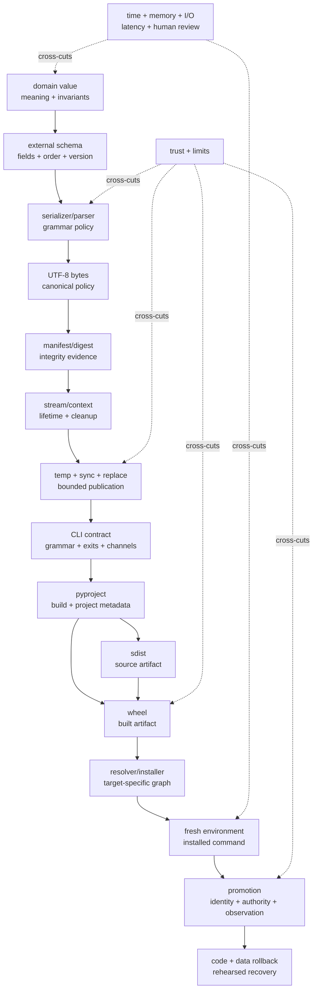

### 22.1 The connected explanation

Atlas starts with a domain value, not JSON. The external schema selects which meaning crosses process and time. A serializer gives that schema a grammar; UTF-8 gives text bytes. A deterministic encoder gives equal supported ordered values equal bytes under a pinned policy. A manifest records payload identity but does not create truth or trust. A context manager controls resource exit; a staged replacement narrows partial publication under named platform assumptions. A CLI makes operations observable to people and scripts.

`pyproject.toml` then declares build participation and project metadata. A frontend invokes a backend to make an sdist/wheel; the artifacts must be inspected because configuration is intent, not delivery. A resolver and installer choose artifacts for a target environment; requirements, constraints, locks, and inventories answer different questions. A release selects an already verified immutable artifact through an authorized promotion. Rollback must reconcile executable artifact and durable data versions. At no point does success at one layer prove the next.

### 22.2 Before / now

| Before | Now |
|---|---|
| “Write the object to JSON.” | “Define schema meaning, version, limits, canonical bytes, and domain reconstruction.” |
| “Use UTF-8.” | “Name encode/decode/error/newline/normalization policies and their authority.” |
| “Use `with open`.” | “Separate enter/exit cleanup from visibility, durability, recovery, and backup.” |
| “Rename temp over target.” | “Trace interruption points and state platform/filesystem/concurrency assumptions.” |
| “The hash matches.” | “Byte identity is evidence relative to an expected digest; origin/safety/meaning are separate.” |
| “Avoid `../` in archives.” | “Use current controls, exact allowlists, type/link/duplicate/resource policy, and disposable tests.” |
| “Make a package.” | “Separate module, import package, distribution, artifact, environment, and command.” |
| “`pyproject` installs dependencies.” | “Build metadata, runtime requirements, resolution, installation, and environment are separate participants.” |
| “Pin everything.” | “State the desired repeatability dimension, target, artifact identities, and remaining platform inputs.” |
| “Use SemVer.” | “Define the public surface and evidence; version communicates reviewed compatibility policy.” |
| “Keep the old wheel.” | “Rehearse code and data compatibility, authority, trigger, recovery, and verification.” |

### 22.3 Keep statements

Retain these:

1. A logical value can have several representations; an artifact contract chooses one.
2. `str` is text; a codec produces bytes.
3. Parsing, schema validation, domain validation, and integrity verification are separate.
4. Version dispatch must precede interpretation; unknown versions are policy decisions.
5. A pure migration narrows reasoning but cannot recover information that never existed.
6. Context managers arrange exit logic; they are not transactions.
7. Temp/flush/sync/replace is a failure protocol with platform assumptions.
8. Serialization is not persistence, transaction, recovery, or backup.
9. Untrusted pickle can execute code; archives convey filesystem/resource authority.
10. Distribution name, import package, and console command need not match.
11. Frontend, backend, resolver, installer, index, and environment have different responsibilities.
12. Requirements admit candidates; resolutions select candidates.
13. A clean install is bounded evidence from a recorded target.
14. Artifact inspection challenges source intent.
15. Digests identify bytes; provenance/identity/trust/correctness require other evidence.
16. Semantic versioning is a communication policy, not a theorem.
17. Promotion should select the verified artifact, not rebuild it.
18. Rollback is a code-and-data compatibility problem.

### 22.4 Spaced retrieval schedule

**After 1 day**

- draw value → schema → bytes → file without notes;
- explain `with` versus atomic replace;
- classify one digest claim;
- name distribution/import/command.

**After 3 days**

- reconstruct v0 → v1 mapping and one failure;
- draw build frontend/backend/sdist/wheel/install;
- compare requirement, constraint, lock, inventory;
- answer one diagnostic with confidence and causal reason.

**After 7 days**

- inspect an unfamiliar wheel’s metadata without source;
- diagnose a tampered/Unicode/migration fixture;
- defend one platform assumption;
- rewrite the bounded agent brief from memory.

**After 21 days**

- design v2 with one information-loss decision;
- rehearse old-code/new-data rollback;
- transfer byte/schema/integrity ideas to HTTP;
- explain why Module 16 needs transactions.

**Inside Modules 16, 18, 20, and 22**

- retrieve publication versus transaction;
- retrieve file sync versus filesystem recovery;
- retrieve encoding/schema versus protocol framing;
- retrieve digest versus authentication/supply-chain trust.

### 22.5 Architecture/release decision record

Record:

```text
Decision:
Use a single strict-UTF-8 v1 JSON bundle with deterministic event payload,
embedded count/SHA-256 manifest, bounded materialization, and temp replacement.

Pressure:
Atlas must survive process exit and move through an installable local CLI while
remaining inspectable and migration-aware.

Preserved:
StudyEvent invariants, event order, Module 12 dependency direction, Module 13
error/evidence discipline, Module 14 compatibility/change control.

Costs:
O(bundle) memory, duplicate canonicalization/digest work, sync latency, retained
migration fixtures, packaging/release evidence, reviewer attention.

Rejected alternatives:
__dict__/repr coupling; pickle for exchange; direct truncation; unbounded input;
public publication for the exercise; treating a lock or hash as trust.

Limits:
No multi-writer coordination, database transaction, universal crash durability,
backup, network protocol, or complete supply-chain proof.

Revisit when:
Bundle bounds become material, concurrent writers arrive, relational queries are
needed, or a supported platform invalidates the recorded publication assumptions.
```

---

## 23. Explicit backward and forward connections

### Backward

- **Module 1 — values, state, execution:** the file is not the event; publication is a state transition with intermediate failure points; migration purity prevents alias mutation.
- **Module 2 — functions and induction:** the migration maps each ordered prefix, and its preservation argument can be stated inductively.
- **Module 3 — ADTs and contracts:** the bundle schema is an external representation with its own invariant and abstraction function; clients should not depend on dataclass layout.
- **Module 4 — logic, relations, proof:** compatibility is a directional relation; version edges form a graph; tests do not prove universal quantifiers.
- **Module 5 — cost models:** byte limits, materialization, hashing, I/O, build, install, and human review need explicit resources and empirical boundaries.
- **Module 6 — representation and memory:** Unicode text, encoded bytes, copies, buffers, paths, and object retention are distinct representations/ownership states.
- **Module 7 — lazy iteration:** a stream can yield/write a prefix before later failure; bounded materialization changes memory/latency to simplify publication semantics.
- **Module 8 — hashing and indexing:** SHA-256 is derived evidence over exact bytes, not authoritative semantic truth; duplicate identity needs an explicit equivalence policy.
- **Module 9 — ordering:** event order is part of schema meaning; dictionary/archive/member/filesystem iteration order is never accidental policy.
- **Module 10 — graphs:** migration paths, source dependencies, build artifacts, dependency resolution, and commit/release histories use directed edges with different meaning.
- **Module 11 — design paradigms/evidence:** manifest verification is an independent witness; release selection is another constrained strategy requiring explicit objective/evidence.
- **Module 12 — modules/APIs/types/dependencies:** import module, package, distribution, entry-point metadata, executable load, and trust remain distinct; outer packaging adapters point inward.
- **Module 13 — specification/testing/debugging/observability:** corrupt/golden/migration/install tests are finite claims; failures remain classified and machine output avoids sensitive content.
- **Module 14 — design and change:** the new durable/packaging behavior enters through outer boundaries, preserves the planner/domain invariants, uses staged compatibility, coherent changes, review, and reversal.

### Forward

- **Module 16 — relational data and transactions:** consumes the validated bundle, introduces `ImportValidatedBundle` plus `EventRepository`, and adds relations, constraints, transactions, isolation, and recovery while preserving bundle/domain/CLI contracts.
- **Module 17 — execution stack:** explains encoding, JSON parsing, hashing, compression, buffer copies, system calls, and machine-level costs.
- **Module 18 — operating systems:** deepens file descriptors, page cache, filesystem names, permissions, sync, rename, locking, process crashes, and recovery.
- **Module 19 — concurrency:** models simultaneous writers, interleavings, locks, lost updates, queues, and race-free publication.
- **Module 20 — networks/protocols:** adds framing, content type, partial transfer, latency, authentication, idempotency, and versioned messages around the same byte/schema core.
- **Module 21 — async/distributed systems:** adds cancellation, uncertain completion, retries, duplicate delivery, partitions, and promotion across replicas.
- **Module 22 — security/privacy:** completes threat models for archives, plugin/build execution, indexes, dependency confusion, credentials, provenance, permissions, and personal learning data.
- **Module 23 — languages/interpreters:** treats JSON/schema/CLI grammars as languages with syntax and semantics, then builds a safe query language.
- **Module 24 — CPython/performance:** inspects text/bytes object layout, I/O implementation, hashing, allocation, and profiling without changing the external contract.
- **Module 26 — capstone:** requires inspected distributions, installation evidence, migration/rollback discipline, supply-chain record, and a defensible release.

### The handoff to Module 16

The v1 bundle now has:

- explicit schema and validation;
- atomic-ish one-file replacement under named assumptions;
- installable tooling;
- compatibility and release evidence.

It still cannot naturally guarantee:

- atomic change across several related logical records/files;
- constraint preservation among identities and references;
- isolated concurrent reads/writes;
- lost-update prevention;
- efficient selective query without loading the whole bundle;
- recovery under a transactional engine contract.

That is the pressure that derives relations, keys, constraints, and transactions.

---

## 24. Source ledger and bounded reading route

External sources establish mechanisms/specifications and supply comparative explanations. The module’s narrative, diagrams, Atlas schema, code, questions, and projects are original course synthesis.

### 24.1 Python language and standard library

| Source | Use | Guardrail |
|---|---|---|
| Python 3.14 [`open()`](https://docs.python.org/3.14/library/functions.html#open) and [`io`](https://docs.python.org/3.14/library/io.html) | text/binary streams, buffering, encoding, errors, newline, capabilities | do not turn defaults into durable-format policy |
| [Unicode HOWTO](https://docs.python.org/3.14/howto/unicode.html) | code points, encoding/decoding, errors, normalization context | visual similarity and application identity remain separate |
| [Context manager data model](https://docs.python.org/3.14/reference/datamodel.html#context-managers) and [`contextlib`](https://docs.python.org/3.14/library/contextlib.html) | enter/exit, suppression, generator context managers | cleanup is not atomicity/durability |
| [`json`](https://docs.python.org/3.14/library/json.html) | parser/encoder behavior and options | JSON grammar is not Atlas schema |
| [`csv`](https://docs.python.org/3.14/library/csv.html) | dialect, quoting, `newline=""`, field handling | spreadsheet interpretation is another trust boundary |
| [`pickle`](https://docs.python.org/3.14/library/pickle.html) | Python-specific reconstruction and security warning | never unpickle supplied lab data |
| [`pathlib`](https://docs.python.org/3.14/library/pathlib.html) | path value/manipulation APIs | path syntax is not authority or race safety |
| [`tempfile`](https://docs.python.org/3.14/library/tempfile.html) and [`os`](https://docs.python.org/3.14/library/os.html) | temporary files, replacement, file sync primitives | state exact platform/filesystem assumptions |
| [`zipfile`](https://docs.python.org/3.14/library/zipfile.html) and [`tarfile` extraction filters](https://docs.python.org/3.14/library/tarfile.html#extraction-filters) | archive structure and current extraction controls | re-audit version-sensitive behavior; use disposable data |
| [`argparse`](https://docs.python.org/3.14/library/argparse.html) | command grammar/help/error mechanism | Atlas owns exit/output compatibility policy |
| [`venv`](https://docs.python.org/3.14/library/venv.html) | virtual environment creation/behavior | not a security/OS/reproducibility proof |

### 24.2 Packaging specifications and tools

| Source | Use | Guardrail |
|---|---|---|
| PyPA [`pyproject.toml` specification](https://packaging.python.org/en/latest/specifications/pyproject-toml/) | `[build-system]`, `[project]`, `[tool]` roles | pin current revision/tool behavior before teaching |
| [Core metadata](https://packaging.python.org/en/latest/specifications/core-metadata/) | project/version/Python/dependency metadata | inspect built `METADATA`; source intent is insufficient |
| [Dependency specifiers](https://packaging.python.org/en/latest/specifications/dependency-specifiers/) | project names, versions, extras, markers, URLs | does not define one resolved environment |
| [Version specifiers](https://packaging.python.org/en/latest/specifications/version-specifiers/) / [PEP 440](https://peps.python.org/pep-0440/) | Python packaging version ordering/specification | distinguish ecosystem syntax from product compatibility policy |
| [Wheel specification](https://packaging.python.org/en/latest/specifications/binary-distribution-format/) | archive layout, metadata, tags, `RECORD` | internal hashes do not authenticate publisher |
| [Source distribution specification](https://packaging.python.org/en/latest/specifications/source-distribution-format/) | sdist naming/layout/metadata rules | inspect actual backend output |
| [Build-system interface](https://packaging.python.org/en/latest/specifications/pyproject-toml/#declaring-build-system-dependencies-the-build-system-table) and [`build` docs](https://build.pypa.io/en/stable/) | frontend/backend separation and maintained build workflow | build isolation is not a malicious-code sandbox |
| [Packaging Python Projects tutorial](https://packaging.python.org/en/latest/tutorials/packaging-projects/) | end-to-end maintained baseline | tutorial output must be adapted to Atlas policy, not copied blindly |
| [Entry points specification](https://packaging.python.org/en/latest/specifications/entry-points/) | console/plugin metadata vocabulary | loading entry points can execute code |
| [Lock file specification](https://packaging.python.org/en/latest/specifications/pylock-toml/) | standardized lock-file data model | adoption and workflow semantics are tool/version scoped |
| pip [Repeatable installs](https://pip.pypa.io/en/stable/topics/repeatable-installs/) | pinning, hashes, wheelhouses, repeatability techniques | pip behavior is tool-scoped; no universal reproducibility |
| PyPI [Trusted Publishers](https://docs.pypi.org/trusted-publishers/) | OIDC/short-lived publication identity | no public publish required; identity is not correctness |
| [Semantic Versioning 2.0.0](https://semver.org/) | comparative version-communication policy | Python packaging versions use PEP 440; neither proves compatibility |

### 24.3 University software-construction spine

| Source | Contribution |
|---|---|
| MIT 6.102 [Abstract Data Types](https://web.mit.edu/6.102/www/sp26/classes/06-abstract-data-types/) | representation independence and durable external contracts |
| MIT 6.102 [Specifications](https://web.mit.edu/6.102/www/sp26/classes/04-specifications/) | caller/provider obligations and declarative behavior |
| MIT 6.102 [Testing](https://web.mit.edu/6.102/www/sp26/classes/02-testing/) | input partitions and evidence limits |
| MIT 6.102 [Git 1: Version control](https://web.mit.edu/6.102/www/sp26/tools/git-1-version-control/) and archived MIT 6.005 [readings](https://ocw.mit.edu/courses/6-005-software-construction-spring-2016/pages/readings/) | controlled history/change context that supports release-sized work |

The teaching synthesis translates concepts into Python/Atlas. It does not imply that a TypeScript/Java example defines Python packaging behavior.

### 24.4 Bounded GitHub and artifact reading

| Target | Boundary | Question | Output |
|---|---|---|---|
| CPython 3.14.6 [`Lib/contextlib.py`](https://github.com/python/cpython/blob/c63aec69bd59c55314c06c23f4c22c03de76fe45/Lib/contextlib.py) | decorator plus generator context manager `__enter__`/`__exit__`; stop before async/stack utilities | how do normal return, body exception, generator failure, and suppression interact? | four-path trace with guarantee/implementation labels |
| [`pypa/sampleproject`](https://github.com/pypa/sampleproject) at a pinned commit | `pyproject.toml`, package initializer, tests, packaging commands | which fields are standardized, backend-specific, or convention? | annotated metadata; no blind copying |
| learner-built Atlas sdist/wheel | members, `METADATA`, `WHEEL`, entry points, `RECORD` | what crossed from source to built/installed artifact? | five-column artifact map + compatibility prediction |
| course-owned bundle reference | parser, validator, migrator, publisher only | where can data be rejected, migrated, partially staged, or lost? | failure timeline + cost/limit ledger |

### 24.5 Efficient reading route

Before the module:

1. `open()`/`io` text and binary overview;
2. Unicode HOWTO encoding section;
3. context-manager protocol;
4. JSON and pickle security notes;
5. packaging-project tutorial overview.

During Sessions 1–4:

1. read only the exact API/mechanism used in the next prediction;
2. follow the bounded `contextlib` call path;
3. annotate Atlas schema/migration/publish code;
4. keep platform claims in a separate ledger.

During Sessions 5–6:

1. read the `pyproject`/core metadata/wheel/entry-point specifications;
2. inspect actual sdist/wheel;
3. compare declared and resolved dependency evidence;
4. read Trusted Publishing only to map identity/permission controls;
5. run local clean-install/release/rollback rehearsal.

### 24.6 Freshness checklist

Before teaching or releasing:

- [ ] Record audit date, host OS, filesystem if relevant, Python implementation, and exact patch.
- [ ] Pin CPython source links to the exact matching tag/commit.
- [ ] Recheck text I/O, context manager, JSON/pickle, archive, temp/replacement, and `venv` docs.
- [ ] Recheck living PyPA specs: `pyproject`, core metadata, dependencies, versions, sdist, wheel, entry points, lock format.
- [ ] Record exact build frontend/backend/installer/resolver versions and configuration.
- [ ] Build from reviewed source, inspect sdist, build wheel from sdist, inspect/install exact artifact.
- [ ] Recreate the environment and rerun installed CLI evidence.
- [ ] Recheck lock-tool adoption/semantics rather than assuming the spec implies support.
- [ ] Recheck PyPI Trusted Publishing and workflow-permission guidance even if only discussing it.
- [ ] Verify every external link and university semester archive.
- [ ] Run archive/failure/rollback experiments only on disposable data.
- [ ] Review licenses/attribution before adapting any external text/code/diagram.

### 24.7 License and reuse note

Link and synthesize by default. Python, PyPA, pip, PyPI, MIT, Semantic Versioning, GitHub repositories, and tool documentation have distinct licenses/terms. Check the exact source before adapting more than a bounded attributed fragment. Do not copy university assignment solutions. The Atlas code, diagrams, fixtures, questions, and evidence templates in this workbook are course-owned synthesis.

---

## 25. Final self-explanation

Close the workbook and explain:

1. what problem forces an external schema;
2. how one event becomes deterministic bytes and returns to a validated domain value;
3. why parsing, manifest, domain, and trust are different;
4. how v0 migration preserves order/range and where it can lose meaning;
5. how context-manager control differs from publication, durability, recovery, backup, and transaction;
6. why archive extraction and pickle are code/filesystem authority boundaries;
7. how source becomes sdist, wheel, environment, and command;
8. how requirements, constraints, locks, hashes, inventories, and clean installs differ;
9. how version policy, publisher identity, promotion, and rollback fit together;
10. why the next abstraction is a relational transactional repository.

Then answer:

> A generated patch builds a wheel, passes tests, and produces a matching digest. What must you still inspect, challenge, and verify before Atlas deserves release?

A complete answer traverses public/schema behavior, error and cleanup paths, artifact contents/metadata, dependency graph, fresh install, target compatibility, publisher/build authority, data migration, promotion identity, post-promotion observation, rollback, costs, and unsupported claims.
