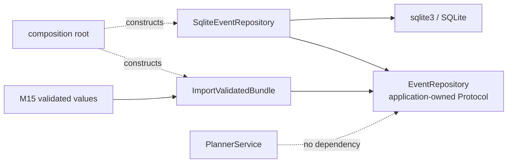
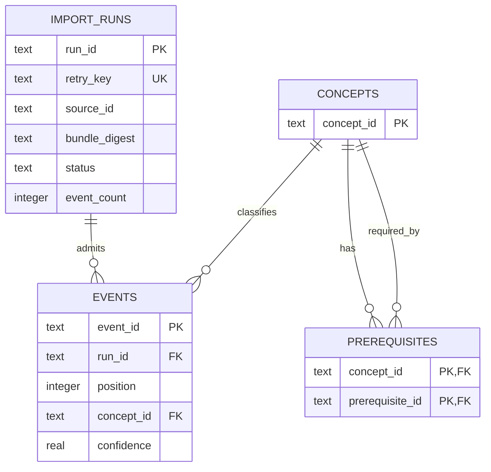
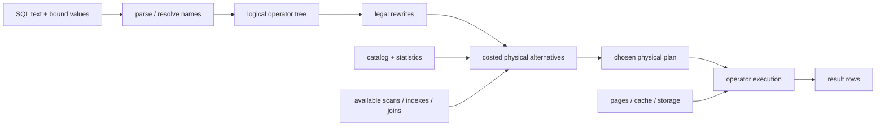
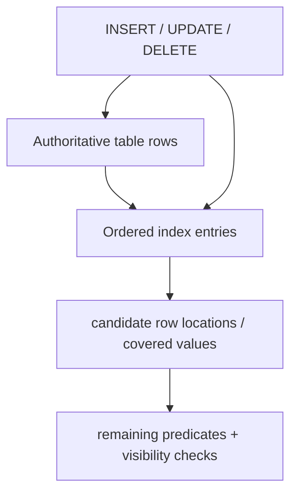
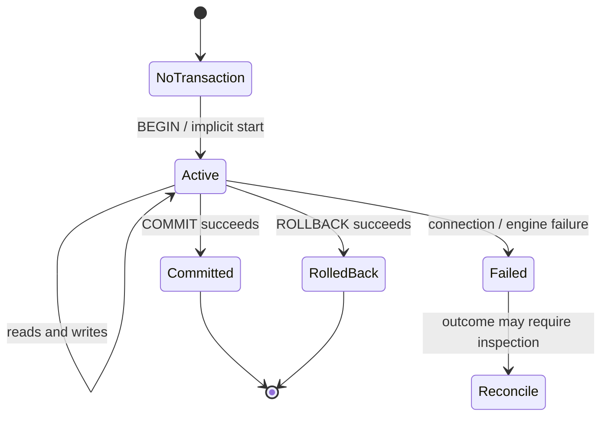
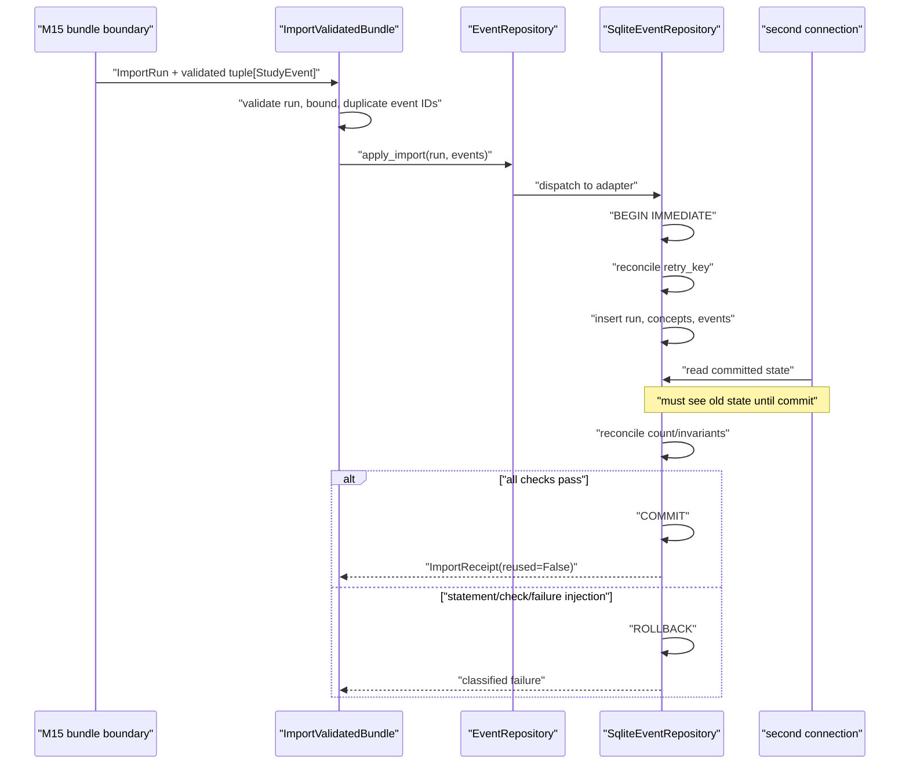
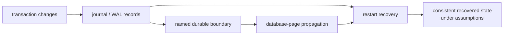
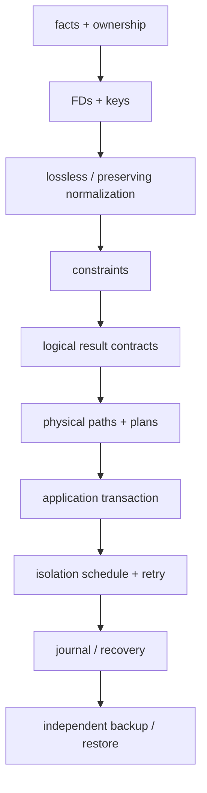

# Module 16 — Relational Data and Transactions

> **Arc III: durable software — from a validated portable bundle to shared,
> constrained, transactional state**
>
> A database is not “a faster file.” It is a system for representing
> relationships, enforcing invariants, coordinating operations, selecting
> physical work, and recovering under a named failure model.

Module 15 hands forward a strict UTF-8 `atlas.learning-events` schema-v1 bundle
whose decoded result is a validated ordered tuple of `StudyEvent` values. It
does **not** hand forward a JSON repository. Module 16 now introduces three new
application/persistence boundaries:

- `EventRepository` — the smallest application-owned persistence `Protocol`;
- `SqliteEventRepository` — the first concrete adapter;
- `ImportValidatedBundle` — the use case that reconciles a validated M15 bundle
  inside one application transaction and returns an `ImportReceipt`.

`PlannerService` remains repository-free. The Module 12 v1
`EventImporter`/`RankingPolicy` ports retain their meanings. The Module 13
diagnostic vocabulary remains privacy-safe: `source_id`, `line`, and `code`.

The connected pressure chain is:

```text
portable validated bundle
  → repeated facts and relationships
  → identities, functional dependencies, and relations
  → keys and constraints
  → declarative queries
  → physical access paths and measured plans
  → multi-step application transaction
  → competing connections and isolation
  → engine-specific journaling, recovery, and operational limits
```

The dominant learner work is schema derivation, query and plan reading,
two-connection schedule tracing, failure injection, architecture review, and
claim defense. Manual SQL/Python typing is limited to the smallest mechanisms
that make transaction and visibility boundaries observable.

---

## How to use this workbook

This is one argument with three resolutions, not a catalogue of SQL features.

1. **Logical:** decide what facts, identities, and legal states mean.
2. **Physical:** inspect how one named engine chose to find and combine rows.
3. **Transactional:** decide which group of changes must become visible together,
   what competing operations may observe, and which failures may be retried.

For each substantial example:

1. predict the result or visibility before execution;
2. label the authority for the claim;
3. trace one concrete event through the boundary;
4. state the invariant in plain language and then precisely;
5. inspect the query, plan, schedule, or patch;
6. collect evidence without upgrading it beyond its setup;
7. explain the cost and the next failure model.

The module uses these claim labels.

| Label | Authority and scope | Example |
|---|---|---|
| **[RELATIONAL CLAIM]** | A mathematical statement under named dependencies and set semantics | `run_id → source_id` is a claim about every legal state, not a pattern in one sample. |
| **[SQL CLAIM]** | A language/result-contract statement, with dialect differences called out | A query without `ORDER BY` does not promise presentation order. |
| **[PYTHON WRAPPER CLAIM]** | Python 3.14 `sqlite3` behavior | Parameter placeholders bind values; entering a connection context manager does not itself open a transaction. |
| **[SQLITE 3.53.4 CLAIM]** | Behavior documented for the pinned SQLite teaching baseline, subject to build and connection configuration | Foreign-key enforcement is audited per connection and write concurrency depends on journaling mode. |
| **[POSTGRESQL 18 CLAIM]** | Behavior documented for PostgreSQL 18 | Repeatable Read prevents phantoms in this product, and Serializable may abort a transaction for retry. |
| **[ATLAS POLICY]** | A product decision owned by Atlas | One accepted bounded bundle publishes its import run and all events, or publishes none of them. |
| **[EMPIRICAL OBSERVATION]** | A result from a recorded executable setup | This SQLite library selected `SEARCH events USING INDEX ...` after this data load and statistics state. |
| **[OPEN DECISION]** | A consequential choice deliberately not settled | Whether future unbounded imports stage to a temporary table or an external durable queue. |

The pinned documentation baseline and the *executed* lab environment are two
different records. Every run captures:

```text
Python implementation and exact patch:
sqlite3 wrapper/API mode:
linked SQLite version:
database path (must be disposable):
PRAGMA foreign_keys:
PRAGMA journal_mode:
busy timeout:
relevant compile options:
schema/data-generator revision:
statistics step:
```

If the executed SQLite version is not 3.53.4, keep the observation and change
the label; do not edit reality to match the workbook.

---

## 1. Position in the knowledge graph and problem pressure

### 1.1 The pressure inherited from Module 15

Module 15 can validate this logical sequence before Module 16 begins:

```text
StudyEvent("e-101", "hashing", 0.80)
StudyEvent("e-102", "transactions", 0.30)
StudyEvent("e-103", "graphs", 0.55)
```

It can encode the values in one bounded, versioned bundle, validate a manifest,
and publish one file under stated filesystem assumptions. That is real
durability progress. Now ask the file to support five operations:

1. connect every event to the import attempt that admitted it;
2. guarantee that every referenced concept exists;
3. add two prerequisites to one concept without duplicating its facts;
4. publish the run and all three events together after a failure on event two;
5. let another connection query committed events while an import is in flight.

A whole-file rewrite can simulate some outcomes, but the application must invent
identity, joins, uniqueness, lost-update handling, locking, and recovery. The
problem is no longer “how do I encode a value?” It is:

> How can several related durable facts remain legal as a group while queries,
> competing operations, and failures act on them?

That pressure derives the relational and transaction models.

```mermaid
    %% atlas-diagram-id: m16-relational-pressure
    %% atlas-diagram-title: From validated events to transactional recovery
    %% atlas-diagram-alt: Validated M15 events create identity and relational constraints, queries, physical plans, transactions, isolation schedules, and recovery assumptions.
flowchart LR
    B["Validated M15 bundle<br/>ordered StudyEvent values"] --> I["Identity pressure<br/>which event, run, and concept?"]
    I --> R["Relations and keys<br/>facts separated by meaning"]
    R --> C["Constraints<br/>legal committed states"]
    C --> Q["Declarative queries<br/>desired result"]
    Q --> P["Physical plan<br/>chosen work"]
    P --> T["Application transaction<br/>one visibility boundary"]
    T --> S["Isolation schedule<br/>competing connections"]
    S --> W["Journal / WAL / recovery<br/>named engine assumptions"]
```



The arrows are obligations. An index cannot repair a wrong key. A transaction
cannot decide an unowned domain policy. WAL cannot make an invalid committed
state correct. A backup cannot make an unsafe retry idempotent.

### 1.2 Continuity contract

The authored Arc III path deliberately differs from a hypothetical repository
that existed earlier:

| Earlier artifact | What Module 16 preserves | What Module 16 adds |
|---|---|---|
| M12 `EventImporter` and `RankingPolicy` v1 ports | names, version meaning, dependency direction | no database knowledge in either plugin port |
| M13 structured diagnostics | privacy-safe `source_id`, optional `line`, and stable `code` | database/import codes without SQL text or event content |
| M14 `PlannerService`, `PlanSnapshot`, `LegacyPlanFacade` | planning state machine and repository-free service | no persistence methods added to `PlannerService` |
| M15 `StudyEvent` and validated schema-v1 bundle | event order, value invariants, strict validation before this use case | a separate bundle-to-database import boundary |

**[ARCHITECTURE POLICY]** Module 16 introduces, rather than replaces:

| Public name | Layer | Responsibility | Must not own |
|---|---|---|---|
| `EventRepository` | application-owned port | the atomic persistence/query capabilities the import use case requires | bundle decoding, plugin choice, CLI wording, query-plan policy |
| `SqliteEventRepository` | outer adapter | schema installation, SQL, connection/transaction mechanics, error translation | whether an import is semantically acceptable |
| `ImportValidatedBundle` | application use case | reconcile a validated bounded tuple with source and retry identity, then request one atomic apply | JSON parsing, SQLite-specific statements, planner publication |
| `ImportRun` | application value | stable run/retry identity and source/digest facts | engine row identifiers or log formatting |
| `ImportReceipt` | application result | committed run identity, event count, and whether a prior identical result was reused | a promise that every replica or backup contains the result |
| `RetryClass` | application-visible failure category | distinguish never-retry, safe retry with same identity, and caller-decision cases | engine-specific exception strings |

The dependency direction is:



Data flows from the bundle through the use case into the adapter. Source-code
dependencies point toward the application-owned contract. The dashed
`PlannerService` edge explicitly says “no edge,” not “a future call.”

### 1.3 Prerequisite retrieval

Answer before reading further.

1. A Python object and its JSON representation are different values. Which
   Module 3 idea permits the representation to change without changing clients?
2. A generator yields two events and then raises. Which Module 7 fact prevents
   “iterate again” from undoing already performed writes?
3. Why is a hash digest derived evidence rather than the authority for event
   identity?
4. What does `O(log n)` omit about page reads, cache state, selectivity, and
   write maintenance?
5. If two tests pass, what quantifier prevents us from concluding that every
   legal database schedule is correct?
6. In a dependency graph, why should an application use case name a port rather
   than import `sqlite3`?
7. Which M13 distinction separates the exception location from the earliest
   violated assumption?
8. Why can retrying a partially visible operation create duplicates even if its
   second attempt is locally correct?

Repair routes:

- questions 1 and 6 → Modules 3, 12, and 14;
- questions 2 and 8 → Module 7 and M13 failure semantics;
- question 3 → Module 8 identity/hash contract;
- question 4 → Modules 5, 6, 8, and 9;
- question 5 → Module 4 logic and finite evidence;
- question 7 → Module 13 causal debugging.

### 1.4 Module question and invariant

The module question is:

> Given one validated Atlas bundle, how do we derive a relational
> representation, queries, physical evidence, and transaction boundary such
> that another connection never observes a successful run without all its
> events or an event without its run and concept?

The cumulative invariant is:

> **[ATLAS POLICY]** Every visible event references one visible concept and one
> successful import run. For a given retry identity, a bundle is applied once
> with its original meaning, or rejected; a failed attempt exposes no new run or
> events as committed state.

This statement contains several owners:

| Clause | Earliest owner | Evidence |
|---|---|---|
| event/run/concept identity | domain + relational design | key derivation and schema review |
| references exist | schema | foreign-key probes with enforcement asserted |
| “successful” status and event set agree | schema where expressible, otherwise repository transaction | adversarial write plus invariant query |
| retry identity reuses only the same request | M15 metadata authority + use case + repository/unique constraint | same-key metadata comparisons plus persisted position-ordered row reconciliation |
| failed attempt exposes no new committed rows | transaction implementation | injected failure and second-connection observation |
| survives a named crash | engine + storage configuration + operations | documented guarantee and disposable crash/restore rehearsal |

### 1.5 Learning outcomes

At exit, Michael can:

1. distinguish relation/tuple/attribute/domain from SQL table/row/column/type;
2. reason about SQL bags, `NULL`, and three-valued predicates without pretending
   they are mathematical set semantics;
3. derive candidate keys and functional dependencies from legal-state meaning;
4. identify update, insertion, and deletion anomalies;
5. compute a small attribute closure and justify 1NF, 2NF, 3NF, and BCNF;
6. test a decomposition for losslessness and discuss dependency preservation;
7. translate selection, projection, join, grouping, and set operations into SQL
   while stating duplicate and order semantics;
8. enforce suitable invariants with `NOT NULL`, `CHECK`, `UNIQUE`, primary keys,
   and foreign keys, while naming what remains application policy;
9. use value binding safely and reject dynamic identifiers/query structure
   unless selected through a closed allowlist;
10. reconstruct the `ImportValidatedBundle → EventRepository →
    SqliteEventRepository` boundary from code;
11. connect a logical query to pages, scans, B-tree access paths, joins,
    statistics, and an engine-generated plan;
12. justify one composite index from a named workload and account for space and
    write maintenance;
13. distinguish transaction state, autocommit mode, application atomicity,
    consistency ownership, isolation, and durability;
14. trace two-connection schedules and classify dirty/nonrepeatable/phantom-like
    observations, lost updates, busy errors, and serialization failures;
15. explain why SQLite and PostgreSQL can satisfy related transaction contracts
    through different mechanisms and product guarantees;
16. classify retries by operation identity and failure phase;
17. separate journal/WAL, checkpoint, recovery, backup, and restore claims;
18. direct and review a bounded agent repository patch with independent
    constraint, plan, rollback, visibility, and idempotency evidence.

---

## 2. Relations, identity, functional dependencies, and normalization

### 2.1 Begin with a repeated-fact record

Suppose Atlas flattens import, event, concept, and prerequisite facts:

| run_id | source_id | bundle_digest | event_id | position | concept_id | confidence | prerequisite_id |
|---|---|---|---|---:|---|---:|---|
| `run-7` | `bundle-A` | `sha256:aaa` | `e-101` | 0 | `hashing` | 0.80 | `arrays` |
| `run-7` | `bundle-A` | `sha256:aaa` | `e-101` | 0 | `hashing` | 0.80 | `equality` |
| `run-7` | `bundle-A` | `sha256:aaa` | `e-102` | 1 | `transactions` | 0.30 | `state` |

The first event appears twice only because `hashing` has two prerequisites.
Now predict:

- If confidence changes, how many rows must change?
- Can Atlas represent a concept before it has an event?
- If the last event for `hashing` is deleted, should its prerequisite facts
  disappear?
- Which column or columns identify a row?

There is no honest answer until we separate facts by meaning.

### 2.2 Precise relational vocabulary

**[RELATIONAL CLAIM]**

- A **domain** is the set of permitted atomic values for an attribute.
- An **attribute** is a named role whose values come from a domain.
- A **tuple** assigns one value to each attribute of a relation schema.
- A **relation** is a set of distinct tuples satisfying its schema and
  constraints.
- A **relation schema** names attributes and their intended domains; a
  **relation instance** is one legal state at a time.

An SQL table is a useful implementation of related ideas, but the mapping is
not identity:

| Relational model | SQL reality to inspect |
|---|---|
| relation is a set | a table/query result can retain duplicate rows |
| tuple has attributes | a row has columns but physical order/storage is engine-specific |
| value comes from a domain | declared SQL type rules and coercions vary by engine |
| ordinary value is present | SQL permits `NULL` unless excluded |
| relation has no presentation order | SQL result order is unspecified without `ORDER BY` |

“Table,” “row,” and “column” are fine implementation words. They become
misleading when they smuggle in set, non-null, or order guarantees that SQL did
not establish.

### 2.3 `NULL` creates three-valued predicate results

In ordinary two-valued logic, a proposition is true or false. In SQL, a
comparison involving missing/unknown information can evaluate to `UNKNOWN`.

| Predicate | Result |
|---|---|
| `0.3 < 0.5` | `TRUE` |
| `NULL < 0.5` | `UNKNOWN` |
| `NULL = NULL` | `UNKNOWN`, not `TRUE` |
| `NULL IS NULL` | `TRUE` |

A `WHERE` clause keeps rows for which its condition is `TRUE`; `FALSE` and
`UNKNOWN` do not pass. Therefore:

```sql
SELECT event_id
FROM events
WHERE source_line <> 10;
```

does not select a row whose `source_line` is `NULL`. If the intended question is
“known and not 10, or unknown,” state both cases:

```sql
SELECT event_id
FROM events
WHERE source_line <> 10 OR source_line IS NULL;
```

**Prediction:** if `CHECK (confidence >= 0 AND confidence <= 1)` sees `NULL`,
does it necessarily reject the row? Do not rely on the answer: pair the check
with `NOT NULL` when the domain requires presence.

Atlas keeps `event_id`, `concept_id`, `run_id`, `position`, and `confidence`
non-null. A diagnostic `line` may be null because a whole-bundle failure may
have no source-record line. Optionality is designed, not inherited from a
default.

### 2.4 Keys begin with identity

For a relation schema \(R\):

- a **superkey** is an attribute set that uniquely identifies every tuple in
  every legal instance;
- a **candidate key** is a minimal superkey;
- a **primary key** is one candidate key chosen as the main SQL identifier;
- an **alternate key** is another candidate key;
- a **foreign key** requires referencing values to match a candidate/unique key
  in another relation, subject to the engine’s null and timing semantics.

Minimality matters. If `event_id` alone identifies an event, then
`{event_id, concept_id}` is a superkey but not a candidate key.

Atlas chooses:

| Relation | Candidate keys | Chosen primary key | Reason |
|---|---|---|---|
| `import_runs` | `run_id`; `retry_key` | `run_id` | run identity is application-generated; retry identity is independently unique |
| `concepts` | `concept_id` | `concept_id` | M15 has only stable concept identity, not a separate title |
| `events` | `event_id`; `(run_id, position)` | `event_id` | preserve M15 event identity and ordered position |
| `prerequisites` | `(concept_id, prerequisite_id)` | the pair | the edge itself is the fact |

The choice creates policy:

- a new bundle that reuses an existing `event_id` with different meaning is
  rejected;
- the same `retry_key` may return a prior receipt only if run/source/raw-bundle
  metadata and the persisted position-ordered event values agree;
- prerequisite order is not invented because the pair represents an unordered
  graph edge.

### 2.5 Functional dependencies describe all legal states

For attribute sets \(X\) and \(Y\), the functional dependency
\(X \rightarrow Y\) means:

> In every legal instance, any two tuples that agree on every attribute in
> \(X\) also agree on every attribute in \(Y\).

It is not:

- “these columns happened to be unique in today’s file”;
- a causal claim;
- a direction of program execution;
- necessarily an SQL foreign key.

For the flattened Atlas relation

\[
R(\text{Run}, \text{Source}, \text{Digest}, \text{Event},
\text{Position}, \text{Concept}, \text{Confidence}, \text{Prerequisite})
\]

the intended dependencies include:

\[
\begin{aligned}
\text{Run} &\rightarrow \text{Source}, \text{Digest}\\
\text{Event} &\rightarrow
  \text{Run}, \text{Position}, \text{Concept}, \text{Confidence}\\
\text{Run}, \text{Position} &\rightarrow \text{Event}
\end{aligned}
\]

`Concept → Prerequisite` is **not** a functional dependency because one concept
may have several prerequisites. The pair is a many-valued relationship.

### 2.6 Attribute closure answers “does this determine that?”

Given dependencies \(F\), the closure \(X^+\) is the set of attributes
functionally determined by \(X\).

Algorithm:

1. start \(X^+ = X\);
2. if an FD’s left side is contained in \(X^+\), add its right side;
3. repeat until no attribute is added.

For `Event`:

1. start `{Event}`;
2. add `{Run, Position, Concept, Confidence}`;
3. because `Run → Source, Digest`, add `{Source, Digest}`;
4. `Prerequisite` is not added.

Therefore `Event` does not key the flattened prerequisite rows. The candidate
key must include `Prerequisite` there. This is the shape of the redundancy:
event facts repeat once per prerequisite edge.

Armstrong’s axioms give sound inference rules:

- reflexivity: if \(Y \subseteq X\), then \(X \rightarrow Y\);
- augmentation: \(X \rightarrow Y\) implies \(XZ \rightarrow YZ\);
- transitivity: \(X \rightarrow Y\) and \(Y \rightarrow Z\) imply
  \(X \rightarrow Z\).

They support derivation; they do not discover domain meaning for us.

### 2.7 Anomalies are evidence of mixed facts

| Anomaly | Flattened Atlas example | Violated intent |
|---|---|---|
| update | changing a run digest in one prerequisite row leaves another old value | one run has one digest |
| insertion | a concept with no event cannot be represented without fake event data | concept identity is independent |
| deletion | deleting the last event for a concept accidentally removes its prerequisite edges | graph facts outlive one observation |

“Normalize the table” is not the first principle. The first principle is:

> Facts with different identities and change lifetimes should not be forced to
> share one tuple identity.

### 2.8 Normal forms, one pressure at a time

**First normal form (1NF).** Attribute values are atomic relative to the chosen
domains; there are no repeating attribute groups such as `prerequisite_1`,
`prerequisite_2`, or a delimiter-packed list treated as several values.
“Atomic” is model-relative: a timestamp may be one value for Atlas even though
it has calendar components.

**Second normal form (2NF).** A 1NF relation has no non-prime attribute
functionally dependent on a proper subset of a candidate key. This pressure
appears with composite keys. In the flattened prerequisite relation, if the key
is `(Event, Prerequisite)`, all event facts depend on only `Event`: a partial
dependency.

**Third normal form (3NF).** For every nontrivial FD \(X \rightarrow A\), either
`X` is a superkey or `A` is a prime attribute (part of some candidate key).
This permits a narrow class of dependencies to preserve constraints that BCNF
decomposition might otherwise separate.

**Boyce–Codd normal form (BCNF).** For every nontrivial FD
\(X \rightarrow Y\), `X` is a superkey. BCNF gives a stronger redundancy rule.

Do not memorize “1, 2, 3, BCNF” as a ladder of table beautification. At each
step ask:

1. what are the candidate keys?
2. which FDs are claims about legal states?
3. which determinant is not a superkey?
4. what redundancy/anomaly follows?
5. can a decomposition reconstruct exactly the legal facts?
6. can the important dependencies still be checked locally?

### 2.9 Derive the Atlas decomposition

Ignore prerequisites for one moment and examine:

\[
E(\text{Run},\text{Source},\text{Digest},\text{Event},
\text{Position},\text{Concept},\text{Confidence})
\]

with:

- `Run → Source, Digest`;
- `Event → Run, Position, Concept, Confidence`;
- `Run, Position → Event`.

`Event` and `(Run, Position)` are candidate keys. `Run → Source, Digest`
violates 3NF and BCNF because `Run` is not a superkey and the right-side
attributes are non-prime.

Decompose into:

```text
ImportRuns(Run, Source, Digest)
Events(Event, Run, Position, Concept, Confidence)
```

Then add independent identity/relationship relations:

```text
Concepts(Concept)
Prerequisites(Concept, Prerequisite)
```

The resulting fact map is:



The two relationships from `CONCEPTS` to `PREREQUISITES` have different roles:
one edge leaves the learned concept and the other points to the required
concept. Role names matter even when both foreign keys reference the same table.

### 2.10 Lossless join and dependency preservation answer different questions

A decomposition is **lossless** under \(F\) when joining its projections
reconstructs exactly the original relation for every legal instance—no lost
facts and no spurious combinations.

For a binary decomposition of \(R\) into \(R_1\) and \(R_2\), a useful test is:
the common attributes must functionally determine all attributes of at least
one side under \(F^+\).

`ImportRuns ∩ Events = {Run}` and `Run → Source, Digest`, so `Run` determines
the `ImportRuns` side. The decomposition is lossless under the stated FDs.

A decomposition is **dependency preserving** when the dependencies projected
onto the components can enforce all of \(F\) without joining components merely
to check them.

Here:

- `Run → Source, Digest` lives in `ImportRuns`;
- `Event → Run, Position, Concept, Confidence` lives in `Events`;
- `Run, Position → Event` lives in `Events`.

The selected dependencies are preserved.

Losslessness does not imply dependency preservation. BCNF decomposition is
lossless when performed correctly, but can lose local enforceability of some
FDs. A 3NF synthesis may preserve dependencies while accepting limited
redundancy. The design decision names which property and workload matter.

### 2.11 Normalization is not a performance superstition

Normalization primarily protects meaning and change. It can add joins.
Denormalization may later be justified by:

- a named read workload;
- a measured plan/cost problem;
- an explicit refresh/consistency owner;
- evidence that the duplicate representation can be maintained safely.

It is not justified by “joins are slow.” Module 16 first keeps authoritative
facts normalized and derives one index from the query workload. A cached summary
or materialized view would be a separately owned derived representation.

---

## 3. Constraints, SQL result contracts, and Python DB-API boundaries

### 3.1 Constraints make some illegal states unrepresentable at the boundary

The first SQLite schema is intentionally explicit:

```sql
CREATE TABLE import_runs (
    run_id          TEXT NOT NULL PRIMARY KEY,
    retry_key       TEXT NOT NULL UNIQUE,
    source_id       TEXT NOT NULL,
    bundle_digest   TEXT NOT NULL,
    status          TEXT NOT NULL CHECK (status = 'succeeded'),
    event_count     INTEGER NOT NULL CHECK (event_count >= 0),
    imported_at     TEXT NOT NULL
);

CREATE TABLE concepts (
    concept_id      TEXT NOT NULL PRIMARY KEY
                    CHECK (length(trim(concept_id)) > 0)
);

CREATE TABLE events (
    event_id        TEXT NOT NULL PRIMARY KEY
                    CHECK (length(trim(event_id)) > 0),
    run_id          TEXT NOT NULL
                    REFERENCES import_runs(run_id) ON DELETE RESTRICT,
    position        INTEGER NOT NULL CHECK (position >= 0),
    concept_id      TEXT NOT NULL
                    REFERENCES concepts(concept_id) ON DELETE RESTRICT,
    confidence      REAL NOT NULL
                    CHECK (
                        confidence >= 0.0
                        AND confidence <= 1.0
                    ),
    UNIQUE (run_id, position)
);

CREATE TABLE prerequisites (
    concept_id      TEXT NOT NULL
                    REFERENCES concepts(concept_id) ON DELETE CASCADE,
    prerequisite_id TEXT NOT NULL
                    REFERENCES concepts(concept_id) ON DELETE RESTRICT,
    PRIMARY KEY (concept_id, prerequisite_id),
    CHECK (concept_id <> prerequisite_id)
);
```

This is executable mechanism, not a proof of all Atlas policy:

| Constraint | What it blocks | What it does not decide |
|---|---|---|
| primary/unique key | duplicate identity under its equality semantics | whether two different IDs refer to the same real-world event |
| foreign key | missing referenced row when enforcement is active | whether a prerequisite path is pedagogically valid or cyclic |
| `NOT NULL` | absence | whether a nonempty string has honest meaning |
| `CHECK` | row-local predicate failure | cross-row event-count equality in ordinary portable form |
| transaction | partial committed write under its boundary/mechanism | whether the group is the correct application operation |

The explicit `NOT NULL` on text primary keys is deliberate. **[SQLITE 3.53.4
CLAIM]** In an ordinary SQLite rowid table, historical primary-key handling can
permit `NULL` in cases other than `INTEGER PRIMARY KEY`, `WITHOUT ROWID`, or
`STRICT` tables unless `NOT NULL` is stated. PostgreSQL primary keys imply
non-null. Atlas writes the invariant explicitly rather than importing one
engine’s intuition into another.

**[SQLITE 3.53.4 CLAIM]** The lab enables `PRAGMA foreign_keys = ON` for every
connection and immediately asserts that it reads back as `1`. Declaring a
foreign key while failing to audit enforcement is not evidence.

**[POSTGRESQL 18 CLAIM]** PostgreSQL enforces declared foreign keys without that
per-connection pragma, but does not automatically create every useful index on
the referencing columns. Product behavior must not be copied from one engine to
the other.

### 3.2 The count invariant crosses rows

`import_runs.event_count` duplicates a derived count for receipt/audit purposes:

\[
\text{event\_count(run)} =
|\{e \in Events \mid e.run\_id = run\}|
\]

A row-local `CHECK` cannot query `events` in this schema. Atlas preserves the
invariant by:

1. validating the bounded tuple before persistence;
2. inserting the run and exactly that tuple in one adapter transaction;
3. checking `changes/count` before commit;
4. providing an independent reconciliation query after commit.

The duplicated count is deliberate audit metadata. If it becomes mutable from
several code paths, remove it or add a stronger database-owned mechanism.

### 3.3 Core relational algebra becomes a result contract

Relational algebra states transformations over relations:

| Intent | Algebra | SQL shape | Important SQL qualification |
|---|---|---|---|
| keep rows | selection \(\sigma_p(R)\) | `WHERE p` | three-valued predicates |
| keep/derive attributes | projection \(\pi_A(R)\) | `SELECT A` | duplicates remain unless `DISTINCT` |
| combine related tuples | join \(R \bowtie_p S\) | `JOIN ... ON p` | nulls and duplicate multiplicity matter |
| all combinations | product \(R \times S\) | `CROSS JOIN` | usually large: \(|R||S|\) |
| combine compatible sets | union \(R \cup S\) | `UNION` | `UNION` removes duplicates; `UNION ALL` does not |
| remove members | difference \(R - S\) | `EXCEPT` | dialect/type/multiplicity rules matter |
| summarize groups | extended algebra/grouping | `GROUP BY` | aggregation and null behavior require a precise contract |
| existential relation | semijoin idea | `EXISTS (...)` | often clearer than producing then deduplicating a join |

Example application query:

> Return low-confidence events from successful imports for concepts that depend
> directly on `state`, newest run first, with deterministic ties.

```sql
SELECT
    e.event_id,
    e.concept_id,
    e.confidence,
    r.run_id,
    r.imported_at
FROM events AS e
JOIN import_runs AS r
  ON r.run_id = e.run_id
WHERE e.confidence < ?
  AND EXISTS (
      SELECT 1
      FROM prerequisites AS p
      WHERE p.concept_id = e.concept_id
        AND p.prerequisite_id = ?
  )
ORDER BY r.imported_at DESC, r.run_id ASC, e.position ASC;
```

The placeholders are bound to `0.5` and `"state"`. `ORDER BY` is semantic here:
without it, physical row/index order is not a result promise.

### 3.4 Bags change join reasoning

Suppose two `events` rows refer to `graphs` and `graphs` has three prerequisite
rows. A join produces six result rows. That is not the database “duplicating
events”; it is the multiplicity of matching pairs.

Choose the result contract:

- use the six event–prerequisite pairs if each edge matters;
- use `EXISTS` if asking whether at least one edge exists;
- use `SELECT DISTINCT e.event_id ...` only if event identity is the desired
  set and duplicate elimination cost is acceptable;
- aggregate deliberately if asking for prerequisite counts.

Adding `DISTINCT` reflexively can conceal an incorrect join and add sort/hash
work. First name the intended relation.

### 3.5 Subqueries and set operations are alternatives in the logical space

These two queries can express the same intended set of concept IDs:

```sql
SELECT DISTINCT e.concept_id
FROM events AS e
WHERE e.confidence < 0.5;
```

```sql
SELECT c.concept_id
FROM concepts AS c
WHERE EXISTS (
    SELECT 1
    FROM events AS e
    WHERE e.concept_id = c.concept_id
      AND e.confidence < 0.5
);
```

Logical equivalence is conditional on result semantics, null assumptions, and
duplicate handling. It does not imply identical physical execution. The
optimizer may transform both, or may not, under the recorded engine/version.

### 3.6 Bind values; validate structure

Unsafe interpolation confuses data with SQL program text:

```python
def unsafe_event_lookup(event_id: str) -> str:
    # Intentionally broken: event_id becomes SQL structure.
    return f"SELECT confidence FROM events WHERE event_id = '{event_id}'"
```

Binding keeps the value separate:

```python
from __future__ import annotations

import sqlite3


def confidence_for(
    connection: sqlite3.Connection,
    event_id: str,
) -> float | None:
    row = connection.execute(
        "SELECT confidence FROM events WHERE event_id = ?",
        (event_id,),
    ).fetchone()
    return None if row is None else float(row[0])
```

**[PYTHON WRAPPER CLAIM]** `sqlite3` supports DB-API placeholder binding for
values. The placeholder must not be quoted, and a one-element parameter
sequence needs the comma shown above.

Placeholders do not bind identifiers, keywords, sort directions, operators, or
whole clauses. If a supported feature chooses ordering, map a closed application
value to reviewed SQL:

```python
from __future__ import annotations

from enum import Enum


class EventOrder(Enum):
    LOW_CONFIDENCE = "low_confidence"
    SOURCE_POSITION = "source_position"


ORDER_SQL: dict[EventOrder, str] = {
    EventOrder.LOW_CONFIDENCE: "confidence ASC, event_id ASC",
    EventOrder.SOURCE_POSITION: "run_id ASC, position ASC",
}


def ordered_event_sql(order: EventOrder) -> str:
    return (
        "SELECT event_id, run_id, position, concept_id, confidence "
        f"FROM events ORDER BY {ORDER_SQL[order]}"
    )
```

The mapping is code under review. Do not accept arbitrary user strings and
“escape” them into identifier/query structure.

### 3.7 Repository boundary: capability without SQL leakage

The application-owned port is intentionally smaller than `sqlite3.Connection`:

```python
from __future__ import annotations

from dataclasses import dataclass
from enum import Enum
from typing import Protocol, Sequence


@dataclass(frozen=True, slots=True)
class StudyEvent:
    event_id: str
    concept_id: str
    confidence: float


@dataclass(frozen=True, slots=True)
class ImportRun:
    run_id: str
    retry_key: str
    source_id: str
    bundle_digest: str


@dataclass(frozen=True, slots=True)
class ImportReceipt:
    run_id: str
    event_count: int
    reused: bool


class RetryClass(Enum):
    NEVER = "never"
    SAME_IDENTITY = "same_identity"
    CALLER_DECISION = "caller_decision"


class EventRepository(Protocol):
    def apply_import(
        self,
        run: ImportRun,
        events: Sequence[StudyEvent],
    ) -> ImportReceipt:
        """Atomically apply or idempotently reuse one validated import."""

    def events_for_concept(
        self,
        concept_id: str,
    ) -> tuple[StudyEvent, ...]:
        """Return a deterministic application-level result."""
```

The port says nothing about cursors, `BEGIN IMMEDIATE`, SQLite error codes,
index names, or `EXPLAIN`. Those belong to the adapter/evidence lab.

It also does not decode a bundle. `ImportValidatedBundle` receives values only
after M15’s `load_bundle_bytes` or equivalent validated boundary succeeds. This
separation keeps:

```text
bytes/schema/integrity failure
    distinct from
relational/constraint/transaction failure
```

### 3.8 Diagnostics preserve source vocabulary without leaking data

The use case may emit or raise a structured failure such as:

```text
source_id=bundle-A
line=null
code=database_busy_retryable
run_id=run-7
```

It must not log:

- SQL containing interpolated user values;
- the bundle contents;
- event confidence histories as unrestricted context;
- a full filesystem path when a stable privacy-safe `source_id` is enough.

`line` remains optional. A transaction commit failure concerns the whole
operation and may have no source-record line. Preserving the vocabulary does
not mean fabricating precision.

---

## 4. Logical queries, physical indexes, and plan evidence

### 4.1 Declarative does not mean mechanism-free

SQL lets the caller describe a desired result without fixing one procedure.
The engine still performs physical work:



Logical equivalence constrains which results are legal. It does not select one
physical plan. The optimizer chooses under incomplete estimates, bounded search,
available operators, configuration, and current catalog statistics.

This connects backward:

- Module 7: many executor nodes behave like stateful producers consumed by a
  parent;
- Module 9: B-tree order supports logarithmic navigation and range scans;
- Module 10: a plan is a directed tree/graph whose edges mean data production;
- Module 11: optimization selects a feasible strategy under an objective and
  incomplete information.

### 4.2 Pages are the unit that makes “one lookup” incomplete

A database does not generally ask storage for one Python row object. It manages
fixed-size **pages** containing records, index entries, and metadata. Conceptual
cost therefore includes:

- pages read from storage;
- pages already resident in memory;
- CPU comparisons and predicate evaluation;
- temporary pages/memory for sort, hash, or aggregation;
- output rows;
- synchronization and log work;
- maintenance of every affected index.

The exact page format and cache architecture are engine implementation details.
The transferable model is:

> Physical locality and page transfers can dominate the apparent number of
> logical row operations.

A sequential scan may be rational when a query returns much of a compact table.
An index may be rational when it can navigate to a selective region and avoid
many table pages. “Index lookup is \(O(\log n)\)” is a useful skeleton, not a
runtime prediction.

### 4.3 A B-tree index is maintained derived state

A database B-tree family keeps separators and child references in internal
pages and ordered key entries at or near leaves. High branching factor keeps
height small:

\[
\text{navigation height} \approx O(\log_B N)
\]

where \(B\) reflects entries per page, not the binary branching factor from a
textbook binary search tree.

For a range yielding \(k\) entries, a useful abstract cost is:

\[
O(\log_B N + k)
\]

plus table lookups when the index does not contain all required output.

Every index is derived:



Costs:

- additional disk and cache space;
- page splits/rebalancing and log work;
- slower inserts/deletes;
- updates when indexed values change;
- statistics and maintenance;
- wider review/operational surface.

An index is not a second authority. A corrupt or stale index is an engine
integrity/recovery concern, not a new source of domain truth.

### 4.4 Derive one composite index from one Atlas operation

The application contract asks:

> For one `concept_id`, return low-confidence events first with `event_id` as
> the deterministic tie break.

Logical SQL:

```sql
SELECT event_id, concept_id, confidence
FROM events
WHERE concept_id = ?
ORDER BY confidence ASC, event_id ASC;
```

Candidate:

```sql
CREATE INDEX idx_events_concept_confidence
ON events (concept_id, confidence);
```

Reason:

1. equality on `concept_id` selects one contiguous key region;
2. within that region, keys are ordered by `confidence`;
3. this matches the leading filter/order work;
4. tied confidence still needs the explicit `event_id` order.

Composite order matters. `(confidence, concept_id)` serves a different
prefix. A common B-tree rule of thumb is “equality columns before range/order
columns,” but the final choice belongs to the actual query set and engine.

### 4.5 Covering is query-relative

The narrow candidate does not deliberately contain `event_id`. If the engine
must visit table rows to obtain it and sort ties, it is not covering/fully
ordered for this projection.

A wider candidate could be:

```sql
CREATE INDEX idx_events_concept_confidence_event
ON events (concept_id, confidence, event_id);
```

For the named query, a named engine may report a covering index scan. But the
wider key:

- occupies more pages;
- reduces fan-out;
- increases write/log/cache work;
- may duplicate key material already maintained elsewhere;
- still does not cover a query that asks for a new column.

The runnable reference installs the wider candidate so its plan lab can inspect
a covering, correctly ordered path. A production decision would compare it
against the narrow candidate and no candidate under the fixed workload.
“Covering” is a relationship among query, index, table layout, and engine—not a
permanent index property.

### 4.6 Selectivity and correlation shape plan choice

**Selectivity** is the fraction of rows passing a predicate. An index on a
column whose value is identical in almost every row may cost more than scanning
the table. Multi-column estimates are harder when values are correlated.

Example:

- 95% of events are for `python`;
- 5% are spread across 500 other concepts;
- the query parameter is sometimes `python`, sometimes `transactions`.

One universal claim about “the concept index” ignores the parameter and
distribution. Prepared/generic plan behavior also differs by product.

Statistics summarize data; they are not the data itself. They can be stale,
coarse, or unable to represent correlation. The optimizer can be rational
relative to its estimates and still choose a plan that performs poorly on a
particular distribution.

### 4.7 `EXPLAIN` is evidence about a plan interface

SQLite lab:

```sql
EXPLAIN QUERY PLAN
SELECT event_id, run_id, position, concept_id, confidence
FROM events
WHERE concept_id = 'transactions'
ORDER BY run_id, position;
```

Read the high-level records as a tree and look for ideas such as a scan, search,
index use, covering access, or temporary sort. Do not assert that the wording,
record IDs, or formatting are a stable application API.

PostgreSQL 18:

```sql
EXPLAIN (ANALYZE, BUFFERS)
SELECT event_id, run_id, position, concept_id, confidence
FROM events
WHERE concept_id = 'transactions'
ORDER BY run_id, position;
```

**Warning:** `ANALYZE` executes the statement. For a modifying statement, use
only a disposable transaction/setup and understand rollback/side effects.
PostgreSQL estimates, actual row counts, loops, and buffer observations answer
different questions.

Plan output is scoped to:

- engine and exact version;
- schema and indexes;
- query text and bound/represented parameter;
- data distribution and cardinality;
- statistics state;
- configuration and cache/system state.

### 4.8 The fixed plan-evidence protocol

Record before changing an index:

| Field | Required value |
|---|---|
| question | which workload cost might the index reduce? |
| result contract | exact rows, duplicate semantics, and order |
| engine | linked SQLite version or PostgreSQL 18 build |
| schema | full DDL and existing indexes |
| data | generator seed, row counts, skew, value distribution |
| statistics | whether/when `ANALYZE` ran |
| query | exact SQL and representative parameters |
| baseline plan | unedited output |
| candidate plan | unedited output after one reviewed change |
| measurement | repeated setup, warm/cold qualification, result validation |
| write/space cost | database/index size and import-time comparison |
| decision | keep/reject, assumptions, revisit trigger |

Prediction before running:

1. small table with 20 rows;
2. 50,000 rows where `concept_id` has one value;
3. 50,000 rows with 10 rows for the selected concept;
4. same data but stale/no statistics;
5. query selects almost all rows and projects a non-indexed value.

For each, predict scan/search/sort and explain uncertainty. The grade is not
whether the optimizer obeys the prediction; the grade is whether evidence
updates the model.

### 4.9 Suspicious index patch

```diff
+ CREATE INDEX idx_1 ON events(concept_id);
+ CREATE INDEX idx_2 ON events(confidence);
+ CREATE INDEX idx_3 ON events(run_id);
+ CREATE INDEX idx_4 ON events(concept_id, confidence, run_id, position);
```

Review questions:

1. Which exact operations justify each index?
2. Which indexes overlap existing primary/unique/foreign-key access paths?
3. Which predicate/order makes the composite order useful?
4. Was result correctness verified before timing?
5. Were plan, distribution, statistics, write time, and database size saved?
6. What evidence would cause removal?

“More indexes make reads faster” should block acceptance.

---

## 5. Application transactions, isolation schedules, and retry classification

### 5.1 A transaction is an application-visible unit implemented by mechanisms

The Atlas operation is not “execute these statements”:

```text
insert run
insert missing concepts
insert events
```

It is:

> Apply one previously validated bundle so its successful run and complete
> ordered event set become visible together—or make no new committed change.

The use case owns that boundary. The adapter maps it to a database transaction.
If each statement commits separately, every statement can be individually valid
while the application operation is wrong.



Do not label an operation committed before commit succeeds. Do not label every
commit exception “rolled back” unless the named wrapper/engine state supports
that conclusion.

### 5.2 ACID is a responsibility map, not a spell

| Property | Useful meaning | Main owners | Does not establish |
|---|---|---|---|
| atomicity | transaction changes take effect as a unit or not at all under the engine’s failure model | application boundary + adapter + engine | correct choice of grouped work |
| consistency | a transaction moves one legal state to another | domain/use case + schema constraints + correct code | that every business rule was encoded |
| isolation | concurrent outcome/observations obey the selected guarantee | engine/mechanism/config + application schedule assumptions | zero blocking, zero aborts, or identical products |
| durability | committed effects survive the failures covered by the named configuration/storage contract | engine + OS/storage + operator configuration | backup, disaster recovery, replication, or impossible hardware loss |

“C” is often abused. The database enforces declared constraints; the
application must still choose truthful facts and transaction boundaries.

### 5.3 Python `sqlite3` transaction controls require an explicit audit

**[PYTHON 3.14 WRAPPER CLAIM]**

- `Connection.autocommit` is the recommended transaction-control surface in
  current documentation;
- Python 3.14 still currently defaults it to
  `LEGACY_TRANSACTION_CONTROL`;
- `isolation_level` controls legacy implicit transaction behavior and has no
  effect unless legacy control is active;
- a connection context manager commits or rolls back an already open
  transaction on exit as specified; entering does not by itself open one;
- exiting the context does not close the connection.

Version-sensitive code must record the mode. The runnable reference uses
`isolation_level=None` and explicit `BEGIN IMMEDIATE`, `COMMIT`, and `ROLLBACK`
so its transaction start is visible and it runs on older Python versions too.
That is a teaching choice, not a universal recommendation.

Prediction:

```python
from __future__ import annotations

import sqlite3


def context_manager_prediction(connection: sqlite3.Connection) -> None:
    with connection:
        pass
    # The connection is still usable here.
    connection.execute("SELECT 1").fetchone()
```

Which line opens a transaction? In this example, none necessarily does.

### 5.4 The bounded import sequence

**[ATLAS POLICY]** M15 validation finishes before a short write transaction.



Why validate first?

- failures from UTF-8/JSON/schema/domain remain M15 failures;
- duplicate event IDs and bundle bounds fail before write lock acquisition;
- the write transaction remains short and comprehensible.

Cost/limit:

- the bundle is materialized in memory: \(O(n)\) event values;
- another process could change state between validation and transaction, so
  database constraints/reconciliation still run;
- an unbounded future importer needs staging or another design.

### 5.5 Idempotency is identity plus same meaning

Retry key `rk-2026-07-29-001` means one logical request, not “please do anything
again.”

Repository policy:

1. no row for `retry_key` → attempt the import;
2. row exists with the same run/source/raw-artifact digest/count **and** its
   persisted position-ordered events equal the supplied validated tuple →
   return the prior receipt with `reused=True`;
3. row exists with different meaning → reject an idempotency conflict;
4. retry uses the same key after a retryable pre-commit failure;
5. a caller that invents a new key may create a distinct logical import.

The digest is SHA-256 of the exact encoded bundle artifact, supplied by the M15
publication/composition boundary. Decoded events cannot recompute it. It does
not replace `retry_key`; metadata-only equality does not replace ordered-row
reconciliation; none of these proves the bundle is benevolent.

### 5.6 Failure classification

| Failure | Example | `RetryClass` | Required condition |
|---|---|---|---|
| invalid request | duplicate event IDs in validated sequence contract | `NEVER` | fix caller/input |
| constraint conflict | existing `event_id` belongs to different run | `NEVER` | reconcile identity policy |
| idempotency conflict | same retry key, different digest/source/count | `NEVER` | caller must not reinterpret key |
| transient lock/busy before known rollback | SQLite busy/locked condition under recorded state | `SAME_IDENTITY` | bounded backoff and same request identity |
| PostgreSQL serialization/deadlock abort | product reports transaction must be retried | `SAME_IDENTITY` | retry entire transaction, not tail statements |
| commit outcome cannot be established | process/connection lost at boundary | `CALLER_DECISION` | reconcile by retry identity before deciding |
| programmer/schema mismatch | missing column, invalid SQL | `NEVER` | repair/deploy coherently |

Never retry by matching arbitrary message substrings alone if structured engine
codes are available. Even a retryable engine category becomes unsafe when the
application operation has no stable identity or contains external side effects
outside the transaction.

### 5.7 Schedules reveal anomalies

Notation:

- \(r_i(X)\): transaction \(T_i\) reads item/predicate \(X\);
- \(w_i(X)\): \(T_i\) writes it;
- \(c_i\): commit;
- \(a_i\): abort.

**Dirty read**

```text
w1(X=5) → r2(X=5) → a1
```

`T2` observed a value that never committed.

**Nonrepeatable read**

```text
r1(X=4) → w2(X=5) → c2 → r1(X=5)
```

Two reads in one transaction disagree.

**Phantom-like predicate change**

```text
r1(events WHERE confidence < .5 gives 2 rows)
→ T2 inserts matching row → c2
→ r1(same predicate gives 3 rows)
```

**Lost update**

```text
r1(count=4) → r2(count=4)
→ w1(count=5) → c1
→ w2(count=5) → c2
```

One increment disappears. It is not repaired merely by prohibiting dirty reads.

**Write skew**

Two transactions read a multi-row invariant, then update different rows so both
local writes are legal but the combined invariant fails. Serializable
execution or an appropriate constraint/locking design may be required.

### 5.8 Isolation level is a guarantee, not a universal mechanism

SQL phenomena provide a comparison vocabulary. Product guarantees may be
stronger than the minimum and mechanisms differ.

**[POSTGRESQL 18 CLAIM]**

| Requested level | PostgreSQL 18 teaching summary |
|---|---|
| Read Uncommitted | behaves like Read Committed |
| Read Committed | each command sees a snapshot as of that command; successive commands can see changes |
| Repeatable Read | transaction snapshot; prevents dirty and nonrepeatable reads and, in PostgreSQL, phantoms; serialization anomalies can still require design attention |
| Serializable | strongest product isolation via Serializable Snapshot Isolation; transactions may abort with serialization failure and must be retried as whole units |

This table is not an SQL-standard table and not a SQLite table.

**[SQLITE 3.53.4 CLAIM]**

- separate database connections see only complete committed transactions under
  documented isolation behavior, except the special shared-cache +
  `read_uncommitted` configuration that the lab does not enable;
- SQLite permits multiple readers but serializes writes;
- rollback-journal mode and WAL mode coordinate readers/writers differently;
- a WAL reader uses a snapshot/end mark; an attempted promotion to write can
  fail with a busy snapshot condition after another writer changes the database;
- `BEGIN DEFERRED`, `IMMEDIATE`, and `EXCLUSIVE` change when locks/write
  intent are acquired; exact effects depend on journaling mode.

Do not translate SQLite’s “serialized writes” into “all application schedules
are serializable.” Read-modify-write logic, transaction boundaries, and busy
handling still matter.

### 5.9 Two-connection prediction lab

Use a disposable file-backed database, not `:memory:`: ordinary `:memory:`
connections do not share the same database.

Schedule A:

```text
C1: BEGIN IMMEDIATE
C1: insert run + first event
C2: SELECT run/event counts
C1: inject failure; ROLLBACK
C2: SELECT run/event counts again
```

Expected under the lab configuration: C2 sees neither uncommitted prefix nor a
post-rollback change.

Schedule B:

```text
C1: BEGIN IMMEDIATE; apply complete run; COMMIT
C2: SELECT run/event counts
```

C2 sees the complete committed run and event set.

Schedule C:

```text
C1: BEGIN IMMEDIATE
C2: attempt BEGIN IMMEDIATE with short timeout
```

C2 may receive a busy/locked operational failure. That is evidence of
contention policy, not atomicity failure.

Record journal mode and timeout before interpreting any result.

### 5.10 The suspicious retry patch

```diff
 def apply_import(run, events):
-    begin_transaction()
-    try:
-        write_all(run, events)
-        commit()
-    except Exception:
-        rollback()
-        raise
+    for event in events:
+        while True:
+            try:
+                insert_and_commit(event)
+                break
+            except Exception:
+                continue
```

Reject because it:

- changes application atomicity to per-event visibility;
- retries permanent and programmer errors forever;
- has no stable reconciliation for an uncertain commit;
- can duplicate or conflict after partial success;
- creates unbounded load;
- discards run/event invariant evidence;
- swallows cancellation/termination policy.

The repair starts from the operation contract, not from a broader `except`.

---

## 6. WAL, recovery, backup, and bounded durability claims

### 6.1 Volatile execution and durable pages create an ordering problem

While a transaction executes, changes exist in volatile memory, database pages,
and/or a journal/log representation. A crash can occur between any two writes.
Recovery needs enough durable information and ordering to distinguish:

- committed effects that must be present;
- incomplete effects that must not appear committed;
- pages whose last complete state must be restored or reconstructed.

The broad write-ahead principle is:

> Required log information reaches the durability boundary before a
> corresponding changed data page is allowed to make recovery depend on it.

This principle does not imply identical file formats, concurrency models,
checkpoint protocols, or operations.



### 6.2 SQLite rollback journal and WAL are different modes

**[SQLITE 3.53.4 CLAIM]**

At a teaching-model level:

| Concern | Rollback-journal family | WAL mode |
|---|---|---|
| where changed history is staged | original-page information in a rollback journal supports rollback/atomic commit | changes append to a separate WAL before later checkpoint to main DB |
| reader/writer relationship | writer may need to exclude readers before final database-file writes | readers can continue from earlier end marks while one writer appends |
| checkpoint | not the same WAL checkpoint process | transfers eligible WAL content into the database; long readers can affect progress |
| snapshot behavior | journal-mode-specific locking | reader snapshot can become stale for write promotion and receive busy-snapshot |
| operational files | journal lifecycle matters | database, `-wal`, and shared-memory coordination must be treated together |

Exact atomic-commit claims depend on filesystem/storage assumptions, SQLite
build, `synchronous`, and failure type. The lab records configuration and does
not simulate disk damage against real data.

WAL mode can improve reader/writer overlap. It does not allow several concurrent
SQLite writers to mutate the same database simultaneously, and it is not
automatically the best mode for every deployment.

### 6.3 PostgreSQL WAL is not “SQLite WAL at server scale”

**[POSTGRESQL 18 CLAIM]**

PostgreSQL’s server architecture, buffer manager, WAL records, background
writing/checkpointing, process coordination, replication/archive capabilities,
and recovery procedures are product-specific. The transferable ordering idea
does not license copying SQLite file-handling advice into PostgreSQL operations.

For this module:

- PostgreSQL 18 documentation supplies a contrasting transaction/isolation/WAL
  contract;
- the first executable Atlas adapter remains SQLite;
- no learner must operate a PostgreSQL server to pass the initial checkpoint;
- any PostgreSQL observation requires its own server/configuration record.

### 6.4 Commit, checkpoint, backup, and restore are different events

| Event | Question it answers |
|---|---|
| commit | did this transaction become successful under the engine contract? |
| checkpoint | how is log/journal state reconciled with main data pages? |
| backup | what independently retained copy can be restored after loss/corruption/operator error? |
| restore | can the retained artifacts actually reconstruct a usable state? |
| point-in-time recovery | can a base backup plus retained log history reach a selected time under product procedure? |

“WAL is enabled” does not answer the backup question. A WAL file beside the
database can be lost with the same disk, mishandled during copying, or be
insufficient without the matching database state and product procedure.

### 6.5 Durability is bounded by configuration and the lower stack

A defensible statement looks like:

> **[ENGINE-SPECIFIC CLAIM]** Under SQLite 3.53.4, this journaling and
> `synchronous` configuration, a local disposable database on the recorded
> filesystem, and SQLite’s documented failure assumptions, a commit is intended
> to survive the covered process/OS failure. Storage-controller lying,
> filesystem defects, media loss, operator deletion, and disaster recovery are
> separate risks.

It does not look like:

> ACID means no data can ever be lost.

Modules 17–18 will explain buffers, system calls, page cache, device write
ordering, processes, filesystems, and permissions. Module 21 will widen the
model to replicas and uncertain network outcomes.

### 6.6 Database schema migration is a transaction/change problem

The M15 bundle schema version and the database schema version are independent.

```text
bundle schema v1
    --validated mapping-->
database schema v1
```

Later:

```text
bundle schema v1 or v2
    --adapter/use-case mapping-->
database schema v2
```

Changing one version does not automatically require changing the other.

A migration record includes:

1. source and target database schema versions;
2. preconditions and invariant query;
3. forward statements/data transformation;
4. transaction and locking behavior for the named engine;
5. failure/restart behavior;
6. compatibility window with old application versions;
7. backup/restore or forward-fix strategy;
8. representative-data plan/space/time estimate;
9. post-migration reconciliation.

SQLite’s `PRAGMA user_version` can store an application-defined integer, but
setting it is not a migration framework or correctness proof.

### 6.7 Bundle import is migration plus reconciliation

`ImportValidatedBundle` consumes M15’s *validated values*. It must not:

- reimplement UTF-8, JSON, manifest, or v0→v1 validation;
- serialize the `StudyEvent.__dict__`;
- invent `source_id` from a filesystem path;
- add repository methods to `PlannerService`;
- silently discard ordering;
- treat a matching count as complete reconciliation.

Its evidence compares:

| Before | After |
|---|---|
| validated event tuple | rows ordered by `position` reconstruct same values |
| tuple length | run audit count and actual row count |
| distinct M15 event IDs | database primary-key identities |
| source/retry/digest values | stored run metadata |
| no database change on rejected bundle | validation occurs before repository call |
| injected mid-write failure | neither run nor prefix visible after rollback |

### 6.8 Backup/restore rehearsal

Only disposable course data:

1. create/import a known database;
2. close or use the engine’s supported online-backup mechanism as appropriate;
3. record all files/procedure/version/configuration;
4. retain the backup outside the live database directory;
5. delete or move only the explicitly resolved disposable live file;
6. restore to a new disposable path;
7. open with audited foreign-key/journal settings;
8. run `integrity_check`/product checks as scoped evidence;
9. run Atlas reconciliation queries;
10. execute one new transaction;
11. record recovery time and any loss window.

Passing `PRAGMA integrity_check` is engine-structure evidence, not proof that
domain values are truthful. Passing Atlas reconciliation is application
evidence, not proof against media loss.

### 6.9 Recovery responsibility map

| Claim | Owner | Evidence | Residual limit |
|---|---|---|---|
| no partial import is committed | use case + adapter + engine | injected rollback and second connection | process/OS crash adds assumptions |
| foreign references are legal | schema + enforcement configuration | pragma assertion and adversarial FK insert | cannot prove pedagogical correctness |
| committed local state restarts | engine/config/storage | disposable crash/reopen test + docs | hardware/FS assumptions |
| operator can recover after loss | operations | independent backup and restore rehearsal | retention/RPO/RTO policy |
| retry does not duplicate | use case identity + unique constraints | same-key same/different request tests | external side effects need separate idempotency |
| distributed clients agree | not solved here | none | Modules 20–21 |

### 6.10 Never run destructive experiments against meaningful data

The reference uses a newly created temporary directory and deletes it only
through its scoped context. Crash labs use a separate script/process and an
explicitly resolved path beneath a disposable directory. If the exact target
cannot be proven disposable, stop.

---

## 7. Runnable Atlas repository reference and adversarial checks

### 7.1 What this reference establishes

The program is one standalone, typed `sqlite3` model. It uses only newly
created temporary directories. It includes:

- the new public port, adapter, use case, run/receipt/retry values;
- explicit wrapper-level autocommit mode plus explicit `BEGIN IMMEDIATE`;
- foreign-key/configuration assertions;
- normalized schema, constraints, binding, explicit order, and a justified
  concept/confidence/event index;
- metadata **and persisted ordered-row** reconciliation for retry identity;
- late failure observed from a second connection and full rollback;
- event/run identity conflicts, busy classification, plan evidence, and backup
  of committed state;
- an exact executed runtime/configuration record.

**M15 digest boundary:** `ImportRun.bundle_digest` is SHA-256 of the exact
encoded bundle artifact returned by M15 publication/composition. Decoded values
cannot reconstruct that raw-artifact digest. This use case validates only its
lowercase-hex shape; the M15 boundary owns its truth. Exact retry additionally
compares stored source/run/digest/count metadata with persisted ordered event
rows. The `make_run` default digest below is test convenience, not production
authority.

Prediction before execution:

1. Which tests fail if `PRAGMA foreign_keys = ON` is removed?
2. During the injected failure hook, what can the observer connection count?
3. After rollback, which tables retain the attempted run?
4. Can the injection-shaped concept string change SQL structure?
5. Which failure receives `SAME_IDENTITY`, and what must remain identical?
6. Does the backup include an uncommitted run held by another connection?
7. Will Python 3.14.6 necessarily link the SQLite 3.53.4 documentation baseline?

```python
# RUNNABLE-REFERENCE-START
"""Module 16 standalone sqlite3 reference candidate.

The application receives an already-decoded, already-domain-validated M15
``tuple[StudyEvent, ...]``.  This module deliberately does not parse JSON and
does not introduce persistence into PlannerService.

Run:
    python module16_reference_candidate.py
"""

from __future__ import annotations

import math
import sqlite3
import sys
import tempfile
import unittest
from collections.abc import Callable, Iterator, Sequence
from contextlib import contextmanager
from dataclasses import dataclass
from datetime import UTC, datetime
from enum import Enum
from pathlib import Path
from typing import Protocol


MAX_EVENTS = 1_000
MAX_ID_CHARS = 200


@dataclass(frozen=True, slots=True)
class StudyEvent:
    event_id: str
    concept_id: str
    confidence: float

    def __post_init__(self) -> None:
        for field_name, value in (
            ("event_id", self.event_id),
            ("concept_id", self.concept_id),
        ):
            if not isinstance(value, str):
                raise ValueError(f"{field_name} must be a string")
            if not value.strip():
                raise ValueError(f"{field_name} must be nonblank")
            if len(value) > MAX_ID_CHARS:
                raise ValueError(f"{field_name} exceeds character limit")
        if (
            isinstance(self.confidence, bool)
            or not isinstance(self.confidence, (int, float))
            or not math.isfinite(float(self.confidence))
            or not 0.0 <= float(self.confidence) <= 1.0
        ):
            raise ValueError("confidence must be finite and between 0 and 1")
        object.__setattr__(self, "confidence", float(self.confidence))


@dataclass(frozen=True, slots=True)
class ImportRun:
    run_id: str
    retry_key: str
    source_id: str
    bundle_digest: str


@dataclass(frozen=True, slots=True)
class ImportReceipt:
    run_id: str
    event_count: int
    reused: bool


class RetryClass(Enum):
    NEVER = "never"
    SAME_IDENTITY = "same_identity"
    CALLER_DECISION = "caller_decision"


class ImportFailure(Exception):
    """Privacy-safe structured failure using the M13 diagnostic vocabulary."""

    def __init__(
        self,
        *,
        source_id: str,
        line: int | None,
        code: str,
        run_id: str | None,
        retry_class: RetryClass,
    ) -> None:
        self.source_id = source_id
        self.line = line
        self.code = code
        self.run_id = run_id
        self.retry_class = retry_class
        # Do not include event data, SQL, or filesystem paths.
        super().__init__(
            "import failure "
            f"source_id={source_id!r} line={line!r} code={code!r} "
            f"run_id={run_id!r} retry_class={retry_class.value!r}"
        )


class EventRepository(Protocol):
    def apply_import(
        self,
        run: ImportRun,
        events: Sequence[StudyEvent],
    ) -> ImportReceipt:
        """Atomically apply or idempotently reuse one validated import."""

    def events_for_concept(
        self,
        concept_id: str,
    ) -> tuple[StudyEvent, ...]:
        """Return low-confidence-first values with an event-ID tie break."""


SCHEMA_STATEMENTS = (
    """
    CREATE TABLE IF NOT EXISTS import_runs (
        run_id          TEXT NOT NULL PRIMARY KEY,
        retry_key       TEXT NOT NULL UNIQUE,
        source_id       TEXT NOT NULL,
        bundle_digest   TEXT NOT NULL,
        status          TEXT NOT NULL CHECK (status = 'succeeded'),
        event_count     INTEGER NOT NULL CHECK (event_count >= 0),
        imported_at     TEXT NOT NULL
    )
    """,
    """
    CREATE TABLE IF NOT EXISTS concepts (
        concept_id      TEXT NOT NULL PRIMARY KEY
                        CHECK (length(trim(concept_id)) > 0)
    )
    """,
    """
    CREATE TABLE IF NOT EXISTS events (
        event_id        TEXT NOT NULL PRIMARY KEY
                        CHECK (length(trim(event_id)) > 0),
        run_id          TEXT NOT NULL
                        REFERENCES import_runs(run_id) ON DELETE RESTRICT,
        position        INTEGER NOT NULL CHECK (position >= 0),
        concept_id      TEXT NOT NULL
                        REFERENCES concepts(concept_id) ON DELETE RESTRICT,
        confidence      REAL NOT NULL
                        CHECK (
                            typeof(confidence) IN ('integer', 'real')
                            AND confidence >= 0.0
                            AND confidence <= 1.0
                        ),
        UNIQUE (run_id, position)
    )
    """,
    """
    CREATE TABLE IF NOT EXISTS prerequisites (
        concept_id      TEXT NOT NULL
                        REFERENCES concepts(concept_id) ON DELETE CASCADE,
        prerequisite_id TEXT NOT NULL
                        REFERENCES concepts(concept_id) ON DELETE RESTRICT,
        PRIMARY KEY (concept_id, prerequisite_id),
        CHECK (concept_id <> prerequisite_id)
    )
    """,
    """
    CREATE INDEX IF NOT EXISTS idx_events_concept_confidence_event
    ON events(concept_id, confidence, event_id)
    """,
    """
    CREATE INDEX IF NOT EXISTS idx_prerequisites_required_by
    ON prerequisites(prerequisite_id, concept_id)
    """,
)


LOW_CONFIDENCE_DEPENDENCY_SQL = """
SELECT
    e.event_id,
    e.concept_id,
    e.confidence,
    r.run_id,
    r.imported_at
FROM events AS e
JOIN import_runs AS r
  ON r.run_id = e.run_id
WHERE e.confidence < ?
  AND EXISTS (
      SELECT 1
      FROM prerequisites AS p
      WHERE p.concept_id = e.concept_id
        AND p.prerequisite_id = ?
  )
ORDER BY r.imported_at DESC, r.run_id ASC, e.position ASC
"""

EVENTS_FOR_CONCEPT_SQL = """
SELECT event_id, concept_id, confidence
FROM events
WHERE concept_id = ?
ORDER BY confidence ASC, event_id ASC
"""


def _utc_now_text() -> str:
    return datetime.now(UTC).isoformat().replace("+00:00", "Z")


def open_database(
    path: str | Path,
    *,
    timeout_seconds: float = 1.0,
    enable_wal: bool = True,
) -> sqlite3.Connection:
    """Open in wrapper-level autocommit mode; transactions are explicit below."""

    connection = sqlite3.connect(
        str(path),
        isolation_level=None,
        timeout=timeout_seconds,
    )
    connection.row_factory = sqlite3.Row
    connection.execute("PRAGMA foreign_keys = ON")
    foreign_keys = int(connection.execute("PRAGMA foreign_keys").fetchone()[0])
    if foreign_keys != 1:
        connection.close()
        raise RuntimeError("foreign key enforcement could not be enabled")
    milliseconds = max(0, int(timeout_seconds * 1_000))
    connection.execute(f"PRAGMA busy_timeout = {milliseconds}")
    if enable_wal:
        mode = str(connection.execute("PRAGMA journal_mode = WAL").fetchone()[0])
        if mode.lower() != "wal":
            connection.close()
            raise RuntimeError(f"expected WAL journal mode, received {mode!r}")
    if connection.isolation_level is not None:
        connection.close()
        raise RuntimeError("reference requires isolation_level=None")
    return connection


@contextmanager
def immediate_transaction(
    connection: sqlite3.Connection,
) -> Iterator[None]:
    """Make start, success, and failure boundaries visible in the code."""

    if connection.in_transaction:
        raise RuntimeError("nested/ambient transactions are not supported")
    try:
        connection.execute("BEGIN IMMEDIATE")
        yield
        connection.execute("COMMIT")
    except BaseException:
        if connection.in_transaction:
            connection.execute("ROLLBACK")
        raise


def install_schema(connection: sqlite3.Connection) -> None:
    with immediate_transaction(connection):
        for statement in SCHEMA_STATEMENTS:
            connection.execute(statement)


def classify_sqlite_failure(error: sqlite3.Error) -> RetryClass:
    """Classify structured SQLite result codes, including extended codes."""

    code = getattr(error, "sqlite_errorcode", None)
    primary_code = None if code is None else int(code) & 0xFF
    if primary_code in (sqlite3.SQLITE_BUSY, sqlite3.SQLITE_LOCKED):
        return RetryClass.SAME_IDENTITY
    if primary_code in (
        sqlite3.SQLITE_CONSTRAINT,
        sqlite3.SQLITE_ERROR,
        sqlite3.SQLITE_MISMATCH,
    ):
        return RetryClass.NEVER
    # An unknown I/O/commit-boundary failure needs reconciliation by retry key.
    return RetryClass.CALLER_DECISION


class SqliteEventRepository:
    """SQLite adapter; owns SQL, transaction mechanics, and error translation."""

    def __init__(
        self,
        connection: sqlite3.Connection,
        *,
        clock: Callable[[], str] = _utc_now_text,
        after_event_write: Callable[[int, StudyEvent], None] | None = None,
    ) -> None:
        self._connection = connection
        self._clock = clock
        self._after_event_write = after_event_write
        foreign_keys = int(
            connection.execute("PRAGMA foreign_keys").fetchone()[0]
        )
        if foreign_keys != 1:
            raise RuntimeError("SqliteEventRepository requires foreign_keys=ON")
        if connection.isolation_level is not None:
            raise RuntimeError(
                "SqliteEventRepository requires isolation_level=None"
            )

    def apply_import(
        self,
        run: ImportRun,
        events: Sequence[StudyEvent],
    ) -> ImportReceipt:
        try:
            with immediate_transaction(self._connection):
                prior = self._connection.execute(
                    """
                    SELECT
                        run_id,
                        retry_key,
                        source_id,
                        bundle_digest,
                        event_count
                    FROM import_runs
                    WHERE retry_key = ?
                    """,
                    (run.retry_key,),
                ).fetchone()

                if prior is not None:
                    persisted = self._persisted_events(str(prior["run_id"]))
                    same_request = (
                        str(prior["run_id"]) == run.run_id
                        and str(prior["retry_key"]) == run.retry_key
                        and str(prior["source_id"]) == run.source_id
                        and str(prior["bundle_digest"]) == run.bundle_digest
                        and int(prior["event_count"]) == len(events)
                        and persisted == tuple(events)
                    )
                    if not same_request:
                        raise ImportFailure(
                            source_id=run.source_id,
                            line=None,
                            code="idempotency_conflict",
                            run_id=run.run_id,
                            retry_class=RetryClass.NEVER,
                        )
                    receipt = ImportReceipt(
                        run_id=run.run_id,
                        event_count=len(events),
                        reused=True,
                    )
                else:
                    if self._connection.execute(
                        "SELECT 1 FROM import_runs WHERE run_id = ?",
                        (run.run_id,),
                    ).fetchone() is not None:
                        raise ImportFailure(
                            source_id=run.source_id,
                            line=None,
                            code="run_identity_conflict",
                            run_id=run.run_id,
                            retry_class=RetryClass.NEVER,
                        )

                    self._connection.execute(
                        """
                        INSERT INTO import_runs(
                            run_id,
                            retry_key,
                            source_id,
                            bundle_digest,
                            status,
                            event_count,
                            imported_at
                        )
                        VALUES (?, ?, ?, ?, 'succeeded', ?, ?)
                        """,
                        (
                            run.run_id,
                            run.retry_key,
                            run.source_id,
                            run.bundle_digest,
                            len(events),
                            self._clock(),
                        ),
                    )

                    for position, event in enumerate(events):
                        self._connection.execute(
                            """
                            INSERT INTO concepts(concept_id)
                            VALUES (?)
                            ON CONFLICT(concept_id) DO NOTHING
                            """,
                            (event.concept_id,),
                        )
                        existing = self._connection.execute(
                            """
                            SELECT run_id, position, concept_id, confidence
                            FROM events
                            WHERE event_id = ?
                            """,
                            (event.event_id,),
                        ).fetchone()
                        if existing is not None:
                            raise ImportFailure(
                                source_id=run.source_id,
                                line=position + 1,
                                code="event_identity_conflict",
                                run_id=run.run_id,
                                retry_class=RetryClass.NEVER,
                            )
                        self._connection.execute(
                            """
                            INSERT INTO events(
                                event_id,
                                run_id,
                                position,
                                concept_id,
                                confidence
                            )
                            VALUES (?, ?, ?, ?, ?)
                            """,
                            (
                                event.event_id,
                                run.run_id,
                                position,
                                event.concept_id,
                                event.confidence,
                            ),
                        )
                        if self._after_event_write is not None:
                            self._after_event_write(position, event)

                    persisted_count = int(
                        self._connection.execute(
                            "SELECT count(*) FROM events WHERE run_id = ?",
                            (run.run_id,),
                        ).fetchone()[0]
                    )
                    if persisted_count != len(events):
                        raise ImportFailure(
                            source_id=run.source_id,
                            line=None,
                            code="event_count_mismatch",
                            run_id=run.run_id,
                            retry_class=RetryClass.NEVER,
                        )
                    receipt = ImportReceipt(
                        run_id=run.run_id,
                        event_count=len(events),
                        reused=False,
                    )
            return receipt
        except ImportFailure:
            raise
        except sqlite3.Error as error:
            retry_class = classify_sqlite_failure(error)
            code = (
                "database_busy_retryable"
                if retry_class is RetryClass.SAME_IDENTITY
                else "database_operation_failed"
            )
            raise ImportFailure(
                source_id=run.source_id,
                line=None,
                code=code,
                run_id=run.run_id,
                retry_class=retry_class,
            ) from error

    def _persisted_events(self, run_id: str) -> tuple[StudyEvent, ...]:
        rows = self._connection.execute(
            """
            SELECT event_id, concept_id, confidence
            FROM events
            WHERE run_id = ?
            ORDER BY position ASC
            """,
            (run_id,),
        ).fetchall()
        return tuple(
            StudyEvent(
                event_id=str(row["event_id"]),
                concept_id=str(row["concept_id"]),
                confidence=float(row["confidence"]),
            )
            for row in rows
        )

    def events_for_concept(
        self,
        concept_id: str,
    ) -> tuple[StudyEvent, ...]:
        rows = self._connection.execute(
            EVENTS_FOR_CONCEPT_SQL,
            (concept_id,),
        ).fetchall()
        return tuple(
            StudyEvent(
                event_id=str(row["event_id"]),
                concept_id=str(row["concept_id"]),
                confidence=float(row["confidence"]),
            )
            for row in rows
        )


class ImportValidatedBundle:
    """Application use case: validated M15 values in, one repository call out."""

    def __init__(self, repository: EventRepository) -> None:
        self._repository = repository

    def execute(
        self,
        run: ImportRun,
        events: tuple[StudyEvent, ...],
    ) -> ImportReceipt:
        self._validate_run(run)
        if not isinstance(events, tuple):
            raise ImportFailure(
                source_id=run.source_id,
                line=None,
                code="validated_bundle_must_be_tuple",
                run_id=run.run_id,
                retry_class=RetryClass.NEVER,
            )
        if len(events) > MAX_EVENTS:
            raise ImportFailure(
                source_id=run.source_id,
                line=None,
                code="validated_bundle_too_large",
                run_id=run.run_id,
                retry_class=RetryClass.NEVER,
            )

        seen: set[str] = set()
        for position, event in enumerate(events):
            if not isinstance(event, StudyEvent):
                raise ImportFailure(
                    source_id=run.source_id,
                    line=position + 1,
                    code="unvalidated_event_value",
                    run_id=run.run_id,
                    retry_class=RetryClass.NEVER,
                )
            if event.event_id in seen:
                raise ImportFailure(
                    source_id=run.source_id,
                    line=position + 1,
                    code="duplicate_event_id",
                    run_id=run.run_id,
                    retry_class=RetryClass.NEVER,
                )
            seen.add(event.event_id)

        return self._repository.apply_import(run, events)

    @staticmethod
    def _validate_run(run: ImportRun) -> None:
        if not isinstance(run, ImportRun):
            raise TypeError("run must be ImportRun")
        for field_name, value in (
            ("run_id", run.run_id),
            ("retry_key", run.retry_key),
            ("source_id", run.source_id),
        ):
            if (
                not isinstance(value, str)
                or not value.strip()
                or len(value) > MAX_ID_CHARS
            ):
                raise ImportFailure(
                    source_id=(
                        run.source_id
                        if isinstance(run.source_id, str)
                        else "<invalid>"
                    ),
                    line=None,
                    code=f"invalid_{field_name}",
                    run_id=(
                        run.run_id if isinstance(run.run_id, str) else None
                    ),
                    retry_class=RetryClass.NEVER,
                )
        digest = run.bundle_digest
        if (
            not isinstance(digest, str)
            or len(digest) != 64
            or any(character not in "0123456789abcdef" for character in digest)
        ):
            raise ImportFailure(
                source_id=run.source_id,
                line=None,
                code="invalid_bundle_digest",
                run_id=run.run_id,
                retry_class=RetryClass.NEVER,
            )


def make_run(
    *,
    run_id: str,
    retry_key: str,
    source_id: str,
    events: tuple[StudyEvent, ...],
    bundle_digest: str = "a" * 64,
) -> ImportRun:
    # Test convenience only. In production the M15 boundary supplies the
    # SHA-256 of the exact encoded bundle bytes. Values alone cannot recreate
    # that artifact digest; `events` remains explicit to mirror the call site.
    _ = events
    return ImportRun(
        run_id=run_id,
        retry_key=retry_key,
        source_id=source_id,
        bundle_digest=bundle_digest,
    )


def add_prerequisite(
    connection: sqlite3.Connection,
    *,
    concept_id: str,
    prerequisite_id: str,
) -> None:
    with immediate_transaction(connection):
        connection.executemany(
            """
            INSERT INTO concepts(concept_id)
            VALUES (?)
            ON CONFLICT(concept_id) DO NOTHING
            """,
            ((concept_id,), (prerequisite_id,)),
        )
        connection.execute(
            """
            INSERT INTO prerequisites(concept_id, prerequisite_id)
            VALUES (?, ?)
            """,
            (concept_id, prerequisite_id),
        )


def low_confidence_events_depending_on(
    connection: sqlite3.Connection,
    *,
    threshold: float,
    prerequisite_id: str,
) -> tuple[tuple[object, ...], ...]:
    rows = connection.execute(
        LOW_CONFIDENCE_DEPENDENCY_SQL,
        (threshold, prerequisite_id),
    ).fetchall()
    return tuple(tuple(row) for row in rows)


def explain_low_confidence_query(
    connection: sqlite3.Connection,
    *,
    threshold: float,
    prerequisite_id: str,
) -> tuple[tuple[int, int, int, str], ...]:
    rows = connection.execute(
        "EXPLAIN QUERY PLAN " + LOW_CONFIDENCE_DEPENDENCY_SQL,
        (threshold, prerequisite_id),
    ).fetchall()
    return tuple(
        (int(row[0]), int(row[1]), int(row[2]), str(row[3]))
        for row in rows
    )


def explain_events_for_concept(
    connection: sqlite3.Connection,
    *,
    concept_id: str,
) -> tuple[tuple[int, int, int, str], ...]:
    rows = connection.execute(
        "EXPLAIN QUERY PLAN " + EVENTS_FOR_CONCEPT_SQL,
        (concept_id,),
    ).fetchall()
    return tuple(
        (int(row[0]), int(row[1]), int(row[2]), str(row[3]))
        for row in rows
    )


def backup_committed_database(
    source_path: str | Path,
    destination_path: str | Path,
) -> None:
    """Use a separate source connection so only committed state is copied."""

    source = open_database(source_path, enable_wal=True)
    destination = sqlite3.connect(str(destination_path), isolation_level=None)
    try:
        source.backup(destination)
    finally:
        destination.close()
        source.close()


class InjectedLateFailure(RuntimeError):
    pass


class Module16ReferenceTests(unittest.TestCase):
    def setUp(self) -> None:
        self._temporary = tempfile.TemporaryDirectory(
            prefix="atlas-module16-"
        )
        self.database_path = Path(self._temporary.name) / "atlas.sqlite3"
        self.connection = open_database(self.database_path)
        install_schema(self.connection)
        self.repository = SqliteEventRepository(
            self.connection,
            clock=lambda: "2026-07-29T12:00:00Z",
        )
        self.use_case = ImportValidatedBundle(self.repository)

    def tearDown(self) -> None:
        self.connection.close()
        self._temporary.cleanup()

    @staticmethod
    def events() -> tuple[StudyEvent, ...]:
        return (
            StudyEvent("e-graphs", "graphs", 0.25),
            StudyEvent("e-trees", "trees", 0.75),
        )

    def test_schema_enables_foreign_keys_and_explicit_autocommit(self) -> None:
        self.assertEqual(
            int(
                self.connection.execute(
                    "PRAGMA foreign_keys"
                ).fetchone()[0]
            ),
            1,
        )
        self.assertIsNone(self.connection.isolation_level)
        self.assertFalse(self.connection.in_transaction)
        journal_mode = str(
            self.connection.execute("PRAGMA journal_mode").fetchone()[0]
        )
        self.assertEqual(journal_mode.lower(), "wal")

    def test_import_and_exact_retry_are_atomic_and_idempotent(self) -> None:
        events = self.events()
        run = make_run(
            run_id="run-1",
            retry_key="retry-1",
            source_id="bundle-A",
            events=events,
        )
        first = self.use_case.execute(run, events)
        second = self.use_case.execute(run, events)
        self.assertEqual(first, ImportReceipt("run-1", 2, False))
        self.assertEqual(second, ImportReceipt("run-1", 2, True))
        self.assertEqual(
            self.connection.execute(
                "SELECT count(*) FROM import_runs"
            ).fetchone()[0],
            1,
        )
        self.assertEqual(
            self.connection.execute(
                "SELECT count(*) FROM events"
            ).fetchone()[0],
            2,
        )
        self.assertFalse(self.connection.in_transaction)

    def test_retry_key_reconciles_persisted_ordered_rows(self) -> None:
        events = self.events()
        run = make_run(
            run_id="run-1",
            retry_key="retry-1",
            source_id="bundle-A",
            events=events,
        )
        self.use_case.execute(run, events)
        # Simulate corruption/tampering that metadata-only reconciliation misses.
        self.connection.execute(
            """
            UPDATE events
            SET confidence = 0.5
            WHERE event_id = 'e-graphs'
            """
        )
        with self.assertRaises(ImportFailure) as raised:
            self.use_case.execute(run, events)
        self.assertEqual(raised.exception.code, "idempotency_conflict")
        self.assertEqual(raised.exception.retry_class, RetryClass.NEVER)

    def test_same_retry_key_with_changed_request_is_rejected(self) -> None:
        events = self.events()
        original = make_run(
            run_id="run-1",
            retry_key="retry-1",
            source_id="bundle-A",
            events=events,
        )
        self.use_case.execute(original, events)
        changed = make_run(
            run_id="run-2",
            retry_key="retry-1",
            source_id="bundle-B",
            events=events,
        )
        with self.assertRaises(ImportFailure) as raised:
            self.use_case.execute(changed, events)
        self.assertEqual(raised.exception.code, "idempotency_conflict")
        self.assertEqual(raised.exception.source_id, "bundle-B")
        self.assertEqual(raised.exception.line, None)
        self.assertEqual(
            self.connection.execute(
                "SELECT count(*) FROM import_runs"
            ).fetchone()[0],
            1,
        )

    def test_duplicate_event_id_fails_before_write_transaction(self) -> None:
        duplicate = (
            StudyEvent("e-1", "graphs", 0.2),
            StudyEvent("e-1", "graphs", 0.2),
        )
        run = make_run(
            run_id="run-dup",
            retry_key="retry-dup",
            source_id="bundle-dup",
            events=duplicate,
        )
        with self.assertRaises(ImportFailure) as raised:
            self.use_case.execute(run, duplicate)
        self.assertEqual(raised.exception.code, "duplicate_event_id")
        self.assertEqual(raised.exception.line, 2)
        self.assertFalse(self.connection.in_transaction)
        self.assertEqual(
            self.connection.execute(
                "SELECT count(*) FROM import_runs"
            ).fetchone()[0],
            0,
        )

    def test_injected_late_failure_rolls_back_every_row(self) -> None:
        observer = open_database(
            self.database_path,
            timeout_seconds=0.0,
            enable_wal=True,
        )
        observed_committed_counts: list[tuple[int, int]] = []

        def fail_after_second_write(
            position: int,
            _event: StudyEvent,
        ) -> None:
            observed_committed_counts.append(
                (
                    int(
                        observer.execute(
                            "SELECT count(*) FROM import_runs"
                        ).fetchone()[0]
                    ),
                    int(
                        observer.execute(
                            "SELECT count(*) FROM events"
                        ).fetchone()[0]
                    ),
                )
            )
            if position == 1:
                raise InjectedLateFailure("test-only failure")

        repository = SqliteEventRepository(
            self.connection,
            clock=lambda: "2026-07-29T12:00:00Z",
            after_event_write=fail_after_second_write,
        )
        use_case = ImportValidatedBundle(repository)
        events = self.events()
        run = make_run(
            run_id="run-fail",
            retry_key="retry-fail",
            source_id="bundle-fail",
            events=events,
        )
        try:
            with self.assertRaises(InjectedLateFailure):
                use_case.execute(run, events)
        finally:
            observer.close()
        self.assertEqual(observed_committed_counts, [(0, 0), (0, 0)])
        self.assertFalse(self.connection.in_transaction)
        for table in ("import_runs", "concepts", "events"):
            with self.subTest(table=table):
                count = self.connection.execute(
                    f"SELECT count(*) FROM {table}"
                ).fetchone()[0]
                self.assertEqual(count, 0)

    def test_event_identity_conflict_rolls_back_new_run_prefix(self) -> None:
        first_events = (StudyEvent("e-shared", "graphs", 0.4),)
        first_run = make_run(
            run_id="run-1",
            retry_key="retry-1",
            source_id="bundle-A",
            events=first_events,
        )
        self.use_case.execute(first_run, first_events)
        conflicting_events = (
            StudyEvent("e-new", "state", 0.2),
            StudyEvent("e-shared", "graphs", 0.4),
        )
        conflicting_run = make_run(
            run_id="run-2",
            retry_key="retry-2",
            source_id="bundle-B",
            events=conflicting_events,
        )
        with self.assertRaises(ImportFailure) as raised:
            self.use_case.execute(conflicting_run, conflicting_events)
        self.assertEqual(raised.exception.code, "event_identity_conflict")
        self.assertEqual(raised.exception.line, 2)
        surviving_run_ids = tuple(
            str(row[0])
            for row in self.connection.execute(
                "SELECT run_id FROM import_runs ORDER BY run_id"
            )
        )
        self.assertEqual(surviving_run_ids, ("run-1",))
        self.assertIsNone(
            self.connection.execute(
                "SELECT 1 FROM events WHERE event_id = ?",
                ("e-new",),
            ).fetchone()
        )

    def test_constraints_reject_bad_rows_and_foreign_keys_hold(self) -> None:
        with self.assertRaises(sqlite3.IntegrityError):
            self.connection.execute(
                "INSERT INTO concepts(concept_id) VALUES (NULL)"
            )
        with self.assertRaises(sqlite3.IntegrityError):
            self.connection.execute(
                """
                INSERT INTO events(
                    event_id, run_id, position, concept_id, confidence
                )
                VALUES (?, ?, ?, ?, ?)
                """,
                ("orphan", "missing-run", 0, "missing-concept", 0.5),
            )
        self.connection.execute(
            "INSERT INTO concepts(concept_id) VALUES (?)",
            ("graphs",),
        )
        empty: tuple[StudyEvent, ...] = ()
        run = make_run(
            run_id="empty-run",
            retry_key="empty-retry",
            source_id="empty-bundle",
            events=empty,
        )
        self.use_case.execute(run, empty)
        with self.assertRaises(sqlite3.IntegrityError):
            self.connection.execute(
                """
                INSERT INTO events(
                    event_id, run_id, position, concept_id, confidence
                )
                VALUES (?, ?, ?, ?, ?)
                """,
                ("bad-confidence", "empty-run", 0, "graphs", 1.5),
            )
        self.assertEqual(
            self.connection.execute("PRAGMA foreign_key_check").fetchall(),
            [],
        )

    def test_bound_parameter_is_data_and_result_order_is_explicit(self) -> None:
        events = (
            StudyEvent("e-high", "graphs", 0.8),
            StudyEvent("e-low-z", "graphs", 0.2),
            StudyEvent("e-low-a", "graphs", 0.2),
        )
        run = make_run(
            run_id="run-query",
            retry_key="retry-query",
            source_id="bundle-query",
            events=events,
        )
        self.use_case.execute(run, events)
        ordered = self.repository.events_for_concept("graphs")
        self.assertEqual(
            tuple(event.event_id for event in ordered),
            ("e-low-a", "e-low-z", "e-high"),
        )
        attack = "graphs' OR 1=1 --"
        self.assertEqual(self.repository.events_for_concept(attack), ())
        self.assertEqual(
            self.connection.execute(
                "SELECT count(*) FROM events"
            ).fetchone()[0],
            3,
        )

    def test_query_and_explain_plan_supply_structural_evidence(self) -> None:
        events = (
            StudyEvent("e-graphs", "graphs", 0.25),
            StudyEvent("e-trees", "trees", 0.75),
        )
        run = make_run(
            run_id="run-plan",
            retry_key="retry-plan",
            source_id="bundle-plan",
            events=events,
        )
        self.use_case.execute(run, events)
        add_prerequisite(
            self.connection,
            concept_id="graphs",
            prerequisite_id="state",
        )
        rows = low_confidence_events_depending_on(
            self.connection,
            threshold=0.5,
            prerequisite_id="state",
        )
        self.assertEqual(rows[0][0:3], ("e-graphs", "graphs", 0.25))
        plan = explain_events_for_concept(
            self.connection,
            concept_id="graphs",
        )
        details = " | ".join(row[3].upper() for row in plan)
        self.assertIn("SEARCH", details)
        self.assertIn("INDEX", details)
        self.assertIn("IDX_EVENTS_CONCEPT_CONFIDENCE_EVENT", details)

    def test_two_connections_hide_uncommitted_prefix_and_show_commit(self) -> None:
        reader = open_database(
            self.database_path,
            timeout_seconds=0.0,
            enable_wal=True,
        )
        try:
            self.connection.execute("BEGIN IMMEDIATE")
            self.connection.execute(
                "INSERT INTO concepts(concept_id) VALUES (?)",
                ("uncommitted",),
            )
            before = reader.execute(
                "SELECT count(*) FROM concepts WHERE concept_id = ?",
                ("uncommitted",),
            ).fetchone()[0]
            self.assertEqual(before, 0)
            self.connection.execute("COMMIT")
            after = reader.execute(
                "SELECT count(*) FROM concepts WHERE concept_id = ?",
                ("uncommitted",),
            ).fetchone()[0]
            self.assertEqual(after, 1)
        finally:
            if self.connection.in_transaction:
                self.connection.execute("ROLLBACK")
            reader.close()

    def test_two_writers_contend_and_busy_is_same_identity_retry(self) -> None:
        contender = open_database(
            self.database_path,
            timeout_seconds=0.0,
            enable_wal=True,
        )
        try:
            self.connection.execute("BEGIN IMMEDIATE")
            with self.assertRaises(sqlite3.OperationalError) as raised:
                contender.execute("BEGIN IMMEDIATE")
            self.assertEqual(
                classify_sqlite_failure(raised.exception),
                RetryClass.SAME_IDENTITY,
            )
            self.assertFalse(contender.in_transaction)
        finally:
            if self.connection.in_transaction:
                self.connection.execute("ROLLBACK")
            if contender.in_transaction:
                contender.execute("ROLLBACK")
            contender.close()

    def test_repository_translates_busy_without_losing_identity(self) -> None:
        contender = open_database(
            self.database_path,
            timeout_seconds=0.0,
            enable_wal=True,
        )
        try:
            other_repository = SqliteEventRepository(contender)
            other_use_case = ImportValidatedBundle(other_repository)
            events = (StudyEvent("e-busy", "state", 0.1),)
            run = make_run(
                run_id="run-busy",
                retry_key="retry-busy",
                source_id="bundle-busy",
                events=events,
            )
            self.connection.execute("BEGIN IMMEDIATE")
            with self.assertRaises(ImportFailure) as raised:
                other_use_case.execute(run, events)
            self.assertEqual(
                raised.exception.code,
                "database_busy_retryable",
            )
            self.assertEqual(
                raised.exception.retry_class,
                RetryClass.SAME_IDENTITY,
            )
            self.assertEqual(raised.exception.run_id, "run-busy")
            self.assertFalse(contender.in_transaction)
        finally:
            if self.connection.in_transaction:
                self.connection.execute("ROLLBACK")
            contender.close()

    def test_backup_contains_committed_state_not_live_writer_prefix(self) -> None:
        committed_events = (StudyEvent("e-committed", "state", 0.6),)
        committed_run = make_run(
            run_id="run-committed",
            retry_key="retry-committed",
            source_id="bundle-committed",
            events=committed_events,
        )
        self.use_case.execute(committed_run, committed_events)

        self.connection.execute("BEGIN IMMEDIATE")
        self.connection.execute(
            """
            INSERT INTO import_runs(
                run_id, retry_key, source_id, bundle_digest,
                status, event_count, imported_at
            )
            VALUES (?, ?, ?, ?, 'succeeded', 0, ?)
            """,
            (
                "run-uncommitted",
                "retry-uncommitted",
                "bundle-uncommitted",
                "0" * 64,
                "2026-07-29T12:01:00Z",
            ),
        )
        backup_path = Path(self._temporary.name) / "backup.sqlite3"
        try:
            backup_committed_database(self.database_path, backup_path)
        finally:
            self.connection.execute("ROLLBACK")

        backup = open_database(backup_path, enable_wal=False)
        try:
            run_ids = tuple(
                str(row[0])
                for row in backup.execute(
                    "SELECT run_id FROM import_runs ORDER BY run_id"
                )
            )
            self.assertEqual(run_ids, ("run-committed",))
            self.assertEqual(
                backup.execute("PRAGMA integrity_check").fetchone()[0],
                "ok",
            )
            self.assertEqual(
                backup.execute("PRAGMA foreign_key_check").fetchall(),
                [],
            )
        finally:
            backup.close()

    def test_bundle_digest_shape_and_source_diagnostics_are_enforced(self) -> None:
        events = self.events()
        invalid_digest = ImportRun(
            run_id="run-wrong",
            retry_key="retry-wrong",
            source_id="bundle-wrong",
            bundle_digest="not-a-lowercase-sha256",
        )
        with self.assertRaises(ImportFailure) as raised:
            self.use_case.execute(invalid_digest, events)
        self.assertEqual(raised.exception.code, "invalid_bundle_digest")
        self.assertEqual(raised.exception.source_id, "bundle-wrong")
        self.assertEqual(raised.exception.line, None)
        self.assertNotIn("e-graphs", str(raised.exception))


def runtime_record() -> dict[str, object]:
    """Capture the executed wrapper/engine/configuration, not the prose baseline."""

    with tempfile.TemporaryDirectory(prefix="atlas-module16-runtime-") as root:
        path = Path(root) / "runtime.sqlite3"
        connection = open_database(path, timeout_seconds=1.0, enable_wal=True)
        try:
            compile_options = tuple(
                str(row[0])
                for row in connection.execute("PRAGMA compile_options")
                if str(row[0]).startswith(
                    (
                        "THREADSAFE=",
                        "DEFAULT_SYNCHRONOUS=",
                        "DEFAULT_WAL_SYNCHRONOUS=",
                        "DEFAULT_WAL_AUTOCHECKPOINT=",
                        "OMIT_FOREIGN_KEY",
                        "OMIT_TRIGGER",
                    )
                )
            )
            return {
                "python": sys.version.splitlines()[0],
                "implementation": sys.implementation.name,
                "sqlite": sqlite3.sqlite_version,
                "connection_autocommit": repr(
                    getattr(connection, "autocommit", "unavailable")
                ),
                "isolation_level": connection.isolation_level,
                "foreign_keys": int(
                    connection.execute("PRAGMA foreign_keys").fetchone()[0]
                ),
                "journal_mode": str(
                    connection.execute("PRAGMA journal_mode").fetchone()[0]
                ),
                "synchronous": int(
                    connection.execute("PRAGMA synchronous").fetchone()[0]
                ),
                "busy_timeout_ms": int(
                    connection.execute("PRAGMA busy_timeout").fetchone()[0]
                ),
                "thread_safety": sqlite3.threadsafety,
                "compile_options": compile_options,
                "database_scope": "disposable TemporaryDirectory",
            }
        finally:
            connection.close()


if __name__ == "__main__":
    print(f"Module 16 runtime/config: {runtime_record()!r}", flush=True)
    unittest.main(verbosity=2)
# RUNNABLE-REFERENCE-END
```

### 7.2 Read it in dependency order

1. `StudyEvent`, `ImportRun`, `ImportReceipt`, `RetryClass`;
2. `ImportFailure` and its privacy-safe diagnostic fields;
3. `EventRepository`;
4. schema and query result contracts;
5. connection configuration and transaction state machine;
6. `SqliteEventRepository.apply_import`;
7. `ImportValidatedBundle.execute`;
8. plan/backup helpers;
9. adversarial tests;
10. runtime record.

Do not begin at the test runner and infer the architecture from method names.
Recover the contract first.

### 7.3 Correctness argument

Under the reference preconditions:

- M15 already produced a tuple of validated `StudyEvent` values and a truthful
  raw-artifact digest;
- the tuple is bounded and event IDs are unique before the repository call;
- every adapter connection has foreign keys enabled and explicit transaction
  control;
- no unreviewed writer disables constraints.

Then:

1. `BEGIN IMMEDIATE` starts one adapter-owned write transaction.
2. A prior retry key is reusable only when run/source/artifact metadata,
   count, and the persisted position-ordered values all agree.
3. A new run row, missing concepts, event rows, uniqueness checks, and index
   updates occur before one commit.
4. Every event references the uncommitted run/concept rows in the same
   transaction; constraints reject missing identities.
5. Any exception exits `immediate_transaction`; if active, it rolls back.
6. Other ordinary connections cannot observe the uncommitted prefix in the
   tested WAL configuration.
7. Therefore a successful call returns after commit/reconciliation, while an
   injected or constraint failure exposes no new committed run/event prefix.

This is a behavioral argument under a named wrapper/engine/configuration. It is
not proof against every process, filesystem, storage, or operator failure.

### 7.4 Adversarial evidence matrix

| Claim | Adversary | Witness |
|---|---|---|
| configuration is explicit | default connection assumptions | pragma/mode test and runtime record |
| exact retry is idempotent | repeat same identity | one run, same rows, `reused=True` |
| metadata-only replay is insufficient | mutate persisted confidence | retry rejected |
| changed request cannot reuse key | source/run metadata change | idempotency conflict |
| invalid batch fails before write | duplicate event ID | zero run rows |
| failure is all-or-nothing | hook after event two | observer sees `(0,0)`; all tables return zero |
| event identity is global policy | second run reuses event ID | second run/prefix rolls back |
| constraints are independent | null text key, orphan, and confidence 1.5 | integrity errors; FK check empty |
| binding preserves data boundary | SQL-shaped concept string | empty result; table unchanged |
| result order is explicit | tied confidence | event-ID tie order |
| plan evidence is structural | named concept query | saved `EXPLAIN QUERY PLAN` uses named index in this setup |
| uncommitted data is hidden | writer/reader schedule | reader sees old then committed state |
| contention is classified | two immediate writers | busy/locked → same-identity whole retry |
| backup is committed-state copy | live uncommitted run | restored copy contains only prior commit |

### 7.5 Cost and scope

Let `n` be events in one bounded bundle and `k` the result size.

- prevalidation: expected `O(n)` time and `O(n)` event-ID set;
- transaction writes: `O(n)` statements plus B-tree/constraint/index work;
- concept insert-or-ignore: one operation per event, with repeated concepts;
- exact replay reconciliation: `O(n)` rows and `O(n)` reconstructed values;
- concept query: roughly index navigation plus `k`, subject to pages/cache/plan;
- backup: proportional to copied committed database pages;
- human cost: schema, failure, plan, migration, and operations review.

Deliberate limits:

- bounded materialization, not streaming/staging;
- one local SQLite database, not replication/distributed transactions;
- no ORM;
- no universal retry loop;
- no crash-kill test in the single process;
- backup API/restore evidence is not retention/disaster-recovery policy;
- PostgreSQL comparison is documentary, not execution evidence.

### 7.6 Validated execution baseline

The reference was executed on 2026-07-29 using a portable official CPython
3.14.6 Windows build. That interpreter linked SQLite **3.50.4**, not the current
SQLite 3.53.4 documentation baseline. The program reported:

```text
implementation: cpython
Python: 3.14.6 (MSC v.1944, 64 bit)
linked SQLite: 3.50.4
connection autocommit: LEGACY sentinel (-1)
isolation_level: None
foreign_keys: 1
journal_mode: wal
synchronous: 2
busy_timeout: 1000 ms
sqlite3.threadsafety: 3
relevant compile options:
  DEFAULT_SYNCHRONOUS=2
  DEFAULT_WAL_AUTOCHECKPOINT=1000
  DEFAULT_WAL_SYNCHRONOUS=2
  THREADSAFE=1
database scope: disposable TemporaryDirectory
tests: 15 run, 15 passed
```

The same CPython build was then run with the official SQLite 3.53.4 Windows DLL
(source ID
`bf7c7f30031888f4e796e429ab3978879485813aaca6f641c7b33e4e09459bcc`).
The configuration fields above were unchanged except:

```text
linked SQLite: 3.53.4
tests: 15 run, 15 passed
```

Both runs used fresh disposable directories. The first version difference is
part of the evidence, not a defect to conceal; the second run checks the
documented baseline without upgrading the scope of the tests. Re-run on the
learner’s exact runtime and relabel every empirical observation.

For the reference’s two-row fixture, without an `ANALYZE` step, both linked
versions emitted this high-level plan detail for the exact
`events_for_concept("graphs")` query:

```text
SEARCH events USING COVERING INDEX
idx_events_concept_confidence_event (concept_id=?)
```

This is saved structural evidence that the candidate path was selected and
covered that projection in this setup. It is not evidence that the index
improved elapsed time, that plan record IDs/cost numbers are stable, or that the
same choice will be made for another distribution.

---

## 8. Six connected teaching sessions

Use one bundle throughout:

| position | `event_id` | `concept_id` | confidence |
|---:|---|---|---:|
| 0 | `e-101` | `loops` | 0.25 |
| 1 | `e-102` | `hashing` | 0.60 |
| 2 | `e-103` | `loops` | 0.35 |

Each session consumes the prior artifact. A session adds one abstraction jump,
not a new toy system.

### Session 1 — Derive relations from repeated facts, not table-shaped habit

**Consumes:** the validated bundle, representation independence, relations, and
M15’s value/representation boundary.

**Pressure:** whole-bundle loading cannot answer selective questions cheaply,
and a wide row repeats run/concept facts that can disagree.

**One jump:** ordered records → relations governed by identities, FDs, and keys.

**Interactive sequence:**

1. Recall why a file and a `StudyEvent` are different representations.
2. Predict the ambiguity if repeated concept facts disagree.
3. Color every proposed attribute by event, run, or concept ownership.
4. Propose FDs; falsify each with a legal counterexample. Challenge
   `concept_id → confidence`.
5. Compute one closure and identify candidate keys.
6. Decompose; reconstruct the sample; state the lossless-join reason.
7. Check dependency preservation separately.
8. Explain why insertion sequence is not relational order; preserve `position`.
9. Compare 3NF/BCNF tradeoffs rather than chanting normal-form names.

**Artifact:** fact-ownership/FD/key worksheet, lossless argument, false-FD
counterexample, and explicit order decision.

**Exit:** explain why normalization localizes invariants rather than
ritualistically splitting tables.

### Session 2 — Turn legal-state claims into constraints and a narrow port

**Consumes:** Session 1’s schema reasoning.

**Pressure:** a diagram does not stop duplicate IDs, orphan references, null
confidence, or out-of-range values.

**One jump:** described legal states → enforced constraints → capability port.

**Interactive sequence:**

1. Map each dependency/rule to primary/unique/foreign key, `NOT NULL`, `CHECK`,
   or application policy.
2. Predict an orphan insert, naming the foreign-key configuration assumption.
3. Read DDL in dependency order: identities, references, domains, then indexes.
4. Run negative probes for duplicate identity/position, orphan concept, null,
   boolean-like, nonfinite, and out-of-range confidence.
5. Explain why M15 validation and DB constraints defend different boundaries.
6. Read `EventRepository` before `SqliteEventRepository`; reject generic CRUD.
7. Draw `ImportValidatedBundle → EventRepository ← SqliteEventRepository`,
   distinguishing code dependency from runtime data flow.
8. Reject adding the repository to `PlannerService`.
9. Delegate only the constraint probes or adapter skeleton, with prohibited
   scope stated.
10. Review contract, schema, transaction, failure mapping, and tests in order.

**Artifact:** annotated DDL, invariant/constraint matrix, negative results,
architecture map, and patch decision.

**Exit:** name which illegality is schema-impossible, application-rejected, or
configuration-dependent.

### Session 3 — Specify query results before reading syntax

**Consumes:** constrained relations, repository port, explicit-order discipline.

**Pressure:** “get events for this concept” omits columns, cardinality,
multiplicity, nulls, order, and row reconstruction.

**One jump:** logical question → precise result contract → SQL/DB-API mapping.

**Interactive sequence:**

1. Specify identity lookup, ordered-run listing, and concept summary before SQL.
2. Hand-trace inner and left joins; move a predicate between `ON` and `WHERE`.
3. Trace one-to-many multiplicity; decide whether `DISTINCT` is correct or a
   concealment.
4. Query without `ORDER BY`, then explain why observed order proves nothing.
5. Mark values for binding and structure for a closed allowlist.
6. Trace SQLite value → DB-API row → validated `StudyEvent`.
7. Use a tiny oracle with an empty concept, tied confidences, null diagnostic
   line, and missing lookup.
8. Compare equivalent-looking subquery/join forms under the full contract.
9. Review an agent query against acceptance rows before formatting/performance.

**Artifact:** three result-contract cards, hand traces, binding review,
row-mapping map, and tiny-oracle regressions.

**Exit:** explain why a correct logical result does not determine physical work.

### Session 4 — Treat indexes and plans as measured strategy choices

**Consumes:** query contracts, M5 evidence, M8 indexing, M11 strategy choice.

**Pressure:** a selective query is slow on a fixed workload; adding an index is
a hypothesis, not a diagnosis.

**One jump:** logical equivalence → alternative physical paths selected from
engine/workload evidence.

**Interactive sequence:**

1. Freeze version, schema, distribution, query/parameters, configuration,
   statistics, cache policy, and machine context.
2. Predict scan/index page and row work; state selectivity assumptions.
3. Read the plan tree: scan/search, nesting, sort/materialization, access path.
4. Map the B-tree to Module 9; list what \(O(\log n)\) omits.
5. Derive one composite key order from equality plus required order.
6. Save before/after plans; verify identical rows and order.
7. If the optimizer scans, investigate scale/selectivity/statistics before
   forcing or multiplying indexes.
8. Account for extra transaction write/log/space/rebuild work.
9. Challenge “now O(log n)” with result cardinality, plan, and measurement.
10. Compare one PostgreSQL 18 plan only to separate transferable ideas from
    product vocabulary.

**Artifact:** reproducible setup, annotated plans, result equivalence,
measurement, and keep/remove index decision.

**Exit:** defend adding or rejecting the index without “indexes are faster.”

### Session 5 — Make import one transaction, then expose competition

**Consumes:** failure classification, architecture ownership, validated values,
schema/query/plan artifacts.

**Pressure:** a late failure must not expose a prefix; another connection can
read or contend; a retry after uncertain outcome can duplicate work.

**One jump:** legal statements → application transaction → competing histories.

**Interactive sequence:**

1. Locate ownership:
   `ImportValidatedBundle.execute → EventRepository.apply_import`; SQLite
   realizes but does not choose atomicity.
2. Draw `not attempted → active → committed` or `rolled back`; place a receipt
   only after commit/reconciliation.
3. Inject failure after event two; record same- and second-connection state at
   every point.
4. Reject per-event commit, nested transaction ownership, and partial-success
   translation.
5. Execute a written `A1, B1, A2, B2` schedule; label the named engine/mode.
6. Apply exact `RetryClass` meanings:
   - `NEVER`: unchanged replay cannot repair;
   - `SAME_IDENTITY`: retry the whole operation with identical identity and
     fingerprint after known abort/rollback;
   - `CALLER_DECISION`: reconcile/escalate because automatic replay is not
     authorized by known evidence.
7. Separate retry key, digest, source, run ID, and event identities.
8. Bound attempts/backoff and rollback before retry.
9. Challenge a patch that retries the failed statement or parses messages.
10. Manually trace one two-connection schedule; agent-generated boilerplate is
    acceptable only after the contract exists.

**Artifact:** state machine, ownership map, rollback/visibility trace, retry
table, idempotency record, and reviewed patch.

**Exit:** distinguish atomicity, isolation, and idempotency in one minute.

### Session 6 — Bound recovery; prove WAL is not backup

**Consumes:** commit/rollback/isolation evidence and M15 durability boundaries.

**Pressure:** “committed” is meaningful only inside a named engine,
configuration, storage, and failure model. Journal recovery is not independent
historical retention.

**One jump:** visible success → recovery protocol → restore evidence.

**Interactive sequence:**

1. Draw wrapper, connection, engine pages/log, OS/filesystem, storage, and
   operator as separate owners.
2. Read one interruption timeline; label each claim layer.
3. Contrast statement return, transaction visibility, restart recovery, and
   independent restore.
4. Record journal, synchronous, foreign-key, timeout, path/storage, and version.
5. Compare SQLite and PostgreSQL WAL ideas without transferring mechanisms.
6. On disposable state, create an independent backup, damage/move the live
   copy, restore elsewhere, run integrity and Atlas reconciliation, then write.
7. Trace validated bundle → use case → port → adapter → commit → fresh read.
8. Give an agent only a bounded recovery-evidence task; reject stronger prose
   unsupported by official docs/setup.
9. Defend one correctness argument, cost, concurrency limit, and recovery limit.

**Artifact:** recovery-layer diagram, configuration record, interruption
timeline, restore transcript, reconciliation, and bounded durability statement.

**Exit:** “For this engine/version/configuration/storage/failure, evidence
supports ___; it does not establish ___.”

---

## 9. Eight-level problem ladder

The same bundle/schema continues. Each artifact feeds the next level.

### Level 1 — Recognize the owner and claim layer

Classify 24 statements/fragments as M15 validation, relational claim, SQL
contract, Python wrapper, application port, SQLite adapter, SQLite 3.53.4,
PostgreSQL 18, empirical observation, Atlas policy, or open decision.

Defend two corrections where a narrow observation was promoted to a universal
database guarantee.

### Level 2 — Trace one event through every representation and state

Trace `e-103` through:

1. validated `StudyEvent`;
2. `ImportValidatedBundle`;
3. retry reconciliation;
4. bound parameters;
5. constrained rows/index changes;
6. active uncommitted transaction;
7. second-connection visibility;
8. commit/receipt;
9. explicit-order reconstruction.

At each step record representation, owner, invariant, failure, and evidence.

### Level 3 — Map architecture, data flow, and transaction ownership

Recover composition root, use case, port, adapter, schema/migration, row mapper,
transaction owner, and diagnostic translation. Draw source dependencies and
runtime flow separately. Reject any variant that couples `PlannerService` to
storage or moves M15 decoding into SQLite.

### Level 4 — Modify under one new constraint

Requirement: preserve original bundle order per run while different runs may
share concepts. Modify design, DDL, query, migration, and tests. Justify
run-scoped ordinal, unique `(run_id, position)`, explicit `ORDER BY`, and
unchanged importer/planner contracts. Delegate only mechanical updates after
acceptance/reversal evidence.

### Level 5 — Debug and defend a partial-import incident

The database contains two of three events after an earlier failure.

1. distinguish artifact corruption from partial persistence;
2. reproduce a late constraint failure;
3. trace begin/write/commit/rollback/translation;
4. locate the earliest falsified invariant;
5. repair ownership;
6. prove rollback through a second connection;
7. add the smallest regression;
8. explain why catch-and-log was not the repair.

Separate causal evidence from correlated logs.

### Level 6 — Design and delegate the database-import boundary

Write the design for `ImportValidatedBundle.execute` and exact
`EventRepository` surface. Include validated-input precondition, identities,
order, receipt/retry policy, atomic behavior, dependencies/prohibited changes,
SQLite configuration, negative/two-connection tests, and reversal.

Delegate only `SqliteEventRepository`. Forbid edits to `PlannerService`, M12 v1
ports, M13 diagnostic vocabulary, and M15 decoder/schema.

### Level 7 — Review and verify an agent-generated patch

Read in this order:

1. public contracts;
2. schema/migrations;
3. transaction;
4. failure/cleanup;
5. row/domain mapping;
6. query/order;
7. index evidence;
8. adversarial schedules;
9. configuration/recovery claims.

Find an unsupported claim, missing negative case, and scope expansion. Run
focused probes and decide accept/reject/split with prioritized reasons.

### Level 8 — Transfer to an uncertain network outcome

The server may commit and lose its HTTP response. Design, without a framework:

- transport identity versus digest/source/run/event identity;
- partial upload versus validated value;
- response versus transaction outcome;
- transport retry versus safe replay;
- server reconciliation versus client backoff;
- local commit versus distributed durability.

Produce a first-attempt/lost-response/retry/reconciled-receipt sequence diagram
and state which invariants survive and which assumptions widen.

---

## 10. Confidence-aware understanding check

For every item, commit to A–D, confidence 1–4, a causal sentence, and the
strongest distractor. Open the analysis only after committing.

### Question 1 — Ordered bundle, unordered relation

The validated bundle contains `e-101`, `e-102`, `e-103` in that order. Atlas
inserts them in that sequence. A query has no `ORDER BY`, but ten test runs
return insertion order. Which conclusion is strongest?

A. Tests establish insertion order as the SQL contract.  
B. The primary key silently preserves bundle order even when it is not the ordinal.  
C. Represent the meaningful order, such as run-scoped `position`, and request it with `ORDER BY`.  
D. Normalization destroys order, so no relational design can preserve it.

<details>
<summary>Answer, distractor diagnosis, and route</summary>

**Answer: C.** Relations have no semantic presentation order. Meaningful
sequence needs representation plus an ordered result contract.

- A promotes observation to guarantee.
- B promotes a possible physical path to semantics.
- D blames the model for omitted information.

**Counterexample:** a changed access path can change output order without
changing a logical row.

**Route:** confidence-4 miss → M9 order and Session 1. Low-confidence correct →
explain why `position` alone still needs `ORDER BY`.
</details>

### Question 2 — Functional dependency from evidence

Every current `loops` row has confidence `0.25`. A designer declares
`concept_id → confidence` and moves confidence to `concepts`. Best review?

A. Accept; an FD is any equality holding in current rows.  
B. Accept; normalization moves numeric attributes to the smallest table.  
C. Reject unless the domain makes confidence concept-owned; events for one concept may legally differ.  
D. Reject because FDs may use only integer attributes.

<details>
<summary>Answer, distractor diagnosis, and route</summary>

**Answer: C.** FDs quantify over all legal states. One sample cannot establish
fact ownership.

- A confuses instance with invariant.
- B turns normalization into a type/size ritual.
- D invents a datatype restriction.

**Counterexample:** add legal `StudyEvent("e-103", "loops", 0.35)`.

**Route:** confident miss → M4 quantifiers/FD closure. Low-confidence correct →
invent another legal counterexample.
</details>

### Question 3 — Validation versus constraints

M15 returned valid `StudyEvent` values. Why retain `NOT NULL`, keys, references,
and confidence checks in the database?

A. Do not; M15 proves every future write follows that path.  
B. Constraints independently defend committed relational states; M15 gives earlier artifact-specific errors.  
C. Constraints are needed because binding disables type checking.  
D. Constraints automatically recheck UTF-8, JSON, manifest, and schema version.

<details>
<summary>Answer, distractor diagnosis, and route</summary>

**Answer: B.** The boundaries enforce overlapping but different claims.

- A mistakes one path for every path/migration/connection.
- C collapses unrelated mechanisms.
- D gives relational constraints artifact-parser powers.

**Counterexample:** a valid event can still collide with an already committed
event identity; malformed bytes fail before any connection.

**Route:** confident miss → M13 evidence layers and M15 validation ladder.
</details>

### Question 4 — Persistence ownership

An agent injects `SqliteEventRepository` into `PlannerService` “because Atlas
now has a database.” The import use case does need persistence. Best design?

A. Keep it; all services should share one concrete adapter.  
B. Make `PlannerService` inherit `EventRepository`.  
C. Keep the planner repository-free; let `ImportValidatedBundle` depend on `EventRepository`, supplied a SQLite adapter by composition.  
D. Move the M15 decoder into the SQLite adapter so one component owns durability.

<details>
<summary>Answer, distractor diagnosis, and route</summary>

**Answer: C.** A requirement creates a dependency only at its owner; the port
points inward and composition chooses the adapter.

- A leaks a global mechanism.
- B mixes planning and persistence responsibility.
- D collapses artifact decoding with relational persistence.

**Route:** confident miss → M12 dependency inversion and M14 composition. A
low-confidence correct answer must draw source dependency versus data flow.
</details>

### Question 5 — Index present, scan chosen

SQLite scans a small `events` table despite an index on `concept_id`, and the
result is correct. Strongest next step?

A. File a bug; every relevant index must be used.  
B. Add the same index under another name.  
C. Record query/parameters/distribution/statistics/configuration/plan, compare measured alternatives, and retain only if benefit justifies cost.  
D. Raise isolation because weak isolation causes scans.

<details>
<summary>Answer, distractor diagnosis, and route</summary>

**Answer: C.** An index is an available physical path, not a command.

- A denies rational scan choice.
- B adds maintenance without a new hypothesis.
- D collapses isolation and access-path selection.

**Route:** confident miss → M5 empirical claims and M8 index cost. Low-confidence
correct → name three setup facts needed to interpret the plan.
</details>

### Question 6 — Late failure and transaction scope

The run row and two events commit; event three violates uniqueness. Atlas
promises all-or-nothing import. Best repair?

A. Return a receipt for two events.  
B. Put the whole import in one repository/engine transaction, inject the failure, and verify from a second connection that neither run nor events committed.  
C. Rely on the `Protocol` to roll back.  
D. Retry only event three.

<details>
<summary>Answer, distractor diagnosis, and route</summary>

**Answer: B.** The transaction boundary matches the application invariant, and
visibility evidence must cross connections.

- A redefines the contract after failure.
- C gives a static shape runtime control.
- D fragments the operation and leaves the prefix.

**Route:** confident miss → M7 partial progress, M13 failure semantics, Session
5. Low-confidence correct → explain why A’s exception alone is insufficient.
</details>

### Question 7 — Transactions and races

Two connections check that retry key `k` is absent, then both insert. “They are
in transactions, so the race is gone.” Strongest review?

A. Correct; transaction means serial execution in every engine/level.  
B. Incorrect; draw the schedule, constrain shared identity, name engine/isolation outcome, and define loser reconciliation/classification.  
C. Correct if queries use parameter binding because binding is mutual exclusion.  
D. Incorrect only because WAL disables uniqueness checks.

<details>
<summary>Answer, distractor diagnosis, and route</summary>

**Answer: B.** A transaction is a boundary, not a universal schedule.

- A uses ACID as an incantation.
- C confuses injection safety with synchronization.
- D invents WAL semantics.

**Counterexample:** `A-check, B-check, A-insert, B-insert`; a uniqueness
constraint detects one conflict even though both checks saw absence.

**Route:** confidence-4 miss → M10 schedule graphs and delayed two-connection
retest. Low-confidence correct → distinguish prevention/detection/abort/retry.
</details>

### Question 8 — Commit, retry, WAL, and backup

The server commits, but the client loses the response. SQLite uses WAL; an
operator copied the live database once without restoring. Strongest statement?

A. WAL makes blind retry safe and the copy a verified backup.  
B. Missing response proves rollback.  
C. Client outcome is uncertain; safe retry needs identity/reconciliation, WAL is recovery mechanism, and backup needs a coherent independent copy plus restore evidence.  
D. A receipt can be reconstructed from an HTTP status that never arrived.

<details>
<summary>Answer, distractor diagnosis, and route</summary>

**Answer: C.** Client knowledge, commit, recovery, replay safety, and restore are
five separate claims.

- A turns WAL into identity and backup magic.
- B converts missing observation into server state.
- D invents absent evidence.

**Route:** confident miss → M15 durability boundaries and Session 5
idempotency. Low-confidence correct → give a counterexample for each collapse.
</details>

### Diagnostic routing

| Miss pattern | Collapsed distinction | Repair |
|---|---|---|
| Q1 | physical/observed order = semantic order | M9 + ordered tiny oracle |
| Q2 | current pattern = universal FD | M4 quantifier + legal counterexample |
| Q3 | early validation = shared-state constraint | M13/M15 boundary matrix |
| Q4 | runtime mechanism = universal dependency | M12/M14 dependency map |
| Q5 | index existence = use = speed | M5/M8 fixed experiment |
| Q6 | statements = application transaction | M7 partial effects + rollback |
| Q7 | transaction = race elimination | schedule + shared constraint |
| Q8 | commit/retry/WAL/backup = one guarantee | recovery responsibility map |

---

## 11. Cumulative project, TA protocol, and mastery evidence

### 11.1 Project — Atlas bundle-to-database reconciliation dossier

Extend Atlas so a validated M15 bundle enters through
`ImportValidatedBundle.execute` and is stored by `SqliteEventRepository` behind
the new `EventRepository`. One import is visible completely or not at all,
order is recoverable explicitly, repeat attempts follow a documented identity
policy, and durability claims name engine/version/configuration/evidence.

Most adapter boilerplate may be agent-generated. Michael owns the model,
contract, failure analysis, task boundary, patch decision, evidence, and oral
defense.

### Upstream evidence chain — M12–M16

At the top of the reconciliation dossier, preserve a five-link trail:
**M12 boundary card → M13 claim/regression/evidence limit → M14
change-and-rollback card → M15 artifact/toolchain/recovery receipt → M16
transaction/reconciliation evidence.** Name the engine and configuration
boundary beside the M16 link. These cards make assumptions inspectable; they
do not turn earlier finite evidence into proof of the transaction claim.

### 11.2 Required deliverables

1. pressure record: why the bundle remains interchange input but is not the
   shared-state model;
2. ownership/FD/key/closure/normalization worksheet, lossless argument,
   dependency-preservation decision, and one false-FD counterexample;
3. schema/invariant matrix mapping keys, references, null/range/order rules to
   DDL, application policy, and negative probes;
4. dependency/data-flow diagrams showing
   `ImportValidatedBundle → EventRepository ← SqliteEventRepository` and no
   planner/repository edge;
5. three query contracts with columns, cardinality, null, bag, and order rules;
6. binding/identifier allowlist and privacy-safe `source_id`/`line`/`code`
   diagnostic review;
7. fixed plan experiment: setup, before/after plans, result equivalence,
   measurement, and index read/write/space decision;
8. late-failure plus second-connection evidence that no prefix commits;
9. two explicit competition schedules, including retry identity and writer
   contention;
10. exact `RetryClass`, reconciliation, bounded backoff, and uncertain-outcome
    policy;
11. journal/synchronous/foreign-key/runtime record, disposable interruption,
    independent backup/restore, structural and Atlas reconciliation;
12. bounded agent brief, prohibited scope, patch review, challenged claim,
    focused verification, and accept/reject/split decision;
13. architecture decision record with costs, rejected alternatives, limits, and
    revisit triggers;
14. six-minute oral defense tracing one event, schema decision, transaction,
    plan, retry, and recovery limit.

### 11.3 Acceptance invariants

- only values past the M15 decoder/schema/manifest/domain boundary enter;
- the M15 format is not treated as a pre-existing repository;
- the port exposes no SQL, connection, cursor, SQLite, or JSON type;
- the adapter owns no planning, ranking, plugin selection, or bundle decoding;
- `PlannerService` and M12 ports remain unchanged;
- successful import exposes run/events together; failure exposes neither;
- event/run/retry/source/digest identities are not silently collapsed;
- bundle position is represented and ordered explicitly;
- values are bound; dynamic SQL structure uses a reviewed closed mapping;
- an index has a named query and saved plan/cost evidence;
- retry is whole-operation, classified, bounded, same-identity where permitted,
  and preceded by known rollback/reconciliation;
- durable, recoverable, backed up, and restorable remain distinct claims.

### 11.4 Bounded agent task

> Implement `SqliteEventRepository` for the supplied `EventRepository` port and
> DDL. Add adapter-focused tests for constraints, same-key reconciliation,
> injected failure, two-connection visibility, deterministic query order, and
> the named plan experiment.
>
> Allowed: the adapter module, schema resource, adapter tests, disposable
> fixtures, and evidence template.
>
> Forbidden: `PlannerService`; M12 `EventImporter`/`RankingPolicy`; M13
> diagnostic field meanings; M15 decoder/schema; CLI output; network access;
> ORM/dependency additions; production/user database paths.
>
> Required report: assumptions, transaction phases, structured error mapping,
> configuration audit, before/after state, plan output, commands, and
> unresolved uncertainty.

Review in dependency order. Reject unrelated abstractions, string-built values,
generic retry loops, per-event commit, hidden configuration, and untested
durability prose.

### 11.5 TA diagnostic protocol

Before suggesting code:

1. What exact committed before/after state is promised?
2. Is the claim relational, SQL, wrapper, engine/config, physical, empirical,
   or Atlas policy?
3. Who owns the invariant?
4. What do same and different connections observe?
5. What smallest row, schedule, or failure falsifies the model?
6. Which evidence separates the leading hypotheses?

Staged hints:

1. restate the committed state;
2. point to identity/FD/constraint/result/transaction boundary;
3. draw rows or a two-connection timeline;
4. supply one counterexample or next observation;
5. reveal a partial clause/state transition;
6. allow bounded agent boilerplate only after contract/evidence;
7. show repair, then require a transfer case.

### 11.6 TA stop rules

Stop and return when:

| Symptom | Return route |
|---|---|
| current rows “prove” an FD | M4 quantifiers/counterexamples |
| file/JSON/object/relation called “the same data” | M3/M6 abstraction mapping |
| observed row order treated as guarantee | M9 ordinal + ordered query |
| M15 validation removes DB constraints | M13/M15 evidence layers |
| planner gains persistence without requirement | M12/M14 ownership |
| transaction owner cannot be named | operation state machine before code |
| exception on A proves state visible to B | second-connection probe |
| ACID/`with`/WAL means universal durability | M15 evidence boundary + config |
| transaction “eliminates races” | explicit schedule/constraint/outcome |
| all DB errors are retryable | M13 classification + idempotency/rollback |
| index has no workload | M5/M8 experiment record |
| copied live file called backup | disposable restore rehearsal |
| agent asked to “build database layer” broadly | architecture packet + bounded slice |

Minimal counterexamples:

| Misconception | Smallest useful counterexample |
|---|---|
| sample pattern proves FD | two legal events for `loops` with different confidence |
| insertion order is query order | same rows after adding a different usable index |
| M15 validation makes constraints redundant | direct orphan insert from a migration/other connection |
| a transaction means no partial visibility | per-event commits followed by failure on event three |
| local exception proves rollback | commit succeeds, response/connection observation is lost |
| every busy result is blindly retryable | operation also sent an external message outside the transaction |
| WAL is backup | live database and WAL lost from one directory/device |

Required regression evidence:

- duplicate IDs fail before repository state changes;
- foreign-key and range probes leave committed state unchanged;
- an observer reads zero new run/events at both injected-write checkpoints;
- rollback leaves no attempted run, concepts, or event prefix;
- same retry metadata with altered persisted ordered rows is rejected;
- different request metadata cannot reuse a retry key;
- busy classification preserves run/retry identity and does not loop;
- bound SQL-shaped data neither broadens results nor changes the table;
- restored committed copy passes engine and Atlas reconciliation, then accepts a
  fresh transaction.

End TA work with: collapsed distinction in plain language, smallest verified
correction, regression/counterexample, ownership statement, retrieval date.

### 11.7 Constructive next-step guide

| Capability | Required evidence | Insufficient substitute |
|---|---|---|
| relational derivation | FD/key/lossless worksheet + counterexample | tables copied from dataclasses |
| legal states | constraint matrix + negative probes | DDL executes |
| query reading | hand trace + bag/null/order contract | plausible sample |
| architecture | dependency map + narrow port | generic CRUD |
| physical design | pinned plan/measurement + write cost | index exists |
| atomicity | late failure + second connection | local exception |
| isolation | schedules + named setup | “transactions prevent races” |
| retry | class table + reconciliation proof | retry-all loop |
| recovery | layered claim + restore evidence | WAL enabled |
| agent stewardship | bounded brief + diff review + verification | agent summary |

Use the evidence table to choose a next bridge or repair—not to decide whether
Michael passes. If Michael can reconstruct the entire boundary from unfamiliar
code, prove all-or-nothing visibility, interpret a plan without universalizing
it, defend uncertain-outcome reconciliation, preserve the prior public
contracts, and state where the local model ends, continue with the M17 handoff.

Otherwise, repair the first named boundary: return to the FD/key worksheet for
a modeling collapse, draw a two-connection schedule for an isolation claim,
re-run the restore/reconciliation path for a recovery claim, or record the
engine/configuration evidence before treating a plan as transferable. Bring the
smallest revised trace to the Teaching Assistant or Study Partner.

This guide is not a score, grade, release approval, Core advance, or mastery declaration.

### 11.8 Evidence packet

```text
evidence/module16/
├── 01-model/
│   ├── fact-ownership-fds-keys.md
│   ├── closure-normal-forms.md
│   └── lossless-and-preservation.md
├── 02-schema-query/
│   ├── schema.sql
│   ├── invariant-matrix.md
│   ├── negative-probes.txt
│   └── result-contracts.md
├── 03-architecture/
│   ├── dependency-and-flow.md
│   ├── agent-brief.md
│   └── patch-decision.md
├── 04-physical/
│   ├── environment.txt
│   ├── data-generator.md
│   ├── plans-before-after.txt
│   └── index-decision.md
├── 05-transaction/
│   ├── failure-timeline.md
│   ├── two-connection-schedules.md
│   ├── retry-policy.md
│   └── reconciliation.txt
└── 06-recovery/
    ├── responsibility-map.md
    ├── interruption-observation.txt
    ├── backup-restore-transcript.txt
    └── oral-defense.md
```

### 11.9 Consolidation and spaced retrieval

One-page map:



Reflection:

> Before, I thought a database was ___. Now I can derive ___, distinguish ___,
> and refuse the claim ___ unless evidence names ___.

Spaced retrieval:

- **48 hours:** derive keys/FDs and explain a lossless split without notes;
- **1 week:** trace a late-failure schedule and classify retry;
- **3 weeks:** review a new index/WAL/backup claim in a different system;
- **Arc IV:** revise the durability statement after machine/OS mechanisms.

---

## 12. Explicit backward and forward connections

### Backward

- **M1 values/state:** row, object, and file are representations; transactions
  are state transitions.
- **M2 induction:** invariant preservation over rows/import prefixes and
  recursive plan/recovery traces.
- **M3 ADTs:** `EventRepository` hides storage representation.
- **M4 logic/relations:** FDs quantify over legal states; schedules are partial
  orders.
- **M5 cost:** pages, indexes, plans, contention, logs, and recovery need named
  resources/evidence.
- **M6 representation:** values, UTF-8 bytes, SQL values, pages, and objects
  have separate invariants.
- **M7 iteration:** yielded prefixes are not reversed; transaction decides
  committed exposure.
- **M8 hashing/indexing:** digest, event ID, retry key, primary key, and physical
  index encode different equivalence/lookup decisions.
- **M9 order:** bundle position becomes explicit data plus `ORDER BY`.
- **M10 graphs:** foreign keys, plans, migrations, dependencies, and schedules
  use different edge meanings.
- **M11 algorithms:** optimizer selects a physical strategy under constraints
  and estimates.
- **M12 modules/APIs/types:** application ports point inward; concrete engine
  configuration stays outer.
- **M13 specification/evidence:** transaction claims require adversarial
  behavior and observations, not annotations.
- **M14 design/change:** persistence enters as a coherent new responsibility;
  planner remains focused.
- **M15 files/delivery:** validated ordered values enter; file replacement,
  digest, database transaction, recovery, and backup stay distinct.

### Forward

- **M17 machine:** pages, caches, system calls, storage ordering, CPU/native
  boundary explain physical cost/durability.
- **M18 OS:** descriptors, page cache, locks, processes, permissions, filesystems
  widen the failure contract.
- **M19 concurrency:** generalizes two-connection schedules into interleavings,
  locks, deadlocks, queues, and race proofs.
- **M20 networks:** partial transfer, latency, authentication, request identity,
  and uncertain response surround the use case.
- **M21 async/distributed:** cancellation, partitions, queues, replication, and
  consistency exceed one local transaction.
- **M22 security/privacy:** authorization, injection, least privilege, backup
  exposure, encryption, retention, and safe diagnostics.
- **M23 languages:** stable repository boundary supports a restricted query
  language with syntax/semantics/execution separation.
- **M24 CPython:** wrapper/native conversion, allocation, profiling, and runtime
  transaction behavior.
- **M25 human-centered intelligence:** confidence histories become
  user-affecting products requiring correction/explanation.
- **M26 capstone:** defends artifact → contract → relation → plan → transaction
  → recovery → human impact as one maintained chain.

### Arc IV handoff

Module 16 establishes transactional **local** state only under named
engine/configuration/storage assumptions. It does not yet explain CPU/cache,
system calls, page cache, filesystem, processes, systematic interleavings,
network uncertainty, replication, or adversarial access. Those are the next
pressures, not footnotes.

---

## 13. Source ledger and freshness boundary

**Audit date:** 2026-07-29. PostgreSQL links are pinned to major 18. SQLite
teaching claims are checked against 3.53.4 documentation/release state. Python
links are pinned to 3.14, with the executable reference required to report the
*linked* SQLite library rather than assume it matches the website.

External sources establish definitions, product contracts, and architectures.
The Atlas narrative, schema, diagrams, questions, failure schedules, and project
are original synthesis.

### 13.1 University dependency route

| Source | Use here | Reading boundary |
|---|---|---|
| CMU 15-445/645 [Fall 2025 syllabus](https://15445.courses.cs.cmu.edu/fall2025/syllabus.html) and [schedule](https://15445.courses.cs.cmu.edu/fall2025/schedule.html) | relational → storage → index → execution/optimization → concurrency → recovery order | use as coverage/dependency map; do not undertake or reproduce course projects |
| CMU [Relational Model & Algebra](https://15445.courses.cs.cmu.edu/fall2025/slides/01-relationalmodel.pdf) | relations, tuples, keys, constraints, core algebra | derive original Atlas examples; do not copy slides |
| Berkeley CS 186 [Database Design](https://cs186berkeley.net/notes/note13/) | FDs, closure, candidate keys, BCNF, losslessness | read through lossless decomposition; use Atlas worksheet |
| Berkeley CS 186 [Query Optimization](https://cs186berkeley.net/notes/note10/) | logical/physical plans, join order, estimates/cost | read for plan vocabulary, not exact SQLite/PostgreSQL behavior |
| Berkeley CS 186 [Transactions & Concurrency](https://cs186berkeley.net/notes/note11/) | schedules, serializability, conceptual control | product guarantees still come from product docs |
| Berkeley CS 186 [Recovery](https://cs186berkeley.net/notes/note14/) | WAL ordering, redo/undo/restart mental model | do not claim either product implements the teaching model identically |

Recommended pre-session route:

1. CMU relational material plus Berkeley database design;
2. the Atlas FD/lossless worksheet;
3. official constraints/SQL docs;
4. the Atlas plan experiment plus optimizer source;
5. official isolation/recovery docs plus two-connection lab.

### 13.2 Python wrapper and DB-API

| Source | Claim supported | Guardrail |
|---|---|---|
| Python 3.14 [`sqlite3`](https://docs.python.org/3.14/library/sqlite3.html) | connection/cursor, binding, exceptions, context manager, `autocommit` and legacy control | distinguish Python wrapper from linked SQLite |
| [PEP 249 — DB-API 2.0](https://peps.python.org/pep-0249/) | shared DB-API vocabulary and baseline contract | Python’s module documents its extensions/current behavior |
| CPython 3.14.6 peeled commit [`c63aec69bd59c55314c06c23f4c22c03de76fe45`](https://github.com/python/cpython/tree/c63aec69bd59c55314c06c23f4c22c03de76fe45), pinned [`Lib/sqlite3/dbapi2.py`](https://github.com/python/cpython/blob/c63aec69bd59c55314c06c23f4c22c03de76fe45/Lib/sqlite3/dbapi2.py) | thin Python façade/constants/adapters and handoff to `_sqlite3` | 30 minutes; do not infer C-extension/linked-library behavior from this file |

Bounded CPython artifact:

```text
Question: which visible behavior belongs to Python code, _sqlite3, or SQLite?
Read: imports, public constants, adapter/converter registration.
Stop: before exploring unrelated extension/runtime internals.
Produce: a three-layer ownership table and one unresolved question.
```

### 13.3 SQLite 3.53.4 product sources

| Source | Use | Claim boundary |
|---|---|---|
| [3.53.4 release](https://www.sqlite.org/releaselog/3_53_4.html) and [C API version record](https://sqlite.org/capi3ref.html); source ID `bf7c7f30031888f4e796e429ab3978879485813aaca6f641c7b33e4e09459bcc` | documentation baseline identity | executable Python may link an older library; print it |
| [Foreign Keys](https://www.sqlite.org/foreignkeys.html) | enablement, references, actions, index considerations | assert each connection’s pragma/build behavior |
| [`CREATE TABLE`](https://www.sqlite.org/lang_createtable.html#the_primary_key) | primary-key/null behavior and table constraints | state text-key nullability explicitly; do not transfer PostgreSQL intuition |
| [SQL Transactions](https://www.sqlite.org/lang_transaction.html) | deferred/immediate/exclusive and transaction lifetime | Python wrapper mode is separate |
| [Isolation](https://www.sqlite.org/isolation.html) | readers, serialized writes, WAL snapshots, busy-snapshot | lab excludes shared-cache/read-uncommitted special case |
| [Write-Ahead Logging](https://www.sqlite.org/wal.html) | WAL/readers/checkpointing/operational tradeoffs | WAL is not PostgreSQL WAL or backup |
| [Atomic Commit](https://www.sqlite.org/atomiccommit.html) | rollback-journal/filesystem-aware commit explanation | claim only under documented assumptions |
| [Query Planner](https://www.sqlite.org/queryplanner.html) | index/search/sort planning intuition | plan choice remains version/data/statistics dependent |
| [`EXPLAIN QUERY PLAN`](https://www.sqlite.org/eqp.html) | high-level plan tree | output format is not a stable application API |
| [`ANALYZE`](https://www.sqlite.org/lang_analyze.html) | statistics collection/planner stability guidance | record whether and how it ran |
| [Online Backup API](https://www.sqlite.org/backup.html) | supported live-copy mechanism | a candidate backup still needs independent retention/restore |
| [How To Corrupt](https://www.sqlite.org/howtocorrupt.html) | operational anti-patterns | no destructive experiment on meaningful data |

### 13.4 PostgreSQL 18 contrast sources

| Source | Use | Do not generalize |
|---|---|---|
| [Constraints](https://www.postgresql.org/docs/18/ddl-constraints.html) | `NOT NULL`, check, unique, PK, FK and index nuances | not SQLite configuration/type behavior |
| [Indexes](https://www.postgresql.org/docs/18/indexes.html) | index families/access-path design | not a promise an index is used |
| [Using `EXPLAIN`](https://www.postgresql.org/docs/18/using-explain.html) | estimated/actual plan reading | `ANALYZE` executes; plan/cost units are scoped |
| [Transactions tutorial](https://www.postgresql.org/docs/18/tutorial-transactions.html) | transaction groups/savepoints | application boundary still must be chosen |
| [MVCC introduction](https://www.postgresql.org/docs/18/mvcc-intro.html) | product concurrency architecture | not SQLite locking/journal behavior |
| [Transaction Isolation](https://www.postgresql.org/docs/18/transaction-iso.html) | phenomena, PG-specific Repeatable Read/Serializable | not the minimum SQL table or another engine |
| [WAL introduction](https://www.postgresql.org/docs/18/wal-intro.html) | write-ahead/recovery/checkpoint idea in PostgreSQL | not SQLite file operations |
| [Backup and Restore](https://www.postgresql.org/docs/18/backup.html) | SQL/file-system/continuous-archiving strategies | requires its own operational rehearsal |

### 13.5 Pinned architecture-reading targets

#### BusTub executor

- repository commit:
  [`f0d9e3753482d45f2b5919da1873684600b48508`](https://github.com/cmu-db/bustub/tree/f0d9e3753482d45f2b5919da1873684600b48508);
- [`seq_scan_executor.h`](https://github.com/cmu-db/bustub/blob/f0d9e3753482d45f2b5919da1873684600b48508/src/include/execution/executors/seq_scan_executor.h);
- [`seq_scan_executor.cpp`](https://github.com/cmu-db/bustub/blob/f0d9e3753482d45f2b5919da1873684600b48508/src/execution/seq_scan_executor.cpp).

Budget: 60 minutes. Read plan/executor interface and sequential-scan
implementation only. Question: how does a logical scan become an iterator-like
tuple producer, and which catalog/table dependencies are visible? Artifact:
plan → executor → storage/catalog diagram.

**Academic-integrity boundary:** BusTub’s maintainers prohibit publishing
course-project solutions. Read public framework architecture only; do not
undertake/copy/republish assignments, solutions, or autograder work.

#### PostgreSQL executor

- `REL_18_0` resolved during audit to
  [`3d6a828938a5fa0444275d3d2f67b64ec3199eb7`](https://github.com/postgres/postgres/tree/3d6a828938a5fa0444275d3d2f67b64ec3199eb7);
- pinned
  [`src/backend/executor/README`](https://github.com/postgres/postgres/blob/3d6a828938a5fa0444275d3d2f67b64ec3199eb7/src/backend/executor/README).

Budget: 45 minutes. Read overview/plan-state execution protocol only. Question:
what recurring producer protocol lets physical nodes compose? Artifact:
one-page comparison among Atlas iterators, BusTub, and PostgreSQL. Do not follow
every node.

### 13.6 Claim ledger

Safe:

- relation set semantics and SQL bag/null/order semantics are distinct;
- an FD is a legal-state claim;
- normalization must be evaluated for anomaly pressure, losslessness, and
  dependency preservation;
- indexes trade read opportunity for write/space/maintenance cost;
- optimizer plans depend on engine/version/schema/data/statistics/config;
- atomicity/isolation/durability have named owners and assumptions;
- SQLite and PostgreSQL may give different guarantees/mechanisms;
- Python connection context management does not itself close the connection;
- journal/WAL is not backup.

Never say:

- “normalization always means highest normal form”;
- “foreign keys create every needed index”;
- “the SQL text fixes join order”;
- “a plan predicts exact runtime”;
- “an index always helps”;
- “transactions remove races”;
- “serializable never aborts”;
- “Read Committed means the same everywhere”;
- “ACID prevents every loss”;
- “SQLite/PostgreSQL WAL work the same”;
- “a copied live file is verified backup”;
- “the Python context manager closes the connection.”

### 13.7 Freshness and lab checklist

Before teaching:

- [ ] record audit date, OS, Python implementation/patch, wrapper mode, linked
  SQLite version/source ID if available;
- [ ] compare linked version with 3.53.4 docs; relabel differences;
- [ ] assert `foreign_keys`, journal mode, synchronous mode, timeout, database
  path, and relevant compile options on every connection lab;
- [ ] keep PostgreSQL links on `/docs/18/`;
- [ ] regenerate plans after version/schema/data/statistics changes;
- [ ] never grade exact plan text the engine does not stabilize;
- [ ] pin all repository commits and recheck file paths/read budgets;
- [ ] run rollback/crash/restore only on resolved disposable targets;
- [ ] verify a backup through restore plus engine and Atlas checks;
- [ ] preserve M15 fixtures after relational migration;
- [ ] re-audit claims after Python/SQLite/PostgreSQL upgrades;
- [ ] recheck licenses/attribution before incorporating anything beyond links
  and original synthesis.

### 13.8 Final self-explanation

Without notes, explain:

> Why does a validated bundle force a relational model only when new operations
> and invariants demand it? Which FDs and keys derive the schema? Why are SQL
> result, plan, transaction, isolation, recovery, and backup separate
> contracts? Where do `ImportValidatedBundle`, `EventRepository`, and
> `SqliteEventRepository` sit, and why does `PlannerService` stay outside? What
> exactly may another connection observe before failure, rollback, and commit?
> Which retry identity prevents duplication, and which failure requires caller
> reconciliation? Finally, what does the executed runtime/configuration prove,
> and what remains for the machine, OS, network, security, and distributed
> arcs?

## Guided Codex handoff — M16

### Teaching Assistant — supportive oral defense

Start with: **“I am finishing M16. This relation/key or transaction invariant
is [claim], this concurrent history is [trace], and my confidence is [level].”**
Ask the learner to draw rows, keys, and a two-transaction timeline before
naming an isolation level. Use this hint ladder: functional dependency →
schema/key → query or constraint → transaction boundary → interleaving →
observable outcome → retry/reconciliation rule. Change one premise (duplicate
request ID, rollback, lost update, stale read, or backup restore) and ask which
invariant/test must change.

### Study Partner — transaction rehearsal

Ask for the smallest history that distinguishes two isolation claims. Change
only one read/write/commit event, then ask which observer can now see which
state. Keep SQL syntax separate from the data contract and bring an unresolved
history to the TA.

### Forward handoff — M17

Carry one representation invariant, one concurrency timeline, and one
evidence boundary into **M17**. The next module explains the machine and
execution layers beneath a high-level cost or concurrency story.
