# Module 17 — Computer Architecture and the Execution Stack

> **Arc IV: machine, operating system, and network — from durable Atlas values
> to bounded explanations of how work becomes state change**
>
> A Python operation is not a single machine action. It is a semantic request
> realized through several contracts and implementations. Good systems
> reasoning keeps those layers connected without pretending that they are the
> same thing.

Module 16 ends with a durable, relational Atlas system. It can import a
validated bundle transactionally, query committed events, inspect a database
plan, and state recovery limits. Its performance vocabulary still stops at
“the engine and machine did work.” Module 17 opens that black box just far
enough to explain:

```text
bits and encodings
  → Boolean transformations
  → clocked state
  → instruction-set state transitions
  → processor implementation
  → addressed memory and hierarchy
  → a thin Python-runtime bridge
  → an operating-system / I/O handoff
  → a bounded performance claim
```

The driving incident uses a **disposable synthetic projection** from Module 16.
Atlas places priority codes in a four-byte `array('I')` on a runtime where
`itemsize == 4`, then applies the same
`count_due(codes, visit_order, threshold)` kernel twice:

- one order visits indices sequentially;
- one deterministic permutation visits every same index exactly once.

The function, values, visit count, result, asymptotic class, thread count, and
process stay the same. Address order changes. An agent reports that its
“cache-optimized” patch is \(4.7\times\) faster—but it gathered a new list,
timed the baseline first and cold, warmed only the candidate, retained only its
fastest trial, and called CPython bytecode “assembly.”

The module does not ask Michael to memorize processor trivia or spend hours
typing assembly. The dominant work is:

- reading representations and state tables;
- tracing instructions, calls, and cache events;
- reconstructing architecture from code and diagrams;
- finding the earliest unsupported claim in an agent report;
- designing observations that separate meaning, mechanism, and evidence;
- explaining uncertainty precisely enough that another engineer can test it.

The cumulative invariant is:

> **[ATLAS POLICY]** Atlas preserves the same semantic result while every
> performance explanation names the workload, representation, layer,
> machine/runtime context, observation method, and uncertainty. “Python,”
> “CPU,” “cache,” or “I/O” alone is never a causal explanation.

---

## How to use this workbook

This is one construction, not a catalogue of hardware terms. Every section
answers a pressure created by the prior section:

1. a bit pattern needs a representation contract;
2. a current-input transformation cannot remember prior work;
3. clocked state needs an agreed command language;
4. an ISA contract needs a processor implementation;
5. a processor cannot make all storage equally fast and large;
6. a Python operation crosses several software and machine instruction layers;
7. an elapsed time cannot identify which layer caused a difference.

For every substantial trace, use the same six moves:

1. **Predict** the next visible state before revealing it.
2. **Name** the layer that owns the rule.
3. **Trace** one concrete Atlas code or address.
4. **Separate** direct observation from inference.
5. **Challenge** the explanation with one alternative cause.
6. **State** what new evidence could discriminate between them.

Use “representation → state → transition → evidence” as a reading frame:

| Question | What to mark in code or a diagram |
|---|---|
| What exists? | source values, byte fields, registers, addressed locations |
| What interprets it? | width, signedness, encoding, ISA, runtime/version |
| What can change? | the state variables named by the contract |
| What causes the change? | instruction, clock edge, function call, request |
| What did we observe? | encoding, state trace, disassembly, toy output, timing, counter |
| What remains unknown? | lower layers, confounders, omitted context |

### Claim labels

| Label | Authority and scope | Example |
|---|---|---|
| **[REPRESENTATION CLAIM]** | A statement under a named width, interpretation, encoding, and byte-order contract | `fc ff` decoded as little-endian signed 16-bit is \(-4\). |
| **[LOGIC/MACHINE MODEL]** | A result inside the declared gate, clock, register, datapath, or cache model | The toy register retains its prior bit until the next modeled clock edge. |
| **[RISC-V 20260120 CLAIM]** | Software-visible behavior from the ratified unprivileged ISA baseline | RV32I integer arithmetic operates on registers; explicit loads/stores access memory. |
| **[MICROARCHITECTURE MODEL]** | A pedagogical implementation of an ISA contract | A five-stage diagram can realize fetch/decode/execute/memory/writeback, but the ISA does not require it. |
| **[CPYTHON 3.14.6 OBSERVATION]** | Output or source reading pinned to CPython 3.14.6 and commit `c63aec69…` | `dis` reports these logical bytecode instructions for this function in this runtime. |
| **[PYTHON LIBRARY CLAIM]** | Behavior documented by Python 3.14.6 | The `struct` format `"<h"` uses an explicit little-endian signed 16-bit field contract. |
| **[TOY CACHE RESULT]** | Hit/miss state generated by a fully declared simulator | This empty four-line direct-mapped cache records 8 misses for this trace. |
| **[EMPIRICAL OBSERVATION]** | A result from one recorded run and protocol | These seven elapsed-time values were observed on this runtime and machine. |
| **[HYPOTHESIS]** | A possible explanation not yet established | Spatial locality may contribute to the sequential traversal’s timing. |
| **[ATLAS POLICY]** | A design or evidence decision owned by Atlas | Construction cost is excluded from both compared kernels and reported separately. |
| **[OPEN DECISION]** | A consequential choice deliberately unresolved | Whether Module 24 should add hardware counters on this platform. |

The workbook deliberately maintains two records:

```text
documentation baseline:
    Python 3.14.6
    CPython commit c63aec69bd59c55314c06c23f4c22c03de76fe45
    RISC-V unprivileged ISA 20260120

executed observation:
    actual implementation + exact patch
    OS + release + machine label
    pointer width + byte order
    fixture size + digest/order identity
    semantic preflight + no-hidden-warm-up policy
    ABBA/BAAB block order + calls per trial + every raw trial
    available and unavailable evidence
```

If the executed runtime differs, keep the observation and change its label.
Never edit an observation to resemble the workbook.

---

## 1. Position in the knowledge graph and problem pressure

### 1.1 The pressure inherited from Module 16

Module 16 can produce this bounded projection from disposable synthetic rows:

| event position | concept | confidence | derived synthetic priority code |
|---:|---|---:|---:|
| 0 | `loops` | 0.25 | 11 |
| 1 | `hashing` | 0.60 | 48 |
| 2 | `transactions` | 0.30 | 85 |
| 3 | `graphs` | 0.90 | 122 |
| 4 | `state` | 0.10 | 159 |

The production fixture uses the deterministic formula
`(index * 37 + 11) % 10_007` and an explicit threshold. The five rows merely
make the first trace readable. The result contract
for `count_due` is:

\[
\operatorname{count\_due}(C, O, t)
=
\left|\{i \in O \mid C[i] \le t\}\right|
\]

provided \(O\) is a permutation of every valid index exactly once.

Now two traces return the same answer:

```text
sequential order:  0, 1, 2, 3, 4
permuted order:    1, 4, 2, 0, 3
codes observed:    same multiset, each position once
threshold:         100
result:            3
```

“Same result” proves semantic equivalence for this fixture. It does not answer:

- How is each code represented as bits and bytes?
- Which transformations need memory of prior inputs?
- What machine-visible state changes during a loop?
- Why can the same ISA run on several different processors?
- Why can two \(\Theta(n)\) traversals take different elapsed time?
- What is a cache line, and which “cache” do we mean?
- Does `dis` show CPU instructions?
- Does a faster timing prove fewer hardware cache misses?
- Does `read(1)` imply one physical storage transfer?

Those questions are connected by ownership, not by vocabulary.

```mermaid
    %% atlas-diagram-id: m17-execution-stack-roadmap
    %% atlas-diagram-title: From durable data to a bounded machine explanation
    %% atlas-diagram-alt: A validated M16 export is represented, transformed by logic and clocked state, implemented by an ISA and processor, shaped by memory hierarchy, and observed. Modules 28 through 31 then formalize numerical and optimization evidence before Module 18 takes ownership of operating-system boundaries.
%% Module dependency path from durable Atlas data to a bounded machine explanation
flowchart LR
    M16["M16 durable rows<br/>validated synthetic export"] --> PACK["Experiment representation<br/>priority value → array('I'), 4 B/item"]
    PACK --> LOGIC["Boolean transformation<br/>compare + add"]
    LOGIC --> STATE["Clocked state<br/>PC + registers + memory"]
    STATE --> ISA["ISA contract<br/>visible state transitions"]
    ISA --> PROC["Processor implementation<br/>datapath + control + stages"]
    PROC --> HIER["Memory hierarchy<br/>lines + locality + transfer"]
    HIER --> PY["Python execution bridge<br/>language → runtime → native software"]
    PY --> OBS["Evidence packet<br/>encoding + state trace + dis + timing"]
    OBS --> CLAIM["Bounded explanation<br/>alternatives + uncertainty"]
    CLAIM --> M28["M28–M31 bridge<br/>numerical + optimization evidence"]
    M28 --> M18["M18 later continuation<br/>process + VM + syscall + filesystem"]
```

The arrows are prerequisites. Timing cannot repair a wrong semantic oracle.
Bytecode cannot establish native events. A cache simulator cannot measure the
executing cache. An ISA cannot specify a particular cache. A low elapsed time
cannot identify its own cause.

### 1.2 Continuity contract

| Earlier artifact | What Module 17 preserves | What Module 17 adds |
|---|---|---|
| M3 ADT/representation independence | clients depend on meaning rather than one storage form | the same separation at byte, instruction, and machine levels |
| M4 logic and quantifiers | finite observations never prove an unrestricted universal | truth tables, state-transition tables, and bounded machine claims |
| M5 cost/evidence | name resource, workload, and evidence | instruction/cycle/time, latency/throughput, data movement, hierarchy |
| M6 representation | value and representation are distinct | width, signedness, byte order, alignment, packed homogeneous data |
| M8 hashing/indexing | bit patterns implement an equality/lookup contract | address decomposition and cache indexing under a toy model |
| M9 order | order is semantic only when represented | access order can change physical cost while preserving multiset result |
| M10 graphs/state | edge meanings and transitions must be explicit | combinational/stateful circuits, datapath, and execution-layer graph |
| M11 strategy choice | same contract can admit multiple mechanisms | ISA implementations, cache organizations, traversal orders |
| M13 evidence/causality | symptom location is not cause | observation layer is not automatically causal layer |
| M14 architecture/change | dependency and runtime flow differ | language/runtime/ISA/microarchitecture/OS ownership map |
| M15 byte formats | encoder/decoder and durability boundaries are named | explicit-endian fields and the I/O handoff |
| M16 pages/plans/transactions | engine work is physical and configuration-bound | machine hierarchy beneath page/plan observations |

Module 17 does **not** reinterpret an Atlas confidence value as its machine
representation. It derives a separate, explicitly versioned projection for one
performance investigation:

```text
StudyEvent confidence
    ↓ named policy, outside timed kernel
priority code in {0..10_006}
    ↓ experiment representation contract
array('I') with itemsize == 4 on the recorded runtime
```

Changing the code mapping changes the projection contract even if the bytes
still fit.

### 1.3 Prerequisite retrieval

Answer before continuing. A weak answer is a repair signal, not a failure.

1. Why can decimal `255`, Python integer `255`, byte `ff`, and the eight bits
   `11111111` participate in the same workflow without being the same object?
2. Which M4 quantifier prevents seven timings from proving that sequential
   traversal is always faster?
3. If two algorithms are both \(\Theta(n)\), which M5 costs remain unnamed?
4. Why is the iteration order of a set not a suitable Atlas access-order
   contract?
5. What does a hash/index bucket have in common with a cache set, and which
   meanings differ?
6. Why can a correct final result coexist with an invalid intermediate state?
7. Which M13 distinction separates the layer where a slowdown appears from the
   earliest mechanism that caused it?
8. Why did M15 require byte-order/schema agreement between encoder and decoder?
9. Why does a database page cache from M16 not automatically mean CPU cache?
10. Why should a performance agent receive an oracle and prohibited claims
    before receiving permission to optimize?

Repair routes:

- 1 and 8 → M3/M6/M15 representation contracts;
- 2 and 6 → M4 quantifiers and M10 state transitions;
- 3 → M5 cost and evidence;
- 4 → M7/M9 iteration and order;
- 5 → M8 indexing, then Section 6 with edge meanings separated;
- 7 → M13 causal debugging;
- 9 → M16 logical/physical/cache vocabulary;
- 10 → M13/M14 agent task and verification boundaries.

### 1.4 Governing question, invariant, and boundary

The governing question is:

> When one Atlas Python operation becomes an observed result and elapsed time,
> what state changes and data movement occur across representation,
> instruction, processor, memory, and I/O layers—and which evidence supports a
> claim at each layer?

The investigation must preserve this comparison invariant:

| Dimension | Fixed | Changed or observed |
|---|---|---|
| semantic function | `count_due` | no |
| packed code values | same four-byte `array('I')` | no |
| valid indices | every index exactly once | no |
| result | checked against an order-independent oracle | no |
| asymptotic work | \(\Theta(n)\) loop | no |
| process/thread count | one process, one thread | no |
| order container type | same immutable sequence type | no |
| construction | outside both timed kernels | no |
| visit order | sequential vs deterministic permutation | **yes** |
| toy-cache hit sequence | simulated under declared geometry | observed |
| CPython bytecode | version-scoped logical instructions | observed |
| elapsed vectors | counterbalanced, every raw trial retained | observed |
| hardware cache events | unavailable unless a named counter measures them | unknown |

The stopping boundaries are part of mastery:

- **Module 18 owns** processes, scheduling, virtual memory/page tables, system
  calls, filesystems, permissions, signals, page-cache mechanisms, and
  shutdown.
- **Module 19 owns** threads/processes as concurrency models, interleavings,
  locks, the GIL, deadlock, and parallel design.
- **Module 24 owns** interpreter frames and specialization in depth, object
  layout, reference counting, cyclic GC, allocators, profilers, native and
  vectorized optimization, and rigorous CPython performance engineering.

M17 uses one narrow `dis` observation and raw elapsed trials to teach evidence
boundaries. It deliberately leaves object layout, retained-size traversal,
allocation tracing, GC, specialization, and profiling to Module 24.

### 1.5 Mastery outcomes

At exit, Michael can:

1. decode a bit pattern only after naming width, signedness, and byte order;
2. explain truncation and two's-complement interpretation without saying that
   bytes are intrinsically signed;
3. derive an Atlas byte encoding and verify matching round trips;
4. use truth/state tables to distinguish combinational logic from clocked
   state;
5. explain how muxes, adders, registers, and control compose into a datapath;
6. distinguish ISA contract, assembly notation, machine encoding, and
   microarchitecture;
7. trace a load-store loop through PC, registers, and memory and identify which
   instructions cannot modify memory;
8. trace call/return under a declared convention without collapsing native
   call state into CPython frames or evaluation stack;
9. explain latency, throughput, instruction count, CPI, cycle time, pipelining,
   and hazards without assuming one instruction per cycle;
10. decompose a toy address into tag/index/offset and hand-trace a direct-mapped
    cache;
11. distinguish spatial/temporal locality, cache line, capacity, conflict, and
    compulsory pressure;
12. explain why the toy cache, CPU cache, OS page cache, database cache, and
    application cache are separate models;
13. trace `count_due` through Python semantics, CPython bytecode, native runtime
    software, ISA, processor, and memory hierarchy;
14. state what `dis`, a toy simulator, raw `perf_counter` trials, and an
    optional hardware counter can each establish;
15. design a fairer sequential-versus-permuted experiment and preserve every
    raw timing vector;
16. find semantic, architectural, experimental, and causal flaws in an
    agent-generated optimization patch;
17. explain why a language I/O request does not determine a physical device
    transfer;
18. direct and review an agent while retaining ownership of the oracle,
    experiment, claim boundary, and final decision.

---

## 2. Bits, width, signedness, and byte order

### 2.1 A bit pattern is not yet a number

Consider:

```text
11111100
```

It can denote:

- unsigned 8-bit integer \(252\);
- signed 8-bit two's-complement integer \(-4\);
- one byte of an unsigned 16-bit integer, position not yet known;
- four 2-bit priority codes;
- a mask of eight Boolean flags;
- part of text, an instruction, compressed data, or no valid value at all.

**[REPRESENTATION CLAIM]** Meaning requires at least a width and
interpretation. A byte is a group of bits; it is not inherently text, signed,
little-endian, or a Python integer.

Use this contract card before decoding:

```text
logical value:
field width:
signed or unsigned:
numeric rule:
byte order for multibyte fields:
alignment/padding rule:
valid range:
encoder:
decoder:
version:
invalid input behavior:
```

For the Atlas experiment:

```text
name: atlas.priority-code.u32-memory.v1
logical value: synthetic review priority in {0..10_006}
field width: 32 bits on admitted executions
signedness: unsigned
container: array('I')
admission check: itemsize == 4
byte order: native runtime representation; recorded as provenance
alignment/padding: homogeneous adjacent array elements
invalid: reject unsupported item size or values outside unsigned 32-bit range
portable interchange status: none; this is an in-memory experiment contract
```

Choosing four bytes for a value whose fixture range is smaller is a deliberate
experiment contract, not an optimal-format claim. A portable artifact would
need an explicit endian encoder such as `struct`, as Module 15 required.

### 2.2 Width creates a finite algebra

An unsigned \(w\)-bit field represents:

\[
0 \ldots 2^w - 1
\]

If arithmetic discards all but \(w\) low bits, it behaves modulo \(2^w\):

\[
(2^w-1)+1 \equiv 0 \pmod {2^w}
\]

That is a rule of the named fixed-width operation—not a claim that Python's
ordinary integers silently overflow this way. Python integers have language
semantics different from an RV32I register operation or a packed byte field.

For two's-complement interpretation of a \(w\)-bit pattern with unsigned value
\(u\):

\[
\operatorname{signed}_w(u)=
\begin{cases}
u, & u < 2^{w-1}\\
u-2^w, & u \ge 2^{w-1}
\end{cases}
\]

Thus `11111100` has unsigned value \(252\). With \(w=8\), the sign bit is set,
so \(252-256=-4\).

Pause and decode `10000000` under:

1. unsigned 8-bit;
2. signed two's-complement 8-bit;
3. the high byte of big-endian unsigned 16-bit value `80 00`;
4. the low byte of little-endian unsigned 16-bit value `00 80`.

The repeated bits do not guarantee repeated meaning.

### 2.3 Byte order orders bytes, not abstract integers

The unsigned value `0x03ff` needs two bytes:

| Contract | lower-address byte | next byte | written byte sequence |
|---|---:|---:|---|
| big-endian unsigned 16-bit | `03` | `ff` | `03 ff` |
| little-endian unsigned 16-bit | `ff` | `03` | `ff 03` |

Both encode the same abstract value under their matching decoder. Reversing the
bytes while keeping the decoder changes the value. Saying “the integer is
little-endian” is shorthand that often hides the real owner: **one multibyte
representation** has a byte-order contract.

Python's `struct` makes the contract explicit:

```python
from struct import pack, unpack

value = 0x03FF
big = pack(">H", value)       # b"\x03\xff"
little = pack("<H", value)    # b"\xff\x03"

assert unpack(">H", big)[0] == value
assert unpack("<H", little)[0] == value
assert unpack(">H", little)[0] != value
```

Prefixes matter:

| Prefix | Byte order | Size/alignment |
|---|---|---|
| `@` | native | native size and alignment |
| `=` | native | standard size, no native padding |
| `<` | little-endian | standard |
| `>` | big-endian | standard |
| `!` | network big-endian | standard |

Use native layout only when the artifact is intentionally coupled to that
native contract. It is usually the wrong default for a portable Atlas file or
network protocol.

### 2.4 Alignment is a placement contract, not “extra value”

Some native layouts place fields at addresses preferred or required by an
implementation, inserting padding between them. Padding bytes are not new
logical fields. Their presence depends on the layout contract.

```text
logical fields:      flag:u8  count:u32
packed possibility:  [flag][count count count count]
native possibility:  [flag][pad pad pad][count count count count]
```

Do not infer arbitrary Python object layout from `struct.pack`. `struct`
constructs a byte representation according to its own format string. CPython
object layout is a different implementation question reserved for Module 24.

### 2.5 Representation changes cost without changing the result contract

Compare conceptually:

```python
codes_list = [11, 48, 85, 122]          # Python list representation
codes_array = array("I", [11, 48, 85, 122])  # admitted four-byte elements
```

They can support the same logical priority sequence and the same `count_due`
result, but their runtime representations and iteration/indexing mechanisms
are not identical.

That permits a hypothesis:

> A packed homogeneous representation may change storage and movement costs.

It does not permit:

> `array('I')` or any contiguous representation is always faster.

Different representations can trade construction, conversion, iteration,
boxing, API flexibility, storage, and native implementation paths. The result
contract comes first; cost is an empirical and layer-specific question.

### 2.6 Representation inspection

Read this output card, then explain each line's scope:

```text
value:                  -4
signed 16-bit bits:     1111111111111100
big-endian bytes:       ff fc
little-endian bytes:    fc ff
host byte order:        little
array typecode:         I
array itemsize:         4 (required by this experiment)
```

- The first three lines follow explicit encoding contracts.
- Host byte order is provenance; it does not change explicit `>`/`<` formats.
- `itemsize` is an admission/provenance observation about this `array`
  representation.
- None of the lines measures a hardware cache line, memory traffic, or total
  process memory.

The first discipline of computer architecture is therefore not “think in
binary.” It is:

> Refuse to interpret bits before naming the contract.

---

## 3. From Boolean transformation to clocked state

### 3.1 Truth tables specify current-input functions

A Boolean function maps current inputs to current outputs. For two input bits:

| \(a\) | \(b\) | \(a \land b\) | \(a \lor b\) | \(a \oplus b\) |
|---:|---:|---:|---:|---:|
| 0 | 0 | 0 | 0 | 0 |
| 0 | 1 | 0 | 1 | 1 |
| 1 | 0 | 0 | 1 | 1 |
| 1 | 1 | 1 | 1 | 0 |

`NOT`, `AND`, and an interconnection rule are enough to construct other
Boolean functions. A multiplexer expresses a critical architecture choice:

\[
\operatorname{mux}(a,b,s) =
\begin{cases}
a, & s=0\\
b, & s=1
\end{cases}
\]

Control does not create a new kind of data. It selects which transformation or
path determines the next output.

For a one-bit half adder:

\[
\text{sum}=a \oplus b,\qquad \text{carry}=a \land b
\]

A full adder incorporates a carry-in. Chaining full adders creates a
multi-bit adder, with timing and cost consequences omitted from this abstract
functional description.

### 3.2 The Atlas kernel exposes compare, select, and add

The source expression:

```python
due += codes[index] <= threshold
```

contains several semantic operations:

1. obtain `index`;
2. obtain the code at that index;
3. compare code and threshold;
4. select/convey a Boolean contribution;
5. add it to the prior `due`;
6. retain the new `due` for the next iteration.

A combinational circuit can compute comparison and addition from current
inputs. It cannot, by itself, remember the prior loop total after the inputs
change. The word **prior** creates state pressure.

### 3.3 Sequential logic adds memory of earlier transitions

Model a register as state \(S_t\) and a next-state function:

\[
S_{t+1} = F(S_t, I_t)
\]

For a load-enabled register:

\[
S_{t+1} =
\begin{cases}
I_t, & \text{load}=1\\
S_t, & \text{load}=0
\end{cases}
\]

The register's output between modeled clock transitions reflects stored state,
not merely the current data input.

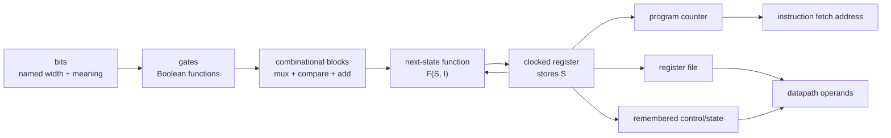

This is a dependency map, not a transistor schematic. The clocked model
abstracts electrical setup/hold time, clock distribution, metastability, and
physical power.

### 3.4 State tables force hidden assumptions into view

Suppose a three-bit `due` register starts at `000`. At each modeled clock edge,
it loads `due + contribution`:

| step | code | threshold | contribution | register before | register after |
|---:|---:|---:|---:|---:|---:|
| 0 | 1 | 1 | 1 | `000` | `001` |
| 1 | 3 | 1 | 0 | `001` | `001` |
| 2 | 0 | 1 | 1 | `001` | `010` |
| 3 | 2 | 1 | 0 | `010` | `010` |

Predict before revealing each `after` cell. Then ask:

- What is the initial state?
- At which event may the register update?
- What happens if load is zero?
- Is three bits enough for the maximum visit count?
- What does overflow mean under this width?

The same high-level count can be wrong because its representation width was
too small even when every gate obeyed its local truth table.

### 3.5 Datapath and control divide a machine question

A datapath carries and transforms values. Control selects what the datapath
does and which state elements update.

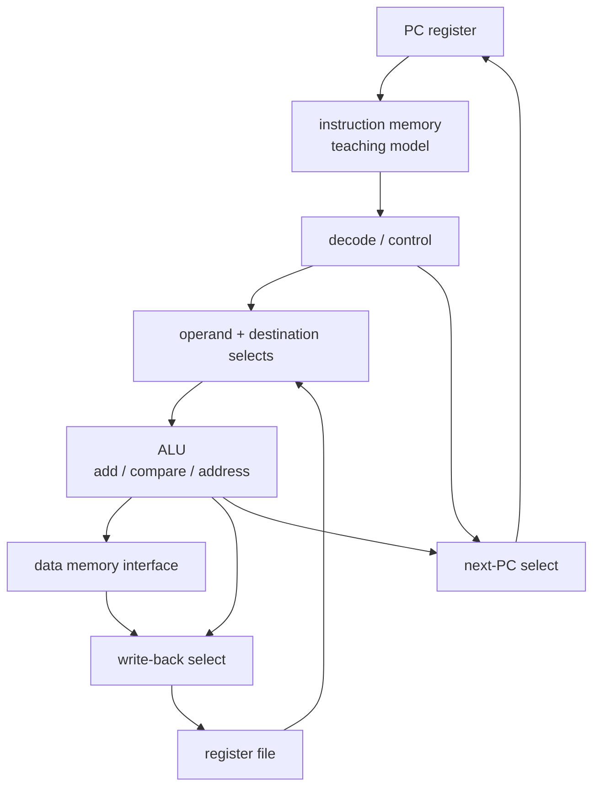

For each arrow, label:

- bits carried;
- interpretation;
- whether it is combinational output or stored state;
- what selects it;
- which contract makes a transition legal.

This diagram does not claim separate physical “instruction memory” and “data
memory” in Michael's processor. It is a pedagogical organization that makes
fetch and data-access roles visible.

### 3.6 Logic-reading lab

An agent proposes:

```text
next_due = due + is_due
next_pc  = pc + 4
```

Review before accepting:

1. What widths do `due` and `pc` have?
2. What happens on overflow?
3. Which instructions should choose a different `next_pc`?
4. When may `due` update?
5. Where are current and next state separated?
6. Which signal decides whether memory or a register changes?

The strongest answer is not a gate diagram. It is a precise statement of the
state-transition contract that a diagram could realize.

---

## 4. ISA state and the load/store contract

### 4.1 Separate four often-collapsed meanings

| Layer | What it is | Example | It does not determine |
|---|---|---|---|
| assembly notation | symbolic text for instructions and operands | `lw x14, 0(x10)` | one universal syntax or processor implementation |
| machine encoding | instruction bits under an ISA encoding | a 32-bit RV32I instruction word | timing, cache geometry, Python meaning |
| ISA | software-visible state and legal transitions | registers, PC, loads/stores, branches | a five-stage pipeline or one cycle per instruction |
| microarchitecture | one implementation of the ISA | datapath, caches, predictors, pipelines | the language-level result contract by itself |

**[RISC-V 20260120 CLAIM]** RV32I is used because its load-store design makes
state ownership visible: integer arithmetic operates on registers; loads and
stores transfer between registers and memory. The teaching trace is not
claimed to be the native code generated while CPython executes `count_due`.

### 4.2 Architectural state

For the bounded trace, model:

```text
PC: address of the current/next instruction under the trace convention
x0..x31: integer registers; reads of x0 yield zero
memory: byte-addressed mapping for legal addresses in the teaching region
```

Every instruction is a transition:

\[
(PC, R, M) \xrightarrow{\text{instruction}} (PC', R', M')
\]

Ask three questions for every line:

1. Which old state is read?
2. Which new state may be written?
3. How is the next PC chosen?

### 4.3 A RISC-V-like Atlas counting trace

Declare this teaching convention:

| Register | Meaning |
|---|---|
| `x10` | current code address |
| `x11` | inclusive due threshold |
| `x12` | one-past-last code address |
| `x13` | due count |
| `x14` | loaded unsigned code |

The loop uses real RV32I mnemonics with their specification meaning. Unlike a
separate one-byte teaching example, this trace keeps the Module 17 experiment's
four-byte code stride. All admitted codes are below \(2^{31}\), so the bit
pattern loaded by `lw` compares as intended with the unsigned branch:

```asm
loop:
    lw    x14, 0(x10)       # load one 32-bit priority code
    bltu  x11, x14, skip    # if threshold < code, skip increment
    addi  x13, x13, 1       # due_count += 1
skip:
    addi  x10, x10, 4       # advance one four-byte code
    bltu  x10, x12, loop    # continue while address < end
```

Preconditions:

- the range is nonempty;
- `x10 < x12`;
- initial `x10`, every four-byte step, and `x12` follow the declared alignment
  and one-past-last convention;
- each legal word address from initial `x10` through `x12 - 4` contains one
  admitted priority code;
- count/register width is sufficient;
- no concurrent actor changes the modeled memory.

The empty-range case needs a pre-loop guard. Omitting it is an algorithm error,
not an ISA mystery.

### 4.4 Trace PC, registers, and memory separately

Fixture:

```text
32-bit words at addresses 1000, 1004, 1008 = [1, 3, 0]
x10 = 1000
x11 = 1
x12 = 1012
x13 = 0
```

Trace the first two visits:

| instruction | PC change | register change | memory change | causal note |
|---|---|---|---|---|
| `lw x14,0(x10)` | next | `x14: ? → 1` | none | read the word at address 1000 |
| `bltu x11,x14,skip` | not taken | none | none | \(1<1\) is false |
| `addi x13,x13,1` | next | `x13: 0 → 1` | none | register arithmetic |
| `addi x10,x10,4` | next | `x10: 1000 → 1004` | none | address advances one code |
| `bltu x10,x12,loop` | taken | none | none | \(1004<1012\) |
| `lw x14,0(x10)` | next | `x14: 1 → 3` | none | read the word at 1004 |
| `bltu x11,x14,skip` | taken to `skip` | none | none | \(1<3\) |
| `addi x10,x10,4` | next | `x10: 1004 → 1008` | none | count increment skipped |

Complete the third visit. The final `x13` must be 2.

The key correction:

> `LOAD`, compare/branch, and `ADD` may change registers or control flow, but
> none of the shown instructions stores a new byte into data memory.

If a reviewer claims the source array was updated, ask them to identify the
store instruction and target address.

### 4.5 Instruction state inspector

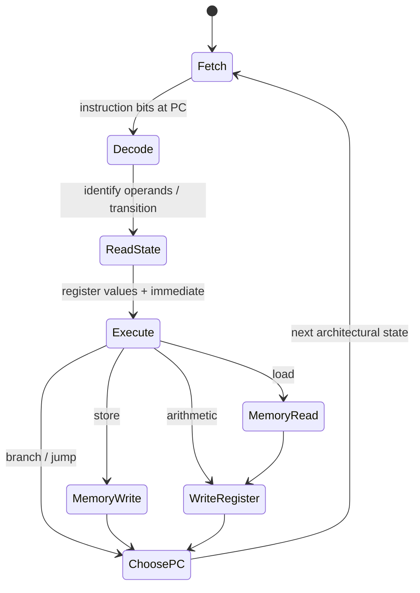

This is an **instruction effects inspector**, not a claim that a physical
processor walks these states one at a time. The next section turns the same
visible transition into an implementation question.

### 4.6 Calls require a convention in addition to instructions

An ISA can provide jumps and registers; a calling convention assigns roles:

- where arguments arrive;
- where a result returns;
- where return state is kept;
- which registers a caller or callee must preserve;
- how stack storage is allocated and restored;
- required alignment.

Use this **declared toy convention**, not a platform ABI:

```text
x1: return address
x2: stack pointer, stack grows toward lower addresses
x10: first argument / result
callee frame: 8 bytes
memory[x2 + 4]: saved x1
```

Conceptual callee:

```asm
    addi x2, x2, -8
    sw   x1, 4(x2)
    ... body, possibly another call ...
    lw   x1, 4(x2)
    addi x2, x2, 8
    jalr x0, 0(x1)
```

If the callee restores `x1` from the wrong address or returns without restoring
`x2`, nested calls may corrupt return state or later frame ownership. The
precise consequence depends on the declared convention and subsequent access;
do not say that every stack-pointer error produces the same symptom.

### 4.7 Keep three stacks separate

| “Stack” | Meaning in this module | Boundary |
|---|---|---|
| CPython evaluation stack | runtime operand stack described by pinned CPython internals | observe at overview level; M24 owns depth |
| call/function stack | nested call/return state under a runtime or declared machine convention | toy trace only; do not equate Python frames to contiguous native frames |
| memory hierarchy | registers/caches/DRAM/storage ordered by roles and costs | not a function-call structure |

The existence of a machine stack pointer does not imply that each Python frame
is one native stack frame. That implementation question belongs to a pinned
runtime and later evidence.

### 4.8 ISA review checklist

When reading unfamiliar assembly:

1. identify the exact ISA/version and any extensions;
2. obtain register/argument conventions separately;
3. label every input and precondition;
4. trace PC, registers, and memory in separate columns;
5. mark loads and stores before arithmetic;
6. follow branches with actual compared values;
7. check width, signedness, and address range;
8. check save/restore symmetry around calls;
9. state which behavior is ISA-guaranteed versus implementation-dependent;
10. refuse source-level or performance conclusions not established by the
    trace.

---

## 5. A microarchitecture realizes the contract

### 5.1 The ISA leaves room for implementation

The loop trace defines visible before/after state. It does not say how a
processor creates that transition. A processor implementation must:

1. obtain instruction bits using the PC;
2. decode the instruction and operands;
3. read source state;
4. compute arithmetic, an address, or a branch decision;
5. perform any required memory access;
6. commit permitted destination state;
7. choose the next PC.

One teaching organization names five stages:

```text
IF  instruction fetch
ID  decode and register read
EX  execute / address / branch work
MEM data-memory access
WB  register write-back
```

**[MICROARCHITECTURE MODEL]** These labels are a reasoning tool. The RISC-V
ISA does not require five physical stages, a particular cache, a particular
clock rate, or in-order completion.

### 5.2 Combinational work and registers alternate

```mermaid
    %% atlas-diagram-id: m17-five-stage-pipeline
    %% atlas-diagram-title: Five-stage teaching pipeline
    %% atlas-diagram-alt: Instructions pass through fetch, decode, execute, memory, and write-back stages separated by pipeline registers; later instructions receive register operands and execute-stage control can redirect the PC.
%% Five-stage teaching pipeline with state carried between combinational stages
flowchart LR
    PC["PC state"] --> IF["IF<br/>select + fetch"]
    IF --> IFID["pipeline register"]
    IFID --> ID["ID<br/>decode + read operands"]
    ID --> IDEX["pipeline register"]
    IDEX --> EX["EX<br/>ALU + branch/address"]
    EX --> EXMEM["pipeline register"]
    EXMEM --> MEM["MEM<br/>data access"]
    MEM --> MEMWB["pipeline register"]
    MEMWB --> WB["WB<br/>destination select"]
    WB --> RF["architectural register state"]
    RF -. "operands for later instructions" .-> ID
    EX -. "next-PC decision" .-> PC
```

The pipeline registers retain intermediate state between clock edges. Control
metadata must travel with values: destination register, write enable, memory
operation, and exception/validity information cannot be guessed later.

Read the diagram backwards from `WB`. Ask:

- Which earlier instruction owns the value?
- Which destination does it update?
- What prevents a store or branch from writing an unrelated register?
- If a branch redirects the PC, which younger in-flight work becomes invalid?

These are architecture-reading questions. A visually plausible arrow is not a
proof that control and ownership are correct.

### 5.3 Pipelining overlaps latency; it does not erase it

Without overlap, four instructions traversing five one-cycle stages might
occupy twenty stage-slots in sequence. An idealized pipeline can overlap them:

| cycle | IF | ID | EX | MEM | WB |
|---:|---|---|---|---|---|
| 1 | I1 |  |  |  |  |
| 2 | I2 | I1 |  |  |  |
| 3 | I3 | I2 | I1 |  |  |
| 4 | I4 | I3 | I2 | I1 |  |
| 5 | I5 | I4 | I3 | I2 | I1 |
| 6 |  | I5 | I4 | I3 | I2 |
| 7 |  |  | I5 | I4 | I3 |
| 8 |  |  |  | I5 | I4 |
| 9 |  |  |  |  | I5 |

In the ideal table:

- the first instruction still needs five stage intervals of latency;
- after filling, throughput approaches one completed instruction per cycle;
- five instructions complete in nine cycles, not one or five;
- the overlap is within processor implementation, not Python-level
  concurrency.

Real execution includes unequal stage delays, stalls, redirects, dependencies,
cache misses, exceptions, and implementation techniques outside this model.

### 5.4 Hazards are conflicts between overlap and correctness

| Hazard pressure | Example | Why naive overlap fails | Possible implementation response |
|---|---|---|---|
| data | I2 reads a register I1 will write | I2 may see an old value | wait, forward/bypass, schedule differently |
| control | branch outcome is not yet known | younger fetched path may be wrong | stall, predict, later redirect/squash |
| structural | two operations need one resource together | both cannot use it in the same modeled interval | duplicate/partition resource or stall |
| memory | a load's data is not ready | dependent work lacks its operand | wait while hierarchy responds |

An ISA defines correct visible behavior despite these choices. Two compliant
processors may use different responses and take different cycles.

### 5.5 Instruction count, CPI, and cycle time are different factors

For a bounded CPU-time model:

\[
T_{\text{CPU}}
=
N_{\text{instructions}}
\times
\operatorname{CPI}
\times
T_{\text{cycle}}
\]

Equivalent frequency form:

\[
T_{\text{CPU}}
=
\frac{N_{\text{instructions}}\times\operatorname{CPI}}
{f_{\text{clock}}}
\]

This factorization disciplines questions:

- A compiler/runtime change may change native instruction count.
- A dependency or memory event may change average cycles per instruction.
- A processor/power state may change cycle time/frequency.
- Total elapsed time also includes OS scheduling, I/O waits, other processes,
  measurement overhead, and work outside the named CPU interval.

Never infer one factor from elapsed time alone. A \(20\%\) shorter elapsed
vector does not tell us whether instruction count, CPI, frequency, interference,
or a different amount of untimed setup changed.

### 5.6 Latency, throughput, and bandwidth answer different questions

| Term | Question | Atlas example |
|---|---|---|
| latency | How long until one operation/result completes? | time from one `count_due` call start to result |
| throughput | How many operations/results per unit time after overlap? | completed scans per second under a named setup |
| bandwidth | How much data can a channel transfer per unit time? | bytes per second across a named memory/device interface |

Lower latency can improve throughput, but neither implies the other
universally. A wide channel may have high bandwidth and substantial first-byte
latency. Pipelining often improves throughput without proportionally reducing
one instruction's latency.

### 5.7 A processor trace still does not establish Python cost

The RISC-V-like loop helps answer:

- what a load-store state transition looks like;
- why explicit loads and stores differ;
- how PC/register/memory traces work;
- why access order produces address order.

It does **not** establish:

- CPython's native instruction sequence for the source function;
- how many native instructions retire;
- which caches are present or hit;
- how Python integers and array elements are implemented;
- how the OS schedules the process;
- an elapsed-time ratio.

The teaching trace explains a dependency. It is not a disguised benchmark.

### 5.8 Microarchitecture review exercise

An agent writes:

> “The loop has five bytecodes. On a five-stage RISC-V CPU it takes five
> cycles, and pipelining runs the iterations in parallel.”

Split the sentence into claims and repair each:

1. `dis` logical instruction count is implementation/version specific and may
   not be five.
2. CPython bytecode is not the native RISC-V instruction stream.
3. a five-stage organization is not an ISA guarantee;
4. instruction count and cycle count are not identical;
5. pipeline overlap is not program-level parallel iteration;
6. processor ISA may not be RISC-V on the observed machine;
7. elapsed time includes more than the idealized CPU model.

Bounded replacement:

> In CPython 3.14.6 on the recorded runtime, `dis` reports a sequence of
> logical interpreter instructions for this function. The interpreter and
> runtime are native software whose machine execution is implemented by the
> host processor. A five-stage diagram explains how one ISA implementation
> might overlap work, but this observation does not determine native
> instruction count or cycles.

---

## 6. Memory hierarchy, cache lines, and locality

### 6.1 Why a hierarchy exists

The construction so far pretended that every legal memory access had one
uniform cost. Implementations face a trade-off among access time, capacity,
energy, physical area, and price. They compose levels:

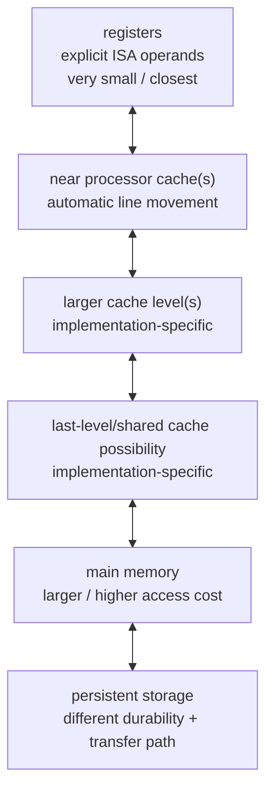

This ordering is qualitative. Cache count, ownership, sizes, associativity,
latencies, coherence, and shared/private organization vary by machine.
Persistent storage crosses OS/device questions that Module 18 derives.

The hierarchy works when smaller levels retain useful copies or working state.
It creates a new question:

> Which unit moves, where is it placed, and how likely is later work to reuse
> it before replacement?

### 6.2 A cache moves lines, not Python objects

A cache access begins with an address. A simple cache partitions it into:

```text
[        tag        | set/index | byte offset ]
```

- **offset** selects a byte within a cache line/block;
- **index** selects a set;
- **tag** distinguishes memory blocks that map to that set.

For a drawn 16-bit byte address, 64-byte lines, and 8 direct-mapped slots:

```text
offset bits = log2(64) = 6
index bits  = log2(8)  = 3
tag bits    = 16 - 6 - 3 = 7
```

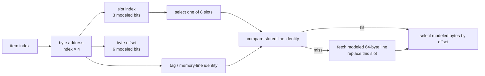

In a direct-mapped cache, each block has one possible line. Associative caches
allow several candidate lines in a set and need a replacement decision. This
module hand-traces direct mapping first so every event is inspectable.

### 6.3 Declare the toy cache before using it

The Module 17 simulator has:

```text
input: nonnegative item indices
item size: 4 bytes
derived byte address: item_index × 4
line size: 64 bytes
cache slots: 8
associativity: 1 (direct mapped)
initial state: every line invalid
operation: read only
replacement: overwrite the indexed slot's line identity on miss
prefetch: none
coherence: none
write policy: not applicable to this read-only trace
timing: not simulated
```

It can prove the hit/miss sequence of this model. It cannot report the hardware
cache used by the Python process.

### 6.4 Hand-trace an item index

For item index 22 under the default model:

```text
byte_address = 22 × 4   = 88
memory_line  = 88 // 64 = 1
byte_offset  = 88 % 64  = 24
cache_slot   = 1 % 8    = 1
```

If slot 1 is invalid, index 22 misses and records memory-line identity 1.
Index 23 maps to byte address 92 and the same line/slot, so it hits unless an
intervening access replaced the slot.

Index 150 maps to byte address 600, memory line 9, and slot 1. It conflicts
with line 1 in this declared direct-mapped model even though other slots may be
available.

### 6.5 Sequential and deterministic permutations in a small declared model

For a hand-sized worksheet, override only the declared geometry:

```text
item_bytes = 4
line_bytes = 16
cache_slots = 2
indices = 0..15
```

Visit each item index once.

Sequential:

```text
0,1,2,3, 4,5,6,7, 8,9,10,11, 12,13,14,15
```

The candidate's deterministic coprime-stride permutation for \(n=16\):

```text
5,14,7,0,9,2,11,4,13,6,15,8,1,10,3,12
```

Both visit every index exactly once. Under this declared model:

| trace | accesses | misses | hits | reason inside this model |
|---|---:|---:|---:|---|
| sequential | 16 | 4 | 12 | first item of each four-item line misses; next three reuse the line |
| permuted | 16 | 13 | 3 | the coprime stride repeatedly replaces the two modeled slots before much spatial reuse |

Predict all 16 events before running the simulator. For each event, record
item, byte address, memory line, slot, prior line identity, and hit/miss. If
simulator output disagrees
with the hand trace, investigate the model or program before discussing
hardware.

### 6.6 Locality names a pattern, not a guarantee

- **Temporal locality:** recently accessed data may be accessed again soon.
- **Spatial locality:** addresses near a recent address may be accessed soon.

Sequential item access has strong spatial locality relative to the declared
line. The permutation reduces modeled reuse before replacement. On a real
system:

- the packed code buffer is one representation among several;
- cache line size and organization may differ;
- prefetching can recognize patterns;
- the visit-order container has its own accesses;
- CPython indexing, iteration, conversion, and branches add work;
- other hierarchy and OS events occur;
- timing may overlap even when the toy model differs.

Therefore:

> **[HYPOTHESIS]** Sequential access should create a more favorable locality
> pattern for the packed codes than the deterministic permutation.

This is stronger than “we know nothing,” but weaker than “hardware misses
caused the timing.”

### 6.7 Compulsory, capacity, and conflict are explanatory categories

In a declared model:

- **compulsory/cold pressure:** the block has not yet been loaded;
- **capacity pressure:** the working set cannot fit in the available cache;
- **conflict pressure:** mapping/replacement evicts a block despite unused or
  differently usable capacity elsewhere.

These categories can depend on the comparison model. A direct-mapped miss
classified as conflict might not occur in a fully associative cache of the same
capacity. Hardware may add prefetch, multiple levels, and policies that make a
simple label incomplete.

### 6.8 Average memory access time is a model

For one cache level:

\[
T_{\text{avg}} =
T_{\text{hit}}
+
r_{\text{miss}} \times P_{\text{miss}}
\]

If the toy model assigns:

```text
hit time = 1 modeled cycle
miss penalty = 20 additional modeled cycles
```

then:

```text
sequential miss rate = 4/16   → modeled average = 1 + 0.25×20 = 6
permuted miss rate   = 13/16  → modeled average = 1 + 0.8125×20 = 17.25
```

These are model outputs under invented timing parameters. They are not elapsed
time predictions for the Python program. Real hierarchies are nested, can
overlap requests, prefetch, queue, share, and vary by implementation.

### 6.9 “Cache” needs a surname

| Name | Typical keyed unit | Managed mainly by | Evidence source |
|---|---|---|---|
| CPU data/instruction cache | addressed cache line | processor microarchitecture | documented geometry or hardware counters |
| TLB | address-translation entry | processor + OS-managed mappings | platform counters/docs; Module 18 model |
| OS page cache | memory page/file data | operating system | OS metrics/traces; Module 18 |
| database buffer/page cache | database page | database engine | engine metrics/plans/configuration |
| application cache | domain/API result | application | application keys, hit logs, tests |
| CPython internal cache/specialization | runtime-specific operation metadata | CPython implementation | pinned runtime/source; Module 24 |

Saying “the cache was warm” without a surname, unit, observation, and layer is
not a useful performance statement.

### 6.10 The Atlas locality incident

The fair semantic kernel is:

```python
def count_due(codes, visit_order, threshold):
    due = 0
    for index in visit_order:
        if codes[index] <= threshold:
            due += 1
    return due
```

Pre-timing validation:

```text
same codes object identity:
same threshold:
same order-container type:
both orders are exact permutations of range(n):
same returned count:
same exception behavior for the admitted fixture:
construction outside timed region:
```

Changing address order is sufficient to motivate locality reasoning. It is not
sufficient to isolate locality as the cause of a timing difference. The
permuted order itself changes index values and the sequence of accesses to the
order container. A rigorous explanation must name those alternatives.

---

## 7. Trace a Python operation without collapsing layers

### 7.1 The connected execution stack

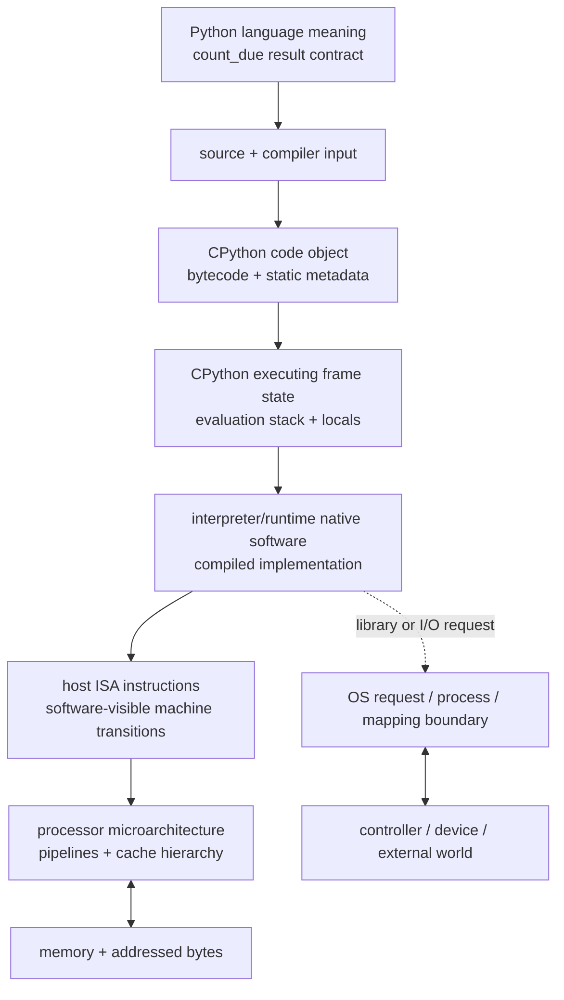

Arrow meanings differ:

- source is compiled into a code object;
- interpreter state executes bytecode;
- the interpreter is native software executing through a host ISA;
- the processor implements ISA transitions and moves addressed data;
- I/O crosses into an OS/device path whose mechanisms open in Module 18.

This is not a claim that each box corresponds to one process, one frame, one
native instruction, or one physical transfer.

### 7.2 Python language semantics are the top contract

For admitted inputs, `count_due` promises a count. The Python language level
describes iteration, indexing, comparison, Boolean/integer behavior, addition,
local binding, and return. It does not require CPython, a particular bytecode,
RISC-V, x86-64, a five-stage pipeline, or one cache geometry.

This distinction permits several correct implementations:

```text
CPython 3.14.6
another CPython patch
PyPy
another conforming Python implementation
```

They can preserve the language result while using different runtime and native
mechanisms.

### 7.3 `dis` observes CPython bytecode, not native assembly

```python
import dis
import platform

print(platform.python_implementation(), platform.python_version())
for instruction in dis.get_instructions(count_due):
    print(instruction.opname, instruction.argrepr)
```

Safe interpretation:

> **[CPYTHON 3.14.6 OBSERVATION]** On the recorded CPython patch, `dis`
> reports these logical bytecode instructions for the function. One source
> line expands into several runtime operations.

Unsafe interpretations:

- opcode count equals retired native instruction count;
- bytecode names are host assembly;
- an opcode proves one cache access;
- the list is stable across all Python versions or implementations;
- bytecode sequence alone determines elapsed time.

Do not grade memorized opcode names. Grade the ownership statement and the
ability to explain why version-scoped observation differs from language or ISA
guarantee.

### 7.4 A thin pinned CPython bridge

At CPython 3.14.6, pinned commit
`c63aec69bd59c55314c06c23f4c22c03de76fe45`:

- the compiler produces code objects containing bytecode and static metadata;
- executing code uses dynamic frame state;
- the bytecode interpreter is described as a stack machine operating largely
  on object references;
- the interpreter implementation is native software;
- interpreter bytecode and hardware ISA are distinct instruction layers.

Stop after the overview, instruction decoding, and evaluation-stack sections
of `InternalDocs/interpreter.md`. Save frame materialization, specialization,
reference ownership, object layout, allocators, and GC for Module 24.

### 7.5 Module 24 owns object and allocation profiling

An object-size or allocation tool would open several new models: object layout,
ownership edges, aliasing, allocator arenas, native buffers, reference counts,
cyclic GC, resident memory, and runtime specialization. Module 17 does not use
those observations to decorate a cache story.

The boundary is explicit:

```text
M17 records:
    array typecode + admitted itemsize
    source-level semantic oracle
    toy ISA/cache state
    thin version-scoped dis bridge
    raw elapsed trials + provenance

M24 later derives:
    Python object layout
    retained graph policies
    allocation tracing
    reference counting and cyclic GC
    specialization and deep profiling
```

If an agent attributes this module's timing to allocation or GC, classify the
statement as an **unmeasured hypothesis** and route it to Module 24 rather than
adding an unplanned profiler.

### 7.6 Raw `perf_counter` trials record effects, not causes

The final reference wraps an explicit Python call loop with
`time.perf_counter`. Construction and validation occur before timing. The
semantic preflight has already called each condition once and is recorded as
such; there is no hidden warm-up.

```python
started = time.perf_counter()
for _ in range(calls_per_trial):
    count_due(codes, visit_order, threshold)
total_seconds = time.perf_counter() - started
seconds_per_call = total_seconds / calls_per_trial
```

Blocks alternate:

```text
block 1: ABBA = sequential, permuted, permuted, sequential
block 2: BAAB = permuted, sequential, sequential, permuted
block 3: ABBA
...
```

Every trial retains:

```text
position:
block:
block_schedule: ABBA or BAAB
condition: sequential or permuted
condition_occurrence:
exposure:
    first-timed-block-for-condition
    later-timed-block-for-condition
calls:
total_seconds:
seconds_per_call:
```

The labels prevent “first timed exposure” from disappearing inside an average.
The evidence packet groups raw values by condition and exposure and may report
a descriptive median per cell. It deliberately computes no winner ratio and
does not infer a cache cause.

Record alongside the trials:

```text
semantic oracle and permutation validation:
fixture size, threshold, representation, and item bytes:
construction/validation excluded:
runtime/OS/machine/pointer width/host byte order:
timer and explicit loop boundary:
ABBA/BAAB schedule:
calls per trial:
all raw trials:
unrecorded cache geometry, CPU frequency/power, load, scheduling, and counters:
```

Elapsed time is compatible with several runtime, processor, OS, measurement,
and interference explanations. The schedule reduces one ordering confounder;
it does not identify a cause.

### 7.7 I/O is a boundary, not a single transfer

At the language/library level:

```python
chunk = file.read(1)
```

requests up to one unit according to the stream interface. Depending on
buffering and system state, satisfying it may involve:

- data already held by a Python buffer;
- data already in an OS-managed page cache;
- a larger lower-level request;
- no new physical device transfer;
- a device/controller operation of a different granularity;
- an error, end-of-file, or partial behavior under the relevant contract.

M17's strongest statement is:

```text
language request
  ≠ necessarily one runtime buffer refill
  ≠ necessarily one OS request
  ≠ necessarily one page-cache miss
  ≠ necessarily one physical transfer
```

Module 18 derives system calls, processes, virtual memory, filesystem and page
cache mechanisms. Module 17 marks the handoff and refuses a false one-to-one
mapping.

### 7.8 Ownership table for one Atlas expression

Expression:

```python
due += codes[index] <= threshold
```

| Layer | Owned question | Possible evidence | Not established |
|---|---|---|---|
| Python semantics | what result/exception should occur? | oracle/tests/language docs | runtime mechanism |
| representation | how are codes/order stored? | encoding, type, item size, named size | hardware movement |
| CPython runtime | what logical bytecode/frame operations occur here? | pinned source + `dis` | native event count |
| ISA | what native visible state transitions mean | ISA spec/native trace | particular pipeline/cache |
| microarchitecture | how instructions are executed | vendor docs/counters/model | Python correctness |
| OS | process/mapping/I/O mediation | OS docs/traces | CPU-cache event by default |
| empirical run | what elapsed trials occurred | raw packet/provenance | unique cause |

Architecture understanding is the ability to keep the row connections while
respecting the column boundaries.

---

## 8. Build an evidence chain, not a performance story

### 8.1 Evidence ladder

| Level | Evidence | Strongest permitted statement |
|---|---|---|
| semantic | oracle, permutation validation, exceptions | compared executions meet the tested result contract |
| representation | explicit encoding, `array('I')`, admitted itemsize | values have the recorded representation contract |
| runtime | `dis` at exact implementation/patch | this runtime reports these logical instructions |
| timing | complete ABBA/BAAB raw trials and provenance | elapsed observations differ or overlap under this protocol |
| toy architecture | instruction/cache hand trace or simulator | the declared model produces this state/hit sequence |
| hardware | independently available named counter | this machine/tool reported these events under this setup |
| causal | controlled/crossed experiments plus alternatives | one explanation is more strongly supported, with remaining alternatives |

Higher rows do not automatically follow from lower ones. A timing ratio does
not “climb” into a cache-miss count.

### 8.2 The fixed Atlas comparison protocol

Before timing:

1. derive codes from disposable synthetic M16 data;
2. freeze the admitted four-byte `array('I')`;
3. construct both immutable order sequences outside the timer;
4. prove each order is a permutation of `range(n)`;
5. check both returned counts against an order-independent oracle;
6. record size, threshold, generator version, and order digest;
7. record runtime, OS, machine label, byte order, and pointer width;
8. record that semantic preflight already called each condition once and that
   there is no hidden warm-up;
9. alternate ABBA/BAAB blocks;
10. retain every raw trial with `first-timed-block-for-condition` or
    `later-timed-block-for-condition`.

After timing:

1. report raw trial cells without manufacturing a comparison ratio;
2. mark any cell median as descriptive only;
3. inspect whether vectors overlap;
4. vary one factor at a time, including size and order pattern;
5. separate construction/gathering cost;
6. list plausible runtime, hierarchy, branch, frequency, and interference
   explanations;
7. label unavailable hardware-counter evidence;
8. write the narrowest supported claim.

### 8.3 Observation points around the incident

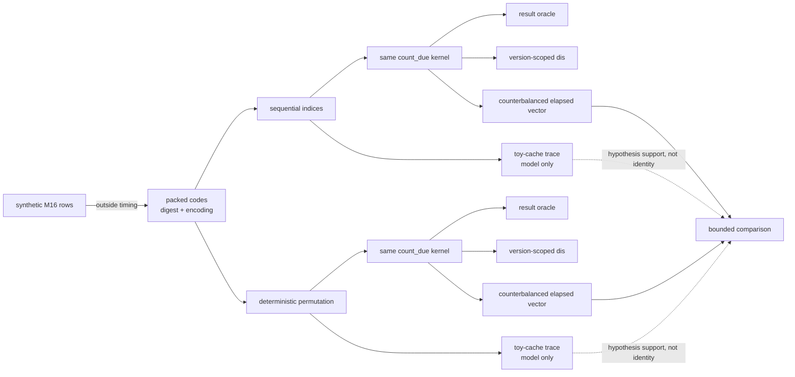

An observation belongs at one point. Moving it upward or downward requires a
new argument and usually new evidence.

### 8.4 Suspicious agent patch

```python
def optimized_due(codes, order, threshold):
    gathered = [codes[i] for i in order]  # new work and representation
    return sum(code <= threshold for code in gathered)

# Baseline is timed first without warm-up.
baseline = timeit.timeit(
    lambda: count_due(codes, permuted, threshold),
    number=10,
)

# Candidate is warmed, receives more trials, and only its fastest is retained.
for _ in range(20):
    optimized_due(codes, sequential, threshold)
candidate = min(
    timeit.repeat(
        lambda: optimized_due(codes, sequential, threshold),
        repeat=20,
        number=100,
    )
)

print("4.7x faster because sequential bytecode hits L1 cache")
assert optimized_due(codes, sequential, threshold) == expected
```

Review in dependency order:

| Finding | Layer | Why it matters | Minimal repair |
|---|---|---|---|
| oracle checked after timing only | semantic | invalid candidate could consume experiment time and contaminate interpretation | validate before every experiment configuration |
| order changed along with implementation | experiment | mechanism and access order are confounded | cross implementation × order |
| gathering included only in candidate | workload | compared timed work differs | either time end-to-end for both or exclude construction for both |
| cold baseline, warmed candidate | experiment | order/exposure confound | record the same semantic preflight and counterbalance timed blocks |
| 10 vs 2,000 timed calls | measurement | incomparable aggregation/overhead | same calls per trial, block schedule, and raw per-call trials |
| only fastest candidate retained | evidence | selective reporting | preserve all raw vectors for both |
| `sum` generator vs explicit loop | runtime | more than locality changed | isolate one factor or call it end-to-end alternative |
| bytecode called assembly | layer collapse | runtime instructions are not ISA instructions | name CPython/version and use “logical bytecode” |
| “hits L1” without counter | causal overreach | elapsed time/toy model cannot count L1 events | retain as hypothesis or collect named hardware evidence |
| one ratio universalized | scope | result may not transfer across size/runtime/machine | bind statement to recorded setup |

The patch may contain a useful end-to-end alternative. Experimental invalidity
does not imply semantic uselessness. Split the decisions:

1. Does it return the right result?
2. Is its architecture acceptable?
3. Is the comparison fair for the question asked?
4. Does the evidence support the causal prose?
5. Is the end-to-end trade-off worth keeping?

### 8.5 Performance-claim causal map

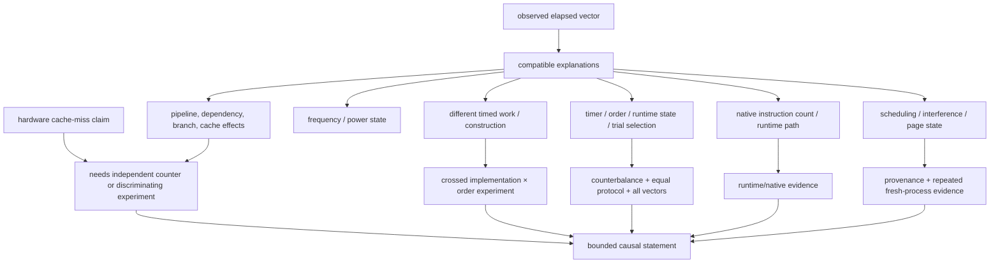

Several causes can act together. The goal is not always to identify one final
cause. A professionally useful outcome can be:

> The access-order effect is reproducible in these configurations, the toy
> model predicts more conflict under the permuted trace, and the result remains
> compatible with several runtime and hardware mechanisms because no hardware
> event counter was collected.

### 8.6 Cross the factors before naming the cause

Use a \(2\times2\) design:

| | sequential order | permuted order |
|---|---|---|
| explicit Python loop | vector A | vector B |
| gathered/alternative implementation | vector C | vector D |

Questions:

- Does the order effect appear within both implementations?
- Does the implementation effect appear within both orders?
- Is there an interaction?
- Is gathering construction inside or outside the user-visible operation?
- Does the semantic oracle hold in every cell?

This design does not magically establish hardware cache misses. It removes one
important confounding collapse and reveals whether “implementation” and
“order” effects travel together.

### 8.7 Claim rewrite ladder

Start:

> “Sequential Python is 4.7× faster because it hits cache.”

Repair one overreach at a time:

1. **Scope:** “On CPython 3.14.6 in this recorded Windows/machine setup…”
2. **Workload:** “…for this packed-code fixture and these preconstructed
   orders…”
3. **Observation:** “…the sequential elapsed vector was lower than the
   permuted vector under this counterbalanced protocol…”
4. **Model:** “…and the declared direct-mapped toy cache predicted fewer misses
   for its analogous address trace.”
5. **Uncertainty:** “The experiment did not collect hardware cache events and
   does not isolate interpreter, indexing, branch, frequency, page, or
   interference effects.”
6. **Next test:** “Vary size/order pattern in fresh processes and obtain
   platform-authoritative counters before promoting the cache hypothesis.”

The final version is longer because its claim does more intellectual work.

---

## 9. Runnable Atlas architecture evidence reference

### 9.1 What the reference establishes

The canonical companion candidate is:

```text
python-advanced-course/work/module17_reference_candidate.py
```

[Download the complete runnable Module 17 reference](/downloads/module17_reference.py).

It is standard-library only and builds a machine-readable evidence packet with:

- signed 16-bit `struct` round trips for \(-4\), including `fc ff`;
- deterministic Atlas priority codes in `array('I')`, admitted only when
  `itemsize == 4`;
- one validated sequential order and one deterministic full permutation;
- the same `count_due` kernel and an order-independent semantic oracle;
- a finite-width toy ISA trace with explicit register/memory transitions and
  8-bit addition wraparound;
- a declared direct-mapped toy cache with item, line, and slot geometry;
- a thin runtime/version-scoped `dis` bridge;
- every raw `perf_counter` trial in alternating ABBA/BAAB blocks;
- privacy-safe runtime provenance;
- explicit supported/unmeasured/never-promote claim lists;
- sixteen adversarial tests.

It deliberately includes no object-layout, retained-size, allocation, GC,
specialization, or deep profiling mechanism; those belong to Module 24. It
computes no timing comparison ratio and makes no causal cache claim.

The access-order and direct-mapped-cache core below is intentionally small
enough to read in one sitting. Treat it as an inspectable mechanism, not as a
hardware measurement.

### 9.2 Runnable access-order core

```python
# RUNNABLE-ACCESS-ORDER-REFERENCE-START
from __future__ import annotations

from array import array
from dataclasses import dataclass
from math import gcd
from typing import Sequence


MAX_SIZE = 2_000_000


def priority_codes(size: int) -> array:
    """Create deterministic codes in one admitted 32-bit representation."""
    if isinstance(size, bool) or not isinstance(size, int):
        raise TypeError("size must be an integer")
    if not 0 <= size <= MAX_SIZE:
        raise ValueError(f"size must be between 0 and {MAX_SIZE}")
    codes = array("I", ((index * 37 + 11) % 10_007 for index in range(size)))
    if codes.itemsize != 4:
        raise RuntimeError("this reference requires four-byte array('I')")
    return codes


def sequential_order(size: int) -> tuple[int, ...]:
    return tuple(range(size))


def deterministic_permutation(size: int) -> tuple[int, ...]:
    """Return a full permutation using a deterministic coprime stride."""
    if isinstance(size, bool) or not isinstance(size, int):
        raise TypeError("size must be an integer")
    if size < 0:
        raise ValueError("size must be nonnegative")
    if size < 2:
        return tuple(range(size))

    step = size // 2 + 1
    while gcd(step, size) != 1:
        step += 1
    offset = size // 3
    return tuple(
        (offset + position * step) % size
        for position in range(size)
    )


def validate_visit_order(order: Sequence[int], *, size: int) -> None:
    if len(order) != size:
        raise ValueError("visit order must contain exactly one entry per code")
    seen: set[int] = set()
    for index in order:
        if isinstance(index, bool) or not isinstance(index, int):
            raise TypeError("visit index must be an integer")
        if not 0 <= index < size:
            raise ValueError("visit index is outside the admitted range")
        if index in seen:
            raise ValueError("visit index occurs more than once")
        seen.add(index)


def count_due(
    codes: Sequence[int],
    visit_order: Sequence[int],
    threshold: int,
) -> int:
    """The single measured lookup-and-compare kernel."""
    due = 0
    for index in visit_order:
        if codes[index] <= threshold:
            due += 1
    return due


def semantic_witness(size: int, threshold: int = 4_999) -> dict[str, object]:
    codes = priority_codes(size)
    sequential = sequential_order(size)
    permuted = deterministic_permutation(size)
    validate_visit_order(sequential, size=size)
    validate_visit_order(permuted, size=size)
    oracle = sum(code <= threshold for code in codes)
    sequential_result = count_due(codes, sequential, threshold)
    permuted_result = count_due(codes, permuted, threshold)
    assert sequential_result == permuted_result == oracle
    return {
        "size": size,
        "threshold": threshold,
        "sequential_result": sequential_result,
        "permuted_result": permuted_result,
        "order_independent_oracle": oracle,
        "all_results_equal": sequential_result == permuted_result == oracle,
        "same_codes_object": True,
        "same_order_type": type(sequential) is type(permuted),
        "same_representation": "array('I'), four bytes per code",
        "only_planned_difference": "the order of legal indices",
    }


@dataclass(frozen=True, slots=True)
class ToyInstruction:
    operation: str
    destination: int | None = None
    left: int | None = None
    right_or_immediate: int | None = None


@dataclass(frozen=True, slots=True)
class ToyMachineState:
    step: int
    pc: int
    word_bits: int
    registers: tuple[int, ...]
    memory: tuple[int, ...]
    halted: bool
    executed: str


def toy_program() -> tuple[ToyInstruction, ...]:
    return (
        ToyInstruction("LOADI", destination=0, right_or_immediate=0),
        ToyInstruction("LOADI", destination=1, right_or_immediate=7),
        ToyInstruction("STORE", destination=1, left=0),
        ToyInstruction("LOAD", destination=2, left=0),
        ToyInstruction("ADD", destination=3, left=1, right_or_immediate=2),
        ToyInstruction("HALT"),
    )


def trace_toy_machine(
    program: Sequence[ToyInstruction] | None = None,
    *,
    word_bits: int = 8,
) -> tuple[ToyMachineState, ...]:
    """A transparent teaching ISA; not RISC-V and not CPython."""
    selected = tuple(toy_program() if program is None else program)
    word_mask = (1 << word_bits) - 1
    registers = [0, 0, 0, 0]
    memory = [0, 0, 0, 0]
    pc = 0
    history = [
        ToyMachineState(0, pc, word_bits, tuple(registers),
                        tuple(memory), False, "INITIAL")
    ]
    for step in range(1, 101):
        instruction = selected[pc]
        operation = instruction.operation
        if operation == "LOADI":
            registers[instruction.destination] = (
                instruction.right_or_immediate & word_mask
            )
            pc += 1
        elif operation == "STORE":
            memory[registers[instruction.left]] = (
                registers[instruction.destination]
            )
            pc += 1
        elif operation == "LOAD":
            registers[instruction.destination] = (
                memory[registers[instruction.left]] & word_mask
            )
            pc += 1
        elif operation == "ADD":
            registers[instruction.destination] = (
                registers[instruction.left]
                + registers[instruction.right_or_immediate]
            ) & word_mask
            pc += 1
        elif operation == "HALT":
            history.append(
                ToyMachineState(step, pc, word_bits, tuple(registers),
                                tuple(memory), True, operation)
            )
            return tuple(history)
        else:
            raise ValueError(f"unsupported operation: {operation}")
        history.append(
            ToyMachineState(step, pc, word_bits, tuple(registers),
                            tuple(memory), False, operation)
        )
    raise RuntimeError("maximum steps reached before HALT")


@dataclass(frozen=True, slots=True)
class CacheEvent:
    visit_position: int
    item_index: int
    byte_address: int
    memory_line: int
    cache_slot: int
    hit: bool


@dataclass(frozen=True, slots=True)
class ToyCacheObservation:
    label: str
    item_bytes: int
    line_bytes: int
    cache_slots: int
    accesses: int
    hits: int
    misses: int
    preview: tuple[CacheEvent, ...]
    scope: str


def toy_cache_observation(
    label: str,
    visit_order: Sequence[int],
    *,
    item_bytes: int = 4,
    line_bytes: int = 64,
    cache_slots: int = 8,
    preview_limit: int = 24,
) -> ToyCacheObservation:
    """Declared direct-mapped model; not the host CPU cache."""
    if line_bytes % item_bytes:
        raise ValueError("line_bytes must be a multiple of item_bytes")
    tags: list[int | None] = [None] * cache_slots
    hits = 0
    misses = 0
    preview: list[CacheEvent] = []
    for position, item_index in enumerate(visit_order):
        byte_address = item_index * item_bytes
        memory_line = byte_address // line_bytes
        cache_slot = memory_line % cache_slots
        hit = tags[cache_slot] == memory_line
        if hit:
            hits += 1
        else:
            misses += 1
            tags[cache_slot] = memory_line
        if position < preview_limit:
            preview.append(
                CacheEvent(
                    visit_position=position,
                    item_index=item_index,
                    byte_address=byte_address,
                    memory_line=memory_line,
                    cache_slot=cache_slot,
                    hit=hit,
                )
            )
    return ToyCacheObservation(
        label=label,
        item_bytes=item_bytes,
        line_bytes=line_bytes,
        cache_slots=cache_slots,
        accesses=len(visit_order),
        hits=hits,
        misses=misses,
        preview=tuple(preview),
        scope=(
            "deterministic direct-mapped teaching model with declared "
            "geometry; not the host CPU cache and not a hardware counter"
        ),
    )


def self_test() -> None:
    for size in (0, 1, 2, 17, 100):
        witness = semantic_witness(size)
        assert witness["all_results_equal"]

    for invalid in ((), (0, 0), (0, 2)):
        try:
            validate_visit_order(invalid, size=2)
        except ValueError:
            pass
        else:
            raise AssertionError(f"invalid order accepted: {invalid!r}")

    machine = trace_toy_machine()
    assert machine[-1].memory[0] == 7
    assert machine[-1].registers[2:] == (7, 14)

    known = toy_cache_observation(
        "known",
        tuple(range(16)),
        item_bytes=4,
        line_bytes=16,
        cache_slots=2,
    )
    assert (known.hits, known.misses) == (12, 4)


if __name__ == "__main__":
    self_test()
    print("semantic:", semantic_witness(1_000))
    print("toy ISA final:", trace_toy_machine()[-1])
    print(
        "toy cache:",
        toy_cache_observation("sequential", sequential_order(100)),
    )
# RUNNABLE-ACCESS-ORDER-REFERENCE-END
```

Expected structural output:

```text
semantic: same result under both valid orders
toy ISA final: memory[0] == 7; registers x2 == 7, x3 == 14
toy cache: deterministic results under 4-byte items, 64-byte lines, 8 slots
```

The exact dictionary rendering is not the learning target. The invariants and
cache events are.

### 9.3 Read the reference in dependency order

Do not read from line 1 to the bottom passively.

**Pass 1 — Contracts**

- mark valid code range, size range, order property, threshold rule;
- explain why `bool` is rejected even though it is an `int` subclass;
- identify every claim made by `semantic_witness`;
- identify what it does not prove beyond admitted fixtures.

**Pass 2 — State**

- trace `LOADI, LOADI, STORE, LOAD, ADD, HALT`;
- list which instruction changes registers, memory, PC, or halted state;
- explain why `LOAD` plus `ADD` cannot modify memory without `STORE`;
- change the operands to \(250+10\) and predict 8-bit wraparound to 4.

**Pass 3 — Address mapping**

- derive byte address, memory-line, and cache-slot formulas;
- hand-trace indices `0..15` with 4-byte items, 16-byte lines, and 2 slots;
- predict 4 misses and 12 hits before execution;
- modify only `cache_slots` on paper and predict which events change.

**Pass 4 — Evidence boundary**

- find every phrase that says “model,” “semantic,” or “assert”;
- list hardware properties absent from the class;
- explain why deterministic simulator output can be exact while saying nothing
  direct about Michael's CPU.

**Pass 5 — Adversarial tests**

- duplicate index;
- missing index;
- out-of-range index;
- unsupported `array('I').itemsize`;
- toy program without `HALT`;
- finite-width addition overflow;
- changed runtime patch;
- overlapping timing vectors;
- unavailable hardware counter.

**Thin execution bridge**

The candidate deliberately records only logical opcode names and provenance:

```python
def source_bridge_observation():
    instructions = tuple(dis.get_instructions(count_due))
    return {
        "function": count_due.__name__,
        "implementation": platform.python_implementation(),
        "python_version": platform.python_version(),
        "logical_opnames": tuple(i.opname for i in instructions),
        "scope": (
            "logical bytecode names reported by dis for this runtime/version; "
            "not native ISA instructions, CPU cycles, or cache accesses"
        ),
    }
```

That is enough to falsify “one Python operation is one ISA instruction”
without opening Module 24's interpreter-performance syllabus.

### 9.4 Counterbalance timing without manufacturing a winner

The companion uses an explicit call loop and retains every trial:

```python
import time


def counterbalanced_schedule(blocks):
    for block in range(blocks):
        schedule = (
            ("sequential", "permuted", "permuted", "sequential")
            if block % 2 == 0
            else ("permuted", "sequential", "sequential", "permuted")
        )
        name = "ABBA" if block % 2 == 0 else "BAAB"
        yield from ((name, condition) for condition in schedule)


def counterbalanced_timings(codes, orders, threshold, *, blocks, number):
    occurrences = {"sequential": 0, "permuted": 0}
    trials = []
    for position, (schedule_name, condition) in enumerate(
        counterbalanced_schedule(blocks),
        start=1,
    ):
        occurrences[condition] += 1
        started = time.perf_counter()
        for _ in range(number):
            count_due(codes, orders[condition], threshold)
        total = time.perf_counter() - started
        trials.append({
            "position": position,
            "block": (position - 1) // 4 + 1,
            "block_schedule": schedule_name,
            "condition": condition,
            "condition_occurrence": occurrences[condition],
            "exposure": (
                "first-timed-block-for-condition"
                if occurrences[condition] == 1
                else "later-timed-block-for-condition"
            ),
            "calls": number,
            "total_seconds": total,
            "seconds_per_call": total / number,
        })
    return trials
```

The full candidate validates both visit orders before entering this function
and records that one semantic-preflight call per condition already ran. It
groups raw trials by condition and exposure, retaining descriptive cell
medians only. It emits no minimum ratio, winner scalar, or hardware cause.

### 9.5 Companion reference architecture

The expanded candidate separates responsibilities:

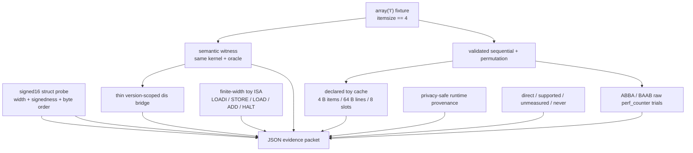

Review order:

1. fixture and semantic oracle;
2. observation dataclasses and scope strings;
3. signed 16-bit encoding round trip;
4. toy ISA transition function and word mask;
5. toy-cache geometry and update;
6. bytecode inventory/version record;
7. ABBA/BAAB timing protocol and exposure labels;
8. report schema and prohibited claims;
9. sixteen adversarial tests;
10. CLI/serialization.

### 9.6 Correctness argument

For the access-order core:

1. `priority_codes(n)` creates exactly \(n\) values in \(0..10\,006\), admits
   only a four-byte `array('I')`, and constructs it outside timing.
2. `sequential_order(n)` enumerates \(0..n-1\) once.
3. `deterministic_permutation(n)` uses an offset plus a step coprime to \(n\),
   so positions \(offset+k\cdot step \bmod n\) are distinct for
   \(0\le k<n\); therefore it is a permutation.
4. `validate_visit_order` independently checks length, integer type, range,
   and uniqueness outside timing.
5. `count_due` increments once exactly when a visited code meets the threshold.
6. Since both orders visit the same indices exactly once and addition of these
   integer contributions is order-independent, results are equal.
7. `semantic_witness` also checks an independent direct scan oracle.

For the finite-width toy ISA:

1. initial registers and memory are zero and PC is zero;
2. every non-`HALT` instruction has one explicit state transition and advances
   PC by one;
3. only `STORE` changes memory;
4. `LOAD` copies memory to a register;
5. `ADD` masks to the declared word width, so \(250+10\) becomes 4 at 8 bits;
6. `HALT` returns a final immutable snapshot.

For the cache model:

1. each item index maps to byte address `index × item_bytes`;
2. each address maps to one `memory_line = address // line_bytes`;
3. each line maps to one `cache_slot = memory_line % cache_slots`;
4. a hit occurs exactly when that slot currently stores the same memory-line
   identity;
5. a miss replaces only that slot;
6. fresh invalid slots make the observation deterministic.

For timing, alternating ABBA/BAAB blocks balance which condition appears first
within blocks and preserve the sequence. The schedule reduces order bias; it
does not prove the absence of drift, interference, or cache effects.

The proof establishes the program/model, not the hardware analogy.

### 9.7 Adversarial evidence matrix

| Probe | Expected result | Claim defended |
|---|---|---|
| size 0, 1, and odd/even sizes | both orders remain valid/equal | permutation logic covers boundaries |
| duplicate/missing/out-of-range order | rejected before timing | comparison contract |
| `array('I').itemsize != 4` | candidate refuses the experiment | representation width is an admitted fact |
| threshold below/inside/above code range | oracle agreement | semantic result |
| `LOADI 250`, `LOADI 10`, 8-bit `ADD` | result 4 | finite word-width semantics |
| toy program without `HALT` | bounded failure | state trace cannot run forever silently |
| indices 0..15, 4 B/item, 16 B/line, 2 slots | 4 misses, 12 hits | declared cache semantics |
| same toy trace twice | identical events | deterministic declared model |
| changed line size/count | changed trace labeled new model | geometry is an input, not fact about host |
| `dis` on executing runtime | nonempty, version recorded | logical bytecode observation only |
| two blocks | exact ABBA then BAAB order | counterbalancing metadata matches execution |
| first/later timed block | label retained on every raw trial | timed order stays visible without claiming cold/warm hardware |
| timing cells overlap | report overlap; no ratio forced | raw evidence outranks story |
| hardware counter absent | “unmeasured,” not fabricated zero | causal boundary |

### 9.8 Validated baseline and reproducibility

Run the companion candidate:

```powershell
python .\python-advanced-course\work\module17_reference_candidate.py --self-test
python .\python-advanced-course\work\module17_reference_candidate.py --json `
  --size 20000 --threshold 4999 --blocks 2 --number 20
```

Expected invariants:

```text
all 16 adversarial tests pass
JSON serializes without NaN
runtime implementation/patch recorded
semantic witnesses true
toy ISA final state and 8-bit wraparound verified
declared toy-cache observations retained
all ABBA/BAAB timing trials and exposure labels retained
unmeasured hardware hypotheses present
no object/allocation/GC profiler included
no timing comparison ratio included
no field claims measured cache misses
```

Executed timing values are intentionally not baked into the workbook. They
belong to the learner's evidence packet and must retain their actual runtime
label.

---

## 10. Six connected teaching sessions

Use one Atlas investigation throughout:

```text
fixture: deterministic synthetic priority codes
representation: array('I'), admitted only at itemsize == 4
kernel: count_due
condition A: sequential index order
condition B: deterministic full permutation
oracle: direct order-independent count
machine models: finite-width toy ISA + declared direct-mapped cache
measurement: recorded semantic preflight + alternating ABBA/BAAB blocks
decision: bounded explanation, not a universal winner
```

Each session consumes the prior artifact. A session adds one abstraction jump,
not a fresh toy problem.

### Session 1 — Make bits earn their meaning

**Consumes:** M6 value/representation, M15 portable encoding, the M16 synthetic
projection.

**Pressure:** `fc ff`, `array('I')`, and the integer \(-4\) are being discussed
as if “the bytes explain themselves.”

**One jump:** abstract value → width/signedness/byte-order contract.

**Pre-reading:** Nand2Tetris Projects 1–2 background/objective; Python 3.14
`struct` byte-order table. Stop before project solutions.

**Interactive sequence:**

1. Commit to interpretations of `11111100` before revealing the contract.
2. Decode `fc ff` under unsigned/signed and little/big-endian alternatives.
3. Derive the two's-complement rule by subtracting \(2^{16}\), not by memorizing
   “flip and add one.”
4. Read `signed16_probe`; mark logical value, bit-pattern value, encoder,
   matching decoders, and scope string.
5. Compare explicit `struct("<h")` with `array('I')` native in-memory
   representation; explain why only one is a portable field contract here.
6. Inspect `priority_codes`; find the range proof and item-size admission.
7. Challenge “contiguous four-byte values are cache friendly” by listing the
   missing cache geometry and actual-address evidence.
8. Write one representation card and one invalid-input counterexample.

**Reading-first studio:** the instructor hides code bodies and shows only
docstrings, input checks, and output dataclasses. Michael predicts the minimum
implementation, then reviews the actual code for stronger or weaker claims.

**Artifact:** signed-16 trace, Atlas representation card, round-trip evidence,
and a three-column “value / representation / observation” map.

**Exit:** explain why `fc ff` can mean \(-4\) only after width, signedness, and
byte order are named—and why this says nothing about a Python integer object's
layout.

### Session 2 — Derive remembered state from current-input logic

**Consumes:** Session 1 bit meanings.

**Pressure:** comparison and addition can transform current inputs, but a
multi-item count needs the prior total and a next instruction location.

**One jump:** Boolean function → next-state function → clocked register.

**Pre-reading:** Nand2Tetris Project 3 background; MIT 6.004 combinational and
sequential logic selections.

**Interactive sequence:**

1. Complete `NOT`, `AND`, `OR`, `XOR`, mux, and half-adder truth tables.
2. Recover a full-adder dependency map from two half-adders and one OR.
3. Mark which signals are values and which select paths.
4. Trace the four-row `due` register table, predicting each post-edge state.
5. Give the register too few bits; find the first wraparound and state whether
   it is model-correct but application-wrong.
6. Read the finite-width toy machine's `word_mask`.
7. Predict \(250+10\) for 8-bit `ADD`, then inspect the adversarial test.
8. Review a datapath where destination/write-enable metadata is missing; name
   the first instruction that can corrupt architectural state.
9. Explain how the PC is just state with special ownership.

**Architecture-reading studio:** reconstruct the next-state equations from a
datapath diagram, then redraw only the state elements. The aim is to see where
history lives.

**Artifact:** gates→adder→register dependency map, transition table, width
failure, and reviewed control-path correction.

**Exit:** answer “what stores the previous batch total?” without saying that a
combinational feedback wire magically remembers it.

### Session 3 — Read instructions as state transitions

**Consumes:** bit width, current/next state, PC/register/memory separation.

**Pressure:** a programmable machine needs commands whose visible effects
software can depend on.

**One jump:** next-state circuit → instruction-set contract and declared call
convention.

**Pre-reading:** Nand2Tetris Projects 4–5 background; ratified RISC-V RV32I
introduction, registers, loads/stores, branches/jumps; MIT 6.004 ISA and
procedure selections.

**Interactive sequence:**

1. Classify assembly text, machine encoding, ISA semantics, and
   microarchitecture.
2. Read `ToyInstruction` and reconstruct every legal state change before
   reading `trace_toy_machine`.
3. Trace `LOADI, LOADI, STORE, LOAD, ADD, HALT`, with PC/register/memory columns.
4. Remove `STORE`; prove that later `LOAD` cannot retrieve 7 from unchanged
   memory.
5. Trace the RISC-V-like `lw/bltu/addi` Atlas loop and complete the third item.
6. Add the empty-range precondition/guard.
7. Trace a nested call under the declared toy stack convention; deliberately
   restore `x1` from the wrong address and predict the earliest corrupted
   assumption.
8. Identify which rules come from RV32I and which come from the toy calling
   convention.
9. Reject the phrase “this is the assembly for the Python function.”

**Code-reading studio:** show a state history with one incorrect row. Michael
locates the first impossible transition before seeing the source.

**Artifact:** six-instruction toy history, RISC-V state table, call/return
trace, and ISA/microarchitecture/calling-convention ownership matrix.

**Exit:** explain why `LOAD` and `ADD` without `STORE` leave data memory
unchanged.

### Session 4 — Explain overlap and locality without promising hardware

**Consumes:** instruction state transitions and address generation.

**Pressure:** correct instructions can take different costs because
implementations overlap work and move addressed lines through a hierarchy.

**One jump:** ISA transition → processor pipeline/hazards → declared cache
model.

**Pre-reading:** MIT 6.004 processor, cache, and pipeline units; Berkeley CS
61C memory-hierarchy note.

**Interactive sequence:**

1. Annotate fetch/decode/execute/memory/writeback with values and control.
2. Fill the five-stage timing table; distinguish first-result latency from
   steady-state throughput.
3. Insert one data dependency and one branch; predict where naive overlap
   becomes unsafe.
4. Use \(N_{\text{instructions}}\times CPI\times T_{\text{cycle}}\) to generate
   three competing explanations for one elapsed change.
5. Derive item index → byte address → memory line → slot.
6. Hand-trace sequential indices 0–15 under 4 B/item, 16 B/line, 2 slots.
7. Hand-trace the exact 16-index permutation and predict 13 misses/3 hits.
8. Run `toy_cache_observation`; reconcile every disagreement with the worksheet.
9. Change one geometry input and relabel all results.
10. Compare CPU cache, OS page cache, DB page cache, and application cache by
    unit, owner, and evidence.

**Diagram studio:** remove labels from the cross-layer cache inspector; Michael
reconstructs them and identifies which arrows are model state versus possible
physical transfer.

**Artifact:** pipeline/hazard annotation, CPU-time factor table, two complete
toy-cache traces, and “not the host CPU cache” boundary card.

**Exit:** explain why same \(\Theta(n)\) work and same result permit different
locality and elapsed observations.

### Session 5 — Bridge Python to the machine one owned layer at a time

**Consumes:** language contract, ISA, microarchitecture, hierarchy.

**Pressure:** the agent calls CPython bytecode “assembly” and treats one
`read(1)` as one disk operation.

**One jump:** source meaning → implementation-specific runtime instruction
layer → native software → ISA/machine → OS handoff.

**Pre-reading:** Python 3.14 `dis` warning; pinned CPython
`InternalDocs/interpreter.md` overview/instruction decoding/evaluation stack,
45-minute maximum.

**Interactive sequence:**

1. Predict how many layers one source expression crosses; refuse an exact
   native count.
2. Run `source_bridge_observation`; annotate implementation, patch, opnames,
   and scope.
3. Sort claims into Python semantics, CPython observation, ISA, processor,
   memory hierarchy, OS, and I/O.
4. Distinguish evaluation stack, declared call stack, and memory hierarchy.
5. Read one simple CPython bytecode definition only to identify ownership, then
   stop before specialization/object/allocation internals.
6. Trace `file.read(1)` as a request through possible runtime buffer and OS
   boundaries without asserting a physical transfer.
7. Route process, page table, syscall, page cache, and filesystem questions to
   Module 18.
8. Route threads/GIL/locks to M19 and object/GC/profiling questions to M24.

**Architecture-reading studio:** Michael receives seven evidence fragments and
places each at exactly one direct-observation layer, then writes the strongest
permitted inference.

**Artifact:** cross-layer execution map, three-stack comparison, I/O boundary
trace, and later-module question queue.

**Exit:** explain why bytecode is neither Python source nor the host ISA and
why one Python operation need not map to one of anything below it.

### Session 6 — Review the incident and defend a bounded claim

**Consumes:** all prior contracts, traces, model outputs, and ownership maps.

**Pressure:** a semantically promising agent patch has an unfair experiment
and an unsupported L1-cache explanation.

**One jump:** observations → controlled comparison → bounded causal language.

**Pre-reading:** Python `time.perf_counter` documentation and the reference
candidate's protocol/report/tests.

**Interactive sequence:**

1. Read only the agent's result sentence; enumerate claims that would need
   evidence.
2. Read the semantic change; separate correct result from changed workload.
3. Build the factor table: implementation × access order.
4. Validate both permutations and oracle before timing.
5. Read the explicit `perf_counter` loop; identify what is inside.
6. Predict ABBA then BAAB trial metadata, including first/later exposure labels.
7. Retain raw trials and inspect cells without computing a winner ratio.
8. Compare toy-cache output and elapsed output; state why neither is the other.
9. List alternative interpreter, branch, frequency, scheduling, page, and
   interference explanations.
10. Write one accepted observation sentence, one remaining hypothesis, one
    prohibited claim, and one discriminating next step.
11. Decide accept/reject/split for the patch, experiment, and prose separately.

**Agent-review studio:** the agent may generate plotting or JSON boilerplate
only after Michael supplies the oracle, schedule, schema, prohibited scope, and
acceptance tests. Michael reviews the diff and raw evidence rather than the
agent summary.

**Artifact:** annotated patch, crossed design, raw evidence packet, claim
rewrite ladder, decision record, and six-minute oral defense.

**Exit:** “Under this exact setup we observed ___. The toy model establishes
___. We did not measure ___. The leading alternatives are ___. The next
discriminating test is ___.”

---

## 11. Eight-level problem ladder

The ladder keeps the same Atlas fixture. Each level produces evidence consumed
by the next.

### Level 1 — Classify representation and claim layers

Classify 30 fragments as abstract value, bit pattern, byte sequence,
`array('I')` runtime representation, Python semantics, CPython observation,
toy-machine result, RISC-V ISA claim, microarchitecture model, toy-cache result,
empirical timing, Atlas policy, hypothesis, or open decision.

For five misclassified fragments, write the missing width/version/model/setup.

### Level 2 — Trace bits through logic and remembered state

Decode `fc ff` under four contracts. Then trace codes `11, 122, 85` through a
threshold comparison and a three-bit due-count register. Draw:

```text
value → field bits → comparator output → adder input → register before/after
```

Create one insufficient-width counterexample and distinguish model-consistent
wraparound from Atlas-correct counting.

### Level 3 — Trace ISA state and call ownership

Recover the toy ISA from `trace_toy_machine` and complete every state row. Then
trace the RISC-V-like Atlas loop on three bytes. Finally, use the declared call
convention to find a save/restore defect.

For each instruction name old reads, new writes, next PC, and the authority for
the rule. Reject any memory-change claim with no store.

### Level 4 — Recover processor and hierarchy architecture

From unlabeled diagrams:

1. reconstruct datapath/control and pipeline registers;
2. annotate one data and one control hazard;
3. distinguish latency/throughput/bandwidth;
4. derive memory line and slot from item index;
5. complete both 16-index cache traces;
6. change geometry and predict the new model before running it.

Produce one “ISA permits / microarchitecture chooses / toy model assumes”
matrix.

### Level 5 — Debug the Atlas performance incident

Given the suspicious patch and report:

1. verify semantic equivalence;
2. mark changed timed work;
3. reconstruct trial order;
4. identify selective reporting;
5. locate bytecode/ISA collapse;
6. identify unsupported cache causality;
7. find one scope generalization;
8. state the earliest invalid inference, not merely the loudest sentence.

Return separate decisions for code usefulness, benchmark validity, and prose.

### Level 6 — Design and delegate the evidence packet

Write a bounded task for an agent to implement only:

- JSON serialization of already defined observations;
- ABBA/BAAB trial recording;
- deterministic tests;
- privacy-safe provenance;
- a report view that never computes a cache-causal ratio.

Supply exact inputs, outputs, prohibited modules/claims, test commands, and
reversal. Forbid object/allocation/GC profiling, OS tuning, native extensions,
privileged cache flushing, and production Atlas data.

### Level 7 — Review and verify the generated patch

Read in this order:

1. semantic oracle and validation;
2. representation admission;
3. toy ISA state transitions;
4. toy-cache geometry/state;
5. timing schedule and raw trial retention;
6. thin `dis` scope;
7. provenance and claim boundaries;
8. adversarial tests;
9. CLI/output.

Find one unsupported claim, missing negative case, hidden scope expansion, and
reproducibility gap. Run focused probes and decide accept/reject/split with
prioritized reasons.

### Level 8 — Transfer across the I/O and OS handoff

Atlas changes from an in-memory `array('I')` projection to a memory-mapped or
file-backed projection. Without implementing an OS:

- preserve the language-level semantic oracle;
- identify new representation and lifetime contracts;
- distinguish a Python read request, runtime buffering, OS request, page-cache
  state, address translation, and device transfer;
- list questions that now require Module 18;
- state which M17 cache/timing evidence cannot transfer;
- design a safe disposable observation plan;
- reject any one-read/one-page/one-device-operation claim without evidence.

Produce a boundary sequence diagram and an explicit “known / model / observed /
unknown / next owner” handoff.

---

## 12. Confidence-aware understanding check

For every item, commit to:

1. A–D;
2. confidence 1–4;
3. one causal sentence;
4. the strongest distractor and why it tempted you.

Open the analysis only after committing. A low-confidence correct answer routes
to reconstruction; a confidence-4 miss routes to a delayed counterexample,
because fluent certainty can hide a collapsed layer.

### Question 1 — Bytes require width, signedness, and order

The two bytes are `fc ff`. The contract is **little-endian signed 16-bit
two's-complement**. Which value is represented?

A. \(65\,532\)  
B. \(-4\)  
C. \(-769\)  
D. The host byte order must be known first.

<details>
<summary>Answer, distractor diagnosis, and route</summary>

**Answer: B.** Little-endian orders the bytes into the 16-bit pattern
`0xfffc`. Its unsigned pattern value is \(65\,532\); since the high bit is set,
the signed interpretation is \(65\,532-65\,536=-4\).

- A stops at unsigned interpretation.
- C reverses or arithmetically improvises the bytes.
- D ignores that the decoder contract is explicit and host-independent.

**Counterexample:** the same bytes under unsigned little-endian do denote
\(65\,532\), showing that bytes alone were not negative.

**Route:** confidence-4 miss → Section 2.2–2.3 and run `signed16_probe`. Correct
at confidence 1–2 → derive the subtraction rule without “flip/add one.”
</details>

### Question 2 — Remembering the previous batch

Atlas must add today's due count to a value retained from the previous batch.
Which component is fundamentally required in the teaching machine?

A. A larger combinational AND gate  
B. A clocked register or other declared state element  
C. A byte-order decoder  
D. A branch predictor

<details>
<summary>Answer, distractor diagnosis, and route</summary>

**Answer: B.** A current-input Boolean function cannot retain a prior value
after inputs change. The machine needs state plus a transition rule.

- A changes a current-input function without adding memory.
- C interprets bytes but does not retain history.
- D may be an implementation optimization and is not the state requirement.

**Counterexample:** change all gate inputs after a combinational result; without
a state element, no earlier total remains available.

**Route:** confident miss → Section 3.3 register table. Low-confidence correct
→ write \(S_{t+1}=F(S_t,I_t)\) for load/no-load.
</details>

### Question 3 — Load, add, and memory state

A toy program executes `LOAD r2,[r0]`, then `ADD r3,r1,r2`, then `HALT`. No
`STORE` occurs. Which conclusion is strongest?

A. Memory must now contain the sum because `ADD` used a loaded value.  
B. Memory is unchanged under this ISA model; `LOAD` reads it and `ADD` writes a register.  
C. Memory changes only if the sum overflows.  
D. `HALT` commits the register file to memory.

<details>
<summary>Answer, distractor diagnosis, and route</summary>

**Answer: B.** The declared instruction effects separate register and memory
writes. A value's origin does not determine its destination.

- A confuses data flow with state ownership.
- C invents an overflow store.
- D invents transaction-like commit semantics for `HALT`.

**Counterexample:** compare the full trace with and without the earlier
`STORE`; only the store transition changes the memory tuple.

**Route:** confidence-4 miss → trace PC/register/memory columns in Section 4.
Low-confidence correct → name old reads and new writes for all three lines.
</details>

### Question 4 — A Python operator is not one ISA instruction

What is the strongest claim about `codes[index] <= threshold`?

A. Python requires one compare instruction in every ISA.  
B. CPython `dis` reveals the exact native instruction stream.  
C. It has Python-level meaning; one recorded CPython reports logical bytecode, while native realization may involve many implementation-specific instructions.  
D. It cannot execute on a load-store ISA.

<details>
<summary>Answer, distractor diagnosis, and route</summary>

**Answer: C.** Language semantics, CPython bytecode, native software, and ISA
instructions are connected but distinct layers.

- A invents a one-to-one language/ISA contract.
- B promotes runtime bytecode to native assembly.
- D mistakes a high-level operation for an ISA restriction.

**Counterexample:** another Python implementation can preserve the comparison
result while using different bytecode or no CPython bytecode.

**Route:** confident miss → Section 7.1–7.4 ownership map. Low-confidence
correct → explain exactly what `source_bridge_observation` records.
</details>

### Question 5 — Stack-pointer symmetry and return state

Under the declared toy calling convention, a callee allocates 8 bytes, saves
the return address at `4(sp)`, later reloads it, but returns without adding 8
back to `sp`. Best review?

A. Harmless; return address restoration is the only invariant.  
B. The current return may use the restored address, but the stack-owner invariant is broken and later calls/accesses can use the wrong frame location.  
C. Every such bug immediately changes the code array.  
D. CPython's evaluation stack will automatically restore the native stack pointer.

<details>
<summary>Answer, distractor diagnosis, and route</summary>

**Answer: B.** Save/restore obligations include the declared stack-pointer
state. Exact symptoms depend on subsequent calls and accesses.

- A ignores frame ownership.
- C invents a data-memory target.
- D collapses CPython evaluation state with a declared native convention.

**Counterexample:** a caller that expects its original `sp` and allocates
another frame now addresses a different region.

**Route:** confident miss → Section 4.6–4.7 call trace. Low-confidence correct
→ draw before/after `sp`, saved address, and next allocation.
</details>

### Question 6 — Same linear work, different locality

Two calls use the same `count_due`, codes, threshold, number of indices, and
result. One order is sequential; one is a full permutation. Both are
\(\Theta(n)\). Which statement is strongest?

A. Their elapsed times must be equal because asymptotic classes match.  
B. The sequential call must be faster on every machine.  
C. Asymptotic work matches, while access order can change locality and constants; actual timing and cause require bounded evidence.  
D. A permutation changes the result because addition is always order-sensitive.

<details>
<summary>Answer, distractor diagnosis, and route</summary>

**Answer: C.** \(\Theta(n)\) omits constants, representation, interpreter work,
and data movement. Locality is a justified hypothesis, not a universal winner.

- A promotes growth class to exact cost.
- B promotes a common pattern to a hardware/runtime guarantee.
- D ignores the validated integer-count oracle.

**Counterexample:** the declared toy cache records different hit sequences even
though both orders visit each index once; a real run can still overlap due to
other mechanisms.

**Route:** confident miss → Sections 6.5–6.8. Low-confidence correct → list
four non-cache explanations compatible with an elapsed difference.
</details>

### Question 7 — I/O request versus physical transfer

Python executes `file.read(1)` and returns one byte. Which statement is
strongest?

A. Exactly one byte was physically read from storage.  
B. Exactly one system call and one page-cache miss occurred.  
C. The language/library request returned one byte; buffering, OS state, and device-transfer granularity require separate evidence.  
D. CPU L1 cache and OS page cache are therefore the same cache.

<details>
<summary>Answer, distractor diagnosis, and route</summary>

**Answer: C.** Request/result semantics do not specify a one-to-one lower-layer
transfer.

- A invents physical granularity.
- B invents OS events.
- D collapses caches with different units and owners.

**Counterexample:** the byte may already be in a Python buffer or OS-managed
cache, so no new physical storage transfer is required for this call.

**Route:** confident miss → Section 7.7, record the later M18 question, and
continue through the M28–M31 mathematical bridge. Correct at low confidence →
name three possible paths without claiming which occurred.
</details>

### Question 8 — Benchmark evidence and causal claims

An agent times the permuted baseline first and cold for 10 calls. It warms the
sequential candidate, runs 2,000 calls, keeps only its minimum, and says “L1
cache misses caused the 4.7× speedup.” Best response?

A. Accept because a large ratio identifies its cause.  
B. Accept the cache claim if `dis` shows fewer bytecodes.  
C. Revalidate semantics, equalize timed work, record ABBA/BAAB raw trials with first/later exposure, and keep cache causality unmeasured without independent evidence.  
D. Reject all optimization because timing is never useful.

<details>
<summary>Answer, distractor diagnosis, and route</summary>

**Answer: C.** The original protocol confounds order, warm exposure, trial
counts, selective reporting, and possibly implementation. Elapsed time and
bytecode do not measure L1 events.

- A treats magnitude as causal identification.
- B collapses bytecode and hardware cache behavior.
- D discards bounded empirical evidence instead of repairing it.

**Counterexample:** CPU frequency, scheduling, branch behavior, different timed
construction, or runtime path can produce an elapsed difference without the
claimed L1 event pattern.

**Route:** confidence-4 miss → Section 8.4, then predict the exact first
ABBA/BAAB metadata before rerunning. Low-confidence correct → write the narrow
six-clause claim from Section 8.7.
</details>

### Diagnostic routing

| Miss pattern | Collapsed distinction | Repair artifact |
|---|---|---|
| Q1 | bytes = signed value | width/signedness/endian contract card |
| Q2 | combinational output = remembered state | register next-state table |
| Q3 | data read/used = memory write | PC/register/memory instruction trace |
| Q4 | Python operation = bytecode = ISA instruction | cross-layer execution map |
| Q5 | return address alone = complete call invariant | save/restore frame trace |
| Q6 | asymptotic class = exact elapsed cost | toy-cache trace + alternative causes |
| Q7 | language request = OS/device action | I/O boundary sequence |
| Q8 | elapsed ratio/bytecode = hardware cause | ABBA/BAAB raw packet + claim rewrite |

If Q1–Q3 fail together, return to representation→logic→state before ISA. If
Q4–Q5 fail, trace ownership before discussing performance. If Q6–Q8 fail, do
not add more benchmark runs until the semantic and evidence layers are
separated.

---

## 13. Cumulative project, TA protocol, and mastery evidence

### 13.1 Project — Atlas architecture and performance evidence dossier

Investigate the synthetic Atlas priority-code kernel while preserving its
semantic contract. Explain its execution and observations across abstraction
layers without claiming more than the recorded evidence supports.

The project is primarily code reading, trace reconstruction, architecture
recovery, agent review, experiment design, and explanation. The runnable
reference already contains the core implementation. Michael's work is to
understand, challenge, run, adapt within bounds, verify, and defend it.

### 13.2 Safety and scope

- Use only disposable synthetic output from `priority_codes`.
- Never benchmark the production database or private learning history.
- Do not flush hardware caches, request administrator privileges, change power
  settings, or install unsafe native measurement tools.
- Optional hardware counters are enrichment only and require
  platform-authoritative documentation, permissions, and provenance.
- If a counter or observation is unavailable, record the hypothesis as
  unmeasured.
- Do not promise a speedup, winner, fixed ratio, or universal transfer.
- Keep construction/validation outside both measured conditions.
- Stop before M18 OS mechanisms, M19 concurrency, and M24 object/runtime
  profiling.

### 13.3 Milestone A — Semantic and representation contract

Deliver:

1. precise input/result contract for `count_due`;
2. justification for `array('I')` plus observed `itemsize == 4`;
3. proof and executable validation that both orders are full permutations;
4. order-independent result oracle;
5. signed-16 `fc ff` representation trace;
6. invalid-input and unsupported-runtime behavior.

**Gate:** do not collect timing until `all_results_equal` is true and both
orders validate.

### 13.4 Milestone B — Machine-state explanation

Deliver:

1. full toy-program state trace;
2. 8-bit \(250+10\rightarrow4\) wraparound trace;
3. load/arithmetic/store effect table;
4. “ISA promises / microarchitecture chooses” table;
5. declared call/return trace and one broken save/restore case;
6. pipeline-overlap paragraph that does not equate it to Python concurrency.

**Gate:** every claimed state change names the instruction and destination
state that causes it.

### 13.5 Milestone C — Locality prediction

Deliver:

1. exact item/line/slot geometry;
2. complete hand trace for the small sequential order;
3. complete hand trace for the small deterministic permutation;
4. simulator preview and total hits/misses;
5. sensitivity prediction before changing one model parameter;
6. a large visible label: **this is not the host CPU cache**.

**Gate:** every result sentence contains “in the declared toy model” or an
equally precise scope.

### 13.6 Milestone D — Execution-stack and provenance audit

Deliver:

1. Python→CPython→native runtime→ISA→microarchitecture→OS→device map;
2. `source_bridge_observation` with exact implementation/version;
3. privacy-safe runtime provenance;
4. recorded/unrecorded environment table;
5. three-stack distinction;
6. one M18 parking-lot question, one M19 question, and one M24 question.

**Gate:** “instruction,” “stack,” “cache,” and “memory” are always qualified by
owner/layer.

### 13.7 Milestone E — Experiment and agent review

Deliver:

1. line-by-line review of the suspicious patch;
2. semantic ideas worth preserving;
3. changed-work, order, exposure, selection, and causal defects;
4. exact ABBA/BAAB schedule;
5. every `TimingTrial` in original position;
6. first/later exposure cells;
7. environment notes recorded during the run;
8. at least five compatible alternative explanations;
9. separate accept/reject/split decisions for patch, experiment, and prose.

**Gate:** no elapsed summary precedes raw trial retention, and the report
computes no comparison ratio.

### 13.8 Milestone F — Bounded architecture memo

Write 600–900 words:

1. **Question and cumulative invariant**
2. **Semantic witness**
3. **Representation contract**
4. **Toy ISA and microarchitecture explanation**
5. **Toy-cache prediction**
6. **Runtime and timing observations**
7. **What the evidence supports**
8. **What remains a hypothesis**
9. **Alternative explanations**
10. **Next falsification step**
11. **M18/M19/M24 transfer boundary**

End with exactly six scoped sentences:

```text
[SEMANTIC CONTRACT] ...
[REPRESENTATION CLAIM] ...
[MACHINE MODEL RESULT] ...
[RUNTIME OBSERVATION] ...
[EMPIRICAL OBSERVATION] ...
[HYPOTHESIS + FALSIFICATION] ...
```

### 13.9 Required machine-readable packet

Inspect and retain:

```text
schema
runtime
protocol
semantic_witness
signed_16_bit_encoding
toy_isa_trace
python_execution_bridge
toy_cache_models
timing_trials
timing_cells
claim_boundaries
next_falsification_steps
```

The packet must serialize without NaN. `timing_trials` retains its original
order. `claim_boundaries` explicitly names unmeasured hardware/OS/runtime
hypotheses. No field manufactures a causal or winner ratio.

### 13.10 Bounded agent task

> Review and, if necessary, patch only the supplied Module 17 reference and
> tests so it emits the defined JSON evidence schema. Preserve the same
> four-byte `array('I')`, validated sequential/permuted orders, `count_due`
> kernel, toy ISA trace, direct-mapped cache model, thin `dis` bridge, and
> ABBA/BAAB raw timing trials.
>
> Allowed: the reference candidate, its unit tests, disposable output, and a
> schema/evidence note.
>
> Forbidden: production Atlas data/database; networking; dependency additions;
> native extensions; privileged/system tuning; object layout, allocation, GC,
> or specialization profiling; OS mechanism implementation; concurrency;
> changing the semantic kernel; hiding trials; computing a winner ratio;
> claiming host cache events.
>
> Required report: assumptions, exact files changed, contract impact, commands,
> all test results, raw observation schema, unresolved uncertainty, and
> reversal.

Review the actual diff and report fields. An agent summary is not evidence.

### 13.11 Project acceptance invariants

- `priority_codes` uses only synthetic data and admits `array('I')` only at
  four bytes per item;
- both orders contain every valid index exactly once;
- the same `count_due` function receives both conditions;
- both results equal the independent oracle before timing;
- construction and validation are excluded equally;
- finite-width toy-machine transitions are deterministic and bounded by
  `HALT`/maximum steps;
- only `STORE` changes toy data memory;
- toy-cache geometry/state is explicit, deterministic, and labeled non-host;
- `dis` observation includes implementation/version and never says native ISA;
- every ABBA/BAAB trial, block, position, condition, occurrence, and exposure
  survives JSON serialization;
- semantic preflight is recorded and no hidden warm-up is claimed;
- runtime provenance excludes host/user identity;
- no object/allocation/GC profiler enters M17;
- no elapsed result is promoted to hardware cause;
- every final claim separates contract, model, observation, hypothesis, and
  falsification.

### 13.12 TA role

The TA helps recover a missing dependency and produce Michael's own trace. The
TA does not replace uncertainty with a confident story or solve the cumulative
defense on Michael's behalf.

TA modes:

1. **state tracer** — which state changes, under which rule?
2. **layer classifier** — which abstraction owns this term or observation?
3. **experiment auditor** — are semantics, protocol, and raw evidence intact?
4. **claim editor** — which clause lacks support, and how should it split?
5. **agent reviewer** — does the diff stay inside the bounded task?

Before giving a technical hint, ask for:

```text
Goal:
Exact point of confusion:
My current prediction:
Code/diagram/report field inspected:
Layer I think owns it:
Confidence (1–4):
```

If no layer can be named, classification becomes the first task.

### 13.13 TA response loop and hint ladder

Response loop:

1. restate the invariant;
2. locate the owning layer;
3. require a prediction;
4. reveal the smallest useful evidence;
5. compare prediction and evidence;
6. require one causal sentence;
7. change one input/model parameter/order;
8. save the misconception and retrieval route.

Hints arrive one rung at a time:

| Rung | TA action | Example |
|---|---|---|
| H0 — retrieval | ask for governing contract | “What must be equal before timing?” |
| H1 — layer | name only the owner | “This is representation, not yet cache.” |
| H2 — locator | point to one field/edge/state column | “Inspect `only_planned_difference`.” |
| H3 — constraint | reveal one relation, not result | “Only `STORE` may change toy memory.” |
| H4 — counterexample | falsify universality | “Can equal \(\Theta(n)\) loops move data differently?” |
| H5 — partial trace | fill one row | compute one memory line and slot |
| H6 — worked microcase | solve a smaller different fixture | four items through one slot |

After H6, a direct local answer is allowed only with transfer back to Atlas.

### 13.14 TA stop rules

**Stop the experiment** when:

- results differ or an order is invalid;
- construction/validation appears in only one condition;
- calls/order are unequal or unrecorded;
- raw trials are discarded;
- production/private data enters scope;
- unsafe or privileged cache manipulation is proposed;
- environmental change makes the current run uninterpretable.

**Stop the explanation** when:

- “Python,” “CPU,” “cache,” “memory,” “instruction,” or “stack” lacks an owner;
- bytecode is called assembly/native ISA;
- a toy-cache result becomes a host event;
- elapsed time becomes direct proof of a mechanism;
- one machine becomes a universal guarantee;
- an unavailable measurement becomes zero;
- `read(1)` becomes a physical transfer count.

Split the sentence into `[OBSERVATION]`, `[MODEL RESULT]`, and `[HYPOTHESIS]`.

**Stop at module boundaries**:

| Question | Route |
|---|---|
| processes, scheduling, VM/page tables, syscalls, filesystems, permissions, signals, page cache, shutdown | M18 |
| threads/processes as concurrency models, locks, GIL, deadlock, parallelism | M19 |
| frames, object layout, refcount, GC, allocation, specialization, profiling, native/vectorized optimization | M24 |

### 13.15 Three TA studios

**TA Studio A — state reconstruction (after Session 2, 45 minutes)**

- explain the representation card in two minutes;
- predict a changed `word_bits`/immediate trace;
- find an illegal register index or missing `HALT`;
- distinguish application-wrong overflow from model-correct transition.

Checkoff: current/next-state language and no implicit memory write.

**TA Studio B — layer microscope (after Session 4, 50 minutes)**

- receive a new item/line/slot geometry;
- trace eight cache events;
- observe an elapsed vector that contradicts the model's apparent ranking;
- explain compatibility and alternatives without altering deterministic model
  results.

Checkoff: model, host event, and elapsed observation remain distinct.

**TA Studio C — adversarial claim clinic (after Session 6, 60 minutes)**

- review the suspicious patch while the TA defends each flawed sentence;
- cite exact missing evidence/confounder;
- receive one new fact such as a named hardware counter;
- strengthen only the supported clause;
- preserve remaining uncertainty.

Checkoff: the claim improves incrementally without correlation becoming
universal cause.

### 13.16 Mastery gate

Module 17 is ready for progression only when Michael can explain, without
notes:

1. why bits need width and interpretation;
2. why clocked state differs from a combinational function;
3. why load, arithmetic, and store affect different state;
4. why an ISA is not a microarchitecture;
5. why pipelining is neither Python concurrency nor one-CPI proof;
6. why equal \(\Theta(n)\) work can have different behavior;
7. why toy-cache result is not host hardware evidence;
8. why CPython bytecode is not native ISA code;
9. why raw elapsed trials are observations rather than causes;
10. why a language I/O request is not a physical-transfer count.

Integrated performance ownership demonstration on a fresh fixture:

- establish semantic equivalence;
- trace at least four toy-machine transitions;
- trace at least eight toy-cache events;
- classify one `dis` observation;
- audit one unfair benchmark choice;
- rewrite one causal overclaim;
- propose an independent falsification step;
- route one question each to M18, M19, and M24.

| State | Meaning | Action |
|---|---|---|
| Ready | reasoning transfers and all boundaries hold | continue to M28; retain M18 questions for the later systems bridge |
| Ready with retrieval plan | ownership is correct but recall is slow/low confidence | proceed with scheduled consolidation |
| Bridge required | one or two named dependencies are unstable | repeat matching ladder/TA microcase |
| Reconstruct | semantics or evidence ownership is missing | return to earliest missing session |

MCQ percentage alone cannot pass the gate. A high-confidence layer collapse
triggers a targeted bridge even when the dossier looks polished.

### 13.17 Evidence packet

```text
evidence/module17/
├── 01-representation-state/
│   ├── signed16-contract.md
│   ├── atlas-array-contract.md
│   ├── boolean-to-register.md
│   └── toy-isa-trace.json
├── 02-architecture/
│   ├── isa-vs-microarchitecture.md
│   ├── call-return-trace.md
│   ├── pipeline-hazards.md
│   └── execution-stack-map.md
├── 03-locality/
│   ├── geometry.md
│   ├── sequential-trace.json
│   ├── permuted-trace.json
│   └── model-boundary.md
├── 04-experiment/
│   ├── environment.json
│   ├── protocol.json
│   ├── raw-timing-trials.json
│   ├── agent-patch-review.md
│   └── alternatives-ledger.md
└── 05-defense/
    ├── architecture-memo.md
    ├── claim-ladder.md
    ├── falsification-plan.md
    ├── oral-defense.md
    └── later-module-questions.md
```

Every artifact is inspectable. Their connected ownership, not page count, is
the evidence of mastery.

### 13.18 Consolidation and spaced retrieval

- **24 hours:** blank-page bits→bounded-explanation map; toy-program final
  state; three stack meanings; one contract/model/observation/hypothesis each.
- **72 hours:** new signed bytes, immediates/word width, cache geometry, and
  reversed ABBA/BAAB start; predict before running.
- **1 week:** read an unseen sequence-scan function and audit an agent
  performance explanation without implementing first.
- **3 weeks:** five-minute oral retrieval in preparation for later M18 work:

> How can one Python operation, one byte request, and one elapsed-time sample
> each be real observations while none uniquely identifies the physical work
> underneath?

Reflection:

> Before, I thought machine performance was ___. Now I can trace ___, separate
> ___ from ___, and refuse ___ until evidence names ___.

---

## 14. Explicit backward and forward connections

### 14.1 Backward connections

| Earlier module | Retrieved idea | How M17 deepens it |
|---|---|---|
| M1 — values/state/execution | value, name, mutation, transition | separates Python state from registers and addressed memory |
| M2 — functions/recursion/induction | calls, recursion, termination | adds a declared call convention without claiming CPython frame layout |
| M3 — abstraction/ADTs | representation independence | treats encodings and ISA as contracts hiding implementations |
| M4 — logic/proof | Boolean logic, invariant, quantifier | turns functions into gates and proofs into state-transition obligations |
| M5 — cost models | \(\Theta\), measurement, confounders | adds instruction/cycle/data-movement/hierarchy factors |
| M6 — representation/memory | bits, bytes, arrays, locality | adds explicit width/order and a transparent address/cache model |
| M7 — iteration/stacks | iterators, call stack, partial progress | separates call convention, evaluation stack, and hierarchy |
| M8–M11 — data structures/algorithms | indexing, order, graph, strategy, asymptotics | explains why representation/access order matter below an abstract algorithm |
| M12 — modules/dependencies | interface ownership | assigns every performance fact to an abstraction owner |
| M13 — evidence/debugging | executable claim, causal chain | builds a layered packet of oracle, traces, provenance, and raw trials |
| M14 — design/change | architecture recovery and agent review | separates useful code, valid experiment, and justified explanation |
| M15 — files/serialization | explicit byte format and I/O contract | connects portable fields to machine representation and opens OS handoff |
| M16 — relational/transactions | pages, plans, DB caches, synthetic export | prevents database physical vocabulary becoming CPU-cache claims |

### 14.2 Module 18 — later systems continuation

M17 ends with:

> A language/runtime request crosses a boundary, but who manages the process,
> address space, page translation, files, permissions, scheduling, caches, and
> devices?

After the M28–M31 mathematical bridge, M18 owns process state, system calls,
scheduling, virtual memory/page tables, filesystems, permissions, signals,
page cache, and shutdown. M17 supplies the execution-stack and evidence-layer
prerequisite.

### 14.3 Module 19 — Concurrency and parallelism

Pipeline overlap is not a program interleaving. M19 owns threads, processes,
locks, conditions, queues, races, deadlock, the GIL, and parallel model choice.
M17 contributes latency/throughput distinction and state ownership.

### 14.4 Modules 20–22 — network, distribution, and security

The one-request/one-transfer warning prepares partial reads, buffering,
framing, latency, retry, and distributed uncertainty. Explicit byte-order and
representation contracts prepare network protocols. Layer ownership prepares
threat modeling: a security guarantee must name its enforcing boundary.

### 14.5 Module 23 — languages and interpreters

M17's thin CPython bridge asks how syntax and semantics are represented and
executed by interpreters or compilers. M23 derives those mechanisms. M17 only
establishes that source, bytecode, native software, ISA, and processor are
different layers.

### 14.6 Module 24 — CPython, performance, and memory

M24 owns frames, deep bytecode/specialization, object layout, reference
counting, cyclic GC, allocation, profiling, and native/vectorized
optimization. M17 supplies semantic control, provenance, observation-layer
selection, and causal restraint.

### 14.7 Module 26 — capstone defense

The dossier rehearses:

```text
contract → model → implementation observation → experiment
→ alternatives → bounded conclusion → falsification
```

That systems argument transfers to performance, reliability, security, and
user-impact claims throughout the capstone.

---

## 15. Source ledger, licensing, claim boundary, and freshness

The workbook's Atlas case, traces, questions, diagrams, simulator, and
assessment are original synthesis. Sources supply authoritative contracts and
dependency routes; they do not supply copied assignment solutions.

### 15.1 Curriculum coverage

- [CS2023 report](https://csed.acm.org/wp-content/uploads/2025/11/CS2023-Report.htm)
  and [knowledge-area index](https://csed.acm.org/knowledge-areas/): architecture
  coverage includes representation, logic, machine organization, hierarchy,
  I/O, performance, and related systems boundaries.
- [ABET CAC 2026–2027 criteria](https://www.abet.org/accreditation/accreditation-criteria/criteria-for-accrediting-computing-programs-2026-2027/):
  used only as a breadth/depth, analysis, design/evaluation, communication, and
  integration evidence check. This self-directed course does not claim
  accreditation or endorsement.

### 15.2 Constructive university route

| Source | Directed use | Stop/production rule |
|---|---|---|
| [Nand2Tetris Project 1 — Boolean Logic](https://www.nand2tetris.org/project01) | gates and composition | background/objective only; no published solution |
| [Project 2 — Boolean Arithmetic](https://www.nand2tetris.org/project02) | adders/ALU pressure | original Atlas exercises |
| [Project 3 — Memory](https://www.nand2tetris.org/project03) | current output versus clocked state | no HDL solution |
| [Project 4 — Machine Language](https://www.nand2tetris.org/project04) | symbolic instruction/state trace | no Mult/Fill solution |
| [Project 5 — Computer Architecture](https://www.nand2tetris.org/project05) | CPU/memory/stored-program dependency | pedagogical machine, not host description |
| [Nand2Tetris license](https://www.nand2tetris.org/license) | CC BY-NC-SA 3.0 and academic-integrity request | link/attribute; do not publish project solutions |
| [MIT 6.004 Computation Structures](https://ocw.mit.edu/courses/6-004-computation-structures-spring-2017/) | dependency route from information through devices | selected units only |
| [MIT 6.004 combinational logic](https://ocw.mit.edu/courses/6-004-computation-structures-spring-2017/pages/c04/) and [sequential logic](https://ocw.mit.edu/courses/6-004-computation-structures-spring-2017/pages/c05/) | functions versus state | no transistor-depth requirement |
| [MIT ISA](https://ocw.mit.edu/courses/6-004-computation-structures-spring-2017/pages/c09/), [procedures/stacks](https://ocw.mit.edu/courses/6-004-computation-structures-spring-2017/pages/c12/), and [processor](https://ocw.mit.edu/courses/6-004-computation-structures-spring-2017/pages/c13/) | ISA/datapath/call pressures | teaching models labeled |
| [MIT caches](https://ocw.mit.edu/courses/6-004-computation-structures-spring-2017/pages/c14/) and [pipelining](https://ocw.mit.edu/courses/6-004-computation-structures-spring-2017/pages/c15/) | hierarchy/locality/overlap/hazards | original figures and cache traces |
| [Berkeley CS 61C notes](https://notes.cs61c.org/) and [memory hierarchy](https://notes.cs61c.org/content/caches-intro/memory-hierarchy/) | modern RISC-V/hierarchy route | concepts only; ISA authority remains spec |

MIT OCW pages indicate Creative Commons terms. Link and attribute; recheck the
exact license before incorporating any media or substantial text.

### 15.3 ISA and architecture authorities

- [RISC-V unprivileged ISA index, 20260120](https://docs.riscv.org/reference/isa/unpriv/unpriv-index.html)
  and [RV32I chapter](https://docs.riscv.org/reference/isa/v20260120/unpriv/rv32.html):
  register state, byte-addressed memory, load/store, arithmetic, branches, and
  jumps.
- [Intel architecture manuals](https://www.intel.com/content/www/us/en/developer/articles/technical/intel-sdm.html):
  optional contrast showing that a production ISA/manual family is far richer
  than the toy model. Do not infer Intel behavior on another machine or copy
  vendor figures.

The RISC-V ISA supports software-visible behavior. It does not promise five
stages, one cycle per instruction, a cache organization, a branch predictor,
or one native sequence for Python.

### 15.4 Python and CPython authorities

- Python 3.14.6 [`struct`](https://docs.python.org/3.14/library/struct.html):
  explicit byte-order/size/alignment prefixes and signed-16 probe.
- Python 3.14.6 [`array`](https://docs.python.org/3.14/library/array.html):
  homogeneous native representation and runtime `itemsize`.
- Python 3.14.6 [`dis`](https://docs.python.org/3.14/library/dis.html):
  logical CPython bytecode plus its implementation-detail warning.
- Python 3.14.6 [`time`](https://docs.python.org/3.14/library/time.html#time.perf_counter):
  high-resolution performance counter used around the explicit call loop.
- Python 3.14.6 [`platform`](https://docs.python.org/3.14/library/platform.html):
  implementation/OS/machine provenance with platform-dependent outputs.
- CPython 3.14.6 pinned tree
  [`c63aec69bd59c55314c06c23f4c22c03de76fe45`](https://github.com/python/cpython/tree/c63aec69bd59c55314c06c23f4c22c03de76fe45),
  especially
  [`InternalDocs/interpreter.md`](https://github.com/python/cpython/blob/c63aec69bd59c55314c06c23f4c22c03de76fe45/InternalDocs/interpreter.md):
  bounded source-reading bridge.

Stop before frame implementation, object layout/ownership, allocation, GC,
specialization, and profiling. Those are Module 24 reading targets.

### 15.5 OS handoff

MIT 6.004's virtual-memory/devices units and Berkeley's hierarchy route justify
the boundary. Optional official Linux references:

- [`/proc` filesystem documentation](https://docs.kernel.org/filesystems/proc.html);
- [memory-management concepts](https://docs.kernel.org/admin-guide/mm/concepts.html).

They show that OS-managed process/memory observations are separate from CPU
cache events. Linux is optional evidence, not portable Python and not required
on Michael's Windows machine. M18 owns the mechanisms.

### 15.6 Claim ledger

**Safe under named scope:**

- a bit pattern needs width and interpretation;
- combinational logic uses current inputs; sequential state retains history;
- an ISA specifies visible transitions; a microarchitecture implements them;
- load/register arithmetic/store change different state;
- instruction count, CPI, and cycle time are distinct;
- pipelining overlaps stages without becoming Python concurrency;
- cache lines/locality can alter a declared cost model;
- the toy simulator establishes only its declared results;
- CPython bytecode is not host ISA;
- `dis` is implementation/version specific;
- a complete raw timing packet is an empirical observation;
- equal \(\Theta(n)\) permits different constants and movement;
- a language I/O call is not necessarily a physical transfer;
- CPU, OS, DB, application, and runtime caches are distinct.

**Never promote without stronger evidence:**

- “these bytes are negative” without width/signedness;
- “the abstract integer is little-endian”;
- “this Python expression is one CPU instruction”;
- “bytecode is native assembly”;
- “the ISA specifies this cache/pipeline”;
- “this five-stage diagram is the host processor”;
- “one instruction takes one cycle”;
- “pipelining means Python threads”;
- “same \(O(n)\) means same time”;
- “contiguous means resident”;
- “toy misses are host misses”;
- “faster proves fewer cache misses”;
- “counterbalancing removes every confounder”;
- “first/later exposure proves warm/cold hardware state”;
- “the median is the true universal time”;
- “one `read(1)` is one disk/device transfer”;
- “the result transfers to every runtime, OS, processor, and workload.”

### 15.7 Freshness and lab checklist

- [ ] record audit/teaching date;
- [ ] record exact Python implementation and patch;
- [ ] keep Python documentation pinned to the selected minor baseline;
- [ ] pin CPython source to the matching commit;
- [ ] regenerate `dis` observations after a runtime change;
- [ ] never grade exact opnames across versions;
- [ ] record OS/release, machine label, pointer width, byte order, and compiler;
- [ ] verify `array('I').itemsize == 4` or refuse this experiment;
- [ ] record fixture size, threshold, generator revision, and order identity;
- [ ] validate both permutations and result oracle before timing;
- [ ] keep construction and validation outside both conditions;
- [ ] record semantic preflight and no-hidden-warm-up policy;
- [ ] preserve exact ABBA/BAAB order and every trial/exposure label;
- [ ] record timer/call-loop boundary and calls per trial;
- [ ] label cache geometry/results as toy model;
- [ ] record unavailable hardware evidence rather than infer it;
- [ ] use only disposable synthetic data;
- [ ] avoid privileged cache flushes, unsafe native tools, and power changes;
- [ ] recheck RISC-V versioned links;
- [ ] recheck curriculum criteria and source licenses annually;
- [ ] preserve M18, M19, and M24 stopping rules.

### 15.8 Final self-explanation

Without notes:

> Why do bits require a contract? How do gates and registers create remembered
> machine state? What does an ISA promise that a processor implementation does
> not? Why do load, arithmetic, and store modify different state? How can
> pipelining overlap work without making an instruction free or creating
> Python-level concurrency? How do lines and locality change a cost model? Why
> is CPython bytecode neither Python source nor host ISA? What does the toy ISA,
> toy cache, `dis`, and each raw `perf_counter` trial directly establish—and
> what can none establish alone? Why is `read(1)` not a physical-transfer
> count? Finally, where do M18, M19, and M24 begin?

Finish:

> I can trace what the declared models do, identify what the recorded runtime
> reports, preserve the semantic result, and retain what happened in one
> experiment. I also know which hardware, OS, concurrency, and CPython
> mechanisms I have not measured. The explanation is strong because every
> boundary and uncertainty is visible.

## Guided Codex handoff — M17

### Teaching Assistant — supportive oral defense

Start with: **“I am finishing M17. This source operation becomes these
execution-layer events, this cost claim assumes [model], and my confidence is
[level].”** Ask for a source → bytecode → machine/toy-model trace before
discussing speed. Use this hint ladder: semantic operation → representation →
instruction/memory event → locality or pipeline assumption → bounded
measurement → non-claim. Change one premise (cache layout, input size,
interpreter version, or concurrent workload) and ask which observation cannot
be transferred.

### Study Partner — execution-stack rehearsal

Ask the learner to label one event as Python semantics, CPython observation,
toy-ISA model, hardware mechanism, or measured result. Then change one label
and ask what claim becomes invalid. Finish with one readable whiteboard trace
and an uncertainty for the TA.

### Forward handoff — M28

Carry the separation of semantic contract, execution model, and measurement
evidence into **M28**. M28–M31 turn representation, continuous change,
uncertainty, and optimization into explicit mathematical evidence. After that
bridge, carry the execution discipline into **M18**, where the operating system
owns resources, scheduling, files, authority, and durability.
