# Module 18 — Operating Systems and Resource Mediation

> **Arc IV: make the system legible — from an OS handoff to a supervised,
> recoverable Atlas worker**
>
> An operating system does not make finite resources or failure disappear. It
> gives programs controlled abstractions for using them.

**Documentation and source-reading baseline:** Python 3.14.6; POSIX claims
scoped to POSIX.1-2024 / Issue 8; Windows claims scoped to current Microsoft
documentation; Linux and xv6 examples labeled as implementation or teaching
models.

**Source/freshness audit date:** 2026-07-29. Recheck the live-source items in
Section 16 before publication or reuse.

**Current bundled execution baseline at authoring time:** CPython 3.12.13 on
Windows. Every runnable observation must record the interpreter actually used.
Reading Python 3.14.6 documentation or pinned source does **not** turn a local
3.12.13 run into 3.14.6 validation. If a separate 3.14.6 interpreter is later
used, record and test it as a separate run.

---

## How to use this workbook

This is one investigation, not a catalog of commands.

Atlas already turns validated learning events into a deterministic review
packet. We now move that work into a child process. During shutdown, the child
can stop before or after several file-publication boundaries. On restart, the
supervisor must explain:

- which process existed and what it owned;
- which state was runnable, blocked, terminated, or collected;
- which addresses were virtual and which translations were modeled;
- which names, open resources, buffers, and cached bytes existed;
- which access decision allowed or denied an operation;
- whether stop was cooperative or forced;
- whether the old or new target is committed;
- what the evidence still cannot establish.

The route is:

```text
finite shared resources
→ controlled kernel mediation
→ program and process
→ lifecycle and scheduling
→ virtual address space
→ names and open resources
→ authority
→ shutdown
→ atomic visibility and durability
→ Atlas operating contract
```

Each difficult idea appears in several forms:

1. a plain-language explanation;
2. a precise model or contract;
3. an original diagram;
4. a concrete trace;
5. unfamiliar code to read;
6. a broken case to debug;
7. a bounded Atlas decision;
8. an evidence claim to defend.

Use the designated Teaching Assistant and Study Partner chats for guided
learning, rehearsal, and the supportive oral defense. The learner-facing HTML
reader is the visual/reference companion for traces, diagrams, and bounded
interactive work. Use Notion for predictions, misconceptions, diagrams redrawn
from memory, experiment records, and oral-defense notes. The workbook remains
the auditable instructor source.

### The learner loop

Before revealing a trace or running code:

1. predict the next state;
2. name the owner of that state;
3. state your confidence from 1–4;
4. run or reveal;
5. explain the difference;
6. write the strongest supported claim;
7. state what remains unknown.

Manual typing is deliberately small. Most work is reading, tracing, mapping,
debugging, designing, delegating, reviewing, and verifying.

### Claim labels

The label is part of the statement. It prevents an observation from silently
becoming a portable guarantee.

| Label | Meaning |
|---|---|
| **[OS MODEL]** | consequence of a declared portable or teaching model |
| **[PYTHON 3.14 CONTRACT]** | behavior documented by Python 3.14 |
| **[POSIX CLAIM]** | behavior specified by POSIX.1-2024, not a Windows promise |
| **[LINUX CLAIM]** | behavior documented for Linux |
| **[WINDOWS CLAIM]** | behavior documented for Windows |
| **[XV6 TEACHING MODEL]** | behavior of the named xv6 teaching system |
| **[CPYTHON 3.14.6 OBSERVATION]** | bounded fact about the pinned CPython source/runtime |
| **[ATLAS POLICY]** | design decision owned by Atlas |
| **[EMPIRICAL OBSERVATION]** | result recorded in a named disposable run |
| **[HYPOTHESIS]** | explanation still requiring discriminating evidence |
| **[UNKNOWN]** | fact the current instrument cannot establish |

When a sentence mixes labels, split it.

The documentation target and executed environment are two records:

| Record | Current value | What it supports |
|---|---|---|
| documentation/source target | Python and CPython 3.14.6 at the pinned commit | version-scoped contract and source-reading claims |
| bundled execution environment | CPython 3.12.13 on Windows | observations produced by that exact local runtime |

Never write “validated on Python 3.14.6” unless a separately recorded 3.14.6
run actually occurred.

---

## 1. Position in the knowledge graph

### 1.1 The pressure inherited from Module 17

Module 17 followed one Python operation through representation, CPython’s thin
runtime bridge, instruction-set state, processor organization, memory
hierarchy, and an I/O handoff. It ended with an intentionally incomplete
statement:

```text
file.read(1)
≠ necessarily one runtime refill
≠ necessarily one OS request
≠ necessarily one page-cache miss
≠ necessarily one physical transfer
```

Module 18 opens the next owner. It asks what happens when programs must share
processors, memory, files, and devices without receiving unrestricted control
over one another.

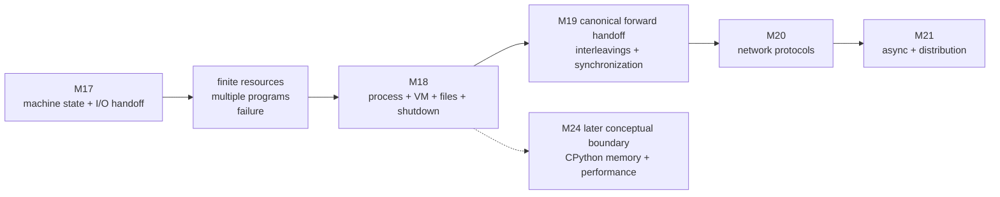

The graph separates academic foundations, reader narrative, and topic links.
M18's sole academic prerequisite is M17. M31's reader-narrative placement is
not an academic prerequisite; it resumes the 60-day route after the M28–M31
mathematics arc. M19 is M18's only canonical forward handoff. The dotted M24
edge is a conceptual stopping boundary, not learner navigation or a bypass.

The bridge reuses five M17 disciplines:

| M17 discipline | M18 use |
|---|---|
| qualify every “instruction,” “cache,” “address,” and “read” | qualify every “process,” “file,” “fault,” “signal,” and “durable” |
| separate ISA contract from implementation | separate Python, POSIX, Windows, Linux, and xv6 claims |
| preserve source semantics while investigating lower layers | preserve the review-packet oracle while changing execution and publication |
| toy model is not host observation | scheduler/page-table models are not host traces |
| elapsed time does not identify cause | delay does not identify scheduling, fault, cache, or device behavior |

### 1.2 The governing question

> How does an operating system mediate execution, memory, files, authority, and
> termination for one Atlas worker—and what must Atlas record so an
> interruption never makes a partial artifact look committed?

### 1.3 The exact central invariant

> **Every worker-visible effect is accounted for both as a process-local
> operation and as an OS-mediated resource transition. After interruption,
> Atlas publishes only a complete validated result, or leaves an explicitly
> classified recoverable state; an exit code, successful API return, or timing
> observation never silently substitutes for that evidence.**

Keep that sentence visible during every lab. It contains four obligations:

1. **dual accounting:** what the worker attempted and what OS-managed resource
   state changed are separate;
2. **safe publication:** incomplete bytes never appear under the committed
   target name;
3. **recoverable interruption:** leftovers are classified, not guessed;
4. **evidence discipline:** process exit, API success, timing, and artifact
   state are not interchangeable.

The experiment holds these dimensions fixed:

| Dimension | Fixed or declared | Changed or observed |
|---|---|---|
| semantic job | deterministic synthetic `build_review_packet` | no |
| input fixture and digest | same validated records | no |
| expected result and independent oracle | same | no |
| workers | one child under one supervisor | no |
| network | absent | no |
| workspace | one newly created disposable directory | no |
| publication | same-directory stage → validate → flush → sync → close → replace | no |
| launch | argv sequence, `shell=False`, explicit cwd/environment policy | no |
| fault point | one named phase | **yes** |
| Python/OS/filesystem capability profile | recorded | observed |
| run identity and PID | separate fields | observed |
| exit status | raw value | observed |
| target/temp artifacts | existence, bytes, digest, validity | observed |
| actual scheduler decision | no suitable core instrument | unknown |
| page residency and page-cache history | no suitable core instrument | unknown |
| physical device transfers and power-loss outcome | not tested | unknown |

### 1.4 The OS abstraction law

Plain language:

> An OS abstraction hides details so a program can use a resource safely.

More precisely:

> A useful operating-system abstraction hides mechanism while preserving a
> protection, ownership, lifecycle, or persistence contract; the abstraction
> does not erase finite resources or failure.

An analogy can help: a hotel room makes a shared building feel private. The
analogy stops before access tokens, address translation, scheduling, open
resources, crash consistency, and hostile guests. The precise replacement is
an OS-managed resource/protection context with explicit interfaces and failure
states.

### 1.5 Prerequisite retrieval and repair

Answer before Session 1.

1. Why does a return from `file.write(data)` not prove a physical transfer?
2. What is the difference between a Python object, a virtual-memory page, an
   OS page cache, and a CPU cache line?
3. Draw `try → exception → finally → propagated/handled` as state transitions.
4. What invariant does a same-directory temporary-file replacement try to
   preserve?
5. Distinguish an application contract, a model result, an empirical
   observation, and a hypothesis.
6. Given a supervisor, worker, domain function, and filesystem adapter, which
   dependencies should point inward?
7. Why can a successful test support a claim without proving a universal
   statement?

Route misses:

| Miss | Repair |
|---|---|
| I/O layers collapse | M17 Sections 7–8: I/O handoff and evidence ladder |
| cleanup becomes transaction/durability | M15 Sections 6–7 and publication timeline |
| exit/exception paths cannot be traced | M1 state and exception bridge |
| state-machine edges feel arbitrary | M4 transition-relation bridge |
| timing becomes cause | M5 cost model plus M17 claim rewrite |
| subprocess belongs in domain core | M12/M14 dependency and change maps |
| observed success becomes universal proof | M13 claim/evidence review |
| database ACID becomes filesystem promise | M16 durability-owner table |

A confident miss receives a counterexample and a delayed transfer. A
low-confidence correct answer receives an explanation prompt.

### Prediction before reveal — one returned write, one named boundary

Before opening a trace, choose a confidence level and complete this sentence:

> “After `buffered.write(payload)` returns, the strongest claim I can make is
> [claim], because [named owner and evidence]. I cannot yet claim [one lower
> layer or durability fact].”

Then compare the prediction with the Python, declared OS-model, platform, and
artifact evidence that follow. A revision is useful evidence, not a penalty.

### 1.6 Module ownership and stopping rules

Module 18 owns:

- user/kernel protection and system-call mediation;
- program, process image, live process, run identity, PID, and lifecycle;
- runnable/running/blocked/terminated/collected states and scheduling goals;
- virtual addresses, pages, page tables, TLBs, permissions, and page faults;
- paths, directory names, open resources, descriptors/handles, buffers, and
  page-cache boundaries;
- operation-time access decisions and least privilege;
- process signals/control events, cooperative stop, waiting, escalation,
  forced termination, and restart classification;
- one-file atomic visibility, synchronization, named durability assumptions,
  and recovery.

Stop at these boundaries:

| Later owner | Do not pull into Module 18 |
|---|---|
| **M19** | program-level interleavings, races, locks, conditions, queues, deadlock, the GIL, process/thread model choice, parallel speedup |
| **M20** | sockets as protocols, packets, addressing, ports, DNS, TCP/UDP, framing, partial network transfer, HTTP, protocol retries |
| **M21** | coroutine/task cancellation, event loops, async timeouts, backpressure, distributed uncertainty, retry/idempotency under network failure |
| **M22** | full threat models, authentication, authorization-system design, secrets, sandbox claims, hardening |
| **M24** | frames, bytecode dispatch, object layout, refcount/GC, allocators, RSS attribution, profilers, specialization, native/vectorized optimization |

A process may contain threads; Windows schedules threads. That boundary fact is
M18. Reasoning about their interleavings is M19.

### 1.7 Learning outcomes

At exit, Michael can:

1. derive OS mediation from finite resources, protection, multiplexing, and
   failure;
2. trace a controlled user→kernel→user transition without equating a Python
   call with one syscall;
3. distinguish program, process image, process, job, PID, handle/object, and
   Atlas run identity;
4. explain why POSIX `fork` creates while successful `exec` replaces an image;
5. read a `Popen` supervisor and recover argv, cwd, environment, inherited
   resources, status, wait, and cleanup ownership;
6. trace created/runnable/running/blocked/terminated/collected states;
7. compare scheduling policies only inside a declared workload model;
8. separate response, turnaround, throughput, fairness, and overhead;
9. split a virtual address into page number and offset;
10. trace TLB lookup, PTE permission/presence, translation, and distinct fault
    outcomes;
11. explain why TLB miss, soft fault, hard fault, and invalid access differ;
12. keep virtual page, physical frame, Python object, cache line, and resident
    memory distinct;
13. trace path resolution to a name, open resource, descriptor/handle, Python
    file object, buffers, and lower I/O boundary;
14. explain open-resource lifetime across name changes under a named model;
15. compare POSIX credential/mode concepts with Windows token/DACL concepts
    without pretending they are identical;
16. replace permission prechecks with attempt-and-handle control flow;
17. explain Python signal-handler delay and platform limits;
18. design cooperative stop, bounded wait, capability-scoped escalation, and
    artifact-driven recovery;
19. distinguish normal cleanup from forced termination and crash recovery;
20. distinguish flush, file sync, close, replace, directory sync, visibility,
    durability, transaction, recovery, and backup;
21. review an agent patch for lifecycle, path, permission, shutdown,
    portability, and claim defects;
22. produce and defend the Atlas durable-worker evidence dossier;
23. route overlap, networking, async distribution, security, and runtime
    internals to their correct future modules.

---

## 2. Finite resources force a mediator

### 2.1 Start with the impossible machine

Imagine three programs that each assume:

- every processor is theirs;
- every address belongs to them;
- every device accepts their commands;
- every file can be changed;
- their work cannot be interrupted.

Those assumptions cannot all be true. The machine is finite, programs may be
wrong or malicious, and resources outlive individual calls. The OS problem is
not “provide convenient functions.” It is:

> How can programs receive useful resource abstractions without receiving
> unrestricted authority over the machine or one another?

Four responsibilities emerge.

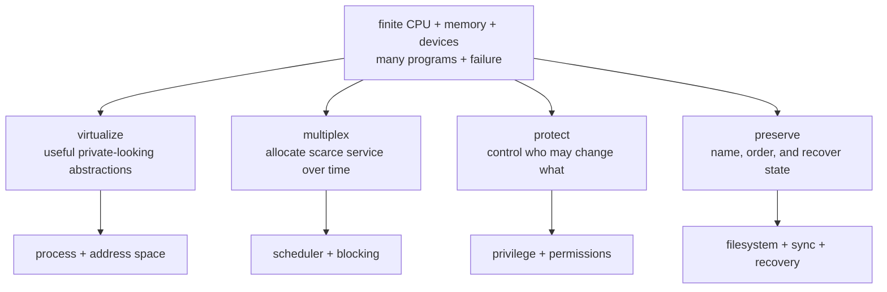

- **Virtualize:** present a process with a useful execution and address-space
  model.
- **Multiplex:** share processors, memory, and I/O over time and space.
- **Protect:** constrain state transitions by mode, identity, and resource
  policy.
- **Preserve:** keep named state meaningful across process lifetime and
  interruption under a declared failure model.

These are connected. A process is useful because it bundles execution,
address-space, resource, and protection state. A file is useful because names,
open lifetime, access rights, cached data, and persistence rules compose.

### 2.2 User mode and kernel mode

Plain language:

> Ordinary application code cannot directly perform every machine operation.

More precisely:

> Hardware and OS mechanisms distinguish less-privileged application
> execution from privileged kernel execution. A controlled exception/trap
> transfers control to a kernel entry point that validates and mediates a
> request before returning a result or error.

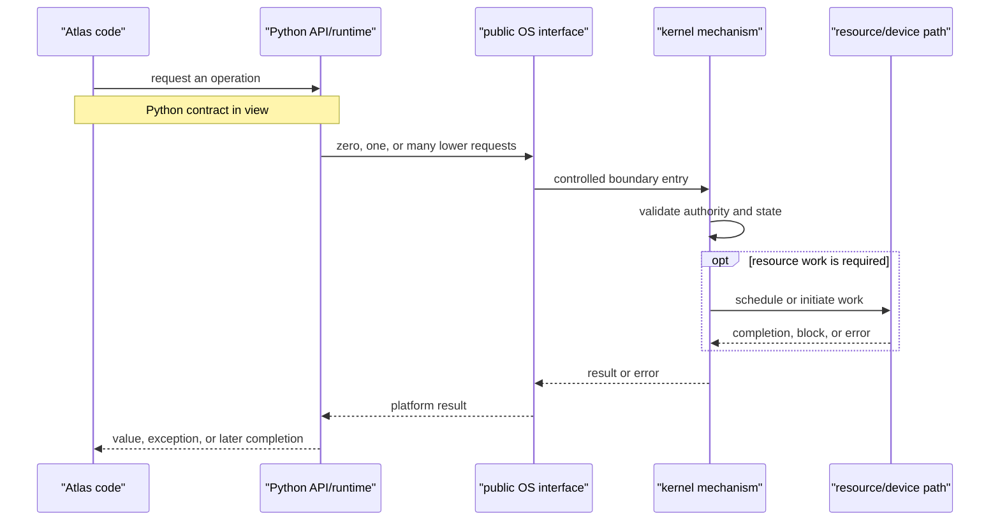

The diagram is intentionally nonnumerical. It does not say:

- one Python call creates one system call;
- one system call creates one physical transfer;
- every operation blocks;
- every OS uses the same entry mechanism;
- the diagram exposes actual host events.

### 2.3 Mechanism, policy, contract, and evidence

Keep four questions separate:

| Kind | Question | Example |
|---|---|---|
| mechanism | how can the transition be performed? | trap entry, page-table walk, context switch |
| policy | which legal transition should be chosen? | which runnable unit receives a processor |
| contract | what does the interface promise? | documented `Popen.wait()` behavior |
| evidence | what happened in this run? | raw return code and artifact digest |

An OS course becomes confusing when a mechanism diagram is presented as a
portable contract or a classroom policy is presented as a host observation.

### 2.4 Code-reading lab — one `write`, many owners

Predict the strongest supported claim before reading the comments.

```python
from pathlib import Path


def save_note(path: Path, text: str) -> int:
    with path.open("w", encoding="utf-8", newline="\n") as stream:
        written = stream.write(text)
        # BROKEN CLAIM: the disk now performed one write of `written` bytes.
        return written
```

Read in this order:

1. source-level result: what does the function return?
2. text representation: where does `str → bytes` occur?
3. Python buffering: can `write()` accept data before lower I/O?
4. context exit: what cleanup is attempted?
5. OS open resource: what external resource is referenced?
6. page cache/filesystem/device: which states are possible but unobserved?

**[PYTHON 3.14 CONTRACT]** `open()` can create a text stream layered over
buffered and raw I/O. Context exit ordinarily closes the stream. The public
contract does not turn `written` into a physical-device transfer count.

Rewrite the comment:

```text
[PYTHON CONTRACT] stream.write accepted this many text characters under this
stream's contract.
[UNKNOWN] This observation does not reveal lower request count, page-cache
state, or physical device transfers.
```

Now change one constraint: the call raises during context exit. Does the
function return? Which failure must not be swallowed?

### 2.5 A bounded xv6 reading

The xv6 teaching route makes a protected transition visible:

```text
user call stub
→ ecall
→ trap entry and saved user state
→ syscall dispatcher
→ named kernel service
→ trap return
```

**[XV6 TEACHING MODEL]** This route explains one small RISC-V teaching OS. It
does not prove that CPython on Windows, Linux, or another platform uses this
exact sequence.

Reading target:

- locate the user stub, trap entry, dispatcher, and one service;
- record what state each component owns;
- stop before implementing a syscall or copying an MIT lab solution;
- write one supported statement and one forbidden generalization.

---

## 3. A program becomes a process

### 3.1 Four entities that sound similar

Plain language:

> A program is stored code. A process is a live execution context.

Precision:

| Entity | Meaning | Identity/lifetime |
|---|---|---|
| program artifact | stored executable code/data that can be launched | independent of one run |
| process image | current code, data, mappings, and execution image | can be replaced during a process lifetime |
| process | live OS-managed resource/protection context | creation through termination, with status/object lifetime possibly extending |
| Atlas job | application-defined unit of work | stable `run_id`; not the PID |

```mermaid
    %% atlas-diagram-id: m18-process-resource-capsule
    %% atlas-diagram-title: Process as a live resource capsule
    %% atlas-diagram-alt: A program artifact and Atlas job together launch a live process containing execution state, virtual memory, open resources, environment, authority, and lifecycle data; exit status and artifact effects remain different evidence.
%% Figure 4. A process is a live resource capsule, while a program artifact and an Atlas job remain distinct entities.
flowchart LR
    PROGRAM["program artifact<br/>stored code + defaults"] -->|launch| PROC
    JOB["Atlas job<br/>input + run_id + semantic contract"] -->|argument/data| PROC
    subgraph PROC["live process resource capsule"]
        EXEC["execution state"]
        VM["virtual address space"]
        OPEN["open resources"]
        CTX["cwd + environment"]
        AUTH["credentials / access token"]
        LIFE["PID + lifecycle state"]
    end
    PROC --> STATUS["exit/status evidence"]
    PROC --> ART["artifact effects"]
    STATUS -. "not equivalent" .- ART
```

The process may contain one or more execution streams. That composition fact is
enough here. Interleavings, locks, races, queues, the GIL, and parallel model
choice belong to M19.

### 3.2 Create, replace image, and launch portably

**[POSIX CLAIM]**

- `fork()` creates a new process;
- a successful `exec` operation replaces the current process image;
- successful `exec` does not return to the replaced image.

Therefore `exec` does not mean “always create a child.”

**[WINDOWS CLAIM]** Windows process creation constructs a process and initial
thread through its process API. It is not specified as POSIX `fork` followed by
`exec`.

**[PYTHON 3.14 CONTRACT]** `subprocess` presents a portable-facing creation and
management API while using platform-specific mechanisms. A POSIX CPython build
may select among several creation paths; Windows uses its platform process API.
Do not infer a universal native sequence from the Python surface.

| Question | Portable learner answer |
|---|---|
| How should Atlas launch? | argv sequence through `Popen`, `shell=False` |
| Is a PID the job identity? | no; retain `run_id` and the `Popen` object |
| Is the environment inherited safely by default? | inheritance is behavior to inspect and restrict, not proof of least privilege |
| Does parent death stop every descendant? | not under ordinary POSIX or Windows semantics |
| Does child exit prove publication? | no; inspect artifact state separately |

### 3.3 Process lifecycle

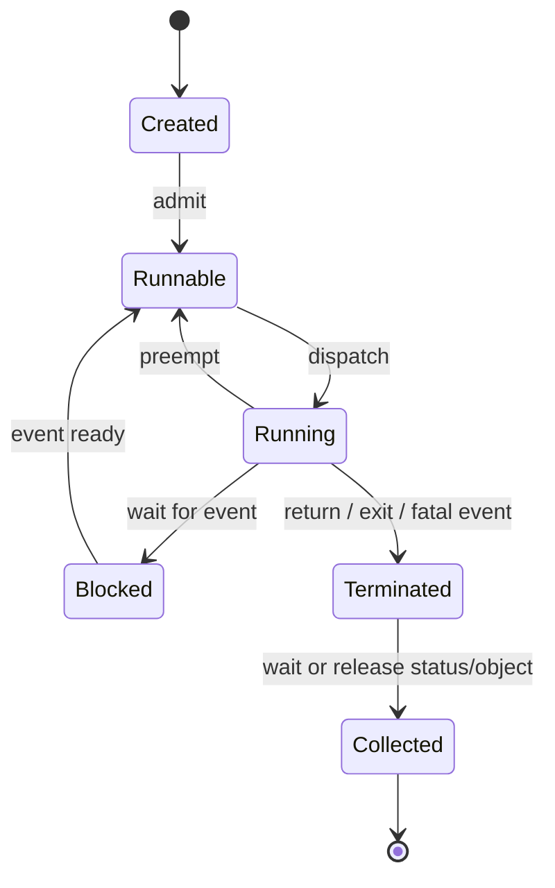

This is a portable teaching model. Production systems have more states and may
schedule threads rather than whole processes. The key distinctions survive:

- **runnable:** eligible but not necessarily executing;
- **running:** currently executing on a processor in the model;
- **blocked:** waiting for an event and not eligible in the declared model;
- **terminated:** execution ended, but status/object references can remain;
- **collected/released:** the supervising relationship or OS object reference
  has been reconciled.

On POSIX, waiting collects child state and prevents an exited child from
remaining an unreaped zombie. On Windows, the process object becomes signaled
at termination and remains represented while handles remain open. The purposes
are related; the native objects are not identical.

PIDs can be reused. A PID saved yesterday is not a permanent capability to
today’s process.

### 3.4 Exit status is protocol data

“The process ended” and “the job succeeded” are different statements.

Atlas declares:

| Status class | Application meaning | Supervisor action |
|---|---|---|
| success | target was published and independently validated | record success |
| rejected input | understood but invalid job | keep bounded diagnostic; do not retry blindly |
| environmental failure | publication not established | inspect environment/artifacts; policy decides |
| interrupted | stop occurred before a confirmed application boundary | classify target/temp evidence |
| unexpected failure | contract not established | quarantine evidence and investigate |

Raw numeric codes belong in the evidence packet. The mapping to application
meaning belongs in a documented status protocol.

**[PYTHON 3.14 CONTRACT]** `Popen.returncode` is initially `None`; `poll()`,
`wait()`, or `communicate()` can update it when termination is detected. On
POSIX, a negative value conventionally reports termination by signal `N`.
Windows does not use that same negative-signal convention.

### 3.5 Code-reading lab — the successful child that failed

Predict at least five defects.

```python
import subprocess


def rebuild(command: str) -> bool:
    child = subprocess.Popen(
        command,
        shell=True,
        stdout=subprocess.PIPE,
        stderr=subprocess.PIPE,
        text=True,
    )
    child.wait(timeout=5)
    return child.returncode == 0
```

Questions:

1. Who parsed `command`?
2. Can pipe buffers fill while the parent waits without draining?
3. What happens after `TimeoutExpired`?
4. Was the child subsequently waited for?
5. What does return code zero mean in the application protocol?
6. Where is the target artifact inspected?
7. Which descendants, if any, does this object own?
8. What environment, cwd, and inherited resources were supplied?
9. What evidence survives if the parent crashes?

The strongest first repair is architectural:

```python
from collections.abc import Sequence
from pathlib import Path
import subprocess


def launch_worker(
    argv: Sequence[str],
    *,
    cwd: Path,
    stdout_path: Path,
    stderr_path: Path,
) -> subprocess.Popen[bytes]:
    stdout = stdout_path.open("wb")
    stderr = stderr_path.open("wb")
    try:
        child = subprocess.Popen(
            list(argv),
            cwd=cwd,
            env={"PYTHONUTF8": "1"},
            stdin=subprocess.DEVNULL,
            stdout=stdout,
            stderr=stderr,
            shell=False,
            close_fds=True,
        )
    except BaseException:
        stdout.close()
        stderr.close()
        raise
    stdout.close()
    stderr.close()
    return child
```

This is still incomplete:

- a production environment allowlist needs application requirements;
- `close_fds` details vary with redirected standard handles and platform;
- a `Popen` object does not prove descendant-tree control;
- exit and artifact classification remain separate;
- the caller must bound wait/escalation and keep the `Popen` object;
- secrets must not enter recorded argv/environment.

The point is to expose review questions, not to present a universal supervisor.

### 3.6 Scheduling follows from scarcity

If runnable work exceeds available execution capacity, a policy chooses which
eligible work receives service.

```mermaid
    %% atlas-diagram-id: m18-one-cpu-schedule
    %% atlas-diagram-title: Declared one-CPU teaching schedule
    %% atlas-diagram-alt: On one declared CPU, worker A runs, blocks, then runs again while worker B becomes runnable, runs during A's wait, and is runnable again; service order changes without changing either job's contract.
%% Figure 6. A declared one-CPU scheduler model can change service order without changing either job's semantic contract.
gantt
    title Declared one-CPU teaching schedule
    dateFormat X
    axisFormat %s
    section Worker A
    running :a1, 0, 2
    blocked :a2, 2, 5
    running :a3, 5, 7
    section Worker B
    runnable :b0, 0, 2
    running :b1, 2, 5
    runnable :b2, 5, 7
```

This is not a host trace. It illustrates states:

- A runs, then blocks for an event;
- B becomes the selected runnable work;
- A’s event becomes ready;
- the policy chooses again.

Scheduling goals can conflict:

| Metric | Question | Tension |
|---|---|---|
| turnaround | arrival to completion | shortest-first intuition can harm fairness |
| response | arrival to first useful service | preemption can add overhead |
| throughput | completions per interval | not the same as one job’s latency |
| fairness/starvation | can eligible work make progress? | strict priority can starve |
| predictability | how variable is service? | an average hides tail behavior |

### 3.7 A complete toy schedule trace

Declare:

```text
one processor
jobs: A arrives 0, needs 4 CPU units
      B arrives 1, needs 2 CPU units
quantum: 2
policy: round-robin among runnable jobs
context-switch cost: 0 in this model
tie rule: earlier queue position
no blocking
```

Trace:

| Interval | Running | A remaining | B remaining | Runnable queue after interval |
|---|---|---:|---:|---|
| `[0,2)` | A | 2 | 2 | B, A |
| `[2,4)` | B | 2 | 0 | A |
| `[4,6)` | A | 0 | 0 | — |

Model results:

- A turnaround: \(6-0=6\);
- B turnaround: \(4-1=3\);
- A first response: \(0-0=0\);
- B first response: \(2-1=1\).

Change only the policy to nonpreemptive FIFO and retrace. The result explains
the declared workload/policy, not Michael’s host scheduler.

### 3.8 Scheduling claim audit

Observation:

> The worker took 1.8 seconds longer while another application was active.

Compatible explanations include:

- different scheduler service;
- more page faults;
- different page-cache state;
- storage contention;
- processor frequency/power changes;
- runtime/environment interference;
- measurement noise.

Defensible rewrite:

> **[EMPIRICAL OBSERVATION]** Under the recorded workload, this worker’s elapsed
> time was longer. **[HYPOTHESIS]** increased runnable load may have reduced its
> processor service. **[UNKNOWN]** the current evidence does not identify the
> scheduler decision or exclude memory and I/O explanations.

---

## 4. Virtual memory: the private-address-space illusion

### 4.1 Why addresses need another contract

M17 instructions calculate addresses. If every process used raw physical
locations directly:

- programs would need to know current physical placement;
- relocation would be difficult;
- one program could overwrite another;
- sharing could not be controlled page by page;
- sparse and lazy population would be difficult;
- physical memory scarcity would leak into every program decision.

Virtual memory introduces indirection and protection.

Plain language:

> A process uses addresses interpreted inside its own address space.

Precision:

> A virtual address is split into a virtual-page number and page offset. An
> address-space translation structure maps the virtual page to a physical frame
> or another state, subject to validity, presence, and access permissions. A
> TLB may cache recent translation information.

### 4.2 The declared Atlas teaching geometry

Use one deliberately small model:

```text
virtual address width: 16 bits
page size: 256 bytes = 2^8
virtual-page number: high 8 bits
page offset: low 8 bits
PTE fields: valid, present, frame, read, write, execute, file_backed
physical address when permitted/present:
    (frame << 8) | offset
```

In mathematical form, the preserved offset is:

$$
\mathrm{physical\ address} =
(\mathrm{frame} \times 2^8) + \mathrm{offset}
$$

For virtual address `0x2A3F`:

```text
VPN    = 0x2A
offset = 0x3F
```

If PTE `0x2A` maps to frame `0x91` with read/write permission and is present:

```text
physical address = 0x913F
```

The same virtual address in another process may map to another frame or be
invalid.

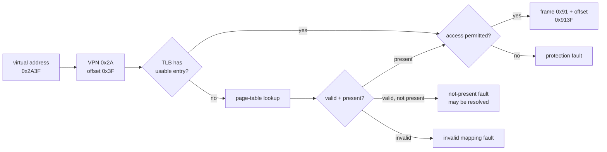

### 4.3 Page table and TLB are not synonyms

The page table is the model’s authoritative mapping structure. The TLB caches
translation information.

- **TLB hit:** cached translation can answer under its current validity.
- **TLB miss:** translation cache did not answer; a page-table walk may find a
  present permitted mapping.
- **page fault:** the access requires OS fault handling or is illegal.

Therefore:

```text
TLB miss ≠ page fault
page fault ≠ necessarily storage I/O
page fault ≠ necessarily fatal
```

### 4.4 Four access traces

Initial TLB: empty.

| Access | PTE | TLB result | Outcome |
|---|---|---|---|
| read `0x2A3F` | valid, present, frame `0x91`, `R/W` | miss | walk, permit, translate `0x913F`, cache translation |
| read `0x2A40` | same page | hit | permit, translate `0x9140` |
| read `0x7B10` | valid, not present, file-backed, `R` | miss | not-present fault; model may populate without claiming how |
| write `0x4420` | valid, present, frame `0x31`, `R` only | miss | protection fault |
| execute `0xFE01` | invalid | miss | invalid mapping fault |

If a not-present page is populated from an already cached source or via
copy-on-write/lazy allocation, no storage read need occur. Platform tools may
call faults “soft/minor” or “hard/major” under their own contracts. Keep those
terms scoped.

### 4.5 Tiny executable translator

Predict each result before execution.

```python
from dataclasses import dataclass
from enum import StrEnum


class Access(StrEnum):
    READ = "read"
    WRITE = "write"
    EXECUTE = "execute"


@dataclass(frozen=True)
class Pte:
    valid: bool
    present: bool
    frame: int | None
    read: bool
    write: bool
    execute: bool
    file_backed: bool = False


class TranslationFault(Exception):
    pass


class NotPresentFault(TranslationFault):
    pass


class ProtectionFault(TranslationFault):
    pass


class InvalidMappingFault(TranslationFault):
    pass


def translate(
    virtual_address: int,
    access: Access,
    page_table: dict[int, Pte],
) -> int:
    if not 0 <= virtual_address <= 0xFFFF:
        raise ValueError("virtual address must fit 16 bits")

    vpn = virtual_address >> 8
    offset = virtual_address & 0xFF
    pte = page_table.get(vpn)

    if pte is None or not pte.valid:
        raise InvalidMappingFault(hex(virtual_address))
    if not pte.present:
        raise NotPresentFault(hex(virtual_address))

    permitted = {
        Access.READ: pte.read,
        Access.WRITE: pte.write,
        Access.EXECUTE: pte.execute,
    }[access]
    if not permitted:
        raise ProtectionFault(f"{access} at {hex(virtual_address)}")
    if pte.frame is None or not 0 <= pte.frame <= 0xFF:
        raise ValueError("present PTE requires an 8-bit frame")

    return (pte.frame << 8) | offset
```

Broken variants to review:

```python
def broken_translate(address: int, page_table: dict[int, Pte]) -> int:
    vpn = address >> 8
    return page_table[vpn].frame << 8  # loses offset; ignores state/permission
```

Find:

- missing width validation;
- missing mapping state;
- missing access type;
- lost offset;
- optional frame used without proof;
- generic lookup error replacing fault vocabulary.

Then change one constraint: page size becomes 1,024 bytes. Which bits form the
offset and which formulas change?

### 4.6 A fault decision tree

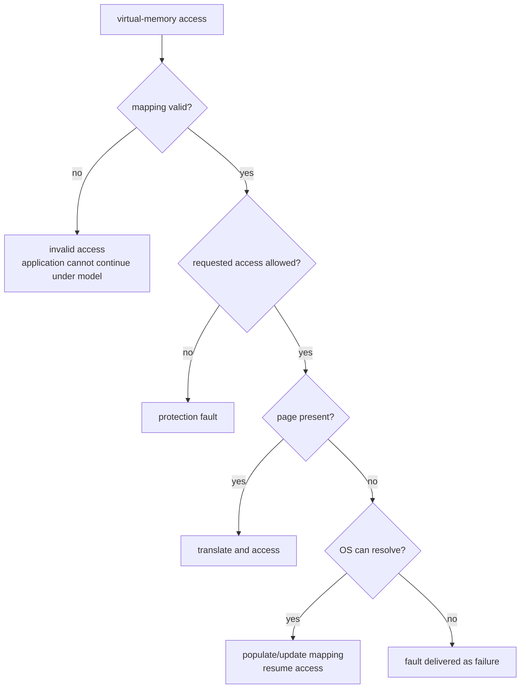

The branch “populate” does not say “read disk.” Possible mechanisms include
zero-filled lazy allocation, copy-on-write, cached file data, or storage I/O.
Name the mechanism only with appropriate evidence.

### 4.7 `mmap` is a boundary, not object-layout proof

Python’s `mmap` exposes file-backed or anonymous mappings with platform-
specific constructors and details. Its access modes support one clean
experiment:

```python
from mmap import ACCESS_COPY, ACCESS_READ, ACCESS_WRITE, mmap
from pathlib import Path


def first_byte(path: Path, access: int) -> tuple[int, int]:
    mode = "r+b" if access != ACCESS_READ else "rb"
    with path.open(mode) as stream:
        with mmap(stream.fileno(), 0, access=access) as mapping:
            before = mapping[0]
            if access != ACCESS_READ:
                mapping[0] = (before + 1) % 256
            return before, mapping[0]
```

Prediction questions:

- What does `ACCESS_READ` permit?
- What process-visible change can `ACCESS_COPY` show?
- Does `ACCESS_COPY` promise to update the underlying file?
- What does `ACCESS_WRITE` mean at the Python API?
- Does a changed mapping prove durable storage?

**Boundary:** the mapping does not prove that a Python object is contiguous,
currently resident, or physically located at `id(obj)`. Object layout,
reference counts, GC, allocators, RSS attribution, and profiling belong to
M24.

### 4.8 Virtual-memory claim audit

Rewrite each:

| Too strong | Repair |
|---|---|
| “The TLB missed, so the disk was read.” | TLB miss required another translation path; storage behavior unobserved |
| “The page fault crashed the process.” | this fault was resolved or delivered as failure under the recorded outcome |
| “`id(x)` is where the object lives in RAM.” | `id` supplies language identity; no physical-address claim |
| “The mapped file is durable.” | mapping visibility and durability require separate contracts |
| “RSS is the sum of Python object sizes.” | OS residency and Python ownership are different models |

---

## 5. Files are names, open resources, caches, and persistence protocols

### 5.1 Ban the unqualified word for one trace

Plain language:

> A path is a way to find a name. An open resource is a live reference. Neither
> is identical to the stored bytes.

Precision:

| Entity | Meaning | Not the same as |
|---|---|---|
| content and metadata | filesystem-managed state | one pathname |
| directory entry/name | binding in a directory namespace | unique object identity |
| path | instructions for resolving names from a base | stable open reference |
| POSIX open file description | kernel-managed open state, access mode, offset | descriptor integer |
| POSIX descriptor | process-scoped small integer referring to open state | content bytes |
| Windows handle | process-scoped reference to an OS object with granted rights | portable POSIX descriptor |
| Python file object | object adding mode, buffering, encoding, decoding, methods, cleanup | proof of physical I/O |

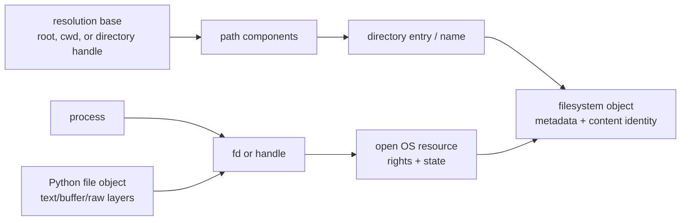

The graph has two routes:

- namespace resolution: base → path → name → filesystem object;
- live ownership: process → descriptor/handle → open resource → object.

That is why a rename can change one route while an already-open reference
continues under the named platform’s rules.

### 5.2 POSIX descriptors and Windows handles

**[POSIX CLAIM]** `open()` resolves a pathname, creates or finds an open file
description, and returns a nonnegative descriptor. `dup()` can create another
descriptor referring to the same open description; shared open state can
include the current offset. Closing one descriptor does not necessarily
destroy the open description while other references remain.

**[WINDOWS CLAIM]** Windows uses handles to kernel objects with rights granted
at open time. File pointers, sharing modes, replacement constraints, and
`CloseHandle` belong to the Windows model. A Windows handle is not “really a
POSIX fd.”

**[PYTHON 3.14 CONTRACT]** Python adapts these platform mechanisms behind file
objects and selected `os` functions. Availability and behavior remain
platform-scoped.

Never reason from the small integer alone:

```text
descriptor 7
```

does not encode:

- filename;
- content;
- path resolution history;
- durability;
- object ownership beyond the current process/table;
- whether another descriptor shares the same open state.

### 5.3 Paths are resolution requests

A relative path has no complete meaning without its base.

```text
Path("results/review.json")
```

Questions:

1. relative to which current directory or supplied directory reference?
2. can a symbolic link or reparse point redirect a component?
3. is case significant on the current filesystem?
4. can another name identify the same object?
5. are source and destination on the same filesystem/volume?
6. which directory rights are required to traverse/create/replace?
7. is an open resource already held?

Python’s `pathlib` provides POSIX and Windows path flavors, but it does not make
all filesystems behave alike. In Python 3.14, `Path.move()` can fall back to
copy-and-delete across filesystems; that is not one atomic rename.

### 5.4 Open, rename, unlink, and close — a declared model

Do not run a host experiment first. Predict inside a declared POSIX-like toy
model:

```text
1. name "current.json" refers to object F_old
2. process A opens it as fd 7 → open description O_old → F_old
3. process B creates complete object F_new under "candidate.tmp"
4. process B renames "candidate.tmp" over "current.json"
5. name "current.json" now refers to F_new
6. A's fd 7 still refers through O_old to F_old
7. A closes fd 7; F_old may now become reclaimable if no other references/links
```

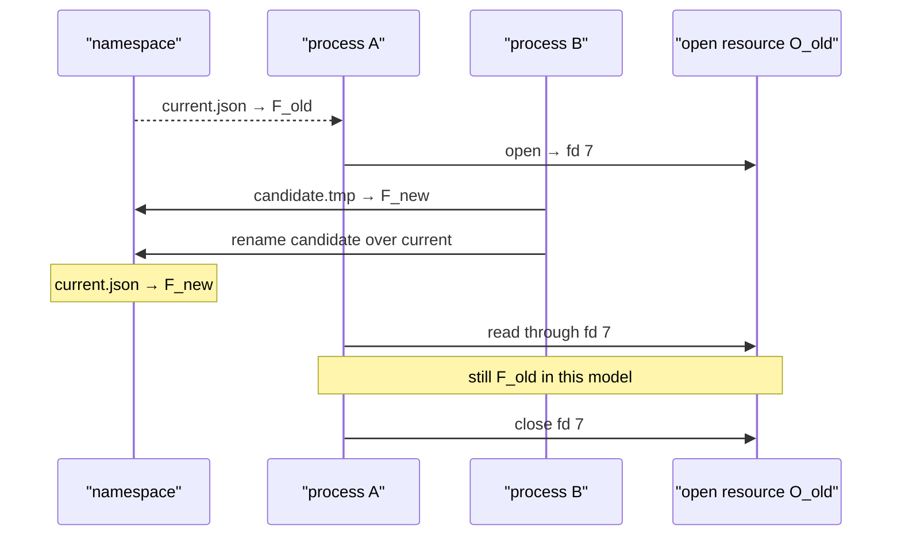

Do not project this exact result onto every Windows sharing/replacement setup.
Windows may reject a replacement depending on open-handle sharing modes and
other conditions. The transferable lesson is:

> pathname transition and existing open-resource lifetime are different
> questions; use the named platform contract and observation.

### 5.5 Python buffer, OS page cache, and device path

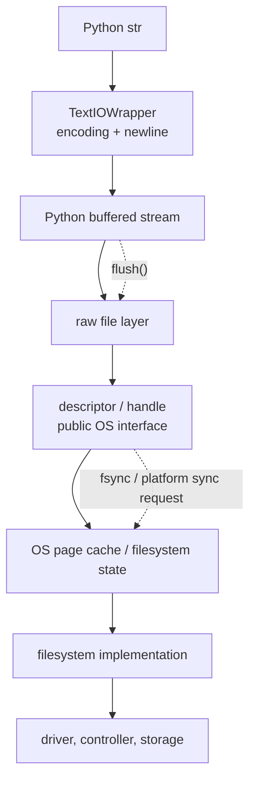

Qualify “cache”:

| Cache/buffer | Owner | Evidence |
|---|---|---|
| Python text/buffered I/O | Python/runtime | stream state, API contract, pinned source |
| OS page/file cache | operating system | platform docs/tools under named scope |
| CPU data cache | processor | hardware model/counters |
| database cache | database engine | engine docs/metrics |
| Atlas application cache | application | application state/tests |

The same bytes can appear at several layers without each layer being updated at
the same instant.

### 5.6 Code-reading lab — offset ownership

Predict the output only under a POSIX-like descriptor model where `dup`
descriptors share one open description and therefore one offset:

```python
import os
from pathlib import Path


def shared_offset_probe(path: Path) -> tuple[bytes, bytes]:
    original = os.open(path, os.O_RDONLY)
    duplicate = os.dup(original)
    try:
        first = os.read(original, 2)
        second = os.read(duplicate, 2)
        return first, second
    finally:
        os.close(duplicate)
        os.close(original)
```

For content `b"ABCDE"`, the declared POSIX result is `(b"AB", b"CD")`, not
`(b"AB", b"AB")`.

Now classify:

- Python API contract being used;
- POSIX open-description model;
- actual local observation if executed;
- what Windows adaptation/source would need separate verification;
- why neither returned byte string reveals physical storage operations.

Do not grade this as a universal Python result across every implementation and
platform without the appropriate contract.

### 5.7 Pipes stay at the lifecycle boundary

A parent/child pipe is an OS-managed byte stream. M18 may use it to explain:

- two endpoints;
- inherited child standard stream;
- finite buffer capacity;
- blocking;
- closure and EOF;
- why `communicate()` avoids common deadlock patterns for bounded data.

Stop before:

- general framing;
- socket addressing;
- partial network transfer;
- retry/idempotency;
- HTTP.

Those are M20. A bounded local status transcript is not yet a network protocol.

---

## 6. Authority: who may perform which transition?

### 6.1 Access is a decision, not a property sticker

Plain language:

> The OS checks whether this process may perform this operation on this
> resource now.

Precision:

```text
requesting process credentials or access token
+ requested operation/right
+ target object and protection metadata
+ path resolution and platform policy
→ allow or deny
```

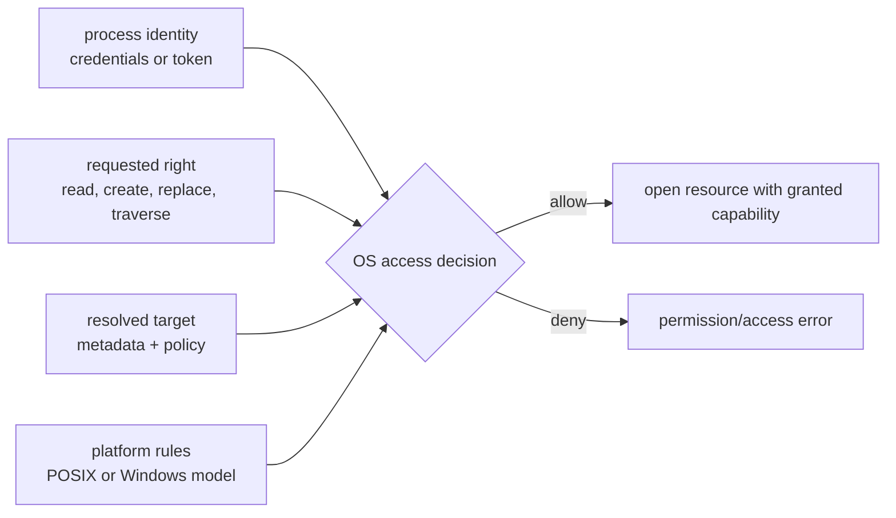

### 6.2 POSIX and Windows models are related, not identical

| Concern | POSIX family | Windows |
|---|---|---|
| requester state | effective user/group credentials and related rules | access token with security identities/privileges |
| object policy | ownership, mode bits, optional ACL extensions | security descriptor and DACL/ACEs |
| creation | requested mode filtered by creation mask and rules | security attributes/default inherited descriptor |
| open result | descriptor with access mode/open state | handle with granted access and sharing conditions |
| Python portability | many `os` calls are Unix-only or limited | `os.chmod` does not implement full POSIX mode semantics |

Do not “translate” a DACL into three Unix mode columns. State the application
capability requirement, then map it to the deployment platform.

### 6.3 Least privilege

For Atlas:

- input directory: read/traverse only as needed;
- output workspace: create/write/replace only there;
- no administrator/root requirement;
- no unrelated inherited descriptors/handles;
- no writable broad parent directory merely for convenience;
- secrets absent from argv, evidence, and logs;
- denial surfaced as an expected classified failure path.

Separate process isolation is not a sandbox. A child inherits or is granted
real authority; reducing that authority is a design requirement.

### 6.4 Do not precheck what you can attempt

Broken:

```python
import os
from pathlib import Path


def create_result(path: Path, payload: bytes) -> None:
    if not os.access(path.parent, os.W_OK):
        raise PermissionError(path.parent)
    path.write_bytes(payload)
```

Between check and use, resolution or access state can change. The check can
also use different identity semantics on some platforms.

Stronger control shape:

```python
from pathlib import Path


def create_new_result(path: Path, payload: bytes) -> None:
    try:
        with path.open("xb") as stream:
            stream.write(payload)
    except PermissionError as error:
        raise PermissionError(f"cannot create result in {path.parent}") from error
```

This demonstrates attempt-and-handle. It is not yet safe publication:

- it does not stage and replace;
- it may leave a partial newly created file after a later failure;
- it does not flush/sync;
- the error message might expose a sensitive path in production;
- link/path containment requires a separate design.

### 6.5 Permission micro-lab

Use only a newly created disposable workspace.

1. predict rights needed to traverse, create, write, sync, replace, inspect,
   and clean;
2. feature-detect whether a meaningful denial can be created without elevated
   authority;
3. attempt the operation and capture the exact exception;
4. restore/delete only lab-owned resources;
5. record the platform model and limitations.

If the current Windows account, filesystem, or inherited rights make a
mode-bit experiment meaningless, record:

```text
[UNKNOWN] The disposable probe did not establish denial behavior under a
distinct access token/DACL. No POSIX mode-bit conclusion is inferred.
```

An unavailable probe is not a pass and not a zero.

---

## 7. Interruption and shutdown

### 7.1 A notification does not perform cleanup

A stop request may arrive between any two application transitions. The request
must become ordinary application control state.

Python signal behavior adds important constraints:

- low-level delivery records a condition;
- the Python handler runs later at a Python execution boundary;
- long-running native code can delay it;
- handlers run in the main Python thread;
- only the main thread installs handlers;
- signal availability differs by platform;
- forced/fatal termination cannot be converted into reliable cleanup.

A signal may also report a synchronous fault. “Signal” is not synonymous with
“asynchronous shutdown message.”

The safe core handler does very little:

```python
from dataclasses import dataclass
import signal


@dataclass
class StopState:
    requested: bool = False
    reason: str | None = None


stop_state = StopState()


def request_stop(signum: int, _frame: object) -> None:
    stop_state.requested = True
    stop_state.reason = f"signal:{signum}"


def install_supported_handler() -> None:
    # Installation must occur in the main thread. Availability is platform-scoped.
    signal.signal(signal.SIGINT, request_stop)
```

The ordinary worker loop checks `stop_state` only at declared safe points.
File publication, arbitrary logging, deletion, locks, or large cleanup do not
belong inside the handler.

### 7.2 Cooperative shutdown

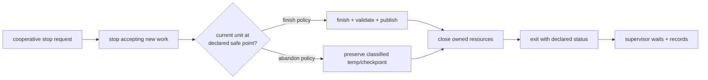

Every arrow can fail. The protocol must say what happens if interruption occurs
one step earlier.

Atlas’s portable core can use an application-defined cooperative channel such
as a lab-owned stop request file checked at safe points. A POSIX signal or
Windows console event can act as an adapter only when its creation/delivery
conditions are recorded.

### 7.3 Wait, then escalate under a capability profile

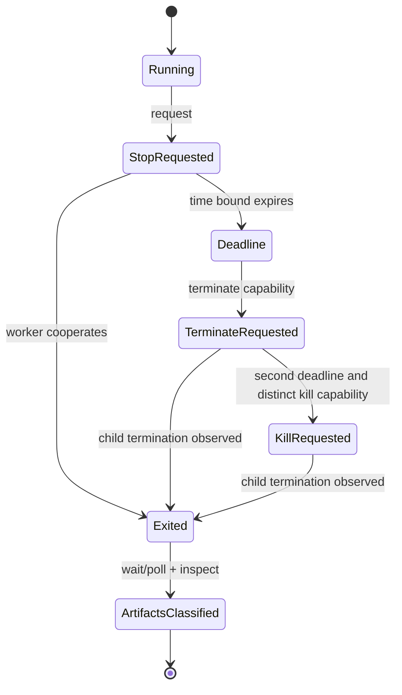

Python method names have different native effects:

| Python operation | POSIX | Windows |
|---|---|---|
| `send_signal(sig)` | sends the named supported signal | limited signals/control-event conditions |
| `terminate()` | sends `SIGTERM` | invokes abrupt `TerminateProcess` behavior |
| `kill()` | sends `SIGKILL` | alias of `terminate()` |
| negative `returncode` | `-N` reports signal `N` | not the same convention |

Therefore:

- do not label Windows `terminate()` graceful;
- do not assume `kill()` is a stronger second rung on Windows;
- do not assume cleanup handlers ran;
- after escalation, wait/observe the child;
- then inspect artifacts independently;
- parent termination does not automatically guarantee descendant termination.

### 7.4 Normal cleanup is not recovery

`with`, `finally`, `ExitStack`, and `atexit` improve handled paths.

They do not prove cleanup after:

- `os._exit()`;
- forcible termination;
- fatal interpreter failure;
- OS crash;
- power loss.

Correct statement:

> Structured cleanup releases live-process resources on handled control-flow
> paths. Crash consistency comes from state layout, ordering, atomic
> visibility, synchronization, and recovery assumptions.

### 7.5 Code-reading lab — the unsafe shutdown patch

```python
import atexit
import os
import signal
import subprocess
from pathlib import Path

TEMP = Path("review.tmp")


def cleanup(*_args: object) -> None:
    TEMP.unlink(missing_ok=True)


atexit.register(cleanup)
signal.signal(signal.SIGTERM, cleanup)


def stop(child: subprocess.Popen[bytes]) -> bool:
    child.terminate()
    cleanup()
    return child.returncode != 0
```

Diagnose:

1. global relative temp path has an unstated base;
2. handler performs filesystem work;
3. `SIGTERM` assumptions are platform-limited;
4. `atexit` does not cover forced/fatal exits;
5. supervisor deletes staging state before knowing child state;
6. `terminate()` effect differs by platform;
7. there is no bounded wait after the request;
8. `returncode` can still be `None`;
9. nonzero exit does not classify target state;
10. cleanup ownership and path containment are absent.

Return separate decisions for:

- notification adapter;
- worker safe-point policy;
- supervisor wait/escalation;
- artifact recovery;
- platform prose.

### 7.6 M18 cancellation versus M21 cancellation

M18:

```text
external request that a local process stop
→ process lifecycle
→ safe application boundary
→ exit + artifact classification
```

M21:

```text
coroutine/task cancellation and timeout composition
→ event loop
→ structured task lifetime
→ backpressure and distributed uncertainty
```

Do not import `asyncio` cancellation into this workbook. The word is shared;
the owned mechanism is not.

---

## 8. Atomic visibility is not durability

### 8.1 Three guarantees

| Guarantee | Question | Typical mechanism family |
|---|---|---|
| atomic visibility | can an observer see an intermediate namespace state? | same-filesystem rename/replace under its contract |
| durability | after a named crash, is accepted state preserved? | flush language buffers, request OS/storage sync, sync namespace metadata where required/supported |
| transactionality | do several related updates commit or roll back together? | recovery protocol/database/filesystem mechanism |

One does not imply the next.

```text
complete bytes
≠ visible committed name
≠ synchronized file state
≠ synchronized directory binding
≠ multi-file transaction
≠ backup
```

### 8.2 The exact phase vocabulary

These names are fixed across prose, code, diagrams, JSON, tests, and TA
sessions:

| Phase | Exact meaning | Does not establish |
|---|---|---|
| `ADMITTED` | supervisor accepted the validated synthetic job | child exists |
| `STARTED` | child entry point reported start | scheduler currently runs it |
| `ENCODED` | deterministic candidate bytes exist in worker memory | file exists or is durable |
| `STAGED` | candidate bytes were supplied to the named staging stream/file | Python/OS buffers synchronized |
| `VALIDATED` | candidate byte sequence and semantic/digest oracle agree | storage or namespace durability |
| `PY_FLUSHED` | Python buffering flush returned | OS/device persistence |
| `FILE_SYNC_RETURNED` | `os.fsync(file_fd)` returned | directory-binding durability on every platform |
| `CLOSED` | staging handle was closed | committed name changed |
| `REPLACED` | `os.replace(temp, target)` returned | universal power-loss durability or no competing writer |
| `DIR_SYNC_RETURNED` | optional named platform directory-sync adapter returned | universal device honesty |
| `EXITED` | worker termination was observed with raw return code | job committed or uncommitted |
| `RECOVERED` | supervisor classified current artifacts under policy | every lost external effect reconstructed |

`VALIDATED` checks the deterministic candidate representation against an
independent semantic/digest oracle. It does not claim that buffered staged bytes
have reached a lower layer. A reference may reopen and recheck after `CLOSED`
before replacement; that is additional evidence inside the same declared
protocol, not a new canonical phase.

### 8.3 The publication sequence

```mermaid
    %% atlas-diagram-id: m18-publication-phases
    %% atlas-diagram-title: Atlas publication phases
    %% atlas-diagram-alt: An admitted job moves through start, encoding, staging, validation, Python flush, file synchronization, close, replacement, optional directory synchronization, exit, and recovery classification, exposing crash cuts between phases.
%% Figure 15. The exact Atlas publication phases expose a crash cut between every application and OS boundary while keeping exit evidence separate from artifact evidence.
flowchart LR
    A["ADMITTED"] --> S["STARTED"]
    S --> E["ENCODED"]
    E --> T["STAGED"]
    T --> V["VALIDATED"]
    V --> F["PY_FLUSHED"]
    F --> Y["FILE_SYNC_RETURNED"]
    Y --> C["CLOSED"]
    C --> R["REPLACED"]
    R --> D["DIR_SYNC_RETURNED<br/>optional capability"]
    R --> X["EXITED"]
    D --> X
    X --> Q["RECOVERED<br/>artifact classification"]
```

The target directory contains:

```text
review.json          stable committed target name
.review.<run_id>.tmp unique uncommitted candidate name
```

Safe one-file policy:

1. create a unique temp in the target directory;
2. encode the entire deterministic candidate;
3. stage it;
4. validate candidate semantics and digest;
5. flush the Python buffer;
6. request file synchronization;
7. close;
8. optionally reopen/validate under policy;
9. replace temp over target;
10. use a platform-supported directory synchronization only when the named
    failure model requires it;
11. classify cleanup separately;
12. inspect target and temp after child exit.

Creating the temp in the target directory avoids silently relying on a
cross-filesystem move. `os.replace` can fail; error is evidence and must stop
false success.

### 8.4 Buffer-to-storage ladder

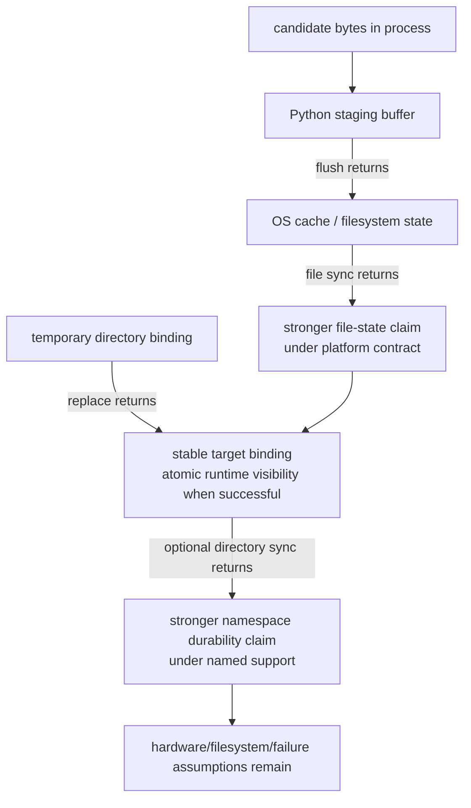

**[PYTHON 3.14 CONTRACT]** for buffered file objects, call `flush()` before
`os.fsync(fileno())`. On Unix, `os.fsync` calls native `fsync`; on Windows it
uses the documented native synchronization path. That shared Python spelling
does not make all lower guarantees identical.

**[POSIX CLAIM]** file synchronization and containing-directory
synchronization answer distinct durability questions.

**[WINDOWS CLAIM]** replacement and flush behavior must be read through
Windows file-sharing, volume, caching, and process contracts. Do not present
POSIX directory `fsync` as a portable Windows recipe.

### 8.5 Crash-cut matrix

Start each scenario with a valid old target. Use disposable synthetic data.

| Stop after | Stable target at runtime | Temp evidence | Strongest conclusion |
|---|---|---|---|
| `ADMITTED` | old | none | child/publication not established |
| `ENCODED` | old | none | candidate exists only in child memory |
| `STAGED` | old | possibly partial/complete temp | temp is not committed target |
| `VALIDATED` | old | semantically valid candidate may exist | validation is not sync/publication |
| `PY_FLUSHED` | old | candidate passed Python buffering | lower durability unknown |
| `FILE_SYNC_RETURNED` | old | synchronized candidate under file contract | complete candidate still not committed name |
| `CLOSED` | old | closed candidate | no target transition yet |
| `REPLACED` | new at successful runtime observation | temp name normally absent | atomic target-name visibility; crash durability still scoped |
| `DIR_SYNC_RETURNED` | new | temp absent | stronger named namespace claim where supported |
| `EXITED` | inspect; old or new depending earlier phase | inspect | return code alone cannot decide |
| `RECOVERED` | validated old or new | recognized leftovers classified | policy result, not universal recovery |

Forced process termination tests a process-failure path. It is not a faithful
simulation of OS crash, power loss, or dishonest storage.

### 8.6 Recovery is a classifier

Recovery order:

1. resolve and prove the disposable workspace boundary;
2. inspect the stable target;
3. validate its schema, semantics, and digest;
4. enumerate only names matching the strict run-owned temp policy;
5. reject symlinks/reparse surprises under the chosen policy;
6. validate each recognized candidate without promoting it merely because it
   is complete;
7. classify target as `VALID_OLD`, `VALID_NEW`, `INVALID`, or `MISSING`;
8. classify temp as recognized/foreign, valid/invalid, owned/unowned;
9. apply an explicit recovery decision;
10. record every action and failure.

Never:

- glob-delete every `*.tmp`;
- delete outside the resolved workspace;
- promote a temp because the child exited zero;
- reject a valid new target because the child exited nonzero;
- call cleanup success “commit.”

### 8.7 Suspicious agent patch

```python
import atexit
import os
import subprocess
from pathlib import Path


def rebuild(worker: str, target: Path) -> bool:
    if not os.access(target.parent, os.W_OK):
        return False

    temp = Path(os.getenv("TEMP", ".")) / "atlas-review.tmp"

    def cleanup() -> None:
        temp.unlink(missing_ok=True)

    atexit.register(cleanup)
    child = subprocess.Popen(f'python "{worker}" "{temp}"', shell=True)
    try:
        child.wait(timeout=2)
    except subprocess.TimeoutExpired:
        child.kill()  # SIGKILL everywhere; children and buffers are now clean.

    temp.replace(target)  # Move is atomic and durable across every drive.
    cleanup()
    return child.returncode == 0
```

Audit by concern:

| Concern | Defect |
|---|---|
| command | shell parsing and interpreter identity are implicit |
| identity | no `run_id`; PID/Popen evidence not retained |
| permission | stale `os.access` precheck |
| placement | temp may be on another filesystem/volume |
| collision | one global temp name |
| semantic proof | no independent result oracle |
| buffering/sync | absent |
| lifecycle | timeout path does not wait after kill |
| platform | `kill()` claim is false on Windows |
| descendants | child tree cleanup assumed |
| publication | move/replace called even after failed child |
| durability | atomicity, cross-volume behavior, and durability collapsed |
| cleanup | `atexit` and unconditional deletion treated as recovery |
| evidence | return code substituted for target validation |

Review order:

```text
semantic job contract
→ target/temp ownership
→ launch and process lifecycle
→ phase transitions
→ platform capability
→ error/cleanup paths
→ artifact classification
→ tests
→ prose claims
```

Return separate decisions:

- useful intent;
- application behavior;
- lifecycle;
- filesystem protocol;
- platform portability;
- evidence prose.

---

## 9. Runnable Atlas operating-systems reference

### 9.1 Contract before implementation

The runnable reference exists to make disputed transitions observable. It does
not simulate a whole OS and does not prove power-loss behavior.

It must preserve:

- deterministic synthetic input;
- one semantic `build_review_packet` function and independent result oracle;
- exactly one supervisor and one worker;
- argv launch with `shell=False`;
- a unique `run_id` distinct from PID;
- a newly created disposable workspace;
- the exact canonical phase vocabulary;
- same-directory staged publication;
- separate exit and artifact classifications;
- platform capability records;
- deterministic child-only abrupt-exit injection;
- JSON evidence without private host/user identity;
- M19/M20/M21/M24 boundaries.

What it can establish:

| Evidence | Strongest statement |
|---|---|
| deterministic pure function tests | tested semantic job/result contract |
| toy scheduler/page translator | result of the declared model |
| child-process phase records | what the reference reported before termination |
| raw `Popen` return code | termination observation under the executing platform |
| target/temp bytes and digest | observed artifact state in this disposable run |
| capability/profile record | which adapter paths were selected or unavailable |
| focused failure tests | behavior for the exact injected scenarios |

What it cannot establish:

- the actual host scheduler decision history;
- complete page-table/TLB/page-cache history;
- physical storage transfer or durable power-loss outcome;
- descendant-tree cleanup beyond explicitly owned objects;
- multi-worker correctness;
- network or distributed behavior;
- CPython object layout or memory attribution.

### 9.2 Validated learner package

The separately reviewed reference and its adversarial suite are now part of
the learner package:

[Download the runnable reference](/downloads/module18_reference.py) and keep
[the companion adversarial tests](/downloads/test_module18_reference.py) in
the same directory. The program is a single standard-library file so that the
supervisor, worker, publication protocol, recovery classifier, VM model, CLI,
and evidence schema can be read without framework noise.

Two executable consistency checks matter especially:

- worker phase logs are accepted only along an explicit legal-edge graph, so
  increasing-but-impossible histories such as `STARTED → VALIDATED` are
  rejected;
- the VM model keeps an invalid mapping distinct from a valid but not-present
  mapping and records whether the latter is file-backed.

Validated artifacts:

| Artifact | SHA-256 |
|---|---|
| `module18_reference.py` | `7fc35ba847b87190470601fdda3be0f5bfa08be464cfa2cd2eab37c5ef1234b7` |
| `test_module18_reference.py` | `5136dfff7706dfa7bd97e694d4d4287aa54fff75c8693274b45368486a2a9214` |

Local verification used **CPython 3.12.13** on
`Windows-10-10.0.19045-SP0`. It did not use or claim local Python 3.14.6
execution.

```text
python -m unittest -v test_module18_reference.py

Ran 19 tests in 1.510s
OK (skipped=1)
```

The one skip is evidence: this Windows host did not permit creation of an
unprivileged symbolic link, so that capability-specific branch remains
unobserved here. `py_compile` passed for both files. Running
`python module18_reference.py --self-test` reran the same 19-test suite and
also preserved the skip. If the companion test file is absent, `--self-test`
returns nonzero instead of reporting a false zero-test success.

Two bounded scenario transcripts:

```text
> python module18_reference.py --scenario normal --run-id atlas-run-1
ATLAS · MODULE 18 · OS EVIDENCE
schema: atlas.module18.os-evidence.v1
scenario: normal
exit: clean-exit-observed (raw 0)
artifacts: published-valid-new

Boundary: exit evidence and artifact evidence are independent. Use --json for the complete bounded packet.

> python module18_reference.py --scenario hard-after-file-sync --run-id atlas-run-2
ATLAS · MODULE 18 · OS EVIDENCE
schema: atlas.module18.os-evidence.v1
scenario: hard-after-file-sync
exit: child-only-hard-exit-observed (raw 86)
artifacts: published-valid-old-with-uncommitted-valid-stage

Boundary: exit evidence and artifact evidence are independent. Use --json for the complete bounded packet.
```

Read this core in the full download:

```python
candidate_preview = _canonical_json_bytes(build_review_result())
if candidate_preview != expected_result_bytes():
    raise RuntimeError(
        "pure transformation disagrees with the independent literal oracle"
    )

initial_target = _ensure_known_old_target(root, run_id=run_id)
child = subprocess.Popen(
    actual_argv,
    executable=sys.executable,
    cwd=root,
    env=environment,
    stdin=subprocess.DEVNULL,
    stdout=subprocess.PIPE,
    stderr=subprocess.PIPE,
    shell=False,
    close_fds=True,
)

# Later, after the owned child is waited for:
artifacts, recovery = recover_workspace(root, run_id=run_id)
```

The important architecture is the separation around this excerpt:

- `build_review_result()` has no subprocess/filesystem dependency;
- the expected result is a literal independent oracle;
- `run_id` and PID remain different fields;
- a known valid old target exists before every supervised scenario;
- only the held `Popen` child can be terminated by the supervisor;
- the phase log rejects forged owners, illegal order, and impossible
  publication transitions;
- target and stage bytes are classified independently of raw exit status;
- recovery never promotes or deletes a candidate;
- file synchronization and replacement never become universal power-loss
  claims.

### 9.3 Required reference architecture

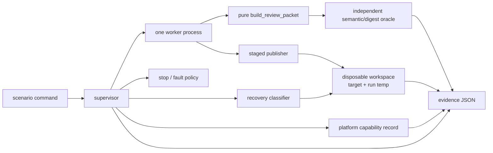

Dependency rule:

```text
domain model and semantic transformation
    ← publication protocol
    ← worker entry point
    ← supervisor/scenario harness
```

The pure transformation must not import `subprocess`, `signal`, or filesystem
adapters.

### 9.4 Read the reference in dependency order

When the candidate is available, read:

1. immutable input/result types and validation;
2. pure `build_review_packet`;
3. independent oracle and deterministic encoding;
4. canonical phase enum/transition admission;
5. workspace/path-containment and artifact inspection;
6. staged publication;
7. worker entry point and child-only injection;
8. supervisor launch/wait/escalation;
9. recovery classification;
10. capability/platform profile;
11. evidence serializer;
12. tests;
13. CLI.

For every step, fill:

```text
Purpose:
Input contract:
State owned:
External effects:
Legal next phases:
Failure behavior:
Evidence emitted:
What it cannot establish:
```

### 9.5 Semantic witness

The reference should use a tiny deterministic review-packet fixture. The exact
candidate implementation controls the final bytes; the workbook requires only
this semantic shape:

```python
from dataclasses import dataclass


@dataclass(frozen=True, order=True)
class ReviewRecord:
    concept_id: str
    confidence_milli: int


def due_concepts(records: tuple[ReviewRecord, ...]) -> tuple[str, ...]:
    if any(not 0 <= record.confidence_milli <= 1000 for record in records):
        raise ValueError("confidence_milli must be in [0, 1000]")
    return tuple(
        sorted(
            record.concept_id
            for record in records
            if record.confidence_milli < 700
        )
    )
```

Why integer milli-confidence in the witness?

- deterministic threshold comparison;
- no NaN/nonfinite JSON ambiguity;
- easy independent oracle;
- not a claim that all Atlas confidence must use this representation.

The worker must not change semantic output because a stop adapter or platform
branch changed.

### 9.6 Reference adversarial matrix

The final reference tests must include:

| Area | Required negative case |
|---|---|
| input | invalid confidence and duplicate/invalid concept identity policy |
| encoding | deterministic bytes and digest independent of process |
| phases | illegal skip/reorder rejected |
| workspace | target/temp escape rejected |
| launch | no shell interpolation; run ID independent of PID |
| staging | sync/replace error remains visible |
| interruption | child-only hard exit at named phases |
| lifecycle | supervisor waits/observes after escalation |
| recovery | foreign/malformed temp not promoted or broadly deleted |
| evidence | raw phase, exit, artifact state retained; JSON has no NaN/private paths |
| platform | unsupported capability recorded, not silently treated as success |
| boundaries | no locks, threads, sockets, async tasks, GC/profilers |

The test suite’s passing count is evidence only after confirming these cases
actually execute. A green summary alone is not the mastery artifact.

---

## 10. Six connected teaching sessions

The sessions are not six chapters. Each adds one missing state owner to the
same shutdown incident.

## Session 1 — Why a mediator exists

**Before**

- redraw the M17 execution-stack handoff;
- read the OSTEP process/controlled-execution selections;
- read the Python `subprocess` overview;
- skim POSIX `fork`/`exec`/`wait` summaries only.

**Recall**

1. why one Python call is not one ISA instruction;
2. why `read(1)` is not one physical transfer;
3. contract versus model versus observation.

**Pressure**

Several programs need the same processor, memory, files, and device interfaces.
None can safely receive unrestricted privilege.

**Instructor route**

1. derive virtualize/multiplex/protect/preserve;
2. draw user/kernel control transfer;
3. classify mechanism, policy, contract, evidence;
4. read the bounded xv6 call path;
5. trace `save_note`;
6. rewrite the one-write/one-disk-operation claim.

**Learner actions**

- annotate Figure 3 with owner and privilege;
- predict which layers might perform zero/multiple operations;
- mark one unknown at each boundary;
- produce a seven-row `write()` ownership table;
- explain where the analogy of a hotel room stops.

**Atlas decision**

The OS remains an outer architecture boundary. Do not create a magical
`OperatingSystem` class in the domain core.

**Exit evidence**

In two minutes:

> Why does a protected system-call interface make both resource sharing and
> isolation possible, and why does it not reveal physical work?

### Session 1 output — ownership and privilege-boundary trace

Produce a seven-row `write()` ownership table that labels the caller, the
resource owner, the strongest supported claim, and one still-unknown lower
layer for each transition.

## Session 2 — Program, process, lifecycle, and scheduling

**Before**

- read the Python `Popen`, wait, communicate, timeout, and return-code sections;
- read one POSIX process lifecycle summary and one Windows process-object
  summary;
- trace the declared round-robin example.

**Recall**

- user versus kernel authority;
- process-local versus OS-mediated state;
- Atlas run identity versus input identity.

**Pressure**

Atlas needs to run a job separately, observe it, stop it, and release resources.
Executable code alone has no live lifecycle.

**Instructor route**

1. separate program, image, process, job;
2. contrast POSIX fork/exec with Windows creation;
3. derive lifecycle states;
4. distinguish termination from collection/release;
5. show PID reuse;
6. derive scheduling from runnable scarcity;
7. compare response/turnaround/throughput/fairness;
8. audit the broken `rebuild`.

**Learner actions**

- recover Figure 4 from unfamiliar code;
- trace one process through every Figure 5 state;
- retrace FIFO versus round-robin under fixed workload;
- identify at least five `Popen` defects;
- write a return-code/application-status table;
- name why parent death does not prove tree cleanup.

**Atlas decision**

Use application `run_id`; retain `Popen`; record raw PID only with launch/start
context; inspect exit and artifacts separately.

**TA Studio A**

Process coroner: reconstruct a mixed launch/block/exit/wait trace and repair a
zero-exit/failed-publication incident.

**Exit evidence**

One state table distinguishing program, process, run, PID, lifecycle, exit
status, and target state.

### Session 2 output — lifecycle and scheduling state table

Keep one labelled lifecycle trace plus one declared-policy schedule, with run
identity separate from PID, exit status, and target-artifact state.

## Session 3 — Virtual memory and fault classification

**Before**

- read OSTEP address-space/translation/paging/TLB selections;
- inspect the MIT xv6 page-table exercise questions without solutions;
- choose Linux page-table or Windows virtual-memory documentation to match the
  environment.

**Recall**

- M17 virtual address versus physical address handoff;
- cache must have an owner;
- scheduler model versus observation.

**Pressure**

Processes need isolated address spaces independent of current physical
placement and residency.

**Instructor route**

1. derive page number/offset;
2. declare 16-bit/256-byte geometry;
3. trace TLB then PTE;
4. separate validity, presence, and permission;
5. classify four faults;
6. run/review `translate`;
7. inspect an `mmap` access-mode probe;
8. stop at the M24 boundary.

**Learner actions**

- predict all translations in Section 4.4;
- repair `broken_translate`;
- design one TLB miss with no fault;
- design one fault with no storage I/O;
- explain same virtual address/different process mapping;
- reject `id()` as physical-address evidence.

**Atlas decision**

The dossier includes a toy translation trace and explicit unknowns, not a host
memory profiler.

**Exit evidence**

Without notes, answer:

```text
TLB miss:
not-present fault:
protection fault:
invalid mapping:
storage I/O proved?:
```

### Session 3 output — translation and fault-classification trace

Submit a VPN/offset/PTE/TLB trace that separates a TLB miss, resolvable fault,
protection fault, invalid mapping, and the storage I/O evidence that is absent.

## Session 4 — Names, open resources, caches, and authority

**Before**

- read POSIX `open`/`dup`/`close`/`rename` summaries;
- read Python `pathlib` flavor/move notes;
- read the Windows file-handle/replacement overview;
- redraw the Module 15 publication timeline.

**Recall**

- object identity versus name binding from M1/M6;
- file object versus encoded bytes from M15;
- page versus cache line from M17.

**Pressure**

The worker says it wrote “the file,” but a path, name, open resource, Python
buffer, page cache, metadata, and stored bytes can disagree.

**Instructor route**

1. ban unqualified “file”;
2. trace Figure 9’s two routes;
3. compare POSIX fd/open description with Windows handle;
4. trace open→rename→read→close;
5. expand buffer/page-cache/device boundaries;
6. derive operation-time access decisions;
7. compare POSIX and Windows permission vocabulary;
8. replace `os.access` precheck with attempt-and-handle.

**Learner actions**

- predict the shared-offset probe;
- label Figure 10 as a declared POSIX-like model;
- rewrite it for a Windows capability investigation;
- resolve a relative path from two bases;
- build a rights table for create/write/replace/cleanup;
- run or correctly skip a disposable denial probe.

**Atlas decision**

All staging/cleanup paths are workspace-confined. Capability requirements are
portable; deployment metadata is platform-specific.

**TA Studio B, part 1**

Path and capability lab: track a name transition while an open resource
survives; classify a permission denial without privilege escalation.

**Exit evidence**

Explain why the pathname can change while an open resource retains distinct
state, and why this is not a universal Windows/POSIX outcome.

### Session 4 output — name, open-resource, and authority card

Create one declared-model card showing path, name binding, descriptor/handle,
open resource, buffer/cache boundary, required right, and platform unknown.

## Session 5 — Shutdown as a fallible protocol

**Before**

- read Python `signal`, `atexit`, and `Popen` termination sections;
- read either POSIX signal/process-group or Windows console/process-termination
  documentation;
- write a least-authority capability table.

**Recall**

- lifecycle states;
- normal exception/finally paths;
- path/open-resource distinction.

**Pressure**

A stop request can arrive at any boundary. Notification does not guarantee
cleanup, publication, or descendant termination.

**Instructor route**

1. distinguish synchronous fault and asynchronous notification;
2. explain deferred Python handlers and main-thread constraint;
3. convert notification to ordinary control state;
4. derive cooperative safe points;
5. add bounded wait;
6. compare POSIX and Windows terminate/kill effects;
7. add capability-scoped escalation;
8. separate exit from artifact recovery;
9. review the unsafe shutdown patch.

**Learner actions**

- mark every fallible arrow in Figure 13;
- choose safe points around the publication protocol;
- trace cooperative, terminate, and hard-exit outcomes;
- state what `finally`/`atexit` cannot promise;
- identify descendant-tree uncertainty;
- return separate patch decisions.

**Atlas decision**

Portable core uses an application stop request. Platform notification is an
adapter. Forced termination is last-resort lifecycle control, never called
graceful.

**Exit evidence**

Explain one scenario in which the child exits nonzero but the target is valid
new output.

### Session 5 output — shutdown and recovery boundary

Write one interruption timeline with cooperative, forced, and unknown cleanup
paths, plus the artifact observation required before any recovery decision.

## Session 6 — Publication, recovery, and evidence defense

**Before**

- read Python `tempfile`, `os.fsync`, and `os.replace`;
- read POSIX cache/rename/sync rationale or Windows flush/replacement
  documentation for the selected platform;
- read the OSTEP or xv6 crash-consistency selection;
- predict the full Section 8.5 crash matrix.

**Recall**

- exact central invariant;
- all twelve phase names;
- exit versus artifact state;
- observation versus durability guarantee.

**Pressure**

Individually plausible APIs do not compose into a reliable worker without a
cross-layer protocol and recovery classifier.

**Instructor route**

1. separate atomic visibility, durability, transactionality;
2. derive the exact phase sequence;
3. trace each crash cut;
4. explain same-directory staging;
5. distinguish Python flush/file sync/replace/directory sync;
6. inspect the runnable reference;
7. run normal/cooperative/abrupt scenarios;
8. audit raw evidence;
9. review the suspicious patch;
10. defend bounded claims and future boundaries.

**Learner actions**

- compare prediction with every observed artifact state;
- explain any safe capability-based skip;
- verify target/temp digests;
- inspect actual diff and tests;
- name at least four unknown lower-layer facts;
- route overlap/network/async/runtime questions;
- give the five-sentence labeled defense.

**TA Studio B, part 2**

Translation and crash cuts: solve four translations and three publication
interruptions.

**TA Studio C**

Shutdown incident and agent review: select capability profile, inspect actual
packet, run focused tests, and defend accept/reject/split decisions.

**Exit evidence**

```text
[APPLICATION INVARIANT] ...
[OS MODEL] ...
[PLATFORM CONTRACT] ...
[EMPIRICAL OBSERVATION] ...
[UNKNOWN + NEXT EVIDENCE] ...
```

### Session 6 output — bounded operating-evidence dossier and M19 handoff

Assemble the six labelled claim sentences, raw artifact observations, one
falsification step, and one M19 question about what changes when a second
worker may interleave with this lifecycle.

---

## 11. Eight-level problem ladder

### Level 1 — Recognize the owner

Classify each card:

```text
source file
process image
Atlas run_id
PID
runnable state
virtual address
PTE permission
path
directory name
open description/handle
Python buffer
OS page cache
target digest
return code
stop request
```

For every miss, name the two owners you collapsed.

### Level 2 — Trace one resource transition

Given one normal Atlas run:

1. trace launch and lifecycle;
2. trace one virtual address under the toy page table;
3. trace one target write through Python/OS layers;
4. trace worker exit and supervisor collection;
5. label application decision, OS model, platform contract, observation, and
   unknown.

Change only one scheduler choice and explain why semantic output must remain
the same.

### Level 3 — Recover the architecture

Given unfamiliar supervisor, worker, publisher, recovery, and model files:

- locate entry points;
- map dependencies;
- identify process-local and OS-mediated state;
- recover the semantic oracle;
- reconstruct the phase transition graph;
- map names/open resources/artifacts;
- identify where exit and artifact evidence meet but do not collapse.

Deliver Figure 17 from code, not from memory.

### Level 4 — Modify under one constraint

Add stable `run_id` and explicit workspace records to a correct worker:

- do not alter result bytes;
- keep argv sequence and `shell=False`;
- keep one worker;
- keep logs bounded;
- do not expose full home paths or secrets;
- preserve exact phases;
- update focused tests.

Explain why PID remains observation rather than identity.

### Level 5 — Debug and defend

Diagnose a shutdown incident using:

- launch record;
- phase observations;
- raw return code;
- target/temp existence, digest, and validation;
- injected sync/replace error;
- recovery decision.

Find:

- one lifecycle defect;
- one path/authority defect;
- one publication defect;
- one portability defect;
- one unsupported claim.

Propose the smallest repair and one regression scenario per defect class.

### Level 6 — Design and delegate

Write an agent task for exactly one bounded milestone:

- deterministic phase recording; or
- platform capability record; or
- one shutdown/recovery scenario; or
- JSON evidence serializer.

Include:

```text
context and invariant
allowed files
exact behavior
canonical phases
prohibited scope
negative cases
commands
evidence report
reversal
```

Forbid production data, networking, threads, locks/queues/GIL work, async
tasks, dependency additions, `shell=True`, elevated authority, external PID
signals, broad deletion, symlink-following cleanup, CPython profiling, and
universal durability prose.

### Level 7 — Review and verify

Read the generated patch in dependency order. Challenge:

- semantic drift;
- illegal phase edges;
- PID identity;
- unbounded pipe;
- direct target write;
- missing wait after escalation;
- platform method-name assumptions;
- cleanup outside workspace;
- target classification from return code;
- swallowed sync/replace error;
- tests that inject a Python exception but never terminate a child;
- unsupported durability claims.

Return `accept`, `reject`, or `split` separately for:

1. behavior;
2. tests;
3. portability;
4. evidence schema;
5. prose.

### Level 8 — Transfer across later boundaries

Produce four handoffs.

**To M19:** admit a second worker. Which interleavings and shared-name updates
now require race/lock/queue reasoning?

**To M20:** replace the local control channel with a remote endpoint. Which
questions about addressing, framing, partial transfer, connection loss, and
protocol meaning appear?

**To M21:** make work asynchronous and remote. Which task-cancellation,
timeout, backpressure, retry, and uncertain-completion questions appear?

**To M24:** ask why the process uses memory. Which frames, objects,
refcounts/GC, allocation, RSS attribution, and profiling questions appear?

Deliver:

```text
M18 can still answer:
M18 evidence no longer proves:
Next owner:
New invariant:
```

---

## 12. Confidence-aware understanding check

For each item:

1. choose A–D;
2. record confidence 1–4;
3. commit before opening the explanation;
4. state the exact invariant/contract that decides it;
5. after feedback, solve the transfer prompt.

The distractors are not jokes. Each represents a plausible collapsed model.
Correctness and confidence are recorded separately.

### Question 1 — API return versus OS and device work

Atlas calls `buffered.write(payload)`, and the method returns the length of the
payload. Which conclusion is strongest?

A. Exactly one kernel write request and one physical-device write occurred.<br>
B. The Python-level operation satisfied its documented return contract for
this call; lower request count and physical transfer remain unestablished
without appropriate traces.<br>
C. No kernel work can have occurred because the stream is buffered.<br>
D. The returned length proves the bytes survive power loss.

<details>
<summary>Answer, distractor diagnosis, and routing</summary>

**Answer: B.**

The observed return supports the Python-level contract. Buffering, raw I/O,
OS cache/filesystem behavior, and physical-device work are different layers.

- **A — `one-call-one-transition`:** a high-level call is not a syscall or
  physical-transfer counter.
- **C — `buffer-means-no-OS`:** buffering can delay or combine lower work, but
  this observation cannot prove none occurred.
- **D — `completion-means-durability`:** accepting bytes at one API is weaker
  than a named crash contract.

**Confident miss:** return to M17’s I/O handoff and Section 2.4. Build one case
where a call remains in a Python buffer and one where a flush causes lower
work.

**Low-confidence correct:** explain why both “exactly one” and “exactly zero”
are unsupported.

**Transfer:** replace the file with a memory-backed stream. Which contract
remains and which lower layers disappear?

</details>

### Question 2 — Program, process, PID, and run identity

A worker PID recorded yesterday appears again today. Which design is strongest?

A. PID equality proves the same process and same Atlas job resumed.<br>
B. The executable path identifies the job uniquely, so PID is unnecessary.<br>
C. Use an application `run_id` plus launch/process-start evidence; treat PID as
an OS-scoped observation that may be reused.<br>
D. Hash the PID to make it globally unique.

<details>
<summary>Answer, distractor diagnosis, and routing</summary>

**Answer: C.**

The Atlas job has application identity. PID belongs to an OS process lifetime
and can be reused.

- **A — `PID-is-permanent-identity`:** integer reuse breaks the inference.
- **B — `program-is-job`:** one executable can run many jobs and processes.
- **D — `transformation-creates-uniqueness`:** hashing a nonunique value does
  not create uniqueness.

**Confident miss:** Section 3.1–3.4 plus an M8 identity/equivalence retrieval.
Draw one program launched twice with two run IDs and two process lifetimes.

**Low-confidence correct:** explain why retaining the `Popen` object is useful
but still does not replace `run_id`.

**Transfer:** the supervisor restarts and finds only a PID text file. What can
it safely conclude?

</details>

### Question 3 — Scheduling state and elapsed behavior

The worker takes longer while another application is active. What follows?

A. The Atlas algorithm’s asymptotic complexity changed.<br>
B. The OS definitely used a particular named scheduling algorithm.<br>
C. Extra runnable work and scheduling are compatible explanations, but elapsed
time alone does not identify policy or exclude faults, caching, frequency, or
I/O effects.<br>
D. A blocked worker must be consuming its full CPU share.

<details>
<summary>Answer, distractor diagnosis, and routing</summary>

**Answer: C.**

Elapsed time mixes execution service, waiting, preemption, faults, I/O, and
interference.

- **A — `elapsed-changes-complexity`:** complexity describes growth under a
  model, not one changed observation.
- **B — `timing-identifies-policy`:** one duration cannot recover scheduler
  policy.
- **D — `blocked-equals-running`:** in the teaching model, blocked work is
  waiting and not runnable.

**Confident miss:** M5 cost model, M17 evidence ladder, and Section 3.6.

**Low-confidence correct:** name three alternative causes and a discriminating
observation for one.

**Transfer:** in the toy schedule, change the quantum only. Which model metrics
change, and why does that still not predict the host?

</details>

### Question 4 — TLB miss, page fault, and invalid access

A valid mapped page is marked not present when the worker reads it. Which
statement is most accurate?

A. The virtual address directly names a missing DRAM byte, so the process must
crash.<br>
B. A page fault occurs; under the declared mapping the OS may populate the page
and resume, while an unmapped or forbidden access can instead fail.<br>
C. The Python object at that address was garbage-collected.<br>
D. The CPU cache line and virtual-memory page are the same unit.

<details>
<summary>Answer, distractor diagnosis, and routing</summary>

**Answer: B.**

The mapping is valid and permitted but not present. Fault handling may resolve
it. No storage operation is implied without more evidence.

- **A — `fault-always-fatal`:** expected lazy/file-backed/COW-style faults can
  be resolved.
- **C — `VM-page-is-Python-object`:** language/runtime object ownership is
  M24, not page-table state.
- **D — `page-is-cache-line`:** translation page, TLB, CPU cache line, and OS
  page cache are different.

**Confident miss:** Section 4.2–4.6 and M17 cache-owner retrieval.

**Low-confidence correct:** trace TLB miss with present PTE, not-present fault,
write-protection fault, and invalid mapping.

**Transfer:** the page is already present but the TLB is empty. Which event
occurs and which does not necessarily occur?

</details>

### Question 5 — Pathname versus open resource

In a declared POSIX-like model, process A opens `current.json`. Process B
successfully replaces that pathname with a new file while A still holds its
open resource. Which model is strongest?

A. A’s open resource must instantly become the new file because the path text
is equal.<br>
B. The replacement necessarily fails while any reader is open on every OS.<br>
C. The pathname transition and A’s existing open reference are distinct; exact
behavior outside the declared model is platform/filesystem-specific.<br>
D. The directory name stores the file’s content bytes directly.

<details>
<summary>Answer, distractor diagnosis, and routing</summary>

**Answer: C.**

Names and live open references are separate routes. The POSIX-like trace cannot
be projected unchanged onto all Windows sharing configurations.

- **A — `path-is-open-file`:** name lookup and open-resource identity collapse.
- **B — `one-platform-is-universal`:** replacement constraints differ by
  platform and open mode.
- **D — `namespace-is-content`:** a directory binding is not the content
  representation.

**Confident miss:** Section 5.1–5.4; hand-trace Figure 10.

**Low-confidence correct:** describe what evidence a Windows experiment would
need without claiming it is the portable contract.

**Transfer:** process A closes before B replaces. Which uncertainty disappears,
and which durability uncertainty remains?

</details>

### Question 6 — Flush, sync, replace, and durability

The worker writes a same-directory temp, `flush()` and `os.fsync()` return, it
closes the staging file, and `os.replace()` succeeds. Which report is
strongest?

A. “The result is a transactional, backed-up, universally power-loss-safe
commit.”<br>
B. “The target pathname transitioned through the recorded successful protocol;
file and directory crash guarantees still depend on the named platform,
filesystem, storage, and any required/supported directory synchronization.”<br>
C. “`flush()` alone proves the device stored the bytes.”<br>
D. “Successful replace proves there was no simultaneous writer.”

<details>
<summary>Answer, distractor diagnosis, and routing</summary>

**Answer: B.**

It states runtime publication evidence and preserves lower-layer/failure-model
limits.

- **A — `visibility-is-universal-transaction`:** one name transition is not
  multi-update transaction, backup, or universal power-loss safety.
- **C — `Python-buffer-is-storage`:** flush crosses one buffering layer.
- **D — `atomic-name-prevents-race`:** simultaneous-writer reasoning belongs
  to M19 and is not proved by one replace.

**Confident miss:** M15 publication bridge and Section 8.1–8.5.

**Low-confidence correct:** write five separate sentences for Python flush,
file sync, replace visibility, directory durability, and backup.

**Transfer:** the temp is on another volume. Which step may fail or degrade to
copy/delete, and which claim must be removed?

</details>

### Question 7 — Permissions and authority

Atlas must read one input and create one output inside a disposable workspace.
Which design best expresses least privilege?

A. Run as administrator so every operation succeeds.<br>
B. Request only the rights required by the declared operations, handle denial
as an expected error path, and record the platform access model.<br>
C. Call `os.access()` once; later operations are then guaranteed to succeed.<br>
D. Make the entire parent tree broadly writable to simplify cleanup.

<details>
<summary>Answer, distractor diagnosis, and routing</summary>

**Answer: B.**

Authority is scoped to operations/resources, and denial is a real failure path.

- **A — `privilege-as-reliability`:** excessive authority enlarges harm and
  hides deployment defects.
- **C — `precheck-guarantees-use`:** time and resolution can change between
  check and operation.
- **D — `broad-authority-as-convenience`:** violates least privilege and
  workspace ownership.

**Confident miss:** Section 6 plus the M13 attempt-and-handle pattern.

**Low-confidence correct:** list required rights for traverse, create, write,
sync, replace, inspect, and cleanup under the selected platform vocabulary.

**Transfer:** the denial probe cannot be made meaningful on the current host
without elevation. What should the evidence packet say?

</details>

### Question 8 — Graceful shutdown and forcible termination

A deadline expires and the supervisor calls `Popen.terminate()`. Which
statement is strongest?

A. The child completed `finally` blocks and synchronized all files on every
platform.<br>
B. `terminate()` is a cooperative notification equivalent to POSIX `SIGTERM`
on every system.<br>
C. Semantics differ by platform; after escalation the supervisor must wait and
classify artifacts, and it cannot infer that application cleanup or
publication ran.<br>
D. A nonzero exit proves the old target remains and no new target was
published.

<details>
<summary>Answer, distractor diagnosis, and routing</summary>

**Answer: C.**

On POSIX, Python `terminate()` sends `SIGTERM`; on Windows it uses abrupt
process termination behavior. Neither exit nor method return classifies the
target.

- **A — `termination-runs-cleanup`:** forced/fatal paths do not promise normal
  cleanup.
- **B — `POSIX-signal-is-portable`:** same Python method name, different native
  effect.
- **D — `exit-state-is-artifact-state`:** replacement can precede abrupt exit
  or missing acknowledgement.

**Confident miss:** Section 7 and the `REPLACED → EXITED` crash cut.

**Low-confidence correct:** trace cooperative, terminate, and kill paths for
the current platform capability profile.

**Transfer:** on Windows, `kill()` aliases `terminate()`. How should the
escalation state machine represent a missing distinct hard-kill rung?

</details>

### Diagnostic routing

| Signal | Route |
|---|---|
| confident miss on Q1 | M17 I/O evidence bridge + Section 2 |
| confident miss on Q2 or Q3 | Session 2 + TA Studio A |
| confident miss on Q4 | Session 3 + translation clinic |
| confident miss on Q5–Q7 | Session 4 + TA Studio B |
| confident miss on Q8 | Session 5 + TA Studio C |
| two owner/layer collapses | pause dependent project milestone; recover M17 evidence language |
| two state-transition collapses | M4 state-machine bridge |
| correct with low confidence | one plain-language explanation plus changed-surface transfer |
| correct with high confidence | one “does not establish” sentence |

A corrected model transfers to a new case. It is not an 8/8 memorized score.

---

## 13. Cumulative project, TA protocol, and mastery evidence

### 13.1 Project — Atlas durable-worker evidence dossier

Investigate:

> Can one supervised Atlas worker transform a fixed synthetic job and publish a
> complete result across normal completion, cooperative stop, abrupt process
> exit, and restart—while every process, memory, file, permission, shutdown,
> and durability claim stays within its evidence?

This is not a large build. The reference supplies the core. Michael’s work is
to:

- predict;
- read;
- reconstruct architecture;
- trace state;
- inspect failure evidence;
- design one bounded change;
- direct an agent;
- review the actual diff;
- run focused verification;
- defend the operating contract.

### 13.2 Safety and scope

- use only synthetic records;
- create a new disposable workspace for every scenario;
- run one supervisor and one worker;
- use no network;
- require no administrator/root authority;
- do not alter scheduler, power, cache, mount, registry, or machine-wide
  settings;
- never signal a PID not created and still owned through the current
  supervisor;
- never delete outside the resolved workspace;
- never broad-glob unknown temp files;
- never follow unknown links during cleanup;
- never use production Atlas data or database;
- never claim forced process termination simulates OS crash/power loss;
- never introduce locks, concurrent writers, threads, queues, GIL analysis, or
  parallel speedup;
- never introduce sockets/protocols, async tasks, or distributed retries;
- never inspect CPython objects, GC, allocators, RSS attribution, or profilers.

If a platform capability is unavailable, record the limitation. Do not replace
missing evidence with a mock success unless the field is explicitly labeled a
model result.

### 13.3 Architecture to recover

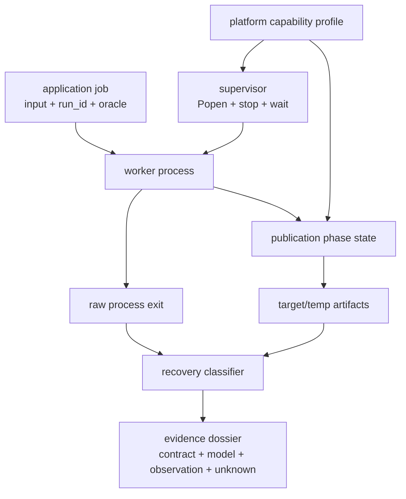

The four states can disagree:

```text
application job state
process lifecycle state
publication phase
artifact state
```

The project succeeds when the disagreement is explainable, not when every
scenario produces exit zero.

### 13.4 Required scenarios

Use deterministic phase injection where possible. Avoid timing sleeps as the
main trigger.

| Scenario | Stop/failure | Required evidence |
|---|---|---|
| `S0_NORMAL` | none | valid new target, raw successful exit, no unclassified temp |
| `S1_COOPERATIVE_BEFORE_STAGE` | stop at first safe point | old target, no promoted candidate, declared interrupted status |
| `S2_COOPERATIVE_AFTER_VALIDATED` | stop at pre-publication safe point | explicit finish-or-abandon policy and classified temp |
| `S3_ABRUPT_AFTER_STAGED` | child-only hard exit | old target, stale uncommitted temp possible |
| `S4_ABRUPT_AFTER_FILE_SYNC` | hard exit before replace | old target plus complete/synced candidate under file contract |
| `S5_ABRUPT_AFTER_REPLACE` | hard exit before normal acknowledgement | valid new target may coexist with abrupt/nonzero exit |
| `S6_SYNC_FAILURE` | sync adapter raises | no replace; error and old target preserved |
| `S7_REPLACE_FAILURE` | replace adapter raises | no false success; candidate classified |
| `S8_RESTART_RECOVERY` | inspect S3–S7 outputs | target validated first; leftovers handled by ownership policy |
| `S9_PERMISSION_DENIAL` | disposable, feature-detected denial | exact error or explicit inconclusive/unavailable record |

If the reference uses `os._exit()` for S3–S5, it must be reachable only in the
spawned lab child and clearly documented as bypassing normal Python cleanup.

### 13.5 Milestone A — Semantic and state contract

Deliver:

1. deterministic input/result contract;
2. independent digest/semantic oracle;
3. program/process/job/PID/run-ID table;
4. exact phase state machine with illegal edges;
5. central invariant in your own words;
6. M19/M20/M21/M24 non-goals.

**Gate:** do not launch a child until in-process transformation produces stable
validated bytes.

### 13.6 Milestone B — OS and process architecture

Deliver:

1. supervisor/worker/kernel/filesystem component map;
2. process resource capsule;
3. argv, cwd, environment, inherited-stream policy;
4. lifecycle trace;
5. one declared scheduler trace;
6. raw return-code versus application-status table;
7. bounded log/pipe decision;
8. descendant ownership limitation.

**Gate:** every process observation includes `run_id`, raw PID, actual runtime,
platform, and source. PID never becomes the job key.

### 13.7 Milestone C — Virtual memory, file identity, and authority

Deliver:

1. four page translations/fault classifications;
2. one TLB miss with no page fault;
3. one page fault with no asserted storage I/O;
4. page/object/cache/RSS boundary table;
5. path→name→object and descriptor/handle graph;
6. open/replace trace under a declared platform model;
7. Python buffer/page-cache/device separation;
8. least-authority operation matrix and safe denial probe/skip.

**Gate:** every “address,” “page,” “cache,” “file,” and “permission” names its
owner and authority.

### 13.8 Milestone D — Publication and recovery

Deliver:

1. exact twelve-phase vocabulary;
2. interruption matrix;
3. same-directory staging justification;
4. validation/flush/sync/close/replace distinctions;
5. platform directory-sync capability/limitation;
6. target/temp validation rules;
7. path-containment and cleanup-ownership rules;
8. old/new/invalid/missing artifact classifier.

**Gate:** recovery never infers commit from a temp name, PID, return code, or
phase report alone and never deletes an unrecognized artifact.

### 13.9 Milestone E — Shutdown and raw failure evidence

Deliver:

1. cooperative safe-point policy;
2. wait/deadline/escalation capability graph;
3. raw S0–S9 records;
4. actual interpreter and OS profile for every run;
5. phase order and source;
6. raw exit status;
7. target/temp bytes, digest, and validation;
8. at least four lower-layer unknowns;
9. separate process-failure versus OS/power-failure statement.

**Gate:** no forced action is called graceful; every escalated child is
subsequently observed/waited for.

### 13.10 Milestone F — Agent review and oral defense

Deliver:

1. bounded agent task;
2. actual patch/diff;
3. dependency-order review;
4. focused commands and complete results;
5. adversarial matrix;
6. separate behavior/test/portability/schema/prose decisions;
7. 700–1,000 word operating contract;
8. five labeled final sentences;
9. learner-paced conversational defense;
10. M19/M20/M21/M24 handoff map.

**Gate:** agent summary and green test count never replace diff, test-coverage,
raw-evidence, and artifact inspection.

### 13.11 Required machine-readable packet

Required top-level fields:

```text
schema
runtime_profile
platform_capabilities
application_contract
run_identity
process_launch
phase_definitions
phase_observations
exit_observation
artifact_observations
permission_probe
scenario
recovery_classification
claim_boundaries
unknowns
next_falsification_steps
agent_review
```

Packet invariants:

- valid JSON without NaN;
- actual interpreter implementation/full version recorded;
- documentation target recorded separately;
- argv recorded without secrets;
- environment policy recorded without sensitive values;
- public evidence uses workspace-relative paths, not usernames/home paths;
- phase observations retain original order and source;
- raw return code is retained;
- no single derived `success` field erases process/artifact distinctions;
- every artifact includes role, relative name, existence, byte length, digest
  if readable, schema validity, and ownership classification;
- unavailable platform evidence is explicit;
- scheduler history, residency, page-cache history, physical I/O, and
  power-loss outcome remain unknown unless a separate instrument establishes
  them;
- no performance ratio, sandbox, exactly-once, universal durability, or
  multi-writer claim appears.

### 13.12 Bounded agent task

> Review and implement only the named Module 18 reference milestone. Preserve
> the deterministic synthetic job, independent oracle, one-supervisor/
> one-worker limit, exact canonical phases, same-directory staged publication,
> platform-capability labels, raw exit/artifact evidence, and JSON schema.
>
> **Allowed:** named reference and test files; a newly created disposable test
> workspace; Python standard library; documentation needed for the exact
> behavior.
>
> **Forbidden:** production Atlas data/database; network; threads or multiple
> workers; locks, queues, GIL work, or parallelism; async tasks; dependency
> additions; `shell=True`; administrator/root requirements; system tuning;
> sending signals to non-child PIDs; deleting outside the resolved workspace;
> following unknown links during cleanup; CPython object/allocation/GC/profile
> work; semantic-output changes; universal durability, sandbox, or exactly-once
> claims.
>
> **Required report:** assumptions; exact files changed; contract impact;
> process/file state transitions; platform-specific behavior; commands and full
> results; raw schema changes; unresolved uncertainty; reversal.

Review the actual diff. A fluent summary is not evidence.

### 13.13 Project acceptance invariants

- the same validated synthetic input yields the same result bytes/digest
  in-process and in the worker;
- exactly one supervisor and child participate;
- launch uses an argv sequence with `shell=False`;
- application run identity is independent of PID;
- cwd, environment policy, standard streams, and cleanup owner are explicit;
- all target/temp paths resolve inside the disposable workspace;
- staging occurs in the target directory;
- target is never directly overwritten with an incomplete candidate;
- candidate validation precedes publication;
- canonical phase names/order are preserved;
- Python flush, file sync, close, replace, and optional directory sync remain
  distinct;
- sync and replace errors prevent false success and remain recorded;
- injection is deterministic or its uncertainty is recorded;
- child-only hard exit cannot target another process;
- every child is polled/waited/collected under the actual platform API;
- exit and artifact classifications remain separate;
- recovery validates target before considering temps;
- foreign, malformed, unknown, and out-of-workspace artifacts are not promoted
  or broadly deleted;
- permission probes are disposable and capability-detected;
- actual runtime is recorded; no local 3.14.6 validation is claimed without a
  separately executed 3.14.6 run;
- scheduling, page-cache, residency, and physical-I/O causes are not inferred
  from timing/API return;
- POSIX and Windows signal/durability semantics are not equated;
- M19, M20, M21, and M24 boundaries hold;
- final claims separate application invariant, model, platform contract,
  observation, and unknown.

### 13.14 TA role

The TA helps recover state, owner, and evidence. The TA does not:

- kill a process on Michael’s behalf without an ownership trace;
- replace an unavailable observation with a confident mechanism story;
- supply the final crash table before a prediction;
- review only the agent summary;
- solve the oral defense.

TA modes:

1. **boundary classifier** — application, Python, OS model, platform,
   filesystem/device, unknown;
2. **process coroner** — create, runnable, running, blocked, terminated,
   collected;
3. **translation clinician** — TLB/PTE/permission/presence/fault;
4. **path and authority tracer** — base/name/open resource/rights;
5. **artifact examiner** — target/temp/digest/schema/ownership;
6. **shutdown investigator** — request/wait/escalation/recovery;
7. **agent auditor** — scope/diff/tests/claims.

Before a hint:

```text
Goal:
Observed symptom:
Current state and phase:
My predicted next transition:
Artifact/code/diagram inspected:
Owner/platform I think controls it:
Confidence (1–4):
What evidence would change my mind:
```

### 13.15 TA response loop and hint ladder

Response loop:

1. restate the exact central invariant;
2. name the current state machine;
3. locate current phase/state;
4. require a prediction;
5. reveal the smallest contract or observation;
6. compare prediction/evidence;
7. split model, platform, observation, unknown;
8. vary one fault point, capability, permission, or mapping;
9. save misconception and delayed retrieval.

| Rung | TA action | Example |
|---|---|---|
| H0 — retrieval | ask for invariant | “What must not appear committed?” |
| H1 — owner | name only layer | “This is namespace state, not device state.” |
| H2 — locator | point to one field/edge | “Compare `exit_observation` with `artifact_observations`.” |
| H3 — constraint | reveal one relation | “`REPLACED` can precede acknowledgement.” |
| H4 — counterexample | falsify universality | “Can target be new with nonzero exit?” |
| H5 — partial trace | fill one row | compute VPN/offset or one crash cut |
| H6 — worked microcase | solve smaller different case | one page, one temp, three phases |

After H6, a direct local answer is allowed only with transfer back to Atlas.

### 13.16 TA stop rules

**Stop the experiment** when:

- workspace is not newly disposable;
- a resolved path escapes it;
- real/private data enters;
- signal/control targets a process not created and held by this supervisor;
- elevation/system tuning/power interruption is proposed;
- cleanup uses broad globs or follows unknown links;
- a second worker/writer enters;
- raw evidence is discarded;
- a platform capability is assumed rather than recorded.

**Stop the explanation** when:

- program/process/job/PID/run ID collapse;
- Python call/syscall/device operation collapse;
- virtual/physical address, Python object, page, TLB, cache line, RSS collapse;
- path/name/open resource/content/page cache collapse;
- flush/sync/close/replace/recovery/backup/transaction collapse;
- atomic visibility becomes universal durability;
- exit code becomes artifact state;
- signal becomes guaranteed cleanup;
- `terminate()` becomes portable graceful stop;
- missing evidence becomes zero;
- a 3.12.13 run becomes “validated on 3.14.6.”

**Stop at module boundaries:**

| Question | Route |
|---|---|
| overlapping workers, races, locks, queues, deadlock, GIL, parallel model | M19 |
| socket protocols, packets, framing, DNS, HTTP, network retry | M20 |
| task cancellation, event loops, async timeouts, backpressure, distributed uncertainty | M21 |
| frames, object layout, refcount/GC, allocation, RSS attribution, profiler/specialization | M24 |

### 13.17 Three TA studios

#### TA Studio A — process coroner (after Session 2, 50 minutes)

- reconstruct syscall and process lifecycle;
- separate program/image/process/job/PID/run ID;
- trace one alternate scheduler choice;
- debug zero exit with failed publication;
- repair `wait`/pipe/escalation shape.

Checkoff: lifecycle evidence and application commit remain separate.

#### TA Studio B — translation, path, and crash cuts

Run after Session 4 and during Session 6 in two 45-minute parts.

- four address translations/faults;
- one TLB miss without fault;
- open/replace/close identity trace;
- buffer/page-cache/device classification;
- rights decision;
- three crash cuts;
- unsafe stale-temp cleanup repair.

Checkoff: every page/path/cache term is qualified and target state is never
inferred from exit alone.

#### TA Studio C — shutdown and agent review (during Session 6, 70 minutes)

- select actual platform capability profile;
- trace cooperative/terminate/hard-exit paths;
- inspect one evidence packet;
- review actual diff in dependency order;
- run focused scenarios;
- defend accept/reject/split decisions;
- route M19/M20/M21/M24 questions.

Checkoff: forced termination is not graceful, recovery is artifact-driven, and
claims remain version/platform scoped.

### 13.18 Constructive next-step guide

| Capability | Required evidence | Not enough |
|---|---|---|
| derive OS purpose | four-role map from shared-resource pressure | list of services |
| trace protection boundary | user→kernel sequence with owner/evidence | “kernel handles it” |
| model process | resource capsule and identity/lifecycle defense | `Popen` syntax |
| reason about scheduling | declared trace and bounded timing claim | naming FIFO/RR |
| translate memory | VPN/offset/PTE/TLB/fault traces | “VM isolates” |
| preserve memory boundaries | page/object/cache/RSS distinctions | vocabulary list |
| model file identity | path/name/open-resource/data graph | path manipulation |
| reason about authority | least-rights matrix plus safe probe/skip | elevation |
| reason about persistence | phase/crash matrix and platform limits | normal successful write |
| design shutdown | cooperative/wait/escalate/recover graph | calling terminate |
| debug incident | causal timeline, smallest repairs, regressions | plausible guess |
| direct agent | bounded task, prohibitions, acceptance, reversal | generated code |
| review/verify | diff, commands, tests, raw packet, artifacts | summary/green count |
| communicate uncertainty | five labeled sentences and unknowns | “works locally” |
| transfer | correct M19/M20/M21/M24 routing | “later topic” |

Use the evidence above to choose a next bridge or repair—not to decide whether
Michael passes. Check which of these claims has usable evidence:

1. project acceptance invariants hold;
2. S0–S9 have raw evidence or explicit safe capability-based skips;
3. every confident quiz miss has a counterexample and delayed transfer;
4. Michael reproduces the central invariant and four state machines without
   notes;
5. oral defense includes one exit/artifact disagreement;
6. oral defense names at least three unobserved lower-layer facts;
7. agent patch decisions are evidence-backed per concern;
8. later-module boundaries hold.

Routing:

| Evidence pattern | Next bridge or repair |
|---|---|
| the project evidence and boundaries are coherent | continue with the M19 handoff and carry the dossier |
| concept model is coherent but evidence is weak | repeat only the failure scenarios or defense |
| process model is weak | TA Studio A |
| memory/file model is weak | TA Studio B |
| shutdown/platform model is weak | TA Studio C |
| ownership repeatedly collapses | M17 evidence bridge |
| publication reasoning collapses | M15 crash/publication bridge |

Otherwise, start with the first missing state transition: rebuild the
resource-owner timeline, classify one interruption without inferring a commit,
or inspect the artifact table before choosing a recovery claim. Preserve an
explicit platform limitation rather than inventing a guarantee, then bring the
revised trace to the Teaching Assistant or Study Partner.

This guide is not a score, grade, release approval, Core advance, or mastery declaration.

### 13.19 Evidence packet and operating memo

Final dossier:

```text
01 central invariant
02 semantic witness and oracle
03 process/resource architecture
04 scheduler teaching trace
05 page translation and fault trace
06 path/open-resource/permission trace
07 phase and shutdown state machines
08 raw scenario packets
09 artifact table
10 platform guarantee matrix
11 agent task and reviewed diff
12 test/evidence matrix
13 bounded operating memo
14 oral-defense notes
15 M19/M20/M21/M24 handoff
```

Operating memo structure:

1. problem and fixed semantic contract;
2. process/resource ownership;
3. virtual-memory model;
4. path/authority model;
5. publication and shutdown protocol;
6. observed scenarios;
7. supported claims;
8. unknowns and next evidence;
9. patch decision;
10. forward boundaries.

End with exactly:

```text
[APPLICATION INVARIANT] ...
[OS MODEL] ...
[PLATFORM CONTRACT] ...
[EMPIRICAL OBSERVATION] ...
[UNKNOWN + NEXT EVIDENCE] ...
```

### 13.20 Consolidation and spaced retrieval

One-page concept map:

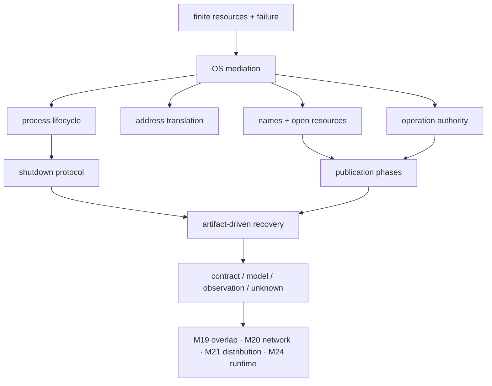

Before/now:

| Before | Now |
|---|---|
| “The script writes a file and exits.” | process, mapping, namespace, buffer/cache, sync, publication, termination, recovery, and evidence have separate owners |
| “PID means the job.” | run identity and OS process observation differ |
| “Fault means crash.” | TLB miss, resolvable fault, protection fault, and invalid mapping differ |
| “Flush saves it.” | Python buffer, file sync, name replacement, directory durability, and storage assumptions differ |
| “Terminate is graceful.” | cooperative protocol and forced lifecycle control differ |

Retrieval:

- **after 1 day:** redraw Figures 3, 5, 7, 15, and 14;
- **after 1 week:** solve a new fault and crash cut, then review unfamiliar
  `Popen` code;
- **at M19 entry:** explain which invariant changes with a second worker;
- **at M20 entry:** explain why local exit/replace does not prove a remote
  result;
- **at M21 entry:** explain local process stop versus task cancellation and
  distributed uncertainty;
- **at M24 entry:** explain why page/RSS observations do not describe Python
  object ownership.

---

## 14. Explicit backward and forward connections

### 14.1 Backward connections

| Earlier module | Retrieved idea | M18 deepening |
|---|---|---|
| M1 — values/state/execution | state transition, identity versus equality, exception paths | process and publication have independent state machines |
| M2 — functions/induction | contract and termination argument | worker protocol must reach exit or bounded escalation |
| M3 — abstractions/ADTs | representation independence and invariant | process/file abstractions hide mechanism without erasing failure |
| M4 — logic/relations/graphs | transition relation and illegal edge | lifecycle, page, shutdown, and phase graphs |
| M5 — cost models | latency/throughput/asymptotics/evidence | scheduling and blocking explain modeled cost without identifying host cause |
| M6 — representation/memory | address, reference, alias, ownership | virtual page/frame/open-resource identities; stop before CPython object layout |
| M7 — iteration/laziness | partial progress and suspended lifetime | blocked worker, partial staged output, safe-point policy |
| M8 — hashing/identity | digest as derived evidence, equivalence policy | artifact digest supports byte identity, not job truth or durability |
| M9 — ordering | order as explicit contract | publication ordering and phase legality |
| M10 — graphs | reachability and paths | filesystem path resolution and process/resource ownership graph |
| M11 — design/evidence | compare strategies under constraints | scheduler and shutdown policy trade-offs |
| M12 — APIs/types/dependencies | public contract and inward dependency | pure job core separated from subprocess/filesystem adapters |
| M13 — tests/debug/observability | falsifiable hypothesis, raw evidence, regression | process incident timeline and failure-injection matrix |
| M14 — design/change | bounded patch, reversal, architectural ownership | agent task and dependency-order review |
| M15 — files/serialization | value→bytes, context lifetime, stage/replace boundary | descriptor/handle, buffer/cache, sync, namespace, crash recovery |
| M16 — transactions | atomicity/isolation/durability ownership | one-file visibility is not database transaction or multi-writer safety |
| M17 — execution stack | user/kernel handoff, virtual address, cache ownership, bounded claims | processes, page tables, syscalls, filesystems, signals, page cache, shutdown |

### 14.2 Module 19 — concurrency and parallelism

M18 deliberately fixes:

```text
one supervisor
one worker
one publication attempt
no overlapping writer
```

M19 removes that constraint. It owns:

- interleavings;
- race conditions;
- locks, conditions, queues, and message-passing coordination;
- deadlock and progress;
- process/thread concurrency choice;
- the GIL;
- parallel speedup and workload fit;
- simultaneous publication and lost-update prevention.

M18’s scheduler explains that execution can be interleaved. It does not prove a
program-level protocol safe under those interleavings.

### 14.3 Module 20 — networks and application protocols

M18 can say:

- a socket is an OS-managed endpoint;
- local handles/descriptors have lifetime and blocking behavior;
- a local process can exit or be stopped.

M20 owns:

- addressing and ports;
- packets and transports;
- TCP stream and UDP datagram semantics;
- framing and partial network transfer;
- DNS and HTTP;
- protocol errors;
- retry and idempotency at a network boundary.

Local target replacement and child exit do not establish a remote peer’s
state.

### 14.4 Module 21 — asynchronous and distributed systems

M18’s cancellation is a local process-stop request. M21 widens to:

- event-loop scheduling;
- coroutine/task cancellation;
- async timeout composition;
- structured async lifetime;
- queues/backpressure;
- partial failure;
- uncertain remote completion;
- network retry, idempotency, duplicate effects, and distributed consistency.

Do not infer remote rollback from local process recovery.

### 14.5 Module 22 — security, privacy, and professional responsibility

M18 supplies:

- privilege boundary;
- least-authority resource request;
- path/permission mechanics;
- process and file trust boundaries;
- safe disposable experiments.

M22 owns:

- full threat models;
- authentication and authorization policy;
- secrets;
- malicious input/path analysis;
- sandbox/container security claims;
- hardened deployment and privacy review.

A child process is not a sandbox.

### 14.6 Module 24 — CPython, performance, and memory

M18 supplies:

- virtual address space;
- mapping/page/fault concepts;
- process resource observation boundaries;
- a thin public-API→platform-wrapper source route.

M24 owns:

- Python frames and bytecode dispatch;
- object layout and references;
- refcount/GC;
- allocators;
- RSS/object attribution;
- profiling;
- specialization;
- native optimization and vectorized/native-library execution.

```text
virtual page ≠ Python object
page fault ≠ allocation count
RSS ≠ retained object graph
OS scheduling delay ≠ interpreter cost proof
```

### 14.7 Module 26 — capstone defense

The capstone inherits:

- process/resource architecture map;
- explicit platform matrix;
- shutdown/recovery protocol;
- failure-injection evidence;
- least-authority record;
- claim/unknown discipline;
- agent patch stewardship.

Operational behavior is part of the system contract, not a deployment
afterthought.

---

## 15. Source ledger, licensing, claim boundaries, and freshness

### 15.1 Curriculum coverage

The joint ACM/IEEE-CS/AAAI
[CS2023 report](https://csed.acm.org/wp-content/uploads/2025/11/CS2023-Report.htm)
frames an OS as services that safely interface hardware and applications, with
mechanisms/policies for virtualizing computation, memory, and I/O. Its OS area
includes role/purpose, principles, protection, scheduling, process, memory,
devices, files, virtualization, and fault tolerance.

Coverage decision:

| CS2023 concern | M18 evidence | Boundary |
|---|---|---|
| role/purpose | four-role derivation and oral defense | no service-list memorization |
| principles/protection | user/kernel transition and least authority | full security in M22 |
| process/scheduling | lifecycle and declared policy trace | interleavings/locks in M19 |
| memory | page translation/TLB/faults | runtime object memory in M24 |
| files/devices | name/open-resource/cache/sync model | networks in M20 |
| fault tolerance | process interruption and one-file recovery | distribution in M21 |

The current
[ABET Computing Accreditation Commission criteria for
2026–2027](https://www.abet.org/accreditation/accreditation-criteria/criteria-for-accrediting-computing-programs-2026-2027/)
support the emphasis on analyzing complex problems, designing/evaluating
solutions, communication, professional judgment, and an integrating
experience. They are an evidence audit, not a claim that this self-directed
course is accredited.

### 15.2 Conceptual and university route

| Source | Use | Guardrail |
|---|---|---|
| [OSTEP v1.10](https://pages.cs.wisc.edu/~remzi/OSTEP/) | first-principles process, scheduling, VM, files, crash consistency, access control | link to official chapters; original traces; skip concurrency/distribution |
| [OSTEP homework](https://pages.cs.wisc.edu/~remzi/OSTEP/Homework/homework.html) | simulator tradition for small state traces | do not redistribute/adapt silently |
| [MIT 6.1810 Fall 2025](https://pdos.csail.mit.edu/6.S081/2025/schedule.html) | mechanism order: descriptors, kernel, page tables, traps, files, recovery | live-course link; no lab solutions |
| [xv6 RISC-V rev5 book](https://pdos.csail.mit.edu/6.828/2025/xv6/book-riscv-rev5.pdf) | readable process, trap, page-table, filesystem model | xv6-specific teaching model |
| [MIT page-table lab](https://pdos.csail.mit.edu/6.1810/2025/labs/pgtbl.html) | inspect/explain question tradition | no copied implementation/solution |
| [MIT OCW 6.1810 Fall 2023](https://ocw.mit.edu/courses/6-1810-operating-system-engineering-fall-2023/) | stable licensed archive | follow OCW terms/attribution |
| [Berkeley CS 162](https://www2.eecs.berkeley.edu/Courses/CS162/) | systems goals, protection, reliability cross-check | link-only unless asset license permits reuse |
| [Stanford CS 111 Spring 2026](https://web.stanford.edu/class/cs111/) | code-reading/crash-reasoning sequence | link-only; page restricts redistribution |

University sources explain. Standards specify. Platform documentation narrows.
Experiments observe. No one category substitutes for another.

### 15.3 Python documentation target

Documentation/source target remains Python 3.14.6:

| Source | Use | Boundary |
|---|---|---|
| [`open`](https://docs.python.org/3.14/library/functions.html#open) and [`io`](https://docs.python.org/3.14/library/io.html) | text/buffer/raw layers | not physical-I/O evidence |
| [`os`](https://docs.python.org/3.14/library/os.html) | descriptors, process parameters, `fsync`, `replace`, availability | platform-dependent extensions remain scoped |
| [`subprocess`](https://docs.python.org/3.14/library/subprocess.html) | creation, streams, wait/status, signal/terminate/kill | native effects differ; pipe warnings matter |
| [`signal`](https://docs.python.org/3.14/library/signal.html) | deferred Python handlers, main-thread rule, availability | not a cleanup transaction |
| [`atexit`](https://docs.python.org/3.14/library/atexit.html) | normal interpreter termination hooks | not forced/fatal/crash recovery |
| [`contextlib`](https://docs.python.org/3.14/library/contextlib.html) | handled cleanup and `ExitStack` | not durability |
| [`mmap`](https://docs.python.org/3.14/library/mmap.html) | mapping/access-mode abstraction | constructors/flush differ; no object-layout proof |
| [`pathlib`](https://docs.python.org/3.14/library/pathlib.html) | path flavors/resolution/move behavior | not uniform filesystem semantics |
| [`tempfile`](https://docs.python.org/3.14/library/tempfile.html) | secure unique temporary creation | reopening/deletion differs; use explicit cross-platform shape |

**Execution record:** the current bundled interpreter at authoring time is
CPython 3.12.13 on Windows. Any local reference/test observation belongs to
that runtime unless a separate interpreter is explicitly invoked and recorded.

### 15.4 POSIX Issue 8 authorities

| Source | Contract used |
|---|---|
| [`fork`](https://pubs.opengroup.org/onlinepubs/9799919799/functions/fork.html) | create a process |
| [`exec`](https://pubs.opengroup.org/onlinepubs/9799919799/functions/exec.html) | replace current process image |
| [`wait`](https://pubs.opengroup.org/onlinepubs/9799919799/functions/wait.html) | collect child state/status |
| [`_Exit`](https://pubs.opengroup.org/onlinepubs/9799919799/functions/_exit.html) | terminate without normal stdio/atexit behavior |
| [general concepts](https://pubs.opengroup.org/onlinepubs/9799919799/basedefs/V1_chap04.html) | process/scheduling/path/permission/cache concepts |
| [`read`](https://pubs.opengroup.org/onlinepubs/9799919799/functions/read.html) | descriptor read contract |
| [`open`](https://pubs.opengroup.org/onlinepubs/9799919799/functions/open.html) | pathname→open description→descriptor |
| [`dup`](https://pubs.opengroup.org/onlinepubs/9799919799/functions/dup.html) | another descriptor for shared open state |
| [`close`](https://pubs.opengroup.org/onlinepubs/9799919799/functions/close.html) | descriptor deallocation |
| [`rename`](https://pubs.opengroup.org/onlinepubs/9799919799/functions/rename.html) | namespace replacement contract |
| [`fsync`](https://pubs.opengroup.org/onlinepubs/9799919799/functions/fsync.html) | file synchronization |
| [`sigaction`](https://pubs.opengroup.org/onlinepubs/9799919799/functions/sigaction.html) | signal disposition/delivery |
| [filesystem rationale](https://pubs.opengroup.org/onlinepubs/9799919799/xrat/V4_xbd_chap01.html) | atomic visibility versus durable namespace reasoning |

These are POSIX claims, not Windows claims. Paraphrase and link; do not copy
standard tables or diagrams.

### 15.5 Windows authorities

| Source | Use |
|---|---|
| [Processes and Threads](https://learn.microsoft.com/en-us/windows/win32/procthread/processes-and-threads) | process resource composition and scheduled-thread boundary |
| [Process handles and identifiers](https://learn.microsoft.com/en-us/windows/win32/procthread/process-handles-and-identifiers) | PID versus process object/handle |
| [`CreateProcessW`](https://learn.microsoft.com/en-us/windows/win32/api/processthreadsapi/nf-processthreadsapi-createprocessw) | CPython Windows creation bridge authority |
| [Terminating a Process](https://learn.microsoft.com/en-us/windows/win32/procthread/terminating-a-process) and [`TerminateProcess`](https://learn.microsoft.com/en-us/windows/win32/api/processthreadsapi/nf-processthreadsapi-terminateprocess) | abrupt termination and cleanup limits |
| [Process creation flags](https://learn.microsoft.com/en-us/windows/win32/procthread/process-creation-flags) | console/process-group capability conditions |
| [Virtual address space and physical storage](https://learn.microsoft.com/en-us/windows/win32/memory/virtual-address-space-and-physical-storage) | Windows VM model |
| [Working Set](https://learn.microsoft.com/en-us/windows/win32/memory/working-set) | soft versus hard fault distinction |
| [Files and Clusters](https://learn.microsoft.com/en-us/windows/win32/fileio/files-and-clusters) | file object/handle concepts |
| [Moving and Replacing Files](https://learn.microsoft.com/en-us/windows/win32/fileio/moving-and-replacing-files) | Windows replacement constraints |
| [`FlushFileBuffers`](https://learn.microsoft.com/en-us/windows/win32/api/fileapi/nf-fileapi-flushfilebuffers) | Windows synchronization authority |
| [Access Control Components](https://learn.microsoft.com/en-us/windows/win32/secauthz/access-control-components) | tokens, descriptors, DACL/ACE model |
| [File security/access rights](https://learn.microsoft.com/en-us/windows/win32/fileio/file-security-and-access-rights) | requested rights and object policy |

Windows is a first-class platform model, not failed POSIX emulation.

### 15.6 Linux and xv6 implementation contrasts

| Source | Use | Boundary |
|---|---|---|
| [Linux user-space API](https://docs.kernel.org/userspace-api/index.html) | public kernel/user boundary context | Linux, not generic Python |
| [Linux page tables](https://docs.kernel.org/mm/page_tables.html) | hierarchical walks, TLB, permission, fault mechanisms | implementation contrast |
| [Linux process address spaces](https://docs.kernel.org/mm/process_addrs.html) | VMA and address-space implementation | not cross-platform contract |
| [Linux VFS](https://docs.kernel.org/filesystems/vfs.html) | open/file/page-cache architecture | not physical-I/O trace |
| [Linux `fsync(2)`](https://man7.org/linux/man-pages/man2/fsync.2.html) | file versus containing-directory sync detail | Linux scope |
| [Linux `rename(2)`](https://man7.org/linux/man-pages/man2/rename.2.html) | open-reference and namespace behavior | Linux/POSIX family scope |
| [Linux `signal(7)`](https://man7.org/linux/man-pages/man7/signal.7.html) | signal model detail | Linux scope |
| [xv6 repository](https://github.com/mit-pdos/xv6-riscv) | bounded mechanism source reading | teaching system, not production OS |

### 15.7 Pinned CPython source-reading route

Pinned commit:
[`c63aec69bd59c55314c06c23f4c22c03de76fe45`](https://github.com/python/cpython/tree/c63aec69bd59c55314c06c23f4c22c03de76fe45)

| Read | Question | Stop |
|---|---|---|
| [`Lib/subprocess.py`](https://github.com/python/cpython/blob/c63aec69bd59c55314c06c23f4c22c03de76fe45/Lib/subprocess.py) | where do platform `_execute_child`, wait, and status paths branch? | after one Windows/POSIX sketch |
| [`Modules/_posixsubprocess.c`](https://github.com/python/cpython/blob/c63aec69bd59c55314c06c23f4c22c03de76fe45/Modules/_posixsubprocess.c) | what crosses POSIX child creation/exec? | no GIL/thread audit |
| [`Modules/_winapi.c`](https://github.com/python/cpython/blob/c63aec69bd59c55314c06c23f4c22c03de76fe45/Modules/_winapi.c) | where is the Windows process API called and what handles return? | after creation bridge |
| [`Modules/posixmodule.c`](https://github.com/python/cpython/blob/c63aec69bd59c55314c06c23f4c22c03de76fe45/Modules/posixmodule.c) | how do `replace`/`fsync` branch to platform operations? | one wrapper only |
| [`Modules/signalmodule.c`](https://github.com/python/cpython/blob/c63aec69bd59c55314c06c23f4c22c03de76fe45/Modules/signalmodule.c) | what supports deferred handler behavior? | no eval-loop/frame excursion |
| [`Modules/_io/fileio.c`](https://github.com/python/cpython/blob/c63aec69bd59c55314c06c23f4c22c03de76fe45/Modules/_io/fileio.c) | how does raw file I/O own/close native resources? | no full I/O implementation survey |

Pinned source supports bounded CPython 3.14.6 implementation statements. It
does not describe the current bundled CPython 3.12.13 binary unless separately
matched, nor every Python implementation.

### 15.8 Licensing/use policy

| Source family | Use policy |
|---|---|
| Python docs/CPython | PSF License v2; documentation examples also Zero-Clause BSD; pin/attribute; prefer original examples |
| POSIX Issue 8 | copyrighted standard; link and paraphrase narrowly |
| Microsoft Learn | link/paraphrase under Microsoft documentation terms; do not copy diagrams without checking |
| Linux docs | link/paraphrase; inspect exact SPDX/license before reuse |
| xv6 | repository carries MIT-style license; retain attribution/license for reused code |
| MIT OCW | follow OCW CC BY-NC-SA/terms for adaptations |
| live MIT 6.1810 | link; do not publish lab solutions or assume OCW license |
| OSTEP | link to official site; follow authors’ distribution request; original figures/questions |
| Berkeley CS162 | link-only unless a specific asset licenses reuse |
| Stanford CS111 | link-only; live page restricts redistribution |
| NIST least privilege | cite source; explain in original prose |

All workbook incidents, diagrams, traces, questions, reference code, and
assessment are original synthesis.

### 15.9 Safe claims

- stored program and live process differ;
- POSIX `fork` creates and `exec` replaces the image;
- Python `subprocess` has platform-specific native mechanisms/effects;
- termination and status collection/release differ;
- PID can be reused;
- parent termination does not automatically guarantee descendant termination;
- blocked and runnable differ;
- classroom scheduler predicts only its declared model;
- virtual and physical addresses differ;
- page table and TLB differ;
- TLB miss does not imply page fault;
- page fault does not imply storage I/O;
- path/name/open resource/descriptor-or-handle/Python file object differ;
- POSIX descriptor and Windows handle are not identical;
- open lifetime and name transition differ;
- access is operation/platform scoped;
- `os.access` precheck does not guarantee later access;
- Python signal handlers are deferred and platform-limited;
- normal cleanup hooks do not prove forced/crash cleanup;
- POSIX and Windows `terminate`/`kill` effects differ;
- `flush`, file sync, replace, and directory sync differ;
- same-directory replace can provide strong one-file runtime visibility under
  its contract;
- atomic visibility, durability, transaction, recovery, and backup differ;
- cross-filesystem copy/delete is not one atomic rename.

### 15.10 Never say without stronger evidence

- “This Python call is a syscall.”
- “One read is one disk read.”
- “A process is a running source file.”
- “`exec` always launches a child.”
- “The dead child leaves nothing to collect.”
- “Killing the parent kills every descendant.”
- “This timing reveals the host scheduler.”
- “Sleep resumes at the exact requested instant.”
- “Every TLB miss is a page fault.”
- “Every page fault reads storage.”
- “`id()` is a physical address.”
- “RSS is the sum of Python objects.”
- “The filename is the file.”
- “Descriptor integer contains the file.”
- “Rename updates every already-open view.”
- “POSIX mode bits are Windows permissions.”
- “`os.access` proves later success.”
- “The Python handler runs immediately and can publish safely.”
- “`atexit` always runs.”
- “`kill()` means SIGKILL everywhere.”
- “Close/flush means power-loss durability.”
- “Atomic replace is a durable transaction.”
- “`Path.move()` is atomic across volumes.”
- “Process kill is a power-failure test.”
- “xv6/Linux is the portable Python contract.”
- “Pinned CPython 3.14.6 source proves the current 3.12.13 local runtime.”

---

## 16. Freshness, reproducibility, and final synthesis

### 16.1 Before publishing or rerunning

- [ ] keep documentation/source target separate from executed runtime;
- [ ] record actual Python implementation/full version per run;
- [ ] never claim local 3.14.6 validation without a real separate 3.14.6 run;
- [ ] confirm CPython source link matches its stated commit;
- [ ] keep POSIX links on Issue 8 / `9799919799`;
- [ ] recheck Microsoft pages for current Windows behavior;
- [ ] verify MIT/xv6 revision and license;
- [ ] recheck OSTEP version/distribution request;
- [ ] treat Berkeley/Stanford live assets as link-only absent explicit license;
- [ ] record native Windows/WSL/Linux/macOS/container precisely;
- [ ] record filesystem/volume facts known;
- [ ] verify temp and target placement;
- [ ] make inherited descriptors/handles minimal and explicit;
- [ ] use only disposable synthetic files;
- [ ] require no elevation;
- [ ] never act on an unverified external PID;
- [ ] bound waits and retain diagnostics;
- [ ] separate process-kill evidence from OS/power failure;
- [ ] retest cleanup containment after interruption;
- [ ] preserve M19/M20/M21/M24 boundaries.

### 16.2 Minimum run provenance

```text
documentation/source target
executed Python implementation + full version
OS name/release/build
native Windows / WSL / Linux / macOS / container
filesystem/volume facts known
workspace and same-directory staging assertion
process argv/cwd/environment/stream policy
shutdown channel and escalation capabilities
scenario and exact injection phase
raw phase observations
raw exit status
target/temp observations and digests
recovery classification
guarantees claimed
guarantees explicitly not claimed
```

### 16.3 Directed reading route

Do not read every source at once.

| Before | Read | Produce |
|---|---|---|
| Session 1 | OSTEP process/controlled execution; Python subprocess overview; POSIX fork/exec/wait summaries | process/image/lifecycle trace + Windows contrast |
| Session 2 | OSTEP scheduling; POSIX state concepts | two declared-policy traces and bounded host claim |
| Session 3 | OSTEP VM/TLB; xv6 page-table route; Linux or Windows VM docs | TLB miss/no fault + fault/no storage trace |
| Session 4 | POSIX open/dup/close/rename; pathlib; Windows file overview | path/open-resource trace under named model |
| Session 5 | NIST least privilege; Python signal/atexit/subprocess termination; platform access docs | rights table + shutdown state machine |
| Session 6 | POSIX cache rationale or Windows flush/replace; tempfile/os; OSTEP/xv6 crash reading | old/new/temp crash table with source per claim |
| Project | one pinned subprocess platform branch, matching C bridge, one replace/fsync wrapper | three supported and three unsupported source statements |

### 16.4 Final self-explanation

Without notes:

> Why do finite resources force protection and scheduling? What changes when a
> stored program becomes a process, and why do creation, image replacement,
> termination, and status collection remain separate? How can a process be
> runnable, running, or blocked without those states proving a host schedule?
> Translate one address through a TLB and page table, then distinguish TLB
> miss, resolvable fault, storage-requiring fault, protection failure, and
> invalid access. Follow one path through a directory name to an open resource,
> descriptor/handle, Python file object, buffer, OS cache, and device boundary.
> Explain how authority is checked. Then defend the Atlas shutdown and
> publication protocol: cooperative versus forced stop, normal cleanup versus
> recovery, flush versus sync, atomic visibility versus durability, and one
> file versus transaction. Which claims are Python documentation, POSIX,
> Windows, Linux/xv6/CPython implementation, model, observation, or unknown?
> Finally, where do M19, M20, M21, and M24 begin?

Finish:

> I can recover the OS-owned state, trace its lifecycle, name the source of each
> guarantee, and design for interruption without claiming more than the
> platform and evidence support.

## Conversational oral defense — M18

This is a supportive Teaching Assistant conversation, not a pass/fail exam,
score, timed assessment, completion signal, or operating-systems certification
claim. It is not a score, not timed, and does not produce a binary outcome.
If the learner chooses GPT Live at a preferred High setting when available and
their client renders the material, use the resource-owner map, lifecycle trace, translation table,
publication phases, and Markdown/ASCII evidence ladder as a shared whiteboard.
This workbook cannot control voice availability, quality settings, rendering,
retention, or integrations. The same conversation protocol can instead use
readable text with Markdown and an ASCII resource/lifecycle trace; the course
cannot write Notion evidence automatically.

### Invitation — separate an API return from OS state

Start from one learner-selected artifact: an ownership table, process
lifecycle, page translation, pathname/open-resource map, shutdown trace, or
crash-cut matrix. Ask what changed, who owns the transition, which evidence
supports it, how confident the learner is, and which lower-layer fact remains
unknown before naming an API or guarantee.

### Hint ladder — owner to recovery claim

Offer only the smallest needed prompt:

1. name the resource and current owner;
2. draw the legal next state and one illegal edge;
3. distinguish application invariant, declared model, platform contract,
   observation, and unknown;
4. inspect the shortest trace or artifact table;
5. change one interruption or authority premise;
6. state the narrowest recovery or non-claim.

### Changed-premise counterexample

Keep the application job fixed, then change exactly one premise: a permission
denial, a forced stop, an uncollected child, a renamed pathname, a not-present
page, a missing directory-sync capability, or a second worker. Predict which
state transition, claim, and recovery rule change before seeing a trace. Use a
small counterexample rather than turning an uncertainty into a failure.

### Transfer turn — M19 concurrent histories

Admit a second worker that can observe or modify the same name, resource, or
publication protocol. Which M18 ownership and lifecycle facts remain useful,
and which claims now require M19's interleavings, synchronization, progress,
and race reasoning? Carry the unresolved question forward rather than claiming
that a one-worker trace proves a concurrent guarantee.

### Reflection — learner-controlled evidence summary

The learner may keep a short summary: selected artifact, defended claim,
confidence, changed premise, repaired misconception, observed evidence,
remaining unknown, and M19 question. It is optional learner-controlled
evidence, not a grade, transcript, automatic record, completion decision, or
Notion write.

## Guided Codex handoff — M18

### Teaching Assistant — supportive oral defense

Use the canonical conversational oral-defense protocol above. Start with:
**“I am finishing M18. This resource is owned by [layer], this lifecycle trace
is [trace], this authority/durability claim is [claim], and my confidence is
[level].”** Ask for the resource-state timeline before naming an OS API.

### Study Partner — lifecycle rehearsal

Ask the learner to trace one file/resource through acquire, use, close,
flush/sync, failure, and recovery. Change exactly one event and ask whether the
result is a leak, a visibility difference, lost durability, or an authority
failure. Preserve the unknown platform detail rather than inventing it.

### Forward handoff — M19

Carry the idea of an owned resource plus a legal lifecycle into **M19**.
Concurrency makes the same ownership and timing reasoning explicit across
multiple simultaneous histories.
