# Module 19 — Concurrency and Parallelism

> **Arc IV: make overlapping work explainable**
>
> One worker can be correct in isolation while two workers, each doing locally
> valid work, produce a globally invalid result. Concurrency begins at that
> seam.

**Documentation and source baseline:** Python and CPython 3.14.6; CPython
source pinned at commit
`c63aec69bd59c55314c06c23f4c22c03de76fe45`; university and standards sources
last audited 2026-07-29.

**Executed production baseline:** standard GIL-enabled CPython 3.14.6 on
Windows, with `sys._is_gil_enabled() == True`,
`sysconfig.get_config_var("Py_GIL_DISABLED") == 0`, and 24 logical CPUs
reported as host metadata. The compatibility suite was also run separately on
CPython 3.12.13. No free-threaded runtime was installed or executed, so every
free-threaded statement in this module is documentation-scoped.

**Primary learning surface:** use the artistic, interactive HTML studio for
prediction, stepping, reveal, and persistent learning records. This workbook is
the complete accessible and auditable canonical source: it contains every
contract, diagram text equivalent, lab, quiz rationale, project gate, and
source boundary needed without animation, color, or JavaScript.

**Learning record:** use the Module 19 Notion notebook for predictions,
history traces, confidence, misconception repairs, diagrams redrawn from
memory, model decisions, agent-review verdicts, and oral-defense notes. It
should link to this workbook rather than duplicate it.

---

## How to study this module

This is one investigation, not a tour of `threading`, `queue`, and
`concurrent.futures`.

Atlas can already build and safely publish one local index result through the
Module 18 protocol. Product pressure now asks it to admit several immutable
document partitions at once. A generated patch lets workers update the same
postings mapping. It usually passes. Under a deliberately chosen schedule, one
valid update disappears. A narrow lock still loses it. A later patch stops
losing updates but can wait forever. A fourth patch changes the executor and
announces a speedup without establishing that the result, runtime, or workload
is comparable.

We will not answer that incident with a slogan. We will derive a system:

```text
sequential meaning
→ overlapping operation lifetimes
→ possible histories
→ safety and progress obligations
→ ownership and synchronization
→ bounded coordination
→ progress diagnosis
→ workload-first Python model choice
→ deterministic evidence
→ one safe publication handoff
```

For every reveal, experiment, code review, or agent patch:

1. recover the sequential operation;
2. predict the next state;
3. record confidence from 1–4;
4. reveal one transition or run one bounded command;
5. reconstruct local, shared, ledger, and publication state;
6. name the first unsupported claim or violated invariant;
7. revise the explanation;
8. transfer the result to a different surface.

The goal is not typing speed. Most of your time should go to reading unfamiliar
code, drawing ownership, tracing events, generating counterexamples, debugging
claims, designing bounded changes, and reviewing agent work. You will manually
implement only two small mechanisms because they make hidden reasoning visible:
the six-step interleaving explorer and the wait-for-graph cycle detector.

### The exact cumulative invariant

Read this before every session. Later, reproduce it without notes.

> **Every admitted Atlas partition reaches exactly one terminal
> classification—`COMMITTED`, `FAILED`, or `CANCELLED`. If Atlas publishes a
> new index, that index is the deterministic fold of all and only
> `COMMITTED` partial results, and publication is permitted only when every
> required partition is `COMMITTED`. Every worker-visible effect remains
> accounted for as a process-local operation, an OS-mediated resource
> transition, and one step in a declared concurrent history; each shared
> transition is justified by one named owner or synchronization protocol,
> every progress claim states its blocking and fairness assumptions, and
> neither a clean exit, a passing stress run, the GIL, nor observed speedup
> substitutes for safety, liveness, or model-fit evidence.**

It carries seven obligations:

| Obligation | What must be demonstrated | A tempting non-substitute |
|---|---|---|
| terminal accounting | the three terminal sets are pairwise disjoint and cover admitted IDs | “the pool closed cleanly” |
| deterministic result | canonical bytes depend on admitted inputs, not completion order | “the same terms appeared” |
| publication gate | every required partition is `COMMITTED` before the M18 handoff | “all Futures are done” |
| history accounting | model steps, runtime observations, and OS-mediated effects remain distinct | “the OS ran my diagram” |
| shared-transition authority | one owner or one specified protocol explains each shared change | “the container is thread-safe” |
| conditional progress | every “eventually” names finite-work, worker, blocking, shutdown, and fairness assumptions | “the timeout did not fire” |
| evidence discipline | specification, finite model, Python contract, runtime observation, and timing answer different questions | “10,000 tests passed” |

### Claim labels

Use the narrowest label that supports a sentence.

| Label | Authority and stopping line |
|---|---|
| **[SEQUENTIAL SPEC]** | the legal one-worker Atlas behavior |
| **[CONCURRENCY MODEL]** | a declared abstract scheduler or state machine, not a host trace |
| **[PYTHON 3.14 CONTRACT]** | behavior documented by Python 3.14 |
| **[CPYTHON 3.14 IMPLEMENTATION]** | behavior of the named implementation/revision |
| **[FREE-THREADED BUILD CONTRACT]** | documented behavior of the optional build, not a local observation |
| **[POSIX CLAIM]** | behavior scoped to POSIX.1-2024 / Issue 8, never silently generalized to Python or Windows |
| **[ATLAS POLICY]** | an application choice made in this course |
| **[MODEL-CHECK RESULT]** | a result over the exact finite state space explored |
| **[EMPIRICAL OBSERVATION]** | output from a named executable, platform, fixture, and command |
| **[HYPOTHESIS]** | a proposed explanation awaiting discriminating evidence |
| **[UNKNOWN]** | a fact the current instrument did not establish |

Split a sentence if its clauses need different labels.

### Runtime evidence card

| Record | Value | Supports | Does not support |
|---|---|---|---|
| documentation target | Python/CPython 3.14.6 | version-scoped API and implementation reading | a local runtime result |
| executed primary runtime | CPython 3.14.6, Windows, standard GIL-enabled build | the named reference/test observations | free-threaded behavior |
| build capability probe | `Py_GIL_DISABLED == 0` | this executable was not built free-threaded | whether another executable exists |
| live-state probe | `_is_gil_enabled() == True` | GIL was enabled in this run | application correctness |
| host metadata | 24 logical CPUs reported | one environment fact | 24-way parallel execution or speedup |
| compatibility runtime | CPython 3.12.13, Windows | separately labeled compatibility | Python 3.14-only APIs |
| free-threaded runtime | unavailable and unexecuted | honest non-observation | any behavioral conclusion |

---

## 1. Position in the knowledge system

### 1.1 From one supervised worker to overlapping histories

Module 18 fixed five simplifying facts:

```text
one supervisor
one worker
one semantic job
one publication attempt
no overlapping writer
```

It separated process-local work from OS-mediated resources, distinguished
worker exit from artifact state, and established one safe publisher. Module 19
keeps those contracts. It changes exactly one condition: a second operation may
begin before the first responds.

#### D1 — The M18 → M19 pressure bridge

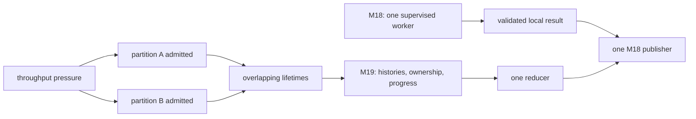

**Caption — D1.** Overlap is admitted before the existing single-publisher
boundary. Module 19 adds ordering and accounting; it does not replace Module
18 durability.

**Text equivalent.** Module 18 produces one validated local result and gives it
to one publisher. Product pressure admits partitions A and B with overlapping
lifetimes. Module 19 must order and account for those lifetimes, then one
reducer hands one candidate to the unchanged single publisher.

The bridge preserves these distinctions:

| M18 fact | M19 deepening |
|---|---|
| the OS may schedule execution contexts | Atlas declares program-level histories and legal transitions |
| one process owns ordinary local state | every shared object now needs an explicit owner or protocol |
| worker exit is not publication | Future completion is not reducer commit, and commit is not publication |
| cooperative stop precedes escalation | admission, pending work, running work, and terminal classifications are separated |
| one safe replacement protocol | exactly one reducer and one publisher remain |
| timing does not identify cause | passing schedules and speedups do not identify correctness or mechanism |

### 1.2 Concurrency is not parallelism

An operation lifetime starts at invocation and ends at response.

- **Concurrency** exists when two operation lifetimes overlap.
- **Parallelism** exists when work physically executes at the same time.

A single processor can interleave two concurrent operations without executing
them simultaneously. Two processors can run operations in parallel. A trace of
application events can establish overlap; it cannot establish simultaneous
physical execution unless the instrumentation and runtime evidence were
designed to answer that question.

#### D2 — Overlap and physical execution are different axes

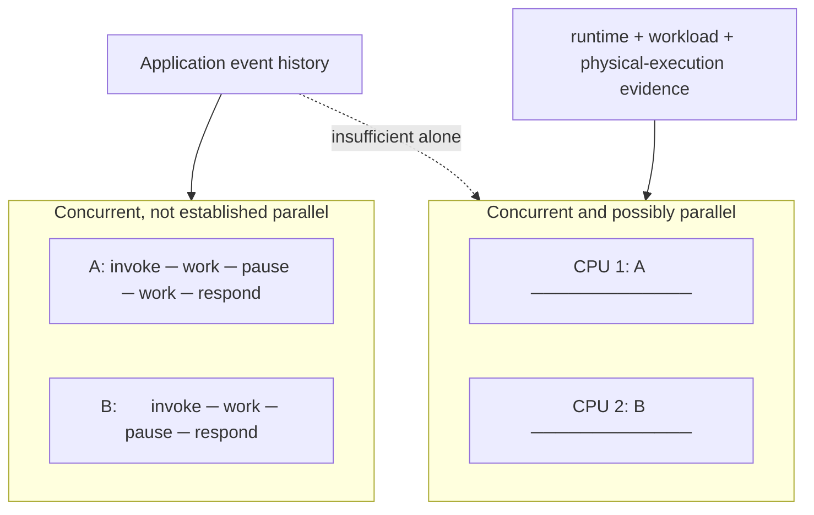

**Caption — D2.** The same overlapping application lifetimes are compatible
with time-sliced execution or physical parallel execution.

**Text equivalent.** In the first timeline, A and B overlap but take turns. In
the second, A and B occupy two physical execution resources at once. An
application history establishes the first relationship. Separate runtime and
measurement evidence is needed for the second.

### 1.3 The sequential specification is the authority

Before selecting any lock, queue, or executor, define what a correct one-worker
operation means:

```text
normalize(document)
    → immutable per-document contribution

index_partition(partition)
    → immutable canonical partial

fold(partials ordered by stable identity)
    → canonical aggregate

encode(aggregate)
    → deterministic validated bytes
```

The Atlas architecture and the downloadable reference both use the same
inverted-index contract:
`term → sorted unique tuple[document_id, ...]`. Repeated occurrences of a term
inside one document still produce one posting for that document. The literal
two-document reference oracle is:

```json
{"document_ids":["doc-a","doc-b"],"postings":{"gil":["doc-a"],"lock":["doc-a","doc-b"],"queue":["doc-b"]},"schema":"atlas.concurrent-inverted-index.v1"}
```

The worker path builds immutable `PartialIndex` values bound to immutable
`Partition` inputs by input and partial digests. A separate
`sequential_index_oracle` computes the semantic result without workers,
partials, or the fold implementation. The reducer must match that independent
oracle before any `COMMITTED` transition.

Required specification properties:

- equal fixtures produce equal canonical bytes;
- input and partition identities are unique and stable;
- the worker function is pure and has no executor, clock, lock, queue,
  filesystem, or global mutable dependency;
- the fold accepts exactly the admitted identities, once each;
- completion order is evidence, not canonical result order;
- a worker result is validated before reducer commit;
- failure and cancellation remain terminal ledger data;
- durable publication stays owned by one Module 18 coordinator.

#### D3 — A legal concurrent history must refine the sequential operation

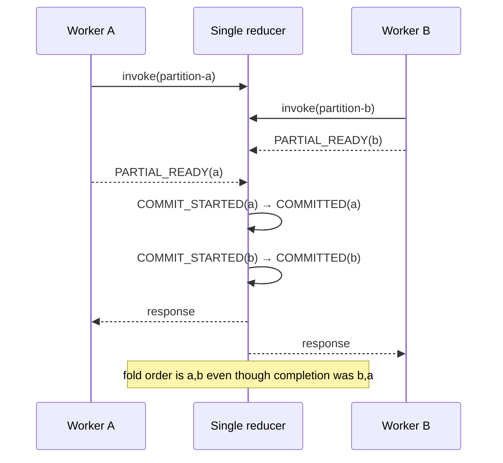

**Caption — D3.** Operations may overlap and finish out of input order while
the reducer still produces the one legal deterministic result.

**Text equivalent.** A and B are both invoked. B returns its immutable partial
before A. The single reducer validates and commits A then B in stable identity
order. The observable concurrent history is accepted because it can be
explained by the sequential fold contract and respects real-time constraints.

### 1.4 Canonical event vocabulary

Do not use `DONE`. It erases essential states.

| Event | Meaning | Does not establish |
|---|---|---|
| `ADMITTED` | coordinator accepted a validated partition | queued or running |
| `ENQUEUED` | work became available through the declared broker/executor | claimed |
| `CLAIMED` | one worker began the attempt | success |
| `PARTIAL_READY` | worker returned a validated immutable partial | committed |
| `COMMIT_STARTED` | reducer began the ledger/fold transition | completed transition |
| `COMMITTED` | reducer incorporated the exact partial and terminally classified it | durably published |
| `FAILED` | terminal failure retains cause evidence | no partial work occurred |
| `CANCELLED` | policy classified work that never committed | a running thread was forcibly stopped |
| `REDUCTION_COMPLETE` | every required partition is terminal and committed | durable publication |
| `PUBLICATION_STARTED` | canonical bytes entered the M18 protocol | replacement completed |
| `PUBLISHED` | M18 evidence satisfied the Atlas publication gate | universal power-loss durability |

### 1.5 Prerequisite retrieval

Answer from memory before Session 1:

1. Draw two Python names that reach one mutable dictionary. What is shared?
2. State a mapping ADT invariant without describing its implementation.
3. Give one legal and one illegal edge in a state machine.
4. Distinguish work, span, latency, throughput, and elapsed time.
5. Explain why FIFO item order does not define completion order.
6. Draw a directed cycle.
7. Mark domain core, coordinator, adapter, and publisher in an unfamiliar
   architecture.
8. Turn “sometimes hangs” into two competing hypotheses and one discriminating
   observation.
9. Distinguish Python language, CPython implementation, OS thread, and
   processor.
10. Explain why a clean worker exit does not establish publication.

One confident miss gets the smallest counterexample and a delayed transfer.
Two shared-state misses trigger the aliasing plus sequential-spec bridge. Two
runtime-layer collapses trigger the Module 17 evidence ladder. Any
exit/commit/publication collapse triggers the Module 18 phase table before
project work.

---

## 2. Session 1 — A second worker creates histories

### Pressure

The broken Atlas update is conceptually:

```python
old = shared_postings[term]
new = tuple(sorted(set(old) | {own_document_id}))
shared_postings[term] = new
```

Each worker is locally reasonable. The operation, however, is three semantic
steps:

```text
R: read the old immutable postings value
C: compute old ∪ {own_document}
W: assign the computed value
```

The model deliberately does **not** say that `R`, `C`, and `W` are bytecodes.
They are application-level transitions chosen to expose the invariant.

### Derivation from first principles

Suppose worker A contributes document 2 and worker B contributes document 3 to
the old posting tuple `(1,)`. Each must preserve its own program order
`R → C → W`. The scheduler model may merge those two three-step sequences.
Choosing which three of the six positions belong to A produces:

```text
C(6, 3) = 20
```

legal program-order-preserving schedules.

The two serial schedules produce `(1, 2, 3)`. Eighteen schedules lose an update
in the equivalent increment model used by the reference: its exact output is
`{1: 18, 2: 2}` from 20 schedules.

#### D4 — A lost update without container corruption

```mermaid
    %% atlas-diagram-id: m19-lost-update-trace
    %% atlas-diagram-title: Lost update from two stale snapshots
    %% atlas-diagram-alt: Workers A and B both read shared graph state (1,), compute different valid additions, then write sequentially. B's stale write replaces A's contribution, leaving (1,3) rather than the sequential result (1,2,3).
    sequenceDiagram
    participant A as Worker A
    participant S as shared["graph"]
    participant B as Worker B
    A->>S: R → (1,)
    B->>S: R → (1,)
    A->>A: C → (1,2)
    B->>B: C → (1,3)
    A->>S: W → (1,2)
    B->>S: W → (1,3)
    Note over S: expected (1,2,3); A's valid update is lost
```

**Caption — D4.** Both assignments are well-formed, yet B writes a value
computed from a stale snapshot and erases A’s contribution.

**Text equivalent.** A and B both read `(1,)`. A computes `(1,2)` while B
computes `(1,3)`. A writes its result; then B writes its result. The final tuple
is `(1,3)`, not the sequential oracle `(1,2,3)`. The first decisive divergence
is B’s write from a snapshot taken before A’s update.

### Race condition, safety, and liveness

A **race condition** exists when correctness depends on relative timing or
order. That is broader than a standards-specific **data race**, which needs a
named memory model and conflicting unsynchronized accesses, at least one a
write. We use the broader term for the Atlas lost update and reserve “data
race” for an explicitly scoped standard.

- **Safety:** nothing forbidden occurs in any reachable state. Atlas safety
  forbids lost/duplicate terminal classifications, malformed folds, partial
  publication, and unauthorized shared mutation.
- **Liveness:** a desired transition eventually occurs under named
  assumptions. Atlas liveness might require every admitted non-cancelled
  partition eventually to become terminal, assuming finite input, live
  workers, a consuming reducer, cooperative shutdown, and a stated fairness
  premise.
- **Linearizability:** each completed concurrent operation can be placed once
  in a legal sequential history, respecting real-time order. It does not imply
  durability, fairness, or speed.

#### D5 — Three questions, three proofs

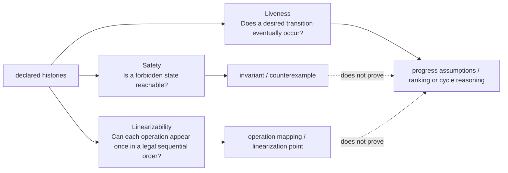

**Caption — D5.** Safety, liveness, and linearizability constrain different
properties of the same histories and need different evidence.

**Text equivalent.** Histories feed three independent questions. Safety uses an
invariant or counterexample; liveness uses explicit progress assumptions and
progress reasoning; linearizability maps each operation to one legal
sequential effect. A safety or linearizability proof does not automatically
prove liveness.

### Code-reading lab L1 — Valid local updates, invalid global index

Read this architecture before running it:

```text
coordinator
    ├─ submits A with immutable document 2
    └─ submits B with immutable document 3

worker A/B
    ├─ reads shared postings
    ├─ computes locally
    └─ assigns shared postings

coordinator
    └─ compares final state with sequential oracle
```

Annotate:

1. the operation’s precondition and postcondition;
2. every worker-local value;
3. the shared mutable mapping;
4. each `R/C/W` transition;
5. enabled steps after every prefix;
6. the first point after which the observed result differs from the oracle;
7. what the dictionary’s structural integrity does **not** establish.

Then use the reference:

```powershell
Set-Location .\work
& ".\python-3.14.6-embed\python.exe" ".\module19_reference.py" --model schedule --json
```

Expected model facts:

```text
declared model: two workers, READ → ADD → WRITE
program-order-preserving schedules: 20
safe final value 2: 2 schedules
lost-update final value 1: 18 schedules
claim type: MODEL-CHECK RESULT
```

The numeric increment is the smallest executable analogue of the postings
incident. It proves a fact about that finite model. It does not claim which
schedule CPython or Windows used.

### Prediction record

Before revealing a schedule:

```text
Event prefix:
Enabled next steps:
My chosen next step:
Predicted A local value:
Predicted B local value:
Predicted shared value:
Safety verdict:
Physical parallelism established?:
Confidence (1–4):
What evidence could change my answer:
```

### Bounded agent task

Ask an agent to add only deterministic trace serialization for the already
broken fixture. Allow one reference file and its tests. Forbid changing the
shared-state design. Require the exact explored schedule count, the smallest
counterexample, and the model boundary. Review the actual diff before accepting
its summary.

### Session 1 synthesis

For a new six-event history, state:

```text
[SEQUENTIAL SPEC] legal result:
[CONCURRENCY MODEL] overlapping lifetimes:
[MODEL-CHECK RESULT] safety verdict in this finite model:
[UNKNOWN] physical parallelism:
[UNKNOWN] unmodeled production schedules/failures:
```

Do not continue until you can explain why:

```text
concurrent ≠ necessarily parallel
well-formed container update ≠ preserved Atlas invariant
many passing histories ≠ every allowed history
```

---

## 3. Session 2 — Protect one logical transition

### Pressure

The first generated repair acquires a lock only around the final assignment:

```python
old = shared_postings[term]
new = tuple(sorted(set(old) | {own_document_id}))
with index_lock:
    shared_postings[term] = new
```

Assignments no longer overlap. Stale snapshots still do. The D4 history remains
possible because both reads and computations can occur before either worker
enters the lock.

### Derive the critical section from the invariant

A **critical section** is the code participating in one shared invariant
transition. Its boundary follows semantic dependence, not indentation or the
visibly mutating line.

Ask, in order:

1. What sequential operation must appear indivisible?
2. Which shared state determines its result?
3. Which reads must observe a state consistent with the eventual write?
4. Which validation and ledger updates must agree with that write?
5. Where can exceptions occur?
6. Which event can serve as the linearization point?

A correct lock-based comparison might protect:

```python
with index_lock:
    old = shared_postings[term]
    new = tuple(sorted(set(old) | {own_document_id}))
    validate(new)
    shared_postings[term] = new   # proposed linearization point
```

The project chooses an even clearer ownership design: workers compute immutable
partials, and one reducer alone validates, folds, and updates the ledger.

#### D6 — Three boundaries, only two defensible

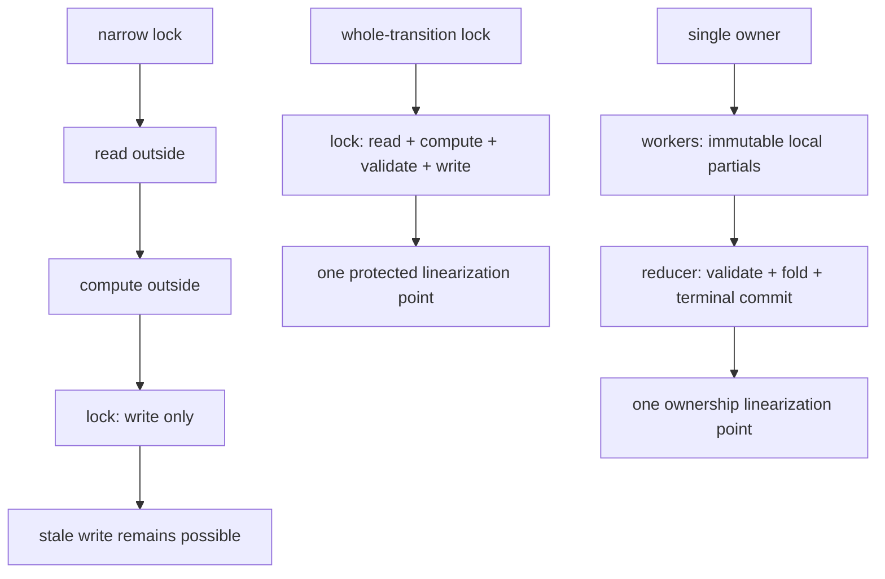

**Caption — D6.** Lock scope must cover the state on which the application
transition depends. Single ownership removes shared worker mutation entirely.

**Text equivalent.** The narrow design leaves read and compute outside a lock,
so a stale value can later be assigned. A whole-transition lock protects read,
compute, validation, and write. The project instead makes workers return
immutable partials to one reducer, which alone performs validation, fold, and
terminal commit.

### `Lock`, `RLock`, and context management

**[PYTHON 3.14 CONTRACT]**

- primitive lock acquire/release methods are atomic at their API boundary;
- when several threads are blocked on a primitive lock, which one proceeds is
  not defined;
- a lock supports context management, so `with lock:` releases on normal and
  exceptional exit;
- `RLock` permits the owning thread to acquire recursively and requires matched
  releases.

None of those facts chooses the correct critical-section scope. Reentrancy
solves a narrow recursive-ownership problem; it does not repair two workers
reading stale state or two locks acquired in a cycle.

#### D7 — Lock ownership and its stopping lines

```mermaid
    %% atlas-diagram-id: m19-lock-ownership-states
    %% atlas-diagram-title: Lock ownership states and stopping lines
    %% atlas-diagram-alt: A or B may acquire an unlocked mutual-exclusion lock while the other waits. Release, including exceptional context-manager exit, allows the implementation to select a waiter; the state machine offers no FIFO, fairness, scope-correctness, or deadlock guarantee.
    stateDiagram-v2
    [*] --> Unlocked
    Unlocked --> OwnedByA: A acquire succeeds
    Unlocked --> OwnedByB: B acquire succeeds
    OwnedByA --> BWaiting: B requests
    BWaiting --> OwnedByB: A releases; B selected
    OwnedByB --> AWaiting: A requests
    AWaiting --> OwnedByA: B releases; A selected
    OwnedByA --> Unlocked: A releases / exception exits with
    OwnedByB --> Unlocked: B releases / exception exits with
    note right of Unlocked
      waiter selection is undefined,
      not promised FIFO or fair
    end note
```

**Caption — D7.** Mutual exclusion defines ownership states and release paths;
it does not define FIFO waiter selection, fairness, correct scope, or
deadlock-freedom.

**Text equivalent.** From unlocked, either A or B may acquire. The other waits
until the owner releases, including through a context manager’s exception
path. The implementation selects a waiter under its contract; this model does
not promise a fair or FIFO choice.

### Linearization

For each public operation, write:

```text
Invocation:
Sequential precondition:
Sequential postcondition:
Protected or owner-held state:
Candidate linearization event:
Why event lies between invocation and response:
Why resulting transition is legal:
One liveness fact not established:
```

In the reducer design, the logical point is:

```text
COMMIT_STARTED(partition)
→ validate exact partial
→ incorporate it into owner-held fold
→ change the same ledger entry to COMMITTED
```

The source may need several statements. We treat them as one logical owner-held
transition because no other component may observe or mutate the intermediate
state.

### Code-reading lab L2 — Locked, but still lost

Review two unfamiliar patches:

| Review question | Narrow patch | Whole-transition patch | Owner reducer |
|---|---|---|---|
| can two workers read the same old state? | yes | no while lock protocol is obeyed | workers never read reducer state |
| what does the lock protect? | assignment syntax | named invariant transition | library coordination only |
| exception-safe release? | inspect | inspect | reducer has no worker-held lock |
| callback or Future wait while held? | reject if present | reject if present | reject in reducer adapter |
| clear linearization point? | no defensible point for compound op | protected write/commit | owner commit |
| fairness proved? | no | no | no |
| preferred Atlas production shape? | no | comparison only | yes |

Force the D4 schedule against the narrow model. Then run the correct pure lock
model:

```powershell
& ".\python-3.14.6-embed\python.exe" ".\module19_reference.py" --model locked --json
```

Expected bounded result:

```text
complete locked schedules: 2
final value counts: {2: 2}
violating schedules: none
linearization event in the teaching model: each protected WRITE
```

This result covers the declared model, not every lock-using production
program.

### Bounded agent task and review

Delegate only this behavior:

> Move validation and ledger/fold commit under one declared ownership or
> synchronization boundary. Do not change normalization, result schema,
> canonical fold, executor, publication, or prose outside the protected-state
> contract.

Review separately:

| Dimension | Accept when | Reject when |
|---|---|---|
| behavior | every modeled history refines the sequential spec | stale snapshots remain |
| exception safety | release/owner state survives all exits | exceptional path strands ownership |
| progress | no callback, external call, queue put, or Future wait occurs while held | dependency can require the same held resource |
| tests | deterministic counterexample fails before and passes after | only a stress loop was added |
| architecture | inward core stays executor-free | lock/executor leaks into pure index function |
| prose | claim is model- and contract-scoped | “the lock makes it thread-safe” |

### Session 2 synthesis

Explain aloud:

```text
operation:
protected state:
critical section:
linearization point:
safety invariant:
exception path:
fairness assumption or unknown:
liveness property still unproved:
why owner-reducer is simpler:
```

---

## 4. Session 3 — Predicates, permits, and item ownership

### Pressure

Mutual exclusion answers:

> Who may change this protected state now?

It does not answer:

> When is the required state true?

It does not answer:

> How many users may enter?

It does not answer:

> Which worker owns this item, and has its work been accounted?

Conditions, semaphores, and queues solve different problems. Using the names
interchangeably makes the state machine disappear.

### 4.1 Condition variables: wait for a predicate

A consumer may proceed only when `items` is nonempty. Testing once is unsafe:

```python
with condition:
    if not items:
        condition.wait()
    item = items.pop()
```

Another consumer may take the item after notification but before this consumer
reacquires the lock. The correct shape is:

```python
with condition:
    while not items:
        condition.wait()
    item = items.pop()
```

or:

```python
with condition:
    condition.wait_for(lambda: bool(items))
    item = items.pop()
```

**[PYTHON 3.14 CONTRACT]** `wait()` releases the associated lock, blocks, then
reacquires the lock before returning. `notify()` wakes waiters but does not
release the lock, reserve an item, or store application state. The predicate is
the durable fact and must be rechecked.

#### D8 — Release, wake, reacquire, recheck

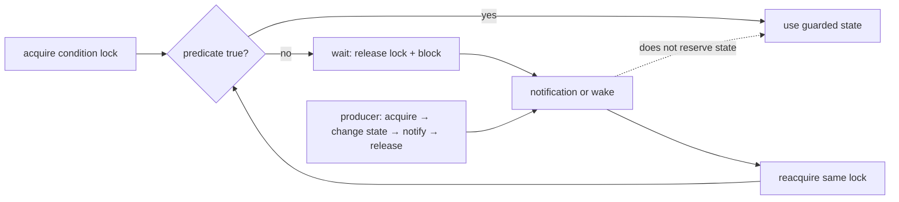

**Caption — D8.** A wakeup returns the waiter to the predicate check after
reacquiring the lock; notification is not the state being awaited.

**Text equivalent.** The consumer acquires the condition’s lock and checks the
predicate. If false, `wait` releases the lock and blocks. A producer changes
the guarded state while holding the lock, notifies, then releases. The consumer
wakes, reacquires, and checks again. It uses the state only when the predicate
is true.

Run the pure condition model:

```powershell
& ".\python-3.14.6-embed\python.exe" ".\module19_reference.py" --model condition --json
```

The observations `(False, False, True)` model an initial false predicate, a
wake after which it remains false, and a later true state. The `if-once`
strategy enters incorrectly after one wake; the `while` strategy waits twice
and preserves the invariant.

### 4.2 Semaphores: account for permits

A semaphore begins with a nonnegative permit count. Acquire consumes a permit
or waits. Release returns a permit. It models finite capacity, such as “at most
four expensive parsers may run.”

```text
0 ≤ available_permits ≤ capacity
active_holders = capacity - available_permits
```

A semaphore does not contain a partition, identify which result belongs to
which input, or protect an arbitrary compound mapping update. A
`BoundedSemaphore` helps detect release beyond the initial capacity; it does
not prove each permit guarded the intended resource or that admission is fair.

#### D9 — Permit accounting is not item transfer


**Caption — D9.** The counter limits simultaneous holders. It does not carry
work items, choose a fair waiter, or identify completion.

**Text equivalent.** With two permits, A and B can acquire and C must wait. A
release makes one permit available so C can acquire. Each normal and
exceptional path must balance acquire and release. A bounded semaphore can
report an extra release beyond its initial capacity.

### 4.3 Queues: transfer item ownership and account unfinished work

`queue.Queue(maxsize=n)` is a synchronized local item-transfer abstraction.
`maxsize` bounds queued item count at that boundary. It does not bound running
work, completed-but-unreduced results, every byte of memory, or an end-to-end
distributed system.

One successful `put(item)` increments unfinished-task accounting. One
successful `get()` transfers the item to a consumer but does not decrement that
count. Exactly one correctly placed `task_done()` acknowledges that retrieved
queue task. Under normal semantics, `join()` waits until that accounting count
reaches zero.

That is still not Atlas semantic completion:

```text
queue empty
≠ no work in flight
≠ unfinished count zero
≠ every Future observed
≠ every partition terminal
≠ every required partition COMMITTED
≠ REDUCTION_COMPLETE
≠ PUBLISHED
```

#### D10 — Six independent progress surfaces

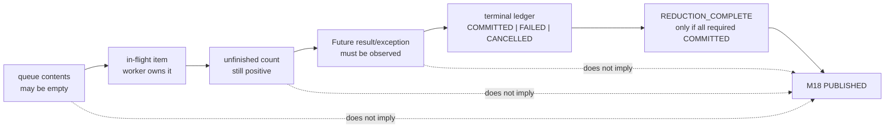

**Caption — D10.** Removing the last queued item can make the queue empty while
the item is in flight, unfinished, not terminal, unreduced, and unpublished.

**Text equivalent.** The state sequence has distinct surfaces: queue contents,
worker-owned in-flight work, unfinished-task count, Future observation,
terminal ledger, reduction gate, and Module 18 publication. No earlier surface
alone establishes a later one.

#### D11 — One terminal classification per admitted partition

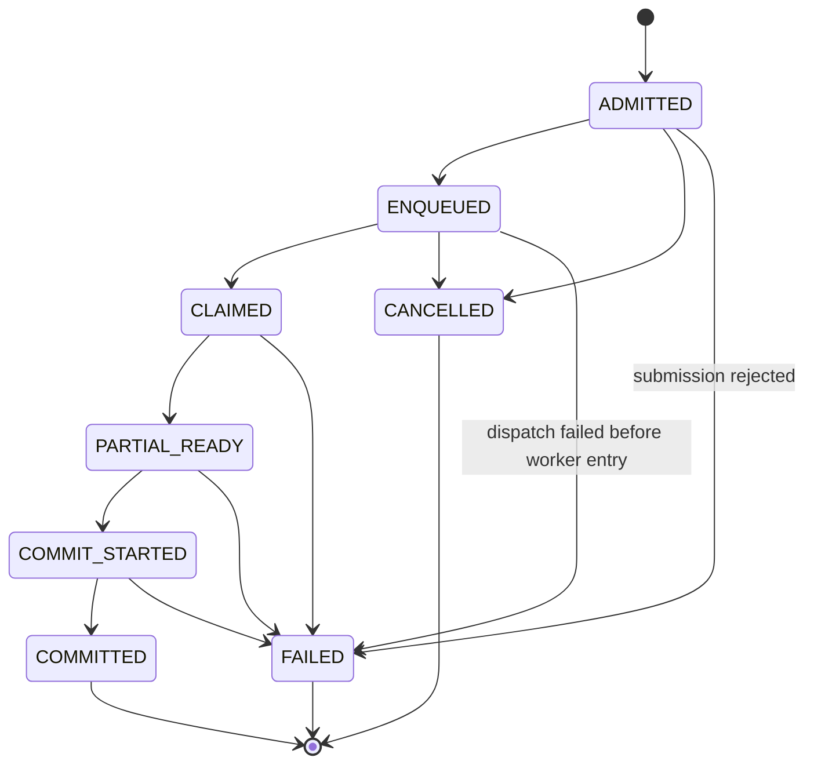

**Caption — D11.** `COMMITTED`, `FAILED`, and `CANCELLED` are terminal,
pairwise exclusive classifications. Worker success precedes reducer commit.

**Text equivalent.** Work begins admitted, is normally enqueued and claimed,
then may produce a partial, begin commit, and commit. Coordinator policy may
classify an admitted item `CANCELLED` before submission; executor submission
rejection may classify it `FAILED`. Enqueued work may be cancelled before it
runs. An exceptional Future without the valid worker-entry envelope follows
`ENQUEUED → FAILED` with dispatch evidence and never invents `CLAIMED`. A valid
envelope proves worker entry; it may carry either a partial or hashed worker
failure evidence. Claimed or later preterminal work may therefore fail. There
are no outgoing edges from the three terminal states, and no committed work can
later become cancelled.

### 4.4 Graceful and immediate shutdown

Python 3.14 queue shutdown is version-scoped:

- graceful shutdown stops growth, wakes blocked producers, and permits normal
  draining;
- immediate shutdown drains and may unblock `join()` without completed work,
  deliberately violating the normal join invariant.

Therefore immediate shutdown is a negative reasoning case, not proof that
items completed. The Atlas ledger must still classify every admitted
partition. This local bounded queue model is not Module 21’s structured async
cancellation or end-to-end backpressure.

### Code-reading lab L3 — Empty is not complete

Trace this event prefix:

```text
PUT(doc-a)
GET(doc-a)
queue is now empty
worker still computing
```

Complete this table before reveal:

| Surface | Predicted state | Evidence |
|---|---|---|
| queue contents |  |  |
| in-flight ownership |  |  |
| unfinished count |  |  |
| Future state |  |  |
| partition ledger |  |  |
| reduction gate |  |  |
| publication state |  |  |
| confidence 1–4 |  |  |

Now inspect four defects:

1. missing `task_done()` leaves `join()` blocked;
2. early `task_done()` closes queue accounting before the worker/reducer
   transition it was supposed to acknowledge;
3. duplicate `task_done()` is an over-accounting error;
4. `if` around a condition wait permits an invalid action after wake.

Run the deterministic queue model:

```powershell
& ".\python-3.14.6-embed\python.exe" ".\module19_reference.py" --model queue --json
```

Then read `simulate_bounded_queue_protocol` in the reference. Recover:

- which set owns admitted items;
- which list represents queued items;
- which set represents claimed-but-unacknowledged items;
- where unfinished count changes;
- why a blocked action records a predicate instead of sleeping;
- which invalid transitions raise `QueueProtocolError`.

### Primitive decision table

| Need | Primitive/design | Core invariant | Does not provide |
|---|---|---|---|
| exclude concurrent state mutation | `Lock` or single owner | at most one authorized transition | correct scope, fairness, progress |
| wait until guarded state is true | `Condition` + predicate loop | state tested under associated lock | reserved item, stored notification |
| limit simultaneous resource use | `Semaphore` | balanced permits within capacity | item identity, arbitrary state safety |
| transfer work | `Queue` | item ownership and documented accounting | semantic commit, publication |
| announce cooperative stop | `Event` or typed control item | request is visible through protocol | forced thread termination |

### Bounded agent task

Delegate only typed queue-accounting instrumentation. Require cases for:

- full queue;
- empty but in flight;
- predicate false after wake;
- worker exception;
- graceful stop;
- immediate-shutdown negative case;
- missing, early, and duplicate acknowledgement.

Reject sleeps, `qsize()` authorization, daemon lifecycle, and any statement
that queue `join()` means the index was published.

### Session 3 synthesis

For each primitive, state the one question it answers and one guarantee it does
not provide. Then reconstruct D10 without notes and explain which evidence
opens the Atlas publication gate.

---

## 5. Session 4 — Progress can fail

### Pressure

A synchronization design may make every reached state safe while preventing
the desired result forever.

Consider:

```text
worker A holds ledger_lock and requests index_lock
worker B holds index_lock and requests ledger_lock
```

No one corrupts the ledger or index. Neither worker can reach its next legal
transition. A timeout may reveal delay; the resource dependencies explain the
mechanism.

### 5.1 Build the wait-for model

Use two kinds of directed edges:

```text
worker → resource it is requesting
resource → worker currently holding it
```

For the small single-instance lock model, a directed cycle is a deadlock
witness when:

1. each resource is mutually exclusive;
2. a participant holds one while waiting for another;
3. resources are not forcibly preempted;
4. the dependency cycle persists under the modeled actions.

These are the classic Coffman conditions within the declared model. A cycle is
not a universal deadlock theorem for arbitrary multi-instance, revocable, or
capacity-valued resource systems.

#### D12 — Wait-for cycle and architectural repair

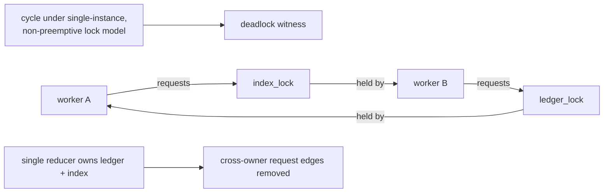

**Caption — D12.** The four-edge cycle is a deadlock witness under the stated
single-instance lock assumptions. A single reducer removes the cross-owner
dependency.

**Text equivalent.** A requests the index lock held by B. B requests the
ledger lock held by A. Following request and holder edges returns to A. Because
the locks are single-instance and not forcibly preempted, neither worker can
advance. Giving one reducer ownership of both ledger and index removes the two
worker-to-lock dependencies.

Run the pure cycle detector:

```powershell
& ".\python-3.14.6-embed\python.exe" ".\module19_reference.py" --model deadlock --json
```

It should return:

```text
order edges:
    catalog → snapshot
    snapshot → catalog
cycle:
    catalog → snapshot → catalog
deadlock possible in declared model: true
```

The function `analyze_lock_orders` does not create threads or hang. It turns
nested acquisition sequences into a directed graph, then returns one cycle
witness if found.

### 5.2 Prevent circular wait with a global order

If every component acquires:

```text
ledger_lock < index_lock < publication_lock
```

then all acquisition edges point forward in one directed acyclic graph. No
cycle can be constructed from those edges.

#### D13 — Lock order as a topological constraint

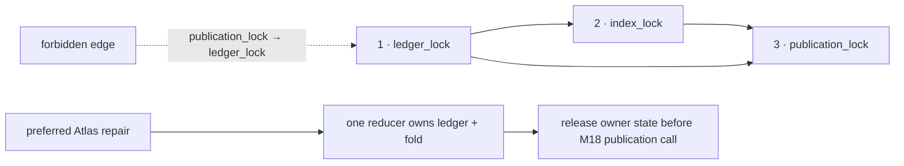

**Caption — D13.** A lock-order comment is useful only when every nested
acquisition satisfies the same acyclic relation. Ownership can remove the
multi-lock relation.

**Text equivalent.** Legal nested acquisitions move from ledger to index to
publication. Any reverse edge would violate the order. Atlas avoids the
ledger/index pair by giving both to one reducer and completes that owner
transition before calling the separate M18 publisher.

The project’s preferred repair is architectural:

- one reducer owns both terminal ledger and fold;
- workers never acquire reducer locks;
- no worker waits for another Future from the same executor;
- no callback, external call, blocking queue `put`, or Future wait occurs while
  a comparison-design commit lock is held;
- publication begins only after the reducer transition and with no reducer
  lock held.

### 5.3 Deadlock, starvation, livelock, delay, and failure

| Trace | Strongest classification | Missing evidence |
|---|---|---|
| persistent cycle in declared non-preemptive single-instance wait-for graph | deadlock in that model | host cause outside the model |
| one waiter repeatedly loses an unspecified contest while others progress | possible starvation | fairness/scheduler history sufficient to establish indefinite postponement |
| workers repeatedly release, back off, collide, and retry without useful state change | livelock | whether retry policy eventually breaks symmetry |
| no event for five seconds | bounded non-completion observation | cause and permanence |
| one Future holds an exception never retrieved by coordinator | worker failure plus evidence/accounting bug | other workers’ progress |
| queue `join()` remains blocked with unfinished count one | missing acknowledgement or in-flight work hypothesis | which item/owner caused it |

“The program is active” does not prove useful progress. “The program is quiet”
does not prove deadlock.

### 5.4 Executor dependency deadlock

A one-worker thread pool executes task A. Task A submits task B to the same pool
and waits for B’s Future. B needs the only worker slot held by A:

```text
A holds executor slot
A waits for B Future
B Future waits for executor slot
```

Adding a second worker may hide this specimen while leaving the dependency
pattern capable of failing at another bound. The repair is to restructure the
dependency: perform orchestration outside the worker pool, submit independent
leaf tasks, or use a design whose capacity proof covers nested work.

### 5.5 Diagnose a hang without creating an uncontrolled hang

Use this evidence sequence:

1. record that an operation exceeded a bounded wait; call it a symptom;
2. capture thread stacks with `faulthandler` or
   `sys._current_frames()` in a controlled disposable specimen;
3. name each blocking call and resource;
4. construct a wait-for graph;
5. take a second observation;
6. reproduce the dependency with pure graph/state transitions;
7. repair ownership/order;
8. add a deterministic regression.

A stack snapshot is evidence at one moment. A timeout stops the caller’s wait,
not necessarily the underlying work. Neither alone proves permanent deadlock.

### Code-reading lab L4 — Safe state, no result

Review this dependency table:

| Participant | Holds | Requests | Can release without request succeeding? |
|---|---|---|---|
| A | `ledger_lock` | `index_lock` | no |
| B | `index_lock` | `ledger_lock` | no |
| watchdog | none | new event | yes, but cannot change A/B ownership |

Tasks:

1. draw the wait-for graph;
2. state the resource-model assumptions;
3. identify the cycle;
4. compare global order, release-before-wait, single owner, and “add workers”;
5. explain which Coffman condition each real repair breaks;
6. reject a live sleep-based hang as the regression mechanism;
7. write the smallest graph test that distinguishes the cause.

Then inspect `analyze_lock_orders`:

- where are all pairwise order edges produced?
- why does a repeated primitive in one acquisition list fail validation?
- how does depth-first search return a concrete cycle path?
- what makes the acyclic test stronger than a timeout?
- what does it still not prove about dynamically chosen resources?

### Bounded agent task

Ask an agent for:

```text
input: immutable worker → ordered lock-name sequences
output: sorted edges, one cycle witness, global-order verdict
constraints: no live threads, sleeps, locks, process creation, or host changes
```

Review graph semantics before code style. A green test that asserts only
`deadlock_possible == expected` is weaker than a test that also verifies the
exact edges and cycle witness.

### Session 4 synthesis

Classify four new traces. For each, provide:

```text
observed symptom:
declared resource/progress model:
strongest supported classification:
safety status:
liveness assumptions:
counterexample or witness:
repair and condition broken:
remaining unknown:
```

---

## 6. Session 5 — Choose the Python execution model from first principles

### Pressure

Correct synchronization does not decide whether sequential execution, threads,
processes, or isolated interpreters fit the workload. A common Executor API
does not create a common memory, isolation, serialization, failure, or
parallelism contract.

Start with five questions:

1. Is overlap required at all?
2. What work dominates: blocking wait, pure-Python CPU, documented
   GIL-releasing native work, or mixed work?
3. Which state must be shared, transferred, or isolated?
4. What arguments and results cross the execution boundary?
5. Which runtime/build/GIL facts and reversal measurements are available?

Only then compare mechanisms.

### 6.1 Futures are observations of submitted calls

A `concurrent.futures.Future` is a handle to one submitted callable. It is not
the worker, partition ledger, reducer commit, or publication record.

#### D14 — Future state and Atlas state are separate machines

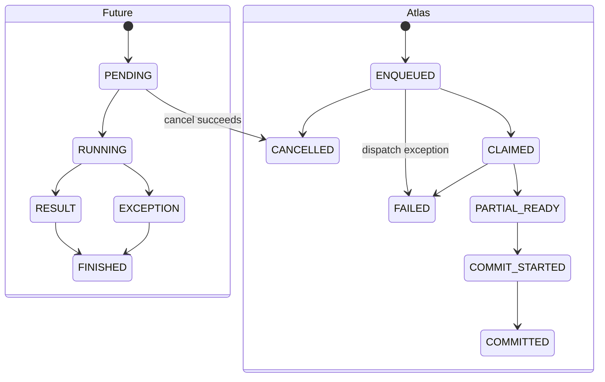

**Caption — D14.** Future cancellation can classify pending work, but a Future
result merely supplies a candidate partial. The reducer performs the separate
Atlas commit.

**Text equivalent.** A Future moves from pending to running, then result or
exception, or from pending to cancelled if cancellation succeeds. Atlas work
moves from enqueued to claimed, partial ready, commit started, and committed,
with failure/cancellation branches. Only a valid `WorkerOutcome` entry envelope
maps enqueued work to `CLAIMED`; an exceptional Future without that envelope
maps `ENQUEUED → FAILED` with `DISPATCH` evidence. A successful envelope with a
partial can then map to `PARTIAL_READY`, not `COMMITTED`; an envelope with
hashed error evidence maps `CLAIMED → FAILED` with phase `WORKER`.

**[PYTHON 3.14 CONTRACT]**

- `Future.cancel()` succeeds only before the call is running or finished;
- cancellation of pending work does not forcibly stop running work;
- `Future.result(timeout=...)` bounds the caller’s wait, not the computation;
- executor shutdown with pending-cancellation policy leaves running work to
  complete under its contract;
- exceptions must be retrieved and preserved.

**[ATLAS POLICY]** Future state alone cannot prove that the submitted callable
began. The reference callable returns a picklable `WorkerOutcome` from inside
its entry boundary. The coordinator records `CLAIMED` only after validating
that envelope. A pre-entry/dispatch exception has phase `DISPATCH` and no
invented claim; a returned failure envelope has phase `WORKER` and retains the
worker-produced error type and privacy-safe message digest.

Use this stop taxonomy:

| Action | Meaning | Running work | Cleanup confidence |
|---|---|---|---|
| wait timeout | caller resumes after bound | may continue | normal path remains |
| pending Future cancellation | prevent not-yet-running call | not applicable to successful case | normal accounting still needed |
| cooperative request | worker observes an Event/token and returns | may continue until observed | designed cleanup possible |
| graceful drain | stop admission and finish accepted work | continues under policy | normal paths preserved |
| hard process termination | forcibly stop owned process | stops abruptly | locks, pipes, queue data, and invariants may be damaged |

### 6.2 Threads, processes, and isolated interpreters

#### D15 — One interface over different execution boundaries

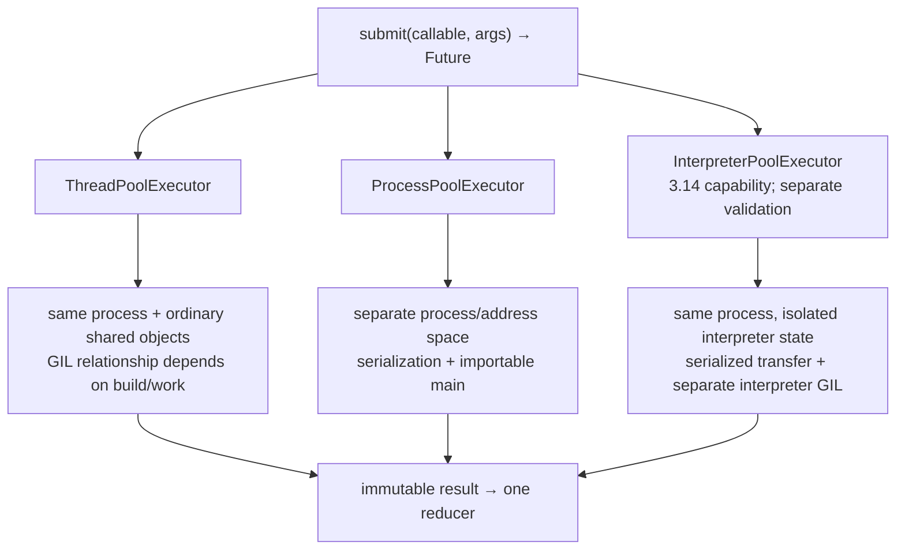

**Caption — D15.** The common Future surface hides materially different
sharing, isolation, transfer, startup, and failure boundaries.

**Text equivalent.** Thread, process, and interpreter executors share a
submit/Future style only when the relevant adapter exists. Threads share
ordinary process objects. Processes use separate address spaces and explicit
serialization/IPC. Isolated interpreters remain in one process but have
separate runtime state and transfer constraints; API availability does not mean
the Atlas adapter was validated. Every accepted adapter returns immutable
results to the same single reducer.

| Dimension | Thread pool | Process pool | Interpreter pool |
|---|---|---|---|
| ordinary Python object sharing | same process/interpreter objects reachable by threads | child mutations do not automatically change parent objects | interpreter state is isolated; explicit transfer required |
| pure-Python CPU parallelism on current standard GIL build | not a default assumption | multicore candidate | multicore candidate when capability/compatibility verified |
| blocking waits | useful overlap candidate | possible, often higher boundary cost | possible, validate need |
| callable/value transfer | normal references in process | pickling/IPC; top-level/importable design | serialization/transfer constraints |
| startup/lifecycle | thread workers | OS processes and start context | interpreter workers inside one process |
| failure blast radius | shared process | stronger process isolation, not a security sandbox | isolated interpreter state, still process-global resources |
| cancellation | pending Future window; cooperative running stop | pending Future plus process escalation hazards | pending Future; capability-specific lifecycle |
| key portability review | thread-safe dependencies | picklability, importable `__main__`, main guard, start method | Python 3.14 availability and dependency support |

Python 3.14 multiprocessing defaults are platform/version scoped. Windows and
macOS use `spawn`; POSIX defaults to `forkserver`; `fork` is not the default
anywhere in Python 3.14. Code whose behavior matters should choose/accept a
context deliberately and must not rely on unreviewed fork inheritance.

An interpreter is not a sandbox. Interpreters share one OS process and can
still interact through process-global file descriptors, environment, native
libraries, and other resources.

### 6.3 The GIL without folklore

The correct question is not “Does Python have a GIL?” It is:

```text
Which Python implementation?
Which version?
Which build capability?
What is the live GIL state?
Which extensions are loaded?
Which workload?
Which observation?
```

#### D16 — Build capability, live state, and application protocol

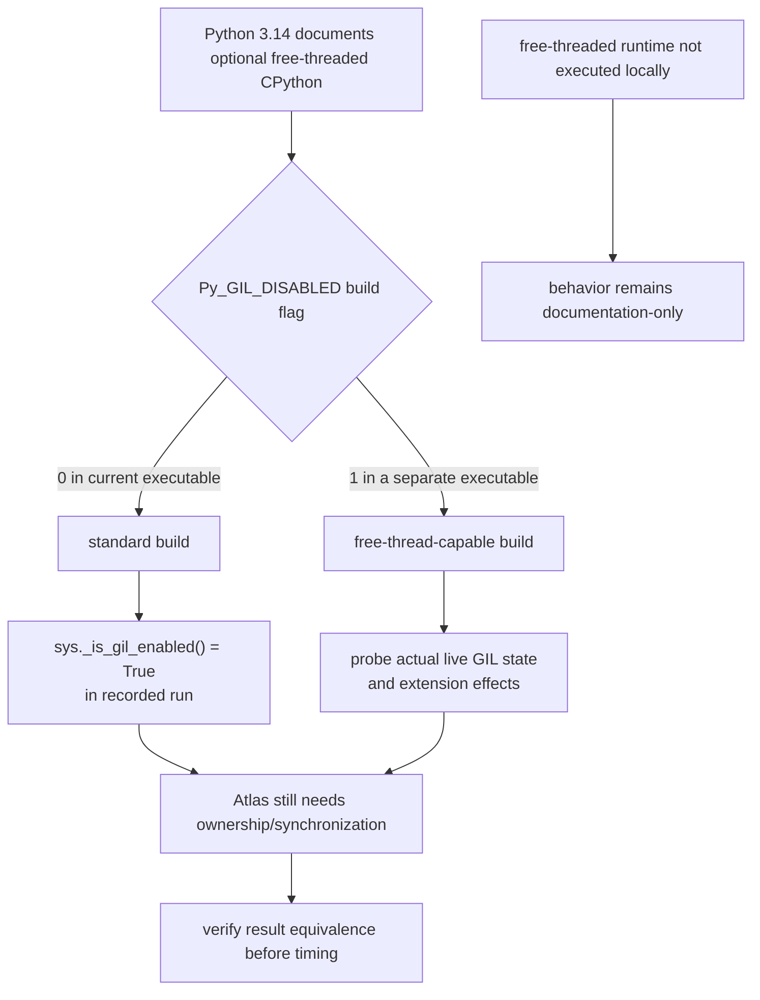

**Caption — D16.** Python version does not determine build capability, and
build capability does not determine live state. No GIL state proves an Atlas
compound invariant.

**Text equivalent.** Documentation says Python 3.14 supports an optional
free-threaded CPython build. The current executable reports build flag zero and
live GIL enabled. A separate free-thread-capable executable would still need a
live-state probe and extension audit. Both paths require explicit Atlas
ownership/synchronization and result equivalence before performance analysis.
No free-threaded runtime was executed for this module.

Safe claims:

- conventional GIL-enabled CPython constrains threads executing Python
  bytecode/C-API work, with documented release/switch boundaries;
- blocking I/O and some native code may release the GIL;
- native CPU work without documented GIL release must not be routed to threads
  on the assumption that “native” automatically means parallel;
- Python 3.14 supports an optional free-threaded build under PEP 779 Phase II,
  but it is not the default;
- a free-threaded build may have the GIL enabled at runtime, including due to
  extension compatibility;
- current free-threaded CPython protects some built-ins internally, but that
  implementation behavior is not the Atlas multi-object protocol;
- both builds require explicit application ownership/synchronization.

Forbidden inferences:

```text
GIL enabled → compound operation atomic
GIL disabled → synchronization unnecessary
dict internal lock → ledger + fold invariant protected
Python 3.14 → current executable is free-threaded
24 reported CPUs → 24 workers ran simultaneously
observed speedup → GIL was the cause
```

Implementation details of bytecode dispatch, object locks, reference counts,
garbage collection, allocators, and profiling belong to Module 24.

### 6.4 Work, span, and bounded speedup reasoning

Correctness comes first. Then use:

```text
work W = total operations across all tasks
span S = longest dependency path
maximum inherent parallelism = W / S
work/span worker ceiling = min(N, W / S)
```

For serial fraction `s` and `N` ideal workers:

```text
Amdahl ceiling = 1 / (s + (1 - s) / N)
```

The reference’s bounded example has `W=120`, `S=30`, `N=4`, `s=0.25`:

```text
inherent parallelism = 4
work/span ceiling = 4
Amdahl ceiling = 16/7 ≈ 2.286
combined ceiling = 16/7
lower bound = 30 abstract time units
```

Run:

```powershell
& ".\python-3.14.6-embed\python.exe" ".\module19_reference.py" --model budget --json
```

These are analytic ceilings for declared numbers, not measured speedups.
Observed elapsed time also contains startup, serialization, queueing,
contention, imbalance, merge, publication, system load, and measurement noise.
Attribution waits for Module 24.

### 6.5 Workload-first decision

#### D17 — Refuse a model until meaning and ownership are known

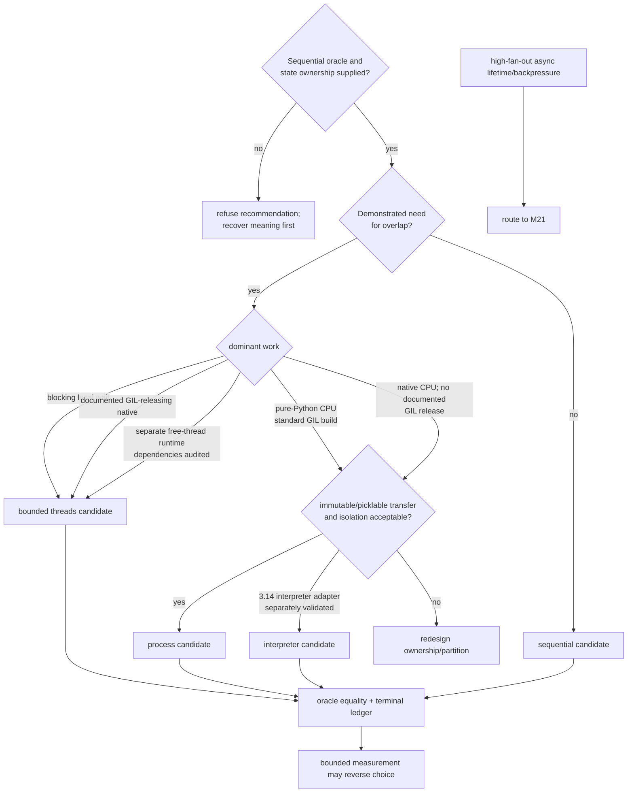

**Caption — D17.** Model choice follows semantics, workload, state, transfer,
isolation, and actual runtime facts. Measurement can reverse a candidate only
after equivalent results are established.

**Text equivalent.** Without a sequential oracle and ownership map, the chooser
refuses a recommendation. If overlap is unnecessary, stay sequential.
Blocking waits or documented GIL-releasing native work suggest bounded
threads. Pure-Python CPU work—and native CPU work without documented GIL
release—on the current GIL-enabled build suggests processes, or isolated
interpreters only when support is verified and transfer fits. Unclear mutable
sharing triggers redesign. All candidates must match the oracle and ledger
before timing. Async lifetime and end-to-end backpressure are deferred to
Module 21.

Fill this record before selecting:

| Question | Evidence | Decision consequence |
|---|---|---|
| Is overlap needed? | concrete latency/throughput requirement | sequential remains a valid candidate |
| What dominates? | waiting, Python CPU, native CPU plus documented GIL-release status, mixed | narrows model set |
| What state crosses? | immutable input/result, mutable shared graph, resource handles | exposes ownership/serialization constraints |
| What isolation is needed? | failure/resource containment, not security folklore | may favor process/interpreter |
| What lifetime/stop semantics? | pending/running/cooperative/force requirements | exposes executor and M21 boundaries |
| Which runtime/build? | implementation, version, platform, build flag, live GIL probe | prevents version-to-build inference |
| Are dependencies compatible? | official docs and separate tests | may disqualify free-thread/interpreter candidate |
| What proves equivalence? | canonical bytes/digest and terminal ledger | mandatory before timing |
| What could reverse choice? | repetitions, sizes, startup/transfer separation, uncertainty | makes decision falsifiable |

### Code-reading lab L5 — Same API, different machine contract

Read, in order:

1. pure `index_document`;
2. `_index_document_task`;
3. `run_indexer` validation;
4. executor selection;
5. submission and Future mapping;
6. result/exception/cancellation accounting;
7. identity-sorted reducer commit;
8. publication candidate gate;
9. runtime profile;
10. tests for thread/process equivalence.

Answer:

- Where does each callable execute?
- Which values must serialize in the process path?
- Why is `_index_document_task` top-level?
- Why must the script/module entry be guarded?
- Can a child’s mutation of an ordinary dictionary change the parent’s object?
- When does Future cancellation succeed?
- Where is the exception retrieved?
- Why does `observed_completion_order` differ from `commit_order`?
- Which state change opens `publication_allowed`?
- Which runtime fact could change the initial candidate?

### Bounded agent task

Delegate one adapter only after approving the model record. Preserve:

- pure worker function;
- immutable inputs and outputs;
- terminal transition vocabulary;
- deterministic fold bytes;
- one reducer;
- one M18 publisher;
- runtime profile and evidence schema.

Forbid changing domain semantics to make an adapter convenient. Require a
reversal plan that can remove the adapter without changing the core.

### Session 5 synthesis

Defend one model for each:

1. many local blocking reads with modest shared state;
2. independent pure-Python CPU partitions on the recorded standard GIL build;
3. native work whose official documentation says it releases the GIL;
4. native CPU work whose documentation does not establish GIL release.

For each, state one fact or measurement that could reverse the decision.

---

## 7. Session 6 — Atlas multi-worker evidence defense

### Pressure

Every earlier patch looked plausible in isolation. Reliability comes from
composition:

```text
sequential meaning
+ immutable partition/result boundary
+ exact terminal ledger
+ one reducer
+ stated progress assumptions
+ model-fit runtime evidence
+ one M18 publisher
```

### 7.1 Recover the architecture before running it

#### D18 — Atlas owner-reducer architecture

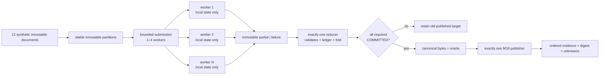

**Caption — D18.** Workers own only local computation. One reducer owns terminal
classification and fold. One publisher owns durable target transition.

**Text equivalent.** Twelve synthetic documents become stable immutable
partitions and enter a bounded one-to-four-worker adapter. Workers return
immutable partials or failures. Exactly one reducer validates, updates the
ledger, and folds. If any required partition is not committed, the old target
stays. Otherwise canonical bytes matching the oracle go to exactly one Module
18 publisher. Ordered evidence records the result and unknowns.

### 7.2 Read the runnable reference as an evidence instrument

The downloadable reference is intentionally one file so architecture recovery
is a reading exercise. Its dependency direction still matters:

```text
immutable dataclasses and validation
        ↑
pure index/fold and finite models
        ↑
ledger and coordinator policy
        ↑
executor adapter and CLI
        ↑
behavioral tests and evidence
```

Download:

- [Module 19 runnable reference](/downloads/module19_reference.py)
- [Module 19 behavioral tests](/downloads/test_module19_reference.py)

The source versions also live in `work/module19_reference.py` and
`work/test_module19_reference.py` in the course workspace.

Important public seams:

| Seam | Question it answers |
|---|---|
| `explore_two_increment_schedules` | what happens in all 20 declared R/C/W schedules? |
| `explore_narrow_locked_increment_schedules` | why does a write-only lock retain a counterexample? |
| `explore_locked_increment_schedules` | does whole-transition mutual exclusion preserve the model invariant? |
| `analyze_lock_orders` | which declared acquisition-order cycle exists? |
| `analyze_executor_waits` | does a Future-wait cycle or saturated-slot dependency exist in the finite model? |
| `WorkLedger` / `advance_work` | is every transition legal, immutable, and replay-consistent rather than forgeable? |
| `terminal_ledger_report` | does every admitted item have one terminal classification? |
| `Partition` / `PartialIndex` | are immutable inputs/results bound by canonical input and partial digests? |
| `index_partition` | can one worker produce unique sorted postings without shared mutable state? |
| `WorkerOutcome` | did the callable entry boundary actually run, and did it return a partial or hashed worker failure? |
| `IndexSnapshot` | do declared fields, exact canonical bytes, and SHA-256 describe the same snapshot? |
| `sequential_index_oracle` | what does the independent no-worker semantic authority produce? |
| `fold_contributions` | do partials exactly match declared partitions/digests and produce literal canonical postings? |
| `run_indexer` | do thread/process adapters preserve transitions, Future evidence, independent-oracle match, and publication gates? |
| `simulate_bounded_queue_protocol` | how do queued, claimed, acknowledged, and unfinished states differ? |
| `simulate_semaphore_protocol` | do permits balance without inventing item ownership? |
| `evaluate_condition_wait` | why does one check fail after a false wake? |
| `choose_execution_model` | how do workload/runtime facts constrain a candidate? |
| `classify_stop_action` | why are timeout, cancellation, cooperative stop, drain, and force different? |
| `runtime_concurrency_profile` | which executor APIs exist, which adapters the reference implements, and which available types remain unvalidated? |
| `parallelism_budget` | what analytic ceilings follow from declared work/span inputs? |

The reference is a bounded teaching specimen:

- standard library only;
- synthetic in-memory documents;
- 32-document maximum;
- one to four workers;
- the first completion observation timeout is constrained to `(0, 30]`;
- an observation timeout records unfinished IDs and actual cancellation
  attempts, then drains every owned worker; the function may return after that
  observation bound;
- no network, private data, host tuning, signal control, or production paths;
- no sleep-based synchronization;
- pool shutdown waits for owned workers;
- process support uses top-level callables and guarded CLI, and records the
  selected runtime-default start context;
- startup failure occurs before admission; submission failure terminally
  classifies every already admitted partition;
- a Future exception without a valid `WorkerOutcome` follows
  `ENQUEUED → FAILED` with phase `DISPATCH` and never invents `CLAIMED`;
- returned worker failures use the entry envelope and retain phase `WORKER`,
  exception type, and a privacy-safe message digest;
- snapshot construction cross-validates declared fields, exact canonical
  bytes, and SHA-256;
- an available interpreter-pool API is reported as unvalidated until a
  separate adapter run genuinely validates it;
- candidate bytes are returned but the M18 durable publisher is not invoked by
  the specimen.

### 7.3 Run and classify the evidence

Primary validation:

```powershell
Set-Location .\work
& ".\python-3.14.6-embed\python.exe" ".\test_module19_reference.py" -v
& ".\python-3.14.6-embed\python.exe" ".\module19_reference.py" --self-test
```

Compatibility validation:

From the `work` directory in a separately identified CPython 3.12.13
environment:

```powershell
python -m unittest -v test_module19_reference.py
```

**[EMPIRICAL OBSERVATION]** The 2026-07-29 production validation recorded
35/35 passing behavioral tests on the named CPython 3.14.6 runtime and 35/35
on the separately labeled CPython 3.12.13 compatibility runtime; the
3.14.6 `--self-test` path also discovered all 35 tests. Re-run and retain the
actual transcript rather than copying this prior observation as if it were a
new one.

Inspect the literal fold oracle:

```text
canonical bytes:
{"document_ids":["doc-a","doc-b"],"postings":{"gil":["doc-a"],"lock":["doc-a","doc-b"],"queue":["doc-b"]},"schema":"atlas.concurrent-inverted-index.v1"}\n

SHA-256:
74d8a38edbb2c182f54e8967c7e17a209474ae7c589a7964f4b6a52a3ef5266b
```

The exact bytes and digest are stronger than “the dictionaries looked equal”
because ordering, encoding, schema, and newline are part of the oracle.

### Code-reading lab L6 — Integrated patch defense

Review in dependency order:

```text
sequential specification and oracle
→ immutable values and validation
→ legal terminal transitions
→ pure worker
→ transport/executor adapter
→ reducer ownership and linearization
→ failure/cancellation classification
→ candidate publication gate
→ runtime profile
→ evidence serializer
→ deterministic and executable tests
→ claims, limitations, and model-choice memo
```

Challenge:

- hidden shared mutation;
- narrow lock or wait/callback under lock;
- condition checked once;
- semaphore leak or over-release;
- `qsize()`/`empty()` used as authorization or completion;
- missing, early, or duplicate `task_done`;
- Future exception not retrieved or falsely counted as worker entry;
- cancellation presented as forced stop;
- task waiting on same saturated pool;
- child mutation assumed visible in parent;
- unpicklable process task or missing main guard;
- runtime/build/GIL mismatch;
- timing before semantic equality;
- snapshot fields, canonical bytes, and digest disagree;
- bypassed ledger or publication gate.

Return `accept`, `reject`, or `split` separately for semantics, safety,
liveness, tests, portability, model fit, evidence, and prose.

### 7.5 Evidence ladder and forward boundaries

#### D19 — Each rung answers a narrower question

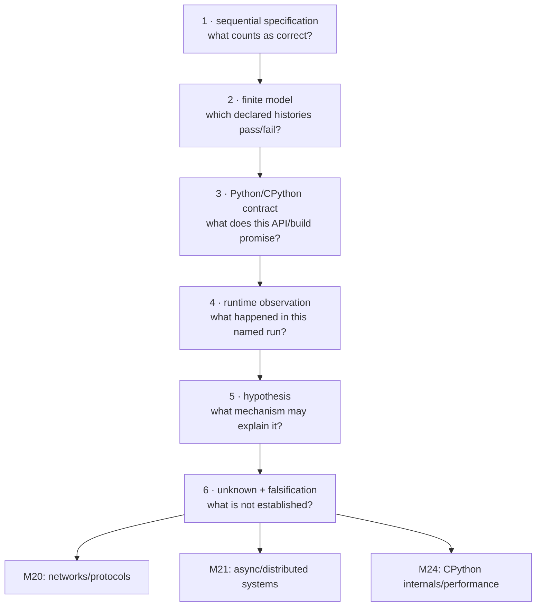

**Caption — D19.** Specification, model, contract, observation, hypothesis, and
unknown form an evidence ladder. Unanswered questions route to the module that
owns the widened boundary.

**Text equivalent.** First define correctness. Then explore a finite declared
model. Then read the Python/CPython contract. Then record a named runtime
observation. A causal explanation remains a hypothesis until discriminating
evidence supports it. Explicit unknowns route network questions to M20,
async/distributed questions to M21, and runtime internals/performance
attribution to M24.

No rung replaces another:

```text
one ordinary run
< repeated scoped runs
< ordered event ledger
< deterministic forced schedule
< oracle/property comparison
< exhaustive bounded model
< invariant argument over a declared transition system
```

Even the strongest row is scoped to its assumptions and abstraction map.

### Session 6 oral defense

Answer the governing question in 300 words:

> How can several local Atlas workers overlap while the final index remains
> equivalent to the sequential specification, every admitted partition is
> accounted for, no progress claim outruns its assumptions, and the chosen
> Python execution model is justified by the workload and evidence?

Then provide:

```text
[SEQUENTIAL SPEC] ...
[SAFETY + LINEARIZATION] ...
[LIVENESS + ASSUMPTIONS] ...
[PYTHON/RUNTIME CONTRACT] ...
[EMPIRICAL OR MODEL-CHECK EVIDENCE] ...
[UNKNOWN + NEXT FALSIFICATION] ...
```

Defend one accepted decision, one rejected patch, and one remaining unknown.

---

## 8. Six-view interactive HTML studio

The HTML studio is the primary learning experience. It uses a woven execution
score: workers occupy horizontal event rails; vertical crossings appear only at
real ownership/synchronization boundaries; the reducer is a strong central
spine; wait-for cycles tighten into a visible knot; terminal classifications
have redundant words, icons, and border patterns.

All six views use the same fixture:

```text
term: graph
old postings: (1,)
partition A contributes document 2
partition B contributes document 3
sequentially expected postings: (1, 2, 3)
```

Every view requires a prediction and confidence `1–4` before reveal. Arrow
keys, Home/End, visible focus, large targets, reduced-motion support, and
complete text/table equivalents make every interaction keyboard- and
screen-reader-accessible. The implementation uses a semantic `tablist`, roving
`tab`, and matching `tabpanel` regions; announces revealed state through a
polite `aria-live` region; offers button/keyboard alternatives to every drag
gesture; conveys no result by color alone; imposes no time limit; and preserves
the full reading order at narrow mobile widths.

No choice or confidence is preselected. Local persistence is SSR-safe and uses
a versioned Module 19 key. It stores only view, predictions, confidence,
attempted histories, misconception labels, model record, and patch decisions.
It tolerates missing, corrupt, and outdated state. A confirmed full reset and a
separate non-destructive view reset are available. It never stores raw private
code, absolute paths, runtime secrets, or production data. Model results and
empirical observations have distinct labels. The invariant and current runtime
profile stay reachable from every view. Coverage is not labeled mastery.

### View 1 — History explorer

Keep this exact invariant visible:

> **Every admitted Atlas partition reaches exactly one terminal
> classification—`COMMITTED`, `FAILED`, or `CANCELLED`. If Atlas publishes a
> new index, that index is the deterministic fold of all and only
> `COMMITTED` partial results, and publication is permitted only when every
> required partition is `COMMITTED`. Every worker-visible effect remains
> accounted for as a process-local operation, an OS-mediated resource
> transition, and one step in a declared concurrent history; each shared
> transition is justified by one named owner or synchronization protocol,
> every progress claim states its blocking and fairness assumptions, and
> neither a clean exit, a passing stress run, the GIL, nor observed speedup
> substitutes for safety, liveness, or model-fit evidence.**

Choose the next enabled A or B `R/C/W` step. Before reveal, record:

- predicted local snapshots;
- predicted shared postings;
- expected oracle relationship;
- safety verdict;
- confidence.

The view preserves each worker’s program order, exposes all 20 schedules,
labels the result serial-equivalent or violating, and displays exact model
scope. It never calls a selected schedule a CPython or OS trace.

Text-mode equivalent:

| Step | Enabled A | Enabled B | A local | B local | Shared | Oracle | Verdict |
|---:|---|---|---|---|---|---|---|
| 0 | `R` | `R` | — | — | `(1,)` | `(1,2,3)` | undecided |
| learner steps | record | record | record | record | record | fixed | reveal after prediction |

Revision prompt: “Which event first made the final oracle unreachable without
compensation, and what did I believe before seeing it?”

### View 2 — Critical section and linearization

Keep this exact invariant visible:

> **Every admitted Atlas partition reaches exactly one terminal
> classification—`COMMITTED`, `FAILED`, or `CANCELLED`. If Atlas publishes a
> new index, that index is the deterministic fold of all and only
> `COMMITTED` partial results, and publication is permitted only when every
> required partition is `COMMITTED`. Every worker-visible effect remains
> accounted for as a process-local operation, an OS-mediated resource
> transition, and one step in a declared concurrent history; each shared
> transition is justified by one named owner or synchronization protocol,
> every progress claim states its blocking and fairness assumptions, and
> neither a clean exit, a passing stress run, the GIL, nor observed speedup
> substitutes for safety, liveness, or model-fit evidence.**

Place acquire/release boundaries around:

```text
read → compute → validate → ledger transition → fold transition
```

Then propose a linearization point and one failing schedule before reveal.
Compare:

- write-only lock;
- whole logical transition;
- sharded locks;
- single-owner reducer.

The view shows protected state, exceptional release, declared lock order, and
the fairness unknown. It keeps “atomic line ≠ atomic application operation”
visible.

Text-mode equivalent:

| Candidate boundary | Stale read possible? | One legal point? | Progress risk | Verdict |
|---|---:|---:|---|---|
| write only | yes | no for compound operation | low-looking but unsafe | reject |
| read through commit | no under protocol | yes | contention/dependency must be reviewed | comparison |
| owner reducer | no worker mutation | yes | reducer consumption/lifecycle assumptions | project choice |

Revision prompt: “Did I protect syntax or the state on which the invariant
depends?”

### View 3 — Coordination console

Keep this exact invariant visible:

> **Every admitted Atlas partition reaches exactly one terminal
> classification—`COMMITTED`, `FAILED`, or `CANCELLED`. If Atlas publishes a
> new index, that index is the deterministic fold of all and only
> `COMMITTED` partial results, and publication is permitted only when every
> required partition is `COMMITTED`. Every worker-visible effect remains
> accounted for as a process-local operation, an OS-mediated resource
> transition, and one step in a declared concurrent history; each shared
> transition is justified by one named owner or synchronization protocol,
> every progress claim states its blocking and fairness assumptions, and
> neither a clean exit, a passing stress run, the GIL, nor observed speedup
> substitutes for safety, liveness, or model-fit evidence.**

Step:

```text
put / get / wait / notify / task_done / join / stop
```

For every action, predict lock owner, predicate, permit count, queue contents,
in-flight items, unfinished count, partition state, and reduction gate. The
console includes:

- `if` versus predicate loop;
- early, missing, and duplicate acknowledgement;
- empty-but-in-flight;
- graceful and Python 3.14 immediate shutdown;
- local `maxsize` as bounded admission, not distributed backpressure.

Text-mode state card:

```text
condition predicate:
associated lock owner:
semaphore permits:
queue items:
in-flight ownership:
unfinished task count:
Future observation:
terminal sets:
reduction gate:
publication state:
```

Revision prompt: “Which two state surfaces did I collapse?”

### View 4 — Progress and deadlock

Keep this exact invariant visible:

> **Every admitted Atlas partition reaches exactly one terminal
> classification—`COMMITTED`, `FAILED`, or `CANCELLED`. If Atlas publishes a
> new index, that index is the deterministic fold of all and only
> `COMMITTED` partial results, and publication is permitted only when every
> required partition is `COMMITTED`. Every worker-visible effect remains
> accounted for as a process-local operation, an OS-mediated resource
> transition, and one step in a declared concurrent history; each shared
> transition is justified by one named owner or synchronization protocol,
> every progress claim states its blocking and fairness assumptions, and
> neither a clean exit, a passing stress run, the GIL, nor observed speedup
> substitutes for safety, liveness, or model-fit evidence.**

Add/remove request and holder edges for workers, locks, executor slots, and
Futures. Predict cycle and confidence before reveal. Classify:

- deadlock under the declared resource model;
- possible starvation;
- livelock;
- slow progress;
- worker failure;
- insufficient evidence.

Repairs are explicit: global order, release-before-wait, single owner,
dependency restructure, or a justified capacity change. No interaction leaves
the browser or Python process actually hung. Timeout remains bounded detection
evidence.

Text-mode equivalent:

| Node | Edge type | Target | Assumption | Cycle membership |
|---|---|---|---|---|
| learner fills | requests / held-by / needs-capacity | learner fills | single-instance? preemptible? | reveal |

Revision prompt: “What resource dependency, rather than elapsed time, supports
my diagnosis?”

### View 5 — Python model chooser

Keep this exact invariant visible:

> **Every admitted Atlas partition reaches exactly one terminal
> classification—`COMMITTED`, `FAILED`, or `CANCELLED`. If Atlas publishes a
> new index, that index is the deterministic fold of all and only
> `COMMITTED` partial results, and publication is permitted only when every
> required partition is `COMMITTED`. Every worker-visible effect remains
> accounted for as a process-local operation, an OS-mediated resource
> transition, and one step in a declared concurrent history; each shared
> transition is justified by one named owner or synchronization protocol,
> every progress claim states its blocking and fairness assumptions, and
> neither a clean exit, a passing stress run, the GIL, nor observed speedup
> substitutes for safety, liveness, or model-fit evidence.**

Supply workload, independence, mutable sharing, transfer size, isolation,
lifetime, failure, cancellation, runtime, build, actual GIL state, and—for
native CPU work—documented GIL-release behavior. Predict a model and evidence
plan before the view ranks:

```text
sequential
thread pool
process pool
isolated interpreter pool when supported
```

Async appears only as a Module 21 route. Free-threaded behavior remains
documentation-scoped until a separate recorded runtime profile exists. A
speedup statement stays locked until canonical digests and terminal ledgers
match.

Text-mode decision:

| Evidence dimension | Learner record | Candidate consequence | Missing/reversal evidence |
|---|---|---|---|
| sequential need |  |  |  |
| dominant work |  |  |  |
| state/transfer |  |  |  |
| isolation/failure |  |  |  |
| runtime/build/GIL |  |  |  |
| oracle equality |  |  |  |

Revision prompt: “Which workload or runtime fact—not folklore—selected my
candidate?”

### View 6 — Evidence and patch auditor

Keep this exact invariant visible:

> **Every admitted Atlas partition reaches exactly one terminal
> classification—`COMMITTED`, `FAILED`, or `CANCELLED`. If Atlas publishes a
> new index, that index is the deterministic fold of all and only
> `COMMITTED` partial results, and publication is permitted only when every
> required partition is `COMMITTED`. Every worker-visible effect remains
> accounted for as a process-local operation, an OS-mediated resource
> transition, and one step in a declared concurrent history; each shared
> transition is justified by one named owner or synchronization protocol,
> every progress claim states its blocking and fairness assumptions, and
> neither a clean exit, a passing stress run, the GIL, nor observed speedup
> substitutes for safety, liveness, or model-fit evidence.**

Inspect:

- terminal sets;
- ordered events;
- linearization records;
- canonical digests;
- runtime/build/live-GIL profile;
- wait-for evidence;
- model scope;
- M18 publication handoff;
- unknowns and next falsification.

Suspicious patch cards include shared mutation, narrow lock, callback under
lock, `queue.empty()` completion, swallowed Future exception, a dispatch
failure mislabeled `CLAIMED`, snapshot fields that disagree with encoded bytes,
child-mutates-parent, and unqualified GIL/speedup prose. Decide
`accept`/`reject`/`split` independently for behavior, tests, progress,
portability, model fit, evidence, and documentation.

Text-mode review matrix:

| Dimension | Decision | Evidence read directly | What remains unknown |
|---|---|---|---|
| semantics |  |  |  |
| safety |  |  |  |
| liveness |  |  |  |
| tests |  |  |  |
| runtime portability |  |  |  |
| model fit |  |  |  |
| evidence |  |  |  |
| prose |  |  |  |

Revision prompt: “Which claim did the patch summary make that the diff or raw
evidence did not support?”

---

## 9. Eight-level problem ladder

Do not climb by calendar. Each level produces evidence used by the next.

### Level 1 — Classify owner and claim

Classify 24 instructor/HTML cards as:

```text
worker-local value
shared application state
OS/process resource
sequential-spec fact
concurrency-model state
Python contract
CPython implementation/build fact
empirical observation
unknown
```

For each miss, name the two owners or evidence levels you collapsed. Redraw D2
and D19 from memory.

**Problem sample:** “The host reports 24 logical CPUs.” This is an empirical
runtime metadata observation. It is not proof of 24-way physical execution,
available capacity, or speedup.

**Gate:** 20/24 correct is insufficient if any remaining miss collapses
commit/publication, concurrency/parallelism, or build/live-GIL state. Repair
those categories and transfer to new wording.

### Level 2 — Trace one history

Given two `R → C → W` operations:

1. list enabled steps after each event;
2. preserve each worker’s order;
3. compute both local values and shared state;
4. compare final state with the oracle;
5. locate first decisive divergence;
6. state whether lifetimes overlap;
7. state whether physical parallelism was established;
8. give the smallest counterexample.

**Artifact:** a complete state table for one safe serial history and one lost
update.

**Gate:** explain the exact finite scope—20 schedules—and why it is not a
bytecode/host schedule claim.

### Level 3 — Recover the architecture

From unfamiliar coordinator, worker, reducer, adapter, publisher, and evidence
code:

- locate the pure semantic core;
- mark shared mutable objects;
- recover dependency direction;
- map thread/process/interpreter ownership;
- reconstruct Future and partition states separately;
- locate terminal and publication gates;
- identify the claimed linearization point;
- state what an executor adapter may and may not change.

**Artifact:** component/owner table plus call-path narrative.

**Gate:** no executor or lock is treated as domain meaning.

### Level 4 — Repair one synchronization boundary

Choose either the narrow-lock lost update or the one-check condition defect.

Before code:

```text
invariant:
precondition:
postcondition:
owner/protocol choice:
critical section or predicate:
linearization point:
exception path:
progress property still unproved:
```

Add a deterministic counterexample and regression. Prefer ownership when it
removes shared mutation cleanly.

**Artifact:** contract-first patch review.

**Gate:** state why the repaired safety property does not prove fairness or
liveness.

### Level 5 — Diagnose and defend progress

Given ordered events, queue counters, Future states, and a resource graph:

- distinguish deadlock, possible starvation, livelock, slow work, worker
  failure, and missing accounting;
- return a cycle witness only when model assumptions justify it;
- reject timeout-only root-cause prose;
- select an acyclic order, single owner, release-before-wait, or dependency
  restructure;
- verify the repair with a pure model, never an uncontrolled hang.

**Artifact:** wait-for graph, diagnosis, repair, and remaining unknown.

**Gate:** symptom and mechanism remain separate.

### Level 6 — Design and delegate one model adapter

Write a bounded task for exactly one:

- thread executor;
- spawn-safe process executor;
- interpreter executor only when Python 3.14 capability and compatibility are
  explicitly established.

Specify allowed files, immutable schema, sequential oracle, terminal machine,
single reducer/publisher rule, runtime profile, failure cases, commands,
non-goals, privacy/safety limits, evidence schema, and reversal.

Forbid changes to normalization, fold bytes, publication semantics, networking,
async, CPython internals, and universal speedup claims.

**Artifact:** agent task plus acceptance matrix.

**Gate:** an independent reviewer can decide completion without guessing intent.

### Level 7 — Review and verify the agent patch

Read in dependency order. Challenge every defect listed in Session 6. Return:

| Dimension | `accept` / `reject` / `split` | Direct evidence |
|---|---|---|
| semantics |  |  |
| safety |  |  |
| liveness |  |  |
| tests |  |  |
| portability |  |  |
| model fit |  |  |
| evidence |  |  |
| prose |  |  |

Run focused negative cases, inspect raw events, and compare exact bytes. Do not
use the agent summary as evidence.

**Artifact:** annotated diff review and executable transcript.

**Gate:** every accepted claim is traceable to specification, model, contract,
or named observation.

### Level 8 — Transfer to M20, M21, and M24

Conceptually replace the local result queue with a remote boundary without
implementing it.

Produce:

| M19 remains true | No longer follows | New owner |
|---|---|---|
| immutable partial schema | Python-object transfer completes remotely | M20 framing/transport |
| sequential oracle | local `put` means peer receipt | M20 acknowledgement protocol |
| terminal ledger need | Future state classifies uncertain remote completion | M21 distributed completion |
| ownership and linearization need | pending Future cancellation propagates across async/remote work | M21 cancellation/retry |
| runtime/build record | GIL observation attributes cost | M24 profiling/internals |

Ask:

- **M20:** how are endpoints named; bytes framed; partial reads/writes handled;
  transport errors represented; acknowledgements defined?
- **M21:** how do structured async lifetime, cancellation propagation,
  backpressure, uncertain completion, retry, duplicates, and distributed
  consistency work?
- **M24:** where does time actually go; how do evaluation, object allocation,
  GIL/extension behavior, memory, and profiling explain it?

**Artifact:** exact “M19 can answer / later module must answer” memo and one
clearly labeled future invariant proposal.

**Gate:** do not smuggle network, async/distributed, or deep-runtime answers
back into the current local model.

---

## 10. Confidence-aware understanding check

Use the invariant as the common answer contract:

> **Every admitted Atlas partition reaches exactly one terminal
> classification—`COMMITTED`, `FAILED`, or `CANCELLED`. If Atlas publishes a
> new index, that index is the deterministic fold of all and only
> `COMMITTED` partial results, and publication is permitted only when every
> required partition is `COMMITTED`. Every worker-visible effect remains
> accounted for as a process-local operation, an OS-mediated resource
> transition, and one step in a declared concurrent history; each shared
> transition is justified by one named owner or synchronization protocol,
> every progress claim states its blocking and fairness assumptions, and
> neither a clean exit, a passing stress run, the GIL, nor observed speedup
> substitutes for safety, liveness, or model-fit evidence.**

For each item:

1. choose one answer;
2. record confidence `1–4`;
3. write one-sentence reasoning;
4. only then open the reveal;
5. save the misconception label or explain why the correct choice is strongest;
6. revise your reasoning after evidence;
7. perform the transfer prompt with different names/surface syntax.

The objective is calibrated mental models, not an 8/8 score.

### MCQ 1 — Lost update under a legal interleaving

**Scenario.** A and B each perform `read old postings → compute old ∪
{own_id} → assign result`. Both read `(1,)` before either assigns. A assigns
`(1,2)` and B then assigns `(1,3)`. What is the strongest conclusion?

A. The index is safe because each dictionary assignment completed without
structural corruption.

B. The history loses A’s valid update and violates the sequential
specification even though each assignment is well formed.

C. On a GIL-enabled CPython build, this history is impossible for any compound
Python operation.

D. Submission order forces the final postings to contain both IDs.

**Your record:** choice ___ · confidence 1–4 ___ · reasoning __________

<details>
<summary>Reveal the model, distractors, and transfer</summary>

**Correct: B.** The sequential oracle is `(1,2,3)`. B writes a value computed
from a snapshot that predates A’s commit. Container integrity is not the
application invariant.

- A → `container-integrity-is-application-invariant`; compare data-structure
  validity with the Atlas postcondition.
- C → `gil-is-transaction`; replay the semantic R/C/W model and Session 5
  claim boundary.
- D → `submission-order-is-linearization-order`; distinguish submission,
  invocation, completion, commit, and canonical fold order.
- Correct at confidence 1–2 → enumerate both serial histories and one failing
  history without notes.

**Smallest counterexample:** both workers read the same old value, then both
write independently computed values.

**Transfer:** replace postings with a cache version plus two valid metadata
updates. Identify the lost update without using the word “thread.”

</details>

### MCQ 2 — Passing runs versus safety and liveness

**Scenario.** A four-thread stress test produced the correct digest and
terminated 10,000 times. Which report is strongest?

A. The program is linearizable and deadlock-free for every possible schedule.

B. These named runs support a scoped observation; they do not cover every
schedule or prove liveness, so retain the invariant argument, finite model,
and explicit progress assumptions.

C. The correct digest proves no worker ever waited.

D. Because the sample is large, GIL state and workload no longer matter.

**Your record:** choice ___ · confidence 1–4 ___ · reasoning __________

<details>
<summary>Reveal the model, distractors, and transfer</summary>

**Correct: B.** Repetition expands observed executions. It does not quantify
over all schedules, prove a linearization mapping, or establish starvation
freedom.

- A → `stress-is-universal-proof`; return to finite-model scope and explicit
  liveness premises.
- C → `final-state-erases-history`; a correct final digest can follow a long
  wait or unnecessary serialization.
- D → `sample-size-erases-model`; runtime/build/workload provenance still
  determines what was sampled.
- Correct at confidence 1–2 → write one safety statement, one liveness
  statement, and one observation about the same run.

**Smallest counterexample:** a scheduler never selects the problematic
interleaving during the sampled runs.

**Transfer:** evaluate “the endpoint responded 10,000 times, therefore the
protocol cannot duplicate work.” State which later module owns the new claim.

</details>

### MCQ 3 — Lock scope and linearization

**Scenario.** Workers read and compute postings outside `index_lock`, then
acquire the lock only for `shared[term] = computed`. Which statement is
strongest?

A. The compound update is linearizable because final assignments are
serialized.

B. The design is safe if the dictionary implementation has internal locks.

C. Stale snapshots can still be assigned serially; protect the whole logical
transition or move the fold to one owner, then name the linearization point.

D. Replacing `Lock` with `RLock` removes the lost update.

**Your record:** choice ___ · confidence 1–4 ___ · reasoning __________

<details>
<summary>Reveal the model, distractors, and transfer</summary>

**Correct: C.** Mutual exclusion around a stale write does not make the
read-dependent operation atomic.

- A → `lock-visible-write-only`; replay D4 with both reads outside the lock.
- B → `implementation-lock-is-domain-protocol`; internal container safety does
  not span the Atlas invariant.
- D → `reentrancy-means-atomicity`; recursive acquisition by one owner says
  nothing about stale reads by two owners.
- Correct at confidence 1–2 → mark protected state and exact point in
  unfamiliar code.

**Smallest counterexample:** A and B read outside the lock, compute from the
same old value, then enter the assignment lock one after the other.

**Transfer:** inspect a check-then-insert plus audit-log update. Which state
must share the same owner or critical section?

</details>

### MCQ 4 — Condition predicates

**Scenario.** A consumer executes `if not items: condition.wait()` and then
pops. A notification occurs, but another consumer takes the only item before
this consumer reacquires the lock. What is the correct repair?

A. Use `while not items:` or `wait_for(predicate)` under the condition’s lock,
because wakeup does not reserve the item and the predicate must be rechecked.

B. Call `notify()` twice so every awakened consumer owns an item.

C. Remove the lock; the GIL makes predicate check plus pop one operation.

D. Retry after a fixed sleep.

**Your record:** choice ___ · confidence 1–4 ___ · reasoning __________

<details>
<summary>Reveal the model, distractors, and transfer</summary>

**Correct: A.** Application state stores the condition. Notification prompts a
waiter to compete for the lock and recheck it.

- B → `notification-is-resource-transfer`; notification does not reserve or
  carry an item.
- C → `gil-composes-check-and-act`; the predicate and action form a compound
  application transition.
- D → `timing-is-coordination`; any fixed delay admits a defeating schedule.
- Correct at confidence 1–2 → draw release, block, wake, reacquire, and recheck.

**Smallest counterexample:** two consumers wake for one item; one consumes it
before the other reacquires.

**Transfer:** a worker waits for `all_required_partials_present`. Explain why a
notification alone cannot open publication.

</details>

### MCQ 5 — Queue emptiness versus completion

**Scenario.** The work queue is empty because the last worker called `get()`.
The worker is still computing and has not emitted or committed its result.
Which evidence establishes the Atlas publication gate?

A. `queue.empty()` returned `True`.

B. `qsize() == 0` and all worker threads are alive.

C. Queue task accounting can show retrieved work was acknowledged under its
protocol, but Atlas must also prove exactly one terminal classification per
admission and every required partition `COMMITTED`.

D. One `notify_all()` after the final `get()`.

**Your record:** choice ___ · confidence 1–4 ___ · reasoning __________

<details>
<summary>Reveal the model, distractors, and transfer</summary>

**Correct: C.** Queue contents, unfinished tasks, worker/Future state, reducer
commit, and publication are distinct.

- A → `empty-is-complete`; reconstruct D10.
- B → `approximate-size-plus-liveness-is-semantic-commit`; living workers do
  not identify results or terminal states.
- D → `notification-is-completion`; a notification does not make the ledger
  predicate true.
- Correct at confidence 1–2 → explain exactly what `task_done` and `join` do
  and do not establish.

**Smallest counterexample:** one successful `get()` empties a capacity-one
queue while unfinished count remains one.

**Transfer:** separate an HTTP client’s empty local send buffer from remote
receipt; route the new semantics to M20.

</details>

### MCQ 6 — Deadlock evidence and repair

**Scenario.** A holds `ledger_lock` and requests `index_lock`; B holds
`index_lock` and requests `ledger_lock`. Locks are single-instance and neither
is forcibly preempted. What is the strongest response?

A. Increase the timeout; a larger bound proves the cycle will resolve.

B. The wait-for cycle is a deadlock witness in this declared model; impose one
acyclic lock order or give one reducer ownership of both states.

C. Use `RLock` for both; recursive acquisition removes the cross-thread cycle.

D. Add workers so another thread can release A’s and B’s locks.

**Your record:** choice ___ · confidence 1–4 ___ · reasoning __________

<details>
<summary>Reveal the model, distractors, and transfer</summary>

**Correct: B.** The request/holder cycle plus the declared resource assumptions
supports a mechanism, not merely a timing symptom.

- A → `timeout-is-cause-and-proof`; timeout bounds waiting but changes no
  dependency edge.
- C → `reentrancy-breaks-cross-owner-cycle`; each resource is held by a
  different owner.
- D → `capacity-breaks-owned-lock-cycle`; only the owners can release their
  locks under the protocol.
- Correct at confidence 1–2 → name the four conditions and which condition
  each proposed repair breaks.

**Smallest counterexample:** two owners, two resources, opposing request/holder
edges.

**Transfer:** model a one-worker executor task waiting on a Future that needs
the same slot.

</details>

### MCQ 7 — GIL-enabled and free-threaded CPython

**Scenario.** Atlas must be correct on the current CPython 3.14.6 GIL-enabled
build and may later be tested on a free-threaded build. Which claim is
strongest?

A. The conventional GIL makes every multi-step shared invariant atomic, so
application locks are optional.

B. Free threading removes synchronization needs because built-ins use internal
locks.

C. Use explicit ownership/synchronization on both builds; record build and live
GIL state, and treat built-in locking as implementation behavior rather than
the application protocol.

D. Passing on the GIL-enabled build proves correctness on every free-threaded
dependency stack.

**Your record:** choice ___ · confidence 1–4 ___ · reasoning __________

<details>
<summary>Reveal the model, distractors, and transfer</summary>

**Correct: C.** GIL state changes execution possibilities, not the Atlas
semantic invariant or need for a declared protocol.

- A → `gil-is-application-mutex`; replay the compound-operation model.
- B → `container-lock-is-composite-contract`; ledger plus fold spans more than
  one built-in operation/object.
- D → `one-runtime-generalizes`; require separate executable, dependencies,
  probes, and tests.
- Correct at confidence 1–2 → state one thing the GIL constrains and two things
  it does not prove.

**Smallest counterexample:** two individually protected container operations
can still violate a cross-container relationship.

**Transfer:** classify “Python 3.14 supports free threading” versus
“this process ran with its GIL disabled.”

</details>

### MCQ 8 — Workload-first model choice

**Scenario.** `index_document` is independent, top-level, picklable
pure-Python CPU work. Atlas runs on the recorded standard GIL-enabled CPython
3.14.6 build, seeks multicore execution, can afford explicit serialization,
and returns immutable contributions to one reducer. What is the strongest
first candidate?

A. A thread pool, because shared memory guarantees pure-Python CPU work runs in
parallel on all reported CPUs.

B. A process pool whose children mutate one parent dictionary; those changes
automatically appear in the parent.

C. Preserve the sequential oracle and try a bounded spawn-safe process pool
with explicit immutable inputs/results and main-guard/importability checks;
verify equivalence/failure handling before measurement, while treating an
interpreter pool as a separately validated alternative.

D. Assume a free-threaded build because the language version supports one and
skip runtime detection.

**Your record:** choice ___ · confidence 1–4 ___ · reasoning __________

<details>
<summary>Reveal the model, distractors, and transfer</summary>

**Correct: C.** The workload and current build make an isolation boundary a
reasonable falsifiable candidate. It remains a candidate, not a speedup
promise.

- A → `threads-always-parallel`; distinguish thread concurrency, workload, and
  standard-build GIL behavior.
- B → `processes-share-parent-objects`; recover separate address-space and
  serialization boundaries.
- D → `version-implies-build`; the current build flag is zero and live GIL is
  true.
- Correct at confidence 1–2 → fill the complete decision record and name one
  reason sequential or interpreter execution could win.

**Smallest counterexample:** a child increments its deserialized/copied
dictionary and exits; the parent’s ordinary dictionary is unchanged.

**Transfer:** change the workload to documented GIL-releasing native work.
Explain why threads become a candidate but still need dependency and result
evidence.

</details>

### Quiz routing

| Pattern | Repair |
|---|---|
| confident miss on 1 or 3 | pause project synchronization; reproduce D4 and identify a valid point |
| confident miss on 2 | return to invariant quantifiers and evidence scope |
| confident miss on 4 or 5 | complete the coordination clinic before queue work |
| confident miss on 6 | draw a correct wait-for graph and acyclic repair |
| confident miss on 7 or 8 | revisit M17/M18 runtime and process boundaries |
| low-confidence correct | explain once, then transfer to different names/code |
| any two layer/owner collapses | smallest prerequisite bridge, then delayed retrieval |
| high-confidence correct | still give one “does not establish” sentence |

---

## 11. Cumulative project — Atlas multi-worker correctness dossier

### Project contract

> Can a bounded set of local Atlas workers index immutable synthetic
> partitions into exactly the sequentially specified canonical result,
> terminally classify every admitted partition under success, failure,
> cancellation, and shutdown, and justify its Python execution model without
> confusing test success, GIL behavior, or timing with correctness?

The project is governed by:

> **Every admitted Atlas partition reaches exactly one terminal
> classification—`COMMITTED`, `FAILED`, or `CANCELLED`. If Atlas publishes a
> new index, that index is the deterministic fold of all and only
> `COMMITTED` partial results, and publication is permitted only when every
> required partition is `COMMITTED`. Every worker-visible effect remains
> accounted for as a process-local operation, an OS-mediated resource
> transition, and one step in a declared concurrent history; each shared
> transition is justified by one named owner or synchronization protocol,
> every progress claim states its blocking and fairness assumptions, and
> neither a clean exit, a passing stress run, the GIL, nor observed speedup
> substitutes for safety, liveness, or model-fit evidence.**

This is not a typing marathon. The runnable reference supplies the core.
Your work is to predict, recover architecture, trace, challenge, direct one
bounded change, verify raw evidence, and defend the result.

### 11.1 Safe scope

- synthetic documents only;
- stable bounded identifiers and text;
- twelve documents for the full design fixture; smaller literal fixtures in
  focused tests;
- one coordinator;
- one to four local workers;
- immutable worker inputs/results;
- one reducer and one M18 publisher;
- standard library only;
- no network or remote service;
- no `asyncio`;
- no untrusted-code or security-sandbox claim;
- no administrator/root rights or host scheduler/affinity/priority/power
  changes;
- no live unbounded deadlock;
- no `sleep` as synchronization;
- no daemon-thread lifecycle;
- no abandoned worker/process;
- no production/private Atlas file or database;
- no broad deletion or path escape;
- no fabricated runtime/GIL evidence;
- no free-threaded execution claim until a separate runtime is installed and
  recorded;
- no deep CPython bytecode/object/refcount/GC/allocator/profiler work;
- no universal fairness, exactly-once execution, race-freedom, lock-free,
  durability, sandbox, or speedup claim.

“Exactly one terminal classification” is ledger scope. It is not crash-level
or distributed exactly-once execution.

### 11.2 Required architecture and dependency direction

The conceptual components are:

```text
domain values
    immutable Document, Partition, Partial, TerminalRecord

sequential core
    normalize, index_partition, fold, encode, oracle

history/progress models
    pure R/C/W interleavings, wait-for cycle detector

coordination policy
    terminal ledger, owner reducer, bounded submission, cooperative stop

execution adapters
    sequential, bounded thread, spawn-safe process,
    optional interpreter capability path

publication adapter
    one thin call to the existing M18 protocol

evidence/CLI/tests
    ordered events, runtime profile, digests, negative cases
```

Mandatory inward direction:

```text
pure domain/sequential specification
             ↑
worker function + canonical fold
             ↑
coordinator/reducer policy
             ↑
queue/executor/runtime adapters
             ↑
CLI/test harness/evidence
```

No inward layer imports `threading`, `multiprocessing`,
`concurrent.futures`, filesystem publication, or clocks.

### 11.3 Values and validation

Full architecture value contracts:

```text
Document
    document_id: stable nonempty bounded teaching identifier
    text: bounded synthetic Unicode

Partition
    partition_id: stable deterministic identifier
    document_ids: nonempty ordered tuple
    documents_digest: digest of canonical input bytes

PartialIndex
    partition_id
    documents_digest
    postings: canonical term → sorted unique document IDs
    partial_digest

TerminalRecord
    partition_id
    terminal: COMMITTED | FAILED | CANCELLED
    attempt observation
    partial digest if committed
    privacy-safe error evidence if failed
    cause if cancelled
```

The runnable reference implements that architecture directly:

```text
Partition
    partition_id
    immutable sorted document_ids
    documents_digest

PartialIndex
    partition_id + matching documents_digest
    immutable sorted term → unique sorted document IDs
    derived partial_digest

WorkerOutcome
    picklable proof that the callable entry boundary ran
    exactly one of validated PartialIndex or hashed worker failure

IndexSnapshot / independent sequential oracle
    immutable sorted document_ids
    immutable canonical postings
    exact canonical JSON bytes
    SHA-256
    constructor verifies fields ↔ bytes ↔ digest equality

IndexRunReport
    replay-consistent transitions + Future observations
    structured privacy-safe failures
    observation-timeout/cancellation/drain evidence
    oracle digest + candidate digest + oracle-match gate
```

Mutable or malformed nested values are rejected. Repeated terms inside one
document become one posting, making posting uniqueness directly observable.

### 11.4 Reducer transition

The single reducer:

1. recognizes a known admitted identity;
2. validates canonical partial form and digest/schema;
3. rejects duplicate, unknown, malformed, or mismatched results;
4. records `COMMIT_STARTED`;
5. incorporates the immutable partial under deterministic identity order;
6. changes the matching ledger entry to `COMMITTED` in the same logical
   owner-held transition;
7. records the linearization event;
8. forbids a second terminal transition.

A coordinator policy cancellation before submission moves directly
`ADMITTED → CANCELLED` and creates no Future observation. Executor submission
rejection moves admitted work to `FAILED` with structured phase/type/message-
digest evidence. A successfully cancelled pending Future also produces
`CANCELLED`. A running Future that rejects cancellation remains nonterminal
until it returns, raises, or a separate cooperative/escalation policy accounts
for it honestly.

After successful submission, only a valid picklable `WorkerOutcome` proves the
callable entry boundary and permits `ENQUEUED → CLAIMED`. If the Future raises
or returns no valid envelope, the coordinator records `ENQUEUED → FAILED` with
phase `DISPATCH`; it must not fabricate `CLAIMED`. If a valid envelope carries
an error instead of a partial, the coordinator records `CLAIMED → FAILED` with
phase `WORKER` and preserves the worker-produced type and message digest.

Ready-to-publish requires:

```text
terminal IDs = admitted IDs
failed = ∅
cancelled = ∅
committed = required = admitted
reducer value = deterministic fold(committed partials)
candidate bytes/digest = sequential oracle bytes/digest
```

Only then may the M18 publication machine begin.

### 11.5 Required scenarios

| ID | Scenario | Required evidence |
|---|---|---|
| S0 | independent sequential oracle | literal postings bytes/digest computed without partials/fold |
| S1 | lost update | all 20 two-worker R/C/W schedules, failures, first divergence, scope |
| S2 | narrow lock | a counterexample still exists |
| S3 | correct whole-transition lock | all declared locked histories match oracle; point named |
| S4 | owner reducer | completion order varies; identity fold and terminal sets remain deterministic |
| S5 | worker/process/submission/dispatch failure | exactly one terminal `FAILED`, correct `SUBMISSION`/`DISPATCH`/`WORKER` phase and type/message digest, no invented `CLAIMED`, no candidate publication |
| S6 | policy/pending cancellation | direct pre-submission policy edge or recorded successful `Future.cancel`; no forced-running-stop claim |
| S7 | empty but in flight | queue empty does not open publication |
| S8 | missing/early/duplicate acknowledgement | accounting and semantic completion stay separate |
| S9 | condition recheck | one-check path fails; predicate loop succeeds |
| S10 | two-resource lock cycle | pure cycle witness and acyclic/owner repair |
| S11 | same-pool Future dependency | pure dependency explanation; no indefinite live hang |
| S12 | thread adapter | result/terminal equivalence with recorded primary runtime |
| S13 | process adapter | top-level transfer/importability/main guard, recorded start context, success and process-failure evidence |
| S14 | interpreter adapter | successful separately validated run, or explicit available-but-unvalidated/unavailable record |
| S15 | free-threaded profile | explicit unavailable/documentation-only record until genuinely executed |
| S16 | publication gate | failed/cancelled run retains old target; all-committed run alone reaches M18 |

Every skip names an unavailable capability and remains distinct from pass. No
negative case leaves a worker alive after the harness exits.

### 11.6 Milestones

#### Milestone A — Meaning and histories

Deliver:

- pure fixture, partitioner, worker, fold, encoder, and independent oracle;
- terminal/event vocabulary;
- exact invariant in your own explanatory decomposition;
- exhaustive interleaving explorer;
- smallest lost-update witness;
- explicit M20/M21/M24 non-goals.

**Gate:** no thread, process, queue, lock, or executor until canonical output
and every finite-history result are explainable.

#### Milestone B — Ownership and synchronization

Deliver:

- naive, narrow-lock, whole-transition-lock, and owner-reducer maps;
- protected-state protocol;
- linearization point;
- safety invariant and transition-induction sketch;
- exceptional paths;
- deterministic regressions.

**Gate:** GIL, atomic statement, and thread-safe container are absent from the
application proof.

#### Milestone C — Coordination and progress

Deliver:

- condition predicate table;
- semaphore permit table;
- queue/in-flight/unfinished/terminal/publication matrix;
- work and run state machines;
- wait-for graph and lock-order DAG;
- S5–S11 evidence;
- explicit finite-work, broker, worker, reducer, shutdown, and fairness
  premises.

**Gate:** empty queue, Future completion, worker exit, terminal commit, and
publication remain separate.

#### Milestone D — Python model choice

Deliver:

- actual primary runtime/build/live-GIL profile;
- workload classification;
- thread/process/interpreter comparison;
- serialization/importability/main-guard review;
- Future failure and cancellation paths;
- thread and process evidence;
- capability-scoped interpreter record;
- explicit free-threaded non-observation;
- semantic equivalence before timing.

**Gate:** no model selected from CPU count or folklore.

#### Milestone E — Agent patch and adversarial verification

Deliver:

- bounded agent task with non-goals and reversal;
- diff read in dependency order;
- separate semantics/safety/liveness/tests/portability/model/evidence/prose
  decisions;
- raw test and event output;
- negative-case coverage;
- at least five explicit unknowns.

**Gate:** neither agent summary nor green status is accepted alone.

#### Milestone F — Publication handoff and defense

Deliver:

- incomplete and complete publication-gate evidence;
- exactly one M18 caller;
- candidate/oracle/publication digest comparison;
- 800–1,200 word architecture and model-choice memo;
- six labeled final claim sentences;
- oral defense of safety, liveness limits, model choice, one rejected patch,
  and forward boundaries.

**Gate:** no new target unless all required partitions are committed and the
candidate exactly matches the oracle.

### 11.7 Machine-readable evidence packet

Required top-level keys:

```text
schema
documentation_target
runtime_profile
gil_profile
workload_contract
sequential_spec
fixture_digest
partition_plan
execution_model_decision
progress_assumptions
event_vocabulary
ordered_events
allowed_transition_checks
terminal_ledger
linearization_records
queue_accounting
future_observations
completion_wait
structured_failure_evidence
wait_for_observations
model_check_results
adapter_runs
process_start_context
result_oracle
candidate_digest
oracle_match
publication_gate
m18_publication_observation
claim_boundaries
unknowns
next_falsification_steps
agent_review
```

Evidence invariants:

- deterministic JSON, no NaN;
- no username, absolute home path, secret, or private data;
- events have run ID, monotonic sequence, source, partition where applicable,
  and state transition;
- wall time is supplementary and never correctness order;
- terminal sets are pairwise disjoint and cover admissions;
- exception type and privacy-safe message evidence survive;
- Future and Atlas state remain separate fields;
- only a valid `WorkerOutcome` entry envelope authorizes `CLAIMED`;
- an exceptional/no-envelope Future records `ENQUEUED → FAILED` with phase
  `DISPATCH`, while a returned failure envelope records phase `WORKER`;
- policy cancellation before submission creates no invented `ENQUEUED` or
  Future event;
- an observation timeout records unfinished IDs, actual cancellation attempts,
  and later drain completion; it is not a return deadline;
- queue-size observations are labeled approximate where required;
- model output records state space, transition rules, explored histories, and
  counterexample;
- runtime record contains implementation/version/platform, reported CPU count,
  build capability when available, and live GIL state when available;
- absent free-threaded runtime is `unavailable`, not behavioral false;
- adapter runs record worker bound, process context when relevant, command,
  oracle/candidate digests and match, terminal counts, structured
  error/cancellation evidence, and cleanup;
- timing is optional, follows equality, uses repetitions/uncertainty, and
  receives no unsupported causal label;
- M18 observations keep M18 vocabulary;
- no `exactly_once`, `race_free_everywhere`, `fair`, `lock_free`, `sandboxed`,
  or `universal_speedup` boolean.

### 11.8 Bounded agent task template

> Implement only the named Module 19 adapter or evidence milestone in the
> supplied synthetic Atlas concurrency lab. Preserve the pure sequential
> specification, immutable values, exact terminal vocabulary, deterministic
> fold, single-owner reducer, exactly one M18 publisher, claim labels, and
> evidence schema.
>
> Allowed: explicitly named reference/test files, standard library, fixed
> synthetic fixtures, new disposable test directories, and exact supporting
> documentation.
>
> Forbidden: production/private data; networking; `asyncio`; new dependencies;
> normalization, identity, fold, or byte changes; undeclared shared worker
> mutation; sleep-based synchronization; daemon lifecycle; live unbounded
> deadlock; abandoned processes; unowned PID control; admin/system tuning;
> broad deletion; deep CPython internals; assumed free-threaded runtime; or
> universal fairness, exactly-once, race-free, sandbox, durability, or speedup
> claims.
>
> Report: assumptions, files changed, sequential-contract impact, shared-state
> inventory, owner/synchronization protocol, linearization point, liveness
> assumptions, runtime/build/GIL profile, exact commands and results, negative
> cases, evidence changes, uncertainty, and reversal.

### 11.9 Acceptance invariants

The project passes only if:

- every correct adapter’s exact canonical output matches the independent
  sequential oracle;
- workers are pure over immutable inputs/results;
- partition identities, input digests, partial digests, and snapshot digests are
  stable and cross-validated;
- snapshot fields, exact canonical bytes, and SHA-256 are mutually validated;
- every admitted ID has exactly one terminal state;
- the terminal report replays legal transitions and rejects forged duplicate or
  state/history-inconsistent ledgers;
- terminal sets are disjoint and complete;
- every committed ID has one validated matching partial;
- reducer state equals the deterministic fold of committed partials;
- duplicate, unknown, malformed, and mismatched results are rejected;
- every shared transition has one owner or explicit protocol;
- a lock comparison protects the whole logical transition;
- acquisition order is acyclic or ownership eliminates the dependency;
- condition waits recheck predicates;
- permits balance on normal and exceptional paths;
- every successful queue `get` has one correctly placed acknowledgement;
- queue empty/size never gates publication;
- Future exceptions and pending cancellation remain visible, with dispatch
  failure distinguished from worker-entered failure;
- running work is not labeled cancelled merely because a caller timed out;
- observation timeout records unfinished work and real cancellation results,
  then drains every owned worker;
- no worker in a bounded pool waits on work needing the same saturated pool;
- no callback, external call, Future wait, or blocking queue put occurs while
  the reducer comparison lock is held;
- adapters cannot change domain meaning;
- process tasks are importable/picklable and guarded;
- process start context and its source are recorded;
- executor startup failure occurs before admission; submission failure
  terminally classifies every admitted item;
- child processes are not assumed to mutate parent objects;
- all owned workers/executors shut down and are observed;
- no daemon/forced unowned lifecycle substitutes for cooperative handling;
- actual runtime/build/live-GIL evidence is recorded;
- `executor_types`, `reference_adapter_types`, and
  `unvalidated_executor_types` remain separate, especially for the
  interpreter-pool capability;
- free-threaded behavior stays documentation-only until separately executed;
- finite-model and stress evidence state their scope;
- timing follows equivalence and includes bounded provenance;
- failed/cancelled required work blocks a new publication;
- the independent oracle is compared before any successful `COMMITTED`
  transition; mismatch produces `FAILED`;
- exactly one component calls the M18 publisher;
- published bytes equal the oracle;
- evidence remains privacy-safe;
- M20, M21, and M24 boundaries remain intact;
- final prose separates specification, model, contract, implementation,
  observation, hypothesis, and unknown.

---

## 12. Teaching-assistant protocol

The instructor/TA acts as a history coroner, critical-section cartographer,
predicate/accounting tracer, progress-graph analyst, Python-model translator,
agent-patch auditor, and claim limiter. The TA does not say “race” whenever
behavior varies, add sleeps until a test passes, or supply a lock patch before
the sequential postcondition is known.

Every TA intervention begins from:

> **Every admitted Atlas partition reaches exactly one terminal
> classification—`COMMITTED`, `FAILED`, or `CANCELLED`. If Atlas publishes a
> new index, that index is the deterministic fold of all and only
> `COMMITTED` partial results, and publication is permitted only when every
> required partition is `COMMITTED`. Every worker-visible effect remains
> accounted for as a process-local operation, an OS-mediated resource
> transition, and one step in a declared concurrent history; each shared
> transition is justified by one named owner or synchronization protocol,
> every progress claim states its blocking and fairness assumptions, and
> neither a clean exit, a passing stress run, the GIL, nor observed speedup
> substitutes for safety, liveness, or model-fit evidence.**

### 12.1 Learner intake before a hint

```text
Sequential operation and postcondition:
Current ordered event prefix:
Shared state and named owner/protocol:
My predicted enabled transitions:
Safety invariant:
Desired progress and assumptions:
Runtime/build/live-GIL evidence:
Artifact, code, model, or trace inspected:
Confidence (1–4):
Observation that would change my diagnosis:
```

If the learner cannot fill a row, that is the hint target. Do not replace the
entire reasoning chain.

### 12.2 TA response loop

1. restate the exact invariant;
2. recover the sequential postcondition;
3. freeze the history prefix;
4. list enabled transitions;
5. require a state prediction and confidence;
6. reveal one smallest next event or contract;
7. reconstruct worker-local, shared, Future, ledger, and publication state;
8. locate the first violation or missing progress premise;
9. choose ownership/synchronization only after the defect is explained;
10. vary one schedule, predicate, capacity, failure, or runtime fact;
11. save a misconception label;
12. schedule delayed transfer.

### 12.3 Hint ladder

| Rung | TA action | Example |
|---|---|---|
| H0 retrieval | ask only for spec/invariant | “What must every legal history produce?” |
| H1 owner | identify one shared owner fact | “Both workers can reach this mapping.” |
| H2 event | point to one event | “Which write used a snapshot from before A committed?” |
| H3 relation | reveal one constraint | “The boundary must cover the logical transition.” |
| H4 counterexample | give a smaller schedule/graph | `A:R, B:R, A:W, B:W` or a two-edge cycle |
| H5 partial trace | fill one state row | “Queue empty; one item is in flight; unfinished is one.” |
| H6 worked microcase | solve a different tiny fixture | two counters or one-slot queue, then require transfer |

After H6, a direct local answer is allowed only when the learner applies it
back to Atlas and names what remains unproved.

### 12.4 Stop rules

Stop the experiment if:

- production/private data enters scope;
- a live deadlock can outlive its bounded disposable harness;
- an owned thread/process remains unjoined;
- unowned PIDs, administrator rights, affinity, priority, cache, power, or host
  configuration enter scope;
- sleep or CPU burn is proposed as synchronization;
- cleanup can escape the disposable workspace;
- runtime/build/GIL evidence is fabricated;
- a free-threaded behavior claim lacks a separate executable;
- output equivalence is skipped before timing.

Stop the explanation and repair it if:

- concurrency becomes parallelism;
- one history becomes all histories;
- container integrity becomes application correctness;
- one atomic statement becomes compound atomicity;
- the GIL becomes an application mutex;
- lock presence becomes correct scope;
- notification becomes predicate truth or item transfer;
- queue empty becomes terminal completion;
- Future done becomes reducer commit or durable publication;
- timeout becomes deadlock proof;
- a cycle is called deadlock without resource assumptions;
- process/interpreter isolation becomes parent mutation or sandbox;
- CPython implementation behavior becomes a Python language guarantee;
- a passing run or speedup becomes proof;
- unknown becomes zero or “did not happen.”

Stop at:

| Question | Owner |
|---|---|
| sockets, addressing, streams/datagrams, framing, partial network I/O, HTTP, protocol retry/idempotency | M20 |
| event loops, coroutines, task groups, async cancellation/timeouts, async queues, end-to-end backpressure, distributed completion | M21 |
| frames, bytecode/evaluation loop, object layout, refcount/GC, allocators, specialization, profiling, performance attribution | M24 |

### TA Studio A — History and linearization coroner

**When:** after Session 2 · **duration:** 55 minutes.

**Case.** Three candidate patches operate on the D4 fixture: no lock, a
write-only lock, and one owner. The code is unfamiliar and comments are partly
wrong.

**Protocol:**

1. recover the sequential postings contract;
2. annotate invocation, response, R/C/W, and local/shared state;
3. predict three hand-selected histories with confidence;
4. identify the first lost update;
5. place the write-only and whole-transition boundaries;
6. name a defensible linearization point;
7. compare lock and owner designs;
8. state why GIL state and passing runs are not the proof;
9. direct a bounded agent to add only the regression trace;
10. review its diff.

**Artifacts:**

- two complete history tables;
- protected-state protocol;
- linearization card;
- accepted/rejected agent-change matrix;
- one delayed-transfer question.

**Checkoff:** derive critical-section scope from the invariant and produce a
counterexample to the narrow lock without running code first.

### TA Studio B — Coordination and progress clinic

**When:** after Session 4 · **duration:** 70 minutes.

**Case.** The last queue item is claimed, a condition waiter wakes with a false
predicate, unfinished count remains one, and two locks have opposing order
comments. The watchdog reports no new event for a bounded interval.

**Protocol:**

1. trace condition release, wake, reacquire, and recheck;
2. distinguish permits from items;
3. reconstruct queue, in-flight, unfinished, Future, terminal, reduction, and
   publication state;
4. diagnose missing, early, and duplicate acknowledgement variants;
5. draw request/holder edges;
6. state resource assumptions;
7. classify deadlock, starvation, livelock, delay, or failure;
8. break one deadlock condition without a live hang;
9. state fairness and shutdown premises.

**Artifacts:**

- condition predicate trace;
- permit invariant;
- seven-surface completion table;
- exact wait-for cycle;
- acyclic/owner repair;
- strongest supported claim and one unknown.

**Checkoff:** predicate, capacity, item ownership, queue accounting, terminal
classification, publication, and progress evidence remain separate.

### TA Studio C — Execution-model and agent-patch defense

**When:** during Session 6 · **duration:** 80 minutes.

**Case.** An agent adds a process adapter and claims “24 CPUs and no shared
memory make it correct and faster.” Tests are green.

**Protocol:**

1. inspect the actual CPython 3.14.6 GIL-enabled runtime card;
2. fill every model-choice row;
3. trace thread and process state/data boundaries;
4. confirm top-level callable, serialization, importable main, and guard;
5. inspect one raw evidence packet;
6. read the diff in dependency order;
7. run focused equivalence, failure, and cancellation tests;
8. compare exact candidate bytes;
9. decide semantics, safety, liveness, tests, portability, model fit, evidence,
   and prose independently;
10. defend the single reducer and M18 publication gate;
11. route M20/M21/M24 questions.

**Artifacts:**

- complete workload/model record;
- runtime/build/live-GIL record;
- process-boundary map;
- raw command/test transcript;
- review matrix;
- revised claim with reversal evidence.

**Checkoff:** model choice follows semantic, state, runtime, and transfer
evidence; neither an optional build nor speedup is inferred.

---

## 13. Mastery gate and spaced retrieval

Mastery means the exact invariant can move downward into mechanisms and upward
into architecture:

> **Every admitted Atlas partition reaches exactly one terminal
> classification—`COMMITTED`, `FAILED`, or `CANCELLED`. If Atlas publishes a
> new index, that index is the deterministic fold of all and only
> `COMMITTED` partial results, and publication is permitted only when every
> required partition is `COMMITTED`. Every worker-visible effect remains
> accounted for as a process-local operation, an OS-mediated resource
> transition, and one step in a declared concurrent history; each shared
> transition is justified by one named owner or synchronization protocol,
> every progress claim states its blocking and fairness assumptions, and
> neither a clean exit, a passing stress run, the GIL, nor observed speedup
> substitutes for safety, liveness, or model-fit evidence.**

### 13.1 Evidence weights

| Evidence | Weight | Demonstrates |
|---|---:|---|
| history, code, and architecture walkthroughs | 25% | recovery of hidden state and ownership |
| race/progress/debugging investigations | 20% | causal diagnosis from ordered evidence |
| safety/liveness/linearization defense | 20% | specification-level reasoning |
| model-choice and design brief | 15% | Python engineering judgment |
| agent task and patch review | 15% | bounded delegation and independent verification |
| targeted mechanisms | 5% | first-principles interleaving/graph understanding |

MCQs route misconceptions. They are not an exam average.

### 13.2 Capability matrix

| Capability | Direct evidence required | Not enough |
|---|---|---|
| recover sequential spec | pure oracle, pre/postconditions, exact bytes | explain current implementation |
| reason about histories | enabled-step trace and smallest counterexample | say “race” |
| separate concurrency/parallelism | lifetimes plus runtime evidence boundary | multiple workers |
| prove safety | invariant over transitions or exact finite-model scope | repeated passing run |
| state liveness | desired transition and named fairness/failure premises | no timeout |
| reason about linearizability | operation mapping and justified point | one atomic statement |
| choose lock scope | protected-state protocol and exceptional path | a lock exists |
| coordinate predicates | correct recheck trace | `notify_all` |
| account bounded work | queue/in-flight/unfinished/Future/terminal/publication matrix | `empty()` |
| reason about permits | bounded count and balanced exits | semaphore syntax |
| diagnose deadlock | wait-for model, cycle, assumption, repair | “hung” |
| distinguish progress failures | deadlock/starvation/livelock/delay/failure cases | activity log |
| read Python models | sharing/transfer/lifecycle map | common API syntax |
| explain GIL boundary | actual profile and forbidden inferences | slogan |
| choose model | complete record and reversal plan | CPU count |
| handle failure/cancel | Future state and terminal state both correct | printed exception |
| preserve M18 handoff | incomplete run retains target; complete candidate handed once | pool shutdown |
| direct agent | scoped task, acceptance, negatives, reversal | generated patch |
| review/verify | diff, raw events, exact tests, unknowns | summary/green check |
| transfer | exact M20/M21/M24 boundary memo | “later” |

### 13.3 Mandatory gate conditions

1. all project acceptance invariants pass;
2. S0–S16 have raw evidence or explicit capability-based skip;
3. every confident MCQ miss has a repaired counterexample and later transfer;
4. reproduce the invariant and core state machines without notes;
5. trace one correct and one failing history from unfamiliar code;
6. state safety-model scope;
7. state finite-work, worker, broker, reducer, shutdown, and fairness
   assumptions for liveness;
8. explain a case where Future completion, terminal commit, and publication
   differ;
9. show evidence that the primary CPython 3.14.6 run used a standard
   GIL-enabled build;
10. keep free-threaded behavior explicitly unobserved unless a genuine separate
    run occurs;
11. separate agent-patch decisions by dimension;
12. preserve the M20/M21/M24 boundaries.

Routing:

| Result | Next action |
|---|---|
| ready | proceed to M20 with the dossier |
| spec/history weak | repeat the first TA studio and M3/M4 bridge |
| coordination weak | repeat Session 3 microcases and the second TA studio |
| progress weak | pure wait-for/executor graph repair |
| runtime/model weak | M17/M18 boundary bridge, then the third TA studio |
| correctness ready/evidence weak | rerun only missing negative/evidence cases |
| publication collapse | return to M18 phase/evidence gate |
| agent-review weak | a second, smaller constrained patch |

No calendar deadline or quiz score substitutes for the gate.

### 13.4 Consolidation artifacts

Produce:

- one-page concept graph;
- one legal-history/sequential-spec table;
- one safety/liveness/linearization proof card;
- one predicate/permit/queue ownership table;
- one wait-for graph and acyclic repair;
- one Python model decision;
- one terminal ledger/evidence packet;
- one agent-review matrix;
- one M18/M20/M21/M24 boundary map;
- a before/now reflection.

Suggested reflection:

```text
Before:
“A thread pool runs the function several times.”

Now:
“Overlap creates histories. Shared transitions need ownership or a named
protocol. Safety and liveness require different arguments. Executor choice
follows meaning, state, workload, transfer, runtime, and evidence.”
```

### 13.5 Spaced retrieval

- **after 1 day:** redraw D4, D8, D10, D12, D15; reproduce the invariant;
- **after 3 days:** trace a lost update and false-wake case with new names;
- **after 1 week:** review an unfamiliar executor patch and build its wait-for
  graph;
- **after 3 weeks:** choose a model for a new workload and state reversal
  evidence;
- **at M20 entry:** explain why local queue/Future state cannot define framing
  or acknowledgement;
- **at M21 entry:** explain why blocking flow control and Future cancellation do
  not define structured async/distributed behavior;
- **at M24 entry:** explain why build/GIL observation cannot attribute runtime
  cost or object memory.

---

## 14. Directed primary-source route

External sources are authorities and reading targets. They are not the teaching
order and are not copied course material. The detailed claim audit is in the
[Module 19 source map](/downloads/module19_concurrency_parallelism_source_map.md).
All links below were checked on 2026-07-29.

### 14.1 The three-source spine

1. [Cornell CS 4410, Spring 2026](https://www.cs.cornell.edu/courses/cs4410/2026sp/schedule/)
   and [The Harmony Book](https://harmony.cs.cornell.edu/book/) supply the
   state-machine, schedule, behavioral-checking, condition, starvation, and
   deadlock progression.
2. [Operating Systems: Three Easy Pieces](https://pages.cs.wisc.edu/~remzi/OSTEP/)
   Chapters 26–32 supply systems intuition for threads, locks, conditions,
   semaphores, and common concurrency defects.
3. The official Python 3.14 documentation supplies the actual API contracts:
   [`threading`](https://docs.python.org/3.14/library/threading.html),
   [`queue`](https://docs.python.org/3.14/library/queue.html),
   [`concurrent.futures`](https://docs.python.org/3.14/library/concurrent.futures.html),
   and
   [`multiprocessing`](https://docs.python.org/3.14/library/multiprocessing.html).

The module synthesizes those traditions around one original Atlas incident.
It does not reproduce their figures, exercises, assignments, or solutions.

### 14.2 Reading by session

| Session | Read for this question | Stop line | Artifact |
|---|---|---|---|
| 1 | OSTEP concurrency introduction; Cornell/Harmony bounded behaviors | do not equate model transitions with Python bytecode | annotate one finite counterexample |
| 2 | Python `Lock`/`RLock` contracts; OSTEP/Cornell critical sections | no fairness or application-scope inference | protected-state and linearization card |
| 3 | Python `Condition`, `Semaphore`, `Queue`; OSTEP conditions/semaphores | local queue capacity is not distributed backpressure | predicate/permit/item/accounting table |
| 4 | OSTEP common bugs; Harmony deadlock; Python thread-pool deadlock examples | timeout is not cause; cycle needs resource assumptions | wait-for witness and repair |
| 5 | Python executors/multiprocessing/free-threading HOWTO; PEP 703/779/684/734 | no deep implementation mechanics or automatic speedup | workload/runtime/model record |
| 6 | pinned public-library source seams plus reference/tests | source explains named implementation, not a broader contract | evidence dossier and patch review |

Optional breadth checks:

- [Oxford Concurrent Programming,
  2025–2026](https://www.cs.ox.ac.uk/teaching/courses/2025-2026/concurrentprogramming/)
  for safety, liveness, linearizability, monitors, and testing coverage;
- [Stanford CS111](https://web.stanford.edu/class/cs111/) for mixed
  code-reading and architecture reasoning;
- [UC Berkeley CS162](https://www-inst.eecs.berkeley.edu/~cs162/) for
  synchronization curriculum breadth;
- [MIT 6.1810](https://pdos.csail.mit.edu/6.S081/2025/schedule.html) for a
  bounded lock/contention operating-system comparison;
- [UC Berkeley CS61C parallel-performance
  notes](https://notes.cs61c.org/content/parallel-performance/) for the small
  work/span and Amdahl extension.

These sources check rigor and coverage. They do not make this course equivalent
to, accredited by, or endorsed by a named university.

### 14.3 Python and CPython authority

Core official links:

- [`threading`](https://docs.python.org/3.14/library/threading.html)
- [`queue`](https://docs.python.org/3.14/library/queue.html)
- [`concurrent.futures`](https://docs.python.org/3.14/library/concurrent.futures.html)
- [`multiprocessing`](https://docs.python.org/3.14/library/multiprocessing.html)
- [free-threading HOWTO](https://docs.python.org/3.14/howto/free-threading-python.html)
- [`sys`](https://docs.python.org/3.14/library/sys.html)
- [`sysconfig`](https://docs.python.org/3.14/library/sysconfig.html)
- [`faulthandler`](https://docs.python.org/3.14/library/faulthandler.html)
- [execution model](https://docs.python.org/3.14/reference/executionmodel.html)
- [Python documentation license](https://docs.python.org/3.14/license.html)

PEPs:

- [PEP 703](https://peps.python.org/pep-0703/) — optional-GIL CPython design;
- [PEP 779](https://peps.python.org/pep-0779/) — supported but optional Phase
  II status in Python 3.14;
- [PEP 684](https://peps.python.org/pep-0684/) — per-interpreter GIL foundation;
- [PEP 734](https://peps.python.org/pep-0734/) — multiple-interpreter standard
  interface.

Do not use withdrawn PEP 583 as current authority.

Pinned CPython 3.14.6 reading:

- [`Lib/threading.py`](https://github.com/python/cpython/blob/c63aec69bd59c55314c06c23f4c22c03de76fe45/Lib/threading.py)
- [`Lib/queue.py`](https://github.com/python/cpython/blob/c63aec69bd59c55314c06c23f4c22c03de76fe45/Lib/queue.py)
- [futures base](https://github.com/python/cpython/blob/c63aec69bd59c55314c06c23f4c22c03de76fe45/Lib/concurrent/futures/_base.py)
- [thread executor](https://github.com/python/cpython/blob/c63aec69bd59c55314c06c23f4c22c03de76fe45/Lib/concurrent/futures/thread.py)
- [process executor](https://github.com/python/cpython/blob/c63aec69bd59c55314c06c23f4c22c03de76fe45/Lib/concurrent/futures/process.py)
- [interpreter executor](https://github.com/python/cpython/blob/c63aec69bd59c55314c06c23f4c22c03de76fe45/Lib/concurrent/futures/interpreter.py)
- [multiprocessing queue](https://github.com/python/cpython/blob/c63aec69bd59c55314c06c23f4c22c03de76fe45/Lib/multiprocessing/queues.py)
- [CPython license](https://github.com/python/cpython/blob/c63aec69bd59c55314c06c23f4c22c03de76fe45/LICENSE)

Bounded source-reading questions:

| Area | Question | Stop before |
|---|---|---|
| `threading.py` | how are conditions/events/barriers composed around locks? | `_thread`, eval loop, platform lock internals |
| `queue.py` | how do mutex, predicates, unfinished count, and shutdown connect? | fairness or host scheduling claims |
| futures base | which Future transitions permit cancellation? | unnecessary callback internals |
| thread executor | how are work, wakeup, exception, and shutdown coordinated? | GIL implementation or performance attribution |
| process executor | where do serialization, worker failure, and cancellation windows appear? | private details generalized across versions |
| interpreter executor | how are isolated-interpreter calls/results transferred? | object/runtime internals |
| multiprocessing queue | why does a feeder thread affect close/join/termination reasoning? | pipe/kernel implementation |

Public documentation remains contract authority. Pinned source is
implementation reading.

### 14.4 POSIX boundary

[POSIX.1-2024 / Issue 8 §4.15](https://pubs.opengroup.org/onlinepubs/9799919799/basedefs/V1_chap04.html)
provides acquire/release-style vocabulary for named POSIX synchronization
operations. It is not a complete Python language memory model, not a Windows
contract, and not a reason to teach low-level C atomics here.

Use:

> **[POSIX CLAIM]** POSIX supplies scoped ordering effects for its named
> primitives. At the portable Python level, Atlas communicates shared state
> through documented Python synchronization and message-passing APIs.

Do not use:

```text
Python has exactly the POSIX C memory model.
threading.Lock always maps to this POSIX primitive.
the GIL is Atlas's acquire/release protocol.
sleep establishes happens-before.
```

### 14.5 License and reuse policy

| Source family | Verified status | Workbook use |
|---|---|---|
| Python documentation | PSF License v2; documentation examples also Zero-Clause BSD | link, paraphrase, attribute |
| PEP 703/779/684/734 | public domain or CC0-1.0 per footer | link and identify status/version |
| CPython pinned source | CPython repository license | link to exact commit; quote minimally |
| Harmony book | CC BY-NC-SA 4.0 | prefer original assets; attribute compatible adaptations |
| Harmony tool | BSD 3-Clause | preserve notices for any reused code |
| OSTEP | online access; no broad reuse license established in audit | link/paraphrase; no local chapters/figures/homework |
| Cornell | university copyright | link/paraphrase; no copied notes or assignments |
| Oxford | university copyright | link/paraphrase |
| Stanford | restrictive course terms | evidence links only; no copied questions/materials |
| Berkeley notes/course | no broad applicable reuse license established | link/paraphrase; original problems/figures |
| MIT lock lab | CC BY 3.0 US stated on page | attribute permitted adaptation; no solutions |
| xv6 source | repository permissive license | preserve notices if code is reused |
| POSIX Issue 8 | IEEE/The Open Group copyright | link/paraphrase; no copied tables/figures |

Every Atlas incident, diagram, quiz item, state machine, simulator prompt, and
studio interaction in this workbook is an original synthesis. Recheck
freshness and license before importing any media, dataset, table, or
substantial code.

---

## 15. Exact boundaries and handoffs

### 15.1 What Module 19 can establish

- local immutable partition and result schemas;
- sequential oracle and deterministic local fold;
- thread/process/interpreter ownership and transfer boundaries;
- local queue/executor/Future state;
- terminal ledger;
- local safety and conditional liveness;
- single coordinator’s decision to enter M18 publication;
- runtime/build/live-GIL profile;
- scoped model/test/measurement evidence.

### 15.2 What Module 20 must establish

- endpoints, addresses, ports, naming, DNS;
- stream/datagram semantics;
- byte/message framing;
- partial network reads/writes;
- connection lifecycle and transport errors;
- request/response protocol states;
- what acknowledgement means;
- timeout/retry/idempotency at the network boundary;
- observable transport evidence.

Never infer remote receipt, processing, commit, or acknowledgement from local
`put`, Future result, process exit, or target replacement.

### 15.3 What Module 21 must establish

- event-loop and coroutine scheduling;
- structured async task lifetime;
- cancellation propagation and cleanup across suspension;
- compositional timeouts;
- async queue and stream backpressure;
- nonblocking I/O;
- uncertain remote completion and partial failure;
- retry, duplicate delivery, idempotency;
- replication and distributed consistency.

`Queue(maxsize)` is bounded local admission/flow control. A
`concurrent.futures.Future` is not an `asyncio.Future`. Do not borrow async or
distributed semantics as synonyms.

### 15.4 What Module 24 must establish

- bytecode and evaluation-loop mechanics;
- where runtime/native work spends time;
- frames, object layout, reference counts, cyclic GC, and allocators;
- profiler and memory evidence;
- specialization and native/vectorized optimization;
- rigorous attribution of performance differences.

```text
GIL present ≠ measured bottleneck
GIL absent ≠ automatic speedup
thread parallelism possible ≠ dependency thread-safe
process speedup observed ≠ startup/serialization cost identified
```

### 15.5 Cross-module non-substitution

```text
M18 durable-publication evidence
    does not prove M19 concurrency correctness

M19 synchronization
    does not prove M18 durability

M20 transport success
    will not prove M21 distributed exactly-once behavior

M24 implementation knowledge
    will not replace an application invariant
```

---

## 16. Instructor runbook and evidence freshness

### 16.1 Suggested rhythm

| Meeting | Core work | Independent work | TA route |
|---|---|---|---|
| 1 | M18 bridge, sequential spec, Session 1 | L1 and schedule predictions | repair prerequisite misses |
| 2 | Session 2 locks/ownership | L2 and agent trace task | first TA studio |
| 3 | Session 3 conditions/permits/queues | L3 and coordination table | focused predicate clinic |
| 4 | Session 4 progress | L4 and pure cycle detector | second TA studio |
| 5 | Session 5 model choice/GIL | L5 and decision record | runtime boundary bridge |
| 6 | Session 6 dossier and oral defense | agent patch review/project gates | third TA studio |

Use mastery evidence, not a fixed number of days, to advance.

### 16.2 Before each teaching meeting

Instructor:

1. choose one retrieval item from the prior meeting;
2. prepare one new-surface counterexample;
3. verify the HTML studio view and text equivalent match;
4. keep answer/reveal hidden until prediction plus confidence;
5. select only the primary-source paragraph needed for the claim;
6. confirm runtime labels remain accurate;
7. prepare one “what this does not prove” prompt.

Learner:

1. redraw the requested diagram;
2. reproduce the current invariant;
3. bring one misconception/revision;
4. identify one code path to read;
5. state one unknown worth falsifying.

### 16.3 Pre-publication freshness check

Immediately before reuse or publication:

1. verify every source link in the research map;
2. record Python documentation patch version and pinned CPython revision;
3. rerun the reference against the exact primary CPython 3.14.6 executable;
4. run the CPython 3.12.13 suite separately if compatibility remains claimed;
5. record `sys.version`, `sys.implementation`, platform, reported CPU count,
   `Py_GIL_DISABLED`, and actual GIL probe;
6. confirm free-threaded runtime remains unavailable unless genuinely
   installed;
7. recheck Python 3.14 queue shutdown, executor, multiprocessing start-method,
   and interpreter-pool wording;
8. verify every child/thread/executor is accounted after tests;
9. confirm no private path, secret, unbounded host data, or benchmark overclaim
   entered exported evidence;
10. record exact finite-model and test counts.

### 16.4 Final self-audit

Ask, without notes:

```text
What is the sequential operation?
Which histories are allowed?
Which state is local, shared, OS-owned, or unknown?
Where does each accepted operation linearize?
Which invariant proves safety?
Under what assumptions can it make progress?
Why does each primitive answer its named coordination question?
Which execution model owns the state and work?
What did the model, test, runtime, and timing each establish?
What remains unknown?
Which future module owns the widened boundary?
```

If any answer relies on “the GIL,” “thread-safe,” “it passed,” “it was fast,”
or “the queue is empty” without the surrounding contract, return to the
smallest counterexample.

---

## Closing perspective

Concurrency is difficult because ordinary sequential intuition silently
chooses one history. The remedy is not to memorize more primitives. It is to
make the hidden system explicit:

```text
state
→ owner
→ invariant
→ allowed transitions
→ ordering mechanism
→ progress assumptions
→ evidence boundary
```

With that system, a lock is no longer a charm, a queue is no longer a synonym
for completion, a Future is no longer a worker, the GIL is no longer an
application proof, and a fast run is no longer an architecture verdict.

Atlas can now admit overlap without surrendering meaning: pure workers create
immutable evidence, one reducer owns the shared transition, every partition is
terminally visible, and one Module 18 publisher receives a candidate only
after the complete deterministic gate. That local certainty is the foundation
for the network, async/distributed, and runtime questions that follow—not a
shortcut around them.
