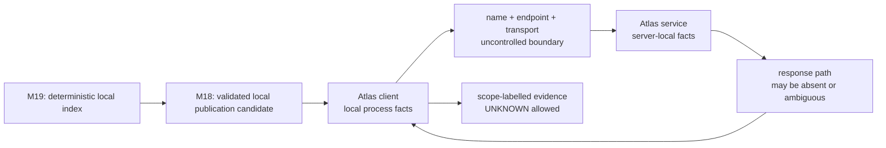
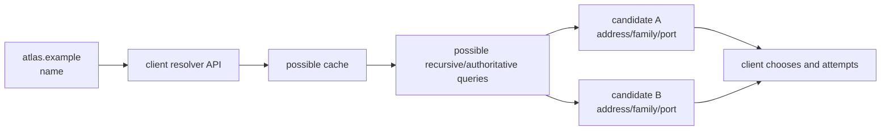
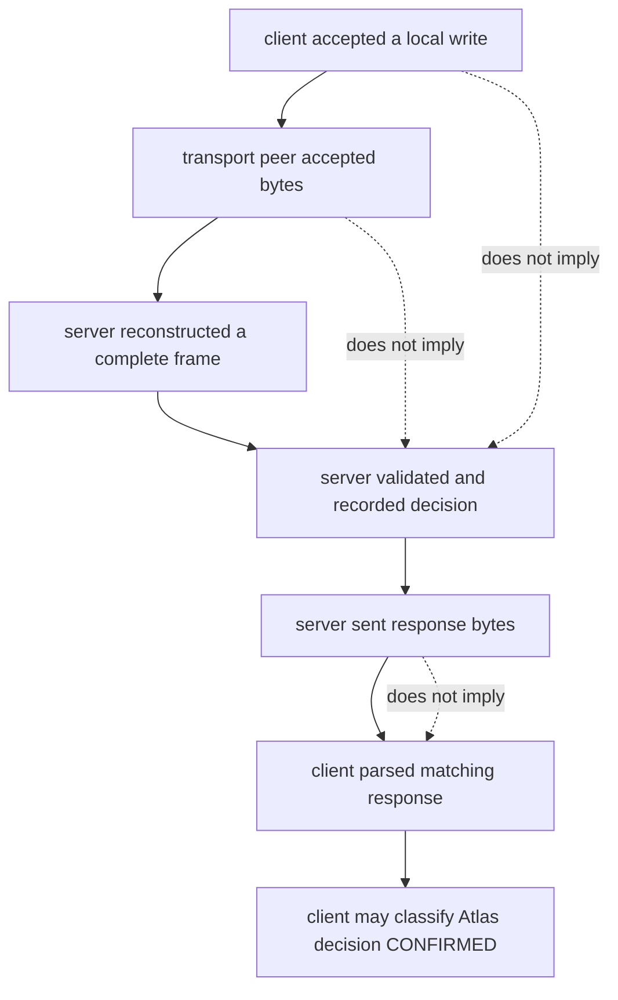
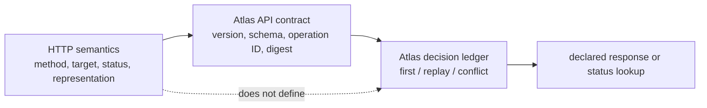
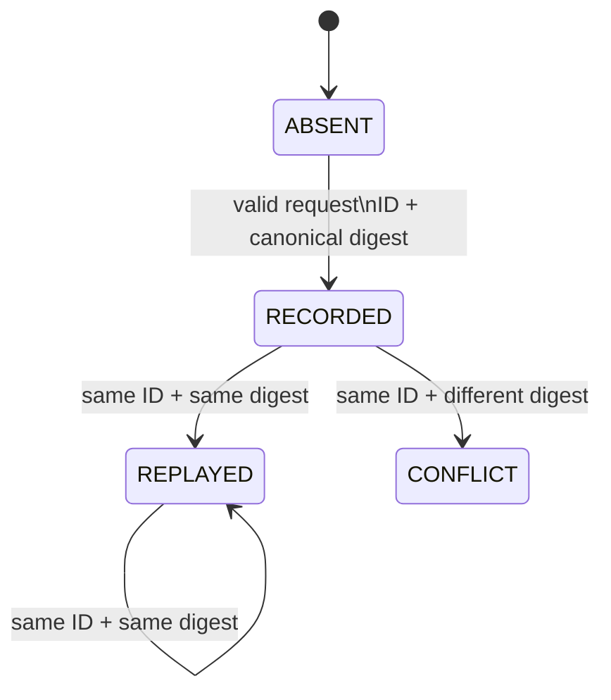
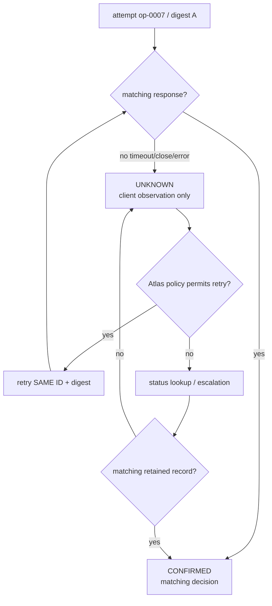
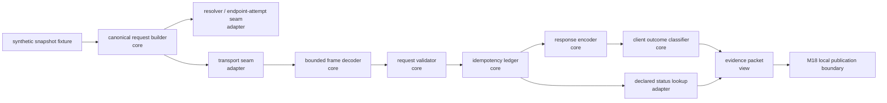
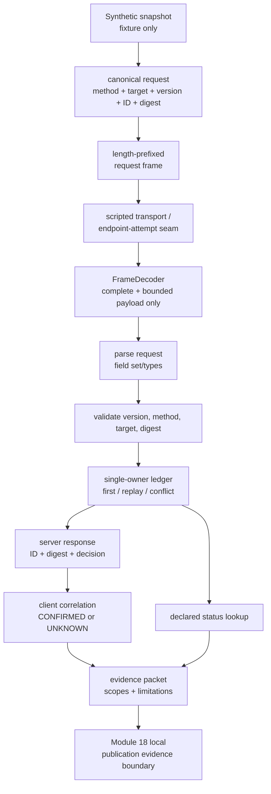

# Module 20 — Networks and Application Protocols

> **Arc IV: carry a local result across an uncertain boundary**
>
> A local program can know that it produced a valid value. The moment that
> value must cross a network, it must stop pretending that one local event is
> a remote fact.

**Documentation and source baseline:** Python 3.14.6; IETF RFCs and
university material last audited 2026-07-30. The research, licensing, and
claim map is [Module 20 source map](/downloads/module20_networks_protocols_source_map.md).

**Executed production baseline:** the local-only reference and its test suite
run on CPython 3.14.6 on Windows. They use only synthetic data and make no DNS
query, public connection, listener, packet capture, or timing claim. A
successful reference run is a result about its finite model—not evidence about
the Internet, a remote host, or a production service.

**Read or run the model:** [runnable local reference](/downloads/module20_reference.py)
and [behavioral tests](/downloads/test_module20_reference.py). These are
downloadable evidence artifacts for inspection; they do not contact a network.

**Download-only path:** Save both downloaded files in the same local folder.
From that folder, using a selected Python runtime, run:

```powershell
python test_module20_reference.py
python module20_reference.py --scenario timeout_then_lookup
```

The model's evidence packet names the canonical repository-root command and its
`canonical_command_base`; it does not need or record your actual local folder.

**Primary learning surface:** use the visual HTML studio for prediction,
stepping, comparison, and recording. This workbook is the complete accessible
and auditable source: every visual has a text equivalent, every exercise has a
stated observation boundary, and every source-backed claim names its owner.

**Learning record:** use the Module 20 Notion notebook for endpoint maps,
frame traces, confidence ratings, timeout-history matrices, API contracts,
agent-review verdicts, source notes, and your short oral defenses. Link to the
workbook; do not duplicate it.

---

## How to study this module

This is one incident investigation, not a tour of DNS, sockets, TCP, UDP, and
HTTP vocabulary.

Module 19 can create a deterministic Atlas index candidate locally. A generated
client now tries to publish it. It calls `sendall()`, waits, times out, records
“nothing happened,” and retries with a new ID. In one compatible history, the
service committed the first publication and its response was lost. In another,
no complete request reached the service. In a third, name resolution gave a
different endpoint candidate. The code's conclusion is stronger than any
observation it has.

We will not patch that incident with a larger timeout or blind retries. We
will derive a system:

```text
local candidate and request intent
→ name resolution and endpoint candidates
→ transport bytes or datagrams
→ declared message framing
→ request validation and server-local decision
→ response interpretation and uncertain knowledge
→ stable retry identity and declared status lookup
→ correlated, scope-labelled evidence
```

For every diagram, trace, code reading, or agent patch:

1. state the exact observation;
2. label its owner and scope;
3. name at least one compatible history it does **not** rule out;
4. predict the next buffer/state/evidence transition;
5. reveal one narrow fact or run one bounded local command;
6. identify the first invalid inference—not merely the last visible error;
7. repair the contract, trace, or test; and
8. transfer the rule to a different layer.

You will manually build only two small mechanisms:

1. a bounded incremental frame decoder; and
2. a server-local idempotency ledger.

They are intentionally small enough to inspect line by line. You will **not**
reimplement TCP, DNS, HTTP, TLS, a router, or a distributed database. The goal
is fluent reading and sound architectural judgement, not accumulating keyboard
miles.

### The exact cumulative invariant

Read this before every session. Later, reproduce it without notes.

> **Every Atlas remote publication operation has one stable operation ID and
> canonical request digest. The client records the name-resolution and
> endpoint-attempt boundary, sends only a complete declared request framing,
> and never infers remote receipt, parsing, decision, commit, or
> acknowledgement from a local send, connection close, timeout, or retry. The
> server admits a complete valid request, records one decision for the pair
> (operation ID, request digest) before returning a response, replays that
> decision for an identical duplicate, and rejects reuse of the operation ID
> with a different digest. Only a valid matching response or a subsequent
> declared status lookup can confirm the server's recorded decision; every
> ambiguous client outcome remains explicitly UNKNOWN until resolved. This
> server-local idempotency rule does not establish global delivery,
> distributed exactly-once processing, durability outside the declared Module
> 18 boundary, endpoint identity, or security.**

It has eight obligations:

| Obligation | What you must demonstrate | A tempting non-substitute |
|---|---|---|
| request meaning | canonical bytes and digest are reproducible | “the request looked similar in a log” |
| name/endpoint record | resolution and attempted endpoint are recorded as client facts | “the hostname is the server” |
| framing | only a complete declared bounded frame reaches validation | “`recv()` returned some bytes” |
| admission | invalid request/digest fails before a decision exists | “the body was JSON-shaped” |
| idempotency | one ID is either absent, bound to one digest/decision, or conflicts | “the client retried quickly” |
| knowledge | timeout/close/malformed response remains `UNKNOWN` | “no response means rollback” |
| confirmation | matching response or declared lookup binds ID and digest to a decision | “a TCP ACK appeared in a trace” |
| scope discipline | every record names client/server/model/protocol authority and limitation | “the test passed” |

### Claim labels

Use the narrowest label that supports a sentence. Split a sentence when its
parts require different owners.

| Label | Authority and stopping line |
|---|---|
| **[ATLAS SPEC]** | this module's declared API/model invariant; not an Internet-wide promise |
| **[PROTOCOL MODEL]** | a finite decoder/ledger/history model; not a packet capture or host trace |
| **[PYTHON 3.14 CONTRACT]** | behavior documented by Python 3.14 public APIs; not remote-app evidence |
| **[IETF STANDARD]** | a named RFC's scoped protocol semantics; not Python API behavior or Atlas policy |
| **[UNIVERSITY READING]** | instructional structure; never the sole technical authority |
| **[LOCAL REFERENCE RESULT]** | output of a named fixture/command in the local model |
| **[CLIENT OBSERVATION]** | a fact visible to this client process only |
| **[SERVER OBSERVATION]** | a fact recorded at the modeled server only |
| **[PACKET/TRACE OBSERVATION]** | a capture at a named observation point; not all remote facts |
| **[ATLAS POLICY]** | a product choice, such as retention or retry budget |
| **[HYPOTHESIS]** | a compatible explanation awaiting discriminating evidence |
| **[UNKNOWN]** | a fact the current evidence does not establish |

### Runtime evidence card

| Record | Value | Supports | Does not support |
|---|---|---|---|
| documentation target | Python 3.14.6 | version-scoped socket/API reading | an execution result |
| primary executable | CPython 3.14.6 on Windows | named local reference tests and JSON model output | another OS, resolver, or socket implementation |
| reference transport | scripted in-memory adapter | a finite distinction between client and server knowledge | TCP, HTTP, DNS, or production network conformance |
| fixture | `snapshot-2026-07-30-a`, `op-0007` | repeatable request/digest/ledger traces | a user or production data set |
| public network | deliberately unused | privacy and reproducibility boundary | a claim about reachability |
| socketpair exercise | optional and separately labelled if run | one local runtime-scoped chunking observation | Internet delivery or a TCP-wide conclusion |

---

## 1. Position in the knowledge system

### 1.1 From local correctness to remote knowledge

Module 18 separated a worker's local actions, OS-mediated resource changes,
and durable-publication evidence. Module 19 added overlapping worker histories,
ownership, synchronization, and a deterministic local reducer. Those modules
could still reason about a bounded local world.

Module 20 changes exactly one thing: the result crosses a boundary that Atlas
does not control end-to-end. It cannot see every resolver cache, transport
buffer, intermediary, close, server process, or response path. Therefore it
must model **what it knows**, rather than write a story it wants to be true.

#### D1 — The new boundary



**Caption — D1.** Module 20 does not weaken local validation. It asks which
additional evidence is needed after an otherwise-valid local candidate leaves
the process.

**Text equivalent.** A Module 19 result becomes a Module 18 validated local
candidate. A client sends bytes across an uncontrolled boundary. A server may
or may not admit, decide, and respond. The client later records only facts it
can observe and retains `UNKNOWN` when the available evidence cannot separate
remote histories.

### 1.2 The four non-equalities to keep visible

```text
name             ≠ address
address + port   ≠ authenticated service identity
transport bytes  ≠ application message
client timeout   ≠ remote rollback

application idempotency ≠ distributed exactly-once processing
```

These are not cynical slogans. Each inequality stops a specific invalid jump.
The rest of the module derives the missing contract that would be needed to
cross it honestly.

### 1.3 Canonical event vocabulary

Use this vocabulary precisely. You will repeatedly distinguish it from the
nearby word people casually substitute for it.

| Word | Meaning here | Not a synonym for |
|---|---|---|
| URI/API target | resource/interaction intent | one literal host path |
| name | resolver input/label | server identity |
| address | network-layer interface/routing target | service identity |
| port | transport demultiplexing value | business operation |
| endpoint candidate | a resolved address/family/protocol/port possibility | connected peer |
| byte stream | ordered transport bytes with no application records | message queue |
| datagram | one delivered datagram boundary | valid business message |
| frame | bytes complete under a declared application framing rule | validated request |
| request | framed, parsed intent under protocol/API rules | committed domain change |
| decision record | server-local Atlas result for ID + digest | client knowledge |
| response observation | bytes the client parsed and bound to its request | global delivery proof |
| unknown | unresolved set of compatible histories | failure/no-effect |

### 1.4 Prerequisite retrieval

Before proceeding, answer from memory:

1. In Module 18, why did a successful worker exit not itself prove a durable
   publication?
2. In Module 19, why did a passing concurrent run not establish safety across
   all legal schedules?
3. What does it mean for an operation to have one declared owner or protocol
   for each shared transition?
4. If an instrument cannot distinguish two histories, what is the honest
   classification?

If any answer is vague, revisit Modules 18–19 for fifteen minutes. Do not
memorize protocol terms to cover a missing evidence discipline.

---

## 2. Session 1 — A name is not a remote effect

### Pressure

The generated client logs this:

```text
publishing snapshot-2026-07-30-a to atlas.example
atlas.example did not respond; publication failed
```

It sounds concise, but it silently merges at least five facts:

1. what resource the client intended to use;
2. how the name was resolved;
3. which address/port candidate it attempted;
4. whether any transport connection was made; and
5. whether an Atlas application accepted an operation.

Our first repair is linguistic and architectural: give those facts different
places to live.

### Derive the chain from first principles

#### Step 1 — Resource intent is not one wire path

**[IETF STANDARD]** A URI identifies a resource and a means of interaction;
dereferencing can involve lookup and intermediaries ([RFC 3986 §1.2.2](https://www.rfc-editor.org/rfc/rfc3986.html#section-1.2.2)).

So this API target:

```text
https://atlas.example/v1/publications
```

is useful to a human and client as *intent*. It does not prove which machine,
route, process, cache, proxy, or storage system will answer. Do not draw a URL
with an arrow straight into a particular server disk.

#### Step 2 — A name is resolved, often through a cache

**[IETF STANDARD]** DNS contains names, resource records, name servers, and
resolvers; a resolver may use cached data and make multiple remote queries
([RFC 1034 §2.4](https://www.rfc-editor.org/rfc/rfc1034.html#section-2.4),
[RFC 1035 §2.2](https://www.rfc-editor.org/rfc/rfc1035.html#section-2.2)).
A TTL is a maximum caching interval, not a promise that every cache holds the
entry exactly that long ([RFC 9499 §5](https://www.rfc-editor.org/rfc/rfc9499.html#section-5)).

The mental model should be this:



**Caption — D2.** A resolver answer creates candidate connection attempts. It
does not prove that a candidate is reachable, represents one stable machine,
or belongs to a verified Atlas service.

**Text equivalent.** The name goes to a resolver API. The resolver may use a
cache or make several queries. It returns one or more endpoint candidates. The
client selects candidates according to a declared policy and attempts one. A
later connection/application result is a different observation.

#### Step 3 — Address and port narrow a transport endpoint, not application identity

**[IETF STANDARD]** An IP address identifies an interface or set of
interfaces; ports demultiplex transport sessions
([RFC 8200 §2](https://www.rfc-editor.org/rfc/rfc8200.html#section-2),
[RFC 6335 §3](https://www.rfc-editor.org/rfc/rfc6335.html#section-3)).

An address plus port can be meaningful enough to attempt a transport
connection. It is still not a proof that “Atlas” answered, that a certificate
was verified, or that a particular application policy executed. Those identity
and security questions are intentionally deferred to Module 22.

#### D3 — Put each fact in its rightful column

| Observation | Defensible statement | Invalid promotion |
|---|---|---|
| target string exists | the client intended this resource/API target | this is the one Atlas machine |
| `getaddrinfo()` returned candidates | a local resolver API returned these candidates | this name permanently maps to these hosts |
| client tried address+port | this process attempted that endpoint candidate | Atlas received a request |
| transport connect returned | a local API reported a transport connection outcome | the application accepted an operation |
| matching Atlas response | this client parsed a matching declared response | the peer is securely authenticated or work occurred globally once |

### Code-reading lab L1 — Make the endpoint-attempt boundary visible

Read this intentionally incomplete sketch before writing anything:

```python
import socket

def candidates(name: str, port: int) -> list[tuple[object, ...]]:
    return socket.getaddrinfo(name, port, type=socket.SOCK_STREAM)

def attempt(name: str, port: int) -> None:
    for candidate in candidates(name, port):
        family, socktype, protocol, _, sockaddr = candidate
        sock = socket.socket(family, socktype, protocol)
        try:
            sock.settimeout(1.0)
            sock.connect(sockaddr)
            return
        finally:
            sock.close()
```

Do **not** run this against a public address for this course. Read it as an API
boundary exercise.

Answer before reveal:

1. Which value is the *name*? Which is a resolved endpoint candidate?
2. What does the loop need to record to make failed attempts auditable?
3. Does `connect()` return prove that an Atlas HTTP request was parsed?
4. What identity/security fact is still missing even after a connection?

**Reveal.** Python documents `getaddrinfo()` as address-information lookup and
`create_connection()`/sockets as local connection APIs, not a remote business
protocol ([Python `socket`](https://docs.python.org/3.14/library/socket.html)).
A defensible attempt record contains the target name, candidate family and
address/port, attempt ordinal, local result/exception class, deadline policy,
and correlation ID. It omits private/raw payloads and does not label the
candidate “Atlas service verified.”

### A small Atlas record

**[ATLAS SPEC]** Keep scope in the type/field name instead of relying on prose
in a log message:

```text
EndpointAttempt
  operation_id: op-0007
  target_name: atlas.example
  candidate: {family: AF_INET6, address: 2001:db8::7, port: 443}
  attempt_number: 1
  client_observation: CONNECTION_ERROR | CONNECTED | TIMEOUT
  evidence_scope: CLIENT_OBSERVATION
```

The address above is documentation-only. The record says nothing about a
public endpoint, credentials, or remote application effect.

### Prediction record

In your Notion notebook, complete this table before moving on.

| Prompt | Your prediction | Confidence 1–4 | Evidence that would change your mind |
|---|---|---:|---|
| A resolver returns two addresses. What is established? |  |  |  |
| One connection attempt fails. What is still unknown? |  |  |  |
| A port is `443`. What application/security conclusion is unsupported? |  |  |  |
| Where should attempted-candidate facts live in the Atlas evidence packet? |  |  |  |

### Bounded agent task

Ask an assistant to review an endpoint-attempt data model, not to invent a
network client:

```text
Task: Review this proposed EndpointAttempt schema.
Constraints: no public-network calls; distinguish URI/name/address/port;
label every field as client observation, protocol field, or Atlas policy;
identify any field that overclaims remote receipt or identity.
Deliverable: a table of keep/change/remove decisions plus three tests.
Do not write a resolver implementation.
```

Accept the answer only if it names at least one fact that remains unknown after
resolution and one fact that belongs in Module 22 rather than this module.

### Session 1 synthesis

```text
target intent
→ name resolution result
→ endpoint candidate
→ attempted local transport operation
→ still not an application decision
```

The next session starts **after** an endpoint is connected. It asks a new
question: when bytes arrive, how does a receiver know where one request ends?

---

## 3. Session 2 — Transport carries bytes, not your request

### Pressure

The generated Atlas server does this:

```python
message = connection.recv(4096)
request = json.loads(message)
```

It may appear to work on a quiet loopback run. It has no stated rule that the
first receive contains one full JSON object, only one object, or the boundary
between objects. The bug is not “bad JSON.” It is an absent framing contract.

### Derive the transport/message distinction

#### Step 1 — TCP has a byte-stream contract

**[IETF STANDARD]** TCP provides a reliable, in-order byte stream to an
application ([RFC 9293 §2.2](https://www.rfc-editor.org/rfc/rfc9293.html#section-2.2)).
That is valuable: bytes can arrive in order despite transport-level loss and
retransmission. It is deliberately **not** an application-record guarantee.
The TCP PSH flag is not a record marker
([RFC 9293 §3.9.1.1](https://www.rfc-editor.org/rfc/rfc9293.html#section-3.9.1.1)).

#### Step 2 — UDP preserves a delivered datagram boundary, but not a business guarantee

**[IETF STANDARD]** UDP is message-oriented at the datagram interface, but it
does not provide delivery, ordering, duplicate protection, connection setup,
or inherent congestion control for an application
([RFC 768](https://www.rfc-editor.org/rfc/rfc768.html),
[RFC 8085 §3](https://www.rfc-editor.org/rfc/rfc8085.html#section-3)).

So neither shortcut works:

```text
TCP byte stream  → “one recv equals one request”        ✗
UDP datagram     → “one datagram equals one valid effect” ✗
```

An application needs an explicit parser/admission rule either way.

#### D4 — Same logical requests, different stream chunks

Assume Atlas declares a four-byte big-endian length followed by that many body
bytes. The logical frames are `atlas` and `index`.

```text
declared wire bytes
00 00 00 05  a t l a s  00 00 00 05  i n d e x

legal receive pattern A (split)
00 00 | 00 05 a t | l a s 00 00 00 05 i n d e x

legal receive pattern B (coalesced)
00 00 00 05 a t l a s 00 00 00 05 i n d e x

logical frames in both cases
[b"atlas", b"index"]
```

**Caption — D4.** Chunk boundaries are a local delivery detail. The frame
declaration—not the number of `recv()` calls—decides when a message may emit.

**Text equivalent.** The wire stream contains two length-prefixed frames. One
receive pattern splits the header/body across several chunks; another combines
both frames in one chunk. A correct decoder emits the same two payloads for
both patterns.

#### Step 3 — Choose a complete, bounded framing rule

Our reference rule is intentionally minimal:

```text
frame := unsigned-32-bit-big-endian body length | exactly that many body bytes
admission bound := declared length ≤ max_frame_bytes
end of source := legal only between frames
```

This is an **[ATLAS SPEC]** teaching rule, not an invented version of HTTP or
DNS. DNS-over-TCP uses a real explicit two-octet message length field, and its
server must not close merely because the first read lacks a whole DNS message
([RFC 7766 §8](https://www.rfc-editor.org/rfc/rfc7766.html#section-8)). That
standards example validates the reasoning pattern, not this exact Atlas wire
format.

### Read the runnable decoder as a state machine

The complete local-only model is the
[`module20_reference.py` download](/downloads/module20_reference.py). Its
canonical checked-in learner source is `public/downloads/module20_reference.py`,
paired with `public/downloads/test_module20_reference.py`; the portal serves
those exact tracked files. There is no separate `work/` source or generated
mirror. Read this core before relying on a library convenience method:

```python
class FrameDecoder:
    def __init__(self, *, max_frame_bytes: int) -> None:
        self._max_frame_bytes = max_frame_bytes
        self._buffer = bytearray()
        self._expected_body_bytes: int | None = None

    def feed(self, chunk: bytes) -> tuple[bytes, ...]:
        self._buffer.extend(chunk)
        emitted: list[bytes] = []

        while True:
            if self._expected_body_bytes is None:
                if len(self._buffer) < FRAME_HEADER_BYTES:
                    break
                self._expected_body_bytes = int.from_bytes(
                    self._buffer[:FRAME_HEADER_BYTES], "big"
                )
                del self._buffer[:FRAME_HEADER_BYTES]
                if self._expected_body_bytes > self._max_frame_bytes:
                    raise FrameTooLarge(...)

            if len(self._buffer) < self._expected_body_bytes:
                break

            emitted.append(bytes(self._buffer[:self._expected_body_bytes]))
            del self._buffer[:self._expected_body_bytes]
            self._expected_body_bytes = None

        return tuple(emitted)
```

#### D5 — Decoder state, not timing folklore

| State | Buffer contains | Correct action | Wrong shortcut |
|---|---|---|---|
| need header | fewer than 4 bytes | retain bytes; emit nothing | treat partial header as malformed request |
| header available | 4+ bytes; length unparsed | read declared length and check bound | allocate or parse an unbounded body |
| need body | header removed; fewer than declared length | retain bytes; emit nothing | assume close/quiet time fills the body |
| frame complete | at least declared body bytes | emit exactly one body and continue | discard coalesced following frame |
| EOF between frames | no header/body pending | accept source end | invent an empty request |
| EOF mid-frame | partial header/body pending | raise incomplete-frame error | validate/truncate a partial request |
| protocol error | invalid size or incomplete source | make this decoder terminal; start a new source/decoder | feed unrelated later bytes into ambiguous parser state |

The entire proof is local and deterministic. No sleep, packet capture, or
network access is needed.

### Code-reading lab L2 — Predict before you run

Without executing, trace this:

```python
decoder = FrameDecoder(max_frame_bytes=64)
wire = encode_frame(b"atlas") + encode_frame(b"index")

decoder.feed(wire[:2])
decoder.feed(wire[2:6])
decoder.feed(wire[6:])
decoder.finish()
```

Complete this table in your notebook.

| Feed | Buffer/state before | Emits | Buffer/state after |
|---|---|---|---|
| `wire[:2]` |  |  |  |
| `wire[2:6]` |  |  |  |
| `wire[6:]` |  |  |  |
| `finish()` |  |  |  |

Then run the bounded test suite:

```powershell
# From the course repository root, using the selected Python runtime:
python public/downloads/test_module20_reference.py
```

**[LOCAL REFERENCE RESULT]** The suite checks split frames, coalesced frames,
declared-size rejection before message admission, and incomplete EOF. It does not
test a NIC, actual TCP segmentation, JSON schema, or a remote peer.

### Debugging lab L2b — Find the first unsupported inference

Review this patch comment:

```python
# recv() returns the client's request, so one read is enough.
payload = connection.recv(4096)
apply_publish(json.loads(payload))
```

Write a review with exactly four headings:

1. **Broken contract:** which guarantee is missing?
2. **Counterexample:** give a split or coalesced chunk sequence.
3. **Minimum repair:** state a framing/admission rule and the bounded decoder
   interface.
4. **Regression:** name one test that would fail before and pass after.

Do not propose “increase 4096.” A larger arbitrary read size does not create a
message boundary.

### Bounded agent task

```text
Task: Review only the FrameDecoder API and tests.
Constraints: no sockets, no HTTP, no threads, no unbounded allocation,
no timing-based tests. Treat every feed chunk as arbitrary.
Deliverable: a transition table, three adversarial test cases, and a verdict
on whether EOF is accepted only at a frame boundary.
Do not change the wire protocol without explaining backward compatibility.
```

Reject an answer that calls a chunk a “packet” or claims a passing local test
proves TCP behavior.

### Session 2 synthesis

```text
transport delivery unit
≠ application message

declared frame length + bounded buffer + complete body
→ parser may emit one frame
→ validator may begin
```

The next session begins after parsing. A complete frame still does not tell the
client whether the server decided anything—or whether a response proves the
right decision.

---

## 4. Session 3 — A response is evidence with a scope

### Pressure

The original bug is not only about bytes. The client does this:

```python
send_publish(candidate)
if timed_out:
    return "nothing happened"
```

The `timed_out` branch observes one client-local fact: this caller stopped
waiting under its configured timeout. It does **not** observe a rollback,
unreceive, unparse, undecide, or delete operation at the service.

### Derive the evidence ladder

#### D6 — Each rung answers a different question



**Caption — D6.** Evidence can advance only along an explicitly declared
contract. Earlier/local rungs cannot be promoted to an Atlas decision by
optimism.

**Text equivalent.** A client can accept a local write. A transport peer can
accept bytes. A server can reconstruct a frame, validate it, record a decision,
and send response bytes. Only after the client parses a response that binds to
its own operation ID and digest may Atlas classify that decision as confirmed.
Each earlier step leaves later steps possible but unproved.

| Observation | What it supports | What it must not claim |
|---|---|---|
| `send()` progress / `sendall()` returns | a local API result under its documented contract | remote parsing, decision, or durable commit |
| TCP ACK in a correctly scoped trace | transport receive-state progress | business/application acknowledgement |
| server log/ledger | server-local receipt/decision that the log defines | client received a response |
| parsed HTTP/API response | a peer/intermediary sent those declared response bytes | a general global transaction proof |
| matching Atlas response or status lookup | this Atlas model binds this ID+digest to this decision | global exactly-once delivery or secure peer identity |

**[PYTHON 3.14 CONTRACT]** Python documents `send()` as potentially making
partial progress and `sendall()` as continuing until all data is sent or an
error; if `sendall()` errors, its API does not tell you how much, if any, was
already sent. Its timeout is a maximum total send duration, not a remote-effect
clock ([Python `socket`](https://docs.python.org/3.14/library/socket.html)).
That is a local socket-call contract. It deliberately does not document a
remote Atlas application's state.

**[IETF STANDARD]** A TCP acknowledgement represents receive-state progress,
not an application/business acknowledgement
([RFC 9293 §3.10.7](https://www.rfc-editor.org/rfc/rfc9293.html#section-3.10.7)).

### The three compatible timeout histories

Use the same client event—“deadline expired without a valid matching
response”—and compare these compatible histories:

| History | Server received complete frame? | Server decision? | Client knows decision at timeout? |
|---|---:|---:|---:|
| A: close/transport failure before complete frame | no | no | no |
| B: complete frame invalid | yes | no publish decision | no |
| C: decision recorded; response lost | yes | `PUBLISHED` | no |
| D: resolver retry later chooses another candidate | unknown for first candidate | unknown | no |

The correct client classification at the timeout is the intersection of these
histories:

```text
CLIENT_OBSERVATION: deadline expired without matching response
ATLAS EFFECT: UNKNOWN
```

`UNKNOWN` is useful state. It prevents an unsafe retry policy from pretending
that rollback is known and it tells the operator what observation could resolve
the uncertainty.

### Read the reference: server fact versus client knowledge

The model deliberately returns these two records in the timeout scenario:

```json
{
  "attempt": {
    "classification": "UNKNOWN",
    "decision": null,
    "evidence_scope": "CLIENT_OBSERVATION"
  },
  "server_local": {
    "decision": "PUBLISHED",
    "evidence_scope": "SERVER_DECISION",
    "replayed": false
  },
  "status_lookup": {
    "classification": "CONFIRMED",
    "decision": "PUBLISHED",
    "evidence_scope": "STATUS_LOOKUP"
  }
}
```

Run it locally:

```powershell
# From the course repository root, using the selected Python runtime:
python public/downloads/module20_reference.py `
  --scenario timeout_then_lookup
```

**[LOCAL REFERENCE RESULT]** This JSON intentionally puts the server fact next
to the client fact so you can compare them. A real client that timed out would
not automatically possess the `server_local` record. In the model, the
declared status lookup is a separate later interaction that binds the same ID
and digest to the stored decision.

### Code-reading lab L3 — Response matching is a correlation rule

Read the response branch before looking at the outcome name:

```python
if (
    response.operation_id == observation.operation_id
    and response.request_digest == observation.request_digest
):
    return ClientOutcome(
        classification="CONFIRMED",
        decision=response.decision,
        evidence_scope="MATCHING_RESPONSE",
    )
return ClientOutcome(
    classification="UNKNOWN",
    decision=None,
    evidence_scope="RESPONSE_IDENTITY_MISMATCH",
)
```

Answer:

1. Why is a syntactically valid response with a different operation ID not a
   confirmation for this request?
2. Why must the digest match as well as the ID?
3. What does `CONFIRMED` mean in this finite Atlas contract—and what does it
   still not mean?

**Reveal.** A response must bind to the operation the client intended and the
canonical meaning that operation was declared to carry. Otherwise a stale,
wrong, or miscorrelated response could falsely promote knowledge. The result
confirms a stated server-local Atlas decision; it does not authenticate a
network peer (Module 22) or prove global exactly-once processing (Module 21).

### Incident board — classify, then choose the next observation

For each line, write the strongest label and the lowest-risk next action.

| Line | Strongest label now | Lowest-risk next action |
|---|---|---|
| `sendall()` returned |  |  |
| client deadline expired |  |  |
| server ledger contains ID+digest |  |  |
| response ID differs from request ID |  |  |
| status lookup returns same ID+digest+decision |  |  |

Do not answer “retry immediately” until Session 5 has supplied the identity
and server policy that could make such a retry defensible.

### Session 3 synthesis

```text
local write / timeout / close
→ client observation only

matching response OR declared status lookup
with same operation ID + digest
→ Atlas client may confirm that server-local decision
```

The next session uses HTTP to make request/response semantics explicit—but it
does not hand Atlas a free retry or idempotency policy.

---

## 5. Session 4 — HTTP gives semantics; Atlas still owns policy

### Pressure

After discovering framing, a team often replaces every custom protocol word
with “we use HTTP” and assumes the design problem disappeared. HTTP gives a
valuable shared vocabulary for methods, status codes, headers, representations,
and response semantics. It does not decide Atlas's operation identity,
canonical request meaning, retention window, duplicate policy, status lookup,
or security model.

### Separate HTTP's job from Atlas's job

#### D7 — Two contracts that must meet without being confused



**Caption — D7.** HTTP describes a shared interaction layer. Atlas still has
to say what one publication operation means and how two attempts relate.

**Text equivalent.** HTTP supplies method/target/representation/status
semantics. Atlas places a versioned request schema and an operation-ID/digest
contract on top. Its ledger performs a server-local first/replay/conflict
decision. The returned representation or status resource communicates that
decision. HTTP does not secretly implement the ledger.

### 5.1 Method meaning is not domain idempotency

**[IETF STANDARD]** HTTP defines method semantics, including *safe* and
*idempotent* methods ([RFC 9110 §9](https://www.rfc-editor.org/rfc/rfc9110.html#section-9)).
An idempotent method has the same **intended effect** when repeated; that does
not require identical logs, response bodies, timing, revision history, or
other incidental behavior ([RFC 9110 §9.2.2](https://www.rfc-editor.org/rfc/rfc9110.html#section-9.2.2)). A safe method does not mean “absolutely no side
effects”—logging can still occur ([RFC 9110 §9.2.1](https://www.rfc-editor.org/rfc/rfc9110.html#section-9.2.1)).

This is the useful distinction:

| Question | HTTP can help answer | Atlas must still answer |
|---|---|---|
| What interaction does this method request? | standardized method semantics | whether a publication request with this content is valid |
| May a generic client retry? | scoped idempotency/retry guidance | precise client retry conditions and response validation |
| Are two application submissions the same operation? | no | operation-ID scope + canonical digest equality |
| Is a response representation understandable? | media-type/representation vocabulary | schema/API version and business validation |
| Did a peer receive it securely? | no | Module 22 identity/integrity/authentication design |

### 5.2 HTTP versions share semantics, not one framing rule

**[IETF STANDARD]** HTTP semantics are shared across versions, while wire
framing differs by major HTTP version ([RFC 9110 §6.1](https://www.rfc-editor.org/rfc/rfc9110.html#section-6.1)).
HTTP/1.1 message parsing/body-length rules belong to HTTP/1.1
([RFC 9112](https://www.rfc-editor.org/rfc/rfc9112.html)).

Therefore:

```text
HTTP/1.1 Content-Length / chunked framing
is not
HTTP/2 or HTTP/3 framing

HTTP method/status semantics
can be shared across versions
```

You are not expected to implement any HTTP version in this module. You are
expected to notice when a patch takes an HTTP/1.1 framing detail and makes an
unqualified claim about “HTTP.”

### 5.3 A narrow Atlas API contract

This contract is **[ATLAS SPEC]**. It is a teaching design, not a public API or
a promise about a production deployment.

```text
POST /v1/publications

Content-Type: application/json
Atlas-API-Version: 1
Idempotency-Key: <operation-id>

{
  "operation_id": "op-0007",
  "snapshot_id": "snapshot-2026-07-30-a",
  "request_digest": "sha256:..."
}
```

The canonical Atlas request bytes deliberately encode `api_version`, fixed
`method`/`target`, `operation_id`, and `snapshot_id` in a sorted compact form.
The digest commits to those bytes. The request's visible `operation_id` and
header must agree; the HTTP-header comparison is an Atlas API rule, while the
local reference models the same fixed method/target as canonical fields rather
than parsing an HTTP header block. Both checks belong before ledger admission.

| Result | Atlas response shape | What the client may say |
|---|---|---|
| first valid decision | `200` + same ID/digest/decision + `replayed: false` | matching decision confirmed |
| same ID + same digest | `200` + same decision + `replayed: true` | matching replay confirmed |
| same ID + different digest | `409` problem + both correlation-safe IDs/digests as policy allows | this reuse conflicts; do not silently create another operation |
| malformed framing/schema/version/digest | `400` problem | no valid decision under this request contract |
| temporary capacity policy | `503` problem, optional `Retry-After` | admission wasn't available under this response; retry still needs Atlas policy |
| no matching status record | declared status response, e.g. `404`/retention state | client remains unresolved; absence is not silently “never happened” |

The exact `200`/`400`/`409`/`503` choices above are Atlas design choices. Their
HTTP vocabulary is bounded by the standard; their operation meanings and
retry consequences are Atlas-owned.

### 5.4 `Idempotency-Key` status must be stated honestly

The related [`Idempotency-Key` Internet-Draft](https://datatracker.ietf.org/doc/html/draft-ietf-httpapi-idempotency-key-header-07)
was expired at the research snapshot. It is **not** a final RFC or a universal
HTTP guarantee. Atlas can use that familiar header name as an **[ATLAS POLICY]**,
but must define the things the name does not decide:

```text
scope: one Atlas publication API/version and authenticated principal (M22 adds auth)
binding: one operation ID ↔ one canonical request digest
retention: a stated finite server policy, not “forever”
concurrent duplicates: serialized/owned ledger decision or declared synchronization
replay: same stored decision is returned for same ID + digest
conflict: same ID + different digest is rejected
status: lookup binds the same ID + digest to a retained record, or stays unresolved
```

### Code-reading lab L4 — Review a seductive HTTP patch

```python
@app.post("/v1/publications")
def publish(body: dict) -> dict:
    # POST is HTTP, so the framework will handle duplicate retries.
    write_publication(body)
    return {"ok": True}
```

Write a review that separates three kinds of absence:

1. **Missing HTTP detail:** What request/response validation or status meaning
   is not stated?
2. **Missing Atlas policy:** What makes two POST attempts the same operation,
   and who records that before returning?
3. **Deferred security detail:** What cannot be inferred about identity,
   authorization, or trust merely from the route string?

**Reveal.** A framework can parse a route and serialize a response. It cannot
invent an operation-ID/digest ledger, decide a safe retry budget, or
authenticate a peer by itself. The smallest correct response is a narrower
contract, not a bigger framework.

### Contract sketch: response and problem shapes

Use only synthetic, safe fields in the workbook model:

```json
{
  "api_version": "1",
  "operation_id": "op-0007",
  "request_digest": "sha256:fcc51...",
  "decision": "PUBLISHED",
  "replayed": false,
  "evidence_scope": "SERVER_DECISION"
}
```

For public API errors, [RFC 9457](https://www.rfc-editor.org/rfc/rfc9457.html)
is a useful structured-problem boundary. It is not an excuse to export stack
traces, raw request contents, hostnames, or internal ledger implementation
details. A stable public problem type plus correlation-safe operation ID is
useful; an internal debugging dump is not.

### Session 4 synthesis

```text
HTTP semantics
+ Atlas version/schema/operation policy
+ server-local ledger
→ a legible application protocol

HTTP method name alone
→ not enough to justify retry, idempotency, or identity claims
```

The next session makes the ledger explicit and uses it to replace “retry with a
new ID” by an evidence-preserving protocol.

---

## 6. Session 5 — Retry is an epistemic problem before it is a loop

### Pressure

The timeout branch creates a fresh UUID for every retry. That makes it
impossible for a server to recognize that the second attempt represents the
same intended publication. It turns an ambiguous completion into two distinct
operations by design.

The repair begins with a question, not a loop:

> What stable evidence lets client and server determine whether this is the
> same declared operation, a valid replay, or a conflicting reuse?

### 6.1 Derive the operation state machine

#### D8 — One ID is not merely a convenience string



**Caption — D8.** This model has one server-local binding rule. It says
nothing about whether a response reaches a client, whether storage survives a
crash beyond Module 18's declared boundary, or whether two services agree.

**Text equivalent.** An operation ID is initially absent. A valid request
records a decision bound to its canonical digest. A later same-ID/same-digest
attempt replays the decision. A same-ID/different-digest attempt conflicts.
The model contains no state called “probably rolled back after timeout.”

### 6.2 Canonical meaning precedes a digest comparison

The reference makes the request meaning visible instead of using an arbitrary
string label:

```python
def canonical_request_bytes(request: PublishRequest) -> bytes:
    meaning = {
        "api_version": request.api_version,
        "method": request.method,
        "operation_id": request.operation_id,
        "snapshot_id": request.snapshot_id,
        "target": request.target,
    }
    return json.dumps(
        meaning,
        ensure_ascii=True,
        separators=(",", ":"),
        sort_keys=True,
    ).encode("ascii")

def request_digest(request: PublishRequest) -> str:
    return "sha256:" + hashlib.sha256(
        canonical_request_bytes(request)
    ).hexdigest()
```

**[PROTOCOL MODEL]** The digest is a concise equality/correlation value for
the declared synthetic bytes. It is not a security signature, identity proof,
or authorization token. Cryptographic integrity/authentication belongs in
Module 22. The important first-principles property here is deterministic
comparison: same declared meaning produces the same digest; changed declared
meaning produces a different binding in the model.

### 6.3 Read the three ledger outcomes

```python
prior = self._records.get(request.operation_id)
if prior is None:
    record = DecisionRecord(..., decision="PUBLISHED", replayed=False)
    self._records[request.operation_id] = record
    return record
if prior.request_digest != request.request_digest:
    raise IdempotencyConflict(...)
return replace(prior, replayed=True)
```

Before this code, the reference decodes a complete frame, parses the synthetic
JSON request, validates field types, API version, fixed method/target scope,
and then validates that the declared digest equals the digest regenerated from
canonical bytes. That ordering matters:

```text
frame complete
→ request fields/version/method/target/digest validated
→ ledger lookup and first/replay/conflict decision
→ response attempt
```

No invalid request should acquire a publication decision simply because it
reused an ID.

#### D9 — Three attempts, three different meanings

| Client action | ID | Digest | Server result | Correct client wording |
|---|---|---|---|---|
| first valid publish | `op-0007` | `sha256:A` | record `PUBLISHED` | matching response/lookup can confirm one server decision |
| retry after timeout | `op-0007` | `sha256:A` | replay `PUBLISHED` | same operation was replayed under Atlas policy |
| edited body but reused key | `op-0007` | `sha256:B` | conflict | request is invalidly rebinding one operation ID |
| retry with a new key | `op-0008` | `sha256:A` | a distinct operation may be recorded | not a replay of `op-0007` |

The final row is why “new ID on retry” is a semantic design decision, not an
innocent implementation detail.

### 6.4 Client classification has an `UNKNOWN` branch on purpose

**[IETF STANDARD]** An idempotent HTTP request can be retried after a
communication failure before its response is read; automatic retry of a
non-idempotent request needs a specific guarantee
([RFC 9110 §9.2.2](https://www.rfc-editor.org/rfc/rfc9110.html#section-9.2.2)).
That guidance does not decide this Atlas POST's application semantics. Atlas
adds its explicit stable-ID/digest rule.

Client policy in this teaching model:

```text
1. Build one canonical request and persist/retain its operation ID + digest
   for the declared operation lifetime.
2. Attempt the request under a declared deadline and endpoint policy.
3. If a valid matching response arrives, classify the server decision CONFIRMED.
4. If timeout, close, connection error, or malformed/mismatched response occurs,
   classify outcome UNKNOWN—not NOT_COMMITTED.
5. If Atlas policy permits another attempt, retry the same ID + same digest.
6. Use declared status lookup to resolve a retained matching decision when possible.
7. Escalate an unresolved operation with its evidence packet; do not mint a
   new operation ID merely to silence uncertainty.
```

#### D10 — Retry is a knowledge-preserving branch



**Caption — D10.** A retry preserves the operation identity. It does not erase
the unknown history. Status lookup can resolve only what the server's declared
retention/status contract actually supplies.

### Code-reading lab L5 — Reject a false “exactly once” claim

Review this generated documentation sentence:

> “Atlas uses a hash key, so each publication is delivered and processed
> exactly once across the network.”

Write a correction with four sentences, one per boundary:

1. What the local ledger actually establishes.
2. What it does not establish about delivery/response paths.
3. What it does not establish about crashes/replicas/global coordination.
4. Which later module owns the missing distributed-system reasoning.

**Model answer shape.** The ledger records one server-local decision per
operation ID/digest in this finite model. It does not prove that every client
attempt reaches that ledger or every response reaches its client. It does not
establish replicated durability, global delivery, or exactly-once processing.
Module 21 owns those distributed-system conditions; Module 22 owns security
identity/integrity conditions.

### Fault-injection lab L5b — Same observation, different histories

From the course repository root, use the reference's named scenarios:

```powershell
python .\public\downloads\module20_reference.py --scenario connection_error
python .\public\downloads\module20_reference.py --scenario timeout_then_lookup
python .\public\downloads\module20_reference.py --scenario matching_response
```

If `python` does not select your intended runtime, replace only the leading
`python` command with that runtime's executable; keep the script path and
scenario unchanged. These are examples of a local model run, not a requirement
to install anything. If you save the paired downloads elsewhere, use that
folder's bare filenames. Record the scenario, command form, runtime, and
outcome—not a personal directory path. For each output, identify:

| Scenario | Client attempt class | Server-local record in model | Status result | What remains outside scope |
|---|---|---|---|---|
| connection error |  |  |  |  |
| timeout then lookup |  |  |  |  |
| matching response |  |  |  |  |

### Bounded agent task

```text
Task: Review a proposed retry/idempotency contract, not a full HTTP service.
Inputs: operation ID, canonical digest rule, three ledger outcomes, deadline,
and retention statement.
Deliverable: a state machine, an UNKNOWN-outcome matrix, and tests for
same-ID/same-digest replay, same-ID/different-digest conflict, and new-ID retry.
Reject: claims of global exactly-once, retry-after-guarantees, or “timeout means
rollback.”
```

### Session 5 synthesis

```text
ambiguous completion
→ stable operation identity + canonical request meaning
→ server-local first / replay / conflict ledger
→ same-ID retry or status lookup
→ knowledge may resolve, or honestly remain UNKNOWN
```

The final session turns those individual facts into an auditable architecture
and teaches you how to review a patch that crosses the boundary incorrectly.

---

## 7. Session 6 — Make network knowledge auditable

### Pressure

The incident log says only `publish failed`. That hides whether failure means
resolution, candidate connection, framing, validation, server conflict,
response mismatch, timeout, or an unresolved remote outcome. An operator
cannot safely choose the next action from a slogan.

The repair is not “log everything.” It is a small evidence packet with safe,
correlation-rich fields and a label for what remains unknown.

### 7.1 Recover the architecture before running it

#### D11 — Dependency direction and observation ownership



**Caption — D11.** Core meaning, framing, validation, ledger, and
classification do not import a socket, HTTP framework, logger, UI, or file
writer. Adapters depend on core, never reverse. That makes the correctness
rules inspectable and replaceable.

**Text equivalent.** A synthetic snapshot enters a canonical request builder.
Resolver and transport are replaceable adapters. Core code decodes frames,
validates a request, updates one ledger, builds a response, and classifies the
client's knowledge. A declared status lookup supplies a separate input to the
evidence packet. The final artifact still enters Module 18's local publication
boundary; no network response substitutes for that local evidence.

### 7.2 The minimal evidence packet

**[ATLAS SPEC]** Record enough to reconstruct scope, not enough to leak raw
inputs or make a fiction stronger:

```text
schema version + model/API version
synthetic fixture ID/digest
operation ID + canonical request digest
target name and redacted/declared endpoint-attempt records
attempt number + client deadline policy/result class
framing trace digest or bounded transition summary
server-local decision record if obtained from its declared scope
response/status outcome and correlation result
claim labels + explicit unknowns
test command, runtime profile, and source/fixture version
```

Do not include raw private payloads, credentials, authorization headers,
absolute local paths, public endpoint metadata, or a stack trace in a learner
evidence bundle. Even safe fields need an owner: an `EndpointAttempt` is a
client record; a `DecisionRecord` is a server record; a response parse is a
client observation; an RFC is neither test output nor Atlas policy.

### 7.3 Inspect the deterministic reference packet

The reference makes its limitations machine-readable:

```python
return {
    "attempt": _outcome_packet(attempt),
    "fixture_id": FIXTURE_ID,
    "model_version": MODEL_VERSION,
    "operation": {
        "operation_id": request.operation_id,
        "request_digest": request.request_digest,
    },
    "server_local": _decision_packet(server_record),
    "status_lookup": _outcome_packet(status_lookup),
    "unknowns_after_attempt": unknowns_after_attempt,
}
```

Prediction prompt: why is `server_local` shown beside an unknown client outcome
in a teaching trace, and why must a real timed-out client not assume it has
that field? Answer: the fixture is an observer of both modeled sides so you
can compare them. It labels the server fact separately. A client deployment
needs a declared response/status interface to gain any server-side fact.

### 7.4 Integrated patch review L6 — Fix exactly one boundary at a time

Review this patch proposal:

```python
def publish(snapshot):
    response = requests.post(URL, json=snapshot, timeout=1)
    if response.status_code != 200:
        logger.error("publish never reached the server: %s", snapshot)
        return False
    return True
```

Produce a review table. Do not rewrite the service yet.

| Patch claim / design choice | Why it is unsupported or risky | Smallest bounded repair | Regression/evidence needed |
|---|---|---|---|
| `timeout=1` |  |  |  |
| non-200 = never reached server |  |  |  |
| raw snapshot in error log |  |  |  |
| boolean result |  |  |  |
| no operation ID/digest |  |  |  |
| no endpoint-attempt record |  |  |  |

Minimum repair themes:

- return a scope-labelled outcome, including `UNKNOWN`;
- create/preserve an operation ID and canonical digest for one intended
  publication;
- define a matching response/status contract and a bounded retry decision;
- record safe attempt/evidence fields; and
- retain the distinction between an HTTP/client-library result and an Atlas
  server decision.

### 7.5 The evidence ladder and forward boundary

| Instrument | It can answer | It cannot replace |
|---|---|---|
| pure decoder/ledger tests | finite model transitions under chosen inputs | a host/network trace |
| local `socketpair()` experiment | local runtime chunk/close behavior under named platform | Internet peer/server evidence |
| client log | client-local operation/error facts | server decision |
| server ledger | server-local decision facts | client receipt/global delivery |
| packet capture | scoped traffic observation | decrypted/domain/remote-storage facts it cannot observe |
| distributed-system design | later global/replica/partial-failure reasoning | this module's single-server local model |

### Session 6 oral defense

Explain this in ninety seconds without using “it probably worked”:

> A client called `sendall()`, its deadline expired, and an operator found a
> server ledger entry for the same operation ID/digest. What was known at the
> timeout? What became known after the server evidence/status lookup? What
> remains unestablished? What retry would be safe under the stated Atlas
> contract?

Your answer must contain `CLIENT_OBSERVATION`, `SERVER_OBSERVATION`,
`UNKNOWN`, the same ID+digest rule, and one Module 21 or 22 boundary.

### Supportive oral-defense route

**Current candidate-only supplement.** This makes the existing Session 6
defense a constructive teaching conversation. It is not evidence of review,
release, or learner mastery.

Begin with the learner's narrowest claim about one timeout history. Before a
hint, they predict which facts are client-local, server-local, or still
`UNKNOWN`, record confidence `1–4`, and name the next discriminating
observation. The Teaching Assistant gives the smallest repair: a byte/frame
trace, one compatible history, an ID+digest contrast, or a response-matching
rule—not a broad solution.

Then change one premise: a stream becomes concurrent fan-out (M21), an
endpoint must become a trusted peer (M22), or a timing observation becomes a
performance explanation (M24). End with the claim, its scope, the rejected
overclaim, the next observation, and a learner-controlled evidence summary.

---

## 8. Six-view interactive HTML studio

The portal is the primary learning surface. It is a **protocol observatory**,
not a slide deck: every control changes a small declared model; every visual
has a text equivalent and reset; no colour, animation, or score is needed to
understand a claim.

### Studio operating rule

For every view, follow one loop:

```text
predict → select/step → observe → label scope → state limitation → save a note
```

A green state means only that the displayed finite model reached that state. A
red state identifies the first violated contract and routes to the repair
session. It never says “the network is solved.”

### View 1 — Name → endpoint candidate map

**Question:** What did this resolver/client observation actually establish?

```text
Target: https://atlas.example/v1/publications

[URI intent] → [name] → [resolver/cache] → [candidate A | candidate B]
                                            ↓
                                      [chosen attempt]
```

**Controls**

- place terms in `URI`, `name`, `address`, `port`, `endpoint candidate`,
  `service decision`, or `security claim`;
- reveal a synthetic resolver trace one row at a time;
- choose an endpoint-attempt result: `CONNECTION_ERROR`, `CONNECTED`, or
  `TIMEOUT`;
- use **What remains unknown?** to reveal the narrowest honest statement.

| Visual event | Required label | Forbidden conclusion |
|---|---|---|
| resolver supplies candidate | `CLIENT_OBSERVATION` or `PROTOCOL_MODEL` | “Atlas is reachable” |
| address + port selected | `ENDPOINT_CANDIDATE` | “this is authenticated Atlas” |
| local connect operation returns | Python API/client result | “the request was parsed” |

**Accessibility equivalent:** a sortable target/name/candidate/attempt table
with an expandable “does not establish” column. Keyboard buttons step one row;
no drag gesture is necessary.

### View 2 — Stream → frame laboratory

**Question:** When may a receiver emit an application frame?

The screen displays declared wire bytes as boxes and lets you partition them
into arbitrary chunks. A buffer panel shows decoder state rather than a fake
packet animation:

```text
chunk ──► buffer ──► [need header | need body | emit] ──► payloads
```

**Controls**

- choose split, coalesced, empty, partial-body, incomplete-EOF, or oversized
  declaration fixtures;
- step `feed(chunk)` and inspect buffer/header/body state;
- predict emitted payloads before reveal;
- toggle **Frame rule** to see why a size bound is admission policy, not an
  allocation magic trick;
- run the local reference only after making a prediction.

**Success condition:** a learner says that a chunk is neither a packet
guarantee nor a message boundary. A frame emits only after its complete
declared body is present and bounded. A model parser error is terminal; later
unrelated bytes require a new source/decoder.

**Accessibility equivalent:**

| Chunk | Buffer before | Decoder state/action | Emitted frames | Buffer after |
|---|---|---|---|---|

### View 3 — Evidence ladder

**Question:** Which rung can support this sentence?

Place cards on a ladder:

```text
client local write
transport receive-state trace
complete server frame
server-local decision record
response bytes sent
client parses matching response
declared status lookup
```

Each card exposes two required lines:

```text
supports:       [narrowest defensible fact]
does not prove: [nearest tempting overclaim]
```

The interface refuses an illegal promotion such as snapping a TCP ACK into
“server committed business effect.” It asks what missing observation would be
needed instead.

**Accessibility equivalent:** numbered buttons rank cards; a details pane has
the same supports/does-not-prove text.

### View 4 — HTTP/API contract builder

**Question:** Which jobs belong to HTTP semantics, and which must Atlas
declare itself?

The builder offers:

```text
method · target · API version · media type · operation ID · request digest
status · replay/conflict rule · retention · response correlation · problem type
```

You assemble `POST /v1/publications`, then diagnose injected omissions:

- an API version with no validation rule;
- `POST` with a claim that HTTP automatically makes duplicates safe;
- `Idempotency-Key` with no payload binding/retention/conflict behavior;
- a `504` treated as proof that origin work did not happen; and
- an HTTP/1.1 framing detail asserted for all HTTP versions.

The output is a contract table, never a framework scaffold. The studio labels
the key header **[ATLAS POLICY; related draft expired at snapshot]**.

### View 5 — Ambiguous outcome and retry ledger

**Question:** Which histories fit a timeout, and what retry preserves meaning?

| Server model history | Client observation at deadline |
|---|---|
| no complete frame | timeout/no matching response |
| validation reject | timeout/no matching response |
| decision recorded; response lost | timeout/no matching response |

Choose one action:

```text
[new ID retry]    [same ID + same digest retry]    [status lookup]
```

The ledger transitions `ABSENT → RECORDED → REPLAYED` or
`RECORDED → CONFLICT`; a client badge stays `UNKNOWN` until a matching
response/lookup arrives. **Client scope** hides server facts to show what the
timed-out client actually sees.

### View 6 — Patch auditor and evidence console

**Question:** Can you review a generated patch without trusting a plausible
log line?

Highlight patch/trace/API/evidence statements and assign:

```text
[ATLAS SPEC] [PYTHON CONTRACT] [IETF STANDARD] [CLIENT OBSERVATION]
[SERVER OBSERVATION] [HYPOTHESIS] [UNKNOWN]
```

Then select the smallest repair and one regression. The console displays
deterministic local JSON with attempt history, model endpoint scope, framing
digest, server-local record, status outcome, test-run status, and explicit
unknowns. It rejects claims that raw payloads, passwords, absolute paths, a
timeout, or a passing test suite proves more than its owner can know.

### Studio completion record

Save six short notes to Notion, not a screenshot-only completion mark:

1. one endpoint fact and its limitation;
2. one decoder table row where no frame may emit;
3. one evidence promotion you rejected;
4. one HTTP responsibility Atlas must own;
5. safe next action after the timeout fixture; and
6. one agent-patch claim you rewrote more narrowly.

---

## 9. Eight-level problem ladder

The ladder moves from recognition to transfer. Advance only when the stated
evidence exists; “I have seen the term” is not an exit condition.

| Level | Learner action | Artifact | Exit evidence |
|---|---|---|---|
| 1 — Recognize | distinguish name/address/port/candidate/frame/request/decision/response/unknown | vocabulary map | no false equality remains |
| 2 — Trace | reconstruct buffers and evidence rung | frame + evidence table | every emitted frame/claim has a rule |
| 3 — Map | recover core/adapters/owners before running code | dependency map | adapters depend on core, never reverse |
| 4 — Modify | add one version/digest/bound/correlation check | narrow patch + test | invalid input cannot reach ledger |
| 5 — Debug | explain timeout with multiple compatible histories | incident matrix + repair | client fact is not promoted to rollback |
| 6 — Design | specify one bounded agent subtask | contract + acceptance tests | task cannot expand into “build networking” |
| 7 — Review | inspect agent patch and execute adversarial local tests | review verdict + evidence | first unsupported inference is named |
| 8 — Transfer | separate M20 from M21/M22/M24 | 90-second defense | every deferred claim has a destination |

### Level 1 — Classify one sentence

Classify and repair only if needed:

```text
A. getaddrinfo returned two candidates, so Atlas is available.
B. The decoder emitted a complete declared frame.
C. A timeout means the server rolled back the publication.
D. A matching ID + digest response confirms the Atlas model decision.
E. A port number proves which service I authenticated to.
```

### Level 2 — Trace two independent machines

Given split bytes and a later timeout, draw both:

```text
decoder: need header → need body → emit
client knowledge: attempt → UNKNOWN → status lookup → CONFIRMED or UNKNOWN
```

Do not merge them. A complete frame is an admission precondition; unknown
client outcome is a separate knowledge state.

### Level 3 — Recover owners

| Item | Owner | Why |
|---|---|---|
| canonical request bytes |  |  |
| resolver choice/endpoint attempt |  |  |
| frame buffer |  |  |
| first/replay/conflict transition |  |  |
| response correlation |  |  |
| status retention horizon |  |  |
| peer identity verification |  |  |

Route shared-ledger ownership back to Module 19; peer identity to Module 22;
global duplicate coordination to Module 21.

### Level 4 — Make one bounded repair

Choose one, write its test first, and state its layer:

- reject oversized declared frames;
- reject non-string fields before ledger access;
- reject unsupported API version before ledger access;
- reject same-ID/different-digest reuse;
- refuse to confirm mismatched response; or
- make a malformed-source decoder terminal.

### Level 5 — Debug the incident

Produce a two-page incident note with exact client observation, at least three
compatible remote histories, first unsupported log sentence, stable-ID/digest
repair, one residual unknown, and one fact deferred to Module 21 or 22.

### Level 6 — Design a good agent task

Bad: “Make retries reliable.”

Good:

```text
Review the pure FrameDecoder transition contract for one sequential source.
It receives arbitrary byte chunks and emits only bounded complete
length-prefixed payloads. Do not touch sockets, HTTP, threads, or logging.
Return a transition table, five adversarial inputs, and one boundary statement.
```

### Level 7 — Review and verify an agent patch

Use this structure:

```text
Claim inventory
First unsupported inference
Contract/ownership defect
Minimum repair
Adversarial test
Residual boundary
```

Run local tests only after predicting which test should fail in the broken
version. Passing tests never replace the written claim inventory.

### Level 8 — Transfer without overclaiming

| Statement | Module 20 answer | Later owner |
|---|---|---|
| stream has no record boundary | add application framing | M21 async streams |
| one server duplicate rule needed | ID + digest + ledger | M19 ownership; M21 replicas |
| need to know peer is Atlas | name/address/port insufficient | M22 security |
| timeout should stop coroutine | client knowledge is unknown | M21 cancellation |
| why was it slow? | define measurement scope first | M24 performance |

---

## 10. Confidence-aware understanding check

For each item, choose one answer, record confidence 1–4, then read the
explanation. Correct-but-low confidence routes to a contrast trace;
confident-but-wrong routes to a counterexample before you continue.

### MCQ 1 — Resolver candidate

`getaddrinfo("atlas.example", 443, ...)` returns two endpoint candidates. What
is the strongest justified conclusion?

- A. Atlas has exactly two servers and both are reachable.
- B. The client resolver API returned two candidates it may attempt under its
  platform policy.
- C. The client authenticated the service at both addresses.
- D. Both candidates will process the same publication once.

**Answer: B.** It is a local resolver/API observation. It does not establish
reachability, one-to-one server identity, or authentication. Revisit View 1 if
you chose A/C/D.

### MCQ 2 — Byte-stream framing

A TCP-connected receiver calls `recv(4096)` and gets 37 bytes. What may it
conclude?

- A. It received exactly one JSON request.
- B. It received one TCP packet, so all headers are present.
- C. It has 37 local bytes; application framing determines whether any complete
  request exists.
- D. The sender's next `send()` creates a second message.

**Answer: C.** TCP gives an ordered byte stream, not application-message
boundaries. Revisit View 2 and RFC 9293 if you chose A/B/D.

### MCQ 3 — `sendall()` and timeout

`sendall()` returns and a later client deadline expires before a valid matching
response. Which classification is correct?

- A. `NOT_COMMITTED`, because sending completed locally.
- B. `PUBLISHED`, because TCP is reliable.
- C. `UNKNOWN`, because local sending/timeout does not establish server parse,
  decision, or response receipt.
- D. `RETRY_WITH_NEW_ID`, because the first operation definitely failed.

**Answer: C.** Local send completion and deadline leave multiple server
histories compatible. Revisit View 3/5 if you chose another answer.

### MCQ 4 — UDP versus business meaning

Which statement is accurate?

- A. UDP delivery of a datagram proves one business operation executed.
- B. TCP has messages; UDP has bytes.
- C. UDP retains delivered datagram boundaries, but applications still need
  validation and must handle delivery/order/duplicate limitations.
- D. UDP is unsuitable for every application protocol.

**Answer: C.** Datagram boundary is not schema validity or an effect. Revisit
Session 2 if you chose A/B/D.

### MCQ 5 — HTTP and Atlas policy

Which is the most complete statement about `POST /v1/publications`?

- A. POST makes duplicates safe because HTTP handles retries.
- B. A familiar `Idempotency-Key` header makes universal exactly-once.
- C. HTTP supplies method/representation/status semantics; Atlas must define
  operation-ID scope, digest binding, retention, replay, conflict, and
  response/status correlation.
- D. A `503 Retry-After` guarantees later success.

**Answer: C.** The related key header draft is not a final universal standard,
and retry timing is not outcome proof. Revisit Session 4.

### MCQ 6 — Stable identity after timeout

The client has `op-0007`, digest A, and an unknown timeout. The next candidate
request has the same semantic content. Which action preserves the original
operation under the Atlas model?

- A. retry with `op-0008`, digest A
- B. retry with `op-0007`, digest A
- C. retry with `op-0007`, digest B to mark it fresh
- D. omit both values because the server recognizes the JSON

**Answer: B.** Same ID + same canonical meaning can replay one server-local
decision. A is distinct; C conflicts; D loses the contract.

### MCQ 7 — Response correlation

A client parses a structurally valid response whose operation ID differs from
the pending request. What follows?

- A. `CONFIRMED`, because a server responded.
- B. `PUBLISHED`, because any response proves the connection worked.
- C. `UNKNOWN` with response-identity mismatch; it cannot confirm this
  operation.
- D. `NOT_COMMITTED`, because the server must be broken.

**Answer: C.** Response structure alone is not enough. The client needs same
ID and digest binding. Revisit Session 3.

### MCQ 8 — Boundary transfer

Which claim belongs primarily to Module 21 rather than Module 20?

- A. A stream needs explicit application framing.
- B. A client timeout can leave server outcome unknown.
- C. Multiple replicas must coordinate duplicate delivery and global progress
  under partial failure.
- D. A name/address/port does not authenticate a peer.

**Answer: C.** A/B are Module 20; D is a Module 22 handoff. Module 21 owns the
replica/partial-failure/distributed-system problem.

### Quiz routing

| Wrong pattern | Likely misconception | Repair route |
|---|---|---|
| 1 or 8 | name/result proves identity or reachability | View 1 + Module 22 boundary |
| 2 or 4 | transport unit is an application effect | View 2 + Session 2 trace |
| 3 or 7 | local observation promotes remote knowledge | View 3 + timeout history matrix |
| 5 | HTTP/header name replaces Atlas policy | View 4 contract builder |
| 6 | retry may mint a new operation | View 5 ledger replay |

### Misconception repair map

**Current candidate-only supplement.** Use these labels to select a compact
repair and later contrast, not to assign a verdict. This does not change the
historical audit, review, release, or mastery state.

| Misconception label | Smallest repair | Delayed changed-premise check |
|---|---|---|
| `endpoint-is-service-identity` | separate name, address, port, endpoint candidate, and authenticated service | add an untrusted forwarding header and state the M22 question |
| `transport-is-application-effect` | split one byte stream into two receives and frame it explicitly | replace TCP with a delivered UDP datagram |
| `timeout-proves-no-effect` | enumerate the compatible client/server histories | resolve one same-ID status lookup |
| `header-name-is-retry-policy` | state Atlas's ID, digest, replay, conflict, and retention rules | change the digest under the same operation ID |

---

## 11. Cumulative project — Atlas remote-publication protocol dossier

### Project contract

Atlas can already produce a deterministic local publication candidate. Design,
read, test, and defend a **small synchronous single-server protocol model**
that exposes that candidate through a versioned publication operation without
turning local evidence into a remote/global promise.

Your project question is:

> Can Atlas frame and validate one declared publication request, preserve one
> operation identity across retries, record/replay/conflict one server-local
> decision, correlate safe client evidence, and keep uncertain outcomes
> explicitly unknown?

The goal is a protocol dossier—architecture, code reading, small bounded
changes, tests, traces, evidence packet, and verbal defense—not a production
web service.

### 11.1 Safe scope and non-goals

| In scope | Explicitly out of scope |
|---|---|
| synthetic snapshots and identifiers | user/production data |
| pure local model, optionally local `socketpair()` observation | public listeners, scans, external connections, public DNS queries |
| one sequential/single-owner ledger | concurrent service implementation without an explicit Module 19 ownership design |
| length-prefixed teaching frame | HTTP server/parser/TLS implementation |
| version/schema/digest validation | authentication, authorization, secret handling, confidentiality, adversarial hardening |
| endpoint-attempt model record | reachability, peer identity, certificate, routing guarantee |
| local server decision/replay/conflict | replicated durability, global delivery, consensus, exactly-once processing |
| deterministic evidence JSON | raw payload/credential/absolute-path logging |

If you want to expand scope, write a handoff rather than silently widening this
project:

```text
async tasks, cancellation, replicas, distributed retry coordination → Module 21
identity, TLS, authorization, hostile inputs, privacy/security review   → Module 22
runtime internals, OS/network performance attribution                  → Module 24
shared ledger races or scheduler/owner repair                           → Module 19
```

### 11.2 Required architecture and dependency direction



**Dependency rule.** Core request meaning, framing, parsing/validation, ledger,
and classification must not import sockets, HTTP frameworks, logging, UI,
filesystem publishing, or a network client. Transport/resolution/UI/evidence
adapters may depend on core. The project tests core first so an agent cannot
hide a missing invariant inside a convenience library.

### 11.3 Canonical request and response contract

Use the synthetic reference shape or a semantically equivalent documented one:

```text
PublishRequest
  api_version: "atlas-publish/1"
  method: "POST"
  target: "/v1/publications"
  operation_id: non-empty string
  snapshot_id: synthetic fixture ID
  request_digest: sha256(canonical declared request meaning)

ServerResponse
  operation_id: same request ID
  request_digest: same request digest
  decision: "PUBLISHED" in this finite fixture
  replayed: true | false
  evidence_scope: "SERVER_DECISION"
```

The digest binds declared model meaning. It is not a credential or a
cryptographic authorization/signature mechanism. Keep HTTP-header/API-contract
design separate from the local reference's synthetic JSON framing: the former
is a documented protocol contract, the latter makes parser/ledger mechanisms
visible.

### 11.4 Required state and accounting identities

Use these exact logical states, or submit an equivalence mapping:

```text
client knowledge:
PREPARED → ATTEMPTED → CONFIRMED | UNKNOWN
UNKNOWN → RETRIED_SAME_ID | LOOKED_UP → CONFIRMED | UNKNOWN

frame:
NEED_HEADER → NEED_BODY → EMITTED
NEED_HEADER/NEED_BODY + source end → INCOMPLETE_TERMINAL
declared oversize → REJECTED_TERMINAL

operation ID:
ABSENT → RECORDED(decision, digest)
RECORDED(digest) → REPLAYED(digest)
RECORDED(digest A) + digest B → CONFLICT
```

The acceptance identities are:

```text
for each operation ID:
  absent OR exactly one stored digest/decision OR conflict on different digest

for each emitted frame:
  declared header complete AND declared body complete AND length ≤ bound

for each CONFIRMED client outcome:
  matching operation ID AND matching canonical digest AND declared response/lookup

for each UNKNOWN client outcome:
  no implicit decision/no-effect/rollback wording appears
```

### 11.5 Required scenarios and traces

Create a table with expected **client** and **server** columns. A single
boolean is not sufficient.

| Scenario | Required client result | Required server/model result | Required boundary note |
|---|---|---|---|
| split request bytes | no confirmation before full frame | one decision only after final needed bytes | chunk boundaries are not messages |
| coalesced two frames | two framed payloads are recoverable | two declared admissions or explicit multi-request policy | one read can contain more than one frame |
| oversize declaration | no client confirmation | no decision; decoder terminal | bound is admission, not a remote defence claim |
| malformed/incomplete source | error/unknown according to adapter | no malformed request decision | EOF is not a body delimiter |
| valid first operation | matching response may confirm | one `PUBLISHED`, `replayed: false` | server-local model result only |
| timeout after decision | `UNKNOWN` | decision may exist in model | timeout is not rollback |
| same-ID/same-digest retry | matching replay may confirm | same stored decision, `replayed: true` on replay response | retry preserves operation identity |
| same-ID/different-digest retry | conflict | original record retained | no silent overwrite |
| new-ID retry | separate operation | distinct record may exist | new ID is not replay |
| status lookup matching record | `CONFIRMED` | retained matching decision | declared lookup is a separate observation |
| status lookup mismatch/absence | `UNKNOWN` | no matching retained record | absence does not prove never happened |
| mismatched/malformed response | `UNKNOWN` | no client promotion | response correlation matters |
| generated patch overclaim | review verdict, not execution-only | N/A | label first unsupported claim |

### 11.6 Project milestones

#### Milestone A — Meaning before mechanics

Submit:

- one target/name/address/endpoint/service diagram;
- canonical request table with version/method/target/ID/digest owner;
- two paragraphs explaining why a URI, resolver candidate, and port do not
  establish peer identity or application decision; and
- confidence ratings plus one remaining question.

**Gate:** all non-equalities are visible and no phrase says `hostname = server`.

#### Milestone B — Framing and admission

Submit:

- declared frame grammar and max-size policy;
- decoder transition table;
- a test-first bounded decoder change or review;
- split/coalesced/incomplete/oversize traces; and
- a statement of terminal-error behavior.

**Gate:** no request reaches validation/ledger without full bounded framing.

#### Milestone C — Server-local operation rule

Submit:

- canonical digest derivation;
- first/replay/conflict state machine;
- version/method/target/digest validation order;
- same-ID/different-digest test; and
- Module 19 ownership note if you propose concurrency.

**Gate:** invalid/unsupported request has no ledger decision; one ID is never
silently rebound.

#### Milestone D — Client knowledge and retry policy

Submit:

- a timeout history matrix with at least three compatible histories;
- matching-response correlation test;
- same-ID retry and status-lookup rule;
- a declared retry budget/retention assumption labelled `ATLAS POLICY`; and
- an explicit list of unproved global/security facts.

**Gate:** no branch maps timeout to `NOT_COMMITTED` without additional declared
evidence.

#### Milestone E — Evidence and agent review

Submit:

- deterministic scope-labelled JSON evidence packet;
- provenance: model version, fixture digest, command, runtime, scenario,
  test-run status, and limitations;
- a privacy audit proving no raw payload/secrets/absolute paths; and
- review of an agent patch using the six-heading Level 7 format.

**Gate:** the evidence says both what is known and what remains unknown.

#### Milestone F — Defense and handoff

Submit:

- two-minute oral/video/written defense of the timeout incident;
- one code-reading annotation of the complete framed-admission path;
- source route with at least one Python, IETF, and university source; and
- a handoff map for Modules 21, 22, and 24.

**Gate:** the learner can refuse an unjustified “exactly once” or “secure peer”
claim without needing instructor hints.

### 11.7 Machine-readable evidence packet

Your packet may be JSON, but it must remain readable. This schema is a
teaching contract, not a telemetry standard:

```json
{
  "schema_version": "atlas.module20.evidence/1",
  "model_version": "...",
  "scenario": "timeout_then_lookup",
  "command": "python public/downloads/module20_reference.py --scenario timeout_then_lookup",
  "canonical_command_base": "repository root",
  "runtime": {"implementation": "cpython", "python": "3.14.6"},
  "fixture_id": "snapshot-2026-07-30-a",
  "fixture_digest": "sha256:...",
  "operation": {"operation_id": "op-0007", "request_digest": "sha256:..."},
  "endpoint_attempt": {
    "target_name": "synthetic or redacted name",
    "candidate": "model or redacted candidate",
    "evidence_scope": "PROTOCOL_MODEL"
  },
  "framing_trace_digest": "sha256:...",
  "attempt_history": [{"attempt_number": 1, "client_observation_kind": "TIMEOUT"}],
  "attempt": {"classification": "UNKNOWN", "evidence_scope": "CLIENT_OBSERVATION"},
  "server_local": {"decision": "PUBLISHED", "evidence_scope": "SERVER_DECISION"},
  "status_lookup": {"classification": "CONFIRMED", "evidence_scope": "STATUS_LOOKUP"},
  "test_summary": {"executed_by_scenario": false, "status": "NOT_RUN"},
  "unknowns_after_attempt": ["..." ]
}
```

Required packet checks:

- deterministic rendering for a fixed scenario/runtime;
- no raw request/payload bodies, passwords, tokens, home paths, or public
  endpoint metadata;
- clear difference between the model observer's `server_local` field and what
  a real timed-out client could see;
- test status says **not run** if the scenario renderer did not execute tests;
- no field calls a synthetic endpoint `reachable`, `authenticated`, or
  `production`.

### 11.8 Bounded agent task template

Use this template whenever an assistant participates:

```text
Objective:
  [one seam: decoder / parser validation / ledger / evidence schema / review]

Inputs:
  [exact synthetic fixture, named API/model version, current invariant]

Allowed changes:
  [specific file/function/test surface]

Must preserve:
  [scope labels, no external network, no raw private data, exact handoff]

Must not do:
  [build an HTTP server, introduce async, claim security/exactly-once,
   broaden wire protocol, remove UNKNOWN]

Deliverable:
  [patch or review] + [tests] + [claim inventory] + [residual uncertainty]

Acceptance tests:
  [named adversarial scenarios and exact outcome boundary]
```

You remain responsible for checking the agent's assumptions against the source
map. An agent can propose a hypothesis or patch; it cannot upgrade it to an
IETF/Python/Atlas fact by confident wording.

### 11.9 Acceptance invariants and assessment weights

| Evidence area | Weight | Required demonstration |
|---|---:|---|
| first-principles map and vocabulary | 15% | no name/address/message/effect conflation |
| framing/parser reading and tests | 20% | full/bounded/terminal admission reasoning |
| version/digest/ledger design | 20% | first/replay/conflict proof and ownership boundary |
| ambiguous outcome/retry reasoning | 20% | `UNKNOWN`, same-ID rule, status lookup boundaries |
| evidence, privacy, and agent review | 15% | scope labels/provenance/no leakage/claim verdict |
| transfer and oral defense | 10% | M21/M22/M24 handoffs without overclaim |

Automatic non-passes until repaired:

- a timeout is recorded as proof of rollback/no effect;
- a new operation ID is used for a retry described as the same operation;
- a client/server/model observation is silently promoted across scope;
- a raw payload/secret/private path enters the evidence packet;
- HTTP/header vocabulary is presented as a final universal idempotency rule;
- a local passing run is used as proof of secure identity, global delivery, or
  exactly-once processing.

---

## 12. Teaching-assistant protocol

The TA is not a solution dispenser. Their job is to keep the learner at the
first missing boundary, make hidden assumptions visible, and turn every hint
into an observable next step.

### 12.1 Learner intake before any hint

The TA begins with these questions in order:

1. What exact observation did you see—bytes, exception, log, response, server
   record, model state, or standard text?
2. Whose observation is it: client, server, finite model, Python API contract,
   IETF standard, or hypothesis?
3. Which histories are still compatible with it?
4. Which boundary has crossed: name, endpoint candidate, transport bytes,
   frame, parsed request, validation, ledger decision, response, or lookup?
5. What ID and digest identify the intended operation? Did a retry preserve
   both?
6. What smallest test/trace/lookup would falsify your current explanation?

The learner should answer in a table where possible. If they say “network
error,” the TA asks them to replace it with the local exception/response class
and scope before proceeding.

### 12.2 TA response loop

```text
hear exact claim
→ label scope
→ ask for closest counterexample
→ reveal one narrow source/model fact
→ require a prediction
→ run/step one bounded artifact
→ compare prediction to result
→ record rule + residual uncertainty
```

The TA never accepts “it worked” as an endpoint. They ask: *which line of the
invariant became justified, by which evidence, and what did not become true?*

### 12.3 Hint ladder

| Level | TA action | Example for timeout incident |
|---|---|---|
| 0 — prompt | restate exact observation | “What did this client actually receive?” |
| 1 — contrast | name two compatible histories | “Could server record a decision while response is lost?” |
| 2 — representation | draw buffer/evidence/ledger table | “Place timeout on client column, decision on server column.” |
| 3 — constraint | expose one invariant line | “What must same-ID retry preserve?” |
| 4 — minimal example | show one 5-line synthetic trace | “Timeout after decision, then status lookup.” |
| 5 — bounded patch | propose one function/test seam | “Add response ID+digest check, not a retry loop.” |
| 6 — solution fragment | only after learner has exhausted evidence | explain one transition, then require transfer |

### 12.4 Stop rules

The TA stops and routes rather than expanding scope when the learner asks for:

- a public-network probe or real endpoint scan;
- credentials, TLS/auth/authorization advice framed as this module's work;
- a full async HTTP service or event-loop cancellation design;
- replicated exactly-once/consensus claims;
- a performance explanation without workload/measurement scope;
- a concurrent ledger mutation without a Module 19 ownership protocol.

The answer should say *why* it is a boundary and offer the smallest current
artifact that can still be completed.

### TA Studio A — Framing coroner

**Input:** arbitrary chunk trace, declared max frame size, and decoder output.

**TA asks:**

1. What buffer is owned by this decoder?
2. Which condition permits header parse? body emit?
3. Is EOF at a legal boundary?
4. What happens after a declared oversize/incomplete source?
5. What test proves your repair did not mistake a chunk for a message?

**Exit artifact:** a decoder state table and one adversarial regression.

### TA Studio B — Timeout incident board

**Input:** client deadline, potentially lost response, server record, and
operation-ID history.

**TA asks:**

1. What did the client know at deadline, exactly?
2. Which server histories remain compatible?
3. Which history is excluded only after matching response/lookup?
4. Is the proposed retry same ID + same digest, new operation, or conflict?
5. What retention/security/distributed fact remains out of scope?

**Exit artifact:** an `UNKNOWN` matrix, safe-next-action rationale, and one
residual-uncertainty sentence.

### TA Studio C — Agent patch and evidence clinic

**Input:** generated patch, logs/evidence JSON, source links, and tests.

**TA asks:**

1. Which sentence is an observation versus a claim?
2. Does the patch give every operation one stable ID/digest?
3. Can malformed/oversize/version-invalid input reach ledger state?
4. Does any field leak raw payload/secret/path or incorrectly claim identity?
5. Does test output answer the same question claimed in documentation?
6. What one change fixes the first defect without widening into Modules 21/22?

**Exit artifact:** six-heading review verdict plus a regression plan.

### Instructor, TA, and study-partner roles

| Role | Primary contribution | Must avoid |
|---|---|---|
| Instructor | derive the connected system, set standards, make first-principles explanations | jumping to frameworks or treating policy as RFC fact |
| TA | diagnose one learner misconception/trace, give a bounded hint, verify evidence | writing an unexamined solution or silently broadening scope |
| Study partner | ask Socratic “what does that prove?” questions, rehearse oral defense, generate contrast cases | asserting a fact without source/scope or doing the work for you |

Use each role in a separate conversation/workflow when available. All three
should use the same invariant and evidence labels so help is reinforcing, not
fragmenting.

---

## 13. Mastery gate and spaced retrieval

### 13.1 Capability matrix

| Capability | Recall | Trace | Build/review | Transfer |
|---|---:|---:|---:|---:|
| name/address/port/endpoint distinction |  |  |  |  |
| stream/datagram/frame/request distinction |  |  |  |  |
| bounded incremental parser reasoning |  |  |  |  |
| HTTP semantics versus Atlas policy |  |  |  |  |
| timeout/response evidence classification |  |  |  |  |
| ID/digest first/replay/conflict rule |  |  |  |  |
| evidence packet privacy/scope review |  |  |  |  |
| Module 19/21/22/24 handoff |  |  |  |  |

Use `0 = cannot yet`, `1 = with notes`, `2 = independently`, and
`3 = can teach/review`. The goal is not a perfect row on day one; it is an
honest map that selects the next retrieval task.

### 13.2 Mandatory gate conditions

You pass Module 20 only when you can do all of these without browsing your
notes first:

1. draw the name → candidate → bytes → frame → decision → response/unknown
   chain and give one non-equality per arrow;
2. trace a split/coalesced/oversize/incomplete frame and locate first legal
ledger access;
3. explain why `sendall()` plus timeout is not remote rollback;
4. compare at least three compatible timeout histories;
5. derive same-ID/same-digest replay and same-ID/different-digest conflict;
6. distinguish an HTTP standard semantic from an Atlas policy choice;
7. audit one evidence packet for scope/provenance/privacy; and
8. state the exact thing Modules 21, 22, and 24 would add.

A correct MCQ score alone is insufficient. You must produce a trace, a
counterexample, and an oral defense because these detect different forms of
understanding.

### 13.3 Consolidation artifacts

Keep five compact artifacts in Notion:

```text
1. one-page layer/evidence map
2. one handwritten/typed decoder transition table from memory
3. one timeout-history matrix with UNKNOWN rationale
4. one operation-ID/digest ledger state machine
5. one annotated evidence packet and agent-review verdict
```

Update rather than duplicate them after a correction. The purpose is a living
system of knowledge, not a growing pile of notes.

### 13.4 Spaced retrieval schedule

| When | Prompt | Expected output |
|---|---|---|
| next day | Why is `recv()` not a request delimiter? | 3-sentence rule + one chunk trace |
| day 3 | Timeout after `sendall()`: what is known? | evidence ladder and two compatible histories |
| day 7 | Explain same ID/digest replay/conflict | state machine from memory |
| day 14 | Design a safe API/evidence review | contract table + privacy/scope checks |
| before M21 | What Module 20 has not established | handoff defense |

If a retrieval fails, do a 10-minute repair loop: reopen the smallest relevant
studio view, make one prediction, correct one artifact, and retry aloud. Do
not restart the entire module.

---

## 14. Directed primary-source route

Use sources to answer a precise question, not as a substitute for a model.
The full source/claim/licensing ledger lives in the
[Module 20 source map](/downloads/module20_networks_protocols_source_map.md).

### 14.1 Three-source spine

1. **Python local API boundary** — [Python 3.14 `socket`](https://docs.python.org/3.14/library/socket.html)
   for `getaddrinfo`, `send`, `sendall`, `recv`, timeouts, and `socketpair`.
   Ask: *what does this local call document, and what remote fact does it not
   document?*
2. **Protocol semantic boundary** — [RFC 9293](https://www.rfc-editor.org/rfc/rfc9293.html)
   for TCP byte-stream/acknowledgement scope and
   [RFC 9110](https://www.rfc-editor.org/rfc/rfc9110.html) for HTTP semantics,
   idempotency, and status meaning. Ask: *which layer owns this word?*
3. **Connected undergraduate architecture** — [Stanford CS144](https://cs144.github.io/)
   and [Berkeley CS 168 textbook](https://textbook.cs168.io/). Ask: *how do
   layers compose without replacing an application contract?*

### 14.2 Reading by session

| Session | Primary reading | Target question | Stop line |
|---|---|---|---|
| 1 | [RFC 3986 §1.2.2](https://www.rfc-editor.org/rfc/rfc3986.html#section-1.2.2), [RFC 1034 §2.4](https://www.rfc-editor.org/rfc/rfc1034.html#section-2.4), Python `socket` | name/URI/candidate distinction | do not infer reachability/identity |
| 2 | [RFC 9293 §2.2](https://www.rfc-editor.org/rfc/rfc9293.html#section-2.2), [RFC 768](https://www.rfc-editor.org/rfc/rfc768.html), [RFC 7766 §8](https://www.rfc-editor.org/rfc/rfc7766.html#section-8) | byte stream/datagram/framing | do not equate DNS frame model with Atlas protocol |
| 3 | [RFC 9293 §3.10.7](https://www.rfc-editor.org/rfc/rfc9293.html#section-3.10.7), [RFC 9112 §§9.3–9.5](https://www.rfc-editor.org/rfc/rfc9112.html#section-9.5) | ACK/close/response ambiguity | do not call a trace an application decision |
| 4 | [RFC 9110 §§9 and 15](https://www.rfc-editor.org/rfc/rfc9110.html#section-9), [RFC 9457](https://www.rfc-editor.org/rfc/rfc9457.html) | HTTP semantic/status/problem boundaries | do not import Atlas policy from status alone |
| 5 | [RFC 9110 §9.2.2](https://www.rfc-editor.org/rfc/rfc9110.html#section-9.2.2), [Idempotency-Key draft status](https://datatracker.ietf.org/doc/html/draft-ietf-httpapi-idempotency-key-header-07) | retry and ID/digest policy | draft is not a final universal standard |
| 6 | source map + local reference/test files | evidence/policy/source scope | do not promote test result to Internet fact |

### 14.3 Licensing and reuse policy

- IETF RFCs: link and paraphrase; do not copy substantial prose/figures.
  Preserve attribution/required notices if a small permitted excerpt is ever
  used.
- Internet-Drafts: link with clear status/date; do not describe an expired
  draft as a final standard.
- Python documentation/examples: follow PSF and 0BSD terms described in the
  [Python license](https://docs.python.org/3.14/license.html); link instead of
  copying when possible.
- University sources: link and paraphrase; do not reproduce slides, lab
  solutions, assignments, or figures. Respect the source's stated licence.
- The course's diagrams, synthetic traces, code, and exercises are original
  teaching material built from the cited boundaries.

---

## 15. Exact boundaries and handoffs

### 15.1 What Module 20 can establish

Under a named local model and source contract, Module 20 can establish:

- a precise separation of target/name/address/port/candidate/service notions;
- TCP byte-stream versus UDP datagram reasoning at stated RFC scope;
- explicit bounded framing/parser transitions in a finite local model;
- version/method/target/digest validation before one sequential ledger
  transition;
- first/replay/conflict semantics for one server-local ledger;
- client `UNKNOWN` classification after ambiguous local observations;
- confirmation only through a matching declared response or status lookup in
  the model; and
- evidence provenance/privacy/scope discipline.

### 15.2 What Module 20 must not claim

It cannot establish:

- real endpoint reachability, routing, name-to-server uniqueness, or a
  peer's authenticated identity;
- security, confidentiality, integrity, authorization, safe hostile-input
  handling, or proxy trust;
- that a packet trace sees all relevant bytes or domain processing;
- that a response proves global delivery/durability beyond Atlas's declared
  server-local record;
- replica coordination, distributed exactly-once work, consensus, clock,
  partition, or transaction guarantees;
- that a finite test model predicts all OS, TCP, library, or Internet behavior;
- latency/performance cause without workload and measurement evidence.

### 15.3 What Module 21 must establish

Module 21 adds asynchronous execution and distributed-system reasoning:

```text
coroutine lifetime / task ownership
async cancellation and timeout scopes
async stream/queue flow control
concurrent requests/retries across clients
replicas, partial failure, leases, clocks, coordination
what delivery/duplicate/global-progress contract is actually possible
```

Module 20 hands it a clean contract: operation ID, canonical meaning, framed
admission, server-local decision, and `UNKNOWN`. It does not pre-solve the
distributed problem.

### 15.4 What Module 22 must establish

Module 22 adds:

```text
peer authentication and certificate/trust verification
confidentiality/integrity and secure channel design
authorization, credentials, secret lifecycle
hostile input, denial-of-service, proxy/trust boundaries
privacy/compliance security decisions
```

A URI, name, address, port, response syntax, or `Forwarded` header cannot be
silently upgraded into any of those properties.

### 15.5 What Module 24 must establish

Module 24 adds workload measurement and runtime/implementation attribution:

```text
allocation/copying/profiling behaviour
CPython/OS/runtime scheduling or buffering details
benchmark design and causal performance claims
```

This module lets you identify candidate cost boundaries; it does not diagnose
why a real request took a given number of milliseconds.

### 15.6 Cross-module non-substitution

```text
local concurrent correctness       ≠ remote delivery
TCP byte ordering                  ≠ application framing
application idempotency policy     ≠ distributed exactly-once work
client response                    ≠ authenticated peer identity
timeout                             ≠ rollback
trace visibility                   ≠ all remote facts
fast local test                    ≠ performance explanation
```

---

## 16. Instructor runbook and evidence freshness

### 16.1 Suggested six-meeting rhythm

Each teaching meeting is 75–110 minutes, adaptable to energy and pace. The
system stays connected because every meeting returns to the same Atlas incident.

| Meeting | Instructor session | Guided problem work | TA/study-partner clinic | Exit artifact |
|---|---|---|---|---|
| 1 | name → candidate → endpoint boundary | label a resolver/attempt trace | endpoint vocabulary check | candidate map |
| 2 | transport → frame derivation | decoder prediction table | framing coroner | transition table |
| 3 | evidence ladder/timeout histories | classify observations | timeout incident board | UNKNOWN matrix |
| 4 | HTTP semantic versus Atlas policy | contract-builder review | API language clinic | contract table |
| 5 | identity/retry/ledger derivation | replay/conflict tests | ledger state review | state machine |
| 6 | evidence/dossier/patch review | execute and explain model | agent-patch defense | evidence packet + oral defense |

Between meetings, prefer a 20–35 minute reading/trace/retrieval session over a
long unstructured coding session. If attention is limited, retain the order:
prediction first, one trace, one explanation, one note.

### 16.2 Before each teaching meeting

Instructor checklist:

- restate the invariant and the one pressure introduced today;
- open one short trace before any terminology slide;
- select one model/source label and one non-substitution to repeat;
- prepare one visual and its keyboard/table text equivalent;
- decide the expected misconception and TA question;
- use synthetic/local data only; and
- record whether any demonstration is model, local runtime, standard, or
  policy—not a blended claim.

### 16.3 Before publishing/releasing an HTML update

1. Recheck Python documentation version and IETF RFC/draft status.
2. Run the named local tests and CLI; record runtime and exact scope.
3. Confirm the reference makes no external network call and no broad listener.
4. Compare design spec, source map, workbook, tests, output, and studio labels
   for drift (especially fixture digest, method/target/version, test count,
   and `Idempotency-Key` status).
5. Inspect visual studio at desktop and narrow width with keyboard navigation,
   visible focus, reduced-motion-safe behavior, contrast, and text equivalents.
6. Confirm diagrams/source links are original/attributed and no restricted
   university/RFC material was copied.
7. Remove or redraft any text that turns a local test, log, or timeout into a
   remote/global/security fact.

### 16.4 Adaptation rules for this learner

- If a diagnostic shows vocabulary drift, use View 1/2 contrast cards before
  adding more standards reading.
- If implementation urge outruns understanding, require an architecture map
  and evidence table before opening an editor.
- If concepts feel abstract, use one synthetic trace and ask for the *first
  unsupported inference*, not an essay.
- If a task feels easy, increase transfer: change a field, endpoint history,
  response correlation, or module boundary rather than add typing volume.
- If a task feels hard, shrink to one seam—decoder, ledger, or evidence—while
  preserving the full incident map at the top of the page.

### 16.5 Final self-audit

Before calling the module complete, ask:

```text
Can I distinguish bytes, frames, requests, decisions, and knowledge?
Can I name exactly what a timeout leaves unknown?
Can I defend same-ID/same-digest retry without saying exactly once?
Can I state who owns a claim and how I would test or falsify it?
Can I name the next module for every claim I consciously deferred?
```

If any answer is “sort of,” use the corresponding studio/TA clinic and repeat
one small trace. That is productive calibration, not failure.

## Closing perspective

Networks become comprehensible when you stop asking a local event to carry a
remote story. A name gives intent and candidates; a transport gives a scoped
delivery contract; framing gives a parser boundary; an application ledger gives
one local decision rule; a matching response or status lookup can give bounded
knowledge. Everything else must remain visible as policy, evidence, hypothesis,
or unknown.

That discipline makes the material more demanding—not less—but it also makes
it learnable. You no longer memorize “TCP is reliable” or “just retry.” You
read a system layer by layer, identify the exact missing contract, and build
only the evidence that earns the next claim.

## Guided Codex handoff — M20

### Study Partner — network rehearsal and TA handoff

Start with: **“I am finishing M20. This local observation is [fact], the
remote claim I am tempted to make is [claim], and my confidence is [level].”**
Ask for one request/response timeline with client, resolver, transport,
application ledger, and timeout boundary. Change exactly one premise—duplicate
delivery, delayed response, retry after an unknown outcome, stale name, or
partition—and ask what the client can still know. End with a TA handoff:
current claim, smallest trace, uncertainty, and a proposed next test.

### Teaching Assistant — supportive oral defense

Ask the learner to distinguish address/name, connection, bytes, parsed
message, local decision, and remote effect before discussing “success.” Use
this hint ladder: local event → protocol/framing boundary → request identity →
timeout-compatible histories → reconciliation evidence → human/authority
decision. Ask for a counterexample to “TCP/retry makes it safe,” then transfer
the model to an unfamiliar API or distributed job. Finish with a
learner-controlled evidence summary, never a score.

### Forward handoff — M21

Carry one local-versus-remote claim boundary, one idempotency or reconciliation
rule, and one timeline into **M21**. The next module makes partial failure,
cancellation, ordering, and distributed evidence explicit in asynchronous
systems.
