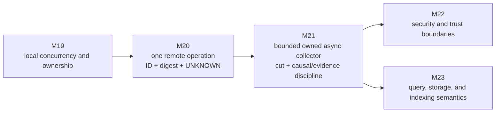
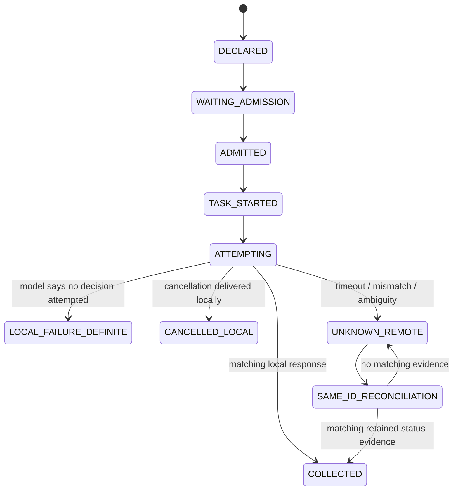
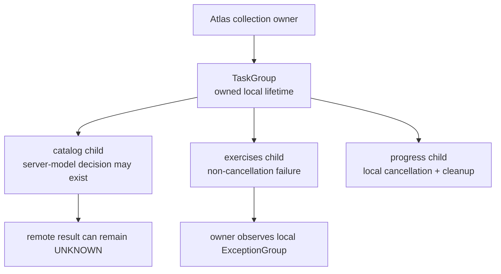
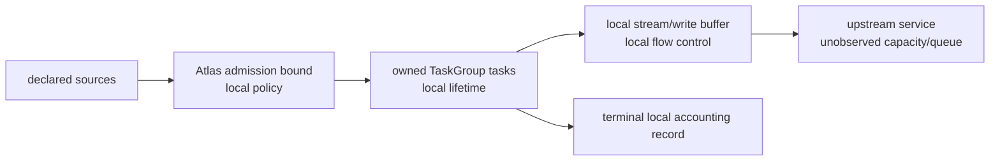
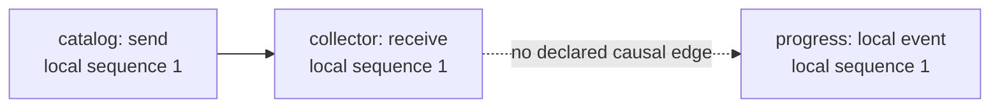

# Module 21 — Async and Distributed Systems

> **Arc IV: coordinate local work without inventing remote certainty**
>
> A program can own a task. It cannot own every queue, clock, replica, or
> response path beyond its boundary. This module makes that distinction useful.

**Documentation and source baseline:** Python 3.14.6; Python public API docs,
PEP 654, IETF/W3C standards, original distributed-systems papers, and public
university course routes last audited 2026-07-30. The full research, licensing,
and claim map is [Module 21 source map](/downloads/module21_async_distributed_source_map.md).

**Executed production baseline:** the local-only reference and its test suite
run on CPython 3.14.6 on Windows. They use synthetic fixtures and make no DNS
query, public connection, listener, cloud request, or timing/fairness claim. A
passing local model is evidence about the named model—not a claim about an
upstream service, replica group, or production event loop.

**Read or run the model:** [runnable local reference](/downloads/module21_reference.py)
and [behavioral tests](/downloads/test_module21_reference.py). They are
inspectable evidence artifacts; they do not contact a network.

**Primary learning surface:** use the visual **Atlas Run Control Room** before
or alongside this workbook. It asks for a prediction and confidence rating,
then reveals one narrowly labelled fact. This workbook is the complete,
accessible, auditable source: every interactive visual has a text equivalent,
every code-reading exercise names a boundary, and every precise technical
claim has an owning source.

**Learning record:** use the Module 21 Notion notebook for task trees,
admission traces, unknown-history matrices, causal graphs, claim audits,
confidence ratings, agent-review notes, and short oral defenses. Link back to
this workbook instead of copying it into disconnected notes.

---

## How to study this module

This is one connected investigation, not a tour of `async`, queues,
microservices, CAP, and tracing vocabulary.

Module 20 gave Atlas one remote publication operation. A timeout could leave
that operation `UNKNOWN`: the client could not honestly promote a local wait
result into a remote decision. Atlas now needs to refresh a release candidate
from three upstream curriculum sources—`catalog`, `exercises`, and
`progress`—before it decides whether it has a usable collection cut. The
generated patch below starts every fetch, filters exception objects out of the
result list, and calls the remainder a consistent snapshot.

```python
tasks = [asyncio.create_task(fetch(source)) for source in sources]
results = await asyncio.gather(*tasks, return_exceptions=True)
publish([item for item in results if not isinstance(item, Exception)])
```

It may execute, but its conclusion is too large. A task can have a local
outcome while a source operation remains unknown. A local timeout can follow a
source-side decision. A callback timestamp is not a cross-source causal order.
Three individually valid records do not automatically make one product-facing
snapshot. And `gather(..., return_exceptions=True)` is not the structured
cleanup behavior of `TaskGroup`—it is the deliberately flawed patch we will
audit before choosing a repair.

We will derive an auditable collector instead:

```text
declared source set + cut policy
→ bounded local admission
→ parent-owned async task group
→ stable source operation ID + canonical digest
→ local attempt observation / named ambiguity
→ same-ID retry or declared status lookup
→ validated collection cut
→ causal, replica, trace, and policy claims kept separate
→ privacy-aware evidence packet
```

For every diagram, trace, code reading, or agent patch:

1. state the exact observation;
2. name its owner and scope;
3. list a compatible history it does **not** rule out;
4. predict the next local transition before looking at an answer;
5. reveal one narrow fact or run one bounded local command;
6. locate the first invalid inference, not just the last visible error;
7. repair the policy, trace, contract, or test; and
8. transfer the rule to another boundary.

You will type very little by design. The work is to read a collector,
reconstruct a task tree, distinguish evidence scopes, classify a partial
failure, and defend a bounded claim. An AI agent can generate syntax quickly;
it cannot responsibly decide which conclusion your evidence supports unless
you supply the model and stopping lines.

### The exact cumulative invariant

Read this before every session. Later, reproduce it without notes.

> **Every Atlas dispatch has one stable operation ID, canonical request digest,
> deadline, and evidence record. Local work is admitted through a bounded,
> explicitly owned async pipeline; every admitted local item receives one
> terminal local accounting record. Cancellation is cleaned up and propagated
> according to the owning structured scope, but is never mislabeled as a remote
> rollback. Every remote retry retains the same operation identity and is
> classified separately from a transport write, a server/replica observation,
> a matching reply, and an unresolved outcome. A trace context correlates
> declared observations; it does not authenticate them, make them complete, or
> prove causality, durability, or replicated agreement. In this collector
> case, the dispatch additionally declares its source set, admission bound,
> deadline/cancellation policy, and publication-cut rule before work starts.**

The invariant has nine obligations:

| Obligation | What you must demonstrate | Tempting non-substitute |
|---|---|---|
| declared run | source set, cut rule, deadline, and owner exist before launch | publishing whatever finishes first |
| task ownership | every child belongs to one named lifetime | loose background tasks and callbacks |
| bounded admission | no more than the declared local work is in flight | creating one task per item immediately |
| operation identity | retry retains ID and digest | a fresh ID after every timeout |
| local accounting | every admitted source gets a named terminal local record | deleting exception objects from a list |
| cancellation boundary | request, cleanup, and remote effect stay distinct | “cancel means it never ran” |
| collection cut | completeness, freshness, and policy are explicit | treating arrivals as a snapshot |
| order/consistency claim | the relation and its assumptions are named | using a timestamp or trace ID as proof |
| evidence scope | task, transport, model, replica, and policy facts remain separate | “the async test passed” |

### Claim labels

Use the narrowest label that supports a sentence. Split a sentence when two
parts require different authorities.

| Label | Authority and stopping line |
|---|---|
| **[ATLAS SPEC]** | this module's declared collector vocabulary and policy; not a general service guarantee |
| **[PYTHON 3.14 CONTRACT]** | documented public `asyncio` behavior; not remote-work evidence |
| **[ASYNC MODEL]** | finite task/queue/stream fixture; not a scheduling, performance, or fairness proof |
| **[DISTRIBUTED MODEL]** | named processes, links, events, or replica assumptions; not the Internet |
| **[IETF/W3C STANDARD]** | a named protocol or observability specification with its own scope |
| **[UNIVERSITY READING]** | teaching sequence only; never the sole operational authority |
| **[LOCAL REFERENCE RESULT]** | output of the named synthetic command and fixture |
| **[CLIENT/TASK OBSERVATION]** | what an Atlas task observed locally |
| **[REMOTE/SERVER OBSERVATION]** | explicitly scoped server-model or server-local fact |
| **[ATLAS POLICY]** | declared admission, deadline, retry, retention, or cut choice |
| **[HYPOTHESIS]** | one compatible history awaiting discriminating evidence |
| **[UNKNOWN]** | a fact the current evidence does not establish |

### Runtime evidence card

| Record | Value | Supports | Does not support |
|---|---|---|---|
| documentation target | Python 3.14.6 | version-scoped public API reading | an execution result |
| executable reference | CPython 3.14.6 on Windows | named local tests and synthetic JSON packet | another implementation, host, or scheduler |
| fixture | `run-2026-07-30-a`; `catalog`, `exercises`, `progress` | repeatable local identities, traces, and cut policy | production user/source data |
| admission bound | `max_in_flight = 2` | a local model never observes more than two attempts | upstream capacity, fairness, or latency |
| source adapter | scripted in-memory transport | modelled lost reply/replay/conflict histories | an RPC, broker, or cloud service contract |
| trace ID | fixed synthetic correlation ID | correlation of named packet fields | trust, completeness, causality, or delivery |
| public network | deliberately unused | privacy and repeatability boundary | reachability or availability |

---

## 1. Position in the knowledge system

### 1.1 The bridge from Module 20

Module 19 made local concurrency visible: multiple histories, ownership,
progress, synchronization, and model selection. Module 20 let one operation
cross a remote boundary and taught us to retain `UNKNOWN` when client evidence
could not distinguish compatible histories. Module 21 retains both disciplines
while Atlas owns **several overlapping local tasks** and faces possible
cross-system ambiguity.



### 1.2 Four state machines, not one story

The most common async/distributed bug is a silent promotion from one state
machine into another. Keep these four rows distinct on paper while reading any
service.

| State machine | Example state | It may establish | It must not establish |
|---|---|---|---|
| local execution | `atlas-collect:catalog` is awaiting an adapter | an event-loop task reached a local suspension point | that a source received, parsed, or committed a request |
| local pressure | two admission slots are occupied | this collector model has two in-flight attempts | remote capacity, queue durability, or fair service |
| remote effect | scripted ledger retained one decision | a named **server-model** transition | a real service, quorum, or durable outcome |
| cross-system knowledge | matching status lookup returned the declared ID/digest | this policy permits a scoped confirmation | global agreement, freshness, or security |



**Important precision.** `UNKNOWN_REMOTE` is terminal for the **current local
attempt record**. It is not a magic terminal for the underlying source
operation. A later, separately owned reconciliation task may produce new,
scoped evidence. Do not edit the old attempt into a story it could not know.

### 1.3 Fixed incident and fixture

Atlas declares this run before work begins:

```text
run ID             run-2026-07-30-a
sources            catalog, exercises, progress
API version        atlas-collect/1
source operation   run-2026-07-30-a/<source-id>
source epoch       <source-id>-v1 in the synthetic fixture
admission bound    2 local attempts
cut policy         all three validated source records required for FULL
deadline policy    record local timeout/cancellation; do not infer rollback
retry policy       retain ID + canonical digest; reconcile before promotion
```

Before reading code, answer this aloud: **What is the smallest claim Atlas can
make if `catalog` times out, `exercises` validates, and `progress` validates?**

Answer: a named full-cut policy rejects this collection as incomplete; the
`catalog` task has a locally scoped ambiguous outcome. It does not follow that
`catalog` is failed, untouched, old, or rolled back.

---

## 2. Session 1 — `await` releases control; it does not transfer responsibility

### Pressure

“The function has `async`, so all its requests happen safely in parallel.”

That sentence hides several distinct transitions. In the Python public model,
a coroutine function call constructs a coroutine object; a Task schedules a
coroutine in an event loop; one task at a time runs in an event-loop thread and
gives the loop a chance to run other tasks when it awaits a Future. Those are
local scheduling statements—not request-send, remote-start, or remote-result
statements. See the [Python `asyncio` overview](https://docs.python.org/3.14/library/asyncio.html)
and [Tasks documentation](https://docs.python.org/3.14/library/asyncio-task.html).

```text
coroutine function call
→ coroutine object
→ explicitly owned/scheduled Task
→ runs until a cooperative await point
→ later returns, raises, or receives cancellation
→ parent observes a local task outcome
```

### Read this before running it

```python
async def fetch_catalog():
    return await adapter.fetch("catalog")

pending = fetch_catalog()             # a coroutine object exists
# No task owner has scheduled it yet.

async with asyncio.TaskGroup() as group:
    task = group.create_task(fetch_catalog(), name="atlas-collect:catalog")
    # An owned local Task now exists. It may start eagerly; no remote effect is implied.

result = task.result()                # parent observes its local terminal result
```

| Moment | May say | Must not say |
|---|---|---|
| `fetch_catalog()` returned | a coroutine object was constructed | a fetch began |
| `create_task(...)` returned | this scope owns a local task; it may already have begun under an eager-start policy | catalog received a request or the child has not run yet |
| child reaches `await adapter.fetch(...)` | local task yielded at a declared boundary | an adapter made a remote decision |
| parent reads a result/exception | parent observed a local task outcome | every external effect is known |

**Timing boundary.** Returning from `create_task` establishes ownership, not
that no child code has run. Python 3.14 can start a task eagerly through the
loop/task-factory policy, so creation order is not necessarily start order. If
admission must precede child work, put an explicit start/admission gate in the
declared protocol rather than infer it from the return of `create_task`.

### Code-reading lab A1 — the orphaned coroutine

An agent writes this in a request handler:

```python
for source in sources:
    refresh(source)       # the returned coroutine is ignored
```

Do not repair it yet. Answer:

1. Which object exists after `refresh(source)`?
2. Who owns its lifetime?
3. Where can its error be collected or propagated?
4. What remote effect is established?

**Model answer.** A coroutine object exists. Nothing has given it a declared
task owner or awaited it. Its eventual lifetime/error behavior is not a
collector policy. No remote fact is established. The repair is not merely
“add `async` somewhere”; it is to place the work in an owned scope with an
admission, failure, cancellation, and evidence rule.

### First-principles checkpoint

Choose one statement and record confidence 1–4 in the visual studio.

> Immediately after `TaskGroup.create_task(fetch(catalog))`, what is
> established?

- A. Catalog has received the request.
- B. An owner-held local task has been scheduled.
- C. The coroutine owns itself and will clean up at process exit.
- D. Atlas has a consistent collection cut.

<details>
<summary>Reveal after predicting</summary>

**B** is the narrow answer. It is a local task-ownership fact. Under an
eager-start policy, child code may already have begun; a request send, remote
admission, and collection cut still need other evidence and policy steps.

</details>

### Prediction before reveal — task ownership

**Current candidate-only supplement.** Before opening the answer below,
predict the narrowest fact after a collector creates a coroutine and then
passes it to `TaskGroup.create_task`. Record confidence `1–4`, the local owner,
and one remote fact that is still not established. This is not evidence of
review, release, or learner mastery.

<details>
<summary>Reveal after the prediction and confidence record</summary>

The task group owns a local task. It may already have begun if the loop uses an
eager-start policy. Neither fact establishes a request send, remote admission,
remote effect, rollback, or a complete collection cut. The smallest repair for
a broader claim is to name the event boundary and the evidence that reaches it.

</details>

### Session artifact

Make a four-column task strip for each source:

| Source | Owner | current local state | unresolved remote question |
|---|---|---|---|
| catalog | `collector TaskGroup` | scheduled / awaiting / terminal | did the upstream source perform the intended operation? |
| exercises | `collector TaskGroup` | … | … |
| progress | `collector TaskGroup` | … | … |

Do not put a single “done” column on this strip. “Done” has no useful meaning
until you state **whose** lifecycle and **which** effect it names.

---

### Session 1 output — await responsibility trace

One trace shows where control was released and demonstrates that responsibility for the operation did not move with it.

## 3. Session 2 — Structured lifetime gives a boundary, not magic rollback

### Pressure

“If the `TaskGroup` exits, every child effect either completed or was undone.”

No. `TaskGroup` is valuable because it gives the parent ownership: it waits
for its child tasks, and a non-`CancelledError` child failure causes sibling
cancellation under the documented local structured-concurrency rules. After
children finish handling, the scope raises an `ExceptionGroup` as appropriate.
That says something strong about the **local child-task lifetime**. It does not
turn cancellation into an external rollback protocol. Read the [TaskGroup API](https://docs.python.org/3.14/library/asyncio-task.html#task-groups),
[cancellation guidance](https://docs.python.org/3.14/library/asyncio-task.html#task-cancellation),
and [PEP 654](https://peps.python.org/pep-0654/).



### Cancellation vocabulary: do not collapse the verbs

| API/event | Local documented meaning | Does **not** establish |
|---|---|---|
| `Task.cancel()` | asks a task to raise `CancelledError` at a later opportunity | forced stop at a known line, peer cancellation, rollback |
| `asyncio.timeout()` | cancels the current task on expiry and transforms the local outcome to `TimeoutError` outside its context | that an awaited operation never happened |
| `asyncio.wait_for()` | waits with a timeout, cancels the awaited task on timeout, then waits for cancellation | a remote non-effect |
| `asyncio.wait()` | returns done/pending task sets on timeout | automatic cancellation of pending tasks |
| `asyncio.shield()` | shields the nested awaitable from the caller's cancellation | immunity from all cancellation or external rollback |
| `try` / `finally` + re-raise | lets a task clean up and preserve cancellation semantics | that cleanup repairs a remote state |

These local distinctions come from the [Python task API](https://docs.python.org/3.14/library/asyncio-task.html). Never casually catch and suppress `CancelledError`; structured-concurrency components use cancellation internally and expect it to propagate after cleanup unless a documented boundary deliberately changes it.

### Inspect the local probe

The downloadable reference includes `run_taskgroup_failure_probe()`. Its trace
is deliberately timer-free:

```text
OWNER_ENTERED
SIBLING_STARTED
FAILING_CHILD_RAISED
SIBLING_CANCELLED_AND_CLEANED
OWNER_OBSERVED_EXCEPTION_GROUP
```

The probe demonstrates one model boundary: the sibling is waiting at an
explicit cooperative `Event.wait()` point, a child raises a non-cancellation
error, and the owner sees the grouped failure after sibling cancellation and
cleanup. It does **not** demonstrate an external service, a network
cancellation, or a distributed transaction.

### Code-reading lab A2 — exception-list publication

Return to the opening patch:

```python
results = await asyncio.gather(*tasks, return_exceptions=True)
publish([item for item in results if not isinstance(item, Exception)])
```

Find the first unsupported claim in this review comment:

> “The group already cleaned up every child, so filtering errors is an
> availability-safe partial snapshot.”

**Answer.** There is no `TaskGroup` in this code, so “the group already cleaned
up every child” is already unsupported. Even after a structured lifetime is
introduced, local cleanup does not choose a publication policy. A partial cut
must be deliberately permitted, labelled, and justified; the fixed Atlas run
instead requires a full cut.

### Session artifact — cancellation evidence card

For a source that times out or is cancelled, fill this in before proposing a
retry:

| Question | Your answer |
|---|---|
| Which task/scope requested or delivered cancellation? | |
| Which `finally`/cleanup step completed locally? | |
| What source-side or server-model fact is actually recorded? | |
| Which remote histories remain compatible? | |
| Does the existing cut policy accept this record? | |
| What separate reconciliation task, if any, has a declared owner? | |

---

### Session 2 output — task lifetime boundary note

One note states what structured lifetime guarantees at a scope exit, and what it explicitly does not roll back.

## 4. Session 3 — Bounded admission makes overload a policy decision

### Pressure

“Async means it is fine to start everything.”

Async removes neither allocation, queueing, file descriptors, source capacity,
nor the need to decide who waits. It makes the waiting visible in code. Atlas
uses a local in-flight bound of two:

```text
DECLARED: catalog, exercises, progress
bound:    2

catalog   WAITING → ADMITTED → ATTEMPTING → terminal local record
exercises WAITING → ADMITTED → ATTEMPTING → terminal local record
progress  WAITING ────────────────────────→ admitted only when a slot releases
```

The reference uses `asyncio.Semaphore(2)` around the **source attempt**. The
test proves only that its scripted trace never records more than two in-flight
attempts. It does not promise which source the general event loop schedules
first, fair waiting, network throughput, or upstream capacity.

### Queue, semaphore, and task group protect different invariants

| Mechanism | Useful question | Documented/local fact | Not a substitute for |
|---|---|---|---|
| `TaskGroup` | who owns child lifetime/failure cleanup? | parent owns child tasks in its scope | capacity policy |
| `Semaphore` | how many named sections may be in flight? | local admission bound | durable queueing or fairness |
| positive-size `asyncio.Queue` | where does local `put()` wait when full? | bounded local queue capacity | remote broker durability |
| `task_done()` + `join()` | has each dequeued local item been acknowledged? | local task-accounting relation | external completion |
| stream `readexactly()` | did this local reader obtain a declared frame length? | local bytes/EOF observation | peer parse or commit |
| stream `drain()` | has local write-buffer flow control been respected? | local writer-buffer boundary | peer read, parse, or persistence |

See [asyncio queues](https://docs.python.org/3.14/library/asyncio-queue.html)
and [asyncio streams](https://docs.python.org/3.14/library/asyncio-stream.html).
The queue documentation also warns that immediate shutdown can break the usual
`join()` invariant; retain that warning when designing an emergency policy.

### A pressure diagram with stopping lines



### Code-reading lab A3 — the fake bound

```python
async def refresh_everything(sources: list[str]) -> None:
    tasks = [asyncio.create_task(build_and_fetch(source)) for source in sources]
    await asyncio.gather(*tasks)

async def build_and_fetch(source: str) -> Record:
    payload = await build_large_payload(source)
    async with remote_limit:
        return await adapter.fetch(payload)
```

The patch author says, “`remote_limit` means we can handle arbitrarily many
sources.” What is missing?

**Answer.** The limit only surrounds the final adapter call. The code has
already created every task and may concurrently build every large payload. It
does not bound task creation, preprocessing memory, or any unbounded local
queue. Decide where the real admission boundary belongs, name its policy
(wait, reject, defer, shed, or prioritize), and observe it separately.

### Local stream fixture

`read_scripted_frame(chunks=(b"AT", b"L"), expected_bytes=4)` produces an
`ASYNC_STREAM_MODEL` result with `FRAME_INCOMPLETE` and three available bytes.
This uses an in-memory `StreamReader`; it opens no socket. The correct claim is
“the local fixture reached EOF before four bytes.” The incorrect promotion is
“the peer did not parse, acknowledge, or commit.”

### Session artifact — admission timeline

Draw three rows and annotate each transition with one label:

```text
catalog    DECLARED → WAITING → ADMITTED → ATTEMPTING → ______
exercises  DECLARED → WAITING → ADMITTED → ATTEMPTING → ______
progress   DECLARED → WAITING → (slot release) → ADMITTED → ______
```

Then answer: if a `catalog` timeout releases an Atlas local semaphore slot,
what changes? **Only** a local admission slot is available under policy.
Nothing about catalog's upstream work is settled by that release.

---

### Session 3 output — admission policy record

One record turns overload from an emergent behaviour into a declared bound with a stated consequence when it is reached.

## 5. Session 4 — Partial failure is an evidence problem before it is retry code

### Pressure

“Timeout means retry with a new source request.”

That is exactly the Module 20 retry bug, now multiplied across sources. Atlas
must retain one source operation identity and canonical request digest. A
retry can be a new **attempt**; it must not silently become a new intended
operation.

```text
stable source operation ID + canonical digest
→ local attempt
→ connection / timeout / cancellation / response observation
→ definite local model fact or UNKNOWN_REMOTE
→ same-ID retry or explicitly owned reconciliation
→ matching retained status evidence or continued UNKNOWN
```

The reference derives each operation ID from the run and source, e.g.
`run-2026-07-30-a/catalog`. It records the canonical digest of the declared
meaning: API version, run, source, source epoch, target, and operation ID. The
synthetic ledger permits exactly these outcomes:

| Situation | Local classification | Why |
|---|---|---|
| scripted connection error before modelled decision | `LOCAL_FAILURE_DEFINITE` | this particular fixture declares no decision attempt occurred |
| server-model decision, then local timeout | `UNKNOWN_REMOTE` | local timeout does not establish the remote source result |
| same ID + same digest | replay of one model decision | identity retains meaning |
| same ID + changed digest | conflict before another decision | one identity cannot mean two requests |
| response with wrong declared identity/digest | `UNKNOWN_REMOTE` | client cannot bind the response to the intended source operation |
| matching declared status lookup | `COLLECTED` with `STATUS_LOOKUP` scope | a later, specifically scoped model observation |

### Compatible histories after one local timeout

| Compatible history | Same client timeout? | What differentiates it? |
|---|---:|---|
| no source admission occurred | yes | a declared retained status record or source observation |
| source admitted and decided; reply was lost | yes | matching status/replay evidence |
| reply is delayed and may later arrive | yes | a valid response bound to the original ID/digest |
| source decided a different/invalid operation | maybe | response/ledger identity mismatch or conflict evidence |

The timeout does not choose among these histories. An RPC call is not a local
function call; retry behavior and duplicate policy belong in the application
contract. The [ONC RPC specification](https://www.rfc-editor.org/rfc/rfc5531.html)
is useful background precisely because it discusses the ambiguity around lost
replies and procedure execution; Module 20's [HTTP method semantics](https://www.rfc-editor.org/rfc/rfc9110.html#section-9.2.2)
remain a reminder that a protocol verb does not remove application-level
identity and evidence design.

### Rigor card — definitions, assumptions, derivation, counterexample, and numerical experiment

**Definitions.** Let `o` be the client's local timeout observation,
`H0` and `H1` be compatible remote histories, and `UNKNOWN_REMOTE` be the
only classification when the available evidence does not distinguish those
histories. The operation ID and canonical digest name one declared operation;
they do not reveal its remote outcome.

**Assumptions.** The evidence is local, the ID/digest remains stable, and no
matching status or response has yet distinguished the histories. The teaching
fixture is not a replica, a durable production ledger, or a general network
model.

**Derivation / proof idea.** If the local observation is the same in both
histories while the remote outcomes differ, a classifier that sees only that
observation cannot soundly declare either remote outcome:

```text
observe(H0) = observe(H1) = o
remote_outcome(H0) != remote_outcome(H1)
therefore local classifier(o) must not promote either outcome
```

**Counterexample.** A source can decide an operation and have its reply lost;
the client then sees the same timeout it would see if no source admission ever
occurred. Calling the timeout “not committed” is an unsupported promotion.

**Finite numerical experiment.** With the same ID/digest and a declared
two-second local timeout, `H0` (no remote decision) and `H1` (decision plus
lost reply) both initially classify as `UNKNOWN_REMOTE`. A later matching
status record is the discriminating evidence. This is a two-row model check,
not an observation of a real distributed service.

### Code-reading lab A4 — new ID after timeout

```python
try:
    return await asyncio.wait_for(adapter.refresh(source), timeout=2)
except TimeoutError:
    return await adapter.refresh(source, request_id=uuid4().hex)
```

What must be repaired before discussing retry count?

1. Preserve the originally intended source operation ID and canonical digest.
2. Classify the local timeout as ambiguous unless the adapter contract gives
   narrower evidence.
3. Decide whether same-ID retry, retained status lookup, or a still-unresolved
   record is the policy.
4. Record the observed attempt separately from any source/server fact.

The first defect is semantic identity, not the number `2` in the timeout.

### Run and read one evidence packet

```powershell
& '.\python-3.14.6-embed\python.exe' '.\module21_reference.py' --scenario timeout_then_reconcile
```

Run it from `python-advanced-course\work`. The packet contains an initial
rejected-incomplete cut, a `catalog` `UNKNOWN_REMOTE` record, a subsequent
same-ID `STATUS_LOOKUP` record, and a final local-policy `FULL` cut. It also
contains redaction and limitation fields. It does **not** run its tests or call
a source service. The code/test download is the more important artifact: read
which identity comparisons must all match before status evidence promotes the
local record.

### Session artifact — retry/reconciliation card

| Field | Required entry |
|---|---|
| intended source operation ID | |
| canonical digest | |
| local attempt observation | |
| server/replica observation, if any | |
| compatible histories still open | |
| same-ID retry / status lookup / retain `UNKNOWN` | |
| new fact required before publication | |

---

### Session 4 output — partial-failure evidence matrix

One matrix maps each observation to the failure histories it is compatible with, before any retry code is written.

## 6. Session 5 — Time is a local instrument; order is a declared relation

### Pressure

“The most recently timestamped callback wins, so this is the newest consistent
snapshot.”

A local callback order is useful evidence about that callback's execution in
that local process. It is not automatically source version order, causal order
between processes, or an atomic cross-source cut. The key idea comes from
Lamport's [*Time, Clocks, and the Ordering of Events in a Distributed System*](https://www.microsoft.com/en-us/research/publication/time-clocks-ordering-events-distributed-system/):
causal order is a partial relation derived from local order and communication
edges, not a convenient total wall-clock order.

```text
same local trace ID      ≠ causal edge
later local callback     ≠ newer source epoch
later wall timestamp     ≠ global order
one node's source version ≠ atomic snapshot across all sources
```

### Causality board

The reference's `CausalLedger` has event IDs, process-local sequences, and
explicit send-to-receive edges. It can say:

```text
catalog-send      HAPPENS_BEFORE catalog-receive
catalog-receive   INCOMPARABLE   progress-local
```

It refuses to infer an edge from a shared trace ID or a timestamp because
neither occurs in its causal input. That refusal is the feature.



### Order-claim matrix

| Evidence | Supports | Does not support |
|---|---|---|
| local callback sequence | order of those recorded local callbacks | source freshness, cross-process causality, an atomic cut |
| source-provided epoch/version under a stated source rule | ordering within that source's declared version scheme | comparison with another source's unrelated epoch |
| explicit send → receive edge | one causal happens-before relation | a global total order |
| shared `traceparent`/trace ID | correlation of observations in one trace context | completeness, trust, delivery, causal proof |
| wall-clock timestamps | recorded local/producer time readings | synchronized global order without a clock contract |

The [W3C Trace Context Recommendation](https://www.w3.org/TR/trace-context/)
and [OpenTelemetry trace API](https://opentelemetry.io/docs/specs/otel/trace/api/)
standardize correlation vocabulary. They are extremely useful for navigation
and diagnosis; they do not authenticate a peer or prove all observations are
present, ordered, durable, or safe to export.

### Code-reading lab A5 — timestamp sort as a consistency proof

```python
latest = sorted(results, key=lambda result: result.callback_finished_at)[-1]
return Snapshot(records=results, consistency="globally latest")
```

List the invalid promotions in order:

1. a callback timestamp becomes a source freshness rule;
2. one source's apparent recency becomes a cross-source ordering relation;
3. cross-source ordering becomes a global/atomic consistency claim.

Repair by declaring the actual product need. For the fixed fixture, Atlas
requires **all three validated records under one named full-cut policy**. It
does not claim cross-source transactional atomicity. If the product later
needs a freshness relationship, it must own a version/read contract that
states how epochs are compared and validated.

### Session artifact — order card

For each assertion you hear, write one of these verdicts:

| Assertion | Verdict | Missing condition/evidence |
|---|---|---|
| “This callback ran after that callback here.” | local order | none beyond trace integrity/scope |
| “Catalog v7 is after catalog v6.” | source order | catalog's declared version rule |
| “Catalog update caused progress update.” | causal claim | explicit path or application contract |
| “The whole snapshot is newest.” | not established | cross-source cut/freshness contract |

---

### Session 5 output — ordering and clock assumption note

One note separates a local timestamp from a declared ordering relation and names the assumption each conclusion rests on.

## 7. Session 6 — Consistency and availability are choices with assumptions

### Pressure

“We used retries and a task group, so Atlas is reliable and consistent.”

Those mechanisms help only under the assumptions and policies you name.
Distributed-systems vocabulary is not a set of impressive adjectives to
append to a service. It is a requirement → assumption → mechanism → evidence
chain.

```text
product requirement
→ fault assumptions
→ chosen protocol/mechanism
→ evidence collected at named boundaries
→ narrow claim
→ explicit non-claim
```

The literature gives useful precision, not shortcuts. [Herlihy and Wing's
linearizability paper](https://www.cs.cmu.edu/~wing/publications/HerlihyWing90.pdf)
defines a named operation-level correctness condition. The [CAP formalization](https://groups.csail.mit.edu/tds/papers/Gilbert/Brewer2.pdf)
and [FLP result](https://groups.csail.mit.edu/tds/papers/Lynch/jacm85.pdf)
make assumptions and impossibility boundaries explicit. They do **not** imply
“pick two,” “async code cannot be reliable,” or “one passing local test proves
consensus.”

### Replica-claim ladder

Move upward only when the named mechanism and evidence support the next rung.

| Rung | Example claim | What this module's fixture can show | Still not established |
|---|---|---|---|
| 1 | local task record | one Atlas task classified an attempt | peer effect |
| 2 | synthetic server-model decision | one named fixture ledger retained `COLLECTED` | live service behavior |
| 3 | `node-a` applied in a replica model | one named node observation | node-b, quorum, durability |
| 4 | Atlas `FULL` collection cut | all declared source records validate under Atlas policy | linearizable multi-source snapshot |
| 5 | linearizable operation | a stated implementation and proof/contract would be required | inferred from a local adapter |
| 6 | convergence under stated conditions | a stated replica mechanism/fault model would be required | inferred from retries |

`assess_replica_claim(expected_replicas=("node-a", "node-b"),
observed_applied_replicas=("node-a",))` returns
`REPLICA_OBSERVATION_ONLY`. Its non-claim is explicit: one named replica
observation does not establish global agreement, durability, availability, or
linearizability.

### Evidence packet auditor

An evidence packet should help a future investigator reproduce your **narrow
claim** without exporting user data or turning one trace into a fictional
omniscient log. Classify the fields below.

| Field | Correct scope/use | What to reject or retain |
|---|---|---|
| `task_trace` | client/task local accounting | not an external-effect proof |
| `attempt_trace` | async-model admission/attempt history | not a fairness trace |
| `server_model` | synthetic server-model decision | not a production server log |
| `trace_context.trace_id` | correlation | not authentication or causal completeness |
| `collection_cut` | Atlas policy classification | not global consistency |
| raw source payload | unnecessary for this evidence packet | omit/redact |
| credential/token | security-sensitive and unnecessary | omit/redact |
| real endpoint/environment value | unnecessary and potentially sensitive | omit/redact |

The downloadable packet includes `redaction` and `limitations`, including
“not a distributed-system proof.” A limitation is not an apology. It is part
of the contract that prevents a future maintainer, auditor, or AI agent from
reusing evidence beyond its scope.

### Two legitimate Atlas policy choices

| Policy | Requirement | Action under a timeout | Claim Atlas may make |
|---|---|---|---|
| fixed teaching policy | all three validated source records before publication | reject incomplete cut; reconcile or retain `UNKNOWN` | “FULL under this declared synthetic/full-cut policy” only after evidence |
| alternative product policy | partial/stale material is explicitly useful and labelled | publish a named partial/stale cut with provenance | “PARTIAL_PERMITTED under declared policy,” not a complete snapshot |

Neither is “more async.” The choice belongs to product/system requirements;
Module 25 will later bring human evidence to product policy. The fixed
reference models the first choice and deliberately rejects incomplete full
cuts.

### Code-reading lab A6 — adjective audit

An AI agent proposes this release note:

> “Our highly available, globally consistent async collector guarantees
> exactly-once source refreshes, because `TaskGroup`, retries, and tracing
> handle all failures.”

Circle the **first** unsupported phrase, then the next. A strong review can
start with “highly available” because no availability definition/fault model is
provided. “Globally consistent,” “exactly-once,” and “all failures” are also
unsupported. The repair is not to replace them with softer marketing language;
it is to state the actual tested policy and non-claims:

> “The local synthetic collector owns bounded child-task lifetime, retains a
> source operation ID/digest through reconciliation, and accepts a `FULL` cut
> only when its declared source records validate. It does not establish live
> availability, global agreement, exactly-once delivery, trust, or durability.”

### Session artifact — requirement-to-claim matrix

| Requirement | Fault assumption | mechanism/policy | evidence | defensible claim | non-claim |
|---|---|---|---|---|---|
| all sources must be present | response may be lost | same-ID status lookup + full-cut rejection | matching records/packet | fixed full cut | global atomic snapshot |
| bounded local pressure | work can arrive faster than local processing | admission bound/queue policy | in-flight trace | local max in flight | upstream throughput guarantee |
| debug one incident | observations need correlation | trace context + scope labels | redacted packet | correlation of named records | trust/completeness/causality |

### Transfer task — trace is not trust

**Current candidate-only supplement.** Change one premise in the matrix: the
trace field now arrives from an untrusted external service. Before inspecting
any answer, predict which local correlation claim remains and which claim must
move to the Module 22 trust boundary. Record confidence `1–4` and one
observation that would be needed before a stronger claim. This is a conceptual
handoff, not a navigation, review, release, or mastery change.

<details>
<summary>Reveal after the prediction and confidence record</summary>

The named trace may still correlate the local records that Atlas chose to
record. It does not authenticate a source, make the trace complete, or prove a
causal remote history. The transfer is to state the trust question and retain
the local non-claim rather than silently strengthening it.

At the external boundary, do not silently forward the received context. Module
22 requires the owner to choose a trace disposition—drop it, restart a local
context, or continue only under a format, size, privacy, and trust policy—then
use a generated/redacted local reference for evidence. Authentication and
authorization remain separate questions.

</details>

---

### Session 6 output — consistency choice dossier

One dossier states the consistency and availability choice, its assumptions, and the observation that would falsify it.

## 8. The Atlas Run Control Room — visual studio text equivalent

The HTML studio is intentionally an integrated control room rather than six
decorative cards. Move through it in order. Each view requires one prediction
and a confidence rating before its answer-bearing evidence appears. “Coverage”
means only that you explored a view; it is not a mastery score.

| View | Prediction checkpoint | What you reveal | Transfer question |
|---|---|---|---|
| 1. Coroutine → task | what follows after `TaskGroup.create_task`? | local lifecycle rail and unresolved remote questions | who owns a detached agent job? |
| 2. Scope → cancellation | what does a non-cancellation child failure establish? | TaskGroup tree; timeout/wait/shield non-claim table | what does cleanup not undo? |
| 3. Bound → admission | what changes after one of two slots reaches a terminal local record? | admission pipeline, queue, `task_done`, and `drain` stopping lines | where is the real bound in an AI patch? |
| 4. RPC → `UNKNOWN` | what preserves meaning after a timeout? | compatible histories and same-ID reconciliation ladder | which new fact would discriminate them? |
| 5. Trace → relation | what follows from callback order plus a shared trace ID? | causal board and order-claim matrix | can a timestamp prove freshness? |
| 6. Claim → evidence | what can a synthetic full cut defend? | replica claim ladder plus evidence-packet auditor | which adjective must be removed first? |

**Accessibility contract.** The studio uses native radio controls and visible
legends; its tabs support Arrow keys, Home/End, focus movement, and a text
equivalent. It stores only each view's selected answer, confidence, and reveal
state locally in the browser. It does not store notes, source payloads,
endpoints, credentials, or trace values. It has strong focus visibility,
reduced-motion treatment, narrow-width table handling, and no SVG-only
meaning.

---

## 9. Eight-level problem ladder

Do not skip to a project because you can recall API names. A level is complete
when you can defend its answer against a tempting overclaim.

| Level | Capability | Representative task |
|---:|---|---|
| 1. Recognize | separate coroutine/task/local/remote facts | label four statements after `create_task` |
| 2. Trace | follow one source through local lifecycle states | complete a task strip with owner and scope |
| 3. Frame | state structured failure/cancellation boundary | draw the TaskGroup tree and non-claim |
| 4. Bound | calculate legal admission states | step three sources through `max_in_flight=2` |
| 5. Classify | keep timeout/cancellation/retry evidence honest | classify three compatible timeout histories |
| 6. Compare | distinguish callback, source, and causal order | audit a “globally latest” timestamp sort |
| 7. Design | state run/cut/retry/evidence policy | write a one-page source collector declaration |
| 8. Defend | review an AI patch and bounded product claim | present rejection, repair, test, and non-claim |

Use the ladder recursively: a difficult Level 8 critique often reveals that a
Level 3 ownership rule or Level 5 evidence classification was missing.

---

## 10. Confidence-aware diagnostic — eight fast, deep checks

For each question choose A–D and record confidence 1–4 **before** revealing
the explanation. A high-confidence wrong answer earns a short counter-trace;
a low-confidence correct answer earns a contrast explanation. The point is to
calibrate reasoning, not to simulate an exam.

### Q1 — coroutine, task, result

`refresh("catalog")` returns a coroutine object that no owner schedules. What
is established?

- A. The refresh began remotely.
- B. A local coroutine object exists; its lifetime is not yet owned/scheduled.
- C. The source has a queued durable job.
- D. A parent can read the refresh result.

<details><summary>Answer and repair</summary>

**B.** Add a declared task owner/await boundary; do not infer anything beyond
the local object construction.

</details>

### Q2 — structured failure

In a `TaskGroup`, one child raises `ValueError` after a sibling has crossed an
adapter boundary. What is strongest?

- A. The sibling's external effect rolled back.
- B. The parent owns local sibling cancellation/cleanup and eventual grouped failure handling.
- C. The group has produced a partial collection cut.
- D. No source request occurred.

<details><summary>Answer and repair</summary>

**B.** Use task/adapter/server evidence separately before stating an external
effect.

</details>

### Q3 — bounded admission

Three sources use an Atlas `Semaphore(2)`. Catalog reaches a terminal local
record. What follows?

- A. Catalog's upstream operation did not happen.
- B. Exactly one source always starts next in source-list order.
- C. One local admission slot can be used under the declared policy.
- D. The upstream has capacity for another request.

<details><summary>Answer and repair</summary>

**C.** The bound is local and does not prove fairness or remote capacity.

</details>

### Q4 — timeout after possible decision

An attempt times out after a scripted ledger recorded `COLLECTED`, but before a
matching reply reaches the task. Which local record is honest?

- A. `FAILED_REMOTE`.
- B. `CANCELLED_REMOTE`.
- C. `UNKNOWN_REMOTE` with a local-timeout observation.
- D. `COLLECTED` because the client planned the request.

<details><summary>Answer and repair</summary>

**C.** Preserve ID/digest; use same-ID reconciliation or retain unknown.

</details>

### Q5 — identity

Which retry preserves the operation's meaning?

- A. new ID, same payload
- B. same ID, changed source epoch/digest
- C. same ID and canonical digest, with a separately recorded new attempt
- D. no ID if a trace ID exists

<details><summary>Answer and repair</summary>

**C.** A trace ID is correlation data, not application idempotency identity.

</details>

### Q6 — collection cut

Under a full-cut policy, two records validate and one is `UNKNOWN_REMOTE`.
What may Atlas publish as the fixed fixture's full cut?

- A. nothing called `FULL`; the cut is rejected incomplete
- B. the two successes as a full snapshot
- C. a retry-count average
- D. the last callback result

<details><summary>Answer and repair</summary>

**A.** An alternative partial policy can exist, but it must be explicitly
declared and labelled.

</details>

### Q7 — order

Progress's callback finished locally after catalog's callback, and both carry
the same trace ID. Which follows?

- A. progress causally followed catalog
- B. progress has the newer source epoch
- C. the local callbacks have a recorded local order and their observations correlate
- D. the collection is atomically consistent

<details><summary>Answer and repair</summary>

**C.** Add explicit source/version or communication edges before any stronger
relation.

</details>

### Q8 — claim audit

Three matching synthetic records satisfy the fixed source set and full-cut
policy. Which release statement is defensible?

- A. “Atlas guarantees global consistency and exactly-once refresh.”
- B. “The named synthetic fixture produced a FULL cut under Atlas policy.”
- C. “All replicas committed every future update.”
- D. “Tracing authenticated the upstream sources.”

<details><summary>Answer and repair</summary>

**B.** It names fixture, policy, and scope. Every other option silently adds
distributed or security guarantees.

</details>

### Diagnostic misconception-repair map

**Current candidate-only supplement.** Use the pattern of a response and its
confidence to choose a repair, not to assign a verdict. It does not change the
historical audit, review, release, or mastery state.

| Misconception label | Smallest repair | Delayed changed-premise check |
|---|---|---|
| `await-is-remote-effect` | draw the local owner, await point, and unresolved remote fact | replace the awaited call with a timeout |
| `cancellation-is-rollback` | name cleanup, local terminal record, and the remote non-claim | let the remote outcome remain unknown |
| `bound-is-end-to-end-capacity` | locate every task, queue, stream, and downstream allocation boundary | add one unbounded adapter buffer |
| `trace-is-causality-or-trust` | distinguish correlation, causal edge, and authenticated source | vary the clock or an incoming trace field |
| `one-replica-is-global-agreement` | write the contract and fault assumptions before the claim | remove one replica observation or add a partition |

---

## 11. Cumulative project — Atlas async collector evidence dossier

This project evaluates architecture reading, state reconstruction, debugging,
and claim discipline more than handwritten volume. You may use an AI coding
agent only with an explicit brief and review protocol.

### Scenario

Atlas must collect the declared three-source release input. One generated patch
has detached work, unbounded admission, a regenerated retry ID, timestamp-based
snapshot claims, and an overconfident release note. Read it, repair the
smallest necessary policy/model boundaries, and produce an evidence dossier.

### Required deliverables

1. **Architecture map** — source set, task owner, admission boundary, adapter,
   ledger/status seam, collection cut, trace, and evidence packet.
2. **Four-state-machine sheet** — local execution, local pressure,
   remote/server-model effect, and cross-system knowledge.
3. **Task/lifetime table** — owner, cancellation path, cleanup, terminal local
   accounting state, and remote non-claim for every source.
4. **Operation-identity proof** — canonical request bytes/digest, same-ID
   replay, changed-digest conflict, and status-lookup comparison.
5. **Seven scenario packets** — full cut, bound two, timeout/reconcile,
   cancellation after decision, connection-before-decision, mismatched
   response, incomplete cut. Label model-only scenarios honestly.
6. **Causal/replica appendix** — one partial-order graph with incomparable
   events and one observation that refuses to promote node-A into agreement.
7. **AI agent brief and review** — invariant, permitted files, test command,
   forbidden claims, and your review verdict against the patch.
8. **Five-minute oral defense** — one rejected claim, one accepted bounded
   claim, the evidence that distinguishes them, and the next missing source of
   evidence.

### Minimal agent brief

```text
Goal: Repair only the local Atlas async collector policy/model.
Invariant: [paste the exact Module 21 invariant].
Permitted files: module21_reference.py and its tests.
Must preserve: local-only fixture, stable source operation identity/digest,
bounded admission, named task ownership, UNKNOWN on ambiguity, redaction.
Must not claim: live RPC delivery, remote rollback from cancellation, scheduler
fairness, global consistency, exactly-once, replica agreement, trust, or
durability.
Acceptance: named standard-library tests green; inspect all changed claims.
Return: diff summary, test result, each assumption, and each non-claim.
```

### Review rubric

| Dimension | Strong evidence | Common weak substitute |
|---|---|---|
| model reading | reconstructs every boundary and state transition | only describes syntax |
| evidence discipline | names scope and unknown histories | treats timeout as failure |
| ownership | one parent/cleanup/accounting rule per child | loose tasks happen to finish |
| pressure | names real admission boundary and overload policy | puts a semaphore around one late call |
| distributed reasoning | states assumptions before a consistency claim | uses CAP/trace/retry slogans |
| code/testing | narrow tests exercise public model seams | a happy-path demo |
| communication | accepted and rejected claims are equally explicit | hides limitations in a footnote |

---

## 12. TA sessions, study-partner protocol, and spaced retrieval

### TA intake rule

Bring one sentence you want to claim, the exact artifact it relies on, your
confidence, its scope label, and the missing discriminating observation. The
TA will not start by giving a solution; the first move is to preserve the
boundary you are about to cross.

### TA studios

| Studio | Bring | TA method | You leave with |
|---|---|---|---|
| Task-lifetime coroner | one task tree or cancellation trace | identify owner, await point, cleanup, and non-claim | corrected lifetime/evidence table |
| Deadline/retry incident board | one timeout/cancellation packet | enumerate compatible histories, preserve ID, choose reconciliation | decision card and next observation |
| Pressure clinic | generated code with a “limit” | locate allocation/task/queue/adaptor boundaries | declared admission/overload policy |
| Distributed-claim clinic | one release sentence or diagram | find earliest unsupported causal/replica/availability claim | narrower defensible statement |

### Supportive oral-defense protocol

**Current candidate-only supplement.** This is a module-specific constructive
oral-defense route for Session 6 evidence. It is not evidence of review,
release, or learner mastery.

### Invitation and starting evidence

Invite the learner to choose one task tree, timeout/reconciliation packet,
causal board, or replica claim. Ask for the exact claim, assumptions, evidence
scope, and confidence before any correction.

### Hint ladder

Use the smallest move that preserves agency: retrieve one definition; point to
one owner or event; show one missing assumption; give one compatible history;
or work a different micro-case. Return the learner to the chosen artifact after
each move.

### Counterexample repair

Use a local timeout with two compatible remote histories, a detached task, or
one-replica observation to narrow an overclaim. The learner repairs the first
unsupported phrase and states what remains unknown.

### Transfer question

Change exactly one premise: make the trace untrusted (M22), increase a local
runtime/performance claim (M24), or vary the asynchronous boundary. Ask which
claim survives, which evidence is missing, and where the question belongs.

### Reflection and learner-controlled evidence summary

End with the chosen claim, confidence, repair, counterexample, transfer,
remaining uncertainty, and next observation. The learner controls this compact
summary; it is not a score or a mastery result.

### Study partner routine (20–30 minutes)

1. **Two-minute teach-back.** Partner A explains one invariant clause without
   API trivia; Partner B asks “what does that not establish?”
2. **Trace swap.** Each draws a source record and one compatible history; the
   other labels scope and next discriminating evidence.
3. **Patch coroner.** Each writes one plausible overclaim into a three-line
   AI patch; the other finds the first invalid promotion.
4. **Confidence calibration.** Revisit one high-confidence error and one
   low-confidence correct answer from the diagnostic.
5. **Exit ticket.** Finish: “A local ______ does not establish ______; I would
   need ______ at scope ______.”

### Retrieval schedule

| When | Prompt |
|---|---|
| 24 hours | Draw the four state machines from memory and add one non-equality per row. |
| 3 days | Classify a timeout, cancellation, and mismatched response without looking up labels. |
| 7 days | Defend why trace correlation does not prove causality or trust. |
| 14 days | Audit a new AI-generated async patch for owner, bound, identity, cut, and evidence scope. |
| before Module 22 | State exactly which gaps remain security/trust questions. |

---

## 13. Resource route and source discipline

Read primary sources for mechanism claims; use university material to see why
the systems sequence is taught as one architecture rather than disconnected
features.

| Route | Use it for | Boundary |
|---|---|---|
| [Python `asyncio` overview](https://docs.python.org/3.14/library/asyncio.html) and [tasks](https://docs.python.org/3.14/library/asyncio-task.html) | coroutine/task/event-loop, TaskGroup, timeout, cancellation semantics | public Python behavior only |
| [Python queues](https://docs.python.org/3.14/library/asyncio-queue.html) and [streams](https://docs.python.org/3.14/library/asyncio-stream.html) | local pressure, task accounting, `readexactly`, `drain` | not a broker/peer/durability contract |
| [PEP 654](https://peps.python.org/pep-0654/) | exception-group and structured-concurrency design context | current docs govern API behavior |
| [RFC 5531](https://www.rfc-editor.org/rfc/rfc5531.html) and [RFC 9110 §9.2.2](https://www.rfc-editor.org/rfc/rfc9110.html#section-9.2.2) | RPC/retry ambiguity and protocol semantics background | not an Atlas delivery guarantee |
| [Lamport 1978](https://www.microsoft.com/en-us/research/publication/time-clocks-ordering-events-distributed-system/) | causal partial order | not a clock-synchronization guarantee |
| [Chandra–Toueg](https://ecommons.cornell.edu/entities/publication/7948ff49-7263-49f8-a29b-d062e7cbb240) | failure-detector assumptions | suspicion is not proven crash |
| [Herlihy–Wing](https://www.cs.cmu.edu/~wing/publications/HerlihyWing90.pdf), [Gilbert–Lynch](https://groups.csail.mit.edu/tds/papers/Gilbert/Brewer2.pdf), and [FLP](https://groups.csail.mit.edu/tds/papers/Lynch/jacm85.pdf) | named distributed-system properties and assumptions | do not convert paper titles into slogans |
| [W3C Trace Context](https://www.w3.org/TR/trace-context/) and [OpenTelemetry trace API](https://opentelemetry.io/docs/specs/otel/trace/api/) | correlation vocabulary | not authentication, completeness, or causal proof |
| [MIT 6.5840](https://pdos.csail.mit.edu/6.5840/) and [Brown Distributed Systems](https://cs.brown.edu/courses/csci1380/) | public university progression and optional further route | do not copy labs, slides, solutions, or assessments |

All explanations, diagrams, exercises, and assessments in this course are
original. Link to and paraphrase primary sources; do not reproduce substantial
paper, RFC, or university-course material. See the source map for exact status,
access, and licensing notes.

---

## 14. Handoff: what Module 21 deliberately leaves open

You can now read an async collector as owned local tasks, bounded local
pressure, stable operation identity, evidence-limited partial failures,
declared causal relations, and policy-scoped collection cuts. You should be
able to say “unknown” precisely and construct the next observation that might
reduce it.

You cannot yet say whether the peer is the intended peer, whether evidence was
confidential, whether a trace was forged, whether an endpoint is authorized,
or whether a hostile input/control plane changes the threat model. Those are
not loose ends to patch with `asyncio`; they are the opening questions of
**Module 22 — Security and Trust Boundaries**.

Carry forward this compact rule:

```text
local scheduling ≠ remote effect
local cancellation ≠ rollback
correlation ≠ causality or trust
one observation ≠ distributed agreement
an allowed cut ≠ an unstated global consistency property
```


## Bench pack

**Bench pack:** `m21` — sparse, two benches. CPython 3.12 floor.
**Emits:** one bench record per benched session, naming that session's declared output.

Bench packs are sparse by policy: a session gets a bench only where running code
reveals something reading cannot. Module 21 was initially excluded wholesale as a
distributed-systems module, and that verdict judged the subject matter rather than
the sessions. Two of them are not about a remote peer at all — they are about
`asyncio` semantics, which are entirely observable in this process, with no socket,
no clock, and no second machine. Those two are benched. The four that genuinely need
a peer are not.

### Bench 2 — task lifetime boundary note

**Session:** 2. **Rungs:** debug and defend, review and verify.
**Executes:** the reference model's `run_taskgroup_failure_probe` on the **real
event loop**, then this bench's own `TaskGroup` in which the sibling records a
decision *before* the failing child raises. Every guarantee is delivered — the
sibling is cancelled, observes its own `CancelledError`, and the owner gets an
`ExceptionGroup` — and the recorded decision is still there afterwards.
Cancellation unwound the task, not the effect, because `CancelledError` arrives at
the next await and everything before it already happened. A control shows an
unstructured `create_task` outliving its failed owner while a `TaskGroup` child
does not, so the lifetime guarantee is real and is not a transaction.
**Cannot establish:** anything about a remote peer. No I/O of any kind, so nothing
about whether a service saw a partial result — which is Module 20's subject.

### Bench 3 — admission policy record

**Session:** 3. **Rungs:** trace, review and verify.
**Executes:** a declared single-clock queueing model — 30 arrivals at one per tick,
a consumer taking three — under two admission policies. The unbounded queue rejects
**nothing**: zero errors, 100% availability, and a last request that waits 61 ticks
against the first request's 3, monotonically non-decreasing throughout. Bounding at
4 rejects 16 arrivals and holds every admitted request under the 15-tick bound the
capacity implies, plateauing at 13–14 ticks once the queue fills: the queue length
*is* the latency budget. The bench also measures what that costs — 14 requests
completed against 30 — because bounding admission is a trade with a loser, and
naming who absorbs it is the review question.
**Cannot establish:** anything about a real server. No variable service time, no
bursty arrivals, and no client retries — and retries are the feedback loop that
turns a slow system into a collapsed one.

### Sessions without a bench

- **Session 1** — qualifies on the rubric and ranked below this pack's cut.
- **Session 4** — partial failure across a real network: a peer that may or may
  not have received the request. An in-process kernel would have to *script* the
  ambiguity that is supposed to be the evidence, which makes the bench a
  restatement of its own answer.
- **Session 5** — replica claims and collection cuts, which need ordering and
  clocks this process does not own.
- **Session 6** — a dossier consuming the earlier sessions rather than producing new
  evidence.

### Bench pack completion record

Records under `benches/records/m21-s*.json`. Each names its session output, carries
at least one labelled claim, and states exactly one thing its evidence cannot support.
