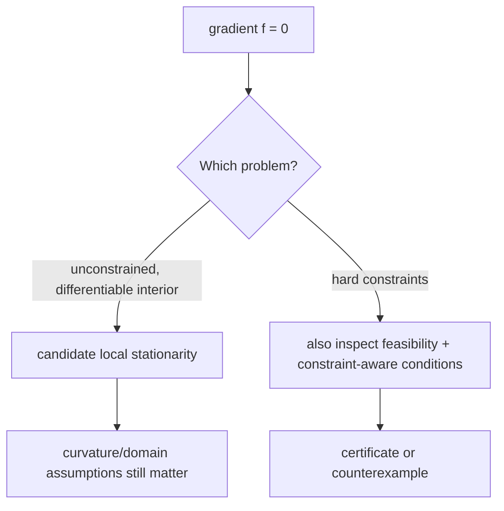

# Module 31 — Optimization & Information

**Hidden review candidate — not learner-delivered.** This is the fixed
learner-material scope for a future qualified review. M31 remains
authoring-only, hidden from the reader manifest, and unrecorded for release.
This file neither opens a portal route nor grants Core credit, publication,
review, release, or mastery evidence.

**Knowledge arc:** Mathematical foundations → systems/AI reasoning

**Prerequisites:** M28 linear algebra and numerical stability; M29 calculus,
real analysis, and continuous change; M30 probability, statistics, and
scientific inference.

**Primary outcome:** Given a decision or scientific claim, you can distinguish
the stated objective from the real goal; define variables, units, feasible
set, uncertainty model, and authority boundary; read a finite algorithm trace
without overstating it; reconstruct a small dual/KKT or information argument;
and prepare an evidence record that says what a result does *not* establish.

This is not a six-session claim of mastery of all convex analysis, nonlinear
programming, control, information theory, variational inference, or modern
optimizer research. It is an advanced first-principles foundation for reading,
debugging, reviewing, and directing such work.

---

## How this module stays connected

### The working invariant

> **An optimization or information claim is credible only when its owner,
> objective, variables, units, feasible set, probability model, algorithm,
> finite evidence, assumptions, and non-claim are visible.**

The recurrence is deliberate: formulation creates the object; geometry says
which mathematical moves are available; constraints add certificates;
algorithms produce bounded computational evidence; stochasticity and
information expose a new trade-off; the final dossier reconnects every layer.

```mermaid
%% atlas-diagram-id: m31-connected-evidence-route
%% atlas-diagram-title: The M31 optimization and information evidence route
%% atlas-diagram-alt: A decision owner defines variables, units, objectives, and constraints before assumptions support a certificate or counterexample; a finite algorithm trace and information trade-off then lead only to a limited recommendation and evidence dossier.
flowchart LR
  Q["Question and decision owner"] --> F["Variables, units, objective, constraints"]
  F --> G["Geometry and assumptions"]
  G --> C["Certificate or counterexample"]
  C --> A["Algorithm and finite trace"]
  A --> I["Stochastic or information trade-off"]
  I --> R["Limited recommendation + evidence dossier"]
```



**Text alternative:** A decision owner first states a question. That question
is translated into variables, units, an objective, and hard constraints. Only
then do geometric assumptions permit a certificate or reveal a counterexample.
An algorithm computes a finite trace; stochastic or information analysis makes
another uncertainty/trade-off visible. The result is a limited recommendation,
not an automatic decision.

### Evidence labels

| Label | It can establish | It cannot establish |
| --- | --- | --- |
| **[DEFINITION / MODEL]** | The declared objective, feasible set, probability distribution, entropy, KL, or update rule. | That it represents the right real-world goal. |
| **[DERIVATION / PROOF]** | A conclusion under named assumptions and a stated domain. | That a finite program, data set, or deployment meets those assumptions. |
| **[FINITE TRACE]** | What this fixture, seed, tolerance, representation, and update rule produced. | A universal rate, robustness claim, or social decision. |
| **[LIBRARY / TOOL CONTRACT]** | A documented interface and configured behavior. | The validity of the mathematical formulation or evidence interpretation. |
| **[AI PROPOSAL]** | A candidate derivation, experiment, or code review. | Correctness, authority, source validity, or a reason to skip inspection. |

### Claim/source labels

Compact labels such as `C04 -> S02–S04` identify the exact claim and its
source route in the [M31 candidate source ledger](../source-maps/module31_optimization_information.md).
They are navigation aids, not borrowed proof text: the assumptions and
counterexample beside the card still control what may be concluded.

### Core evidence card

Keep this card beside every calculation. It is intentionally more useful than
a generic “optimizer succeeded” message.

```text
Question and decision owner:
Variables, units, domain, objective, and hard constraints:
What the objective is a proxy for / what it leaves out:
Probability model or data-generating assumption, if any:
Mathematical category and theorem/heuristic label:
Algorithm, initialization, derivative/oracle, and stopping rule:
Fixture/data identity, seed, dtype/shapes/version/environment:
Observed trace, residuals, certificates, and independent checks:
Assumptions, counterexamples, uncertainty, and non-claim:
Limited next action and who may decide it:
```

---

## Prerequisite retrieval

Before Session 1, answer without notes. These are directions for repair, not
grades.

1. For a quadratic objective, what do its gradient and Hessian say locally?
   Why can poor conditioning change an iterative computation without changing
   the mathematical minimizer?
2. Give a stationary-point counterexample. Which regularity or domain
   condition would be needed before a derivative-based conclusion is valid?
3. Contrast a full gradient with a mini-batch gradient estimate. What does a
   favorable finite run fail to prove?
4. For a finite joint distribution, when is a conditional probability defined?
   In \(\mathbb E[\widehat g_t\mid\mathcal F_{t-1}]\), what past history is
   held fixed, what new randomness is averaged over, and why do support and
   integrability still matter?

If \(\mathcal F_{t-1}\) is unfamiliar, read it as “information known before
the new draw”; Session 5 formalizes that conditional-history boundary.

If 1 is fragile, bridge through M28. If 2 is fragile, bridge through M29. If
3 or 4 is fragile, bridge through M30. Do not start by choosing a library.

---

## Session 1 — Formulate before you optimize

**Launch:** With the Study Partner, name the decision owner, objective, feasible set, units, and one value the model leaves outside before opening the trace.

### Core question

**What exactly are we allowed to optimize?**

**Claim/source trace:** `C01 -> S01, S03` — formulation and objective/constraint
scope. Keep the owner, units, proxy boundary, and non-claim beside the model.

Consider a fictional, non-consequential allocation problem. A study team has a
fixed time budget and wants to choose two preparation activities `x` and `y`.
The first objective they write is

\[
f(x,y) = (x-2)^2 + (y-1)^2.
\]

This is a *mathematical object*, not the team’s actual goal. A real question
still needs units, an owner, an explanation of why distance from `(2, 1)` is a
meaningful loss, and any hard limits that the squared distance misses.

### Build the object in this order

1. **Variables and units.** `x` and `y` are not merely numbers. Here they are
   normalized preparation units; changing the normalization changes curvature
   and step-size meaning.
2. **Objective direction.** Minimization asks for a least-cost/least-loss
   candidate. Maximization is not “the same” until signs and constraint
   interpretation are changed deliberately.
3. **Feasible set.** Add the hard budget
   \[
   g(x,y)=x+y-1\leq 0.
   \]
   A penalty for breaking it is a different problem unless the relationship is
   justified.
4. **Authority boundary.** Even a correctly solved toy formulation cannot
   decide whose time matters or authorize an intervention.

### Prediction before reveal

The unconstrained minimizer is `(2, 1)`. Predict whether it is feasible under
`x + y <= 1`, and predict whether a zero ordinary gradient is enough to
certify the constrained answer.

<details>
<summary>Reveal after writing your prediction.</summary>

**Reveal:** `(2, 1)` violates the hard constraint by `2`. Its ordinary
gradient is zero, but feasibility is false. A constraint changes the reasoning
problem, not merely the visualization.

</details>

### Read the model, do not rewrite it

```python
def objective(x, y):
    return (x - 2) ** 2 + (y - 1) ** 2

def constraint_residual(x, y):
    return x + y - 1  # feasible exactly when this is <= 0
```

Trace the following claims separately:

| Observation | Valid reading | Invalid shortcut |
| --- | --- | --- |
| `objective(2, 1) == 0` | The declared unconstrained objective is minimized there. | The constrained or real decision problem is solved. |
| `constraint_residual(2, 1) == 2` | The point violates this one hard constraint. | The entire formulation is useless. |
| `constraint_residual(1, 0) == 0` | This point lies on the stated boundary. | It is globally optimal without more reasoning. |

### Debugging probe

A teammate writes `return max(0, x + y - 1)` and calls it “the constraint.”
What has been lost? The sign. A residual of `-0.4` says *how far inside* the
feasible set a point lies; the clipped violation does not. Keep both when
reading a constrained trace.

### Output: Objective Geometry Sheet

Write an **Objective–Geometry Sheet** for one non-consequential decision:

- owner and decision that remains human-controlled;
- variables, units, domain, objective, and hard/soft constraints;
- one omitted value or failure mode;
- one rescaling or representation change that could mislead a solver trace.

Use the core evidence card. Save the sentence beginning “This objective does
not establish …”; it will reappear in the final dossier.

### Transfer task — changed authority boundary

Change the fixture from a personal scheduling recommendation to a decision
that affects another person. Keep the same quadratic objective, then identify
the first variable, hard constraint, or authority rule that the model no longer
has permission to choose. Review an AI-proposed formulation for that missing
boundary before accepting any solver trace.

---

## Session 2 — Local equations are not global decisions

**Launch:** Predict whether the local calculation supports a global claim; then name the missing domain, curvature, or regularity premise.

### Core question

**When does a derivative-based local statement become meaningful?**

**Claim/source trace:** `C02–C03 -> S02–S04` — stationarity, curvature,
convexity, and smoothness have a named domain and theorem regime.

For the Session 1 objective,

\[
\nabla f(x,y) = \begin{bmatrix}2(x-2)\\2(y-1)\end{bmatrix},
\qquad
\nabla^2 f(x,y)=\begin{bmatrix}2&0\\0&2\end{bmatrix}.
\]

The Hessian is positive definite, so the *unconstrained* quadratic has a
unique global minimizer. That conclusion uses the full domain `R^2` and this
particular objective. It does not ignore the feasible set.

### Convexity, smoothness, and strong-convexity bridge

A declared feasible domain \(C\) is **convex** when every line segment between
two of its points remains feasible:

\[
u,v\in C,\quad \lambda\in[0,1]
\quad\Longrightarrow\quad
\lambda u+(1-\lambda)v\in C.
\]

A function \(f:C\to\mathbb R\) is **convex** when its value at that mixture is
no larger than the same mixture of values:

\[
f(\lambda u+(1-\lambda)v)\leq
\lambda f(u)+(1-\lambda)f(v).
\]

These definitions are the base layer for the three stronger or different
statements that are often compressed into “the landscape is nice.” In the
Euclidean norm, differentiable `f` is
`\mu`-strongly convex on a declared convex domain when

\[
f(v)\geq f(u)+\nabla f(u)^T(v-u)+\frac{\mu}{2}\lVert v-u\rVert^2,
\qquad \mu>0,
\]

and it is `L`-smooth there when

\[
f(v)\leq f(u)+\nabla f(u)^T(v-u)+\frac{L}{2}\lVert v-u\rVert^2.
\]

For the displayed quadratic, `\nabla^2 f=2I`, so `\mu=L=2` in these
coordinates. That is a statement about this exact objective and norm, not a
property inherited by a data set, a penalty surrogate, or a library call.

Here is the proof idea worth retaining. Strong convexity gives, for distinct
minimizers `u` and `v`, a midpoint inequality with a strictly negative
`-\mu\lVert u-v\rVert^2/8` term. The midpoint would then have lower value than
the two minimizers, a contradiction. Thus a minimizer is unique **if it
exists**. Smoothness instead limits how quickly the gradient can change; it
does not by itself establish convexity, feasibility, or a solver rate.

The counterexample keeps the conditions honest: `h(t)=t^4` is convex, but its
second derivative `12t^2` vanishes at zero, so no positive global strong-
convexity constant follows from this example. Its zero gradient at `t=0` is a
minimum, yet a rate theorem that assumes strong convexity is still unavailable.

### Ridge and conditioning card — regularization has units

Keep the matrix and its coordinates visible. Let

\[
A=\begin{bmatrix}1&0\\0&0.01\end{bmatrix},\qquad
y=\begin{bmatrix}1\\0.01\end{bmatrix},\qquad
\ell_\lambda(\theta)=\frac12\lVert A\theta-y\rVert^2+
\frac{\lambda}{2}\lVert\theta\rVert^2,
\]

with `lambda = 0.01`. The unregularized normal matrix has diagonal
`(1, 0.0001)`, hence condition number `10,000` in these declared coordinates.
The ridge normal matrix has diagonal `(1.01, 0.0101)`, hence condition number
`100`. Its exact solution is approximately `(0.990099, 0.009901)`. The point
is not that `0.01` is a good universal choice: it makes the weak second
direction visibly sensitive to the penalty and to units.

Before looking at a calculation, predict what happens if the same prediction
model is reparameterized by `theta = diag(1, 100) beta`, so that
`A diag(1, 100) = I`, and the *same numeric* `lambda = 0.01` is applied to
`beta`. The data-fit coordinates are equivalent, but the ridge penalty is not:
the mapped-back second coordinate becomes about `0.990099`, not `0.009901`.
A numeric regularization weight has a scale and a unit story.

Use the fixed, local `m31RidgeConditioningCard()` before trusting this card.
It exposes the normal-equation diagonal, analytic and central-difference
gradients at the stated solution, and the rescaling counterexample. It is not
a solver, a tuning recipe, or evidence about a real data set.

```text
normal_matrix = transpose(A) @ A + lambda * identity
right_hand_side = transpose(A) @ y
theta = solve(normal_matrix, right_hand_side)
```

This is language-neutral pseudocode, not a library call. Diagnose the claim,
not merely the line: a review must state the units/scaling of each coordinate,
the condition estimate's norm/definition, the actual `lambda`, the numerical
method, and an independent residual or finite-difference check.

<details>
<summary>Predict before revealing the repair.</summary>

If a Hessian is positive semidefinite at one sampled point, may you report
that the full problem is strongly convex and that a fixed linear convergence
rate applies?

**Reveal:** no. The conclusion needs a positive lower curvature bound on the
declared domain (and a particular norm), plus the algorithm theorem's other
assumptions. A one-point Hessian observation is local finite evidence.

</details>

### A counterexample worth remembering

At `(2, 1)`, the ordinary gradient is zero. Yet the point is infeasible.
At `(1, 0)`, the point is feasible and ultimately becomes the constrained
minimum, yet its ordinary objective gradient is `(-2, -2)`, not zero.



**Text alternative:** A zero gradient is only a candidate local-stationarity
statement for an unconstrained differentiable problem. With hard constraints,
feasibility and constraint-aware conditions are additionally required. In both
cases, curvature and domain assumptions determine what follows.

### Prediction before reveal

Use the central finite-difference idea

\[
\frac{f(x+h,y)-f(x-h,y)}{2h}
\]

at `(1.25, -0.5)`. Predict whether reducing `h` forever makes the check more
trustworthy.

<details>
<summary>Reveal after writing your prediction.</summary>

**Reveal:** no. Truncation error decreases at first, but cancellation and
finite representation can dominate for tiny `h`. A finite difference is an
independent probe, not a proof that the implemented function, autodiff graph,
or formulation is correct.

</details>

### Code-reading task

```python
analytic = (2 * (x - 2), 2 * (y - 1))
numeric_x = (f(x + h, y) - f(x - h, y)) / (2 * h)
```

State four distinct claims:

1. the displayed formula is the analytic derivative of the displayed
   objective;
2. the finite difference approximates that derivative at a chosen `h`;
3. both computations were evaluated in a named representation;
4. neither computation validates the proxy objective or downstream decision.

### Output: Stationarity and Feasibility Ledger

Build a **Stationarity–Feasibility Ledger** with three rows: a local minimum,
a saddle/non-minimum example, and a constrained boundary candidate. Each row
must show domain, gradient, curvature or counterexample, feasibility, and what
you are *not* claiming.

### Transfer task — changed representation

Replace the scalar fixture with a small vector-valued objective whose variables
use different units. State whether a finite-difference agreement still checks
the right thing, choose a rescaling risk to investigate, and reject an
AI-generated conclusion that treats a small numerical discrepancy as proof of
global correctness.

---

## Session 3 — Constraints become certificates only under conditions

**Launch:** Sketch the primal claim, constraint, and dual-feasibility route; say whether strict feasibility or another qualification is actually available.

### Core question

**What would make a constrained claim inspectable rather than ceremonial?**

**Claim/source trace:** `C04 -> S02–S04` — primal/dual construction, a named
constraint qualification, and convexity determine the certificate's scope.

For the convention `g(x,y) <= 0`, use

\[
L(x,y,\lambda)=f(x,y)+\lambda g(x,y), \quad \lambda\geq0.
\]

The KKT checklist for this tiny smooth convex example is:

\[
\begin{aligned}
g(x,y) &\leq 0 &&\text{(primal feasibility)}\\
\lambda &\geq0 &&\text{(dual feasibility)}\\
\nabla f(x,y)+\lambda\nabla g(x,y)&=0 &&\text{(stationarity)}\\
\lambda g(x,y)&=0 &&\text{(complementary slackness).}
\end{aligned}
\]

At `(1, 0)` with `lambda=2`, every displayed condition holds for this
fixture. Slater’s condition is easy to see because `(0,0)` is strictly
feasible. In this differentiable convex setting, the four displayed KKT
conditions are sufficient for global optimality. Slater is the qualification
that supplies the usual strong-duality/dual-attainment route and KKT necessity
here; the matching primal and dual witnesses also prove this finite fixture
directly. None of that is permission to announce that “multipliers solve
constrained problems.”

### Worked primal/dual mini-case — derive the gap before trusting it

Keep the Session 1 variables unrestricted in `R^2` and make the primal problem
explicit:

\[
p^\star=\min_{x,y}\ (x-2)^2+(y-1)^2
\quad\text{subject to}\quad x+y-1\leq0.
\]

For the convention already declared above, the dual function is the best lower
bound obtained after fixing a dual-feasible multiplier:

\[
q(\lambda)=\inf_{x,y\in\mathbb R}
\left[(x-2)^2+(y-1)^2+\lambda(x+y-1)\right],
\qquad \lambda\geq0.
\]

### Prediction before derivation

Before opening the algebra, predict whether `lambda=2` is dual feasible. If a
feasible primal point has value `2`, can a dual lower bound of `2` leave any
positive duality gap?

<details>
<summary>Reveal after writing your prediction.</summary>

Set the two derivatives of the Lagrangian to zero. They give

\[
x=2-\frac{\lambda}{2},\qquad y=1-\frac{\lambda}{2},
\]

and substitution gives the concave one-variable dual function

\[
q(\lambda)=2\lambda-\frac{1}{2}\lambda^2,\qquad \lambda\geq0.
\]

Its maximum is at `lambda=2`, with `q(2)=2`. The primal point `(1,0)` is
feasible and has `f(1,0)=2`. Weak duality says every dual-feasible value is a
lower bound on every feasible primal value, so these matching witnesses prove

\[
p^\star=2,\qquad d^\star=q(2)=2,\qquad p^\star-d^\star=0.
\]

</details>

### Why the certificate has this scope

This is a differentiable convex objective with an affine constraint, and
`(0,0)` is strictly feasible because `g(0,0)=-1`. Thus the usual convex
Slater/KKT theorem applies. The KKT conditions are sufficient for the
global-optimality certificate in this convex setting, while Slater supplies
the theorem's regularity route to strong duality, dual attainment, and
necessity. `(x,y,lambda)=(1,0,2)` is therefore a certificate for this stated
problem; the matching primal/dual values already prove the tiny exact result
directly.

Because `g` is affine in this fixture, an all-affine-constraint qualification
route is also available under its own theorem assumptions. This exercise
deliberately practices the explicit Slater route; removing a strict-feasibility
witness blocks only that stated route, not every possible qualification route.

Do **not** transfer that conclusion unchanged to an integer, chance, nonconvex,
or numerically approximate problem. There, a solver's reported multiplier or
small numerical gap is finite evidence with a tolerance and model boundary,
not an automatically valid strong-duality or global-optimality certificate.

### Prediction before reveal

At `(1,0)`, predict which KKT condition fails if `lambda=-2`. Then predict
what fails if `lambda=0`.

<details>
<summary>Reveal after writing your prediction.</summary>

**Reveal:** `lambda=-2` violates dual feasibility and stationarity. With
`lambda=0`, primal and dual feasibility hold but stationarity fails. A useful
checker returns every failed condition rather than only `false`.

</details>

### Certificate-reading table

| Field | Why it matters | Common overclaim |
| --- | --- | --- |
| constraint sign convention | Determines the multiplier sign and Lagrangian. | “The signs are cosmetic.” |
| primal residual | Distinguishes a feasible point from a near-looking point. | “Small objective means feasible.” |
| dual residual / multiplier | Makes the dual claim inspectable. | “Any multiplier is a shadow price.” |
| complementary slackness | Connects active constraints with multipliers. | “A zero product proves all KKT conditions.” |
| qualification | States why a dual/certificate conclusion applies. | “Convexity alone always gives strong duality.” |

### Two routes, two evidentiary burdens

For this exact fixture, compare the two legitimate routes below before saying
what has been proved. They reach compatible conclusions here, but they are not
interchangeable evidence.

| Route | What must be shown | What it supports — and does not support |
| --- | --- | --- |
| direct matching witnesses | A primal-feasible `(1,0)` with value `2`; a dual-feasible `lambda=2`; the derived value `q(2)=2`; and weak duality. | The exact optimum and zero gap for this stated finite fixture. It does **not** establish a theorem for nearby problems. |
| convex theorem route | Convex `f`, affine `g`, the stated KKT fields, and a named strict-feasibility witness such as `(0,0)`. | The particular Slater/KKT route to strong duality, dual attainment, and KKT necessity for this problem class. It does **not** make qualification automatic elsewhere. |

### Changed-premise oral check — withdraw only the unsupported route

A new evidence packet gives a convex-looking problem and a boundary-feasible
candidate, but no strict-feasibility witness. It has **not** proved that Slater
fails; it has shown only that this packet cannot invoke the explicit Slater
theorem route. Another qualification is available only if the packet
establishes it; in an all-affine-constraint setting, that is a separate route.
In a short oral explanation, say which route must be withdrawn and why. The
direct route remains available only if the packet separately derives matching
primal and dual witnesses. Do not withdraw a conclusion merely by ritual, and
do not retain a theorem route without its stated premise.

### Output: Constraint Claim Table

Create a **Claim Table** for one constrained problem. It must label each line
as definition, derivation, numerical observation, or assumption; include a
missing-qualification counterexample; and make an explicit distinction between
a dual bound and a business/ethical decision.

### Transfer task — changed constraint type

Replace one continuous hard constraint with an integer or chance constraint.
Identify which displayed certificate condition no longer follows unchanged and
what new assumption, relaxation boundary, or counterexample the learner would
need before trusting an agent’s “KKT solved it” explanation.

---

## Session 4 — Read stopping evidence, not solver mythology

**Launch:** Before trusting a solver status, predict which residual and independent check would still be needed for the stated claim.

### Core question

**What does one algorithm’s trace actually show?**

**Claim/source trace:** `C05 -> S02–S04, S09–S10` — a theorem, an API status,
and a finite trace are distinct kinds of evidence.

For the same fixture, projected gradient descent uses a deliberately visible
update:

\[
z_{t+1}=\Pi_{x+y\leq1}\left(z_t-\eta\nabla f(z_t)\right).
\]

`Pi` is a projection onto the named half-space. It is not an implicit call to
a general solver. A trace needs the initial point, `eta`, number of updates,
projection rule, objective, gradient norm, constraint residual, and an
independent check.

### Theorem card — do not turn one trace into the theorem

For an **unconstrained**, differentiable, \(L\)-smooth objective on a convex
domain containing the segment from \(x\) to \(x^+=x-\eta\nabla f(x)\), an
exact gradient step with \(0<\eta\leq1/L\) obeys the descent inequality

\[
f(x^+)\leq f(x)-\eta\left(1-\frac{L\eta}{2}\right)
\lVert\nabla f(x)\rVert^2
\leq f(x)-\frac{\eta}{2}\lVert\nabla f(x)\rVert^2.
\]

That is a stated theorem regime: it explains why one exact *unconstrained*
step decreases this particular objective unless its ordinary gradient is zero.
It does not establish a global optimum, survive loss of smoothness or an
inexact gradient unchanged, or automatically cover the projected update above.

### Rate versus trace — make the hypothesis set visible

For the separate unconstrained quadratic

\[
r(u,v)=\frac12(u^2+100v^2),
\]

the declared Euclidean constants are `mu = 1` and `L = 100`. With exact
gradient descent and `eta = 1/L = 0.01`, the stated function-gap bound is

\[
r(x_k)-r^\star\leq(1-\mu/L)^k\bigl(r(x_0)-r^\star\bigr)=0.99^k\bigl(r(x_0)-r^\star\bigr).
\]

Start at `(1, 1)`: the initial gap is `50.5`; after ten steps the **bound** is
about `45.67`. The actual trace can be much lower because the high-curvature
coordinate is eliminated by this particular step size. A bound need not be
tight to be useful; it makes the condition number and the theorem scope
visible. Inspect [`m31GradientDescentRateCard(10)`](../../lib/m31-optimization-authoring-model.js) and compare every actual
row with its stated upper bound before quoting either number.

Now change one premise. Project the step onto a hard set, use a stale/noisy
gradient, change the dtype, or lose the `L`-smooth condition. Which line of
the displayed theorem no longer follows? Do **not** carry this rate into the
projected finite trace below without a theorem whose own projection, domain,
and error assumptions are written down.

For the declared closed, convex feasible set \(K\), use the different
first-order residual

\[
G_\eta(z)=\frac{1}{\eta}\left(z-\Pi_K\bigl(z-\eta\nabla f(z)\bigr)\right).
\]

With a feasible \(z\), differentiable \(f\), and the named exact projection,
a small \(\lVert G_\eta(z)\rVert\) is only an approximate constrained
first-order-stationarity signal. It is not a global-optimality certificate, a
duality-gap certificate, evidence that the model is appropriate, or a reason
to ignore finite-precision and stopping boundaries.

<details>
<summary>Predict the residue before revealing the boundary case.</summary>

For \(\min_{x\geq0} x\), the boundary optimum is \(x=0\), whose ordinary
gradient is \(1\). Which residual recognizes that the constraint blocks the
descent direction? What premise must be revisited before carrying the descent
inequality into a nonsmooth objective?

**Reveal:** the projected-gradient mapping is zero at the boundary point,
while the ordinary gradient is not. If smoothness is absent, re-derive the
appropriate condition; a falling finite trace cannot import the displayed
smooth-descent bound.

</details>

### Read this record

```text
initial point: (0, 0), feasible
step size: 0.25
unprojected candidate after first step: (1, 0.5)
projected point: (0.75, 0.25)
constraint residual after projection: 0
```

Why did the projection occur? The raw candidate has `x+y-1 = 0.5`. The
projection corrects the *declared* hard constraint. A lower objective after a
few steps is finite evidence for this fixture/configuration, not a statement
about every initial point, step size, precision, or constrained objective.

### Same problem, different solver contract

Projected gradient makes its update and projection visible. A named solver
can be useful, but its interface is an additional contract rather than a
certificate. Compare these two evidence records before comparing outcomes:

| Record | What is explicit | What still needs an independent check |
| --- | --- | --- |
| **Projected-gradient fixture** | exact objective/gradient, half-space projection, initial point, step size, iteration count, and each residual | whether this update rule is appropriate beyond the stated toy problem; convergence or numerical robustness outside the trace |
| **Pinned solver/API call** | package and exact version, method, `fun`, `x0`, derivative/oracle source, bounds/constraints, options/tolerances, dtype, and returned status/message/iterations | whether the method's documented stopping fields are small enough for the declared claim, whether the model is right, and whether an analytic/KKT/oracle check agrees |

For example, this is a **contract-reading sketch**, not a recommended or
executed invocation:

```python
result = minimize(
    fun=objective,
    x0=initial_point,
    method="trust-constr",
    jac=analytic_gradient,
    constraints=[declared_constraint],
    options={"gtol": gtol, "xtol": xtol, "maxiter": budget},
)
```

The accepted options and returned fields are method- and version-specific.
Before saying anything stronger than “this pinned call returned this record,”
record the actual SciPy version, `result.message`, `result.success`, `result.nit`,
and any method-specific optimality or constraint-violation field that is
present. Then compare against a declared feasibility residual and an
independent analytic/KKT check where the fixture permits one. A status flag is
not a substitute for those fields.

<details>
<summary>Predict before revealing the claim boundary.</summary>

Suppose a pinned solver reports `success=True`, but the recorded constraint
violation is above the dossier's declared tolerance or no independent oracle
was checked. Which statement survives?

**Reveal:** only that the named implementation returned its status under the
recorded configuration. Defer a feasibility, optimality, or decision claim
until the tolerance, residual, assumptions, and independent check support it.

</details>

### Prediction before reveal

Before running any trace, predict which of these would be sufficient to claim
constrained optimality: objective decrease; a small ordinary gradient; a
feasible last point; or a verified certificate under named conditions.

<details>
<summary>Reveal after writing your prediction.</summary>

**Reveal:** only the fourth can support that claim here. The other observations
are useful diagnostics, each with a narrower scope.

</details>

### Code-reading/debugging task

This is **language-neutral pseudocode, not directly runnable Python**. Its
purpose is to expose the mathematical projection rule before choosing a point
type, array library, or solver API.

```text
raw = point - step_size * gradient(point)
if raw.x + raw.y <= 1:
    next_point = raw
else:
    correction = (raw.x + raw.y - 1) / 2
    next_point = (raw.x - correction, raw.y - correction)
```

Find one mathematical bug and one branch/tolerance question before executing
it:

- at exact `raw.x + raw.y = 1` in the displayed real arithmetic, changing
  `<=` to `<` leaves `next_point` unchanged because the correction is zero.
  In an implementation, the branch can still change logged provenance, control
  flow, or a tolerance policy; name that boundary/tolerance rather than calling
  it a different projection;
- subtracting the entire residual from both coordinates over-projects and
  changes the declared projection rule.

### Output: Solver-Selection Rationale

Write a **Solver-Selection Rationale** for a small problem. Name the objective
class, constraints, derivative/oracle source, representation, tolerance,
stopping metric, condition warning, and independent validation. Then write one
sentence beginning “A success/status flag would not establish …”.

### Transfer task — changed workload

Change the initial point, step size, or conditioning of the same objective.
Predict which part of the solver rationale must be reconsidered, then compare
two short traces without declaring a winner from one final loss. Ask an AI
reviewer to state the evidence it would need before making a convergence claim.

---

## Session 5 — Noise is evidence, not a nuisance to hide

**Launch:** Contrast two starts or samples and state which oracle, noise, or stationarity conclusion remains justified—and which does not.

### Core question

**What changes when an update uses an estimate rather than a full gradient?**

**Claim/source trace:** `C06 -> S07–S08` — the sampling rule, target,
dependence, variance, and step schedule limit any stochastic conclusion.

For the scalar teaching fixture

\[
r(\theta)=(\theta-1)^2, \qquad \nabla r(\theta)=2(\theta-1),
\]

use a visible estimate `gradient_estimate = full_gradient + declared_noise`.
The fixed noise sequence `[-1.5, 1.5, -0.5, 0.5]` has mean zero as a *four-row
fixture*. It is not itself a probability model or a proof of unbiased
mini-batches.

### Prediction before reveal

At `theta=0`, the full gradient is `-2`. With first declared noise `-1.5`, is
the first update smaller, larger, or equal in magnitude to the full-gradient
update for a positive step size?

<details>
<summary>Reveal after writing your prediction.</summary>

**Reveal:** the estimate is `-3.5`, so its first movement is larger. The mean
of a fixed four-row list does not tell you variance, distribution, dependence,
batching behavior, or finite-time usefulness.

</details>

### Expected-gradient assumption card

For a population objective

\[
R(\theta)=\mathbb E_{Z\sim P}[\ell(\theta;Z)],
\qquad g(\theta)=\nabla R(\theta),
\]

an “unbiased stochastic gradient” is not a label on an array. It is a
conditional statement about the declared history `\mathcal F_{t-1}`:

\[
\mathbb E[\widehat g_t\mid\mathcal F_{t-1}]
=g(\theta_t).
\]

Before using that statement, name all of the following: the population `P` and
loss, the sampling/weighting rule, the information already in
`\mathcal F_{t-1}`, integrability of `\widehat g_t`, and the condition that
lets the displayed expectation target the displayed gradient. An iid
mini-batch rule is one sufficient route, not the definition; dependence may be
acceptable only when the appropriate conditional claim is actually justified.
Variance/tail bounds, step sizes, and smoothness are additional assumptions for
particular convergence theorems.

### Counterexample — cached, dependent sampling

Let the declared population put probability `1/2` on each synthetic loss

\[
\ell_A(\theta)=(\theta-0.5)^2,
\qquad
\ell_B(\theta)=(\theta-1.5)^2.
\]

Then `R(theta)` has gradient `2(theta-1)`. Suppose an implementation caches
record `A` and reuses it at every update. Its displayed estimate is

\[
\widehat g_t=\nabla\ell_A(\theta_t)=2\theta_t-1
=\nabla R(\theta_t)+1.
\]

### Prediction before reveal

At `theta=0`, predict the population gradient and the cached estimate. Is the
cache merely noisy, or is it biased for the declared population target? What
does reusing the same record do to independence across updates?

<details>
<summary>Reveal after writing your prediction.</summary>

The population gradient is `-2`; the cached estimate is `-1`. It has bias
`+1` for the stated population objective, and the repeated estimates are
perfectly dependent through the cache. A fair one-time choice between `A` and
`B` would make an *unconditional* first-draw average look right, but once the
cached choice is part of `\mathcal F_{t-1}`, the conditional expectation is
still not the full-population gradient. Record the conditioning, selection
rule, and target before calling either story “unbiased SGD.”

</details>

### Multiple-start counterexample — a small gradient is not a good basin

Use the deterministic double-well teaching fixture

\[
w(t)=(t^2-1)^2,\qquad w'(t)=4t(t^2-1).
\]

It has stationary points at `-1`, `0`, and `1`. The outer two are minima;
`t=0` is a local maximum because `w''(0)=-4`. With the same visible gradient
rule and step size `0.1`, these three starts already tell different stories:

| initial `t` | first gradient | first update | what the one-step row does **not** prove |
| --- | --- | --- | --- |
| `-0.2` | `0.768` | `-0.2768` | that every negative start reaches the same solution under every step rule |
| `0` | `0` | `0` | that a zero gradient is a local minimum or useful stopping point |
| `0.2` | `-0.768` | `0.2768` | that the positive well is globally preferred by an outside decision |

<details>
<summary>Predict before revealing the counterexample.</summary>

If a gradient-based trace started exactly at `0` and stayed there, should its
small gradient be reported as successful local minimization?

**Reveal:** no. In this fixture it is an unstable stationary maximum. The
initialization, local curvature, step rule, finite precision, and repeated
starts belong in the record before describing a nonconvex run as converged.

</details>

### Inspect the fixed traces before generalizing

If the local model is available, inspect these two bounded cards rather than
rewriting their update rules from memory:

~~~text
m31StochasticGradientTrace({
  initialParameter: 0,
  stepSize: 0.1,
  noiseSequence: [-1.5, 1.5, -0.5, 0.5],
})

m31DoubleWellMultipleStartCard()
~~~

Before looking at the rows, predict which card can show a finite estimator
path and which can show that a zero gradient is an unsafe stopping story. Then
read the implementation and make this three-part distinction:

| Fixed observation | What it helps you inspect | What it still cannot establish |
| --- | --- | --- |
| The noisy trace starts at `theta=0`, takes an estimated gradient of `-3.5`, and reaches `theta=0.35` after its first declared update. The second displayed loss rises even though the four declared noise values average to zero. | A particular update formula, noise label, and finite non-monotone path. | An iid sampling process, conditional unbiasedness, a variance bound, convergence, or a useful model result. |
| The double-well card classifies the exact start `t=0` as a stationary local maximum, while its two neighboring starts have nonzero gradients. | Why initialization and local curvature belong beside a small-gradient report. | Basin membership, global optimality, stability, or behavior under another step rule, dtype, or objective. |

Now change one premise: suppose the four noise values were chosen after
looking at earlier rows, rather than supplied as a fixed teaching sequence.
Which expectation claim must be withdrawn, and what history/selection record
would you need before describing an estimator? End by marking one field in
each card as a **definition**, **finite observation**, and **non-claim**.

### Experiment card

| Field | Record it | Do not silently infer |
| --- | --- | --- |
| target and objective | fixed scalar target and loss | real training value |
| noise fixture / seed label | every displayed noise value | random sampling law |
| step size and iteration budget | exact update configuration | optimal hyperparameters |
| full and estimated gradient | estimator difference per row | convergence theorem |
| final objective | observed finite result | population/generalization claim |

### Debugging task

A notebook averages all last five losses, then chooses the best seed and calls
the result “stable convergence.” List the hidden choices: horizon, loss scale,
seed policy, selection rule, comparison baseline, and criterion. Repair the
record so a reviewer can reproduce the *claim*, not merely the code output.

### Output: Stochastic Information Experiment Card

Make a **Stochastic–Information Experiment Card**. It must include the
sampling/fixture rule, full/estimated quantity, a variation display, stopping
rule, one counterexample to one-run reasoning, and a forward link to M30’s
uncertainty vocabulary and M32’s reproducibility fields.

### Transfer task — changed sampling story

Replace the fixed four-row noise fixture with a dependent or drifting sampling
story. State which expectation or variance claim must now be withdrawn, what
record would expose the dependence, and why an AI-generated chart cannot turn
one run into a generalization conclusion.

---

## Session 6 — Information is a declared trade-off

**Launch:** Write the distribution, logarithm base, direction, and support before computing an information quantity or interpreting an ELBO.

### Core question

**What is being compared, under which support and units?**

**Claim/source trace:** `C07 -> S05`; `C08 -> S06` — distribution/support and
log units govern information quantities, while the variational family governs
the ELBO approximation claim.

### A short route through this dense session

1. First distinguish entropy, cross-entropy, and KL for declared finite
   support.
2. Then define conditional entropy from a joint law before using mutual
   information or a binary-channel formula.
3. Keep the channel and rate-distortion questions separate even when a binary
   formula has the same numerical shape.
4. Finally read the ELBO as a model-and-family identity whose finite gap has
   support and approximation conditions.

Each step changes the question. None converts an information number into a
utility, safety, or authority decision.

For finite categorical distributions `p` and `q`, in natural-log units,

\[
H(p)=-\sum_i p_i\log p_i,
\quad
H(p,q)=-\sum_i p_i\log q_i,
\quad
D_{KL}(p\Vert q)=H(p,q)-H(p).
\]

Every term needs declared support. If `p_i > 0` and `q_i = 0`, the KL term is
not a harmless missing-value case; the support assumption has failed.

### Prediction before reveal

Let `p=(0.5,0.5)` and `q=(0.75,0.25)`. Predict whether
`D_KL(p || q)` is negative, zero, or positive. Then say why a lower
cross-entropy on a fixture does not automatically mean a better deployed
system.

<details>
<summary>Reveal after writing your prediction.</summary>

**Reveal:** KL is positive for the unequal distributions. It quantifies a
mathematical discrepancy under the declared `p`, `q`, support, and log base.
It does not choose privacy, fairness, human utility, or a model class.

</details>

### Conditional entropy before mutual information

For discrete variables with a declared joint distribution, conditional entropy
is the average uncertainty left in `Y` after `X` is known:

\[
H(Y\mid X)=\sum_x P(X=x)H(Y\mid X=x).
\]

Mutual information is the resulting reduction in uncertainty:

\[
I(X;Y)=H(Y)-H(Y\mid X).
\]

These are definitions about the declared joint law. Use base-2 logarithms when
the unit is bits. They do not say that an observed feature is useful, causal,
private, or appropriate to use in a decision.

### Mutual-information and distortion card — derive one BSC first

Let `X\sim\operatorname{Bernoulli}(1/2)`, let noise
`N\sim\operatorname{Bernoulli}(q)` be independent of it, and let
`Y=X\oplus N`, with `0\leq q\leq1/2`. In bits, define

\[
h_2(q)=-q\log_2q-(1-q)\log_2(1-q).
\]

### Prediction before reveal

Before calculating, predict whether `Y` is also uniform. What is
`P(Y=1)` when `q=0.1`, and which one assumption makes your calculation legal?

<details>
<summary>Reveal after writing the joint-law step.</summary>

The uniform-input and independence assumptions give

\[
\begin{aligned}
P(Y=1)
&=P(X=0,N=1)+P(X=1,N=0)\\
&=\tfrac12q+\tfrac12(1-q)=\tfrac12.
\end{aligned}
\]

So `H(Y)=1`. Given `X=x`, XOR by the known bit only relabels `N`, so
`H(Y\mid X=x)=H(N)=h_2(q)`. Averaging over `X` gives
`H(Y\mid X)=h_2(q)`, and therefore

\[
I(X;Y)=H(Y)-H(Y\mid X)=1-h_2(q).
\]

</details>

The equality `1-h_2(q)` is not the generic mutual information for a biased
input: then `H(Y)` need not be one. This is a one-use BSC calculation; it is
not yet the rate-distortion theorem or a finite-code benchmark.

For this **uniform iid binary source** with **Hamming distortion**
`d(x,\hat x)=\mathbf 1[x\ne\hat x]`, the asymptotic rate-distortion function
is `R(D)=1-h_2(D)` bits per symbol for `0\leq D\leq1/2`. This is a theorem with
those source, distortion, and asymptotic coding assumptions—not a generic
quality score, a finite-code benchmark, a privacy guarantee, or a reason to
choose a stakeholder's acceptable error rate.

At `q=0.1`, this declared channel/input pair has about
`1-h_2(0.1)\approx0.531` bits of mutual information per use. At `q=0.5`, it
has zero. The same numerical formula at a distortion level `D=0.1` belongs to
a different question: how much representation rate is needed under the
declared loss. Do not silently exchange those questions.

### Retrieval card — do not exchange a channel question for a coding question

Before reusing either displayed formula, complete all four fields:

| Field | One-use BSC calculation | Rate-distortion statement |
| --- | --- | --- |
| source law | `X~Bernoulli(1/2)` | iid `Bernoulli(1/2)` source |
| channel or distortion law | independent BSC noise `N~Bernoulli(q)` and `Y=X\oplus N` | Hamming loss `d(x,\hat x)=\mathbf 1[x\ne\hat x]` at distortion `D` |
| quantity | `I(X;Y)=1-h_2(q)` bits **per use** | `R(D)=1-h_2(D)` bits **per symbol** |
| regime | one declared channel use under its joint law | asymptotic coding theorem, not a finite-code score |

**Changed field:** keep the uniform source and Hamming loss, but replace the
asymptotic regime with one finite block code. Which formula must be withdrawn
as a finite-code benchmark, and which one-use distribution identity remains
available if its BSC assumptions still hold? State the field that changed
before answering. Then change the source law to biased input and identify the
additional formula whose `1-h_2(\cdot)` form no longer follows.

### Inspect the matching-number trap

Use the bounded card
`evaluateM31BinaryChannelDistortion({ crossoverProbability: 0.1,
distortionLevel: 0.1 })`. Before inspecting it, predict whether it returns
one quantity or two, and whether equal displayed numbers make their claims
interchangeable.

The card reports approximately `0.531004` bits for both fields. Read its
declared `source`, `observationChannel`, `distortion`, and `theoremScope`, then
complete this sentence:

> The channel value answers ___ under ___; the rate-distortion value answers
> ___ under ___. Their numerical agreement does not ___ .

Change only the distortion level from `0.1` to `0.2`. Which card field may
change, which channel fact remains fixed, and which finite-code or decision
claim is still unavailable? This is a source/loss/regime inspection, not a
coding implementation or model-quality score.

### Transfer task — changed source or distortion

Replace the uniform source with a biased one, or replace Hamming loss with an
asymmetric cost. State exactly which displayed `1-h_2(\cdot)` formula must be
withdrawn, what joint/source/loss description must replace it, and why an
improved information number still cannot set the product's acceptable harm or
authority boundary.

### Checkpoint — the same KL notation does not make the questions interchangeable

The BSC/rate-distortion card concerns a declared source, channel or distortion
law, and one-use or asymptotic coding regime. The ELBO identity concerns a
declared joint model, posterior, and variational family for a fixed
observation. Each can contain a KL divergence, but \(D_{KL}\) names a
divergence between its declared arguments; it does not supply a shared theorem
or turn a channel/coding claim into a posterior-approximation claim.

Before moving on, make the two boundaries visible: write “source + channel or
loss + regime” beside the BSC/rate-distortion card, and “joint model +
posterior + variational family” beside the ELBO card. If an AI response says
“the KL is lower, so the representation is better,” ask which of those two
questions it is answering and which decision boundary still remains.

### From likelihood to variational language

An objective such as an ELBO is useful because it specifies a relationship
between a model, an approximation family, a probability law, and an
optimization target. Optimizing it does not mean exact posterior inference,
calibration, correct model specification, or safe use. Keep these statements
separate:

```text
definition: what the objective equals under its model;
derivation: which bound/identity follows under named conditions;
finite trace: what a particular implementation optimized;
non-claim: what remains unknown about data, approximation, and decision value.
```

### One-step ELBO identity — derive the gap before trusting the objective

Fix observed `x`, a declared joint model `p_theta(x,z)`, and a declared
variational family `q_phi(z | x)`. For the finite-valued identity below, name
these boundaries first: `p_theta(x)>0`; `q_phi` places mass only where
`p_theta(x,z)>0` (equivalently, it is absolutely continuous with respect to
the posterior for this observation); and the needed log-ratio expectations are
integrable. Define

\[
\operatorname{ELBO}(q_\phi)
=\mathbb E_{q_\phi(z\mid x)}
\left[\log p_\theta(x,z)-\log q_\phi(z\mid x)\right].
\]

Using `p_theta(z | x)=p_theta(x,z)/p_theta(x)` for this fixed observation gives
one inspectable line:

\[
\begin{aligned}
D_{KL}\!\left(q_\phi(z\mid x)\,\middle\Vert\,p_\theta(z\mid x)\right)
&=\mathbb E_{q_\phi}\!\left[\log q_\phi-\log p_\theta(x,z)+\log p_\theta(x)\right]\\
&=\log p_\theta(x)-\operatorname{ELBO}(q_\phi).
\end{aligned}
\]

Therefore

\[
\log p_\theta(x)
=\operatorname{ELBO}(q_\phi)
+D_{KL}\!\left(q_\phi(z\mid x)\,\middle\Vert\,p_\theta(z\mid x)\right).
\]

### Two-state ELBO equality table — inspect the identity before optimizing

For one fixed observation, take the original finite joint values
`p(x,z_1)=0.18`, `p(x,z_2)=0.12`, hence `p(x)=0.30` and posterior
`p(z|x)=(0.6,0.4)`. Choose `q(z|x)=(0.75,0.25)`.

| Quantity (natural-log units) | Declared finite value | What it does **not** establish |
| --- | ---: | --- |
| `log p(x)` | about `-1.204` | a correct likelihood for real data |
| `ELBO(q)` | about `-1.254` | a learned posterior or calibrated uncertainty |
| `KL(q || p(z|x))` | about `0.050` | an acceptable approximation for a decision |
| `ELBO + KL` | about `-1.204` | a framework, optimizer, or generalization result |

Before reveal, change the joint to `(0.30, 0)` while `q=(0.5,0.5)`. Which
support condition fails? The answer is not a small numeric warning: `q` puts
positive mass where the joint is zero, so the finite log-ratio form is not
available. Inspect `m31TwoStateElboCard()` for both the equality residual and
that support-mismatch control. It is a two-state algebra card, not a VAE,
training run, or model-selection method.

### Prediction before reveal

Suppose `q_phi` assigns positive mass where the joint model assigns zero, or
suppose its chosen family is mean-field while the posterior is not. Predict
which finite identity condition fails in the first case and what a maximized
ELBO can still leave unresolved in the second.

<details>
<summary>Reveal after writing your prediction.</summary>

In the support-mismatch case, the relevant log ratio/KL is infinite or the
finite-expression boundary fails; do not report a finite gap without handling
that fact. In the restricted-family case, the posterior may not belong to the
family, so even the best available `q_phi` can retain a positive approximation
gap. Equality requires the posterior to be represented by the declared family
and matched up to the relevant almost-everywhere boundary. An improved ELBO is
still not a proof of correct specification, calibrated uncertainty, or useful
decision consequences.

</details>

### Read the estimator boundary

This is **language-neutral estimator pseudocode, not a standalone Python
program**. It deliberately leaves the sampling, model, support, and estimator
contract visible rather than hiding them behind helpers.

```text
log_weight = log_joint(x, z) - log_q(z, x)
elbo_estimate = log_weight.mean()
```

Before accepting this as an ELBO estimate, identify whether `z` was actually
sampled from the declared `q_phi`, whether `log_joint` and `log_q` use a
compatible support and reference measure, and whether the finite Monte Carlo
mean has a stated integrability/variance boundary. The code can record one
finite estimate; it does not by itself prove the identity, an optimized
variational family, or a correct scientific model.

### Output: Optimization and Information Evidence Dossier

Choose a bounded, non-consequential toy system. Deliver:

1. an owner-aware objective/constraint/units card;
2. one gradient/curvature or stationarity derivation and a counterexample;
3. a feasible/certificate or explicit “certificate unavailable” record;
4. a finite algorithm trace with configuration and independent check;
5. a stochastic or information card with support/uncertainty boundaries;
6. a limited recommendation, explicit non-claim, and forward handoff.

### M25 evidence receipt

Copy this compact receipt into the later M25 evidence annex; it is a
cross-module input, not an unlock:

```text
decision owner and bounded decision:
objective, proxy gap, and units:
hard constraints and feasibility/certificate status:
algorithm/solver configuration and stopping evidence:
information/support or sampling boundary:
finite observation, independent check, and explicit non-claim:
```

If any field is unavailable, write **unavailable** and narrow the claim. A
lower objective, a `success` flag, or an information number cannot fill the
missing receipt.

### Required evidence

Keep the objective/constraint/units card, one named mathematical assumption,
one smallest counterexample, one finite trace with configuration, one
independent check or explicit reason it is unavailable, an information/support
boundary, the six-field M25 evidence receipt, and a limited next action. This
is an evidence dossier—not a score or permission to make a consequential
decision.

### Acceptance rubric

| Evidence | Strong evidence looks like | Repair prompt |
| --- | --- | --- |
| formulation | variables, units, feasible set, proxy gap, and owner are visible | “What did your objective silently leave out?” |
| mathematics | assumptions and conclusion are separated; counterexample is real | “Which condition made your inference legal?” |
| computation | trace includes config, residuals, representation, and independent probe | “What changed if a new run disagrees?” |
| information | support, direction, units, and interpretation are named | “Which distribution or utility did you assume?” |
| synthesis receipt | owner, proxy gap, hard constraint, stopping/support boundary, finite evidence, and non-claim remain separately visible | “Which missing receipt makes your later M25 claim too broad?” |
| transfer | recommendation is limited and handoff is concrete | “Who may make the next decision, and with what evidence?” |

---

## Confidence-aware diagnostic and spaced review

For each question, choose an answer and record confidence **before** revealing
the explanation. Low confidence is useful evidence for a review queue; it is
not a failure label.

1. A team says it will “maximize learning,” but has not named an observable
   target, proxy gap, hard constraint, or decision owner. What should happen
   before choosing an optimizer?
   - A. Add more training data.
   - B. State the target, proxy, excluded harm/constraint, and accountable
     owner.
   - C. Select the solver with the smallest reported objective.
   - D. Ask an agent to infer the missing values from historical logs.

<details>
<summary>Reveal after recording your answer and confidence.</summary>

**Answer: B.** Misconception repaired: optimization begins with a declared
object and boundary; a solver cannot supply the missing purpose or authority.
</details>

2. An analytic gradient and a central finite-difference estimate disagree at a
   displayed point. What is the strongest next step?
   - A. Conclude that the objective is nonconvex.
   - B. Keep decreasing the finite-difference step until the numbers match.
   - C. Inspect the implementation, domain, dtype, and step-size assumptions;
     compare a bounded directional change before making a broader claim.
   - D. Treat the finite-difference result as a proof that the solver is wrong.

<details>
<summary>Reveal after recording your answer and confidence.</summary>

**Answer: C.** Misconception repaired: a local numerical check is diagnostic
evidence with conditioning and implementation limits, not a theorem about the
objective or optimizer.
</details>

3. A point has zero ordinary gradient but violates a hard inequality. What
   follows?
   - A. It is a constrained optimum.
   - B. It is an unconstrained stationary point; feasibility/certificate work
     remains.
   - C. The objective is necessarily nonconvex.
   - D. The constraint can be ignored after a solver runs.

<details>
<summary>Reveal after recording your answer and confidence.</summary>

**Answer: B.** Misconception repaired: ordinary stationarity and constrained
feasibility are different statements.
</details>

4. A projected-gradient trace decreases the objective for six iterations.
    What is the strongest supported statement?
   - A. The method converges for every step size.
   - B. The toy problem is globally solved.
   - C. This configuration produced six bounded observations; inspect residuals,
     projection, and assumptions.
   - D. Projection proves the proxy objective is valid.

<details>
<summary>Reveal after recording your answer and confidence.</summary>

**Answer: C.** Misconception repaired: a finite trace is not a theorem or a
value judgment.
</details>

5. A fixed noisy-gradient trace improves one finite objective value. What is
   strongest?
   - A. The estimator is unbiased for every distribution.
   - B. The algorithm has a general convergence guarantee.
   - C. This declared noise sequence and update rule produced a finite
     observation; its sampling, step-size, and repetition assumptions remain.
   - D. Noise can be removed from the evidence record because the final value
     decreased.

<details>
<summary>Reveal after recording your answer and confidence.</summary>

**Answer: C.** Misconception repaired: a stochastic trace shows an observation
under a stated construction, not an expectation or convergence theorem.
</details>

6. For `p_i > 0`, `q_i = 0`, what should a finite KL checker do?
   - A. Treat the term as zero.
   - B. Repair the support mismatch explicitly rather than hiding it.
   - C. Replace it automatically with a different log base.
   - D. Conclude that `q` is more informative.

<details>
<summary>Reveal after recording your answer and confidence.</summary>

**Answer: B.** Misconception repaired: support is an assumption, not an
implementation detail.
</details>

7. The formula `R(D)=1-h_2(D)` is shown for a uniform iid binary source with
Hamming distortion. Which change makes that exact formula unavailable without
new derivation?
   - A. Writing the result in bits rather than nats.
   - B. Replacing the source with a biased distribution or the loss with an
     asymmetric one, or treating one finite block code as an exact asymptotic
     benchmark.
   - C. Recording the value of `D` in the dossier.
   - D. Naming the reconstruction variable `\hat x`.

<details>
<summary>Reveal after recording your answer and confidence.</summary>

**Answer: B.** Misconception repaired: an information formula belongs to its
declared source law, distortion measure, units, and theorem regime; it is not
a portable quality score.
</details>

8. A constrained solver reports a small displayed primal/dual gap on one
   finite problem. A teammate says this proves a KKT certificate and global
   optimality. What is the strongest response?
   - A. Agree: a small numerical gap establishes every KKT assumption.
   - B. Inspect primal/dual feasibility, stationarity, complementarity,
     convention, convexity, and any stated constraint qualification before
     making a certificate or globality claim.
   - C. Ignore the constraints because the solver returned a result.
   - D. Conclude that every nonconvex problem has strong duality.

<details>
<summary>Reveal after recording your answer and confidence.</summary>

**Answer: B.** Misconception repaired: a displayed numerical gap is finite
evidence under a solver and formulation contract. It does not supply missing
KKT/Slater conditions or turn a local calculation into a general certificate.
</details>

9. A mean-field variational family reaches a higher ELBO than its earlier
   iterate. What is the strongest supported statement?
   - A. The approximate posterior is exact and the model is correct.
   - B. The system is calibrated and safe to deploy.
   - C. Under the declared model, support, estimator, and family, the objective
     improved; family restriction, model misspecification, and decision value
     remain unresolved.
   - D. The KL direction no longer matters because the ELBO increased.

<details>
<summary>Reveal after recording your answer and confidence.</summary>

**Answer: C.** Misconception repaired: an ELBO is a model-and-family objective.
It can tighten a declared lower bound without proving an exact posterior,
correct model specification, calibrated uncertainty, or useful decision.
</details>

### Distractor-to-misconception map

| Question | Fragile idea exposed by the distractors | Smallest repair move |
| --- | --- | --- |
| 1 | a solver can infer purpose, authority, or omitted harm | write the target, proxy gap, hard constraint, and owner before an algorithm |
| 2 | numerical agreement/disagreement is a theorem about the whole model | inspect domain, dtype, implementation, and a bounded directional check |
| 3 | zero ordinary gradient proves constrained optimality | separate feasibility from stationarity and name the certificate condition |
| 4 | six falling values prove convergence or a valid objective | label initialization, stop metric, residual, and theorem assumptions |
| 5 | one favorable noisy run proves unbiased reliable SGD | state the estimator target, sampling/dependence rule, and repeated-run boundary |
| 6 | support failures are harmless numerical edge cases | repair the support/model boundary before evaluating KL |
| 7 | an information formula stays valid when source or loss changes | restate the joint law and distortion/utility before deriving a replacement |
| 8 | a small displayed duality gap supplies KKT/Slater conditions | name feasibility, stationarity, complementarity, convexity, and qualification before a certificate claim |
| 9 | a higher ELBO proves exact inference or a correct model | name the model, family, support, and remaining approximation/model gap |

### Misconception repair key

When an answer is fragile, repair the narrowest confusion first: ordinary
stationarity is not constrained feasibility; a finite trace is not a
convergence theorem; a support mismatch is not a harmless numerical detail; a
rate-distortion formula is not portable across source or loss changes; a small
numerical gap is not a KKT certificate; and a higher ELBO is not exact
inference. Then change one premise and make a new prediction before rereading
the explanation.

**Review schedule:** retrieve the invariant and one counterexample after 1,
3, 7, 14, and 30 days. On days 7 and 30, change one premise: a nonconvex
objective, a violated qualification, dependent gradients, a support mismatch,
or a restricted variational family. Update—not erase—the earlier evidence card.

---

## Supportive oral defense and live learning handoff

The Teaching Assistant conducts this after the dossier. It is a constructive
conversation, never a rigid pass/fail exam. The learner may ask for a hint,
pause, write instead of speak, or correct the evidence summary.

### Teaching Assistant prompt — M31

```text
You are Atlas Academy's M31 Teaching Assistant. Start from the learner's
objective/constraint/evidence card, not a quiz score. Ask them to explain one
formulation choice, one assumption behind a local or dual claim, one trace
field, and one non-claim. Ask for a prediction before revealing a correction.
Use readable displayed equations when useful; define every symbol and add a
short prose or ASCII fallback. Show code in labelled Python fences. When a
claim is fragile, offer a hint ladder and a small counterexample before a
direct answer. End with a learner-controlled evidence summary: what was
defended, repaired, still uncertain, and the next retrieval or handoff step.
Do not grade, claim platform voice settings, or store a raw transcript.
```

### Hint ladder and counterexample

1. Ask the learner to name the objective, hard constraint, and one quantity
   actually observed.
2. Change only one premise—such as feasibility, a qualification, step size,
   support, or utility—and ask for a prediction.
3. If needed, compare the infeasible zero-gradient point with the feasible
   boundary point before offering a direct correction.
4. Let the learner restate the narrowest defensible claim and its non-claim in
   their own words.

### Study Partner prompt — M31

```text
You are Atlas Academy's M31 Study Partner. Lead a non-grading live discussion
or text rehearsal about optimization and information. Use the visible chat as
an accessible whiteboard: define notation, render equations when supported,
include prose/ASCII fallbacks, use labelled Python fences, and make each
trace/table readable after the call. Invite the learner to change one premise
(constraint, step size, noise rule, support, or utility) and predict the
consequence. Help them inspect an AI-generated derivation or solver claim,
but never treat it as authority. End with a concise TA handoff: strongest
insight, unresolved misconception, evidence artifact, and next question.
```

### Learner-controlled evidence summary

End with a small learner-controlled card: **defended claim**, **repaired
assumption or misconception**, **evidence inspected**, **remaining
uncertainty**, and **next retrieval or handoff**. The learner may correct,
decline to save, or keep this summary locally. The card itself remains
local/copyable: it is not an exam result, transcript, or proof that a Notion
write occurred. In a configured designated Teaching Assistant or Study Partner
chat, the shared record policy may create at most one concise note only when
the learner has said `records on`, the configured private destination is
reachable, the session is substantive, and records are not paused or
off-record. A prior `records on` never carries into a new or ambiguously resumed
substantive session; records are off until a fresh visible `records on` in that
session. It may report a saved note only after direct evidence of a
successful write. Otherwise, keep the card in chat or local notes.

### Forward handoff

The durable M31 artifact is an **objective/constraint/convergence claim sheet
with experiment conditions and known limits**. In the private guided route, the
canonical forward handoff is a conceptual systems cross-link to **M18**, which
applies its ownership and evidence discipline to operating-system resource
mediation. The
M32's later authoring workbook comes after M18–M24 and consumes representation,
dtype/shape, seed,
profiling, and solver-configuration fields. That later M31→M32 connection is
an authoring-to-authoring handoff, not portal navigation or evidence that
either module is released. M34–M36 consume the distinction between optimizing
an objective and supporting a decision or generalization claim. M25/M26 remain
reader-visible reference previews; their synthesis/capstone work is
Core-credit-gated until their own contract and release evidence are complete.

---

## Source and reuse boundary

This workbook’s explanations, examples, diagrams, tables, and code are
original Atlas material. It links to sources for study and provenance; it does
not reproduce their slides, textbook prose, assignments, figures, or
solutions. Individual access/recheck dates and reuse statuses are recorded in
the adjacent candidate source ledger; the dated focused calibration records
its own cross-source check.

### Learner-facing source links

| Source | Session/claim linkage | Reuse boundary |
| --- | --- | --- |
| [Stanford EE364a Convex Optimization I](https://web.stanford.edu/class/ee364a/) and its [lecture route](https://web.stanford.edu/class/ee364a/lectures.html) | `C01–C05`, Sessions 1–4: formulation, convexity, optimality conditions, duality, and algorithm scope. | Link-only and original Atlas paraphrase/examples; course assets and linked texts have their own terms. |
| [MIT 6.251J Introduction to Mathematical Programming](https://ocw.mit.edu/courses/6-251j-introduction-to-mathematical-programming-fall-2009/) | `C01`, `C04–C05`, Sessions 1–4: feasible-set geometry, formulation, sensitivity, and mathematical-programming context. | MIT OCW material has item-specific notices; link-only/original Atlas work unless an asset is separately cleared. |
| [CMU 10-725 Convex Optimization](https://stat.cmu.edu/~siva/teaching/725/) | `C02–C06`, Sessions 2–5: connect gradient, projected/stochastic methods, duality/KKT, and nonconvex boundaries without copying its course sequence or assessments. | Link-only/original Atlas cards. This is a calibration route, not a promise of CMU-equivalent coverage, labs, or grading. |
| [Robbins and Monro, *A Stochastic Approximation Method*](https://doi.org/10.1214/aoms/1177729586) and [Ghadimi and Lan, *Stochastic First- and Zeroth-Order Methods*](https://doi.org/10.1137/120880811) ([arXiv preprint](https://arxiv.org/abs/1309.5549)) | `C06`, Session 5: stated stochastic-estimator and approximate-stationarity boundaries. | Link-only/original Atlas examples; do not copy proofs, figures, experimental setups, or publisher text. |
| [MIT 6.441 Information Theory lecture notes](https://ocw.mit.edu/courses/6-441-information-theory-spring-2016/pages/lecture-notes/) and [Stanford EE 376A Information Theory notes](https://web.stanford.edu/class/ee376a/files/scribes/lecture_notes.pdf) | `C07`, Session 6: entropy, conditional entropy, KL direction, support, the uniform-input BSC derivation, mutual information, and source/loss assumptions behind the bounded rate-distortion card. | Link-only/original Atlas derivations and finite experiments; do not copy notes, figures, or assignments. |
| [Blei, Kucukelbir, and McAuliffe, *Variational Inference*](https://www.cs.columbia.edu/~blei/papers/BleiKucukelbirMcAuliffe2017.pdf) | `C08`, Session 6: ELBO/KL direction, variational-family assumptions, and approximation limits. | Link-only/original Atlas derivation and example; do not copy paper text, figures, tables, or proofs. |
| [SciPy `minimize` documentation](https://docs.scipy.org/doc/scipy/reference/generated/scipy.optimize.minimize.html) and [CVXPY DCP tutorial](https://www.cvxpy.org/tutorial/dcp/) | `C04–C05`, Sessions 3–5: distinguish a mathematical condition from an API/grammar/solver contract. | Documentation is linked for contract reading; fixtures remain original and pin versions before a concrete implementation claim. |

For claim-to-source linkage, source rationale, access/reuse cautions, and
original-source links, use the adjacent
[M31 candidate source ledger](../source-maps/module31_optimization_information.md).

## Candidate release boundary

Before this candidate can move into the released portal learner route, it still
needs the versioned review-ready delivery map, full source/claim/accessibility
review, a bounded interactive implementation or equivalent interaction,
learner-facing diagnostic/review record, module evidence and review records,
exact candidate CI evidence, deployment provenance, and human approval. Until
then it is a hidden review candidate—not a completed module or a learner
mastery claim.
