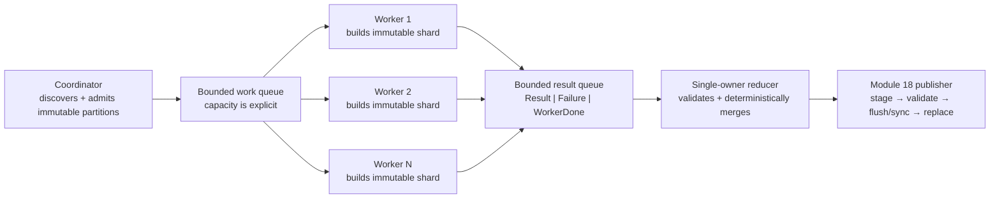

# Module 19 — Concurrency and Parallelism: Primary-Source Map

## Document status

- **Purpose:** authoritative research, claim, licensing, and teaching map for the Module 19 learner workbook and teaching-assistant materials.
- **Course position:** follows Module 18, *Operating Systems and Resource Mediation*; hands off to Module 20, *Networks and Protocols*, Module 21, *Asynchronous and Distributed Systems*, and Module 24, *CPython Internals and Performance*.
- **Evidence policy:** primary sources only: university course pages and books published by their authors, official Python documentation, accepted Python Enhancement Proposals, pinned CPython source, and the POSIX standard.
- **Access date:** every web source in this map was checked on **2026-07-29**, unless a row explicitly says otherwise.
- **Target language/runtime:** Python 3.14.6, while distinguishing portable Python reasoning from CPython-version-specific observations.
- **Pedagogical bias:** architecture reading, schedule reasoning, invariant design, debugging, and evidence review take priority over typing volume.
- **Copyright policy:** this map paraphrases sources. It does not reproduce university slides, assignment solutions, figures, or substantial passages.

This file is a source map, not the learner-facing lesson. Its job is to keep the eventual HTML workbook rigorous, coherent, version-aware, and legally clean.

---

## Executive teaching decision

Module 19 should not begin with `threading.Thread`, a list of primitives, or folklore about the GIL. It should begin with one first-principles question:

> When several workers can advance, which state transitions may occur, in what order, and what must remain true in every allowed order?

The module then develops a single connected chain:

```text
sequential operation
    → primitive state transitions
    → possible schedules and interleavings
    → safety and liveness properties
    → races and lost updates
    → critical sections and synchronization
    → bounded producer–consumer architecture
    → lifecycle, failure, cancellation, and shutdown
    → thread/process/pool implementation choices
    → controlled testing, model checking, and runtime evidence
    → performance claims with explicit workload and build assumptions
```

The capstone is a **bounded parallel indexer**. It deliberately removes Module 18's “one worker, one writer” simplification while preserving Module 18's validated publication protocol.

### Recommended capstone invariant

> For every admitted partition, exactly one terminal accounting record exists, and the published index is the deterministic reduction of all and only validated terminal shard results; synchronization orders shared-state transitions, never substitutes for semantic validation or Module 18 publication evidence.

This is scoped to one supervised local run. It is **not** a claim of crash-level or distributed “exactly once” execution.

### Recommended architecture



The learner first diagnoses a broken overlapping-writer design, then derives this architecture from ownership and invariants.

---

## Scope ownership and hard boundaries

### Module 19 owns

- concurrency versus parallelism;
- threads, processes, interpreters, tasks, workers, and pools as different abstraction layers;
- a small-state interleaving model;
- atomicity, critical sections, linearization points at an undergraduate level;
- safety, liveness, progress, starvation, livelock, and deadlock;
- race conditions, the narrower standards meaning of a data race, and lost updates;
- `threading.Thread`, `Lock`, `RLock`, `Condition`, `Semaphore`, `BoundedSemaphore`, `Event`, and `Barrier`;
- monitor-style design as a composition of state, an associated lock, conditions, and methods;
- `queue.Queue`, bounded capacity, producer–consumer accounting, and shutdown semantics;
- `concurrent.futures` executors and futures;
- `multiprocessing` contexts, process pools, serialization boundaries, queues, and hazardous termination;
- standard-GIL, free-threaded, and runtime-GIL distinctions at the documented user level;
- bounded local admission and local flow control;
- cooperative cancellation and honest shutdown limits;
- forced-schedule tests, bounded model checking, stress runs, stack snapshots, and evidence limits;
- workload decomposition, overhead, contention, and Amdahl-style speedup bounds;
- agent-era architecture and code-review questions.

### Module 19 mentions but does not teach deeply

- operating-system scheduler details already introduced in Module 18;
- POSIX acquire/release vocabulary only to explain why synchronization—not timing folklore—is the reasoning boundary;
- CPython standard-library source only to reveal public abstraction architecture and accounting invariants;
- deterministic reduction only to support concurrency correctness, not as a general parallel algorithms survey.

### Deferred to Module 20 — Networks and Protocols

- packets, sockets, DNS, TCP, UDP, HTTP;
- byte streams, framing, partial sends/receives;
- remote-peer failure and retry protocols;
- network-level flow control.

The Module 19 project uses local files and in-process/inter-process communication only. A queue item is not a packet and a queue close is not a network protocol.

### Deferred to Module 21 — Async and Distributed Systems

- event loops and `asyncio`;
- coroutine scheduling;
- structured concurrency for async tasks;
- async cancellation and timeout scopes;
- async streams and async queue backpressure;
- distributed retries, idempotency, duplicate delivery, leases, consensus, and partial failure;
- actor systems beyond a brief comparison.

`queue.Queue(maxsize)` may be called **bounded local admission** or **local flow control**. If the word *backpressure* appears, the workbook must immediately state that end-to-end async/distributed backpressure is Module 21.

### Deferred to Module 24 — CPython Internals and Performance

- evaluation frames and bytecode scheduling;
- object layout and reference counting;
- cyclic garbage collection and allocators;
- implementation of the GIL and free-threaded object locking;
- interpreter specialization;
- profiler internals and native-code optimization.

Module 19 may inspect `Lib/queue.py` and executor orchestration, but must stop before claiming that an opcode sequence, refcount transition, or object-header lock is a portable synchronization contract.

---

## Exact continuity from Module 18

### Invariant carried forward unchanged

Module 18 established:

> Every worker-visible effect is accounted for both as a process-local operation and as an OS-mediated resource transition. After interruption, Atlas publishes only a complete validated result, or leaves an explicitly classified recoverable state; an exit code, successful API return, or timing observation never silently substitutes for that evidence.

Module 19 keeps every part of that invariant. Concurrency adds ordering obligations; it does not weaken durability, validation, or recovery obligations.

### State vocabulary carried forward

The learner should recognize the existing lifecycle:

```text
ADMITTED
→ STARTED
→ ENCODED
→ STAGED
→ VALIDATED
→ PY_FLUSHED
→ FILE_SYNC_RETURNED
→ CLOSED
→ REPLACED
→ DIR_SYNC_RETURNED
→ EXITED
→ RECOVERED
```

Module 19 adds **per-partition** and **per-worker** ledgers without changing the meaning of the publication states.

Suggested concurrency ledger:

```text
partition:
DISCOVERED → ADMITTED → STARTED → RESULT | FAILURE → ACCOUNTED

worker:
CREATED → STARTED → IDLE | BUSY → STOP_REQUESTED → TERMINATED → JOINED

publication:
the unchanged Module 18 state machine
```

### The new pressure introduced in Module 19

Module 18 deliberately used one supervisor, one worker, and no overlapping writer. Module 19 removes that simplifying assumption:

- more than one worker may read and compute concurrently;
- more than one worker may try to update shared progress;
- completion order may differ from admission order;
- failure may occur while other work is running or queued;
- capacity may fill;
- shutdown may begin while work is pending;
- a worker may hold a resource when another worker needs it.

The correct lesson is not “add a lock.” The correct lesson is to recover a precise invariant, identify owners, decide which transitions must be indivisible, and minimize shared mutable state.

### M18 → M19 bridge exercise

Show two workers performing this conceptual transaction against one shared index:

```text
read current version
compute new index from current version + shard
stage candidate
validate candidate
replace published index
```

Ask the learner to enumerate a schedule in which both workers read version `v0`, each computes a valid candidate, and the second replace loses the first shard. The point is:

- every individual file operation may succeed;
- both candidates may be semantically valid in isolation;
- the Module 18 publication protocol may be followed by each worker;
- the overall multi-writer result can still be wrong.

This establishes why durability and concurrency correctness are orthogonal.

---

## First-principles conceptual model

### 1. State

Represent a concurrent program as:

```text
global state
    = shared program state
    + resource/lifecycle state
    + local control state of each worker
```

For the indexer:

```text
S = (
    pending_partitions,
    admitted,
    started,
    terminal_records,
    work_queue,
    result_queue,
    reducer_state,
    worker_states,
    stop_flag,
    publication_state
)
```

This is a teaching model, not a claim about CPython's object layout.

### 2. Transition

A transition is one conceptually indivisible step in the model. One source-level Python expression may expand into several model transitions:

```text
old = shared_total
new = old + delta
shared_total = new
```

The learner should reason about the semantic read–compute–write sequence before seeing a runtime trace.

### 3. Schedule and interleaving

A schedule chooses an enabled worker and advances one transition. With two workers:

```text
W1 read 0
W2 read 0
W1 compute 1
W2 compute 1
W1 write 1
W2 write 1
```

Both workers “incremented,” but the final value is `1`. This is the canonical lost-update counterexample.

Do not equate the model transition with a Python bytecode instruction. Bytecode and interpreter scheduling are Module 24 implementation subjects and can change across versions/builds.

### 4. Atomicity

An operation is atomic relative to an abstraction when other participants cannot observe a partial effect. The teaching sequence should distinguish:

- **hardware or runtime atomic step:** implementation mechanism;
- **primitive API atomicity:** documented property of an operation such as a lock method;
- **semantic atomicity:** the whole application operation that must appear indivisible;
- **failure atomicity:** after interruption, an old or new valid result is visible, not an unclassified hybrid.

The critical section follows from semantic atomicity. It is not automatically “the line that writes.”

### 5. Linearization point

At the undergraduate level, define a linearization point as the conceptual instant within an overlapping operation at which that operation takes effect in a legal sequential history.

Use it to read a synchronized queue or reducer, but do not turn the module into a proof-heavy concurrent-data-structures course. The learner should be able to:

- name the operation's precondition and postcondition;
- identify the state protected by the abstraction;
- propose a plausible linearization point;
- test whether overlapping results can be explained by some legal sequential order.

### 6. Safety

A safety property rules out bad reachable states. Examples:

- no partition has two terminal accounting records;
- `unfinished_tasks` never becomes negative;
- the reducer includes no unvalidated shard;
- a queue's logical occupancy never exceeds its declared capacity;
- no published index contains a partial merge.

Safety is checked against every reachable schedule in the model's scope.

### 7. Liveness

A liveness property requires some desired progress eventually, under named assumptions. Examples:

- every admitted partition eventually reaches a terminal record;
- a shutdown request eventually reaches `JOINED`;
- a waiting consumer eventually proceeds when results continue to become available.

Liveness claims must name fairness and environment assumptions. Python's documented `Lock` and semaphore behavior does not provide a general fairness guarantee.

### 8. Race condition versus data race

Use **race condition** for correctness depending on relative timing or order. Use **data race** only when the narrower standards-specific meaning is intended: conflicting unsynchronized memory accesses under a particular memory model.

A check-then-act race can exist even if each individual container method is internally synchronized. Conversely, a timing-dependent outcome need not map neatly to a C/POSIX data-race definition.

### 9. Deadlock, livelock, and starvation

- **Deadlock:** a set of participants cannot progress because each waits for a condition another participant in the set must cause.
- **Livelock:** participants keep taking steps but the desired work does not advance.
- **Starvation:** a participant remains eligible or repeatedly contends but never receives the needed opportunity.
- **Unfairness:** the mechanism does not promise an ordering that prevents starvation.

Teach the Coffman conditions as a diagnostic lens:

```text
mutual exclusion
+ hold and wait
+ no preemption
+ circular wait
→ deadlock is possible
```

Breaking one condition is a design strategy; a timeout is merely an observation or escape policy.

### 10. Memory visibility and ordering

The portable Python teaching rule is:

> Communicate shared state through documented synchronization and message-passing primitives; do not infer visibility or order from elapsed time, source-code proximity, a successful print, a presumed opcode schedule, or the presence of the GIL.

POSIX Issue 8 supplies a standards-level acquire/release-style model for its named synchronization operations. It is useful conceptual support, not a complete Python language memory model and not permission to expose Python learners to C atomics APIs in this module.

---

## Claim-and-evidence ledger

| ID | Claim safe to teach | Primary evidence | Boundary / wording guardrail |
|---|---|---|---|
| C19-01 | Concurrent behavior can be reasoned about as state transitions under multiple possible schedules. | Harmony book, Chapters 1–3 and 10–11; Cornell CS4410 sequence. | A small formal model abstracts the runtime. Do not equate model steps with bytecode. |
| C19-02 | Atomicity is relative to an abstraction; semantic read–check–update may require one critical section. | Harmony Chapters 4–9; OSTEP Chapters 28–29. | “One Python line” is not a portable atomicity boundary. |
| C19-03 | Safety excludes bad states; liveness requires eventual progress under assumptions. | Harmony Chapters 10–11; Oxford syllabus. | State fairness/environment assumptions for every liveness claim. |
| C19-04 | Race condition is broader than a standards-defined data race. | OSTEP Chapters 26 and 32; POSIX Issue 8 §4.15 for scoped memory conflicts. | Do not claim Python adopts the POSIX/C memory model wholesale. |
| C19-05 | Python lock acquisition/release methods are atomic, but waiter selection is not defined. | Python 3.14 `threading` docs. | The docs' atomic-method statement does not make arbitrary Python expressions atomic. |
| C19-06 | A condition wait releases the associated lock and reacquires it before return; predicates must be rechecked. | Python 3.14 `threading.Condition`; POSIX `pthread_cond_wait`. | A notification is not remembered application state; `notify()` does not release the lock. |
| C19-07 | A semaphore maintains permits/capacity but does not imply fair admission. | Python 3.14 `Semaphore` docs. | Do not infer FIFO wakeup order. |
| C19-08 | A monitor can be taught as encapsulated state plus a lock, methods, invariants, and conditions. | Oxford synopsis; Stanford topic summary; Python `Condition`. | Python has no single built-in `Monitor` class that supplies the design automatically. |
| C19-09 | `queue.Queue(maxsize)` supplies synchronized bounded local admission and blocks producers when full. | Python 3.14 `queue` docs and pinned `Lib/queue.py`. | `maxsize` bounds queued items, not total memory, running work, or an end-to-end distributed system. |
| C19-10 | `qsize()`, `empty()`, and `full()` are snapshots/approximations, not authorization for a later operation. | Python 3.14 `queue` docs. | Avoid check-then-act control flow based on these methods. |
| C19-11 | `task_done()`/`join()` form an accounting invariant; immediate shutdown can intentionally violate normal completion semantics. | Python 3.14 `queue` docs. | One `task_done()` per successful `get()`; `shutdown(immediate=True)` is not evidence that work completed. |
| C19-12 | Lock-order cycles, pool dependency cycles, and queue lifecycle cycles can deadlock. | Harmony Ch. 15; OSTEP Ch. 32; `concurrent.futures` deadlock examples. | A timeout or one passing run does not establish deadlock freedom. |
| C19-13 | Synchronization establishes the reasoning boundary for visibility/order. | POSIX Issue 8 §4.15 and named primitive pages; Python synchronization docs. | Teach documented primitives, not unsynchronized ordinary shared operations. |
| C19-14 | Threads share a process's memory; processes introduce isolation and serialization/IPC boundaries. | Python `threading` and `multiprocessing` docs; Stanford and Cornell courses. | “Processes do not share anything” is false when explicit shared memory or inherited resources are used. |
| C19-15 | Standard CPython builds have a GIL; optional free-threaded builds can disable it; runtime state must be measured. | Python free-threading HOWTO; PEP 703; PEP 779. | The GIL is neither an application lock nor a universal Python-language guarantee. |
| C19-16 | Current free-threaded CPython internally protects some built-in containers, but explicit synchronization remains recommended. | Python 3.14 free-threading HOWTO. | Treat internal container locking as current implementation behavior, not a portable compound-operation contract. |
| C19-17 | `Future.cancel()` cannot cancel a running or completed future; `cancel_futures=True` applies to not-yet-started work; a result/wait timeout stops waiting, not the work. | Python 3.14 `concurrent.futures` docs. | Cancellation, caller timeout, cooperative stop, graceful drain, and hard termination are different state transitions. |
| C19-18 | Python threads cannot be forcibly destroyed/stopped through `threading`; daemon shutdown is abrupt. | Python 3.14 `threading` docs. | Teach cooperative stop signals and non-daemon joining for managed work. |
| C19-19 | Forceful process termination can corrupt queues/pipes and strand held synchronization resources. | Python 3.14 `multiprocessing` warnings. | Force is an escalation with possible invariant loss, not graceful cancellation. |
| C19-20 | Tasks in a thread pool can deadlock by synchronously waiting on futures that require the same exhausted pool. | Python 3.14 `ThreadPoolExecutor` examples. | More workers may hide one case without removing the dependency cycle. |
| C19-21 | Process pools require serializable callables/arguments/results and an importable `__main__`; start-method choice matters. | Python 3.14 `ProcessPoolExecutor` and `multiprocessing` docs. | REPL functions, lambdas, open handles, and implicit fork assumptions are not portable pool inputs. |
| C19-22 | Python 3.14's `InterpreterPoolExecutor` gives isolated interpreters and separate GILs, using serialization for calls/results. | Python 3.14 `concurrent.futures` docs; PEP 684; PEP 734. | Optional enrichment only: interpreters remain in one process with process-global resources, so isolation does not mean “no possible race.” |
| C19-23 | Harmony can explore all executions of a particular bounded model and return short counterexample paths. | Harmony book/tool documentation. | Passing a small model is not universal proof of the Python program. |
| C19-24 | Forced schedules can make a race test reproducible; stress testing expands observations but is not proof. | Harmony checking chapters; OSTEP concurrency homework as inspiration. | Use `Event`/`Barrier` gates, not sleeps, for deterministic schedule tests. |
| C19-25 | `faulthandler` and `sys._current_frames()` can capture thread stacks during a hang. | Python 3.14 `faulthandler` and `sys` docs. | A stack snapshot is evidence at one instant; free-threaded `faulthandler` has a documented all-thread limitation. |
| C19-26 | Parallel speedup is bounded by serial work and reduced by overhead, imbalance, contention, and communication. | CS61C parallel-performance notes; measured project experiments. | Never attribute speedup or slowdown to “the GIL” without build, workload, worker, and trace evidence. |
| C19-27 | Synchronization correctness and Module 18 publication/durability correctness are independent obligations. | Derived synthesis of M18 invariant plus concurrency sources. | A lock does not flush data; `fsync` does not prevent a lost update. |
| C19-28 | A bounded local queue is a useful flow-control boundary. | Python `queue.Queue` and executor `map(buffersize=)` docs. | Async streams, remote pressure propagation, and distributed overload belong to Module 21. |
| C19-29 | Public CPython library source can expose queue and executor accounting architecture. | Pinned CPython 3.14.6 source. | Evaluation loop, object locks, refcounts, and profiler internals belong to Module 24. |
| C19-30 | Default multiprocessing start methods changed in Python 3.14. | Python 3.14 `multiprocessing` docs. | Windows/macOS use `spawn`; POSIX defaults to `forkserver`; `fork` is not the default anywhere in 3.14. |

---

## University source atlas

### U19-01 — Operating Systems: Three Easy Pieces (OSTEP)

- **Institution/authors:** University of Wisconsin–Madison; Remzi H. Arpaci-Dusseau and Andrea C. Arpaci-Dusseau.
- **Primary landing page:** https://pages.cs.wisc.edu/~remzi/OSTEP/
- **Official homework page:** https://pages.cs.wisc.edu/~remzi/OSTEP/Homework/homework.html
- **Official homework repository:** https://github.com/remzi-arpacidusseau/ostep-homework
- **Accessed:** 2026-07-29.
- **Use these chapters:** 26 (*Concurrency: An Introduction*), 27 (*Thread API*), 28 (*Locks*), 29 (*Lock-based Concurrent Data Structures*), 30 (*Condition Variables*), 31 (*Semaphores*), and 32 (*Common Concurrency Problems*).
- **Use in Module 19:** conceptual sequence, terminology, broken concurrent behaviors, and source-reading inspiration.
- **Do not pull forward:** Chapter 33 event-based concurrency; that belongs with Module 21.
- **Teaching recommendation:** use OSTEP to supply the systems intuition behind threads, critical sections, condition variables, semaphores, and bug classes. Rewrite all examples for the Atlas architecture rather than translating textbook examples line by line.
- **License/copying note:** the site asks instructors to link to the official online chapters rather than hosting local copies. No general reusable license was established for the book/homework repository during this audit. Link and paraphrase; create original diagrams and exercises; do not copy chapters, figures, or homework solutions.

### U19-02 — Cornell CS 4410/5410, Spring 2026

- **Course home:** https://www.cs.cornell.edu/courses/cs4410/2026sp/
- **Schedule:** https://www.cs.cornell.edu/courses/cs4410/2026sp/schedule/
- **Accessed:** 2026-07-29.
- **Verified sequence:** threads (February 10); concurrent programming with Harmony Chapters 1–3 (February 19); critical sections and locks, Chapters 4–8 (February 24); concurrent data structures, Chapter 9 (February 26); checking behaviors, Chapters 10–11 (March 3); conditional waiting and condition variables, Chapters 12–14 (March 5); deadlock, Chapter 15 (March 10); actors and barriers, Chapters 16–18 (March 12).
- **Use in Module 19:** validates the proposed first-principles progression from model to lock to stateful abstraction to checking to waiting to deadlock.
- **Teaching recommendation:** preserve Cornell's conceptual dependency order, but use Python and the Atlas project rather than Cornell assignments.
- **Agent-era signal:** the course page allows AI tools under documented-use rules. Treat this only as support for an evidence/disclosure practice, not as a copied course policy.
- **License/copying note:** Cornell page copyright is explicit. Link and paraphrase; do not reproduce notes, recitations, or assignments.

### U19-03 — Harmony book and model checker

- **Book:** https://harmony.cs.cornell.edu/book/
- **Book PDF:** https://harmony.cs.cornell.edu/book.pdf
- **Tool landing page:** https://harmony.cs.cornell.edu/
- **Installation documentation:** https://harmony.cs.cornell.edu/docs/install/
- **Tool source:** https://github.com/harmonylang/harmony
- **Tool license:** https://github.com/harmonylang/harmony/blob/master/LICENSE
- **Accessed:** 2026-07-29.
- **Book license:** Creative Commons Attribution–NonCommercial–ShareAlike 4.0, as stated by the book.
- **Tool license:** BSD 3-Clause, as stated in the repository.
- **Use in Module 19:** nondeterministic interleavings, non-atomicity, critical sections, locks, concurrent data structures, behavior checking, conditional waiting, bounded buffers, conditions, starvation, deadlock, and barriers.
- **Model-checking claim boundary:** Harmony can exhaustively explore the executions of the *particular finite model supplied*. A small-state result is not proof about every input, CPython implementation, operating system schedule, or failure mode in the real program.
- **Teaching recommendation:** include one tiny lost-update model and one bounded-buffer model. Let the learner read the counterexample trace before seeing a fix. Keep the modeled state deliberately small.
- **Attribution rule:** if the workbook adapts CC-licensed book material, record attribution and ShareAlike/NonCommercial implications. The safer default is original diagrams and examples with direct links.

### U19-04 — University of Oxford Concurrent Programming, 2025–2026

- **Course page:** https://www.cs.ox.ac.uk/teaching/courses/2025-2026/concurrentprogramming/
- **Accessed:** 2026-07-29.
- **Verified synopsis:** reasons for concurrency; processes and threads; shared variables and races; safety and liveness; message passing; deadlock; linearizability; barriers; locks; monitors; conditions; semaphores; patterns; testing.
- **Use in Module 19:** breadth audit and pattern vocabulary, especially monitors, worker/controller architectures, deterministic comparison to a sequential implementation, and testing.
- **Boundary:** Oxford also covers message-passing and distributed material. Use only the local concurrent-programming concepts here; defer distributed semantics to Module 21.
- **License/copying note:** University of Oxford copyright is explicit. Link and paraphrase only.

### U19-05 — Stanford CS111, Spring 2026

- **Course home:** https://web.stanford.edu/class/cs111/
- **Current final-topic summary:** https://web.stanford.edu/class/cs111/exams/final.html
- **Accessed:** 2026-07-29.
- **Verified sequence/topics:** threads/processes; concurrency; locks and condition variables; lock implementation; deadlock; scheduling. The topic summary names thread safety, race conditions, atomicity, critical sections, mutexes, deadlock, busy waiting, conditions, `notify_all`, and the monitor pattern.
- **Use in Module 19:** curriculum completeness check and code-reading question style.
- **Teaching recommendation:** adapt the idea of mixed code reading, state tracing, and architecture reasoning. Do not reproduce practice-exam questions.
- **License/copying note:** Stanford course materials state restrictive copyright/no-redistribution terms. Evidence and links only; no local copies, figures, handouts, assignments, exams, or solutions.

### U19-06 — UC Berkeley CS 162, Fall 2025

- **Course home:** https://cs162.org/
- **Synchronization documentation:** https://cs162.org/
- **Accessed:** 2026-07-29; the main site was intermittently slow during the final audit.
- **Use in Module 19:** secondary university sequence check for threads, mutual exclusion, synchronization primitives, monitors, and scheduling.
- **Boundary:** Pintos-specific mechanisms and kernel lock implementation are not Python contracts.
- **License/copying note:** no course-wide reuse license was established in this audit. Link and paraphrase; never reproduce project solutions.

### U19-07 — MIT 6.1810, Fall 2025, and xv6

- **Schedule:** https://pdos.csail.mit.edu/6.S081/2025/schedule.html
- **Lock lab:** https://pdos.csail.mit.edu/6.828/2025/labs/lock.html
- **xv6 book:** https://pdos.csail.mit.edu/6.S081/2025/xv6/book-riscv-rev5.pdf
- **xv6 source:** https://github.com/mit-pdos/xv6-riscv
- **xv6 license:** https://github.com/mit-pdos/xv6-riscv/blob/riscv/LICENSE
- **Accessed:** 2026-07-29.
- **Use in Module 19:** tightly bounded source-reading enrichment on locks, contention, and per-resource partitioning.
- **Boundary:** label every xv6 claim as an operating-system implementation example, not Python behavior. Do not teach the lab or provide solutions.
- **License note:** the lock-lab page identifies Creative Commons Attribution 3.0 United States terms; xv6 source carries its repository's permissive MIT-style license. Third-party items may have separate terms.

### U19-08 — UC Berkeley CS61C parallel-performance notes

- **Parallel performance:** https://notes.cs61c.org/content/parallel-performance/
- **Threads:** https://notes.cs61c.org/content/parallel-tlp/threads/
- **Data races:** https://notes.cs61c.org/content/parallel-tlp/data-race/
- **Locks and atomic memory operations:** https://notes.cs61c.org/content/parallel-tlp/locks-amos/
- **Accessed:** 2026-07-29.
- **Use in Module 19:** a small Amdahl's-law and workload-decomposition extension after correctness.
- **Boundary:** hardware atomics and cache-coherence mechanics are not prerequisites for using Python synchronization and should not displace the main project.
- **License/copying note:** no explicit reuse license was established for these notes during the audit. Link and paraphrase; redraw figures.

### University-source selection verdict

Use three sources as the structural spine:

1. **Harmony/Cornell** for the state-machine and model-checking progression.
2. **OSTEP** for systems intuition and bug classes.
3. **Official Python documentation** for the actual Python contracts.

Use Oxford, Stanford, Berkeley, MIT, and CS61C as breadth and sequencing checks. The workbook should not become a collage of university lecture excerpts.

---

## Official Python 3.14.6 source atlas

### P19-01 — `threading`

- **Documentation:** https://docs.python.org/3.14/library/threading.html
- **Accessed:** 2026-07-29.
- **License:** Python documentation under the PSF License Version 2; documentation code examples are additionally available under Zero-Clause BSD. See https://docs.python.org/3.14/license.html.

Safe claims:

- threads run concurrently within one process and share the process memory space;
- on the standard CPython build, the GIL limits simultaneous execution of Python code/bytecode, while threads remain useful for overlapping blocking I/O;
- free-threaded builds can disable the GIL but are not the default;
- Python `Thread` has no public destroy, stop, suspend, resume, or interrupt operation;
- daemon threads may be stopped abruptly at interpreter shutdown;
- use a signaling primitive such as `Event` and join non-daemon threads for managed shutdown;
- `join(timeout)` always returns `None`; `is_alive()` is needed to distinguish timeout;
- joining the current thread is rejected because it would deadlock;
- primitive lock waiter selection is unspecified and may vary across implementations;
- documented `threading` methods are atomic at their API boundary;
- condition waits release the associated lock and reacquire it before returning;
- condition predicates must be checked in a loop or with `wait_for`;
- notification does not release the lock;
- a semaphore tracks permits, but acquisition order is not guaranteed;
- `Event` is a shared flag and `Barrier` coordinates a fixed number of parties.

Teaching boundaries:

- do not generalize “methods are atomic” to `x += 1`, check-then-act sequences, or a set of calls;
- do not use the GIL as the lock protecting an application invariant;
- do not promise lock, condition, or semaphore fairness;
- do not use sleeps as synchronization;
- do not present daemon threads as normal cancellation.

### P19-02 — `queue`

- **Documentation:** https://docs.python.org/3.14/library/queue.html
- **Pinned source:** https://github.com/python/cpython/blob/c63aec69bd59c55314c06c23f4c22c03de76fe45/Lib/queue.py
- **Accessed:** 2026-07-29.

Safe claims:

- `Queue` is designed for synchronized exchange among multiple producer and consumer threads;
- the implementation uses a mutex with condition variables around queue state;
- queue methods are not designed for reentrant use in the same thread;
- a positive `maxsize` bounds the number of queued items and can block `put`;
- `qsize()`, `empty()`, and `full()` do not guarantee what a later operation will do;
- each successfully retrieved task must be paired with exactly one `task_done()`;
- `join()` waits on the unfinished-task accounting invariant;
- `shutdown(immediate=False)` prevents growth, wakes blocked producers, permits normal draining, and raises `ShutDown` after the queue empties;
- `shutdown(immediate=True)` drains and can unblock `join()` without completed work, explicitly breaking the normal completion invariant.

Teaching boundaries:

- capacity is item count, not a memory-byte budget;
- the queue can bound pending work while running workers and produced results consume additional resources;
- a bounded queue is not by itself an end-to-end overload protocol;
- immediate shutdown is an emergency policy, not evidence that queued work finished;
- `SimpleQueue` has different tradeoffs and no task-completion ledger.

### P19-03 — `concurrent.futures`

- **Documentation:** https://docs.python.org/3.14/library/concurrent.futures.html
- **Base source:** https://github.com/python/cpython/blob/c63aec69bd59c55314c06c23f4c22c03de76fe45/Lib/concurrent/futures/_base.py
- **Thread-pool source:** https://github.com/python/cpython/blob/c63aec69bd59c55314c06c23f4c22c03de76fe45/Lib/concurrent/futures/thread.py
- **Process-pool source:** https://github.com/python/cpython/blob/c63aec69bd59c55314c06c23f4c22c03de76fe45/Lib/concurrent/futures/process.py
- **Accessed:** 2026-07-29.

Safe claims:

- `Executor` supplies a common submission/result/shutdown surface, but executor implementations have different isolation, serialization, and failure behavior;
- `Future.cancel()` succeeds only before the work becomes running or completed;
- `shutdown(cancel_futures=True)` cancels pending, not running, work;
- `Future.result(timeout=...)` and executor wait timeouts limit the caller's wait; they do not stop the underlying computation;
- interpreter exit still waits for pending executor futures even after `shutdown(wait=False)`;
- `ThreadPoolExecutor` documentation contains dependency patterns that deadlock;
- all thread-pool worker threads are joined before interpreter exit, and the docs discourage its use for long-running tasks;
- `Executor.map(..., buffersize=n)` in Python 3.14 limits the number of submitted results awaiting yield and pauses source iteration when full;
- `ProcessPoolExecutor` requires picklable callables and values and an importable `__main__`;
- calling executor/future methods from a process-pool worker can deadlock;
- Python 3.14 changed the default process start behavior away from `fork`;
- Python 3.14 adds `terminate_workers()` and `kill_workers()` as forceful process-pool escalation APIs;
- Python 3.14's `InterpreterPoolExecutor` uses separate interpreters, each with its own GIL, and serializes calls/results.

Teaching boundaries:

- a `Future` is a stateful handle, not a running thread;
- cancellation is a state transition request with a narrow success window;
- `wait=False` means the caller does not block at that call, not that process exit ignores work;
- a timeout is neither cancellation nor evidence that the worker stopped;
- `buffersize` bounds executor submission/yield buffering, not every memory allocation;
- interpreter pools are optional enrichment and must not crowd out threads/processes; interpreter isolation does not remove process-global resources or every possible race;
- forceful worker termination can abandon application invariants.

### P19-03A — Cancellation and shutdown taxonomy

The workbook should reuse this distinction across threads, queues, futures, and processes:

| Operation class | Examples | What it establishes |
|---|---|---|
| Stop waiting | `join(timeout)`, `Future.result(timeout)`, `wait(timeout)` | The caller resumes after a bound; the work may continue. |
| Prevent pending start | `Future.cancel()`, `shutdown(cancel_futures=True)` | Work still pending may be cancelled; running work continues. |
| Cooperative stop | `threading.Event`, sentinel/protocol message, task-owned stop flag | The worker can observe the request, restore invariants, and return. |
| Graceful admission stop and drain | `Queue.shutdown(immediate=False)`, ordinary executor shutdown, explicit pool close/join | New admission stops while already accepted work follows the documented drain policy. |
| Hard termination | process/executor terminate or kill APIs | Worker execution stops forcibly; cleanup, IPC, held-lock, and application invariants may be lost. |

Names that sound similar across APIs do not imply identical semantics. Every shutdown exercise must classify queued, running, result-produced, accounted, and published work separately.

### P19-04 — `multiprocessing`

- **Documentation:** https://docs.python.org/3.14/library/multiprocessing.html
- **Queue source:** https://github.com/python/cpython/blob/c63aec69bd59c55314c06c23f4c22c03de76fe45/Lib/multiprocessing/queues.py
- **Accessed:** 2026-07-29.

Safe claims:

- processes can execute Python work in separate interpreters/processes and use IPC or explicit shared objects to communicate;
- in Python 3.14, Windows and macOS default to `spawn`; POSIX defaults to `forkserver`; `fork` is not the default on any platform;
- code should choose an explicit context when behavior matters;
- libraries should accept a user-supplied multiprocessing context rather than silently fixing one;
- multiprocessing queues serialize objects and use a feeder thread;
- per-producer queue order is preserved, while objects from different producers may interleave;
- a producer can wait at exit for queued data to flush, creating join-order deadlocks if consumers do not drain;
- terminating a process that uses a queue or pipe can corrupt the communication channel;
- terminating a process holding a lock or semaphore can deadlock other processes;
- terminating a process does not automatically terminate its descendants;
- Python 3.14's `Process.interrupt()` is POSIX-oriented, maps to `SIGINT`, can be caught or ignored, and has undefined behavior on Windows.

Teaching boundaries:

- `terminate()` and `kill()` are escalation, not cooperative cancellation;
- a successful process exit code is not evidence that all queued results were consumed or published;
- fork inheritance assumptions are not portable and are especially unsafe in a multithreaded parent;
- process isolation reduces accidental sharing but introduces serialization, startup, IPC, and lifecycle obligations.

### P19-05 — Free-threading HOWTO

- **Documentation:** https://docs.python.org/3.14/howto/free-threading-python.html
- **Accessed:** 2026-07-29.

Safe claims:

- build capability can be inspected with `python -VV`/`sys.version` and `sysconfig.get_config_var("Py_GIL_DISABLED")`;
- actual runtime GIL state can be checked with `sys._is_gil_enabled()` as documented by the HOWTO;
- a free-threaded build can still run with the GIL enabled through configuration;
- importing an extension without free-threading support can enable the GIL and issue a warning;
- current free-threaded CPython adds internal protection to built-in types such as `dict`, `list`, and `set`;
- relying on those internal locks instead of `Lock` or another synchronization primitive is discouraged;
- sharing an iterator between threads is generally unsafe and can produce missing or duplicated elements.

Teaching boundaries:

- report **build**, **runtime GIL state**, **Python version**, **platform**, and **workload** separately;
- internal container locks do not make compound invariants atomic;
- do not promise behavior for alternative Python implementations based on CPython's HOWTO;
- do not explain the object-lock implementation here; defer it to Module 24.

### P19-06 — Debugging interfaces

- **`faulthandler`:** https://docs.python.org/3.14/library/faulthandler.html
- **`sys._current_frames()`:** https://docs.python.org/3.14/library/sys.html#sys._current_frames
- **Accessed:** 2026-07-29.

Safe claims:

- `faulthandler` can dump Python tracebacks, including after a watchdog delay, and can still be useful when the program is deadlocked;
- in Python 3.14, when the GIL is disabled, the documented fault-handler behavior limits dumps to the current thread to avoid races;
- `sys._current_frames()` can snapshot top frames for running threads without their cooperation and is useful in deadlock investigation;
- a frame may already be stale by the time it is interpreted if the thread is still advancing.

Teaching boundaries:

- use stack evidence to form and test a wait-for hypothesis;
- a single dump does not prove a permanent deadlock;
- frame internals and profiler architecture are Module 24.

### P19-07 — Python execution model, limited use

- **Documentation:** https://docs.python.org/3.14/reference/executionmodel.html
- **Accessed:** 2026-07-29.
- **Use:** distinguish process, runtime, interpreter, thread, and thread-state layers.
- **Boundary:** this page is not a complete portable Python happens-before or memory-order specification. Do not invent one.

### Python documentation license

- **License page:** https://docs.python.org/3.14/license.html
- **Accessed:** 2026-07-29.
- **Policy:** paraphrased documentation claims are safe with attribution/linking. If an official code example is adapted, retain appropriate attribution and observe the stated PSF/Zero-Clause BSD terms.

---

## PEP source atlas

### PEP 703 — Making the Global Interpreter Lock Optional in CPython

- **URL:** https://peps.python.org/pep-0703/
- **Status/version:** Final; targeted Python 3.13.
- **Accessed:** 2026-07-29.
- **License:** the PEP footer places the document in the public domain or under CC0-1.0.
- **Safe use:** normative design/history for an optional CPython build that can disable the GIL.
- **Boundary:** a PEP design is not proof of the current local runtime state, third-party extension support, or application thread safety.
- **Teaching recommendation:** one comparison card after the core race lesson. The learner must already understand why an application invariant needs synchronization regardless of the GIL.

### PEP 779 — Criteria for Supported Status for Free-Threaded Python

- **URL:** https://peps.python.org/pep-0779/
- **Status/version:** Final; Python 3.14; Phase II.
- **Accessed:** 2026-07-29.
- **License:** the PEP footer places the document in the public domain or under CC0-1.0.
- **Safe use:** free-threaded Python is officially supported in Phase II for 3.14 while remaining optional.
- **Boundary:** Phase II is not Phase III and does not mean free threading is the default build. Future phase/default decisions remain future decisions.

### PEP 684 and PEP 734 — Multiple-interpreter boundary

- **PEP 684:** https://peps.python.org/pep-0684/
- **PEP 734:** https://peps.python.org/pep-0734/
- **Status/version:** both Final; PEP 684 targets Python 3.12 and PEP 734 targets Python 3.14.
- **Accessed:** 2026-07-29.
- **License:** each PEP footer places the document in the public domain or under CC0-1.0.
- **Safe use:** separate interpreters isolate Python runtime state and can each have a GIL; Python 3.14 provides the standard-library multiple-interpreter surface underlying interpreter-pool teaching.
- **Boundary:** interpreters remain in one operating-system process. Memory, file descriptors, environment variables, native libraries, and other process-global resources are not transformed into isolated distributed resources. Do not teach “separate interpreter” as “no possible race.”
- **Teaching recommendation:** keep this as an optional comparison card after threads and processes. The core capstone should not require multiple interpreters.

### Rejected historical authority

- **PEP 583:** https://peps.python.org/pep-0583/
- **Status:** Withdrawn.
- **Decision:** do not use it to state current Python memory-model guarantees. It may appear only in an instructor note as a historical example of why a proposed specification is not normative merely because a PEP exists.

---

## Pinned CPython 3.14.6 source-reading map

### Reproducible pin

- **Release tag:** `v3.14.6`
- **Peeled commit:** `c63aec69bd59c55314c06c23f4c22c03de76fe45`
- **Repository:** https://github.com/python/cpython
- **Pinned license:** https://github.com/python/cpython/blob/c63aec69bd59c55314c06c23f4c22c03de76fe45/LICENSE
- **Accessed/verified:** 2026-07-29.

Never link learner observations to `main` when the course claims Python 3.14.6 behavior. The pinned commit prevents source drift.

### Source-reading stop map

| Source | Question to answer by reading | Stop before |
|---|---|---|
| `Lib/queue.py` | How do one mutex, three conditions, queue storage, unfinished-task accounting, and shutdown state cooperate? | Lock implementation, interpreter internals, platform condition implementation. |
| `Lib/concurrent/futures/_base.py` | What states can a future enter, and when can cancellation succeed? | Callback scheduling internals not needed by the invariant. |
| `Lib/concurrent/futures/thread.py` | How are work items queued, workers signaled, and shutdown initiated? | GIL implementation and OS thread internals. |
| `Lib/concurrent/futures/process.py` | Where do serialization, local worker management, call queues, and cancellation windows appear? | Pipe/kernel internals and distributed semantics. |
| `Lib/multiprocessing/queues.py` | Why does a feeder thread exist, and why can closing/joining/termination interact badly? | Platform pipe implementation and C extension internals. |
| `Lib/threading.py` | How are higher-level conditions, events, and barriers composed from lower-level locks? | `_thread` and interpreter implementation. |

### Required code-reading prompts

1. Find the queue invariant protected by `mutex`. Which condition corresponds to “not empty,” “not full,” and “all tasks done”?
2. Trace one `put` and one `get`. Which state transitions happen while the mutex is held?
3. Trace `task_done`. What error detects over-accounting?
4. Compare graceful and immediate queue shutdown. Which usual invariant is intentionally relaxed?
5. In futures, distinguish `PENDING`, `RUNNING`, `CANCELLED`, and `FINISHED`. At which transition does cancellation become impossible?
6. In the process pool, identify the boundary between a submitted work item and a call that has crossed far enough that cancellation is no longer reliable.
7. In a multiprocessing queue, locate the feeder-thread boundary and explain why “`put` returned” is not identical to “another process consumed the item.”

These are reading and evidence tasks. They should not ask the learner to reimplement the standard library.

---

## POSIX memory-synchronization map

### Primary standards pages

- **Issue 8, §4.15 Memory Ordering and Synchronization:** https://pubs.opengroup.org/onlinepubs/9799919799/basedefs/V1_chap04.html
- **`pthread_mutex_lock` / `pthread_mutex_unlock`:** https://pubs.opengroup.org/onlinepubs/9799919799/functions/pthread_mutex_lock.html
- **`pthread_cond_wait`:** https://pubs.opengroup.org/onlinepubs/9799919799/functions/pthread_cond_wait.html
- **`sem_wait`:** https://pubs.opengroup.org/onlinepubs/9799919799/functions/sem_wait.html
- **Accessed:** 2026-07-29. The Open Group pages intermittently reject automated browser fetches; they were also checked with a normal user agent.
- **License/copying note:** IEEE/The Open Group copyright applies. Link and paraphrase only; do not reproduce standards tables or figures.

### Claims allowed

- POSIX names synchronization operations through which assignments can become visible between threads;
- its model uses acquire/release-style ordering concepts;
- successful mutex, condition-variable, semaphore, thread-creation, and thread-join operations have scoped synchronization effects under the standard;
- programs should not perform conflicting ordinary accesses concurrently without the required synchronization.

### Claims not allowed

- “Python has exactly the POSIX C memory model.”
- “Every Python implementation maps `threading.Lock` directly to this specific POSIX primitive.”
- “The GIL is an acquire/release operation for the learner's application data.”
- “If a test saw the update once, visibility is guaranteed.”
- “A successful `sleep` establishes a happens-before relationship.”

### Teaching phrasing

Use:

> POSIX gives a precise acquire/release-style model for its named primitives. At the portable Python level, we reason through Python's documented synchronization APIs rather than through unsynchronized shared operations or presumed interpreter scheduling.

Do not teach C atomics syntax or hardware memory-order modes in this module.

---

## Runtime and reproducibility evidence

### Course-authoring environment observed on 2026-07-29

```text
Python: CPython 3.14.6
Build capability: sysconfig.get_config_var("Py_GIL_DISABLED") == 0
Runtime state: sys._is_gil_enabled() == True
Logical CPUs reported: 24
Interpretation: standard GIL-enabled build
```

This is evidence about one environment. It is not the learner's environment and must not be silently embedded in performance conclusions.

### Required experiment header

Every concurrency/performance transcript in the learner workbook should display:

```text
Python implementation and version
platform and architecture
logical CPU count
Py_GIL_DISABLED build flag
runtime GIL state
executor/primitive used
worker count
input size and task granularity
queue/buffer capacities
trial count and summary statistic
correctness oracle used
```

### GIL classification table

| Question | Probe/evidence | Meaning |
|---|---|---|
| Can this build run without the GIL? | `sysconfig.get_config_var("Py_GIL_DISABLED")` | Build capability/configuration. |
| Is the GIL enabled in this run? | `sys._is_gil_enabled()` as documented by the free-threading HOWTO | Current runtime state. |
| Did an extension re-enable the GIL? | startup/import warnings plus runtime probe | Runtime transition/effect. |
| Did threads execute application work in parallel? | workload trace/measurement with correct runtime metadata | Empirical observation for that workload. |
| Is the program race-free? | invariant argument plus tests/model evidence | Not answered by GIL state or timing. |

---

## Recommended teaching architecture

### Concept spine

Every lesson should revisit the same five questions:

1. **State:** what is shared, immutable, thread-local, process-local, queued, staged, or published?
2. **Owner:** who may mutate each state component?
3. **Invariant:** what must remain true across every allowed schedule?
4. **Ordering mechanism:** which lock, condition predicate, queue edge, join, or process boundary establishes the required order?
5. **Evidence:** what would a counterexample trace, forced schedule, stack dump, ledger, or sequential oracle show?

This connects concepts instead of creating a vocabulary tour.

### Suggested learner-facing sessions

#### Session 19.1 — From one timeline to many schedules

- Reopen the Module 18 single-worker timeline.
- Split `read → compute → publish` into transitions.
- Interleave two workers.
- Diagnose a lost update before naming a lock.
- Introduce state, schedule, atomicity, safety, and liveness.
- Visual: schedule explorer with two draggable timelines and an invariant lamp.
- Checkpoint: choose which schedules violate `final_total == admitted_delta_sum`.

#### Session 19.2 — Deriving critical sections from invariants

- Distinguish application transaction from source line.
- Derive a critical section for read–check–update.
- Introduce lock ownership, `with lock`, lock granularity, and contention.
- Contrast coarse lock, sharded immutable state, and single-owner reducer.
- Visual: protected-state boundary, not a lock icon floating beside code.
- Code reading: identify an incorrectly narrow critical section.

#### Session 19.3 — Waiting for predicates

- Show why busy waiting and sleeping are not synchronization.
- Derive condition variables from a state predicate.
- Trace wait: release, block, wake, reacquire, recheck.
- Contrast notification with state.
- Introduce monitor-style encapsulation.
- Visual: predicate lifecycle and lock ownership strip.

#### Session 19.4 — Capacity, permits, and bounded queues

- Derive semaphore permits from a capacity invariant.
- Derive a producer–consumer queue from ownership transfer.
- Inspect `Queue(maxsize)`, `put`, `get`, `task_done`, and `join`.
- Explain approximate observation methods.
- Introduce graceful versus immediate queue shutdown.
- Visual: token/capacity meter plus unfinished-task ledger.

#### Session 19.5 — Progress failures

- Build a wait-for graph.
- Diagnose lock-order deadlock, condition predicate mistakes, pool dependency deadlock, queue drain/join deadlock, livelock, and starvation.
- Apply the Coffman conditions.
- Distinguish prevention, detection, recovery, and timeout.
- Visual: animated wait-for cycle.

#### Session 19.6 — Threads, processes, and executor abstractions

- Compare shared memory, isolation, startup, serialization, failure, and cancellation.
- Treat an executor as policy plus worker lifecycle, not magic parallelism.
- Read Future state transitions.
- Read the official thread-pool dependency-deadlock examples.
- Introduce process start contexts and importability.
- Optional card: interpreter pool.
- Visual: one common submit/result interface over three different boundaries.

#### Session 19.7 — The GIL without folklore

- Separate Python language, CPython implementation, build capability, and runtime state.
- Compare standard GIL and optional free-threaded builds.
- Explain why both still require application synchronization.
- Inspect the local runtime metadata card.
- Reject bytecode atomicity lists and “built-ins are safe” shortcuts.
- Visual: four-layer claim-boundary stack.

#### Session 19.8 — Cancellation, failure, and shutdown

- Trace pending, running, failed, completed, cancelled, stop-requested, terminated, and joined.
- Show the cancellation window.
- Contrast cooperative thread stop with forceful process escalation.
- Reconnect to Module 18: completion and publication evidence are separate.
- Visual: lifecycle state machine with forbidden shortcut arrows.

#### Session 19.9 — Testing what nondeterminism hides

- Build a sequential oracle.
- Force a failing schedule with `Event`/`Barrier`.
- Read a Harmony counterexample.
- Run stress trials and classify their evidence strength.
- Capture stack snapshots for a constructed deadlock.
- Explain why no bug observed is not proof.
- Visual: evidence ladder.

#### Session 19.10 — Performance only after correctness

- Partition work and measure task granularity.
- Compare serial, threaded, and process variants.
- Identify serial fraction, startup, serialization, queueing, imbalance, and contention.
- Apply a small Amdahl calculation.
- Verify output equality before reading timing.
- Visual: useful work versus overhead stacked bar.

#### Session 19.11 — Capstone architecture review

- Review the broken overlapping-writer version.
- Derive immutable partitions, bounded queues, immutable shards, and single-owner deterministic reduction.
- Connect the reducer to Module 18's publication state machine.
- Conduct an agent-era review using the checklist below.
- Produce an evidence appendix, not a large code dump.

### Teaching-assistant sessions

#### TA 19.A — Schedule clinic

Give four short traces. Ask the learner to annotate:

- shared versus local state;
- read, compute, and write transitions;
- invariant failure point;
- smallest semantic operation that must be atomic;
- whether the issue is safety, liveness, or both.

#### TA 19.B — Predicate and wakeup clinic

Use code-reading examples with:

- `if` instead of `while`;
- notification before state change;
- notification without the associated lock;
- holding the lock while performing long unrelated work;
- treating `notify_all()` as fairness.

The learner repairs the reasoning first, then the pseudocode.

#### TA 19.C — Wait-for graph clinic

Translate code into:

```text
worker → resource being waited for
resource → worker currently controlling it
future → pool capacity needed to complete it
queue join → unfinished tasks that must be acknowledged
```

Ask which edge or ownership rule can be removed.

#### TA 19.D — Lifecycle audit

Given a shutdown path, require a table for:

```text
not yet admitted
queued
running
result produced
result not accounted
failed
worker alive
worker terminated
worker joined
publication staged
publication committed
```

Every row needs an owner and terminal disposition.

#### TA 19.E — Performance-claim court

Present claims such as “processes are faster,” “the GIL caused this,” or “24 cores means 24×.” The learner must request missing metadata and propose a falsifying measurement.

---

## Capstone project specification — bounded parallel indexer

### Problem statement

Atlas receives a deterministic list of local document partitions. It must build a validated search index using bounded concurrency and publish one complete result through the Module 18 protocol.

The implementation may use:

- a reference sequential version;
- a `threading` + `queue.Queue` version;
- a process-pool version for comparison;
- a deliberately broken multi-writer version used only as a diagnostic specimen.

It must not use:

- sockets or remote services;
- `asyncio`;
- distributed workers;
- database transactions that obscure the concurrency model;
- daemon workers as the normal shutdown mechanism.

### Data ownership

| State | Owner / sharing rule |
|---|---|
| discovered partition list | coordinator; immutable after admission planning |
| partition payload | immutable value transferred to a worker |
| work queue | shared through queue API only |
| local parse/index structures | worker-local |
| shard result | immutable after validation |
| result queue | shared through queue API only |
| terminal accounting ledger | coordinator/reducer single owner |
| merged index | reducer single owner until staged |
| publication state | Module 18 supervisor/publisher |
| stop request | synchronized event/token; cooperative |

### Result protocol

Use tagged messages:

```text
Result(partition_id, shard_digest, shard)
Failure(partition_id, error_class, evidence)
WorkerDone(worker_id)
```

The reducer must reject:

- unknown partition IDs;
- duplicate terminal records;
- result IDs not in the admitted set;
- invalid shard digests/schema;
- completion with missing terminal records;
- publication if any required partition lacks a validated result.

### Accounting identities

At safe observation points:

```text
admitted
    = queued_not_started
    + running
    + terminal_unaccounted
    + accounted

accounted
    = validated_results
    + classified_failures

publication_allowed
    iff all_required_partitions_have_one_validated_result
        and no_duplicate_terminal_record_exists
        and deterministic_reduction_matches_sequential_oracle
```

The exact queue implementation may not expose every term directly. The application ledger should.

### Broken variant

Each worker:

1. reads the currently published index;
2. merges its shard;
3. stages and validates a candidate;
4. replaces the published index.

Force both workers to read before either replaces. The learner should observe a valid-looking but incomplete final index.

### Correct variant

1. The coordinator validates and admits immutable partitions.
2. A bounded queue limits pending work.
3. Workers build immutable shard results.
4. A bounded result channel prevents unbounded completed-result accumulation.
5. One reducer owns terminal accounting and deterministic merge state.
6. The reducer compares the final merge to the sequential oracle.
7. One publisher executes the existing Module 18 state machine.
8. Shutdown joins workers and classifies every admitted partition.

### Required fault injections

- worker raises before producing a result;
- worker produces malformed shard;
- duplicate result message;
- slow worker while queues fill;
- stop request with queued and running work;
- reducer failure before staging;
- publication interruption at selected Module 18 phases;
- constructed lock-order deadlock in an isolated diagnostic specimen;
- process termination while a multiprocessing queue has traffic, discussed but not used as the normal path.

### Required evidence bundle

- architecture/ownership diagram;
- invariant sheet;
- one forced lost-update trace;
- one Harmony counterexample and corrected small model;
- sequential-oracle comparison;
- per-partition lifecycle ledger;
- shutdown table;
- one thread stack snapshot for the constructed hang;
- runtime/build/GIL metadata;
- serial/thread/process measurement table;
- conclusion whose claims are limited to the measured environment;
- AI/agent contribution log with prompts, accepted suggestions, rejected suggestions, and independently checked evidence.

---

## Debugging, testing, and modeling evidence ladder

Rank evidence from narrowest observation to strongest scoped argument:

```text
one ordinary run
    < repeated stress runs
    < logged schedule and lifecycle ledger
    < deterministic forced schedule
    < sequential-oracle/property comparison
    < bounded exhaustive model exploration
    < invariant argument over a defined transition system
```

No rung automatically proves the real Python program correct. Each answers a different question.

### Deterministic schedule testing

Prefer gates:

```text
W1 reads shared state
W1 signals "read complete"
W2 waits for signal
W2 reads same state
test releases both writers in chosen order
```

Use `Event` or `Barrier` in the diagnostic harness. Avoid `sleep(0.1)` because scheduler timing, machine load, and build differences make it both flaky and uninformative.

### Stress testing

Stress tests should vary:

- worker count;
- queue capacity;
- task duration distribution;
- exception location;
- cancellation timing;
- start method;
- standard versus free-threaded build when available.

Report “no failure observed in N trials under configuration X,” never “race free.”

### Model checking

Keep Harmony models tiny:

- two workers;
- one or two shared values;
- bounded queue capacity one or two;
- finite message values;
- explicit stop state;
- assertion for one safety invariant;
- named progress expectation if modeled.

Explain the abstraction map:

| Harmony model element | Python/project counterpart |
|---|---|
| process/worker | thread or process task |
| atomic model transition | chosen semantic step, not a bytecode |
| shared variable | application state represented abstractly |
| invariant assertion | project safety property |
| counterexample path | one possible abstract schedule |

### Hang debugging

For a suspected deadlock:

1. record elapsed-time symptom without calling it proof;
2. capture stacks with `faulthandler.dump_traceback_later` or an explicit dump;
3. optionally inspect `sys._current_frames()`;
4. name each wait and resource;
5. build a wait-for graph;
6. take a second observation;
7. reproduce with deterministic gates if possible;
8. fix the ownership/order design and add a regression model/test.

### Cancellation testing

Test separately:

- cancel while `PENDING`;
- cancel after `RUNNING`;
- cooperative stop observed by worker;
- stop ignored or delayed;
- graceful executor shutdown;
- `cancel_futures=True`;
- process termination escalation;
- queue graceful shutdown;
- queue immediate shutdown.

The assertions must match each API's documented limits.

---

## Performance reasoning

### Correctness gate

No timing chart is interpreted until:

- the result equals the sequential oracle;
- every admitted partition is accounted;
- failure policy is identical across variants;
- input and output validation are identical;
- startup, warmup, and publication boundaries are stated.

### Amdahl-style model

For parallel fraction `P`, serial fraction `1-P`, and `N` ideal workers:

```text
ideal speedup ≤ 1 / ((1 - P) + P / N)
```

The measured system also includes:

```text
T_total =
    T_serial
    + T_parallel / effective_workers
    + T_startup
    + T_serialization
    + T_queueing
    + T_contention
    + T_imbalance
    + T_merge
    + T_publication
```

This is a decomposition aid, not a promise that terms are perfectly separable.

### Required comparisons

- tiny tasks versus coarse partitions;
- one worker versus several;
- unbounded submission versus bounded queue/buffer;
- thread pool versus process pool for a clearly described workload;
- standard GIL build, and free-threaded only if actually installed and identified;
- end-to-end time and useful compute time;
- correctness/failure results alongside time.

### Claims to reject

- “Threads cannot run in parallel.” Native code may release the GIL, free-threaded builds exist, and the claim lacks a layer/build/workload.
- “Processes always make CPU work faster.” Startup, serialization, memory, and granularity can dominate.
- “More workers means more speed.” Contention, overhead, serial fractions, imbalance, and resource saturation limit gains.
- “24 logical CPUs means 24×.” Logical CPU count is not an achievable speedup guarantee.
- “The GIL caused the slowdown.” This requires build/runtime state and measurements that separate other costs.

---

## Diagram and interactive-figure briefs

These should be rendered as original HTML/SVG/Canvas or Mermaid assets in the learner experience. Do not copy university figures.

### Figure 19-F1 — Interleaving laboratory

- Two vertical worker lanes and one shared-state lane.
- Cards for read, compute, and write can be stepped or reordered.
- Safety lamp displays the invariant.
- “Why wrong?” reveals the first transition after which the invariant can no longer be recovered without compensation.
- Presets: serial, lost update, correct lock, single-owner reducer.

### Figure 19-F2 — Atomicity boundary lens

- Nested boundaries: source line, primitive API call, semantic operation, failure-atomic publication.
- Hover text explains that boundaries answer different questions.
- A slider expands `counter += 1` into read/compute/write without claiming bytecode correspondence.

### Figure 19-F3 — Predicate/condition animation

- Shared predicate shown above a guarded state.
- Waiter holds lock, checks false, releases and sleeps.
- Producer acquires, changes state, notifies, retains lock, then releases.
- Waiter reacquires and rechecks.
- A deliberately wrong path shows notification without durable predicate state.

### Figure 19-F4 — Bounded pipeline pressure map

- Work and result queue capacities shown as slots.
- Occupancy, running tasks, and completed-unreduced results shown separately.
- Demonstrates why queue capacity is not a total-memory bound.
- A toggle compares graceful and immediate shutdown ledger outcomes.

### Figure 19-F5 — Wait-for graph builder

- Drag worker-to-lock/future/queue edges.
- Cycle detector highlights circular wait.
- Tabs distinguish deadlock, livelock, and starvation traces.
- Fix cards: global lock order, ownership transfer, avoid blocking inside pool task, drain-before-join.

### Figure 19-F6 — Execution-boundary chooser

Columns:

```text
ThreadPoolExecutor
InterpreterPoolExecutor
ProcessPoolExecutor
```

Rows:

```text
memory sharing
isolation
serialization
startup
GIL relationship
failure blast radius
cancellation boundary
portability constraints
best evidence needed
```

Avoid a simplistic “best for I/O / best for CPU” verdict. The learner must select based on workload and invariants.

### Figure 19-F7 — GIL claim stack

Four layers:

```text
Python language
CPython version and build
runtime GIL state and extensions
measured workload behavior
```

Claims can be dragged onto the layer that can justify them. Misplaced claims explain the category error.

### Figure 19-F8 — Lifecycle and cancellation state machine

States:

```text
PENDING → RUNNING → SUCCEEDED | FAILED
PENDING → CANCELLED
RUNNING → STOP_REQUESTED → SUCCEEDED | FAILED | TERMINATED
worker → JOINED
```

Forbidden arrows:

```text
RUNNING → CANCELLED  (not guaranteed by Future.cancel)
daemon alive → graceful completion
immediate queue shutdown → all work completed
terminate → invariants preserved
```

### Figure 19-F9 — Evidence ladder

Each rung opens:

- question answered;
- evidence produced;
- uncertainty remaining;
- one common overclaim.

### Figure 19-F10 — M18/M19 correctness matrix

| | Concurrency correct | Concurrency wrong |
|---|---|---|
| Publication correct | desired: complete deterministic index | durable lost update |
| Publication wrong | correct merge may be lost/torn after interruption | both ordering and durability failure |

This figure is the key conceptual handoff between modules.

---

## Problem and assessment design

### Assessment philosophy

Use short, high-discrimination multiple-choice diagnostics plus architecture explanations. Distractors should encode realistic misconceptions, not syntax trivia.

Each question should ask the learner to inspect:

- a schedule;
- an invariant;
- a wait-for graph;
- a lifecycle transition;
- a claim boundary;
- a short code excerpt;
- a runtime evidence card.

Require a one-sentence rationale after selecting an answer. The rationale can be reviewed by the instructor/TA agent without turning the course into exam drilling.

### Diagnostic cluster A — Interleavings and atomicity

1. Two workers read version 7 and each publishes version 8 with a different shard. Which property failed?
   - Correct: semantic read–merge–publish atomicity / lost update.
   - Distractors: file durability, parsing validity, thread creation, queue capacity.
2. Which code region must be protected?
   - Correct choice covers the invariant-dependent read–check–update.
   - Distractors protect only the final assignment or unrelated serialization.
3. A lock makes every update mutually exclusive. What remains unproved?
   - Include liveness, validation, and publication durability as separate obligations.

### Diagnostic cluster B — Conditions and queues

1. Why must a condition predicate be checked after wake?
   - Correct: wakeup/notification does not establish that this waiter may proceed when it reacquires the lock.
2. What does `notify()` guarantee?
   - Correct: it wakes at most the documented number of waiters but does not release the lock or encode application state.
3. Why is `if not queue.empty(): queue.get()` unsafe as authorization?
   - Correct: the snapshot and action are separate; another consumer may change state.
4. What does `Queue.join()` establish?
   - Correct: unfinished-task accounting reached zero under normal semantics, not that downstream publication completed.
5. What changes with `shutdown(immediate=True)`?
   - Correct: normal `join` completion accounting can be bypassed.

### Diagnostic cluster C — Deadlock and progress

1. Given `A` holds L1 and waits L2; `B` holds L2 and waits L1, identify the cycle.
2. A task in a one-worker pool submits another task to the same pool and waits. What resource cycle exists?
3. A waiter loses every unspecified lock contest but others progress. Classify starvation, not deadlock.
4. Two workers repeatedly back off in synchrony and retry. Classify livelock.
5. A 5-second timeout fires. Which conclusion is justified?
   - Only that the operation failed to complete within the observed bound.

### Diagnostic cluster D — Threads, processes, and GIL

1. Which evidence determines whether the current run has the GIL enabled?
2. Which statement remains true on a free-threaded build?
   - Compound shared-state invariants still require synchronization.
3. Why might a process-pool submission fail before useful work?
   - Serialization/importability/start-context boundary.
4. Why is a `dict` internal lock insufficient for “insert only if absent, then increment another structure”?
   - The compound invariant spans operations/state.
5. Which claim can timing alone support?
   - A scoped measured outcome, not race freedom or a universal GIL explanation.

### Diagnostic cluster E — Cancellation and shutdown

1. A future is already running. What can `cancel()` promise?
   - It returns failure to cancel; cooperative protocol may still stop the task.
2. What does `shutdown(cancel_futures=True)` leave?
   - Running tasks continue according to the executor contract.
3. Why avoid daemon threads for Atlas publication?
   - Abrupt stop can abandon cleanup and accounting.
4. Why can process `terminate()` damage later consumers?
   - IPC corruption and held synchronization resources.
5. Which state proves a partition is complete?
   - Its validated terminal record plus reducer accounting, not worker exit alone.

### Code-reading exercises

- annotate a lost-update implementation without running it;
- trace a correct lock-protected state transition;
- find a condition wait using `if`;
- find a lock held while calling `Future.result()` on same-pool work;
- explain why `qsize()`-based admission is racy;
- trace `task_done()` mismatch;
- compare queue graceful/immediate shutdown;
- read the pinned Future cancellation transition;
- identify an unpicklable process-pool boundary;
- find a fork assumption invalid under Python 3.14 defaults;
- review a performance claim missing runtime GIL evidence.

### Small modeling exercises

- two-worker counter;
- two-worker versioned publish;
- capacity-one producer/consumer;
- two-lock order cycle;
- one-worker recursive pool dependency represented abstractly;
- reducer terminal-accounting invariant.

### Creative/architecture exercises

- redesign shared mutable progress as immutable events plus one aggregator;
- choose thread, process, or interpreter pool for three workload profiles and state the missing evidence;
- design a shutdown protocol before writing worker code;
- draw a wait-for graph from logs;
- propose a queue capacity and explain what it does and does not bound;
- turn an AI-generated concurrency patch into an invariant/evidence review.

---

## Misconception and wording guardrails

### Atomicity

Avoid:

- “This line is atomic.”
- “The GIL protects this data structure.”
- “Built-in operations are thread-safe, so the algorithm is safe.”

Prefer:

- “This documented method has an atomic API transition, but the application invariant spans these operations.”
- “The lock protects this named state and invariant.”
- “This is current CPython implementation behavior; the compound operation still needs explicit synchronization.”

### Conditions

Avoid:

- “The notification stores a signal.”
- “A notified thread runs immediately.”
- “`notify_all()` is fair.”

Prefer:

- “Application state stores the condition; notification prompts waiters to recheck it after reacquiring the lock.”

### Queues

Avoid:

- “`maxsize=10` bounds memory.”
- “`empty()` means `get()` will not block.”
- “`join()` means results were published.”
- “Immediate shutdown completed all tasks.”

Prefer:

- “The queue bounds queued item count at one local boundary.”
- “Completion accounting and publication accounting are separate.”

### Deadlock/liveness

Avoid:

- “It hung, therefore it deadlocked.”
- “A timeout prevents deadlock.”
- “Locks are fair.”

Prefer:

- “The stack snapshots and wait-for graph support a cycle hypothesis.”
- “The timeout limits waiting but does not prove deadlock freedom.”
- “No fairness guarantee is documented; the liveness claim needs an assumption or another design.”

### Threads/processes

Avoid:

- “Threads are for I/O; processes are for CPU” as a universal rule.
- “Processes share no state.”
- “Fork copies the program safely.”
- “A pool handles lifecycle automatically.”

Prefer:

- “Choose an execution boundary from workload, isolation, serialization, startup, failure, cancellation, and runtime evidence.”

### GIL/free-threading

Avoid:

- “Python has a GIL” without implementation/build/version.
- “The GIL makes races impossible.”
- “Free-threaded Python is now the default.”
- “No GIL means automatic speedup.”

Prefer:

- “This CPython 3.14.6 run uses a standard GIL-enabled build.”
- “Python 3.14 Phase II supports an optional free-threaded build; the current runtime state is measured separately.”

### Cancellation

Avoid:

- “Cancel the thread.”
- “`Future.cancel()` stops a running task.”
- “`shutdown(wait=False)` leaves immediately and the program exits.”
- “Terminate is a cleanup method.”

Prefer:

- “Request cooperative stop, classify pending versus running work, join managed workers, and reserve force for explicitly destructive escalation.”

### Testing

Avoid:

- “It passed 10,000 times, so it is thread-safe.”
- “Harmony proved the Python program.”
- “Sleep reproduces the schedule.”

Prefer:

- “The bounded model exhausts its modeled state space.”
- “The forced schedule deterministically exercises one real implementation path.”
- “Stress results are scoped observations.”

---

## Agent-era architecture and code-review rubric

An AI agent can generate syntactically plausible concurrent code faster than it can justify the hidden state machine. Every generated or edited design must answer:

### Shared-state inventory

- What mutable state is reachable by more than one worker?
- What is immutable after publication or transfer?
- What is thread-local, process-local, queue-owned, reducer-owned, or publisher-owned?
- Are any OS resources inherited across process boundaries?

### Invariant inventory

- What safety property does each lock/queue/owner protect?
- Is the critical section wide enough for the semantic operation?
- Can a valid local update still cause a global lost update?
- Is validation performed before shared state accepts a result?

### Waiting inventory

- What exact predicate justifies each wait?
- Which lock protects that predicate?
- Is it rechecked after wake?
- Does any worker wait while holding a resource needed by the producer of its condition?
- Can pool tasks wait on tasks that require the same bounded pool?

### Capacity inventory

- What exactly is bounded: queued items, submitted futures awaiting yield, active workers, bytes, open files?
- Where can data accumulate outside the stated bound?
- What happens when the bound is reached?
- Who can make progress to release capacity?

### Lifecycle inventory

- Who owns worker creation, stop request, join, and failure classification?
- Which work can still be cancelled?
- What happens to queued, running, and result-produced work during shutdown?
- Does forceful termination abandon a lock, pipe, queue, staged file, or terminal record?
- Is every admitted partition accounted exactly once?

### Deadlock inventory

- Is there one global lock order?
- Draw the wait-for graph, including futures and queue completion, not just locks.
- Are callbacks or logging paths acquiring hidden locks while a main lock is held?
- Does a timeout merely hide the cycle?

### Runtime/portability inventory

- Which claim is Python-language, documented stdlib, CPython-version-specific, OS-specific, or measured?
- Is the Python version/start context explicit?
- Is the free-threaded build capability/runtime state recorded?
- Does the process-pool payload serialize?
- Would the design survive a non-`fork` start method?

### Evidence inventory

- Is there a sequential oracle?
- Is at least one unsafe schedule forced deterministically?
- Is a bounded model linked to its abstraction assumptions?
- Are stack dumps and lifecycle ledgers retained?
- Are performance charts paired with correctness results and runtime metadata?
- Are AI contributions and independent checks recorded?

### Review verdict vocabulary

Use:

```text
SUPPORTED
    claim follows from documented contract or scoped evidence

OBSERVED
    behavior seen under named environment/trials

MODELED
    property holds or fails in a finite abstraction

ASSUMED
    liveness/environment/fairness premise not established here

IMPLEMENTATION-SPECIFIC
    tied to pinned CPython/platform behavior

UNSUPPORTED
    claim outruns its evidence
```

This vocabulary should appear in project reviews and TA feedback.

---

## Exact downstream handoffs

### M19 → M20: network protocols

Module 19 delivers:

- concurrent workers with explicit ownership;
- local queue accounting;
- lifecycle and shutdown ledgers;
- partial progress classified locally;
- wait-for and failure reasoning.

Module 20 adds:

- remote endpoints;
- byte-stream framing;
- partial sends/receives;
- DNS and connection state;
- network timeouts and protocol-level retries.

Bridge question:

> A local result queue transfers a complete Python object under one runtime's documented contract. What new ambiguity appears when the “queue edge” becomes a TCP byte stream and either endpoint may disappear?

Do not pre-answer with M21 distributed idempotency.

### M19 → M21: async and distributed systems

Module 19 delivers:

- state machines, schedules, safety/liveness;
- conditions and bounded local admission;
- cooperative stop versus force;
- ownership and failure ledgers;
- executor/future lifecycle.

Module 21 adds:

- event-loop scheduling and coroutine suspension;
- structured async task lifetime;
- async cancellation scopes and timeout propagation;
- async queues/streams;
- end-to-end backpressure;
- retries, duplicate delivery, idempotency, and distributed partial failure.

Bridge question:

> When one thread blocks on `Queue.put`, the OS/runtime suspends that thread. What must change when blocking the event-loop thread would stop every task that could release capacity?

### M19 → M24: CPython internals and profiling

Module 19 delivers:

- user-visible `threading`, queue, executor, process, and free-threading contracts;
- runtime/build probes;
- pinned standard-library source-reading skills;
- performance claims scoped to measurements.

Module 24 adds:

- how frames and bytecode execute;
- how the GIL and free-threaded mechanisms are implemented;
- object/refcount/GC/allocator behavior;
- profiler mechanics and optimization.

Bridge question:

> Module 19 deliberately refused to derive safety from a presumed opcode schedule. How does CPython actually execute the operation on this pinned build, and which parts are implementation detail rather than language contract?

### Cross-module non-substitution rule

```text
M18 durability evidence
    does not prove M19 race freedom

M19 synchronization
    does not prove M18 durable publication

M20 transport success
    will not prove M21 distributed exactly-once semantics

M24 implementation knowledge
    will not replace a documented application-level invariant
```

---

## Licensing and reuse matrix

| Source family | Verified terms/status | Workbook action |
|---|---|---|
| Python 3.14 documentation | PSF License Version 2; docs examples additionally Zero-Clause BSD | Link, paraphrase, and attribute; adapted code examples may follow stated terms. |
| PEP 703 / PEP 779 / PEP 684 / PEP 734 | Public domain or CC0-1.0 per PEP footer | Link and paraphrase; still identify PEP/status/version. |
| CPython pinned source | CPython repository license | Link to pinned commit; quote only minimal lines when necessary; preserve attribution. |
| Harmony book | CC BY-NC-SA 4.0 | Prefer original teaching assets; if adapting, satisfy attribution, noncommercial, and ShareAlike conditions. |
| Harmony tool source | BSD 3-Clause | Tool use and small invocation examples permitted subject to license; preserve notices in copied code. |
| OSTEP | Online access provided; site asks educators to link; no general reuse license verified here | Link and paraphrase; no local chapter/figure/homework copies. |
| Cornell CS4410 pages | Copyright Cornell University | Link and paraphrase; no copied lectures/assignments. |
| Oxford course page | Copyright University of Oxford | Link and paraphrase. |
| Stanford CS111 | Restrictive course copyright/no redistribution | Evidence links only; no copied materials or questions. |
| Berkeley CS162 / CS61C notes | No applicable broad reuse license verified in this audit | Link and paraphrase; create original figures and problems. |
| MIT 6.1810 lock lab | CC BY 3.0 US stated on page | Attribute any permitted adaptation; do not provide lab solutions. |
| xv6 source | Repository's permissive MIT-style license | Link/pin and preserve required notices if code is reused. |
| POSIX Issue 8 | IEEE/The Open Group copyright | Link and paraphrase only; no copied tables/figures. |

### Asset policy for the artistic HTML course

- create original diagrams from the conceptual models in this map;
- use semantic HTML, SVG, CSS, and Mermaid generated for this course;
- cite sources in an expandable “Evidence and boundaries” panel;
- do not screenshot or restyle a university figure;
- do not reproduce assignment prompts or solutions;
- distinguish an adapted licensed model from an independently redrawn concept;
- preserve link, title, institution/author, access date, version, and license note.

---

## Workbook-author acceptance checklist

### Conceptual coherence

- [ ] Begins with state, schedules, and invariants rather than API catalog.
- [ ] Uses one Atlas indexer storyline across all lessons.
- [ ] Derives locks/conditions/queues from correctness needs.
- [ ] Distinguishes safety from liveness and race from data race.
- [ ] States fairness assumptions and avoids fairness promises.
- [ ] Treats memory visibility through documented synchronization.
- [ ] Connects every primitive back to ownership and a named invariant.

### Python accuracy

- [ ] Pins examples to Python 3.14.6 or labels broader portability.
- [ ] Separates standard GIL, free-threaded build capability, and runtime state.
- [ ] States PEP 779 Phase II as supported but optional.
- [ ] Does not teach GIL folklore or bytecode atomicity lists.
- [ ] States Queue completion and immediate-shutdown semantics accurately.
- [ ] States Future cancellation limits accurately.
- [ ] States Python 3.14 multiprocessing start defaults accurately.
- [ ] Warns about queue corruption/held-lock risk under process termination.
- [ ] Marks `InterpreterPoolExecutor` as optional 3.14 enrichment.

### Project correctness

- [ ] Includes a broken multi-writer/lost-update variant.
- [ ] Correct version uses immutable partitions/shards and a single-owner reducer.
- [ ] Work and result accumulation are explicitly bounded.
- [ ] Every admitted partition receives exactly one terminal accounting record.
- [ ] Sequential oracle validates deterministic reduction.
- [ ] Module 18 publication lifecycle remains intact.
- [ ] Cancellation/shutdown table covers queued, running, produced, failed, and published states.
- [ ] Does not claim crash-level or distributed exactly-once behavior.

### Evidence and learning design

- [ ] Includes code reading before code writing.
- [ ] Includes at least one deterministic forced schedule.
- [ ] Includes one bounded Harmony model and explicit model/runtime boundary.
- [ ] Includes stack-dump/wait-for-graph debugging.
- [ ] Stress-test conclusions are scoped observations.
- [ ] Performance follows correctness and records runtime metadata.
- [ ] Multiple-choice distractors test claim boundaries and invariants.
- [ ] AI-generated designs undergo the agent-era review rubric.

### Scope

- [ ] Packets/sockets/protocol framing remain in M20.
- [ ] `asyncio`, distributed retries/idempotency, and end-to-end backpressure remain in M21.
- [ ] frames, bytecode, GIL implementation, object locks, allocators, and profiler internals remain in M24.
- [ ] POSIX remains a scoped conceptual authority, not Python's claimed language memory model.

### Copyright

- [ ] University material is linked/paraphrased under the matrix above.
- [ ] All diagrams and assessment items are original unless a compatible adaptation is explicitly attributed.
- [ ] No assignment solutions are reproduced.
- [ ] Every source panel includes access date and relevant version/license note.

---

## Compact source index

### University and author-published

- OSTEP: https://pages.cs.wisc.edu/~remzi/OSTEP/
- OSTEP homework: https://pages.cs.wisc.edu/~remzi/OSTEP/Homework/homework.html
- OSTEP homework source: https://github.com/remzi-arpacidusseau/ostep-homework
- Cornell CS4410 Spring 2026: https://www.cs.cornell.edu/courses/cs4410/2026sp/
- Cornell schedule: https://www.cs.cornell.edu/courses/cs4410/2026sp/schedule/
- Harmony book: https://harmony.cs.cornell.edu/book/
- Harmony PDF: https://harmony.cs.cornell.edu/book.pdf
- Harmony tool: https://harmony.cs.cornell.edu/
- Harmony install: https://harmony.cs.cornell.edu/docs/install/
- Harmony source: https://github.com/harmonylang/harmony
- Oxford Concurrent Programming: https://www.cs.ox.ac.uk/teaching/courses/2025-2026/concurrentprogramming/
- Stanford CS111: https://web.stanford.edu/class/cs111/
- Stanford CS111 topic summary: https://web.stanford.edu/class/cs111/exams/final.html
- Berkeley CS162: https://cs162.org/
- Berkeley CS162 synchronization: https://cs162.org/
- MIT 6.1810 schedule: https://pdos.csail.mit.edu/6.S081/2025/schedule.html
- MIT lock lab: https://pdos.csail.mit.edu/6.828/2025/labs/lock.html
- xv6 book: https://pdos.csail.mit.edu/6.S081/2025/xv6/book-riscv-rev5.pdf
- xv6 source: https://github.com/mit-pdos/xv6-riscv
- CS61C parallel performance: https://notes.cs61c.org/content/parallel-performance/
- CS61C threads: https://notes.cs61c.org/content/parallel-tlp/threads/
- CS61C data races: https://notes.cs61c.org/content/parallel-tlp/data-race/
- CS61C locks/AMOs: https://notes.cs61c.org/content/parallel-tlp/locks-amos/

### Python, PEP, and CPython

- `threading`: https://docs.python.org/3.14/library/threading.html
- `queue`: https://docs.python.org/3.14/library/queue.html
- `concurrent.futures`: https://docs.python.org/3.14/library/concurrent.futures.html
- `multiprocessing`: https://docs.python.org/3.14/library/multiprocessing.html
- free-threading HOWTO: https://docs.python.org/3.14/howto/free-threading-python.html
- `faulthandler`: https://docs.python.org/3.14/library/faulthandler.html
- `sys._current_frames`: https://docs.python.org/3.14/library/sys.html#sys._current_frames
- execution model: https://docs.python.org/3.14/reference/executionmodel.html
- Python docs license: https://docs.python.org/3.14/license.html
- PEP 703: https://peps.python.org/pep-0703/
- PEP 779: https://peps.python.org/pep-0779/
- PEP 684: https://peps.python.org/pep-0684/
- PEP 734: https://peps.python.org/pep-0734/
- PEP 583, withdrawn negative control: https://peps.python.org/pep-0583/
- CPython repository: https://github.com/python/cpython
- pinned `queue.py`: https://github.com/python/cpython/blob/c63aec69bd59c55314c06c23f4c22c03de76fe45/Lib/queue.py
- pinned futures base: https://github.com/python/cpython/blob/c63aec69bd59c55314c06c23f4c22c03de76fe45/Lib/concurrent/futures/_base.py
- pinned thread pool: https://github.com/python/cpython/blob/c63aec69bd59c55314c06c23f4c22c03de76fe45/Lib/concurrent/futures/thread.py
- pinned process pool: https://github.com/python/cpython/blob/c63aec69bd59c55314c06c23f4c22c03de76fe45/Lib/concurrent/futures/process.py
- pinned multiprocessing queues: https://github.com/python/cpython/blob/c63aec69bd59c55314c06c23f4c22c03de76fe45/Lib/multiprocessing/queues.py
- pinned `threading.py`: https://github.com/python/cpython/blob/c63aec69bd59c55314c06c23f4c22c03de76fe45/Lib/threading.py
- pinned CPython license: https://github.com/python/cpython/blob/c63aec69bd59c55314c06c23f4c22c03de76fe45/LICENSE

### POSIX Issue 8

- memory ordering and synchronization: https://pubs.opengroup.org/onlinepubs/9799919799/basedefs/V1_chap04.html
- mutex lock/unlock: https://pubs.opengroup.org/onlinepubs/9799919799/functions/pthread_mutex_lock.html
- condition wait: https://pubs.opengroup.org/onlinepubs/9799919799/functions/pthread_cond_wait.html
- semaphore wait: https://pubs.opengroup.org/onlinepubs/9799919799/functions/sem_wait.html

---

## Final research verdict

The strongest Module 19 is not an encyclopedia of synchronization primitives. It is a connected argument:

1. Multiple workers create multiple legal schedules.
2. Correctness must be expressed as state invariants and progress obligations.
3. Races expose semantic operations that are not indivisible.
4. Locks, conditions, semaphores, queues, ownership, and isolation are tools for enforcing those obligations.
5. Bounded capacity and lifecycle accounting make overload and shutdown visible.
6. Thread/process/pool choices change sharing, serialization, failure, and performance boundaries; they do not remove the need for invariants.
7. The GIL is a version/build/runtime fact, not an application correctness proof.
8. Forced schedules, bounded models, ledgers, stacks, oracles, and measurements provide complementary—not interchangeable—evidence.
9. One reducer plus the existing Module 18 publisher cleanly separates concurrency ordering from durable publication.
10. Networking, async/distribution, and interpreter internals remain explicit next-module questions rather than hidden digressions.

That through-line preserves undergraduate rigor while making the difficult material easier to learn: every new mechanism answers a problem the learner has already seen, every claim carries an evidence boundary, and every project decision returns to the same state–owner–invariant–ordering–evidence system.
