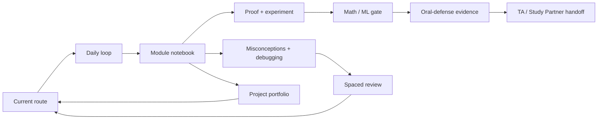

# Atlas manual learning record kit

Use this kit when a short record will help a future explanation, repair, retrieval, project decision, or coaching handoff. It is the **manual, learner-owned default workflow**. No portal-to-Notion connection exists, and the portal does not write, export, or track these records for you. A separately configured external Codex-to-Notion session-note workflow is described in [Live Codex learning workflow](LIVE_CODEX_LEARNING_WORKFLOW.md).

Create the pages below in any private system you control (including Notion), or keep them locally. Before copying anything outside the portal, apply this rule:

> I reviewed this minimal summary and choose to copy it manually.

Copy only what you chose to approve. Do not paste credentials, Notion IDs, raw oral-defense transcripts, private notes, or person-linked diagnostic answers into this repository. Prefer a one-line evidence pointer or a redacted summary over a transcript.

## The connected record system



The diagram is a reading aid, not a tracking system. In plain language: start with your route, make one learning loop, connect it to the module's main idea, record a repair or rigorous check when useful, then schedule a short retrieval and carry only the relevant summary into a conversation or project.

## How to use a template

1. Copy only the template you need.
2. Fill the smallest useful fields; leave out personal or sensitive details.
3. Link to an artifact you own, or write a short redacted evidence pointer.
4. Review the exact text. If you choose to use Notion, manually paste that approved summary yourself.

The suggested `→` links are conceptual handoffs, not required database relations. Keep the system lightweight.

## Templates

<!-- record-template: course-dashboard-current-route -->
### Course dashboard and current route

```text
Route plan: 60 / 90 / 180 day route
Current module:
Current session:
Next evidence to create:
Next review date:
Consent decision: keep local / manually copy approved summary
→ Daily learning log, module notebook, spaced-review queue
```

<!-- record-template: daily-learning-log -->
### Daily learning log

```text
Date:
Module and session:
Claim tested:
Evidence pointer (redacted if needed):
Confidence: low / medium / high
Repair or next step:
Next review date:
→ Current route, module notebook, spaced-review queue
```

<!-- record-template: module-notebook -->
### Module notebook

```text
Module:
Session:
First principle:
Prediction → reveal:
Code or design observation:
Counterexample or boundary:
Transfer task:
Evidence pointer:
Forward bridge:
→ Repair log, rigor notebook, math/ML gate, oral-defense evidence, portfolio, handoff
```

<!-- record-template: misconceptions-debugging-log -->
### Misconceptions and debugging log

```text
Misconception or bug:
Trigger or reproduction:
Repaired model:
Repair experiment:
Next retrieval date:
→ Module notebook, spaced-review queue, TA/Study Partner handoff
```

<!-- record-template: proof-derivation-counterexample-numerical-experiment-notebook -->
### Proof, derivation, counterexample, and numerical-experiment notebook

```text
Claim or theorem:
Assumptions:
Proof or derivation idea:
Counterexample or scope boundary:
Numerical experiment:
Result and limitation:
→ Math/ML mastery gate, oral-defense evidence, project portfolio
```

<!-- record-template: math-ml-mastery-gates -->
### Mathematics and ML mastery gates

```text
Module and gate:
Definition:
Assumptions:
Derivation or model:
Test or evidence:
Uncertainty:
Next gate:
→ Spaced-review queue, oral-defense evidence, project portfolio
```

<!-- record-template: spaced-review-queue -->
### Spaced-review queue

```text
Retrieval prompt:
Last attempt:
Outcome:
Repair:
Next due date:
→ Current route, daily log, module notebook
```

<!-- record-template: oral-defense-evidence -->
### Oral-defense evidence

```text
Module:
Claim rehearsed:
Evidence shown:
Hint or repair:
Transfer question:
Learner-approved summary (not a transcript):
Next question:
→ Module notebook, TA/Study Partner handoff, current route
```

<!-- record-template: projects-capstone-portfolio -->
### Projects and capstone portfolio

```text
Artifact:
Problem and stakeholder:
Design decision:
Evidence and test:
Known limitation:
Next falsifier or revision:
→ Current route, TA/Study Partner handoff
```

<!-- record-template: ta-study-partner-handoffs -->
### TA and Study Partner handoffs

```text
Role: TA / Study Partner
Learner question:
Learner-approved context:
Claim and evidence:
Repair or recommendation:
Next handoff:
→ Current route, module notebook, spaced-review queue
```

## What this does not do

This kit does not create a portal-owned Notion workspace, database, page, integration, or sync. It does not prove mastery, award credit, retain a learner history, or replace the module evidence and oral-defense conversation. It is a small, optional aid for connecting the evidence you choose to keep; a learner-authorized Codex chat may use the separate external workflow for concise session notes.
